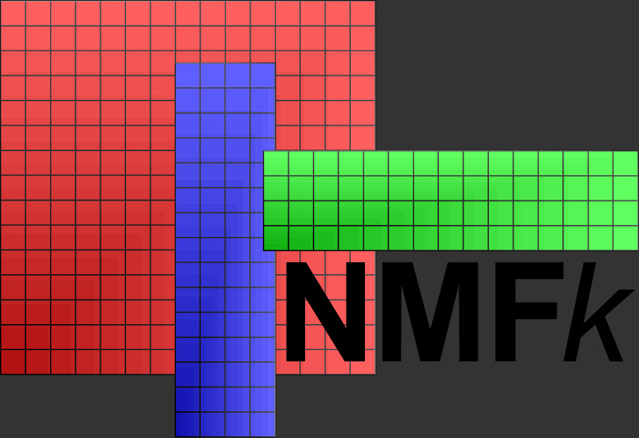
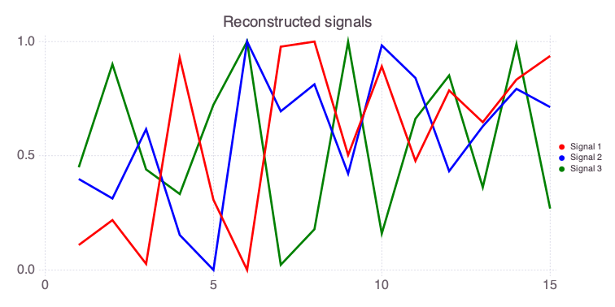
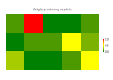
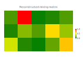

# NMFk: Nonnegative Matrix Factorization + k-means clustering and physics constraints

<div style="text-align: left;">
    
</div>

**NMFk** is a module of the **SmartTensors** ML framework ([smarttensors.com](https://smarttensors.com)).

<div style="text-align: left">
    
</div>

**NMFk** is a novel unsupervised machine learning methodology that allows for the automatic identification of the optimal number of features (signals/signatures) present in the data.

Classical **NMF** approaches do not allow for automatic estimation of the number of features.

**NMFk** estimates the number of features `k` through *k*-means clustering coupled with regularization constraints (sparsity, physical, mathematical, etc.).

**SmartTensors** can be applied to perform:
- Feature extraction (**FE**)
- Blind source separation (**BSS**)
- Detection of disruptions/anomalies
- Data gap discovery
- Data gap filling and reconstruction
- Image recognition
- Text mining
- Data classification
- Separation (deconstruction) of co-occurring (physics) processes
- Discovery of unknown dependencies and phenomena
- Development of reduced-order/surrogate models
- Identification of dependencies between model inputs and outputs
- Guiding the development of physics models representing the ML-analyzed data
- Blind predictions
- Optimization of data acquisition (optimal experimental design)
- Labeling of datasets for supervised ML analyses

**NMFk** provides high-performance computing capabilities to solve problems in parallel using Shared and Distributed Arrays.
The parallelization allows for the utilization of multi-core / multi-processor environments.
GPU and TPU accelerations are available through existing Julia packages.

**NMFk** provides advanced tools for data visualization, pre- and post-processing.
These tools substantially facilitate the utilization of the package in various real-world applications.

**NMFk** methodology and applications are discussed in the research papers and presentations listed below.

**NMFk** is demonstrated with a series of examples and test problems provided here.

## Awards

**SmartTensors** and **NMFk** were recently awarded:
* 2021 R&D100 Award: [Information Technologies (IT)](https://www.rdworldonline.com/2021-rd-100-award-winners-announced-in-analytical-test-and-it-electrical-categories)
* 2021 R&D100 Bronze Medal: [Market Disruptor in Services](https://www.rdworldonline.com/2021-rd-100-special-recognition-winners-announced)

<div style="text-align: left">
    
</div>

## Installation

After starting Julia, execute:

```julia
import Pkg
Pkg.add("NMFk")
```

to access the latest released version.

To utilize the latest code updates (commits), use:

```julia
import Pkg
Pkg.add(Pkg.PackageSpec(name="NMFk", rev="master"))
```

## Docker

```bash
docker run --interactive --tty montyvesselinov/tensors
```

The docker image provides access to all **SmartTensors** packages ([smarttensors.github.io](https://smarttensors.github.io)).

## Testing

```julia
import Pkg
Pkg.test("NMFk")
```

## Examples

A simple problem demonstrating **NMFk** can be executed as follows.
First, generate 3 random signals in a matrix `W`:

```julia
a = rand(15)
b = rand(15)
c = rand(15)
W = [a b c]
```

Then, mix the signals to produce a data matrix `X` of 5 sensors observing the mixed signals as follows:

```julia
X = [a+c*3 a*10+b b b*5+c a+b*2+c*5]
```

This is equivalent to generating a mixing matrix `H` and obtaining `X` by multiplying `W` and `H`

```julia
H = [1 10 0 0 1; 0 1 1 5 2; 3 0 0 1 5]
X = W * H
```

After that, execute **NMFk** to estimate the number of unknown mixed signals based only on the information in `X`.

```julia
import NMFk
We, He, fitquality, robustness, aic, kopt = NMFk.execute(X, 2:5; save=false, method=:simple);
```

The execution will produce output like this:

```
[ Info: Results
Signals:  2 Fit:       15.489 Silhouette:    0.9980145 AIC:    -38.30184
Signals:  3 Fit: 3.452203e-07 Silhouette:    0.8540085 AIC:    -1319.743
Signals:  4 Fit: 8.503988e-07 Silhouette:   -0.5775127 AIC:    -1212.129
Signals:  5 Fit: 2.598571e-05 Silhouette:   -0.6757581 AIC:    -915.6589
[ Info: Optimal solution: 3 signals
```

The code returns the estimated optimal number of signals `kopt`, which in this case, as expected, is equal to 3.

The code returns the `fitquality` and `robustness`; they can applied to represent how the solutions change with the increase of `k`:

```julia
NMFk.plot_signal_selecton(2:5, fitquality, robustness)
```

<div style="text-align: left">
    
</div>

The code also returns estimates of matrices `W` and `H`.

It can be easily verified that estimated `We[kopt]` and `He[kopt]` are scaled versions of the original `W` and `H` matrices.

Note that the order of columns ('signals') in `W` and  `We[kopt]` are not expected to match.
The order of rows ('sensors') in `H` and  `He[kopt]` are also not expected to match.
The estimated orders will be different every time the code is executed.

The matrices can be visualized using:

```julia
import Pkg; Pkg.add("Mads")
import Mads
Mads.plotseries([a b c])
Mads.plotseries(We[kopt] ./ maximum(We[kopt]))
```

<div style="text-align: left">
    
</div>

<div style="text-align: left">
    
</div>

```julia
NMFk.plotmatrix(H)
NMFk.plotmatrix(He[kopt] ./ maximum(He[kopt]))
```

<div style="text-align: left">
    
</div>

<div style="text-align: left">
    
</div>

More examples can be found in the `test`, `demo`, `examples`, and `notebooks` directories of the **NMFk** repository.

## Applications:

**NMFk** has been applied in a wide range of real-world applications.
The analyzed datasets include model outputs, experimental laboratory data, and field tests:

- Climate data and simulations
- Watershed data and simulations
- Aquifer simulations
- Surface-water and Groundwater analyses
- Material characterization
- Reactive mixing
- Molecular dynamics
- Contaminant transport
- Induced seismicity
- Phase separation of co-polymers
- Oil / Gas extraction from unconventional reservoirs
- Geothermal exploration and production
- Geologic carbon storage
- Wildfires

## Videos:

- Progress of nonnegative matrix factorization process:

<div style="text-align: left">
    
</div>

More videos are available at [YouTube](https://www.youtube.com/playlist?list=PLpVcrIWNlP22LfyIu5MSZ7WHp7q0MNjsj)

## Notebooks:

A series of Jupyter notebooks demonstrating **NMFk** have been developed:
* [Blind Source Separation](https://github.com/TensorDecompositions/NMFk.jl/blob/master/notebooks/blind_source_separation/blind_source_separation.ipynb)
* [Feature Extraction)](https://github.com/TensorDecompositions/NMFk.jl/blob/master/notebooks/feature_extraction/feature_extraction.ipynb)
* [Blind Prediction](https://github.com/TensorDecompositions/NMFk.jl/blob/master/notebooks/mapping_variables/mapping_variables.ipynb)
* [Unmixing concentration data](https://github.com/TensorDecompositions/NMFk.jl/blob/master/notebooks/unmixing_groudwater/unmixing_groudwater.ipynb)

The notebooks can also be accessed using:

```julia
NMFk.notebooks()
```

## Other Examples:

* [Machine Learning](https://madsjulia.github.io/Mads.jl/Examples/machine_learning/index.html)
* [Blind Source Separation (i.e. Feature Extraction)](https://madsjulia.github.io/Mads.jl/Examples/blind_source_separation/index.html)
* [Source Identification](https://madsjulia.github.io/Mads.jl/Examples/contaminant_source_identification/index.html)

## Patent:

Alexandrov, B.S., Vesselinov, V.V., Alexandrov, L.B., Stanev, V., Iliev, F.L., Source identification by non-negative matrix factorization combined with semi-supervised clustering, [US20180060758A1](https://patents.google.com/patent/US20180060758A1/en)

## Publications:

- Vesselinov, V.V., Mudunuru, M., Karra, S., O'Malley, D., Alexandrov, B.S., Unsupervised Machine Learning Based on Non-Negative Tensor Factorization for Analyzing Reactive-Mixing, 10.1016/j.jcp.2019.05.039, Journal of Computational Physics, 2019. [PDF](https://gitlab.com/monty/monty.gitlab.io/raw/master/papers/Vesselinov%20et%20al%202018%20Unsupervised%20Machine%20Learning%20Based%20on%20Non-Negative%20Tensor%20Factorization%20for%20Analyzing%20Reactive-Mixing.pdf)
- Vesselinov, V.V., Alexandrov, B.S., O'Malley, D., Nonnegative Tensor Factorization for Contaminant Source Identification, Journal of Contaminant Hydrology, 10.1016/j.jconhyd.2018.11.010, 2018. [PDF](https://gitlab.com/monty/monty.gitlab.io/raw/master/papers/Vesselinov%20et%20al%202018%20Nonnegative%20Tensor%20Factorization%20for%20Contaminant%20Source%20Identification.pdf)
- O'Malley, D., Vesselinov, V.V., Alexandrov, B.S., Alexandrov, L.B., Nonnegative/binary matrix factorization with a D-Wave quantum annealer, PlosOne, 10.1371/journal.pone.0206653, 2018. [PDF](https://gitlab.com/monty/monty.gitlab.io/raw/master/papers/OMalley%20et%20al%202017%20Nonnegative:binary%20matrix%20factorization%20with%20a%20D-Wave%20quantum%20annealer.pdf)
- Stanev, V., Vesselinov, V.V., Kusne, A.G., Antoszewski, G., Takeuchi, I., Alexandrov, B.A., Unsupervised Phase Mapping of X-ray Diffraction Data by Nonnegative Matrix Factorization Integrated with Custom Clustering, Nature Computational Materials, 10.1038/s41524-018-0099-2, 2018. [PDF](https://gitlab.com/monty/monty.gitlab.io/raw/master/papers/Stanev%20et%20al%202018%20Unsupervised%20phase%20mapping%20of%20X-ray%20diffraction%20data%20by%20nonnegative%20matrix%20factorization%20integrated%20with%20custom%20clustering.pdf)
- Iliev, F.L., Stanev, V.G., Vesselinov, V.V., Alexandrov, B.S., Nonnegative Matrix Factorization for identification of unknown number of sources emitting delayed signals PLoS ONE, 10.1371/journal.pone.0193974. 2018. [PDF](https://gitlab.com/monty/monty.gitlab.io/raw/master/papers/Iliev%20et%20al%202018%20Nonnegative%20Matrix%20Factorization%20for%20identification%20of%20unknown%20number%20of%20sources%20emitting%20delayed%20signals.pdf)
- Stanev, V.G., Iliev, F.L., Hansen, S.K., Vesselinov, V.V., Alexandrov, B.S., Identification of the release sources in advection-diffusion system by machine learning combined with Green function inverse method, Applied Mathematical Modelling, 10.1016/j.apm.2018.03.006, 2018. [PDF](https://gitlab.com/monty/monty.gitlab.io/raw/master/papers/Stanev%20et%20al%202018%20Identification%20of%20release%20sources%20in%20advection-diffusion%20system%20by%20machine%20learning%20combined%20with%20Green's%20function%20inverse%20method.pdf)
- Vesselinov, V.V., O'Malley, D., Alexandrov, B.S., Contaminant source identification using semi-supervised machine learning, Journal of Contaminant Hydrology, 10.1016/j.jconhyd.2017.11.002, 2017. [PDF](https://gitlab.com/monty/monty.gitlab.io/raw/master/papers/Vesselinov%202017%20Contaminant%20source%20identification%20using%20semi-supervised%20machine%20learning.pdf)
- Alexandrov, B., Vesselinov, V.V., Blind source separation for groundwater level analysis based on non-negative matrix factorization, Water Resources Research, 10.1002/2013WR015037, 2014. [PDF](https://gitlab.com/monty/monty.gitlab.io/raw/master/papers/Alexandrov%20&%20Vesselinov%202014%20Blind%20source%20separation%20for%20groundwater%20pressure%20analysis%20based%20on%20nonnegative%20matrix%20factorization.pdf)

Research papers are also available at [Google Scholar](http://scholar.google.com/citations?user=sIFHVvwAAAAJ&hl=en), [ResearchGate](https://www.researchgate.net/profile/Velimir_Vesselinov) and [Academia.edu](https://lanl.academia.edu/monty)

## Presentations:

- Vesselinov, V.V., Physics-Informed Machine Learning Methods for Data Analytics and Model Diagnostics, M3 NASA DRIVE Workshop, Los Alamos, 2019. [PDF](http://monty.gitlab.io/presentations/Vesselinov%202019%20Physics-Informed%20Machine%20Learning%20Methods%20for%20Data%20Analytics%20and%20Model%20Diagnostics.pdf)
- Vesselinov, V.V., Unsupervised Machine Learning Methods for Feature Extraction, New Mexico Big Data &amp; Analytics Summit, Albuquerque, 2019. [PDF](http://monty.gitlab.io/presentations/vesselinov%202019%20Unsupervised%20Machine%20Learning%20Methods%20for%20Feature%20Extraction%20LA-UR-19-21450.pdf)
- Vesselinov, V.V., Novel Unsupervised Machine Learning Methods for Data Analytics and Model Diagnostics, Machine Learning in Solid Earth Geoscience, Santa Fe, 2019. [PDF](http://monty.gitlab.io/presentations/Vesselinov%202019%20GeoScienceMLworkshop.pdf)
- Vesselinov, V.V., Novel Machine Learning Methods for Extraction of Features Characterizing Datasets and Models, AGU Fall meeting, Washington D.C., 2018. [PDF](http://monty.gitlab.io/presentations/Vesselinov%202018%20Novel%20Machine%20Learning%20Methods%20for%20Extraction%20of%20Features%20Characterizing%20Datasets%20and%20Models%20LA-UR-18-31366.pdf)
- Vesselinov, V.V., Novel Machine Learning Methods for Extraction of Features Characterizing Complex Datasets and Models, Recent Advances in Machine Learning and Computational Methods for Geoscience, Institute for Mathematics and its Applications, University of Minnesota, 10.13140/RG.2.2.16024.03848, 2018. [PDF](http://monty.gitlab.io/presentations/Vesselinov%202018%20Novel%20Machine%20Learning%20Methods%20for%20Extraction%20of%20Features%20Characterizing%20Complex%20Datasets%20and%20Models%20LA-UR-18-30987.pdf)
- Vesselinov, V.V., Mudunuru. M., Karra, S., O'Malley, D., Alexandrov, Unsupervised Machine Learning Based on Non-negative Tensor Factorization for Analysis of Filed Data and Simulation Outputs, Computational Methods in Water Resources (CMWR), Saint-Malo, France, 10.13140/RG.2.2.27777.92005, 2018. [PDF](http://monty.gitlab.io/presentations/vesselinov%20et%20al%202018%20Unsupervised%20Machine%20Learning%20Based%20on%20Non-negative%20Tensor%20Factorization%20for%20Analysis%20of%20Filed%20Data%20and%20Simulation%20Outputs%20cmwr-ML-20180606.pdf)
- O'Malley, D., Vesselinov, V.V., Alexandrov, B.S., Alexandrov, L.B., Nonnegative/binary matrix factorization with a D-Wave quantum annealer [PDF](http://monty.gitlab.io/presentations/OMalley%20et%20al%202017%20Nonnegative%20binary%20matrix%20factorization%20with%20a%20D-Wave%20quantum%20annealer.pdf)
- Vesselinov, V.V., Alexandrov, B.A, Model-free Source Identification, AGU Fall Meeting, San Francisco, CA, 2014. [PDF](http://monty.gitlab.io/presentations/vesselinov%20bss-agu2014-LA-UR-14-29163.pdf)

Presentations are also available at [slideshare.net](https://www.slideshare.net/VelimirmontyVesselin), [ResearchGate](https://www.researchgate.net/profile/Velimir_Vesselinov) and [Academia.edu](https://lanl.academia.edu/monty)

## Extra information

For more information, visit [monty.gitlab.io](http://monty.gitlab.io), [http://smarttensors.com](http://smarttensors.com) [smarttensors.github.io],(https://smarttensors.github.io), and [tensors.lanl.gov](http://tensors.lanl.gov).
