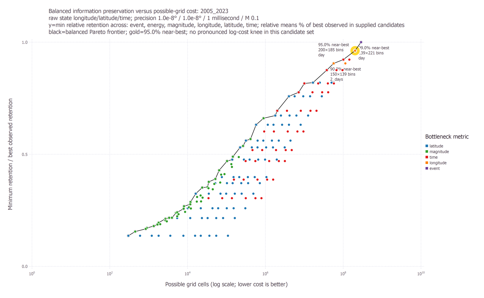
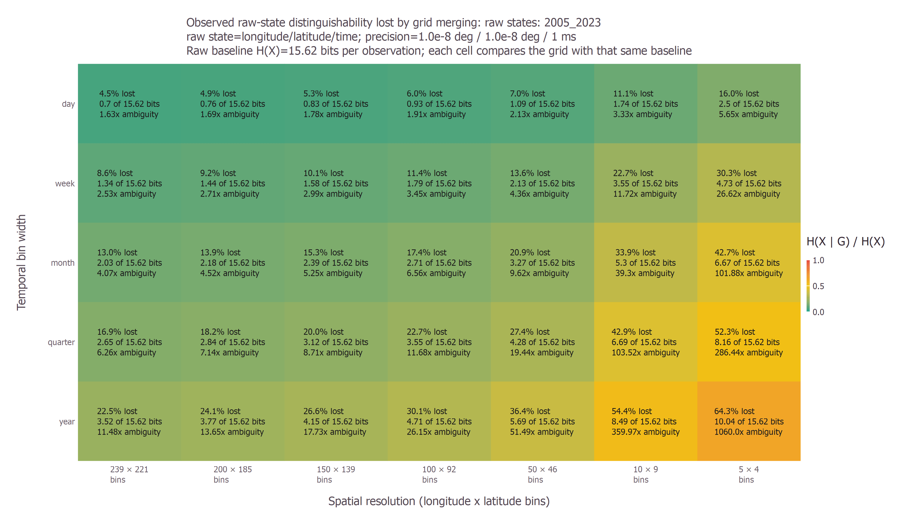
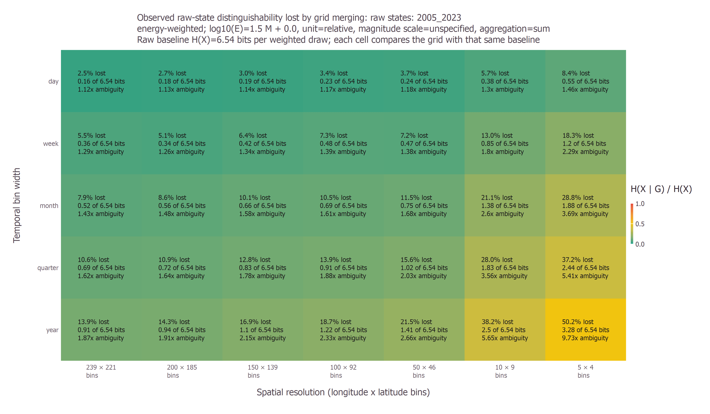
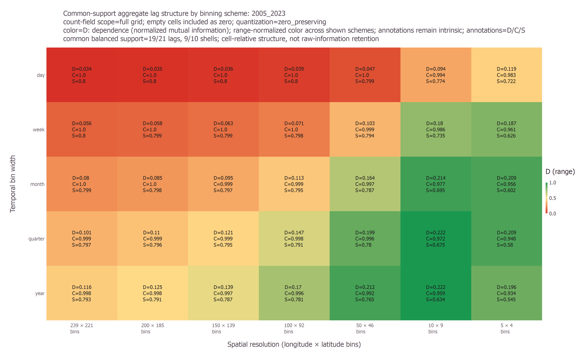
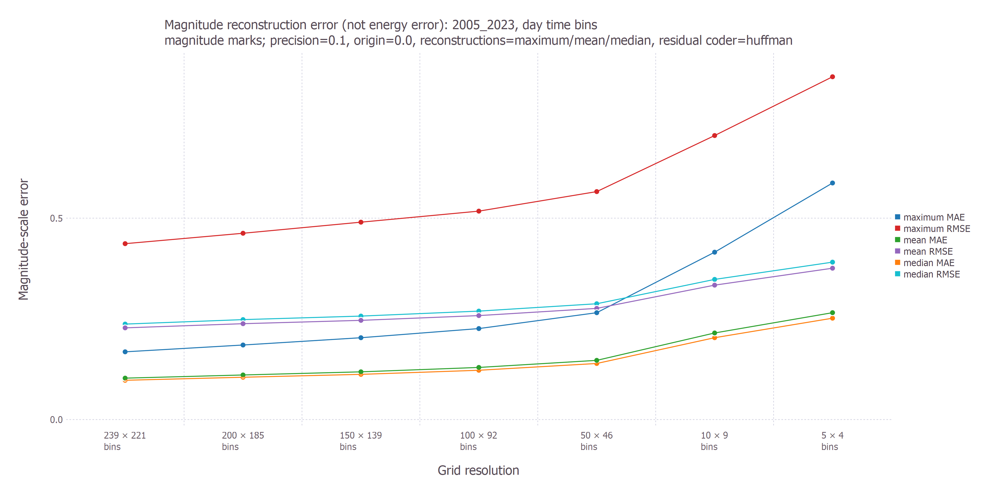
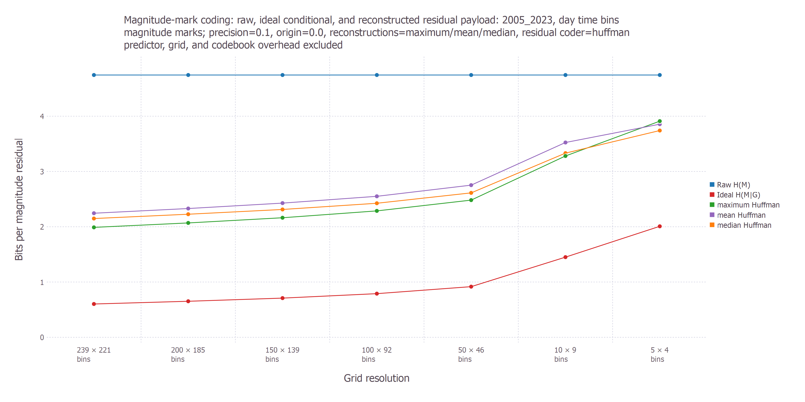

# Information-Preserving Tensor Discretization

## Structure-aware metrics, raw-to-grid information loss, and multiobjective binning selection

**Working research manuscript — 21 July 2026**

### Abstract

Discretizing irregular observations into a tensor makes large data sets easier to visualize, factorize, compare, and model, but every spatial or temporal bin can merge distinguishable observations. The resulting information loss is not captured by tensor size, occupancy, or flattened entropy alone. We developed a general information-theoretic framework in NMFk for measuring this loss and for selecting a binning scheme that balances fidelity against computational cost. The framework separates six questions: how additive mass is distributed over tensor cells; how much raw event identity a grid preserves; how well it preserves weighted quantities such as event energy; how much within-cell magnitude variation is hidden by aggregation; how accurately cell-level predictors reconstruct individual magnitudes; and how much spatial, temporal, and space-time dependence remains in the gridded field. Structure-aware measures include quantized cell entropy, mutual information at arbitrary multidimensional lags, variation-based coherence, spectral entropy, and lossless entropy coding of prediction residuals. Raw-to-grid comparisons use mutual information and conditional entropy, while a multiobjective optimizer searches Pareto-efficient grids and near-best compromises.

The framework was evaluated on a 2005–2023 Oklahoma earthquake-catalog product containing 50,337 selected events. The evaluation compared 176 longitude-latitude-time schemes. Event-only 90% retention selected a relatively inexpensive $15\times13$ daily grid, but its balanced score was only 0.398 because longitude and latitude information were poorly preserved. Requiring every metric to reach approximately 95% of its best observed value selected a $200\times185$ daily grid. This scheme used 70.05% of the finest-grid cell count, achieved a balanced score of 0.962, preserved 95.13% of raw event-state information, preserved 97.28% of energy-localization information, and retained 86.26% of magnitude-location dependence. No pronounced knee was found on the balanced cost-retention frontier, so the results support a family of policy-dependent compromises rather than one universal optimum. A downstream machine-learning protocol is proposed to test resolution-dependent predictive utility on common held-out targets, but that experiment has not yet been run. The approach is domain-independent: the earthquake catalog provides a marked spatiotemporal case study, while the definitions apply to any irregular observations converted to a tensor.

**Keywords:** information theory; tensor discretization; coarse graining; spatial dependence; temporal prediction; residual coding; entropy; mutual information; Pareto optimization; machine-learning validation; earthquake catalog

## 1. Introduction

Many scientific workflows begin with irregular observations and end with a regular tensor. A record with coordinates, time, and one or more measured attributes is assigned to a spatial-temporal cell; records in the same cell are then counted, summed, averaged, maximized, or otherwise aggregated. The tensor is convenient, but it is not a neutral representation. Coarse cells merge events, erase within-cell ordering, and replace a distribution of marks with one or a few summaries. Very fine cells retain more detail but produce sparse, expensive tensors and may preserve measurement precision that has little scientific value.

The practical question is therefore not simply “which tensor has the most entropy?” It is:

> Which binning scheme preserves the information needed for the analysis while keeping the tensor computationally tractable?

This question requires several distinct notions of information. A flattened entropy describes the distribution of additive mass among tensor cells, but it does not reveal how many raw observations became indistinguishable. A spatial-dependence score describes relationships between neighboring cells, but it does not measure raw-data retention. A magnitude reconstruction error has direct physical meaning, but it is not interchangeable with entropy. A useful evaluation must retain these distinctions and then expose their trade-offs.

The present work makes five contributions.

1. It provides structure-aware tensor measures that retain spatial, temporal, and multidimensional lag relationships rather than flattening the tensor immediately.
2. It defines raw-to-grid information retention directly through mutual information, including event-weighted and energy-weighted forms.
3. It treats magnitude aggregation as a separate marked-data problem, with within-cell entropy, reconstruction error, and residual coding costs.
4. It selects candidate grids through Pareto analysis and a conservative balanced objective instead of optimizing one attractive but incomplete metric.
5. It specifies a leakage-resistant downstream machine-learning experiment for testing whether resolutions that retain more measured information also support better out-of-sample prediction.

The prediction-residual component is inspired by lossless video compression: predictable differences can require fewer bits than independently encoded frames [3,4]. The current implementation deliberately stops at first-order predictive entropy coding. It does not claim to implement motion compensation, block transforms, a container format, or a complete production codec.

Figure 1 summarizes the complementary analyses and identifies which measures currently enter cross-grid selection.

![Figure 1. Universal workflow for information-preserving discretization. Raw-to-grid and marked-data measures quantify distinctions lost by binning, while tensor-structure measures describe organization after binning. Only the six cross-grid-comparable retained-information fractions—event, energy localization, magnitude-location, longitude, latitude, and time—enter the current optimizer. Reconstruction, lag, coding, and spectral measures remain reported diagnostics. Precision, candidate set, and policy are explicit, so the output is an auditable trade-off family rather than a universal optimum.](figures/tensor_information_research_paper/tensor_information_framework_summary.png)

## 2. Methodology

### 2.1 Observations, grids, and additive tensors

Let record $i$ have longitude $x_i$, latitude $y_i$, time $t_i$, and mark $m_i$. Depth $z_i$ may also be present, although the current Oklahoma evaluation uses a three-dimensional longitude-latitude-time grid. A binning scheme $s$ maps each selected record to a grid label

$$
G_{s,i}=g_s(x_i,y_i,t_i).
$$

Two additive tensors are central to the case study. The count tensor is

$$
C_{s,g}=\sum_i \mathbf{1}(G_{s,i}=g),
$$

and the relative-energy tensor is

$$
E_{s,g}=\sum_i 10^{a m_i+b}\mathbf{1}(G_{s,i}=g).
$$

The default configuration uses $a=1.5$ and $b=0$. It is a unitless relative-energy proxy because the loaded catalogs do not identify one homogeneous magnitude scale. The proportional relation reflects the commonly used logarithmic magnitude-energy scaling, but an absolute physical-energy interpretation requires a confirmed magnitude definition and a corresponding calibrated intercept [5,6].

### 2.2 Flattened cell-mass entropy

For valid nonnegative cell values $v_j$, define normalized cell mass

$$
p_j=\frac{v_j}{\sum_k v_k}.
$$

The flattened cell-mass entropy is

$$
H_{\mathrm{cell}}=-\sum_{j:p_j>0}p_j\log_2p_j.
$$

With $N$ valid cells, the maximum is $H_{\max}=\log_2N$. The implementation reports normalized entropy $H_{\mathrm{cell}}/H_{\max}$, effective cell count $2^{H_{\mathrm{cell}}}$, effective-cell fraction $2^{H_{\mathrm{cell}}}/N$, occupancy, and divergence from a uniform mass distribution. These quantities describe where additive mass is concentrated. They do **not** measure whether individual raw observations can be recovered from the grid.

### 2.3 Quantized tensor-value information

Structure analysis first converts valid tensor values to symbols $Q(\mathbf{i})\in\{1,\ldots,B\}$. Linear quantization spans the observed value range. Zero-preserving quantization reserves one symbol for an exact zero and assigns positive values to the remaining symbols; this is important for sparse count tensors because empty and low-count cells should not become the same state.

The symbol entropy is

$$
H(Q)=-\sum_q p(q)\log_2p(q).
$$

Unlike cell-mass entropy, each valid tensor cell contributes one symbol observation. Thus $H(Q)$ measures diversity of cell values, while $H_{\mathrm{cell}}$ measures the spatial distribution of additive mass.

### 2.4 Information at multidimensional lags

For a lag vector $\boldsymbol{\delta}$, define all valid endpoint pairs

$$
X_k=Q(\mathbf{i}_k),\qquad
Y_k=Q(\mathbf{i}_k+\boldsymbol{\delta}),\qquad
R_k=Y_k-X_k.
$$

The lag mutual information is

$$
I_{\boldsymbol{\delta}}=H(X)+H(Y)-H(X,Y),
$$

and the conditional entropy is

$$
H(Y\mid X)=H(X,Y)-H(X).
$$

The normalized dependence used in the figures is

$$
D_{\boldsymbol{\delta}}=
\frac{I_{\boldsymbol{\delta}}}{\max\{H(X),H(Y)\}},
$$

with $D_{\boldsymbol{\delta}}=0$ when both marginal entropies are zero. “Spatial dependence” is the appropriate aggregate of $D_{\boldsymbol{\delta}}$ over horizontal lags. “Temporal dependence” is the corresponding aggregate over temporal lags. Both are dimensionless and lie between zero and one under the implemented normalization.

The normalized mean absolute symbol variation is

$$
V_{\boldsymbol{\delta}}=
\frac{1}{N_{\boldsymbol{\delta}}(B-1)}
\sum_{k=1}^{N_{\boldsymbol{\delta}}}|Y_k-X_k|,
$$

and spatial coherence is

$$
C_{\boldsymbol{\delta}}=1-V_{\boldsymbol{\delta}}.
$$

Coherence measures the similarity of neighboring quantized values, not mutual information. A sparse field with many zero-zero pairs can have very high coherence even when its nonzero events are weakly related.

The recommended Oklahoma configuration contains 21 lags in internal latitude-longitude-time order:

- latitude and longitude distances of 1, 2, and 4 cells;
- both signed spatial diagonals at distances 1 and 2 cells;
- temporal distances of 1, 2, and 4 bins;
- all eight signed horizontal axial or diagonal directions paired with one forward-time step.

Directions are organized into sign-invariant shells. A metric is averaged equally across directions within a shell and then equally across complete shells within a family. This prevents a surviving longitude direction from substituting for a missing latitude direction at a small grid size. It also avoids over-weighting a shell merely because it contains more directions. These cell-relative lag summaries are diagnostics; they are excluded from the binning optimizer because one cell has a different physical size under each candidate grid.

### 2.5 Entropy coding of prediction residuals

For $N_{\boldsymbol{\delta}}$ residuals and a coded payload of $L_{\mathrm{coded}}$ bits, bits per residual is

$$
b_{\mathrm{coded},\boldsymbol{\delta}}
=\frac{L_{\mathrm{coded}}}{N_{\boldsymbol{\delta}}}.
$$

With $B$ quantization symbols, a difference can take $2B-1$ values. Its fixed-width reference cost is

$$
b_{\mathrm{fixed}}=\left\lceil\log_2(2B-1)\right\rceil,\qquad
L_{\mathrm{fixed}}=N_{\boldsymbol{\delta}}b_{\mathrm{fixed}}.
$$

The Shannon model uses $L_{\mathrm{coded}}=N_{\boldsymbol{\delta}}H(R)$. The Huffman model uses

$$
L_{\mathrm{coded}}=\sum_r n_r\ell_r,
$$

where $n_r$ is the residual frequency and $\ell_r$ is its code length. Residual coding savings is

$$
S_{\mathrm{coding}}=
1-\frac{L_{\mathrm{coded}}}{L_{\mathrm{fixed}}},
$$

clamped to $[0,1]$ when a nonzero fixed-width payload exists. Pooled lag results compare hypothetical overlapping predictor streams; they are not the size of a single encoded tensor file. Grid geometry, codebooks, headers, predictor tables, and container overhead are excluded.

### 2.6 Spectral structure

For tensor unfolding $T_{(d)}$ along mode $d$, let $\sigma_j$ denote its singular values and define

$$
p_j=\frac{\sigma_j^2}{\sum_k\sigma_k^2}.
$$

Spectral entropy and effective rank are

$$
H_{\sigma,d}=-\sum_jp_j\log_2p_j,\qquad
r_{\mathrm{eff},d}=2^{H_{\sigma,d}}.
$$

The implementation also reports normalized spectral entropy and spectral compactness. This option detects low-rank organization not captured by local lags, but it is disabled for large production tensors when dense singular-value decomposition would dominate run time.

### 2.7 Raw-data information

Raw information requires an explicit observational precision. For numeric feature $j$, origin $o_j$, and precision $\Delta_j$,

$$
Q_j(u)=\left\lfloor\frac{u-o_j}{\Delta_j}\right\rfloor.
$$

The joint raw state of record $i$ is

$$
X_i=\left(Q_1(x_i),Q_2(y_i),Q_3(t_i),\ldots\right).
$$

For nonnegative record weights $w_i$,

$$
p_X(x)=
\frac{\sum_iw_i\mathbf{1}(X_i=x)}
{\sum_iw_i},
\qquad
H(X)=-\sum_xp_X(x)\log_2p_X(x).
$$

The Oklahoma event baseline uses longitude and latitude precision $10^{-8}$ degrees, time precision 1 ms, numeric origin zero, and a Unix-epoch time origin. The magnitude precision is 0.1 for the separate marked-data analysis. Under these settings every selected longitude-latitude-time state is unique. Consequently, event entropy is an identity-like measure of observed-record distinguishability, not a statement that the catalog is accurate to $10^{-8}$ degrees or 1 ms.

### 2.8 Raw-to-grid information loss

For paired raw states $X$ and grid labels $G$,

$$
I(X;G)=H(X)+H(G)-H(X,G),
$$

$$
H(X\mid G)=H(X,G)-H(G).
$$

The retained and lost fractions are

$$
R_{\mathrm{retained}}=\frac{I(X;G)}{H(X)},\qquad
R_{\mathrm{lost}}=\frac{H(X\mid G)}{H(X)}.
$$

Their sum is one when $H(X)>0$. The effective number of raw states left ambiguous after observing a grid cell is

$$
A_{\mathrm{effective}}=2^{H(X\mid G)}.
$$

This construction directly measures event-merging loss. Repeating it with energy weights measures how much information about the **location of additive energy** is lost. It does not measure entropy of energy amplitudes.

The optimizer also uses marginal retained fractions for longitude, latitude, and time. These reveal which dimensions create collisions even when the joint event score remains attractive.

### 2.9 Magnitude aggregation and reconstruction

Magnitudes are treated as marks rather than folded into the raw location-time state. With magnitude precision $\Delta_M$ and origin $M_0$,

$$
Q_{M,i}=\left\lfloor\frac{m_i-M_0}{\Delta_M}\right\rfloor.
$$

Within-cell magnitude heterogeneity is

$$
H(Q_M\mid G)=
\sum_g\frac{n_g}{N}H(Q_M\mid G=g).
$$

Magnitude-location mutual information and its normalized fractions are

$$
I(Q_M;G)=H(Q_M)-H(Q_M\mid G),
$$

$$
R_M=\frac{I(Q_M;G)}{H(Q_M)},\qquad
L_M=\frac{H(Q_M\mid G)}{H(Q_M)}.
$$

Here $R_M$ is magnitude-location dependence and $L_M$ is aggregation loss. These are not physical reconstruction scores.

For a cell summary $s\in\{\mathrm{maximum},\mathrm{mean},\mathrm{median}\}$,

$$
e_i^{(s)}=m_i-\widehat m_{G_i}^{(s)}.
$$

The implementation reports

$$
\mathrm{MAE}_s=\frac{1}{N}\sum_i|e_i^{(s)}|,
$$

$$
\mathrm{RMSE}_s=
\sqrt{\frac{1}{N}\sum_i\left(e_i^{(s)}\right)^2},
\qquad
\mathrm{bias}_s=\frac{1}{N}\sum_ie_i^{(s)}.
$$

It also codes exact integer residuals $Q_{M,i}-\widehat Q_{M,G_i}^{(s)}$ using Shannon or Huffman models. Sparse per-cell magnitude histograms are retained, but the checkpoint does not preserve the original pairing between every mark and its exact event location, time, or order.

### 2.10 Multiobjective binning selection

For scheme $s$, computational cost is represented by the number of possible grid cells,

$$
C_s=\prod_dn_{s,d}.
$$

Let $R_{s,k}$ be one of the six retained-information metrics: event, energy localization, magnitude-location dependence, longitude, latitude, or time. The metric is normalized to the best candidate supplied in the search:

$$
\widetilde R_{s,k}=
\frac{R_{s,k}}{\max_jR_{j,k}}.
$$

The conservative balanced score is

$$
B_s=\min_{k\in K}\widetilde R_{s,k}.
$$

Thus “balanced 95%” means that every included metric reaches at least approximately 95% of that metric’s **best observed candidate value**. It does not mean every absolute retained fraction is 0.95.

The optimizer returns cost-retention Pareto frontiers, absolute event-retention targets, balanced near-best policies, budget-constrained choices, full multiobjective non-dominance, and an exploratory knee. On the normalized log-cost versus balanced-retention frontier, the knee score is the perpendicular distance above the diagonal. A knee is called pronounced only when this score is at least 0.05.

### 2.11 Proposed downstream machine-learning validation

The information measures establish what each discretization retains under explicit definitions, but they do not establish whether the retained information is useful for a particular predictive task. We therefore propose a downstream validation experiment. **This experiment has not yet been run, and no machine-learning result is reported in Section 3.** Its purpose is to compare predictive utility under different tensor sizes without allowing the definition of the prediction target to change with the input resolution.

#### Common targets and leakage-resistant splits

Every candidate scheme $s$ should predict the same held-out object. Two complementary target definitions are appropriate:

1. **Raw-event target.** Predict a probability intensity over continuous longitude, latitude, time, and optional marks, then score the held-out raw events directly.
2. **Fixed fine-grid target.** Choose one scientifically defensible reference grid before fitting any model. Every coarse input tensor must predict counts, energy, occurrence, or magnitude distributions on that same reference grid.

Scoring a model only on its own input grid would make coarse models solve an easier target and would confound resolution with task definition. Reconstructing the tensor used as input is also insufficient because it can reward compression without testing future information. The primary task should instead be future occurrence and count prediction, with energy localization and magnitude-distribution prediction as marked-data extensions.

A secondary same-window coarse-to-fine experiment can isolate representational loss from forecasting difficulty. It should mask a predeclared subset of raw events or fixed-reference cells, construct each candidate tensor from the remaining observations, and reconstruct the same held-out raw-event or fine-grid target. This is a useful super-resolution diagnostic, but it remains secondary to future prediction and must not be replaced by reconstruction of each scheme's own grid.

Splits should be rolling-origin and blocked in time, with optional spatial blocks held out inside each test window. Random event-level splits are excluded because nearby space-time observations can leak dependence across training and test sets [7]. All resolutions must use the same physical training dates, lookback duration, forecast horizon, validation windows, test windows, spatial extent, and exogenous covariates. For example, every model could receive the preceding 365 days and predict the next 7 days, even though the number of tensor slices representing that history differs across temporal bin widths.

For a raw-event test window $T$ and spatial domain $\Omega$, a model fitted from scheme $s$ can be compared by its negative point-process log likelihood,

$$
\mathcal{L}^{\mathrm{pp}}_s=
-\sum_{i:t_i\in T}\log \lambda_s(\mathbf{u}_i,t_i\mid\mathcal{H}_{t_i})
+\int_T\int_{\Omega}\lambda_s(\mathbf{u},t\mid\mathcal{H}_t)\,d\mathbf{u}\,dt,
$$

where $\mathbf{u}$ is location, $\mathcal{H}_t$ is the observation history, and $\lambda_s$ is a predictive conditional intensity. A marked version adds $-\sum_i\log p_s(m_i\mid\mathbf{u}_i,t_i,\mathcal{H}_{t_i})$. This common raw-event score avoids assigning a different target grid to each candidate. Neural Hawkes models provide one possible unbinned reference model, but not a guaranteed upper bound [10].

For a common fine-grid target $Y^{(f)}$, the corresponding average negative log score is

$$
\mathcal{L}^{\mathrm{grid}}_s=
-\frac{1}{|\mathcal{T}|}
\sum_{t\in\mathcal{T}}
\log p_{\theta_s}\!\left(Y^{(f)}_{t+h}\mid\mathcal{H}_{s,t}\right),
$$

where $h$ is the common physical forecast horizon and $\mathcal{H}_{s,t}$ is the history represented at resolution $s$. Log scores, Brier scores for occurrence, and distributional scores such as the continuous ranked probability score are proper scoring rules and should be primary probabilistic criteria [8]. Poisson or negative-binomial deviance is appropriate for counts; calibration curves must accompany it. Area under the precision-recall curve is a useful secondary sparse-event discrimination measure, while MAE, RMSE, spatial displacement, and energy error provide physical interpretation.

#### Model ladder and fair comparison

Each resolution should be evaluated through the same progressively richer model ladder:

1. historical climatology, persistence, and seasonal baselines;
2. a two-part hurdle model that predicts occurrence and then positive count, using Poisson or negative-binomial likelihoods as appropriate;
3. a low-rank nonnegative tensor factorization forecast with ranks selected under matched parameter-count or description-length budgets;
4. a compact ConvLSTM or closely related spatiotemporal network with matched parameter count and training budget across resolutions [9];
5. an unbinned Hawkes or neural point-process reference evaluated on the same raw-event windows [10].

The comparison must hold model capacity and optimization opportunity fixed: the same parameter-count or description-length band, number of tuning trials, maximum epochs, early-stopping rule, random seeds, and compute budget should apply to every grid. A fixed factorization rank is not a fixed-capacity control because an NTF model's parameter count grows approximately as $r(n_{\mathrm{lon}}+n_{\mathrm{lat}}+n_{\mathrm{time}})$ for rank $r$. If a resolution-scaled-capacity experiment is scientifically useful, it should be reported separately rather than mixed with the fixed-capacity result. Zero inflation should be addressed explicitly by the hurdle stage instead of allowing an all-zero predictor to look competitive.

For each rolling fold, losses should be paired across resolutions and summarized with block-bootstrap intervals. A practical selection rule is the cheapest grid within one standard error of the best mean held-out loss, subject to predeclared information-retention and calibration constraints:

$$
s^{\star}=\arg\min_{s\in\mathcal{S}} C_s
\quad \mathrm{subject\ to}\quad
\overline{\mathcal{L}}_s
\leq
\overline{\mathcal{L}}_{\min}+\mathrm{SE}_{\min}.
$$

The final decision display should therefore show three axes: possible-grid or measured computational cost, current information-retention metrics, and held-out predictive loss. Predictive success would demonstrate task-relevant utility, not total information retention. A coarse grid can predict better by suppressing noise while still discarding raw distinctions, and no finite collection of machine-learning tasks can prove that all scientifically relevant information has been preserved.

### 2.12 Case-study data and candidate schemes

One cached Oklahoma Geological Survey catalog product with a nominal 2005–2023 filename was analyzed. The selected records begin in 2009 after the analysis mask is applied.

| Quantity | 2005–2023 product |
|---|---:|
| Source records | 50,606 |
| Selected records | 50,337 (99.47%) |
| Selected time span | 2009-01-28 to 2023-12-31 |
| Longitude range | $-99.94093$ to $-94.73992$ |
| Latitude range | $33.16514$ to $37.98866$ |
| Magnitude range | 0.1 to 5.8 |
| Candidate grids | 176 |
| Possible-cell range | 300 to 287,916,369 |

The search paired 16 longitude counts with aspect-ratio-consistent latitude counts and crossed them with 11 temporal widths: year, 6 months, quarter, 2 months, month, 2 weeks, week, 5 days, 3 days, 2 days, and day. Longitude counts ranged from 5 to 239; the maximum latitude count was 221.

### 2.13 Persistence and software validation

The Oklahoma analysis checkpoints raw, grid, magnitude, energy, and optional lag results to JLD2. The default $\mathrm{resume}=\mathrm{true}$ reuses a version-4 checkpoint only when the selected-input fingerprint and analysis configuration match. Completed checkpoints can regenerate figures without recomputing the analysis; incomplete compatible checkpoints resume at the first missing spatial configuration. Lag-enabled runs use a distinct filename so a non-lag cache cannot be mistaken for a lag analysis.

The focused Julia 1.11 test suite currently passes 418 of 418 tests: 20 structure tests, 168 multidimensional-lag and optimizer tests, 102 magnitude-aggregation tests, 48 raw-data tests, 72 raw-grid tests, and 8 validation/masking tests. These establish software identities and synthetic edge-case behavior; they are not a substitute for statistical validation on independent observations.

## 3. Results

### 3.1 Raw baselines

The selected catalog produced singleton raw longitude-latitude-time states at the configured precision.

| Data set | Event entropy, bits | Raw states | Energy-weighted entropy, bits | Magnitude entropy, bits |
|---|---:|---:|---:|---:|
| 2005–2023 | 15.6193 | 50,337 | 6.5400 | 4.7452 |

The equality between raw-state count and event count makes the event baseline easy to interpret: each collision induced by a grid is a loss of observed-record distinguishability. It also makes the result sensitive to the deliberately fine raw precision.

### 3.2 Event-only selection can hide dimensional loss

The least-cost grids meeting absolute event-retention targets were:

| Event target | Selected scheme | Possible cells | Actual event retention | Balanced score |
|---:|---|---:|---:|---:|
| 80% | $6\times5$, 2 days | 81,780 | 0.8152 | 0.2154 |
| 90% | $15\times13$, day | 1,062,945 | 0.9030 | 0.3982 |
| 95% | $200\times185$, day | 201,687,000 | 0.9513 | 0.9620 |

The $15\times13$ daily scheme met the 90% event target at low possible-grid cost. However, its balanced score of 0.3982 shows that event retention alone masks severe loss in at least one other metric, chiefly longitude and latitude.

### 3.3 Balanced cost-retention trade-offs

The balanced near-best policies were:

| Policy | Selected scheme | Possible cells | $B_s$ |
|---:|---|---:|---:|
| 90% | $150\times139$, 2 days | 56,837,100 | 0.9053 |
| 95% | $200\times185$, day | 201,687,000 | 0.9620 |
| 99% | $239\times221$, day | 287,916,369 | 1.0000 |

The corresponding absolute retained-information fractions were:

| Policy | Event | Energy | Magnitude | Longitude | Latitude | Time |
|---:|---:|---:|---:|---:|---:|---:|
| 90% | 0.9319 | 0.9625 | 0.8118 | 0.4181 | 0.4077 | 0.6977 |
| 95% | 0.9513 | 0.9728 | 0.8626 | 0.4443 | 0.4338 | 0.7566 |
| 99% | 0.9551 | 0.9749 | 0.8730 | 0.4619 | 0.4502 | 0.7566 |

Absolute spatial marginal retention remains below 0.47 because it is measured against an extremely fine raw coordinate baseline. The candidate-relative balanced score is therefore useful for selecting a competitive compromise, but it must be reported beside these absolute retained fractions.

Figure 2 condenses the 2005–2023 policy trade-off while preserving the distinction between absolute retention, the candidate-relative balanced score, and unnormalized possible-grid cost.

![Figure 2. Comparison of representative 2005–2023 grid-selection policies. Heatmap colors and annotations report absolute retained-information fractions on one fixed 0–100% scale; no metric-specific or range normalization is applied. The separated balanced-score column reports the candidate-relative selection score. “Balanced 90%” and “Balanced 95%” name the relative-to-best rule that selected the row, not the plotted absolute values. The aligned log-scale panel reports possible grid cells, not measured runtime or memory. The event-only 90% scheme retains about 90% of event-state information but only about 20% and 18% of longitude and latitude information; the balanced 95% scheme raises spatial marginal retention to about 44% and 43% at substantially greater cost.](figures/tensor_information_research_paper/oklahoma_policy_summary.png)

The balanced 90% policy used 19.74% of the finest-grid cost, and the balanced 95% policy used 70.05%. Moving from balanced 90% to balanced 95% multiplied possible-cell cost by 3.55. Moving from balanced 95% to the finest 99% policy added another factor of about 1.43. This makes the balanced 95% policy a high-fidelity choice, but not a uniquely optimal one.

The exploratory balanced knee was $100\times92$ with 5-day bins. Its score, 0.0216, was below the 0.05 prominence threshold, so no pronounced balanced knee was detected. By contrast, the event-only curve had a pronounced but misleadingly coarse knee at a $6\times5$ daily grid. The full six-objective comparison classified all 176 candidates as non-dominated, which further demonstrates the absence of a universal winner without a policy preference.

### 3.4 Direct answers to raw-to-grid information loss

The raw-to-grid heatmap makes the principal question visually explicit: each cell reports fraction lost, conditional bits lost, and effective ambiguity.

At $200\times185$ daily resolution, event retention was 0.9513. The corresponding loss was 0.0487, or approximately 0.760 conditional bits per event-state observation. The effective ambiguity was therefore about $2^{0.760}=1.69$ raw states per known grid cell.

Energy-weighted results were systematically more favorable:

At $200\times185$ daily resolution, energy-localization retention was 0.9728, corresponding to about 0.178 conditional bits and an effective ambiguity of about 1.13 energy-weighted states. The comparison shows why the retained quantity must be named: a grid can lose more event identity than energy localization because a small number of larger events dominate the energy-weighted distribution.

### 3.5 Direction-balanced lag structure

For the $200\times185$ daily 2005–2023 count tensor, all 21 requested lags and all 10 direction-balanced shells were applicable. The aggregate metrics were:

| Quantity | Value |
|---|---:|
| Equal-family dependence | 0.0341 |
| Spatial dependence | 0.0102 |
| Temporal dependence | 0.0762 |
| Space-time dependence | 0.0159 |
| Coherence | 0.99998 |
| Residual coding savings | 0.7999 |
| Pooled coded bits per residual | 1.0006 |

The temporal dependence exceeded the spatial and space-time dependence, but every dependence value was modest. The near-unity coherence and approximately 80% residual coding savings do not contradict this. They are dominated by predictable zero-to-zero transitions in the full sparse tensor. These lag metrics describe the structure of the **gridded field** and must not be interpreted as raw-event retention.

### 3.6 Magnitude aggregation and reconstruction

At the $200\times185$ daily scheme, magnitude entropy was 4.7452 bits and within-cell conditional magnitude entropy was 0.6520 bits. Magnitude-location dependence was 0.8626, while the complementary within-cell heterogeneity fraction was 0.1374. The singleton-event fraction was 0.6039, so many cell predictors are trained from one event and can appear more accurate than a predictor evaluated on unseen events.

The reconstruction results were:

| Cell predictor | MAE | RMSE | Bias | Huffman bits per residual | Savings versus fixed width |
|---|---:|---:|---:|---:|---:|
| Maximum | 0.1850 | 0.4625 | $-0.1850$ | 2.0691 | 0.6551 |
| Mean | 0.1106 | 0.2380 | approximately 0 | 2.3298 | 0.6117 |
| Median | 0.1050 | 0.2481 | 0.0120 | 2.2268 | 0.6289 |

The mean minimized RMSE, the median minimized MAE, and the maximum preserved cell peaks at the cost of a negative residual bias. These objectives are scientifically different; none should be declared universally best.

### 3.7 Status of downstream machine-learning validation

The downstream experiment specified in Section 2.11 is proposed work. No predictive model has yet been fitted under the common-target, blocked-validation protocol, and the information-retention rankings should not be presented as machine-learning performance rankings.

## 4. Discussion

### 4.1 The “best” grid depends on what must be preserved

The central result is that no single scalar captures discretization quality. The inexpensive $15\times13$ daily grid preserves 90.30% of event-state information, yet its balanced score is only 0.3982. The contrast in Figure 2 explains why: absolute longitude and latitude retention are about 20% and 18%. If the analysis only needs approximate event distinguishability, that grid may be entirely reasonable. If it must also preserve spatial marginals, time, energy localization, and magnitude-location relationships, it is not.

The balanced 90% policy is the economical compromise: it uses about one fifth of the finest candidate’s possible cells. The balanced 95% policy is the high-fidelity compromise: it uses about 70% of the finest cost and achieves a balanced score of 0.9620. The finest candidate gives only modest additional absolute retention over the balanced 95% scheme, but its extra cost may still be justified when rare-event localization or later fine-scale modeling matters.

These are policy choices, not universal laws. A user should choose an absolute target when a scientific requirement can be stated directly, a balanced near-best target when several metrics must remain competitive, or a cost budget when memory and run time are fixed.

### 4.2 Raw information is a reference model, not ground truth

Raw entropy is not computed by placing events on a hidden ultra-fine tensor. It is estimated from quantized tuples of original features. The chosen precision defines which raw observations count as distinguishable. In the present analysis the precision is fine enough that every selected space-time tuple is unique, making $H(X)$ nearly a record-identity baseline.

This answers “how much information does this grid lose relative to these observed records?” It does not answer “how much physically meaningful information exists in the Earth?” Catalog location and time uncertainties, magnitude detection thresholds, duplicate-event handling, and heterogeneous magnitude types can all change the scientifically defensible baseline. Precision-sensitivity analysis is therefore essential before publication-level claims.

### 4.3 Structure retention and raw retention are complementary

Lag dependence, coherence, and predictive coding reveal whether the tensor has local regularity. Raw-to-grid mutual information reveals how many observational distinctions survive binning. As separated explicitly in Figure 1, high field coherence or compressibility cannot substitute for raw-to-grid retention. A coarse tensor can be smooth and compressible precisely because it has discarded detail. Conversely, a fine sparse tensor can retain many raw distinctions while offering weak dependence between occupied cells.

The current high coherence and coding savings are a useful warning. Empty cells are real tensor states, and their predictability affects storage and factorization, but zero inflation can dominate a scientific structure score. Future reports should present full-field results beside occupied-pair or hurdle-model diagnostics rather than replace one with the other.

### 4.4 Magnitudes are marks, not interchangeable with counts or energy

Multiple earthquakes can occupy the same space-time cell. The count tensor preserves their number, while a summed energy tensor preserves an additive physical proxy. Neither representation preserves the distribution of individual magnitudes. Sparse per-cell magnitude histograms and $H(Q_M\mid G)$ quantify that missing component.

Reconstruction metrics add practical meaning. A maximum predictor is appropriate when preserving the largest event in each cell is the priority; mean or median predictors better represent typical magnitudes. Residual entropy and bits quantify compressibility, while MAE and RMSE quantify distortion in magnitude units. These are complementary criteria, not redundant versions of one score.

### 4.5 Video-compression ideas are useful but only partially realized

Temporal residual coding confirms the core codec intuition: a predictor can turn structured values into a low-entropy residual stream. Arbitrary space-time lags extend this intuition beyond consecutive frames. However, actual video codecs combine direction-aware prediction, block partitioning, transforms, quantization, entropy coding, and explicit side information [3,4]. The present Shannon/Huffman payloads exclude much of that overhead and should be read as model-based lower-level diagnostics, not file-size forecasts.

### 4.6 Statistical and computational limitations

All entropies and mutual informations are empirical plug-in estimates. No finite-sample bias correction, confidence interval, bootstrap, or grid-origin uncertainty is included in the core result. Sparse, high-cardinality states can bias estimates, and the identity-like raw baseline magnifies precision choices [2]. The optimizer compares only the 176 supplied candidates and uses possible cells, not measured wall time or memory, as its cost. The full six-objective non-dominance result also shows that adding objectives can make Pareto ranking less selective.

The current grid omits depth even though depth is present in the catalog. Longitude and latitude cell counts preserve an easy plotting coordinate system but do not correspond to identical physical distances everywhere. The analysis covers one regional catalog product, so generality across time periods, sensing systems, regions, and data domains remains untested.

No downstream model has yet been trained under the common-target protocol in Section 2.11. Information retention is therefore descriptive evidence about defined raw and gridded variables, not evidence that one tensor size improves forecasting, reconstruction, or scientific decisions. Conversely, even strong held-out machine-learning performance could demonstrate only task-relevant utility; it could not prove that a grid preserved all information that might matter for another task.

## 5. Future work

The following developments would most improve scientific reliability and generality.

1. **Execute the downstream validation protocol.** Run the rolling-origin, space-time-blocked experiment in Section 2.11 on common raw-event and fixed-fine-grid targets. Report paired fold losses, calibration, uncertainty, model capacity, compute, and the cheapest scheme within one standard error of the best score.
2. **Precision and uncertainty sensitivity.** Repeat raw-to-grid comparisons at catalog-supported coordinate, time, depth, and magnitude precisions. Treat uncertain observations probabilistically rather than as exact points.
3. **Grid-origin robustness.** Shift spatial and temporal origins, bootstrap events in space-time blocks, and report confidence intervals for retention and selected schemes.
4. **Four-dimensional analysis.** Add depth to obtain longitude-latitude-depth-time tensors. Use sparse representations and hierarchical searches to avoid the full Cartesian cost explosion.
5. **Physical lag shells.** Continue plotting in longitude-latitude coordinates, but map candidate offsets to approximate kilometers and elapsed time for aggregation. Radial or ellipsoidal shells can combine diagonal directions without hiding anisotropy.
6. **Adaptive and anisotropic grids.** Compare rectangular grids with quadtree, octree, equal-area, and data-adaptive partitions. Allow longitude and latitude resolution to vary independently when the data support anisotropy.
7. **Marked point-process baselines.** Model occurrence, location, time, magnitude, and energy jointly without forcing every question through a dense tensor. Compare tensor loss with likelihood or predictive-score loss from point-process models.
8. **Held-out magnitude reconstruction.** Estimate cell predictors on training events and evaluate MAE, RMSE, bias, and coding costs on blocked holdout sets. This will expose memorization in singleton cells.
9. **Richer predictive coding.** Test multiple temporal and spatial predictors, causal neighborhoods, run-length coding of zeros, context-dependent entropy models, block motion analogues, and transform coding. Include model, codebook, grid, and header overhead.
10. **Bias-corrected information estimates.** Add Miller-Madow, Bayesian, shrinkage, or coverage-aware estimators where appropriate, and compare their stability with the plug-in baseline.
11. **Rate-distortion optimization.** Replace the single possible-cell proxy with measured memory, runtime, and downstream model error. Formulate grid selection as a rate-distortion problem with explicit scientific loss.
12. **More data domains.** Apply the same framework to climate fields, remote sensing, traffic, epidemiology, ecological observations, and industrial sensors to separate universal behavior from earthquake-specific behavior.
13. **Decision-oriented visualization.** Combine raw-event, energy, magnitude, dimensional retention, and held-out predictive skill into an interactive trade-off display with uncertainty bands, while preserving intrinsic values in annotations and using normalization only for visual contrast.

## 6. Conclusions

Tensor binning should be evaluated as an information-preservation decision, not merely a choice of array dimensions. The developed framework separates raw event merging, additive mass localization, magnitude aggregation, reconstruction distortion, tensor structure, and predictive compressibility. This separation prevents smoothness or event retention from standing in for every scientific objective.

In the 2005–2023 Oklahoma analysis, event-only targets favored inexpensive grids that were weak under a broader assessment. Balanced near-best policies required substantially finer spatial resolution. A $200\times185$ daily grid lost about 4.87% of event-state information and 2.72% of energy-localization information while retaining 86.26% magnitude-location dependence. Yet the lack of a pronounced balanced knee means that even this useful high-fidelity scheme is not a universal optimum.

The recommended workflow is therefore: define the raw precision and scientifically important retained quantities; compute raw-to-grid, magnitude, and structure diagnostics; inspect Pareto-efficient candidates; and identify an explicit policy target or cost budget. The proposed next step is to compare those plausible candidates under common-target blocked prediction and select the cheapest calibrated grid whose held-out proper score remains within a predeclared tolerance of the best. That validation has not yet been run. The output is not one magical grid, nor can machine learning certify total information preservation. It is an auditable explanation of what each candidate preserves, what it discards, what it costs, and eventually how well it supports specified downstream tasks.

## Data and software availability

The implementation is in [NMFkInformationTheory.jl](../src/NMFkInformationTheory.jl), with detailed metric definitions in [tensor_information_metrics.md](tensor_information_metrics.md). The Oklahoma workflows use the scripts in the local Oklahoma.jl research repository and store reusable versioned analyses in JLD2 files. The two summary figures are reproducibly generated by [generate_tensor_information_research_summary_figures.jl](generate_tensor_information_research_summary_figures.jl); the six detailed figures were copied from the corresponding cached Oklahoma analysis outputs. All figure assets are stored beside the manuscript so that the Markdown renders on GitHub and the Word document remains self-contained. The proposed downstream machine-learning experiment has not yet generated models, scores, or additional data products.

## References

1. Shannon, C. E. (1948). A mathematical theory of communication, Part I. *Bell System Technical Journal*, 27(3), 379–423. [https://doi.org/10.1002/j.1538-7305.1948.tb01338.x](https://doi.org/10.1002/j.1538-7305.1948.tb01338.x)
2. Paninski, L. (2003). Estimation of entropy and mutual information. *Neural Computation*, 15(6), 1191–1253. [https://doi.org/10.1162/089976603321780272](https://doi.org/10.1162/089976603321780272)
3. Wiegand, T., Sullivan, G. J., Bjøntegaard, G., and Luthra, A. (2003). Overview of the H.264/AVC video coding standard. *IEEE Transactions on Circuits and Systems for Video Technology*, 13(7), 560–576. [https://doi.org/10.1109/TCSVT.2003.815165](https://doi.org/10.1109/TCSVT.2003.815165)
4. ITU-T. (2003). *H.264: Advanced video coding for generic audiovisual services*. [https://www.itu.int/rec/T-REC-H.264-200305-S](https://www.itu.int/rec/T-REC-H.264-200305-S)
5. U.S. Geological Survey. Earthquake magnitude, energy release, and shaking intensity. [https://www.usgs.gov/programs/earthquake-hazards/earthquake-magnitude-energy-release-and-shaking-intensity](https://www.usgs.gov/programs/earthquake-hazards/earthquake-magnitude-energy-release-and-shaking-intensity)
6. U.S. Geological Survey. Magnitude types. [https://www.usgs.gov/programs/earthquake-hazards/magnitude-types](https://www.usgs.gov/programs/earthquake-hazards/magnitude-types)
7. Roberts, D. R., Bahn, V., Ciuti, S., Boyce, M. S., Elith, J., Guillera-Arroita, G., Hauenstein, S., Lahoz-Monfort, J. J., Schröder, B., Thuiller, W., Warton, D. I., Wintle, B. A., Hartig, F., and Dormann, C. F. (2017). Cross-validation strategies for data with temporal, spatial, hierarchical, or phylogenetic structure. *Ecography*, 40(8), 913–929. [https://doi.org/10.1111/ecog.02881](https://doi.org/10.1111/ecog.02881)
8. Gneiting, T., and Raftery, A. E. (2007). Strictly proper scoring rules, prediction, and estimation. *Journal of the American Statistical Association*, 102(477), 359–378. [https://doi.org/10.1198/016214506000001437](https://doi.org/10.1198/016214506000001437)
9. Shi, X., Chen, Z., Wang, H., Yeung, D.-Y., Wong, W.-K., and Woo, W.-C. (2015). Convolutional LSTM network: A machine learning approach for precipitation nowcasting. *Advances in Neural Information Processing Systems*, 28. [https://proceedings.neurips.cc/paper/2015/file/07563a3fe3bbe7e3ba84431ad9d055af-Paper.pdf](https://proceedings.neurips.cc/paper/2015/file/07563a3fe3bbe7e3ba84431ad9d055af-Paper.pdf)
10. Mei, H., and Eisner, J. (2017). The Neural Hawkes Process: A neurally self-modulating multivariate point process. *Advances in Neural Information Processing Systems*, 30. [https://proceedings.neurips.cc/paper_files/paper/2017/hash/6463c88460bd63bbe256e495c63aa40b-Abstract.html](https://proceedings.neurips.cc/paper_files/paper/2017/hash/6463c88460bd63bbe256e495c63aa40b-Abstract.html)
