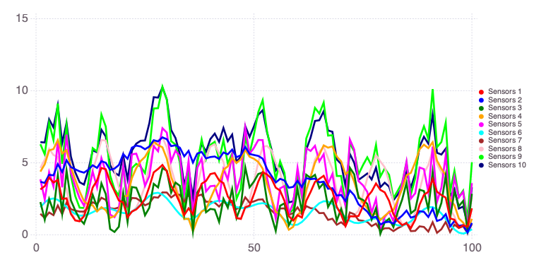

NMFk example: Feature extraction
-----

An example problem demonstrating how **NMFk** can be applied to extract and clasify features and sensors observing these mixed features.

This type of analysis is related to **blind source separation**

Applying **NMFk**, we can automatically:

- identify the number of the unknown mixed signatures in dataset 
- estimate the shape of the unknown mixed signatures
- estimate how the signatures are mixed at each sensor
- clasify sensors based on how they observe (are impacted) the extracted features.

<div style="text-align: left; padding-top: 30px; padding-bottom: 30px;">
    
</div>

**NMFk** is a code within the **SmartTensors** framework.

<div style="text-align: left; padding-top: 30px; padding-bottom: 30px;">
    
</div>

If **NMFk** is not installed, first execute in the Julia REPL: `import Pkg; Pkg.add("NMFk"); Pkg.add("Mads")`.


```julia
import Revise
import NMFk
import Mads
import Random

Random.seed!(2021)
```


    MersenneTwister(2021)


Let us generate 4 random signals with legnth of 100 (this can be considered as 100 ):


```julia
s1 = (sin.(0.05:0.05:5) .+1) ./ 2
s2 = (sin.(0.3:0.3:30) .+ 1) ./ 2
s3 = (sin.(0.5:0.5:50) .+ 1) ./ 2
s4 = rand(100)
W = [s1 s2 s3 s4]
```


    100×4 Matrix{Float64}:
     0.52499      0.64776     0.739713    0.405796
     0.549917     0.782321    0.920735    0.0657738
     0.574719     0.891663    0.998747    0.398162
     0.599335     0.96602     0.954649    0.163816
     0.623702     0.998747    0.799236    0.783094
     0.64776      0.986924    0.57056     0.134115
     0.671449     0.931605    0.324608    0.883121
     0.694709     0.837732    0.121599    0.386875
     0.717483     0.71369     0.0112349   0.242105
     0.739713     0.57056     0.0205379   0.131588
     0.761344     0.421127    0.14723     0.085331
     0.782321     0.27874     0.360292    0.330099
     0.802593     0.156117    0.60756     0.654601
     ⋮                                    
     0.0171135    0.999997    0.747443    0.508222
     0.0112349    0.978188    0.925452    0.199709
     0.00657807   0.913664    0.999295    0.857753
     0.0031545    0.812189    0.950894    0.130975
     0.000972781  0.682826    0.792098    0.381099
     3.83712e-5   0.537133    0.561787    0.89211
     0.000353606  0.388122    0.316347    0.18814
     0.0019177    0.249105    0.115873    0.695555
     0.00472673   0.1325      0.00944578  0.462331
     0.00877369   0.0487227   0.0231237   0.574861
     0.0140485    0.00525646  0.153558    0.0919372
     0.0205379    0.00598419  0.368813    0.710313


The singals look like this:


```julia
Mads.plotseries(W)
```


    

    


    


<?xml version="1.0" encoding="UTF-8"?>
<svg xmlns="http://www.w3.org/2000/svg"
     xmlns:xlink="http://www.w3.org/1999/xlink"
     xmlns:gadfly="http://www.gadflyjl.org/ns"
     version="1.2"
     width="141.42mm" height="100mm" viewBox="0 0 141.42 100"
     stroke="none"
     fill="#000000"
     stroke-width="0.3"
     font-size="3.88"

     id="img-a6233120">
<defs>
  <marker id="arrow" markerWidth="15" markerHeight="7" refX="5" refY="3.5" orient="auto" markerUnits="strokeWidth">
    <path d="M0,0 L15,3.5 L0,7 z" stroke="context-stroke" fill="context-stroke"/>
  </marker>
</defs>
<g class="plotroot xscalable yscalable" id="img-a6233120-1">
  <g class="guide xlabels" font-size="4.23" font-family="'PT Sans Caption','Helvetica Neue','Helvetica',sans-serif" fill="#6C606B" id="img-a6233120-2">
    <g transform="translate(-144.37,94)" visibility="hidden" gadfly:scale="1.0">
      <g class="primitive">
        <text text-anchor="middle" dy="-0em">-150</text>
      </g>
    </g>
    <g transform="translate(-91.36,94)" visibility="hidden" gadfly:scale="1.0">
      <g class="primitive">
        <text text-anchor="middle" dy="-0em">-100</text>
      </g>
    </g>
    <g transform="translate(-38.34,94)" visibility="hidden" gadfly:scale="1.0">
      <g class="primitive">
        <text text-anchor="middle" dy="-0em">-50</text>
      </g>
    </g>
    <g transform="translate(14.67,94)" visibility="visible" gadfly:scale="1.0">
      <g class="primitive">
        <text text-anchor="middle" dy="-0em">0</text>
      </g>
    </g>
    <g transform="translate(67.69,94)" visibility="visible" gadfly:scale="1.0">
      <g class="primitive">
        <text text-anchor="middle" dy="-0em">50</text>
      </g>
    </g>
    <g transform="translate(120.7,94)" visibility="visible" gadfly:scale="1.0">
      <g class="primitive">
        <text text-anchor="middle" dy="-0em">100</text>
      </g>
    </g>
    <g transform="translate(173.72,94)" visibility="hidden" gadfly:scale="1.0">
      <g class="primitive">
        <text text-anchor="middle" dy="-0em">150</text>
      </g>
    </g>
    <g transform="translate(226.73,94)" visibility="hidden" gadfly:scale="1.0">
      <g class="primitive">
        <text text-anchor="middle" dy="-0em">200</text>
      </g>
    </g>
    <g transform="translate(279.75,94)" visibility="hidden" gadfly:scale="1.0">
      <g class="primitive">
        <text text-anchor="middle" dy="-0em">250</text>
      </g>
    </g>
    <g transform="translate(-91.36,94)" visibility="hidden" gadfly:scale="5.0">
      <g class="primitive">
        <text text-anchor="middle" dy="-0em">-100</text>
      </g>
    </g>
    <g transform="translate(-80.75,94)" visibility="hidden" gadfly:scale="5.0">
      <g class="primitive">
        <text text-anchor="middle" dy="-0em">-90</text>
      </g>
    </g>
    <g transform="translate(-70.15,94)" visibility="hidden" gadfly:scale="5.0">
      <g class="primitive">
        <text text-anchor="middle" dy="-0em">-80</text>
      </g>
    </g>
    <g transform="translate(-59.55,94)" visibility="hidden" gadfly:scale="5.0">
      <g class="primitive">
        <text text-anchor="middle" dy="-0em">-70</text>
      </g>
    </g>
    <g transform="translate(-48.94,94)" visibility="hidden" gadfly:scale="5.0">
      <g class="primitive">
        <text text-anchor="middle" dy="-0em">-60</text>
      </g>
    </g>
    <g transform="translate(-38.34,94)" visibility="hidden" gadfly:scale="5.0">
      <g class="primitive">
        <text text-anchor="middle" dy="-0em">-50</text>
      </g>
    </g>
    <g transform="translate(-27.74,94)" visibility="hidden" gadfly:scale="5.0">
      <g class="primitive">
        <text text-anchor="middle" dy="-0em">-40</text>
      </g>
    </g>
    <g transform="translate(-17.13,94)" visibility="hidden" gadfly:scale="5.0">
      <g class="primitive">
        <text text-anchor="middle" dy="-0em">-30</text>
      </g>
    </g>
    <g transform="translate(-6.53,94)" visibility="hidden" gadfly:scale="5.0">
      <g class="primitive">
        <text text-anchor="middle" dy="-0em">-20</text>
      </g>
    </g>
    <g transform="translate(4.07,94)" visibility="hidden" gadfly:scale="5.0">
      <g class="primitive">
        <text text-anchor="middle" dy="-0em">-10</text>
      </g>
    </g>
    <g transform="translate(14.67,94)" visibility="hidden" gadfly:scale="5.0">
      <g class="primitive">
        <text text-anchor="middle" dy="-0em">0</text>
      </g>
    </g>
    <g transform="translate(25.28,94)" visibility="hidden" gadfly:scale="5.0">
      <g class="primitive">
        <text text-anchor="middle" dy="-0em">10</text>
      </g>
    </g>
    <g transform="translate(35.88,94)" visibility="hidden" gadfly:scale="5.0">
      <g class="primitive">
        <text text-anchor="middle" dy="-0em">20</text>
      </g>
    </g>
    <g transform="translate(46.48,94)" visibility="hidden" gadfly:scale="5.0">
      <g class="primitive">
        <text text-anchor="middle" dy="-0em">30</text>
      </g>
    </g>
    <g transform="translate(57.09,94)" visibility="hidden" gadfly:scale="5.0">
      <g class="primitive">
        <text text-anchor="middle" dy="-0em">40</text>
      </g>
    </g>
    <g transform="translate(67.69,94)" visibility="hidden" gadfly:scale="5.0">
      <g class="primitive">
        <text text-anchor="middle" dy="-0em">50</text>
      </g>
    </g>
    <g transform="translate(78.29,94)" visibility="hidden" gadfly:scale="5.0">
      <g class="primitive">
        <text text-anchor="middle" dy="-0em">60</text>
      </g>
    </g>
    <g transform="translate(88.89,94)" visibility="hidden" gadfly:scale="5.0">
      <g class="primitive">
        <text text-anchor="middle" dy="-0em">70</text>
      </g>
    </g>
    <g transform="translate(99.5,94)" visibility="hidden" gadfly:scale="5.0">
      <g class="primitive">
        <text text-anchor="middle" dy="-0em">80</text>
      </g>
    </g>
    <g transform="translate(110.1,94)" visibility="hidden" gadfly:scale="5.0">
      <g class="primitive">
        <text text-anchor="middle" dy="-0em">90</text>
      </g>
    </g>
    <g transform="translate(120.7,94)" visibility="hidden" gadfly:scale="5.0">
      <g class="primitive">
        <text text-anchor="middle" dy="-0em">100</text>
      </g>
    </g>
    <g transform="translate(131.31,94)" visibility="hidden" gadfly:scale="5.0">
      <g class="primitive">
        <text text-anchor="middle" dy="-0em">110</text>
      </g>
    </g>
    <g transform="translate(141.91,94)" visibility="hidden" gadfly:scale="5.0">
      <g class="primitive">
        <text text-anchor="middle" dy="-0em">120</text>
      </g>
    </g>
    <g transform="translate(152.51,94)" visibility="hidden" gadfly:scale="5.0">
      <g class="primitive">
        <text text-anchor="middle" dy="-0em">130</text>
      </g>
    </g>
    <g transform="translate(163.12,94)" visibility="hidden" gadfly:scale="5.0">
      <g class="primitive">
        <text text-anchor="middle" dy="-0em">140</text>
      </g>
    </g>
    <g transform="translate(173.72,94)" visibility="hidden" gadfly:scale="5.0">
      <g class="primitive">
        <text text-anchor="middle" dy="-0em">150</text>
      </g>
    </g>
    <g transform="translate(184.32,94)" visibility="hidden" gadfly:scale="5.0">
      <g class="primitive">
        <text text-anchor="middle" dy="-0em">160</text>
      </g>
    </g>
    <g transform="translate(194.92,94)" visibility="hidden" gadfly:scale="5.0">
      <g class="primitive">
        <text text-anchor="middle" dy="-0em">170</text>
      </g>
    </g>
    <g transform="translate(205.53,94)" visibility="hidden" gadfly:scale="5.0">
      <g class="primitive">
        <text text-anchor="middle" dy="-0em">180</text>
      </g>
    </g>
    <g transform="translate(216.13,94)" visibility="hidden" gadfly:scale="5.0">
      <g class="primitive">
        <text text-anchor="middle" dy="-0em">190</text>
      </g>
    </g>
    <g transform="translate(226.73,94)" visibility="hidden" gadfly:scale="5.0">
      <g class="primitive">
        <text text-anchor="middle" dy="-0em">200</text>
      </g>
    </g>
    <g transform="translate(-91.36,94)" visibility="hidden" gadfly:scale="0.5">
      <g class="primitive">
        <text text-anchor="middle" dy="-0em">-100</text>
      </g>
    </g>
    <g transform="translate(14.67,94)" visibility="hidden" gadfly:scale="0.5">
      <g class="primitive">
        <text text-anchor="middle" dy="-0em">0</text>
      </g>
    </g>
    <g transform="translate(120.7,94)" visibility="hidden" gadfly:scale="0.5">
      <g class="primitive">
        <text text-anchor="middle" dy="-0em">100</text>
      </g>
    </g>
    <g transform="translate(226.73,94)" visibility="hidden" gadfly:scale="0.5">
      <g class="primitive">
        <text text-anchor="middle" dy="-0em">200</text>
      </g>
    </g>
    <g transform="translate(-91.36,94)" visibility="hidden" gadfly:scale="10.0">
      <g class="primitive">
        <text text-anchor="middle" dy="-0em">-100</text>
      </g>
    </g>
    <g transform="translate(-86.05,94)" visibility="hidden" gadfly:scale="10.0">
      <g class="primitive">
        <text text-anchor="middle" dy="-0em">-95</text>
      </g>
    </g>
    <g transform="translate(-80.75,94)" visibility="hidden" gadfly:scale="10.0">
      <g class="primitive">
        <text text-anchor="middle" dy="-0em">-90</text>
      </g>
    </g>
    <g transform="translate(-75.45,94)" visibility="hidden" gadfly:scale="10.0">
      <g class="primitive">
        <text text-anchor="middle" dy="-0em">-85</text>
      </g>
    </g>
    <g transform="translate(-70.15,94)" visibility="hidden" gadfly:scale="10.0">
      <g class="primitive">
        <text text-anchor="middle" dy="-0em">-80</text>
      </g>
    </g>
    <g transform="translate(-64.85,94)" visibility="hidden" gadfly:scale="10.0">
      <g class="primitive">
        <text text-anchor="middle" dy="-0em">-75</text>
      </g>
    </g>
    <g transform="translate(-59.55,94)" visibility="hidden" gadfly:scale="10.0">
      <g class="primitive">
        <text text-anchor="middle" dy="-0em">-70</text>
      </g>
    </g>
    <g transform="translate(-54.25,94)" visibility="hidden" gadfly:scale="10.0">
      <g class="primitive">
        <text text-anchor="middle" dy="-0em">-65</text>
      </g>
    </g>
    <g transform="translate(-48.94,94)" visibility="hidden" gadfly:scale="10.0">
      <g class="primitive">
        <text text-anchor="middle" dy="-0em">-60</text>
      </g>
    </g>
    <g transform="translate(-43.64,94)" visibility="hidden" gadfly:scale="10.0">
      <g class="primitive">
        <text text-anchor="middle" dy="-0em">-55</text>
      </g>
    </g>
    <g transform="translate(-38.34,94)" visibility="hidden" gadfly:scale="10.0">
      <g class="primitive">
        <text text-anchor="middle" dy="-0em">-50</text>
      </g>
    </g>
    <g transform="translate(-33.04,94)" visibility="hidden" gadfly:scale="10.0">
      <g class="primitive">
        <text text-anchor="middle" dy="-0em">-45</text>
      </g>
    </g>
    <g transform="translate(-27.74,94)" visibility="hidden" gadfly:scale="10.0">
      <g class="primitive">
        <text text-anchor="middle" dy="-0em">-40</text>
      </g>
    </g>
    <g transform="translate(-22.44,94)" visibility="hidden" gadfly:scale="10.0">
      <g class="primitive">
        <text text-anchor="middle" dy="-0em">-35</text>
      </g>
    </g>
    <g transform="translate(-17.13,94)" visibility="hidden" gadfly:scale="10.0">
      <g class="primitive">
        <text text-anchor="middle" dy="-0em">-30</text>
      </g>
    </g>
    <g transform="translate(-11.83,94)" visibility="hidden" gadfly:scale="10.0">
      <g class="primitive">
        <text text-anchor="middle" dy="-0em">-25</text>
      </g>
    </g>
    <g transform="translate(-6.53,94)" visibility="hidden" gadfly:scale="10.0">
      <g class="primitive">
        <text text-anchor="middle" dy="-0em">-20</text>
      </g>
    </g>
    <g transform="translate(-1.23,94)" visibility="hidden" gadfly:scale="10.0">
      <g class="primitive">
        <text text-anchor="middle" dy="-0em">-15</text>
      </g>
    </g>
    <g transform="translate(4.07,94)" visibility="hidden" gadfly:scale="10.0">
      <g class="primitive">
        <text text-anchor="middle" dy="-0em">-10</text>
      </g>
    </g>
    <g transform="translate(9.37,94)" visibility="hidden" gadfly:scale="10.0">
      <g class="primitive">
        <text text-anchor="middle" dy="-0em">-5</text>
      </g>
    </g>
    <g transform="translate(14.67,94)" visibility="hidden" gadfly:scale="10.0">
      <g class="primitive">
        <text text-anchor="middle" dy="-0em">0</text>
      </g>
    </g>
    <g transform="translate(19.98,94)" visibility="hidden" gadfly:scale="10.0">
      <g class="primitive">
        <text text-anchor="middle" dy="-0em">5</text>
      </g>
    </g>
    <g transform="translate(25.28,94)" visibility="hidden" gadfly:scale="10.0">
      <g class="primitive">
        <text text-anchor="middle" dy="-0em">10</text>
      </g>
    </g>
    <g transform="translate(30.58,94)" visibility="hidden" gadfly:scale="10.0">
      <g class="primitive">
        <text text-anchor="middle" dy="-0em">15</text>
      </g>
    </g>
    <g transform="translate(35.88,94)" visibility="hidden" gadfly:scale="10.0">
      <g class="primitive">
        <text text-anchor="middle" dy="-0em">20</text>
      </g>
    </g>
    <g transform="translate(41.18,94)" visibility="hidden" gadfly:scale="10.0">
      <g class="primitive">
        <text text-anchor="middle" dy="-0em">25</text>
      </g>
    </g>
    <g transform="translate(46.48,94)" visibility="hidden" gadfly:scale="10.0">
      <g class="primitive">
        <text text-anchor="middle" dy="-0em">30</text>
      </g>
    </g>
    <g transform="translate(51.78,94)" visibility="hidden" gadfly:scale="10.0">
      <g class="primitive">
        <text text-anchor="middle" dy="-0em">35</text>
      </g>
    </g>
    <g transform="translate(57.09,94)" visibility="hidden" gadfly:scale="10.0">
      <g class="primitive">
        <text text-anchor="middle" dy="-0em">40</text>
      </g>
    </g>
    <g transform="translate(62.39,94)" visibility="hidden" gadfly:scale="10.0">
      <g class="primitive">
        <text text-anchor="middle" dy="-0em">45</text>
      </g>
    </g>
    <g transform="translate(67.69,94)" visibility="hidden" gadfly:scale="10.0">
      <g class="primitive">
        <text text-anchor="middle" dy="-0em">50</text>
      </g>
    </g>
    <g transform="translate(72.99,94)" visibility="hidden" gadfly:scale="10.0">
      <g class="primitive">
        <text text-anchor="middle" dy="-0em">55</text>
      </g>
    </g>
    <g transform="translate(78.29,94)" visibility="hidden" gadfly:scale="10.0">
      <g class="primitive">
        <text text-anchor="middle" dy="-0em">60</text>
      </g>
    </g>
    <g transform="translate(83.59,94)" visibility="hidden" gadfly:scale="10.0">
      <g class="primitive">
        <text text-anchor="middle" dy="-0em">65</text>
      </g>
    </g>
    <g transform="translate(88.89,94)" visibility="hidden" gadfly:scale="10.0">
      <g class="primitive">
        <text text-anchor="middle" dy="-0em">70</text>
      </g>
    </g>
    <g transform="translate(94.2,94)" visibility="hidden" gadfly:scale="10.0">
      <g class="primitive">
        <text text-anchor="middle" dy="-0em">75</text>
      </g>
    </g>
    <g transform="translate(99.5,94)" visibility="hidden" gadfly:scale="10.0">
      <g class="primitive">
        <text text-anchor="middle" dy="-0em">80</text>
      </g>
    </g>
    <g transform="translate(104.8,94)" visibility="hidden" gadfly:scale="10.0">
      <g class="primitive">
        <text text-anchor="middle" dy="-0em">85</text>
      </g>
    </g>
    <g transform="translate(110.1,94)" visibility="hidden" gadfly:scale="10.0">
      <g class="primitive">
        <text text-anchor="middle" dy="-0em">90</text>
      </g>
    </g>
    <g transform="translate(115.4,94)" visibility="hidden" gadfly:scale="10.0">
      <g class="primitive">
        <text text-anchor="middle" dy="-0em">95</text>
      </g>
    </g>
    <g transform="translate(120.7,94)" visibility="hidden" gadfly:scale="10.0">
      <g class="primitive">
        <text text-anchor="middle" dy="-0em">100</text>
      </g>
    </g>
    <g transform="translate(126.01,94)" visibility="hidden" gadfly:scale="10.0">
      <g class="primitive">
        <text text-anchor="middle" dy="-0em">105</text>
      </g>
    </g>
    <g transform="translate(131.31,94)" visibility="hidden" gadfly:scale="10.0">
      <g class="primitive">
        <text text-anchor="middle" dy="-0em">110</text>
      </g>
    </g>
    <g transform="translate(136.61,94)" visibility="hidden" gadfly:scale="10.0">
      <g class="primitive">
        <text text-anchor="middle" dy="-0em">115</text>
      </g>
    </g>
    <g transform="translate(141.91,94)" visibility="hidden" gadfly:scale="10.0">
      <g class="primitive">
        <text text-anchor="middle" dy="-0em">120</text>
      </g>
    </g>
    <g transform="translate(147.21,94)" visibility="hidden" gadfly:scale="10.0">
      <g class="primitive">
        <text text-anchor="middle" dy="-0em">125</text>
      </g>
    </g>
    <g transform="translate(152.51,94)" visibility="hidden" gadfly:scale="10.0">
      <g class="primitive">
        <text text-anchor="middle" dy="-0em">130</text>
      </g>
    </g>
    <g transform="translate(157.81,94)" visibility="hidden" gadfly:scale="10.0">
      <g class="primitive">
        <text text-anchor="middle" dy="-0em">135</text>
      </g>
    </g>
    <g transform="translate(163.12,94)" visibility="hidden" gadfly:scale="10.0">
      <g class="primitive">
        <text text-anchor="middle" dy="-0em">140</text>
      </g>
    </g>
    <g transform="translate(168.42,94)" visibility="hidden" gadfly:scale="10.0">
      <g class="primitive">
        <text text-anchor="middle" dy="-0em">145</text>
      </g>
    </g>
    <g transform="translate(173.72,94)" visibility="hidden" gadfly:scale="10.0">
      <g class="primitive">
        <text text-anchor="middle" dy="-0em">150</text>
      </g>
    </g>
    <g transform="translate(179.02,94)" visibility="hidden" gadfly:scale="10.0">
      <g class="primitive">
        <text text-anchor="middle" dy="-0em">155</text>
      </g>
    </g>
    <g transform="translate(184.32,94)" visibility="hidden" gadfly:scale="10.0">
      <g class="primitive">
        <text text-anchor="middle" dy="-0em">160</text>
      </g>
    </g>
    <g transform="translate(189.62,94)" visibility="hidden" gadfly:scale="10.0">
      <g class="primitive">
        <text text-anchor="middle" dy="-0em">165</text>
      </g>
    </g>
    <g transform="translate(194.92,94)" visibility="hidden" gadfly:scale="10.0">
      <g class="primitive">
        <text text-anchor="middle" dy="-0em">170</text>
      </g>
    </g>
    <g transform="translate(200.23,94)" visibility="hidden" gadfly:scale="10.0">
      <g class="primitive">
        <text text-anchor="middle" dy="-0em">175</text>
      </g>
    </g>
    <g transform="translate(205.53,94)" visibility="hidden" gadfly:scale="10.0">
      <g class="primitive">
        <text text-anchor="middle" dy="-0em">180</text>
      </g>
    </g>
    <g transform="translate(210.83,94)" visibility="hidden" gadfly:scale="10.0">
      <g class="primitive">
        <text text-anchor="middle" dy="-0em">185</text>
      </g>
    </g>
    <g transform="translate(216.13,94)" visibility="hidden" gadfly:scale="10.0">
      <g class="primitive">
        <text text-anchor="middle" dy="-0em">190</text>
      </g>
    </g>
    <g transform="translate(221.43,94)" visibility="hidden" gadfly:scale="10.0">
      <g class="primitive">
        <text text-anchor="middle" dy="-0em">195</text>
      </g>
    </g>
    <g transform="translate(226.73,94)" visibility="hidden" gadfly:scale="10.0">
      <g class="primitive">
        <text text-anchor="middle" dy="-0em">200</text>
      </g>
    </g>
  </g>
  <g class="guide colorkey" id="img-a6233120-3">
    <g fill="#4C404B" font-size="2.82" font-family="'PT Sans','Helvetica Neue','Helvetica',sans-serif" id="img-a6233120-4">
      <g transform="translate(127.31,42.8)" id="img-a6233120-5">
        <g class="primitive">
          <text dy="0.35em">Signal 1</text>
        </g>
      </g>
      <g transform="translate(127.31,46.41)" id="img-a6233120-6">
        <g class="primitive">
          <text dy="0.35em">Signal 2</text>
        </g>
      </g>
      <g transform="translate(127.31,50.02)" id="img-a6233120-7">
        <g class="primitive">
          <text dy="0.35em">Signal 3</text>
        </g>
      </g>
      <g transform="translate(127.31,53.62)" id="img-a6233120-8">
        <g class="primitive">
          <text dy="0.35em">Signal 4</text>
        </g>
      </g>
    </g>
    <g stroke-width="0" id="img-a6233120-9">
      <g stroke="#000000" stroke-opacity="0.000" fill-opacity="1" fill="#FFA500" id="img-a6233120-10">
        <g transform="translate(124.51,53.62)" id="img-a6233120-11">
          <circle cx="0" cy="0" r="0.9" class="primitive"/>
        </g>
      </g>
      <g stroke="#000000" stroke-opacity="0.000" fill-opacity="1" fill="#008000" id="img-a6233120-12">
        <g transform="translate(124.51,50.02)" id="img-a6233120-13">
          <circle cx="0" cy="0" r="0.9" class="primitive"/>
        </g>
      </g>
      <g stroke="#000000" stroke-opacity="0.000" fill-opacity="1" fill="#0000FF" id="img-a6233120-14">
        <g transform="translate(124.51,46.41)" id="img-a6233120-15">
          <circle cx="0" cy="0" r="0.9" class="primitive"/>
        </g>
      </g>
      <g stroke="#000000" stroke-opacity="0.000" fill-opacity="1" fill="#FF0000" id="img-a6233120-16">
        <g transform="translate(124.51,42.8)" id="img-a6233120-17">
          <circle cx="0" cy="0" r="0.9" class="primitive"/>
        </g>
      </g>
    </g>
    <g fill="#362A35" font-size="3.88" font-family="'PT Sans','Helvetica Neue','Helvetica',sans-serif" stroke="#000000" stroke-opacity="0.000" id="img-a6233120-18">
      <g transform="translate(123.7,39.5)" id="img-a6233120-19">
        <g class="primitive">
          <text dy="-0em"></text>
        </g>
      </g>
    </g>
  </g>
  <g clip-path="url(#img-a6233120-20)">
    <g id="img-a6233120-21">
      <g pointer-events="visible" stroke-width="0.3" fill="#000000" fill-opacity="0.000" stroke="#000000" stroke-opacity="0.000" class="guide background" id="img-a6233120-22">
        <g transform="translate(67.69,47.46)" id="img-a6233120-23">
          <path d="M-55.01,-42.46 L55.01,-42.46 55.01,42.46 -55.01,42.46  z" class="primitive"/>
        </g>
      </g>
      <g class="guide ygridlines xfixed" stroke-dasharray="0.5,0.5" stroke-width="0.2" stroke="#D0D0E0" id="img-a6233120-24">
        <g transform="translate(67.69,209.32)" id="img-a6233120-25" visibility="hidden" gadfly:scale="1.0">
          <path fill="none" d="M-55.01,0 L55.01,0 " class="primitive"/>
        </g>
        <g transform="translate(67.69,168.85)" id="img-a6233120-26" visibility="hidden" gadfly:scale="1.0">
          <path fill="none" d="M-55.01,0 L55.01,0 " class="primitive"/>
        </g>
        <g transform="translate(67.69,128.39)" id="img-a6233120-27" visibility="hidden" gadfly:scale="1.0">
          <path fill="none" d="M-55.01,0 L55.01,0 " class="primitive"/>
        </g>
        <g transform="translate(67.69,87.93)" id="img-a6233120-28" visibility="visible" gadfly:scale="1.0">
          <path fill="none" d="M-55.01,0 L55.01,0 " class="primitive"/>
        </g>
        <g transform="translate(67.69,47.46)" id="img-a6233120-29" visibility="visible" gadfly:scale="1.0">
          <path fill="none" d="M-55.01,0 L55.01,0 " class="primitive"/>
        </g>
        <g transform="translate(67.69,7)" id="img-a6233120-30" visibility="visible" gadfly:scale="1.0">
          <path fill="none" d="M-55.01,0 L55.01,0 " class="primitive"/>
        </g>
        <g transform="translate(67.69,-33.46)" id="img-a6233120-31" visibility="hidden" gadfly:scale="1.0">
          <path fill="none" d="M-55.01,0 L55.01,0 " class="primitive"/>
        </g>
        <g transform="translate(67.69,-73.93)" id="img-a6233120-32" visibility="hidden" gadfly:scale="1.0">
          <path fill="none" d="M-55.01,0 L55.01,0 " class="primitive"/>
        </g>
        <g transform="translate(67.69,-114.39)" id="img-a6233120-33" visibility="hidden" gadfly:scale="1.0">
          <path fill="none" d="M-55.01,0 L55.01,0 " class="primitive"/>
        </g>
        <g transform="translate(67.69,168.85)" id="img-a6233120-34" visibility="hidden" gadfly:scale="5.0">
          <path fill="none" d="M-55.01,0 L55.01,0 " class="primitive"/>
        </g>
        <g transform="translate(67.69,160.76)" id="img-a6233120-35" visibility="hidden" gadfly:scale="5.0">
          <path fill="none" d="M-55.01,0 L55.01,0 " class="primitive"/>
        </g>
        <g transform="translate(67.69,152.67)" id="img-a6233120-36" visibility="hidden" gadfly:scale="5.0">
          <path fill="none" d="M-55.01,0 L55.01,0 " class="primitive"/>
        </g>
        <g transform="translate(67.69,144.58)" id="img-a6233120-37" visibility="hidden" gadfly:scale="5.0">
          <path fill="none" d="M-55.01,0 L55.01,0 " class="primitive"/>
        </g>
        <g transform="translate(67.69,136.48)" id="img-a6233120-38" visibility="hidden" gadfly:scale="5.0">
          <path fill="none" d="M-55.01,0 L55.01,0 " class="primitive"/>
        </g>
        <g transform="translate(67.69,128.39)" id="img-a6233120-39" visibility="hidden" gadfly:scale="5.0">
          <path fill="none" d="M-55.01,0 L55.01,0 " class="primitive"/>
        </g>
        <g transform="translate(67.69,120.3)" id="img-a6233120-40" visibility="hidden" gadfly:scale="5.0">
          <path fill="none" d="M-55.01,0 L55.01,0 " class="primitive"/>
        </g>
        <g transform="translate(67.69,112.2)" id="img-a6233120-41" visibility="hidden" gadfly:scale="5.0">
          <path fill="none" d="M-55.01,0 L55.01,0 " class="primitive"/>
        </g>
        <g transform="translate(67.69,104.11)" id="img-a6233120-42" visibility="hidden" gadfly:scale="5.0">
          <path fill="none" d="M-55.01,0 L55.01,0 " class="primitive"/>
        </g>
        <g transform="translate(67.69,96.02)" id="img-a6233120-43" visibility="hidden" gadfly:scale="5.0">
          <path fill="none" d="M-55.01,0 L55.01,0 " class="primitive"/>
        </g>
        <g transform="translate(67.69,87.93)" id="img-a6233120-44" visibility="hidden" gadfly:scale="5.0">
          <path fill="none" d="M-55.01,0 L55.01,0 " class="primitive"/>
        </g>
        <g transform="translate(67.69,79.83)" id="img-a6233120-45" visibility="hidden" gadfly:scale="5.0">
          <path fill="none" d="M-55.01,0 L55.01,0 " class="primitive"/>
        </g>
        <g transform="translate(67.69,71.74)" id="img-a6233120-46" visibility="hidden" gadfly:scale="5.0">
          <path fill="none" d="M-55.01,0 L55.01,0 " class="primitive"/>
        </g>
        <g transform="translate(67.69,63.65)" id="img-a6233120-47" visibility="hidden" gadfly:scale="5.0">
          <path fill="none" d="M-55.01,0 L55.01,0 " class="primitive"/>
        </g>
        <g transform="translate(67.69,55.56)" id="img-a6233120-48" visibility="hidden" gadfly:scale="5.0">
          <path fill="none" d="M-55.01,0 L55.01,0 " class="primitive"/>
        </g>
        <g transform="translate(67.69,47.46)" id="img-a6233120-49" visibility="hidden" gadfly:scale="5.0">
          <path fill="none" d="M-55.01,0 L55.01,0 " class="primitive"/>
        </g>
        <g transform="translate(67.69,39.37)" id="img-a6233120-50" visibility="hidden" gadfly:scale="5.0">
          <path fill="none" d="M-55.01,0 L55.01,0 " class="primitive"/>
        </g>
        <g transform="translate(67.69,31.28)" id="img-a6233120-51" visibility="hidden" gadfly:scale="5.0">
          <path fill="none" d="M-55.01,0 L55.01,0 " class="primitive"/>
        </g>
        <g transform="translate(67.69,23.19)" id="img-a6233120-52" visibility="hidden" gadfly:scale="5.0">
          <path fill="none" d="M-55.01,0 L55.01,0 " class="primitive"/>
        </g>
        <g transform="translate(67.69,15.09)" id="img-a6233120-53" visibility="hidden" gadfly:scale="5.0">
          <path fill="none" d="M-55.01,0 L55.01,0 " class="primitive"/>
        </g>
        <g transform="translate(67.69,7)" id="img-a6233120-54" visibility="hidden" gadfly:scale="5.0">
          <path fill="none" d="M-55.01,0 L55.01,0 " class="primitive"/>
        </g>
        <g transform="translate(67.69,-1.09)" id="img-a6233120-55" visibility="hidden" gadfly:scale="5.0">
          <path fill="none" d="M-55.01,0 L55.01,0 " class="primitive"/>
        </g>
        <g transform="translate(67.69,-9.19)" id="img-a6233120-56" visibility="hidden" gadfly:scale="5.0">
          <path fill="none" d="M-55.01,0 L55.01,0 " class="primitive"/>
        </g>
        <g transform="translate(67.69,-17.28)" id="img-a6233120-57" visibility="hidden" gadfly:scale="5.0">
          <path fill="none" d="M-55.01,0 L55.01,0 " class="primitive"/>
        </g>
        <g transform="translate(67.69,-25.37)" id="img-a6233120-58" visibility="hidden" gadfly:scale="5.0">
          <path fill="none" d="M-55.01,0 L55.01,0 " class="primitive"/>
        </g>
        <g transform="translate(67.69,-33.46)" id="img-a6233120-59" visibility="hidden" gadfly:scale="5.0">
          <path fill="none" d="M-55.01,0 L55.01,0 " class="primitive"/>
        </g>
        <g transform="translate(67.69,-41.56)" id="img-a6233120-60" visibility="hidden" gadfly:scale="5.0">
          <path fill="none" d="M-55.01,0 L55.01,0 " class="primitive"/>
        </g>
        <g transform="translate(67.69,-49.65)" id="img-a6233120-61" visibility="hidden" gadfly:scale="5.0">
          <path fill="none" d="M-55.01,0 L55.01,0 " class="primitive"/>
        </g>
        <g transform="translate(67.69,-57.74)" id="img-a6233120-62" visibility="hidden" gadfly:scale="5.0">
          <path fill="none" d="M-55.01,0 L55.01,0 " class="primitive"/>
        </g>
        <g transform="translate(67.69,-65.83)" id="img-a6233120-63" visibility="hidden" gadfly:scale="5.0">
          <path fill="none" d="M-55.01,0 L55.01,0 " class="primitive"/>
        </g>
        <g transform="translate(67.69,-73.93)" id="img-a6233120-64" visibility="hidden" gadfly:scale="5.0">
          <path fill="none" d="M-55.01,0 L55.01,0 " class="primitive"/>
        </g>
        <g transform="translate(67.69,168.85)" id="img-a6233120-65" visibility="hidden" gadfly:scale="0.5">
          <path fill="none" d="M-55.01,0 L55.01,0 " class="primitive"/>
        </g>
        <g transform="translate(67.69,87.93)" id="img-a6233120-66" visibility="hidden" gadfly:scale="0.5">
          <path fill="none" d="M-55.01,0 L55.01,0 " class="primitive"/>
        </g>
        <g transform="translate(67.69,7)" id="img-a6233120-67" visibility="hidden" gadfly:scale="0.5">
          <path fill="none" d="M-55.01,0 L55.01,0 " class="primitive"/>
        </g>
        <g transform="translate(67.69,-73.93)" id="img-a6233120-68" visibility="hidden" gadfly:scale="0.5">
          <path fill="none" d="M-55.01,0 L55.01,0 " class="primitive"/>
        </g>
        <g transform="translate(67.69,168.85)" id="img-a6233120-69" visibility="hidden" gadfly:scale="10.0">
          <path fill="none" d="M-55.01,0 L55.01,0 " class="primitive"/>
        </g>
        <g transform="translate(67.69,164.81)" id="img-a6233120-70" visibility="hidden" gadfly:scale="10.0">
          <path fill="none" d="M-55.01,0 L55.01,0 " class="primitive"/>
        </g>
        <g transform="translate(67.69,160.76)" id="img-a6233120-71" visibility="hidden" gadfly:scale="10.0">
          <path fill="none" d="M-55.01,0 L55.01,0 " class="primitive"/>
        </g>
        <g transform="translate(67.69,156.71)" id="img-a6233120-72" visibility="hidden" gadfly:scale="10.0">
          <path fill="none" d="M-55.01,0 L55.01,0 " class="primitive"/>
        </g>
        <g transform="translate(67.69,152.67)" id="img-a6233120-73" visibility="hidden" gadfly:scale="10.0">
          <path fill="none" d="M-55.01,0 L55.01,0 " class="primitive"/>
        </g>
        <g transform="translate(67.69,148.62)" id="img-a6233120-74" visibility="hidden" gadfly:scale="10.0">
          <path fill="none" d="M-55.01,0 L55.01,0 " class="primitive"/>
        </g>
        <g transform="translate(67.69,144.58)" id="img-a6233120-75" visibility="hidden" gadfly:scale="10.0">
          <path fill="none" d="M-55.01,0 L55.01,0 " class="primitive"/>
        </g>
        <g transform="translate(67.69,140.53)" id="img-a6233120-76" visibility="hidden" gadfly:scale="10.0">
          <path fill="none" d="M-55.01,0 L55.01,0 " class="primitive"/>
        </g>
        <g transform="translate(67.69,136.48)" id="img-a6233120-77" visibility="hidden" gadfly:scale="10.0">
          <path fill="none" d="M-55.01,0 L55.01,0 " class="primitive"/>
        </g>
        <g transform="translate(67.69,132.44)" id="img-a6233120-78" visibility="hidden" gadfly:scale="10.0">
          <path fill="none" d="M-55.01,0 L55.01,0 " class="primitive"/>
        </g>
        <g transform="translate(67.69,128.39)" id="img-a6233120-79" visibility="hidden" gadfly:scale="10.0">
          <path fill="none" d="M-55.01,0 L55.01,0 " class="primitive"/>
        </g>
        <g transform="translate(67.69,124.34)" id="img-a6233120-80" visibility="hidden" gadfly:scale="10.0">
          <path fill="none" d="M-55.01,0 L55.01,0 " class="primitive"/>
        </g>
        <g transform="translate(67.69,120.3)" id="img-a6233120-81" visibility="hidden" gadfly:scale="10.0">
          <path fill="none" d="M-55.01,0 L55.01,0 " class="primitive"/>
        </g>
        <g transform="translate(67.69,116.25)" id="img-a6233120-82" visibility="hidden" gadfly:scale="10.0">
          <path fill="none" d="M-55.01,0 L55.01,0 " class="primitive"/>
        </g>
        <g transform="translate(67.69,112.2)" id="img-a6233120-83" visibility="hidden" gadfly:scale="10.0">
          <path fill="none" d="M-55.01,0 L55.01,0 " class="primitive"/>
        </g>
        <g transform="translate(67.69,108.16)" id="img-a6233120-84" visibility="hidden" gadfly:scale="10.0">
          <path fill="none" d="M-55.01,0 L55.01,0 " class="primitive"/>
        </g>
        <g transform="translate(67.69,104.11)" id="img-a6233120-85" visibility="hidden" gadfly:scale="10.0">
          <path fill="none" d="M-55.01,0 L55.01,0 " class="primitive"/>
        </g>
        <g transform="translate(67.69,100.07)" id="img-a6233120-86" visibility="hidden" gadfly:scale="10.0">
          <path fill="none" d="M-55.01,0 L55.01,0 " class="primitive"/>
        </g>
        <g transform="translate(67.69,96.02)" id="img-a6233120-87" visibility="hidden" gadfly:scale="10.0">
          <path fill="none" d="M-55.01,0 L55.01,0 " class="primitive"/>
        </g>
        <g transform="translate(67.69,91.97)" id="img-a6233120-88" visibility="hidden" gadfly:scale="10.0">
          <path fill="none" d="M-55.01,0 L55.01,0 " class="primitive"/>
        </g>
        <g transform="translate(67.69,87.93)" id="img-a6233120-89" visibility="hidden" gadfly:scale="10.0">
          <path fill="none" d="M-55.01,0 L55.01,0 " class="primitive"/>
        </g>
        <g transform="translate(67.69,83.88)" id="img-a6233120-90" visibility="hidden" gadfly:scale="10.0">
          <path fill="none" d="M-55.01,0 L55.01,0 " class="primitive"/>
        </g>
        <g transform="translate(67.69,79.83)" id="img-a6233120-91" visibility="hidden" gadfly:scale="10.0">
          <path fill="none" d="M-55.01,0 L55.01,0 " class="primitive"/>
        </g>
        <g transform="translate(67.69,75.79)" id="img-a6233120-92" visibility="hidden" gadfly:scale="10.0">
          <path fill="none" d="M-55.01,0 L55.01,0 " class="primitive"/>
        </g>
        <g transform="translate(67.69,71.74)" id="img-a6233120-93" visibility="hidden" gadfly:scale="10.0">
          <path fill="none" d="M-55.01,0 L55.01,0 " class="primitive"/>
        </g>
        <g transform="translate(67.69,67.69)" id="img-a6233120-94" visibility="hidden" gadfly:scale="10.0">
          <path fill="none" d="M-55.01,0 L55.01,0 " class="primitive"/>
        </g>
        <g transform="translate(67.69,63.65)" id="img-a6233120-95" visibility="hidden" gadfly:scale="10.0">
          <path fill="none" d="M-55.01,0 L55.01,0 " class="primitive"/>
        </g>
        <g transform="translate(67.69,59.6)" id="img-a6233120-96" visibility="hidden" gadfly:scale="10.0">
          <path fill="none" d="M-55.01,0 L55.01,0 " class="primitive"/>
        </g>
        <g transform="translate(67.69,55.56)" id="img-a6233120-97" visibility="hidden" gadfly:scale="10.0">
          <path fill="none" d="M-55.01,0 L55.01,0 " class="primitive"/>
        </g>
        <g transform="translate(67.69,51.51)" id="img-a6233120-98" visibility="hidden" gadfly:scale="10.0">
          <path fill="none" d="M-55.01,0 L55.01,0 " class="primitive"/>
        </g>
        <g transform="translate(67.69,47.46)" id="img-a6233120-99" visibility="hidden" gadfly:scale="10.0">
          <path fill="none" d="M-55.01,0 L55.01,0 " class="primitive"/>
        </g>
        <g transform="translate(67.69,43.42)" id="img-a6233120-100" visibility="hidden" gadfly:scale="10.0">
          <path fill="none" d="M-55.01,0 L55.01,0 " class="primitive"/>
        </g>
        <g transform="translate(67.69,39.37)" id="img-a6233120-101" visibility="hidden" gadfly:scale="10.0">
          <path fill="none" d="M-55.01,0 L55.01,0 " class="primitive"/>
        </g>
        <g transform="translate(67.69,35.32)" id="img-a6233120-102" visibility="hidden" gadfly:scale="10.0">
          <path fill="none" d="M-55.01,0 L55.01,0 " class="primitive"/>
        </g>
        <g transform="translate(67.69,31.28)" id="img-a6233120-103" visibility="hidden" gadfly:scale="10.0">
          <path fill="none" d="M-55.01,0 L55.01,0 " class="primitive"/>
        </g>
        <g transform="translate(67.69,27.23)" id="img-a6233120-104" visibility="hidden" gadfly:scale="10.0">
          <path fill="none" d="M-55.01,0 L55.01,0 " class="primitive"/>
        </g>
        <g transform="translate(67.69,23.19)" id="img-a6233120-105" visibility="hidden" gadfly:scale="10.0">
          <path fill="none" d="M-55.01,0 L55.01,0 " class="primitive"/>
        </g>
        <g transform="translate(67.69,19.14)" id="img-a6233120-106" visibility="hidden" gadfly:scale="10.0">
          <path fill="none" d="M-55.01,0 L55.01,0 " class="primitive"/>
        </g>
        <g transform="translate(67.69,15.09)" id="img-a6233120-107" visibility="hidden" gadfly:scale="10.0">
          <path fill="none" d="M-55.01,0 L55.01,0 " class="primitive"/>
        </g>
        <g transform="translate(67.69,11.05)" id="img-a6233120-108" visibility="hidden" gadfly:scale="10.0">
          <path fill="none" d="M-55.01,0 L55.01,0 " class="primitive"/>
        </g>
        <g transform="translate(67.69,7)" id="img-a6233120-109" visibility="hidden" gadfly:scale="10.0">
          <path fill="none" d="M-55.01,0 L55.01,0 " class="primitive"/>
        </g>
        <g transform="translate(67.69,2.95)" id="img-a6233120-110" visibility="hidden" gadfly:scale="10.0">
          <path fill="none" d="M-55.01,0 L55.01,0 " class="primitive"/>
        </g>
        <g transform="translate(67.69,-1.09)" id="img-a6233120-111" visibility="hidden" gadfly:scale="10.0">
          <path fill="none" d="M-55.01,0 L55.01,0 " class="primitive"/>
        </g>
        <g transform="translate(67.69,-5.14)" id="img-a6233120-112" visibility="hidden" gadfly:scale="10.0">
          <path fill="none" d="M-55.01,0 L55.01,0 " class="primitive"/>
        </g>
        <g transform="translate(67.69,-9.19)" id="img-a6233120-113" visibility="hidden" gadfly:scale="10.0">
          <path fill="none" d="M-55.01,0 L55.01,0 " class="primitive"/>
        </g>
        <g transform="translate(67.69,-13.23)" id="img-a6233120-114" visibility="hidden" gadfly:scale="10.0">
          <path fill="none" d="M-55.01,0 L55.01,0 " class="primitive"/>
        </g>
        <g transform="translate(67.69,-17.28)" id="img-a6233120-115" visibility="hidden" gadfly:scale="10.0">
          <path fill="none" d="M-55.01,0 L55.01,0 " class="primitive"/>
        </g>
        <g transform="translate(67.69,-21.32)" id="img-a6233120-116" visibility="hidden" gadfly:scale="10.0">
          <path fill="none" d="M-55.01,0 L55.01,0 " class="primitive"/>
        </g>
        <g transform="translate(67.69,-25.37)" id="img-a6233120-117" visibility="hidden" gadfly:scale="10.0">
          <path fill="none" d="M-55.01,0 L55.01,0 " class="primitive"/>
        </g>
        <g transform="translate(67.69,-29.42)" id="img-a6233120-118" visibility="hidden" gadfly:scale="10.0">
          <path fill="none" d="M-55.01,0 L55.01,0 " class="primitive"/>
        </g>
        <g transform="translate(67.69,-33.46)" id="img-a6233120-119" visibility="hidden" gadfly:scale="10.0">
          <path fill="none" d="M-55.01,0 L55.01,0 " class="primitive"/>
        </g>
        <g transform="translate(67.69,-37.51)" id="img-a6233120-120" visibility="hidden" gadfly:scale="10.0">
          <path fill="none" d="M-55.01,0 L55.01,0 " class="primitive"/>
        </g>
        <g transform="translate(67.69,-41.56)" id="img-a6233120-121" visibility="hidden" gadfly:scale="10.0">
          <path fill="none" d="M-55.01,0 L55.01,0 " class="primitive"/>
        </g>
        <g transform="translate(67.69,-45.6)" id="img-a6233120-122" visibility="hidden" gadfly:scale="10.0">
          <path fill="none" d="M-55.01,0 L55.01,0 " class="primitive"/>
        </g>
        <g transform="translate(67.69,-49.65)" id="img-a6233120-123" visibility="hidden" gadfly:scale="10.0">
          <path fill="none" d="M-55.01,0 L55.01,0 " class="primitive"/>
        </g>
        <g transform="translate(67.69,-53.69)" id="img-a6233120-124" visibility="hidden" gadfly:scale="10.0">
          <path fill="none" d="M-55.01,0 L55.01,0 " class="primitive"/>
        </g>
        <g transform="translate(67.69,-57.74)" id="img-a6233120-125" visibility="hidden" gadfly:scale="10.0">
          <path fill="none" d="M-55.01,0 L55.01,0 " class="primitive"/>
        </g>
        <g transform="translate(67.69,-61.79)" id="img-a6233120-126" visibility="hidden" gadfly:scale="10.0">
          <path fill="none" d="M-55.01,0 L55.01,0 " class="primitive"/>
        </g>
        <g transform="translate(67.69,-65.83)" id="img-a6233120-127" visibility="hidden" gadfly:scale="10.0">
          <path fill="none" d="M-55.01,0 L55.01,0 " class="primitive"/>
        </g>
        <g transform="translate(67.69,-69.88)" id="img-a6233120-128" visibility="hidden" gadfly:scale="10.0">
          <path fill="none" d="M-55.01,0 L55.01,0 " class="primitive"/>
        </g>
        <g transform="translate(67.69,-73.93)" id="img-a6233120-129" visibility="hidden" gadfly:scale="10.0">
          <path fill="none" d="M-55.01,0 L55.01,0 " class="primitive"/>
        </g>
      </g>
      <g class="guide xgridlines yfixed" stroke-dasharray="0.5,0.5" stroke-width="0.2" stroke="#D0D0E0" id="img-a6233120-130">
        <g transform="translate(-144.37,47.46)" id="img-a6233120-131" visibility="hidden" gadfly:scale="1.0">
          <path fill="none" d="M0,-42.46 L0,42.46 " class="primitive"/>
        </g>
        <g transform="translate(-91.36,47.46)" id="img-a6233120-132" visibility="hidden" gadfly:scale="1.0">
          <path fill="none" d="M0,-42.46 L0,42.46 " class="primitive"/>
        </g>
        <g transform="translate(-38.34,47.46)" id="img-a6233120-133" visibility="hidden" gadfly:scale="1.0">
          <path fill="none" d="M0,-42.46 L0,42.46 " class="primitive"/>
        </g>
        <g transform="translate(14.67,47.46)" id="img-a6233120-134" visibility="visible" gadfly:scale="1.0">
          <path fill="none" d="M0,-42.46 L0,42.46 " class="primitive"/>
        </g>
        <g transform="translate(67.69,47.46)" id="img-a6233120-135" visibility="visible" gadfly:scale="1.0">
          <path fill="none" d="M0,-42.46 L0,42.46 " class="primitive"/>
        </g>
        <g transform="translate(120.7,47.46)" id="img-a6233120-136" visibility="visible" gadfly:scale="1.0">
          <path fill="none" d="M0,-42.46 L0,42.46 " class="primitive"/>
        </g>
        <g transform="translate(173.72,47.46)" id="img-a6233120-137" visibility="hidden" gadfly:scale="1.0">
          <path fill="none" d="M0,-42.46 L0,42.46 " class="primitive"/>
        </g>
        <g transform="translate(226.73,47.46)" id="img-a6233120-138" visibility="hidden" gadfly:scale="1.0">
          <path fill="none" d="M0,-42.46 L0,42.46 " class="primitive"/>
        </g>
        <g transform="translate(279.75,47.46)" id="img-a6233120-139" visibility="hidden" gadfly:scale="1.0">
          <path fill="none" d="M0,-42.46 L0,42.46 " class="primitive"/>
        </g>
        <g transform="translate(-91.36,47.46)" id="img-a6233120-140" visibility="hidden" gadfly:scale="5.0">
          <path fill="none" d="M0,-42.46 L0,42.46 " class="primitive"/>
        </g>
        <g transform="translate(-80.75,47.46)" id="img-a6233120-141" visibility="hidden" gadfly:scale="5.0">
          <path fill="none" d="M0,-42.46 L0,42.46 " class="primitive"/>
        </g>
        <g transform="translate(-70.15,47.46)" id="img-a6233120-142" visibility="hidden" gadfly:scale="5.0">
          <path fill="none" d="M0,-42.46 L0,42.46 " class="primitive"/>
        </g>
        <g transform="translate(-59.55,47.46)" id="img-a6233120-143" visibility="hidden" gadfly:scale="5.0">
          <path fill="none" d="M0,-42.46 L0,42.46 " class="primitive"/>
        </g>
        <g transform="translate(-48.94,47.46)" id="img-a6233120-144" visibility="hidden" gadfly:scale="5.0">
          <path fill="none" d="M0,-42.46 L0,42.46 " class="primitive"/>
        </g>
        <g transform="translate(-38.34,47.46)" id="img-a6233120-145" visibility="hidden" gadfly:scale="5.0">
          <path fill="none" d="M0,-42.46 L0,42.46 " class="primitive"/>
        </g>
        <g transform="translate(-27.74,47.46)" id="img-a6233120-146" visibility="hidden" gadfly:scale="5.0">
          <path fill="none" d="M0,-42.46 L0,42.46 " class="primitive"/>
        </g>
        <g transform="translate(-17.13,47.46)" id="img-a6233120-147" visibility="hidden" gadfly:scale="5.0">
          <path fill="none" d="M0,-42.46 L0,42.46 " class="primitive"/>
        </g>
        <g transform="translate(-6.53,47.46)" id="img-a6233120-148" visibility="hidden" gadfly:scale="5.0">
          <path fill="none" d="M0,-42.46 L0,42.46 " class="primitive"/>
        </g>
        <g transform="translate(4.07,47.46)" id="img-a6233120-149" visibility="hidden" gadfly:scale="5.0">
          <path fill="none" d="M0,-42.46 L0,42.46 " class="primitive"/>
        </g>
        <g transform="translate(14.67,47.46)" id="img-a6233120-150" visibility="hidden" gadfly:scale="5.0">
          <path fill="none" d="M0,-42.46 L0,42.46 " class="primitive"/>
        </g>
        <g transform="translate(25.28,47.46)" id="img-a6233120-151" visibility="hidden" gadfly:scale="5.0">
          <path fill="none" d="M0,-42.46 L0,42.46 " class="primitive"/>
        </g>
        <g transform="translate(35.88,47.46)" id="img-a6233120-152" visibility="hidden" gadfly:scale="5.0">
          <path fill="none" d="M0,-42.46 L0,42.46 " class="primitive"/>
        </g>
        <g transform="translate(46.48,47.46)" id="img-a6233120-153" visibility="hidden" gadfly:scale="5.0">
          <path fill="none" d="M0,-42.46 L0,42.46 " class="primitive"/>
        </g>
        <g transform="translate(57.09,47.46)" id="img-a6233120-154" visibility="hidden" gadfly:scale="5.0">
          <path fill="none" d="M0,-42.46 L0,42.46 " class="primitive"/>
        </g>
        <g transform="translate(67.69,47.46)" id="img-a6233120-155" visibility="hidden" gadfly:scale="5.0">
          <path fill="none" d="M0,-42.46 L0,42.46 " class="primitive"/>
        </g>
        <g transform="translate(78.29,47.46)" id="img-a6233120-156" visibility="hidden" gadfly:scale="5.0">
          <path fill="none" d="M0,-42.46 L0,42.46 " class="primitive"/>
        </g>
        <g transform="translate(88.89,47.46)" id="img-a6233120-157" visibility="hidden" gadfly:scale="5.0">
          <path fill="none" d="M0,-42.46 L0,42.46 " class="primitive"/>
        </g>
        <g transform="translate(99.5,47.46)" id="img-a6233120-158" visibility="hidden" gadfly:scale="5.0">
          <path fill="none" d="M0,-42.46 L0,42.46 " class="primitive"/>
        </g>
        <g transform="translate(110.1,47.46)" id="img-a6233120-159" visibility="hidden" gadfly:scale="5.0">
          <path fill="none" d="M0,-42.46 L0,42.46 " class="primitive"/>
        </g>
        <g transform="translate(120.7,47.46)" id="img-a6233120-160" visibility="hidden" gadfly:scale="5.0">
          <path fill="none" d="M0,-42.46 L0,42.46 " class="primitive"/>
        </g>
        <g transform="translate(131.31,47.46)" id="img-a6233120-161" visibility="hidden" gadfly:scale="5.0">
          <path fill="none" d="M0,-42.46 L0,42.46 " class="primitive"/>
        </g>
        <g transform="translate(141.91,47.46)" id="img-a6233120-162" visibility="hidden" gadfly:scale="5.0">
          <path fill="none" d="M0,-42.46 L0,42.46 " class="primitive"/>
        </g>
        <g transform="translate(152.51,47.46)" id="img-a6233120-163" visibility="hidden" gadfly:scale="5.0">
          <path fill="none" d="M0,-42.46 L0,42.46 " class="primitive"/>
        </g>
        <g transform="translate(163.12,47.46)" id="img-a6233120-164" visibility="hidden" gadfly:scale="5.0">
          <path fill="none" d="M0,-42.46 L0,42.46 " class="primitive"/>
        </g>
        <g transform="translate(173.72,47.46)" id="img-a6233120-165" visibility="hidden" gadfly:scale="5.0">
          <path fill="none" d="M0,-42.46 L0,42.46 " class="primitive"/>
        </g>
        <g transform="translate(184.32,47.46)" id="img-a6233120-166" visibility="hidden" gadfly:scale="5.0">
          <path fill="none" d="M0,-42.46 L0,42.46 " class="primitive"/>
        </g>
        <g transform="translate(194.92,47.46)" id="img-a6233120-167" visibility="hidden" gadfly:scale="5.0">
          <path fill="none" d="M0,-42.46 L0,42.46 " class="primitive"/>
        </g>
        <g transform="translate(205.53,47.46)" id="img-a6233120-168" visibility="hidden" gadfly:scale="5.0">
          <path fill="none" d="M0,-42.46 L0,42.46 " class="primitive"/>
        </g>
        <g transform="translate(216.13,47.46)" id="img-a6233120-169" visibility="hidden" gadfly:scale="5.0">
          <path fill="none" d="M0,-42.46 L0,42.46 " class="primitive"/>
        </g>
        <g transform="translate(226.73,47.46)" id="img-a6233120-170" visibility="hidden" gadfly:scale="5.0">
          <path fill="none" d="M0,-42.46 L0,42.46 " class="primitive"/>
        </g>
        <g transform="translate(-91.36,47.46)" id="img-a6233120-171" visibility="hidden" gadfly:scale="0.5">
          <path fill="none" d="M0,-42.46 L0,42.46 " class="primitive"/>
        </g>
        <g transform="translate(14.67,47.46)" id="img-a6233120-172" visibility="hidden" gadfly:scale="0.5">
          <path fill="none" d="M0,-42.46 L0,42.46 " class="primitive"/>
        </g>
        <g transform="translate(120.7,47.46)" id="img-a6233120-173" visibility="hidden" gadfly:scale="0.5">
          <path fill="none" d="M0,-42.46 L0,42.46 " class="primitive"/>
        </g>
        <g transform="translate(226.73,47.46)" id="img-a6233120-174" visibility="hidden" gadfly:scale="0.5">
          <path fill="none" d="M0,-42.46 L0,42.46 " class="primitive"/>
        </g>
        <g transform="translate(-91.36,47.46)" id="img-a6233120-175" visibility="hidden" gadfly:scale="10.0">
          <path fill="none" d="M0,-42.46 L0,42.46 " class="primitive"/>
        </g>
        <g transform="translate(-86.05,47.46)" id="img-a6233120-176" visibility="hidden" gadfly:scale="10.0">
          <path fill="none" d="M0,-42.46 L0,42.46 " class="primitive"/>
        </g>
        <g transform="translate(-80.75,47.46)" id="img-a6233120-177" visibility="hidden" gadfly:scale="10.0">
          <path fill="none" d="M0,-42.46 L0,42.46 " class="primitive"/>
        </g>
        <g transform="translate(-75.45,47.46)" id="img-a6233120-178" visibility="hidden" gadfly:scale="10.0">
          <path fill="none" d="M0,-42.46 L0,42.46 " class="primitive"/>
        </g>
        <g transform="translate(-70.15,47.46)" id="img-a6233120-179" visibility="hidden" gadfly:scale="10.0">
          <path fill="none" d="M0,-42.46 L0,42.46 " class="primitive"/>
        </g>
        <g transform="translate(-64.85,47.46)" id="img-a6233120-180" visibility="hidden" gadfly:scale="10.0">
          <path fill="none" d="M0,-42.46 L0,42.46 " class="primitive"/>
        </g>
        <g transform="translate(-59.55,47.46)" id="img-a6233120-181" visibility="hidden" gadfly:scale="10.0">
          <path fill="none" d="M0,-42.46 L0,42.46 " class="primitive"/>
        </g>
        <g transform="translate(-54.25,47.46)" id="img-a6233120-182" visibility="hidden" gadfly:scale="10.0">
          <path fill="none" d="M0,-42.46 L0,42.46 " class="primitive"/>
        </g>
        <g transform="translate(-48.94,47.46)" id="img-a6233120-183" visibility="hidden" gadfly:scale="10.0">
          <path fill="none" d="M0,-42.46 L0,42.46 " class="primitive"/>
        </g>
        <g transform="translate(-43.64,47.46)" id="img-a6233120-184" visibility="hidden" gadfly:scale="10.0">
          <path fill="none" d="M0,-42.46 L0,42.46 " class="primitive"/>
        </g>
        <g transform="translate(-38.34,47.46)" id="img-a6233120-185" visibility="hidden" gadfly:scale="10.0">
          <path fill="none" d="M0,-42.46 L0,42.46 " class="primitive"/>
        </g>
        <g transform="translate(-33.04,47.46)" id="img-a6233120-186" visibility="hidden" gadfly:scale="10.0">
          <path fill="none" d="M0,-42.46 L0,42.46 " class="primitive"/>
        </g>
        <g transform="translate(-27.74,47.46)" id="img-a6233120-187" visibility="hidden" gadfly:scale="10.0">
          <path fill="none" d="M0,-42.46 L0,42.46 " class="primitive"/>
        </g>
        <g transform="translate(-22.44,47.46)" id="img-a6233120-188" visibility="hidden" gadfly:scale="10.0">
          <path fill="none" d="M0,-42.46 L0,42.46 " class="primitive"/>
        </g>
        <g transform="translate(-17.13,47.46)" id="img-a6233120-189" visibility="hidden" gadfly:scale="10.0">
          <path fill="none" d="M0,-42.46 L0,42.46 " class="primitive"/>
        </g>
        <g transform="translate(-11.83,47.46)" id="img-a6233120-190" visibility="hidden" gadfly:scale="10.0">
          <path fill="none" d="M0,-42.46 L0,42.46 " class="primitive"/>
        </g>
        <g transform="translate(-6.53,47.46)" id="img-a6233120-191" visibility="hidden" gadfly:scale="10.0">
          <path fill="none" d="M0,-42.46 L0,42.46 " class="primitive"/>
        </g>
        <g transform="translate(-1.23,47.46)" id="img-a6233120-192" visibility="hidden" gadfly:scale="10.0">
          <path fill="none" d="M0,-42.46 L0,42.46 " class="primitive"/>
        </g>
        <g transform="translate(4.07,47.46)" id="img-a6233120-193" visibility="hidden" gadfly:scale="10.0">
          <path fill="none" d="M0,-42.46 L0,42.46 " class="primitive"/>
        </g>
        <g transform="translate(9.37,47.46)" id="img-a6233120-194" visibility="hidden" gadfly:scale="10.0">
          <path fill="none" d="M0,-42.46 L0,42.46 " class="primitive"/>
        </g>
        <g transform="translate(14.67,47.46)" id="img-a6233120-195" visibility="hidden" gadfly:scale="10.0">
          <path fill="none" d="M0,-42.46 L0,42.46 " class="primitive"/>
        </g>
        <g transform="translate(19.98,47.46)" id="img-a6233120-196" visibility="hidden" gadfly:scale="10.0">
          <path fill="none" d="M0,-42.46 L0,42.46 " class="primitive"/>
        </g>
        <g transform="translate(25.28,47.46)" id="img-a6233120-197" visibility="hidden" gadfly:scale="10.0">
          <path fill="none" d="M0,-42.46 L0,42.46 " class="primitive"/>
        </g>
        <g transform="translate(30.58,47.46)" id="img-a6233120-198" visibility="hidden" gadfly:scale="10.0">
          <path fill="none" d="M0,-42.46 L0,42.46 " class="primitive"/>
        </g>
        <g transform="translate(35.88,47.46)" id="img-a6233120-199" visibility="hidden" gadfly:scale="10.0">
          <path fill="none" d="M0,-42.46 L0,42.46 " class="primitive"/>
        </g>
        <g transform="translate(41.18,47.46)" id="img-a6233120-200" visibility="hidden" gadfly:scale="10.0">
          <path fill="none" d="M0,-42.46 L0,42.46 " class="primitive"/>
        </g>
        <g transform="translate(46.48,47.46)" id="img-a6233120-201" visibility="hidden" gadfly:scale="10.0">
          <path fill="none" d="M0,-42.46 L0,42.46 " class="primitive"/>
        </g>
        <g transform="translate(51.78,47.46)" id="img-a6233120-202" visibility="hidden" gadfly:scale="10.0">
          <path fill="none" d="M0,-42.46 L0,42.46 " class="primitive"/>
        </g>
        <g transform="translate(57.09,47.46)" id="img-a6233120-203" visibility="hidden" gadfly:scale="10.0">
          <path fill="none" d="M0,-42.46 L0,42.46 " class="primitive"/>
        </g>
        <g transform="translate(62.39,47.46)" id="img-a6233120-204" visibility="hidden" gadfly:scale="10.0">
          <path fill="none" d="M0,-42.46 L0,42.46 " class="primitive"/>
        </g>
        <g transform="translate(67.69,47.46)" id="img-a6233120-205" visibility="hidden" gadfly:scale="10.0">
          <path fill="none" d="M0,-42.46 L0,42.46 " class="primitive"/>
        </g>
        <g transform="translate(72.99,47.46)" id="img-a6233120-206" visibility="hidden" gadfly:scale="10.0">
          <path fill="none" d="M0,-42.46 L0,42.46 " class="primitive"/>
        </g>
        <g transform="translate(78.29,47.46)" id="img-a6233120-207" visibility="hidden" gadfly:scale="10.0">
          <path fill="none" d="M0,-42.46 L0,42.46 " class="primitive"/>
        </g>
        <g transform="translate(83.59,47.46)" id="img-a6233120-208" visibility="hidden" gadfly:scale="10.0">
          <path fill="none" d="M0,-42.46 L0,42.46 " class="primitive"/>
        </g>
        <g transform="translate(88.89,47.46)" id="img-a6233120-209" visibility="hidden" gadfly:scale="10.0">
          <path fill="none" d="M0,-42.46 L0,42.46 " class="primitive"/>
        </g>
        <g transform="translate(94.2,47.46)" id="img-a6233120-210" visibility="hidden" gadfly:scale="10.0">
          <path fill="none" d="M0,-42.46 L0,42.46 " class="primitive"/>
        </g>
        <g transform="translate(99.5,47.46)" id="img-a6233120-211" visibility="hidden" gadfly:scale="10.0">
          <path fill="none" d="M0,-42.46 L0,42.46 " class="primitive"/>
        </g>
        <g transform="translate(104.8,47.46)" id="img-a6233120-212" visibility="hidden" gadfly:scale="10.0">
          <path fill="none" d="M0,-42.46 L0,42.46 " class="primitive"/>
        </g>
        <g transform="translate(110.1,47.46)" id="img-a6233120-213" visibility="hidden" gadfly:scale="10.0">
          <path fill="none" d="M0,-42.46 L0,42.46 " class="primitive"/>
        </g>
        <g transform="translate(115.4,47.46)" id="img-a6233120-214" visibility="hidden" gadfly:scale="10.0">
          <path fill="none" d="M0,-42.46 L0,42.46 " class="primitive"/>
        </g>
        <g transform="translate(120.7,47.46)" id="img-a6233120-215" visibility="hidden" gadfly:scale="10.0">
          <path fill="none" d="M0,-42.46 L0,42.46 " class="primitive"/>
        </g>
        <g transform="translate(126.01,47.46)" id="img-a6233120-216" visibility="hidden" gadfly:scale="10.0">
          <path fill="none" d="M0,-42.46 L0,42.46 " class="primitive"/>
        </g>
        <g transform="translate(131.31,47.46)" id="img-a6233120-217" visibility="hidden" gadfly:scale="10.0">
          <path fill="none" d="M0,-42.46 L0,42.46 " class="primitive"/>
        </g>
        <g transform="translate(136.61,47.46)" id="img-a6233120-218" visibility="hidden" gadfly:scale="10.0">
          <path fill="none" d="M0,-42.46 L0,42.46 " class="primitive"/>
        </g>
        <g transform="translate(141.91,47.46)" id="img-a6233120-219" visibility="hidden" gadfly:scale="10.0">
          <path fill="none" d="M0,-42.46 L0,42.46 " class="primitive"/>
        </g>
        <g transform="translate(147.21,47.46)" id="img-a6233120-220" visibility="hidden" gadfly:scale="10.0">
          <path fill="none" d="M0,-42.46 L0,42.46 " class="primitive"/>
        </g>
        <g transform="translate(152.51,47.46)" id="img-a6233120-221" visibility="hidden" gadfly:scale="10.0">
          <path fill="none" d="M0,-42.46 L0,42.46 " class="primitive"/>
        </g>
        <g transform="translate(157.81,47.46)" id="img-a6233120-222" visibility="hidden" gadfly:scale="10.0">
          <path fill="none" d="M0,-42.46 L0,42.46 " class="primitive"/>
        </g>
        <g transform="translate(163.12,47.46)" id="img-a6233120-223" visibility="hidden" gadfly:scale="10.0">
          <path fill="none" d="M0,-42.46 L0,42.46 " class="primitive"/>
        </g>
        <g transform="translate(168.42,47.46)" id="img-a6233120-224" visibility="hidden" gadfly:scale="10.0">
          <path fill="none" d="M0,-42.46 L0,42.46 " class="primitive"/>
        </g>
        <g transform="translate(173.72,47.46)" id="img-a6233120-225" visibility="hidden" gadfly:scale="10.0">
          <path fill="none" d="M0,-42.46 L0,42.46 " class="primitive"/>
        </g>
        <g transform="translate(179.02,47.46)" id="img-a6233120-226" visibility="hidden" gadfly:scale="10.0">
          <path fill="none" d="M0,-42.46 L0,42.46 " class="primitive"/>
        </g>
        <g transform="translate(184.32,47.46)" id="img-a6233120-227" visibility="hidden" gadfly:scale="10.0">
          <path fill="none" d="M0,-42.46 L0,42.46 " class="primitive"/>
        </g>
        <g transform="translate(189.62,47.46)" id="img-a6233120-228" visibility="hidden" gadfly:scale="10.0">
          <path fill="none" d="M0,-42.46 L0,42.46 " class="primitive"/>
        </g>
        <g transform="translate(194.92,47.46)" id="img-a6233120-229" visibility="hidden" gadfly:scale="10.0">
          <path fill="none" d="M0,-42.46 L0,42.46 " class="primitive"/>
        </g>
        <g transform="translate(200.23,47.46)" id="img-a6233120-230" visibility="hidden" gadfly:scale="10.0">
          <path fill="none" d="M0,-42.46 L0,42.46 " class="primitive"/>
        </g>
        <g transform="translate(205.53,47.46)" id="img-a6233120-231" visibility="hidden" gadfly:scale="10.0">
          <path fill="none" d="M0,-42.46 L0,42.46 " class="primitive"/>
        </g>
        <g transform="translate(210.83,47.46)" id="img-a6233120-232" visibility="hidden" gadfly:scale="10.0">
          <path fill="none" d="M0,-42.46 L0,42.46 " class="primitive"/>
        </g>
        <g transform="translate(216.13,47.46)" id="img-a6233120-233" visibility="hidden" gadfly:scale="10.0">
          <path fill="none" d="M0,-42.46 L0,42.46 " class="primitive"/>
        </g>
        <g transform="translate(221.43,47.46)" id="img-a6233120-234" visibility="hidden" gadfly:scale="10.0">
          <path fill="none" d="M0,-42.46 L0,42.46 " class="primitive"/>
        </g>
        <g transform="translate(226.73,47.46)" id="img-a6233120-235" visibility="hidden" gadfly:scale="10.0">
          <path fill="none" d="M0,-42.46 L0,42.46 " class="primitive"/>
        </g>
      </g>
      <g class="plotpanel" id="img-a6233120-236">
        <metadata>
          <boundingbox value="12.674072265625mm 5.0mm 110.02948069477479mm 84.92663031684027mm"/>
          <unitbox value="-1.8862678444661682 1.0247137436980842 103.77253568893235 -1.0494274873961684"/>
        </metadata>
        <g stroke-width="0.71" fill="#000000" fill-opacity="0.000" class="geometry" id="img-a6233120-237">
          <g class="color_RGBA{N0f8}(1.0,0.647,0.0,1.0)" stroke-dasharray="none" stroke="#FFA500" id="img-a6233120-238">
            <g transform="translate(68.22,51.03)" id="img-a6233120-239">
              <path fill="none" d="M-52.48,4.06 L-51.42,31.58 -50.36,4.68 -49.3,23.64 -48.24,-26.47 -47.18,26.05 -46.12,-34.57 -45.06,5.59 -44,17.31 -42.94,26.25 -41.88,29.99 -40.82,10.19 -39.76,-16.07 -38.7,-0.92 -37.64,-35.07 -36.58,-20.17 -35.52,29.61 -34.46,35.21 -33.4,30.14 -32.34,-14.47 -31.28,29.07 -30.22,-16.88 -29.16,-13.21 -28.1,4.37 -27.04,29.16 -25.98,19.15 -24.92,-14.72 -23.86,-10.85 -22.8,-39.78 -21.74,-38.87 -20.68,-11.02 -19.62,-28.06 -18.56,-26.39 -17.49,11.28 -16.43,-28.1 -15.37,31.35 -14.31,-22.38 -13.25,-31.59 -12.19,7.66 -11.13,5.29 -10.07,8.98 -9.01,29.23 -7.95,-0.26 -6.89,14.95 -5.83,-9.02 -4.77,32.82 -3.71,17.25 -2.65,-37.95 -1.59,-11.08 -0.53,-21.16 0.53,-34.39 1.59,-39.3 2.65,-2.14 3.71,15.35 4.77,34.32 5.83,-2.71 6.89,-7.15 7.95,23.6 9.01,12.2 10.07,-24.99 11.13,9.2 12.19,-39.8 13.25,-32.24 14.31,-33.69 15.37,-12.37 16.43,-17.51 17.49,17.6 18.56,6.92 19.62,36.84 20.68,19.1 21.74,35.8 22.8,-43.33 23.86,-36.99 24.92,-6.75 25.98,-6.95 27.04,-3.69 28.1,16.52 29.16,-0.29 30.22,35.55 31.28,20.38 32.34,16.9 33.4,31.01 34.46,12.35 35.52,-1.7 36.58,-22.34 37.64,23.16 38.7,20.31 39.76,-6.65 40.82,-4.23 41.88,20.74 42.94,-32.51 44,26.3 45.06,6.06 46.12,-35.3 47.18,21.67 48.24,-19.39 49.3,-0.51 50.36,-9.62 51.42,29.46 52.48,-20.58 " class="primitive"/>
            </g>
          </g>
        </g>
        <g stroke-width="0.71" fill="#000000" fill-opacity="0.000" class="geometry" id="img-a6233120-240">
          <g class="color_RGBA{N0f8}(0.0,0.502,0.0,1.0)" stroke-dasharray="none" stroke="#008000" id="img-a6233120-241">
            <g transform="translate(68.22,47.49)" id="img-a6233120-242">
              <path fill="none" d="M-52.48,-19.42 L-51.42,-34.07 -50.36,-40.39 -49.3,-36.82 -48.24,-24.24 -47.18,-5.74 -46.12,14.17 -45.06,30.6 -44,39.53 -42.94,38.78 -41.88,28.52 -40.82,11.28 -39.76,-8.73 -38.7,-26.61 -37.64,-37.98 -36.58,-40.06 -35.52,-32.33 -34.46,-16.7 -33.4,3.02 -32.34,21.99 -31.28,35.57 -30.22,40.44 -29.16,35.4 -28.1,21.69 -27.04,2.66 -25.98,-17.03 -24.92,-32.55 -23.86,-40.11 -22.8,-37.85 -21.74,-26.34 -20.68,-8.38 -19.62,11.62 -18.56,28.78 -17.49,38.88 -16.43,39.45 -15.37,30.36 -14.31,13.83 -13.25,-6.09 -12.19,-24.53 -11.13,-36.97 -10.07,-40.36 -9.01,-33.88 -7.95,-19.11 -6.89,0.33 -5.83,19.69 -4.77,34.22 -3.71,40.36 -2.65,36.62 -1.59,23.9 -0.53,5.33 0.53,-14.55 1.59,-30.88 2.65,-39.65 3.71,-38.72 4.77,-28.32 5.83,-10.99 6.89,9.03 7.95,26.83 9.01,38.05 10.07,39.95 11.13,32.07 12.19,16.32 13.25,-3.42 14.31,-22.34 15.37,-35.79 16.43,-40.49 17.49,-35.27 18.56,-21.43 19.62,-2.35 20.68,17.3 21.74,32.71 22.8,40.11 23.86,37.68 24.92,26.01 25.98,7.98 27.04,-12.02 28.1,-29.08 29.16,-39.02 30.22,-39.42 31.28,-30.18 32.34,-13.55 33.4,6.39 34.46,24.76 35.52,37.06 36.58,40.28 37.64,33.63 38.7,18.74 39.76,-0.74 40.82,-20.05 41.88,-34.46 42.94,-40.43 44,-36.51 45.06,-23.66 46.12,-5.03 47.18,14.84 48.24,31.06 49.3,39.67 50.36,38.57 51.42,28.01 52.48,10.59 " class="primitive"/>
            </g>
          </g>
        </g>
        <g stroke-width="0.71" fill="#000000" fill-opacity="0.000" class="geometry" id="img-a6233120-243">
          <g class="color_RGBA{N0f8}(0.0,0.0,1.0,1.0)" stroke-dasharray="none" stroke="#0000FF" id="img-a6233120-244">
            <g transform="translate(68.22,46.53)" id="img-a6233120-245">
              <path fill="none" d="M-52.48,-11.03 L-51.42,-21.92 -50.36,-30.76 -49.3,-36.78 -48.24,-39.43 -47.18,-38.47 -46.12,-34 -45.06,-26.4 -44,-16.36 -42.94,-4.78 -41.88,7.32 -40.82,18.84 -39.76,28.76 -38.7,36.2 -37.64,40.49 -36.58,41.24 -35.52,38.39 -34.46,32.2 -33.4,23.21 -32.34,12.24 -31.28,0.25 -30.22,-11.67 -29.16,-22.47 -28.1,-31.18 -27.04,-37.02 -25.98,-39.47 -24.92,-38.31 -23.86,-33.65 -22.8,-25.89 -21.74,-15.74 -20.68,-4.1 -19.62,7.99 -18.56,19.45 -17.49,29.25 -16.43,36.53 -15.37,40.62 -14.31,41.18 -13.25,38.13 -12.19,31.76 -11.13,22.64 -10.07,11.58 -9.01,-0.43 -7.95,-12.32 -6.89,-23.02 -5.83,-31.59 -4.77,-37.25 -3.71,-39.5 -2.65,-38.14 -1.59,-33.29 -0.53,-25.38 0.53,-15.12 1.59,-3.43 2.65,8.66 3.71,20.05 4.77,29.73 5.83,36.85 6.89,40.75 7.95,41.1 9.01,37.86 10.07,31.32 11.13,22.07 12.19,10.93 13.25,-1.11 14.31,-12.96 15.37,-23.57 16.43,-31.99 17.49,-37.47 18.56,-39.52 19.62,-37.96 20.68,-32.92 21.74,-24.86 22.8,-14.49 23.86,-2.75 24.92,9.32 25.98,20.64 27.04,30.21 28.1,37.15 29.16,40.87 30.22,41.01 31.28,37.57 32.34,30.87 33.4,21.48 34.46,10.26 35.52,-1.79 36.58,-13.6 37.64,-24.11 38.7,-32.38 39.76,-37.68 40.82,-39.53 41.88,-37.77 42.94,-32.54 44,-24.33 45.06,-13.86 46.12,-2.07 47.18,9.99 48.24,21.24 49.3,30.67 50.36,37.45 51.42,40.97 52.48,40.91 " class="primitive"/>
            </g>
          </g>
        </g>
        <g stroke-width="0.71" fill="#000000" fill-opacity="0.000" class="geometry" id="img-a6233120-246">
          <g class="color_RGBA{N0f8}(1.0,0.0,0.0,1.0)" stroke-dasharray="none" stroke="#FF0000" id="img-a6233120-247">
            <g transform="translate(68.22,41.86)" id="img-a6233120-248">
              <path fill="none" d="M-52.48,3.58 L-51.42,1.56 -50.36,-0.44 -49.3,-2.44 -48.24,-4.41 -47.18,-6.36 -46.12,-8.27 -45.06,-10.16 -44,-12 -42.94,-13.8 -41.88,-15.55 -40.82,-17.25 -39.76,-18.89 -38.7,-20.47 -37.64,-21.98 -36.58,-23.42 -35.52,-24.8 -34.46,-26.09 -33.4,-27.31 -32.34,-28.45 -31.28,-29.5 -30.22,-30.46 -29.16,-31.33 -28.1,-32.11 -27.04,-32.8 -25.98,-33.39 -24.92,-33.88 -23.86,-34.27 -22.8,-34.57 -21.74,-34.76 -20.68,-34.85 -19.62,-34.84 -18.56,-34.73 -17.49,-34.52 -16.43,-34.21 -15.37,-33.8 -14.31,-33.29 -13.25,-32.69 -12.19,-31.99 -11.13,-31.19 -10.07,-30.3 -9.01,-29.33 -7.95,-28.26 -6.89,-27.11 -5.83,-25.88 -4.77,-24.57 -3.71,-23.19 -2.65,-21.73 -1.59,-20.2 -0.53,-18.61 0.53,-16.96 1.59,-15.26 2.65,-13.5 3.71,-11.69 4.77,-9.84 5.83,-7.95 6.89,-6.03 7.95,-4.08 9.01,-2.1 10.07,-0.11 11.13,1.9 12.19,3.92 13.25,5.94 14.31,7.96 15.37,9.98 16.43,11.98 17.49,13.97 18.56,15.94 19.62,17.88 20.68,19.8 21.74,21.67 22.8,23.51 23.86,25.3 24.92,27.04 25.98,28.73 27.04,30.36 28.1,31.93 29.16,33.43 30.22,34.86 31.28,36.22 32.34,37.51 33.4,38.71 34.46,39.83 35.52,40.87 36.58,41.82 37.64,42.67 38.7,43.44 39.76,44.11 40.82,44.68 41.88,45.16 42.94,45.53 44,45.81 45.06,45.99 46.12,46.06 47.18,46.04 48.24,45.91 49.3,45.68 50.36,45.36 51.42,44.93 52.48,44.4 " class="primitive"/>
            </g>
          </g>
        </g>
      </g>
      <g fill-opacity="0" class="guide crosshair" id="img-a6233120-249">
        <g class="text_box" fill="#000000" id="img-a6233120-250">
          <g transform="translate(115.65,5.53)" id="img-a6233120-251">
            <g class="primitive">
              <text text-anchor="end" dy="0.6em"></text>
            </g>
          </g>
        </g>
      </g>
      <g fill-opacity="0" class="guide helpscreen" id="img-a6233120-252">
        <g class="text_box" id="img-a6233120-253">
          <g fill="#000000" id="img-a6233120-254">
            <g transform="translate(67.69,47.46)" id="img-a6233120-255">
              <path d="M-34.41,-12.5 L34.41,-12.5 34.41,12.5 -34.41,12.5  z" class="primitive"/>
            </g>
          </g>
          <g fill="#FFFF74" font-size="4.94" font-family="'PT Sans','Helvetica Neue','Helvetica',sans-serif" id="img-a6233120-256">
            <g transform="translate(67.69,38.38)" id="img-a6233120-257">
              <g class="primitive">
                <text text-anchor="middle" dy="0.35em">h,j,k,l,arrows,drag to pan</text>
              </g>
            </g>
            <g transform="translate(67.69,42.92)" id="img-a6233120-258">
              <g class="primitive">
                <text text-anchor="middle" dy="0.35em">i,o,+,-,scroll,shift-drag to zoom</text>
              </g>
            </g>
            <g transform="translate(67.69,47.46)" id="img-a6233120-259">
              <g class="primitive">
                <text text-anchor="middle" dy="0.35em">r,dbl-click to reset</text>
              </g>
            </g>
            <g transform="translate(67.69,52.01)" id="img-a6233120-260">
              <g class="primitive">
                <text text-anchor="middle" dy="0.35em">c for coordinates</text>
              </g>
            </g>
            <g transform="translate(67.69,56.55)" id="img-a6233120-261">
              <g class="primitive">
                <text text-anchor="middle" dy="0.35em">? for help</text>
              </g>
            </g>
          </g>
        </g>
      </g>
      <g fill-opacity="0" class="guide questionmark" id="img-a6233120-262">
        <g class="text_box" fill="#000000" id="img-a6233120-263">
          <g transform="translate(122.7,5.53)" id="img-a6233120-264">
            <g class="primitive">
              <text text-anchor="end" dy="0.6em">?</text>
            </g>
          </g>
        </g>
      </g>
    </g>
  </g>
  <g class="guide ylabels" font-size="4.23" font-family="'PT Sans Caption','Helvetica Neue','Helvetica',sans-serif" fill="#6C606B" id="img-a6233120-265">
    <g transform="translate(11.67,209.32)" id="img-a6233120-266" visibility="hidden" gadfly:scale="1.0">
      <g class="primitive">
        <text text-anchor="end" dy="0.35em">-1.5</text>
      </g>
    </g>
    <g transform="translate(11.67,168.85)" id="img-a6233120-267" visibility="hidden" gadfly:scale="1.0">
      <g class="primitive">
        <text text-anchor="end" dy="0.35em">-1.0</text>
      </g>
    </g>
    <g transform="translate(11.67,128.39)" id="img-a6233120-268" visibility="hidden" gadfly:scale="1.0">
      <g class="primitive">
        <text text-anchor="end" dy="0.35em">-0.5</text>
      </g>
    </g>
    <g transform="translate(11.67,87.93)" id="img-a6233120-269" visibility="visible" gadfly:scale="1.0">
      <g class="primitive">
        <text text-anchor="end" dy="0.35em">0.0</text>
      </g>
    </g>
    <g transform="translate(11.67,47.46)" id="img-a6233120-270" visibility="visible" gadfly:scale="1.0">
      <g class="primitive">
        <text text-anchor="end" dy="0.35em">0.5</text>
      </g>
    </g>
    <g transform="translate(11.67,7)" id="img-a6233120-271" visibility="visible" gadfly:scale="1.0">
      <g class="primitive">
        <text text-anchor="end" dy="0.35em">1.0</text>
      </g>
    </g>
    <g transform="translate(11.67,-33.46)" id="img-a6233120-272" visibility="hidden" gadfly:scale="1.0">
      <g class="primitive">
        <text text-anchor="end" dy="0.35em">1.5</text>
      </g>
    </g>
    <g transform="translate(11.67,-73.93)" id="img-a6233120-273" visibility="hidden" gadfly:scale="1.0">
      <g class="primitive">
        <text text-anchor="end" dy="0.35em">2.0</text>
      </g>
    </g>
    <g transform="translate(11.67,-114.39)" id="img-a6233120-274" visibility="hidden" gadfly:scale="1.0">
      <g class="primitive">
        <text text-anchor="end" dy="0.35em">2.5</text>
      </g>
    </g>
    <g transform="translate(11.67,168.85)" id="img-a6233120-275" visibility="hidden" gadfly:scale="5.0">
      <g class="primitive">
        <text text-anchor="end" dy="0.35em">-1.0</text>
      </g>
    </g>
    <g transform="translate(11.67,160.76)" id="img-a6233120-276" visibility="hidden" gadfly:scale="5.0">
      <g class="primitive">
        <text text-anchor="end" dy="0.35em">-0.9</text>
      </g>
    </g>
    <g transform="translate(11.67,152.67)" id="img-a6233120-277" visibility="hidden" gadfly:scale="5.0">
      <g class="primitive">
        <text text-anchor="end" dy="0.35em">-0.8</text>
      </g>
    </g>
    <g transform="translate(11.67,144.58)" id="img-a6233120-278" visibility="hidden" gadfly:scale="5.0">
      <g class="primitive">
        <text text-anchor="end" dy="0.35em">-0.7</text>
      </g>
    </g>
    <g transform="translate(11.67,136.48)" id="img-a6233120-279" visibility="hidden" gadfly:scale="5.0">
      <g class="primitive">
        <text text-anchor="end" dy="0.35em">-0.6</text>
      </g>
    </g>
    <g transform="translate(11.67,128.39)" id="img-a6233120-280" visibility="hidden" gadfly:scale="5.0">
      <g class="primitive">
        <text text-anchor="end" dy="0.35em">-0.5</text>
      </g>
    </g>
    <g transform="translate(11.67,120.3)" id="img-a6233120-281" visibility="hidden" gadfly:scale="5.0">
      <g class="primitive">
        <text text-anchor="end" dy="0.35em">-0.4</text>
      </g>
    </g>
    <g transform="translate(11.67,112.2)" id="img-a6233120-282" visibility="hidden" gadfly:scale="5.0">
      <g class="primitive">
        <text text-anchor="end" dy="0.35em">-0.3</text>
      </g>
    </g>
    <g transform="translate(11.67,104.11)" id="img-a6233120-283" visibility="hidden" gadfly:scale="5.0">
      <g class="primitive">
        <text text-anchor="end" dy="0.35em">-0.2</text>
      </g>
    </g>
    <g transform="translate(11.67,96.02)" id="img-a6233120-284" visibility="hidden" gadfly:scale="5.0">
      <g class="primitive">
        <text text-anchor="end" dy="0.35em">-0.1</text>
      </g>
    </g>
    <g transform="translate(11.67,87.93)" id="img-a6233120-285" visibility="hidden" gadfly:scale="5.0">
      <g class="primitive">
        <text text-anchor="end" dy="0.35em">0.0</text>
      </g>
    </g>
    <g transform="translate(11.67,79.83)" id="img-a6233120-286" visibility="hidden" gadfly:scale="5.0">
      <g class="primitive">
        <text text-anchor="end" dy="0.35em">0.1</text>
      </g>
    </g>
    <g transform="translate(11.67,71.74)" id="img-a6233120-287" visibility="hidden" gadfly:scale="5.0">
      <g class="primitive">
        <text text-anchor="end" dy="0.35em">0.2</text>
      </g>
    </g>
    <g transform="translate(11.67,63.65)" id="img-a6233120-288" visibility="hidden" gadfly:scale="5.0">
      <g class="primitive">
        <text text-anchor="end" dy="0.35em">0.3</text>
      </g>
    </g>
    <g transform="translate(11.67,55.56)" id="img-a6233120-289" visibility="hidden" gadfly:scale="5.0">
      <g class="primitive">
        <text text-anchor="end" dy="0.35em">0.4</text>
      </g>
    </g>
    <g transform="translate(11.67,47.46)" id="img-a6233120-290" visibility="hidden" gadfly:scale="5.0">
      <g class="primitive">
        <text text-anchor="end" dy="0.35em">0.5</text>
      </g>
    </g>
    <g transform="translate(11.67,39.37)" id="img-a6233120-291" visibility="hidden" gadfly:scale="5.0">
      <g class="primitive">
        <text text-anchor="end" dy="0.35em">0.6</text>
      </g>
    </g>
    <g transform="translate(11.67,31.28)" id="img-a6233120-292" visibility="hidden" gadfly:scale="5.0">
      <g class="primitive">
        <text text-anchor="end" dy="0.35em">0.7</text>
      </g>
    </g>
    <g transform="translate(11.67,23.19)" id="img-a6233120-293" visibility="hidden" gadfly:scale="5.0">
      <g class="primitive">
        <text text-anchor="end" dy="0.35em">0.8</text>
      </g>
    </g>
    <g transform="translate(11.67,15.09)" id="img-a6233120-294" visibility="hidden" gadfly:scale="5.0">
      <g class="primitive">
        <text text-anchor="end" dy="0.35em">0.9</text>
      </g>
    </g>
    <g transform="translate(11.67,7)" id="img-a6233120-295" visibility="hidden" gadfly:scale="5.0">
      <g class="primitive">
        <text text-anchor="end" dy="0.35em">1.0</text>
      </g>
    </g>
    <g transform="translate(11.67,-1.09)" id="img-a6233120-296" visibility="hidden" gadfly:scale="5.0">
      <g class="primitive">
        <text text-anchor="end" dy="0.35em">1.1</text>
      </g>
    </g>
    <g transform="translate(11.67,-9.19)" id="img-a6233120-297" visibility="hidden" gadfly:scale="5.0">
      <g class="primitive">
        <text text-anchor="end" dy="0.35em">1.2</text>
      </g>
    </g>
    <g transform="translate(11.67,-17.28)" id="img-a6233120-298" visibility="hidden" gadfly:scale="5.0">
      <g class="primitive">
        <text text-anchor="end" dy="0.35em">1.3</text>
      </g>
    </g>
    <g transform="translate(11.67,-25.37)" id="img-a6233120-299" visibility="hidden" gadfly:scale="5.0">
      <g class="primitive">
        <text text-anchor="end" dy="0.35em">1.4</text>
      </g>
    </g>
    <g transform="translate(11.67,-33.46)" id="img-a6233120-300" visibility="hidden" gadfly:scale="5.0">
      <g class="primitive">
        <text text-anchor="end" dy="0.35em">1.5</text>
      </g>
    </g>
    <g transform="translate(11.67,-41.56)" id="img-a6233120-301" visibility="hidden" gadfly:scale="5.0">
      <g class="primitive">
        <text text-anchor="end" dy="0.35em">1.6</text>
      </g>
    </g>
    <g transform="translate(11.67,-49.65)" id="img-a6233120-302" visibility="hidden" gadfly:scale="5.0">
      <g class="primitive">
        <text text-anchor="end" dy="0.35em">1.7</text>
      </g>
    </g>
    <g transform="translate(11.67,-57.74)" id="img-a6233120-303" visibility="hidden" gadfly:scale="5.0">
      <g class="primitive">
        <text text-anchor="end" dy="0.35em">1.8</text>
      </g>
    </g>
    <g transform="translate(11.67,-65.83)" id="img-a6233120-304" visibility="hidden" gadfly:scale="5.0">
      <g class="primitive">
        <text text-anchor="end" dy="0.35em">1.9</text>
      </g>
    </g>
    <g transform="translate(11.67,-73.93)" id="img-a6233120-305" visibility="hidden" gadfly:scale="5.0">
      <g class="primitive">
        <text text-anchor="end" dy="0.35em">2.0</text>
      </g>
    </g>
    <g transform="translate(11.67,168.85)" id="img-a6233120-306" visibility="hidden" gadfly:scale="0.5">
      <g class="primitive">
        <text text-anchor="end" dy="0.35em">-1</text>
      </g>
    </g>
    <g transform="translate(11.67,87.93)" id="img-a6233120-307" visibility="hidden" gadfly:scale="0.5">
      <g class="primitive">
        <text text-anchor="end" dy="0.35em">0</text>
      </g>
    </g>
    <g transform="translate(11.67,7)" id="img-a6233120-308" visibility="hidden" gadfly:scale="0.5">
      <g class="primitive">
        <text text-anchor="end" dy="0.35em">1</text>
      </g>
    </g>
    <g transform="translate(11.67,-73.93)" id="img-a6233120-309" visibility="hidden" gadfly:scale="0.5">
      <g class="primitive">
        <text text-anchor="end" dy="0.35em">2</text>
      </g>
    </g>
    <g transform="translate(11.67,168.85)" id="img-a6233120-310" visibility="hidden" gadfly:scale="10.0">
      <g class="primitive">
        <text text-anchor="end" dy="0.35em">-1.00</text>
      </g>
    </g>
    <g transform="translate(11.67,164.81)" id="img-a6233120-311" visibility="hidden" gadfly:scale="10.0">
      <g class="primitive">
        <text text-anchor="end" dy="0.35em">-0.95</text>
      </g>
    </g>
    <g transform="translate(11.67,160.76)" id="img-a6233120-312" visibility="hidden" gadfly:scale="10.0">
      <g class="primitive">
        <text text-anchor="end" dy="0.35em">-0.90</text>
      </g>
    </g>
    <g transform="translate(11.67,156.71)" id="img-a6233120-313" visibility="hidden" gadfly:scale="10.0">
      <g class="primitive">
        <text text-anchor="end" dy="0.35em">-0.85</text>
      </g>
    </g>
    <g transform="translate(11.67,152.67)" id="img-a6233120-314" visibility="hidden" gadfly:scale="10.0">
      <g class="primitive">
        <text text-anchor="end" dy="0.35em">-0.80</text>
      </g>
    </g>
    <g transform="translate(11.67,148.62)" id="img-a6233120-315" visibility="hidden" gadfly:scale="10.0">
      <g class="primitive">
        <text text-anchor="end" dy="0.35em">-0.75</text>
      </g>
    </g>
    <g transform="translate(11.67,144.58)" id="img-a6233120-316" visibility="hidden" gadfly:scale="10.0">
      <g class="primitive">
        <text text-anchor="end" dy="0.35em">-0.70</text>
      </g>
    </g>
    <g transform="translate(11.67,140.53)" id="img-a6233120-317" visibility="hidden" gadfly:scale="10.0">
      <g class="primitive">
        <text text-anchor="end" dy="0.35em">-0.65</text>
      </g>
    </g>
    <g transform="translate(11.67,136.48)" id="img-a6233120-318" visibility="hidden" gadfly:scale="10.0">
      <g class="primitive">
        <text text-anchor="end" dy="0.35em">-0.60</text>
      </g>
    </g>
    <g transform="translate(11.67,132.44)" id="img-a6233120-319" visibility="hidden" gadfly:scale="10.0">
      <g class="primitive">
        <text text-anchor="end" dy="0.35em">-0.55</text>
      </g>
    </g>
    <g transform="translate(11.67,128.39)" id="img-a6233120-320" visibility="hidden" gadfly:scale="10.0">
      <g class="primitive">
        <text text-anchor="end" dy="0.35em">-0.50</text>
      </g>
    </g>
    <g transform="translate(11.67,124.34)" id="img-a6233120-321" visibility="hidden" gadfly:scale="10.0">
      <g class="primitive">
        <text text-anchor="end" dy="0.35em">-0.45</text>
      </g>
    </g>
    <g transform="translate(11.67,120.3)" id="img-a6233120-322" visibility="hidden" gadfly:scale="10.0">
      <g class="primitive">
        <text text-anchor="end" dy="0.35em">-0.40</text>
      </g>
    </g>
    <g transform="translate(11.67,116.25)" id="img-a6233120-323" visibility="hidden" gadfly:scale="10.0">
      <g class="primitive">
        <text text-anchor="end" dy="0.35em">-0.35</text>
      </g>
    </g>
    <g transform="translate(11.67,112.2)" id="img-a6233120-324" visibility="hidden" gadfly:scale="10.0">
      <g class="primitive">
        <text text-anchor="end" dy="0.35em">-0.30</text>
      </g>
    </g>
    <g transform="translate(11.67,108.16)" id="img-a6233120-325" visibility="hidden" gadfly:scale="10.0">
      <g class="primitive">
        <text text-anchor="end" dy="0.35em">-0.25</text>
      </g>
    </g>
    <g transform="translate(11.67,104.11)" id="img-a6233120-326" visibility="hidden" gadfly:scale="10.0">
      <g class="primitive">
        <text text-anchor="end" dy="0.35em">-0.20</text>
      </g>
    </g>
    <g transform="translate(11.67,100.07)" id="img-a6233120-327" visibility="hidden" gadfly:scale="10.0">
      <g class="primitive">
        <text text-anchor="end" dy="0.35em">-0.15</text>
      </g>
    </g>
    <g transform="translate(11.67,96.02)" id="img-a6233120-328" visibility="hidden" gadfly:scale="10.0">
      <g class="primitive">
        <text text-anchor="end" dy="0.35em">-0.10</text>
      </g>
    </g>
    <g transform="translate(11.67,91.97)" id="img-a6233120-329" visibility="hidden" gadfly:scale="10.0">
      <g class="primitive">
        <text text-anchor="end" dy="0.35em">-0.05</text>
      </g>
    </g>
    <g transform="translate(11.67,87.93)" id="img-a6233120-330" visibility="hidden" gadfly:scale="10.0">
      <g class="primitive">
        <text text-anchor="end" dy="0.35em">0.00</text>
      </g>
    </g>
    <g transform="translate(11.67,83.88)" id="img-a6233120-331" visibility="hidden" gadfly:scale="10.0">
      <g class="primitive">
        <text text-anchor="end" dy="0.35em">0.05</text>
      </g>
    </g>
    <g transform="translate(11.67,79.83)" id="img-a6233120-332" visibility="hidden" gadfly:scale="10.0">
      <g class="primitive">
        <text text-anchor="end" dy="0.35em">0.10</text>
      </g>
    </g>
    <g transform="translate(11.67,75.79)" id="img-a6233120-333" visibility="hidden" gadfly:scale="10.0">
      <g class="primitive">
        <text text-anchor="end" dy="0.35em">0.15</text>
      </g>
    </g>
    <g transform="translate(11.67,71.74)" id="img-a6233120-334" visibility="hidden" gadfly:scale="10.0">
      <g class="primitive">
        <text text-anchor="end" dy="0.35em">0.20</text>
      </g>
    </g>
    <g transform="translate(11.67,67.69)" id="img-a6233120-335" visibility="hidden" gadfly:scale="10.0">
      <g class="primitive">
        <text text-anchor="end" dy="0.35em">0.25</text>
      </g>
    </g>
    <g transform="translate(11.67,63.65)" id="img-a6233120-336" visibility="hidden" gadfly:scale="10.0">
      <g class="primitive">
        <text text-anchor="end" dy="0.35em">0.30</text>
      </g>
    </g>
    <g transform="translate(11.67,59.6)" id="img-a6233120-337" visibility="hidden" gadfly:scale="10.0">
      <g class="primitive">
        <text text-anchor="end" dy="0.35em">0.35</text>
      </g>
    </g>
    <g transform="translate(11.67,55.56)" id="img-a6233120-338" visibility="hidden" gadfly:scale="10.0">
      <g class="primitive">
        <text text-anchor="end" dy="0.35em">0.40</text>
      </g>
    </g>
    <g transform="translate(11.67,51.51)" id="img-a6233120-339" visibility="hidden" gadfly:scale="10.0">
      <g class="primitive">
        <text text-anchor="end" dy="0.35em">0.45</text>
      </g>
    </g>
    <g transform="translate(11.67,47.46)" id="img-a6233120-340" visibility="hidden" gadfly:scale="10.0">
      <g class="primitive">
        <text text-anchor="end" dy="0.35em">0.50</text>
      </g>
    </g>
    <g transform="translate(11.67,43.42)" id="img-a6233120-341" visibility="hidden" gadfly:scale="10.0">
      <g class="primitive">
        <text text-anchor="end" dy="0.35em">0.55</text>
      </g>
    </g>
    <g transform="translate(11.67,39.37)" id="img-a6233120-342" visibility="hidden" gadfly:scale="10.0">
      <g class="primitive">
        <text text-anchor="end" dy="0.35em">0.60</text>
      </g>
    </g>
    <g transform="translate(11.67,35.32)" id="img-a6233120-343" visibility="hidden" gadfly:scale="10.0">
      <g class="primitive">
        <text text-anchor="end" dy="0.35em">0.65</text>
      </g>
    </g>
    <g transform="translate(11.67,31.28)" id="img-a6233120-344" visibility="hidden" gadfly:scale="10.0">
      <g class="primitive">
        <text text-anchor="end" dy="0.35em">0.70</text>
      </g>
    </g>
    <g transform="translate(11.67,27.23)" id="img-a6233120-345" visibility="hidden" gadfly:scale="10.0">
      <g class="primitive">
        <text text-anchor="end" dy="0.35em">0.75</text>
      </g>
    </g>
    <g transform="translate(11.67,23.19)" id="img-a6233120-346" visibility="hidden" gadfly:scale="10.0">
      <g class="primitive">
        <text text-anchor="end" dy="0.35em">0.80</text>
      </g>
    </g>
    <g transform="translate(11.67,19.14)" id="img-a6233120-347" visibility="hidden" gadfly:scale="10.0">
      <g class="primitive">
        <text text-anchor="end" dy="0.35em">0.85</text>
      </g>
    </g>
    <g transform="translate(11.67,15.09)" id="img-a6233120-348" visibility="hidden" gadfly:scale="10.0">
      <g class="primitive">
        <text text-anchor="end" dy="0.35em">0.90</text>
      </g>
    </g>
    <g transform="translate(11.67,11.05)" id="img-a6233120-349" visibility="hidden" gadfly:scale="10.0">
      <g class="primitive">
        <text text-anchor="end" dy="0.35em">0.95</text>
      </g>
    </g>
    <g transform="translate(11.67,7)" id="img-a6233120-350" visibility="hidden" gadfly:scale="10.0">
      <g class="primitive">
        <text text-anchor="end" dy="0.35em">1.00</text>
      </g>
    </g>
    <g transform="translate(11.67,2.95)" id="img-a6233120-351" visibility="hidden" gadfly:scale="10.0">
      <g class="primitive">
        <text text-anchor="end" dy="0.35em">1.05</text>
      </g>
    </g>
    <g transform="translate(11.67,-1.09)" id="img-a6233120-352" visibility="hidden" gadfly:scale="10.0">
      <g class="primitive">
        <text text-anchor="end" dy="0.35em">1.10</text>
      </g>
    </g>
    <g transform="translate(11.67,-5.14)" id="img-a6233120-353" visibility="hidden" gadfly:scale="10.0">
      <g class="primitive">
        <text text-anchor="end" dy="0.35em">1.15</text>
      </g>
    </g>
    <g transform="translate(11.67,-9.19)" id="img-a6233120-354" visibility="hidden" gadfly:scale="10.0">
      <g class="primitive">
        <text text-anchor="end" dy="0.35em">1.20</text>
      </g>
    </g>
    <g transform="translate(11.67,-13.23)" id="img-a6233120-355" visibility="hidden" gadfly:scale="10.0">
      <g class="primitive">
        <text text-anchor="end" dy="0.35em">1.25</text>
      </g>
    </g>
    <g transform="translate(11.67,-17.28)" id="img-a6233120-356" visibility="hidden" gadfly:scale="10.0">
      <g class="primitive">
        <text text-anchor="end" dy="0.35em">1.30</text>
      </g>
    </g>
    <g transform="translate(11.67,-21.32)" id="img-a6233120-357" visibility="hidden" gadfly:scale="10.0">
      <g class="primitive">
        <text text-anchor="end" dy="0.35em">1.35</text>
      </g>
    </g>
    <g transform="translate(11.67,-25.37)" id="img-a6233120-358" visibility="hidden" gadfly:scale="10.0">
      <g class="primitive">
        <text text-anchor="end" dy="0.35em">1.40</text>
      </g>
    </g>
    <g transform="translate(11.67,-29.42)" id="img-a6233120-359" visibility="hidden" gadfly:scale="10.0">
      <g class="primitive">
        <text text-anchor="end" dy="0.35em">1.45</text>
      </g>
    </g>
    <g transform="translate(11.67,-33.46)" id="img-a6233120-360" visibility="hidden" gadfly:scale="10.0">
      <g class="primitive">
        <text text-anchor="end" dy="0.35em">1.50</text>
      </g>
    </g>
    <g transform="translate(11.67,-37.51)" id="img-a6233120-361" visibility="hidden" gadfly:scale="10.0">
      <g class="primitive">
        <text text-anchor="end" dy="0.35em">1.55</text>
      </g>
    </g>
    <g transform="translate(11.67,-41.56)" id="img-a6233120-362" visibility="hidden" gadfly:scale="10.0">
      <g class="primitive">
        <text text-anchor="end" dy="0.35em">1.60</text>
      </g>
    </g>
    <g transform="translate(11.67,-45.6)" id="img-a6233120-363" visibility="hidden" gadfly:scale="10.0">
      <g class="primitive">
        <text text-anchor="end" dy="0.35em">1.65</text>
      </g>
    </g>
    <g transform="translate(11.67,-49.65)" id="img-a6233120-364" visibility="hidden" gadfly:scale="10.0">
      <g class="primitive">
        <text text-anchor="end" dy="0.35em">1.70</text>
      </g>
    </g>
    <g transform="translate(11.67,-53.69)" id="img-a6233120-365" visibility="hidden" gadfly:scale="10.0">
      <g class="primitive">
        <text text-anchor="end" dy="0.35em">1.75</text>
      </g>
    </g>
    <g transform="translate(11.67,-57.74)" id="img-a6233120-366" visibility="hidden" gadfly:scale="10.0">
      <g class="primitive">
        <text text-anchor="end" dy="0.35em">1.80</text>
      </g>
    </g>
    <g transform="translate(11.67,-61.79)" id="img-a6233120-367" visibility="hidden" gadfly:scale="10.0">
      <g class="primitive">
        <text text-anchor="end" dy="0.35em">1.85</text>
      </g>
    </g>
    <g transform="translate(11.67,-65.83)" id="img-a6233120-368" visibility="hidden" gadfly:scale="10.0">
      <g class="primitive">
        <text text-anchor="end" dy="0.35em">1.90</text>
      </g>
    </g>
    <g transform="translate(11.67,-69.88)" id="img-a6233120-369" visibility="hidden" gadfly:scale="10.0">
      <g class="primitive">
        <text text-anchor="end" dy="0.35em">1.95</text>
      </g>
    </g>
    <g transform="translate(11.67,-73.93)" id="img-a6233120-370" visibility="hidden" gadfly:scale="10.0">
      <g class="primitive">
        <text text-anchor="end" dy="0.35em">2.00</text>
      </g>
    </g>
  </g>
</g>
<defs>
  <clipPath id="img-a6233120-20">
    <path d="M12.67,5 L122.7,5 122.7,89.93 12.67,89.93 " />
  </clipPath>
</defs>
<script> <![CDATA[
(function(N){var k=/[\.\/]/,L=/\s*,\s*/,C=function(a,d){return a-d},a,v,y={n:{}},M=function(){for(var a=0,d=this.length;a<d;a++)if("undefined"!=typeof this[a])return this[a]},A=function(){for(var a=this.length;--a;)if("undefined"!=typeof this[a])return this[a]},w=function(k,d){k=String(k);var f=v,n=Array.prototype.slice.call(arguments,2),u=w.listeners(k),p=0,b,q=[],e={},l=[],r=a;l.firstDefined=M;l.lastDefined=A;a=k;for(var s=v=0,x=u.length;s<x;s++)"zIndex"in u[s]&&(q.push(u[s].zIndex),0>u[s].zIndex&&
(e[u[s].zIndex]=u[s]));for(q.sort(C);0>q[p];)if(b=e[q[p++] ],l.push(b.apply(d,n)),v)return v=f,l;for(s=0;s<x;s++)if(b=u[s],"zIndex"in b)if(b.zIndex==q[p]){l.push(b.apply(d,n));if(v)break;do if(p++,(b=e[q[p] ])&&l.push(b.apply(d,n)),v)break;while(b)}else e[b.zIndex]=b;else if(l.push(b.apply(d,n)),v)break;v=f;a=r;return l};w._events=y;w.listeners=function(a){a=a.split(k);var d=y,f,n,u,p,b,q,e,l=[d],r=[];u=0;for(p=a.length;u<p;u++){e=[];b=0;for(q=l.length;b<q;b++)for(d=l[b].n,f=[d[a[u] ],d["*"] ],n=2;n--;)if(d=
f[n])e.push(d),r=r.concat(d.f||[]);l=e}return r};w.on=function(a,d){a=String(a);if("function"!=typeof d)return function(){};for(var f=a.split(L),n=0,u=f.length;n<u;n++)(function(a){a=a.split(k);for(var b=y,f,e=0,l=a.length;e<l;e++)b=b.n,b=b.hasOwnProperty(a[e])&&b[a[e] ]||(b[a[e] ]={n:{}});b.f=b.f||[];e=0;for(l=b.f.length;e<l;e++)if(b.f[e]==d){f=!0;break}!f&&b.f.push(d)})(f[n]);return function(a){+a==+a&&(d.zIndex=+a)}};w.f=function(a){var d=[].slice.call(arguments,1);return function(){w.apply(null,
[a,null].concat(d).concat([].slice.call(arguments,0)))}};w.stop=function(){v=1};w.nt=function(k){return k?(new RegExp("(?:\\.|\\/|^)"+k+"(?:\\.|\\/|$)")).test(a):a};w.nts=function(){return a.split(k)};w.off=w.unbind=function(a,d){if(a){var f=a.split(L);if(1<f.length)for(var n=0,u=f.length;n<u;n++)w.off(f[n],d);else{for(var f=a.split(k),p,b,q,e,l=[y],n=0,u=f.length;n<u;n++)for(e=0;e<l.length;e+=q.length-2){q=[e,1];p=l[e].n;if("*"!=f[n])p[f[n] ]&&q.push(p[f[n] ]);else for(b in p)p.hasOwnProperty(b)&&
q.push(p[b]);l.splice.apply(l,q)}n=0;for(u=l.length;n<u;n++)for(p=l[n];p.n;){if(d){if(p.f){e=0;for(f=p.f.length;e<f;e++)if(p.f[e]==d){p.f.splice(e,1);break}!p.f.length&&delete p.f}for(b in p.n)if(p.n.hasOwnProperty(b)&&p.n[b].f){q=p.n[b].f;e=0;for(f=q.length;e<f;e++)if(q[e]==d){q.splice(e,1);break}!q.length&&delete p.n[b].f}}else for(b in delete p.f,p.n)p.n.hasOwnProperty(b)&&p.n[b].f&&delete p.n[b].f;p=p.n}}}else w._events=y={n:{}}};w.once=function(a,d){var f=function(){w.unbind(a,f);return d.apply(this,
arguments)};return w.on(a,f)};w.version="0.4.2";w.toString=function(){return"You are running Eve 0.4.2"};"undefined"!=typeof module&&module.exports?module.exports=w:"function"===typeof define&&define.amd?define("eve",[],function(){return w}):N.eve=w})(this);
(function(N,k){"function"===typeof define&&define.amd?define("Snap.svg",["eve"],function(L){return k(N,L)}):k(N,N.eve)})(this,function(N,k){var L=function(a){var k={},y=N.requestAnimationFrame||N.webkitRequestAnimationFrame||N.mozRequestAnimationFrame||N.oRequestAnimationFrame||N.msRequestAnimationFrame||function(a){setTimeout(a,16)},M=Array.isArray||function(a){return a instanceof Array||"[object Array]"==Object.prototype.toString.call(a)},A=0,w="M"+(+new Date).toString(36),z=function(a){if(null==
a)return this.s;var b=this.s-a;this.b+=this.dur*b;this.B+=this.dur*b;this.s=a},d=function(a){if(null==a)return this.spd;this.spd=a},f=function(a){if(null==a)return this.dur;this.s=this.s*a/this.dur;this.dur=a},n=function(){delete k[this.id];this.update();a("mina.stop."+this.id,this)},u=function(){this.pdif||(delete k[this.id],this.update(),this.pdif=this.get()-this.b)},p=function(){this.pdif&&(this.b=this.get()-this.pdif,delete this.pdif,k[this.id]=this)},b=function(){var a;if(M(this.start)){a=[];
for(var b=0,e=this.start.length;b<e;b++)a[b]=+this.start[b]+(this.end[b]-this.start[b])*this.easing(this.s)}else a=+this.start+(this.end-this.start)*this.easing(this.s);this.set(a)},q=function(){var l=0,b;for(b in k)if(k.hasOwnProperty(b)){var e=k[b],f=e.get();l++;e.s=(f-e.b)/(e.dur/e.spd);1<=e.s&&(delete k[b],e.s=1,l--,function(b){setTimeout(function(){a("mina.finish."+b.id,b)})}(e));e.update()}l&&y(q)},e=function(a,r,s,x,G,h,J){a={id:w+(A++).toString(36),start:a,end:r,b:s,s:0,dur:x-s,spd:1,get:G,
set:h,easing:J||e.linear,status:z,speed:d,duration:f,stop:n,pause:u,resume:p,update:b};k[a.id]=a;r=0;for(var K in k)if(k.hasOwnProperty(K)&&(r++,2==r))break;1==r&&y(q);return a};e.time=Date.now||function(){return+new Date};e.getById=function(a){return k[a]||null};e.linear=function(a){return a};e.easeout=function(a){return Math.pow(a,1.7)};e.easein=function(a){return Math.pow(a,0.48)};e.easeinout=function(a){if(1==a)return 1;if(0==a)return 0;var b=0.48-a/1.04,e=Math.sqrt(0.1734+b*b);a=e-b;a=Math.pow(Math.abs(a),
1/3)*(0>a?-1:1);b=-e-b;b=Math.pow(Math.abs(b),1/3)*(0>b?-1:1);a=a+b+0.5;return 3*(1-a)*a*a+a*a*a};e.backin=function(a){return 1==a?1:a*a*(2.70158*a-1.70158)};e.backout=function(a){if(0==a)return 0;a-=1;return a*a*(2.70158*a+1.70158)+1};e.elastic=function(a){return a==!!a?a:Math.pow(2,-10*a)*Math.sin(2*(a-0.075)*Math.PI/0.3)+1};e.bounce=function(a){a<1/2.75?a*=7.5625*a:a<2/2.75?(a-=1.5/2.75,a=7.5625*a*a+0.75):a<2.5/2.75?(a-=2.25/2.75,a=7.5625*a*a+0.9375):(a-=2.625/2.75,a=7.5625*a*a+0.984375);return a};
return N.mina=e}("undefined"==typeof k?function(){}:k),C=function(){function a(c,t){if(c){if(c.tagName)return x(c);if(y(c,"array")&&a.set)return a.set.apply(a,c);if(c instanceof e)return c;if(null==t)return c=G.doc.querySelector(c),x(c)}return new s(null==c?"100%":c,null==t?"100%":t)}function v(c,a){if(a){"#text"==c&&(c=G.doc.createTextNode(a.text||""));"string"==typeof c&&(c=v(c));if("string"==typeof a)return"xlink:"==a.substring(0,6)?c.getAttributeNS(m,a.substring(6)):"xml:"==a.substring(0,4)?c.getAttributeNS(la,
a.substring(4)):c.getAttribute(a);for(var da in a)if(a[h](da)){var b=J(a[da]);b?"xlink:"==da.substring(0,6)?c.setAttributeNS(m,da.substring(6),b):"xml:"==da.substring(0,4)?c.setAttributeNS(la,da.substring(4),b):c.setAttribute(da,b):c.removeAttribute(da)}}else c=G.doc.createElementNS(la,c);return c}function y(c,a){a=J.prototype.toLowerCase.call(a);return"finite"==a?isFinite(c):"array"==a&&(c instanceof Array||Array.isArray&&Array.isArray(c))?!0:"null"==a&&null===c||a==typeof c&&null!==c||"object"==
a&&c===Object(c)||$.call(c).slice(8,-1).toLowerCase()==a}function M(c){if("function"==typeof c||Object(c)!==c)return c;var a=new c.constructor,b;for(b in c)c[h](b)&&(a[b]=M(c[b]));return a}function A(c,a,b){function m(){var e=Array.prototype.slice.call(arguments,0),f=e.join("\u2400"),d=m.cache=m.cache||{},l=m.count=m.count||[];if(d[h](f)){a:for(var e=l,l=f,B=0,H=e.length;B<H;B++)if(e[B]===l){e.push(e.splice(B,1)[0]);break a}return b?b(d[f]):d[f]}1E3<=l.length&&delete d[l.shift()];l.push(f);d[f]=c.apply(a,
e);return b?b(d[f]):d[f]}return m}function w(c,a,b,m,e,f){return null==e?(c-=b,a-=m,c||a?(180*I.atan2(-a,-c)/C+540)%360:0):w(c,a,e,f)-w(b,m,e,f)}function z(c){return c%360*C/180}function d(c){var a=[];c=c.replace(/(?:^|\s)(\w+)\(([^)]+)\)/g,function(c,b,m){m=m.split(/\s*,\s*|\s+/);"rotate"==b&&1==m.length&&m.push(0,0);"scale"==b&&(2<m.length?m=m.slice(0,2):2==m.length&&m.push(0,0),1==m.length&&m.push(m[0],0,0));"skewX"==b?a.push(["m",1,0,I.tan(z(m[0])),1,0,0]):"skewY"==b?a.push(["m",1,I.tan(z(m[0])),
0,1,0,0]):a.push([b.charAt(0)].concat(m));return c});return a}function f(c,t){var b=O(c),m=new a.Matrix;if(b)for(var e=0,f=b.length;e<f;e++){var h=b[e],d=h.length,B=J(h[0]).toLowerCase(),H=h[0]!=B,l=H?m.invert():0,E;"t"==B&&2==d?m.translate(h[1],0):"t"==B&&3==d?H?(d=l.x(0,0),B=l.y(0,0),H=l.x(h[1],h[2]),l=l.y(h[1],h[2]),m.translate(H-d,l-B)):m.translate(h[1],h[2]):"r"==B?2==d?(E=E||t,m.rotate(h[1],E.x+E.width/2,E.y+E.height/2)):4==d&&(H?(H=l.x(h[2],h[3]),l=l.y(h[2],h[3]),m.rotate(h[1],H,l)):m.rotate(h[1],
h[2],h[3])):"s"==B?2==d||3==d?(E=E||t,m.scale(h[1],h[d-1],E.x+E.width/2,E.y+E.height/2)):4==d?H?(H=l.x(h[2],h[3]),l=l.y(h[2],h[3]),m.scale(h[1],h[1],H,l)):m.scale(h[1],h[1],h[2],h[3]):5==d&&(H?(H=l.x(h[3],h[4]),l=l.y(h[3],h[4]),m.scale(h[1],h[2],H,l)):m.scale(h[1],h[2],h[3],h[4])):"m"==B&&7==d&&m.add(h[1],h[2],h[3],h[4],h[5],h[6])}return m}function n(c,t){if(null==t){var m=!0;t="linearGradient"==c.type||"radialGradient"==c.type?c.node.getAttribute("gradientTransform"):"pattern"==c.type?c.node.getAttribute("patternTransform"):
c.node.getAttribute("transform");if(!t)return new a.Matrix;t=d(t)}else t=a._.rgTransform.test(t)?J(t).replace(/\.{3}|\u2026/g,c._.transform||aa):d(t),y(t,"array")&&(t=a.path?a.path.toString.call(t):J(t)),c._.transform=t;var b=f(t,c.getBBox(1));if(m)return b;c.matrix=b}function u(c){c=c.node.ownerSVGElement&&x(c.node.ownerSVGElement)||c.node.parentNode&&x(c.node.parentNode)||a.select("svg")||a(0,0);var t=c.select("defs"),t=null==t?!1:t.node;t||(t=r("defs",c.node).node);return t}function p(c){return c.node.ownerSVGElement&&
x(c.node.ownerSVGElement)||a.select("svg")}function b(c,a,m){function b(c){if(null==c)return aa;if(c==+c)return c;v(B,{width:c});try{return B.getBBox().width}catch(a){return 0}}function h(c){if(null==c)return aa;if(c==+c)return c;v(B,{height:c});try{return B.getBBox().height}catch(a){return 0}}function e(b,B){null==a?d[b]=B(c.attr(b)||0):b==a&&(d=B(null==m?c.attr(b)||0:m))}var f=p(c).node,d={},B=f.querySelector(".svg---mgr");B||(B=v("rect"),v(B,{x:-9E9,y:-9E9,width:10,height:10,"class":"svg---mgr",
fill:"none"}),f.appendChild(B));switch(c.type){case "rect":e("rx",b),e("ry",h);case "image":e("width",b),e("height",h);case "text":e("x",b);e("y",h);break;case "circle":e("cx",b);e("cy",h);e("r",b);break;case "ellipse":e("cx",b);e("cy",h);e("rx",b);e("ry",h);break;case "line":e("x1",b);e("x2",b);e("y1",h);e("y2",h);break;case "marker":e("refX",b);e("markerWidth",b);e("refY",h);e("markerHeight",h);break;case "radialGradient":e("fx",b);e("fy",h);break;case "tspan":e("dx",b);e("dy",h);break;default:e(a,
b)}f.removeChild(B);return d}function q(c){y(c,"array")||(c=Array.prototype.slice.call(arguments,0));for(var a=0,b=0,m=this.node;this[a];)delete this[a++];for(a=0;a<c.length;a++)"set"==c[a].type?c[a].forEach(function(c){m.appendChild(c.node)}):m.appendChild(c[a].node);for(var h=m.childNodes,a=0;a<h.length;a++)this[b++]=x(h[a]);return this}function e(c){if(c.snap in E)return E[c.snap];var a=this.id=V(),b;try{b=c.ownerSVGElement}catch(m){}this.node=c;b&&(this.paper=new s(b));this.type=c.tagName;this.anims=
{};this._={transform:[]};c.snap=a;E[a]=this;"g"==this.type&&(this.add=q);if(this.type in{g:1,mask:1,pattern:1})for(var e in s.prototype)s.prototype[h](e)&&(this[e]=s.prototype[e])}function l(c){this.node=c}function r(c,a){var b=v(c);a.appendChild(b);return x(b)}function s(c,a){var b,m,f,d=s.prototype;if(c&&"svg"==c.tagName){if(c.snap in E)return E[c.snap];var l=c.ownerDocument;b=new e(c);m=c.getElementsByTagName("desc")[0];f=c.getElementsByTagName("defs")[0];m||(m=v("desc"),m.appendChild(l.createTextNode("Created with Snap")),
b.node.appendChild(m));f||(f=v("defs"),b.node.appendChild(f));b.defs=f;for(var ca in d)d[h](ca)&&(b[ca]=d[ca]);b.paper=b.root=b}else b=r("svg",G.doc.body),v(b.node,{height:a,version:1.1,width:c,xmlns:la});return b}function x(c){return!c||c instanceof e||c instanceof l?c:c.tagName&&"svg"==c.tagName.toLowerCase()?new s(c):c.tagName&&"object"==c.tagName.toLowerCase()&&"image/svg+xml"==c.type?new s(c.contentDocument.getElementsByTagName("svg")[0]):new e(c)}a.version="0.3.0";a.toString=function(){return"Snap v"+
this.version};a._={};var G={win:N,doc:N.document};a._.glob=G;var h="hasOwnProperty",J=String,K=parseFloat,U=parseInt,I=Math,P=I.max,Q=I.min,Y=I.abs,C=I.PI,aa="",$=Object.prototype.toString,F=/^\s*((#[a-f\d]{6})|(#[a-f\d]{3})|rgba?\(\s*([\d\.]+%?\s*,\s*[\d\.]+%?\s*,\s*[\d\.]+%?(?:\s*,\s*[\d\.]+%?)?)\s*\)|hsba?\(\s*([\d\.]+(?:deg|\xb0|%)?\s*,\s*[\d\.]+%?\s*,\s*[\d\.]+(?:%?\s*,\s*[\d\.]+)?%?)\s*\)|hsla?\(\s*([\d\.]+(?:deg|\xb0|%)?\s*,\s*[\d\.]+%?\s*,\s*[\d\.]+(?:%?\s*,\s*[\d\.]+)?%?)\s*\))\s*$/i;a._.separator=
RegExp("[,\t\n\x0B\f\r \u00a0\u1680\u180e\u2000\u2001\u2002\u2003\u2004\u2005\u2006\u2007\u2008\u2009\u200a\u202f\u205f\u3000\u2028\u2029]+");var S=RegExp("[\t\n\x0B\f\r \u00a0\u1680\u180e\u2000\u2001\u2002\u2003\u2004\u2005\u2006\u2007\u2008\u2009\u200a\u202f\u205f\u3000\u2028\u2029]*,[\t\n\x0B\f\r \u00a0\u1680\u180e\u2000\u2001\u2002\u2003\u2004\u2005\u2006\u2007\u2008\u2009\u200a\u202f\u205f\u3000\u2028\u2029]*"),X={hs:1,rg:1},W=RegExp("([a-z])[\t\n\x0B\f\r \u00a0\u1680\u180e\u2000\u2001\u2002\u2003\u2004\u2005\u2006\u2007\u2008\u2009\u200a\u202f\u205f\u3000\u2028\u2029,]*((-?\\d*\\.?\\d*(?:e[\\-+]?\\d+)?[\t\n\x0B\f\r \u00a0\u1680\u180e\u2000\u2001\u2002\u2003\u2004\u2005\u2006\u2007\u2008\u2009\u200a\u202f\u205f\u3000\u2028\u2029]*,?[\t\n\x0B\f\r \u00a0\u1680\u180e\u2000\u2001\u2002\u2003\u2004\u2005\u2006\u2007\u2008\u2009\u200a\u202f\u205f\u3000\u2028\u2029]*)+)",
"ig"),ma=RegExp("([rstm])[\t\n\x0B\f\r \u00a0\u1680\u180e\u2000\u2001\u2002\u2003\u2004\u2005\u2006\u2007\u2008\u2009\u200a\u202f\u205f\u3000\u2028\u2029,]*((-?\\d*\\.?\\d*(?:e[\\-+]?\\d+)?[\t\n\x0B\f\r \u00a0\u1680\u180e\u2000\u2001\u2002\u2003\u2004\u2005\u2006\u2007\u2008\u2009\u200a\u202f\u205f\u3000\u2028\u2029]*,?[\t\n\x0B\f\r \u00a0\u1680\u180e\u2000\u2001\u2002\u2003\u2004\u2005\u2006\u2007\u2008\u2009\u200a\u202f\u205f\u3000\u2028\u2029]*)+)","ig"),Z=RegExp("(-?\\d*\\.?\\d*(?:e[\\-+]?\\d+)?)[\t\n\x0B\f\r \u00a0\u1680\u180e\u2000\u2001\u2002\u2003\u2004\u2005\u2006\u2007\u2008\u2009\u200a\u202f\u205f\u3000\u2028\u2029]*,?[\t\n\x0B\f\r \u00a0\u1680\u180e\u2000\u2001\u2002\u2003\u2004\u2005\u2006\u2007\u2008\u2009\u200a\u202f\u205f\u3000\u2028\u2029]*",
"ig"),na=0,ba="S"+(+new Date).toString(36),V=function(){return ba+(na++).toString(36)},m="http://www.w3.org/1999/xlink",la="http://www.w3.org/2000/svg",E={},ca=a.url=function(c){return"url('#"+c+"')"};a._.$=v;a._.id=V;a.format=function(){var c=/\{([^\}]+)\}/g,a=/(?:(?:^|\.)(.+?)(?=\[|\.|$|\()|\[('|")(.+?)\2\])(\(\))?/g,b=function(c,b,m){var h=m;b.replace(a,function(c,a,b,m,t){a=a||m;h&&(a in h&&(h=h[a]),"function"==typeof h&&t&&(h=h()))});return h=(null==h||h==m?c:h)+""};return function(a,m){return J(a).replace(c,
function(c,a){return b(c,a,m)})}}();a._.clone=M;a._.cacher=A;a.rad=z;a.deg=function(c){return 180*c/C%360};a.angle=w;a.is=y;a.snapTo=function(c,a,b){b=y(b,"finite")?b:10;if(y(c,"array"))for(var m=c.length;m--;){if(Y(c[m]-a)<=b)return c[m]}else{c=+c;m=a%c;if(m<b)return a-m;if(m>c-b)return a-m+c}return a};a.getRGB=A(function(c){if(!c||(c=J(c)).indexOf("-")+1)return{r:-1,g:-1,b:-1,hex:"none",error:1,toString:ka};if("none"==c)return{r:-1,g:-1,b:-1,hex:"none",toString:ka};!X[h](c.toLowerCase().substring(0,
2))&&"#"!=c.charAt()&&(c=T(c));if(!c)return{r:-1,g:-1,b:-1,hex:"none",error:1,toString:ka};var b,m,e,f,d;if(c=c.match(F)){c[2]&&(e=U(c[2].substring(5),16),m=U(c[2].substring(3,5),16),b=U(c[2].substring(1,3),16));c[3]&&(e=U((d=c[3].charAt(3))+d,16),m=U((d=c[3].charAt(2))+d,16),b=U((d=c[3].charAt(1))+d,16));c[4]&&(d=c[4].split(S),b=K(d[0]),"%"==d[0].slice(-1)&&(b*=2.55),m=K(d[1]),"%"==d[1].slice(-1)&&(m*=2.55),e=K(d[2]),"%"==d[2].slice(-1)&&(e*=2.55),"rgba"==c[1].toLowerCase().slice(0,4)&&(f=K(d[3])),
d[3]&&"%"==d[3].slice(-1)&&(f/=100));if(c[5])return d=c[5].split(S),b=K(d[0]),"%"==d[0].slice(-1)&&(b/=100),m=K(d[1]),"%"==d[1].slice(-1)&&(m/=100),e=K(d[2]),"%"==d[2].slice(-1)&&(e/=100),"deg"!=d[0].slice(-3)&&"\u00b0"!=d[0].slice(-1)||(b/=360),"hsba"==c[1].toLowerCase().slice(0,4)&&(f=K(d[3])),d[3]&&"%"==d[3].slice(-1)&&(f/=100),a.hsb2rgb(b,m,e,f);if(c[6])return d=c[6].split(S),b=K(d[0]),"%"==d[0].slice(-1)&&(b/=100),m=K(d[1]),"%"==d[1].slice(-1)&&(m/=100),e=K(d[2]),"%"==d[2].slice(-1)&&(e/=100),
"deg"!=d[0].slice(-3)&&"\u00b0"!=d[0].slice(-1)||(b/=360),"hsla"==c[1].toLowerCase().slice(0,4)&&(f=K(d[3])),d[3]&&"%"==d[3].slice(-1)&&(f/=100),a.hsl2rgb(b,m,e,f);b=Q(I.round(b),255);m=Q(I.round(m),255);e=Q(I.round(e),255);f=Q(P(f,0),1);c={r:b,g:m,b:e,toString:ka};c.hex="#"+(16777216|e|m<<8|b<<16).toString(16).slice(1);c.opacity=y(f,"finite")?f:1;return c}return{r:-1,g:-1,b:-1,hex:"none",error:1,toString:ka}},a);a.hsb=A(function(c,b,m){return a.hsb2rgb(c,b,m).hex});a.hsl=A(function(c,b,m){return a.hsl2rgb(c,
b,m).hex});a.rgb=A(function(c,a,b,m){if(y(m,"finite")){var e=I.round;return"rgba("+[e(c),e(a),e(b),+m.toFixed(2)]+")"}return"#"+(16777216|b|a<<8|c<<16).toString(16).slice(1)});var T=function(c){var a=G.doc.getElementsByTagName("head")[0]||G.doc.getElementsByTagName("svg")[0];T=A(function(c){if("red"==c.toLowerCase())return"rgb(255, 0, 0)";a.style.color="rgb(255, 0, 0)";a.style.color=c;c=G.doc.defaultView.getComputedStyle(a,aa).getPropertyValue("color");return"rgb(255, 0, 0)"==c?null:c});return T(c)},
qa=function(){return"hsb("+[this.h,this.s,this.b]+")"},ra=function(){return"hsl("+[this.h,this.s,this.l]+")"},ka=function(){return 1==this.opacity||null==this.opacity?this.hex:"rgba("+[this.r,this.g,this.b,this.opacity]+")"},D=function(c,b,m){null==b&&y(c,"object")&&"r"in c&&"g"in c&&"b"in c&&(m=c.b,b=c.g,c=c.r);null==b&&y(c,string)&&(m=a.getRGB(c),c=m.r,b=m.g,m=m.b);if(1<c||1<b||1<m)c/=255,b/=255,m/=255;return[c,b,m]},oa=function(c,b,m,e){c=I.round(255*c);b=I.round(255*b);m=I.round(255*m);c={r:c,
g:b,b:m,opacity:y(e,"finite")?e:1,hex:a.rgb(c,b,m),toString:ka};y(e,"finite")&&(c.opacity=e);return c};a.color=function(c){var b;y(c,"object")&&"h"in c&&"s"in c&&"b"in c?(b=a.hsb2rgb(c),c.r=b.r,c.g=b.g,c.b=b.b,c.opacity=1,c.hex=b.hex):y(c,"object")&&"h"in c&&"s"in c&&"l"in c?(b=a.hsl2rgb(c),c.r=b.r,c.g=b.g,c.b=b.b,c.opacity=1,c.hex=b.hex):(y(c,"string")&&(c=a.getRGB(c)),y(c,"object")&&"r"in c&&"g"in c&&"b"in c&&!("error"in c)?(b=a.rgb2hsl(c),c.h=b.h,c.s=b.s,c.l=b.l,b=a.rgb2hsb(c),c.v=b.b):(c={hex:"none"},
c.r=c.g=c.b=c.h=c.s=c.v=c.l=-1,c.error=1));c.toString=ka;return c};a.hsb2rgb=function(c,a,b,m){y(c,"object")&&"h"in c&&"s"in c&&"b"in c&&(b=c.b,a=c.s,c=c.h,m=c.o);var e,h,d;c=360*c%360/60;d=b*a;a=d*(1-Y(c%2-1));b=e=h=b-d;c=~~c;b+=[d,a,0,0,a,d][c];e+=[a,d,d,a,0,0][c];h+=[0,0,a,d,d,a][c];return oa(b,e,h,m)};a.hsl2rgb=function(c,a,b,m){y(c,"object")&&"h"in c&&"s"in c&&"l"in c&&(b=c.l,a=c.s,c=c.h);if(1<c||1<a||1<b)c/=360,a/=100,b/=100;var e,h,d;c=360*c%360/60;d=2*a*(0.5>b?b:1-b);a=d*(1-Y(c%2-1));b=e=
h=b-d/2;c=~~c;b+=[d,a,0,0,a,d][c];e+=[a,d,d,a,0,0][c];h+=[0,0,a,d,d,a][c];return oa(b,e,h,m)};a.rgb2hsb=function(c,a,b){b=D(c,a,b);c=b[0];a=b[1];b=b[2];var m,e;m=P(c,a,b);e=m-Q(c,a,b);c=((0==e?0:m==c?(a-b)/e:m==a?(b-c)/e+2:(c-a)/e+4)+360)%6*60/360;return{h:c,s:0==e?0:e/m,b:m,toString:qa}};a.rgb2hsl=function(c,a,b){b=D(c,a,b);c=b[0];a=b[1];b=b[2];var m,e,h;m=P(c,a,b);e=Q(c,a,b);h=m-e;c=((0==h?0:m==c?(a-b)/h:m==a?(b-c)/h+2:(c-a)/h+4)+360)%6*60/360;m=(m+e)/2;return{h:c,s:0==h?0:0.5>m?h/(2*m):h/(2-2*
m),l:m,toString:ra}};a.parsePathString=function(c){if(!c)return null;var b=a.path(c);if(b.arr)return a.path.clone(b.arr);var m={a:7,c:6,o:2,h:1,l:2,m:2,r:4,q:4,s:4,t:2,v:1,u:3,z:0},e=[];y(c,"array")&&y(c[0],"array")&&(e=a.path.clone(c));e.length||J(c).replace(W,function(c,a,b){var h=[];c=a.toLowerCase();b.replace(Z,function(c,a){a&&h.push(+a)});"m"==c&&2<h.length&&(e.push([a].concat(h.splice(0,2))),c="l",a="m"==a?"l":"L");"o"==c&&1==h.length&&e.push([a,h[0] ]);if("r"==c)e.push([a].concat(h));else for(;h.length>=
m[c]&&(e.push([a].concat(h.splice(0,m[c]))),m[c]););});e.toString=a.path.toString;b.arr=a.path.clone(e);return e};var O=a.parseTransformString=function(c){if(!c)return null;var b=[];y(c,"array")&&y(c[0],"array")&&(b=a.path.clone(c));b.length||J(c).replace(ma,function(c,a,m){var e=[];a.toLowerCase();m.replace(Z,function(c,a){a&&e.push(+a)});b.push([a].concat(e))});b.toString=a.path.toString;return b};a._.svgTransform2string=d;a._.rgTransform=RegExp("^[a-z][\t\n\x0B\f\r \u00a0\u1680\u180e\u2000\u2001\u2002\u2003\u2004\u2005\u2006\u2007\u2008\u2009\u200a\u202f\u205f\u3000\u2028\u2029]*-?\\.?\\d",
"i");a._.transform2matrix=f;a._unit2px=b;a._.getSomeDefs=u;a._.getSomeSVG=p;a.select=function(c){return x(G.doc.querySelector(c))};a.selectAll=function(c){c=G.doc.querySelectorAll(c);for(var b=(a.set||Array)(),m=0;m<c.length;m++)b.push(x(c[m]));return b};setInterval(function(){for(var c in E)if(E[h](c)){var a=E[c],b=a.node;("svg"!=a.type&&!b.ownerSVGElement||"svg"==a.type&&(!b.parentNode||"ownerSVGElement"in b.parentNode&&!b.ownerSVGElement))&&delete E[c]}},1E4);(function(c){function m(c){function a(c,
b){var m=v(c.node,b);(m=(m=m&&m.match(d))&&m[2])&&"#"==m.charAt()&&(m=m.substring(1))&&(f[m]=(f[m]||[]).concat(function(a){var m={};m[b]=ca(a);v(c.node,m)}))}function b(c){var a=v(c.node,"xlink:href");a&&"#"==a.charAt()&&(a=a.substring(1))&&(f[a]=(f[a]||[]).concat(function(a){c.attr("xlink:href","#"+a)}))}var e=c.selectAll("*"),h,d=/^\s*url\(("|'|)(.*)\1\)\s*$/;c=[];for(var f={},l=0,E=e.length;l<E;l++){h=e[l];a(h,"fill");a(h,"stroke");a(h,"filter");a(h,"mask");a(h,"clip-path");b(h);var t=v(h.node,
"id");t&&(v(h.node,{id:h.id}),c.push({old:t,id:h.id}))}l=0;for(E=c.length;l<E;l++)if(e=f[c[l].old])for(h=0,t=e.length;h<t;h++)e[h](c[l].id)}function e(c,a,b){return function(m){m=m.slice(c,a);1==m.length&&(m=m[0]);return b?b(m):m}}function d(c){return function(){var a=c?"<"+this.type:"",b=this.node.attributes,m=this.node.childNodes;if(c)for(var e=0,h=b.length;e<h;e++)a+=" "+b[e].name+'="'+b[e].value.replace(/"/g,'\\"')+'"';if(m.length){c&&(a+=">");e=0;for(h=m.length;e<h;e++)3==m[e].nodeType?a+=m[e].nodeValue:
1==m[e].nodeType&&(a+=x(m[e]).toString());c&&(a+="</"+this.type+">")}else c&&(a+="/>");return a}}c.attr=function(c,a){if(!c)return this;if(y(c,"string"))if(1<arguments.length){var b={};b[c]=a;c=b}else return k("snap.util.getattr."+c,this).firstDefined();for(var m in c)c[h](m)&&k("snap.util.attr."+m,this,c[m]);return this};c.getBBox=function(c){if(!a.Matrix||!a.path)return this.node.getBBox();var b=this,m=new a.Matrix;if(b.removed)return a._.box();for(;"use"==b.type;)if(c||(m=m.add(b.transform().localMatrix.translate(b.attr("x")||
0,b.attr("y")||0))),b.original)b=b.original;else var e=b.attr("xlink:href"),b=b.original=b.node.ownerDocument.getElementById(e.substring(e.indexOf("#")+1));var e=b._,h=a.path.get[b.type]||a.path.get.deflt;try{if(c)return e.bboxwt=h?a.path.getBBox(b.realPath=h(b)):a._.box(b.node.getBBox()),a._.box(e.bboxwt);b.realPath=h(b);b.matrix=b.transform().localMatrix;e.bbox=a.path.getBBox(a.path.map(b.realPath,m.add(b.matrix)));return a._.box(e.bbox)}catch(d){return a._.box()}};var f=function(){return this.string};
c.transform=function(c){var b=this._;if(null==c){var m=this;c=new a.Matrix(this.node.getCTM());for(var e=n(this),h=[e],d=new a.Matrix,l=e.toTransformString(),b=J(e)==J(this.matrix)?J(b.transform):l;"svg"!=m.type&&(m=m.parent());)h.push(n(m));for(m=h.length;m--;)d.add(h[m]);return{string:b,globalMatrix:c,totalMatrix:d,localMatrix:e,diffMatrix:c.clone().add(e.invert()),global:c.toTransformString(),total:d.toTransformString(),local:l,toString:f}}c instanceof a.Matrix?this.matrix=c:n(this,c);this.node&&
("linearGradient"==this.type||"radialGradient"==this.type?v(this.node,{gradientTransform:this.matrix}):"pattern"==this.type?v(this.node,{patternTransform:this.matrix}):v(this.node,{transform:this.matrix}));return this};c.parent=function(){return x(this.node.parentNode)};c.append=c.add=function(c){if(c){if("set"==c.type){var a=this;c.forEach(function(c){a.add(c)});return this}c=x(c);this.node.appendChild(c.node);c.paper=this.paper}return this};c.appendTo=function(c){c&&(c=x(c),c.append(this));return this};
c.prepend=function(c){if(c){if("set"==c.type){var a=this,b;c.forEach(function(c){b?b.after(c):a.prepend(c);b=c});return this}c=x(c);var m=c.parent();this.node.insertBefore(c.node,this.node.firstChild);this.add&&this.add();c.paper=this.paper;this.parent()&&this.parent().add();m&&m.add()}return this};c.prependTo=function(c){c=x(c);c.prepend(this);return this};c.before=function(c){if("set"==c.type){var a=this;c.forEach(function(c){var b=c.parent();a.node.parentNode.insertBefore(c.node,a.node);b&&b.add()});
this.parent().add();return this}c=x(c);var b=c.parent();this.node.parentNode.insertBefore(c.node,this.node);this.parent()&&this.parent().add();b&&b.add();c.paper=this.paper;return this};c.after=function(c){c=x(c);var a=c.parent();this.node.nextSibling?this.node.parentNode.insertBefore(c.node,this.node.nextSibling):this.node.parentNode.appendChild(c.node);this.parent()&&this.parent().add();a&&a.add();c.paper=this.paper;return this};c.insertBefore=function(c){c=x(c);var a=this.parent();c.node.parentNode.insertBefore(this.node,
c.node);this.paper=c.paper;a&&a.add();c.parent()&&c.parent().add();return this};c.insertAfter=function(c){c=x(c);var a=this.parent();c.node.parentNode.insertBefore(this.node,c.node.nextSibling);this.paper=c.paper;a&&a.add();c.parent()&&c.parent().add();return this};c.remove=function(){var c=this.parent();this.node.parentNode&&this.node.parentNode.removeChild(this.node);delete this.paper;this.removed=!0;c&&c.add();return this};c.select=function(c){return x(this.node.querySelector(c))};c.selectAll=
function(c){c=this.node.querySelectorAll(c);for(var b=(a.set||Array)(),m=0;m<c.length;m++)b.push(x(c[m]));return b};c.asPX=function(c,a){null==a&&(a=this.attr(c));return+b(this,c,a)};c.use=function(){var c,a=this.node.id;a||(a=this.id,v(this.node,{id:a}));c="linearGradient"==this.type||"radialGradient"==this.type||"pattern"==this.type?r(this.type,this.node.parentNode):r("use",this.node.parentNode);v(c.node,{"xlink:href":"#"+a});c.original=this;return c};var l=/\S+/g;c.addClass=function(c){var a=(c||
"").match(l)||[];c=this.node;var b=c.className.baseVal,m=b.match(l)||[],e,h,d;if(a.length){for(e=0;d=a[e++];)h=m.indexOf(d),~h||m.push(d);a=m.join(" ");b!=a&&(c.className.baseVal=a)}return this};c.removeClass=function(c){var a=(c||"").match(l)||[];c=this.node;var b=c.className.baseVal,m=b.match(l)||[],e,h;if(m.length){for(e=0;h=a[e++];)h=m.indexOf(h),~h&&m.splice(h,1);a=m.join(" ");b!=a&&(c.className.baseVal=a)}return this};c.hasClass=function(c){return!!~(this.node.className.baseVal.match(l)||[]).indexOf(c)};
c.toggleClass=function(c,a){if(null!=a)return a?this.addClass(c):this.removeClass(c);var b=(c||"").match(l)||[],m=this.node,e=m.className.baseVal,h=e.match(l)||[],d,f,E;for(d=0;E=b[d++];)f=h.indexOf(E),~f?h.splice(f,1):h.push(E);b=h.join(" ");e!=b&&(m.className.baseVal=b);return this};c.clone=function(){var c=x(this.node.cloneNode(!0));v(c.node,"id")&&v(c.node,{id:c.id});m(c);c.insertAfter(this);return c};c.toDefs=function(){u(this).appendChild(this.node);return this};c.pattern=c.toPattern=function(c,
a,b,m){var e=r("pattern",u(this));null==c&&(c=this.getBBox());y(c,"object")&&"x"in c&&(a=c.y,b=c.width,m=c.height,c=c.x);v(e.node,{x:c,y:a,width:b,height:m,patternUnits:"userSpaceOnUse",id:e.id,viewBox:[c,a,b,m].join(" ")});e.node.appendChild(this.node);return e};c.marker=function(c,a,b,m,e,h){var d=r("marker",u(this));null==c&&(c=this.getBBox());y(c,"object")&&"x"in c&&(a=c.y,b=c.width,m=c.height,e=c.refX||c.cx,h=c.refY||c.cy,c=c.x);v(d.node,{viewBox:[c,a,b,m].join(" "),markerWidth:b,markerHeight:m,
orient:"auto",refX:e||0,refY:h||0,id:d.id});d.node.appendChild(this.node);return d};var E=function(c,a,b,m){"function"!=typeof b||b.length||(m=b,b=L.linear);this.attr=c;this.dur=a;b&&(this.easing=b);m&&(this.callback=m)};a._.Animation=E;a.animation=function(c,a,b,m){return new E(c,a,b,m)};c.inAnim=function(){var c=[],a;for(a in this.anims)this.anims[h](a)&&function(a){c.push({anim:new E(a._attrs,a.dur,a.easing,a._callback),mina:a,curStatus:a.status(),status:function(c){return a.status(c)},stop:function(){a.stop()}})}(this.anims[a]);
return c};a.animate=function(c,a,b,m,e,h){"function"!=typeof e||e.length||(h=e,e=L.linear);var d=L.time();c=L(c,a,d,d+m,L.time,b,e);h&&k.once("mina.finish."+c.id,h);return c};c.stop=function(){for(var c=this.inAnim(),a=0,b=c.length;a<b;a++)c[a].stop();return this};c.animate=function(c,a,b,m){"function"!=typeof b||b.length||(m=b,b=L.linear);c instanceof E&&(m=c.callback,b=c.easing,a=b.dur,c=c.attr);var d=[],f=[],l={},t,ca,n,T=this,q;for(q in c)if(c[h](q)){T.equal?(n=T.equal(q,J(c[q])),t=n.from,ca=
n.to,n=n.f):(t=+T.attr(q),ca=+c[q]);var la=y(t,"array")?t.length:1;l[q]=e(d.length,d.length+la,n);d=d.concat(t);f=f.concat(ca)}t=L.time();var p=L(d,f,t,t+a,L.time,function(c){var a={},b;for(b in l)l[h](b)&&(a[b]=l[b](c));T.attr(a)},b);T.anims[p.id]=p;p._attrs=c;p._callback=m;k("snap.animcreated."+T.id,p);k.once("mina.finish."+p.id,function(){delete T.anims[p.id];m&&m.call(T)});k.once("mina.stop."+p.id,function(){delete T.anims[p.id]});return T};var T={};c.data=function(c,b){var m=T[this.id]=T[this.id]||
{};if(0==arguments.length)return k("snap.data.get."+this.id,this,m,null),m;if(1==arguments.length){if(a.is(c,"object")){for(var e in c)c[h](e)&&this.data(e,c[e]);return this}k("snap.data.get."+this.id,this,m[c],c);return m[c]}m[c]=b;k("snap.data.set."+this.id,this,b,c);return this};c.removeData=function(c){null==c?T[this.id]={}:T[this.id]&&delete T[this.id][c];return this};c.outerSVG=c.toString=d(1);c.innerSVG=d()})(e.prototype);a.parse=function(c){var a=G.doc.createDocumentFragment(),b=!0,m=G.doc.createElement("div");
c=J(c);c.match(/^\s*<\s*svg(?:\s|>)/)||(c="<svg>"+c+"</svg>",b=!1);m.innerHTML=c;if(c=m.getElementsByTagName("svg")[0])if(b)a=c;else for(;c.firstChild;)a.appendChild(c.firstChild);m.innerHTML=aa;return new l(a)};l.prototype.select=e.prototype.select;l.prototype.selectAll=e.prototype.selectAll;a.fragment=function(){for(var c=Array.prototype.slice.call(arguments,0),b=G.doc.createDocumentFragment(),m=0,e=c.length;m<e;m++){var h=c[m];h.node&&h.node.nodeType&&b.appendChild(h.node);h.nodeType&&b.appendChild(h);
"string"==typeof h&&b.appendChild(a.parse(h).node)}return new l(b)};a._.make=r;a._.wrap=x;s.prototype.el=function(c,a){var b=r(c,this.node);a&&b.attr(a);return b};k.on("snap.util.getattr",function(){var c=k.nt(),c=c.substring(c.lastIndexOf(".")+1),a=c.replace(/[A-Z]/g,function(c){return"-"+c.toLowerCase()});return pa[h](a)?this.node.ownerDocument.defaultView.getComputedStyle(this.node,null).getPropertyValue(a):v(this.node,c)});var pa={"alignment-baseline":0,"baseline-shift":0,clip:0,"clip-path":0,
"clip-rule":0,color:0,"color-interpolation":0,"color-interpolation-filters":0,"color-profile":0,"color-rendering":0,cursor:0,direction:0,display:0,"dominant-baseline":0,"enable-background":0,fill:0,"fill-opacity":0,"fill-rule":0,filter:0,"flood-color":0,"flood-opacity":0,font:0,"font-family":0,"font-size":0,"font-size-adjust":0,"font-stretch":0,"font-style":0,"font-variant":0,"font-weight":0,"glyph-orientation-horizontal":0,"glyph-orientation-vertical":0,"image-rendering":0,kerning:0,"letter-spacing":0,
"lighting-color":0,marker:0,"marker-end":0,"marker-mid":0,"marker-start":0,mask:0,opacity:0,overflow:0,"pointer-events":0,"shape-rendering":0,"stop-color":0,"stop-opacity":0,stroke:0,"stroke-dasharray":0,"stroke-dashoffset":0,"stroke-linecap":0,"stroke-linejoin":0,"stroke-miterlimit":0,"stroke-opacity":0,"stroke-width":0,"text-anchor":0,"text-decoration":0,"text-rendering":0,"unicode-bidi":0,visibility:0,"word-spacing":0,"writing-mode":0};k.on("snap.util.attr",function(c){var a=k.nt(),b={},a=a.substring(a.lastIndexOf(".")+
1);b[a]=c;var m=a.replace(/-(\w)/gi,function(c,a){return a.toUpperCase()}),a=a.replace(/[A-Z]/g,function(c){return"-"+c.toLowerCase()});pa[h](a)?this.node.style[m]=null==c?aa:c:v(this.node,b)});a.ajax=function(c,a,b,m){var e=new XMLHttpRequest,h=V();if(e){if(y(a,"function"))m=b,b=a,a=null;else if(y(a,"object")){var d=[],f;for(f in a)a.hasOwnProperty(f)&&d.push(encodeURIComponent(f)+"="+encodeURIComponent(a[f]));a=d.join("&")}e.open(a?"POST":"GET",c,!0);a&&(e.setRequestHeader("X-Requested-With","XMLHttpRequest"),
e.setRequestHeader("Content-type","application/x-www-form-urlencoded"));b&&(k.once("snap.ajax."+h+".0",b),k.once("snap.ajax."+h+".200",b),k.once("snap.ajax."+h+".304",b));e.onreadystatechange=function(){4==e.readyState&&k("snap.ajax."+h+"."+e.status,m,e)};if(4==e.readyState)return e;e.send(a);return e}};a.load=function(c,b,m){a.ajax(c,function(c){c=a.parse(c.responseText);m?b.call(m,c):b(c)})};a.getElementByPoint=function(c,a){var b,m,e=G.doc.elementFromPoint(c,a);if(G.win.opera&&"svg"==e.tagName){b=
e;m=b.getBoundingClientRect();b=b.ownerDocument;var h=b.body,d=b.documentElement;b=m.top+(g.win.pageYOffset||d.scrollTop||h.scrollTop)-(d.clientTop||h.clientTop||0);m=m.left+(g.win.pageXOffset||d.scrollLeft||h.scrollLeft)-(d.clientLeft||h.clientLeft||0);h=e.createSVGRect();h.x=c-m;h.y=a-b;h.width=h.height=1;b=e.getIntersectionList(h,null);b.length&&(e=b[b.length-1])}return e?x(e):null};a.plugin=function(c){c(a,e,s,G,l)};return G.win.Snap=a}();C.plugin(function(a,k,y,M,A){function w(a,d,f,b,q,e){null==
d&&"[object SVGMatrix]"==z.call(a)?(this.a=a.a,this.b=a.b,this.c=a.c,this.d=a.d,this.e=a.e,this.f=a.f):null!=a?(this.a=+a,this.b=+d,this.c=+f,this.d=+b,this.e=+q,this.f=+e):(this.a=1,this.c=this.b=0,this.d=1,this.f=this.e=0)}var z=Object.prototype.toString,d=String,f=Math;(function(n){function k(a){return a[0]*a[0]+a[1]*a[1]}function p(a){var d=f.sqrt(k(a));a[0]&&(a[0]/=d);a[1]&&(a[1]/=d)}n.add=function(a,d,e,f,n,p){var k=[[],[],[] ],u=[[this.a,this.c,this.e],[this.b,this.d,this.f],[0,0,1] ];d=[[a,
e,n],[d,f,p],[0,0,1] ];a&&a instanceof w&&(d=[[a.a,a.c,a.e],[a.b,a.d,a.f],[0,0,1] ]);for(a=0;3>a;a++)for(e=0;3>e;e++){for(f=n=0;3>f;f++)n+=u[a][f]*d[f][e];k[a][e]=n}this.a=k[0][0];this.b=k[1][0];this.c=k[0][1];this.d=k[1][1];this.e=k[0][2];this.f=k[1][2];return this};n.invert=function(){var a=this.a*this.d-this.b*this.c;return new w(this.d/a,-this.b/a,-this.c/a,this.a/a,(this.c*this.f-this.d*this.e)/a,(this.b*this.e-this.a*this.f)/a)};n.clone=function(){return new w(this.a,this.b,this.c,this.d,this.e,
this.f)};n.translate=function(a,d){return this.add(1,0,0,1,a,d)};n.scale=function(a,d,e,f){null==d&&(d=a);(e||f)&&this.add(1,0,0,1,e,f);this.add(a,0,0,d,0,0);(e||f)&&this.add(1,0,0,1,-e,-f);return this};n.rotate=function(b,d,e){b=a.rad(b);d=d||0;e=e||0;var l=+f.cos(b).toFixed(9);b=+f.sin(b).toFixed(9);this.add(l,b,-b,l,d,e);return this.add(1,0,0,1,-d,-e)};n.x=function(a,d){return a*this.a+d*this.c+this.e};n.y=function(a,d){return a*this.b+d*this.d+this.f};n.get=function(a){return+this[d.fromCharCode(97+
a)].toFixed(4)};n.toString=function(){return"matrix("+[this.get(0),this.get(1),this.get(2),this.get(3),this.get(4),this.get(5)].join()+")"};n.offset=function(){return[this.e.toFixed(4),this.f.toFixed(4)]};n.determinant=function(){return this.a*this.d-this.b*this.c};n.split=function(){var b={};b.dx=this.e;b.dy=this.f;var d=[[this.a,this.c],[this.b,this.d] ];b.scalex=f.sqrt(k(d[0]));p(d[0]);b.shear=d[0][0]*d[1][0]+d[0][1]*d[1][1];d[1]=[d[1][0]-d[0][0]*b.shear,d[1][1]-d[0][1]*b.shear];b.scaley=f.sqrt(k(d[1]));
p(d[1]);b.shear/=b.scaley;0>this.determinant()&&(b.scalex=-b.scalex);var e=-d[0][1],d=d[1][1];0>d?(b.rotate=a.deg(f.acos(d)),0>e&&(b.rotate=360-b.rotate)):b.rotate=a.deg(f.asin(e));b.isSimple=!+b.shear.toFixed(9)&&(b.scalex.toFixed(9)==b.scaley.toFixed(9)||!b.rotate);b.isSuperSimple=!+b.shear.toFixed(9)&&b.scalex.toFixed(9)==b.scaley.toFixed(9)&&!b.rotate;b.noRotation=!+b.shear.toFixed(9)&&!b.rotate;return b};n.toTransformString=function(a){a=a||this.split();if(+a.shear.toFixed(9))return"m"+[this.get(0),
this.get(1),this.get(2),this.get(3),this.get(4),this.get(5)];a.scalex=+a.scalex.toFixed(4);a.scaley=+a.scaley.toFixed(4);a.rotate=+a.rotate.toFixed(4);return(a.dx||a.dy?"t"+[+a.dx.toFixed(4),+a.dy.toFixed(4)]:"")+(1!=a.scalex||1!=a.scaley?"s"+[a.scalex,a.scaley,0,0]:"")+(a.rotate?"r"+[+a.rotate.toFixed(4),0,0]:"")}})(w.prototype);a.Matrix=w;a.matrix=function(a,d,f,b,k,e){return new w(a,d,f,b,k,e)}});C.plugin(function(a,v,y,M,A){function w(h){return function(d){k.stop();d instanceof A&&1==d.node.childNodes.length&&
("radialGradient"==d.node.firstChild.tagName||"linearGradient"==d.node.firstChild.tagName||"pattern"==d.node.firstChild.tagName)&&(d=d.node.firstChild,b(this).appendChild(d),d=u(d));if(d instanceof v)if("radialGradient"==d.type||"linearGradient"==d.type||"pattern"==d.type){d.node.id||e(d.node,{id:d.id});var f=l(d.node.id)}else f=d.attr(h);else f=a.color(d),f.error?(f=a(b(this).ownerSVGElement).gradient(d))?(f.node.id||e(f.node,{id:f.id}),f=l(f.node.id)):f=d:f=r(f);d={};d[h]=f;e(this.node,d);this.node.style[h]=
x}}function z(a){k.stop();a==+a&&(a+="px");this.node.style.fontSize=a}function d(a){var b=[];a=a.childNodes;for(var e=0,f=a.length;e<f;e++){var l=a[e];3==l.nodeType&&b.push(l.nodeValue);"tspan"==l.tagName&&(1==l.childNodes.length&&3==l.firstChild.nodeType?b.push(l.firstChild.nodeValue):b.push(d(l)))}return b}function f(){k.stop();return this.node.style.fontSize}var n=a._.make,u=a._.wrap,p=a.is,b=a._.getSomeDefs,q=/^url\(#?([^)]+)\)$/,e=a._.$,l=a.url,r=String,s=a._.separator,x="";k.on("snap.util.attr.mask",
function(a){if(a instanceof v||a instanceof A){k.stop();a instanceof A&&1==a.node.childNodes.length&&(a=a.node.firstChild,b(this).appendChild(a),a=u(a));if("mask"==a.type)var d=a;else d=n("mask",b(this)),d.node.appendChild(a.node);!d.node.id&&e(d.node,{id:d.id});e(this.node,{mask:l(d.id)})}});(function(a){k.on("snap.util.attr.clip",a);k.on("snap.util.attr.clip-path",a);k.on("snap.util.attr.clipPath",a)})(function(a){if(a instanceof v||a instanceof A){k.stop();if("clipPath"==a.type)var d=a;else d=
n("clipPath",b(this)),d.node.appendChild(a.node),!d.node.id&&e(d.node,{id:d.id});e(this.node,{"clip-path":l(d.id)})}});k.on("snap.util.attr.fill",w("fill"));k.on("snap.util.attr.stroke",w("stroke"));var G=/^([lr])(?:\(([^)]*)\))?(.*)$/i;k.on("snap.util.grad.parse",function(a){a=r(a);var b=a.match(G);if(!b)return null;a=b[1];var e=b[2],b=b[3],e=e.split(/\s*,\s*/).map(function(a){return+a==a?+a:a});1==e.length&&0==e[0]&&(e=[]);b=b.split("-");b=b.map(function(a){a=a.split(":");var b={color:a[0]};a[1]&&
(b.offset=parseFloat(a[1]));return b});return{type:a,params:e,stops:b}});k.on("snap.util.attr.d",function(b){k.stop();p(b,"array")&&p(b[0],"array")&&(b=a.path.toString.call(b));b=r(b);b.match(/[ruo]/i)&&(b=a.path.toAbsolute(b));e(this.node,{d:b})})(-1);k.on("snap.util.attr.#text",function(a){k.stop();a=r(a);for(a=M.doc.createTextNode(a);this.node.firstChild;)this.node.removeChild(this.node.firstChild);this.node.appendChild(a)})(-1);k.on("snap.util.attr.path",function(a){k.stop();this.attr({d:a})})(-1);
k.on("snap.util.attr.class",function(a){k.stop();this.node.className.baseVal=a})(-1);k.on("snap.util.attr.viewBox",function(a){a=p(a,"object")&&"x"in a?[a.x,a.y,a.width,a.height].join(" "):p(a,"array")?a.join(" "):a;e(this.node,{viewBox:a});k.stop()})(-1);k.on("snap.util.attr.transform",function(a){this.transform(a);k.stop()})(-1);k.on("snap.util.attr.r",function(a){"rect"==this.type&&(k.stop(),e(this.node,{rx:a,ry:a}))})(-1);k.on("snap.util.attr.textpath",function(a){k.stop();if("text"==this.type){var d,
f;if(!a&&this.textPath){for(a=this.textPath;a.node.firstChild;)this.node.appendChild(a.node.firstChild);a.remove();delete this.textPath}else if(p(a,"string")?(d=b(this),a=u(d.parentNode).path(a),d.appendChild(a.node),d=a.id,a.attr({id:d})):(a=u(a),a instanceof v&&(d=a.attr("id"),d||(d=a.id,a.attr({id:d})))),d)if(a=this.textPath,f=this.node,a)a.attr({"xlink:href":"#"+d});else{for(a=e("textPath",{"xlink:href":"#"+d});f.firstChild;)a.appendChild(f.firstChild);f.appendChild(a);this.textPath=u(a)}}})(-1);
k.on("snap.util.attr.text",function(a){if("text"==this.type){for(var b=this.node,d=function(a){var b=e("tspan");if(p(a,"array"))for(var f=0;f<a.length;f++)b.appendChild(d(a[f]));else b.appendChild(M.doc.createTextNode(a));b.normalize&&b.normalize();return b};b.firstChild;)b.removeChild(b.firstChild);for(a=d(a);a.firstChild;)b.appendChild(a.firstChild)}k.stop()})(-1);k.on("snap.util.attr.fontSize",z)(-1);k.on("snap.util.attr.font-size",z)(-1);k.on("snap.util.getattr.transform",function(){k.stop();
return this.transform()})(-1);k.on("snap.util.getattr.textpath",function(){k.stop();return this.textPath})(-1);(function(){function b(d){return function(){k.stop();var b=M.doc.defaultView.getComputedStyle(this.node,null).getPropertyValue("marker-"+d);return"none"==b?b:a(M.doc.getElementById(b.match(q)[1]))}}function d(a){return function(b){k.stop();var d="marker"+a.charAt(0).toUpperCase()+a.substring(1);if(""==b||!b)this.node.style[d]="none";else if("marker"==b.type){var f=b.node.id;f||e(b.node,{id:b.id});
this.node.style[d]=l(f)}}}k.on("snap.util.getattr.marker-end",b("end"))(-1);k.on("snap.util.getattr.markerEnd",b("end"))(-1);k.on("snap.util.getattr.marker-start",b("start"))(-1);k.on("snap.util.getattr.markerStart",b("start"))(-1);k.on("snap.util.getattr.marker-mid",b("mid"))(-1);k.on("snap.util.getattr.markerMid",b("mid"))(-1);k.on("snap.util.attr.marker-end",d("end"))(-1);k.on("snap.util.attr.markerEnd",d("end"))(-1);k.on("snap.util.attr.marker-start",d("start"))(-1);k.on("snap.util.attr.markerStart",
d("start"))(-1);k.on("snap.util.attr.marker-mid",d("mid"))(-1);k.on("snap.util.attr.markerMid",d("mid"))(-1)})();k.on("snap.util.getattr.r",function(){if("rect"==this.type&&e(this.node,"rx")==e(this.node,"ry"))return k.stop(),e(this.node,"rx")})(-1);k.on("snap.util.getattr.text",function(){if("text"==this.type||"tspan"==this.type){k.stop();var a=d(this.node);return 1==a.length?a[0]:a}})(-1);k.on("snap.util.getattr.#text",function(){return this.node.textContent})(-1);k.on("snap.util.getattr.viewBox",
function(){k.stop();var b=e(this.node,"viewBox");if(b)return b=b.split(s),a._.box(+b[0],+b[1],+b[2],+b[3])})(-1);k.on("snap.util.getattr.points",function(){var a=e(this.node,"points");k.stop();if(a)return a.split(s)})(-1);k.on("snap.util.getattr.path",function(){var a=e(this.node,"d");k.stop();return a})(-1);k.on("snap.util.getattr.class",function(){return this.node.className.baseVal})(-1);k.on("snap.util.getattr.fontSize",f)(-1);k.on("snap.util.getattr.font-size",f)(-1)});C.plugin(function(a,v,y,
M,A){function w(a){return a}function z(a){return function(b){return+b.toFixed(3)+a}}var d={"+":function(a,b){return a+b},"-":function(a,b){return a-b},"/":function(a,b){return a/b},"*":function(a,b){return a*b}},f=String,n=/[a-z]+$/i,u=/^\s*([+\-\/*])\s*=\s*([\d.eE+\-]+)\s*([^\d\s]+)?\s*$/;k.on("snap.util.attr",function(a){if(a=f(a).match(u)){var b=k.nt(),b=b.substring(b.lastIndexOf(".")+1),q=this.attr(b),e={};k.stop();var l=a[3]||"",r=q.match(n),s=d[a[1] ];r&&r==l?a=s(parseFloat(q),+a[2]):(q=this.asPX(b),
a=s(this.asPX(b),this.asPX(b,a[2]+l)));isNaN(q)||isNaN(a)||(e[b]=a,this.attr(e))}})(-10);k.on("snap.util.equal",function(a,b){var q=f(this.attr(a)||""),e=f(b).match(u);if(e){k.stop();var l=e[3]||"",r=q.match(n),s=d[e[1] ];if(r&&r==l)return{from:parseFloat(q),to:s(parseFloat(q),+e[2]),f:z(r)};q=this.asPX(a);return{from:q,to:s(q,this.asPX(a,e[2]+l)),f:w}}})(-10)});C.plugin(function(a,v,y,M,A){var w=y.prototype,z=a.is;w.rect=function(a,d,k,p,b,q){var e;null==q&&(q=b);z(a,"object")&&"[object Object]"==
a?e=a:null!=a&&(e={x:a,y:d,width:k,height:p},null!=b&&(e.rx=b,e.ry=q));return this.el("rect",e)};w.circle=function(a,d,k){var p;z(a,"object")&&"[object Object]"==a?p=a:null!=a&&(p={cx:a,cy:d,r:k});return this.el("circle",p)};var d=function(){function a(){this.parentNode.removeChild(this)}return function(d,k){var p=M.doc.createElement("img"),b=M.doc.body;p.style.cssText="position:absolute;left:-9999em;top:-9999em";p.onload=function(){k.call(p);p.onload=p.onerror=null;b.removeChild(p)};p.onerror=a;
b.appendChild(p);p.src=d}}();w.image=function(f,n,k,p,b){var q=this.el("image");if(z(f,"object")&&"src"in f)q.attr(f);else if(null!=f){var e={"xlink:href":f,preserveAspectRatio:"none"};null!=n&&null!=k&&(e.x=n,e.y=k);null!=p&&null!=b?(e.width=p,e.height=b):d(f,function(){a._.$(q.node,{width:this.offsetWidth,height:this.offsetHeight})});a._.$(q.node,e)}return q};w.ellipse=function(a,d,k,p){var b;z(a,"object")&&"[object Object]"==a?b=a:null!=a&&(b={cx:a,cy:d,rx:k,ry:p});return this.el("ellipse",b)};
w.path=function(a){var d;z(a,"object")&&!z(a,"array")?d=a:a&&(d={d:a});return this.el("path",d)};w.group=w.g=function(a){var d=this.el("g");1==arguments.length&&a&&!a.type?d.attr(a):arguments.length&&d.add(Array.prototype.slice.call(arguments,0));return d};w.svg=function(a,d,k,p,b,q,e,l){var r={};z(a,"object")&&null==d?r=a:(null!=a&&(r.x=a),null!=d&&(r.y=d),null!=k&&(r.width=k),null!=p&&(r.height=p),null!=b&&null!=q&&null!=e&&null!=l&&(r.viewBox=[b,q,e,l]));return this.el("svg",r)};w.mask=function(a){var d=
this.el("mask");1==arguments.length&&a&&!a.type?d.attr(a):arguments.length&&d.add(Array.prototype.slice.call(arguments,0));return d};w.ptrn=function(a,d,k,p,b,q,e,l){if(z(a,"object"))var r=a;else arguments.length?(r={},null!=a&&(r.x=a),null!=d&&(r.y=d),null!=k&&(r.width=k),null!=p&&(r.height=p),null!=b&&null!=q&&null!=e&&null!=l&&(r.viewBox=[b,q,e,l])):r={patternUnits:"userSpaceOnUse"};return this.el("pattern",r)};w.use=function(a){return null!=a?(make("use",this.node),a instanceof v&&(a.attr("id")||
a.attr({id:ID()}),a=a.attr("id")),this.el("use",{"xlink:href":a})):v.prototype.use.call(this)};w.text=function(a,d,k){var p={};z(a,"object")?p=a:null!=a&&(p={x:a,y:d,text:k||""});return this.el("text",p)};w.line=function(a,d,k,p){var b={};z(a,"object")?b=a:null!=a&&(b={x1:a,x2:k,y1:d,y2:p});return this.el("line",b)};w.polyline=function(a){1<arguments.length&&(a=Array.prototype.slice.call(arguments,0));var d={};z(a,"object")&&!z(a,"array")?d=a:null!=a&&(d={points:a});return this.el("polyline",d)};
w.polygon=function(a){1<arguments.length&&(a=Array.prototype.slice.call(arguments,0));var d={};z(a,"object")&&!z(a,"array")?d=a:null!=a&&(d={points:a});return this.el("polygon",d)};(function(){function d(){return this.selectAll("stop")}function n(b,d){var f=e("stop"),k={offset:+d+"%"};b=a.color(b);k["stop-color"]=b.hex;1>b.opacity&&(k["stop-opacity"]=b.opacity);e(f,k);this.node.appendChild(f);return this}function u(){if("linearGradient"==this.type){var b=e(this.node,"x1")||0,d=e(this.node,"x2")||
1,f=e(this.node,"y1")||0,k=e(this.node,"y2")||0;return a._.box(b,f,math.abs(d-b),math.abs(k-f))}b=this.node.r||0;return a._.box((this.node.cx||0.5)-b,(this.node.cy||0.5)-b,2*b,2*b)}function p(a,d){function f(a,b){for(var d=(b-u)/(a-w),e=w;e<a;e++)h[e].offset=+(+u+d*(e-w)).toFixed(2);w=a;u=b}var n=k("snap.util.grad.parse",null,d).firstDefined(),p;if(!n)return null;n.params.unshift(a);p="l"==n.type.toLowerCase()?b.apply(0,n.params):q.apply(0,n.params);n.type!=n.type.toLowerCase()&&e(p.node,{gradientUnits:"userSpaceOnUse"});
var h=n.stops,n=h.length,u=0,w=0;n--;for(var v=0;v<n;v++)"offset"in h[v]&&f(v,h[v].offset);h[n].offset=h[n].offset||100;f(n,h[n].offset);for(v=0;v<=n;v++){var y=h[v];p.addStop(y.color,y.offset)}return p}function b(b,k,p,q,w){b=a._.make("linearGradient",b);b.stops=d;b.addStop=n;b.getBBox=u;null!=k&&e(b.node,{x1:k,y1:p,x2:q,y2:w});return b}function q(b,k,p,q,w,h){b=a._.make("radialGradient",b);b.stops=d;b.addStop=n;b.getBBox=u;null!=k&&e(b.node,{cx:k,cy:p,r:q});null!=w&&null!=h&&e(b.node,{fx:w,fy:h});
return b}var e=a._.$;w.gradient=function(a){return p(this.defs,a)};w.gradientLinear=function(a,d,e,f){return b(this.defs,a,d,e,f)};w.gradientRadial=function(a,b,d,e,f){return q(this.defs,a,b,d,e,f)};w.toString=function(){var b=this.node.ownerDocument,d=b.createDocumentFragment(),b=b.createElement("div"),e=this.node.cloneNode(!0);d.appendChild(b);b.appendChild(e);a._.$(e,{xmlns:"http://www.w3.org/2000/svg"});b=b.innerHTML;d.removeChild(d.firstChild);return b};w.clear=function(){for(var a=this.node.firstChild,
b;a;)b=a.nextSibling,"defs"!=a.tagName?a.parentNode.removeChild(a):w.clear.call({node:a}),a=b}})()});C.plugin(function(a,k,y,M){function A(a){var b=A.ps=A.ps||{};b[a]?b[a].sleep=100:b[a]={sleep:100};setTimeout(function(){for(var d in b)b[L](d)&&d!=a&&(b[d].sleep--,!b[d].sleep&&delete b[d])});return b[a]}function w(a,b,d,e){null==a&&(a=b=d=e=0);null==b&&(b=a.y,d=a.width,e=a.height,a=a.x);return{x:a,y:b,width:d,w:d,height:e,h:e,x2:a+d,y2:b+e,cx:a+d/2,cy:b+e/2,r1:F.min(d,e)/2,r2:F.max(d,e)/2,r0:F.sqrt(d*
d+e*e)/2,path:s(a,b,d,e),vb:[a,b,d,e].join(" ")}}function z(){return this.join(",").replace(N,"$1")}function d(a){a=C(a);a.toString=z;return a}function f(a,b,d,h,f,k,l,n,p){if(null==p)return e(a,b,d,h,f,k,l,n);if(0>p||e(a,b,d,h,f,k,l,n)<p)p=void 0;else{var q=0.5,O=1-q,s;for(s=e(a,b,d,h,f,k,l,n,O);0.01<Z(s-p);)q/=2,O+=(s<p?1:-1)*q,s=e(a,b,d,h,f,k,l,n,O);p=O}return u(a,b,d,h,f,k,l,n,p)}function n(b,d){function e(a){return+(+a).toFixed(3)}return a._.cacher(function(a,h,l){a instanceof k&&(a=a.attr("d"));
a=I(a);for(var n,p,D,q,O="",s={},c=0,t=0,r=a.length;t<r;t++){D=a[t];if("M"==D[0])n=+D[1],p=+D[2];else{q=f(n,p,D[1],D[2],D[3],D[4],D[5],D[6]);if(c+q>h){if(d&&!s.start){n=f(n,p,D[1],D[2],D[3],D[4],D[5],D[6],h-c);O+=["C"+e(n.start.x),e(n.start.y),e(n.m.x),e(n.m.y),e(n.x),e(n.y)];if(l)return O;s.start=O;O=["M"+e(n.x),e(n.y)+"C"+e(n.n.x),e(n.n.y),e(n.end.x),e(n.end.y),e(D[5]),e(D[6])].join();c+=q;n=+D[5];p=+D[6];continue}if(!b&&!d)return n=f(n,p,D[1],D[2],D[3],D[4],D[5],D[6],h-c)}c+=q;n=+D[5];p=+D[6]}O+=
D.shift()+D}s.end=O;return n=b?c:d?s:u(n,p,D[0],D[1],D[2],D[3],D[4],D[5],1)},null,a._.clone)}function u(a,b,d,e,h,f,k,l,n){var p=1-n,q=ma(p,3),s=ma(p,2),c=n*n,t=c*n,r=q*a+3*s*n*d+3*p*n*n*h+t*k,q=q*b+3*s*n*e+3*p*n*n*f+t*l,s=a+2*n*(d-a)+c*(h-2*d+a),t=b+2*n*(e-b)+c*(f-2*e+b),x=d+2*n*(h-d)+c*(k-2*h+d),c=e+2*n*(f-e)+c*(l-2*f+e);a=p*a+n*d;b=p*b+n*e;h=p*h+n*k;f=p*f+n*l;l=90-180*F.atan2(s-x,t-c)/S;return{x:r,y:q,m:{x:s,y:t},n:{x:x,y:c},start:{x:a,y:b},end:{x:h,y:f},alpha:l}}function p(b,d,e,h,f,n,k,l){a.is(b,
"array")||(b=[b,d,e,h,f,n,k,l]);b=U.apply(null,b);return w(b.min.x,b.min.y,b.max.x-b.min.x,b.max.y-b.min.y)}function b(a,b,d){return b>=a.x&&b<=a.x+a.width&&d>=a.y&&d<=a.y+a.height}function q(a,d){a=w(a);d=w(d);return b(d,a.x,a.y)||b(d,a.x2,a.y)||b(d,a.x,a.y2)||b(d,a.x2,a.y2)||b(a,d.x,d.y)||b(a,d.x2,d.y)||b(a,d.x,d.y2)||b(a,d.x2,d.y2)||(a.x<d.x2&&a.x>d.x||d.x<a.x2&&d.x>a.x)&&(a.y<d.y2&&a.y>d.y||d.y<a.y2&&d.y>a.y)}function e(a,b,d,e,h,f,n,k,l){null==l&&(l=1);l=(1<l?1:0>l?0:l)/2;for(var p=[-0.1252,
0.1252,-0.3678,0.3678,-0.5873,0.5873,-0.7699,0.7699,-0.9041,0.9041,-0.9816,0.9816],q=[0.2491,0.2491,0.2335,0.2335,0.2032,0.2032,0.1601,0.1601,0.1069,0.1069,0.0472,0.0472],s=0,c=0;12>c;c++)var t=l*p[c]+l,r=t*(t*(-3*a+9*d-9*h+3*n)+6*a-12*d+6*h)-3*a+3*d,t=t*(t*(-3*b+9*e-9*f+3*k)+6*b-12*e+6*f)-3*b+3*e,s=s+q[c]*F.sqrt(r*r+t*t);return l*s}function l(a,b,d){a=I(a);b=I(b);for(var h,f,l,n,k,s,r,O,x,c,t=d?0:[],w=0,v=a.length;w<v;w++)if(x=a[w],"M"==x[0])h=k=x[1],f=s=x[2];else{"C"==x[0]?(x=[h,f].concat(x.slice(1)),
h=x[6],f=x[7]):(x=[h,f,h,f,k,s,k,s],h=k,f=s);for(var G=0,y=b.length;G<y;G++)if(c=b[G],"M"==c[0])l=r=c[1],n=O=c[2];else{"C"==c[0]?(c=[l,n].concat(c.slice(1)),l=c[6],n=c[7]):(c=[l,n,l,n,r,O,r,O],l=r,n=O);var z;var K=x,B=c;z=d;var H=p(K),J=p(B);if(q(H,J)){for(var H=e.apply(0,K),J=e.apply(0,B),H=~~(H/8),J=~~(J/8),U=[],A=[],F={},M=z?0:[],P=0;P<H+1;P++){var C=u.apply(0,K.concat(P/H));U.push({x:C.x,y:C.y,t:P/H})}for(P=0;P<J+1;P++)C=u.apply(0,B.concat(P/J)),A.push({x:C.x,y:C.y,t:P/J});for(P=0;P<H;P++)for(K=
0;K<J;K++){var Q=U[P],L=U[P+1],B=A[K],C=A[K+1],N=0.001>Z(L.x-Q.x)?"y":"x",S=0.001>Z(C.x-B.x)?"y":"x",R;R=Q.x;var Y=Q.y,V=L.x,ea=L.y,fa=B.x,ga=B.y,ha=C.x,ia=C.y;if(W(R,V)<X(fa,ha)||X(R,V)>W(fa,ha)||W(Y,ea)<X(ga,ia)||X(Y,ea)>W(ga,ia))R=void 0;else{var $=(R*ea-Y*V)*(fa-ha)-(R-V)*(fa*ia-ga*ha),aa=(R*ea-Y*V)*(ga-ia)-(Y-ea)*(fa*ia-ga*ha),ja=(R-V)*(ga-ia)-(Y-ea)*(fa-ha);if(ja){var $=$/ja,aa=aa/ja,ja=+$.toFixed(2),ba=+aa.toFixed(2);R=ja<+X(R,V).toFixed(2)||ja>+W(R,V).toFixed(2)||ja<+X(fa,ha).toFixed(2)||
ja>+W(fa,ha).toFixed(2)||ba<+X(Y,ea).toFixed(2)||ba>+W(Y,ea).toFixed(2)||ba<+X(ga,ia).toFixed(2)||ba>+W(ga,ia).toFixed(2)?void 0:{x:$,y:aa}}else R=void 0}R&&F[R.x.toFixed(4)]!=R.y.toFixed(4)&&(F[R.x.toFixed(4)]=R.y.toFixed(4),Q=Q.t+Z((R[N]-Q[N])/(L[N]-Q[N]))*(L.t-Q.t),B=B.t+Z((R[S]-B[S])/(C[S]-B[S]))*(C.t-B.t),0<=Q&&1>=Q&&0<=B&&1>=B&&(z?M++:M.push({x:R.x,y:R.y,t1:Q,t2:B})))}z=M}else z=z?0:[];if(d)t+=z;else{H=0;for(J=z.length;H<J;H++)z[H].segment1=w,z[H].segment2=G,z[H].bez1=x,z[H].bez2=c;t=t.concat(z)}}}return t}
function r(a){var b=A(a);if(b.bbox)return C(b.bbox);if(!a)return w();a=I(a);for(var d=0,e=0,h=[],f=[],l,n=0,k=a.length;n<k;n++)l=a[n],"M"==l[0]?(d=l[1],e=l[2],h.push(d),f.push(e)):(d=U(d,e,l[1],l[2],l[3],l[4],l[5],l[6]),h=h.concat(d.min.x,d.max.x),f=f.concat(d.min.y,d.max.y),d=l[5],e=l[6]);a=X.apply(0,h);l=X.apply(0,f);h=W.apply(0,h);f=W.apply(0,f);f=w(a,l,h-a,f-l);b.bbox=C(f);return f}function s(a,b,d,e,h){if(h)return[["M",+a+ +h,b],["l",d-2*h,0],["a",h,h,0,0,1,h,h],["l",0,e-2*h],["a",h,h,0,0,1,
-h,h],["l",2*h-d,0],["a",h,h,0,0,1,-h,-h],["l",0,2*h-e],["a",h,h,0,0,1,h,-h],["z"] ];a=[["M",a,b],["l",d,0],["l",0,e],["l",-d,0],["z"] ];a.toString=z;return a}function x(a,b,d,e,h){null==h&&null==e&&(e=d);a=+a;b=+b;d=+d;e=+e;if(null!=h){var f=Math.PI/180,l=a+d*Math.cos(-e*f);a+=d*Math.cos(-h*f);var n=b+d*Math.sin(-e*f);b+=d*Math.sin(-h*f);d=[["M",l,n],["A",d,d,0,+(180<h-e),0,a,b] ]}else d=[["M",a,b],["m",0,-e],["a",d,e,0,1,1,0,2*e],["a",d,e,0,1,1,0,-2*e],["z"] ];d.toString=z;return d}function G(b){var e=
A(b);if(e.abs)return d(e.abs);Q(b,"array")&&Q(b&&b[0],"array")||(b=a.parsePathString(b));if(!b||!b.length)return[["M",0,0] ];var h=[],f=0,l=0,n=0,k=0,p=0;"M"==b[0][0]&&(f=+b[0][1],l=+b[0][2],n=f,k=l,p++,h[0]=["M",f,l]);for(var q=3==b.length&&"M"==b[0][0]&&"R"==b[1][0].toUpperCase()&&"Z"==b[2][0].toUpperCase(),s,r,w=p,c=b.length;w<c;w++){h.push(s=[]);r=b[w];p=r[0];if(p!=p.toUpperCase())switch(s[0]=p.toUpperCase(),s[0]){case "A":s[1]=r[1];s[2]=r[2];s[3]=r[3];s[4]=r[4];s[5]=r[5];s[6]=+r[6]+f;s[7]=+r[7]+
l;break;case "V":s[1]=+r[1]+l;break;case "H":s[1]=+r[1]+f;break;case "R":for(var t=[f,l].concat(r.slice(1)),u=2,v=t.length;u<v;u++)t[u]=+t[u]+f,t[++u]=+t[u]+l;h.pop();h=h.concat(P(t,q));break;case "O":h.pop();t=x(f,l,r[1],r[2]);t.push(t[0]);h=h.concat(t);break;case "U":h.pop();h=h.concat(x(f,l,r[1],r[2],r[3]));s=["U"].concat(h[h.length-1].slice(-2));break;case "M":n=+r[1]+f,k=+r[2]+l;default:for(u=1,v=r.length;u<v;u++)s[u]=+r[u]+(u%2?f:l)}else if("R"==p)t=[f,l].concat(r.slice(1)),h.pop(),h=h.concat(P(t,
q)),s=["R"].concat(r.slice(-2));else if("O"==p)h.pop(),t=x(f,l,r[1],r[2]),t.push(t[0]),h=h.concat(t);else if("U"==p)h.pop(),h=h.concat(x(f,l,r[1],r[2],r[3])),s=["U"].concat(h[h.length-1].slice(-2));else for(t=0,u=r.length;t<u;t++)s[t]=r[t];p=p.toUpperCase();if("O"!=p)switch(s[0]){case "Z":f=+n;l=+k;break;case "H":f=s[1];break;case "V":l=s[1];break;case "M":n=s[s.length-2],k=s[s.length-1];default:f=s[s.length-2],l=s[s.length-1]}}h.toString=z;e.abs=d(h);return h}function h(a,b,d,e){return[a,b,d,e,d,
e]}function J(a,b,d,e,h,f){var l=1/3,n=2/3;return[l*a+n*d,l*b+n*e,l*h+n*d,l*f+n*e,h,f]}function K(b,d,e,h,f,l,n,k,p,s){var r=120*S/180,q=S/180*(+f||0),c=[],t,x=a._.cacher(function(a,b,c){var d=a*F.cos(c)-b*F.sin(c);a=a*F.sin(c)+b*F.cos(c);return{x:d,y:a}});if(s)v=s[0],t=s[1],l=s[2],u=s[3];else{t=x(b,d,-q);b=t.x;d=t.y;t=x(k,p,-q);k=t.x;p=t.y;F.cos(S/180*f);F.sin(S/180*f);t=(b-k)/2;v=(d-p)/2;u=t*t/(e*e)+v*v/(h*h);1<u&&(u=F.sqrt(u),e*=u,h*=u);var u=e*e,w=h*h,u=(l==n?-1:1)*F.sqrt(Z((u*w-u*v*v-w*t*t)/
(u*v*v+w*t*t)));l=u*e*v/h+(b+k)/2;var u=u*-h*t/e+(d+p)/2,v=F.asin(((d-u)/h).toFixed(9));t=F.asin(((p-u)/h).toFixed(9));v=b<l?S-v:v;t=k<l?S-t:t;0>v&&(v=2*S+v);0>t&&(t=2*S+t);n&&v>t&&(v-=2*S);!n&&t>v&&(t-=2*S)}if(Z(t-v)>r){var c=t,w=k,G=p;t=v+r*(n&&t>v?1:-1);k=l+e*F.cos(t);p=u+h*F.sin(t);c=K(k,p,e,h,f,0,n,w,G,[t,c,l,u])}l=t-v;f=F.cos(v);r=F.sin(v);n=F.cos(t);t=F.sin(t);l=F.tan(l/4);e=4/3*e*l;l*=4/3*h;h=[b,d];b=[b+e*r,d-l*f];d=[k+e*t,p-l*n];k=[k,p];b[0]=2*h[0]-b[0];b[1]=2*h[1]-b[1];if(s)return[b,d,k].concat(c);
c=[b,d,k].concat(c).join().split(",");s=[];k=0;for(p=c.length;k<p;k++)s[k]=k%2?x(c[k-1],c[k],q).y:x(c[k],c[k+1],q).x;return s}function U(a,b,d,e,h,f,l,k){for(var n=[],p=[[],[] ],s,r,c,t,q=0;2>q;++q)0==q?(r=6*a-12*d+6*h,s=-3*a+9*d-9*h+3*l,c=3*d-3*a):(r=6*b-12*e+6*f,s=-3*b+9*e-9*f+3*k,c=3*e-3*b),1E-12>Z(s)?1E-12>Z(r)||(s=-c/r,0<s&&1>s&&n.push(s)):(t=r*r-4*c*s,c=F.sqrt(t),0>t||(t=(-r+c)/(2*s),0<t&&1>t&&n.push(t),s=(-r-c)/(2*s),0<s&&1>s&&n.push(s)));for(r=q=n.length;q--;)s=n[q],c=1-s,p[0][q]=c*c*c*a+3*
c*c*s*d+3*c*s*s*h+s*s*s*l,p[1][q]=c*c*c*b+3*c*c*s*e+3*c*s*s*f+s*s*s*k;p[0][r]=a;p[1][r]=b;p[0][r+1]=l;p[1][r+1]=k;p[0].length=p[1].length=r+2;return{min:{x:X.apply(0,p[0]),y:X.apply(0,p[1])},max:{x:W.apply(0,p[0]),y:W.apply(0,p[1])}}}function I(a,b){var e=!b&&A(a);if(!b&&e.curve)return d(e.curve);var f=G(a),l=b&&G(b),n={x:0,y:0,bx:0,by:0,X:0,Y:0,qx:null,qy:null},k={x:0,y:0,bx:0,by:0,X:0,Y:0,qx:null,qy:null},p=function(a,b,c){if(!a)return["C",b.x,b.y,b.x,b.y,b.x,b.y];a[0]in{T:1,Q:1}||(b.qx=b.qy=null);
switch(a[0]){case "M":b.X=a[1];b.Y=a[2];break;case "A":a=["C"].concat(K.apply(0,[b.x,b.y].concat(a.slice(1))));break;case "S":"C"==c||"S"==c?(c=2*b.x-b.bx,b=2*b.y-b.by):(c=b.x,b=b.y);a=["C",c,b].concat(a.slice(1));break;case "T":"Q"==c||"T"==c?(b.qx=2*b.x-b.qx,b.qy=2*b.y-b.qy):(b.qx=b.x,b.qy=b.y);a=["C"].concat(J(b.x,b.y,b.qx,b.qy,a[1],a[2]));break;case "Q":b.qx=a[1];b.qy=a[2];a=["C"].concat(J(b.x,b.y,a[1],a[2],a[3],a[4]));break;case "L":a=["C"].concat(h(b.x,b.y,a[1],a[2]));break;case "H":a=["C"].concat(h(b.x,
b.y,a[1],b.y));break;case "V":a=["C"].concat(h(b.x,b.y,b.x,a[1]));break;case "Z":a=["C"].concat(h(b.x,b.y,b.X,b.Y))}return a},s=function(a,b){if(7<a[b].length){a[b].shift();for(var c=a[b];c.length;)q[b]="A",l&&(u[b]="A"),a.splice(b++,0,["C"].concat(c.splice(0,6)));a.splice(b,1);v=W(f.length,l&&l.length||0)}},r=function(a,b,c,d,e){a&&b&&"M"==a[e][0]&&"M"!=b[e][0]&&(b.splice(e,0,["M",d.x,d.y]),c.bx=0,c.by=0,c.x=a[e][1],c.y=a[e][2],v=W(f.length,l&&l.length||0))},q=[],u=[],c="",t="",x=0,v=W(f.length,
l&&l.length||0);for(;x<v;x++){f[x]&&(c=f[x][0]);"C"!=c&&(q[x]=c,x&&(t=q[x-1]));f[x]=p(f[x],n,t);"A"!=q[x]&&"C"==c&&(q[x]="C");s(f,x);l&&(l[x]&&(c=l[x][0]),"C"!=c&&(u[x]=c,x&&(t=u[x-1])),l[x]=p(l[x],k,t),"A"!=u[x]&&"C"==c&&(u[x]="C"),s(l,x));r(f,l,n,k,x);r(l,f,k,n,x);var w=f[x],z=l&&l[x],y=w.length,U=l&&z.length;n.x=w[y-2];n.y=w[y-1];n.bx=$(w[y-4])||n.x;n.by=$(w[y-3])||n.y;k.bx=l&&($(z[U-4])||k.x);k.by=l&&($(z[U-3])||k.y);k.x=l&&z[U-2];k.y=l&&z[U-1]}l||(e.curve=d(f));return l?[f,l]:f}function P(a,
b){for(var d=[],e=0,h=a.length;h-2*!b>e;e+=2){var f=[{x:+a[e-2],y:+a[e-1]},{x:+a[e],y:+a[e+1]},{x:+a[e+2],y:+a[e+3]},{x:+a[e+4],y:+a[e+5]}];b?e?h-4==e?f[3]={x:+a[0],y:+a[1]}:h-2==e&&(f[2]={x:+a[0],y:+a[1]},f[3]={x:+a[2],y:+a[3]}):f[0]={x:+a[h-2],y:+a[h-1]}:h-4==e?f[3]=f[2]:e||(f[0]={x:+a[e],y:+a[e+1]});d.push(["C",(-f[0].x+6*f[1].x+f[2].x)/6,(-f[0].y+6*f[1].y+f[2].y)/6,(f[1].x+6*f[2].x-f[3].x)/6,(f[1].y+6*f[2].y-f[3].y)/6,f[2].x,f[2].y])}return d}y=k.prototype;var Q=a.is,C=a._.clone,L="hasOwnProperty",
N=/,?([a-z]),?/gi,$=parseFloat,F=Math,S=F.PI,X=F.min,W=F.max,ma=F.pow,Z=F.abs;M=n(1);var na=n(),ba=n(0,1),V=a._unit2px;a.path=A;a.path.getTotalLength=M;a.path.getPointAtLength=na;a.path.getSubpath=function(a,b,d){if(1E-6>this.getTotalLength(a)-d)return ba(a,b).end;a=ba(a,d,1);return b?ba(a,b).end:a};y.getTotalLength=function(){if(this.node.getTotalLength)return this.node.getTotalLength()};y.getPointAtLength=function(a){return na(this.attr("d"),a)};y.getSubpath=function(b,d){return a.path.getSubpath(this.attr("d"),
b,d)};a._.box=w;a.path.findDotsAtSegment=u;a.path.bezierBBox=p;a.path.isPointInsideBBox=b;a.path.isBBoxIntersect=q;a.path.intersection=function(a,b){return l(a,b)};a.path.intersectionNumber=function(a,b){return l(a,b,1)};a.path.isPointInside=function(a,d,e){var h=r(a);return b(h,d,e)&&1==l(a,[["M",d,e],["H",h.x2+10] ],1)%2};a.path.getBBox=r;a.path.get={path:function(a){return a.attr("path")},circle:function(a){a=V(a);return x(a.cx,a.cy,a.r)},ellipse:function(a){a=V(a);return x(a.cx||0,a.cy||0,a.rx,
a.ry)},rect:function(a){a=V(a);return s(a.x||0,a.y||0,a.width,a.height,a.rx,a.ry)},image:function(a){a=V(a);return s(a.x||0,a.y||0,a.width,a.height)},line:function(a){return"M"+[a.attr("x1")||0,a.attr("y1")||0,a.attr("x2"),a.attr("y2")]},polyline:function(a){return"M"+a.attr("points")},polygon:function(a){return"M"+a.attr("points")+"z"},deflt:function(a){a=a.node.getBBox();return s(a.x,a.y,a.width,a.height)}};a.path.toRelative=function(b){var e=A(b),h=String.prototype.toLowerCase;if(e.rel)return d(e.rel);
a.is(b,"array")&&a.is(b&&b[0],"array")||(b=a.parsePathString(b));var f=[],l=0,n=0,k=0,p=0,s=0;"M"==b[0][0]&&(l=b[0][1],n=b[0][2],k=l,p=n,s++,f.push(["M",l,n]));for(var r=b.length;s<r;s++){var q=f[s]=[],x=b[s];if(x[0]!=h.call(x[0]))switch(q[0]=h.call(x[0]),q[0]){case "a":q[1]=x[1];q[2]=x[2];q[3]=x[3];q[4]=x[4];q[5]=x[5];q[6]=+(x[6]-l).toFixed(3);q[7]=+(x[7]-n).toFixed(3);break;case "v":q[1]=+(x[1]-n).toFixed(3);break;case "m":k=x[1],p=x[2];default:for(var c=1,t=x.length;c<t;c++)q[c]=+(x[c]-(c%2?l:
n)).toFixed(3)}else for(f[s]=[],"m"==x[0]&&(k=x[1]+l,p=x[2]+n),q=0,c=x.length;q<c;q++)f[s][q]=x[q];x=f[s].length;switch(f[s][0]){case "z":l=k;n=p;break;case "h":l+=+f[s][x-1];break;case "v":n+=+f[s][x-1];break;default:l+=+f[s][x-2],n+=+f[s][x-1]}}f.toString=z;e.rel=d(f);return f};a.path.toAbsolute=G;a.path.toCubic=I;a.path.map=function(a,b){if(!b)return a;var d,e,h,f,l,n,k;a=I(a);h=0;for(l=a.length;h<l;h++)for(k=a[h],f=1,n=k.length;f<n;f+=2)d=b.x(k[f],k[f+1]),e=b.y(k[f],k[f+1]),k[f]=d,k[f+1]=e;return a};
a.path.toString=z;a.path.clone=d});C.plugin(function(a,v,y,C){var A=Math.max,w=Math.min,z=function(a){this.items=[];this.bindings={};this.length=0;this.type="set";if(a)for(var f=0,n=a.length;f<n;f++)a[f]&&(this[this.items.length]=this.items[this.items.length]=a[f],this.length++)};v=z.prototype;v.push=function(){for(var a,f,n=0,k=arguments.length;n<k;n++)if(a=arguments[n])f=this.items.length,this[f]=this.items[f]=a,this.length++;return this};v.pop=function(){this.length&&delete this[this.length--];
return this.items.pop()};v.forEach=function(a,f){for(var n=0,k=this.items.length;n<k&&!1!==a.call(f,this.items[n],n);n++);return this};v.animate=function(d,f,n,u){"function"!=typeof n||n.length||(u=n,n=L.linear);d instanceof a._.Animation&&(u=d.callback,n=d.easing,f=n.dur,d=d.attr);var p=arguments;if(a.is(d,"array")&&a.is(p[p.length-1],"array"))var b=!0;var q,e=function(){q?this.b=q:q=this.b},l=0,r=u&&function(){l++==this.length&&u.call(this)};return this.forEach(function(a,l){k.once("snap.animcreated."+
a.id,e);b?p[l]&&a.animate.apply(a,p[l]):a.animate(d,f,n,r)})};v.remove=function(){for(;this.length;)this.pop().remove();return this};v.bind=function(a,f,k){var u={};if("function"==typeof f)this.bindings[a]=f;else{var p=k||a;this.bindings[a]=function(a){u[p]=a;f.attr(u)}}return this};v.attr=function(a){var f={},k;for(k in a)if(this.bindings[k])this.bindings[k](a[k]);else f[k]=a[k];a=0;for(k=this.items.length;a<k;a++)this.items[a].attr(f);return this};v.clear=function(){for(;this.length;)this.pop()};
v.splice=function(a,f,k){a=0>a?A(this.length+a,0):a;f=A(0,w(this.length-a,f));var u=[],p=[],b=[],q;for(q=2;q<arguments.length;q++)b.push(arguments[q]);for(q=0;q<f;q++)p.push(this[a+q]);for(;q<this.length-a;q++)u.push(this[a+q]);var e=b.length;for(q=0;q<e+u.length;q++)this.items[a+q]=this[a+q]=q<e?b[q]:u[q-e];for(q=this.items.length=this.length-=f-e;this[q];)delete this[q++];return new z(p)};v.exclude=function(a){for(var f=0,k=this.length;f<k;f++)if(this[f]==a)return this.splice(f,1),!0;return!1};
v.insertAfter=function(a){for(var f=this.items.length;f--;)this.items[f].insertAfter(a);return this};v.getBBox=function(){for(var a=[],f=[],k=[],u=[],p=this.items.length;p--;)if(!this.items[p].removed){var b=this.items[p].getBBox();a.push(b.x);f.push(b.y);k.push(b.x+b.width);u.push(b.y+b.height)}a=w.apply(0,a);f=w.apply(0,f);k=A.apply(0,k);u=A.apply(0,u);return{x:a,y:f,x2:k,y2:u,width:k-a,height:u-f,cx:a+(k-a)/2,cy:f+(u-f)/2}};v.clone=function(a){a=new z;for(var f=0,k=this.items.length;f<k;f++)a.push(this.items[f].clone());
return a};v.toString=function(){return"Snap\u2018s set"};v.type="set";a.set=function(){var a=new z;arguments.length&&a.push.apply(a,Array.prototype.slice.call(arguments,0));return a}});C.plugin(function(a,v,y,C){function A(a){var b=a[0];switch(b.toLowerCase()){case "t":return[b,0,0];case "m":return[b,1,0,0,1,0,0];case "r":return 4==a.length?[b,0,a[2],a[3] ]:[b,0];case "s":return 5==a.length?[b,1,1,a[3],a[4] ]:3==a.length?[b,1,1]:[b,1]}}function w(b,d,f){d=q(d).replace(/\.{3}|\u2026/g,b);b=a.parseTransformString(b)||
[];d=a.parseTransformString(d)||[];for(var k=Math.max(b.length,d.length),p=[],v=[],h=0,w,z,y,I;h<k;h++){y=b[h]||A(d[h]);I=d[h]||A(y);if(y[0]!=I[0]||"r"==y[0].toLowerCase()&&(y[2]!=I[2]||y[3]!=I[3])||"s"==y[0].toLowerCase()&&(y[3]!=I[3]||y[4]!=I[4])){b=a._.transform2matrix(b,f());d=a._.transform2matrix(d,f());p=[["m",b.a,b.b,b.c,b.d,b.e,b.f] ];v=[["m",d.a,d.b,d.c,d.d,d.e,d.f] ];break}p[h]=[];v[h]=[];w=0;for(z=Math.max(y.length,I.length);w<z;w++)w in y&&(p[h][w]=y[w]),w in I&&(v[h][w]=I[w])}return{from:u(p),
to:u(v),f:n(p)}}function z(a){return a}function d(a){return function(b){return+b.toFixed(3)+a}}function f(b){return a.rgb(b[0],b[1],b[2])}function n(a){var b=0,d,f,k,n,h,p,q=[];d=0;for(f=a.length;d<f;d++){h="[";p=['"'+a[d][0]+'"'];k=1;for(n=a[d].length;k<n;k++)p[k]="val["+b++ +"]";h+=p+"]";q[d]=h}return Function("val","return Snap.path.toString.call(["+q+"])")}function u(a){for(var b=[],d=0,f=a.length;d<f;d++)for(var k=1,n=a[d].length;k<n;k++)b.push(a[d][k]);return b}var p={},b=/[a-z]+$/i,q=String;
p.stroke=p.fill="colour";v.prototype.equal=function(a,b){return k("snap.util.equal",this,a,b).firstDefined()};k.on("snap.util.equal",function(e,k){var r,s;r=q(this.attr(e)||"");var x=this;if(r==+r&&k==+k)return{from:+r,to:+k,f:z};if("colour"==p[e])return r=a.color(r),s=a.color(k),{from:[r.r,r.g,r.b,r.opacity],to:[s.r,s.g,s.b,s.opacity],f:f};if("transform"==e||"gradientTransform"==e||"patternTransform"==e)return k instanceof a.Matrix&&(k=k.toTransformString()),a._.rgTransform.test(k)||(k=a._.svgTransform2string(k)),
w(r,k,function(){return x.getBBox(1)});if("d"==e||"path"==e)return r=a.path.toCubic(r,k),{from:u(r[0]),to:u(r[1]),f:n(r[0])};if("points"==e)return r=q(r).split(a._.separator),s=q(k).split(a._.separator),{from:r,to:s,f:function(a){return a}};aUnit=r.match(b);s=q(k).match(b);return aUnit&&aUnit==s?{from:parseFloat(r),to:parseFloat(k),f:d(aUnit)}:{from:this.asPX(e),to:this.asPX(e,k),f:z}})});C.plugin(function(a,v,y,C){var A=v.prototype,w="createTouch"in C.doc;v="click dblclick mousedown mousemove mouseout mouseover mouseup touchstart touchmove touchend touchcancel".split(" ");
var z={mousedown:"touchstart",mousemove:"touchmove",mouseup:"touchend"},d=function(a,b){var d="y"==a?"scrollTop":"scrollLeft",e=b&&b.node?b.node.ownerDocument:C.doc;return e[d in e.documentElement?"documentElement":"body"][d]},f=function(){this.returnValue=!1},n=function(){return this.originalEvent.preventDefault()},u=function(){this.cancelBubble=!0},p=function(){return this.originalEvent.stopPropagation()},b=function(){if(C.doc.addEventListener)return function(a,b,e,f){var k=w&&z[b]?z[b]:b,l=function(k){var l=
d("y",f),q=d("x",f);if(w&&z.hasOwnProperty(b))for(var r=0,u=k.targetTouches&&k.targetTouches.length;r<u;r++)if(k.targetTouches[r].target==a||a.contains(k.targetTouches[r].target)){u=k;k=k.targetTouches[r];k.originalEvent=u;k.preventDefault=n;k.stopPropagation=p;break}return e.call(f,k,k.clientX+q,k.clientY+l)};b!==k&&a.addEventListener(b,l,!1);a.addEventListener(k,l,!1);return function(){b!==k&&a.removeEventListener(b,l,!1);a.removeEventListener(k,l,!1);return!0}};if(C.doc.attachEvent)return function(a,
b,e,h){var k=function(a){a=a||h.node.ownerDocument.window.event;var b=d("y",h),k=d("x",h),k=a.clientX+k,b=a.clientY+b;a.preventDefault=a.preventDefault||f;a.stopPropagation=a.stopPropagation||u;return e.call(h,a,k,b)};a.attachEvent("on"+b,k);return function(){a.detachEvent("on"+b,k);return!0}}}(),q=[],e=function(a){for(var b=a.clientX,e=a.clientY,f=d("y"),l=d("x"),n,p=q.length;p--;){n=q[p];if(w)for(var r=a.touches&&a.touches.length,u;r--;){if(u=a.touches[r],u.identifier==n.el._drag.id||n.el.node.contains(u.target)){b=
u.clientX;e=u.clientY;(a.originalEvent?a.originalEvent:a).preventDefault();break}}else a.preventDefault();b+=l;e+=f;k("snap.drag.move."+n.el.id,n.move_scope||n.el,b-n.el._drag.x,e-n.el._drag.y,b,e,a)}},l=function(b){a.unmousemove(e).unmouseup(l);for(var d=q.length,f;d--;)f=q[d],f.el._drag={},k("snap.drag.end."+f.el.id,f.end_scope||f.start_scope||f.move_scope||f.el,b);q=[]};for(y=v.length;y--;)(function(d){a[d]=A[d]=function(e,f){a.is(e,"function")&&(this.events=this.events||[],this.events.push({name:d,
f:e,unbind:b(this.node||document,d,e,f||this)}));return this};a["un"+d]=A["un"+d]=function(a){for(var b=this.events||[],e=b.length;e--;)if(b[e].name==d&&(b[e].f==a||!a)){b[e].unbind();b.splice(e,1);!b.length&&delete this.events;break}return this}})(v[y]);A.hover=function(a,b,d,e){return this.mouseover(a,d).mouseout(b,e||d)};A.unhover=function(a,b){return this.unmouseover(a).unmouseout(b)};var r=[];A.drag=function(b,d,f,h,n,p){function u(r,v,w){(r.originalEvent||r).preventDefault();this._drag.x=v;
this._drag.y=w;this._drag.id=r.identifier;!q.length&&a.mousemove(e).mouseup(l);q.push({el:this,move_scope:h,start_scope:n,end_scope:p});d&&k.on("snap.drag.start."+this.id,d);b&&k.on("snap.drag.move."+this.id,b);f&&k.on("snap.drag.end."+this.id,f);k("snap.drag.start."+this.id,n||h||this,v,w,r)}if(!arguments.length){var v;return this.drag(function(a,b){this.attr({transform:v+(v?"T":"t")+[a,b]})},function(){v=this.transform().local})}this._drag={};r.push({el:this,start:u});this.mousedown(u);return this};
A.undrag=function(){for(var b=r.length;b--;)r[b].el==this&&(this.unmousedown(r[b].start),r.splice(b,1),k.unbind("snap.drag.*."+this.id));!r.length&&a.unmousemove(e).unmouseup(l);return this}});C.plugin(function(a,v,y,C){y=y.prototype;var A=/^\s*url\((.+)\)/,w=String,z=a._.$;a.filter={};y.filter=function(d){var f=this;"svg"!=f.type&&(f=f.paper);d=a.parse(w(d));var k=a._.id(),u=z("filter");z(u,{id:k,filterUnits:"userSpaceOnUse"});u.appendChild(d.node);f.defs.appendChild(u);return new v(u)};k.on("snap.util.getattr.filter",
function(){k.stop();var d=z(this.node,"filter");if(d)return(d=w(d).match(A))&&a.select(d[1])});k.on("snap.util.attr.filter",function(d){if(d instanceof v&&"filter"==d.type){k.stop();var f=d.node.id;f||(z(d.node,{id:d.id}),f=d.id);z(this.node,{filter:a.url(f)})}d&&"none"!=d||(k.stop(),this.node.removeAttribute("filter"))});a.filter.blur=function(d,f){null==d&&(d=2);return a.format('<feGaussianBlur stdDeviation="{def}"/>',{def:null==f?d:[d,f]})};a.filter.blur.toString=function(){return this()};a.filter.shadow=
function(d,f,k,u,p){"string"==typeof k&&(p=u=k,k=4);"string"!=typeof u&&(p=u,u="#000");null==k&&(k=4);null==p&&(p=1);null==d&&(d=0,f=2);null==f&&(f=d);u=a.color(u||"#000");return a.format('<feGaussianBlur in="SourceAlpha" stdDeviation="{blur}"/><feOffset dx="{dx}" dy="{dy}" result="offsetblur"/><feFlood flood-color="{color}"/><feComposite in2="offsetblur" operator="in"/><feComponentTransfer><feFuncA type="linear" slope="{opacity}"/></feComponentTransfer><feMerge><feMergeNode/><feMergeNode in="SourceGraphic"/></feMerge>',
{color:u,dx:d,dy:f,blur:k,opacity:p})};a.filter.shadow.toString=function(){return this()};a.filter.grayscale=function(d){null==d&&(d=1);return a.format('<feColorMatrix type="matrix" values="{a} {b} {c} 0 0 {d} {e} {f} 0 0 {g} {b} {h} 0 0 0 0 0 1 0"/>',{a:0.2126+0.7874*(1-d),b:0.7152-0.7152*(1-d),c:0.0722-0.0722*(1-d),d:0.2126-0.2126*(1-d),e:0.7152+0.2848*(1-d),f:0.0722-0.0722*(1-d),g:0.2126-0.2126*(1-d),h:0.0722+0.9278*(1-d)})};a.filter.grayscale.toString=function(){return this()};a.filter.sepia=
function(d){null==d&&(d=1);return a.format('<feColorMatrix type="matrix" values="{a} {b} {c} 0 0 {d} {e} {f} 0 0 {g} {h} {i} 0 0 0 0 0 1 0"/>',{a:0.393+0.607*(1-d),b:0.769-0.769*(1-d),c:0.189-0.189*(1-d),d:0.349-0.349*(1-d),e:0.686+0.314*(1-d),f:0.168-0.168*(1-d),g:0.272-0.272*(1-d),h:0.534-0.534*(1-d),i:0.131+0.869*(1-d)})};a.filter.sepia.toString=function(){return this()};a.filter.saturate=function(d){null==d&&(d=1);return a.format('<feColorMatrix type="saturate" values="{amount}"/>',{amount:1-
d})};a.filter.saturate.toString=function(){return this()};a.filter.hueRotate=function(d){return a.format('<feColorMatrix type="hueRotate" values="{angle}"/>',{angle:d||0})};a.filter.hueRotate.toString=function(){return this()};a.filter.invert=function(d){null==d&&(d=1);return a.format('<feComponentTransfer><feFuncR type="table" tableValues="{amount} {amount2}"/><feFuncG type="table" tableValues="{amount} {amount2}"/><feFuncB type="table" tableValues="{amount} {amount2}"/></feComponentTransfer>',{amount:d,
amount2:1-d})};a.filter.invert.toString=function(){return this()};a.filter.brightness=function(d){null==d&&(d=1);return a.format('<feComponentTransfer><feFuncR type="linear" slope="{amount}"/><feFuncG type="linear" slope="{amount}"/><feFuncB type="linear" slope="{amount}"/></feComponentTransfer>',{amount:d})};a.filter.brightness.toString=function(){return this()};a.filter.contrast=function(d){null==d&&(d=1);return a.format('<feComponentTransfer><feFuncR type="linear" slope="{amount}" intercept="{amount2}"/><feFuncG type="linear" slope="{amount}" intercept="{amount2}"/><feFuncB type="linear" slope="{amount}" intercept="{amount2}"/></feComponentTransfer>',
{amount:d,amount2:0.5-d/2})};a.filter.contrast.toString=function(){return this()}});return C});

]]> </script>
<script> <![CDATA[

(function (glob, factory) {
    // AMD support
    if (typeof define === "function" && define.amd) {
        // Define as an anonymous module
        define("Gadfly", ["Snap.svg"], function (Snap) {
            return factory(Snap);
        });
    } else {
        // Browser globals (glob is window)
        // Snap adds itself to window
        glob.Gadfly = factory(glob.Snap);
    }
}(this, function (Snap) {

var Gadfly = {};

// Get an x/y coordinate value in pixels
var xPX = function(fig, x) {
    var client_box = fig.node.getBoundingClientRect();
    return x * fig.node.viewBox.baseVal.width / client_box.width;
};

var yPX = function(fig, y) {
    var client_box = fig.node.getBoundingClientRect();
    return y * fig.node.viewBox.baseVal.height / client_box.height;
};


Snap.plugin(function (Snap, Element, Paper, global) {
    // Traverse upwards from a snap element to find and return the first
    // note with the "plotroot" class.
    Element.prototype.plotroot = function () {
        var element = this;
        while (!element.hasClass("plotroot") && element.parent() != null) {
            element = element.parent();
        }
        return element;
    };

    Element.prototype.svgroot = function () {
        var element = this;
        while (element.node.nodeName != "svg" && element.parent() != null) {
            element = element.parent();
        }
        return element;
    };

    Element.prototype.plotbounds = function () {
        var root = this.plotroot()
        var bbox = root.select(".guide.background").node.getBBox();
        return {
            x0: bbox.x,
            x1: bbox.x + bbox.width,
            y0: bbox.y,
            y1: bbox.y + bbox.height
        };
    };

    Element.prototype.viewportplotbounds = function () {
        var root = this.svgroot();
        var bbox = root.node.getBoundingClientRect();
        return {
            x0: bbox.x,
            x1: bbox.x + bbox.width,
            y0: bbox.y,
            y1: bbox.y + bbox.height
        };
    };

    Element.prototype.plotcenter = function () {
        var root = this.plotroot()
        var bbox = root.select(".guide.background").node.getBBox();
        return {
            x: bbox.x + bbox.width / 2,
            y: bbox.y + bbox.height / 2
        };
    };

    // Emulate IE style mouseenter/mouseleave events, since Microsoft always
    // does everything right.
    // See: http://www.dynamic-tools.net/toolbox/isMouseLeaveOrEnter/
    var events = ["mouseenter", "mouseleave"];

    for (i in events) {
        (function (event_name) {
            var event_name = events[i];
            Element.prototype[event_name] = function (fn, scope) {
                if (Snap.is(fn, "function")) {
                    var fn2 = function (event) {
                        if (event.type != "mouseover" && event.type != "mouseout") {
                            return;
                        }

                        var reltg = event.relatedTarget ? event.relatedTarget :
                            event.type == "mouseout" ? event.toElement : event.fromElement;
                        while (reltg && reltg != this.node) reltg = reltg.parentNode;

                        if (reltg != this.node) {
                            return fn.apply(this, event);
                        }
                    };

                    if (event_name == "mouseenter") {
                        this.mouseover(fn2, scope);
                    } else {
                        this.mouseout(fn2, scope);
                    }
                }
                return this;
            };
        })(events[i]);
    }


    Element.prototype.mousewheel = function (fn, scope) {
        if (Snap.is(fn, "function")) {
            var el = this;
            var fn2 = function (event) {
                fn.apply(el, [event]);
            };
        }

        this.node.addEventListener("wheel", fn2);

        return this;
    };


    // Snap's attr function can be too slow for things like panning/zooming.
    // This is a function to directly update element attributes without going
    // through eve.
    Element.prototype.attribute = function(key, val) {
        if (val === undefined) {
            return this.node.getAttribute(key);
        } else {
            this.node.setAttribute(key, val);
            return this;
        }
    };

    Element.prototype.init_gadfly = function() {
        this.mouseenter(Gadfly.plot_mouseover)
            .mousemove(Gadfly.plot_mousemove)
            .mouseleave(Gadfly.plot_mouseout)
            .dblclick(Gadfly.plot_dblclick)
            .mousewheel(Gadfly.guide_background_scroll)
            .drag(Gadfly.guide_background_drag_onmove,
                  Gadfly.guide_background_drag_onstart,
                  Gadfly.guide_background_drag_onend);
        this.mouseenter(function (event) {
            init_pan_zoom(this.plotroot());
        });
        return this;
    };
});


Gadfly.plot_mousemove = function(event, _x_px, _y_px) {
    var root = this.plotroot();
    var viewbounds = root.viewportplotbounds();

    // (_x_px, _y_px) are offsets relative to page (event.layerX, event.layerY) rather than viewport
    var x_px = event.clientX - viewbounds.x0;
    var y_px = event.clientY - viewbounds.y0;
    if (root.data("crosshair")) {
        px_per_mm = root.data("px_per_mm");
        bB = root.select('boundingbox').node.getAttribute('value').split(' ');
        uB = root.select('unitbox').node.getAttribute('value').split(' ');
        xscale = root.data("xscale");
        yscale = root.data("yscale");
        xtranslate = root.data("tx");
        ytranslate = root.data("ty");

        xoff_mm = bB[0].substr(0,bB[0].length-2)/1;
        yoff_mm = bB[1].substr(0,bB[1].length-2)/1;
        xoff_unit = uB[0]/1;
        yoff_unit = uB[1]/1;
        mm_per_xunit = bB[2].substr(0,bB[2].length-2) / uB[2];
        mm_per_yunit = bB[3].substr(0,bB[3].length-2) / uB[3];

        x_unit = ((x_px / px_per_mm - xtranslate) / xscale - xoff_mm) / mm_per_xunit + xoff_unit;
        y_unit = ((y_px / px_per_mm - ytranslate) / yscale - yoff_mm) / mm_per_yunit + yoff_unit;

        root.select('.crosshair').select('.primitive').select('text')
                .node.innerHTML = x_unit.toPrecision(3)+","+y_unit.toPrecision(3);
    };
};

Gadfly.helpscreen_visible = function(event) {
    helpscreen_visible(this.plotroot());
};
var helpscreen_visible = function(root) {
    root.select(".helpscreen").animate({"fill-opacity": 1.0}, 250);
};

Gadfly.helpscreen_hidden = function(event) {
    helpscreen_hidden(this.plotroot());
};
var helpscreen_hidden = function(root) {
    root.select(".helpscreen").animate({"fill-opacity": 0.0}, 250);
};

// When the plot is moused over, emphasize the grid lines.
Gadfly.plot_mouseover = function(event) {
    var root = this.plotroot();

    var keyboard_help = function(event) {
        if (event.which == 191) { // ?
            helpscreen_visible(root);
        }
    };
    root.data("keyboard_help", keyboard_help);
    window.addEventListener("keydown", keyboard_help);

    var keyboard_pan_zoom = function(event) {
        var bounds = root.plotbounds(),
            width = bounds.x1 - bounds.x0;
            height = bounds.y1 - bounds.y0;
        if (event.which == 187 || event.which == 73) { // plus or i
            increase_zoom_by_position(root, 0.1, true);
        } else if (event.which == 189 || event.which == 79) { // minus or o
            increase_zoom_by_position(root, -0.1, true);
        } else if (event.which == 39 || event.which == 76) { // right-arrow or l
            set_plot_pan_zoom(root, root.data("tx")-width/10, root.data("ty"),
                    root.data("xscale"), root.data("yscale"));
        } else if (event.which == 40 || event.which == 74) { // down-arrow or j
            set_plot_pan_zoom(root, root.data("tx"), root.data("ty")-height/10,
                    root.data("xscale"), root.data("yscale"));
        } else if (event.which == 37 || event.which == 72) { // left-arrow or h
            set_plot_pan_zoom(root, root.data("tx")+width/10, root.data("ty"),
                    root.data("xscale"), root.data("yscale"));
        } else if (event.which == 38 || event.which == 75) { // up-arrow or k
            set_plot_pan_zoom(root, root.data("tx"), root.data("ty")+height/10,
                    root.data("xscale"), root.data("yscale"));
        } else if (event.which == 82) { // r
            set_plot_pan_zoom(root, 0.0, 0.0, 1.0, 1.0);
        } else if (event.which == 191) { // ?
            helpscreen_hidden(root);
        } else if (event.which == 67) { // c
            root.data("crosshair",!root.data("crosshair"));
            root.select(".crosshair")
                .animate({"fill-opacity": root.data("crosshair") ? 1.0 : 0.0}, 250);
        }
    };
    root.data("keyboard_pan_zoom", keyboard_pan_zoom);
    window.addEventListener("keyup", keyboard_pan_zoom);

    var xgridlines = root.select(".xgridlines"),
        ygridlines = root.select(".ygridlines");

    if (xgridlines) {
        xgridlines.data("unfocused_strokedash",
                        xgridlines.attribute("stroke-dasharray").replace(/(\d)(,|$)/g, "$1mm$2"));
        var destcolor = root.data("focused_xgrid_color");
        xgridlines.attribute("stroke-dasharray", "none")
                  .selectAll("path")
                  .animate({stroke: destcolor}, 250);
    }

    if (ygridlines) {
        ygridlines.data("unfocused_strokedash",
                        ygridlines.attribute("stroke-dasharray").replace(/(\d)(,|$)/g, "$1mm$2"));
        var destcolor = root.data("focused_ygrid_color");
        ygridlines.attribute("stroke-dasharray", "none")
                  .selectAll("path")
                  .animate({stroke: destcolor}, 250);
    }

    root.select(".crosshair")
        .animate({"fill-opacity": root.data("crosshair") ? 1.0 : 0.0}, 250);
    root.select(".questionmark").animate({"fill-opacity": 1.0}, 250);
};

// Reset pan and zoom on double click
Gadfly.plot_dblclick = function(event) {
  set_plot_pan_zoom(this.plotroot(), 0.0, 0.0, 1.0, 1.0);
};

// Unemphasize grid lines on mouse out.
Gadfly.plot_mouseout = function(event) {
    var root = this.plotroot();

    window.removeEventListener("keyup", root.data("keyboard_pan_zoom"));
    root.data("keyboard_pan_zoom", undefined);
    window.removeEventListener("keydown", root.data("keyboard_help"));
    root.data("keyboard_help", undefined);

    var xgridlines = root.select(".xgridlines"),
        ygridlines = root.select(".ygridlines");

    if (xgridlines) {
        var destcolor = root.data("unfocused_xgrid_color");
        xgridlines.attribute("stroke-dasharray", xgridlines.data("unfocused_strokedash"))
                  .selectAll("path")
                  .animate({stroke: destcolor}, 250);
    }

    if (ygridlines) {
        var destcolor = root.data("unfocused_ygrid_color");
        ygridlines.attribute("stroke-dasharray", ygridlines.data("unfocused_strokedash"))
                  .selectAll("path")
                  .animate({stroke: destcolor}, 250);
    }

    root.select(".crosshair").animate({"fill-opacity": 0.0}, 250);
    root.select(".questionmark").animate({"fill-opacity": 0.0}, 250);
    helpscreen_hidden(root);
};


var set_geometry_transform = function(root, tx, ty, xscale, yscale) {
    var xscalable = root.hasClass("xscalable"),
        yscalable = root.hasClass("yscalable");

    var old_xscale = root.data("xscale"),
        old_yscale = root.data("yscale");

    var xscale = xscalable ? xscale : 1.0,
        yscale = yscalable ? yscale : 1.0;

    tx = xscalable ? tx : 0.0;
    ty = yscalable ? ty : 0.0;

    var t = new Snap.Matrix().translate(tx, ty).scale(xscale, yscale);
    root.selectAll(".geometry, image").forEach(function (element, i) {
            element.transform(t);
        });

    var t = new Snap.Matrix().scale(1.0/xscale, 1.0/yscale);
    root.selectAll('.marker').forEach(function (element, i) {
        element.selectAll('.primitive').forEach(function (element, i) {
            element.transform(t);
        }) });

    bounds = root.plotbounds();
    px_per_mm = root.data("px_per_mm");

    if (yscalable) {
        var xfixed_t = new Snap.Matrix().translate(0, ty).scale(1.0, yscale);
        root.selectAll(".xfixed")
            .forEach(function (element, i) {
                element.transform(xfixed_t);
            });

        ylabels = root.select(".ylabels");
        if (ylabels) {
            ylabels.transform(xfixed_t)
                   .selectAll("g")
                   .forEach(function (element, i) {
                       if (element.attribute("gadfly:inscale") == "true") {
                           unscale_t = new Snap.Matrix();
                           unscale_t.scale(1, 1/yscale);
                           element.select("text").transform(unscale_t);

                           var y = element.attr("transform").globalMatrix.f / px_per_mm;
                           element.attr("visibility",
                               bounds.y0 <= y && y <= bounds.y1 ? "visible" : "hidden");
                       }
                   });
        }
    }

    if (xscalable) {
        var yfixed_t = new Snap.Matrix().translate(tx, 0).scale(xscale, 1.0);
        var xtrans = new Snap.Matrix().translate(tx, 0);
        root.selectAll(".yfixed")
            .forEach(function (element, i) {
                element.transform(yfixed_t);
            });

        xlabels = root.select(".xlabels");
        if (xlabels) {
            xlabels.transform(yfixed_t)
                   .selectAll("g")
                   .forEach(function (element, i) {
                       if (element.attribute("gadfly:inscale") == "true") {
                           unscale_t = new Snap.Matrix();
                           unscale_t.scale(1/xscale, 1);
                           element.select("text").transform(unscale_t);

                           var x = element.attr("transform").globalMatrix.e / px_per_mm;
                           element.attr("visibility",
                               bounds.x0 <= x && x <= bounds.x1 ? "visible" : "hidden");
                           }
                   });
        }
    }
};


// Find the most appropriate tick scale and update label visibility.
var update_tickscale = function(root, scale, axis) {
    if (!root.hasClass(axis + "scalable")) return;

    var tickscales = root.data(axis + "tickscales");
    var best_tickscale = 1.0;
    var best_tickscale_dist = Infinity;
    for (tickscale in tickscales) {
        var dist = Math.abs(Math.log(tickscale) - Math.log(scale));
        if (dist < best_tickscale_dist) {
            best_tickscale_dist = dist;
            best_tickscale = tickscale;
        }
    }

    if (best_tickscale != root.data(axis + "tickscale")) {
        root.data(axis + "tickscale", best_tickscale);
        var mark_inscale_gridlines = function (element, i) {
            if (element.attribute("gadfly:inscale") == null) { return; }
            var inscale = element.attr("gadfly:scale") == best_tickscale;
            element.attribute("gadfly:inscale", inscale);
            element.attr("visibility", inscale ? "visible" : "hidden");
        };

        var mark_inscale_labels = function (element, i) {
            if (element.attribute("gadfly:inscale") == null) { return; }
            var inscale = element.attr("gadfly:scale") == best_tickscale;
            element.attribute("gadfly:inscale", inscale);
            element.attr("visibility", inscale ? "visible" : "hidden");
        };

        root.select("." + axis + "gridlines").selectAll("g").forEach(mark_inscale_gridlines);
        root.select("." + axis + "labels").selectAll("g").forEach(mark_inscale_labels);
    }
};


var set_plot_pan_zoom = function(root, tx, ty, xscale, yscale) {
    var old_xscale = root.data("xscale"),
        old_yscale = root.data("yscale");
    var bounds = root.plotbounds();

    var width = bounds.x1 - bounds.x0,
        height = bounds.y1 - bounds.y0;

    // compute the viewport derived from tx, ty, xscale, and yscale
    var x_min = -width * xscale - (xscale * width - width),
        x_max = width * xscale,
        y_min = -height * yscale - (yscale * height - height),
        y_max = height * yscale;

    var x0 = bounds.x0 - xscale * bounds.x0,
        y0 = bounds.y0 - yscale * bounds.y0;

    var tx = Math.max(Math.min(tx - x0, x_max), x_min),
        ty = Math.max(Math.min(ty - y0, y_max), y_min);

    tx += x0;
    ty += y0;

    // when the scale changes, we may need to alter which set of
    // ticks are being displayed
    if (xscale != old_xscale) {
        update_tickscale(root, xscale, "x");
    }
    if (yscale != old_yscale) {
        update_tickscale(root, yscale, "y");
    }

    set_geometry_transform(root, tx, ty, xscale, yscale);

    root.data("xscale", xscale);
    root.data("yscale", yscale);
    root.data("tx", tx);
    root.data("ty", ty);
};


var scale_centered_translation = function(root, xscale, yscale) {
    var bounds = root.plotbounds();

    var width = bounds.x1 - bounds.x0,
        height = bounds.y1 - bounds.y0;

    var tx0 = root.data("tx"),
        ty0 = root.data("ty");

    var xscale0 = root.data("xscale"),
        yscale0 = root.data("yscale");

    // how off from center the current view is
    var xoff = tx0 - (bounds.x0 * (1 - xscale0) + (width * (1 - xscale0)) / 2),
        yoff = ty0 - (bounds.y0 * (1 - yscale0) + (height * (1 - yscale0)) / 2);

    // rescale offsets
    xoff = xoff * xscale / xscale0;
    yoff = yoff * yscale / yscale0;

    // adjust for the panel position being scaled
    var x_edge_adjust = bounds.x0 * (1 - xscale),
        y_edge_adjust = bounds.y0 * (1 - yscale);

    return {
        x: xoff + x_edge_adjust + (width - width * xscale) / 2,
        y: yoff + y_edge_adjust + (height - height * yscale) / 2
    };
};


// Initialize data for panning zooming if it isn't already.
var init_pan_zoom = function(root) {
    if (root.data("zoompan-ready")) {
        return;
    }

    root.data("crosshair",false);

    // The non-scaling-stroke trick. Rather than try to correct for the
    // stroke-width when zooming, we force it to a fixed value.
    var px_per_mm = root.node.getCTM().a;

    // Drag events report deltas in pixels, which we'd like to convert to
    // millimeters.
    root.data("px_per_mm", px_per_mm);

    root.selectAll("path")
        .forEach(function (element, i) {
        sw = element.asPX("stroke-width") * px_per_mm;
        if (sw > 0) {
            element.attribute("stroke-width", sw);
            element.attribute("vector-effect", "non-scaling-stroke");
        }
    });

    // Store ticks labels original tranformation
    root.selectAll(".xlabels > g, .ylabels > g")
        .forEach(function (element, i) {
            var lm = element.transform().localMatrix;
            element.data("static_transform",
                new Snap.Matrix(lm.a, lm.b, lm.c, lm.d, lm.e, lm.f));
        });

    var xgridlines = root.select(".xgridlines");
    var ygridlines = root.select(".ygridlines");
    var xlabels = root.select(".xlabels");
    var ylabels = root.select(".ylabels");

    if (root.data("tx") === undefined) root.data("tx", 0);
    if (root.data("ty") === undefined) root.data("ty", 0);
    if (root.data("xscale") === undefined) root.data("xscale", 1.0);
    if (root.data("yscale") === undefined) root.data("yscale", 1.0);
    if (root.data("xtickscales") === undefined) {

        // index all the tick scales that are listed
        var xtickscales = {};
        var ytickscales = {};
        var add_x_tick_scales = function (element, i) {
            if (element.attribute("gadfly:scale")==null) { return; }
            xtickscales[element.attribute("gadfly:scale")] = true;
        };
        var add_y_tick_scales = function (element, i) {
            if (element.attribute("gadfly:scale")==null) { return; }
            ytickscales[element.attribute("gadfly:scale")] = true;
        };

        if (xgridlines) xgridlines.selectAll("g").forEach(add_x_tick_scales);
        if (ygridlines) ygridlines.selectAll("g").forEach(add_y_tick_scales);
        if (xlabels) xlabels.selectAll("g").forEach(add_x_tick_scales);
        if (ylabels) ylabels.selectAll("g").forEach(add_y_tick_scales);

        root.data("xtickscales", xtickscales);
        root.data("ytickscales", ytickscales);
        root.data("xtickscale", 1.0);
        root.data("ytickscale", 1.0);  // ???
    }

    var min_scale = 1.0, max_scale = 1.0;
    for (scale in xtickscales) {
        min_scale = Math.min(min_scale, scale);
        max_scale = Math.max(max_scale, scale);
    }
    for (scale in ytickscales) {
        min_scale = Math.min(min_scale, scale);
        max_scale = Math.max(max_scale, scale);
    }
    root.data("min_scale", min_scale);
    root.data("max_scale", max_scale);

    // store the original positions of labels
    if (xlabels) {
        xlabels.selectAll("g")
               .forEach(function (element, i) {
                   element.data("x", element.asPX("x"));
               });
    }

    if (ylabels) {
        ylabels.selectAll("g")
               .forEach(function (element, i) {
                   element.data("y", element.asPX("y"));
               });
    }

    // mark grid lines and ticks as in or out of scale.
    var mark_inscale = function (element, i) {
        if (element.attribute("gadfly:scale") == null) { return; }
        element.attribute("gadfly:inscale", element.attribute("gadfly:scale") == 1.0);
    };

    if (xgridlines) xgridlines.selectAll("g").forEach(mark_inscale);
    if (ygridlines) ygridlines.selectAll("g").forEach(mark_inscale);
    if (xlabels) xlabels.selectAll("g").forEach(mark_inscale);
    if (ylabels) ylabels.selectAll("g").forEach(mark_inscale);

    // figure out the upper ond lower bounds on panning using the maximum
    // and minum grid lines
    var bounds = root.plotbounds();
    var pan_bounds = {
        x0: 0.0,
        y0: 0.0,
        x1: 0.0,
        y1: 0.0
    };

    if (xgridlines) {
        xgridlines
            .selectAll("g")
            .forEach(function (element, i) {
                if (element.attribute("gadfly:inscale") == "true") {
                    var bbox = element.node.getBBox();
                    if (bounds.x1 - bbox.x < pan_bounds.x0) {
                        pan_bounds.x0 = bounds.x1 - bbox.x;
                    }
                    if (bounds.x0 - bbox.x > pan_bounds.x1) {
                        pan_bounds.x1 = bounds.x0 - bbox.x;
                    }
                    element.attr("visibility", "visible");
                }
            });
    }

    if (ygridlines) {
        ygridlines
            .selectAll("g")
            .forEach(function (element, i) {
                if (element.attribute("gadfly:inscale") == "true") {
                    var bbox = element.node.getBBox();
                    if (bounds.y1 - bbox.y < pan_bounds.y0) {
                        pan_bounds.y0 = bounds.y1 - bbox.y;
                    }
                    if (bounds.y0 - bbox.y > pan_bounds.y1) {
                        pan_bounds.y1 = bounds.y0 - bbox.y;
                    }
                    element.attr("visibility", "visible");
                }
            });
    }

    // nudge these values a little
    pan_bounds.x0 -= 5;
    pan_bounds.x1 += 5;
    pan_bounds.y0 -= 5;
    pan_bounds.y1 += 5;
    root.data("pan_bounds", pan_bounds);

    root.data("zoompan-ready", true)
};


// drag actions, i.e. zooming and panning
var pan_action = {
    start: function(root, x, y, event) {
        root.data("dx", 0);
        root.data("dy", 0);
        root.data("tx0", root.data("tx"));
        root.data("ty0", root.data("ty"));
    },
    update: function(root, dx, dy, x, y, event) {
        var px_per_mm = root.data("px_per_mm");
        dx /= px_per_mm;
        dy /= px_per_mm;

        var tx0 = root.data("tx"),
            ty0 = root.data("ty");

        var dx0 = root.data("dx"),
            dy0 = root.data("dy");

        root.data("dx", dx);
        root.data("dy", dy);

        dx = dx - dx0;
        dy = dy - dy0;

        var tx = tx0 + dx,
            ty = ty0 + dy;

        set_plot_pan_zoom(root, tx, ty, root.data("xscale"), root.data("yscale"));
    },
    end: function(root, event) {

    },
    cancel: function(root) {
        set_plot_pan_zoom(root, root.data("tx0"), root.data("ty0"),
                root.data("xscale"), root.data("yscale"));
    }
};

var zoom_box;
var zoom_action = {
    start: function(root, _x, _y, event) {
        var bounds = root.plotbounds();
        // _x and _y are co-ordinates relative to page, which caused problems
        // unless the SVG is precisely at the top-left of the page
        var viewbounds = root.viewportplotbounds();
        var x = event.clientX - viewbounds.x0;
        var y = event.clientY - viewbounds.y0;

        var width = bounds.x1 - bounds.x0,
            height = bounds.y1 - bounds.y0;
        var xscalable = root.hasClass("xscalable"),
            yscalable = root.hasClass("yscalable");
        var px_per_mm = root.data("px_per_mm");
        x = xscalable ? x / px_per_mm : bounds.x0;
        y = yscalable ? y / px_per_mm : bounds.y0;
        var w = xscalable ? 0 : width;
        var h = yscalable ? 0 : height;
        zoom_box = root.rect(x, y, w, h).attr({
            "fill": "#000",
            "fill-opacity": 0.25
        });
    },
    update: function(root, dx, dy, _x, _y, event) {
        var xscalable = root.hasClass("xscalable"),
            yscalable = root.hasClass("yscalable");
        var px_per_mm = root.data("px_per_mm");
        var bounds = root.plotbounds();
        var viewbounds = root.viewportplotbounds();
        var x = event.clientX - viewbounds.x0;
        var y = event.clientY - viewbounds.y0;
        if (yscalable) {
            y /= px_per_mm;
            y = Math.max(bounds.y0, y);
            y = Math.min(bounds.y1, y);
        } else {
            y = bounds.y1;
        }
        if (xscalable) {
            x /= px_per_mm;
            x = Math.max(bounds.x0, x);
            x = Math.min(bounds.x1, x);
        } else {
            x = bounds.x1;
        }

        dx = x - zoom_box.attr("x");
        dy = y - zoom_box.attr("y");
        var xoffset = 0,
            yoffset = 0;
        if (dx < 0) {
            xoffset = dx;
            dx = -1 * dx;
        }
        if (dy < 0) {
            yoffset = dy;
            dy = -1 * dy;
        }
        if (isNaN(dy)) {
            dy = 0.0;
        }
        if (isNaN(dx)) {
            dx = 0.0;
        }
        zoom_box.transform("T" + xoffset + "," + yoffset);
        zoom_box.attr("width", dx);
        zoom_box.attr("height", dy);
    },
    end: function(root, event) {
        var xscalable = root.hasClass("xscalable"),
            yscalable = root.hasClass("yscalable");
        var zoom_bounds = zoom_box.getBBox();
        if (zoom_bounds.width * zoom_bounds.height <= 0) {
            return;
        }
        var plot_bounds = root.plotbounds();
        var xzoom_factor = 1.0,
            yzoom_factor = 1.0;
        if (xscalable) {
            xzoom_factor = (plot_bounds.x1 - plot_bounds.x0) / zoom_bounds.width;
        }
        if (yscalable) {
            yzoom_factor = (plot_bounds.y1 - plot_bounds.y0) / zoom_bounds.height;
        }
        var tx = (root.data("tx") - zoom_bounds.x) * xzoom_factor + plot_bounds.x0,
            ty = (root.data("ty") - zoom_bounds.y) * yzoom_factor + plot_bounds.y0;
        set_plot_pan_zoom(root, tx, ty,
                root.data("xscale") * xzoom_factor, root.data("yscale") * yzoom_factor);
        zoom_box.remove();
    },
    cancel: function(root) {
        zoom_box.remove();
    }
};


Gadfly.guide_background_drag_onstart = function(x, y, event) {
    var root = this.plotroot();
    var scalable = root.hasClass("xscalable") || root.hasClass("yscalable");
    var zoomable = !event.altKey && !event.ctrlKey && event.shiftKey && scalable;
    var panable = !event.altKey && !event.ctrlKey && !event.shiftKey && scalable;
    var drag_action = zoomable ? zoom_action :
                      panable  ? pan_action :
                                 undefined;
    root.data("drag_action", drag_action);
    if (drag_action) {
        var cancel_drag_action = function(event) {
            if (event.which == 27) { // esc key
                drag_action.cancel(root);
                root.data("drag_action", undefined);
            }
        };
        window.addEventListener("keyup", cancel_drag_action);
        root.data("cancel_drag_action", cancel_drag_action);
        drag_action.start(root, x, y, event);
    }
};


Gadfly.guide_background_drag_onmove = function(dx, dy, x, y, event) {
    var root = this.plotroot();
    var drag_action = root.data("drag_action");
    if (drag_action) {
        drag_action.update(root, dx, dy, x, y, event);
    }
};


Gadfly.guide_background_drag_onend = function(event) {
    var root = this.plotroot();
    window.removeEventListener("keyup", root.data("cancel_drag_action"));
    root.data("cancel_drag_action", undefined);
    var drag_action = root.data("drag_action");
    if (drag_action) {
        drag_action.end(root, event);
    }
    root.data("drag_action", undefined);
};


Gadfly.guide_background_scroll = function(event) {
    if (event.shiftKey) {
        // event.deltaY is either the number of pixels, lines, or pages scrolled past.
        var actual_delta;
        switch (event.deltaMode) {
            case 0: // Chromium-based
                actual_delta = -event.deltaY / 1000.0;
                break;
            case 1: // Firefox
                actual_delta = -event.deltaY / 50.0;
                break;
            default:
                actual_delta = -event.deltaY;
        }
        // Assumes 20 pixels/line to get reasonably consistent cross-browser behaviour.
        increase_zoom_by_position(this.plotroot(), actual_delta);
        event.preventDefault();
    }
};

// Map slider position x to scale y using the function y = a*exp(b*x)+c.
// The constants a, b, and c are solved using the constraint that the function
// should go through the points (0; min_scale), (0.5; 1), and (1; max_scale).
var scale_from_slider_position = function(position, min_scale, max_scale) {
    if (min_scale==max_scale) { return 1; }
    var a = (1 - 2 * min_scale + min_scale * min_scale) / (min_scale + max_scale - 2),
        b = 2 * Math.log((max_scale - 1) / (1 - min_scale)),
        c = (min_scale * max_scale - 1) / (min_scale + max_scale - 2);
    return a * Math.exp(b * position) + c;
}

// inverse of scale_from_slider_position
var slider_position_from_scale = function(scale, min_scale, max_scale) {
    if (min_scale==max_scale) { return min_scale; }
    var a = (1 - 2 * min_scale + min_scale * min_scale) / (min_scale + max_scale - 2),
        b = 2 * Math.log((max_scale - 1) / (1 - min_scale)),
        c = (min_scale * max_scale - 1) / (min_scale + max_scale - 2);
    return 1 / b * Math.log((scale - c) / a);
}

var increase_zoom_by_position = function(root, delta_position, animate) {
    var old_xscale = root.data("xscale"),
        old_yscale = root.data("yscale"),
        min_scale = root.data("min_scale"),
        max_scale = root.data("max_scale");
    var xposition = slider_position_from_scale(old_xscale, min_scale, max_scale),
        yposition = slider_position_from_scale(old_yscale, min_scale, max_scale);
    xposition += (root.hasClass("xscalable") ? delta_position : 0.0);
    yposition += (root.hasClass("yscalable") ? delta_position : 0.0);
    old_xscale = scale_from_slider_position(xposition, min_scale, max_scale);
    old_yscale = scale_from_slider_position(yposition, min_scale, max_scale);
    var new_xscale = Math.max(min_scale, Math.min(old_xscale, max_scale)),
        new_yscale = Math.max(min_scale, Math.min(old_yscale, max_scale));
    if (animate) {
        Snap.animate(
            [old_xscale, old_yscale],
            [new_xscale, new_yscale],
            function (new_scale) {
                update_plot_scale(root, new_scale[0], new_scale[1]);
            },
            200);
    } else {
        update_plot_scale(root, new_xscale, new_yscale);
    }
}


var update_plot_scale = function(root, new_xscale, new_yscale) {
    var trans = scale_centered_translation(root, new_xscale, new_yscale);
    set_plot_pan_zoom(root, trans.x, trans.y, new_xscale, new_yscale);
};


var toggle_color_class = function(root, color_class, ison) {
    var escaped_color_class = color_class.replace(/([^0-9a-zA-z])/g,"\\$1");
    var guides = root.selectAll(".guide." + escaped_color_class + ",.guide ." + escaped_color_class);
    var geoms = root.selectAll(".geometry." + escaped_color_class + ",.geometry ." + escaped_color_class);
    if (ison) {
        guides.animate({opacity: 0.5}, 250);
        geoms.animate({opacity: 0.0}, 250);
    } else {
        guides.animate({opacity: 1.0}, 250);
        geoms.animate({opacity: 1.0}, 250);
    }
};


Gadfly.colorkey_swatch_click = function(event) {
    var root = this.plotroot();
    var color_class = this.data("color_class");

    if (event.shiftKey) {
        root.selectAll(".colorkey g")
            .forEach(function (element) {
                var other_color_class = element.data("color_class");
                if (typeof other_color_class !== 'undefined' && other_color_class != color_class) {
                    toggle_color_class(root, other_color_class,
                                       element.attr("opacity") == 1.0);
                }
            });
    } else {
        toggle_color_class(root, color_class, this.attr("opacity") == 1.0);
    }
};


return Gadfly;

}));


//@ sourceURL=gadfly.js

(function (glob, factory) {
    // AMD support
      if (typeof require === "function" && typeof define === "function" && define.amd) {
        require(["Snap.svg", "Gadfly"], function (Snap, Gadfly) {
            factory(Snap, Gadfly);
        });
      } else {
          factory(glob.Snap, glob.Gadfly);
      }
})(window, function (Snap, Gadfly) {
    var fig = Snap("#img-a6233120");
fig.select("#img-a6233120-3")
   .drag(function() {}, function() {}, function() {});
fig.select("#img-a6233120-21")
   .init_gadfly();
fig.select("#img-a6233120-24")
   .plotroot().data("unfocused_ygrid_color", "#D0D0E0")
;
fig.select("#img-a6233120-24")
   .plotroot().data("focused_ygrid_color", "#A0A0A0")
;
fig.select("#img-a6233120-130")
   .plotroot().data("unfocused_xgrid_color", "#D0D0E0")
;
fig.select("#img-a6233120-130")
   .plotroot().data("focused_xgrid_color", "#A0A0A0")
;
fig.select("#img-a6233120-263")
   .mouseenter(Gadfly.helpscreen_visible)
.mouseleave(Gadfly.helpscreen_hidden)
;
    });
]]> </script>
</svg>


Now we can mix the signals in matrix `W` to produce a data matrix `X` representing data collected at 10 sensors (e.g., measurement devices or wells at different locations).

Each of the 10 sensors is observing some mixture of the 4 signals in `W`.

The way the 4 signals are mixed at the sensors is represented by the mixing matrix `H`.

Let us define the mixing matrix `H` as:


```julia
H = [1 5 0 0 1 1 2 1 0 2; 0 1 1 5 2 1 0 0 2 3; 3 0 0 1 0 1 0 5 4 3; 1 1 4 1 5 0 1 1 5 3]
```


    4×10 Matrix{Int64}:
     1  5  0  0  1  1  2  1  0  2
     0  1  1  5  2  1  0  0  2  3
     3  0  0  1  0  1  0  5  4  3
     1  1  4  1  5  0  1  1  5  3


Each column of the `H` matrix defines how the 3 signals are represented in each sensors.

For example, the first sensor (column 1 above) detects only Signals 1 and 3; Signal 2 is missing because `H[2,1]` is equal to zero.

The second sensor (column 2 above) detects Signals 1, 2 and 4; Signal 3 is missing because `H[3,2]` is equal to zero.

The entries of `H` matrix also define the proportions at which the signals are mixed.

For example, the first sensor (column 1 above) detects Signal 3 times stronger than Signals 1 and 4.

The data matrix `X` is formed by multiplying `W` and `H` matrices. `X` defines the actual data observed.


```julia
X = W * H
```


    100×10 Matrix{Float64}:
     3.14992   3.6785    2.27095   4.38431   …  4.62935    6.28335  6.42979
     3.3779    3.59768   1.04542   4.89812      5.21937    5.57645  6.40633
     3.96912   4.16342   2.48431   5.85523      5.96662    7.76913  8.01516
     3.6271    4.12651   1.62128   5.94856      5.53639    6.56971  7.45212
     3.8045    4.90035   4.13112   6.57607      5.40298    9.10991  8.99064
     2.49356   4.35984   1.52339   5.63929   …  3.63468    4.92666  6.37032
     2.52839   5.17197   4.46409   5.86575      3.17761    7.57725  7.7609
     1.44638   4.69815   2.38523   4.69713      1.68958    4.09623  5.42803
     0.993292  4.54321   1.68211   3.82179      1.01576    2.68284  4.33605
     0.932914  4.40071   1.09691   3.00493      0.97399    1.88121  3.64748
     1.28836   4.31318   0.762451  2.3382    …  1.58282    1.85783  3.48375
     2.1933    4.52045   1.59914   2.08409      2.91388    3.64914  4.47204
     3.27987   4.82368   2.77452   2.04275      4.49499    6.01548  5.86002
     ⋮                                       ⋱                      
     2.76766   1.59379   3.03288   6.25565      4.26255    7.53087  6.80121
     2.9873    1.23407   1.77703   6.0161       4.8382     6.65673  6.33252
     3.86222   1.80431   4.34468   6.42537   …  5.86081   10.1133   8.32529
     2.98681   0.958936  1.33609   5.14281      4.8886     6.08283  5.68848
     2.75837   1.06879   2.20722   4.58733      4.34256    6.43954  5.57002
     2.57751   1.42943   4.10557   4.13956      3.70108    7.78196  5.97316
     1.13754   0.57803   1.14068   2.4451       1.77023    2.98233  2.67853
     1.04509   0.954249  3.03132   2.05695   …  1.27684    4.43948  3.18543
     0.495395  0.618465  1.98183   1.13428      0.514287   2.61444  1.82229
     0.653006  0.667452  2.34817   0.841598     0.699253   3.06425  1.95767
     0.566658  0.167436  0.373005  0.271777     0.873773   1.08443  0.780351
     1.83729   0.818987  2.84724   1.10905      2.57491    5.03879  3.29641


The data matrix `X` looks like this:


```julia
Mads.plotseries(X; name="Sensors")
```


    

    


    


<?xml version="1.0" encoding="UTF-8"?>
<svg xmlns="http://www.w3.org/2000/svg"
     xmlns:xlink="http://www.w3.org/1999/xlink"
     xmlns:gadfly="http://www.gadflyjl.org/ns"
     version="1.2"
     width="141.42mm" height="100mm" viewBox="0 0 141.42 100"
     stroke="none"
     fill="#000000"
     stroke-width="0.3"
     font-size="3.88"

     id="img-27d4e412">
<defs>
  <marker id="arrow" markerWidth="15" markerHeight="7" refX="5" refY="3.5" orient="auto" markerUnits="strokeWidth">
    <path d="M0,0 L15,3.5 L0,7 z" stroke="context-stroke" fill="context-stroke"/>
  </marker>
</defs>
<g class="plotroot xscalable yscalable" id="img-27d4e412-1">
  <g class="guide xlabels" font-size="4.23" font-family="'PT Sans Caption','Helvetica Neue','Helvetica',sans-serif" fill="#6C606B" id="img-27d4e412-2">
    <g transform="translate(-143.49,94)" visibility="hidden" gadfly:scale="1.0">
      <g class="primitive">
        <text text-anchor="middle" dy="-0em">-150</text>
      </g>
    </g>
    <g transform="translate(-91.16,94)" visibility="hidden" gadfly:scale="1.0">
      <g class="primitive">
        <text text-anchor="middle" dy="-0em">-100</text>
      </g>
    </g>
    <g transform="translate(-38.83,94)" visibility="hidden" gadfly:scale="1.0">
      <g class="primitive">
        <text text-anchor="middle" dy="-0em">-50</text>
      </g>
    </g>
    <g transform="translate(13.5,94)" visibility="visible" gadfly:scale="1.0">
      <g class="primitive">
        <text text-anchor="middle" dy="-0em">0</text>
      </g>
    </g>
    <g transform="translate(65.83,94)" visibility="visible" gadfly:scale="1.0">
      <g class="primitive">
        <text text-anchor="middle" dy="-0em">50</text>
      </g>
    </g>
    <g transform="translate(118.15,94)" visibility="visible" gadfly:scale="1.0">
      <g class="primitive">
        <text text-anchor="middle" dy="-0em">100</text>
      </g>
    </g>
    <g transform="translate(170.48,94)" visibility="hidden" gadfly:scale="1.0">
      <g class="primitive">
        <text text-anchor="middle" dy="-0em">150</text>
      </g>
    </g>
    <g transform="translate(222.81,94)" visibility="hidden" gadfly:scale="1.0">
      <g class="primitive">
        <text text-anchor="middle" dy="-0em">200</text>
      </g>
    </g>
    <g transform="translate(275.14,94)" visibility="hidden" gadfly:scale="1.0">
      <g class="primitive">
        <text text-anchor="middle" dy="-0em">250</text>
      </g>
    </g>
    <g transform="translate(-91.16,94)" visibility="hidden" gadfly:scale="5.0">
      <g class="primitive">
        <text text-anchor="middle" dy="-0em">-100</text>
      </g>
    </g>
    <g transform="translate(-80.69,94)" visibility="hidden" gadfly:scale="5.0">
      <g class="primitive">
        <text text-anchor="middle" dy="-0em">-90</text>
      </g>
    </g>
    <g transform="translate(-70.23,94)" visibility="hidden" gadfly:scale="5.0">
      <g class="primitive">
        <text text-anchor="middle" dy="-0em">-80</text>
      </g>
    </g>
    <g transform="translate(-59.76,94)" visibility="hidden" gadfly:scale="5.0">
      <g class="primitive">
        <text text-anchor="middle" dy="-0em">-70</text>
      </g>
    </g>
    <g transform="translate(-49.3,94)" visibility="hidden" gadfly:scale="5.0">
      <g class="primitive">
        <text text-anchor="middle" dy="-0em">-60</text>
      </g>
    </g>
    <g transform="translate(-38.83,94)" visibility="hidden" gadfly:scale="5.0">
      <g class="primitive">
        <text text-anchor="middle" dy="-0em">-50</text>
      </g>
    </g>
    <g transform="translate(-28.37,94)" visibility="hidden" gadfly:scale="5.0">
      <g class="primitive">
        <text text-anchor="middle" dy="-0em">-40</text>
      </g>
    </g>
    <g transform="translate(-17.9,94)" visibility="hidden" gadfly:scale="5.0">
      <g class="primitive">
        <text text-anchor="middle" dy="-0em">-30</text>
      </g>
    </g>
    <g transform="translate(-7.43,94)" visibility="hidden" gadfly:scale="5.0">
      <g class="primitive">
        <text text-anchor="middle" dy="-0em">-20</text>
      </g>
    </g>
    <g transform="translate(3.03,94)" visibility="hidden" gadfly:scale="5.0">
      <g class="primitive">
        <text text-anchor="middle" dy="-0em">-10</text>
      </g>
    </g>
    <g transform="translate(13.5,94)" visibility="hidden" gadfly:scale="5.0">
      <g class="primitive">
        <text text-anchor="middle" dy="-0em">0</text>
      </g>
    </g>
    <g transform="translate(23.96,94)" visibility="hidden" gadfly:scale="5.0">
      <g class="primitive">
        <text text-anchor="middle" dy="-0em">10</text>
      </g>
    </g>
    <g transform="translate(34.43,94)" visibility="hidden" gadfly:scale="5.0">
      <g class="primitive">
        <text text-anchor="middle" dy="-0em">20</text>
      </g>
    </g>
    <g transform="translate(44.89,94)" visibility="hidden" gadfly:scale="5.0">
      <g class="primitive">
        <text text-anchor="middle" dy="-0em">30</text>
      </g>
    </g>
    <g transform="translate(55.36,94)" visibility="hidden" gadfly:scale="5.0">
      <g class="primitive">
        <text text-anchor="middle" dy="-0em">40</text>
      </g>
    </g>
    <g transform="translate(65.83,94)" visibility="hidden" gadfly:scale="5.0">
      <g class="primitive">
        <text text-anchor="middle" dy="-0em">50</text>
      </g>
    </g>
    <g transform="translate(76.29,94)" visibility="hidden" gadfly:scale="5.0">
      <g class="primitive">
        <text text-anchor="middle" dy="-0em">60</text>
      </g>
    </g>
    <g transform="translate(86.76,94)" visibility="hidden" gadfly:scale="5.0">
      <g class="primitive">
        <text text-anchor="middle" dy="-0em">70</text>
      </g>
    </g>
    <g transform="translate(97.22,94)" visibility="hidden" gadfly:scale="5.0">
      <g class="primitive">
        <text text-anchor="middle" dy="-0em">80</text>
      </g>
    </g>
    <g transform="translate(107.69,94)" visibility="hidden" gadfly:scale="5.0">
      <g class="primitive">
        <text text-anchor="middle" dy="-0em">90</text>
      </g>
    </g>
    <g transform="translate(118.15,94)" visibility="hidden" gadfly:scale="5.0">
      <g class="primitive">
        <text text-anchor="middle" dy="-0em">100</text>
      </g>
    </g>
    <g transform="translate(128.62,94)" visibility="hidden" gadfly:scale="5.0">
      <g class="primitive">
        <text text-anchor="middle" dy="-0em">110</text>
      </g>
    </g>
    <g transform="translate(139.09,94)" visibility="hidden" gadfly:scale="5.0">
      <g class="primitive">
        <text text-anchor="middle" dy="-0em">120</text>
      </g>
    </g>
    <g transform="translate(149.55,94)" visibility="hidden" gadfly:scale="5.0">
      <g class="primitive">
        <text text-anchor="middle" dy="-0em">130</text>
      </g>
    </g>
    <g transform="translate(160.02,94)" visibility="hidden" gadfly:scale="5.0">
      <g class="primitive">
        <text text-anchor="middle" dy="-0em">140</text>
      </g>
    </g>
    <g transform="translate(170.48,94)" visibility="hidden" gadfly:scale="5.0">
      <g class="primitive">
        <text text-anchor="middle" dy="-0em">150</text>
      </g>
    </g>
    <g transform="translate(180.95,94)" visibility="hidden" gadfly:scale="5.0">
      <g class="primitive">
        <text text-anchor="middle" dy="-0em">160</text>
      </g>
    </g>
    <g transform="translate(191.42,94)" visibility="hidden" gadfly:scale="5.0">
      <g class="primitive">
        <text text-anchor="middle" dy="-0em">170</text>
      </g>
    </g>
    <g transform="translate(201.88,94)" visibility="hidden" gadfly:scale="5.0">
      <g class="primitive">
        <text text-anchor="middle" dy="-0em">180</text>
      </g>
    </g>
    <g transform="translate(212.35,94)" visibility="hidden" gadfly:scale="5.0">
      <g class="primitive">
        <text text-anchor="middle" dy="-0em">190</text>
      </g>
    </g>
    <g transform="translate(222.81,94)" visibility="hidden" gadfly:scale="5.0">
      <g class="primitive">
        <text text-anchor="middle" dy="-0em">200</text>
      </g>
    </g>
    <g transform="translate(-91.16,94)" visibility="hidden" gadfly:scale="0.5">
      <g class="primitive">
        <text text-anchor="middle" dy="-0em">-100</text>
      </g>
    </g>
    <g transform="translate(13.5,94)" visibility="hidden" gadfly:scale="0.5">
      <g class="primitive">
        <text text-anchor="middle" dy="-0em">0</text>
      </g>
    </g>
    <g transform="translate(118.15,94)" visibility="hidden" gadfly:scale="0.5">
      <g class="primitive">
        <text text-anchor="middle" dy="-0em">100</text>
      </g>
    </g>
    <g transform="translate(222.81,94)" visibility="hidden" gadfly:scale="0.5">
      <g class="primitive">
        <text text-anchor="middle" dy="-0em">200</text>
      </g>
    </g>
    <g transform="translate(-91.16,94)" visibility="hidden" gadfly:scale="10.0">
      <g class="primitive">
        <text text-anchor="middle" dy="-0em">-100</text>
      </g>
    </g>
    <g transform="translate(-85.93,94)" visibility="hidden" gadfly:scale="10.0">
      <g class="primitive">
        <text text-anchor="middle" dy="-0em">-95</text>
      </g>
    </g>
    <g transform="translate(-80.69,94)" visibility="hidden" gadfly:scale="10.0">
      <g class="primitive">
        <text text-anchor="middle" dy="-0em">-90</text>
      </g>
    </g>
    <g transform="translate(-75.46,94)" visibility="hidden" gadfly:scale="10.0">
      <g class="primitive">
        <text text-anchor="middle" dy="-0em">-85</text>
      </g>
    </g>
    <g transform="translate(-70.23,94)" visibility="hidden" gadfly:scale="10.0">
      <g class="primitive">
        <text text-anchor="middle" dy="-0em">-80</text>
      </g>
    </g>
    <g transform="translate(-65,94)" visibility="hidden" gadfly:scale="10.0">
      <g class="primitive">
        <text text-anchor="middle" dy="-0em">-75</text>
      </g>
    </g>
    <g transform="translate(-59.76,94)" visibility="hidden" gadfly:scale="10.0">
      <g class="primitive">
        <text text-anchor="middle" dy="-0em">-70</text>
      </g>
    </g>
    <g transform="translate(-54.53,94)" visibility="hidden" gadfly:scale="10.0">
      <g class="primitive">
        <text text-anchor="middle" dy="-0em">-65</text>
      </g>
    </g>
    <g transform="translate(-49.3,94)" visibility="hidden" gadfly:scale="10.0">
      <g class="primitive">
        <text text-anchor="middle" dy="-0em">-60</text>
      </g>
    </g>
    <g transform="translate(-44.06,94)" visibility="hidden" gadfly:scale="10.0">
      <g class="primitive">
        <text text-anchor="middle" dy="-0em">-55</text>
      </g>
    </g>
    <g transform="translate(-38.83,94)" visibility="hidden" gadfly:scale="10.0">
      <g class="primitive">
        <text text-anchor="middle" dy="-0em">-50</text>
      </g>
    </g>
    <g transform="translate(-33.6,94)" visibility="hidden" gadfly:scale="10.0">
      <g class="primitive">
        <text text-anchor="middle" dy="-0em">-45</text>
      </g>
    </g>
    <g transform="translate(-28.37,94)" visibility="hidden" gadfly:scale="10.0">
      <g class="primitive">
        <text text-anchor="middle" dy="-0em">-40</text>
      </g>
    </g>
    <g transform="translate(-23.13,94)" visibility="hidden" gadfly:scale="10.0">
      <g class="primitive">
        <text text-anchor="middle" dy="-0em">-35</text>
      </g>
    </g>
    <g transform="translate(-17.9,94)" visibility="hidden" gadfly:scale="10.0">
      <g class="primitive">
        <text text-anchor="middle" dy="-0em">-30</text>
      </g>
    </g>
    <g transform="translate(-12.67,94)" visibility="hidden" gadfly:scale="10.0">
      <g class="primitive">
        <text text-anchor="middle" dy="-0em">-25</text>
      </g>
    </g>
    <g transform="translate(-7.43,94)" visibility="hidden" gadfly:scale="10.0">
      <g class="primitive">
        <text text-anchor="middle" dy="-0em">-20</text>
      </g>
    </g>
    <g transform="translate(-2.2,94)" visibility="hidden" gadfly:scale="10.0">
      <g class="primitive">
        <text text-anchor="middle" dy="-0em">-15</text>
      </g>
    </g>
    <g transform="translate(3.03,94)" visibility="hidden" gadfly:scale="10.0">
      <g class="primitive">
        <text text-anchor="middle" dy="-0em">-10</text>
      </g>
    </g>
    <g transform="translate(8.26,94)" visibility="hidden" gadfly:scale="10.0">
      <g class="primitive">
        <text text-anchor="middle" dy="-0em">-5</text>
      </g>
    </g>
    <g transform="translate(13.5,94)" visibility="hidden" gadfly:scale="10.0">
      <g class="primitive">
        <text text-anchor="middle" dy="-0em">0</text>
      </g>
    </g>
    <g transform="translate(18.73,94)" visibility="hidden" gadfly:scale="10.0">
      <g class="primitive">
        <text text-anchor="middle" dy="-0em">5</text>
      </g>
    </g>
    <g transform="translate(23.96,94)" visibility="hidden" gadfly:scale="10.0">
      <g class="primitive">
        <text text-anchor="middle" dy="-0em">10</text>
      </g>
    </g>
    <g transform="translate(29.2,94)" visibility="hidden" gadfly:scale="10.0">
      <g class="primitive">
        <text text-anchor="middle" dy="-0em">15</text>
      </g>
    </g>
    <g transform="translate(34.43,94)" visibility="hidden" gadfly:scale="10.0">
      <g class="primitive">
        <text text-anchor="middle" dy="-0em">20</text>
      </g>
    </g>
    <g transform="translate(39.66,94)" visibility="hidden" gadfly:scale="10.0">
      <g class="primitive">
        <text text-anchor="middle" dy="-0em">25</text>
      </g>
    </g>
    <g transform="translate(44.89,94)" visibility="hidden" gadfly:scale="10.0">
      <g class="primitive">
        <text text-anchor="middle" dy="-0em">30</text>
      </g>
    </g>
    <g transform="translate(50.13,94)" visibility="hidden" gadfly:scale="10.0">
      <g class="primitive">
        <text text-anchor="middle" dy="-0em">35</text>
      </g>
    </g>
    <g transform="translate(55.36,94)" visibility="hidden" gadfly:scale="10.0">
      <g class="primitive">
        <text text-anchor="middle" dy="-0em">40</text>
      </g>
    </g>
    <g transform="translate(60.59,94)" visibility="hidden" gadfly:scale="10.0">
      <g class="primitive">
        <text text-anchor="middle" dy="-0em">45</text>
      </g>
    </g>
    <g transform="translate(65.83,94)" visibility="hidden" gadfly:scale="10.0">
      <g class="primitive">
        <text text-anchor="middle" dy="-0em">50</text>
      </g>
    </g>
    <g transform="translate(71.06,94)" visibility="hidden" gadfly:scale="10.0">
      <g class="primitive">
        <text text-anchor="middle" dy="-0em">55</text>
      </g>
    </g>
    <g transform="translate(76.29,94)" visibility="hidden" gadfly:scale="10.0">
      <g class="primitive">
        <text text-anchor="middle" dy="-0em">60</text>
      </g>
    </g>
    <g transform="translate(81.52,94)" visibility="hidden" gadfly:scale="10.0">
      <g class="primitive">
        <text text-anchor="middle" dy="-0em">65</text>
      </g>
    </g>
    <g transform="translate(86.76,94)" visibility="hidden" gadfly:scale="10.0">
      <g class="primitive">
        <text text-anchor="middle" dy="-0em">70</text>
      </g>
    </g>
    <g transform="translate(91.99,94)" visibility="hidden" gadfly:scale="10.0">
      <g class="primitive">
        <text text-anchor="middle" dy="-0em">75</text>
      </g>
    </g>
    <g transform="translate(97.22,94)" visibility="hidden" gadfly:scale="10.0">
      <g class="primitive">
        <text text-anchor="middle" dy="-0em">80</text>
      </g>
    </g>
    <g transform="translate(102.46,94)" visibility="hidden" gadfly:scale="10.0">
      <g class="primitive">
        <text text-anchor="middle" dy="-0em">85</text>
      </g>
    </g>
    <g transform="translate(107.69,94)" visibility="hidden" gadfly:scale="10.0">
      <g class="primitive">
        <text text-anchor="middle" dy="-0em">90</text>
      </g>
    </g>
    <g transform="translate(112.92,94)" visibility="hidden" gadfly:scale="10.0">
      <g class="primitive">
        <text text-anchor="middle" dy="-0em">95</text>
      </g>
    </g>
    <g transform="translate(118.15,94)" visibility="hidden" gadfly:scale="10.0">
      <g class="primitive">
        <text text-anchor="middle" dy="-0em">100</text>
      </g>
    </g>
    <g transform="translate(123.39,94)" visibility="hidden" gadfly:scale="10.0">
      <g class="primitive">
        <text text-anchor="middle" dy="-0em">105</text>
      </g>
    </g>
    <g transform="translate(128.62,94)" visibility="hidden" gadfly:scale="10.0">
      <g class="primitive">
        <text text-anchor="middle" dy="-0em">110</text>
      </g>
    </g>
    <g transform="translate(133.85,94)" visibility="hidden" gadfly:scale="10.0">
      <g class="primitive">
        <text text-anchor="middle" dy="-0em">115</text>
      </g>
    </g>
    <g transform="translate(139.09,94)" visibility="hidden" gadfly:scale="10.0">
      <g class="primitive">
        <text text-anchor="middle" dy="-0em">120</text>
      </g>
    </g>
    <g transform="translate(144.32,94)" visibility="hidden" gadfly:scale="10.0">
      <g class="primitive">
        <text text-anchor="middle" dy="-0em">125</text>
      </g>
    </g>
    <g transform="translate(149.55,94)" visibility="hidden" gadfly:scale="10.0">
      <g class="primitive">
        <text text-anchor="middle" dy="-0em">130</text>
      </g>
    </g>
    <g transform="translate(154.79,94)" visibility="hidden" gadfly:scale="10.0">
      <g class="primitive">
        <text text-anchor="middle" dy="-0em">135</text>
      </g>
    </g>
    <g transform="translate(160.02,94)" visibility="hidden" gadfly:scale="10.0">
      <g class="primitive">
        <text text-anchor="middle" dy="-0em">140</text>
      </g>
    </g>
    <g transform="translate(165.25,94)" visibility="hidden" gadfly:scale="10.0">
      <g class="primitive">
        <text text-anchor="middle" dy="-0em">145</text>
      </g>
    </g>
    <g transform="translate(170.48,94)" visibility="hidden" gadfly:scale="10.0">
      <g class="primitive">
        <text text-anchor="middle" dy="-0em">150</text>
      </g>
    </g>
    <g transform="translate(175.72,94)" visibility="hidden" gadfly:scale="10.0">
      <g class="primitive">
        <text text-anchor="middle" dy="-0em">155</text>
      </g>
    </g>
    <g transform="translate(180.95,94)" visibility="hidden" gadfly:scale="10.0">
      <g class="primitive">
        <text text-anchor="middle" dy="-0em">160</text>
      </g>
    </g>
    <g transform="translate(186.18,94)" visibility="hidden" gadfly:scale="10.0">
      <g class="primitive">
        <text text-anchor="middle" dy="-0em">165</text>
      </g>
    </g>
    <g transform="translate(191.42,94)" visibility="hidden" gadfly:scale="10.0">
      <g class="primitive">
        <text text-anchor="middle" dy="-0em">170</text>
      </g>
    </g>
    <g transform="translate(196.65,94)" visibility="hidden" gadfly:scale="10.0">
      <g class="primitive">
        <text text-anchor="middle" dy="-0em">175</text>
      </g>
    </g>
    <g transform="translate(201.88,94)" visibility="hidden" gadfly:scale="10.0">
      <g class="primitive">
        <text text-anchor="middle" dy="-0em">180</text>
      </g>
    </g>
    <g transform="translate(207.11,94)" visibility="hidden" gadfly:scale="10.0">
      <g class="primitive">
        <text text-anchor="middle" dy="-0em">185</text>
      </g>
    </g>
    <g transform="translate(212.35,94)" visibility="hidden" gadfly:scale="10.0">
      <g class="primitive">
        <text text-anchor="middle" dy="-0em">190</text>
      </g>
    </g>
    <g transform="translate(217.58,94)" visibility="hidden" gadfly:scale="10.0">
      <g class="primitive">
        <text text-anchor="middle" dy="-0em">195</text>
      </g>
    </g>
    <g transform="translate(222.81,94)" visibility="hidden" gadfly:scale="10.0">
      <g class="primitive">
        <text text-anchor="middle" dy="-0em">200</text>
      </g>
    </g>
  </g>
  <g class="guide colorkey" id="img-27d4e412-3">
    <g fill="#4C404B" font-size="2.82" font-family="'PT Sans','Helvetica Neue','Helvetica',sans-serif" id="img-27d4e412-4">
      <g transform="translate(124.2,34.52)" id="img-27d4e412-5">
        <g class="primitive">
          <text dy="0.35em">Sensors 1</text>
        </g>
      </g>
      <g transform="translate(124.2,37.56)" id="img-27d4e412-6">
        <g class="primitive">
          <text dy="0.35em">Sensors 2</text>
        </g>
      </g>
      <g transform="translate(124.2,40.6)" id="img-27d4e412-7">
        <g class="primitive">
          <text dy="0.35em">Sensors 3</text>
        </g>
      </g>
      <g transform="translate(124.2,43.65)" id="img-27d4e412-8">
        <g class="primitive">
          <text dy="0.35em">Sensors 4</text>
        </g>
      </g>
      <g transform="translate(124.2,46.69)" id="img-27d4e412-9">
        <g class="primitive">
          <text dy="0.35em">Sensors 5</text>
        </g>
      </g>
      <g transform="translate(124.2,49.74)" id="img-27d4e412-10">
        <g class="primitive">
          <text dy="0.35em">Sensors 6</text>
        </g>
      </g>
      <g transform="translate(124.2,52.78)" id="img-27d4e412-11">
        <g class="primitive">
          <text dy="0.35em">Sensors 7</text>
        </g>
      </g>
      <g transform="translate(124.2,55.82)" id="img-27d4e412-12">
        <g class="primitive">
          <text dy="0.35em">Sensors 8</text>
        </g>
      </g>
      <g transform="translate(124.2,58.87)" id="img-27d4e412-13">
        <g class="primitive">
          <text dy="0.35em">Sensors 9</text>
        </g>
      </g>
      <g transform="translate(124.2,61.91)" id="img-27d4e412-14">
        <g class="primitive">
          <text dy="0.35em">Sensors 10</text>
        </g>
      </g>
    </g>
    <g stroke-width="0" id="img-27d4e412-15">
      <g stroke="#000000" stroke-opacity="0.000" fill-opacity="1" fill="#000080" id="img-27d4e412-16">
        <g transform="translate(121.68,61.91)" id="img-27d4e412-17">
          <circle cx="0" cy="0" r="0.9" class="primitive"/>
        </g>
      </g>
      <g stroke="#000000" stroke-opacity="0.000" fill-opacity="1" fill="#00FF00" id="img-27d4e412-18">
        <g transform="translate(121.68,58.87)" id="img-27d4e412-19">
          <circle cx="0" cy="0" r="0.9" class="primitive"/>
        </g>
      </g>
      <g stroke="#000000" stroke-opacity="0.000" fill-opacity="1" fill="#FFC0CB" id="img-27d4e412-20">
        <g transform="translate(121.68,55.82)" id="img-27d4e412-21">
          <circle cx="0" cy="0" r="0.9" class="primitive"/>
        </g>
      </g>
      <g stroke="#000000" stroke-opacity="0.000" fill-opacity="1" fill="#A52A2A" id="img-27d4e412-22">
        <g transform="translate(121.68,52.78)" id="img-27d4e412-23">
          <circle cx="0" cy="0" r="0.9" class="primitive"/>
        </g>
      </g>
      <g stroke="#000000" stroke-opacity="0.000" fill-opacity="1" fill="#00FFFF" id="img-27d4e412-24">
        <g transform="translate(121.68,49.74)" id="img-27d4e412-25">
          <circle cx="0" cy="0" r="0.9" class="primitive"/>
        </g>
      </g>
      <g stroke="#000000" stroke-opacity="0.000" fill-opacity="1" fill="#FF00FF" id="img-27d4e412-26">
        <g transform="translate(121.68,46.69)" id="img-27d4e412-27">
          <circle cx="0" cy="0" r="0.9" class="primitive"/>
        </g>
      </g>
      <g stroke="#000000" stroke-opacity="0.000" fill-opacity="1" fill="#FFA500" id="img-27d4e412-28">
        <g transform="translate(121.68,43.65)" id="img-27d4e412-29">
          <circle cx="0" cy="0" r="0.9" class="primitive"/>
        </g>
      </g>
      <g stroke="#000000" stroke-opacity="0.000" fill-opacity="1" fill="#008000" id="img-27d4e412-30">
        <g transform="translate(121.68,40.6)" id="img-27d4e412-31">
          <circle cx="0" cy="0" r="0.9" class="primitive"/>
        </g>
      </g>
      <g stroke="#000000" stroke-opacity="0.000" fill-opacity="1" fill="#0000FF" id="img-27d4e412-32">
        <g transform="translate(121.68,37.56)" id="img-27d4e412-33">
          <circle cx="0" cy="0" r="0.9" class="primitive"/>
        </g>
      </g>
      <g stroke="#000000" stroke-opacity="0.000" fill-opacity="1" fill="#FF0000" id="img-27d4e412-34">
        <g transform="translate(121.68,34.52)" id="img-27d4e412-35">
          <circle cx="0" cy="0" r="0.9" class="primitive"/>
        </g>
      </g>
    </g>
    <g fill="#362A35" font-size="3.88" font-family="'PT Sans','Helvetica Neue','Helvetica',sans-serif" stroke="#000000" stroke-opacity="0.000" id="img-27d4e412-36">
      <g transform="translate(121.15,31.5)" id="img-27d4e412-37">
        <g class="primitive">
          <text dy="-0em"></text>
        </g>
      </g>
    </g>
  </g>
  <g clip-path="url(#img-27d4e412-38)">
    <g id="img-27d4e412-39">
      <g pointer-events="visible" stroke-width="0.3" fill="#000000" fill-opacity="0.000" stroke="#000000" stroke-opacity="0.000" class="guide background" id="img-27d4e412-40">
        <g transform="translate(65.83,47.46)" id="img-27d4e412-41">
          <path d="M-54.33,-42.46 L54.33,-42.46 54.33,42.46 -54.33,42.46  z" class="primitive"/>
        </g>
      </g>
      <g class="guide ygridlines xfixed" stroke-dasharray="0.5,0.5" stroke-width="0.2" stroke="#D0D0E0" id="img-27d4e412-42">
        <g transform="translate(65.83,195.83)" id="img-27d4e412-43" visibility="hidden" gadfly:scale="1.0">
          <path fill="none" d="M-54.33,0 L54.33,0 " class="primitive"/>
        </g>
        <g transform="translate(65.83,168.85)" id="img-27d4e412-44" visibility="hidden" gadfly:scale="1.0">
          <path fill="none" d="M-54.33,0 L54.33,0 " class="primitive"/>
        </g>
        <g transform="translate(65.83,141.88)" id="img-27d4e412-45" visibility="hidden" gadfly:scale="1.0">
          <path fill="none" d="M-54.33,0 L54.33,0 " class="primitive"/>
        </g>
        <g transform="translate(65.83,114.9)" id="img-27d4e412-46" visibility="hidden" gadfly:scale="1.0">
          <path fill="none" d="M-54.33,0 L54.33,0 " class="primitive"/>
        </g>
        <g transform="translate(65.83,87.93)" id="img-27d4e412-47" visibility="visible" gadfly:scale="1.0">
          <path fill="none" d="M-54.33,0 L54.33,0 " class="primitive"/>
        </g>
        <g transform="translate(65.83,60.95)" id="img-27d4e412-48" visibility="visible" gadfly:scale="1.0">
          <path fill="none" d="M-54.33,0 L54.33,0 " class="primitive"/>
        </g>
        <g transform="translate(65.83,33.98)" id="img-27d4e412-49" visibility="visible" gadfly:scale="1.0">
          <path fill="none" d="M-54.33,0 L54.33,0 " class="primitive"/>
        </g>
        <g transform="translate(65.83,7)" id="img-27d4e412-50" visibility="visible" gadfly:scale="1.0">
          <path fill="none" d="M-54.33,0 L54.33,0 " class="primitive"/>
        </g>
        <g transform="translate(65.83,-19.98)" id="img-27d4e412-51" visibility="hidden" gadfly:scale="1.0">
          <path fill="none" d="M-54.33,0 L54.33,0 " class="primitive"/>
        </g>
        <g transform="translate(65.83,-46.95)" id="img-27d4e412-52" visibility="hidden" gadfly:scale="1.0">
          <path fill="none" d="M-54.33,0 L54.33,0 " class="primitive"/>
        </g>
        <g transform="translate(65.83,-73.93)" id="img-27d4e412-53" visibility="hidden" gadfly:scale="1.0">
          <path fill="none" d="M-54.33,0 L54.33,0 " class="primitive"/>
        </g>
        <g transform="translate(65.83,-100.9)" id="img-27d4e412-54" visibility="hidden" gadfly:scale="1.0">
          <path fill="none" d="M-54.33,0 L54.33,0 " class="primitive"/>
        </g>
        <g transform="translate(65.83,168.85)" id="img-27d4e412-55" visibility="hidden" gadfly:scale="5.0">
          <path fill="none" d="M-54.33,0 L54.33,0 " class="primitive"/>
        </g>
        <g transform="translate(65.83,163.46)" id="img-27d4e412-56" visibility="hidden" gadfly:scale="5.0">
          <path fill="none" d="M-54.33,0 L54.33,0 " class="primitive"/>
        </g>
        <g transform="translate(65.83,158.06)" id="img-27d4e412-57" visibility="hidden" gadfly:scale="5.0">
          <path fill="none" d="M-54.33,0 L54.33,0 " class="primitive"/>
        </g>
        <g transform="translate(65.83,152.67)" id="img-27d4e412-58" visibility="hidden" gadfly:scale="5.0">
          <path fill="none" d="M-54.33,0 L54.33,0 " class="primitive"/>
        </g>
        <g transform="translate(65.83,147.27)" id="img-27d4e412-59" visibility="hidden" gadfly:scale="5.0">
          <path fill="none" d="M-54.33,0 L54.33,0 " class="primitive"/>
        </g>
        <g transform="translate(65.83,141.88)" id="img-27d4e412-60" visibility="hidden" gadfly:scale="5.0">
          <path fill="none" d="M-54.33,0 L54.33,0 " class="primitive"/>
        </g>
        <g transform="translate(65.83,136.48)" id="img-27d4e412-61" visibility="hidden" gadfly:scale="5.0">
          <path fill="none" d="M-54.33,0 L54.33,0 " class="primitive"/>
        </g>
        <g transform="translate(65.83,131.09)" id="img-27d4e412-62" visibility="hidden" gadfly:scale="5.0">
          <path fill="none" d="M-54.33,0 L54.33,0 " class="primitive"/>
        </g>
        <g transform="translate(65.83,125.69)" id="img-27d4e412-63" visibility="hidden" gadfly:scale="5.0">
          <path fill="none" d="M-54.33,0 L54.33,0 " class="primitive"/>
        </g>
        <g transform="translate(65.83,120.3)" id="img-27d4e412-64" visibility="hidden" gadfly:scale="5.0">
          <path fill="none" d="M-54.33,0 L54.33,0 " class="primitive"/>
        </g>
        <g transform="translate(65.83,114.9)" id="img-27d4e412-65" visibility="hidden" gadfly:scale="5.0">
          <path fill="none" d="M-54.33,0 L54.33,0 " class="primitive"/>
        </g>
        <g transform="translate(65.83,109.51)" id="img-27d4e412-66" visibility="hidden" gadfly:scale="5.0">
          <path fill="none" d="M-54.33,0 L54.33,0 " class="primitive"/>
        </g>
        <g transform="translate(65.83,104.11)" id="img-27d4e412-67" visibility="hidden" gadfly:scale="5.0">
          <path fill="none" d="M-54.33,0 L54.33,0 " class="primitive"/>
        </g>
        <g transform="translate(65.83,98.72)" id="img-27d4e412-68" visibility="hidden" gadfly:scale="5.0">
          <path fill="none" d="M-54.33,0 L54.33,0 " class="primitive"/>
        </g>
        <g transform="translate(65.83,93.32)" id="img-27d4e412-69" visibility="hidden" gadfly:scale="5.0">
          <path fill="none" d="M-54.33,0 L54.33,0 " class="primitive"/>
        </g>
        <g transform="translate(65.83,87.93)" id="img-27d4e412-70" visibility="hidden" gadfly:scale="5.0">
          <path fill="none" d="M-54.33,0 L54.33,0 " class="primitive"/>
        </g>
        <g transform="translate(65.83,82.53)" id="img-27d4e412-71" visibility="hidden" gadfly:scale="5.0">
          <path fill="none" d="M-54.33,0 L54.33,0 " class="primitive"/>
        </g>
        <g transform="translate(65.83,77.14)" id="img-27d4e412-72" visibility="hidden" gadfly:scale="5.0">
          <path fill="none" d="M-54.33,0 L54.33,0 " class="primitive"/>
        </g>
        <g transform="translate(65.83,71.74)" id="img-27d4e412-73" visibility="hidden" gadfly:scale="5.0">
          <path fill="none" d="M-54.33,0 L54.33,0 " class="primitive"/>
        </g>
        <g transform="translate(65.83,66.35)" id="img-27d4e412-74" visibility="hidden" gadfly:scale="5.0">
          <path fill="none" d="M-54.33,0 L54.33,0 " class="primitive"/>
        </g>
        <g transform="translate(65.83,60.95)" id="img-27d4e412-75" visibility="hidden" gadfly:scale="5.0">
          <path fill="none" d="M-54.33,0 L54.33,0 " class="primitive"/>
        </g>
        <g transform="translate(65.83,55.56)" id="img-27d4e412-76" visibility="hidden" gadfly:scale="5.0">
          <path fill="none" d="M-54.33,0 L54.33,0 " class="primitive"/>
        </g>
        <g transform="translate(65.83,50.16)" id="img-27d4e412-77" visibility="hidden" gadfly:scale="5.0">
          <path fill="none" d="M-54.33,0 L54.33,0 " class="primitive"/>
        </g>
        <g transform="translate(65.83,44.77)" id="img-27d4e412-78" visibility="hidden" gadfly:scale="5.0">
          <path fill="none" d="M-54.33,0 L54.33,0 " class="primitive"/>
        </g>
        <g transform="translate(65.83,39.37)" id="img-27d4e412-79" visibility="hidden" gadfly:scale="5.0">
          <path fill="none" d="M-54.33,0 L54.33,0 " class="primitive"/>
        </g>
        <g transform="translate(65.83,33.98)" id="img-27d4e412-80" visibility="hidden" gadfly:scale="5.0">
          <path fill="none" d="M-54.33,0 L54.33,0 " class="primitive"/>
        </g>
        <g transform="translate(65.83,28.58)" id="img-27d4e412-81" visibility="hidden" gadfly:scale="5.0">
          <path fill="none" d="M-54.33,0 L54.33,0 " class="primitive"/>
        </g>
        <g transform="translate(65.83,23.19)" id="img-27d4e412-82" visibility="hidden" gadfly:scale="5.0">
          <path fill="none" d="M-54.33,0 L54.33,0 " class="primitive"/>
        </g>
        <g transform="translate(65.83,17.79)" id="img-27d4e412-83" visibility="hidden" gadfly:scale="5.0">
          <path fill="none" d="M-54.33,0 L54.33,0 " class="primitive"/>
        </g>
        <g transform="translate(65.83,12.4)" id="img-27d4e412-84" visibility="hidden" gadfly:scale="5.0">
          <path fill="none" d="M-54.33,0 L54.33,0 " class="primitive"/>
        </g>
        <g transform="translate(65.83,7)" id="img-27d4e412-85" visibility="hidden" gadfly:scale="5.0">
          <path fill="none" d="M-54.33,0 L54.33,0 " class="primitive"/>
        </g>
        <g transform="translate(65.83,1.6)" id="img-27d4e412-86" visibility="hidden" gadfly:scale="5.0">
          <path fill="none" d="M-54.33,0 L54.33,0 " class="primitive"/>
        </g>
        <g transform="translate(65.83,-3.79)" id="img-27d4e412-87" visibility="hidden" gadfly:scale="5.0">
          <path fill="none" d="M-54.33,0 L54.33,0 " class="primitive"/>
        </g>
        <g transform="translate(65.83,-9.19)" id="img-27d4e412-88" visibility="hidden" gadfly:scale="5.0">
          <path fill="none" d="M-54.33,0 L54.33,0 " class="primitive"/>
        </g>
        <g transform="translate(65.83,-14.58)" id="img-27d4e412-89" visibility="hidden" gadfly:scale="5.0">
          <path fill="none" d="M-54.33,0 L54.33,0 " class="primitive"/>
        </g>
        <g transform="translate(65.83,-19.98)" id="img-27d4e412-90" visibility="hidden" gadfly:scale="5.0">
          <path fill="none" d="M-54.33,0 L54.33,0 " class="primitive"/>
        </g>
        <g transform="translate(65.83,-25.37)" id="img-27d4e412-91" visibility="hidden" gadfly:scale="5.0">
          <path fill="none" d="M-54.33,0 L54.33,0 " class="primitive"/>
        </g>
        <g transform="translate(65.83,-30.77)" id="img-27d4e412-92" visibility="hidden" gadfly:scale="5.0">
          <path fill="none" d="M-54.33,0 L54.33,0 " class="primitive"/>
        </g>
        <g transform="translate(65.83,-36.16)" id="img-27d4e412-93" visibility="hidden" gadfly:scale="5.0">
          <path fill="none" d="M-54.33,0 L54.33,0 " class="primitive"/>
        </g>
        <g transform="translate(65.83,-41.56)" id="img-27d4e412-94" visibility="hidden" gadfly:scale="5.0">
          <path fill="none" d="M-54.33,0 L54.33,0 " class="primitive"/>
        </g>
        <g transform="translate(65.83,-46.95)" id="img-27d4e412-95" visibility="hidden" gadfly:scale="5.0">
          <path fill="none" d="M-54.33,0 L54.33,0 " class="primitive"/>
        </g>
        <g transform="translate(65.83,-52.35)" id="img-27d4e412-96" visibility="hidden" gadfly:scale="5.0">
          <path fill="none" d="M-54.33,0 L54.33,0 " class="primitive"/>
        </g>
        <g transform="translate(65.83,-57.74)" id="img-27d4e412-97" visibility="hidden" gadfly:scale="5.0">
          <path fill="none" d="M-54.33,0 L54.33,0 " class="primitive"/>
        </g>
        <g transform="translate(65.83,-63.14)" id="img-27d4e412-98" visibility="hidden" gadfly:scale="5.0">
          <path fill="none" d="M-54.33,0 L54.33,0 " class="primitive"/>
        </g>
        <g transform="translate(65.83,-68.53)" id="img-27d4e412-99" visibility="hidden" gadfly:scale="5.0">
          <path fill="none" d="M-54.33,0 L54.33,0 " class="primitive"/>
        </g>
        <g transform="translate(65.83,-73.93)" id="img-27d4e412-100" visibility="hidden" gadfly:scale="5.0">
          <path fill="none" d="M-54.33,0 L54.33,0 " class="primitive"/>
        </g>
        <g transform="translate(65.83,195.83)" id="img-27d4e412-101" visibility="hidden" gadfly:scale="0.5">
          <path fill="none" d="M-54.33,0 L54.33,0 " class="primitive"/>
        </g>
        <g transform="translate(65.83,87.93)" id="img-27d4e412-102" visibility="hidden" gadfly:scale="0.5">
          <path fill="none" d="M-54.33,0 L54.33,0 " class="primitive"/>
        </g>
        <g transform="translate(65.83,-19.98)" id="img-27d4e412-103" visibility="hidden" gadfly:scale="0.5">
          <path fill="none" d="M-54.33,0 L54.33,0 " class="primitive"/>
        </g>
        <g transform="translate(65.83,-127.88)" id="img-27d4e412-104" visibility="hidden" gadfly:scale="0.5">
          <path fill="none" d="M-54.33,0 L54.33,0 " class="primitive"/>
        </g>
        <g transform="translate(65.83,168.85)" id="img-27d4e412-105" visibility="hidden" gadfly:scale="10.0">
          <path fill="none" d="M-54.33,0 L54.33,0 " class="primitive"/>
        </g>
        <g transform="translate(65.83,166.16)" id="img-27d4e412-106" visibility="hidden" gadfly:scale="10.0">
          <path fill="none" d="M-54.33,0 L54.33,0 " class="primitive"/>
        </g>
        <g transform="translate(65.83,163.46)" id="img-27d4e412-107" visibility="hidden" gadfly:scale="10.0">
          <path fill="none" d="M-54.33,0 L54.33,0 " class="primitive"/>
        </g>
        <g transform="translate(65.83,160.76)" id="img-27d4e412-108" visibility="hidden" gadfly:scale="10.0">
          <path fill="none" d="M-54.33,0 L54.33,0 " class="primitive"/>
        </g>
        <g transform="translate(65.83,158.06)" id="img-27d4e412-109" visibility="hidden" gadfly:scale="10.0">
          <path fill="none" d="M-54.33,0 L54.33,0 " class="primitive"/>
        </g>
        <g transform="translate(65.83,155.37)" id="img-27d4e412-110" visibility="hidden" gadfly:scale="10.0">
          <path fill="none" d="M-54.33,0 L54.33,0 " class="primitive"/>
        </g>
        <g transform="translate(65.83,152.67)" id="img-27d4e412-111" visibility="hidden" gadfly:scale="10.0">
          <path fill="none" d="M-54.33,0 L54.33,0 " class="primitive"/>
        </g>
        <g transform="translate(65.83,149.97)" id="img-27d4e412-112" visibility="hidden" gadfly:scale="10.0">
          <path fill="none" d="M-54.33,0 L54.33,0 " class="primitive"/>
        </g>
        <g transform="translate(65.83,147.27)" id="img-27d4e412-113" visibility="hidden" gadfly:scale="10.0">
          <path fill="none" d="M-54.33,0 L54.33,0 " class="primitive"/>
        </g>
        <g transform="translate(65.83,144.58)" id="img-27d4e412-114" visibility="hidden" gadfly:scale="10.0">
          <path fill="none" d="M-54.33,0 L54.33,0 " class="primitive"/>
        </g>
        <g transform="translate(65.83,141.88)" id="img-27d4e412-115" visibility="hidden" gadfly:scale="10.0">
          <path fill="none" d="M-54.33,0 L54.33,0 " class="primitive"/>
        </g>
        <g transform="translate(65.83,139.18)" id="img-27d4e412-116" visibility="hidden" gadfly:scale="10.0">
          <path fill="none" d="M-54.33,0 L54.33,0 " class="primitive"/>
        </g>
        <g transform="translate(65.83,136.48)" id="img-27d4e412-117" visibility="hidden" gadfly:scale="10.0">
          <path fill="none" d="M-54.33,0 L54.33,0 " class="primitive"/>
        </g>
        <g transform="translate(65.83,133.79)" id="img-27d4e412-118" visibility="hidden" gadfly:scale="10.0">
          <path fill="none" d="M-54.33,0 L54.33,0 " class="primitive"/>
        </g>
        <g transform="translate(65.83,131.09)" id="img-27d4e412-119" visibility="hidden" gadfly:scale="10.0">
          <path fill="none" d="M-54.33,0 L54.33,0 " class="primitive"/>
        </g>
        <g transform="translate(65.83,128.39)" id="img-27d4e412-120" visibility="hidden" gadfly:scale="10.0">
          <path fill="none" d="M-54.33,0 L54.33,0 " class="primitive"/>
        </g>
        <g transform="translate(65.83,125.69)" id="img-27d4e412-121" visibility="hidden" gadfly:scale="10.0">
          <path fill="none" d="M-54.33,0 L54.33,0 " class="primitive"/>
        </g>
        <g transform="translate(65.83,122.99)" id="img-27d4e412-122" visibility="hidden" gadfly:scale="10.0">
          <path fill="none" d="M-54.33,0 L54.33,0 " class="primitive"/>
        </g>
        <g transform="translate(65.83,120.3)" id="img-27d4e412-123" visibility="hidden" gadfly:scale="10.0">
          <path fill="none" d="M-54.33,0 L54.33,0 " class="primitive"/>
        </g>
        <g transform="translate(65.83,117.6)" id="img-27d4e412-124" visibility="hidden" gadfly:scale="10.0">
          <path fill="none" d="M-54.33,0 L54.33,0 " class="primitive"/>
        </g>
        <g transform="translate(65.83,114.9)" id="img-27d4e412-125" visibility="hidden" gadfly:scale="10.0">
          <path fill="none" d="M-54.33,0 L54.33,0 " class="primitive"/>
        </g>
        <g transform="translate(65.83,112.2)" id="img-27d4e412-126" visibility="hidden" gadfly:scale="10.0">
          <path fill="none" d="M-54.33,0 L54.33,0 " class="primitive"/>
        </g>
        <g transform="translate(65.83,109.51)" id="img-27d4e412-127" visibility="hidden" gadfly:scale="10.0">
          <path fill="none" d="M-54.33,0 L54.33,0 " class="primitive"/>
        </g>
        <g transform="translate(65.83,106.81)" id="img-27d4e412-128" visibility="hidden" gadfly:scale="10.0">
          <path fill="none" d="M-54.33,0 L54.33,0 " class="primitive"/>
        </g>
        <g transform="translate(65.83,104.11)" id="img-27d4e412-129" visibility="hidden" gadfly:scale="10.0">
          <path fill="none" d="M-54.33,0 L54.33,0 " class="primitive"/>
        </g>
        <g transform="translate(65.83,101.41)" id="img-27d4e412-130" visibility="hidden" gadfly:scale="10.0">
          <path fill="none" d="M-54.33,0 L54.33,0 " class="primitive"/>
        </g>
        <g transform="translate(65.83,98.72)" id="img-27d4e412-131" visibility="hidden" gadfly:scale="10.0">
          <path fill="none" d="M-54.33,0 L54.33,0 " class="primitive"/>
        </g>
        <g transform="translate(65.83,96.02)" id="img-27d4e412-132" visibility="hidden" gadfly:scale="10.0">
          <path fill="none" d="M-54.33,0 L54.33,0 " class="primitive"/>
        </g>
        <g transform="translate(65.83,93.32)" id="img-27d4e412-133" visibility="hidden" gadfly:scale="10.0">
          <path fill="none" d="M-54.33,0 L54.33,0 " class="primitive"/>
        </g>
        <g transform="translate(65.83,90.62)" id="img-27d4e412-134" visibility="hidden" gadfly:scale="10.0">
          <path fill="none" d="M-54.33,0 L54.33,0 " class="primitive"/>
        </g>
        <g transform="translate(65.83,87.93)" id="img-27d4e412-135" visibility="hidden" gadfly:scale="10.0">
          <path fill="none" d="M-54.33,0 L54.33,0 " class="primitive"/>
        </g>
        <g transform="translate(65.83,85.23)" id="img-27d4e412-136" visibility="hidden" gadfly:scale="10.0">
          <path fill="none" d="M-54.33,0 L54.33,0 " class="primitive"/>
        </g>
        <g transform="translate(65.83,82.53)" id="img-27d4e412-137" visibility="hidden" gadfly:scale="10.0">
          <path fill="none" d="M-54.33,0 L54.33,0 " class="primitive"/>
        </g>
        <g transform="translate(65.83,79.83)" id="img-27d4e412-138" visibility="hidden" gadfly:scale="10.0">
          <path fill="none" d="M-54.33,0 L54.33,0 " class="primitive"/>
        </g>
        <g transform="translate(65.83,77.14)" id="img-27d4e412-139" visibility="hidden" gadfly:scale="10.0">
          <path fill="none" d="M-54.33,0 L54.33,0 " class="primitive"/>
        </g>
        <g transform="translate(65.83,74.44)" id="img-27d4e412-140" visibility="hidden" gadfly:scale="10.0">
          <path fill="none" d="M-54.33,0 L54.33,0 " class="primitive"/>
        </g>
        <g transform="translate(65.83,71.74)" id="img-27d4e412-141" visibility="hidden" gadfly:scale="10.0">
          <path fill="none" d="M-54.33,0 L54.33,0 " class="primitive"/>
        </g>
        <g transform="translate(65.83,69.04)" id="img-27d4e412-142" visibility="hidden" gadfly:scale="10.0">
          <path fill="none" d="M-54.33,0 L54.33,0 " class="primitive"/>
        </g>
        <g transform="translate(65.83,66.35)" id="img-27d4e412-143" visibility="hidden" gadfly:scale="10.0">
          <path fill="none" d="M-54.33,0 L54.33,0 " class="primitive"/>
        </g>
        <g transform="translate(65.83,63.65)" id="img-27d4e412-144" visibility="hidden" gadfly:scale="10.0">
          <path fill="none" d="M-54.33,0 L54.33,0 " class="primitive"/>
        </g>
        <g transform="translate(65.83,60.95)" id="img-27d4e412-145" visibility="hidden" gadfly:scale="10.0">
          <path fill="none" d="M-54.33,0 L54.33,0 " class="primitive"/>
        </g>
        <g transform="translate(65.83,58.25)" id="img-27d4e412-146" visibility="hidden" gadfly:scale="10.0">
          <path fill="none" d="M-54.33,0 L54.33,0 " class="primitive"/>
        </g>
        <g transform="translate(65.83,55.56)" id="img-27d4e412-147" visibility="hidden" gadfly:scale="10.0">
          <path fill="none" d="M-54.33,0 L54.33,0 " class="primitive"/>
        </g>
        <g transform="translate(65.83,52.86)" id="img-27d4e412-148" visibility="hidden" gadfly:scale="10.0">
          <path fill="none" d="M-54.33,0 L54.33,0 " class="primitive"/>
        </g>
        <g transform="translate(65.83,50.16)" id="img-27d4e412-149" visibility="hidden" gadfly:scale="10.0">
          <path fill="none" d="M-54.33,0 L54.33,0 " class="primitive"/>
        </g>
        <g transform="translate(65.83,47.46)" id="img-27d4e412-150" visibility="hidden" gadfly:scale="10.0">
          <path fill="none" d="M-54.33,0 L54.33,0 " class="primitive"/>
        </g>
        <g transform="translate(65.83,44.77)" id="img-27d4e412-151" visibility="hidden" gadfly:scale="10.0">
          <path fill="none" d="M-54.33,0 L54.33,0 " class="primitive"/>
        </g>
        <g transform="translate(65.83,42.07)" id="img-27d4e412-152" visibility="hidden" gadfly:scale="10.0">
          <path fill="none" d="M-54.33,0 L54.33,0 " class="primitive"/>
        </g>
        <g transform="translate(65.83,39.37)" id="img-27d4e412-153" visibility="hidden" gadfly:scale="10.0">
          <path fill="none" d="M-54.33,0 L54.33,0 " class="primitive"/>
        </g>
        <g transform="translate(65.83,36.67)" id="img-27d4e412-154" visibility="hidden" gadfly:scale="10.0">
          <path fill="none" d="M-54.33,0 L54.33,0 " class="primitive"/>
        </g>
        <g transform="translate(65.83,33.98)" id="img-27d4e412-155" visibility="hidden" gadfly:scale="10.0">
          <path fill="none" d="M-54.33,0 L54.33,0 " class="primitive"/>
        </g>
        <g transform="translate(65.83,31.28)" id="img-27d4e412-156" visibility="hidden" gadfly:scale="10.0">
          <path fill="none" d="M-54.33,0 L54.33,0 " class="primitive"/>
        </g>
        <g transform="translate(65.83,28.58)" id="img-27d4e412-157" visibility="hidden" gadfly:scale="10.0">
          <path fill="none" d="M-54.33,0 L54.33,0 " class="primitive"/>
        </g>
        <g transform="translate(65.83,25.88)" id="img-27d4e412-158" visibility="hidden" gadfly:scale="10.0">
          <path fill="none" d="M-54.33,0 L54.33,0 " class="primitive"/>
        </g>
        <g transform="translate(65.83,23.19)" id="img-27d4e412-159" visibility="hidden" gadfly:scale="10.0">
          <path fill="none" d="M-54.33,0 L54.33,0 " class="primitive"/>
        </g>
        <g transform="translate(65.83,20.49)" id="img-27d4e412-160" visibility="hidden" gadfly:scale="10.0">
          <path fill="none" d="M-54.33,0 L54.33,0 " class="primitive"/>
        </g>
        <g transform="translate(65.83,17.79)" id="img-27d4e412-161" visibility="hidden" gadfly:scale="10.0">
          <path fill="none" d="M-54.33,0 L54.33,0 " class="primitive"/>
        </g>
        <g transform="translate(65.83,15.09)" id="img-27d4e412-162" visibility="hidden" gadfly:scale="10.0">
          <path fill="none" d="M-54.33,0 L54.33,0 " class="primitive"/>
        </g>
        <g transform="translate(65.83,12.4)" id="img-27d4e412-163" visibility="hidden" gadfly:scale="10.0">
          <path fill="none" d="M-54.33,0 L54.33,0 " class="primitive"/>
        </g>
        <g transform="translate(65.83,9.7)" id="img-27d4e412-164" visibility="hidden" gadfly:scale="10.0">
          <path fill="none" d="M-54.33,0 L54.33,0 " class="primitive"/>
        </g>
        <g transform="translate(65.83,7)" id="img-27d4e412-165" visibility="hidden" gadfly:scale="10.0">
          <path fill="none" d="M-54.33,0 L54.33,0 " class="primitive"/>
        </g>
        <g transform="translate(65.83,4.3)" id="img-27d4e412-166" visibility="hidden" gadfly:scale="10.0">
          <path fill="none" d="M-54.33,0 L54.33,0 " class="primitive"/>
        </g>
        <g transform="translate(65.83,1.6)" id="img-27d4e412-167" visibility="hidden" gadfly:scale="10.0">
          <path fill="none" d="M-54.33,0 L54.33,0 " class="primitive"/>
        </g>
        <g transform="translate(65.83,-1.09)" id="img-27d4e412-168" visibility="hidden" gadfly:scale="10.0">
          <path fill="none" d="M-54.33,0 L54.33,0 " class="primitive"/>
        </g>
        <g transform="translate(65.83,-3.79)" id="img-27d4e412-169" visibility="hidden" gadfly:scale="10.0">
          <path fill="none" d="M-54.33,0 L54.33,0 " class="primitive"/>
        </g>
        <g transform="translate(65.83,-6.49)" id="img-27d4e412-170" visibility="hidden" gadfly:scale="10.0">
          <path fill="none" d="M-54.33,0 L54.33,0 " class="primitive"/>
        </g>
        <g transform="translate(65.83,-9.19)" id="img-27d4e412-171" visibility="hidden" gadfly:scale="10.0">
          <path fill="none" d="M-54.33,0 L54.33,0 " class="primitive"/>
        </g>
        <g transform="translate(65.83,-11.88)" id="img-27d4e412-172" visibility="hidden" gadfly:scale="10.0">
          <path fill="none" d="M-54.33,0 L54.33,0 " class="primitive"/>
        </g>
        <g transform="translate(65.83,-14.58)" id="img-27d4e412-173" visibility="hidden" gadfly:scale="10.0">
          <path fill="none" d="M-54.33,0 L54.33,0 " class="primitive"/>
        </g>
        <g transform="translate(65.83,-17.28)" id="img-27d4e412-174" visibility="hidden" gadfly:scale="10.0">
          <path fill="none" d="M-54.33,0 L54.33,0 " class="primitive"/>
        </g>
        <g transform="translate(65.83,-19.98)" id="img-27d4e412-175" visibility="hidden" gadfly:scale="10.0">
          <path fill="none" d="M-54.33,0 L54.33,0 " class="primitive"/>
        </g>
        <g transform="translate(65.83,-22.67)" id="img-27d4e412-176" visibility="hidden" gadfly:scale="10.0">
          <path fill="none" d="M-54.33,0 L54.33,0 " class="primitive"/>
        </g>
        <g transform="translate(65.83,-25.37)" id="img-27d4e412-177" visibility="hidden" gadfly:scale="10.0">
          <path fill="none" d="M-54.33,0 L54.33,0 " class="primitive"/>
        </g>
        <g transform="translate(65.83,-28.07)" id="img-27d4e412-178" visibility="hidden" gadfly:scale="10.0">
          <path fill="none" d="M-54.33,0 L54.33,0 " class="primitive"/>
        </g>
        <g transform="translate(65.83,-30.77)" id="img-27d4e412-179" visibility="hidden" gadfly:scale="10.0">
          <path fill="none" d="M-54.33,0 L54.33,0 " class="primitive"/>
        </g>
        <g transform="translate(65.83,-33.46)" id="img-27d4e412-180" visibility="hidden" gadfly:scale="10.0">
          <path fill="none" d="M-54.33,0 L54.33,0 " class="primitive"/>
        </g>
        <g transform="translate(65.83,-36.16)" id="img-27d4e412-181" visibility="hidden" gadfly:scale="10.0">
          <path fill="none" d="M-54.33,0 L54.33,0 " class="primitive"/>
        </g>
        <g transform="translate(65.83,-38.86)" id="img-27d4e412-182" visibility="hidden" gadfly:scale="10.0">
          <path fill="none" d="M-54.33,0 L54.33,0 " class="primitive"/>
        </g>
        <g transform="translate(65.83,-41.56)" id="img-27d4e412-183" visibility="hidden" gadfly:scale="10.0">
          <path fill="none" d="M-54.33,0 L54.33,0 " class="primitive"/>
        </g>
        <g transform="translate(65.83,-44.25)" id="img-27d4e412-184" visibility="hidden" gadfly:scale="10.0">
          <path fill="none" d="M-54.33,0 L54.33,0 " class="primitive"/>
        </g>
        <g transform="translate(65.83,-46.95)" id="img-27d4e412-185" visibility="hidden" gadfly:scale="10.0">
          <path fill="none" d="M-54.33,0 L54.33,0 " class="primitive"/>
        </g>
        <g transform="translate(65.83,-49.65)" id="img-27d4e412-186" visibility="hidden" gadfly:scale="10.0">
          <path fill="none" d="M-54.33,0 L54.33,0 " class="primitive"/>
        </g>
        <g transform="translate(65.83,-52.35)" id="img-27d4e412-187" visibility="hidden" gadfly:scale="10.0">
          <path fill="none" d="M-54.33,0 L54.33,0 " class="primitive"/>
        </g>
        <g transform="translate(65.83,-55.04)" id="img-27d4e412-188" visibility="hidden" gadfly:scale="10.0">
          <path fill="none" d="M-54.33,0 L54.33,0 " class="primitive"/>
        </g>
        <g transform="translate(65.83,-57.74)" id="img-27d4e412-189" visibility="hidden" gadfly:scale="10.0">
          <path fill="none" d="M-54.33,0 L54.33,0 " class="primitive"/>
        </g>
        <g transform="translate(65.83,-60.44)" id="img-27d4e412-190" visibility="hidden" gadfly:scale="10.0">
          <path fill="none" d="M-54.33,0 L54.33,0 " class="primitive"/>
        </g>
        <g transform="translate(65.83,-63.14)" id="img-27d4e412-191" visibility="hidden" gadfly:scale="10.0">
          <path fill="none" d="M-54.33,0 L54.33,0 " class="primitive"/>
        </g>
        <g transform="translate(65.83,-65.83)" id="img-27d4e412-192" visibility="hidden" gadfly:scale="10.0">
          <path fill="none" d="M-54.33,0 L54.33,0 " class="primitive"/>
        </g>
        <g transform="translate(65.83,-68.53)" id="img-27d4e412-193" visibility="hidden" gadfly:scale="10.0">
          <path fill="none" d="M-54.33,0 L54.33,0 " class="primitive"/>
        </g>
        <g transform="translate(65.83,-71.23)" id="img-27d4e412-194" visibility="hidden" gadfly:scale="10.0">
          <path fill="none" d="M-54.33,0 L54.33,0 " class="primitive"/>
        </g>
        <g transform="translate(65.83,-73.93)" id="img-27d4e412-195" visibility="hidden" gadfly:scale="10.0">
          <path fill="none" d="M-54.33,0 L54.33,0 " class="primitive"/>
        </g>
      </g>
      <g class="guide xgridlines yfixed" stroke-dasharray="0.5,0.5" stroke-width="0.2" stroke="#D0D0E0" id="img-27d4e412-196">
        <g transform="translate(-143.49,47.46)" id="img-27d4e412-197" visibility="hidden" gadfly:scale="1.0">
          <path fill="none" d="M0,-42.46 L0,42.46 " class="primitive"/>
        </g>
        <g transform="translate(-91.16,47.46)" id="img-27d4e412-198" visibility="hidden" gadfly:scale="1.0">
          <path fill="none" d="M0,-42.46 L0,42.46 " class="primitive"/>
        </g>
        <g transform="translate(-38.83,47.46)" id="img-27d4e412-199" visibility="hidden" gadfly:scale="1.0">
          <path fill="none" d="M0,-42.46 L0,42.46 " class="primitive"/>
        </g>
        <g transform="translate(13.5,47.46)" id="img-27d4e412-200" visibility="visible" gadfly:scale="1.0">
          <path fill="none" d="M0,-42.46 L0,42.46 " class="primitive"/>
        </g>
        <g transform="translate(65.83,47.46)" id="img-27d4e412-201" visibility="visible" gadfly:scale="1.0">
          <path fill="none" d="M0,-42.46 L0,42.46 " class="primitive"/>
        </g>
        <g transform="translate(118.15,47.46)" id="img-27d4e412-202" visibility="visible" gadfly:scale="1.0">
          <path fill="none" d="M0,-42.46 L0,42.46 " class="primitive"/>
        </g>
        <g transform="translate(170.48,47.46)" id="img-27d4e412-203" visibility="hidden" gadfly:scale="1.0">
          <path fill="none" d="M0,-42.46 L0,42.46 " class="primitive"/>
        </g>
        <g transform="translate(222.81,47.46)" id="img-27d4e412-204" visibility="hidden" gadfly:scale="1.0">
          <path fill="none" d="M0,-42.46 L0,42.46 " class="primitive"/>
        </g>
        <g transform="translate(275.14,47.46)" id="img-27d4e412-205" visibility="hidden" gadfly:scale="1.0">
          <path fill="none" d="M0,-42.46 L0,42.46 " class="primitive"/>
        </g>
        <g transform="translate(-91.16,47.46)" id="img-27d4e412-206" visibility="hidden" gadfly:scale="5.0">
          <path fill="none" d="M0,-42.46 L0,42.46 " class="primitive"/>
        </g>
        <g transform="translate(-80.69,47.46)" id="img-27d4e412-207" visibility="hidden" gadfly:scale="5.0">
          <path fill="none" d="M0,-42.46 L0,42.46 " class="primitive"/>
        </g>
        <g transform="translate(-70.23,47.46)" id="img-27d4e412-208" visibility="hidden" gadfly:scale="5.0">
          <path fill="none" d="M0,-42.46 L0,42.46 " class="primitive"/>
        </g>
        <g transform="translate(-59.76,47.46)" id="img-27d4e412-209" visibility="hidden" gadfly:scale="5.0">
          <path fill="none" d="M0,-42.46 L0,42.46 " class="primitive"/>
        </g>
        <g transform="translate(-49.3,47.46)" id="img-27d4e412-210" visibility="hidden" gadfly:scale="5.0">
          <path fill="none" d="M0,-42.46 L0,42.46 " class="primitive"/>
        </g>
        <g transform="translate(-38.83,47.46)" id="img-27d4e412-211" visibility="hidden" gadfly:scale="5.0">
          <path fill="none" d="M0,-42.46 L0,42.46 " class="primitive"/>
        </g>
        <g transform="translate(-28.37,47.46)" id="img-27d4e412-212" visibility="hidden" gadfly:scale="5.0">
          <path fill="none" d="M0,-42.46 L0,42.46 " class="primitive"/>
        </g>
        <g transform="translate(-17.9,47.46)" id="img-27d4e412-213" visibility="hidden" gadfly:scale="5.0">
          <path fill="none" d="M0,-42.46 L0,42.46 " class="primitive"/>
        </g>
        <g transform="translate(-7.43,47.46)" id="img-27d4e412-214" visibility="hidden" gadfly:scale="5.0">
          <path fill="none" d="M0,-42.46 L0,42.46 " class="primitive"/>
        </g>
        <g transform="translate(3.03,47.46)" id="img-27d4e412-215" visibility="hidden" gadfly:scale="5.0">
          <path fill="none" d="M0,-42.46 L0,42.46 " class="primitive"/>
        </g>
        <g transform="translate(13.5,47.46)" id="img-27d4e412-216" visibility="hidden" gadfly:scale="5.0">
          <path fill="none" d="M0,-42.46 L0,42.46 " class="primitive"/>
        </g>
        <g transform="translate(23.96,47.46)" id="img-27d4e412-217" visibility="hidden" gadfly:scale="5.0">
          <path fill="none" d="M0,-42.46 L0,42.46 " class="primitive"/>
        </g>
        <g transform="translate(34.43,47.46)" id="img-27d4e412-218" visibility="hidden" gadfly:scale="5.0">
          <path fill="none" d="M0,-42.46 L0,42.46 " class="primitive"/>
        </g>
        <g transform="translate(44.89,47.46)" id="img-27d4e412-219" visibility="hidden" gadfly:scale="5.0">
          <path fill="none" d="M0,-42.46 L0,42.46 " class="primitive"/>
        </g>
        <g transform="translate(55.36,47.46)" id="img-27d4e412-220" visibility="hidden" gadfly:scale="5.0">
          <path fill="none" d="M0,-42.46 L0,42.46 " class="primitive"/>
        </g>
        <g transform="translate(65.83,47.46)" id="img-27d4e412-221" visibility="hidden" gadfly:scale="5.0">
          <path fill="none" d="M0,-42.46 L0,42.46 " class="primitive"/>
        </g>
        <g transform="translate(76.29,47.46)" id="img-27d4e412-222" visibility="hidden" gadfly:scale="5.0">
          <path fill="none" d="M0,-42.46 L0,42.46 " class="primitive"/>
        </g>
        <g transform="translate(86.76,47.46)" id="img-27d4e412-223" visibility="hidden" gadfly:scale="5.0">
          <path fill="none" d="M0,-42.46 L0,42.46 " class="primitive"/>
        </g>
        <g transform="translate(97.22,47.46)" id="img-27d4e412-224" visibility="hidden" gadfly:scale="5.0">
          <path fill="none" d="M0,-42.46 L0,42.46 " class="primitive"/>
        </g>
        <g transform="translate(107.69,47.46)" id="img-27d4e412-225" visibility="hidden" gadfly:scale="5.0">
          <path fill="none" d="M0,-42.46 L0,42.46 " class="primitive"/>
        </g>
        <g transform="translate(118.15,47.46)" id="img-27d4e412-226" visibility="hidden" gadfly:scale="5.0">
          <path fill="none" d="M0,-42.46 L0,42.46 " class="primitive"/>
        </g>
        <g transform="translate(128.62,47.46)" id="img-27d4e412-227" visibility="hidden" gadfly:scale="5.0">
          <path fill="none" d="M0,-42.46 L0,42.46 " class="primitive"/>
        </g>
        <g transform="translate(139.09,47.46)" id="img-27d4e412-228" visibility="hidden" gadfly:scale="5.0">
          <path fill="none" d="M0,-42.46 L0,42.46 " class="primitive"/>
        </g>
        <g transform="translate(149.55,47.46)" id="img-27d4e412-229" visibility="hidden" gadfly:scale="5.0">
          <path fill="none" d="M0,-42.46 L0,42.46 " class="primitive"/>
        </g>
        <g transform="translate(160.02,47.46)" id="img-27d4e412-230" visibility="hidden" gadfly:scale="5.0">
          <path fill="none" d="M0,-42.46 L0,42.46 " class="primitive"/>
        </g>
        <g transform="translate(170.48,47.46)" id="img-27d4e412-231" visibility="hidden" gadfly:scale="5.0">
          <path fill="none" d="M0,-42.46 L0,42.46 " class="primitive"/>
        </g>
        <g transform="translate(180.95,47.46)" id="img-27d4e412-232" visibility="hidden" gadfly:scale="5.0">
          <path fill="none" d="M0,-42.46 L0,42.46 " class="primitive"/>
        </g>
        <g transform="translate(191.42,47.46)" id="img-27d4e412-233" visibility="hidden" gadfly:scale="5.0">
          <path fill="none" d="M0,-42.46 L0,42.46 " class="primitive"/>
        </g>
        <g transform="translate(201.88,47.46)" id="img-27d4e412-234" visibility="hidden" gadfly:scale="5.0">
          <path fill="none" d="M0,-42.46 L0,42.46 " class="primitive"/>
        </g>
        <g transform="translate(212.35,47.46)" id="img-27d4e412-235" visibility="hidden" gadfly:scale="5.0">
          <path fill="none" d="M0,-42.46 L0,42.46 " class="primitive"/>
        </g>
        <g transform="translate(222.81,47.46)" id="img-27d4e412-236" visibility="hidden" gadfly:scale="5.0">
          <path fill="none" d="M0,-42.46 L0,42.46 " class="primitive"/>
        </g>
        <g transform="translate(-91.16,47.46)" id="img-27d4e412-237" visibility="hidden" gadfly:scale="0.5">
          <path fill="none" d="M0,-42.46 L0,42.46 " class="primitive"/>
        </g>
        <g transform="translate(13.5,47.46)" id="img-27d4e412-238" visibility="hidden" gadfly:scale="0.5">
          <path fill="none" d="M0,-42.46 L0,42.46 " class="primitive"/>
        </g>
        <g transform="translate(118.15,47.46)" id="img-27d4e412-239" visibility="hidden" gadfly:scale="0.5">
          <path fill="none" d="M0,-42.46 L0,42.46 " class="primitive"/>
        </g>
        <g transform="translate(222.81,47.46)" id="img-27d4e412-240" visibility="hidden" gadfly:scale="0.5">
          <path fill="none" d="M0,-42.46 L0,42.46 " class="primitive"/>
        </g>
        <g transform="translate(-91.16,47.46)" id="img-27d4e412-241" visibility="hidden" gadfly:scale="10.0">
          <path fill="none" d="M0,-42.46 L0,42.46 " class="primitive"/>
        </g>
        <g transform="translate(-85.93,47.46)" id="img-27d4e412-242" visibility="hidden" gadfly:scale="10.0">
          <path fill="none" d="M0,-42.46 L0,42.46 " class="primitive"/>
        </g>
        <g transform="translate(-80.69,47.46)" id="img-27d4e412-243" visibility="hidden" gadfly:scale="10.0">
          <path fill="none" d="M0,-42.46 L0,42.46 " class="primitive"/>
        </g>
        <g transform="translate(-75.46,47.46)" id="img-27d4e412-244" visibility="hidden" gadfly:scale="10.0">
          <path fill="none" d="M0,-42.46 L0,42.46 " class="primitive"/>
        </g>
        <g transform="translate(-70.23,47.46)" id="img-27d4e412-245" visibility="hidden" gadfly:scale="10.0">
          <path fill="none" d="M0,-42.46 L0,42.46 " class="primitive"/>
        </g>
        <g transform="translate(-65,47.46)" id="img-27d4e412-246" visibility="hidden" gadfly:scale="10.0">
          <path fill="none" d="M0,-42.46 L0,42.46 " class="primitive"/>
        </g>
        <g transform="translate(-59.76,47.46)" id="img-27d4e412-247" visibility="hidden" gadfly:scale="10.0">
          <path fill="none" d="M0,-42.46 L0,42.46 " class="primitive"/>
        </g>
        <g transform="translate(-54.53,47.46)" id="img-27d4e412-248" visibility="hidden" gadfly:scale="10.0">
          <path fill="none" d="M0,-42.46 L0,42.46 " class="primitive"/>
        </g>
        <g transform="translate(-49.3,47.46)" id="img-27d4e412-249" visibility="hidden" gadfly:scale="10.0">
          <path fill="none" d="M0,-42.46 L0,42.46 " class="primitive"/>
        </g>
        <g transform="translate(-44.06,47.46)" id="img-27d4e412-250" visibility="hidden" gadfly:scale="10.0">
          <path fill="none" d="M0,-42.46 L0,42.46 " class="primitive"/>
        </g>
        <g transform="translate(-38.83,47.46)" id="img-27d4e412-251" visibility="hidden" gadfly:scale="10.0">
          <path fill="none" d="M0,-42.46 L0,42.46 " class="primitive"/>
        </g>
        <g transform="translate(-33.6,47.46)" id="img-27d4e412-252" visibility="hidden" gadfly:scale="10.0">
          <path fill="none" d="M0,-42.46 L0,42.46 " class="primitive"/>
        </g>
        <g transform="translate(-28.37,47.46)" id="img-27d4e412-253" visibility="hidden" gadfly:scale="10.0">
          <path fill="none" d="M0,-42.46 L0,42.46 " class="primitive"/>
        </g>
        <g transform="translate(-23.13,47.46)" id="img-27d4e412-254" visibility="hidden" gadfly:scale="10.0">
          <path fill="none" d="M0,-42.46 L0,42.46 " class="primitive"/>
        </g>
        <g transform="translate(-17.9,47.46)" id="img-27d4e412-255" visibility="hidden" gadfly:scale="10.0">
          <path fill="none" d="M0,-42.46 L0,42.46 " class="primitive"/>
        </g>
        <g transform="translate(-12.67,47.46)" id="img-27d4e412-256" visibility="hidden" gadfly:scale="10.0">
          <path fill="none" d="M0,-42.46 L0,42.46 " class="primitive"/>
        </g>
        <g transform="translate(-7.43,47.46)" id="img-27d4e412-257" visibility="hidden" gadfly:scale="10.0">
          <path fill="none" d="M0,-42.46 L0,42.46 " class="primitive"/>
        </g>
        <g transform="translate(-2.2,47.46)" id="img-27d4e412-258" visibility="hidden" gadfly:scale="10.0">
          <path fill="none" d="M0,-42.46 L0,42.46 " class="primitive"/>
        </g>
        <g transform="translate(3.03,47.46)" id="img-27d4e412-259" visibility="hidden" gadfly:scale="10.0">
          <path fill="none" d="M0,-42.46 L0,42.46 " class="primitive"/>
        </g>
        <g transform="translate(8.26,47.46)" id="img-27d4e412-260" visibility="hidden" gadfly:scale="10.0">
          <path fill="none" d="M0,-42.46 L0,42.46 " class="primitive"/>
        </g>
        <g transform="translate(13.5,47.46)" id="img-27d4e412-261" visibility="hidden" gadfly:scale="10.0">
          <path fill="none" d="M0,-42.46 L0,42.46 " class="primitive"/>
        </g>
        <g transform="translate(18.73,47.46)" id="img-27d4e412-262" visibility="hidden" gadfly:scale="10.0">
          <path fill="none" d="M0,-42.46 L0,42.46 " class="primitive"/>
        </g>
        <g transform="translate(23.96,47.46)" id="img-27d4e412-263" visibility="hidden" gadfly:scale="10.0">
          <path fill="none" d="M0,-42.46 L0,42.46 " class="primitive"/>
        </g>
        <g transform="translate(29.2,47.46)" id="img-27d4e412-264" visibility="hidden" gadfly:scale="10.0">
          <path fill="none" d="M0,-42.46 L0,42.46 " class="primitive"/>
        </g>
        <g transform="translate(34.43,47.46)" id="img-27d4e412-265" visibility="hidden" gadfly:scale="10.0">
          <path fill="none" d="M0,-42.46 L0,42.46 " class="primitive"/>
        </g>
        <g transform="translate(39.66,47.46)" id="img-27d4e412-266" visibility="hidden" gadfly:scale="10.0">
          <path fill="none" d="M0,-42.46 L0,42.46 " class="primitive"/>
        </g>
        <g transform="translate(44.89,47.46)" id="img-27d4e412-267" visibility="hidden" gadfly:scale="10.0">
          <path fill="none" d="M0,-42.46 L0,42.46 " class="primitive"/>
        </g>
        <g transform="translate(50.13,47.46)" id="img-27d4e412-268" visibility="hidden" gadfly:scale="10.0">
          <path fill="none" d="M0,-42.46 L0,42.46 " class="primitive"/>
        </g>
        <g transform="translate(55.36,47.46)" id="img-27d4e412-269" visibility="hidden" gadfly:scale="10.0">
          <path fill="none" d="M0,-42.46 L0,42.46 " class="primitive"/>
        </g>
        <g transform="translate(60.59,47.46)" id="img-27d4e412-270" visibility="hidden" gadfly:scale="10.0">
          <path fill="none" d="M0,-42.46 L0,42.46 " class="primitive"/>
        </g>
        <g transform="translate(65.83,47.46)" id="img-27d4e412-271" visibility="hidden" gadfly:scale="10.0">
          <path fill="none" d="M0,-42.46 L0,42.46 " class="primitive"/>
        </g>
        <g transform="translate(71.06,47.46)" id="img-27d4e412-272" visibility="hidden" gadfly:scale="10.0">
          <path fill="none" d="M0,-42.46 L0,42.46 " class="primitive"/>
        </g>
        <g transform="translate(76.29,47.46)" id="img-27d4e412-273" visibility="hidden" gadfly:scale="10.0">
          <path fill="none" d="M0,-42.46 L0,42.46 " class="primitive"/>
        </g>
        <g transform="translate(81.52,47.46)" id="img-27d4e412-274" visibility="hidden" gadfly:scale="10.0">
          <path fill="none" d="M0,-42.46 L0,42.46 " class="primitive"/>
        </g>
        <g transform="translate(86.76,47.46)" id="img-27d4e412-275" visibility="hidden" gadfly:scale="10.0">
          <path fill="none" d="M0,-42.46 L0,42.46 " class="primitive"/>
        </g>
        <g transform="translate(91.99,47.46)" id="img-27d4e412-276" visibility="hidden" gadfly:scale="10.0">
          <path fill="none" d="M0,-42.46 L0,42.46 " class="primitive"/>
        </g>
        <g transform="translate(97.22,47.46)" id="img-27d4e412-277" visibility="hidden" gadfly:scale="10.0">
          <path fill="none" d="M0,-42.46 L0,42.46 " class="primitive"/>
        </g>
        <g transform="translate(102.46,47.46)" id="img-27d4e412-278" visibility="hidden" gadfly:scale="10.0">
          <path fill="none" d="M0,-42.46 L0,42.46 " class="primitive"/>
        </g>
        <g transform="translate(107.69,47.46)" id="img-27d4e412-279" visibility="hidden" gadfly:scale="10.0">
          <path fill="none" d="M0,-42.46 L0,42.46 " class="primitive"/>
        </g>
        <g transform="translate(112.92,47.46)" id="img-27d4e412-280" visibility="hidden" gadfly:scale="10.0">
          <path fill="none" d="M0,-42.46 L0,42.46 " class="primitive"/>
        </g>
        <g transform="translate(118.15,47.46)" id="img-27d4e412-281" visibility="hidden" gadfly:scale="10.0">
          <path fill="none" d="M0,-42.46 L0,42.46 " class="primitive"/>
        </g>
        <g transform="translate(123.39,47.46)" id="img-27d4e412-282" visibility="hidden" gadfly:scale="10.0">
          <path fill="none" d="M0,-42.46 L0,42.46 " class="primitive"/>
        </g>
        <g transform="translate(128.62,47.46)" id="img-27d4e412-283" visibility="hidden" gadfly:scale="10.0">
          <path fill="none" d="M0,-42.46 L0,42.46 " class="primitive"/>
        </g>
        <g transform="translate(133.85,47.46)" id="img-27d4e412-284" visibility="hidden" gadfly:scale="10.0">
          <path fill="none" d="M0,-42.46 L0,42.46 " class="primitive"/>
        </g>
        <g transform="translate(139.09,47.46)" id="img-27d4e412-285" visibility="hidden" gadfly:scale="10.0">
          <path fill="none" d="M0,-42.46 L0,42.46 " class="primitive"/>
        </g>
        <g transform="translate(144.32,47.46)" id="img-27d4e412-286" visibility="hidden" gadfly:scale="10.0">
          <path fill="none" d="M0,-42.46 L0,42.46 " class="primitive"/>
        </g>
        <g transform="translate(149.55,47.46)" id="img-27d4e412-287" visibility="hidden" gadfly:scale="10.0">
          <path fill="none" d="M0,-42.46 L0,42.46 " class="primitive"/>
        </g>
        <g transform="translate(154.79,47.46)" id="img-27d4e412-288" visibility="hidden" gadfly:scale="10.0">
          <path fill="none" d="M0,-42.46 L0,42.46 " class="primitive"/>
        </g>
        <g transform="translate(160.02,47.46)" id="img-27d4e412-289" visibility="hidden" gadfly:scale="10.0">
          <path fill="none" d="M0,-42.46 L0,42.46 " class="primitive"/>
        </g>
        <g transform="translate(165.25,47.46)" id="img-27d4e412-290" visibility="hidden" gadfly:scale="10.0">
          <path fill="none" d="M0,-42.46 L0,42.46 " class="primitive"/>
        </g>
        <g transform="translate(170.48,47.46)" id="img-27d4e412-291" visibility="hidden" gadfly:scale="10.0">
          <path fill="none" d="M0,-42.46 L0,42.46 " class="primitive"/>
        </g>
        <g transform="translate(175.72,47.46)" id="img-27d4e412-292" visibility="hidden" gadfly:scale="10.0">
          <path fill="none" d="M0,-42.46 L0,42.46 " class="primitive"/>
        </g>
        <g transform="translate(180.95,47.46)" id="img-27d4e412-293" visibility="hidden" gadfly:scale="10.0">
          <path fill="none" d="M0,-42.46 L0,42.46 " class="primitive"/>
        </g>
        <g transform="translate(186.18,47.46)" id="img-27d4e412-294" visibility="hidden" gadfly:scale="10.0">
          <path fill="none" d="M0,-42.46 L0,42.46 " class="primitive"/>
        </g>
        <g transform="translate(191.42,47.46)" id="img-27d4e412-295" visibility="hidden" gadfly:scale="10.0">
          <path fill="none" d="M0,-42.46 L0,42.46 " class="primitive"/>
        </g>
        <g transform="translate(196.65,47.46)" id="img-27d4e412-296" visibility="hidden" gadfly:scale="10.0">
          <path fill="none" d="M0,-42.46 L0,42.46 " class="primitive"/>
        </g>
        <g transform="translate(201.88,47.46)" id="img-27d4e412-297" visibility="hidden" gadfly:scale="10.0">
          <path fill="none" d="M0,-42.46 L0,42.46 " class="primitive"/>
        </g>
        <g transform="translate(207.11,47.46)" id="img-27d4e412-298" visibility="hidden" gadfly:scale="10.0">
          <path fill="none" d="M0,-42.46 L0,42.46 " class="primitive"/>
        </g>
        <g transform="translate(212.35,47.46)" id="img-27d4e412-299" visibility="hidden" gadfly:scale="10.0">
          <path fill="none" d="M0,-42.46 L0,42.46 " class="primitive"/>
        </g>
        <g transform="translate(217.58,47.46)" id="img-27d4e412-300" visibility="hidden" gadfly:scale="10.0">
          <path fill="none" d="M0,-42.46 L0,42.46 " class="primitive"/>
        </g>
        <g transform="translate(222.81,47.46)" id="img-27d4e412-301" visibility="hidden" gadfly:scale="10.0">
          <path fill="none" d="M0,-42.46 L0,42.46 " class="primitive"/>
        </g>
      </g>
      <g class="plotpanel" id="img-27d4e412-302">
        <metadata>
          <boundingbox value="11.497227647569446mm 5.0mm 108.65764367220535mm 84.92663031684029mm"/>
          <unitbox value="-1.9109927663421626 15.370706155471263 103.82198553268434 -15.741412310942525"/>
        </metadata>
        <g stroke-width="0.71" fill="#000000" fill-opacity="0.000" class="geometry" id="img-27d4e412-303">
          <g class="color_RGBA{N0f8}(0.0,0.0,0.502,1.0)" stroke-dasharray="none" stroke="#000080" id="img-27d4e412-304">
            <g transform="translate(66.35,58.04)" id="img-27d4e412-305">
              <path fill="none" d="M-51.81,-4.8 L-50.76,-4.67 -49.71,-13.35 -48.67,-10.32 -47.62,-18.62 -46.57,-4.48 -45.53,-11.98 -44.48,0.6 -43.43,6.5 -42.39,10.21 -41.34,11.09 -40.29,5.76 -39.25,-1.73 -38.2,-0.99 -37.15,-9.44 -36.11,-6.92 -35.06,3.83 -34.01,6.66 -32.97,7.63 -31.92,0.16 -30.87,9.05 -29.83,-1.68 -28.78,-4.23 -27.73,-5.31 -26.69,-5.41 -25.64,-11.92 -24.59,-21.63 -23.55,-21.49 -22.5,-25.32 -21.45,-20.82 -20.41,-9.35 -19.36,-6.34 -18.32,-0.27 -17.27,11.28 -16.22,5.01 -15.18,15.96 -14.13,2.09 -13.08,-4.27 -12.04,-1.29 -10.99,-5.97 -9.94,-8 -8.9,-4.93 -7.85,-10.11 -6.8,-5.16 -5.76,-7.63 -4.71,2.68 -3.66,0.53 -2.62,-10.79 -1.57,-6.79 -0.52,-10.72 0.52,-15.07 1.57,-16.76 2.62,-8.43 3.66,-2.22 4.71,5.84 5.76,3.57 6.8,7.72 7.85,17.76 8.9,17.34 9.94,9.24 10.99,12.92 12.04,-1.99 13.08,-6.56 14.13,-12.74 15.18,-13.02 16.22,-16.4 17.27,-9.17 18.32,-8.68 19.36,1.69 20.41,3.33 21.45,11.62 22.5,-0.41 23.55,2.96 24.59,9.32 25.64,8.17 26.69,6.95 27.73,9.18 28.78,4.77 29.83,12.08 30.87,10.39 31.92,11.84 32.97,16.94 34.01,14.79 35.06,12.16 36.11,6.44 37.15,12.23 38.2,7.13 39.25,-3.13 40.29,-6.8 41.34,-4.28 42.39,-15.03 43.43,-0.8 44.48,-0.16 45.53,-2.34 46.57,15.44 47.62,12.7 48.67,20.06 49.71,19.33 50.76,25.68 51.81,12.1 " class="primitive"/>
            </g>
          </g>
        </g>
        <g stroke-width="0.71" fill="#000000" fill-opacity="0.000" class="geometry" id="img-27d4e412-306">
          <g class="color_RGBA{N0f8}(0.0,1.0,0.0,1.0)" stroke-dasharray="none" stroke="#00FF00" id="img-27d4e412-307">
            <g transform="translate(66.35,59.32)" id="img-27d4e412-308">
              <path fill="none" d="M-51.81,-5.3 L-50.76,-1.48 -49.71,-13.31 -48.67,-6.84 -47.62,-20.55 -46.57,2.02 -45.53,-12.28 -44.48,6.5 -43.43,14.13 -42.39,18.45 -41.34,18.58 -40.29,8.92 -39.25,-3.85 -38.2,-2.58 -37.15,-16.42 -36.11,-11.91 -35.06,6.37 -34.01,11.58 -32.97,13.95 -31.92,2.67 -30.87,19.21 -29.83,3.6 -28.78,2.04 -27.73,3.08 -26.69,5.49 -25.64,-3.42 -24.59,-18.69 -23.55,-18.8 -22.5,-26.81 -21.45,-22.08 -20.41,-6.45 -19.36,-5.19 -18.32,1.47 -17.27,18.03 -16.22,6.02 -15.18,23.96 -14.13,1.72 -13.08,-7.07 -12.04,0.25 -10.99,-5.08 -9.94,-6.22 -8.9,0.65 -7.85,-6.83 -6.8,2 -5.76,-1.97 -4.71,15.1 -3.66,11.24 -2.62,-7.97 -1.57,-1.76 -0.52,-9.02 0.52,-17.36 1.57,-21.79 2.62,-10.13 3.66,-2.54 4.71,7.85 5.76,1.08 6.8,5.46 7.85,20.5 8.9,19.26 9.94,6.5 10.99,14.56 12.04,-7.46 13.08,-11.81 14.13,-18.92 15.18,-16.81 16.22,-20.9 17.27,-8.54 18.32,-8.68 19.36,6.59 20.41,6.59 21.45,17.34 22.5,-5.68 23.55,-2.65 24.59,5.93 25.64,2.56 26.69,-0.41 27.73,2.71 28.78,-5.06 29.83,6.81 30.87,3.76 31.92,6.14 32.97,14.91 34.01,12.09 35.06,9.08 36.11,1.48 37.15,13.47 38.2,7.45 39.25,-7.44 40.29,-12.03 41.34,-7.31 42.39,-25.96 43.43,-4.21 44.48,-6.14 45.53,-13.38 46.57,12.51 47.62,4.65 48.67,14.5 49.71,12.07 50.76,22.75 51.81,1.42 " class="primitive"/>
            </g>
          </g>
        </g>
        <g stroke-width="0.71" fill="#000000" fill-opacity="0.000" class="geometry" id="img-27d4e412-309">
          <g class="color_RGBA{N0f8}(1.0,0.753,0.796,1.0)" stroke-dasharray="none" stroke="#FFC0CB" id="img-27d4e412-310">
            <g transform="translate(66.35,68.92)" id="img-27d4e412-311">
              <path fill="none" d="M-51.81,-5.97 L-50.76,-9.15 -49.71,-13.18 -48.67,-10.86 -47.62,-10.14 -46.57,-0.6 -45.53,1.87 -44.48,9.89 -43.43,13.53 -42.39,13.76 -41.34,10.47 -40.29,3.29 -39.25,-5.24 -38.2,-10.3 -37.15,-16.46 -36.11,-16.26 -35.06,-10.46 -34.01,-4.96 -32.97,1.19 -31.92,4.47 -30.87,11.83 -29.83,10.32 -28.78,8.83 -27.73,5.38 -26.69,0.64 -25.64,-6.63 -24.59,-14.09 -23.55,-16.38 -22.5,-17.57 -21.45,-13.69 -20.41,-5.85 -19.36,-0.32 -18.32,5.52 -17.27,11.41 -16.22,9 -15.18,9.96 -14.13,0.9 -13.08,-6.31 -12.04,-9.8 -10.99,-14.05 -9.94,-14.87 -8.9,-11.3 -7.85,-8.27 -6.8,-0.7 -5.76,4.24 -4.71,11.96 -3.66,13.06 -2.62,8.23 -1.57,5.88 -0.52,-0.87 0.52,-8.27 1.57,-13.93 2.62,-14.26 3.66,-12.66 4.71,-7.81 5.76,-4.37 6.8,2.13 7.85,10.24 8.9,13.36 9.94,11.64 10.99,11.43 12.04,3.05 13.08,-2.89 14.13,-9.16 15.18,-12.09 16.22,-13.86 17.27,-9.65 18.32,-5.62 19.36,2.86 20.41,8.36 21.45,14.74 22.5,12.05 23.55,11.78 24.59,10.02 25.64,4.11 26.69,-2.23 27.73,-6.46 28.78,-10.8 29.83,-8.45 30.87,-6.28 31.92,-0.89 32.97,6.78 34.01,11.73 35.06,14.96 36.11,14.72 37.15,15.6 38.2,10.5 39.25,2.25 40.29,-3.99 41.34,-7.09 42.39,-12.61 43.43,-7.36 44.48,-4.42 45.53,-0.96 46.57,9.46 47.62,12.12 48.67,16.24 49.71,15.24 50.76,14.3 51.81,5.12 " class="primitive"/>
            </g>
          </g>
        </g>
        <g stroke-width="0.71" fill="#000000" fill-opacity="0.000" class="geometry" id="img-27d4e412-312">
          <g class="color_RGBA{N0f8}(0.647,0.165,0.165,1.0)" stroke-dasharray="none" stroke="#A52A2A" id="img-27d4e412-313">
            <g transform="translate(66.35,79.32)" id="img-27d4e412-314">
              <path fill="none" d="M-51.81,0.75 L-50.76,2.31 -49.71,0.25 -48.67,1.25 -47.62,-2.35 -46.57,0.89 -45.53,-3.41 -44.48,-0.98 -43.43,-0.45 -42.39,-0.09 -41.34,-0.07 -40.29,-1.62 -39.25,-3.59 -38.2,-2.79 -37.15,-5.27 -36.11,-4.47 -35.06,-1.33 -34.01,-1.13 -32.97,-1.63 -31.92,-4.76 -30.87,-1.99 -29.83,-5.19 -28.78,-5.06 -27.73,-3.99 -26.69,-2.43 -25.64,-3.18 -24.59,-5.5 -23.55,-5.29 -22.5,-7.26 -21.45,-7.23 -20.41,-5.38 -19.36,-6.52 -18.32,-6.39 -17.27,-3.85 -16.22,-6.44 -15.18,-2.42 -14.13,-5.93 -13.08,-6.46 -12.04,-3.75 -10.99,-3.81 -9.94,-3.44 -8.9,-1.96 -7.85,-3.79 -6.8,-2.62 -5.76,-4.05 -4.71,-1.09 -3.66,-1.94 -2.62,-5.43 -1.57,-3.43 -0.52,-3.89 0.52,-4.55 1.57,-4.65 2.62,-1.94 3.66,-0.54 4.71,0.98 5.76,-1.24 6.8,-1.28 7.85,1.03 8.9,0.53 9.94,-1.68 10.99,0.87 12.04,-2.13 13.08,-1.36 14.13,-1.18 15.18,0.51 16.22,0.43 17.27,3.04 18.32,2.59 19.36,4.84 20.41,3.91 21.45,5.28 22.5,0.25 23.55,0.91 24.59,3.16 25.64,3.37 26.69,3.8 27.73,5.36 28.78,4.44 29.83,7.02 30.87,6.19 31.92,6.13 32.97,7.23 34.01,6.13 35.06,5.34 36.11,4.09 37.15,7.23 38.2,7.15 39.25,5.44 40.29,5.68 41.34,7.4 42.39,3.9 43.43,7.86 44.48,6.54 45.53,3.79 46.57,7.58 47.62,4.83 48.67,6.06 49.71,5.41 50.76,7.95 51.81,4.55 " class="primitive"/>
            </g>
          </g>
        </g>
        <g stroke-width="0.71" fill="#000000" fill-opacity="0.000" class="geometry" id="img-27d4e412-315">
          <g class="color_RGBA{N0f8}(0.0,1.0,1.0,1.0)" stroke-dasharray="none" stroke="#00FFFF" id="img-27d4e412-316">
            <g transform="translate(66.35,79.4)" id="img-27d4e412-317">
              <path fill="none" d="M-51.81,-1.79 L-50.76,-3.63 -49.71,-4.77 -48.67,-5.07 -47.62,-4.54 -46.57,-3.37 -45.53,-1.87 -44.48,-0.4 -43.43,0.74 -42.39,1.35 -41.34,1.35 -40.29,0.86 -39.25,0.08 -38.2,-0.73 -37.15,-1.3 -36.11,-1.48 -35.06,-1.25 -34.01,-0.71 -32.97,-0.07 -31.92,0.39 -30.87,0.42 -29.83,-0.11 -28.78,-1.23 -27.73,-2.77 -26.69,-4.48 -25.64,-5.99 -24.59,-6.98 -23.55,-7.2 -22.5,-6.55 -21.45,-5.12 -20.41,-3.16 -19.36,-1.02 -18.32,0.9 -17.27,2.24 -16.22,2.78 -15.18,2.48 -14.13,1.45 -13.08,-0.04 -12.04,-1.65 -10.99,-3.03 -9.94,-3.94 -8.9,-4.24 -7.85,-3.98 -6.8,-3.32 -5.76,-2.52 -4.71,-1.84 -3.66,-1.49 -2.62,-1.55 -1.57,-1.97 -0.52,-2.58 0.52,-3.11 1.57,-3.3 2.62,-2.97 3.66,-2.02 4.71,-0.56 5.76,1.19 6.8,2.92 7.85,4.26 8.9,4.92 9.94,4.74 10.99,3.74 12.04,2.08 13.08,0.09 14.13,-1.82 15.18,-3.29 16.22,-4.03 17.27,-3.92 18.32,-3 19.36,-1.5 20.41,0.28 21.45,1.97 22.5,3.27 23.55,4.01 24.59,4.16 25.64,3.82 26.69,3.24 27.73,2.67 28.78,2.35 29.83,2.43 30.87,2.91 31.92,3.66 32.97,4.44 34.01,4.99 35.06,5.08 36.11,4.57 37.15,3.48 38.2,1.99 39.25,0.38 40.29,-0.99 41.34,-1.8 42.39,-1.83 43.43,-1 44.48,0.56 45.53,2.6 46.57,4.72 47.62,6.55 48.67,7.74 49.71,8.09 50.76,7.59 51.81,6.39 " class="primitive"/>
            </g>
          </g>
        </g>
        <g stroke-width="0.71" fill="#000000" fill-opacity="0.000" class="geometry" id="img-27d4e412-318">
          <g class="color_RGBA{N0f8}(1.0,0.0,1.0,1.0)" stroke-dasharray="none" stroke="#FF00FF" id="img-27d4e412-319">
            <g transform="translate(66.35,67.04)" id="img-27d4e412-320">
              <path fill="none" d="M-51.81,0.12 L-50.76,7.71 -49.71,-2.57 -48.67,2.81 -47.62,-14.38 -46.57,3.13 -45.53,-16.61 -44.48,-2.33 -43.43,2.79 -42.39,7.19 -41.34,9.94 -40.29,4.76 -39.25,-2.78 -38.2,3.16 -37.15,-7.76 -36.11,-2.79 -35.06,13.34 -34.01,14.29 -32.97,11.32 -31.92,-5.09 -30.87,7.76 -29.83,-9.21 -28.78,-9.49 -27.73,-4.84 -26.69,2.6 -25.64,-1.11 -24.59,-12.27 -23.55,-10.39 -22.5,-19.02 -21.45,-17.37 -20.41,-6.54 -19.36,-10.61 -18.32,-8.52 -17.27,5.36 -16.22,-6.78 -15.18,13.61 -14.13,-4.19 -13.08,-7.62 -12.04,4.66 -10.99,2.7 -9.94,2.52 -8.9,7.73 -7.85,-3.61 -6.8,0.11 -5.76,-8.94 -4.71,4.34 -3.66,-1.06 -2.62,-19.18 -1.57,-9.48 -0.52,-11.68 0.52,-14.61 1.57,-14.57 2.62,-0.46 3.66,7.01 4.71,14.75 5.76,3.48 6.8,2.65 7.85,13.07 8.9,8.97 9.94,-4.16 10.99,6.13 12.04,-11.55 13.08,-10.5 14.13,-12.43 15.18,-6.6 16.22,-9.3 17.27,1.8 18.32,-1.9 19.36,8.41 20.41,3.3 21.45,10.06 22.5,-14.81 23.55,-11.01 24.59,0.8 25.64,2.35 26.69,4.82 27.73,12.59 28.78,7.58 29.83,19.64 30.87,14.22 31.92,12.25 32.97,15.78 34.01,8.14 35.06,1.92 36.11,-6.47 37.15,7.35 38.2,5.35 39.25,-4.3 40.29,-3.7 41.34,4.89 42.39,-12.14 43.43,8.58 44.48,3.24 45.53,-8.97 46.57,11.63 47.62,-0.57 48.67,6.96 49.71,4.81 50.76,18.28 51.81,1.55 " class="primitive"/>
            </g>
          </g>
        </g>
        <g stroke-width="0.71" fill="#000000" fill-opacity="0.000" class="geometry" id="img-27d4e412-321">
          <g class="color_RGBA{N0f8}(1.0,0.647,0.0,1.0)" stroke-dasharray="none" stroke="#FFA500" id="img-27d4e412-322">
            <g transform="translate(66.35,68.97)" id="img-27d4e412-323">
              <path fill="none" d="M-51.81,-4.7 L-50.76,-7.47 -49.71,-12.64 -48.67,-13.14 -47.62,-16.52 -46.57,-11.47 -45.53,-12.69 -44.48,-6.39 -43.43,-1.66 -42.39,2.74 -41.34,6.34 -40.29,7.71 -39.25,7.93 -38.2,10.23 -37.15,8.63 -36.11,9.73 -35.06,12.62 -34.01,11.97 -32.97,9.95 -31.92,4.58 -30.87,4.39 -29.83,-2.32 -28.78,-6.01 -27.73,-8.66 -26.69,-10.22 -25.64,-13.02 -24.59,-15.92 -23.55,-14.61 -22.5,-13.81 -21.45,-9.59 -20.41,-2.66 -19.36,1.57 -18.32,6.64 -17.27,13.09 -16.22,12.93 -15.18,17.66 -14.13,13.16 -13.08,10.2 -12.04,9.46 -10.99,5.44 -9.94,1.77 -8.9,-0.45 -7.85,-5.4 -6.8,-6.66 -5.76,-9.82 -4.71,-7.95 -3.66,-9.33 -2.62,-12.8 -1.57,-10.24 -0.52,-9.52 0.52,-8.3 1.57,-5.82 2.62,0.1 3.66,5.12 4.71,10.31 5.76,11.37 6.8,13.71 7.85,17.06 8.9,15.97 9.94,11.44 10.99,10.11 12.04,2.08 13.08,-2.75 14.13,-8.06 15.18,-11.07 16.22,-14.53 17.27,-13.67 18.32,-14.14 19.36,-10.35 20.41,-8.55 21.45,-3.72 22.5,-5.05 23.55,-0.87 24.59,4.39 25.64,6.95 26.69,9.02 27.73,11.55 28.78,11 29.83,13.41 30.87,11.87 31.92,10.51 32.97,9.65 34.01,5.9 35.06,1.76 36.11,-3.34 37.15,-4.25 38.2,-8.19 39.25,-13.05 40.29,-14.8 41.34,-13.5 42.39,-15.71 43.43,-8.79 44.48,-5.79 45.53,-3.38 46.57,5.76 47.62,7.86 48.67,12.83 49.71,14.41 50.76,17.49 51.81,12.97 " class="primitive"/>
            </g>
          </g>
        </g>
        <g stroke-width="0.71" fill="#000000" fill-opacity="0.000" class="geometry" id="img-27d4e412-324">
          <g class="color_RGBA{N0f8}(0.0,0.502,0.0,1.0)" stroke-dasharray="none" stroke="#008000" id="img-27d4e412-325">
            <g transform="translate(66.35,75.33)" id="img-27d4e412-326">
              <path fill="none" d="M-51.81,0.35 L-50.76,6.96 -49.71,-0.8 -48.67,3.85 -47.62,-9.69 -46.57,4.38 -45.53,-11.48 -44.48,-0.27 -43.43,3.52 -42.39,6.68 -41.34,8.49 -40.29,3.97 -39.25,-2.37 -38.2,2.17 -37.15,-6.65 -36.11,-2.63 -35.06,10.46 -34.01,11.54 -32.97,9.59 -31.92,-3.04 -30.87,7.77 -29.83,-5.28 -28.78,-5.02 -27.73,-0.91 -26.69,5.31 -25.64,2.47 -24.59,-6.48 -23.55,-5.14 -22.5,-12.34 -21.45,-11.41 -20.41,-3.21 -19.36,-6.95 -18.32,-5.74 -17.27,4.96 -16.22,-5.06 -15.18,11.07 -14.13,-3.22 -13.08,-5.88 -12.04,4.16 -10.99,2.92 -9.94,3.17 -8.9,7.77 -7.85,-0.89 -6.8,2.45 -5.76,-4.51 -4.71,6.27 -3.66,1.97 -2.62,-12.66 -1.57,-5.17 -0.52,-7.33 0.52,-10.18 1.57,-10.71 2.62,0.01 3.66,5.43 4.71,11.13 5.76,1.73 6.8,0.81 7.85,9.03 8.9,5.78 9.94,-4.58 10.99,3.92 12.04,-9.89 13.08,-8.67 14.13,-9.85 15.18,-4.87 16.22,-6.8 17.27,2.19 18.32,-0.79 19.36,7.29 20.41,2.9 21.45,7.89 22.5,-12.52 23.55,-10.05 24.59,-1.18 25.64,-0.48 26.69,1.03 27.73,6.88 28.78,2.65 29.83,12.21 30.87,7.94 31.92,6.56 32.97,9.7 34.01,3.98 35.06,-0.57 36.11,-6.86 37.15,4.57 38.2,3.26 39.25,-4.29 40.29,-3.76 41.34,3.01 42.39,-10.84 43.43,5.39 44.48,0.69 45.53,-9.55 46.57,6.45 47.62,-3.75 48.67,1.91 49.71,-0.07 50.76,10.59 51.81,-2.76 " class="primitive"/>
            </g>
          </g>
        </g>
        <g stroke-width="0.71" fill="#000000" fill-opacity="0.000" class="geometry" id="img-27d4e412-327">
          <g class="color_RGBA{N0f8}(0.0,0.0,1.0,1.0)" stroke-dasharray="none" stroke="#0000FF" id="img-27d4e412-328">
            <g transform="translate(66.35,67.35)" id="img-27d4e412-329">
              <path fill="none" d="M-51.81,0.73 L-50.76,1.16 -49.71,-1.89 -48.67,-1.69 -47.62,-5.86 -46.57,-2.95 -45.53,-7.33 -44.48,-4.77 -43.43,-3.94 -42.39,-3.17 -41.34,-2.7 -40.29,-3.81 -39.25,-5.45 -38.2,-4.47 -37.15,-6.97 -36.11,-6.4 -35.06,-3.73 -34.01,-4.2 -32.97,-5.55 -31.92,-9.63 -30.87,-7.88 -29.83,-12.06 -28.78,-12.82 -27.73,-12.49 -26.69,-11.46 -25.64,-12.48 -24.59,-14.83 -23.55,-14.39 -22.5,-15.9 -21.45,-15.23 -20.41,-12.63 -19.36,-12.95 -18.32,-12.04 -17.27,-8.81 -16.22,-10.84 -15.18,-6.47 -14.13,-9.85 -13.08,-10.46 -12.04,-8.03 -10.99,-8.54 -9.94,-8.73 -8.9,-7.86 -7.85,-10.26 -6.8,-9.58 -5.76,-11.33 -4.71,-8.49 -3.66,-9.21 -2.62,-12.32 -1.57,-9.69 -0.52,-9.31 0.52,-8.96 1.57,-7.93 2.62,-4.07 3.66,-1.54 4.71,0.99 5.76,-0.38 6.8,0.23 7.85,2.95 8.9,2.64 9.94,0.39 10.99,2.72 12.04,-0.62 13.08,-0.24 14.13,-0.46 15.18,0.93 16.22,0.69 17.27,3.33 18.32,3.14 19.36,5.89 20.41,5.68 21.45,7.95 22.5,3.98 23.55,5.78 24.59,9.19 25.64,10.49 26.69,11.89 27.73,14.22 28.78,13.85 29.83,16.73 30.87,15.94 31.92,15.69 32.97,16.4 34.01,14.79 35.06,13.39 36.11,11.54 37.15,14.16 38.2,13.67 39.25,11.75 40.29,11.98 41.34,13.92 42.39,10.84 43.43,15.4 44.48,14.81 45.53,12.86 46.57,17.46 47.62,15.43 48.67,17.24 49.71,16.97 50.76,19.67 51.81,16.16 " class="primitive"/>
            </g>
          </g>
        </g>
        <g stroke-width="0.71" fill="#000000" fill-opacity="0.000" class="geometry" id="img-27d4e412-330">
          <g class="color_RGBA{N0f8}(1.0,0.0,0.0,1.0)" stroke-dasharray="none" stroke="#FF0000" id="img-27d4e412-331">
            <g transform="translate(66.35,74.31)" id="img-27d4e412-332">
              <path fill="none" d="M-51.81,-3.38 L-50.76,-4.61 -49.71,-7.8 -48.67,-5.95 -47.62,-6.91 -46.57,0.17 -45.53,-0.02 -44.48,5.82 -43.43,8.26 -42.39,8.59 -41.34,6.67 -40.29,1.79 -39.25,-4.08 -38.2,-6.75 -37.15,-11.4 -36.11,-10.92 -35.06,-6.15 -34.01,-2.73 -32.97,0.79 -31.92,1.54 -30.87,7.09 -29.83,4.93 -28.78,4.11 -27.73,2.49 -26.69,0.29 -25.64,-4.35 -24.59,-9.75 -23.55,-11.03 -22.5,-12.53 -21.45,-10.18 -20.41,-4.73 -19.36,-1.87 -18.32,1.68 -17.27,6.23 -16.22,3.74 -15.18,5.91 -14.13,-0.95 -13.08,-5.5 -12.04,-6.53 -10.99,-9.12 -9.94,-9.49 -8.9,-6.78 -7.85,-5.72 -6.8,-0.74 -5.76,1.61 -4.71,7.39 -3.66,7.68 -2.62,3.34 -1.57,2.7 -0.52,-1.59 0.52,-6.33 1.57,-9.81 2.62,-8.97 3.66,-7.5 4.71,-4.03 5.76,-2.91 6.8,0.93 7.85,6.67 8.9,8.28 9.94,6.32 10.99,7.15 12.04,0.87 13.08,-2.44 14.13,-6.18 15.18,-7.32 16.22,-8.47 17.27,-4.95 18.32,-2.76 19.36,3.18 20.41,6.05 21.45,10.37 22.5,6.7 23.55,6.76 24.59,6.56 25.64,3.05 26.69,-0.63 27.73,-2.59 28.78,-5.6 29.83,-3.19 30.87,-2.26 31.92,0.92 32.97,5.93 34.01,8.43 35.06,10.02 36.11,9.35 37.15,11.11 38.2,8 39.25,2.35 40.29,-1.31 41.34,-2.5 42.39,-7.22 43.43,-2.5 44.48,-1.26 45.53,-0.29 46.57,7.48 47.62,7.98 48.67,10.95 49.71,10.1 50.76,10.56 51.81,3.71 " class="primitive"/>
            </g>
          </g>
        </g>
      </g>
      <g fill-opacity="0" class="guide crosshair" id="img-27d4e412-333">
        <g class="text_box" fill="#000000" id="img-27d4e412-334">
          <g transform="translate(113.1,5.53)" id="img-27d4e412-335">
            <g class="primitive">
              <text text-anchor="end" dy="0.6em"></text>
            </g>
          </g>
        </g>
      </g>
      <g fill-opacity="0" class="guide helpscreen" id="img-27d4e412-336">
        <g class="text_box" id="img-27d4e412-337">
          <g fill="#000000" id="img-27d4e412-338">
            <g transform="translate(65.83,47.46)" id="img-27d4e412-339">
              <path d="M-34.41,-12.5 L34.41,-12.5 34.41,12.5 -34.41,12.5  z" class="primitive"/>
            </g>
          </g>
          <g fill="#FFFF74" font-size="4.94" font-family="'PT Sans','Helvetica Neue','Helvetica',sans-serif" id="img-27d4e412-340">
            <g transform="translate(65.83,38.38)" id="img-27d4e412-341">
              <g class="primitive">
                <text text-anchor="middle" dy="0.35em">h,j,k,l,arrows,drag to pan</text>
              </g>
            </g>
            <g transform="translate(65.83,42.92)" id="img-27d4e412-342">
              <g class="primitive">
                <text text-anchor="middle" dy="0.35em">i,o,+,-,scroll,shift-drag to zoom</text>
              </g>
            </g>
            <g transform="translate(65.83,47.46)" id="img-27d4e412-343">
              <g class="primitive">
                <text text-anchor="middle" dy="0.35em">r,dbl-click to reset</text>
              </g>
            </g>
            <g transform="translate(65.83,52.01)" id="img-27d4e412-344">
              <g class="primitive">
                <text text-anchor="middle" dy="0.35em">c for coordinates</text>
              </g>
            </g>
            <g transform="translate(65.83,56.55)" id="img-27d4e412-345">
              <g class="primitive">
                <text text-anchor="middle" dy="0.35em">? for help</text>
              </g>
            </g>
          </g>
        </g>
      </g>
      <g fill-opacity="0" class="guide questionmark" id="img-27d4e412-346">
        <g class="text_box" fill="#000000" id="img-27d4e412-347">
          <g transform="translate(120.15,5.53)" id="img-27d4e412-348">
            <g class="primitive">
              <text text-anchor="end" dy="0.6em">?</text>
            </g>
          </g>
        </g>
      </g>
    </g>
  </g>
  <g class="guide ylabels" font-size="4.23" font-family="'PT Sans Caption','Helvetica Neue','Helvetica',sans-serif" fill="#6C606B" id="img-27d4e412-349">
    <g transform="translate(10.5,195.83)" id="img-27d4e412-350" visibility="hidden" gadfly:scale="1.0">
      <g class="primitive">
        <text text-anchor="end" dy="0.35em">-20</text>
      </g>
    </g>
    <g transform="translate(10.5,168.85)" id="img-27d4e412-351" visibility="hidden" gadfly:scale="1.0">
      <g class="primitive">
        <text text-anchor="end" dy="0.35em">-15</text>
      </g>
    </g>
    <g transform="translate(10.5,141.88)" id="img-27d4e412-352" visibility="hidden" gadfly:scale="1.0">
      <g class="primitive">
        <text text-anchor="end" dy="0.35em">-10</text>
      </g>
    </g>
    <g transform="translate(10.5,114.9)" id="img-27d4e412-353" visibility="hidden" gadfly:scale="1.0">
      <g class="primitive">
        <text text-anchor="end" dy="0.35em">-5</text>
      </g>
    </g>
    <g transform="translate(10.5,87.93)" id="img-27d4e412-354" visibility="visible" gadfly:scale="1.0">
      <g class="primitive">
        <text text-anchor="end" dy="0.35em">0</text>
      </g>
    </g>
    <g transform="translate(10.5,60.95)" id="img-27d4e412-355" visibility="visible" gadfly:scale="1.0">
      <g class="primitive">
        <text text-anchor="end" dy="0.35em">5</text>
      </g>
    </g>
    <g transform="translate(10.5,33.98)" id="img-27d4e412-356" visibility="visible" gadfly:scale="1.0">
      <g class="primitive">
        <text text-anchor="end" dy="0.35em">10</text>
      </g>
    </g>
    <g transform="translate(10.5,7)" id="img-27d4e412-357" visibility="visible" gadfly:scale="1.0">
      <g class="primitive">
        <text text-anchor="end" dy="0.35em">15</text>
      </g>
    </g>
    <g transform="translate(10.5,-19.98)" id="img-27d4e412-358" visibility="hidden" gadfly:scale="1.0">
      <g class="primitive">
        <text text-anchor="end" dy="0.35em">20</text>
      </g>
    </g>
    <g transform="translate(10.5,-46.95)" id="img-27d4e412-359" visibility="hidden" gadfly:scale="1.0">
      <g class="primitive">
        <text text-anchor="end" dy="0.35em">25</text>
      </g>
    </g>
    <g transform="translate(10.5,-73.93)" id="img-27d4e412-360" visibility="hidden" gadfly:scale="1.0">
      <g class="primitive">
        <text text-anchor="end" dy="0.35em">30</text>
      </g>
    </g>
    <g transform="translate(10.5,-100.9)" id="img-27d4e412-361" visibility="hidden" gadfly:scale="1.0">
      <g class="primitive">
        <text text-anchor="end" dy="0.35em">35</text>
      </g>
    </g>
    <g transform="translate(10.5,168.85)" id="img-27d4e412-362" visibility="hidden" gadfly:scale="5.0">
      <g class="primitive">
        <text text-anchor="end" dy="0.35em">-15</text>
      </g>
    </g>
    <g transform="translate(10.5,163.46)" id="img-27d4e412-363" visibility="hidden" gadfly:scale="5.0">
      <g class="primitive">
        <text text-anchor="end" dy="0.35em">-14</text>
      </g>
    </g>
    <g transform="translate(10.5,158.06)" id="img-27d4e412-364" visibility="hidden" gadfly:scale="5.0">
      <g class="primitive">
        <text text-anchor="end" dy="0.35em">-13</text>
      </g>
    </g>
    <g transform="translate(10.5,152.67)" id="img-27d4e412-365" visibility="hidden" gadfly:scale="5.0">
      <g class="primitive">
        <text text-anchor="end" dy="0.35em">-12</text>
      </g>
    </g>
    <g transform="translate(10.5,147.27)" id="img-27d4e412-366" visibility="hidden" gadfly:scale="5.0">
      <g class="primitive">
        <text text-anchor="end" dy="0.35em">-11</text>
      </g>
    </g>
    <g transform="translate(10.5,141.88)" id="img-27d4e412-367" visibility="hidden" gadfly:scale="5.0">
      <g class="primitive">
        <text text-anchor="end" dy="0.35em">-10</text>
      </g>
    </g>
    <g transform="translate(10.5,136.48)" id="img-27d4e412-368" visibility="hidden" gadfly:scale="5.0">
      <g class="primitive">
        <text text-anchor="end" dy="0.35em">-9</text>
      </g>
    </g>
    <g transform="translate(10.5,131.09)" id="img-27d4e412-369" visibility="hidden" gadfly:scale="5.0">
      <g class="primitive">
        <text text-anchor="end" dy="0.35em">-8</text>
      </g>
    </g>
    <g transform="translate(10.5,125.69)" id="img-27d4e412-370" visibility="hidden" gadfly:scale="5.0">
      <g class="primitive">
        <text text-anchor="end" dy="0.35em">-7</text>
      </g>
    </g>
    <g transform="translate(10.5,120.3)" id="img-27d4e412-371" visibility="hidden" gadfly:scale="5.0">
      <g class="primitive">
        <text text-anchor="end" dy="0.35em">-6</text>
      </g>
    </g>
    <g transform="translate(10.5,114.9)" id="img-27d4e412-372" visibility="hidden" gadfly:scale="5.0">
      <g class="primitive">
        <text text-anchor="end" dy="0.35em">-5</text>
      </g>
    </g>
    <g transform="translate(10.5,109.51)" id="img-27d4e412-373" visibility="hidden" gadfly:scale="5.0">
      <g class="primitive">
        <text text-anchor="end" dy="0.35em">-4</text>
      </g>
    </g>
    <g transform="translate(10.5,104.11)" id="img-27d4e412-374" visibility="hidden" gadfly:scale="5.0">
      <g class="primitive">
        <text text-anchor="end" dy="0.35em">-3</text>
      </g>
    </g>
    <g transform="translate(10.5,98.72)" id="img-27d4e412-375" visibility="hidden" gadfly:scale="5.0">
      <g class="primitive">
        <text text-anchor="end" dy="0.35em">-2</text>
      </g>
    </g>
    <g transform="translate(10.5,93.32)" id="img-27d4e412-376" visibility="hidden" gadfly:scale="5.0">
      <g class="primitive">
        <text text-anchor="end" dy="0.35em">-1</text>
      </g>
    </g>
    <g transform="translate(10.5,87.93)" id="img-27d4e412-377" visibility="hidden" gadfly:scale="5.0">
      <g class="primitive">
        <text text-anchor="end" dy="0.35em">0</text>
      </g>
    </g>
    <g transform="translate(10.5,82.53)" id="img-27d4e412-378" visibility="hidden" gadfly:scale="5.0">
      <g class="primitive">
        <text text-anchor="end" dy="0.35em">1</text>
      </g>
    </g>
    <g transform="translate(10.5,77.14)" id="img-27d4e412-379" visibility="hidden" gadfly:scale="5.0">
      <g class="primitive">
        <text text-anchor="end" dy="0.35em">2</text>
      </g>
    </g>
    <g transform="translate(10.5,71.74)" id="img-27d4e412-380" visibility="hidden" gadfly:scale="5.0">
      <g class="primitive">
        <text text-anchor="end" dy="0.35em">3</text>
      </g>
    </g>
    <g transform="translate(10.5,66.35)" id="img-27d4e412-381" visibility="hidden" gadfly:scale="5.0">
      <g class="primitive">
        <text text-anchor="end" dy="0.35em">4</text>
      </g>
    </g>
    <g transform="translate(10.5,60.95)" id="img-27d4e412-382" visibility="hidden" gadfly:scale="5.0">
      <g class="primitive">
        <text text-anchor="end" dy="0.35em">5</text>
      </g>
    </g>
    <g transform="translate(10.5,55.56)" id="img-27d4e412-383" visibility="hidden" gadfly:scale="5.0">
      <g class="primitive">
        <text text-anchor="end" dy="0.35em">6</text>
      </g>
    </g>
    <g transform="translate(10.5,50.16)" id="img-27d4e412-384" visibility="hidden" gadfly:scale="5.0">
      <g class="primitive">
        <text text-anchor="end" dy="0.35em">7</text>
      </g>
    </g>
    <g transform="translate(10.5,44.77)" id="img-27d4e412-385" visibility="hidden" gadfly:scale="5.0">
      <g class="primitive">
        <text text-anchor="end" dy="0.35em">8</text>
      </g>
    </g>
    <g transform="translate(10.5,39.37)" id="img-27d4e412-386" visibility="hidden" gadfly:scale="5.0">
      <g class="primitive">
        <text text-anchor="end" dy="0.35em">9</text>
      </g>
    </g>
    <g transform="translate(10.5,33.98)" id="img-27d4e412-387" visibility="hidden" gadfly:scale="5.0">
      <g class="primitive">
        <text text-anchor="end" dy="0.35em">10</text>
      </g>
    </g>
    <g transform="translate(10.5,28.58)" id="img-27d4e412-388" visibility="hidden" gadfly:scale="5.0">
      <g class="primitive">
        <text text-anchor="end" dy="0.35em">11</text>
      </g>
    </g>
    <g transform="translate(10.5,23.19)" id="img-27d4e412-389" visibility="hidden" gadfly:scale="5.0">
      <g class="primitive">
        <text text-anchor="end" dy="0.35em">12</text>
      </g>
    </g>
    <g transform="translate(10.5,17.79)" id="img-27d4e412-390" visibility="hidden" gadfly:scale="5.0">
      <g class="primitive">
        <text text-anchor="end" dy="0.35em">13</text>
      </g>
    </g>
    <g transform="translate(10.5,12.4)" id="img-27d4e412-391" visibility="hidden" gadfly:scale="5.0">
      <g class="primitive">
        <text text-anchor="end" dy="0.35em">14</text>
      </g>
    </g>
    <g transform="translate(10.5,7)" id="img-27d4e412-392" visibility="hidden" gadfly:scale="5.0">
      <g class="primitive">
        <text text-anchor="end" dy="0.35em">15</text>
      </g>
    </g>
    <g transform="translate(10.5,1.6)" id="img-27d4e412-393" visibility="hidden" gadfly:scale="5.0">
      <g class="primitive">
        <text text-anchor="end" dy="0.35em">16</text>
      </g>
    </g>
    <g transform="translate(10.5,-3.79)" id="img-27d4e412-394" visibility="hidden" gadfly:scale="5.0">
      <g class="primitive">
        <text text-anchor="end" dy="0.35em">17</text>
      </g>
    </g>
    <g transform="translate(10.5,-9.19)" id="img-27d4e412-395" visibility="hidden" gadfly:scale="5.0">
      <g class="primitive">
        <text text-anchor="end" dy="0.35em">18</text>
      </g>
    </g>
    <g transform="translate(10.5,-14.58)" id="img-27d4e412-396" visibility="hidden" gadfly:scale="5.0">
      <g class="primitive">
        <text text-anchor="end" dy="0.35em">19</text>
      </g>
    </g>
    <g transform="translate(10.5,-19.98)" id="img-27d4e412-397" visibility="hidden" gadfly:scale="5.0">
      <g class="primitive">
        <text text-anchor="end" dy="0.35em">20</text>
      </g>
    </g>
    <g transform="translate(10.5,-25.37)" id="img-27d4e412-398" visibility="hidden" gadfly:scale="5.0">
      <g class="primitive">
        <text text-anchor="end" dy="0.35em">21</text>
      </g>
    </g>
    <g transform="translate(10.5,-30.77)" id="img-27d4e412-399" visibility="hidden" gadfly:scale="5.0">
      <g class="primitive">
        <text text-anchor="end" dy="0.35em">22</text>
      </g>
    </g>
    <g transform="translate(10.5,-36.16)" id="img-27d4e412-400" visibility="hidden" gadfly:scale="5.0">
      <g class="primitive">
        <text text-anchor="end" dy="0.35em">23</text>
      </g>
    </g>
    <g transform="translate(10.5,-41.56)" id="img-27d4e412-401" visibility="hidden" gadfly:scale="5.0">
      <g class="primitive">
        <text text-anchor="end" dy="0.35em">24</text>
      </g>
    </g>
    <g transform="translate(10.5,-46.95)" id="img-27d4e412-402" visibility="hidden" gadfly:scale="5.0">
      <g class="primitive">
        <text text-anchor="end" dy="0.35em">25</text>
      </g>
    </g>
    <g transform="translate(10.5,-52.35)" id="img-27d4e412-403" visibility="hidden" gadfly:scale="5.0">
      <g class="primitive">
        <text text-anchor="end" dy="0.35em">26</text>
      </g>
    </g>
    <g transform="translate(10.5,-57.74)" id="img-27d4e412-404" visibility="hidden" gadfly:scale="5.0">
      <g class="primitive">
        <text text-anchor="end" dy="0.35em">27</text>
      </g>
    </g>
    <g transform="translate(10.5,-63.14)" id="img-27d4e412-405" visibility="hidden" gadfly:scale="5.0">
      <g class="primitive">
        <text text-anchor="end" dy="0.35em">28</text>
      </g>
    </g>
    <g transform="translate(10.5,-68.53)" id="img-27d4e412-406" visibility="hidden" gadfly:scale="5.0">
      <g class="primitive">
        <text text-anchor="end" dy="0.35em">29</text>
      </g>
    </g>
    <g transform="translate(10.5,-73.93)" id="img-27d4e412-407" visibility="hidden" gadfly:scale="5.0">
      <g class="primitive">
        <text text-anchor="end" dy="0.35em">30</text>
      </g>
    </g>
    <g transform="translate(10.5,195.83)" id="img-27d4e412-408" visibility="hidden" gadfly:scale="0.5">
      <g class="primitive">
        <text text-anchor="end" dy="0.35em">-20</text>
      </g>
    </g>
    <g transform="translate(10.5,87.93)" id="img-27d4e412-409" visibility="hidden" gadfly:scale="0.5">
      <g class="primitive">
        <text text-anchor="end" dy="0.35em">0</text>
      </g>
    </g>
    <g transform="translate(10.5,-19.98)" id="img-27d4e412-410" visibility="hidden" gadfly:scale="0.5">
      <g class="primitive">
        <text text-anchor="end" dy="0.35em">20</text>
      </g>
    </g>
    <g transform="translate(10.5,-127.88)" id="img-27d4e412-411" visibility="hidden" gadfly:scale="0.5">
      <g class="primitive">
        <text text-anchor="end" dy="0.35em">40</text>
      </g>
    </g>
    <g transform="translate(10.5,168.85)" id="img-27d4e412-412" visibility="hidden" gadfly:scale="10.0">
      <g class="primitive">
        <text text-anchor="end" dy="0.35em">-15.0</text>
      </g>
    </g>
    <g transform="translate(10.5,166.16)" id="img-27d4e412-413" visibility="hidden" gadfly:scale="10.0">
      <g class="primitive">
        <text text-anchor="end" dy="0.35em">-14.5</text>
      </g>
    </g>
    <g transform="translate(10.5,163.46)" id="img-27d4e412-414" visibility="hidden" gadfly:scale="10.0">
      <g class="primitive">
        <text text-anchor="end" dy="0.35em">-14.0</text>
      </g>
    </g>
    <g transform="translate(10.5,160.76)" id="img-27d4e412-415" visibility="hidden" gadfly:scale="10.0">
      <g class="primitive">
        <text text-anchor="end" dy="0.35em">-13.5</text>
      </g>
    </g>
    <g transform="translate(10.5,158.06)" id="img-27d4e412-416" visibility="hidden" gadfly:scale="10.0">
      <g class="primitive">
        <text text-anchor="end" dy="0.35em">-13.0</text>
      </g>
    </g>
    <g transform="translate(10.5,155.37)" id="img-27d4e412-417" visibility="hidden" gadfly:scale="10.0">
      <g class="primitive">
        <text text-anchor="end" dy="0.35em">-12.5</text>
      </g>
    </g>
    <g transform="translate(10.5,152.67)" id="img-27d4e412-418" visibility="hidden" gadfly:scale="10.0">
      <g class="primitive">
        <text text-anchor="end" dy="0.35em">-12.0</text>
      </g>
    </g>
    <g transform="translate(10.5,149.97)" id="img-27d4e412-419" visibility="hidden" gadfly:scale="10.0">
      <g class="primitive">
        <text text-anchor="end" dy="0.35em">-11.5</text>
      </g>
    </g>
    <g transform="translate(10.5,147.27)" id="img-27d4e412-420" visibility="hidden" gadfly:scale="10.0">
      <g class="primitive">
        <text text-anchor="end" dy="0.35em">-11.0</text>
      </g>
    </g>
    <g transform="translate(10.5,144.58)" id="img-27d4e412-421" visibility="hidden" gadfly:scale="10.0">
      <g class="primitive">
        <text text-anchor="end" dy="0.35em">-10.5</text>
      </g>
    </g>
    <g transform="translate(10.5,141.88)" id="img-27d4e412-422" visibility="hidden" gadfly:scale="10.0">
      <g class="primitive">
        <text text-anchor="end" dy="0.35em">-10.0</text>
      </g>
    </g>
    <g transform="translate(10.5,139.18)" id="img-27d4e412-423" visibility="hidden" gadfly:scale="10.0">
      <g class="primitive">
        <text text-anchor="end" dy="0.35em">-9.5</text>
      </g>
    </g>
    <g transform="translate(10.5,136.48)" id="img-27d4e412-424" visibility="hidden" gadfly:scale="10.0">
      <g class="primitive">
        <text text-anchor="end" dy="0.35em">-9.0</text>
      </g>
    </g>
    <g transform="translate(10.5,133.79)" id="img-27d4e412-425" visibility="hidden" gadfly:scale="10.0">
      <g class="primitive">
        <text text-anchor="end" dy="0.35em">-8.5</text>
      </g>
    </g>
    <g transform="translate(10.5,131.09)" id="img-27d4e412-426" visibility="hidden" gadfly:scale="10.0">
      <g class="primitive">
        <text text-anchor="end" dy="0.35em">-8.0</text>
      </g>
    </g>
    <g transform="translate(10.5,128.39)" id="img-27d4e412-427" visibility="hidden" gadfly:scale="10.0">
      <g class="primitive">
        <text text-anchor="end" dy="0.35em">-7.5</text>
      </g>
    </g>
    <g transform="translate(10.5,125.69)" id="img-27d4e412-428" visibility="hidden" gadfly:scale="10.0">
      <g class="primitive">
        <text text-anchor="end" dy="0.35em">-7.0</text>
      </g>
    </g>
    <g transform="translate(10.5,122.99)" id="img-27d4e412-429" visibility="hidden" gadfly:scale="10.0">
      <g class="primitive">
        <text text-anchor="end" dy="0.35em">-6.5</text>
      </g>
    </g>
    <g transform="translate(10.5,120.3)" id="img-27d4e412-430" visibility="hidden" gadfly:scale="10.0">
      <g class="primitive">
        <text text-anchor="end" dy="0.35em">-6.0</text>
      </g>
    </g>
    <g transform="translate(10.5,117.6)" id="img-27d4e412-431" visibility="hidden" gadfly:scale="10.0">
      <g class="primitive">
        <text text-anchor="end" dy="0.35em">-5.5</text>
      </g>
    </g>
    <g transform="translate(10.5,114.9)" id="img-27d4e412-432" visibility="hidden" gadfly:scale="10.0">
      <g class="primitive">
        <text text-anchor="end" dy="0.35em">-5.0</text>
      </g>
    </g>
    <g transform="translate(10.5,112.2)" id="img-27d4e412-433" visibility="hidden" gadfly:scale="10.0">
      <g class="primitive">
        <text text-anchor="end" dy="0.35em">-4.5</text>
      </g>
    </g>
    <g transform="translate(10.5,109.51)" id="img-27d4e412-434" visibility="hidden" gadfly:scale="10.0">
      <g class="primitive">
        <text text-anchor="end" dy="0.35em">-4.0</text>
      </g>
    </g>
    <g transform="translate(10.5,106.81)" id="img-27d4e412-435" visibility="hidden" gadfly:scale="10.0">
      <g class="primitive">
        <text text-anchor="end" dy="0.35em">-3.5</text>
      </g>
    </g>
    <g transform="translate(10.5,104.11)" id="img-27d4e412-436" visibility="hidden" gadfly:scale="10.0">
      <g class="primitive">
        <text text-anchor="end" dy="0.35em">-3.0</text>
      </g>
    </g>
    <g transform="translate(10.5,101.41)" id="img-27d4e412-437" visibility="hidden" gadfly:scale="10.0">
      <g class="primitive">
        <text text-anchor="end" dy="0.35em">-2.5</text>
      </g>
    </g>
    <g transform="translate(10.5,98.72)" id="img-27d4e412-438" visibility="hidden" gadfly:scale="10.0">
      <g class="primitive">
        <text text-anchor="end" dy="0.35em">-2.0</text>
      </g>
    </g>
    <g transform="translate(10.5,96.02)" id="img-27d4e412-439" visibility="hidden" gadfly:scale="10.0">
      <g class="primitive">
        <text text-anchor="end" dy="0.35em">-1.5</text>
      </g>
    </g>
    <g transform="translate(10.5,93.32)" id="img-27d4e412-440" visibility="hidden" gadfly:scale="10.0">
      <g class="primitive">
        <text text-anchor="end" dy="0.35em">-1.0</text>
      </g>
    </g>
    <g transform="translate(10.5,90.62)" id="img-27d4e412-441" visibility="hidden" gadfly:scale="10.0">
      <g class="primitive">
        <text text-anchor="end" dy="0.35em">-0.5</text>
      </g>
    </g>
    <g transform="translate(10.5,87.93)" id="img-27d4e412-442" visibility="hidden" gadfly:scale="10.0">
      <g class="primitive">
        <text text-anchor="end" dy="0.35em">0.0</text>
      </g>
    </g>
    <g transform="translate(10.5,85.23)" id="img-27d4e412-443" visibility="hidden" gadfly:scale="10.0">
      <g class="primitive">
        <text text-anchor="end" dy="0.35em">0.5</text>
      </g>
    </g>
    <g transform="translate(10.5,82.53)" id="img-27d4e412-444" visibility="hidden" gadfly:scale="10.0">
      <g class="primitive">
        <text text-anchor="end" dy="0.35em">1.0</text>
      </g>
    </g>
    <g transform="translate(10.5,79.83)" id="img-27d4e412-445" visibility="hidden" gadfly:scale="10.0">
      <g class="primitive">
        <text text-anchor="end" dy="0.35em">1.5</text>
      </g>
    </g>
    <g transform="translate(10.5,77.14)" id="img-27d4e412-446" visibility="hidden" gadfly:scale="10.0">
      <g class="primitive">
        <text text-anchor="end" dy="0.35em">2.0</text>
      </g>
    </g>
    <g transform="translate(10.5,74.44)" id="img-27d4e412-447" visibility="hidden" gadfly:scale="10.0">
      <g class="primitive">
        <text text-anchor="end" dy="0.35em">2.5</text>
      </g>
    </g>
    <g transform="translate(10.5,71.74)" id="img-27d4e412-448" visibility="hidden" gadfly:scale="10.0">
      <g class="primitive">
        <text text-anchor="end" dy="0.35em">3.0</text>
      </g>
    </g>
    <g transform="translate(10.5,69.04)" id="img-27d4e412-449" visibility="hidden" gadfly:scale="10.0">
      <g class="primitive">
        <text text-anchor="end" dy="0.35em">3.5</text>
      </g>
    </g>
    <g transform="translate(10.5,66.35)" id="img-27d4e412-450" visibility="hidden" gadfly:scale="10.0">
      <g class="primitive">
        <text text-anchor="end" dy="0.35em">4.0</text>
      </g>
    </g>
    <g transform="translate(10.5,63.65)" id="img-27d4e412-451" visibility="hidden" gadfly:scale="10.0">
      <g class="primitive">
        <text text-anchor="end" dy="0.35em">4.5</text>
      </g>
    </g>
    <g transform="translate(10.5,60.95)" id="img-27d4e412-452" visibility="hidden" gadfly:scale="10.0">
      <g class="primitive">
        <text text-anchor="end" dy="0.35em">5.0</text>
      </g>
    </g>
    <g transform="translate(10.5,58.25)" id="img-27d4e412-453" visibility="hidden" gadfly:scale="10.0">
      <g class="primitive">
        <text text-anchor="end" dy="0.35em">5.5</text>
      </g>
    </g>
    <g transform="translate(10.5,55.56)" id="img-27d4e412-454" visibility="hidden" gadfly:scale="10.0">
      <g class="primitive">
        <text text-anchor="end" dy="0.35em">6.0</text>
      </g>
    </g>
    <g transform="translate(10.5,52.86)" id="img-27d4e412-455" visibility="hidden" gadfly:scale="10.0">
      <g class="primitive">
        <text text-anchor="end" dy="0.35em">6.5</text>
      </g>
    </g>
    <g transform="translate(10.5,50.16)" id="img-27d4e412-456" visibility="hidden" gadfly:scale="10.0">
      <g class="primitive">
        <text text-anchor="end" dy="0.35em">7.0</text>
      </g>
    </g>
    <g transform="translate(10.5,47.46)" id="img-27d4e412-457" visibility="hidden" gadfly:scale="10.0">
      <g class="primitive">
        <text text-anchor="end" dy="0.35em">7.5</text>
      </g>
    </g>
    <g transform="translate(10.5,44.77)" id="img-27d4e412-458" visibility="hidden" gadfly:scale="10.0">
      <g class="primitive">
        <text text-anchor="end" dy="0.35em">8.0</text>
      </g>
    </g>
    <g transform="translate(10.5,42.07)" id="img-27d4e412-459" visibility="hidden" gadfly:scale="10.0">
      <g class="primitive">
        <text text-anchor="end" dy="0.35em">8.5</text>
      </g>
    </g>
    <g transform="translate(10.5,39.37)" id="img-27d4e412-460" visibility="hidden" gadfly:scale="10.0">
      <g class="primitive">
        <text text-anchor="end" dy="0.35em">9.0</text>
      </g>
    </g>
    <g transform="translate(10.5,36.67)" id="img-27d4e412-461" visibility="hidden" gadfly:scale="10.0">
      <g class="primitive">
        <text text-anchor="end" dy="0.35em">9.5</text>
      </g>
    </g>
    <g transform="translate(10.5,33.98)" id="img-27d4e412-462" visibility="hidden" gadfly:scale="10.0">
      <g class="primitive">
        <text text-anchor="end" dy="0.35em">10.0</text>
      </g>
    </g>
    <g transform="translate(10.5,31.28)" id="img-27d4e412-463" visibility="hidden" gadfly:scale="10.0">
      <g class="primitive">
        <text text-anchor="end" dy="0.35em">10.5</text>
      </g>
    </g>
    <g transform="translate(10.5,28.58)" id="img-27d4e412-464" visibility="hidden" gadfly:scale="10.0">
      <g class="primitive">
        <text text-anchor="end" dy="0.35em">11.0</text>
      </g>
    </g>
    <g transform="translate(10.5,25.88)" id="img-27d4e412-465" visibility="hidden" gadfly:scale="10.0">
      <g class="primitive">
        <text text-anchor="end" dy="0.35em">11.5</text>
      </g>
    </g>
    <g transform="translate(10.5,23.19)" id="img-27d4e412-466" visibility="hidden" gadfly:scale="10.0">
      <g class="primitive">
        <text text-anchor="end" dy="0.35em">12.0</text>
      </g>
    </g>
    <g transform="translate(10.5,20.49)" id="img-27d4e412-467" visibility="hidden" gadfly:scale="10.0">
      <g class="primitive">
        <text text-anchor="end" dy="0.35em">12.5</text>
      </g>
    </g>
    <g transform="translate(10.5,17.79)" id="img-27d4e412-468" visibility="hidden" gadfly:scale="10.0">
      <g class="primitive">
        <text text-anchor="end" dy="0.35em">13.0</text>
      </g>
    </g>
    <g transform="translate(10.5,15.09)" id="img-27d4e412-469" visibility="hidden" gadfly:scale="10.0">
      <g class="primitive">
        <text text-anchor="end" dy="0.35em">13.5</text>
      </g>
    </g>
    <g transform="translate(10.5,12.4)" id="img-27d4e412-470" visibility="hidden" gadfly:scale="10.0">
      <g class="primitive">
        <text text-anchor="end" dy="0.35em">14.0</text>
      </g>
    </g>
    <g transform="translate(10.5,9.7)" id="img-27d4e412-471" visibility="hidden" gadfly:scale="10.0">
      <g class="primitive">
        <text text-anchor="end" dy="0.35em">14.5</text>
      </g>
    </g>
    <g transform="translate(10.5,7)" id="img-27d4e412-472" visibility="hidden" gadfly:scale="10.0">
      <g class="primitive">
        <text text-anchor="end" dy="0.35em">15.0</text>
      </g>
    </g>
    <g transform="translate(10.5,4.3)" id="img-27d4e412-473" visibility="hidden" gadfly:scale="10.0">
      <g class="primitive">
        <text text-anchor="end" dy="0.35em">15.5</text>
      </g>
    </g>
    <g transform="translate(10.5,1.6)" id="img-27d4e412-474" visibility="hidden" gadfly:scale="10.0">
      <g class="primitive">
        <text text-anchor="end" dy="0.35em">16.0</text>
      </g>
    </g>
    <g transform="translate(10.5,-1.09)" id="img-27d4e412-475" visibility="hidden" gadfly:scale="10.0">
      <g class="primitive">
        <text text-anchor="end" dy="0.35em">16.5</text>
      </g>
    </g>
    <g transform="translate(10.5,-3.79)" id="img-27d4e412-476" visibility="hidden" gadfly:scale="10.0">
      <g class="primitive">
        <text text-anchor="end" dy="0.35em">17.0</text>
      </g>
    </g>
    <g transform="translate(10.5,-6.49)" id="img-27d4e412-477" visibility="hidden" gadfly:scale="10.0">
      <g class="primitive">
        <text text-anchor="end" dy="0.35em">17.5</text>
      </g>
    </g>
    <g transform="translate(10.5,-9.19)" id="img-27d4e412-478" visibility="hidden" gadfly:scale="10.0">
      <g class="primitive">
        <text text-anchor="end" dy="0.35em">18.0</text>
      </g>
    </g>
    <g transform="translate(10.5,-11.88)" id="img-27d4e412-479" visibility="hidden" gadfly:scale="10.0">
      <g class="primitive">
        <text text-anchor="end" dy="0.35em">18.5</text>
      </g>
    </g>
    <g transform="translate(10.5,-14.58)" id="img-27d4e412-480" visibility="hidden" gadfly:scale="10.0">
      <g class="primitive">
        <text text-anchor="end" dy="0.35em">19.0</text>
      </g>
    </g>
    <g transform="translate(10.5,-17.28)" id="img-27d4e412-481" visibility="hidden" gadfly:scale="10.0">
      <g class="primitive">
        <text text-anchor="end" dy="0.35em">19.5</text>
      </g>
    </g>
    <g transform="translate(10.5,-19.98)" id="img-27d4e412-482" visibility="hidden" gadfly:scale="10.0">
      <g class="primitive">
        <text text-anchor="end" dy="0.35em">20.0</text>
      </g>
    </g>
    <g transform="translate(10.5,-22.67)" id="img-27d4e412-483" visibility="hidden" gadfly:scale="10.0">
      <g class="primitive">
        <text text-anchor="end" dy="0.35em">20.5</text>
      </g>
    </g>
    <g transform="translate(10.5,-25.37)" id="img-27d4e412-484" visibility="hidden" gadfly:scale="10.0">
      <g class="primitive">
        <text text-anchor="end" dy="0.35em">21.0</text>
      </g>
    </g>
    <g transform="translate(10.5,-28.07)" id="img-27d4e412-485" visibility="hidden" gadfly:scale="10.0">
      <g class="primitive">
        <text text-anchor="end" dy="0.35em">21.5</text>
      </g>
    </g>
    <g transform="translate(10.5,-30.77)" id="img-27d4e412-486" visibility="hidden" gadfly:scale="10.0">
      <g class="primitive">
        <text text-anchor="end" dy="0.35em">22.0</text>
      </g>
    </g>
    <g transform="translate(10.5,-33.46)" id="img-27d4e412-487" visibility="hidden" gadfly:scale="10.0">
      <g class="primitive">
        <text text-anchor="end" dy="0.35em">22.5</text>
      </g>
    </g>
    <g transform="translate(10.5,-36.16)" id="img-27d4e412-488" visibility="hidden" gadfly:scale="10.0">
      <g class="primitive">
        <text text-anchor="end" dy="0.35em">23.0</text>
      </g>
    </g>
    <g transform="translate(10.5,-38.86)" id="img-27d4e412-489" visibility="hidden" gadfly:scale="10.0">
      <g class="primitive">
        <text text-anchor="end" dy="0.35em">23.5</text>
      </g>
    </g>
    <g transform="translate(10.5,-41.56)" id="img-27d4e412-490" visibility="hidden" gadfly:scale="10.0">
      <g class="primitive">
        <text text-anchor="end" dy="0.35em">24.0</text>
      </g>
    </g>
    <g transform="translate(10.5,-44.25)" id="img-27d4e412-491" visibility="hidden" gadfly:scale="10.0">
      <g class="primitive">
        <text text-anchor="end" dy="0.35em">24.5</text>
      </g>
    </g>
    <g transform="translate(10.5,-46.95)" id="img-27d4e412-492" visibility="hidden" gadfly:scale="10.0">
      <g class="primitive">
        <text text-anchor="end" dy="0.35em">25.0</text>
      </g>
    </g>
    <g transform="translate(10.5,-49.65)" id="img-27d4e412-493" visibility="hidden" gadfly:scale="10.0">
      <g class="primitive">
        <text text-anchor="end" dy="0.35em">25.5</text>
      </g>
    </g>
    <g transform="translate(10.5,-52.35)" id="img-27d4e412-494" visibility="hidden" gadfly:scale="10.0">
      <g class="primitive">
        <text text-anchor="end" dy="0.35em">26.0</text>
      </g>
    </g>
    <g transform="translate(10.5,-55.04)" id="img-27d4e412-495" visibility="hidden" gadfly:scale="10.0">
      <g class="primitive">
        <text text-anchor="end" dy="0.35em">26.5</text>
      </g>
    </g>
    <g transform="translate(10.5,-57.74)" id="img-27d4e412-496" visibility="hidden" gadfly:scale="10.0">
      <g class="primitive">
        <text text-anchor="end" dy="0.35em">27.0</text>
      </g>
    </g>
    <g transform="translate(10.5,-60.44)" id="img-27d4e412-497" visibility="hidden" gadfly:scale="10.0">
      <g class="primitive">
        <text text-anchor="end" dy="0.35em">27.5</text>
      </g>
    </g>
    <g transform="translate(10.5,-63.14)" id="img-27d4e412-498" visibility="hidden" gadfly:scale="10.0">
      <g class="primitive">
        <text text-anchor="end" dy="0.35em">28.0</text>
      </g>
    </g>
    <g transform="translate(10.5,-65.83)" id="img-27d4e412-499" visibility="hidden" gadfly:scale="10.0">
      <g class="primitive">
        <text text-anchor="end" dy="0.35em">28.5</text>
      </g>
    </g>
    <g transform="translate(10.5,-68.53)" id="img-27d4e412-500" visibility="hidden" gadfly:scale="10.0">
      <g class="primitive">
        <text text-anchor="end" dy="0.35em">29.0</text>
      </g>
    </g>
    <g transform="translate(10.5,-71.23)" id="img-27d4e412-501" visibility="hidden" gadfly:scale="10.0">
      <g class="primitive">
        <text text-anchor="end" dy="0.35em">29.5</text>
      </g>
    </g>
    <g transform="translate(10.5,-73.93)" id="img-27d4e412-502" visibility="hidden" gadfly:scale="10.0">
      <g class="primitive">
        <text text-anchor="end" dy="0.35em">30.0</text>
      </g>
    </g>
  </g>
</g>
<defs>
  <clipPath id="img-27d4e412-38">
    <path d="M11.5,5 L120.15,5 120.15,89.93 11.5,89.93 " />
  </clipPath>
</defs>
<script> <![CDATA[
(function(N){var k=/[\.\/]/,L=/\s*,\s*/,C=function(a,d){return a-d},a,v,y={n:{}},M=function(){for(var a=0,d=this.length;a<d;a++)if("undefined"!=typeof this[a])return this[a]},A=function(){for(var a=this.length;--a;)if("undefined"!=typeof this[a])return this[a]},w=function(k,d){k=String(k);var f=v,n=Array.prototype.slice.call(arguments,2),u=w.listeners(k),p=0,b,q=[],e={},l=[],r=a;l.firstDefined=M;l.lastDefined=A;a=k;for(var s=v=0,x=u.length;s<x;s++)"zIndex"in u[s]&&(q.push(u[s].zIndex),0>u[s].zIndex&&
(e[u[s].zIndex]=u[s]));for(q.sort(C);0>q[p];)if(b=e[q[p++] ],l.push(b.apply(d,n)),v)return v=f,l;for(s=0;s<x;s++)if(b=u[s],"zIndex"in b)if(b.zIndex==q[p]){l.push(b.apply(d,n));if(v)break;do if(p++,(b=e[q[p] ])&&l.push(b.apply(d,n)),v)break;while(b)}else e[b.zIndex]=b;else if(l.push(b.apply(d,n)),v)break;v=f;a=r;return l};w._events=y;w.listeners=function(a){a=a.split(k);var d=y,f,n,u,p,b,q,e,l=[d],r=[];u=0;for(p=a.length;u<p;u++){e=[];b=0;for(q=l.length;b<q;b++)for(d=l[b].n,f=[d[a[u] ],d["*"] ],n=2;n--;)if(d=
f[n])e.push(d),r=r.concat(d.f||[]);l=e}return r};w.on=function(a,d){a=String(a);if("function"!=typeof d)return function(){};for(var f=a.split(L),n=0,u=f.length;n<u;n++)(function(a){a=a.split(k);for(var b=y,f,e=0,l=a.length;e<l;e++)b=b.n,b=b.hasOwnProperty(a[e])&&b[a[e] ]||(b[a[e] ]={n:{}});b.f=b.f||[];e=0;for(l=b.f.length;e<l;e++)if(b.f[e]==d){f=!0;break}!f&&b.f.push(d)})(f[n]);return function(a){+a==+a&&(d.zIndex=+a)}};w.f=function(a){var d=[].slice.call(arguments,1);return function(){w.apply(null,
[a,null].concat(d).concat([].slice.call(arguments,0)))}};w.stop=function(){v=1};w.nt=function(k){return k?(new RegExp("(?:\\.|\\/|^)"+k+"(?:\\.|\\/|$)")).test(a):a};w.nts=function(){return a.split(k)};w.off=w.unbind=function(a,d){if(a){var f=a.split(L);if(1<f.length)for(var n=0,u=f.length;n<u;n++)w.off(f[n],d);else{for(var f=a.split(k),p,b,q,e,l=[y],n=0,u=f.length;n<u;n++)for(e=0;e<l.length;e+=q.length-2){q=[e,1];p=l[e].n;if("*"!=f[n])p[f[n] ]&&q.push(p[f[n] ]);else for(b in p)p.hasOwnProperty(b)&&
q.push(p[b]);l.splice.apply(l,q)}n=0;for(u=l.length;n<u;n++)for(p=l[n];p.n;){if(d){if(p.f){e=0;for(f=p.f.length;e<f;e++)if(p.f[e]==d){p.f.splice(e,1);break}!p.f.length&&delete p.f}for(b in p.n)if(p.n.hasOwnProperty(b)&&p.n[b].f){q=p.n[b].f;e=0;for(f=q.length;e<f;e++)if(q[e]==d){q.splice(e,1);break}!q.length&&delete p.n[b].f}}else for(b in delete p.f,p.n)p.n.hasOwnProperty(b)&&p.n[b].f&&delete p.n[b].f;p=p.n}}}else w._events=y={n:{}}};w.once=function(a,d){var f=function(){w.unbind(a,f);return d.apply(this,
arguments)};return w.on(a,f)};w.version="0.4.2";w.toString=function(){return"You are running Eve 0.4.2"};"undefined"!=typeof module&&module.exports?module.exports=w:"function"===typeof define&&define.amd?define("eve",[],function(){return w}):N.eve=w})(this);
(function(N,k){"function"===typeof define&&define.amd?define("Snap.svg",["eve"],function(L){return k(N,L)}):k(N,N.eve)})(this,function(N,k){var L=function(a){var k={},y=N.requestAnimationFrame||N.webkitRequestAnimationFrame||N.mozRequestAnimationFrame||N.oRequestAnimationFrame||N.msRequestAnimationFrame||function(a){setTimeout(a,16)},M=Array.isArray||function(a){return a instanceof Array||"[object Array]"==Object.prototype.toString.call(a)},A=0,w="M"+(+new Date).toString(36),z=function(a){if(null==
a)return this.s;var b=this.s-a;this.b+=this.dur*b;this.B+=this.dur*b;this.s=a},d=function(a){if(null==a)return this.spd;this.spd=a},f=function(a){if(null==a)return this.dur;this.s=this.s*a/this.dur;this.dur=a},n=function(){delete k[this.id];this.update();a("mina.stop."+this.id,this)},u=function(){this.pdif||(delete k[this.id],this.update(),this.pdif=this.get()-this.b)},p=function(){this.pdif&&(this.b=this.get()-this.pdif,delete this.pdif,k[this.id]=this)},b=function(){var a;if(M(this.start)){a=[];
for(var b=0,e=this.start.length;b<e;b++)a[b]=+this.start[b]+(this.end[b]-this.start[b])*this.easing(this.s)}else a=+this.start+(this.end-this.start)*this.easing(this.s);this.set(a)},q=function(){var l=0,b;for(b in k)if(k.hasOwnProperty(b)){var e=k[b],f=e.get();l++;e.s=(f-e.b)/(e.dur/e.spd);1<=e.s&&(delete k[b],e.s=1,l--,function(b){setTimeout(function(){a("mina.finish."+b.id,b)})}(e));e.update()}l&&y(q)},e=function(a,r,s,x,G,h,J){a={id:w+(A++).toString(36),start:a,end:r,b:s,s:0,dur:x-s,spd:1,get:G,
set:h,easing:J||e.linear,status:z,speed:d,duration:f,stop:n,pause:u,resume:p,update:b};k[a.id]=a;r=0;for(var K in k)if(k.hasOwnProperty(K)&&(r++,2==r))break;1==r&&y(q);return a};e.time=Date.now||function(){return+new Date};e.getById=function(a){return k[a]||null};e.linear=function(a){return a};e.easeout=function(a){return Math.pow(a,1.7)};e.easein=function(a){return Math.pow(a,0.48)};e.easeinout=function(a){if(1==a)return 1;if(0==a)return 0;var b=0.48-a/1.04,e=Math.sqrt(0.1734+b*b);a=e-b;a=Math.pow(Math.abs(a),
1/3)*(0>a?-1:1);b=-e-b;b=Math.pow(Math.abs(b),1/3)*(0>b?-1:1);a=a+b+0.5;return 3*(1-a)*a*a+a*a*a};e.backin=function(a){return 1==a?1:a*a*(2.70158*a-1.70158)};e.backout=function(a){if(0==a)return 0;a-=1;return a*a*(2.70158*a+1.70158)+1};e.elastic=function(a){return a==!!a?a:Math.pow(2,-10*a)*Math.sin(2*(a-0.075)*Math.PI/0.3)+1};e.bounce=function(a){a<1/2.75?a*=7.5625*a:a<2/2.75?(a-=1.5/2.75,a=7.5625*a*a+0.75):a<2.5/2.75?(a-=2.25/2.75,a=7.5625*a*a+0.9375):(a-=2.625/2.75,a=7.5625*a*a+0.984375);return a};
return N.mina=e}("undefined"==typeof k?function(){}:k),C=function(){function a(c,t){if(c){if(c.tagName)return x(c);if(y(c,"array")&&a.set)return a.set.apply(a,c);if(c instanceof e)return c;if(null==t)return c=G.doc.querySelector(c),x(c)}return new s(null==c?"100%":c,null==t?"100%":t)}function v(c,a){if(a){"#text"==c&&(c=G.doc.createTextNode(a.text||""));"string"==typeof c&&(c=v(c));if("string"==typeof a)return"xlink:"==a.substring(0,6)?c.getAttributeNS(m,a.substring(6)):"xml:"==a.substring(0,4)?c.getAttributeNS(la,
a.substring(4)):c.getAttribute(a);for(var da in a)if(a[h](da)){var b=J(a[da]);b?"xlink:"==da.substring(0,6)?c.setAttributeNS(m,da.substring(6),b):"xml:"==da.substring(0,4)?c.setAttributeNS(la,da.substring(4),b):c.setAttribute(da,b):c.removeAttribute(da)}}else c=G.doc.createElementNS(la,c);return c}function y(c,a){a=J.prototype.toLowerCase.call(a);return"finite"==a?isFinite(c):"array"==a&&(c instanceof Array||Array.isArray&&Array.isArray(c))?!0:"null"==a&&null===c||a==typeof c&&null!==c||"object"==
a&&c===Object(c)||$.call(c).slice(8,-1).toLowerCase()==a}function M(c){if("function"==typeof c||Object(c)!==c)return c;var a=new c.constructor,b;for(b in c)c[h](b)&&(a[b]=M(c[b]));return a}function A(c,a,b){function m(){var e=Array.prototype.slice.call(arguments,0),f=e.join("\u2400"),d=m.cache=m.cache||{},l=m.count=m.count||[];if(d[h](f)){a:for(var e=l,l=f,B=0,H=e.length;B<H;B++)if(e[B]===l){e.push(e.splice(B,1)[0]);break a}return b?b(d[f]):d[f]}1E3<=l.length&&delete d[l.shift()];l.push(f);d[f]=c.apply(a,
e);return b?b(d[f]):d[f]}return m}function w(c,a,b,m,e,f){return null==e?(c-=b,a-=m,c||a?(180*I.atan2(-a,-c)/C+540)%360:0):w(c,a,e,f)-w(b,m,e,f)}function z(c){return c%360*C/180}function d(c){var a=[];c=c.replace(/(?:^|\s)(\w+)\(([^)]+)\)/g,function(c,b,m){m=m.split(/\s*,\s*|\s+/);"rotate"==b&&1==m.length&&m.push(0,0);"scale"==b&&(2<m.length?m=m.slice(0,2):2==m.length&&m.push(0,0),1==m.length&&m.push(m[0],0,0));"skewX"==b?a.push(["m",1,0,I.tan(z(m[0])),1,0,0]):"skewY"==b?a.push(["m",1,I.tan(z(m[0])),
0,1,0,0]):a.push([b.charAt(0)].concat(m));return c});return a}function f(c,t){var b=O(c),m=new a.Matrix;if(b)for(var e=0,f=b.length;e<f;e++){var h=b[e],d=h.length,B=J(h[0]).toLowerCase(),H=h[0]!=B,l=H?m.invert():0,E;"t"==B&&2==d?m.translate(h[1],0):"t"==B&&3==d?H?(d=l.x(0,0),B=l.y(0,0),H=l.x(h[1],h[2]),l=l.y(h[1],h[2]),m.translate(H-d,l-B)):m.translate(h[1],h[2]):"r"==B?2==d?(E=E||t,m.rotate(h[1],E.x+E.width/2,E.y+E.height/2)):4==d&&(H?(H=l.x(h[2],h[3]),l=l.y(h[2],h[3]),m.rotate(h[1],H,l)):m.rotate(h[1],
h[2],h[3])):"s"==B?2==d||3==d?(E=E||t,m.scale(h[1],h[d-1],E.x+E.width/2,E.y+E.height/2)):4==d?H?(H=l.x(h[2],h[3]),l=l.y(h[2],h[3]),m.scale(h[1],h[1],H,l)):m.scale(h[1],h[1],h[2],h[3]):5==d&&(H?(H=l.x(h[3],h[4]),l=l.y(h[3],h[4]),m.scale(h[1],h[2],H,l)):m.scale(h[1],h[2],h[3],h[4])):"m"==B&&7==d&&m.add(h[1],h[2],h[3],h[4],h[5],h[6])}return m}function n(c,t){if(null==t){var m=!0;t="linearGradient"==c.type||"radialGradient"==c.type?c.node.getAttribute("gradientTransform"):"pattern"==c.type?c.node.getAttribute("patternTransform"):
c.node.getAttribute("transform");if(!t)return new a.Matrix;t=d(t)}else t=a._.rgTransform.test(t)?J(t).replace(/\.{3}|\u2026/g,c._.transform||aa):d(t),y(t,"array")&&(t=a.path?a.path.toString.call(t):J(t)),c._.transform=t;var b=f(t,c.getBBox(1));if(m)return b;c.matrix=b}function u(c){c=c.node.ownerSVGElement&&x(c.node.ownerSVGElement)||c.node.parentNode&&x(c.node.parentNode)||a.select("svg")||a(0,0);var t=c.select("defs"),t=null==t?!1:t.node;t||(t=r("defs",c.node).node);return t}function p(c){return c.node.ownerSVGElement&&
x(c.node.ownerSVGElement)||a.select("svg")}function b(c,a,m){function b(c){if(null==c)return aa;if(c==+c)return c;v(B,{width:c});try{return B.getBBox().width}catch(a){return 0}}function h(c){if(null==c)return aa;if(c==+c)return c;v(B,{height:c});try{return B.getBBox().height}catch(a){return 0}}function e(b,B){null==a?d[b]=B(c.attr(b)||0):b==a&&(d=B(null==m?c.attr(b)||0:m))}var f=p(c).node,d={},B=f.querySelector(".svg---mgr");B||(B=v("rect"),v(B,{x:-9E9,y:-9E9,width:10,height:10,"class":"svg---mgr",
fill:"none"}),f.appendChild(B));switch(c.type){case "rect":e("rx",b),e("ry",h);case "image":e("width",b),e("height",h);case "text":e("x",b);e("y",h);break;case "circle":e("cx",b);e("cy",h);e("r",b);break;case "ellipse":e("cx",b);e("cy",h);e("rx",b);e("ry",h);break;case "line":e("x1",b);e("x2",b);e("y1",h);e("y2",h);break;case "marker":e("refX",b);e("markerWidth",b);e("refY",h);e("markerHeight",h);break;case "radialGradient":e("fx",b);e("fy",h);break;case "tspan":e("dx",b);e("dy",h);break;default:e(a,
b)}f.removeChild(B);return d}function q(c){y(c,"array")||(c=Array.prototype.slice.call(arguments,0));for(var a=0,b=0,m=this.node;this[a];)delete this[a++];for(a=0;a<c.length;a++)"set"==c[a].type?c[a].forEach(function(c){m.appendChild(c.node)}):m.appendChild(c[a].node);for(var h=m.childNodes,a=0;a<h.length;a++)this[b++]=x(h[a]);return this}function e(c){if(c.snap in E)return E[c.snap];var a=this.id=V(),b;try{b=c.ownerSVGElement}catch(m){}this.node=c;b&&(this.paper=new s(b));this.type=c.tagName;this.anims=
{};this._={transform:[]};c.snap=a;E[a]=this;"g"==this.type&&(this.add=q);if(this.type in{g:1,mask:1,pattern:1})for(var e in s.prototype)s.prototype[h](e)&&(this[e]=s.prototype[e])}function l(c){this.node=c}function r(c,a){var b=v(c);a.appendChild(b);return x(b)}function s(c,a){var b,m,f,d=s.prototype;if(c&&"svg"==c.tagName){if(c.snap in E)return E[c.snap];var l=c.ownerDocument;b=new e(c);m=c.getElementsByTagName("desc")[0];f=c.getElementsByTagName("defs")[0];m||(m=v("desc"),m.appendChild(l.createTextNode("Created with Snap")),
b.node.appendChild(m));f||(f=v("defs"),b.node.appendChild(f));b.defs=f;for(var ca in d)d[h](ca)&&(b[ca]=d[ca]);b.paper=b.root=b}else b=r("svg",G.doc.body),v(b.node,{height:a,version:1.1,width:c,xmlns:la});return b}function x(c){return!c||c instanceof e||c instanceof l?c:c.tagName&&"svg"==c.tagName.toLowerCase()?new s(c):c.tagName&&"object"==c.tagName.toLowerCase()&&"image/svg+xml"==c.type?new s(c.contentDocument.getElementsByTagName("svg")[0]):new e(c)}a.version="0.3.0";a.toString=function(){return"Snap v"+
this.version};a._={};var G={win:N,doc:N.document};a._.glob=G;var h="hasOwnProperty",J=String,K=parseFloat,U=parseInt,I=Math,P=I.max,Q=I.min,Y=I.abs,C=I.PI,aa="",$=Object.prototype.toString,F=/^\s*((#[a-f\d]{6})|(#[a-f\d]{3})|rgba?\(\s*([\d\.]+%?\s*,\s*[\d\.]+%?\s*,\s*[\d\.]+%?(?:\s*,\s*[\d\.]+%?)?)\s*\)|hsba?\(\s*([\d\.]+(?:deg|\xb0|%)?\s*,\s*[\d\.]+%?\s*,\s*[\d\.]+(?:%?\s*,\s*[\d\.]+)?%?)\s*\)|hsla?\(\s*([\d\.]+(?:deg|\xb0|%)?\s*,\s*[\d\.]+%?\s*,\s*[\d\.]+(?:%?\s*,\s*[\d\.]+)?%?)\s*\))\s*$/i;a._.separator=
RegExp("[,\t\n\x0B\f\r \u00a0\u1680\u180e\u2000\u2001\u2002\u2003\u2004\u2005\u2006\u2007\u2008\u2009\u200a\u202f\u205f\u3000\u2028\u2029]+");var S=RegExp("[\t\n\x0B\f\r \u00a0\u1680\u180e\u2000\u2001\u2002\u2003\u2004\u2005\u2006\u2007\u2008\u2009\u200a\u202f\u205f\u3000\u2028\u2029]*,[\t\n\x0B\f\r \u00a0\u1680\u180e\u2000\u2001\u2002\u2003\u2004\u2005\u2006\u2007\u2008\u2009\u200a\u202f\u205f\u3000\u2028\u2029]*"),X={hs:1,rg:1},W=RegExp("([a-z])[\t\n\x0B\f\r \u00a0\u1680\u180e\u2000\u2001\u2002\u2003\u2004\u2005\u2006\u2007\u2008\u2009\u200a\u202f\u205f\u3000\u2028\u2029,]*((-?\\d*\\.?\\d*(?:e[\\-+]?\\d+)?[\t\n\x0B\f\r \u00a0\u1680\u180e\u2000\u2001\u2002\u2003\u2004\u2005\u2006\u2007\u2008\u2009\u200a\u202f\u205f\u3000\u2028\u2029]*,?[\t\n\x0B\f\r \u00a0\u1680\u180e\u2000\u2001\u2002\u2003\u2004\u2005\u2006\u2007\u2008\u2009\u200a\u202f\u205f\u3000\u2028\u2029]*)+)",
"ig"),ma=RegExp("([rstm])[\t\n\x0B\f\r \u00a0\u1680\u180e\u2000\u2001\u2002\u2003\u2004\u2005\u2006\u2007\u2008\u2009\u200a\u202f\u205f\u3000\u2028\u2029,]*((-?\\d*\\.?\\d*(?:e[\\-+]?\\d+)?[\t\n\x0B\f\r \u00a0\u1680\u180e\u2000\u2001\u2002\u2003\u2004\u2005\u2006\u2007\u2008\u2009\u200a\u202f\u205f\u3000\u2028\u2029]*,?[\t\n\x0B\f\r \u00a0\u1680\u180e\u2000\u2001\u2002\u2003\u2004\u2005\u2006\u2007\u2008\u2009\u200a\u202f\u205f\u3000\u2028\u2029]*)+)","ig"),Z=RegExp("(-?\\d*\\.?\\d*(?:e[\\-+]?\\d+)?)[\t\n\x0B\f\r \u00a0\u1680\u180e\u2000\u2001\u2002\u2003\u2004\u2005\u2006\u2007\u2008\u2009\u200a\u202f\u205f\u3000\u2028\u2029]*,?[\t\n\x0B\f\r \u00a0\u1680\u180e\u2000\u2001\u2002\u2003\u2004\u2005\u2006\u2007\u2008\u2009\u200a\u202f\u205f\u3000\u2028\u2029]*",
"ig"),na=0,ba="S"+(+new Date).toString(36),V=function(){return ba+(na++).toString(36)},m="http://www.w3.org/1999/xlink",la="http://www.w3.org/2000/svg",E={},ca=a.url=function(c){return"url('#"+c+"')"};a._.$=v;a._.id=V;a.format=function(){var c=/\{([^\}]+)\}/g,a=/(?:(?:^|\.)(.+?)(?=\[|\.|$|\()|\[('|")(.+?)\2\])(\(\))?/g,b=function(c,b,m){var h=m;b.replace(a,function(c,a,b,m,t){a=a||m;h&&(a in h&&(h=h[a]),"function"==typeof h&&t&&(h=h()))});return h=(null==h||h==m?c:h)+""};return function(a,m){return J(a).replace(c,
function(c,a){return b(c,a,m)})}}();a._.clone=M;a._.cacher=A;a.rad=z;a.deg=function(c){return 180*c/C%360};a.angle=w;a.is=y;a.snapTo=function(c,a,b){b=y(b,"finite")?b:10;if(y(c,"array"))for(var m=c.length;m--;){if(Y(c[m]-a)<=b)return c[m]}else{c=+c;m=a%c;if(m<b)return a-m;if(m>c-b)return a-m+c}return a};a.getRGB=A(function(c){if(!c||(c=J(c)).indexOf("-")+1)return{r:-1,g:-1,b:-1,hex:"none",error:1,toString:ka};if("none"==c)return{r:-1,g:-1,b:-1,hex:"none",toString:ka};!X[h](c.toLowerCase().substring(0,
2))&&"#"!=c.charAt()&&(c=T(c));if(!c)return{r:-1,g:-1,b:-1,hex:"none",error:1,toString:ka};var b,m,e,f,d;if(c=c.match(F)){c[2]&&(e=U(c[2].substring(5),16),m=U(c[2].substring(3,5),16),b=U(c[2].substring(1,3),16));c[3]&&(e=U((d=c[3].charAt(3))+d,16),m=U((d=c[3].charAt(2))+d,16),b=U((d=c[3].charAt(1))+d,16));c[4]&&(d=c[4].split(S),b=K(d[0]),"%"==d[0].slice(-1)&&(b*=2.55),m=K(d[1]),"%"==d[1].slice(-1)&&(m*=2.55),e=K(d[2]),"%"==d[2].slice(-1)&&(e*=2.55),"rgba"==c[1].toLowerCase().slice(0,4)&&(f=K(d[3])),
d[3]&&"%"==d[3].slice(-1)&&(f/=100));if(c[5])return d=c[5].split(S),b=K(d[0]),"%"==d[0].slice(-1)&&(b/=100),m=K(d[1]),"%"==d[1].slice(-1)&&(m/=100),e=K(d[2]),"%"==d[2].slice(-1)&&(e/=100),"deg"!=d[0].slice(-3)&&"\u00b0"!=d[0].slice(-1)||(b/=360),"hsba"==c[1].toLowerCase().slice(0,4)&&(f=K(d[3])),d[3]&&"%"==d[3].slice(-1)&&(f/=100),a.hsb2rgb(b,m,e,f);if(c[6])return d=c[6].split(S),b=K(d[0]),"%"==d[0].slice(-1)&&(b/=100),m=K(d[1]),"%"==d[1].slice(-1)&&(m/=100),e=K(d[2]),"%"==d[2].slice(-1)&&(e/=100),
"deg"!=d[0].slice(-3)&&"\u00b0"!=d[0].slice(-1)||(b/=360),"hsla"==c[1].toLowerCase().slice(0,4)&&(f=K(d[3])),d[3]&&"%"==d[3].slice(-1)&&(f/=100),a.hsl2rgb(b,m,e,f);b=Q(I.round(b),255);m=Q(I.round(m),255);e=Q(I.round(e),255);f=Q(P(f,0),1);c={r:b,g:m,b:e,toString:ka};c.hex="#"+(16777216|e|m<<8|b<<16).toString(16).slice(1);c.opacity=y(f,"finite")?f:1;return c}return{r:-1,g:-1,b:-1,hex:"none",error:1,toString:ka}},a);a.hsb=A(function(c,b,m){return a.hsb2rgb(c,b,m).hex});a.hsl=A(function(c,b,m){return a.hsl2rgb(c,
b,m).hex});a.rgb=A(function(c,a,b,m){if(y(m,"finite")){var e=I.round;return"rgba("+[e(c),e(a),e(b),+m.toFixed(2)]+")"}return"#"+(16777216|b|a<<8|c<<16).toString(16).slice(1)});var T=function(c){var a=G.doc.getElementsByTagName("head")[0]||G.doc.getElementsByTagName("svg")[0];T=A(function(c){if("red"==c.toLowerCase())return"rgb(255, 0, 0)";a.style.color="rgb(255, 0, 0)";a.style.color=c;c=G.doc.defaultView.getComputedStyle(a,aa).getPropertyValue("color");return"rgb(255, 0, 0)"==c?null:c});return T(c)},
qa=function(){return"hsb("+[this.h,this.s,this.b]+")"},ra=function(){return"hsl("+[this.h,this.s,this.l]+")"},ka=function(){return 1==this.opacity||null==this.opacity?this.hex:"rgba("+[this.r,this.g,this.b,this.opacity]+")"},D=function(c,b,m){null==b&&y(c,"object")&&"r"in c&&"g"in c&&"b"in c&&(m=c.b,b=c.g,c=c.r);null==b&&y(c,string)&&(m=a.getRGB(c),c=m.r,b=m.g,m=m.b);if(1<c||1<b||1<m)c/=255,b/=255,m/=255;return[c,b,m]},oa=function(c,b,m,e){c=I.round(255*c);b=I.round(255*b);m=I.round(255*m);c={r:c,
g:b,b:m,opacity:y(e,"finite")?e:1,hex:a.rgb(c,b,m),toString:ka};y(e,"finite")&&(c.opacity=e);return c};a.color=function(c){var b;y(c,"object")&&"h"in c&&"s"in c&&"b"in c?(b=a.hsb2rgb(c),c.r=b.r,c.g=b.g,c.b=b.b,c.opacity=1,c.hex=b.hex):y(c,"object")&&"h"in c&&"s"in c&&"l"in c?(b=a.hsl2rgb(c),c.r=b.r,c.g=b.g,c.b=b.b,c.opacity=1,c.hex=b.hex):(y(c,"string")&&(c=a.getRGB(c)),y(c,"object")&&"r"in c&&"g"in c&&"b"in c&&!("error"in c)?(b=a.rgb2hsl(c),c.h=b.h,c.s=b.s,c.l=b.l,b=a.rgb2hsb(c),c.v=b.b):(c={hex:"none"},
c.r=c.g=c.b=c.h=c.s=c.v=c.l=-1,c.error=1));c.toString=ka;return c};a.hsb2rgb=function(c,a,b,m){y(c,"object")&&"h"in c&&"s"in c&&"b"in c&&(b=c.b,a=c.s,c=c.h,m=c.o);var e,h,d;c=360*c%360/60;d=b*a;a=d*(1-Y(c%2-1));b=e=h=b-d;c=~~c;b+=[d,a,0,0,a,d][c];e+=[a,d,d,a,0,0][c];h+=[0,0,a,d,d,a][c];return oa(b,e,h,m)};a.hsl2rgb=function(c,a,b,m){y(c,"object")&&"h"in c&&"s"in c&&"l"in c&&(b=c.l,a=c.s,c=c.h);if(1<c||1<a||1<b)c/=360,a/=100,b/=100;var e,h,d;c=360*c%360/60;d=2*a*(0.5>b?b:1-b);a=d*(1-Y(c%2-1));b=e=
h=b-d/2;c=~~c;b+=[d,a,0,0,a,d][c];e+=[a,d,d,a,0,0][c];h+=[0,0,a,d,d,a][c];return oa(b,e,h,m)};a.rgb2hsb=function(c,a,b){b=D(c,a,b);c=b[0];a=b[1];b=b[2];var m,e;m=P(c,a,b);e=m-Q(c,a,b);c=((0==e?0:m==c?(a-b)/e:m==a?(b-c)/e+2:(c-a)/e+4)+360)%6*60/360;return{h:c,s:0==e?0:e/m,b:m,toString:qa}};a.rgb2hsl=function(c,a,b){b=D(c,a,b);c=b[0];a=b[1];b=b[2];var m,e,h;m=P(c,a,b);e=Q(c,a,b);h=m-e;c=((0==h?0:m==c?(a-b)/h:m==a?(b-c)/h+2:(c-a)/h+4)+360)%6*60/360;m=(m+e)/2;return{h:c,s:0==h?0:0.5>m?h/(2*m):h/(2-2*
m),l:m,toString:ra}};a.parsePathString=function(c){if(!c)return null;var b=a.path(c);if(b.arr)return a.path.clone(b.arr);var m={a:7,c:6,o:2,h:1,l:2,m:2,r:4,q:4,s:4,t:2,v:1,u:3,z:0},e=[];y(c,"array")&&y(c[0],"array")&&(e=a.path.clone(c));e.length||J(c).replace(W,function(c,a,b){var h=[];c=a.toLowerCase();b.replace(Z,function(c,a){a&&h.push(+a)});"m"==c&&2<h.length&&(e.push([a].concat(h.splice(0,2))),c="l",a="m"==a?"l":"L");"o"==c&&1==h.length&&e.push([a,h[0] ]);if("r"==c)e.push([a].concat(h));else for(;h.length>=
m[c]&&(e.push([a].concat(h.splice(0,m[c]))),m[c]););});e.toString=a.path.toString;b.arr=a.path.clone(e);return e};var O=a.parseTransformString=function(c){if(!c)return null;var b=[];y(c,"array")&&y(c[0],"array")&&(b=a.path.clone(c));b.length||J(c).replace(ma,function(c,a,m){var e=[];a.toLowerCase();m.replace(Z,function(c,a){a&&e.push(+a)});b.push([a].concat(e))});b.toString=a.path.toString;return b};a._.svgTransform2string=d;a._.rgTransform=RegExp("^[a-z][\t\n\x0B\f\r \u00a0\u1680\u180e\u2000\u2001\u2002\u2003\u2004\u2005\u2006\u2007\u2008\u2009\u200a\u202f\u205f\u3000\u2028\u2029]*-?\\.?\\d",
"i");a._.transform2matrix=f;a._unit2px=b;a._.getSomeDefs=u;a._.getSomeSVG=p;a.select=function(c){return x(G.doc.querySelector(c))};a.selectAll=function(c){c=G.doc.querySelectorAll(c);for(var b=(a.set||Array)(),m=0;m<c.length;m++)b.push(x(c[m]));return b};setInterval(function(){for(var c in E)if(E[h](c)){var a=E[c],b=a.node;("svg"!=a.type&&!b.ownerSVGElement||"svg"==a.type&&(!b.parentNode||"ownerSVGElement"in b.parentNode&&!b.ownerSVGElement))&&delete E[c]}},1E4);(function(c){function m(c){function a(c,
b){var m=v(c.node,b);(m=(m=m&&m.match(d))&&m[2])&&"#"==m.charAt()&&(m=m.substring(1))&&(f[m]=(f[m]||[]).concat(function(a){var m={};m[b]=ca(a);v(c.node,m)}))}function b(c){var a=v(c.node,"xlink:href");a&&"#"==a.charAt()&&(a=a.substring(1))&&(f[a]=(f[a]||[]).concat(function(a){c.attr("xlink:href","#"+a)}))}var e=c.selectAll("*"),h,d=/^\s*url\(("|'|)(.*)\1\)\s*$/;c=[];for(var f={},l=0,E=e.length;l<E;l++){h=e[l];a(h,"fill");a(h,"stroke");a(h,"filter");a(h,"mask");a(h,"clip-path");b(h);var t=v(h.node,
"id");t&&(v(h.node,{id:h.id}),c.push({old:t,id:h.id}))}l=0;for(E=c.length;l<E;l++)if(e=f[c[l].old])for(h=0,t=e.length;h<t;h++)e[h](c[l].id)}function e(c,a,b){return function(m){m=m.slice(c,a);1==m.length&&(m=m[0]);return b?b(m):m}}function d(c){return function(){var a=c?"<"+this.type:"",b=this.node.attributes,m=this.node.childNodes;if(c)for(var e=0,h=b.length;e<h;e++)a+=" "+b[e].name+'="'+b[e].value.replace(/"/g,'\\"')+'"';if(m.length){c&&(a+=">");e=0;for(h=m.length;e<h;e++)3==m[e].nodeType?a+=m[e].nodeValue:
1==m[e].nodeType&&(a+=x(m[e]).toString());c&&(a+="</"+this.type+">")}else c&&(a+="/>");return a}}c.attr=function(c,a){if(!c)return this;if(y(c,"string"))if(1<arguments.length){var b={};b[c]=a;c=b}else return k("snap.util.getattr."+c,this).firstDefined();for(var m in c)c[h](m)&&k("snap.util.attr."+m,this,c[m]);return this};c.getBBox=function(c){if(!a.Matrix||!a.path)return this.node.getBBox();var b=this,m=new a.Matrix;if(b.removed)return a._.box();for(;"use"==b.type;)if(c||(m=m.add(b.transform().localMatrix.translate(b.attr("x")||
0,b.attr("y")||0))),b.original)b=b.original;else var e=b.attr("xlink:href"),b=b.original=b.node.ownerDocument.getElementById(e.substring(e.indexOf("#")+1));var e=b._,h=a.path.get[b.type]||a.path.get.deflt;try{if(c)return e.bboxwt=h?a.path.getBBox(b.realPath=h(b)):a._.box(b.node.getBBox()),a._.box(e.bboxwt);b.realPath=h(b);b.matrix=b.transform().localMatrix;e.bbox=a.path.getBBox(a.path.map(b.realPath,m.add(b.matrix)));return a._.box(e.bbox)}catch(d){return a._.box()}};var f=function(){return this.string};
c.transform=function(c){var b=this._;if(null==c){var m=this;c=new a.Matrix(this.node.getCTM());for(var e=n(this),h=[e],d=new a.Matrix,l=e.toTransformString(),b=J(e)==J(this.matrix)?J(b.transform):l;"svg"!=m.type&&(m=m.parent());)h.push(n(m));for(m=h.length;m--;)d.add(h[m]);return{string:b,globalMatrix:c,totalMatrix:d,localMatrix:e,diffMatrix:c.clone().add(e.invert()),global:c.toTransformString(),total:d.toTransformString(),local:l,toString:f}}c instanceof a.Matrix?this.matrix=c:n(this,c);this.node&&
("linearGradient"==this.type||"radialGradient"==this.type?v(this.node,{gradientTransform:this.matrix}):"pattern"==this.type?v(this.node,{patternTransform:this.matrix}):v(this.node,{transform:this.matrix}));return this};c.parent=function(){return x(this.node.parentNode)};c.append=c.add=function(c){if(c){if("set"==c.type){var a=this;c.forEach(function(c){a.add(c)});return this}c=x(c);this.node.appendChild(c.node);c.paper=this.paper}return this};c.appendTo=function(c){c&&(c=x(c),c.append(this));return this};
c.prepend=function(c){if(c){if("set"==c.type){var a=this,b;c.forEach(function(c){b?b.after(c):a.prepend(c);b=c});return this}c=x(c);var m=c.parent();this.node.insertBefore(c.node,this.node.firstChild);this.add&&this.add();c.paper=this.paper;this.parent()&&this.parent().add();m&&m.add()}return this};c.prependTo=function(c){c=x(c);c.prepend(this);return this};c.before=function(c){if("set"==c.type){var a=this;c.forEach(function(c){var b=c.parent();a.node.parentNode.insertBefore(c.node,a.node);b&&b.add()});
this.parent().add();return this}c=x(c);var b=c.parent();this.node.parentNode.insertBefore(c.node,this.node);this.parent()&&this.parent().add();b&&b.add();c.paper=this.paper;return this};c.after=function(c){c=x(c);var a=c.parent();this.node.nextSibling?this.node.parentNode.insertBefore(c.node,this.node.nextSibling):this.node.parentNode.appendChild(c.node);this.parent()&&this.parent().add();a&&a.add();c.paper=this.paper;return this};c.insertBefore=function(c){c=x(c);var a=this.parent();c.node.parentNode.insertBefore(this.node,
c.node);this.paper=c.paper;a&&a.add();c.parent()&&c.parent().add();return this};c.insertAfter=function(c){c=x(c);var a=this.parent();c.node.parentNode.insertBefore(this.node,c.node.nextSibling);this.paper=c.paper;a&&a.add();c.parent()&&c.parent().add();return this};c.remove=function(){var c=this.parent();this.node.parentNode&&this.node.parentNode.removeChild(this.node);delete this.paper;this.removed=!0;c&&c.add();return this};c.select=function(c){return x(this.node.querySelector(c))};c.selectAll=
function(c){c=this.node.querySelectorAll(c);for(var b=(a.set||Array)(),m=0;m<c.length;m++)b.push(x(c[m]));return b};c.asPX=function(c,a){null==a&&(a=this.attr(c));return+b(this,c,a)};c.use=function(){var c,a=this.node.id;a||(a=this.id,v(this.node,{id:a}));c="linearGradient"==this.type||"radialGradient"==this.type||"pattern"==this.type?r(this.type,this.node.parentNode):r("use",this.node.parentNode);v(c.node,{"xlink:href":"#"+a});c.original=this;return c};var l=/\S+/g;c.addClass=function(c){var a=(c||
"").match(l)||[];c=this.node;var b=c.className.baseVal,m=b.match(l)||[],e,h,d;if(a.length){for(e=0;d=a[e++];)h=m.indexOf(d),~h||m.push(d);a=m.join(" ");b!=a&&(c.className.baseVal=a)}return this};c.removeClass=function(c){var a=(c||"").match(l)||[];c=this.node;var b=c.className.baseVal,m=b.match(l)||[],e,h;if(m.length){for(e=0;h=a[e++];)h=m.indexOf(h),~h&&m.splice(h,1);a=m.join(" ");b!=a&&(c.className.baseVal=a)}return this};c.hasClass=function(c){return!!~(this.node.className.baseVal.match(l)||[]).indexOf(c)};
c.toggleClass=function(c,a){if(null!=a)return a?this.addClass(c):this.removeClass(c);var b=(c||"").match(l)||[],m=this.node,e=m.className.baseVal,h=e.match(l)||[],d,f,E;for(d=0;E=b[d++];)f=h.indexOf(E),~f?h.splice(f,1):h.push(E);b=h.join(" ");e!=b&&(m.className.baseVal=b);return this};c.clone=function(){var c=x(this.node.cloneNode(!0));v(c.node,"id")&&v(c.node,{id:c.id});m(c);c.insertAfter(this);return c};c.toDefs=function(){u(this).appendChild(this.node);return this};c.pattern=c.toPattern=function(c,
a,b,m){var e=r("pattern",u(this));null==c&&(c=this.getBBox());y(c,"object")&&"x"in c&&(a=c.y,b=c.width,m=c.height,c=c.x);v(e.node,{x:c,y:a,width:b,height:m,patternUnits:"userSpaceOnUse",id:e.id,viewBox:[c,a,b,m].join(" ")});e.node.appendChild(this.node);return e};c.marker=function(c,a,b,m,e,h){var d=r("marker",u(this));null==c&&(c=this.getBBox());y(c,"object")&&"x"in c&&(a=c.y,b=c.width,m=c.height,e=c.refX||c.cx,h=c.refY||c.cy,c=c.x);v(d.node,{viewBox:[c,a,b,m].join(" "),markerWidth:b,markerHeight:m,
orient:"auto",refX:e||0,refY:h||0,id:d.id});d.node.appendChild(this.node);return d};var E=function(c,a,b,m){"function"!=typeof b||b.length||(m=b,b=L.linear);this.attr=c;this.dur=a;b&&(this.easing=b);m&&(this.callback=m)};a._.Animation=E;a.animation=function(c,a,b,m){return new E(c,a,b,m)};c.inAnim=function(){var c=[],a;for(a in this.anims)this.anims[h](a)&&function(a){c.push({anim:new E(a._attrs,a.dur,a.easing,a._callback),mina:a,curStatus:a.status(),status:function(c){return a.status(c)},stop:function(){a.stop()}})}(this.anims[a]);
return c};a.animate=function(c,a,b,m,e,h){"function"!=typeof e||e.length||(h=e,e=L.linear);var d=L.time();c=L(c,a,d,d+m,L.time,b,e);h&&k.once("mina.finish."+c.id,h);return c};c.stop=function(){for(var c=this.inAnim(),a=0,b=c.length;a<b;a++)c[a].stop();return this};c.animate=function(c,a,b,m){"function"!=typeof b||b.length||(m=b,b=L.linear);c instanceof E&&(m=c.callback,b=c.easing,a=b.dur,c=c.attr);var d=[],f=[],l={},t,ca,n,T=this,q;for(q in c)if(c[h](q)){T.equal?(n=T.equal(q,J(c[q])),t=n.from,ca=
n.to,n=n.f):(t=+T.attr(q),ca=+c[q]);var la=y(t,"array")?t.length:1;l[q]=e(d.length,d.length+la,n);d=d.concat(t);f=f.concat(ca)}t=L.time();var p=L(d,f,t,t+a,L.time,function(c){var a={},b;for(b in l)l[h](b)&&(a[b]=l[b](c));T.attr(a)},b);T.anims[p.id]=p;p._attrs=c;p._callback=m;k("snap.animcreated."+T.id,p);k.once("mina.finish."+p.id,function(){delete T.anims[p.id];m&&m.call(T)});k.once("mina.stop."+p.id,function(){delete T.anims[p.id]});return T};var T={};c.data=function(c,b){var m=T[this.id]=T[this.id]||
{};if(0==arguments.length)return k("snap.data.get."+this.id,this,m,null),m;if(1==arguments.length){if(a.is(c,"object")){for(var e in c)c[h](e)&&this.data(e,c[e]);return this}k("snap.data.get."+this.id,this,m[c],c);return m[c]}m[c]=b;k("snap.data.set."+this.id,this,b,c);return this};c.removeData=function(c){null==c?T[this.id]={}:T[this.id]&&delete T[this.id][c];return this};c.outerSVG=c.toString=d(1);c.innerSVG=d()})(e.prototype);a.parse=function(c){var a=G.doc.createDocumentFragment(),b=!0,m=G.doc.createElement("div");
c=J(c);c.match(/^\s*<\s*svg(?:\s|>)/)||(c="<svg>"+c+"</svg>",b=!1);m.innerHTML=c;if(c=m.getElementsByTagName("svg")[0])if(b)a=c;else for(;c.firstChild;)a.appendChild(c.firstChild);m.innerHTML=aa;return new l(a)};l.prototype.select=e.prototype.select;l.prototype.selectAll=e.prototype.selectAll;a.fragment=function(){for(var c=Array.prototype.slice.call(arguments,0),b=G.doc.createDocumentFragment(),m=0,e=c.length;m<e;m++){var h=c[m];h.node&&h.node.nodeType&&b.appendChild(h.node);h.nodeType&&b.appendChild(h);
"string"==typeof h&&b.appendChild(a.parse(h).node)}return new l(b)};a._.make=r;a._.wrap=x;s.prototype.el=function(c,a){var b=r(c,this.node);a&&b.attr(a);return b};k.on("snap.util.getattr",function(){var c=k.nt(),c=c.substring(c.lastIndexOf(".")+1),a=c.replace(/[A-Z]/g,function(c){return"-"+c.toLowerCase()});return pa[h](a)?this.node.ownerDocument.defaultView.getComputedStyle(this.node,null).getPropertyValue(a):v(this.node,c)});var pa={"alignment-baseline":0,"baseline-shift":0,clip:0,"clip-path":0,
"clip-rule":0,color:0,"color-interpolation":0,"color-interpolation-filters":0,"color-profile":0,"color-rendering":0,cursor:0,direction:0,display:0,"dominant-baseline":0,"enable-background":0,fill:0,"fill-opacity":0,"fill-rule":0,filter:0,"flood-color":0,"flood-opacity":0,font:0,"font-family":0,"font-size":0,"font-size-adjust":0,"font-stretch":0,"font-style":0,"font-variant":0,"font-weight":0,"glyph-orientation-horizontal":0,"glyph-orientation-vertical":0,"image-rendering":0,kerning:0,"letter-spacing":0,
"lighting-color":0,marker:0,"marker-end":0,"marker-mid":0,"marker-start":0,mask:0,opacity:0,overflow:0,"pointer-events":0,"shape-rendering":0,"stop-color":0,"stop-opacity":0,stroke:0,"stroke-dasharray":0,"stroke-dashoffset":0,"stroke-linecap":0,"stroke-linejoin":0,"stroke-miterlimit":0,"stroke-opacity":0,"stroke-width":0,"text-anchor":0,"text-decoration":0,"text-rendering":0,"unicode-bidi":0,visibility:0,"word-spacing":0,"writing-mode":0};k.on("snap.util.attr",function(c){var a=k.nt(),b={},a=a.substring(a.lastIndexOf(".")+
1);b[a]=c;var m=a.replace(/-(\w)/gi,function(c,a){return a.toUpperCase()}),a=a.replace(/[A-Z]/g,function(c){return"-"+c.toLowerCase()});pa[h](a)?this.node.style[m]=null==c?aa:c:v(this.node,b)});a.ajax=function(c,a,b,m){var e=new XMLHttpRequest,h=V();if(e){if(y(a,"function"))m=b,b=a,a=null;else if(y(a,"object")){var d=[],f;for(f in a)a.hasOwnProperty(f)&&d.push(encodeURIComponent(f)+"="+encodeURIComponent(a[f]));a=d.join("&")}e.open(a?"POST":"GET",c,!0);a&&(e.setRequestHeader("X-Requested-With","XMLHttpRequest"),
e.setRequestHeader("Content-type","application/x-www-form-urlencoded"));b&&(k.once("snap.ajax."+h+".0",b),k.once("snap.ajax."+h+".200",b),k.once("snap.ajax."+h+".304",b));e.onreadystatechange=function(){4==e.readyState&&k("snap.ajax."+h+"."+e.status,m,e)};if(4==e.readyState)return e;e.send(a);return e}};a.load=function(c,b,m){a.ajax(c,function(c){c=a.parse(c.responseText);m?b.call(m,c):b(c)})};a.getElementByPoint=function(c,a){var b,m,e=G.doc.elementFromPoint(c,a);if(G.win.opera&&"svg"==e.tagName){b=
e;m=b.getBoundingClientRect();b=b.ownerDocument;var h=b.body,d=b.documentElement;b=m.top+(g.win.pageYOffset||d.scrollTop||h.scrollTop)-(d.clientTop||h.clientTop||0);m=m.left+(g.win.pageXOffset||d.scrollLeft||h.scrollLeft)-(d.clientLeft||h.clientLeft||0);h=e.createSVGRect();h.x=c-m;h.y=a-b;h.width=h.height=1;b=e.getIntersectionList(h,null);b.length&&(e=b[b.length-1])}return e?x(e):null};a.plugin=function(c){c(a,e,s,G,l)};return G.win.Snap=a}();C.plugin(function(a,k,y,M,A){function w(a,d,f,b,q,e){null==
d&&"[object SVGMatrix]"==z.call(a)?(this.a=a.a,this.b=a.b,this.c=a.c,this.d=a.d,this.e=a.e,this.f=a.f):null!=a?(this.a=+a,this.b=+d,this.c=+f,this.d=+b,this.e=+q,this.f=+e):(this.a=1,this.c=this.b=0,this.d=1,this.f=this.e=0)}var z=Object.prototype.toString,d=String,f=Math;(function(n){function k(a){return a[0]*a[0]+a[1]*a[1]}function p(a){var d=f.sqrt(k(a));a[0]&&(a[0]/=d);a[1]&&(a[1]/=d)}n.add=function(a,d,e,f,n,p){var k=[[],[],[] ],u=[[this.a,this.c,this.e],[this.b,this.d,this.f],[0,0,1] ];d=[[a,
e,n],[d,f,p],[0,0,1] ];a&&a instanceof w&&(d=[[a.a,a.c,a.e],[a.b,a.d,a.f],[0,0,1] ]);for(a=0;3>a;a++)for(e=0;3>e;e++){for(f=n=0;3>f;f++)n+=u[a][f]*d[f][e];k[a][e]=n}this.a=k[0][0];this.b=k[1][0];this.c=k[0][1];this.d=k[1][1];this.e=k[0][2];this.f=k[1][2];return this};n.invert=function(){var a=this.a*this.d-this.b*this.c;return new w(this.d/a,-this.b/a,-this.c/a,this.a/a,(this.c*this.f-this.d*this.e)/a,(this.b*this.e-this.a*this.f)/a)};n.clone=function(){return new w(this.a,this.b,this.c,this.d,this.e,
this.f)};n.translate=function(a,d){return this.add(1,0,0,1,a,d)};n.scale=function(a,d,e,f){null==d&&(d=a);(e||f)&&this.add(1,0,0,1,e,f);this.add(a,0,0,d,0,0);(e||f)&&this.add(1,0,0,1,-e,-f);return this};n.rotate=function(b,d,e){b=a.rad(b);d=d||0;e=e||0;var l=+f.cos(b).toFixed(9);b=+f.sin(b).toFixed(9);this.add(l,b,-b,l,d,e);return this.add(1,0,0,1,-d,-e)};n.x=function(a,d){return a*this.a+d*this.c+this.e};n.y=function(a,d){return a*this.b+d*this.d+this.f};n.get=function(a){return+this[d.fromCharCode(97+
a)].toFixed(4)};n.toString=function(){return"matrix("+[this.get(0),this.get(1),this.get(2),this.get(3),this.get(4),this.get(5)].join()+")"};n.offset=function(){return[this.e.toFixed(4),this.f.toFixed(4)]};n.determinant=function(){return this.a*this.d-this.b*this.c};n.split=function(){var b={};b.dx=this.e;b.dy=this.f;var d=[[this.a,this.c],[this.b,this.d] ];b.scalex=f.sqrt(k(d[0]));p(d[0]);b.shear=d[0][0]*d[1][0]+d[0][1]*d[1][1];d[1]=[d[1][0]-d[0][0]*b.shear,d[1][1]-d[0][1]*b.shear];b.scaley=f.sqrt(k(d[1]));
p(d[1]);b.shear/=b.scaley;0>this.determinant()&&(b.scalex=-b.scalex);var e=-d[0][1],d=d[1][1];0>d?(b.rotate=a.deg(f.acos(d)),0>e&&(b.rotate=360-b.rotate)):b.rotate=a.deg(f.asin(e));b.isSimple=!+b.shear.toFixed(9)&&(b.scalex.toFixed(9)==b.scaley.toFixed(9)||!b.rotate);b.isSuperSimple=!+b.shear.toFixed(9)&&b.scalex.toFixed(9)==b.scaley.toFixed(9)&&!b.rotate;b.noRotation=!+b.shear.toFixed(9)&&!b.rotate;return b};n.toTransformString=function(a){a=a||this.split();if(+a.shear.toFixed(9))return"m"+[this.get(0),
this.get(1),this.get(2),this.get(3),this.get(4),this.get(5)];a.scalex=+a.scalex.toFixed(4);a.scaley=+a.scaley.toFixed(4);a.rotate=+a.rotate.toFixed(4);return(a.dx||a.dy?"t"+[+a.dx.toFixed(4),+a.dy.toFixed(4)]:"")+(1!=a.scalex||1!=a.scaley?"s"+[a.scalex,a.scaley,0,0]:"")+(a.rotate?"r"+[+a.rotate.toFixed(4),0,0]:"")}})(w.prototype);a.Matrix=w;a.matrix=function(a,d,f,b,k,e){return new w(a,d,f,b,k,e)}});C.plugin(function(a,v,y,M,A){function w(h){return function(d){k.stop();d instanceof A&&1==d.node.childNodes.length&&
("radialGradient"==d.node.firstChild.tagName||"linearGradient"==d.node.firstChild.tagName||"pattern"==d.node.firstChild.tagName)&&(d=d.node.firstChild,b(this).appendChild(d),d=u(d));if(d instanceof v)if("radialGradient"==d.type||"linearGradient"==d.type||"pattern"==d.type){d.node.id||e(d.node,{id:d.id});var f=l(d.node.id)}else f=d.attr(h);else f=a.color(d),f.error?(f=a(b(this).ownerSVGElement).gradient(d))?(f.node.id||e(f.node,{id:f.id}),f=l(f.node.id)):f=d:f=r(f);d={};d[h]=f;e(this.node,d);this.node.style[h]=
x}}function z(a){k.stop();a==+a&&(a+="px");this.node.style.fontSize=a}function d(a){var b=[];a=a.childNodes;for(var e=0,f=a.length;e<f;e++){var l=a[e];3==l.nodeType&&b.push(l.nodeValue);"tspan"==l.tagName&&(1==l.childNodes.length&&3==l.firstChild.nodeType?b.push(l.firstChild.nodeValue):b.push(d(l)))}return b}function f(){k.stop();return this.node.style.fontSize}var n=a._.make,u=a._.wrap,p=a.is,b=a._.getSomeDefs,q=/^url\(#?([^)]+)\)$/,e=a._.$,l=a.url,r=String,s=a._.separator,x="";k.on("snap.util.attr.mask",
function(a){if(a instanceof v||a instanceof A){k.stop();a instanceof A&&1==a.node.childNodes.length&&(a=a.node.firstChild,b(this).appendChild(a),a=u(a));if("mask"==a.type)var d=a;else d=n("mask",b(this)),d.node.appendChild(a.node);!d.node.id&&e(d.node,{id:d.id});e(this.node,{mask:l(d.id)})}});(function(a){k.on("snap.util.attr.clip",a);k.on("snap.util.attr.clip-path",a);k.on("snap.util.attr.clipPath",a)})(function(a){if(a instanceof v||a instanceof A){k.stop();if("clipPath"==a.type)var d=a;else d=
n("clipPath",b(this)),d.node.appendChild(a.node),!d.node.id&&e(d.node,{id:d.id});e(this.node,{"clip-path":l(d.id)})}});k.on("snap.util.attr.fill",w("fill"));k.on("snap.util.attr.stroke",w("stroke"));var G=/^([lr])(?:\(([^)]*)\))?(.*)$/i;k.on("snap.util.grad.parse",function(a){a=r(a);var b=a.match(G);if(!b)return null;a=b[1];var e=b[2],b=b[3],e=e.split(/\s*,\s*/).map(function(a){return+a==a?+a:a});1==e.length&&0==e[0]&&(e=[]);b=b.split("-");b=b.map(function(a){a=a.split(":");var b={color:a[0]};a[1]&&
(b.offset=parseFloat(a[1]));return b});return{type:a,params:e,stops:b}});k.on("snap.util.attr.d",function(b){k.stop();p(b,"array")&&p(b[0],"array")&&(b=a.path.toString.call(b));b=r(b);b.match(/[ruo]/i)&&(b=a.path.toAbsolute(b));e(this.node,{d:b})})(-1);k.on("snap.util.attr.#text",function(a){k.stop();a=r(a);for(a=M.doc.createTextNode(a);this.node.firstChild;)this.node.removeChild(this.node.firstChild);this.node.appendChild(a)})(-1);k.on("snap.util.attr.path",function(a){k.stop();this.attr({d:a})})(-1);
k.on("snap.util.attr.class",function(a){k.stop();this.node.className.baseVal=a})(-1);k.on("snap.util.attr.viewBox",function(a){a=p(a,"object")&&"x"in a?[a.x,a.y,a.width,a.height].join(" "):p(a,"array")?a.join(" "):a;e(this.node,{viewBox:a});k.stop()})(-1);k.on("snap.util.attr.transform",function(a){this.transform(a);k.stop()})(-1);k.on("snap.util.attr.r",function(a){"rect"==this.type&&(k.stop(),e(this.node,{rx:a,ry:a}))})(-1);k.on("snap.util.attr.textpath",function(a){k.stop();if("text"==this.type){var d,
f;if(!a&&this.textPath){for(a=this.textPath;a.node.firstChild;)this.node.appendChild(a.node.firstChild);a.remove();delete this.textPath}else if(p(a,"string")?(d=b(this),a=u(d.parentNode).path(a),d.appendChild(a.node),d=a.id,a.attr({id:d})):(a=u(a),a instanceof v&&(d=a.attr("id"),d||(d=a.id,a.attr({id:d})))),d)if(a=this.textPath,f=this.node,a)a.attr({"xlink:href":"#"+d});else{for(a=e("textPath",{"xlink:href":"#"+d});f.firstChild;)a.appendChild(f.firstChild);f.appendChild(a);this.textPath=u(a)}}})(-1);
k.on("snap.util.attr.text",function(a){if("text"==this.type){for(var b=this.node,d=function(a){var b=e("tspan");if(p(a,"array"))for(var f=0;f<a.length;f++)b.appendChild(d(a[f]));else b.appendChild(M.doc.createTextNode(a));b.normalize&&b.normalize();return b};b.firstChild;)b.removeChild(b.firstChild);for(a=d(a);a.firstChild;)b.appendChild(a.firstChild)}k.stop()})(-1);k.on("snap.util.attr.fontSize",z)(-1);k.on("snap.util.attr.font-size",z)(-1);k.on("snap.util.getattr.transform",function(){k.stop();
return this.transform()})(-1);k.on("snap.util.getattr.textpath",function(){k.stop();return this.textPath})(-1);(function(){function b(d){return function(){k.stop();var b=M.doc.defaultView.getComputedStyle(this.node,null).getPropertyValue("marker-"+d);return"none"==b?b:a(M.doc.getElementById(b.match(q)[1]))}}function d(a){return function(b){k.stop();var d="marker"+a.charAt(0).toUpperCase()+a.substring(1);if(""==b||!b)this.node.style[d]="none";else if("marker"==b.type){var f=b.node.id;f||e(b.node,{id:b.id});
this.node.style[d]=l(f)}}}k.on("snap.util.getattr.marker-end",b("end"))(-1);k.on("snap.util.getattr.markerEnd",b("end"))(-1);k.on("snap.util.getattr.marker-start",b("start"))(-1);k.on("snap.util.getattr.markerStart",b("start"))(-1);k.on("snap.util.getattr.marker-mid",b("mid"))(-1);k.on("snap.util.getattr.markerMid",b("mid"))(-1);k.on("snap.util.attr.marker-end",d("end"))(-1);k.on("snap.util.attr.markerEnd",d("end"))(-1);k.on("snap.util.attr.marker-start",d("start"))(-1);k.on("snap.util.attr.markerStart",
d("start"))(-1);k.on("snap.util.attr.marker-mid",d("mid"))(-1);k.on("snap.util.attr.markerMid",d("mid"))(-1)})();k.on("snap.util.getattr.r",function(){if("rect"==this.type&&e(this.node,"rx")==e(this.node,"ry"))return k.stop(),e(this.node,"rx")})(-1);k.on("snap.util.getattr.text",function(){if("text"==this.type||"tspan"==this.type){k.stop();var a=d(this.node);return 1==a.length?a[0]:a}})(-1);k.on("snap.util.getattr.#text",function(){return this.node.textContent})(-1);k.on("snap.util.getattr.viewBox",
function(){k.stop();var b=e(this.node,"viewBox");if(b)return b=b.split(s),a._.box(+b[0],+b[1],+b[2],+b[3])})(-1);k.on("snap.util.getattr.points",function(){var a=e(this.node,"points");k.stop();if(a)return a.split(s)})(-1);k.on("snap.util.getattr.path",function(){var a=e(this.node,"d");k.stop();return a})(-1);k.on("snap.util.getattr.class",function(){return this.node.className.baseVal})(-1);k.on("snap.util.getattr.fontSize",f)(-1);k.on("snap.util.getattr.font-size",f)(-1)});C.plugin(function(a,v,y,
M,A){function w(a){return a}function z(a){return function(b){return+b.toFixed(3)+a}}var d={"+":function(a,b){return a+b},"-":function(a,b){return a-b},"/":function(a,b){return a/b},"*":function(a,b){return a*b}},f=String,n=/[a-z]+$/i,u=/^\s*([+\-\/*])\s*=\s*([\d.eE+\-]+)\s*([^\d\s]+)?\s*$/;k.on("snap.util.attr",function(a){if(a=f(a).match(u)){var b=k.nt(),b=b.substring(b.lastIndexOf(".")+1),q=this.attr(b),e={};k.stop();var l=a[3]||"",r=q.match(n),s=d[a[1] ];r&&r==l?a=s(parseFloat(q),+a[2]):(q=this.asPX(b),
a=s(this.asPX(b),this.asPX(b,a[2]+l)));isNaN(q)||isNaN(a)||(e[b]=a,this.attr(e))}})(-10);k.on("snap.util.equal",function(a,b){var q=f(this.attr(a)||""),e=f(b).match(u);if(e){k.stop();var l=e[3]||"",r=q.match(n),s=d[e[1] ];if(r&&r==l)return{from:parseFloat(q),to:s(parseFloat(q),+e[2]),f:z(r)};q=this.asPX(a);return{from:q,to:s(q,this.asPX(a,e[2]+l)),f:w}}})(-10)});C.plugin(function(a,v,y,M,A){var w=y.prototype,z=a.is;w.rect=function(a,d,k,p,b,q){var e;null==q&&(q=b);z(a,"object")&&"[object Object]"==
a?e=a:null!=a&&(e={x:a,y:d,width:k,height:p},null!=b&&(e.rx=b,e.ry=q));return this.el("rect",e)};w.circle=function(a,d,k){var p;z(a,"object")&&"[object Object]"==a?p=a:null!=a&&(p={cx:a,cy:d,r:k});return this.el("circle",p)};var d=function(){function a(){this.parentNode.removeChild(this)}return function(d,k){var p=M.doc.createElement("img"),b=M.doc.body;p.style.cssText="position:absolute;left:-9999em;top:-9999em";p.onload=function(){k.call(p);p.onload=p.onerror=null;b.removeChild(p)};p.onerror=a;
b.appendChild(p);p.src=d}}();w.image=function(f,n,k,p,b){var q=this.el("image");if(z(f,"object")&&"src"in f)q.attr(f);else if(null!=f){var e={"xlink:href":f,preserveAspectRatio:"none"};null!=n&&null!=k&&(e.x=n,e.y=k);null!=p&&null!=b?(e.width=p,e.height=b):d(f,function(){a._.$(q.node,{width:this.offsetWidth,height:this.offsetHeight})});a._.$(q.node,e)}return q};w.ellipse=function(a,d,k,p){var b;z(a,"object")&&"[object Object]"==a?b=a:null!=a&&(b={cx:a,cy:d,rx:k,ry:p});return this.el("ellipse",b)};
w.path=function(a){var d;z(a,"object")&&!z(a,"array")?d=a:a&&(d={d:a});return this.el("path",d)};w.group=w.g=function(a){var d=this.el("g");1==arguments.length&&a&&!a.type?d.attr(a):arguments.length&&d.add(Array.prototype.slice.call(arguments,0));return d};w.svg=function(a,d,k,p,b,q,e,l){var r={};z(a,"object")&&null==d?r=a:(null!=a&&(r.x=a),null!=d&&(r.y=d),null!=k&&(r.width=k),null!=p&&(r.height=p),null!=b&&null!=q&&null!=e&&null!=l&&(r.viewBox=[b,q,e,l]));return this.el("svg",r)};w.mask=function(a){var d=
this.el("mask");1==arguments.length&&a&&!a.type?d.attr(a):arguments.length&&d.add(Array.prototype.slice.call(arguments,0));return d};w.ptrn=function(a,d,k,p,b,q,e,l){if(z(a,"object"))var r=a;else arguments.length?(r={},null!=a&&(r.x=a),null!=d&&(r.y=d),null!=k&&(r.width=k),null!=p&&(r.height=p),null!=b&&null!=q&&null!=e&&null!=l&&(r.viewBox=[b,q,e,l])):r={patternUnits:"userSpaceOnUse"};return this.el("pattern",r)};w.use=function(a){return null!=a?(make("use",this.node),a instanceof v&&(a.attr("id")||
a.attr({id:ID()}),a=a.attr("id")),this.el("use",{"xlink:href":a})):v.prototype.use.call(this)};w.text=function(a,d,k){var p={};z(a,"object")?p=a:null!=a&&(p={x:a,y:d,text:k||""});return this.el("text",p)};w.line=function(a,d,k,p){var b={};z(a,"object")?b=a:null!=a&&(b={x1:a,x2:k,y1:d,y2:p});return this.el("line",b)};w.polyline=function(a){1<arguments.length&&(a=Array.prototype.slice.call(arguments,0));var d={};z(a,"object")&&!z(a,"array")?d=a:null!=a&&(d={points:a});return this.el("polyline",d)};
w.polygon=function(a){1<arguments.length&&(a=Array.prototype.slice.call(arguments,0));var d={};z(a,"object")&&!z(a,"array")?d=a:null!=a&&(d={points:a});return this.el("polygon",d)};(function(){function d(){return this.selectAll("stop")}function n(b,d){var f=e("stop"),k={offset:+d+"%"};b=a.color(b);k["stop-color"]=b.hex;1>b.opacity&&(k["stop-opacity"]=b.opacity);e(f,k);this.node.appendChild(f);return this}function u(){if("linearGradient"==this.type){var b=e(this.node,"x1")||0,d=e(this.node,"x2")||
1,f=e(this.node,"y1")||0,k=e(this.node,"y2")||0;return a._.box(b,f,math.abs(d-b),math.abs(k-f))}b=this.node.r||0;return a._.box((this.node.cx||0.5)-b,(this.node.cy||0.5)-b,2*b,2*b)}function p(a,d){function f(a,b){for(var d=(b-u)/(a-w),e=w;e<a;e++)h[e].offset=+(+u+d*(e-w)).toFixed(2);w=a;u=b}var n=k("snap.util.grad.parse",null,d).firstDefined(),p;if(!n)return null;n.params.unshift(a);p="l"==n.type.toLowerCase()?b.apply(0,n.params):q.apply(0,n.params);n.type!=n.type.toLowerCase()&&e(p.node,{gradientUnits:"userSpaceOnUse"});
var h=n.stops,n=h.length,u=0,w=0;n--;for(var v=0;v<n;v++)"offset"in h[v]&&f(v,h[v].offset);h[n].offset=h[n].offset||100;f(n,h[n].offset);for(v=0;v<=n;v++){var y=h[v];p.addStop(y.color,y.offset)}return p}function b(b,k,p,q,w){b=a._.make("linearGradient",b);b.stops=d;b.addStop=n;b.getBBox=u;null!=k&&e(b.node,{x1:k,y1:p,x2:q,y2:w});return b}function q(b,k,p,q,w,h){b=a._.make("radialGradient",b);b.stops=d;b.addStop=n;b.getBBox=u;null!=k&&e(b.node,{cx:k,cy:p,r:q});null!=w&&null!=h&&e(b.node,{fx:w,fy:h});
return b}var e=a._.$;w.gradient=function(a){return p(this.defs,a)};w.gradientLinear=function(a,d,e,f){return b(this.defs,a,d,e,f)};w.gradientRadial=function(a,b,d,e,f){return q(this.defs,a,b,d,e,f)};w.toString=function(){var b=this.node.ownerDocument,d=b.createDocumentFragment(),b=b.createElement("div"),e=this.node.cloneNode(!0);d.appendChild(b);b.appendChild(e);a._.$(e,{xmlns:"http://www.w3.org/2000/svg"});b=b.innerHTML;d.removeChild(d.firstChild);return b};w.clear=function(){for(var a=this.node.firstChild,
b;a;)b=a.nextSibling,"defs"!=a.tagName?a.parentNode.removeChild(a):w.clear.call({node:a}),a=b}})()});C.plugin(function(a,k,y,M){function A(a){var b=A.ps=A.ps||{};b[a]?b[a].sleep=100:b[a]={sleep:100};setTimeout(function(){for(var d in b)b[L](d)&&d!=a&&(b[d].sleep--,!b[d].sleep&&delete b[d])});return b[a]}function w(a,b,d,e){null==a&&(a=b=d=e=0);null==b&&(b=a.y,d=a.width,e=a.height,a=a.x);return{x:a,y:b,width:d,w:d,height:e,h:e,x2:a+d,y2:b+e,cx:a+d/2,cy:b+e/2,r1:F.min(d,e)/2,r2:F.max(d,e)/2,r0:F.sqrt(d*
d+e*e)/2,path:s(a,b,d,e),vb:[a,b,d,e].join(" ")}}function z(){return this.join(",").replace(N,"$1")}function d(a){a=C(a);a.toString=z;return a}function f(a,b,d,h,f,k,l,n,p){if(null==p)return e(a,b,d,h,f,k,l,n);if(0>p||e(a,b,d,h,f,k,l,n)<p)p=void 0;else{var q=0.5,O=1-q,s;for(s=e(a,b,d,h,f,k,l,n,O);0.01<Z(s-p);)q/=2,O+=(s<p?1:-1)*q,s=e(a,b,d,h,f,k,l,n,O);p=O}return u(a,b,d,h,f,k,l,n,p)}function n(b,d){function e(a){return+(+a).toFixed(3)}return a._.cacher(function(a,h,l){a instanceof k&&(a=a.attr("d"));
a=I(a);for(var n,p,D,q,O="",s={},c=0,t=0,r=a.length;t<r;t++){D=a[t];if("M"==D[0])n=+D[1],p=+D[2];else{q=f(n,p,D[1],D[2],D[3],D[4],D[5],D[6]);if(c+q>h){if(d&&!s.start){n=f(n,p,D[1],D[2],D[3],D[4],D[5],D[6],h-c);O+=["C"+e(n.start.x),e(n.start.y),e(n.m.x),e(n.m.y),e(n.x),e(n.y)];if(l)return O;s.start=O;O=["M"+e(n.x),e(n.y)+"C"+e(n.n.x),e(n.n.y),e(n.end.x),e(n.end.y),e(D[5]),e(D[6])].join();c+=q;n=+D[5];p=+D[6];continue}if(!b&&!d)return n=f(n,p,D[1],D[2],D[3],D[4],D[5],D[6],h-c)}c+=q;n=+D[5];p=+D[6]}O+=
D.shift()+D}s.end=O;return n=b?c:d?s:u(n,p,D[0],D[1],D[2],D[3],D[4],D[5],1)},null,a._.clone)}function u(a,b,d,e,h,f,k,l,n){var p=1-n,q=ma(p,3),s=ma(p,2),c=n*n,t=c*n,r=q*a+3*s*n*d+3*p*n*n*h+t*k,q=q*b+3*s*n*e+3*p*n*n*f+t*l,s=a+2*n*(d-a)+c*(h-2*d+a),t=b+2*n*(e-b)+c*(f-2*e+b),x=d+2*n*(h-d)+c*(k-2*h+d),c=e+2*n*(f-e)+c*(l-2*f+e);a=p*a+n*d;b=p*b+n*e;h=p*h+n*k;f=p*f+n*l;l=90-180*F.atan2(s-x,t-c)/S;return{x:r,y:q,m:{x:s,y:t},n:{x:x,y:c},start:{x:a,y:b},end:{x:h,y:f},alpha:l}}function p(b,d,e,h,f,n,k,l){a.is(b,
"array")||(b=[b,d,e,h,f,n,k,l]);b=U.apply(null,b);return w(b.min.x,b.min.y,b.max.x-b.min.x,b.max.y-b.min.y)}function b(a,b,d){return b>=a.x&&b<=a.x+a.width&&d>=a.y&&d<=a.y+a.height}function q(a,d){a=w(a);d=w(d);return b(d,a.x,a.y)||b(d,a.x2,a.y)||b(d,a.x,a.y2)||b(d,a.x2,a.y2)||b(a,d.x,d.y)||b(a,d.x2,d.y)||b(a,d.x,d.y2)||b(a,d.x2,d.y2)||(a.x<d.x2&&a.x>d.x||d.x<a.x2&&d.x>a.x)&&(a.y<d.y2&&a.y>d.y||d.y<a.y2&&d.y>a.y)}function e(a,b,d,e,h,f,n,k,l){null==l&&(l=1);l=(1<l?1:0>l?0:l)/2;for(var p=[-0.1252,
0.1252,-0.3678,0.3678,-0.5873,0.5873,-0.7699,0.7699,-0.9041,0.9041,-0.9816,0.9816],q=[0.2491,0.2491,0.2335,0.2335,0.2032,0.2032,0.1601,0.1601,0.1069,0.1069,0.0472,0.0472],s=0,c=0;12>c;c++)var t=l*p[c]+l,r=t*(t*(-3*a+9*d-9*h+3*n)+6*a-12*d+6*h)-3*a+3*d,t=t*(t*(-3*b+9*e-9*f+3*k)+6*b-12*e+6*f)-3*b+3*e,s=s+q[c]*F.sqrt(r*r+t*t);return l*s}function l(a,b,d){a=I(a);b=I(b);for(var h,f,l,n,k,s,r,O,x,c,t=d?0:[],w=0,v=a.length;w<v;w++)if(x=a[w],"M"==x[0])h=k=x[1],f=s=x[2];else{"C"==x[0]?(x=[h,f].concat(x.slice(1)),
h=x[6],f=x[7]):(x=[h,f,h,f,k,s,k,s],h=k,f=s);for(var G=0,y=b.length;G<y;G++)if(c=b[G],"M"==c[0])l=r=c[1],n=O=c[2];else{"C"==c[0]?(c=[l,n].concat(c.slice(1)),l=c[6],n=c[7]):(c=[l,n,l,n,r,O,r,O],l=r,n=O);var z;var K=x,B=c;z=d;var H=p(K),J=p(B);if(q(H,J)){for(var H=e.apply(0,K),J=e.apply(0,B),H=~~(H/8),J=~~(J/8),U=[],A=[],F={},M=z?0:[],P=0;P<H+1;P++){var C=u.apply(0,K.concat(P/H));U.push({x:C.x,y:C.y,t:P/H})}for(P=0;P<J+1;P++)C=u.apply(0,B.concat(P/J)),A.push({x:C.x,y:C.y,t:P/J});for(P=0;P<H;P++)for(K=
0;K<J;K++){var Q=U[P],L=U[P+1],B=A[K],C=A[K+1],N=0.001>Z(L.x-Q.x)?"y":"x",S=0.001>Z(C.x-B.x)?"y":"x",R;R=Q.x;var Y=Q.y,V=L.x,ea=L.y,fa=B.x,ga=B.y,ha=C.x,ia=C.y;if(W(R,V)<X(fa,ha)||X(R,V)>W(fa,ha)||W(Y,ea)<X(ga,ia)||X(Y,ea)>W(ga,ia))R=void 0;else{var $=(R*ea-Y*V)*(fa-ha)-(R-V)*(fa*ia-ga*ha),aa=(R*ea-Y*V)*(ga-ia)-(Y-ea)*(fa*ia-ga*ha),ja=(R-V)*(ga-ia)-(Y-ea)*(fa-ha);if(ja){var $=$/ja,aa=aa/ja,ja=+$.toFixed(2),ba=+aa.toFixed(2);R=ja<+X(R,V).toFixed(2)||ja>+W(R,V).toFixed(2)||ja<+X(fa,ha).toFixed(2)||
ja>+W(fa,ha).toFixed(2)||ba<+X(Y,ea).toFixed(2)||ba>+W(Y,ea).toFixed(2)||ba<+X(ga,ia).toFixed(2)||ba>+W(ga,ia).toFixed(2)?void 0:{x:$,y:aa}}else R=void 0}R&&F[R.x.toFixed(4)]!=R.y.toFixed(4)&&(F[R.x.toFixed(4)]=R.y.toFixed(4),Q=Q.t+Z((R[N]-Q[N])/(L[N]-Q[N]))*(L.t-Q.t),B=B.t+Z((R[S]-B[S])/(C[S]-B[S]))*(C.t-B.t),0<=Q&&1>=Q&&0<=B&&1>=B&&(z?M++:M.push({x:R.x,y:R.y,t1:Q,t2:B})))}z=M}else z=z?0:[];if(d)t+=z;else{H=0;for(J=z.length;H<J;H++)z[H].segment1=w,z[H].segment2=G,z[H].bez1=x,z[H].bez2=c;t=t.concat(z)}}}return t}
function r(a){var b=A(a);if(b.bbox)return C(b.bbox);if(!a)return w();a=I(a);for(var d=0,e=0,h=[],f=[],l,n=0,k=a.length;n<k;n++)l=a[n],"M"==l[0]?(d=l[1],e=l[2],h.push(d),f.push(e)):(d=U(d,e,l[1],l[2],l[3],l[4],l[5],l[6]),h=h.concat(d.min.x,d.max.x),f=f.concat(d.min.y,d.max.y),d=l[5],e=l[6]);a=X.apply(0,h);l=X.apply(0,f);h=W.apply(0,h);f=W.apply(0,f);f=w(a,l,h-a,f-l);b.bbox=C(f);return f}function s(a,b,d,e,h){if(h)return[["M",+a+ +h,b],["l",d-2*h,0],["a",h,h,0,0,1,h,h],["l",0,e-2*h],["a",h,h,0,0,1,
-h,h],["l",2*h-d,0],["a",h,h,0,0,1,-h,-h],["l",0,2*h-e],["a",h,h,0,0,1,h,-h],["z"] ];a=[["M",a,b],["l",d,0],["l",0,e],["l",-d,0],["z"] ];a.toString=z;return a}function x(a,b,d,e,h){null==h&&null==e&&(e=d);a=+a;b=+b;d=+d;e=+e;if(null!=h){var f=Math.PI/180,l=a+d*Math.cos(-e*f);a+=d*Math.cos(-h*f);var n=b+d*Math.sin(-e*f);b+=d*Math.sin(-h*f);d=[["M",l,n],["A",d,d,0,+(180<h-e),0,a,b] ]}else d=[["M",a,b],["m",0,-e],["a",d,e,0,1,1,0,2*e],["a",d,e,0,1,1,0,-2*e],["z"] ];d.toString=z;return d}function G(b){var e=
A(b);if(e.abs)return d(e.abs);Q(b,"array")&&Q(b&&b[0],"array")||(b=a.parsePathString(b));if(!b||!b.length)return[["M",0,0] ];var h=[],f=0,l=0,n=0,k=0,p=0;"M"==b[0][0]&&(f=+b[0][1],l=+b[0][2],n=f,k=l,p++,h[0]=["M",f,l]);for(var q=3==b.length&&"M"==b[0][0]&&"R"==b[1][0].toUpperCase()&&"Z"==b[2][0].toUpperCase(),s,r,w=p,c=b.length;w<c;w++){h.push(s=[]);r=b[w];p=r[0];if(p!=p.toUpperCase())switch(s[0]=p.toUpperCase(),s[0]){case "A":s[1]=r[1];s[2]=r[2];s[3]=r[3];s[4]=r[4];s[5]=r[5];s[6]=+r[6]+f;s[7]=+r[7]+
l;break;case "V":s[1]=+r[1]+l;break;case "H":s[1]=+r[1]+f;break;case "R":for(var t=[f,l].concat(r.slice(1)),u=2,v=t.length;u<v;u++)t[u]=+t[u]+f,t[++u]=+t[u]+l;h.pop();h=h.concat(P(t,q));break;case "O":h.pop();t=x(f,l,r[1],r[2]);t.push(t[0]);h=h.concat(t);break;case "U":h.pop();h=h.concat(x(f,l,r[1],r[2],r[3]));s=["U"].concat(h[h.length-1].slice(-2));break;case "M":n=+r[1]+f,k=+r[2]+l;default:for(u=1,v=r.length;u<v;u++)s[u]=+r[u]+(u%2?f:l)}else if("R"==p)t=[f,l].concat(r.slice(1)),h.pop(),h=h.concat(P(t,
q)),s=["R"].concat(r.slice(-2));else if("O"==p)h.pop(),t=x(f,l,r[1],r[2]),t.push(t[0]),h=h.concat(t);else if("U"==p)h.pop(),h=h.concat(x(f,l,r[1],r[2],r[3])),s=["U"].concat(h[h.length-1].slice(-2));else for(t=0,u=r.length;t<u;t++)s[t]=r[t];p=p.toUpperCase();if("O"!=p)switch(s[0]){case "Z":f=+n;l=+k;break;case "H":f=s[1];break;case "V":l=s[1];break;case "M":n=s[s.length-2],k=s[s.length-1];default:f=s[s.length-2],l=s[s.length-1]}}h.toString=z;e.abs=d(h);return h}function h(a,b,d,e){return[a,b,d,e,d,
e]}function J(a,b,d,e,h,f){var l=1/3,n=2/3;return[l*a+n*d,l*b+n*e,l*h+n*d,l*f+n*e,h,f]}function K(b,d,e,h,f,l,n,k,p,s){var r=120*S/180,q=S/180*(+f||0),c=[],t,x=a._.cacher(function(a,b,c){var d=a*F.cos(c)-b*F.sin(c);a=a*F.sin(c)+b*F.cos(c);return{x:d,y:a}});if(s)v=s[0],t=s[1],l=s[2],u=s[3];else{t=x(b,d,-q);b=t.x;d=t.y;t=x(k,p,-q);k=t.x;p=t.y;F.cos(S/180*f);F.sin(S/180*f);t=(b-k)/2;v=(d-p)/2;u=t*t/(e*e)+v*v/(h*h);1<u&&(u=F.sqrt(u),e*=u,h*=u);var u=e*e,w=h*h,u=(l==n?-1:1)*F.sqrt(Z((u*w-u*v*v-w*t*t)/
(u*v*v+w*t*t)));l=u*e*v/h+(b+k)/2;var u=u*-h*t/e+(d+p)/2,v=F.asin(((d-u)/h).toFixed(9));t=F.asin(((p-u)/h).toFixed(9));v=b<l?S-v:v;t=k<l?S-t:t;0>v&&(v=2*S+v);0>t&&(t=2*S+t);n&&v>t&&(v-=2*S);!n&&t>v&&(t-=2*S)}if(Z(t-v)>r){var c=t,w=k,G=p;t=v+r*(n&&t>v?1:-1);k=l+e*F.cos(t);p=u+h*F.sin(t);c=K(k,p,e,h,f,0,n,w,G,[t,c,l,u])}l=t-v;f=F.cos(v);r=F.sin(v);n=F.cos(t);t=F.sin(t);l=F.tan(l/4);e=4/3*e*l;l*=4/3*h;h=[b,d];b=[b+e*r,d-l*f];d=[k+e*t,p-l*n];k=[k,p];b[0]=2*h[0]-b[0];b[1]=2*h[1]-b[1];if(s)return[b,d,k].concat(c);
c=[b,d,k].concat(c).join().split(",");s=[];k=0;for(p=c.length;k<p;k++)s[k]=k%2?x(c[k-1],c[k],q).y:x(c[k],c[k+1],q).x;return s}function U(a,b,d,e,h,f,l,k){for(var n=[],p=[[],[] ],s,r,c,t,q=0;2>q;++q)0==q?(r=6*a-12*d+6*h,s=-3*a+9*d-9*h+3*l,c=3*d-3*a):(r=6*b-12*e+6*f,s=-3*b+9*e-9*f+3*k,c=3*e-3*b),1E-12>Z(s)?1E-12>Z(r)||(s=-c/r,0<s&&1>s&&n.push(s)):(t=r*r-4*c*s,c=F.sqrt(t),0>t||(t=(-r+c)/(2*s),0<t&&1>t&&n.push(t),s=(-r-c)/(2*s),0<s&&1>s&&n.push(s)));for(r=q=n.length;q--;)s=n[q],c=1-s,p[0][q]=c*c*c*a+3*
c*c*s*d+3*c*s*s*h+s*s*s*l,p[1][q]=c*c*c*b+3*c*c*s*e+3*c*s*s*f+s*s*s*k;p[0][r]=a;p[1][r]=b;p[0][r+1]=l;p[1][r+1]=k;p[0].length=p[1].length=r+2;return{min:{x:X.apply(0,p[0]),y:X.apply(0,p[1])},max:{x:W.apply(0,p[0]),y:W.apply(0,p[1])}}}function I(a,b){var e=!b&&A(a);if(!b&&e.curve)return d(e.curve);var f=G(a),l=b&&G(b),n={x:0,y:0,bx:0,by:0,X:0,Y:0,qx:null,qy:null},k={x:0,y:0,bx:0,by:0,X:0,Y:0,qx:null,qy:null},p=function(a,b,c){if(!a)return["C",b.x,b.y,b.x,b.y,b.x,b.y];a[0]in{T:1,Q:1}||(b.qx=b.qy=null);
switch(a[0]){case "M":b.X=a[1];b.Y=a[2];break;case "A":a=["C"].concat(K.apply(0,[b.x,b.y].concat(a.slice(1))));break;case "S":"C"==c||"S"==c?(c=2*b.x-b.bx,b=2*b.y-b.by):(c=b.x,b=b.y);a=["C",c,b].concat(a.slice(1));break;case "T":"Q"==c||"T"==c?(b.qx=2*b.x-b.qx,b.qy=2*b.y-b.qy):(b.qx=b.x,b.qy=b.y);a=["C"].concat(J(b.x,b.y,b.qx,b.qy,a[1],a[2]));break;case "Q":b.qx=a[1];b.qy=a[2];a=["C"].concat(J(b.x,b.y,a[1],a[2],a[3],a[4]));break;case "L":a=["C"].concat(h(b.x,b.y,a[1],a[2]));break;case "H":a=["C"].concat(h(b.x,
b.y,a[1],b.y));break;case "V":a=["C"].concat(h(b.x,b.y,b.x,a[1]));break;case "Z":a=["C"].concat(h(b.x,b.y,b.X,b.Y))}return a},s=function(a,b){if(7<a[b].length){a[b].shift();for(var c=a[b];c.length;)q[b]="A",l&&(u[b]="A"),a.splice(b++,0,["C"].concat(c.splice(0,6)));a.splice(b,1);v=W(f.length,l&&l.length||0)}},r=function(a,b,c,d,e){a&&b&&"M"==a[e][0]&&"M"!=b[e][0]&&(b.splice(e,0,["M",d.x,d.y]),c.bx=0,c.by=0,c.x=a[e][1],c.y=a[e][2],v=W(f.length,l&&l.length||0))},q=[],u=[],c="",t="",x=0,v=W(f.length,
l&&l.length||0);for(;x<v;x++){f[x]&&(c=f[x][0]);"C"!=c&&(q[x]=c,x&&(t=q[x-1]));f[x]=p(f[x],n,t);"A"!=q[x]&&"C"==c&&(q[x]="C");s(f,x);l&&(l[x]&&(c=l[x][0]),"C"!=c&&(u[x]=c,x&&(t=u[x-1])),l[x]=p(l[x],k,t),"A"!=u[x]&&"C"==c&&(u[x]="C"),s(l,x));r(f,l,n,k,x);r(l,f,k,n,x);var w=f[x],z=l&&l[x],y=w.length,U=l&&z.length;n.x=w[y-2];n.y=w[y-1];n.bx=$(w[y-4])||n.x;n.by=$(w[y-3])||n.y;k.bx=l&&($(z[U-4])||k.x);k.by=l&&($(z[U-3])||k.y);k.x=l&&z[U-2];k.y=l&&z[U-1]}l||(e.curve=d(f));return l?[f,l]:f}function P(a,
b){for(var d=[],e=0,h=a.length;h-2*!b>e;e+=2){var f=[{x:+a[e-2],y:+a[e-1]},{x:+a[e],y:+a[e+1]},{x:+a[e+2],y:+a[e+3]},{x:+a[e+4],y:+a[e+5]}];b?e?h-4==e?f[3]={x:+a[0],y:+a[1]}:h-2==e&&(f[2]={x:+a[0],y:+a[1]},f[3]={x:+a[2],y:+a[3]}):f[0]={x:+a[h-2],y:+a[h-1]}:h-4==e?f[3]=f[2]:e||(f[0]={x:+a[e],y:+a[e+1]});d.push(["C",(-f[0].x+6*f[1].x+f[2].x)/6,(-f[0].y+6*f[1].y+f[2].y)/6,(f[1].x+6*f[2].x-f[3].x)/6,(f[1].y+6*f[2].y-f[3].y)/6,f[2].x,f[2].y])}return d}y=k.prototype;var Q=a.is,C=a._.clone,L="hasOwnProperty",
N=/,?([a-z]),?/gi,$=parseFloat,F=Math,S=F.PI,X=F.min,W=F.max,ma=F.pow,Z=F.abs;M=n(1);var na=n(),ba=n(0,1),V=a._unit2px;a.path=A;a.path.getTotalLength=M;a.path.getPointAtLength=na;a.path.getSubpath=function(a,b,d){if(1E-6>this.getTotalLength(a)-d)return ba(a,b).end;a=ba(a,d,1);return b?ba(a,b).end:a};y.getTotalLength=function(){if(this.node.getTotalLength)return this.node.getTotalLength()};y.getPointAtLength=function(a){return na(this.attr("d"),a)};y.getSubpath=function(b,d){return a.path.getSubpath(this.attr("d"),
b,d)};a._.box=w;a.path.findDotsAtSegment=u;a.path.bezierBBox=p;a.path.isPointInsideBBox=b;a.path.isBBoxIntersect=q;a.path.intersection=function(a,b){return l(a,b)};a.path.intersectionNumber=function(a,b){return l(a,b,1)};a.path.isPointInside=function(a,d,e){var h=r(a);return b(h,d,e)&&1==l(a,[["M",d,e],["H",h.x2+10] ],1)%2};a.path.getBBox=r;a.path.get={path:function(a){return a.attr("path")},circle:function(a){a=V(a);return x(a.cx,a.cy,a.r)},ellipse:function(a){a=V(a);return x(a.cx||0,a.cy||0,a.rx,
a.ry)},rect:function(a){a=V(a);return s(a.x||0,a.y||0,a.width,a.height,a.rx,a.ry)},image:function(a){a=V(a);return s(a.x||0,a.y||0,a.width,a.height)},line:function(a){return"M"+[a.attr("x1")||0,a.attr("y1")||0,a.attr("x2"),a.attr("y2")]},polyline:function(a){return"M"+a.attr("points")},polygon:function(a){return"M"+a.attr("points")+"z"},deflt:function(a){a=a.node.getBBox();return s(a.x,a.y,a.width,a.height)}};a.path.toRelative=function(b){var e=A(b),h=String.prototype.toLowerCase;if(e.rel)return d(e.rel);
a.is(b,"array")&&a.is(b&&b[0],"array")||(b=a.parsePathString(b));var f=[],l=0,n=0,k=0,p=0,s=0;"M"==b[0][0]&&(l=b[0][1],n=b[0][2],k=l,p=n,s++,f.push(["M",l,n]));for(var r=b.length;s<r;s++){var q=f[s]=[],x=b[s];if(x[0]!=h.call(x[0]))switch(q[0]=h.call(x[0]),q[0]){case "a":q[1]=x[1];q[2]=x[2];q[3]=x[3];q[4]=x[4];q[5]=x[5];q[6]=+(x[6]-l).toFixed(3);q[7]=+(x[7]-n).toFixed(3);break;case "v":q[1]=+(x[1]-n).toFixed(3);break;case "m":k=x[1],p=x[2];default:for(var c=1,t=x.length;c<t;c++)q[c]=+(x[c]-(c%2?l:
n)).toFixed(3)}else for(f[s]=[],"m"==x[0]&&(k=x[1]+l,p=x[2]+n),q=0,c=x.length;q<c;q++)f[s][q]=x[q];x=f[s].length;switch(f[s][0]){case "z":l=k;n=p;break;case "h":l+=+f[s][x-1];break;case "v":n+=+f[s][x-1];break;default:l+=+f[s][x-2],n+=+f[s][x-1]}}f.toString=z;e.rel=d(f);return f};a.path.toAbsolute=G;a.path.toCubic=I;a.path.map=function(a,b){if(!b)return a;var d,e,h,f,l,n,k;a=I(a);h=0;for(l=a.length;h<l;h++)for(k=a[h],f=1,n=k.length;f<n;f+=2)d=b.x(k[f],k[f+1]),e=b.y(k[f],k[f+1]),k[f]=d,k[f+1]=e;return a};
a.path.toString=z;a.path.clone=d});C.plugin(function(a,v,y,C){var A=Math.max,w=Math.min,z=function(a){this.items=[];this.bindings={};this.length=0;this.type="set";if(a)for(var f=0,n=a.length;f<n;f++)a[f]&&(this[this.items.length]=this.items[this.items.length]=a[f],this.length++)};v=z.prototype;v.push=function(){for(var a,f,n=0,k=arguments.length;n<k;n++)if(a=arguments[n])f=this.items.length,this[f]=this.items[f]=a,this.length++;return this};v.pop=function(){this.length&&delete this[this.length--];
return this.items.pop()};v.forEach=function(a,f){for(var n=0,k=this.items.length;n<k&&!1!==a.call(f,this.items[n],n);n++);return this};v.animate=function(d,f,n,u){"function"!=typeof n||n.length||(u=n,n=L.linear);d instanceof a._.Animation&&(u=d.callback,n=d.easing,f=n.dur,d=d.attr);var p=arguments;if(a.is(d,"array")&&a.is(p[p.length-1],"array"))var b=!0;var q,e=function(){q?this.b=q:q=this.b},l=0,r=u&&function(){l++==this.length&&u.call(this)};return this.forEach(function(a,l){k.once("snap.animcreated."+
a.id,e);b?p[l]&&a.animate.apply(a,p[l]):a.animate(d,f,n,r)})};v.remove=function(){for(;this.length;)this.pop().remove();return this};v.bind=function(a,f,k){var u={};if("function"==typeof f)this.bindings[a]=f;else{var p=k||a;this.bindings[a]=function(a){u[p]=a;f.attr(u)}}return this};v.attr=function(a){var f={},k;for(k in a)if(this.bindings[k])this.bindings[k](a[k]);else f[k]=a[k];a=0;for(k=this.items.length;a<k;a++)this.items[a].attr(f);return this};v.clear=function(){for(;this.length;)this.pop()};
v.splice=function(a,f,k){a=0>a?A(this.length+a,0):a;f=A(0,w(this.length-a,f));var u=[],p=[],b=[],q;for(q=2;q<arguments.length;q++)b.push(arguments[q]);for(q=0;q<f;q++)p.push(this[a+q]);for(;q<this.length-a;q++)u.push(this[a+q]);var e=b.length;for(q=0;q<e+u.length;q++)this.items[a+q]=this[a+q]=q<e?b[q]:u[q-e];for(q=this.items.length=this.length-=f-e;this[q];)delete this[q++];return new z(p)};v.exclude=function(a){for(var f=0,k=this.length;f<k;f++)if(this[f]==a)return this.splice(f,1),!0;return!1};
v.insertAfter=function(a){for(var f=this.items.length;f--;)this.items[f].insertAfter(a);return this};v.getBBox=function(){for(var a=[],f=[],k=[],u=[],p=this.items.length;p--;)if(!this.items[p].removed){var b=this.items[p].getBBox();a.push(b.x);f.push(b.y);k.push(b.x+b.width);u.push(b.y+b.height)}a=w.apply(0,a);f=w.apply(0,f);k=A.apply(0,k);u=A.apply(0,u);return{x:a,y:f,x2:k,y2:u,width:k-a,height:u-f,cx:a+(k-a)/2,cy:f+(u-f)/2}};v.clone=function(a){a=new z;for(var f=0,k=this.items.length;f<k;f++)a.push(this.items[f].clone());
return a};v.toString=function(){return"Snap\u2018s set"};v.type="set";a.set=function(){var a=new z;arguments.length&&a.push.apply(a,Array.prototype.slice.call(arguments,0));return a}});C.plugin(function(a,v,y,C){function A(a){var b=a[0];switch(b.toLowerCase()){case "t":return[b,0,0];case "m":return[b,1,0,0,1,0,0];case "r":return 4==a.length?[b,0,a[2],a[3] ]:[b,0];case "s":return 5==a.length?[b,1,1,a[3],a[4] ]:3==a.length?[b,1,1]:[b,1]}}function w(b,d,f){d=q(d).replace(/\.{3}|\u2026/g,b);b=a.parseTransformString(b)||
[];d=a.parseTransformString(d)||[];for(var k=Math.max(b.length,d.length),p=[],v=[],h=0,w,z,y,I;h<k;h++){y=b[h]||A(d[h]);I=d[h]||A(y);if(y[0]!=I[0]||"r"==y[0].toLowerCase()&&(y[2]!=I[2]||y[3]!=I[3])||"s"==y[0].toLowerCase()&&(y[3]!=I[3]||y[4]!=I[4])){b=a._.transform2matrix(b,f());d=a._.transform2matrix(d,f());p=[["m",b.a,b.b,b.c,b.d,b.e,b.f] ];v=[["m",d.a,d.b,d.c,d.d,d.e,d.f] ];break}p[h]=[];v[h]=[];w=0;for(z=Math.max(y.length,I.length);w<z;w++)w in y&&(p[h][w]=y[w]),w in I&&(v[h][w]=I[w])}return{from:u(p),
to:u(v),f:n(p)}}function z(a){return a}function d(a){return function(b){return+b.toFixed(3)+a}}function f(b){return a.rgb(b[0],b[1],b[2])}function n(a){var b=0,d,f,k,n,h,p,q=[];d=0;for(f=a.length;d<f;d++){h="[";p=['"'+a[d][0]+'"'];k=1;for(n=a[d].length;k<n;k++)p[k]="val["+b++ +"]";h+=p+"]";q[d]=h}return Function("val","return Snap.path.toString.call(["+q+"])")}function u(a){for(var b=[],d=0,f=a.length;d<f;d++)for(var k=1,n=a[d].length;k<n;k++)b.push(a[d][k]);return b}var p={},b=/[a-z]+$/i,q=String;
p.stroke=p.fill="colour";v.prototype.equal=function(a,b){return k("snap.util.equal",this,a,b).firstDefined()};k.on("snap.util.equal",function(e,k){var r,s;r=q(this.attr(e)||"");var x=this;if(r==+r&&k==+k)return{from:+r,to:+k,f:z};if("colour"==p[e])return r=a.color(r),s=a.color(k),{from:[r.r,r.g,r.b,r.opacity],to:[s.r,s.g,s.b,s.opacity],f:f};if("transform"==e||"gradientTransform"==e||"patternTransform"==e)return k instanceof a.Matrix&&(k=k.toTransformString()),a._.rgTransform.test(k)||(k=a._.svgTransform2string(k)),
w(r,k,function(){return x.getBBox(1)});if("d"==e||"path"==e)return r=a.path.toCubic(r,k),{from:u(r[0]),to:u(r[1]),f:n(r[0])};if("points"==e)return r=q(r).split(a._.separator),s=q(k).split(a._.separator),{from:r,to:s,f:function(a){return a}};aUnit=r.match(b);s=q(k).match(b);return aUnit&&aUnit==s?{from:parseFloat(r),to:parseFloat(k),f:d(aUnit)}:{from:this.asPX(e),to:this.asPX(e,k),f:z}})});C.plugin(function(a,v,y,C){var A=v.prototype,w="createTouch"in C.doc;v="click dblclick mousedown mousemove mouseout mouseover mouseup touchstart touchmove touchend touchcancel".split(" ");
var z={mousedown:"touchstart",mousemove:"touchmove",mouseup:"touchend"},d=function(a,b){var d="y"==a?"scrollTop":"scrollLeft",e=b&&b.node?b.node.ownerDocument:C.doc;return e[d in e.documentElement?"documentElement":"body"][d]},f=function(){this.returnValue=!1},n=function(){return this.originalEvent.preventDefault()},u=function(){this.cancelBubble=!0},p=function(){return this.originalEvent.stopPropagation()},b=function(){if(C.doc.addEventListener)return function(a,b,e,f){var k=w&&z[b]?z[b]:b,l=function(k){var l=
d("y",f),q=d("x",f);if(w&&z.hasOwnProperty(b))for(var r=0,u=k.targetTouches&&k.targetTouches.length;r<u;r++)if(k.targetTouches[r].target==a||a.contains(k.targetTouches[r].target)){u=k;k=k.targetTouches[r];k.originalEvent=u;k.preventDefault=n;k.stopPropagation=p;break}return e.call(f,k,k.clientX+q,k.clientY+l)};b!==k&&a.addEventListener(b,l,!1);a.addEventListener(k,l,!1);return function(){b!==k&&a.removeEventListener(b,l,!1);a.removeEventListener(k,l,!1);return!0}};if(C.doc.attachEvent)return function(a,
b,e,h){var k=function(a){a=a||h.node.ownerDocument.window.event;var b=d("y",h),k=d("x",h),k=a.clientX+k,b=a.clientY+b;a.preventDefault=a.preventDefault||f;a.stopPropagation=a.stopPropagation||u;return e.call(h,a,k,b)};a.attachEvent("on"+b,k);return function(){a.detachEvent("on"+b,k);return!0}}}(),q=[],e=function(a){for(var b=a.clientX,e=a.clientY,f=d("y"),l=d("x"),n,p=q.length;p--;){n=q[p];if(w)for(var r=a.touches&&a.touches.length,u;r--;){if(u=a.touches[r],u.identifier==n.el._drag.id||n.el.node.contains(u.target)){b=
u.clientX;e=u.clientY;(a.originalEvent?a.originalEvent:a).preventDefault();break}}else a.preventDefault();b+=l;e+=f;k("snap.drag.move."+n.el.id,n.move_scope||n.el,b-n.el._drag.x,e-n.el._drag.y,b,e,a)}},l=function(b){a.unmousemove(e).unmouseup(l);for(var d=q.length,f;d--;)f=q[d],f.el._drag={},k("snap.drag.end."+f.el.id,f.end_scope||f.start_scope||f.move_scope||f.el,b);q=[]};for(y=v.length;y--;)(function(d){a[d]=A[d]=function(e,f){a.is(e,"function")&&(this.events=this.events||[],this.events.push({name:d,
f:e,unbind:b(this.node||document,d,e,f||this)}));return this};a["un"+d]=A["un"+d]=function(a){for(var b=this.events||[],e=b.length;e--;)if(b[e].name==d&&(b[e].f==a||!a)){b[e].unbind();b.splice(e,1);!b.length&&delete this.events;break}return this}})(v[y]);A.hover=function(a,b,d,e){return this.mouseover(a,d).mouseout(b,e||d)};A.unhover=function(a,b){return this.unmouseover(a).unmouseout(b)};var r=[];A.drag=function(b,d,f,h,n,p){function u(r,v,w){(r.originalEvent||r).preventDefault();this._drag.x=v;
this._drag.y=w;this._drag.id=r.identifier;!q.length&&a.mousemove(e).mouseup(l);q.push({el:this,move_scope:h,start_scope:n,end_scope:p});d&&k.on("snap.drag.start."+this.id,d);b&&k.on("snap.drag.move."+this.id,b);f&&k.on("snap.drag.end."+this.id,f);k("snap.drag.start."+this.id,n||h||this,v,w,r)}if(!arguments.length){var v;return this.drag(function(a,b){this.attr({transform:v+(v?"T":"t")+[a,b]})},function(){v=this.transform().local})}this._drag={};r.push({el:this,start:u});this.mousedown(u);return this};
A.undrag=function(){for(var b=r.length;b--;)r[b].el==this&&(this.unmousedown(r[b].start),r.splice(b,1),k.unbind("snap.drag.*."+this.id));!r.length&&a.unmousemove(e).unmouseup(l);return this}});C.plugin(function(a,v,y,C){y=y.prototype;var A=/^\s*url\((.+)\)/,w=String,z=a._.$;a.filter={};y.filter=function(d){var f=this;"svg"!=f.type&&(f=f.paper);d=a.parse(w(d));var k=a._.id(),u=z("filter");z(u,{id:k,filterUnits:"userSpaceOnUse"});u.appendChild(d.node);f.defs.appendChild(u);return new v(u)};k.on("snap.util.getattr.filter",
function(){k.stop();var d=z(this.node,"filter");if(d)return(d=w(d).match(A))&&a.select(d[1])});k.on("snap.util.attr.filter",function(d){if(d instanceof v&&"filter"==d.type){k.stop();var f=d.node.id;f||(z(d.node,{id:d.id}),f=d.id);z(this.node,{filter:a.url(f)})}d&&"none"!=d||(k.stop(),this.node.removeAttribute("filter"))});a.filter.blur=function(d,f){null==d&&(d=2);return a.format('<feGaussianBlur stdDeviation="{def}"/>',{def:null==f?d:[d,f]})};a.filter.blur.toString=function(){return this()};a.filter.shadow=
function(d,f,k,u,p){"string"==typeof k&&(p=u=k,k=4);"string"!=typeof u&&(p=u,u="#000");null==k&&(k=4);null==p&&(p=1);null==d&&(d=0,f=2);null==f&&(f=d);u=a.color(u||"#000");return a.format('<feGaussianBlur in="SourceAlpha" stdDeviation="{blur}"/><feOffset dx="{dx}" dy="{dy}" result="offsetblur"/><feFlood flood-color="{color}"/><feComposite in2="offsetblur" operator="in"/><feComponentTransfer><feFuncA type="linear" slope="{opacity}"/></feComponentTransfer><feMerge><feMergeNode/><feMergeNode in="SourceGraphic"/></feMerge>',
{color:u,dx:d,dy:f,blur:k,opacity:p})};a.filter.shadow.toString=function(){return this()};a.filter.grayscale=function(d){null==d&&(d=1);return a.format('<feColorMatrix type="matrix" values="{a} {b} {c} 0 0 {d} {e} {f} 0 0 {g} {b} {h} 0 0 0 0 0 1 0"/>',{a:0.2126+0.7874*(1-d),b:0.7152-0.7152*(1-d),c:0.0722-0.0722*(1-d),d:0.2126-0.2126*(1-d),e:0.7152+0.2848*(1-d),f:0.0722-0.0722*(1-d),g:0.2126-0.2126*(1-d),h:0.0722+0.9278*(1-d)})};a.filter.grayscale.toString=function(){return this()};a.filter.sepia=
function(d){null==d&&(d=1);return a.format('<feColorMatrix type="matrix" values="{a} {b} {c} 0 0 {d} {e} {f} 0 0 {g} {h} {i} 0 0 0 0 0 1 0"/>',{a:0.393+0.607*(1-d),b:0.769-0.769*(1-d),c:0.189-0.189*(1-d),d:0.349-0.349*(1-d),e:0.686+0.314*(1-d),f:0.168-0.168*(1-d),g:0.272-0.272*(1-d),h:0.534-0.534*(1-d),i:0.131+0.869*(1-d)})};a.filter.sepia.toString=function(){return this()};a.filter.saturate=function(d){null==d&&(d=1);return a.format('<feColorMatrix type="saturate" values="{amount}"/>',{amount:1-
d})};a.filter.saturate.toString=function(){return this()};a.filter.hueRotate=function(d){return a.format('<feColorMatrix type="hueRotate" values="{angle}"/>',{angle:d||0})};a.filter.hueRotate.toString=function(){return this()};a.filter.invert=function(d){null==d&&(d=1);return a.format('<feComponentTransfer><feFuncR type="table" tableValues="{amount} {amount2}"/><feFuncG type="table" tableValues="{amount} {amount2}"/><feFuncB type="table" tableValues="{amount} {amount2}"/></feComponentTransfer>',{amount:d,
amount2:1-d})};a.filter.invert.toString=function(){return this()};a.filter.brightness=function(d){null==d&&(d=1);return a.format('<feComponentTransfer><feFuncR type="linear" slope="{amount}"/><feFuncG type="linear" slope="{amount}"/><feFuncB type="linear" slope="{amount}"/></feComponentTransfer>',{amount:d})};a.filter.brightness.toString=function(){return this()};a.filter.contrast=function(d){null==d&&(d=1);return a.format('<feComponentTransfer><feFuncR type="linear" slope="{amount}" intercept="{amount2}"/><feFuncG type="linear" slope="{amount}" intercept="{amount2}"/><feFuncB type="linear" slope="{amount}" intercept="{amount2}"/></feComponentTransfer>',
{amount:d,amount2:0.5-d/2})};a.filter.contrast.toString=function(){return this()}});return C});

]]> </script>
<script> <![CDATA[

(function (glob, factory) {
    // AMD support
    if (typeof define === "function" && define.amd) {
        // Define as an anonymous module
        define("Gadfly", ["Snap.svg"], function (Snap) {
            return factory(Snap);
        });
    } else {
        // Browser globals (glob is window)
        // Snap adds itself to window
        glob.Gadfly = factory(glob.Snap);
    }
}(this, function (Snap) {

var Gadfly = {};

// Get an x/y coordinate value in pixels
var xPX = function(fig, x) {
    var client_box = fig.node.getBoundingClientRect();
    return x * fig.node.viewBox.baseVal.width / client_box.width;
};

var yPX = function(fig, y) {
    var client_box = fig.node.getBoundingClientRect();
    return y * fig.node.viewBox.baseVal.height / client_box.height;
};


Snap.plugin(function (Snap, Element, Paper, global) {
    // Traverse upwards from a snap element to find and return the first
    // note with the "plotroot" class.
    Element.prototype.plotroot = function () {
        var element = this;
        while (!element.hasClass("plotroot") && element.parent() != null) {
            element = element.parent();
        }
        return element;
    };

    Element.prototype.svgroot = function () {
        var element = this;
        while (element.node.nodeName != "svg" && element.parent() != null) {
            element = element.parent();
        }
        return element;
    };

    Element.prototype.plotbounds = function () {
        var root = this.plotroot()
        var bbox = root.select(".guide.background").node.getBBox();
        return {
            x0: bbox.x,
            x1: bbox.x + bbox.width,
            y0: bbox.y,
            y1: bbox.y + bbox.height
        };
    };

    Element.prototype.viewportplotbounds = function () {
        var root = this.svgroot();
        var bbox = root.node.getBoundingClientRect();
        return {
            x0: bbox.x,
            x1: bbox.x + bbox.width,
            y0: bbox.y,
            y1: bbox.y + bbox.height
        };
    };

    Element.prototype.plotcenter = function () {
        var root = this.plotroot()
        var bbox = root.select(".guide.background").node.getBBox();
        return {
            x: bbox.x + bbox.width / 2,
            y: bbox.y + bbox.height / 2
        };
    };

    // Emulate IE style mouseenter/mouseleave events, since Microsoft always
    // does everything right.
    // See: http://www.dynamic-tools.net/toolbox/isMouseLeaveOrEnter/
    var events = ["mouseenter", "mouseleave"];

    for (i in events) {
        (function (event_name) {
            var event_name = events[i];
            Element.prototype[event_name] = function (fn, scope) {
                if (Snap.is(fn, "function")) {
                    var fn2 = function (event) {
                        if (event.type != "mouseover" && event.type != "mouseout") {
                            return;
                        }

                        var reltg = event.relatedTarget ? event.relatedTarget :
                            event.type == "mouseout" ? event.toElement : event.fromElement;
                        while (reltg && reltg != this.node) reltg = reltg.parentNode;

                        if (reltg != this.node) {
                            return fn.apply(this, event);
                        }
                    };

                    if (event_name == "mouseenter") {
                        this.mouseover(fn2, scope);
                    } else {
                        this.mouseout(fn2, scope);
                    }
                }
                return this;
            };
        })(events[i]);
    }


    Element.prototype.mousewheel = function (fn, scope) {
        if (Snap.is(fn, "function")) {
            var el = this;
            var fn2 = function (event) {
                fn.apply(el, [event]);
            };
        }

        this.node.addEventListener("wheel", fn2);

        return this;
    };


    // Snap's attr function can be too slow for things like panning/zooming.
    // This is a function to directly update element attributes without going
    // through eve.
    Element.prototype.attribute = function(key, val) {
        if (val === undefined) {
            return this.node.getAttribute(key);
        } else {
            this.node.setAttribute(key, val);
            return this;
        }
    };

    Element.prototype.init_gadfly = function() {
        this.mouseenter(Gadfly.plot_mouseover)
            .mousemove(Gadfly.plot_mousemove)
            .mouseleave(Gadfly.plot_mouseout)
            .dblclick(Gadfly.plot_dblclick)
            .mousewheel(Gadfly.guide_background_scroll)
            .drag(Gadfly.guide_background_drag_onmove,
                  Gadfly.guide_background_drag_onstart,
                  Gadfly.guide_background_drag_onend);
        this.mouseenter(function (event) {
            init_pan_zoom(this.plotroot());
        });
        return this;
    };
});


Gadfly.plot_mousemove = function(event, _x_px, _y_px) {
    var root = this.plotroot();
    var viewbounds = root.viewportplotbounds();

    // (_x_px, _y_px) are offsets relative to page (event.layerX, event.layerY) rather than viewport
    var x_px = event.clientX - viewbounds.x0;
    var y_px = event.clientY - viewbounds.y0;
    if (root.data("crosshair")) {
        px_per_mm = root.data("px_per_mm");
        bB = root.select('boundingbox').node.getAttribute('value').split(' ');
        uB = root.select('unitbox').node.getAttribute('value').split(' ');
        xscale = root.data("xscale");
        yscale = root.data("yscale");
        xtranslate = root.data("tx");
        ytranslate = root.data("ty");

        xoff_mm = bB[0].substr(0,bB[0].length-2)/1;
        yoff_mm = bB[1].substr(0,bB[1].length-2)/1;
        xoff_unit = uB[0]/1;
        yoff_unit = uB[1]/1;
        mm_per_xunit = bB[2].substr(0,bB[2].length-2) / uB[2];
        mm_per_yunit = bB[3].substr(0,bB[3].length-2) / uB[3];

        x_unit = ((x_px / px_per_mm - xtranslate) / xscale - xoff_mm) / mm_per_xunit + xoff_unit;
        y_unit = ((y_px / px_per_mm - ytranslate) / yscale - yoff_mm) / mm_per_yunit + yoff_unit;

        root.select('.crosshair').select('.primitive').select('text')
                .node.innerHTML = x_unit.toPrecision(3)+","+y_unit.toPrecision(3);
    };
};

Gadfly.helpscreen_visible = function(event) {
    helpscreen_visible(this.plotroot());
};
var helpscreen_visible = function(root) {
    root.select(".helpscreen").animate({"fill-opacity": 1.0}, 250);
};

Gadfly.helpscreen_hidden = function(event) {
    helpscreen_hidden(this.plotroot());
};
var helpscreen_hidden = function(root) {
    root.select(".helpscreen").animate({"fill-opacity": 0.0}, 250);
};

// When the plot is moused over, emphasize the grid lines.
Gadfly.plot_mouseover = function(event) {
    var root = this.plotroot();

    var keyboard_help = function(event) {
        if (event.which == 191) { // ?
            helpscreen_visible(root);
        }
    };
    root.data("keyboard_help", keyboard_help);
    window.addEventListener("keydown", keyboard_help);

    var keyboard_pan_zoom = function(event) {
        var bounds = root.plotbounds(),
            width = bounds.x1 - bounds.x0;
            height = bounds.y1 - bounds.y0;
        if (event.which == 187 || event.which == 73) { // plus or i
            increase_zoom_by_position(root, 0.1, true);
        } else if (event.which == 189 || event.which == 79) { // minus or o
            increase_zoom_by_position(root, -0.1, true);
        } else if (event.which == 39 || event.which == 76) { // right-arrow or l
            set_plot_pan_zoom(root, root.data("tx")-width/10, root.data("ty"),
                    root.data("xscale"), root.data("yscale"));
        } else if (event.which == 40 || event.which == 74) { // down-arrow or j
            set_plot_pan_zoom(root, root.data("tx"), root.data("ty")-height/10,
                    root.data("xscale"), root.data("yscale"));
        } else if (event.which == 37 || event.which == 72) { // left-arrow or h
            set_plot_pan_zoom(root, root.data("tx")+width/10, root.data("ty"),
                    root.data("xscale"), root.data("yscale"));
        } else if (event.which == 38 || event.which == 75) { // up-arrow or k
            set_plot_pan_zoom(root, root.data("tx"), root.data("ty")+height/10,
                    root.data("xscale"), root.data("yscale"));
        } else if (event.which == 82) { // r
            set_plot_pan_zoom(root, 0.0, 0.0, 1.0, 1.0);
        } else if (event.which == 191) { // ?
            helpscreen_hidden(root);
        } else if (event.which == 67) { // c
            root.data("crosshair",!root.data("crosshair"));
            root.select(".crosshair")
                .animate({"fill-opacity": root.data("crosshair") ? 1.0 : 0.0}, 250);
        }
    };
    root.data("keyboard_pan_zoom", keyboard_pan_zoom);
    window.addEventListener("keyup", keyboard_pan_zoom);

    var xgridlines = root.select(".xgridlines"),
        ygridlines = root.select(".ygridlines");

    if (xgridlines) {
        xgridlines.data("unfocused_strokedash",
                        xgridlines.attribute("stroke-dasharray").replace(/(\d)(,|$)/g, "$1mm$2"));
        var destcolor = root.data("focused_xgrid_color");
        xgridlines.attribute("stroke-dasharray", "none")
                  .selectAll("path")
                  .animate({stroke: destcolor}, 250);
    }

    if (ygridlines) {
        ygridlines.data("unfocused_strokedash",
                        ygridlines.attribute("stroke-dasharray").replace(/(\d)(,|$)/g, "$1mm$2"));
        var destcolor = root.data("focused_ygrid_color");
        ygridlines.attribute("stroke-dasharray", "none")
                  .selectAll("path")
                  .animate({stroke: destcolor}, 250);
    }

    root.select(".crosshair")
        .animate({"fill-opacity": root.data("crosshair") ? 1.0 : 0.0}, 250);
    root.select(".questionmark").animate({"fill-opacity": 1.0}, 250);
};

// Reset pan and zoom on double click
Gadfly.plot_dblclick = function(event) {
  set_plot_pan_zoom(this.plotroot(), 0.0, 0.0, 1.0, 1.0);
};

// Unemphasize grid lines on mouse out.
Gadfly.plot_mouseout = function(event) {
    var root = this.plotroot();

    window.removeEventListener("keyup", root.data("keyboard_pan_zoom"));
    root.data("keyboard_pan_zoom", undefined);
    window.removeEventListener("keydown", root.data("keyboard_help"));
    root.data("keyboard_help", undefined);

    var xgridlines = root.select(".xgridlines"),
        ygridlines = root.select(".ygridlines");

    if (xgridlines) {
        var destcolor = root.data("unfocused_xgrid_color");
        xgridlines.attribute("stroke-dasharray", xgridlines.data("unfocused_strokedash"))
                  .selectAll("path")
                  .animate({stroke: destcolor}, 250);
    }

    if (ygridlines) {
        var destcolor = root.data("unfocused_ygrid_color");
        ygridlines.attribute("stroke-dasharray", ygridlines.data("unfocused_strokedash"))
                  .selectAll("path")
                  .animate({stroke: destcolor}, 250);
    }

    root.select(".crosshair").animate({"fill-opacity": 0.0}, 250);
    root.select(".questionmark").animate({"fill-opacity": 0.0}, 250);
    helpscreen_hidden(root);
};


var set_geometry_transform = function(root, tx, ty, xscale, yscale) {
    var xscalable = root.hasClass("xscalable"),
        yscalable = root.hasClass("yscalable");

    var old_xscale = root.data("xscale"),
        old_yscale = root.data("yscale");

    var xscale = xscalable ? xscale : 1.0,
        yscale = yscalable ? yscale : 1.0;

    tx = xscalable ? tx : 0.0;
    ty = yscalable ? ty : 0.0;

    var t = new Snap.Matrix().translate(tx, ty).scale(xscale, yscale);
    root.selectAll(".geometry, image").forEach(function (element, i) {
            element.transform(t);
        });

    var t = new Snap.Matrix().scale(1.0/xscale, 1.0/yscale);
    root.selectAll('.marker').forEach(function (element, i) {
        element.selectAll('.primitive').forEach(function (element, i) {
            element.transform(t);
        }) });

    bounds = root.plotbounds();
    px_per_mm = root.data("px_per_mm");

    if (yscalable) {
        var xfixed_t = new Snap.Matrix().translate(0, ty).scale(1.0, yscale);
        root.selectAll(".xfixed")
            .forEach(function (element, i) {
                element.transform(xfixed_t);
            });

        ylabels = root.select(".ylabels");
        if (ylabels) {
            ylabels.transform(xfixed_t)
                   .selectAll("g")
                   .forEach(function (element, i) {
                       if (element.attribute("gadfly:inscale") == "true") {
                           unscale_t = new Snap.Matrix();
                           unscale_t.scale(1, 1/yscale);
                           element.select("text").transform(unscale_t);

                           var y = element.attr("transform").globalMatrix.f / px_per_mm;
                           element.attr("visibility",
                               bounds.y0 <= y && y <= bounds.y1 ? "visible" : "hidden");
                       }
                   });
        }
    }

    if (xscalable) {
        var yfixed_t = new Snap.Matrix().translate(tx, 0).scale(xscale, 1.0);
        var xtrans = new Snap.Matrix().translate(tx, 0);
        root.selectAll(".yfixed")
            .forEach(function (element, i) {
                element.transform(yfixed_t);
            });

        xlabels = root.select(".xlabels");
        if (xlabels) {
            xlabels.transform(yfixed_t)
                   .selectAll("g")
                   .forEach(function (element, i) {
                       if (element.attribute("gadfly:inscale") == "true") {
                           unscale_t = new Snap.Matrix();
                           unscale_t.scale(1/xscale, 1);
                           element.select("text").transform(unscale_t);

                           var x = element.attr("transform").globalMatrix.e / px_per_mm;
                           element.attr("visibility",
                               bounds.x0 <= x && x <= bounds.x1 ? "visible" : "hidden");
                           }
                   });
        }
    }
};


// Find the most appropriate tick scale and update label visibility.
var update_tickscale = function(root, scale, axis) {
    if (!root.hasClass(axis + "scalable")) return;

    var tickscales = root.data(axis + "tickscales");
    var best_tickscale = 1.0;
    var best_tickscale_dist = Infinity;
    for (tickscale in tickscales) {
        var dist = Math.abs(Math.log(tickscale) - Math.log(scale));
        if (dist < best_tickscale_dist) {
            best_tickscale_dist = dist;
            best_tickscale = tickscale;
        }
    }

    if (best_tickscale != root.data(axis + "tickscale")) {
        root.data(axis + "tickscale", best_tickscale);
        var mark_inscale_gridlines = function (element, i) {
            if (element.attribute("gadfly:inscale") == null) { return; }
            var inscale = element.attr("gadfly:scale") == best_tickscale;
            element.attribute("gadfly:inscale", inscale);
            element.attr("visibility", inscale ? "visible" : "hidden");
        };

        var mark_inscale_labels = function (element, i) {
            if (element.attribute("gadfly:inscale") == null) { return; }
            var inscale = element.attr("gadfly:scale") == best_tickscale;
            element.attribute("gadfly:inscale", inscale);
            element.attr("visibility", inscale ? "visible" : "hidden");
        };

        root.select("." + axis + "gridlines").selectAll("g").forEach(mark_inscale_gridlines);
        root.select("." + axis + "labels").selectAll("g").forEach(mark_inscale_labels);
    }
};


var set_plot_pan_zoom = function(root, tx, ty, xscale, yscale) {
    var old_xscale = root.data("xscale"),
        old_yscale = root.data("yscale");
    var bounds = root.plotbounds();

    var width = bounds.x1 - bounds.x0,
        height = bounds.y1 - bounds.y0;

    // compute the viewport derived from tx, ty, xscale, and yscale
    var x_min = -width * xscale - (xscale * width - width),
        x_max = width * xscale,
        y_min = -height * yscale - (yscale * height - height),
        y_max = height * yscale;

    var x0 = bounds.x0 - xscale * bounds.x0,
        y0 = bounds.y0 - yscale * bounds.y0;

    var tx = Math.max(Math.min(tx - x0, x_max), x_min),
        ty = Math.max(Math.min(ty - y0, y_max), y_min);

    tx += x0;
    ty += y0;

    // when the scale changes, we may need to alter which set of
    // ticks are being displayed
    if (xscale != old_xscale) {
        update_tickscale(root, xscale, "x");
    }
    if (yscale != old_yscale) {
        update_tickscale(root, yscale, "y");
    }

    set_geometry_transform(root, tx, ty, xscale, yscale);

    root.data("xscale", xscale);
    root.data("yscale", yscale);
    root.data("tx", tx);
    root.data("ty", ty);
};


var scale_centered_translation = function(root, xscale, yscale) {
    var bounds = root.plotbounds();

    var width = bounds.x1 - bounds.x0,
        height = bounds.y1 - bounds.y0;

    var tx0 = root.data("tx"),
        ty0 = root.data("ty");

    var xscale0 = root.data("xscale"),
        yscale0 = root.data("yscale");

    // how off from center the current view is
    var xoff = tx0 - (bounds.x0 * (1 - xscale0) + (width * (1 - xscale0)) / 2),
        yoff = ty0 - (bounds.y0 * (1 - yscale0) + (height * (1 - yscale0)) / 2);

    // rescale offsets
    xoff = xoff * xscale / xscale0;
    yoff = yoff * yscale / yscale0;

    // adjust for the panel position being scaled
    var x_edge_adjust = bounds.x0 * (1 - xscale),
        y_edge_adjust = bounds.y0 * (1 - yscale);

    return {
        x: xoff + x_edge_adjust + (width - width * xscale) / 2,
        y: yoff + y_edge_adjust + (height - height * yscale) / 2
    };
};


// Initialize data for panning zooming if it isn't already.
var init_pan_zoom = function(root) {
    if (root.data("zoompan-ready")) {
        return;
    }

    root.data("crosshair",false);

    // The non-scaling-stroke trick. Rather than try to correct for the
    // stroke-width when zooming, we force it to a fixed value.
    var px_per_mm = root.node.getCTM().a;

    // Drag events report deltas in pixels, which we'd like to convert to
    // millimeters.
    root.data("px_per_mm", px_per_mm);

    root.selectAll("path")
        .forEach(function (element, i) {
        sw = element.asPX("stroke-width") * px_per_mm;
        if (sw > 0) {
            element.attribute("stroke-width", sw);
            element.attribute("vector-effect", "non-scaling-stroke");
        }
    });

    // Store ticks labels original tranformation
    root.selectAll(".xlabels > g, .ylabels > g")
        .forEach(function (element, i) {
            var lm = element.transform().localMatrix;
            element.data("static_transform",
                new Snap.Matrix(lm.a, lm.b, lm.c, lm.d, lm.e, lm.f));
        });

    var xgridlines = root.select(".xgridlines");
    var ygridlines = root.select(".ygridlines");
    var xlabels = root.select(".xlabels");
    var ylabels = root.select(".ylabels");

    if (root.data("tx") === undefined) root.data("tx", 0);
    if (root.data("ty") === undefined) root.data("ty", 0);
    if (root.data("xscale") === undefined) root.data("xscale", 1.0);
    if (root.data("yscale") === undefined) root.data("yscale", 1.0);
    if (root.data("xtickscales") === undefined) {

        // index all the tick scales that are listed
        var xtickscales = {};
        var ytickscales = {};
        var add_x_tick_scales = function (element, i) {
            if (element.attribute("gadfly:scale")==null) { return; }
            xtickscales[element.attribute("gadfly:scale")] = true;
        };
        var add_y_tick_scales = function (element, i) {
            if (element.attribute("gadfly:scale")==null) { return; }
            ytickscales[element.attribute("gadfly:scale")] = true;
        };

        if (xgridlines) xgridlines.selectAll("g").forEach(add_x_tick_scales);
        if (ygridlines) ygridlines.selectAll("g").forEach(add_y_tick_scales);
        if (xlabels) xlabels.selectAll("g").forEach(add_x_tick_scales);
        if (ylabels) ylabels.selectAll("g").forEach(add_y_tick_scales);

        root.data("xtickscales", xtickscales);
        root.data("ytickscales", ytickscales);
        root.data("xtickscale", 1.0);
        root.data("ytickscale", 1.0);  // ???
    }

    var min_scale = 1.0, max_scale = 1.0;
    for (scale in xtickscales) {
        min_scale = Math.min(min_scale, scale);
        max_scale = Math.max(max_scale, scale);
    }
    for (scale in ytickscales) {
        min_scale = Math.min(min_scale, scale);
        max_scale = Math.max(max_scale, scale);
    }
    root.data("min_scale", min_scale);
    root.data("max_scale", max_scale);

    // store the original positions of labels
    if (xlabels) {
        xlabels.selectAll("g")
               .forEach(function (element, i) {
                   element.data("x", element.asPX("x"));
               });
    }

    if (ylabels) {
        ylabels.selectAll("g")
               .forEach(function (element, i) {
                   element.data("y", element.asPX("y"));
               });
    }

    // mark grid lines and ticks as in or out of scale.
    var mark_inscale = function (element, i) {
        if (element.attribute("gadfly:scale") == null) { return; }
        element.attribute("gadfly:inscale", element.attribute("gadfly:scale") == 1.0);
    };

    if (xgridlines) xgridlines.selectAll("g").forEach(mark_inscale);
    if (ygridlines) ygridlines.selectAll("g").forEach(mark_inscale);
    if (xlabels) xlabels.selectAll("g").forEach(mark_inscale);
    if (ylabels) ylabels.selectAll("g").forEach(mark_inscale);

    // figure out the upper ond lower bounds on panning using the maximum
    // and minum grid lines
    var bounds = root.plotbounds();
    var pan_bounds = {
        x0: 0.0,
        y0: 0.0,
        x1: 0.0,
        y1: 0.0
    };

    if (xgridlines) {
        xgridlines
            .selectAll("g")
            .forEach(function (element, i) {
                if (element.attribute("gadfly:inscale") == "true") {
                    var bbox = element.node.getBBox();
                    if (bounds.x1 - bbox.x < pan_bounds.x0) {
                        pan_bounds.x0 = bounds.x1 - bbox.x;
                    }
                    if (bounds.x0 - bbox.x > pan_bounds.x1) {
                        pan_bounds.x1 = bounds.x0 - bbox.x;
                    }
                    element.attr("visibility", "visible");
                }
            });
    }

    if (ygridlines) {
        ygridlines
            .selectAll("g")
            .forEach(function (element, i) {
                if (element.attribute("gadfly:inscale") == "true") {
                    var bbox = element.node.getBBox();
                    if (bounds.y1 - bbox.y < pan_bounds.y0) {
                        pan_bounds.y0 = bounds.y1 - bbox.y;
                    }
                    if (bounds.y0 - bbox.y > pan_bounds.y1) {
                        pan_bounds.y1 = bounds.y0 - bbox.y;
                    }
                    element.attr("visibility", "visible");
                }
            });
    }

    // nudge these values a little
    pan_bounds.x0 -= 5;
    pan_bounds.x1 += 5;
    pan_bounds.y0 -= 5;
    pan_bounds.y1 += 5;
    root.data("pan_bounds", pan_bounds);

    root.data("zoompan-ready", true)
};


// drag actions, i.e. zooming and panning
var pan_action = {
    start: function(root, x, y, event) {
        root.data("dx", 0);
        root.data("dy", 0);
        root.data("tx0", root.data("tx"));
        root.data("ty0", root.data("ty"));
    },
    update: function(root, dx, dy, x, y, event) {
        var px_per_mm = root.data("px_per_mm");
        dx /= px_per_mm;
        dy /= px_per_mm;

        var tx0 = root.data("tx"),
            ty0 = root.data("ty");

        var dx0 = root.data("dx"),
            dy0 = root.data("dy");

        root.data("dx", dx);
        root.data("dy", dy);

        dx = dx - dx0;
        dy = dy - dy0;

        var tx = tx0 + dx,
            ty = ty0 + dy;

        set_plot_pan_zoom(root, tx, ty, root.data("xscale"), root.data("yscale"));
    },
    end: function(root, event) {

    },
    cancel: function(root) {
        set_plot_pan_zoom(root, root.data("tx0"), root.data("ty0"),
                root.data("xscale"), root.data("yscale"));
    }
};

var zoom_box;
var zoom_action = {
    start: function(root, _x, _y, event) {
        var bounds = root.plotbounds();
        // _x and _y are co-ordinates relative to page, which caused problems
        // unless the SVG is precisely at the top-left of the page
        var viewbounds = root.viewportplotbounds();
        var x = event.clientX - viewbounds.x0;
        var y = event.clientY - viewbounds.y0;

        var width = bounds.x1 - bounds.x0,
            height = bounds.y1 - bounds.y0;
        var xscalable = root.hasClass("xscalable"),
            yscalable = root.hasClass("yscalable");
        var px_per_mm = root.data("px_per_mm");
        x = xscalable ? x / px_per_mm : bounds.x0;
        y = yscalable ? y / px_per_mm : bounds.y0;
        var w = xscalable ? 0 : width;
        var h = yscalable ? 0 : height;
        zoom_box = root.rect(x, y, w, h).attr({
            "fill": "#000",
            "fill-opacity": 0.25
        });
    },
    update: function(root, dx, dy, _x, _y, event) {
        var xscalable = root.hasClass("xscalable"),
            yscalable = root.hasClass("yscalable");
        var px_per_mm = root.data("px_per_mm");
        var bounds = root.plotbounds();
        var viewbounds = root.viewportplotbounds();
        var x = event.clientX - viewbounds.x0;
        var y = event.clientY - viewbounds.y0;
        if (yscalable) {
            y /= px_per_mm;
            y = Math.max(bounds.y0, y);
            y = Math.min(bounds.y1, y);
        } else {
            y = bounds.y1;
        }
        if (xscalable) {
            x /= px_per_mm;
            x = Math.max(bounds.x0, x);
            x = Math.min(bounds.x1, x);
        } else {
            x = bounds.x1;
        }

        dx = x - zoom_box.attr("x");
        dy = y - zoom_box.attr("y");
        var xoffset = 0,
            yoffset = 0;
        if (dx < 0) {
            xoffset = dx;
            dx = -1 * dx;
        }
        if (dy < 0) {
            yoffset = dy;
            dy = -1 * dy;
        }
        if (isNaN(dy)) {
            dy = 0.0;
        }
        if (isNaN(dx)) {
            dx = 0.0;
        }
        zoom_box.transform("T" + xoffset + "," + yoffset);
        zoom_box.attr("width", dx);
        zoom_box.attr("height", dy);
    },
    end: function(root, event) {
        var xscalable = root.hasClass("xscalable"),
            yscalable = root.hasClass("yscalable");
        var zoom_bounds = zoom_box.getBBox();
        if (zoom_bounds.width * zoom_bounds.height <= 0) {
            return;
        }
        var plot_bounds = root.plotbounds();
        var xzoom_factor = 1.0,
            yzoom_factor = 1.0;
        if (xscalable) {
            xzoom_factor = (plot_bounds.x1 - plot_bounds.x0) / zoom_bounds.width;
        }
        if (yscalable) {
            yzoom_factor = (plot_bounds.y1 - plot_bounds.y0) / zoom_bounds.height;
        }
        var tx = (root.data("tx") - zoom_bounds.x) * xzoom_factor + plot_bounds.x0,
            ty = (root.data("ty") - zoom_bounds.y) * yzoom_factor + plot_bounds.y0;
        set_plot_pan_zoom(root, tx, ty,
                root.data("xscale") * xzoom_factor, root.data("yscale") * yzoom_factor);
        zoom_box.remove();
    },
    cancel: function(root) {
        zoom_box.remove();
    }
};


Gadfly.guide_background_drag_onstart = function(x, y, event) {
    var root = this.plotroot();
    var scalable = root.hasClass("xscalable") || root.hasClass("yscalable");
    var zoomable = !event.altKey && !event.ctrlKey && event.shiftKey && scalable;
    var panable = !event.altKey && !event.ctrlKey && !event.shiftKey && scalable;
    var drag_action = zoomable ? zoom_action :
                      panable  ? pan_action :
                                 undefined;
    root.data("drag_action", drag_action);
    if (drag_action) {
        var cancel_drag_action = function(event) {
            if (event.which == 27) { // esc key
                drag_action.cancel(root);
                root.data("drag_action", undefined);
            }
        };
        window.addEventListener("keyup", cancel_drag_action);
        root.data("cancel_drag_action", cancel_drag_action);
        drag_action.start(root, x, y, event);
    }
};


Gadfly.guide_background_drag_onmove = function(dx, dy, x, y, event) {
    var root = this.plotroot();
    var drag_action = root.data("drag_action");
    if (drag_action) {
        drag_action.update(root, dx, dy, x, y, event);
    }
};


Gadfly.guide_background_drag_onend = function(event) {
    var root = this.plotroot();
    window.removeEventListener("keyup", root.data("cancel_drag_action"));
    root.data("cancel_drag_action", undefined);
    var drag_action = root.data("drag_action");
    if (drag_action) {
        drag_action.end(root, event);
    }
    root.data("drag_action", undefined);
};


Gadfly.guide_background_scroll = function(event) {
    if (event.shiftKey) {
        // event.deltaY is either the number of pixels, lines, or pages scrolled past.
        var actual_delta;
        switch (event.deltaMode) {
            case 0: // Chromium-based
                actual_delta = -event.deltaY / 1000.0;
                break;
            case 1: // Firefox
                actual_delta = -event.deltaY / 50.0;
                break;
            default:
                actual_delta = -event.deltaY;
        }
        // Assumes 20 pixels/line to get reasonably consistent cross-browser behaviour.
        increase_zoom_by_position(this.plotroot(), actual_delta);
        event.preventDefault();
    }
};

// Map slider position x to scale y using the function y = a*exp(b*x)+c.
// The constants a, b, and c are solved using the constraint that the function
// should go through the points (0; min_scale), (0.5; 1), and (1; max_scale).
var scale_from_slider_position = function(position, min_scale, max_scale) {
    if (min_scale==max_scale) { return 1; }
    var a = (1 - 2 * min_scale + min_scale * min_scale) / (min_scale + max_scale - 2),
        b = 2 * Math.log((max_scale - 1) / (1 - min_scale)),
        c = (min_scale * max_scale - 1) / (min_scale + max_scale - 2);
    return a * Math.exp(b * position) + c;
}

// inverse of scale_from_slider_position
var slider_position_from_scale = function(scale, min_scale, max_scale) {
    if (min_scale==max_scale) { return min_scale; }
    var a = (1 - 2 * min_scale + min_scale * min_scale) / (min_scale + max_scale - 2),
        b = 2 * Math.log((max_scale - 1) / (1 - min_scale)),
        c = (min_scale * max_scale - 1) / (min_scale + max_scale - 2);
    return 1 / b * Math.log((scale - c) / a);
}

var increase_zoom_by_position = function(root, delta_position, animate) {
    var old_xscale = root.data("xscale"),
        old_yscale = root.data("yscale"),
        min_scale = root.data("min_scale"),
        max_scale = root.data("max_scale");
    var xposition = slider_position_from_scale(old_xscale, min_scale, max_scale),
        yposition = slider_position_from_scale(old_yscale, min_scale, max_scale);
    xposition += (root.hasClass("xscalable") ? delta_position : 0.0);
    yposition += (root.hasClass("yscalable") ? delta_position : 0.0);
    old_xscale = scale_from_slider_position(xposition, min_scale, max_scale);
    old_yscale = scale_from_slider_position(yposition, min_scale, max_scale);
    var new_xscale = Math.max(min_scale, Math.min(old_xscale, max_scale)),
        new_yscale = Math.max(min_scale, Math.min(old_yscale, max_scale));
    if (animate) {
        Snap.animate(
            [old_xscale, old_yscale],
            [new_xscale, new_yscale],
            function (new_scale) {
                update_plot_scale(root, new_scale[0], new_scale[1]);
            },
            200);
    } else {
        update_plot_scale(root, new_xscale, new_yscale);
    }
}


var update_plot_scale = function(root, new_xscale, new_yscale) {
    var trans = scale_centered_translation(root, new_xscale, new_yscale);
    set_plot_pan_zoom(root, trans.x, trans.y, new_xscale, new_yscale);
};


var toggle_color_class = function(root, color_class, ison) {
    var escaped_color_class = color_class.replace(/([^0-9a-zA-z])/g,"\\$1");
    var guides = root.selectAll(".guide." + escaped_color_class + ",.guide ." + escaped_color_class);
    var geoms = root.selectAll(".geometry." + escaped_color_class + ",.geometry ." + escaped_color_class);
    if (ison) {
        guides.animate({opacity: 0.5}, 250);
        geoms.animate({opacity: 0.0}, 250);
    } else {
        guides.animate({opacity: 1.0}, 250);
        geoms.animate({opacity: 1.0}, 250);
    }
};


Gadfly.colorkey_swatch_click = function(event) {
    var root = this.plotroot();
    var color_class = this.data("color_class");

    if (event.shiftKey) {
        root.selectAll(".colorkey g")
            .forEach(function (element) {
                var other_color_class = element.data("color_class");
                if (typeof other_color_class !== 'undefined' && other_color_class != color_class) {
                    toggle_color_class(root, other_color_class,
                                       element.attr("opacity") == 1.0);
                }
            });
    } else {
        toggle_color_class(root, color_class, this.attr("opacity") == 1.0);
    }
};


return Gadfly;

}));


//@ sourceURL=gadfly.js

(function (glob, factory) {
    // AMD support
      if (typeof require === "function" && typeof define === "function" && define.amd) {
        require(["Snap.svg", "Gadfly"], function (Snap, Gadfly) {
            factory(Snap, Gadfly);
        });
      } else {
          factory(glob.Snap, glob.Gadfly);
      }
})(window, function (Snap, Gadfly) {
    var fig = Snap("#img-27d4e412");
fig.select("#img-27d4e412-3")
   .drag(function() {}, function() {}, function() {});
fig.select("#img-27d4e412-39")
   .init_gadfly();
fig.select("#img-27d4e412-42")
   .plotroot().data("unfocused_ygrid_color", "#D0D0E0")
;
fig.select("#img-27d4e412-42")
   .plotroot().data("focused_ygrid_color", "#A0A0A0")
;
fig.select("#img-27d4e412-196")
   .plotroot().data("unfocused_xgrid_color", "#D0D0E0")
;
fig.select("#img-27d4e412-196")
   .plotroot().data("focused_xgrid_color", "#A0A0A0")
;
fig.select("#img-27d4e412-347")
   .mouseenter(Gadfly.helpscreen_visible)
.mouseleave(Gadfly.helpscreen_hidden)
;
    });
]]> </script>
</svg>


Now, we can assume that we only know the data matrix `X` and the `W` and `H` matrices are unknown.

We can execute **NMFk** and analyze the data matrix `X`.

**NMFk** will automatically:

- identify the number of the unknown mixed signals in `X` 
- estimate the shape of the unknown mixed signals (i.e., estimate the entries of `W` matrix)
- estimate how the signals are mixed at the 5 sensors (i.e., estimate the entries of `H` matrix)

This can be done based only on the information in `X`:


```julia
nkrange=2:10
We, He, fitquality, robustness, aic, kopt = NMFk.execute(X, nkrange; save=false, method=:simple);
```

    
    OF: min 563.4561839705091 max 571.0956047569299 mean 566.1096913459744 std 2.5162024019835187
    Worst correlation by columns: 0.204840178904257
    Worst correlation by rows: 0.6730840865506231
    Worst covariance by columns: 0.07619556361296793
    Worst covariance by rows: 0.3177632870362544
    Worst norm by columns: 0.2062783776100441
    Worst norm by rows: 0.5879052371885953
    Signals:  2 Fit:     563.4562 Silhouette:    0.9961238 AIC:    -133.6657
    
    OF: min 205.10453576810346 max 205.44013709359942 mean 205.2558183299092 std 0.10764194146505947
    Worst correlation by columns: 0.765756624884207
    Worst correlation by rows: 0.8221459244824038
    Worst covariance by columns: 0.09620742799039032
    Worst covariance by rows: 0.3340068356918061
    Worst norm by columns: 0.20481267664903935
    Worst norm by rows: 0.7412498027521249
    Signals:  3 Fit:     205.1045 Silhouette:    0.9877389 AIC:    -924.2355
    
    OF: min 0.02606110346539826 max 0.3285930894206071 mean 0.08570976712343938 std 0.09054762017310256
    Worst correlation by columns: 0.9998437470148135
    Worst correlation by rows: 0.9999635107298314
    Worst covariance by columns: 0.11034854993765787
    Worst covariance by rows: 0.41019527264737216
    Worst norm by columns: 0.6303363471078243
    Worst norm by rows: 0.5079941550602866
    Signals:  4 Fit:    0.0260611 Silhouette:    0.9951292 AIC:    -9675.067
    
    OF: min 0.019296683745481904 max 0.1313755817852479 mean 0.05983435689746689 std 0.03358572465839549
    Worst correlation by columns: 0.9999051870218388
    Worst correlation by rows: 0.9999840409655578
    Worst covariance by columns: 0.11049073449732591
    Worst covariance by rows: 0.41076142701552415
    Worst norm by columns: 0.6614805465202735
    Worst norm by rows: 0.5400392690140969
    Signals:  5 Fit:   0.01929668 Silhouette:   -0.6128532 AIC:    -9755.577
    
    OF: min 0.006752373216074524 max 0.20286975450972983 mean 0.04849374109403328 std 0.05784790835383283
    Worst correlation by columns: 0.9999482835876661
    Worst correlation by rows: 0.9999956205669132
    Worst covariance by columns: 0.11043103874232613
    Worst covariance by rows: 0.41155827502729214
    Worst norm by columns: 0.8228221042701841
    Worst norm by rows: 0.5518600983174698
    Signals:  6 Fit:  0.006752373 Silhouette:    -0.612744 AIC:    -10585.62
    
    OF: min 0.0062303074161237084 max 0.04561774488510166 mean 0.021946059024547167 std 0.015762068323271657
    Worst correlation by columns: 0.999994988539508
    Worst correlation by rows: 0.9999881902662511
    Worst covariance by columns: 0.11044002227515037
    Worst covariance by rows: 0.4118196452194747
    Worst norm by columns: 0.3372663940462135
    Worst norm by rows: 0.4914608900380674
    Signals:  7 Fit:  0.006230307 Silhouette:   -0.7747081 AIC:    -10446.08
    
    OF: min 0.0042567264451076345 max 0.04851942247626621 mean 0.02038527154156753 std 0.01431645314970248
    Worst correlation by columns: 0.9999933466928541
    Worst correlation by rows: 0.9999944996671574
    Worst covariance by columns: 0.11043873478859806
    Worst covariance by rows: 0.41165807364380347
    Worst norm by columns: 0.2545539225774592
    Worst norm by rows: 0.6718079734504087
    Signals:  8 Fit:  0.004256726 Silhouette:   -0.6025868 AIC:    -10607.01
    
    OF: min 0.009267875446144248 max 0.046369482106464036 mean 0.022308192866677068 std 0.012614940493108956
    Worst correlation by columns: 0.9999818984769164
    Worst correlation by rows: 0.9999732994493604
    Worst covariance by columns: 0.11042200672761357
    Worst covariance by rows: 0.4118426897347687
    Worst norm by columns: 0.35746086744005723
    Worst norm by rows: 0.5555803324415174
    Signals:  9 Fit:  0.009267875 Silhouette:   -0.5954714 AIC:    -9608.956
    
    OF: min 0.00495255180583985 max 0.018638566799673423 mean 0.012368759426061797 std 0.004788607734740136
    Worst correlation by columns: 0.9999939099851183
    Worst correlation by rows: 0.9999949650207964
    Worst covariance by columns: 0.11040647577170468
    Worst covariance by rows: 0.4117908021372535
    Worst norm by columns: 0.2926290979379814
    Worst norm by rows: 0.6303501719023523
    Signals: 10 Fit:  0.004952552 Silhouette:   -0.6026156 AIC:    -10015.61
    Signals:  2 Fit:     563.4562 Silhouette:    0.9961238 AIC:    -133.6657
    Signals:  3 Fit:     205.1045 Silhouette:    0.9877389 AIC:    -924.2355
    Signals:  4 Fit:    0.0260611 Silhouette:    0.9951292 AIC:    -9675.067
    Signals:  5 Fit:   0.01929668 Silhouette:   -0.6128532 AIC:    -9755.577
    Signals:  6 Fit:  0.006752373 Silhouette:    -0.612744 AIC:    -10585.62
    Signals:  7 Fit:  0.006230307 Silhouette:   -0.7747081 AIC:    -10446.08
    Signals:  8 Fit:  0.004256726 Silhouette:   -0.6025868 AIC:    -10607.01
    Signals:  9 Fit:  0.009267875 Silhouette:   -0.5954714 AIC:    -9608.956
    Signals: 10 Fit:  0.004952552 Silhouette:   -0.6026156 AIC:    -10015.61


    ┌ Info: Results
    └ @ NMFk /Users/vvv/.julia/dev/NMFk/src/NMFkExecute.jl:15
    ┌ Info: Optimal solution: 4 signals
    └ @ NMFk /Users/vvv/.julia/dev/NMFk/src/NMFkExecute.jl:20


**NMFk** returns the estimated optimal number of signals `kopt` which in this case, as expected, is equal to 4.

A plot of the fit and the robustness is shown below:


```julia
NMFk.plot_feature_selecton(nkrange, fitquality, robustness)
```


    

    


    


<?xml version="1.0" encoding="UTF-8"?>
<svg xmlns="http://www.w3.org/2000/svg"
     xmlns:xlink="http://www.w3.org/1999/xlink"
     xmlns:gadfly="http://www.gadflyjl.org/ns"
     version="1.2"
     width="141.42mm" height="100mm" viewBox="0 0 141.42 100"
     stroke="none"
     fill="#000000"
     stroke-width="0.3"
     font-size="3.88"

     id="img-cc60bfd9">
<defs>
  <marker id="arrow" markerWidth="15" markerHeight="7" refX="5" refY="3.5" orient="auto" markerUnits="strokeWidth">
    <path d="M0,0 L15,3.5 L0,7 z" stroke="context-stroke" fill="context-stroke"/>
  </marker>
</defs>
<g class="plotroot xscalable yscalable" id="img-cc60bfd9-1">
  <g font-size="4.94" font-family="'PT Sans','Helvetica Neue','Helvetica',sans-serif" fill="#564A55" stroke="#000000" stroke-opacity="0.000" id="img-cc60bfd9-2">
    <g transform="translate(70.08,87.44)">
      <g class="primitive">
        <text text-anchor="middle" dy="0.6em">Number of signals</text>
      </g>
    </g>
  </g>
  <g class="guide xlabels" font-size="4.23" font-family="'PT Sans Caption','Helvetica Neue','Helvetica',sans-serif" fill="#6C606B" id="img-cc60bfd9-3">
    <g transform="translate(-97.35,83.44)" visibility="hidden" gadfly:scale="1.0">
      <g class="primitive">
        <text text-anchor="middle" dy="-0em">-8</text>
      </g>
    </g>
    <g transform="translate(-73.43,83.44)" visibility="hidden" gadfly:scale="1.0">
      <g class="primitive">
        <text text-anchor="middle" dy="-0em">-6</text>
      </g>
    </g>
    <g transform="translate(-49.51,83.44)" visibility="hidden" gadfly:scale="1.0">
      <g class="primitive">
        <text text-anchor="middle" dy="-0em">-4</text>
      </g>
    </g>
    <g transform="translate(-25.59,83.44)" visibility="hidden" gadfly:scale="1.0">
      <g class="primitive">
        <text text-anchor="middle" dy="-0em">-2</text>
      </g>
    </g>
    <g transform="translate(-1.67,83.44)" visibility="hidden" gadfly:scale="1.0">
      <g class="primitive">
        <text text-anchor="middle" dy="-0em">0</text>
      </g>
    </g>
    <g transform="translate(22.24,83.44)" visibility="visible" gadfly:scale="1.0">
      <g class="primitive">
        <text text-anchor="middle" dy="-0em">2</text>
      </g>
    </g>
    <g transform="translate(46.16,83.44)" visibility="visible" gadfly:scale="1.0">
      <g class="primitive">
        <text text-anchor="middle" dy="-0em">4</text>
      </g>
    </g>
    <g transform="translate(70.08,83.44)" visibility="visible" gadfly:scale="1.0">
      <g class="primitive">
        <text text-anchor="middle" dy="-0em">6</text>
      </g>
    </g>
    <g transform="translate(94,83.44)" visibility="visible" gadfly:scale="1.0">
      <g class="primitive">
        <text text-anchor="middle" dy="-0em">8</text>
      </g>
    </g>
    <g transform="translate(117.92,83.44)" visibility="visible" gadfly:scale="1.0">
      <g class="primitive">
        <text text-anchor="middle" dy="-0em">10</text>
      </g>
    </g>
    <g transform="translate(141.84,83.44)" visibility="hidden" gadfly:scale="1.0">
      <g class="primitive">
        <text text-anchor="middle" dy="-0em">12</text>
      </g>
    </g>
    <g transform="translate(165.76,83.44)" visibility="hidden" gadfly:scale="1.0">
      <g class="primitive">
        <text text-anchor="middle" dy="-0em">14</text>
      </g>
    </g>
    <g transform="translate(189.68,83.44)" visibility="hidden" gadfly:scale="1.0">
      <g class="primitive">
        <text text-anchor="middle" dy="-0em">16</text>
      </g>
    </g>
    <g transform="translate(213.6,83.44)" visibility="hidden" gadfly:scale="1.0">
      <g class="primitive">
        <text text-anchor="middle" dy="-0em">18</text>
      </g>
    </g>
    <g transform="translate(237.52,83.44)" visibility="hidden" gadfly:scale="1.0">
      <g class="primitive">
        <text text-anchor="middle" dy="-0em">20</text>
      </g>
    </g>
    <g transform="translate(-73.43,83.44)" visibility="hidden" gadfly:scale="5.0">
      <g class="primitive">
        <text text-anchor="middle" dy="-0em">-6.0</text>
      </g>
    </g>
    <g transform="translate(-67.45,83.44)" visibility="hidden" gadfly:scale="5.0">
      <g class="primitive">
        <text text-anchor="middle" dy="-0em">-5.5</text>
      </g>
    </g>
    <g transform="translate(-61.47,83.44)" visibility="hidden" gadfly:scale="5.0">
      <g class="primitive">
        <text text-anchor="middle" dy="-0em">-5.0</text>
      </g>
    </g>
    <g transform="translate(-55.49,83.44)" visibility="hidden" gadfly:scale="5.0">
      <g class="primitive">
        <text text-anchor="middle" dy="-0em">-4.5</text>
      </g>
    </g>
    <g transform="translate(-49.51,83.44)" visibility="hidden" gadfly:scale="5.0">
      <g class="primitive">
        <text text-anchor="middle" dy="-0em">-4.0</text>
      </g>
    </g>
    <g transform="translate(-43.53,83.44)" visibility="hidden" gadfly:scale="5.0">
      <g class="primitive">
        <text text-anchor="middle" dy="-0em">-3.5</text>
      </g>
    </g>
    <g transform="translate(-37.55,83.44)" visibility="hidden" gadfly:scale="5.0">
      <g class="primitive">
        <text text-anchor="middle" dy="-0em">-3.0</text>
      </g>
    </g>
    <g transform="translate(-31.57,83.44)" visibility="hidden" gadfly:scale="5.0">
      <g class="primitive">
        <text text-anchor="middle" dy="-0em">-2.5</text>
      </g>
    </g>
    <g transform="translate(-25.59,83.44)" visibility="hidden" gadfly:scale="5.0">
      <g class="primitive">
        <text text-anchor="middle" dy="-0em">-2.0</text>
      </g>
    </g>
    <g transform="translate(-19.61,83.44)" visibility="hidden" gadfly:scale="5.0">
      <g class="primitive">
        <text text-anchor="middle" dy="-0em">-1.5</text>
      </g>
    </g>
    <g transform="translate(-13.63,83.44)" visibility="hidden" gadfly:scale="5.0">
      <g class="primitive">
        <text text-anchor="middle" dy="-0em">-1.0</text>
      </g>
    </g>
    <g transform="translate(-7.65,83.44)" visibility="hidden" gadfly:scale="5.0">
      <g class="primitive">
        <text text-anchor="middle" dy="-0em">-0.5</text>
      </g>
    </g>
    <g transform="translate(-1.67,83.44)" visibility="hidden" gadfly:scale="5.0">
      <g class="primitive">
        <text text-anchor="middle" dy="-0em">0.0</text>
      </g>
    </g>
    <g transform="translate(4.31,83.44)" visibility="hidden" gadfly:scale="5.0">
      <g class="primitive">
        <text text-anchor="middle" dy="-0em">0.5</text>
      </g>
    </g>
    <g transform="translate(10.29,83.44)" visibility="hidden" gadfly:scale="5.0">
      <g class="primitive">
        <text text-anchor="middle" dy="-0em">1.0</text>
      </g>
    </g>
    <g transform="translate(16.27,83.44)" visibility="hidden" gadfly:scale="5.0">
      <g class="primitive">
        <text text-anchor="middle" dy="-0em">1.5</text>
      </g>
    </g>
    <g transform="translate(22.24,83.44)" visibility="hidden" gadfly:scale="5.0">
      <g class="primitive">
        <text text-anchor="middle" dy="-0em">2.0</text>
      </g>
    </g>
    <g transform="translate(28.22,83.44)" visibility="hidden" gadfly:scale="5.0">
      <g class="primitive">
        <text text-anchor="middle" dy="-0em">2.5</text>
      </g>
    </g>
    <g transform="translate(34.2,83.44)" visibility="hidden" gadfly:scale="5.0">
      <g class="primitive">
        <text text-anchor="middle" dy="-0em">3.0</text>
      </g>
    </g>
    <g transform="translate(40.18,83.44)" visibility="hidden" gadfly:scale="5.0">
      <g class="primitive">
        <text text-anchor="middle" dy="-0em">3.5</text>
      </g>
    </g>
    <g transform="translate(46.16,83.44)" visibility="hidden" gadfly:scale="5.0">
      <g class="primitive">
        <text text-anchor="middle" dy="-0em">4.0</text>
      </g>
    </g>
    <g transform="translate(52.14,83.44)" visibility="hidden" gadfly:scale="5.0">
      <g class="primitive">
        <text text-anchor="middle" dy="-0em">4.5</text>
      </g>
    </g>
    <g transform="translate(58.12,83.44)" visibility="hidden" gadfly:scale="5.0">
      <g class="primitive">
        <text text-anchor="middle" dy="-0em">5.0</text>
      </g>
    </g>
    <g transform="translate(64.1,83.44)" visibility="hidden" gadfly:scale="5.0">
      <g class="primitive">
        <text text-anchor="middle" dy="-0em">5.5</text>
      </g>
    </g>
    <g transform="translate(70.08,83.44)" visibility="hidden" gadfly:scale="5.0">
      <g class="primitive">
        <text text-anchor="middle" dy="-0em">6.0</text>
      </g>
    </g>
    <g transform="translate(76.06,83.44)" visibility="hidden" gadfly:scale="5.0">
      <g class="primitive">
        <text text-anchor="middle" dy="-0em">6.5</text>
      </g>
    </g>
    <g transform="translate(82.04,83.44)" visibility="hidden" gadfly:scale="5.0">
      <g class="primitive">
        <text text-anchor="middle" dy="-0em">7.0</text>
      </g>
    </g>
    <g transform="translate(88.02,83.44)" visibility="hidden" gadfly:scale="5.0">
      <g class="primitive">
        <text text-anchor="middle" dy="-0em">7.5</text>
      </g>
    </g>
    <g transform="translate(94,83.44)" visibility="hidden" gadfly:scale="5.0">
      <g class="primitive">
        <text text-anchor="middle" dy="-0em">8.0</text>
      </g>
    </g>
    <g transform="translate(99.98,83.44)" visibility="hidden" gadfly:scale="5.0">
      <g class="primitive">
        <text text-anchor="middle" dy="-0em">8.5</text>
      </g>
    </g>
    <g transform="translate(105.96,83.44)" visibility="hidden" gadfly:scale="5.0">
      <g class="primitive">
        <text text-anchor="middle" dy="-0em">9.0</text>
      </g>
    </g>
    <g transform="translate(111.94,83.44)" visibility="hidden" gadfly:scale="5.0">
      <g class="primitive">
        <text text-anchor="middle" dy="-0em">9.5</text>
      </g>
    </g>
    <g transform="translate(117.92,83.44)" visibility="hidden" gadfly:scale="5.0">
      <g class="primitive">
        <text text-anchor="middle" dy="-0em">10.0</text>
      </g>
    </g>
    <g transform="translate(123.9,83.44)" visibility="hidden" gadfly:scale="5.0">
      <g class="primitive">
        <text text-anchor="middle" dy="-0em">10.5</text>
      </g>
    </g>
    <g transform="translate(129.88,83.44)" visibility="hidden" gadfly:scale="5.0">
      <g class="primitive">
        <text text-anchor="middle" dy="-0em">11.0</text>
      </g>
    </g>
    <g transform="translate(135.86,83.44)" visibility="hidden" gadfly:scale="5.0">
      <g class="primitive">
        <text text-anchor="middle" dy="-0em">11.5</text>
      </g>
    </g>
    <g transform="translate(141.84,83.44)" visibility="hidden" gadfly:scale="5.0">
      <g class="primitive">
        <text text-anchor="middle" dy="-0em">12.0</text>
      </g>
    </g>
    <g transform="translate(147.82,83.44)" visibility="hidden" gadfly:scale="5.0">
      <g class="primitive">
        <text text-anchor="middle" dy="-0em">12.5</text>
      </g>
    </g>
    <g transform="translate(153.8,83.44)" visibility="hidden" gadfly:scale="5.0">
      <g class="primitive">
        <text text-anchor="middle" dy="-0em">13.0</text>
      </g>
    </g>
    <g transform="translate(159.78,83.44)" visibility="hidden" gadfly:scale="5.0">
      <g class="primitive">
        <text text-anchor="middle" dy="-0em">13.5</text>
      </g>
    </g>
    <g transform="translate(165.76,83.44)" visibility="hidden" gadfly:scale="5.0">
      <g class="primitive">
        <text text-anchor="middle" dy="-0em">14.0</text>
      </g>
    </g>
    <g transform="translate(171.74,83.44)" visibility="hidden" gadfly:scale="5.0">
      <g class="primitive">
        <text text-anchor="middle" dy="-0em">14.5</text>
      </g>
    </g>
    <g transform="translate(177.72,83.44)" visibility="hidden" gadfly:scale="5.0">
      <g class="primitive">
        <text text-anchor="middle" dy="-0em">15.0</text>
      </g>
    </g>
    <g transform="translate(183.7,83.44)" visibility="hidden" gadfly:scale="5.0">
      <g class="primitive">
        <text text-anchor="middle" dy="-0em">15.5</text>
      </g>
    </g>
    <g transform="translate(189.68,83.44)" visibility="hidden" gadfly:scale="5.0">
      <g class="primitive">
        <text text-anchor="middle" dy="-0em">16.0</text>
      </g>
    </g>
    <g transform="translate(195.66,83.44)" visibility="hidden" gadfly:scale="5.0">
      <g class="primitive">
        <text text-anchor="middle" dy="-0em">16.5</text>
      </g>
    </g>
    <g transform="translate(201.64,83.44)" visibility="hidden" gadfly:scale="5.0">
      <g class="primitive">
        <text text-anchor="middle" dy="-0em">17.0</text>
      </g>
    </g>
    <g transform="translate(207.62,83.44)" visibility="hidden" gadfly:scale="5.0">
      <g class="primitive">
        <text text-anchor="middle" dy="-0em">17.5</text>
      </g>
    </g>
    <g transform="translate(213.6,83.44)" visibility="hidden" gadfly:scale="5.0">
      <g class="primitive">
        <text text-anchor="middle" dy="-0em">18.0</text>
      </g>
    </g>
    <g transform="translate(-121.27,83.44)" visibility="hidden" gadfly:scale="0.5">
      <g class="primitive">
        <text text-anchor="middle" dy="-0em">-10</text>
      </g>
    </g>
    <g transform="translate(-1.67,83.44)" visibility="hidden" gadfly:scale="0.5">
      <g class="primitive">
        <text text-anchor="middle" dy="-0em">0</text>
      </g>
    </g>
    <g transform="translate(117.92,83.44)" visibility="hidden" gadfly:scale="0.5">
      <g class="primitive">
        <text text-anchor="middle" dy="-0em">10</text>
      </g>
    </g>
    <g transform="translate(237.52,83.44)" visibility="hidden" gadfly:scale="0.5">
      <g class="primitive">
        <text text-anchor="middle" dy="-0em">20</text>
      </g>
    </g>
    <g transform="translate(-73.43,83.44)" visibility="hidden" gadfly:scale="10.0">
      <g class="primitive">
        <text text-anchor="middle" dy="-0em">-6.0</text>
      </g>
    </g>
    <g transform="translate(-67.45,83.44)" visibility="hidden" gadfly:scale="10.0">
      <g class="primitive">
        <text text-anchor="middle" dy="-0em">-5.5</text>
      </g>
    </g>
    <g transform="translate(-61.47,83.44)" visibility="hidden" gadfly:scale="10.0">
      <g class="primitive">
        <text text-anchor="middle" dy="-0em">-5.0</text>
      </g>
    </g>
    <g transform="translate(-55.49,83.44)" visibility="hidden" gadfly:scale="10.0">
      <g class="primitive">
        <text text-anchor="middle" dy="-0em">-4.5</text>
      </g>
    </g>
    <g transform="translate(-49.51,83.44)" visibility="hidden" gadfly:scale="10.0">
      <g class="primitive">
        <text text-anchor="middle" dy="-0em">-4.0</text>
      </g>
    </g>
    <g transform="translate(-43.53,83.44)" visibility="hidden" gadfly:scale="10.0">
      <g class="primitive">
        <text text-anchor="middle" dy="-0em">-3.5</text>
      </g>
    </g>
    <g transform="translate(-37.55,83.44)" visibility="hidden" gadfly:scale="10.0">
      <g class="primitive">
        <text text-anchor="middle" dy="-0em">-3.0</text>
      </g>
    </g>
    <g transform="translate(-31.57,83.44)" visibility="hidden" gadfly:scale="10.0">
      <g class="primitive">
        <text text-anchor="middle" dy="-0em">-2.5</text>
      </g>
    </g>
    <g transform="translate(-25.59,83.44)" visibility="hidden" gadfly:scale="10.0">
      <g class="primitive">
        <text text-anchor="middle" dy="-0em">-2.0</text>
      </g>
    </g>
    <g transform="translate(-19.61,83.44)" visibility="hidden" gadfly:scale="10.0">
      <g class="primitive">
        <text text-anchor="middle" dy="-0em">-1.5</text>
      </g>
    </g>
    <g transform="translate(-13.63,83.44)" visibility="hidden" gadfly:scale="10.0">
      <g class="primitive">
        <text text-anchor="middle" dy="-0em">-1.0</text>
      </g>
    </g>
    <g transform="translate(-7.65,83.44)" visibility="hidden" gadfly:scale="10.0">
      <g class="primitive">
        <text text-anchor="middle" dy="-0em">-0.5</text>
      </g>
    </g>
    <g transform="translate(-1.67,83.44)" visibility="hidden" gadfly:scale="10.0">
      <g class="primitive">
        <text text-anchor="middle" dy="-0em">0.0</text>
      </g>
    </g>
    <g transform="translate(4.31,83.44)" visibility="hidden" gadfly:scale="10.0">
      <g class="primitive">
        <text text-anchor="middle" dy="-0em">0.5</text>
      </g>
    </g>
    <g transform="translate(10.29,83.44)" visibility="hidden" gadfly:scale="10.0">
      <g class="primitive">
        <text text-anchor="middle" dy="-0em">1.0</text>
      </g>
    </g>
    <g transform="translate(16.27,83.44)" visibility="hidden" gadfly:scale="10.0">
      <g class="primitive">
        <text text-anchor="middle" dy="-0em">1.5</text>
      </g>
    </g>
    <g transform="translate(22.24,83.44)" visibility="hidden" gadfly:scale="10.0">
      <g class="primitive">
        <text text-anchor="middle" dy="-0em">2.0</text>
      </g>
    </g>
    <g transform="translate(28.22,83.44)" visibility="hidden" gadfly:scale="10.0">
      <g class="primitive">
        <text text-anchor="middle" dy="-0em">2.5</text>
      </g>
    </g>
    <g transform="translate(34.2,83.44)" visibility="hidden" gadfly:scale="10.0">
      <g class="primitive">
        <text text-anchor="middle" dy="-0em">3.0</text>
      </g>
    </g>
    <g transform="translate(40.18,83.44)" visibility="hidden" gadfly:scale="10.0">
      <g class="primitive">
        <text text-anchor="middle" dy="-0em">3.5</text>
      </g>
    </g>
    <g transform="translate(46.16,83.44)" visibility="hidden" gadfly:scale="10.0">
      <g class="primitive">
        <text text-anchor="middle" dy="-0em">4.0</text>
      </g>
    </g>
    <g transform="translate(52.14,83.44)" visibility="hidden" gadfly:scale="10.0">
      <g class="primitive">
        <text text-anchor="middle" dy="-0em">4.5</text>
      </g>
    </g>
    <g transform="translate(58.12,83.44)" visibility="hidden" gadfly:scale="10.0">
      <g class="primitive">
        <text text-anchor="middle" dy="-0em">5.0</text>
      </g>
    </g>
    <g transform="translate(64.1,83.44)" visibility="hidden" gadfly:scale="10.0">
      <g class="primitive">
        <text text-anchor="middle" dy="-0em">5.5</text>
      </g>
    </g>
    <g transform="translate(70.08,83.44)" visibility="hidden" gadfly:scale="10.0">
      <g class="primitive">
        <text text-anchor="middle" dy="-0em">6.0</text>
      </g>
    </g>
    <g transform="translate(76.06,83.44)" visibility="hidden" gadfly:scale="10.0">
      <g class="primitive">
        <text text-anchor="middle" dy="-0em">6.5</text>
      </g>
    </g>
    <g transform="translate(82.04,83.44)" visibility="hidden" gadfly:scale="10.0">
      <g class="primitive">
        <text text-anchor="middle" dy="-0em">7.0</text>
      </g>
    </g>
    <g transform="translate(88.02,83.44)" visibility="hidden" gadfly:scale="10.0">
      <g class="primitive">
        <text text-anchor="middle" dy="-0em">7.5</text>
      </g>
    </g>
    <g transform="translate(94,83.44)" visibility="hidden" gadfly:scale="10.0">
      <g class="primitive">
        <text text-anchor="middle" dy="-0em">8.0</text>
      </g>
    </g>
    <g transform="translate(99.98,83.44)" visibility="hidden" gadfly:scale="10.0">
      <g class="primitive">
        <text text-anchor="middle" dy="-0em">8.5</text>
      </g>
    </g>
    <g transform="translate(105.96,83.44)" visibility="hidden" gadfly:scale="10.0">
      <g class="primitive">
        <text text-anchor="middle" dy="-0em">9.0</text>
      </g>
    </g>
    <g transform="translate(111.94,83.44)" visibility="hidden" gadfly:scale="10.0">
      <g class="primitive">
        <text text-anchor="middle" dy="-0em">9.5</text>
      </g>
    </g>
    <g transform="translate(117.92,83.44)" visibility="hidden" gadfly:scale="10.0">
      <g class="primitive">
        <text text-anchor="middle" dy="-0em">10.0</text>
      </g>
    </g>
    <g transform="translate(123.9,83.44)" visibility="hidden" gadfly:scale="10.0">
      <g class="primitive">
        <text text-anchor="middle" dy="-0em">10.5</text>
      </g>
    </g>
    <g transform="translate(129.88,83.44)" visibility="hidden" gadfly:scale="10.0">
      <g class="primitive">
        <text text-anchor="middle" dy="-0em">11.0</text>
      </g>
    </g>
    <g transform="translate(135.86,83.44)" visibility="hidden" gadfly:scale="10.0">
      <g class="primitive">
        <text text-anchor="middle" dy="-0em">11.5</text>
      </g>
    </g>
    <g transform="translate(141.84,83.44)" visibility="hidden" gadfly:scale="10.0">
      <g class="primitive">
        <text text-anchor="middle" dy="-0em">12.0</text>
      </g>
    </g>
    <g transform="translate(147.82,83.44)" visibility="hidden" gadfly:scale="10.0">
      <g class="primitive">
        <text text-anchor="middle" dy="-0em">12.5</text>
      </g>
    </g>
    <g transform="translate(153.8,83.44)" visibility="hidden" gadfly:scale="10.0">
      <g class="primitive">
        <text text-anchor="middle" dy="-0em">13.0</text>
      </g>
    </g>
    <g transform="translate(159.78,83.44)" visibility="hidden" gadfly:scale="10.0">
      <g class="primitive">
        <text text-anchor="middle" dy="-0em">13.5</text>
      </g>
    </g>
    <g transform="translate(165.76,83.44)" visibility="hidden" gadfly:scale="10.0">
      <g class="primitive">
        <text text-anchor="middle" dy="-0em">14.0</text>
      </g>
    </g>
    <g transform="translate(171.74,83.44)" visibility="hidden" gadfly:scale="10.0">
      <g class="primitive">
        <text text-anchor="middle" dy="-0em">14.5</text>
      </g>
    </g>
    <g transform="translate(177.72,83.44)" visibility="hidden" gadfly:scale="10.0">
      <g class="primitive">
        <text text-anchor="middle" dy="-0em">15.0</text>
      </g>
    </g>
    <g transform="translate(183.7,83.44)" visibility="hidden" gadfly:scale="10.0">
      <g class="primitive">
        <text text-anchor="middle" dy="-0em">15.5</text>
      </g>
    </g>
    <g transform="translate(189.68,83.44)" visibility="hidden" gadfly:scale="10.0">
      <g class="primitive">
        <text text-anchor="middle" dy="-0em">16.0</text>
      </g>
    </g>
    <g transform="translate(195.66,83.44)" visibility="hidden" gadfly:scale="10.0">
      <g class="primitive">
        <text text-anchor="middle" dy="-0em">16.5</text>
      </g>
    </g>
    <g transform="translate(201.64,83.44)" visibility="hidden" gadfly:scale="10.0">
      <g class="primitive">
        <text text-anchor="middle" dy="-0em">17.0</text>
      </g>
    </g>
    <g transform="translate(207.62,83.44)" visibility="hidden" gadfly:scale="10.0">
      <g class="primitive">
        <text text-anchor="middle" dy="-0em">17.5</text>
      </g>
    </g>
    <g transform="translate(213.6,83.44)" visibility="hidden" gadfly:scale="10.0">
      <g class="primitive">
        <text text-anchor="middle" dy="-0em">18.0</text>
      </g>
    </g>
  </g>
  <g class="guide colorkey" id="img-cc60bfd9-4">
    <g fill="#4C404B" font-size="2.82" font-family="'PT Sans','Helvetica Neue','Helvetica',sans-serif" id="img-cc60bfd9-5">
      <g transform="translate(123.96,41.42)" id="img-cc60bfd9-6">
        <g class="primitive">
          <text dy="0.35em">Fit</text>
        </g>
      </g>
      <g transform="translate(123.96,44.45)" id="img-cc60bfd9-7">
        <g class="primitive">
          <text dy="0.35em">Robustness</text>
        </g>
      </g>
    </g>
    <g stroke-width="0" id="img-cc60bfd9-8">
      <g stroke="#000000" stroke-opacity="0.000" fill-opacity="1" fill="#0000FF" id="img-cc60bfd9-9">
        <g transform="translate(121.44,44.45)" id="img-cc60bfd9-10">
          <circle cx="0" cy="0" r="0.9" class="primitive"/>
        </g>
      </g>
      <g stroke="#000000" stroke-opacity="0.000" fill-opacity="1" fill="#FF0000" id="img-cc60bfd9-11">
        <g transform="translate(121.44,41.42)" id="img-cc60bfd9-12">
          <circle cx="0" cy="0" r="0.9" class="primitive"/>
        </g>
      </g>
    </g>
    <g fill="#362A35" font-size="3.88" font-family="'PT Sans','Helvetica Neue','Helvetica',sans-serif" stroke="#000000" stroke-opacity="0.000" id="img-cc60bfd9-13">
      <g transform="translate(120.92,38.4)" id="img-cc60bfd9-14">
        <g class="primitive">
          <text dy="-0em"></text>
        </g>
      </g>
    </g>
  </g>
  <g clip-path="url(#img-cc60bfd9-15)">
    <g id="img-cc60bfd9-16">
      <g pointer-events="visible" stroke-width="0.3" fill="#000000" fill-opacity="0.000" stroke="#000000" stroke-opacity="0.000" class="guide background" id="img-cc60bfd9-17">
        <g transform="translate(70.08,42.18)" id="img-cc60bfd9-18">
          <path d="M-49.84,-37.18 L49.84,-37.18 49.84,37.18 -49.84,37.18  z" class="primitive"/>
        </g>
      </g>
      <g class="guide ygridlines xfixed" stroke-dasharray="0.5,0.5" stroke-width="0.2" stroke="#D0D0E0" id="img-cc60bfd9-19">
        <g transform="translate(70.08,182.92)" id="img-cc60bfd9-20" visibility="hidden" gadfly:scale="1.0">
          <path fill="none" d="M-49.84,0 L49.84,0 " class="primitive"/>
        </g>
        <g transform="translate(70.08,147.74)" id="img-cc60bfd9-21" visibility="hidden" gadfly:scale="1.0">
          <path fill="none" d="M-49.84,0 L49.84,0 " class="primitive"/>
        </g>
        <g transform="translate(70.08,112.55)" id="img-cc60bfd9-22" visibility="hidden" gadfly:scale="1.0">
          <path fill="none" d="M-49.84,0 L49.84,0 " class="primitive"/>
        </g>
        <g transform="translate(70.08,77.37)" id="img-cc60bfd9-23" visibility="visible" gadfly:scale="1.0">
          <path fill="none" d="M-49.84,0 L49.84,0 " class="primitive"/>
        </g>
        <g transform="translate(70.08,42.18)" id="img-cc60bfd9-24" visibility="visible" gadfly:scale="1.0">
          <path fill="none" d="M-49.84,0 L49.84,0 " class="primitive"/>
        </g>
        <g transform="translate(70.08,7)" id="img-cc60bfd9-25" visibility="visible" gadfly:scale="1.0">
          <path fill="none" d="M-49.84,0 L49.84,0 " class="primitive"/>
        </g>
        <g transform="translate(70.08,-28.18)" id="img-cc60bfd9-26" visibility="hidden" gadfly:scale="1.0">
          <path fill="none" d="M-49.84,0 L49.84,0 " class="primitive"/>
        </g>
        <g transform="translate(70.08,-63.37)" id="img-cc60bfd9-27" visibility="hidden" gadfly:scale="1.0">
          <path fill="none" d="M-49.84,0 L49.84,0 " class="primitive"/>
        </g>
        <g transform="translate(70.08,-98.55)" id="img-cc60bfd9-28" visibility="hidden" gadfly:scale="1.0">
          <path fill="none" d="M-49.84,0 L49.84,0 " class="primitive"/>
        </g>
        <g transform="translate(70.08,147.74)" id="img-cc60bfd9-29" visibility="hidden" gadfly:scale="5.0">
          <path fill="none" d="M-49.84,0 L49.84,0 " class="primitive"/>
        </g>
        <g transform="translate(70.08,140.7)" id="img-cc60bfd9-30" visibility="hidden" gadfly:scale="5.0">
          <path fill="none" d="M-49.84,0 L49.84,0 " class="primitive"/>
        </g>
        <g transform="translate(70.08,133.66)" id="img-cc60bfd9-31" visibility="hidden" gadfly:scale="5.0">
          <path fill="none" d="M-49.84,0 L49.84,0 " class="primitive"/>
        </g>
        <g transform="translate(70.08,126.63)" id="img-cc60bfd9-32" visibility="hidden" gadfly:scale="5.0">
          <path fill="none" d="M-49.84,0 L49.84,0 " class="primitive"/>
        </g>
        <g transform="translate(70.08,119.59)" id="img-cc60bfd9-33" visibility="hidden" gadfly:scale="5.0">
          <path fill="none" d="M-49.84,0 L49.84,0 " class="primitive"/>
        </g>
        <g transform="translate(70.08,112.55)" id="img-cc60bfd9-34" visibility="hidden" gadfly:scale="5.0">
          <path fill="none" d="M-49.84,0 L49.84,0 " class="primitive"/>
        </g>
        <g transform="translate(70.08,105.52)" id="img-cc60bfd9-35" visibility="hidden" gadfly:scale="5.0">
          <path fill="none" d="M-49.84,0 L49.84,0 " class="primitive"/>
        </g>
        <g transform="translate(70.08,98.48)" id="img-cc60bfd9-36" visibility="hidden" gadfly:scale="5.0">
          <path fill="none" d="M-49.84,0 L49.84,0 " class="primitive"/>
        </g>
        <g transform="translate(70.08,91.44)" id="img-cc60bfd9-37" visibility="hidden" gadfly:scale="5.0">
          <path fill="none" d="M-49.84,0 L49.84,0 " class="primitive"/>
        </g>
        <g transform="translate(70.08,84.4)" id="img-cc60bfd9-38" visibility="hidden" gadfly:scale="5.0">
          <path fill="none" d="M-49.84,0 L49.84,0 " class="primitive"/>
        </g>
        <g transform="translate(70.08,77.37)" id="img-cc60bfd9-39" visibility="hidden" gadfly:scale="5.0">
          <path fill="none" d="M-49.84,0 L49.84,0 " class="primitive"/>
        </g>
        <g transform="translate(70.08,70.33)" id="img-cc60bfd9-40" visibility="hidden" gadfly:scale="5.0">
          <path fill="none" d="M-49.84,0 L49.84,0 " class="primitive"/>
        </g>
        <g transform="translate(70.08,63.29)" id="img-cc60bfd9-41" visibility="hidden" gadfly:scale="5.0">
          <path fill="none" d="M-49.84,0 L49.84,0 " class="primitive"/>
        </g>
        <g transform="translate(70.08,56.26)" id="img-cc60bfd9-42" visibility="hidden" gadfly:scale="5.0">
          <path fill="none" d="M-49.84,0 L49.84,0 " class="primitive"/>
        </g>
        <g transform="translate(70.08,49.22)" id="img-cc60bfd9-43" visibility="hidden" gadfly:scale="5.0">
          <path fill="none" d="M-49.84,0 L49.84,0 " class="primitive"/>
        </g>
        <g transform="translate(70.08,42.18)" id="img-cc60bfd9-44" visibility="hidden" gadfly:scale="5.0">
          <path fill="none" d="M-49.84,0 L49.84,0 " class="primitive"/>
        </g>
        <g transform="translate(70.08,35.15)" id="img-cc60bfd9-45" visibility="hidden" gadfly:scale="5.0">
          <path fill="none" d="M-49.84,0 L49.84,0 " class="primitive"/>
        </g>
        <g transform="translate(70.08,28.11)" id="img-cc60bfd9-46" visibility="hidden" gadfly:scale="5.0">
          <path fill="none" d="M-49.84,0 L49.84,0 " class="primitive"/>
        </g>
        <g transform="translate(70.08,21.07)" id="img-cc60bfd9-47" visibility="hidden" gadfly:scale="5.0">
          <path fill="none" d="M-49.84,0 L49.84,0 " class="primitive"/>
        </g>
        <g transform="translate(70.08,14.04)" id="img-cc60bfd9-48" visibility="hidden" gadfly:scale="5.0">
          <path fill="none" d="M-49.84,0 L49.84,0 " class="primitive"/>
        </g>
        <g transform="translate(70.08,7)" id="img-cc60bfd9-49" visibility="hidden" gadfly:scale="5.0">
          <path fill="none" d="M-49.84,0 L49.84,0 " class="primitive"/>
        </g>
        <g transform="translate(70.08,-0.04)" id="img-cc60bfd9-50" visibility="hidden" gadfly:scale="5.0">
          <path fill="none" d="M-49.84,0 L49.84,0 " class="primitive"/>
        </g>
        <g transform="translate(70.08,-7.07)" id="img-cc60bfd9-51" visibility="hidden" gadfly:scale="5.0">
          <path fill="none" d="M-49.84,0 L49.84,0 " class="primitive"/>
        </g>
        <g transform="translate(70.08,-14.11)" id="img-cc60bfd9-52" visibility="hidden" gadfly:scale="5.0">
          <path fill="none" d="M-49.84,0 L49.84,0 " class="primitive"/>
        </g>
        <g transform="translate(70.08,-21.15)" id="img-cc60bfd9-53" visibility="hidden" gadfly:scale="5.0">
          <path fill="none" d="M-49.84,0 L49.84,0 " class="primitive"/>
        </g>
        <g transform="translate(70.08,-28.18)" id="img-cc60bfd9-54" visibility="hidden" gadfly:scale="5.0">
          <path fill="none" d="M-49.84,0 L49.84,0 " class="primitive"/>
        </g>
        <g transform="translate(70.08,-35.22)" id="img-cc60bfd9-55" visibility="hidden" gadfly:scale="5.0">
          <path fill="none" d="M-49.84,0 L49.84,0 " class="primitive"/>
        </g>
        <g transform="translate(70.08,-42.26)" id="img-cc60bfd9-56" visibility="hidden" gadfly:scale="5.0">
          <path fill="none" d="M-49.84,0 L49.84,0 " class="primitive"/>
        </g>
        <g transform="translate(70.08,-49.29)" id="img-cc60bfd9-57" visibility="hidden" gadfly:scale="5.0">
          <path fill="none" d="M-49.84,0 L49.84,0 " class="primitive"/>
        </g>
        <g transform="translate(70.08,-56.33)" id="img-cc60bfd9-58" visibility="hidden" gadfly:scale="5.0">
          <path fill="none" d="M-49.84,0 L49.84,0 " class="primitive"/>
        </g>
        <g transform="translate(70.08,-63.37)" id="img-cc60bfd9-59" visibility="hidden" gadfly:scale="5.0">
          <path fill="none" d="M-49.84,0 L49.84,0 " class="primitive"/>
        </g>
        <g transform="translate(70.08,147.74)" id="img-cc60bfd9-60" visibility="hidden" gadfly:scale="0.5">
          <path fill="none" d="M-49.84,0 L49.84,0 " class="primitive"/>
        </g>
        <g transform="translate(70.08,77.37)" id="img-cc60bfd9-61" visibility="hidden" gadfly:scale="0.5">
          <path fill="none" d="M-49.84,0 L49.84,0 " class="primitive"/>
        </g>
        <g transform="translate(70.08,7)" id="img-cc60bfd9-62" visibility="hidden" gadfly:scale="0.5">
          <path fill="none" d="M-49.84,0 L49.84,0 " class="primitive"/>
        </g>
        <g transform="translate(70.08,-63.37)" id="img-cc60bfd9-63" visibility="hidden" gadfly:scale="0.5">
          <path fill="none" d="M-49.84,0 L49.84,0 " class="primitive"/>
        </g>
        <g transform="translate(70.08,147.74)" id="img-cc60bfd9-64" visibility="hidden" gadfly:scale="10.0">
          <path fill="none" d="M-49.84,0 L49.84,0 " class="primitive"/>
        </g>
        <g transform="translate(70.08,144.22)" id="img-cc60bfd9-65" visibility="hidden" gadfly:scale="10.0">
          <path fill="none" d="M-49.84,0 L49.84,0 " class="primitive"/>
        </g>
        <g transform="translate(70.08,140.7)" id="img-cc60bfd9-66" visibility="hidden" gadfly:scale="10.0">
          <path fill="none" d="M-49.84,0 L49.84,0 " class="primitive"/>
        </g>
        <g transform="translate(70.08,137.18)" id="img-cc60bfd9-67" visibility="hidden" gadfly:scale="10.0">
          <path fill="none" d="M-49.84,0 L49.84,0 " class="primitive"/>
        </g>
        <g transform="translate(70.08,133.66)" id="img-cc60bfd9-68" visibility="hidden" gadfly:scale="10.0">
          <path fill="none" d="M-49.84,0 L49.84,0 " class="primitive"/>
        </g>
        <g transform="translate(70.08,130.14)" id="img-cc60bfd9-69" visibility="hidden" gadfly:scale="10.0">
          <path fill="none" d="M-49.84,0 L49.84,0 " class="primitive"/>
        </g>
        <g transform="translate(70.08,126.63)" id="img-cc60bfd9-70" visibility="hidden" gadfly:scale="10.0">
          <path fill="none" d="M-49.84,0 L49.84,0 " class="primitive"/>
        </g>
        <g transform="translate(70.08,123.11)" id="img-cc60bfd9-71" visibility="hidden" gadfly:scale="10.0">
          <path fill="none" d="M-49.84,0 L49.84,0 " class="primitive"/>
        </g>
        <g transform="translate(70.08,119.59)" id="img-cc60bfd9-72" visibility="hidden" gadfly:scale="10.0">
          <path fill="none" d="M-49.84,0 L49.84,0 " class="primitive"/>
        </g>
        <g transform="translate(70.08,116.07)" id="img-cc60bfd9-73" visibility="hidden" gadfly:scale="10.0">
          <path fill="none" d="M-49.84,0 L49.84,0 " class="primitive"/>
        </g>
        <g transform="translate(70.08,112.55)" id="img-cc60bfd9-74" visibility="hidden" gadfly:scale="10.0">
          <path fill="none" d="M-49.84,0 L49.84,0 " class="primitive"/>
        </g>
        <g transform="translate(70.08,109.03)" id="img-cc60bfd9-75" visibility="hidden" gadfly:scale="10.0">
          <path fill="none" d="M-49.84,0 L49.84,0 " class="primitive"/>
        </g>
        <g transform="translate(70.08,105.52)" id="img-cc60bfd9-76" visibility="hidden" gadfly:scale="10.0">
          <path fill="none" d="M-49.84,0 L49.84,0 " class="primitive"/>
        </g>
        <g transform="translate(70.08,102)" id="img-cc60bfd9-77" visibility="hidden" gadfly:scale="10.0">
          <path fill="none" d="M-49.84,0 L49.84,0 " class="primitive"/>
        </g>
        <g transform="translate(70.08,98.48)" id="img-cc60bfd9-78" visibility="hidden" gadfly:scale="10.0">
          <path fill="none" d="M-49.84,0 L49.84,0 " class="primitive"/>
        </g>
        <g transform="translate(70.08,94.96)" id="img-cc60bfd9-79" visibility="hidden" gadfly:scale="10.0">
          <path fill="none" d="M-49.84,0 L49.84,0 " class="primitive"/>
        </g>
        <g transform="translate(70.08,91.44)" id="img-cc60bfd9-80" visibility="hidden" gadfly:scale="10.0">
          <path fill="none" d="M-49.84,0 L49.84,0 " class="primitive"/>
        </g>
        <g transform="translate(70.08,87.92)" id="img-cc60bfd9-81" visibility="hidden" gadfly:scale="10.0">
          <path fill="none" d="M-49.84,0 L49.84,0 " class="primitive"/>
        </g>
        <g transform="translate(70.08,84.4)" id="img-cc60bfd9-82" visibility="hidden" gadfly:scale="10.0">
          <path fill="none" d="M-49.84,0 L49.84,0 " class="primitive"/>
        </g>
        <g transform="translate(70.08,80.89)" id="img-cc60bfd9-83" visibility="hidden" gadfly:scale="10.0">
          <path fill="none" d="M-49.84,0 L49.84,0 " class="primitive"/>
        </g>
        <g transform="translate(70.08,77.37)" id="img-cc60bfd9-84" visibility="hidden" gadfly:scale="10.0">
          <path fill="none" d="M-49.84,0 L49.84,0 " class="primitive"/>
        </g>
        <g transform="translate(70.08,73.85)" id="img-cc60bfd9-85" visibility="hidden" gadfly:scale="10.0">
          <path fill="none" d="M-49.84,0 L49.84,0 " class="primitive"/>
        </g>
        <g transform="translate(70.08,70.33)" id="img-cc60bfd9-86" visibility="hidden" gadfly:scale="10.0">
          <path fill="none" d="M-49.84,0 L49.84,0 " class="primitive"/>
        </g>
        <g transform="translate(70.08,66.81)" id="img-cc60bfd9-87" visibility="hidden" gadfly:scale="10.0">
          <path fill="none" d="M-49.84,0 L49.84,0 " class="primitive"/>
        </g>
        <g transform="translate(70.08,63.29)" id="img-cc60bfd9-88" visibility="hidden" gadfly:scale="10.0">
          <path fill="none" d="M-49.84,0 L49.84,0 " class="primitive"/>
        </g>
        <g transform="translate(70.08,59.78)" id="img-cc60bfd9-89" visibility="hidden" gadfly:scale="10.0">
          <path fill="none" d="M-49.84,0 L49.84,0 " class="primitive"/>
        </g>
        <g transform="translate(70.08,56.26)" id="img-cc60bfd9-90" visibility="hidden" gadfly:scale="10.0">
          <path fill="none" d="M-49.84,0 L49.84,0 " class="primitive"/>
        </g>
        <g transform="translate(70.08,52.74)" id="img-cc60bfd9-91" visibility="hidden" gadfly:scale="10.0">
          <path fill="none" d="M-49.84,0 L49.84,0 " class="primitive"/>
        </g>
        <g transform="translate(70.08,49.22)" id="img-cc60bfd9-92" visibility="hidden" gadfly:scale="10.0">
          <path fill="none" d="M-49.84,0 L49.84,0 " class="primitive"/>
        </g>
        <g transform="translate(70.08,45.7)" id="img-cc60bfd9-93" visibility="hidden" gadfly:scale="10.0">
          <path fill="none" d="M-49.84,0 L49.84,0 " class="primitive"/>
        </g>
        <g transform="translate(70.08,42.18)" id="img-cc60bfd9-94" visibility="hidden" gadfly:scale="10.0">
          <path fill="none" d="M-49.84,0 L49.84,0 " class="primitive"/>
        </g>
        <g transform="translate(70.08,38.67)" id="img-cc60bfd9-95" visibility="hidden" gadfly:scale="10.0">
          <path fill="none" d="M-49.84,0 L49.84,0 " class="primitive"/>
        </g>
        <g transform="translate(70.08,35.15)" id="img-cc60bfd9-96" visibility="hidden" gadfly:scale="10.0">
          <path fill="none" d="M-49.84,0 L49.84,0 " class="primitive"/>
        </g>
        <g transform="translate(70.08,31.63)" id="img-cc60bfd9-97" visibility="hidden" gadfly:scale="10.0">
          <path fill="none" d="M-49.84,0 L49.84,0 " class="primitive"/>
        </g>
        <g transform="translate(70.08,28.11)" id="img-cc60bfd9-98" visibility="hidden" gadfly:scale="10.0">
          <path fill="none" d="M-49.84,0 L49.84,0 " class="primitive"/>
        </g>
        <g transform="translate(70.08,24.59)" id="img-cc60bfd9-99" visibility="hidden" gadfly:scale="10.0">
          <path fill="none" d="M-49.84,0 L49.84,0 " class="primitive"/>
        </g>
        <g transform="translate(70.08,21.07)" id="img-cc60bfd9-100" visibility="hidden" gadfly:scale="10.0">
          <path fill="none" d="M-49.84,0 L49.84,0 " class="primitive"/>
        </g>
        <g transform="translate(70.08,17.56)" id="img-cc60bfd9-101" visibility="hidden" gadfly:scale="10.0">
          <path fill="none" d="M-49.84,0 L49.84,0 " class="primitive"/>
        </g>
        <g transform="translate(70.08,14.04)" id="img-cc60bfd9-102" visibility="hidden" gadfly:scale="10.0">
          <path fill="none" d="M-49.84,0 L49.84,0 " class="primitive"/>
        </g>
        <g transform="translate(70.08,10.52)" id="img-cc60bfd9-103" visibility="hidden" gadfly:scale="10.0">
          <path fill="none" d="M-49.84,0 L49.84,0 " class="primitive"/>
        </g>
        <g transform="translate(70.08,7)" id="img-cc60bfd9-104" visibility="hidden" gadfly:scale="10.0">
          <path fill="none" d="M-49.84,0 L49.84,0 " class="primitive"/>
        </g>
        <g transform="translate(70.08,3.48)" id="img-cc60bfd9-105" visibility="hidden" gadfly:scale="10.0">
          <path fill="none" d="M-49.84,0 L49.84,0 " class="primitive"/>
        </g>
        <g transform="translate(70.08,-0.04)" id="img-cc60bfd9-106" visibility="hidden" gadfly:scale="10.0">
          <path fill="none" d="M-49.84,0 L49.84,0 " class="primitive"/>
        </g>
        <g transform="translate(70.08,-3.56)" id="img-cc60bfd9-107" visibility="hidden" gadfly:scale="10.0">
          <path fill="none" d="M-49.84,0 L49.84,0 " class="primitive"/>
        </g>
        <g transform="translate(70.08,-7.07)" id="img-cc60bfd9-108" visibility="hidden" gadfly:scale="10.0">
          <path fill="none" d="M-49.84,0 L49.84,0 " class="primitive"/>
        </g>
        <g transform="translate(70.08,-10.59)" id="img-cc60bfd9-109" visibility="hidden" gadfly:scale="10.0">
          <path fill="none" d="M-49.84,0 L49.84,0 " class="primitive"/>
        </g>
        <g transform="translate(70.08,-14.11)" id="img-cc60bfd9-110" visibility="hidden" gadfly:scale="10.0">
          <path fill="none" d="M-49.84,0 L49.84,0 " class="primitive"/>
        </g>
        <g transform="translate(70.08,-17.63)" id="img-cc60bfd9-111" visibility="hidden" gadfly:scale="10.0">
          <path fill="none" d="M-49.84,0 L49.84,0 " class="primitive"/>
        </g>
        <g transform="translate(70.08,-21.15)" id="img-cc60bfd9-112" visibility="hidden" gadfly:scale="10.0">
          <path fill="none" d="M-49.84,0 L49.84,0 " class="primitive"/>
        </g>
        <g transform="translate(70.08,-24.67)" id="img-cc60bfd9-113" visibility="hidden" gadfly:scale="10.0">
          <path fill="none" d="M-49.84,0 L49.84,0 " class="primitive"/>
        </g>
        <g transform="translate(70.08,-28.18)" id="img-cc60bfd9-114" visibility="hidden" gadfly:scale="10.0">
          <path fill="none" d="M-49.84,0 L49.84,0 " class="primitive"/>
        </g>
        <g transform="translate(70.08,-31.7)" id="img-cc60bfd9-115" visibility="hidden" gadfly:scale="10.0">
          <path fill="none" d="M-49.84,0 L49.84,0 " class="primitive"/>
        </g>
        <g transform="translate(70.08,-35.22)" id="img-cc60bfd9-116" visibility="hidden" gadfly:scale="10.0">
          <path fill="none" d="M-49.84,0 L49.84,0 " class="primitive"/>
        </g>
        <g transform="translate(70.08,-38.74)" id="img-cc60bfd9-117" visibility="hidden" gadfly:scale="10.0">
          <path fill="none" d="M-49.84,0 L49.84,0 " class="primitive"/>
        </g>
        <g transform="translate(70.08,-42.26)" id="img-cc60bfd9-118" visibility="hidden" gadfly:scale="10.0">
          <path fill="none" d="M-49.84,0 L49.84,0 " class="primitive"/>
        </g>
        <g transform="translate(70.08,-45.78)" id="img-cc60bfd9-119" visibility="hidden" gadfly:scale="10.0">
          <path fill="none" d="M-49.84,0 L49.84,0 " class="primitive"/>
        </g>
        <g transform="translate(70.08,-49.29)" id="img-cc60bfd9-120" visibility="hidden" gadfly:scale="10.0">
          <path fill="none" d="M-49.84,0 L49.84,0 " class="primitive"/>
        </g>
        <g transform="translate(70.08,-52.81)" id="img-cc60bfd9-121" visibility="hidden" gadfly:scale="10.0">
          <path fill="none" d="M-49.84,0 L49.84,0 " class="primitive"/>
        </g>
        <g transform="translate(70.08,-56.33)" id="img-cc60bfd9-122" visibility="hidden" gadfly:scale="10.0">
          <path fill="none" d="M-49.84,0 L49.84,0 " class="primitive"/>
        </g>
        <g transform="translate(70.08,-59.85)" id="img-cc60bfd9-123" visibility="hidden" gadfly:scale="10.0">
          <path fill="none" d="M-49.84,0 L49.84,0 " class="primitive"/>
        </g>
        <g transform="translate(70.08,-63.37)" id="img-cc60bfd9-124" visibility="hidden" gadfly:scale="10.0">
          <path fill="none" d="M-49.84,0 L49.84,0 " class="primitive"/>
        </g>
      </g>
      <g class="guide xgridlines yfixed" stroke-dasharray="0.5,0.5" stroke-width="0.2" stroke="#D0D0E0" id="img-cc60bfd9-125">
        <g transform="translate(-97.35,42.18)" id="img-cc60bfd9-126" visibility="hidden" gadfly:scale="1.0">
          <path fill="none" d="M0,-37.18 L0,37.18 " class="primitive"/>
        </g>
        <g transform="translate(-73.43,42.18)" id="img-cc60bfd9-127" visibility="hidden" gadfly:scale="1.0">
          <path fill="none" d="M0,-37.18 L0,37.18 " class="primitive"/>
        </g>
        <g transform="translate(-49.51,42.18)" id="img-cc60bfd9-128" visibility="hidden" gadfly:scale="1.0">
          <path fill="none" d="M0,-37.18 L0,37.18 " class="primitive"/>
        </g>
        <g transform="translate(-25.59,42.18)" id="img-cc60bfd9-129" visibility="hidden" gadfly:scale="1.0">
          <path fill="none" d="M0,-37.18 L0,37.18 " class="primitive"/>
        </g>
        <g transform="translate(-1.67,42.18)" id="img-cc60bfd9-130" visibility="hidden" gadfly:scale="1.0">
          <path fill="none" d="M0,-37.18 L0,37.18 " class="primitive"/>
        </g>
        <g transform="translate(22.24,42.18)" id="img-cc60bfd9-131" visibility="visible" gadfly:scale="1.0">
          <path fill="none" d="M0,-37.18 L0,37.18 " class="primitive"/>
        </g>
        <g transform="translate(46.16,42.18)" id="img-cc60bfd9-132" visibility="visible" gadfly:scale="1.0">
          <path fill="none" d="M0,-37.18 L0,37.18 " class="primitive"/>
        </g>
        <g transform="translate(70.08,42.18)" id="img-cc60bfd9-133" visibility="visible" gadfly:scale="1.0">
          <path fill="none" d="M0,-37.18 L0,37.18 " class="primitive"/>
        </g>
        <g transform="translate(94,42.18)" id="img-cc60bfd9-134" visibility="visible" gadfly:scale="1.0">
          <path fill="none" d="M0,-37.18 L0,37.18 " class="primitive"/>
        </g>
        <g transform="translate(117.92,42.18)" id="img-cc60bfd9-135" visibility="visible" gadfly:scale="1.0">
          <path fill="none" d="M0,-37.18 L0,37.18 " class="primitive"/>
        </g>
        <g transform="translate(141.84,42.18)" id="img-cc60bfd9-136" visibility="hidden" gadfly:scale="1.0">
          <path fill="none" d="M0,-37.18 L0,37.18 " class="primitive"/>
        </g>
        <g transform="translate(165.76,42.18)" id="img-cc60bfd9-137" visibility="hidden" gadfly:scale="1.0">
          <path fill="none" d="M0,-37.18 L0,37.18 " class="primitive"/>
        </g>
        <g transform="translate(189.68,42.18)" id="img-cc60bfd9-138" visibility="hidden" gadfly:scale="1.0">
          <path fill="none" d="M0,-37.18 L0,37.18 " class="primitive"/>
        </g>
        <g transform="translate(213.6,42.18)" id="img-cc60bfd9-139" visibility="hidden" gadfly:scale="1.0">
          <path fill="none" d="M0,-37.18 L0,37.18 " class="primitive"/>
        </g>
        <g transform="translate(237.52,42.18)" id="img-cc60bfd9-140" visibility="hidden" gadfly:scale="1.0">
          <path fill="none" d="M0,-37.18 L0,37.18 " class="primitive"/>
        </g>
        <g transform="translate(-73.43,42.18)" id="img-cc60bfd9-141" visibility="hidden" gadfly:scale="5.0">
          <path fill="none" d="M0,-37.18 L0,37.18 " class="primitive"/>
        </g>
        <g transform="translate(-67.45,42.18)" id="img-cc60bfd9-142" visibility="hidden" gadfly:scale="5.0">
          <path fill="none" d="M0,-37.18 L0,37.18 " class="primitive"/>
        </g>
        <g transform="translate(-61.47,42.18)" id="img-cc60bfd9-143" visibility="hidden" gadfly:scale="5.0">
          <path fill="none" d="M0,-37.18 L0,37.18 " class="primitive"/>
        </g>
        <g transform="translate(-55.49,42.18)" id="img-cc60bfd9-144" visibility="hidden" gadfly:scale="5.0">
          <path fill="none" d="M0,-37.18 L0,37.18 " class="primitive"/>
        </g>
        <g transform="translate(-49.51,42.18)" id="img-cc60bfd9-145" visibility="hidden" gadfly:scale="5.0">
          <path fill="none" d="M0,-37.18 L0,37.18 " class="primitive"/>
        </g>
        <g transform="translate(-43.53,42.18)" id="img-cc60bfd9-146" visibility="hidden" gadfly:scale="5.0">
          <path fill="none" d="M0,-37.18 L0,37.18 " class="primitive"/>
        </g>
        <g transform="translate(-37.55,42.18)" id="img-cc60bfd9-147" visibility="hidden" gadfly:scale="5.0">
          <path fill="none" d="M0,-37.18 L0,37.18 " class="primitive"/>
        </g>
        <g transform="translate(-31.57,42.18)" id="img-cc60bfd9-148" visibility="hidden" gadfly:scale="5.0">
          <path fill="none" d="M0,-37.18 L0,37.18 " class="primitive"/>
        </g>
        <g transform="translate(-25.59,42.18)" id="img-cc60bfd9-149" visibility="hidden" gadfly:scale="5.0">
          <path fill="none" d="M0,-37.18 L0,37.18 " class="primitive"/>
        </g>
        <g transform="translate(-19.61,42.18)" id="img-cc60bfd9-150" visibility="hidden" gadfly:scale="5.0">
          <path fill="none" d="M0,-37.18 L0,37.18 " class="primitive"/>
        </g>
        <g transform="translate(-13.63,42.18)" id="img-cc60bfd9-151" visibility="hidden" gadfly:scale="5.0">
          <path fill="none" d="M0,-37.18 L0,37.18 " class="primitive"/>
        </g>
        <g transform="translate(-7.65,42.18)" id="img-cc60bfd9-152" visibility="hidden" gadfly:scale="5.0">
          <path fill="none" d="M0,-37.18 L0,37.18 " class="primitive"/>
        </g>
        <g transform="translate(-1.67,42.18)" id="img-cc60bfd9-153" visibility="hidden" gadfly:scale="5.0">
          <path fill="none" d="M0,-37.18 L0,37.18 " class="primitive"/>
        </g>
        <g transform="translate(4.31,42.18)" id="img-cc60bfd9-154" visibility="hidden" gadfly:scale="5.0">
          <path fill="none" d="M0,-37.18 L0,37.18 " class="primitive"/>
        </g>
        <g transform="translate(10.29,42.18)" id="img-cc60bfd9-155" visibility="hidden" gadfly:scale="5.0">
          <path fill="none" d="M0,-37.18 L0,37.18 " class="primitive"/>
        </g>
        <g transform="translate(16.27,42.18)" id="img-cc60bfd9-156" visibility="hidden" gadfly:scale="5.0">
          <path fill="none" d="M0,-37.18 L0,37.18 " class="primitive"/>
        </g>
        <g transform="translate(22.24,42.18)" id="img-cc60bfd9-157" visibility="hidden" gadfly:scale="5.0">
          <path fill="none" d="M0,-37.18 L0,37.18 " class="primitive"/>
        </g>
        <g transform="translate(28.22,42.18)" id="img-cc60bfd9-158" visibility="hidden" gadfly:scale="5.0">
          <path fill="none" d="M0,-37.18 L0,37.18 " class="primitive"/>
        </g>
        <g transform="translate(34.2,42.18)" id="img-cc60bfd9-159" visibility="hidden" gadfly:scale="5.0">
          <path fill="none" d="M0,-37.18 L0,37.18 " class="primitive"/>
        </g>
        <g transform="translate(40.18,42.18)" id="img-cc60bfd9-160" visibility="hidden" gadfly:scale="5.0">
          <path fill="none" d="M0,-37.18 L0,37.18 " class="primitive"/>
        </g>
        <g transform="translate(46.16,42.18)" id="img-cc60bfd9-161" visibility="hidden" gadfly:scale="5.0">
          <path fill="none" d="M0,-37.18 L0,37.18 " class="primitive"/>
        </g>
        <g transform="translate(52.14,42.18)" id="img-cc60bfd9-162" visibility="hidden" gadfly:scale="5.0">
          <path fill="none" d="M0,-37.18 L0,37.18 " class="primitive"/>
        </g>
        <g transform="translate(58.12,42.18)" id="img-cc60bfd9-163" visibility="hidden" gadfly:scale="5.0">
          <path fill="none" d="M0,-37.18 L0,37.18 " class="primitive"/>
        </g>
        <g transform="translate(64.1,42.18)" id="img-cc60bfd9-164" visibility="hidden" gadfly:scale="5.0">
          <path fill="none" d="M0,-37.18 L0,37.18 " class="primitive"/>
        </g>
        <g transform="translate(70.08,42.18)" id="img-cc60bfd9-165" visibility="hidden" gadfly:scale="5.0">
          <path fill="none" d="M0,-37.18 L0,37.18 " class="primitive"/>
        </g>
        <g transform="translate(76.06,42.18)" id="img-cc60bfd9-166" visibility="hidden" gadfly:scale="5.0">
          <path fill="none" d="M0,-37.18 L0,37.18 " class="primitive"/>
        </g>
        <g transform="translate(82.04,42.18)" id="img-cc60bfd9-167" visibility="hidden" gadfly:scale="5.0">
          <path fill="none" d="M0,-37.18 L0,37.18 " class="primitive"/>
        </g>
        <g transform="translate(88.02,42.18)" id="img-cc60bfd9-168" visibility="hidden" gadfly:scale="5.0">
          <path fill="none" d="M0,-37.18 L0,37.18 " class="primitive"/>
        </g>
        <g transform="translate(94,42.18)" id="img-cc60bfd9-169" visibility="hidden" gadfly:scale="5.0">
          <path fill="none" d="M0,-37.18 L0,37.18 " class="primitive"/>
        </g>
        <g transform="translate(99.98,42.18)" id="img-cc60bfd9-170" visibility="hidden" gadfly:scale="5.0">
          <path fill="none" d="M0,-37.18 L0,37.18 " class="primitive"/>
        </g>
        <g transform="translate(105.96,42.18)" id="img-cc60bfd9-171" visibility="hidden" gadfly:scale="5.0">
          <path fill="none" d="M0,-37.18 L0,37.18 " class="primitive"/>
        </g>
        <g transform="translate(111.94,42.18)" id="img-cc60bfd9-172" visibility="hidden" gadfly:scale="5.0">
          <path fill="none" d="M0,-37.18 L0,37.18 " class="primitive"/>
        </g>
        <g transform="translate(117.92,42.18)" id="img-cc60bfd9-173" visibility="hidden" gadfly:scale="5.0">
          <path fill="none" d="M0,-37.18 L0,37.18 " class="primitive"/>
        </g>
        <g transform="translate(123.9,42.18)" id="img-cc60bfd9-174" visibility="hidden" gadfly:scale="5.0">
          <path fill="none" d="M0,-37.18 L0,37.18 " class="primitive"/>
        </g>
        <g transform="translate(129.88,42.18)" id="img-cc60bfd9-175" visibility="hidden" gadfly:scale="5.0">
          <path fill="none" d="M0,-37.18 L0,37.18 " class="primitive"/>
        </g>
        <g transform="translate(135.86,42.18)" id="img-cc60bfd9-176" visibility="hidden" gadfly:scale="5.0">
          <path fill="none" d="M0,-37.18 L0,37.18 " class="primitive"/>
        </g>
        <g transform="translate(141.84,42.18)" id="img-cc60bfd9-177" visibility="hidden" gadfly:scale="5.0">
          <path fill="none" d="M0,-37.18 L0,37.18 " class="primitive"/>
        </g>
        <g transform="translate(147.82,42.18)" id="img-cc60bfd9-178" visibility="hidden" gadfly:scale="5.0">
          <path fill="none" d="M0,-37.18 L0,37.18 " class="primitive"/>
        </g>
        <g transform="translate(153.8,42.18)" id="img-cc60bfd9-179" visibility="hidden" gadfly:scale="5.0">
          <path fill="none" d="M0,-37.18 L0,37.18 " class="primitive"/>
        </g>
        <g transform="translate(159.78,42.18)" id="img-cc60bfd9-180" visibility="hidden" gadfly:scale="5.0">
          <path fill="none" d="M0,-37.18 L0,37.18 " class="primitive"/>
        </g>
        <g transform="translate(165.76,42.18)" id="img-cc60bfd9-181" visibility="hidden" gadfly:scale="5.0">
          <path fill="none" d="M0,-37.18 L0,37.18 " class="primitive"/>
        </g>
        <g transform="translate(171.74,42.18)" id="img-cc60bfd9-182" visibility="hidden" gadfly:scale="5.0">
          <path fill="none" d="M0,-37.18 L0,37.18 " class="primitive"/>
        </g>
        <g transform="translate(177.72,42.18)" id="img-cc60bfd9-183" visibility="hidden" gadfly:scale="5.0">
          <path fill="none" d="M0,-37.18 L0,37.18 " class="primitive"/>
        </g>
        <g transform="translate(183.7,42.18)" id="img-cc60bfd9-184" visibility="hidden" gadfly:scale="5.0">
          <path fill="none" d="M0,-37.18 L0,37.18 " class="primitive"/>
        </g>
        <g transform="translate(189.68,42.18)" id="img-cc60bfd9-185" visibility="hidden" gadfly:scale="5.0">
          <path fill="none" d="M0,-37.18 L0,37.18 " class="primitive"/>
        </g>
        <g transform="translate(195.66,42.18)" id="img-cc60bfd9-186" visibility="hidden" gadfly:scale="5.0">
          <path fill="none" d="M0,-37.18 L0,37.18 " class="primitive"/>
        </g>
        <g transform="translate(201.64,42.18)" id="img-cc60bfd9-187" visibility="hidden" gadfly:scale="5.0">
          <path fill="none" d="M0,-37.18 L0,37.18 " class="primitive"/>
        </g>
        <g transform="translate(207.62,42.18)" id="img-cc60bfd9-188" visibility="hidden" gadfly:scale="5.0">
          <path fill="none" d="M0,-37.18 L0,37.18 " class="primitive"/>
        </g>
        <g transform="translate(213.6,42.18)" id="img-cc60bfd9-189" visibility="hidden" gadfly:scale="5.0">
          <path fill="none" d="M0,-37.18 L0,37.18 " class="primitive"/>
        </g>
        <g transform="translate(-121.27,42.18)" id="img-cc60bfd9-190" visibility="hidden" gadfly:scale="0.5">
          <path fill="none" d="M0,-37.18 L0,37.18 " class="primitive"/>
        </g>
        <g transform="translate(-1.67,42.18)" id="img-cc60bfd9-191" visibility="hidden" gadfly:scale="0.5">
          <path fill="none" d="M0,-37.18 L0,37.18 " class="primitive"/>
        </g>
        <g transform="translate(117.92,42.18)" id="img-cc60bfd9-192" visibility="hidden" gadfly:scale="0.5">
          <path fill="none" d="M0,-37.18 L0,37.18 " class="primitive"/>
        </g>
        <g transform="translate(237.52,42.18)" id="img-cc60bfd9-193" visibility="hidden" gadfly:scale="0.5">
          <path fill="none" d="M0,-37.18 L0,37.18 " class="primitive"/>
        </g>
        <g transform="translate(-73.43,42.18)" id="img-cc60bfd9-194" visibility="hidden" gadfly:scale="10.0">
          <path fill="none" d="M0,-37.18 L0,37.18 " class="primitive"/>
        </g>
        <g transform="translate(-67.45,42.18)" id="img-cc60bfd9-195" visibility="hidden" gadfly:scale="10.0">
          <path fill="none" d="M0,-37.18 L0,37.18 " class="primitive"/>
        </g>
        <g transform="translate(-61.47,42.18)" id="img-cc60bfd9-196" visibility="hidden" gadfly:scale="10.0">
          <path fill="none" d="M0,-37.18 L0,37.18 " class="primitive"/>
        </g>
        <g transform="translate(-55.49,42.18)" id="img-cc60bfd9-197" visibility="hidden" gadfly:scale="10.0">
          <path fill="none" d="M0,-37.18 L0,37.18 " class="primitive"/>
        </g>
        <g transform="translate(-49.51,42.18)" id="img-cc60bfd9-198" visibility="hidden" gadfly:scale="10.0">
          <path fill="none" d="M0,-37.18 L0,37.18 " class="primitive"/>
        </g>
        <g transform="translate(-43.53,42.18)" id="img-cc60bfd9-199" visibility="hidden" gadfly:scale="10.0">
          <path fill="none" d="M0,-37.18 L0,37.18 " class="primitive"/>
        </g>
        <g transform="translate(-37.55,42.18)" id="img-cc60bfd9-200" visibility="hidden" gadfly:scale="10.0">
          <path fill="none" d="M0,-37.18 L0,37.18 " class="primitive"/>
        </g>
        <g transform="translate(-31.57,42.18)" id="img-cc60bfd9-201" visibility="hidden" gadfly:scale="10.0">
          <path fill="none" d="M0,-37.18 L0,37.18 " class="primitive"/>
        </g>
        <g transform="translate(-25.59,42.18)" id="img-cc60bfd9-202" visibility="hidden" gadfly:scale="10.0">
          <path fill="none" d="M0,-37.18 L0,37.18 " class="primitive"/>
        </g>
        <g transform="translate(-19.61,42.18)" id="img-cc60bfd9-203" visibility="hidden" gadfly:scale="10.0">
          <path fill="none" d="M0,-37.18 L0,37.18 " class="primitive"/>
        </g>
        <g transform="translate(-13.63,42.18)" id="img-cc60bfd9-204" visibility="hidden" gadfly:scale="10.0">
          <path fill="none" d="M0,-37.18 L0,37.18 " class="primitive"/>
        </g>
        <g transform="translate(-7.65,42.18)" id="img-cc60bfd9-205" visibility="hidden" gadfly:scale="10.0">
          <path fill="none" d="M0,-37.18 L0,37.18 " class="primitive"/>
        </g>
        <g transform="translate(-1.67,42.18)" id="img-cc60bfd9-206" visibility="hidden" gadfly:scale="10.0">
          <path fill="none" d="M0,-37.18 L0,37.18 " class="primitive"/>
        </g>
        <g transform="translate(4.31,42.18)" id="img-cc60bfd9-207" visibility="hidden" gadfly:scale="10.0">
          <path fill="none" d="M0,-37.18 L0,37.18 " class="primitive"/>
        </g>
        <g transform="translate(10.29,42.18)" id="img-cc60bfd9-208" visibility="hidden" gadfly:scale="10.0">
          <path fill="none" d="M0,-37.18 L0,37.18 " class="primitive"/>
        </g>
        <g transform="translate(16.27,42.18)" id="img-cc60bfd9-209" visibility="hidden" gadfly:scale="10.0">
          <path fill="none" d="M0,-37.18 L0,37.18 " class="primitive"/>
        </g>
        <g transform="translate(22.24,42.18)" id="img-cc60bfd9-210" visibility="hidden" gadfly:scale="10.0">
          <path fill="none" d="M0,-37.18 L0,37.18 " class="primitive"/>
        </g>
        <g transform="translate(28.22,42.18)" id="img-cc60bfd9-211" visibility="hidden" gadfly:scale="10.0">
          <path fill="none" d="M0,-37.18 L0,37.18 " class="primitive"/>
        </g>
        <g transform="translate(34.2,42.18)" id="img-cc60bfd9-212" visibility="hidden" gadfly:scale="10.0">
          <path fill="none" d="M0,-37.18 L0,37.18 " class="primitive"/>
        </g>
        <g transform="translate(40.18,42.18)" id="img-cc60bfd9-213" visibility="hidden" gadfly:scale="10.0">
          <path fill="none" d="M0,-37.18 L0,37.18 " class="primitive"/>
        </g>
        <g transform="translate(46.16,42.18)" id="img-cc60bfd9-214" visibility="hidden" gadfly:scale="10.0">
          <path fill="none" d="M0,-37.18 L0,37.18 " class="primitive"/>
        </g>
        <g transform="translate(52.14,42.18)" id="img-cc60bfd9-215" visibility="hidden" gadfly:scale="10.0">
          <path fill="none" d="M0,-37.18 L0,37.18 " class="primitive"/>
        </g>
        <g transform="translate(58.12,42.18)" id="img-cc60bfd9-216" visibility="hidden" gadfly:scale="10.0">
          <path fill="none" d="M0,-37.18 L0,37.18 " class="primitive"/>
        </g>
        <g transform="translate(64.1,42.18)" id="img-cc60bfd9-217" visibility="hidden" gadfly:scale="10.0">
          <path fill="none" d="M0,-37.18 L0,37.18 " class="primitive"/>
        </g>
        <g transform="translate(70.08,42.18)" id="img-cc60bfd9-218" visibility="hidden" gadfly:scale="10.0">
          <path fill="none" d="M0,-37.18 L0,37.18 " class="primitive"/>
        </g>
        <g transform="translate(76.06,42.18)" id="img-cc60bfd9-219" visibility="hidden" gadfly:scale="10.0">
          <path fill="none" d="M0,-37.18 L0,37.18 " class="primitive"/>
        </g>
        <g transform="translate(82.04,42.18)" id="img-cc60bfd9-220" visibility="hidden" gadfly:scale="10.0">
          <path fill="none" d="M0,-37.18 L0,37.18 " class="primitive"/>
        </g>
        <g transform="translate(88.02,42.18)" id="img-cc60bfd9-221" visibility="hidden" gadfly:scale="10.0">
          <path fill="none" d="M0,-37.18 L0,37.18 " class="primitive"/>
        </g>
        <g transform="translate(94,42.18)" id="img-cc60bfd9-222" visibility="hidden" gadfly:scale="10.0">
          <path fill="none" d="M0,-37.18 L0,37.18 " class="primitive"/>
        </g>
        <g transform="translate(99.98,42.18)" id="img-cc60bfd9-223" visibility="hidden" gadfly:scale="10.0">
          <path fill="none" d="M0,-37.18 L0,37.18 " class="primitive"/>
        </g>
        <g transform="translate(105.96,42.18)" id="img-cc60bfd9-224" visibility="hidden" gadfly:scale="10.0">
          <path fill="none" d="M0,-37.18 L0,37.18 " class="primitive"/>
        </g>
        <g transform="translate(111.94,42.18)" id="img-cc60bfd9-225" visibility="hidden" gadfly:scale="10.0">
          <path fill="none" d="M0,-37.18 L0,37.18 " class="primitive"/>
        </g>
        <g transform="translate(117.92,42.18)" id="img-cc60bfd9-226" visibility="hidden" gadfly:scale="10.0">
          <path fill="none" d="M0,-37.18 L0,37.18 " class="primitive"/>
        </g>
        <g transform="translate(123.9,42.18)" id="img-cc60bfd9-227" visibility="hidden" gadfly:scale="10.0">
          <path fill="none" d="M0,-37.18 L0,37.18 " class="primitive"/>
        </g>
        <g transform="translate(129.88,42.18)" id="img-cc60bfd9-228" visibility="hidden" gadfly:scale="10.0">
          <path fill="none" d="M0,-37.18 L0,37.18 " class="primitive"/>
        </g>
        <g transform="translate(135.86,42.18)" id="img-cc60bfd9-229" visibility="hidden" gadfly:scale="10.0">
          <path fill="none" d="M0,-37.18 L0,37.18 " class="primitive"/>
        </g>
        <g transform="translate(141.84,42.18)" id="img-cc60bfd9-230" visibility="hidden" gadfly:scale="10.0">
          <path fill="none" d="M0,-37.18 L0,37.18 " class="primitive"/>
        </g>
        <g transform="translate(147.82,42.18)" id="img-cc60bfd9-231" visibility="hidden" gadfly:scale="10.0">
          <path fill="none" d="M0,-37.18 L0,37.18 " class="primitive"/>
        </g>
        <g transform="translate(153.8,42.18)" id="img-cc60bfd9-232" visibility="hidden" gadfly:scale="10.0">
          <path fill="none" d="M0,-37.18 L0,37.18 " class="primitive"/>
        </g>
        <g transform="translate(159.78,42.18)" id="img-cc60bfd9-233" visibility="hidden" gadfly:scale="10.0">
          <path fill="none" d="M0,-37.18 L0,37.18 " class="primitive"/>
        </g>
        <g transform="translate(165.76,42.18)" id="img-cc60bfd9-234" visibility="hidden" gadfly:scale="10.0">
          <path fill="none" d="M0,-37.18 L0,37.18 " class="primitive"/>
        </g>
        <g transform="translate(171.74,42.18)" id="img-cc60bfd9-235" visibility="hidden" gadfly:scale="10.0">
          <path fill="none" d="M0,-37.18 L0,37.18 " class="primitive"/>
        </g>
        <g transform="translate(177.72,42.18)" id="img-cc60bfd9-236" visibility="hidden" gadfly:scale="10.0">
          <path fill="none" d="M0,-37.18 L0,37.18 " class="primitive"/>
        </g>
        <g transform="translate(183.7,42.18)" id="img-cc60bfd9-237" visibility="hidden" gadfly:scale="10.0">
          <path fill="none" d="M0,-37.18 L0,37.18 " class="primitive"/>
        </g>
        <g transform="translate(189.68,42.18)" id="img-cc60bfd9-238" visibility="hidden" gadfly:scale="10.0">
          <path fill="none" d="M0,-37.18 L0,37.18 " class="primitive"/>
        </g>
        <g transform="translate(195.66,42.18)" id="img-cc60bfd9-239" visibility="hidden" gadfly:scale="10.0">
          <path fill="none" d="M0,-37.18 L0,37.18 " class="primitive"/>
        </g>
        <g transform="translate(201.64,42.18)" id="img-cc60bfd9-240" visibility="hidden" gadfly:scale="10.0">
          <path fill="none" d="M0,-37.18 L0,37.18 " class="primitive"/>
        </g>
        <g transform="translate(207.62,42.18)" id="img-cc60bfd9-241" visibility="hidden" gadfly:scale="10.0">
          <path fill="none" d="M0,-37.18 L0,37.18 " class="primitive"/>
        </g>
        <g transform="translate(213.6,42.18)" id="img-cc60bfd9-242" visibility="hidden" gadfly:scale="10.0">
          <path fill="none" d="M0,-37.18 L0,37.18 " class="primitive"/>
        </g>
      </g>
      <g class="plotpanel" id="img-cc60bfd9-243">
        <metadata>
          <boundingbox value="20.24491373697917mm 5.0mm 99.67844716612896mm 74.36807996961805mm"/>
          <unitbox value="1.8327732057333792 1.0284219777044294 8.334453588533242 -1.0568439554088591"/>
        </metadata>
        <g stroke-width="0.71" fill="#000000" fill-opacity="0.000" class="geometry" id="img-cc60bfd9-244">
          <g class="color_RGBA{N0f8}(0.0,0.0,1.0,1.0)" stroke-dasharray="none" stroke="#0000FF" id="img-cc60bfd9-245">
            <g transform="translate(70.08,83.82)" id="img-cc60bfd9-246">
              <path fill="none" d="M-47.84,-76.82 L-35.88,-76.23 -23.92,-76.75 -11.96,36.84 0,36.83 11.96,48.27 23.92,36.12 35.88,35.61 47.84,36.12 " class="primitive"/>
            </g>
          </g>
        </g>
        <g stroke-width="0.71" fill="#000000" fill-opacity="0.000" class="geometry" id="img-cc60bfd9-247">
          <g class="color_RGBA{N0f8}(1.0,0.0,0.0,1.0)" stroke-dasharray="none" stroke="#FF0000" id="img-cc60bfd9-248">
            <g transform="translate(70.08,66.7)" id="img-cc60bfd9-249">
              <path fill="none" d="M-47.84,-59.7 L-35.88,-14.95 -23.92,10.66 -11.96,10.66 0,10.66 11.96,10.67 23.92,10.67 35.88,10.66 47.84,10.67 " class="primitive"/>
            </g>
          </g>
        </g>
      </g>
      <g fill-opacity="0" class="guide crosshair" id="img-cc60bfd9-250">
        <g class="text_box" fill="#000000" id="img-cc60bfd9-251">
          <g transform="translate(112.87,5.53)" id="img-cc60bfd9-252">
            <g class="primitive">
              <text text-anchor="end" dy="0.6em"></text>
            </g>
          </g>
        </g>
      </g>
      <g fill-opacity="0" class="guide helpscreen" id="img-cc60bfd9-253">
        <g class="text_box" id="img-cc60bfd9-254">
          <g fill="#000000" id="img-cc60bfd9-255">
            <g transform="translate(70.08,42.18)" id="img-cc60bfd9-256">
              <path d="M-34.41,-12.5 L34.41,-12.5 34.41,12.5 -34.41,12.5  z" class="primitive"/>
            </g>
          </g>
          <g fill="#FFFF74" font-size="4.94" font-family="'PT Sans','Helvetica Neue','Helvetica',sans-serif" id="img-cc60bfd9-257">
            <g transform="translate(70.08,33.1)" id="img-cc60bfd9-258">
              <g class="primitive">
                <text text-anchor="middle" dy="0.35em">h,j,k,l,arrows,drag to pan</text>
              </g>
            </g>
            <g transform="translate(70.08,37.64)" id="img-cc60bfd9-259">
              <g class="primitive">
                <text text-anchor="middle" dy="0.35em">i,o,+,-,scroll,shift-drag to zoom</text>
              </g>
            </g>
            <g transform="translate(70.08,42.18)" id="img-cc60bfd9-260">
              <g class="primitive">
                <text text-anchor="middle" dy="0.35em">r,dbl-click to reset</text>
              </g>
            </g>
            <g transform="translate(70.08,46.73)" id="img-cc60bfd9-261">
              <g class="primitive">
                <text text-anchor="middle" dy="0.35em">c for coordinates</text>
              </g>
            </g>
            <g transform="translate(70.08,51.27)" id="img-cc60bfd9-262">
              <g class="primitive">
                <text text-anchor="middle" dy="0.35em">? for help</text>
              </g>
            </g>
          </g>
        </g>
      </g>
      <g fill-opacity="0" class="guide questionmark" id="img-cc60bfd9-263">
        <g class="text_box" fill="#000000" id="img-cc60bfd9-264">
          <g transform="translate(119.92,5.53)" id="img-cc60bfd9-265">
            <g class="primitive">
              <text text-anchor="end" dy="0.6em">?</text>
            </g>
          </g>
        </g>
      </g>
    </g>
  </g>
  <g class="guide ylabels" font-size="4.23" font-family="'PT Sans Caption','Helvetica Neue','Helvetica',sans-serif" fill="#6C606B" id="img-cc60bfd9-266">
    <g transform="translate(19.24,182.92)" id="img-cc60bfd9-267" visibility="hidden" gadfly:scale="1.0">
      <g class="primitive">
        <text text-anchor="end" dy="0.35em">-1.5</text>
      </g>
    </g>
    <g transform="translate(19.24,147.74)" id="img-cc60bfd9-268" visibility="hidden" gadfly:scale="1.0">
      <g class="primitive">
        <text text-anchor="end" dy="0.35em">-1.0</text>
      </g>
    </g>
    <g transform="translate(19.24,112.55)" id="img-cc60bfd9-269" visibility="hidden" gadfly:scale="1.0">
      <g class="primitive">
        <text text-anchor="end" dy="0.35em">-0.5</text>
      </g>
    </g>
    <g transform="translate(19.24,77.37)" id="img-cc60bfd9-270" visibility="visible" gadfly:scale="1.0">
      <g class="primitive">
        <text text-anchor="end" dy="0.35em">0.0</text>
      </g>
    </g>
    <g transform="translate(19.24,42.18)" id="img-cc60bfd9-271" visibility="visible" gadfly:scale="1.0">
      <g class="primitive">
        <text text-anchor="end" dy="0.35em">0.5</text>
      </g>
    </g>
    <g transform="translate(19.24,7)" id="img-cc60bfd9-272" visibility="visible" gadfly:scale="1.0">
      <g class="primitive">
        <text text-anchor="end" dy="0.35em">1.0</text>
      </g>
    </g>
    <g transform="translate(19.24,-28.18)" id="img-cc60bfd9-273" visibility="hidden" gadfly:scale="1.0">
      <g class="primitive">
        <text text-anchor="end" dy="0.35em">1.5</text>
      </g>
    </g>
    <g transform="translate(19.24,-63.37)" id="img-cc60bfd9-274" visibility="hidden" gadfly:scale="1.0">
      <g class="primitive">
        <text text-anchor="end" dy="0.35em">2.0</text>
      </g>
    </g>
    <g transform="translate(19.24,-98.55)" id="img-cc60bfd9-275" visibility="hidden" gadfly:scale="1.0">
      <g class="primitive">
        <text text-anchor="end" dy="0.35em">2.5</text>
      </g>
    </g>
    <g transform="translate(19.24,147.74)" id="img-cc60bfd9-276" visibility="hidden" gadfly:scale="5.0">
      <g class="primitive">
        <text text-anchor="end" dy="0.35em">-1.0</text>
      </g>
    </g>
    <g transform="translate(19.24,140.7)" id="img-cc60bfd9-277" visibility="hidden" gadfly:scale="5.0">
      <g class="primitive">
        <text text-anchor="end" dy="0.35em">-0.9</text>
      </g>
    </g>
    <g transform="translate(19.24,133.66)" id="img-cc60bfd9-278" visibility="hidden" gadfly:scale="5.0">
      <g class="primitive">
        <text text-anchor="end" dy="0.35em">-0.8</text>
      </g>
    </g>
    <g transform="translate(19.24,126.63)" id="img-cc60bfd9-279" visibility="hidden" gadfly:scale="5.0">
      <g class="primitive">
        <text text-anchor="end" dy="0.35em">-0.7</text>
      </g>
    </g>
    <g transform="translate(19.24,119.59)" id="img-cc60bfd9-280" visibility="hidden" gadfly:scale="5.0">
      <g class="primitive">
        <text text-anchor="end" dy="0.35em">-0.6</text>
      </g>
    </g>
    <g transform="translate(19.24,112.55)" id="img-cc60bfd9-281" visibility="hidden" gadfly:scale="5.0">
      <g class="primitive">
        <text text-anchor="end" dy="0.35em">-0.5</text>
      </g>
    </g>
    <g transform="translate(19.24,105.52)" id="img-cc60bfd9-282" visibility="hidden" gadfly:scale="5.0">
      <g class="primitive">
        <text text-anchor="end" dy="0.35em">-0.4</text>
      </g>
    </g>
    <g transform="translate(19.24,98.48)" id="img-cc60bfd9-283" visibility="hidden" gadfly:scale="5.0">
      <g class="primitive">
        <text text-anchor="end" dy="0.35em">-0.3</text>
      </g>
    </g>
    <g transform="translate(19.24,91.44)" id="img-cc60bfd9-284" visibility="hidden" gadfly:scale="5.0">
      <g class="primitive">
        <text text-anchor="end" dy="0.35em">-0.2</text>
      </g>
    </g>
    <g transform="translate(19.24,84.4)" id="img-cc60bfd9-285" visibility="hidden" gadfly:scale="5.0">
      <g class="primitive">
        <text text-anchor="end" dy="0.35em">-0.1</text>
      </g>
    </g>
    <g transform="translate(19.24,77.37)" id="img-cc60bfd9-286" visibility="hidden" gadfly:scale="5.0">
      <g class="primitive">
        <text text-anchor="end" dy="0.35em">0.0</text>
      </g>
    </g>
    <g transform="translate(19.24,70.33)" id="img-cc60bfd9-287" visibility="hidden" gadfly:scale="5.0">
      <g class="primitive">
        <text text-anchor="end" dy="0.35em">0.1</text>
      </g>
    </g>
    <g transform="translate(19.24,63.29)" id="img-cc60bfd9-288" visibility="hidden" gadfly:scale="5.0">
      <g class="primitive">
        <text text-anchor="end" dy="0.35em">0.2</text>
      </g>
    </g>
    <g transform="translate(19.24,56.26)" id="img-cc60bfd9-289" visibility="hidden" gadfly:scale="5.0">
      <g class="primitive">
        <text text-anchor="end" dy="0.35em">0.3</text>
      </g>
    </g>
    <g transform="translate(19.24,49.22)" id="img-cc60bfd9-290" visibility="hidden" gadfly:scale="5.0">
      <g class="primitive">
        <text text-anchor="end" dy="0.35em">0.4</text>
      </g>
    </g>
    <g transform="translate(19.24,42.18)" id="img-cc60bfd9-291" visibility="hidden" gadfly:scale="5.0">
      <g class="primitive">
        <text text-anchor="end" dy="0.35em">0.5</text>
      </g>
    </g>
    <g transform="translate(19.24,35.15)" id="img-cc60bfd9-292" visibility="hidden" gadfly:scale="5.0">
      <g class="primitive">
        <text text-anchor="end" dy="0.35em">0.6</text>
      </g>
    </g>
    <g transform="translate(19.24,28.11)" id="img-cc60bfd9-293" visibility="hidden" gadfly:scale="5.0">
      <g class="primitive">
        <text text-anchor="end" dy="0.35em">0.7</text>
      </g>
    </g>
    <g transform="translate(19.24,21.07)" id="img-cc60bfd9-294" visibility="hidden" gadfly:scale="5.0">
      <g class="primitive">
        <text text-anchor="end" dy="0.35em">0.8</text>
      </g>
    </g>
    <g transform="translate(19.24,14.04)" id="img-cc60bfd9-295" visibility="hidden" gadfly:scale="5.0">
      <g class="primitive">
        <text text-anchor="end" dy="0.35em">0.9</text>
      </g>
    </g>
    <g transform="translate(19.24,7)" id="img-cc60bfd9-296" visibility="hidden" gadfly:scale="5.0">
      <g class="primitive">
        <text text-anchor="end" dy="0.35em">1.0</text>
      </g>
    </g>
    <g transform="translate(19.24,-0.04)" id="img-cc60bfd9-297" visibility="hidden" gadfly:scale="5.0">
      <g class="primitive">
        <text text-anchor="end" dy="0.35em">1.1</text>
      </g>
    </g>
    <g transform="translate(19.24,-7.07)" id="img-cc60bfd9-298" visibility="hidden" gadfly:scale="5.0">
      <g class="primitive">
        <text text-anchor="end" dy="0.35em">1.2</text>
      </g>
    </g>
    <g transform="translate(19.24,-14.11)" id="img-cc60bfd9-299" visibility="hidden" gadfly:scale="5.0">
      <g class="primitive">
        <text text-anchor="end" dy="0.35em">1.3</text>
      </g>
    </g>
    <g transform="translate(19.24,-21.15)" id="img-cc60bfd9-300" visibility="hidden" gadfly:scale="5.0">
      <g class="primitive">
        <text text-anchor="end" dy="0.35em">1.4</text>
      </g>
    </g>
    <g transform="translate(19.24,-28.18)" id="img-cc60bfd9-301" visibility="hidden" gadfly:scale="5.0">
      <g class="primitive">
        <text text-anchor="end" dy="0.35em">1.5</text>
      </g>
    </g>
    <g transform="translate(19.24,-35.22)" id="img-cc60bfd9-302" visibility="hidden" gadfly:scale="5.0">
      <g class="primitive">
        <text text-anchor="end" dy="0.35em">1.6</text>
      </g>
    </g>
    <g transform="translate(19.24,-42.26)" id="img-cc60bfd9-303" visibility="hidden" gadfly:scale="5.0">
      <g class="primitive">
        <text text-anchor="end" dy="0.35em">1.7</text>
      </g>
    </g>
    <g transform="translate(19.24,-49.29)" id="img-cc60bfd9-304" visibility="hidden" gadfly:scale="5.0">
      <g class="primitive">
        <text text-anchor="end" dy="0.35em">1.8</text>
      </g>
    </g>
    <g transform="translate(19.24,-56.33)" id="img-cc60bfd9-305" visibility="hidden" gadfly:scale="5.0">
      <g class="primitive">
        <text text-anchor="end" dy="0.35em">1.9</text>
      </g>
    </g>
    <g transform="translate(19.24,-63.37)" id="img-cc60bfd9-306" visibility="hidden" gadfly:scale="5.0">
      <g class="primitive">
        <text text-anchor="end" dy="0.35em">2.0</text>
      </g>
    </g>
    <g transform="translate(19.24,147.74)" id="img-cc60bfd9-307" visibility="hidden" gadfly:scale="0.5">
      <g class="primitive">
        <text text-anchor="end" dy="0.35em">-1</text>
      </g>
    </g>
    <g transform="translate(19.24,77.37)" id="img-cc60bfd9-308" visibility="hidden" gadfly:scale="0.5">
      <g class="primitive">
        <text text-anchor="end" dy="0.35em">0</text>
      </g>
    </g>
    <g transform="translate(19.24,7)" id="img-cc60bfd9-309" visibility="hidden" gadfly:scale="0.5">
      <g class="primitive">
        <text text-anchor="end" dy="0.35em">1</text>
      </g>
    </g>
    <g transform="translate(19.24,-63.37)" id="img-cc60bfd9-310" visibility="hidden" gadfly:scale="0.5">
      <g class="primitive">
        <text text-anchor="end" dy="0.35em">2</text>
      </g>
    </g>
    <g transform="translate(19.24,147.74)" id="img-cc60bfd9-311" visibility="hidden" gadfly:scale="10.0">
      <g class="primitive">
        <text text-anchor="end" dy="0.35em">-1.00</text>
      </g>
    </g>
    <g transform="translate(19.24,144.22)" id="img-cc60bfd9-312" visibility="hidden" gadfly:scale="10.0">
      <g class="primitive">
        <text text-anchor="end" dy="0.35em">-0.95</text>
      </g>
    </g>
    <g transform="translate(19.24,140.7)" id="img-cc60bfd9-313" visibility="hidden" gadfly:scale="10.0">
      <g class="primitive">
        <text text-anchor="end" dy="0.35em">-0.90</text>
      </g>
    </g>
    <g transform="translate(19.24,137.18)" id="img-cc60bfd9-314" visibility="hidden" gadfly:scale="10.0">
      <g class="primitive">
        <text text-anchor="end" dy="0.35em">-0.85</text>
      </g>
    </g>
    <g transform="translate(19.24,133.66)" id="img-cc60bfd9-315" visibility="hidden" gadfly:scale="10.0">
      <g class="primitive">
        <text text-anchor="end" dy="0.35em">-0.80</text>
      </g>
    </g>
    <g transform="translate(19.24,130.14)" id="img-cc60bfd9-316" visibility="hidden" gadfly:scale="10.0">
      <g class="primitive">
        <text text-anchor="end" dy="0.35em">-0.75</text>
      </g>
    </g>
    <g transform="translate(19.24,126.63)" id="img-cc60bfd9-317" visibility="hidden" gadfly:scale="10.0">
      <g class="primitive">
        <text text-anchor="end" dy="0.35em">-0.70</text>
      </g>
    </g>
    <g transform="translate(19.24,123.11)" id="img-cc60bfd9-318" visibility="hidden" gadfly:scale="10.0">
      <g class="primitive">
        <text text-anchor="end" dy="0.35em">-0.65</text>
      </g>
    </g>
    <g transform="translate(19.24,119.59)" id="img-cc60bfd9-319" visibility="hidden" gadfly:scale="10.0">
      <g class="primitive">
        <text text-anchor="end" dy="0.35em">-0.60</text>
      </g>
    </g>
    <g transform="translate(19.24,116.07)" id="img-cc60bfd9-320" visibility="hidden" gadfly:scale="10.0">
      <g class="primitive">
        <text text-anchor="end" dy="0.35em">-0.55</text>
      </g>
    </g>
    <g transform="translate(19.24,112.55)" id="img-cc60bfd9-321" visibility="hidden" gadfly:scale="10.0">
      <g class="primitive">
        <text text-anchor="end" dy="0.35em">-0.50</text>
      </g>
    </g>
    <g transform="translate(19.24,109.03)" id="img-cc60bfd9-322" visibility="hidden" gadfly:scale="10.0">
      <g class="primitive">
        <text text-anchor="end" dy="0.35em">-0.45</text>
      </g>
    </g>
    <g transform="translate(19.24,105.52)" id="img-cc60bfd9-323" visibility="hidden" gadfly:scale="10.0">
      <g class="primitive">
        <text text-anchor="end" dy="0.35em">-0.40</text>
      </g>
    </g>
    <g transform="translate(19.24,102)" id="img-cc60bfd9-324" visibility="hidden" gadfly:scale="10.0">
      <g class="primitive">
        <text text-anchor="end" dy="0.35em">-0.35</text>
      </g>
    </g>
    <g transform="translate(19.24,98.48)" id="img-cc60bfd9-325" visibility="hidden" gadfly:scale="10.0">
      <g class="primitive">
        <text text-anchor="end" dy="0.35em">-0.30</text>
      </g>
    </g>
    <g transform="translate(19.24,94.96)" id="img-cc60bfd9-326" visibility="hidden" gadfly:scale="10.0">
      <g class="primitive">
        <text text-anchor="end" dy="0.35em">-0.25</text>
      </g>
    </g>
    <g transform="translate(19.24,91.44)" id="img-cc60bfd9-327" visibility="hidden" gadfly:scale="10.0">
      <g class="primitive">
        <text text-anchor="end" dy="0.35em">-0.20</text>
      </g>
    </g>
    <g transform="translate(19.24,87.92)" id="img-cc60bfd9-328" visibility="hidden" gadfly:scale="10.0">
      <g class="primitive">
        <text text-anchor="end" dy="0.35em">-0.15</text>
      </g>
    </g>
    <g transform="translate(19.24,84.4)" id="img-cc60bfd9-329" visibility="hidden" gadfly:scale="10.0">
      <g class="primitive">
        <text text-anchor="end" dy="0.35em">-0.10</text>
      </g>
    </g>
    <g transform="translate(19.24,80.89)" id="img-cc60bfd9-330" visibility="hidden" gadfly:scale="10.0">
      <g class="primitive">
        <text text-anchor="end" dy="0.35em">-0.05</text>
      </g>
    </g>
    <g transform="translate(19.24,77.37)" id="img-cc60bfd9-331" visibility="hidden" gadfly:scale="10.0">
      <g class="primitive">
        <text text-anchor="end" dy="0.35em">0.00</text>
      </g>
    </g>
    <g transform="translate(19.24,73.85)" id="img-cc60bfd9-332" visibility="hidden" gadfly:scale="10.0">
      <g class="primitive">
        <text text-anchor="end" dy="0.35em">0.05</text>
      </g>
    </g>
    <g transform="translate(19.24,70.33)" id="img-cc60bfd9-333" visibility="hidden" gadfly:scale="10.0">
      <g class="primitive">
        <text text-anchor="end" dy="0.35em">0.10</text>
      </g>
    </g>
    <g transform="translate(19.24,66.81)" id="img-cc60bfd9-334" visibility="hidden" gadfly:scale="10.0">
      <g class="primitive">
        <text text-anchor="end" dy="0.35em">0.15</text>
      </g>
    </g>
    <g transform="translate(19.24,63.29)" id="img-cc60bfd9-335" visibility="hidden" gadfly:scale="10.0">
      <g class="primitive">
        <text text-anchor="end" dy="0.35em">0.20</text>
      </g>
    </g>
    <g transform="translate(19.24,59.78)" id="img-cc60bfd9-336" visibility="hidden" gadfly:scale="10.0">
      <g class="primitive">
        <text text-anchor="end" dy="0.35em">0.25</text>
      </g>
    </g>
    <g transform="translate(19.24,56.26)" id="img-cc60bfd9-337" visibility="hidden" gadfly:scale="10.0">
      <g class="primitive">
        <text text-anchor="end" dy="0.35em">0.30</text>
      </g>
    </g>
    <g transform="translate(19.24,52.74)" id="img-cc60bfd9-338" visibility="hidden" gadfly:scale="10.0">
      <g class="primitive">
        <text text-anchor="end" dy="0.35em">0.35</text>
      </g>
    </g>
    <g transform="translate(19.24,49.22)" id="img-cc60bfd9-339" visibility="hidden" gadfly:scale="10.0">
      <g class="primitive">
        <text text-anchor="end" dy="0.35em">0.40</text>
      </g>
    </g>
    <g transform="translate(19.24,45.7)" id="img-cc60bfd9-340" visibility="hidden" gadfly:scale="10.0">
      <g class="primitive">
        <text text-anchor="end" dy="0.35em">0.45</text>
      </g>
    </g>
    <g transform="translate(19.24,42.18)" id="img-cc60bfd9-341" visibility="hidden" gadfly:scale="10.0">
      <g class="primitive">
        <text text-anchor="end" dy="0.35em">0.50</text>
      </g>
    </g>
    <g transform="translate(19.24,38.67)" id="img-cc60bfd9-342" visibility="hidden" gadfly:scale="10.0">
      <g class="primitive">
        <text text-anchor="end" dy="0.35em">0.55</text>
      </g>
    </g>
    <g transform="translate(19.24,35.15)" id="img-cc60bfd9-343" visibility="hidden" gadfly:scale="10.0">
      <g class="primitive">
        <text text-anchor="end" dy="0.35em">0.60</text>
      </g>
    </g>
    <g transform="translate(19.24,31.63)" id="img-cc60bfd9-344" visibility="hidden" gadfly:scale="10.0">
      <g class="primitive">
        <text text-anchor="end" dy="0.35em">0.65</text>
      </g>
    </g>
    <g transform="translate(19.24,28.11)" id="img-cc60bfd9-345" visibility="hidden" gadfly:scale="10.0">
      <g class="primitive">
        <text text-anchor="end" dy="0.35em">0.70</text>
      </g>
    </g>
    <g transform="translate(19.24,24.59)" id="img-cc60bfd9-346" visibility="hidden" gadfly:scale="10.0">
      <g class="primitive">
        <text text-anchor="end" dy="0.35em">0.75</text>
      </g>
    </g>
    <g transform="translate(19.24,21.07)" id="img-cc60bfd9-347" visibility="hidden" gadfly:scale="10.0">
      <g class="primitive">
        <text text-anchor="end" dy="0.35em">0.80</text>
      </g>
    </g>
    <g transform="translate(19.24,17.56)" id="img-cc60bfd9-348" visibility="hidden" gadfly:scale="10.0">
      <g class="primitive">
        <text text-anchor="end" dy="0.35em">0.85</text>
      </g>
    </g>
    <g transform="translate(19.24,14.04)" id="img-cc60bfd9-349" visibility="hidden" gadfly:scale="10.0">
      <g class="primitive">
        <text text-anchor="end" dy="0.35em">0.90</text>
      </g>
    </g>
    <g transform="translate(19.24,10.52)" id="img-cc60bfd9-350" visibility="hidden" gadfly:scale="10.0">
      <g class="primitive">
        <text text-anchor="end" dy="0.35em">0.95</text>
      </g>
    </g>
    <g transform="translate(19.24,7)" id="img-cc60bfd9-351" visibility="hidden" gadfly:scale="10.0">
      <g class="primitive">
        <text text-anchor="end" dy="0.35em">1.00</text>
      </g>
    </g>
    <g transform="translate(19.24,3.48)" id="img-cc60bfd9-352" visibility="hidden" gadfly:scale="10.0">
      <g class="primitive">
        <text text-anchor="end" dy="0.35em">1.05</text>
      </g>
    </g>
    <g transform="translate(19.24,-0.04)" id="img-cc60bfd9-353" visibility="hidden" gadfly:scale="10.0">
      <g class="primitive">
        <text text-anchor="end" dy="0.35em">1.10</text>
      </g>
    </g>
    <g transform="translate(19.24,-3.56)" id="img-cc60bfd9-354" visibility="hidden" gadfly:scale="10.0">
      <g class="primitive">
        <text text-anchor="end" dy="0.35em">1.15</text>
      </g>
    </g>
    <g transform="translate(19.24,-7.07)" id="img-cc60bfd9-355" visibility="hidden" gadfly:scale="10.0">
      <g class="primitive">
        <text text-anchor="end" dy="0.35em">1.20</text>
      </g>
    </g>
    <g transform="translate(19.24,-10.59)" id="img-cc60bfd9-356" visibility="hidden" gadfly:scale="10.0">
      <g class="primitive">
        <text text-anchor="end" dy="0.35em">1.25</text>
      </g>
    </g>
    <g transform="translate(19.24,-14.11)" id="img-cc60bfd9-357" visibility="hidden" gadfly:scale="10.0">
      <g class="primitive">
        <text text-anchor="end" dy="0.35em">1.30</text>
      </g>
    </g>
    <g transform="translate(19.24,-17.63)" id="img-cc60bfd9-358" visibility="hidden" gadfly:scale="10.0">
      <g class="primitive">
        <text text-anchor="end" dy="0.35em">1.35</text>
      </g>
    </g>
    <g transform="translate(19.24,-21.15)" id="img-cc60bfd9-359" visibility="hidden" gadfly:scale="10.0">
      <g class="primitive">
        <text text-anchor="end" dy="0.35em">1.40</text>
      </g>
    </g>
    <g transform="translate(19.24,-24.67)" id="img-cc60bfd9-360" visibility="hidden" gadfly:scale="10.0">
      <g class="primitive">
        <text text-anchor="end" dy="0.35em">1.45</text>
      </g>
    </g>
    <g transform="translate(19.24,-28.18)" id="img-cc60bfd9-361" visibility="hidden" gadfly:scale="10.0">
      <g class="primitive">
        <text text-anchor="end" dy="0.35em">1.50</text>
      </g>
    </g>
    <g transform="translate(19.24,-31.7)" id="img-cc60bfd9-362" visibility="hidden" gadfly:scale="10.0">
      <g class="primitive">
        <text text-anchor="end" dy="0.35em">1.55</text>
      </g>
    </g>
    <g transform="translate(19.24,-35.22)" id="img-cc60bfd9-363" visibility="hidden" gadfly:scale="10.0">
      <g class="primitive">
        <text text-anchor="end" dy="0.35em">1.60</text>
      </g>
    </g>
    <g transform="translate(19.24,-38.74)" id="img-cc60bfd9-364" visibility="hidden" gadfly:scale="10.0">
      <g class="primitive">
        <text text-anchor="end" dy="0.35em">1.65</text>
      </g>
    </g>
    <g transform="translate(19.24,-42.26)" id="img-cc60bfd9-365" visibility="hidden" gadfly:scale="10.0">
      <g class="primitive">
        <text text-anchor="end" dy="0.35em">1.70</text>
      </g>
    </g>
    <g transform="translate(19.24,-45.78)" id="img-cc60bfd9-366" visibility="hidden" gadfly:scale="10.0">
      <g class="primitive">
        <text text-anchor="end" dy="0.35em">1.75</text>
      </g>
    </g>
    <g transform="translate(19.24,-49.29)" id="img-cc60bfd9-367" visibility="hidden" gadfly:scale="10.0">
      <g class="primitive">
        <text text-anchor="end" dy="0.35em">1.80</text>
      </g>
    </g>
    <g transform="translate(19.24,-52.81)" id="img-cc60bfd9-368" visibility="hidden" gadfly:scale="10.0">
      <g class="primitive">
        <text text-anchor="end" dy="0.35em">1.85</text>
      </g>
    </g>
    <g transform="translate(19.24,-56.33)" id="img-cc60bfd9-369" visibility="hidden" gadfly:scale="10.0">
      <g class="primitive">
        <text text-anchor="end" dy="0.35em">1.90</text>
      </g>
    </g>
    <g transform="translate(19.24,-59.85)" id="img-cc60bfd9-370" visibility="hidden" gadfly:scale="10.0">
      <g class="primitive">
        <text text-anchor="end" dy="0.35em">1.95</text>
      </g>
    </g>
    <g transform="translate(19.24,-63.37)" id="img-cc60bfd9-371" visibility="hidden" gadfly:scale="10.0">
      <g class="primitive">
        <text text-anchor="end" dy="0.35em">2.00</text>
      </g>
    </g>
  </g>
  <g font-size="4.94" font-family="'PT Sans','Helvetica Neue','Helvetica',sans-serif" fill="#564A55" stroke="#000000" stroke-opacity="0.000" id="img-cc60bfd9-372">
    <g transform="translate(8.79,40.18)" id="img-cc60bfd9-373">
      <g class="primitive">
        <text text-anchor="middle" dy="0.35em" transform="rotate(-90,0, 2)">Normalized metrics</text>
      </g>
    </g>
  </g>
</g>
<defs>
  <clipPath id="img-cc60bfd9-15">
    <path d="M20.24,5 L119.92,5 119.92,79.37 20.24,79.37 " />
  </clipPath>
</defs>
<script> <![CDATA[
(function(N){var k=/[\.\/]/,L=/\s*,\s*/,C=function(a,d){return a-d},a,v,y={n:{}},M=function(){for(var a=0,d=this.length;a<d;a++)if("undefined"!=typeof this[a])return this[a]},A=function(){for(var a=this.length;--a;)if("undefined"!=typeof this[a])return this[a]},w=function(k,d){k=String(k);var f=v,n=Array.prototype.slice.call(arguments,2),u=w.listeners(k),p=0,b,q=[],e={},l=[],r=a;l.firstDefined=M;l.lastDefined=A;a=k;for(var s=v=0,x=u.length;s<x;s++)"zIndex"in u[s]&&(q.push(u[s].zIndex),0>u[s].zIndex&&
(e[u[s].zIndex]=u[s]));for(q.sort(C);0>q[p];)if(b=e[q[p++] ],l.push(b.apply(d,n)),v)return v=f,l;for(s=0;s<x;s++)if(b=u[s],"zIndex"in b)if(b.zIndex==q[p]){l.push(b.apply(d,n));if(v)break;do if(p++,(b=e[q[p] ])&&l.push(b.apply(d,n)),v)break;while(b)}else e[b.zIndex]=b;else if(l.push(b.apply(d,n)),v)break;v=f;a=r;return l};w._events=y;w.listeners=function(a){a=a.split(k);var d=y,f,n,u,p,b,q,e,l=[d],r=[];u=0;for(p=a.length;u<p;u++){e=[];b=0;for(q=l.length;b<q;b++)for(d=l[b].n,f=[d[a[u] ],d["*"] ],n=2;n--;)if(d=
f[n])e.push(d),r=r.concat(d.f||[]);l=e}return r};w.on=function(a,d){a=String(a);if("function"!=typeof d)return function(){};for(var f=a.split(L),n=0,u=f.length;n<u;n++)(function(a){a=a.split(k);for(var b=y,f,e=0,l=a.length;e<l;e++)b=b.n,b=b.hasOwnProperty(a[e])&&b[a[e] ]||(b[a[e] ]={n:{}});b.f=b.f||[];e=0;for(l=b.f.length;e<l;e++)if(b.f[e]==d){f=!0;break}!f&&b.f.push(d)})(f[n]);return function(a){+a==+a&&(d.zIndex=+a)}};w.f=function(a){var d=[].slice.call(arguments,1);return function(){w.apply(null,
[a,null].concat(d).concat([].slice.call(arguments,0)))}};w.stop=function(){v=1};w.nt=function(k){return k?(new RegExp("(?:\\.|\\/|^)"+k+"(?:\\.|\\/|$)")).test(a):a};w.nts=function(){return a.split(k)};w.off=w.unbind=function(a,d){if(a){var f=a.split(L);if(1<f.length)for(var n=0,u=f.length;n<u;n++)w.off(f[n],d);else{for(var f=a.split(k),p,b,q,e,l=[y],n=0,u=f.length;n<u;n++)for(e=0;e<l.length;e+=q.length-2){q=[e,1];p=l[e].n;if("*"!=f[n])p[f[n] ]&&q.push(p[f[n] ]);else for(b in p)p.hasOwnProperty(b)&&
q.push(p[b]);l.splice.apply(l,q)}n=0;for(u=l.length;n<u;n++)for(p=l[n];p.n;){if(d){if(p.f){e=0;for(f=p.f.length;e<f;e++)if(p.f[e]==d){p.f.splice(e,1);break}!p.f.length&&delete p.f}for(b in p.n)if(p.n.hasOwnProperty(b)&&p.n[b].f){q=p.n[b].f;e=0;for(f=q.length;e<f;e++)if(q[e]==d){q.splice(e,1);break}!q.length&&delete p.n[b].f}}else for(b in delete p.f,p.n)p.n.hasOwnProperty(b)&&p.n[b].f&&delete p.n[b].f;p=p.n}}}else w._events=y={n:{}}};w.once=function(a,d){var f=function(){w.unbind(a,f);return d.apply(this,
arguments)};return w.on(a,f)};w.version="0.4.2";w.toString=function(){return"You are running Eve 0.4.2"};"undefined"!=typeof module&&module.exports?module.exports=w:"function"===typeof define&&define.amd?define("eve",[],function(){return w}):N.eve=w})(this);
(function(N,k){"function"===typeof define&&define.amd?define("Snap.svg",["eve"],function(L){return k(N,L)}):k(N,N.eve)})(this,function(N,k){var L=function(a){var k={},y=N.requestAnimationFrame||N.webkitRequestAnimationFrame||N.mozRequestAnimationFrame||N.oRequestAnimationFrame||N.msRequestAnimationFrame||function(a){setTimeout(a,16)},M=Array.isArray||function(a){return a instanceof Array||"[object Array]"==Object.prototype.toString.call(a)},A=0,w="M"+(+new Date).toString(36),z=function(a){if(null==
a)return this.s;var b=this.s-a;this.b+=this.dur*b;this.B+=this.dur*b;this.s=a},d=function(a){if(null==a)return this.spd;this.spd=a},f=function(a){if(null==a)return this.dur;this.s=this.s*a/this.dur;this.dur=a},n=function(){delete k[this.id];this.update();a("mina.stop."+this.id,this)},u=function(){this.pdif||(delete k[this.id],this.update(),this.pdif=this.get()-this.b)},p=function(){this.pdif&&(this.b=this.get()-this.pdif,delete this.pdif,k[this.id]=this)},b=function(){var a;if(M(this.start)){a=[];
for(var b=0,e=this.start.length;b<e;b++)a[b]=+this.start[b]+(this.end[b]-this.start[b])*this.easing(this.s)}else a=+this.start+(this.end-this.start)*this.easing(this.s);this.set(a)},q=function(){var l=0,b;for(b in k)if(k.hasOwnProperty(b)){var e=k[b],f=e.get();l++;e.s=(f-e.b)/(e.dur/e.spd);1<=e.s&&(delete k[b],e.s=1,l--,function(b){setTimeout(function(){a("mina.finish."+b.id,b)})}(e));e.update()}l&&y(q)},e=function(a,r,s,x,G,h,J){a={id:w+(A++).toString(36),start:a,end:r,b:s,s:0,dur:x-s,spd:1,get:G,
set:h,easing:J||e.linear,status:z,speed:d,duration:f,stop:n,pause:u,resume:p,update:b};k[a.id]=a;r=0;for(var K in k)if(k.hasOwnProperty(K)&&(r++,2==r))break;1==r&&y(q);return a};e.time=Date.now||function(){return+new Date};e.getById=function(a){return k[a]||null};e.linear=function(a){return a};e.easeout=function(a){return Math.pow(a,1.7)};e.easein=function(a){return Math.pow(a,0.48)};e.easeinout=function(a){if(1==a)return 1;if(0==a)return 0;var b=0.48-a/1.04,e=Math.sqrt(0.1734+b*b);a=e-b;a=Math.pow(Math.abs(a),
1/3)*(0>a?-1:1);b=-e-b;b=Math.pow(Math.abs(b),1/3)*(0>b?-1:1);a=a+b+0.5;return 3*(1-a)*a*a+a*a*a};e.backin=function(a){return 1==a?1:a*a*(2.70158*a-1.70158)};e.backout=function(a){if(0==a)return 0;a-=1;return a*a*(2.70158*a+1.70158)+1};e.elastic=function(a){return a==!!a?a:Math.pow(2,-10*a)*Math.sin(2*(a-0.075)*Math.PI/0.3)+1};e.bounce=function(a){a<1/2.75?a*=7.5625*a:a<2/2.75?(a-=1.5/2.75,a=7.5625*a*a+0.75):a<2.5/2.75?(a-=2.25/2.75,a=7.5625*a*a+0.9375):(a-=2.625/2.75,a=7.5625*a*a+0.984375);return a};
return N.mina=e}("undefined"==typeof k?function(){}:k),C=function(){function a(c,t){if(c){if(c.tagName)return x(c);if(y(c,"array")&&a.set)return a.set.apply(a,c);if(c instanceof e)return c;if(null==t)return c=G.doc.querySelector(c),x(c)}return new s(null==c?"100%":c,null==t?"100%":t)}function v(c,a){if(a){"#text"==c&&(c=G.doc.createTextNode(a.text||""));"string"==typeof c&&(c=v(c));if("string"==typeof a)return"xlink:"==a.substring(0,6)?c.getAttributeNS(m,a.substring(6)):"xml:"==a.substring(0,4)?c.getAttributeNS(la,
a.substring(4)):c.getAttribute(a);for(var da in a)if(a[h](da)){var b=J(a[da]);b?"xlink:"==da.substring(0,6)?c.setAttributeNS(m,da.substring(6),b):"xml:"==da.substring(0,4)?c.setAttributeNS(la,da.substring(4),b):c.setAttribute(da,b):c.removeAttribute(da)}}else c=G.doc.createElementNS(la,c);return c}function y(c,a){a=J.prototype.toLowerCase.call(a);return"finite"==a?isFinite(c):"array"==a&&(c instanceof Array||Array.isArray&&Array.isArray(c))?!0:"null"==a&&null===c||a==typeof c&&null!==c||"object"==
a&&c===Object(c)||$.call(c).slice(8,-1).toLowerCase()==a}function M(c){if("function"==typeof c||Object(c)!==c)return c;var a=new c.constructor,b;for(b in c)c[h](b)&&(a[b]=M(c[b]));return a}function A(c,a,b){function m(){var e=Array.prototype.slice.call(arguments,0),f=e.join("\u2400"),d=m.cache=m.cache||{},l=m.count=m.count||[];if(d[h](f)){a:for(var e=l,l=f,B=0,H=e.length;B<H;B++)if(e[B]===l){e.push(e.splice(B,1)[0]);break a}return b?b(d[f]):d[f]}1E3<=l.length&&delete d[l.shift()];l.push(f);d[f]=c.apply(a,
e);return b?b(d[f]):d[f]}return m}function w(c,a,b,m,e,f){return null==e?(c-=b,a-=m,c||a?(180*I.atan2(-a,-c)/C+540)%360:0):w(c,a,e,f)-w(b,m,e,f)}function z(c){return c%360*C/180}function d(c){var a=[];c=c.replace(/(?:^|\s)(\w+)\(([^)]+)\)/g,function(c,b,m){m=m.split(/\s*,\s*|\s+/);"rotate"==b&&1==m.length&&m.push(0,0);"scale"==b&&(2<m.length?m=m.slice(0,2):2==m.length&&m.push(0,0),1==m.length&&m.push(m[0],0,0));"skewX"==b?a.push(["m",1,0,I.tan(z(m[0])),1,0,0]):"skewY"==b?a.push(["m",1,I.tan(z(m[0])),
0,1,0,0]):a.push([b.charAt(0)].concat(m));return c});return a}function f(c,t){var b=O(c),m=new a.Matrix;if(b)for(var e=0,f=b.length;e<f;e++){var h=b[e],d=h.length,B=J(h[0]).toLowerCase(),H=h[0]!=B,l=H?m.invert():0,E;"t"==B&&2==d?m.translate(h[1],0):"t"==B&&3==d?H?(d=l.x(0,0),B=l.y(0,0),H=l.x(h[1],h[2]),l=l.y(h[1],h[2]),m.translate(H-d,l-B)):m.translate(h[1],h[2]):"r"==B?2==d?(E=E||t,m.rotate(h[1],E.x+E.width/2,E.y+E.height/2)):4==d&&(H?(H=l.x(h[2],h[3]),l=l.y(h[2],h[3]),m.rotate(h[1],H,l)):m.rotate(h[1],
h[2],h[3])):"s"==B?2==d||3==d?(E=E||t,m.scale(h[1],h[d-1],E.x+E.width/2,E.y+E.height/2)):4==d?H?(H=l.x(h[2],h[3]),l=l.y(h[2],h[3]),m.scale(h[1],h[1],H,l)):m.scale(h[1],h[1],h[2],h[3]):5==d&&(H?(H=l.x(h[3],h[4]),l=l.y(h[3],h[4]),m.scale(h[1],h[2],H,l)):m.scale(h[1],h[2],h[3],h[4])):"m"==B&&7==d&&m.add(h[1],h[2],h[3],h[4],h[5],h[6])}return m}function n(c,t){if(null==t){var m=!0;t="linearGradient"==c.type||"radialGradient"==c.type?c.node.getAttribute("gradientTransform"):"pattern"==c.type?c.node.getAttribute("patternTransform"):
c.node.getAttribute("transform");if(!t)return new a.Matrix;t=d(t)}else t=a._.rgTransform.test(t)?J(t).replace(/\.{3}|\u2026/g,c._.transform||aa):d(t),y(t,"array")&&(t=a.path?a.path.toString.call(t):J(t)),c._.transform=t;var b=f(t,c.getBBox(1));if(m)return b;c.matrix=b}function u(c){c=c.node.ownerSVGElement&&x(c.node.ownerSVGElement)||c.node.parentNode&&x(c.node.parentNode)||a.select("svg")||a(0,0);var t=c.select("defs"),t=null==t?!1:t.node;t||(t=r("defs",c.node).node);return t}function p(c){return c.node.ownerSVGElement&&
x(c.node.ownerSVGElement)||a.select("svg")}function b(c,a,m){function b(c){if(null==c)return aa;if(c==+c)return c;v(B,{width:c});try{return B.getBBox().width}catch(a){return 0}}function h(c){if(null==c)return aa;if(c==+c)return c;v(B,{height:c});try{return B.getBBox().height}catch(a){return 0}}function e(b,B){null==a?d[b]=B(c.attr(b)||0):b==a&&(d=B(null==m?c.attr(b)||0:m))}var f=p(c).node,d={},B=f.querySelector(".svg---mgr");B||(B=v("rect"),v(B,{x:-9E9,y:-9E9,width:10,height:10,"class":"svg---mgr",
fill:"none"}),f.appendChild(B));switch(c.type){case "rect":e("rx",b),e("ry",h);case "image":e("width",b),e("height",h);case "text":e("x",b);e("y",h);break;case "circle":e("cx",b);e("cy",h);e("r",b);break;case "ellipse":e("cx",b);e("cy",h);e("rx",b);e("ry",h);break;case "line":e("x1",b);e("x2",b);e("y1",h);e("y2",h);break;case "marker":e("refX",b);e("markerWidth",b);e("refY",h);e("markerHeight",h);break;case "radialGradient":e("fx",b);e("fy",h);break;case "tspan":e("dx",b);e("dy",h);break;default:e(a,
b)}f.removeChild(B);return d}function q(c){y(c,"array")||(c=Array.prototype.slice.call(arguments,0));for(var a=0,b=0,m=this.node;this[a];)delete this[a++];for(a=0;a<c.length;a++)"set"==c[a].type?c[a].forEach(function(c){m.appendChild(c.node)}):m.appendChild(c[a].node);for(var h=m.childNodes,a=0;a<h.length;a++)this[b++]=x(h[a]);return this}function e(c){if(c.snap in E)return E[c.snap];var a=this.id=V(),b;try{b=c.ownerSVGElement}catch(m){}this.node=c;b&&(this.paper=new s(b));this.type=c.tagName;this.anims=
{};this._={transform:[]};c.snap=a;E[a]=this;"g"==this.type&&(this.add=q);if(this.type in{g:1,mask:1,pattern:1})for(var e in s.prototype)s.prototype[h](e)&&(this[e]=s.prototype[e])}function l(c){this.node=c}function r(c,a){var b=v(c);a.appendChild(b);return x(b)}function s(c,a){var b,m,f,d=s.prototype;if(c&&"svg"==c.tagName){if(c.snap in E)return E[c.snap];var l=c.ownerDocument;b=new e(c);m=c.getElementsByTagName("desc")[0];f=c.getElementsByTagName("defs")[0];m||(m=v("desc"),m.appendChild(l.createTextNode("Created with Snap")),
b.node.appendChild(m));f||(f=v("defs"),b.node.appendChild(f));b.defs=f;for(var ca in d)d[h](ca)&&(b[ca]=d[ca]);b.paper=b.root=b}else b=r("svg",G.doc.body),v(b.node,{height:a,version:1.1,width:c,xmlns:la});return b}function x(c){return!c||c instanceof e||c instanceof l?c:c.tagName&&"svg"==c.tagName.toLowerCase()?new s(c):c.tagName&&"object"==c.tagName.toLowerCase()&&"image/svg+xml"==c.type?new s(c.contentDocument.getElementsByTagName("svg")[0]):new e(c)}a.version="0.3.0";a.toString=function(){return"Snap v"+
this.version};a._={};var G={win:N,doc:N.document};a._.glob=G;var h="hasOwnProperty",J=String,K=parseFloat,U=parseInt,I=Math,P=I.max,Q=I.min,Y=I.abs,C=I.PI,aa="",$=Object.prototype.toString,F=/^\s*((#[a-f\d]{6})|(#[a-f\d]{3})|rgba?\(\s*([\d\.]+%?\s*,\s*[\d\.]+%?\s*,\s*[\d\.]+%?(?:\s*,\s*[\d\.]+%?)?)\s*\)|hsba?\(\s*([\d\.]+(?:deg|\xb0|%)?\s*,\s*[\d\.]+%?\s*,\s*[\d\.]+(?:%?\s*,\s*[\d\.]+)?%?)\s*\)|hsla?\(\s*([\d\.]+(?:deg|\xb0|%)?\s*,\s*[\d\.]+%?\s*,\s*[\d\.]+(?:%?\s*,\s*[\d\.]+)?%?)\s*\))\s*$/i;a._.separator=
RegExp("[,\t\n\x0B\f\r \u00a0\u1680\u180e\u2000\u2001\u2002\u2003\u2004\u2005\u2006\u2007\u2008\u2009\u200a\u202f\u205f\u3000\u2028\u2029]+");var S=RegExp("[\t\n\x0B\f\r \u00a0\u1680\u180e\u2000\u2001\u2002\u2003\u2004\u2005\u2006\u2007\u2008\u2009\u200a\u202f\u205f\u3000\u2028\u2029]*,[\t\n\x0B\f\r \u00a0\u1680\u180e\u2000\u2001\u2002\u2003\u2004\u2005\u2006\u2007\u2008\u2009\u200a\u202f\u205f\u3000\u2028\u2029]*"),X={hs:1,rg:1},W=RegExp("([a-z])[\t\n\x0B\f\r \u00a0\u1680\u180e\u2000\u2001\u2002\u2003\u2004\u2005\u2006\u2007\u2008\u2009\u200a\u202f\u205f\u3000\u2028\u2029,]*((-?\\d*\\.?\\d*(?:e[\\-+]?\\d+)?[\t\n\x0B\f\r \u00a0\u1680\u180e\u2000\u2001\u2002\u2003\u2004\u2005\u2006\u2007\u2008\u2009\u200a\u202f\u205f\u3000\u2028\u2029]*,?[\t\n\x0B\f\r \u00a0\u1680\u180e\u2000\u2001\u2002\u2003\u2004\u2005\u2006\u2007\u2008\u2009\u200a\u202f\u205f\u3000\u2028\u2029]*)+)",
"ig"),ma=RegExp("([rstm])[\t\n\x0B\f\r \u00a0\u1680\u180e\u2000\u2001\u2002\u2003\u2004\u2005\u2006\u2007\u2008\u2009\u200a\u202f\u205f\u3000\u2028\u2029,]*((-?\\d*\\.?\\d*(?:e[\\-+]?\\d+)?[\t\n\x0B\f\r \u00a0\u1680\u180e\u2000\u2001\u2002\u2003\u2004\u2005\u2006\u2007\u2008\u2009\u200a\u202f\u205f\u3000\u2028\u2029]*,?[\t\n\x0B\f\r \u00a0\u1680\u180e\u2000\u2001\u2002\u2003\u2004\u2005\u2006\u2007\u2008\u2009\u200a\u202f\u205f\u3000\u2028\u2029]*)+)","ig"),Z=RegExp("(-?\\d*\\.?\\d*(?:e[\\-+]?\\d+)?)[\t\n\x0B\f\r \u00a0\u1680\u180e\u2000\u2001\u2002\u2003\u2004\u2005\u2006\u2007\u2008\u2009\u200a\u202f\u205f\u3000\u2028\u2029]*,?[\t\n\x0B\f\r \u00a0\u1680\u180e\u2000\u2001\u2002\u2003\u2004\u2005\u2006\u2007\u2008\u2009\u200a\u202f\u205f\u3000\u2028\u2029]*",
"ig"),na=0,ba="S"+(+new Date).toString(36),V=function(){return ba+(na++).toString(36)},m="http://www.w3.org/1999/xlink",la="http://www.w3.org/2000/svg",E={},ca=a.url=function(c){return"url('#"+c+"')"};a._.$=v;a._.id=V;a.format=function(){var c=/\{([^\}]+)\}/g,a=/(?:(?:^|\.)(.+?)(?=\[|\.|$|\()|\[('|")(.+?)\2\])(\(\))?/g,b=function(c,b,m){var h=m;b.replace(a,function(c,a,b,m,t){a=a||m;h&&(a in h&&(h=h[a]),"function"==typeof h&&t&&(h=h()))});return h=(null==h||h==m?c:h)+""};return function(a,m){return J(a).replace(c,
function(c,a){return b(c,a,m)})}}();a._.clone=M;a._.cacher=A;a.rad=z;a.deg=function(c){return 180*c/C%360};a.angle=w;a.is=y;a.snapTo=function(c,a,b){b=y(b,"finite")?b:10;if(y(c,"array"))for(var m=c.length;m--;){if(Y(c[m]-a)<=b)return c[m]}else{c=+c;m=a%c;if(m<b)return a-m;if(m>c-b)return a-m+c}return a};a.getRGB=A(function(c){if(!c||(c=J(c)).indexOf("-")+1)return{r:-1,g:-1,b:-1,hex:"none",error:1,toString:ka};if("none"==c)return{r:-1,g:-1,b:-1,hex:"none",toString:ka};!X[h](c.toLowerCase().substring(0,
2))&&"#"!=c.charAt()&&(c=T(c));if(!c)return{r:-1,g:-1,b:-1,hex:"none",error:1,toString:ka};var b,m,e,f,d;if(c=c.match(F)){c[2]&&(e=U(c[2].substring(5),16),m=U(c[2].substring(3,5),16),b=U(c[2].substring(1,3),16));c[3]&&(e=U((d=c[3].charAt(3))+d,16),m=U((d=c[3].charAt(2))+d,16),b=U((d=c[3].charAt(1))+d,16));c[4]&&(d=c[4].split(S),b=K(d[0]),"%"==d[0].slice(-1)&&(b*=2.55),m=K(d[1]),"%"==d[1].slice(-1)&&(m*=2.55),e=K(d[2]),"%"==d[2].slice(-1)&&(e*=2.55),"rgba"==c[1].toLowerCase().slice(0,4)&&(f=K(d[3])),
d[3]&&"%"==d[3].slice(-1)&&(f/=100));if(c[5])return d=c[5].split(S),b=K(d[0]),"%"==d[0].slice(-1)&&(b/=100),m=K(d[1]),"%"==d[1].slice(-1)&&(m/=100),e=K(d[2]),"%"==d[2].slice(-1)&&(e/=100),"deg"!=d[0].slice(-3)&&"\u00b0"!=d[0].slice(-1)||(b/=360),"hsba"==c[1].toLowerCase().slice(0,4)&&(f=K(d[3])),d[3]&&"%"==d[3].slice(-1)&&(f/=100),a.hsb2rgb(b,m,e,f);if(c[6])return d=c[6].split(S),b=K(d[0]),"%"==d[0].slice(-1)&&(b/=100),m=K(d[1]),"%"==d[1].slice(-1)&&(m/=100),e=K(d[2]),"%"==d[2].slice(-1)&&(e/=100),
"deg"!=d[0].slice(-3)&&"\u00b0"!=d[0].slice(-1)||(b/=360),"hsla"==c[1].toLowerCase().slice(0,4)&&(f=K(d[3])),d[3]&&"%"==d[3].slice(-1)&&(f/=100),a.hsl2rgb(b,m,e,f);b=Q(I.round(b),255);m=Q(I.round(m),255);e=Q(I.round(e),255);f=Q(P(f,0),1);c={r:b,g:m,b:e,toString:ka};c.hex="#"+(16777216|e|m<<8|b<<16).toString(16).slice(1);c.opacity=y(f,"finite")?f:1;return c}return{r:-1,g:-1,b:-1,hex:"none",error:1,toString:ka}},a);a.hsb=A(function(c,b,m){return a.hsb2rgb(c,b,m).hex});a.hsl=A(function(c,b,m){return a.hsl2rgb(c,
b,m).hex});a.rgb=A(function(c,a,b,m){if(y(m,"finite")){var e=I.round;return"rgba("+[e(c),e(a),e(b),+m.toFixed(2)]+")"}return"#"+(16777216|b|a<<8|c<<16).toString(16).slice(1)});var T=function(c){var a=G.doc.getElementsByTagName("head")[0]||G.doc.getElementsByTagName("svg")[0];T=A(function(c){if("red"==c.toLowerCase())return"rgb(255, 0, 0)";a.style.color="rgb(255, 0, 0)";a.style.color=c;c=G.doc.defaultView.getComputedStyle(a,aa).getPropertyValue("color");return"rgb(255, 0, 0)"==c?null:c});return T(c)},
qa=function(){return"hsb("+[this.h,this.s,this.b]+")"},ra=function(){return"hsl("+[this.h,this.s,this.l]+")"},ka=function(){return 1==this.opacity||null==this.opacity?this.hex:"rgba("+[this.r,this.g,this.b,this.opacity]+")"},D=function(c,b,m){null==b&&y(c,"object")&&"r"in c&&"g"in c&&"b"in c&&(m=c.b,b=c.g,c=c.r);null==b&&y(c,string)&&(m=a.getRGB(c),c=m.r,b=m.g,m=m.b);if(1<c||1<b||1<m)c/=255,b/=255,m/=255;return[c,b,m]},oa=function(c,b,m,e){c=I.round(255*c);b=I.round(255*b);m=I.round(255*m);c={r:c,
g:b,b:m,opacity:y(e,"finite")?e:1,hex:a.rgb(c,b,m),toString:ka};y(e,"finite")&&(c.opacity=e);return c};a.color=function(c){var b;y(c,"object")&&"h"in c&&"s"in c&&"b"in c?(b=a.hsb2rgb(c),c.r=b.r,c.g=b.g,c.b=b.b,c.opacity=1,c.hex=b.hex):y(c,"object")&&"h"in c&&"s"in c&&"l"in c?(b=a.hsl2rgb(c),c.r=b.r,c.g=b.g,c.b=b.b,c.opacity=1,c.hex=b.hex):(y(c,"string")&&(c=a.getRGB(c)),y(c,"object")&&"r"in c&&"g"in c&&"b"in c&&!("error"in c)?(b=a.rgb2hsl(c),c.h=b.h,c.s=b.s,c.l=b.l,b=a.rgb2hsb(c),c.v=b.b):(c={hex:"none"},
c.r=c.g=c.b=c.h=c.s=c.v=c.l=-1,c.error=1));c.toString=ka;return c};a.hsb2rgb=function(c,a,b,m){y(c,"object")&&"h"in c&&"s"in c&&"b"in c&&(b=c.b,a=c.s,c=c.h,m=c.o);var e,h,d;c=360*c%360/60;d=b*a;a=d*(1-Y(c%2-1));b=e=h=b-d;c=~~c;b+=[d,a,0,0,a,d][c];e+=[a,d,d,a,0,0][c];h+=[0,0,a,d,d,a][c];return oa(b,e,h,m)};a.hsl2rgb=function(c,a,b,m){y(c,"object")&&"h"in c&&"s"in c&&"l"in c&&(b=c.l,a=c.s,c=c.h);if(1<c||1<a||1<b)c/=360,a/=100,b/=100;var e,h,d;c=360*c%360/60;d=2*a*(0.5>b?b:1-b);a=d*(1-Y(c%2-1));b=e=
h=b-d/2;c=~~c;b+=[d,a,0,0,a,d][c];e+=[a,d,d,a,0,0][c];h+=[0,0,a,d,d,a][c];return oa(b,e,h,m)};a.rgb2hsb=function(c,a,b){b=D(c,a,b);c=b[0];a=b[1];b=b[2];var m,e;m=P(c,a,b);e=m-Q(c,a,b);c=((0==e?0:m==c?(a-b)/e:m==a?(b-c)/e+2:(c-a)/e+4)+360)%6*60/360;return{h:c,s:0==e?0:e/m,b:m,toString:qa}};a.rgb2hsl=function(c,a,b){b=D(c,a,b);c=b[0];a=b[1];b=b[2];var m,e,h;m=P(c,a,b);e=Q(c,a,b);h=m-e;c=((0==h?0:m==c?(a-b)/h:m==a?(b-c)/h+2:(c-a)/h+4)+360)%6*60/360;m=(m+e)/2;return{h:c,s:0==h?0:0.5>m?h/(2*m):h/(2-2*
m),l:m,toString:ra}};a.parsePathString=function(c){if(!c)return null;var b=a.path(c);if(b.arr)return a.path.clone(b.arr);var m={a:7,c:6,o:2,h:1,l:2,m:2,r:4,q:4,s:4,t:2,v:1,u:3,z:0},e=[];y(c,"array")&&y(c[0],"array")&&(e=a.path.clone(c));e.length||J(c).replace(W,function(c,a,b){var h=[];c=a.toLowerCase();b.replace(Z,function(c,a){a&&h.push(+a)});"m"==c&&2<h.length&&(e.push([a].concat(h.splice(0,2))),c="l",a="m"==a?"l":"L");"o"==c&&1==h.length&&e.push([a,h[0] ]);if("r"==c)e.push([a].concat(h));else for(;h.length>=
m[c]&&(e.push([a].concat(h.splice(0,m[c]))),m[c]););});e.toString=a.path.toString;b.arr=a.path.clone(e);return e};var O=a.parseTransformString=function(c){if(!c)return null;var b=[];y(c,"array")&&y(c[0],"array")&&(b=a.path.clone(c));b.length||J(c).replace(ma,function(c,a,m){var e=[];a.toLowerCase();m.replace(Z,function(c,a){a&&e.push(+a)});b.push([a].concat(e))});b.toString=a.path.toString;return b};a._.svgTransform2string=d;a._.rgTransform=RegExp("^[a-z][\t\n\x0B\f\r \u00a0\u1680\u180e\u2000\u2001\u2002\u2003\u2004\u2005\u2006\u2007\u2008\u2009\u200a\u202f\u205f\u3000\u2028\u2029]*-?\\.?\\d",
"i");a._.transform2matrix=f;a._unit2px=b;a._.getSomeDefs=u;a._.getSomeSVG=p;a.select=function(c){return x(G.doc.querySelector(c))};a.selectAll=function(c){c=G.doc.querySelectorAll(c);for(var b=(a.set||Array)(),m=0;m<c.length;m++)b.push(x(c[m]));return b};setInterval(function(){for(var c in E)if(E[h](c)){var a=E[c],b=a.node;("svg"!=a.type&&!b.ownerSVGElement||"svg"==a.type&&(!b.parentNode||"ownerSVGElement"in b.parentNode&&!b.ownerSVGElement))&&delete E[c]}},1E4);(function(c){function m(c){function a(c,
b){var m=v(c.node,b);(m=(m=m&&m.match(d))&&m[2])&&"#"==m.charAt()&&(m=m.substring(1))&&(f[m]=(f[m]||[]).concat(function(a){var m={};m[b]=ca(a);v(c.node,m)}))}function b(c){var a=v(c.node,"xlink:href");a&&"#"==a.charAt()&&(a=a.substring(1))&&(f[a]=(f[a]||[]).concat(function(a){c.attr("xlink:href","#"+a)}))}var e=c.selectAll("*"),h,d=/^\s*url\(("|'|)(.*)\1\)\s*$/;c=[];for(var f={},l=0,E=e.length;l<E;l++){h=e[l];a(h,"fill");a(h,"stroke");a(h,"filter");a(h,"mask");a(h,"clip-path");b(h);var t=v(h.node,
"id");t&&(v(h.node,{id:h.id}),c.push({old:t,id:h.id}))}l=0;for(E=c.length;l<E;l++)if(e=f[c[l].old])for(h=0,t=e.length;h<t;h++)e[h](c[l].id)}function e(c,a,b){return function(m){m=m.slice(c,a);1==m.length&&(m=m[0]);return b?b(m):m}}function d(c){return function(){var a=c?"<"+this.type:"",b=this.node.attributes,m=this.node.childNodes;if(c)for(var e=0,h=b.length;e<h;e++)a+=" "+b[e].name+'="'+b[e].value.replace(/"/g,'\\"')+'"';if(m.length){c&&(a+=">");e=0;for(h=m.length;e<h;e++)3==m[e].nodeType?a+=m[e].nodeValue:
1==m[e].nodeType&&(a+=x(m[e]).toString());c&&(a+="</"+this.type+">")}else c&&(a+="/>");return a}}c.attr=function(c,a){if(!c)return this;if(y(c,"string"))if(1<arguments.length){var b={};b[c]=a;c=b}else return k("snap.util.getattr."+c,this).firstDefined();for(var m in c)c[h](m)&&k("snap.util.attr."+m,this,c[m]);return this};c.getBBox=function(c){if(!a.Matrix||!a.path)return this.node.getBBox();var b=this,m=new a.Matrix;if(b.removed)return a._.box();for(;"use"==b.type;)if(c||(m=m.add(b.transform().localMatrix.translate(b.attr("x")||
0,b.attr("y")||0))),b.original)b=b.original;else var e=b.attr("xlink:href"),b=b.original=b.node.ownerDocument.getElementById(e.substring(e.indexOf("#")+1));var e=b._,h=a.path.get[b.type]||a.path.get.deflt;try{if(c)return e.bboxwt=h?a.path.getBBox(b.realPath=h(b)):a._.box(b.node.getBBox()),a._.box(e.bboxwt);b.realPath=h(b);b.matrix=b.transform().localMatrix;e.bbox=a.path.getBBox(a.path.map(b.realPath,m.add(b.matrix)));return a._.box(e.bbox)}catch(d){return a._.box()}};var f=function(){return this.string};
c.transform=function(c){var b=this._;if(null==c){var m=this;c=new a.Matrix(this.node.getCTM());for(var e=n(this),h=[e],d=new a.Matrix,l=e.toTransformString(),b=J(e)==J(this.matrix)?J(b.transform):l;"svg"!=m.type&&(m=m.parent());)h.push(n(m));for(m=h.length;m--;)d.add(h[m]);return{string:b,globalMatrix:c,totalMatrix:d,localMatrix:e,diffMatrix:c.clone().add(e.invert()),global:c.toTransformString(),total:d.toTransformString(),local:l,toString:f}}c instanceof a.Matrix?this.matrix=c:n(this,c);this.node&&
("linearGradient"==this.type||"radialGradient"==this.type?v(this.node,{gradientTransform:this.matrix}):"pattern"==this.type?v(this.node,{patternTransform:this.matrix}):v(this.node,{transform:this.matrix}));return this};c.parent=function(){return x(this.node.parentNode)};c.append=c.add=function(c){if(c){if("set"==c.type){var a=this;c.forEach(function(c){a.add(c)});return this}c=x(c);this.node.appendChild(c.node);c.paper=this.paper}return this};c.appendTo=function(c){c&&(c=x(c),c.append(this));return this};
c.prepend=function(c){if(c){if("set"==c.type){var a=this,b;c.forEach(function(c){b?b.after(c):a.prepend(c);b=c});return this}c=x(c);var m=c.parent();this.node.insertBefore(c.node,this.node.firstChild);this.add&&this.add();c.paper=this.paper;this.parent()&&this.parent().add();m&&m.add()}return this};c.prependTo=function(c){c=x(c);c.prepend(this);return this};c.before=function(c){if("set"==c.type){var a=this;c.forEach(function(c){var b=c.parent();a.node.parentNode.insertBefore(c.node,a.node);b&&b.add()});
this.parent().add();return this}c=x(c);var b=c.parent();this.node.parentNode.insertBefore(c.node,this.node);this.parent()&&this.parent().add();b&&b.add();c.paper=this.paper;return this};c.after=function(c){c=x(c);var a=c.parent();this.node.nextSibling?this.node.parentNode.insertBefore(c.node,this.node.nextSibling):this.node.parentNode.appendChild(c.node);this.parent()&&this.parent().add();a&&a.add();c.paper=this.paper;return this};c.insertBefore=function(c){c=x(c);var a=this.parent();c.node.parentNode.insertBefore(this.node,
c.node);this.paper=c.paper;a&&a.add();c.parent()&&c.parent().add();return this};c.insertAfter=function(c){c=x(c);var a=this.parent();c.node.parentNode.insertBefore(this.node,c.node.nextSibling);this.paper=c.paper;a&&a.add();c.parent()&&c.parent().add();return this};c.remove=function(){var c=this.parent();this.node.parentNode&&this.node.parentNode.removeChild(this.node);delete this.paper;this.removed=!0;c&&c.add();return this};c.select=function(c){return x(this.node.querySelector(c))};c.selectAll=
function(c){c=this.node.querySelectorAll(c);for(var b=(a.set||Array)(),m=0;m<c.length;m++)b.push(x(c[m]));return b};c.asPX=function(c,a){null==a&&(a=this.attr(c));return+b(this,c,a)};c.use=function(){var c,a=this.node.id;a||(a=this.id,v(this.node,{id:a}));c="linearGradient"==this.type||"radialGradient"==this.type||"pattern"==this.type?r(this.type,this.node.parentNode):r("use",this.node.parentNode);v(c.node,{"xlink:href":"#"+a});c.original=this;return c};var l=/\S+/g;c.addClass=function(c){var a=(c||
"").match(l)||[];c=this.node;var b=c.className.baseVal,m=b.match(l)||[],e,h,d;if(a.length){for(e=0;d=a[e++];)h=m.indexOf(d),~h||m.push(d);a=m.join(" ");b!=a&&(c.className.baseVal=a)}return this};c.removeClass=function(c){var a=(c||"").match(l)||[];c=this.node;var b=c.className.baseVal,m=b.match(l)||[],e,h;if(m.length){for(e=0;h=a[e++];)h=m.indexOf(h),~h&&m.splice(h,1);a=m.join(" ");b!=a&&(c.className.baseVal=a)}return this};c.hasClass=function(c){return!!~(this.node.className.baseVal.match(l)||[]).indexOf(c)};
c.toggleClass=function(c,a){if(null!=a)return a?this.addClass(c):this.removeClass(c);var b=(c||"").match(l)||[],m=this.node,e=m.className.baseVal,h=e.match(l)||[],d,f,E;for(d=0;E=b[d++];)f=h.indexOf(E),~f?h.splice(f,1):h.push(E);b=h.join(" ");e!=b&&(m.className.baseVal=b);return this};c.clone=function(){var c=x(this.node.cloneNode(!0));v(c.node,"id")&&v(c.node,{id:c.id});m(c);c.insertAfter(this);return c};c.toDefs=function(){u(this).appendChild(this.node);return this};c.pattern=c.toPattern=function(c,
a,b,m){var e=r("pattern",u(this));null==c&&(c=this.getBBox());y(c,"object")&&"x"in c&&(a=c.y,b=c.width,m=c.height,c=c.x);v(e.node,{x:c,y:a,width:b,height:m,patternUnits:"userSpaceOnUse",id:e.id,viewBox:[c,a,b,m].join(" ")});e.node.appendChild(this.node);return e};c.marker=function(c,a,b,m,e,h){var d=r("marker",u(this));null==c&&(c=this.getBBox());y(c,"object")&&"x"in c&&(a=c.y,b=c.width,m=c.height,e=c.refX||c.cx,h=c.refY||c.cy,c=c.x);v(d.node,{viewBox:[c,a,b,m].join(" "),markerWidth:b,markerHeight:m,
orient:"auto",refX:e||0,refY:h||0,id:d.id});d.node.appendChild(this.node);return d};var E=function(c,a,b,m){"function"!=typeof b||b.length||(m=b,b=L.linear);this.attr=c;this.dur=a;b&&(this.easing=b);m&&(this.callback=m)};a._.Animation=E;a.animation=function(c,a,b,m){return new E(c,a,b,m)};c.inAnim=function(){var c=[],a;for(a in this.anims)this.anims[h](a)&&function(a){c.push({anim:new E(a._attrs,a.dur,a.easing,a._callback),mina:a,curStatus:a.status(),status:function(c){return a.status(c)},stop:function(){a.stop()}})}(this.anims[a]);
return c};a.animate=function(c,a,b,m,e,h){"function"!=typeof e||e.length||(h=e,e=L.linear);var d=L.time();c=L(c,a,d,d+m,L.time,b,e);h&&k.once("mina.finish."+c.id,h);return c};c.stop=function(){for(var c=this.inAnim(),a=0,b=c.length;a<b;a++)c[a].stop();return this};c.animate=function(c,a,b,m){"function"!=typeof b||b.length||(m=b,b=L.linear);c instanceof E&&(m=c.callback,b=c.easing,a=b.dur,c=c.attr);var d=[],f=[],l={},t,ca,n,T=this,q;for(q in c)if(c[h](q)){T.equal?(n=T.equal(q,J(c[q])),t=n.from,ca=
n.to,n=n.f):(t=+T.attr(q),ca=+c[q]);var la=y(t,"array")?t.length:1;l[q]=e(d.length,d.length+la,n);d=d.concat(t);f=f.concat(ca)}t=L.time();var p=L(d,f,t,t+a,L.time,function(c){var a={},b;for(b in l)l[h](b)&&(a[b]=l[b](c));T.attr(a)},b);T.anims[p.id]=p;p._attrs=c;p._callback=m;k("snap.animcreated."+T.id,p);k.once("mina.finish."+p.id,function(){delete T.anims[p.id];m&&m.call(T)});k.once("mina.stop."+p.id,function(){delete T.anims[p.id]});return T};var T={};c.data=function(c,b){var m=T[this.id]=T[this.id]||
{};if(0==arguments.length)return k("snap.data.get."+this.id,this,m,null),m;if(1==arguments.length){if(a.is(c,"object")){for(var e in c)c[h](e)&&this.data(e,c[e]);return this}k("snap.data.get."+this.id,this,m[c],c);return m[c]}m[c]=b;k("snap.data.set."+this.id,this,b,c);return this};c.removeData=function(c){null==c?T[this.id]={}:T[this.id]&&delete T[this.id][c];return this};c.outerSVG=c.toString=d(1);c.innerSVG=d()})(e.prototype);a.parse=function(c){var a=G.doc.createDocumentFragment(),b=!0,m=G.doc.createElement("div");
c=J(c);c.match(/^\s*<\s*svg(?:\s|>)/)||(c="<svg>"+c+"</svg>",b=!1);m.innerHTML=c;if(c=m.getElementsByTagName("svg")[0])if(b)a=c;else for(;c.firstChild;)a.appendChild(c.firstChild);m.innerHTML=aa;return new l(a)};l.prototype.select=e.prototype.select;l.prototype.selectAll=e.prototype.selectAll;a.fragment=function(){for(var c=Array.prototype.slice.call(arguments,0),b=G.doc.createDocumentFragment(),m=0,e=c.length;m<e;m++){var h=c[m];h.node&&h.node.nodeType&&b.appendChild(h.node);h.nodeType&&b.appendChild(h);
"string"==typeof h&&b.appendChild(a.parse(h).node)}return new l(b)};a._.make=r;a._.wrap=x;s.prototype.el=function(c,a){var b=r(c,this.node);a&&b.attr(a);return b};k.on("snap.util.getattr",function(){var c=k.nt(),c=c.substring(c.lastIndexOf(".")+1),a=c.replace(/[A-Z]/g,function(c){return"-"+c.toLowerCase()});return pa[h](a)?this.node.ownerDocument.defaultView.getComputedStyle(this.node,null).getPropertyValue(a):v(this.node,c)});var pa={"alignment-baseline":0,"baseline-shift":0,clip:0,"clip-path":0,
"clip-rule":0,color:0,"color-interpolation":0,"color-interpolation-filters":0,"color-profile":0,"color-rendering":0,cursor:0,direction:0,display:0,"dominant-baseline":0,"enable-background":0,fill:0,"fill-opacity":0,"fill-rule":0,filter:0,"flood-color":0,"flood-opacity":0,font:0,"font-family":0,"font-size":0,"font-size-adjust":0,"font-stretch":0,"font-style":0,"font-variant":0,"font-weight":0,"glyph-orientation-horizontal":0,"glyph-orientation-vertical":0,"image-rendering":0,kerning:0,"letter-spacing":0,
"lighting-color":0,marker:0,"marker-end":0,"marker-mid":0,"marker-start":0,mask:0,opacity:0,overflow:0,"pointer-events":0,"shape-rendering":0,"stop-color":0,"stop-opacity":0,stroke:0,"stroke-dasharray":0,"stroke-dashoffset":0,"stroke-linecap":0,"stroke-linejoin":0,"stroke-miterlimit":0,"stroke-opacity":0,"stroke-width":0,"text-anchor":0,"text-decoration":0,"text-rendering":0,"unicode-bidi":0,visibility:0,"word-spacing":0,"writing-mode":0};k.on("snap.util.attr",function(c){var a=k.nt(),b={},a=a.substring(a.lastIndexOf(".")+
1);b[a]=c;var m=a.replace(/-(\w)/gi,function(c,a){return a.toUpperCase()}),a=a.replace(/[A-Z]/g,function(c){return"-"+c.toLowerCase()});pa[h](a)?this.node.style[m]=null==c?aa:c:v(this.node,b)});a.ajax=function(c,a,b,m){var e=new XMLHttpRequest,h=V();if(e){if(y(a,"function"))m=b,b=a,a=null;else if(y(a,"object")){var d=[],f;for(f in a)a.hasOwnProperty(f)&&d.push(encodeURIComponent(f)+"="+encodeURIComponent(a[f]));a=d.join("&")}e.open(a?"POST":"GET",c,!0);a&&(e.setRequestHeader("X-Requested-With","XMLHttpRequest"),
e.setRequestHeader("Content-type","application/x-www-form-urlencoded"));b&&(k.once("snap.ajax."+h+".0",b),k.once("snap.ajax."+h+".200",b),k.once("snap.ajax."+h+".304",b));e.onreadystatechange=function(){4==e.readyState&&k("snap.ajax."+h+"."+e.status,m,e)};if(4==e.readyState)return e;e.send(a);return e}};a.load=function(c,b,m){a.ajax(c,function(c){c=a.parse(c.responseText);m?b.call(m,c):b(c)})};a.getElementByPoint=function(c,a){var b,m,e=G.doc.elementFromPoint(c,a);if(G.win.opera&&"svg"==e.tagName){b=
e;m=b.getBoundingClientRect();b=b.ownerDocument;var h=b.body,d=b.documentElement;b=m.top+(g.win.pageYOffset||d.scrollTop||h.scrollTop)-(d.clientTop||h.clientTop||0);m=m.left+(g.win.pageXOffset||d.scrollLeft||h.scrollLeft)-(d.clientLeft||h.clientLeft||0);h=e.createSVGRect();h.x=c-m;h.y=a-b;h.width=h.height=1;b=e.getIntersectionList(h,null);b.length&&(e=b[b.length-1])}return e?x(e):null};a.plugin=function(c){c(a,e,s,G,l)};return G.win.Snap=a}();C.plugin(function(a,k,y,M,A){function w(a,d,f,b,q,e){null==
d&&"[object SVGMatrix]"==z.call(a)?(this.a=a.a,this.b=a.b,this.c=a.c,this.d=a.d,this.e=a.e,this.f=a.f):null!=a?(this.a=+a,this.b=+d,this.c=+f,this.d=+b,this.e=+q,this.f=+e):(this.a=1,this.c=this.b=0,this.d=1,this.f=this.e=0)}var z=Object.prototype.toString,d=String,f=Math;(function(n){function k(a){return a[0]*a[0]+a[1]*a[1]}function p(a){var d=f.sqrt(k(a));a[0]&&(a[0]/=d);a[1]&&(a[1]/=d)}n.add=function(a,d,e,f,n,p){var k=[[],[],[] ],u=[[this.a,this.c,this.e],[this.b,this.d,this.f],[0,0,1] ];d=[[a,
e,n],[d,f,p],[0,0,1] ];a&&a instanceof w&&(d=[[a.a,a.c,a.e],[a.b,a.d,a.f],[0,0,1] ]);for(a=0;3>a;a++)for(e=0;3>e;e++){for(f=n=0;3>f;f++)n+=u[a][f]*d[f][e];k[a][e]=n}this.a=k[0][0];this.b=k[1][0];this.c=k[0][1];this.d=k[1][1];this.e=k[0][2];this.f=k[1][2];return this};n.invert=function(){var a=this.a*this.d-this.b*this.c;return new w(this.d/a,-this.b/a,-this.c/a,this.a/a,(this.c*this.f-this.d*this.e)/a,(this.b*this.e-this.a*this.f)/a)};n.clone=function(){return new w(this.a,this.b,this.c,this.d,this.e,
this.f)};n.translate=function(a,d){return this.add(1,0,0,1,a,d)};n.scale=function(a,d,e,f){null==d&&(d=a);(e||f)&&this.add(1,0,0,1,e,f);this.add(a,0,0,d,0,0);(e||f)&&this.add(1,0,0,1,-e,-f);return this};n.rotate=function(b,d,e){b=a.rad(b);d=d||0;e=e||0;var l=+f.cos(b).toFixed(9);b=+f.sin(b).toFixed(9);this.add(l,b,-b,l,d,e);return this.add(1,0,0,1,-d,-e)};n.x=function(a,d){return a*this.a+d*this.c+this.e};n.y=function(a,d){return a*this.b+d*this.d+this.f};n.get=function(a){return+this[d.fromCharCode(97+
a)].toFixed(4)};n.toString=function(){return"matrix("+[this.get(0),this.get(1),this.get(2),this.get(3),this.get(4),this.get(5)].join()+")"};n.offset=function(){return[this.e.toFixed(4),this.f.toFixed(4)]};n.determinant=function(){return this.a*this.d-this.b*this.c};n.split=function(){var b={};b.dx=this.e;b.dy=this.f;var d=[[this.a,this.c],[this.b,this.d] ];b.scalex=f.sqrt(k(d[0]));p(d[0]);b.shear=d[0][0]*d[1][0]+d[0][1]*d[1][1];d[1]=[d[1][0]-d[0][0]*b.shear,d[1][1]-d[0][1]*b.shear];b.scaley=f.sqrt(k(d[1]));
p(d[1]);b.shear/=b.scaley;0>this.determinant()&&(b.scalex=-b.scalex);var e=-d[0][1],d=d[1][1];0>d?(b.rotate=a.deg(f.acos(d)),0>e&&(b.rotate=360-b.rotate)):b.rotate=a.deg(f.asin(e));b.isSimple=!+b.shear.toFixed(9)&&(b.scalex.toFixed(9)==b.scaley.toFixed(9)||!b.rotate);b.isSuperSimple=!+b.shear.toFixed(9)&&b.scalex.toFixed(9)==b.scaley.toFixed(9)&&!b.rotate;b.noRotation=!+b.shear.toFixed(9)&&!b.rotate;return b};n.toTransformString=function(a){a=a||this.split();if(+a.shear.toFixed(9))return"m"+[this.get(0),
this.get(1),this.get(2),this.get(3),this.get(4),this.get(5)];a.scalex=+a.scalex.toFixed(4);a.scaley=+a.scaley.toFixed(4);a.rotate=+a.rotate.toFixed(4);return(a.dx||a.dy?"t"+[+a.dx.toFixed(4),+a.dy.toFixed(4)]:"")+(1!=a.scalex||1!=a.scaley?"s"+[a.scalex,a.scaley,0,0]:"")+(a.rotate?"r"+[+a.rotate.toFixed(4),0,0]:"")}})(w.prototype);a.Matrix=w;a.matrix=function(a,d,f,b,k,e){return new w(a,d,f,b,k,e)}});C.plugin(function(a,v,y,M,A){function w(h){return function(d){k.stop();d instanceof A&&1==d.node.childNodes.length&&
("radialGradient"==d.node.firstChild.tagName||"linearGradient"==d.node.firstChild.tagName||"pattern"==d.node.firstChild.tagName)&&(d=d.node.firstChild,b(this).appendChild(d),d=u(d));if(d instanceof v)if("radialGradient"==d.type||"linearGradient"==d.type||"pattern"==d.type){d.node.id||e(d.node,{id:d.id});var f=l(d.node.id)}else f=d.attr(h);else f=a.color(d),f.error?(f=a(b(this).ownerSVGElement).gradient(d))?(f.node.id||e(f.node,{id:f.id}),f=l(f.node.id)):f=d:f=r(f);d={};d[h]=f;e(this.node,d);this.node.style[h]=
x}}function z(a){k.stop();a==+a&&(a+="px");this.node.style.fontSize=a}function d(a){var b=[];a=a.childNodes;for(var e=0,f=a.length;e<f;e++){var l=a[e];3==l.nodeType&&b.push(l.nodeValue);"tspan"==l.tagName&&(1==l.childNodes.length&&3==l.firstChild.nodeType?b.push(l.firstChild.nodeValue):b.push(d(l)))}return b}function f(){k.stop();return this.node.style.fontSize}var n=a._.make,u=a._.wrap,p=a.is,b=a._.getSomeDefs,q=/^url\(#?([^)]+)\)$/,e=a._.$,l=a.url,r=String,s=a._.separator,x="";k.on("snap.util.attr.mask",
function(a){if(a instanceof v||a instanceof A){k.stop();a instanceof A&&1==a.node.childNodes.length&&(a=a.node.firstChild,b(this).appendChild(a),a=u(a));if("mask"==a.type)var d=a;else d=n("mask",b(this)),d.node.appendChild(a.node);!d.node.id&&e(d.node,{id:d.id});e(this.node,{mask:l(d.id)})}});(function(a){k.on("snap.util.attr.clip",a);k.on("snap.util.attr.clip-path",a);k.on("snap.util.attr.clipPath",a)})(function(a){if(a instanceof v||a instanceof A){k.stop();if("clipPath"==a.type)var d=a;else d=
n("clipPath",b(this)),d.node.appendChild(a.node),!d.node.id&&e(d.node,{id:d.id});e(this.node,{"clip-path":l(d.id)})}});k.on("snap.util.attr.fill",w("fill"));k.on("snap.util.attr.stroke",w("stroke"));var G=/^([lr])(?:\(([^)]*)\))?(.*)$/i;k.on("snap.util.grad.parse",function(a){a=r(a);var b=a.match(G);if(!b)return null;a=b[1];var e=b[2],b=b[3],e=e.split(/\s*,\s*/).map(function(a){return+a==a?+a:a});1==e.length&&0==e[0]&&(e=[]);b=b.split("-");b=b.map(function(a){a=a.split(":");var b={color:a[0]};a[1]&&
(b.offset=parseFloat(a[1]));return b});return{type:a,params:e,stops:b}});k.on("snap.util.attr.d",function(b){k.stop();p(b,"array")&&p(b[0],"array")&&(b=a.path.toString.call(b));b=r(b);b.match(/[ruo]/i)&&(b=a.path.toAbsolute(b));e(this.node,{d:b})})(-1);k.on("snap.util.attr.#text",function(a){k.stop();a=r(a);for(a=M.doc.createTextNode(a);this.node.firstChild;)this.node.removeChild(this.node.firstChild);this.node.appendChild(a)})(-1);k.on("snap.util.attr.path",function(a){k.stop();this.attr({d:a})})(-1);
k.on("snap.util.attr.class",function(a){k.stop();this.node.className.baseVal=a})(-1);k.on("snap.util.attr.viewBox",function(a){a=p(a,"object")&&"x"in a?[a.x,a.y,a.width,a.height].join(" "):p(a,"array")?a.join(" "):a;e(this.node,{viewBox:a});k.stop()})(-1);k.on("snap.util.attr.transform",function(a){this.transform(a);k.stop()})(-1);k.on("snap.util.attr.r",function(a){"rect"==this.type&&(k.stop(),e(this.node,{rx:a,ry:a}))})(-1);k.on("snap.util.attr.textpath",function(a){k.stop();if("text"==this.type){var d,
f;if(!a&&this.textPath){for(a=this.textPath;a.node.firstChild;)this.node.appendChild(a.node.firstChild);a.remove();delete this.textPath}else if(p(a,"string")?(d=b(this),a=u(d.parentNode).path(a),d.appendChild(a.node),d=a.id,a.attr({id:d})):(a=u(a),a instanceof v&&(d=a.attr("id"),d||(d=a.id,a.attr({id:d})))),d)if(a=this.textPath,f=this.node,a)a.attr({"xlink:href":"#"+d});else{for(a=e("textPath",{"xlink:href":"#"+d});f.firstChild;)a.appendChild(f.firstChild);f.appendChild(a);this.textPath=u(a)}}})(-1);
k.on("snap.util.attr.text",function(a){if("text"==this.type){for(var b=this.node,d=function(a){var b=e("tspan");if(p(a,"array"))for(var f=0;f<a.length;f++)b.appendChild(d(a[f]));else b.appendChild(M.doc.createTextNode(a));b.normalize&&b.normalize();return b};b.firstChild;)b.removeChild(b.firstChild);for(a=d(a);a.firstChild;)b.appendChild(a.firstChild)}k.stop()})(-1);k.on("snap.util.attr.fontSize",z)(-1);k.on("snap.util.attr.font-size",z)(-1);k.on("snap.util.getattr.transform",function(){k.stop();
return this.transform()})(-1);k.on("snap.util.getattr.textpath",function(){k.stop();return this.textPath})(-1);(function(){function b(d){return function(){k.stop();var b=M.doc.defaultView.getComputedStyle(this.node,null).getPropertyValue("marker-"+d);return"none"==b?b:a(M.doc.getElementById(b.match(q)[1]))}}function d(a){return function(b){k.stop();var d="marker"+a.charAt(0).toUpperCase()+a.substring(1);if(""==b||!b)this.node.style[d]="none";else if("marker"==b.type){var f=b.node.id;f||e(b.node,{id:b.id});
this.node.style[d]=l(f)}}}k.on("snap.util.getattr.marker-end",b("end"))(-1);k.on("snap.util.getattr.markerEnd",b("end"))(-1);k.on("snap.util.getattr.marker-start",b("start"))(-1);k.on("snap.util.getattr.markerStart",b("start"))(-1);k.on("snap.util.getattr.marker-mid",b("mid"))(-1);k.on("snap.util.getattr.markerMid",b("mid"))(-1);k.on("snap.util.attr.marker-end",d("end"))(-1);k.on("snap.util.attr.markerEnd",d("end"))(-1);k.on("snap.util.attr.marker-start",d("start"))(-1);k.on("snap.util.attr.markerStart",
d("start"))(-1);k.on("snap.util.attr.marker-mid",d("mid"))(-1);k.on("snap.util.attr.markerMid",d("mid"))(-1)})();k.on("snap.util.getattr.r",function(){if("rect"==this.type&&e(this.node,"rx")==e(this.node,"ry"))return k.stop(),e(this.node,"rx")})(-1);k.on("snap.util.getattr.text",function(){if("text"==this.type||"tspan"==this.type){k.stop();var a=d(this.node);return 1==a.length?a[0]:a}})(-1);k.on("snap.util.getattr.#text",function(){return this.node.textContent})(-1);k.on("snap.util.getattr.viewBox",
function(){k.stop();var b=e(this.node,"viewBox");if(b)return b=b.split(s),a._.box(+b[0],+b[1],+b[2],+b[3])})(-1);k.on("snap.util.getattr.points",function(){var a=e(this.node,"points");k.stop();if(a)return a.split(s)})(-1);k.on("snap.util.getattr.path",function(){var a=e(this.node,"d");k.stop();return a})(-1);k.on("snap.util.getattr.class",function(){return this.node.className.baseVal})(-1);k.on("snap.util.getattr.fontSize",f)(-1);k.on("snap.util.getattr.font-size",f)(-1)});C.plugin(function(a,v,y,
M,A){function w(a){return a}function z(a){return function(b){return+b.toFixed(3)+a}}var d={"+":function(a,b){return a+b},"-":function(a,b){return a-b},"/":function(a,b){return a/b},"*":function(a,b){return a*b}},f=String,n=/[a-z]+$/i,u=/^\s*([+\-\/*])\s*=\s*([\d.eE+\-]+)\s*([^\d\s]+)?\s*$/;k.on("snap.util.attr",function(a){if(a=f(a).match(u)){var b=k.nt(),b=b.substring(b.lastIndexOf(".")+1),q=this.attr(b),e={};k.stop();var l=a[3]||"",r=q.match(n),s=d[a[1] ];r&&r==l?a=s(parseFloat(q),+a[2]):(q=this.asPX(b),
a=s(this.asPX(b),this.asPX(b,a[2]+l)));isNaN(q)||isNaN(a)||(e[b]=a,this.attr(e))}})(-10);k.on("snap.util.equal",function(a,b){var q=f(this.attr(a)||""),e=f(b).match(u);if(e){k.stop();var l=e[3]||"",r=q.match(n),s=d[e[1] ];if(r&&r==l)return{from:parseFloat(q),to:s(parseFloat(q),+e[2]),f:z(r)};q=this.asPX(a);return{from:q,to:s(q,this.asPX(a,e[2]+l)),f:w}}})(-10)});C.plugin(function(a,v,y,M,A){var w=y.prototype,z=a.is;w.rect=function(a,d,k,p,b,q){var e;null==q&&(q=b);z(a,"object")&&"[object Object]"==
a?e=a:null!=a&&(e={x:a,y:d,width:k,height:p},null!=b&&(e.rx=b,e.ry=q));return this.el("rect",e)};w.circle=function(a,d,k){var p;z(a,"object")&&"[object Object]"==a?p=a:null!=a&&(p={cx:a,cy:d,r:k});return this.el("circle",p)};var d=function(){function a(){this.parentNode.removeChild(this)}return function(d,k){var p=M.doc.createElement("img"),b=M.doc.body;p.style.cssText="position:absolute;left:-9999em;top:-9999em";p.onload=function(){k.call(p);p.onload=p.onerror=null;b.removeChild(p)};p.onerror=a;
b.appendChild(p);p.src=d}}();w.image=function(f,n,k,p,b){var q=this.el("image");if(z(f,"object")&&"src"in f)q.attr(f);else if(null!=f){var e={"xlink:href":f,preserveAspectRatio:"none"};null!=n&&null!=k&&(e.x=n,e.y=k);null!=p&&null!=b?(e.width=p,e.height=b):d(f,function(){a._.$(q.node,{width:this.offsetWidth,height:this.offsetHeight})});a._.$(q.node,e)}return q};w.ellipse=function(a,d,k,p){var b;z(a,"object")&&"[object Object]"==a?b=a:null!=a&&(b={cx:a,cy:d,rx:k,ry:p});return this.el("ellipse",b)};
w.path=function(a){var d;z(a,"object")&&!z(a,"array")?d=a:a&&(d={d:a});return this.el("path",d)};w.group=w.g=function(a){var d=this.el("g");1==arguments.length&&a&&!a.type?d.attr(a):arguments.length&&d.add(Array.prototype.slice.call(arguments,0));return d};w.svg=function(a,d,k,p,b,q,e,l){var r={};z(a,"object")&&null==d?r=a:(null!=a&&(r.x=a),null!=d&&(r.y=d),null!=k&&(r.width=k),null!=p&&(r.height=p),null!=b&&null!=q&&null!=e&&null!=l&&(r.viewBox=[b,q,e,l]));return this.el("svg",r)};w.mask=function(a){var d=
this.el("mask");1==arguments.length&&a&&!a.type?d.attr(a):arguments.length&&d.add(Array.prototype.slice.call(arguments,0));return d};w.ptrn=function(a,d,k,p,b,q,e,l){if(z(a,"object"))var r=a;else arguments.length?(r={},null!=a&&(r.x=a),null!=d&&(r.y=d),null!=k&&(r.width=k),null!=p&&(r.height=p),null!=b&&null!=q&&null!=e&&null!=l&&(r.viewBox=[b,q,e,l])):r={patternUnits:"userSpaceOnUse"};return this.el("pattern",r)};w.use=function(a){return null!=a?(make("use",this.node),a instanceof v&&(a.attr("id")||
a.attr({id:ID()}),a=a.attr("id")),this.el("use",{"xlink:href":a})):v.prototype.use.call(this)};w.text=function(a,d,k){var p={};z(a,"object")?p=a:null!=a&&(p={x:a,y:d,text:k||""});return this.el("text",p)};w.line=function(a,d,k,p){var b={};z(a,"object")?b=a:null!=a&&(b={x1:a,x2:k,y1:d,y2:p});return this.el("line",b)};w.polyline=function(a){1<arguments.length&&(a=Array.prototype.slice.call(arguments,0));var d={};z(a,"object")&&!z(a,"array")?d=a:null!=a&&(d={points:a});return this.el("polyline",d)};
w.polygon=function(a){1<arguments.length&&(a=Array.prototype.slice.call(arguments,0));var d={};z(a,"object")&&!z(a,"array")?d=a:null!=a&&(d={points:a});return this.el("polygon",d)};(function(){function d(){return this.selectAll("stop")}function n(b,d){var f=e("stop"),k={offset:+d+"%"};b=a.color(b);k["stop-color"]=b.hex;1>b.opacity&&(k["stop-opacity"]=b.opacity);e(f,k);this.node.appendChild(f);return this}function u(){if("linearGradient"==this.type){var b=e(this.node,"x1")||0,d=e(this.node,"x2")||
1,f=e(this.node,"y1")||0,k=e(this.node,"y2")||0;return a._.box(b,f,math.abs(d-b),math.abs(k-f))}b=this.node.r||0;return a._.box((this.node.cx||0.5)-b,(this.node.cy||0.5)-b,2*b,2*b)}function p(a,d){function f(a,b){for(var d=(b-u)/(a-w),e=w;e<a;e++)h[e].offset=+(+u+d*(e-w)).toFixed(2);w=a;u=b}var n=k("snap.util.grad.parse",null,d).firstDefined(),p;if(!n)return null;n.params.unshift(a);p="l"==n.type.toLowerCase()?b.apply(0,n.params):q.apply(0,n.params);n.type!=n.type.toLowerCase()&&e(p.node,{gradientUnits:"userSpaceOnUse"});
var h=n.stops,n=h.length,u=0,w=0;n--;for(var v=0;v<n;v++)"offset"in h[v]&&f(v,h[v].offset);h[n].offset=h[n].offset||100;f(n,h[n].offset);for(v=0;v<=n;v++){var y=h[v];p.addStop(y.color,y.offset)}return p}function b(b,k,p,q,w){b=a._.make("linearGradient",b);b.stops=d;b.addStop=n;b.getBBox=u;null!=k&&e(b.node,{x1:k,y1:p,x2:q,y2:w});return b}function q(b,k,p,q,w,h){b=a._.make("radialGradient",b);b.stops=d;b.addStop=n;b.getBBox=u;null!=k&&e(b.node,{cx:k,cy:p,r:q});null!=w&&null!=h&&e(b.node,{fx:w,fy:h});
return b}var e=a._.$;w.gradient=function(a){return p(this.defs,a)};w.gradientLinear=function(a,d,e,f){return b(this.defs,a,d,e,f)};w.gradientRadial=function(a,b,d,e,f){return q(this.defs,a,b,d,e,f)};w.toString=function(){var b=this.node.ownerDocument,d=b.createDocumentFragment(),b=b.createElement("div"),e=this.node.cloneNode(!0);d.appendChild(b);b.appendChild(e);a._.$(e,{xmlns:"http://www.w3.org/2000/svg"});b=b.innerHTML;d.removeChild(d.firstChild);return b};w.clear=function(){for(var a=this.node.firstChild,
b;a;)b=a.nextSibling,"defs"!=a.tagName?a.parentNode.removeChild(a):w.clear.call({node:a}),a=b}})()});C.plugin(function(a,k,y,M){function A(a){var b=A.ps=A.ps||{};b[a]?b[a].sleep=100:b[a]={sleep:100};setTimeout(function(){for(var d in b)b[L](d)&&d!=a&&(b[d].sleep--,!b[d].sleep&&delete b[d])});return b[a]}function w(a,b,d,e){null==a&&(a=b=d=e=0);null==b&&(b=a.y,d=a.width,e=a.height,a=a.x);return{x:a,y:b,width:d,w:d,height:e,h:e,x2:a+d,y2:b+e,cx:a+d/2,cy:b+e/2,r1:F.min(d,e)/2,r2:F.max(d,e)/2,r0:F.sqrt(d*
d+e*e)/2,path:s(a,b,d,e),vb:[a,b,d,e].join(" ")}}function z(){return this.join(",").replace(N,"$1")}function d(a){a=C(a);a.toString=z;return a}function f(a,b,d,h,f,k,l,n,p){if(null==p)return e(a,b,d,h,f,k,l,n);if(0>p||e(a,b,d,h,f,k,l,n)<p)p=void 0;else{var q=0.5,O=1-q,s;for(s=e(a,b,d,h,f,k,l,n,O);0.01<Z(s-p);)q/=2,O+=(s<p?1:-1)*q,s=e(a,b,d,h,f,k,l,n,O);p=O}return u(a,b,d,h,f,k,l,n,p)}function n(b,d){function e(a){return+(+a).toFixed(3)}return a._.cacher(function(a,h,l){a instanceof k&&(a=a.attr("d"));
a=I(a);for(var n,p,D,q,O="",s={},c=0,t=0,r=a.length;t<r;t++){D=a[t];if("M"==D[0])n=+D[1],p=+D[2];else{q=f(n,p,D[1],D[2],D[3],D[4],D[5],D[6]);if(c+q>h){if(d&&!s.start){n=f(n,p,D[1],D[2],D[3],D[4],D[5],D[6],h-c);O+=["C"+e(n.start.x),e(n.start.y),e(n.m.x),e(n.m.y),e(n.x),e(n.y)];if(l)return O;s.start=O;O=["M"+e(n.x),e(n.y)+"C"+e(n.n.x),e(n.n.y),e(n.end.x),e(n.end.y),e(D[5]),e(D[6])].join();c+=q;n=+D[5];p=+D[6];continue}if(!b&&!d)return n=f(n,p,D[1],D[2],D[3],D[4],D[5],D[6],h-c)}c+=q;n=+D[5];p=+D[6]}O+=
D.shift()+D}s.end=O;return n=b?c:d?s:u(n,p,D[0],D[1],D[2],D[3],D[4],D[5],1)},null,a._.clone)}function u(a,b,d,e,h,f,k,l,n){var p=1-n,q=ma(p,3),s=ma(p,2),c=n*n,t=c*n,r=q*a+3*s*n*d+3*p*n*n*h+t*k,q=q*b+3*s*n*e+3*p*n*n*f+t*l,s=a+2*n*(d-a)+c*(h-2*d+a),t=b+2*n*(e-b)+c*(f-2*e+b),x=d+2*n*(h-d)+c*(k-2*h+d),c=e+2*n*(f-e)+c*(l-2*f+e);a=p*a+n*d;b=p*b+n*e;h=p*h+n*k;f=p*f+n*l;l=90-180*F.atan2(s-x,t-c)/S;return{x:r,y:q,m:{x:s,y:t},n:{x:x,y:c},start:{x:a,y:b},end:{x:h,y:f},alpha:l}}function p(b,d,e,h,f,n,k,l){a.is(b,
"array")||(b=[b,d,e,h,f,n,k,l]);b=U.apply(null,b);return w(b.min.x,b.min.y,b.max.x-b.min.x,b.max.y-b.min.y)}function b(a,b,d){return b>=a.x&&b<=a.x+a.width&&d>=a.y&&d<=a.y+a.height}function q(a,d){a=w(a);d=w(d);return b(d,a.x,a.y)||b(d,a.x2,a.y)||b(d,a.x,a.y2)||b(d,a.x2,a.y2)||b(a,d.x,d.y)||b(a,d.x2,d.y)||b(a,d.x,d.y2)||b(a,d.x2,d.y2)||(a.x<d.x2&&a.x>d.x||d.x<a.x2&&d.x>a.x)&&(a.y<d.y2&&a.y>d.y||d.y<a.y2&&d.y>a.y)}function e(a,b,d,e,h,f,n,k,l){null==l&&(l=1);l=(1<l?1:0>l?0:l)/2;for(var p=[-0.1252,
0.1252,-0.3678,0.3678,-0.5873,0.5873,-0.7699,0.7699,-0.9041,0.9041,-0.9816,0.9816],q=[0.2491,0.2491,0.2335,0.2335,0.2032,0.2032,0.1601,0.1601,0.1069,0.1069,0.0472,0.0472],s=0,c=0;12>c;c++)var t=l*p[c]+l,r=t*(t*(-3*a+9*d-9*h+3*n)+6*a-12*d+6*h)-3*a+3*d,t=t*(t*(-3*b+9*e-9*f+3*k)+6*b-12*e+6*f)-3*b+3*e,s=s+q[c]*F.sqrt(r*r+t*t);return l*s}function l(a,b,d){a=I(a);b=I(b);for(var h,f,l,n,k,s,r,O,x,c,t=d?0:[],w=0,v=a.length;w<v;w++)if(x=a[w],"M"==x[0])h=k=x[1],f=s=x[2];else{"C"==x[0]?(x=[h,f].concat(x.slice(1)),
h=x[6],f=x[7]):(x=[h,f,h,f,k,s,k,s],h=k,f=s);for(var G=0,y=b.length;G<y;G++)if(c=b[G],"M"==c[0])l=r=c[1],n=O=c[2];else{"C"==c[0]?(c=[l,n].concat(c.slice(1)),l=c[6],n=c[7]):(c=[l,n,l,n,r,O,r,O],l=r,n=O);var z;var K=x,B=c;z=d;var H=p(K),J=p(B);if(q(H,J)){for(var H=e.apply(0,K),J=e.apply(0,B),H=~~(H/8),J=~~(J/8),U=[],A=[],F={},M=z?0:[],P=0;P<H+1;P++){var C=u.apply(0,K.concat(P/H));U.push({x:C.x,y:C.y,t:P/H})}for(P=0;P<J+1;P++)C=u.apply(0,B.concat(P/J)),A.push({x:C.x,y:C.y,t:P/J});for(P=0;P<H;P++)for(K=
0;K<J;K++){var Q=U[P],L=U[P+1],B=A[K],C=A[K+1],N=0.001>Z(L.x-Q.x)?"y":"x",S=0.001>Z(C.x-B.x)?"y":"x",R;R=Q.x;var Y=Q.y,V=L.x,ea=L.y,fa=B.x,ga=B.y,ha=C.x,ia=C.y;if(W(R,V)<X(fa,ha)||X(R,V)>W(fa,ha)||W(Y,ea)<X(ga,ia)||X(Y,ea)>W(ga,ia))R=void 0;else{var $=(R*ea-Y*V)*(fa-ha)-(R-V)*(fa*ia-ga*ha),aa=(R*ea-Y*V)*(ga-ia)-(Y-ea)*(fa*ia-ga*ha),ja=(R-V)*(ga-ia)-(Y-ea)*(fa-ha);if(ja){var $=$/ja,aa=aa/ja,ja=+$.toFixed(2),ba=+aa.toFixed(2);R=ja<+X(R,V).toFixed(2)||ja>+W(R,V).toFixed(2)||ja<+X(fa,ha).toFixed(2)||
ja>+W(fa,ha).toFixed(2)||ba<+X(Y,ea).toFixed(2)||ba>+W(Y,ea).toFixed(2)||ba<+X(ga,ia).toFixed(2)||ba>+W(ga,ia).toFixed(2)?void 0:{x:$,y:aa}}else R=void 0}R&&F[R.x.toFixed(4)]!=R.y.toFixed(4)&&(F[R.x.toFixed(4)]=R.y.toFixed(4),Q=Q.t+Z((R[N]-Q[N])/(L[N]-Q[N]))*(L.t-Q.t),B=B.t+Z((R[S]-B[S])/(C[S]-B[S]))*(C.t-B.t),0<=Q&&1>=Q&&0<=B&&1>=B&&(z?M++:M.push({x:R.x,y:R.y,t1:Q,t2:B})))}z=M}else z=z?0:[];if(d)t+=z;else{H=0;for(J=z.length;H<J;H++)z[H].segment1=w,z[H].segment2=G,z[H].bez1=x,z[H].bez2=c;t=t.concat(z)}}}return t}
function r(a){var b=A(a);if(b.bbox)return C(b.bbox);if(!a)return w();a=I(a);for(var d=0,e=0,h=[],f=[],l,n=0,k=a.length;n<k;n++)l=a[n],"M"==l[0]?(d=l[1],e=l[2],h.push(d),f.push(e)):(d=U(d,e,l[1],l[2],l[3],l[4],l[5],l[6]),h=h.concat(d.min.x,d.max.x),f=f.concat(d.min.y,d.max.y),d=l[5],e=l[6]);a=X.apply(0,h);l=X.apply(0,f);h=W.apply(0,h);f=W.apply(0,f);f=w(a,l,h-a,f-l);b.bbox=C(f);return f}function s(a,b,d,e,h){if(h)return[["M",+a+ +h,b],["l",d-2*h,0],["a",h,h,0,0,1,h,h],["l",0,e-2*h],["a",h,h,0,0,1,
-h,h],["l",2*h-d,0],["a",h,h,0,0,1,-h,-h],["l",0,2*h-e],["a",h,h,0,0,1,h,-h],["z"] ];a=[["M",a,b],["l",d,0],["l",0,e],["l",-d,0],["z"] ];a.toString=z;return a}function x(a,b,d,e,h){null==h&&null==e&&(e=d);a=+a;b=+b;d=+d;e=+e;if(null!=h){var f=Math.PI/180,l=a+d*Math.cos(-e*f);a+=d*Math.cos(-h*f);var n=b+d*Math.sin(-e*f);b+=d*Math.sin(-h*f);d=[["M",l,n],["A",d,d,0,+(180<h-e),0,a,b] ]}else d=[["M",a,b],["m",0,-e],["a",d,e,0,1,1,0,2*e],["a",d,e,0,1,1,0,-2*e],["z"] ];d.toString=z;return d}function G(b){var e=
A(b);if(e.abs)return d(e.abs);Q(b,"array")&&Q(b&&b[0],"array")||(b=a.parsePathString(b));if(!b||!b.length)return[["M",0,0] ];var h=[],f=0,l=0,n=0,k=0,p=0;"M"==b[0][0]&&(f=+b[0][1],l=+b[0][2],n=f,k=l,p++,h[0]=["M",f,l]);for(var q=3==b.length&&"M"==b[0][0]&&"R"==b[1][0].toUpperCase()&&"Z"==b[2][0].toUpperCase(),s,r,w=p,c=b.length;w<c;w++){h.push(s=[]);r=b[w];p=r[0];if(p!=p.toUpperCase())switch(s[0]=p.toUpperCase(),s[0]){case "A":s[1]=r[1];s[2]=r[2];s[3]=r[3];s[4]=r[4];s[5]=r[5];s[6]=+r[6]+f;s[7]=+r[7]+
l;break;case "V":s[1]=+r[1]+l;break;case "H":s[1]=+r[1]+f;break;case "R":for(var t=[f,l].concat(r.slice(1)),u=2,v=t.length;u<v;u++)t[u]=+t[u]+f,t[++u]=+t[u]+l;h.pop();h=h.concat(P(t,q));break;case "O":h.pop();t=x(f,l,r[1],r[2]);t.push(t[0]);h=h.concat(t);break;case "U":h.pop();h=h.concat(x(f,l,r[1],r[2],r[3]));s=["U"].concat(h[h.length-1].slice(-2));break;case "M":n=+r[1]+f,k=+r[2]+l;default:for(u=1,v=r.length;u<v;u++)s[u]=+r[u]+(u%2?f:l)}else if("R"==p)t=[f,l].concat(r.slice(1)),h.pop(),h=h.concat(P(t,
q)),s=["R"].concat(r.slice(-2));else if("O"==p)h.pop(),t=x(f,l,r[1],r[2]),t.push(t[0]),h=h.concat(t);else if("U"==p)h.pop(),h=h.concat(x(f,l,r[1],r[2],r[3])),s=["U"].concat(h[h.length-1].slice(-2));else for(t=0,u=r.length;t<u;t++)s[t]=r[t];p=p.toUpperCase();if("O"!=p)switch(s[0]){case "Z":f=+n;l=+k;break;case "H":f=s[1];break;case "V":l=s[1];break;case "M":n=s[s.length-2],k=s[s.length-1];default:f=s[s.length-2],l=s[s.length-1]}}h.toString=z;e.abs=d(h);return h}function h(a,b,d,e){return[a,b,d,e,d,
e]}function J(a,b,d,e,h,f){var l=1/3,n=2/3;return[l*a+n*d,l*b+n*e,l*h+n*d,l*f+n*e,h,f]}function K(b,d,e,h,f,l,n,k,p,s){var r=120*S/180,q=S/180*(+f||0),c=[],t,x=a._.cacher(function(a,b,c){var d=a*F.cos(c)-b*F.sin(c);a=a*F.sin(c)+b*F.cos(c);return{x:d,y:a}});if(s)v=s[0],t=s[1],l=s[2],u=s[3];else{t=x(b,d,-q);b=t.x;d=t.y;t=x(k,p,-q);k=t.x;p=t.y;F.cos(S/180*f);F.sin(S/180*f);t=(b-k)/2;v=(d-p)/2;u=t*t/(e*e)+v*v/(h*h);1<u&&(u=F.sqrt(u),e*=u,h*=u);var u=e*e,w=h*h,u=(l==n?-1:1)*F.sqrt(Z((u*w-u*v*v-w*t*t)/
(u*v*v+w*t*t)));l=u*e*v/h+(b+k)/2;var u=u*-h*t/e+(d+p)/2,v=F.asin(((d-u)/h).toFixed(9));t=F.asin(((p-u)/h).toFixed(9));v=b<l?S-v:v;t=k<l?S-t:t;0>v&&(v=2*S+v);0>t&&(t=2*S+t);n&&v>t&&(v-=2*S);!n&&t>v&&(t-=2*S)}if(Z(t-v)>r){var c=t,w=k,G=p;t=v+r*(n&&t>v?1:-1);k=l+e*F.cos(t);p=u+h*F.sin(t);c=K(k,p,e,h,f,0,n,w,G,[t,c,l,u])}l=t-v;f=F.cos(v);r=F.sin(v);n=F.cos(t);t=F.sin(t);l=F.tan(l/4);e=4/3*e*l;l*=4/3*h;h=[b,d];b=[b+e*r,d-l*f];d=[k+e*t,p-l*n];k=[k,p];b[0]=2*h[0]-b[0];b[1]=2*h[1]-b[1];if(s)return[b,d,k].concat(c);
c=[b,d,k].concat(c).join().split(",");s=[];k=0;for(p=c.length;k<p;k++)s[k]=k%2?x(c[k-1],c[k],q).y:x(c[k],c[k+1],q).x;return s}function U(a,b,d,e,h,f,l,k){for(var n=[],p=[[],[] ],s,r,c,t,q=0;2>q;++q)0==q?(r=6*a-12*d+6*h,s=-3*a+9*d-9*h+3*l,c=3*d-3*a):(r=6*b-12*e+6*f,s=-3*b+9*e-9*f+3*k,c=3*e-3*b),1E-12>Z(s)?1E-12>Z(r)||(s=-c/r,0<s&&1>s&&n.push(s)):(t=r*r-4*c*s,c=F.sqrt(t),0>t||(t=(-r+c)/(2*s),0<t&&1>t&&n.push(t),s=(-r-c)/(2*s),0<s&&1>s&&n.push(s)));for(r=q=n.length;q--;)s=n[q],c=1-s,p[0][q]=c*c*c*a+3*
c*c*s*d+3*c*s*s*h+s*s*s*l,p[1][q]=c*c*c*b+3*c*c*s*e+3*c*s*s*f+s*s*s*k;p[0][r]=a;p[1][r]=b;p[0][r+1]=l;p[1][r+1]=k;p[0].length=p[1].length=r+2;return{min:{x:X.apply(0,p[0]),y:X.apply(0,p[1])},max:{x:W.apply(0,p[0]),y:W.apply(0,p[1])}}}function I(a,b){var e=!b&&A(a);if(!b&&e.curve)return d(e.curve);var f=G(a),l=b&&G(b),n={x:0,y:0,bx:0,by:0,X:0,Y:0,qx:null,qy:null},k={x:0,y:0,bx:0,by:0,X:0,Y:0,qx:null,qy:null},p=function(a,b,c){if(!a)return["C",b.x,b.y,b.x,b.y,b.x,b.y];a[0]in{T:1,Q:1}||(b.qx=b.qy=null);
switch(a[0]){case "M":b.X=a[1];b.Y=a[2];break;case "A":a=["C"].concat(K.apply(0,[b.x,b.y].concat(a.slice(1))));break;case "S":"C"==c||"S"==c?(c=2*b.x-b.bx,b=2*b.y-b.by):(c=b.x,b=b.y);a=["C",c,b].concat(a.slice(1));break;case "T":"Q"==c||"T"==c?(b.qx=2*b.x-b.qx,b.qy=2*b.y-b.qy):(b.qx=b.x,b.qy=b.y);a=["C"].concat(J(b.x,b.y,b.qx,b.qy,a[1],a[2]));break;case "Q":b.qx=a[1];b.qy=a[2];a=["C"].concat(J(b.x,b.y,a[1],a[2],a[3],a[4]));break;case "L":a=["C"].concat(h(b.x,b.y,a[1],a[2]));break;case "H":a=["C"].concat(h(b.x,
b.y,a[1],b.y));break;case "V":a=["C"].concat(h(b.x,b.y,b.x,a[1]));break;case "Z":a=["C"].concat(h(b.x,b.y,b.X,b.Y))}return a},s=function(a,b){if(7<a[b].length){a[b].shift();for(var c=a[b];c.length;)q[b]="A",l&&(u[b]="A"),a.splice(b++,0,["C"].concat(c.splice(0,6)));a.splice(b,1);v=W(f.length,l&&l.length||0)}},r=function(a,b,c,d,e){a&&b&&"M"==a[e][0]&&"M"!=b[e][0]&&(b.splice(e,0,["M",d.x,d.y]),c.bx=0,c.by=0,c.x=a[e][1],c.y=a[e][2],v=W(f.length,l&&l.length||0))},q=[],u=[],c="",t="",x=0,v=W(f.length,
l&&l.length||0);for(;x<v;x++){f[x]&&(c=f[x][0]);"C"!=c&&(q[x]=c,x&&(t=q[x-1]));f[x]=p(f[x],n,t);"A"!=q[x]&&"C"==c&&(q[x]="C");s(f,x);l&&(l[x]&&(c=l[x][0]),"C"!=c&&(u[x]=c,x&&(t=u[x-1])),l[x]=p(l[x],k,t),"A"!=u[x]&&"C"==c&&(u[x]="C"),s(l,x));r(f,l,n,k,x);r(l,f,k,n,x);var w=f[x],z=l&&l[x],y=w.length,U=l&&z.length;n.x=w[y-2];n.y=w[y-1];n.bx=$(w[y-4])||n.x;n.by=$(w[y-3])||n.y;k.bx=l&&($(z[U-4])||k.x);k.by=l&&($(z[U-3])||k.y);k.x=l&&z[U-2];k.y=l&&z[U-1]}l||(e.curve=d(f));return l?[f,l]:f}function P(a,
b){for(var d=[],e=0,h=a.length;h-2*!b>e;e+=2){var f=[{x:+a[e-2],y:+a[e-1]},{x:+a[e],y:+a[e+1]},{x:+a[e+2],y:+a[e+3]},{x:+a[e+4],y:+a[e+5]}];b?e?h-4==e?f[3]={x:+a[0],y:+a[1]}:h-2==e&&(f[2]={x:+a[0],y:+a[1]},f[3]={x:+a[2],y:+a[3]}):f[0]={x:+a[h-2],y:+a[h-1]}:h-4==e?f[3]=f[2]:e||(f[0]={x:+a[e],y:+a[e+1]});d.push(["C",(-f[0].x+6*f[1].x+f[2].x)/6,(-f[0].y+6*f[1].y+f[2].y)/6,(f[1].x+6*f[2].x-f[3].x)/6,(f[1].y+6*f[2].y-f[3].y)/6,f[2].x,f[2].y])}return d}y=k.prototype;var Q=a.is,C=a._.clone,L="hasOwnProperty",
N=/,?([a-z]),?/gi,$=parseFloat,F=Math,S=F.PI,X=F.min,W=F.max,ma=F.pow,Z=F.abs;M=n(1);var na=n(),ba=n(0,1),V=a._unit2px;a.path=A;a.path.getTotalLength=M;a.path.getPointAtLength=na;a.path.getSubpath=function(a,b,d){if(1E-6>this.getTotalLength(a)-d)return ba(a,b).end;a=ba(a,d,1);return b?ba(a,b).end:a};y.getTotalLength=function(){if(this.node.getTotalLength)return this.node.getTotalLength()};y.getPointAtLength=function(a){return na(this.attr("d"),a)};y.getSubpath=function(b,d){return a.path.getSubpath(this.attr("d"),
b,d)};a._.box=w;a.path.findDotsAtSegment=u;a.path.bezierBBox=p;a.path.isPointInsideBBox=b;a.path.isBBoxIntersect=q;a.path.intersection=function(a,b){return l(a,b)};a.path.intersectionNumber=function(a,b){return l(a,b,1)};a.path.isPointInside=function(a,d,e){var h=r(a);return b(h,d,e)&&1==l(a,[["M",d,e],["H",h.x2+10] ],1)%2};a.path.getBBox=r;a.path.get={path:function(a){return a.attr("path")},circle:function(a){a=V(a);return x(a.cx,a.cy,a.r)},ellipse:function(a){a=V(a);return x(a.cx||0,a.cy||0,a.rx,
a.ry)},rect:function(a){a=V(a);return s(a.x||0,a.y||0,a.width,a.height,a.rx,a.ry)},image:function(a){a=V(a);return s(a.x||0,a.y||0,a.width,a.height)},line:function(a){return"M"+[a.attr("x1")||0,a.attr("y1")||0,a.attr("x2"),a.attr("y2")]},polyline:function(a){return"M"+a.attr("points")},polygon:function(a){return"M"+a.attr("points")+"z"},deflt:function(a){a=a.node.getBBox();return s(a.x,a.y,a.width,a.height)}};a.path.toRelative=function(b){var e=A(b),h=String.prototype.toLowerCase;if(e.rel)return d(e.rel);
a.is(b,"array")&&a.is(b&&b[0],"array")||(b=a.parsePathString(b));var f=[],l=0,n=0,k=0,p=0,s=0;"M"==b[0][0]&&(l=b[0][1],n=b[0][2],k=l,p=n,s++,f.push(["M",l,n]));for(var r=b.length;s<r;s++){var q=f[s]=[],x=b[s];if(x[0]!=h.call(x[0]))switch(q[0]=h.call(x[0]),q[0]){case "a":q[1]=x[1];q[2]=x[2];q[3]=x[3];q[4]=x[4];q[5]=x[5];q[6]=+(x[6]-l).toFixed(3);q[7]=+(x[7]-n).toFixed(3);break;case "v":q[1]=+(x[1]-n).toFixed(3);break;case "m":k=x[1],p=x[2];default:for(var c=1,t=x.length;c<t;c++)q[c]=+(x[c]-(c%2?l:
n)).toFixed(3)}else for(f[s]=[],"m"==x[0]&&(k=x[1]+l,p=x[2]+n),q=0,c=x.length;q<c;q++)f[s][q]=x[q];x=f[s].length;switch(f[s][0]){case "z":l=k;n=p;break;case "h":l+=+f[s][x-1];break;case "v":n+=+f[s][x-1];break;default:l+=+f[s][x-2],n+=+f[s][x-1]}}f.toString=z;e.rel=d(f);return f};a.path.toAbsolute=G;a.path.toCubic=I;a.path.map=function(a,b){if(!b)return a;var d,e,h,f,l,n,k;a=I(a);h=0;for(l=a.length;h<l;h++)for(k=a[h],f=1,n=k.length;f<n;f+=2)d=b.x(k[f],k[f+1]),e=b.y(k[f],k[f+1]),k[f]=d,k[f+1]=e;return a};
a.path.toString=z;a.path.clone=d});C.plugin(function(a,v,y,C){var A=Math.max,w=Math.min,z=function(a){this.items=[];this.bindings={};this.length=0;this.type="set";if(a)for(var f=0,n=a.length;f<n;f++)a[f]&&(this[this.items.length]=this.items[this.items.length]=a[f],this.length++)};v=z.prototype;v.push=function(){for(var a,f,n=0,k=arguments.length;n<k;n++)if(a=arguments[n])f=this.items.length,this[f]=this.items[f]=a,this.length++;return this};v.pop=function(){this.length&&delete this[this.length--];
return this.items.pop()};v.forEach=function(a,f){for(var n=0,k=this.items.length;n<k&&!1!==a.call(f,this.items[n],n);n++);return this};v.animate=function(d,f,n,u){"function"!=typeof n||n.length||(u=n,n=L.linear);d instanceof a._.Animation&&(u=d.callback,n=d.easing,f=n.dur,d=d.attr);var p=arguments;if(a.is(d,"array")&&a.is(p[p.length-1],"array"))var b=!0;var q,e=function(){q?this.b=q:q=this.b},l=0,r=u&&function(){l++==this.length&&u.call(this)};return this.forEach(function(a,l){k.once("snap.animcreated."+
a.id,e);b?p[l]&&a.animate.apply(a,p[l]):a.animate(d,f,n,r)})};v.remove=function(){for(;this.length;)this.pop().remove();return this};v.bind=function(a,f,k){var u={};if("function"==typeof f)this.bindings[a]=f;else{var p=k||a;this.bindings[a]=function(a){u[p]=a;f.attr(u)}}return this};v.attr=function(a){var f={},k;for(k in a)if(this.bindings[k])this.bindings[k](a[k]);else f[k]=a[k];a=0;for(k=this.items.length;a<k;a++)this.items[a].attr(f);return this};v.clear=function(){for(;this.length;)this.pop()};
v.splice=function(a,f,k){a=0>a?A(this.length+a,0):a;f=A(0,w(this.length-a,f));var u=[],p=[],b=[],q;for(q=2;q<arguments.length;q++)b.push(arguments[q]);for(q=0;q<f;q++)p.push(this[a+q]);for(;q<this.length-a;q++)u.push(this[a+q]);var e=b.length;for(q=0;q<e+u.length;q++)this.items[a+q]=this[a+q]=q<e?b[q]:u[q-e];for(q=this.items.length=this.length-=f-e;this[q];)delete this[q++];return new z(p)};v.exclude=function(a){for(var f=0,k=this.length;f<k;f++)if(this[f]==a)return this.splice(f,1),!0;return!1};
v.insertAfter=function(a){for(var f=this.items.length;f--;)this.items[f].insertAfter(a);return this};v.getBBox=function(){for(var a=[],f=[],k=[],u=[],p=this.items.length;p--;)if(!this.items[p].removed){var b=this.items[p].getBBox();a.push(b.x);f.push(b.y);k.push(b.x+b.width);u.push(b.y+b.height)}a=w.apply(0,a);f=w.apply(0,f);k=A.apply(0,k);u=A.apply(0,u);return{x:a,y:f,x2:k,y2:u,width:k-a,height:u-f,cx:a+(k-a)/2,cy:f+(u-f)/2}};v.clone=function(a){a=new z;for(var f=0,k=this.items.length;f<k;f++)a.push(this.items[f].clone());
return a};v.toString=function(){return"Snap\u2018s set"};v.type="set";a.set=function(){var a=new z;arguments.length&&a.push.apply(a,Array.prototype.slice.call(arguments,0));return a}});C.plugin(function(a,v,y,C){function A(a){var b=a[0];switch(b.toLowerCase()){case "t":return[b,0,0];case "m":return[b,1,0,0,1,0,0];case "r":return 4==a.length?[b,0,a[2],a[3] ]:[b,0];case "s":return 5==a.length?[b,1,1,a[3],a[4] ]:3==a.length?[b,1,1]:[b,1]}}function w(b,d,f){d=q(d).replace(/\.{3}|\u2026/g,b);b=a.parseTransformString(b)||
[];d=a.parseTransformString(d)||[];for(var k=Math.max(b.length,d.length),p=[],v=[],h=0,w,z,y,I;h<k;h++){y=b[h]||A(d[h]);I=d[h]||A(y);if(y[0]!=I[0]||"r"==y[0].toLowerCase()&&(y[2]!=I[2]||y[3]!=I[3])||"s"==y[0].toLowerCase()&&(y[3]!=I[3]||y[4]!=I[4])){b=a._.transform2matrix(b,f());d=a._.transform2matrix(d,f());p=[["m",b.a,b.b,b.c,b.d,b.e,b.f] ];v=[["m",d.a,d.b,d.c,d.d,d.e,d.f] ];break}p[h]=[];v[h]=[];w=0;for(z=Math.max(y.length,I.length);w<z;w++)w in y&&(p[h][w]=y[w]),w in I&&(v[h][w]=I[w])}return{from:u(p),
to:u(v),f:n(p)}}function z(a){return a}function d(a){return function(b){return+b.toFixed(3)+a}}function f(b){return a.rgb(b[0],b[1],b[2])}function n(a){var b=0,d,f,k,n,h,p,q=[];d=0;for(f=a.length;d<f;d++){h="[";p=['"'+a[d][0]+'"'];k=1;for(n=a[d].length;k<n;k++)p[k]="val["+b++ +"]";h+=p+"]";q[d]=h}return Function("val","return Snap.path.toString.call(["+q+"])")}function u(a){for(var b=[],d=0,f=a.length;d<f;d++)for(var k=1,n=a[d].length;k<n;k++)b.push(a[d][k]);return b}var p={},b=/[a-z]+$/i,q=String;
p.stroke=p.fill="colour";v.prototype.equal=function(a,b){return k("snap.util.equal",this,a,b).firstDefined()};k.on("snap.util.equal",function(e,k){var r,s;r=q(this.attr(e)||"");var x=this;if(r==+r&&k==+k)return{from:+r,to:+k,f:z};if("colour"==p[e])return r=a.color(r),s=a.color(k),{from:[r.r,r.g,r.b,r.opacity],to:[s.r,s.g,s.b,s.opacity],f:f};if("transform"==e||"gradientTransform"==e||"patternTransform"==e)return k instanceof a.Matrix&&(k=k.toTransformString()),a._.rgTransform.test(k)||(k=a._.svgTransform2string(k)),
w(r,k,function(){return x.getBBox(1)});if("d"==e||"path"==e)return r=a.path.toCubic(r,k),{from:u(r[0]),to:u(r[1]),f:n(r[0])};if("points"==e)return r=q(r).split(a._.separator),s=q(k).split(a._.separator),{from:r,to:s,f:function(a){return a}};aUnit=r.match(b);s=q(k).match(b);return aUnit&&aUnit==s?{from:parseFloat(r),to:parseFloat(k),f:d(aUnit)}:{from:this.asPX(e),to:this.asPX(e,k),f:z}})});C.plugin(function(a,v,y,C){var A=v.prototype,w="createTouch"in C.doc;v="click dblclick mousedown mousemove mouseout mouseover mouseup touchstart touchmove touchend touchcancel".split(" ");
var z={mousedown:"touchstart",mousemove:"touchmove",mouseup:"touchend"},d=function(a,b){var d="y"==a?"scrollTop":"scrollLeft",e=b&&b.node?b.node.ownerDocument:C.doc;return e[d in e.documentElement?"documentElement":"body"][d]},f=function(){this.returnValue=!1},n=function(){return this.originalEvent.preventDefault()},u=function(){this.cancelBubble=!0},p=function(){return this.originalEvent.stopPropagation()},b=function(){if(C.doc.addEventListener)return function(a,b,e,f){var k=w&&z[b]?z[b]:b,l=function(k){var l=
d("y",f),q=d("x",f);if(w&&z.hasOwnProperty(b))for(var r=0,u=k.targetTouches&&k.targetTouches.length;r<u;r++)if(k.targetTouches[r].target==a||a.contains(k.targetTouches[r].target)){u=k;k=k.targetTouches[r];k.originalEvent=u;k.preventDefault=n;k.stopPropagation=p;break}return e.call(f,k,k.clientX+q,k.clientY+l)};b!==k&&a.addEventListener(b,l,!1);a.addEventListener(k,l,!1);return function(){b!==k&&a.removeEventListener(b,l,!1);a.removeEventListener(k,l,!1);return!0}};if(C.doc.attachEvent)return function(a,
b,e,h){var k=function(a){a=a||h.node.ownerDocument.window.event;var b=d("y",h),k=d("x",h),k=a.clientX+k,b=a.clientY+b;a.preventDefault=a.preventDefault||f;a.stopPropagation=a.stopPropagation||u;return e.call(h,a,k,b)};a.attachEvent("on"+b,k);return function(){a.detachEvent("on"+b,k);return!0}}}(),q=[],e=function(a){for(var b=a.clientX,e=a.clientY,f=d("y"),l=d("x"),n,p=q.length;p--;){n=q[p];if(w)for(var r=a.touches&&a.touches.length,u;r--;){if(u=a.touches[r],u.identifier==n.el._drag.id||n.el.node.contains(u.target)){b=
u.clientX;e=u.clientY;(a.originalEvent?a.originalEvent:a).preventDefault();break}}else a.preventDefault();b+=l;e+=f;k("snap.drag.move."+n.el.id,n.move_scope||n.el,b-n.el._drag.x,e-n.el._drag.y,b,e,a)}},l=function(b){a.unmousemove(e).unmouseup(l);for(var d=q.length,f;d--;)f=q[d],f.el._drag={},k("snap.drag.end."+f.el.id,f.end_scope||f.start_scope||f.move_scope||f.el,b);q=[]};for(y=v.length;y--;)(function(d){a[d]=A[d]=function(e,f){a.is(e,"function")&&(this.events=this.events||[],this.events.push({name:d,
f:e,unbind:b(this.node||document,d,e,f||this)}));return this};a["un"+d]=A["un"+d]=function(a){for(var b=this.events||[],e=b.length;e--;)if(b[e].name==d&&(b[e].f==a||!a)){b[e].unbind();b.splice(e,1);!b.length&&delete this.events;break}return this}})(v[y]);A.hover=function(a,b,d,e){return this.mouseover(a,d).mouseout(b,e||d)};A.unhover=function(a,b){return this.unmouseover(a).unmouseout(b)};var r=[];A.drag=function(b,d,f,h,n,p){function u(r,v,w){(r.originalEvent||r).preventDefault();this._drag.x=v;
this._drag.y=w;this._drag.id=r.identifier;!q.length&&a.mousemove(e).mouseup(l);q.push({el:this,move_scope:h,start_scope:n,end_scope:p});d&&k.on("snap.drag.start."+this.id,d);b&&k.on("snap.drag.move."+this.id,b);f&&k.on("snap.drag.end."+this.id,f);k("snap.drag.start."+this.id,n||h||this,v,w,r)}if(!arguments.length){var v;return this.drag(function(a,b){this.attr({transform:v+(v?"T":"t")+[a,b]})},function(){v=this.transform().local})}this._drag={};r.push({el:this,start:u});this.mousedown(u);return this};
A.undrag=function(){for(var b=r.length;b--;)r[b].el==this&&(this.unmousedown(r[b].start),r.splice(b,1),k.unbind("snap.drag.*."+this.id));!r.length&&a.unmousemove(e).unmouseup(l);return this}});C.plugin(function(a,v,y,C){y=y.prototype;var A=/^\s*url\((.+)\)/,w=String,z=a._.$;a.filter={};y.filter=function(d){var f=this;"svg"!=f.type&&(f=f.paper);d=a.parse(w(d));var k=a._.id(),u=z("filter");z(u,{id:k,filterUnits:"userSpaceOnUse"});u.appendChild(d.node);f.defs.appendChild(u);return new v(u)};k.on("snap.util.getattr.filter",
function(){k.stop();var d=z(this.node,"filter");if(d)return(d=w(d).match(A))&&a.select(d[1])});k.on("snap.util.attr.filter",function(d){if(d instanceof v&&"filter"==d.type){k.stop();var f=d.node.id;f||(z(d.node,{id:d.id}),f=d.id);z(this.node,{filter:a.url(f)})}d&&"none"!=d||(k.stop(),this.node.removeAttribute("filter"))});a.filter.blur=function(d,f){null==d&&(d=2);return a.format('<feGaussianBlur stdDeviation="{def}"/>',{def:null==f?d:[d,f]})};a.filter.blur.toString=function(){return this()};a.filter.shadow=
function(d,f,k,u,p){"string"==typeof k&&(p=u=k,k=4);"string"!=typeof u&&(p=u,u="#000");null==k&&(k=4);null==p&&(p=1);null==d&&(d=0,f=2);null==f&&(f=d);u=a.color(u||"#000");return a.format('<feGaussianBlur in="SourceAlpha" stdDeviation="{blur}"/><feOffset dx="{dx}" dy="{dy}" result="offsetblur"/><feFlood flood-color="{color}"/><feComposite in2="offsetblur" operator="in"/><feComponentTransfer><feFuncA type="linear" slope="{opacity}"/></feComponentTransfer><feMerge><feMergeNode/><feMergeNode in="SourceGraphic"/></feMerge>',
{color:u,dx:d,dy:f,blur:k,opacity:p})};a.filter.shadow.toString=function(){return this()};a.filter.grayscale=function(d){null==d&&(d=1);return a.format('<feColorMatrix type="matrix" values="{a} {b} {c} 0 0 {d} {e} {f} 0 0 {g} {b} {h} 0 0 0 0 0 1 0"/>',{a:0.2126+0.7874*(1-d),b:0.7152-0.7152*(1-d),c:0.0722-0.0722*(1-d),d:0.2126-0.2126*(1-d),e:0.7152+0.2848*(1-d),f:0.0722-0.0722*(1-d),g:0.2126-0.2126*(1-d),h:0.0722+0.9278*(1-d)})};a.filter.grayscale.toString=function(){return this()};a.filter.sepia=
function(d){null==d&&(d=1);return a.format('<feColorMatrix type="matrix" values="{a} {b} {c} 0 0 {d} {e} {f} 0 0 {g} {h} {i} 0 0 0 0 0 1 0"/>',{a:0.393+0.607*(1-d),b:0.769-0.769*(1-d),c:0.189-0.189*(1-d),d:0.349-0.349*(1-d),e:0.686+0.314*(1-d),f:0.168-0.168*(1-d),g:0.272-0.272*(1-d),h:0.534-0.534*(1-d),i:0.131+0.869*(1-d)})};a.filter.sepia.toString=function(){return this()};a.filter.saturate=function(d){null==d&&(d=1);return a.format('<feColorMatrix type="saturate" values="{amount}"/>',{amount:1-
d})};a.filter.saturate.toString=function(){return this()};a.filter.hueRotate=function(d){return a.format('<feColorMatrix type="hueRotate" values="{angle}"/>',{angle:d||0})};a.filter.hueRotate.toString=function(){return this()};a.filter.invert=function(d){null==d&&(d=1);return a.format('<feComponentTransfer><feFuncR type="table" tableValues="{amount} {amount2}"/><feFuncG type="table" tableValues="{amount} {amount2}"/><feFuncB type="table" tableValues="{amount} {amount2}"/></feComponentTransfer>',{amount:d,
amount2:1-d})};a.filter.invert.toString=function(){return this()};a.filter.brightness=function(d){null==d&&(d=1);return a.format('<feComponentTransfer><feFuncR type="linear" slope="{amount}"/><feFuncG type="linear" slope="{amount}"/><feFuncB type="linear" slope="{amount}"/></feComponentTransfer>',{amount:d})};a.filter.brightness.toString=function(){return this()};a.filter.contrast=function(d){null==d&&(d=1);return a.format('<feComponentTransfer><feFuncR type="linear" slope="{amount}" intercept="{amount2}"/><feFuncG type="linear" slope="{amount}" intercept="{amount2}"/><feFuncB type="linear" slope="{amount}" intercept="{amount2}"/></feComponentTransfer>',
{amount:d,amount2:0.5-d/2})};a.filter.contrast.toString=function(){return this()}});return C});

]]> </script>
<script> <![CDATA[

(function (glob, factory) {
    // AMD support
    if (typeof define === "function" && define.amd) {
        // Define as an anonymous module
        define("Gadfly", ["Snap.svg"], function (Snap) {
            return factory(Snap);
        });
    } else {
        // Browser globals (glob is window)
        // Snap adds itself to window
        glob.Gadfly = factory(glob.Snap);
    }
}(this, function (Snap) {

var Gadfly = {};

// Get an x/y coordinate value in pixels
var xPX = function(fig, x) {
    var client_box = fig.node.getBoundingClientRect();
    return x * fig.node.viewBox.baseVal.width / client_box.width;
};

var yPX = function(fig, y) {
    var client_box = fig.node.getBoundingClientRect();
    return y * fig.node.viewBox.baseVal.height / client_box.height;
};


Snap.plugin(function (Snap, Element, Paper, global) {
    // Traverse upwards from a snap element to find and return the first
    // note with the "plotroot" class.
    Element.prototype.plotroot = function () {
        var element = this;
        while (!element.hasClass("plotroot") && element.parent() != null) {
            element = element.parent();
        }
        return element;
    };

    Element.prototype.svgroot = function () {
        var element = this;
        while (element.node.nodeName != "svg" && element.parent() != null) {
            element = element.parent();
        }
        return element;
    };

    Element.prototype.plotbounds = function () {
        var root = this.plotroot()
        var bbox = root.select(".guide.background").node.getBBox();
        return {
            x0: bbox.x,
            x1: bbox.x + bbox.width,
            y0: bbox.y,
            y1: bbox.y + bbox.height
        };
    };

    Element.prototype.viewportplotbounds = function () {
        var root = this.svgroot();
        var bbox = root.node.getBoundingClientRect();
        return {
            x0: bbox.x,
            x1: bbox.x + bbox.width,
            y0: bbox.y,
            y1: bbox.y + bbox.height
        };
    };

    Element.prototype.plotcenter = function () {
        var root = this.plotroot()
        var bbox = root.select(".guide.background").node.getBBox();
        return {
            x: bbox.x + bbox.width / 2,
            y: bbox.y + bbox.height / 2
        };
    };

    // Emulate IE style mouseenter/mouseleave events, since Microsoft always
    // does everything right.
    // See: http://www.dynamic-tools.net/toolbox/isMouseLeaveOrEnter/
    var events = ["mouseenter", "mouseleave"];

    for (i in events) {
        (function (event_name) {
            var event_name = events[i];
            Element.prototype[event_name] = function (fn, scope) {
                if (Snap.is(fn, "function")) {
                    var fn2 = function (event) {
                        if (event.type != "mouseover" && event.type != "mouseout") {
                            return;
                        }

                        var reltg = event.relatedTarget ? event.relatedTarget :
                            event.type == "mouseout" ? event.toElement : event.fromElement;
                        while (reltg && reltg != this.node) reltg = reltg.parentNode;

                        if (reltg != this.node) {
                            return fn.apply(this, event);
                        }
                    };

                    if (event_name == "mouseenter") {
                        this.mouseover(fn2, scope);
                    } else {
                        this.mouseout(fn2, scope);
                    }
                }
                return this;
            };
        })(events[i]);
    }


    Element.prototype.mousewheel = function (fn, scope) {
        if (Snap.is(fn, "function")) {
            var el = this;
            var fn2 = function (event) {
                fn.apply(el, [event]);
            };
        }

        this.node.addEventListener("wheel", fn2);

        return this;
    };


    // Snap's attr function can be too slow for things like panning/zooming.
    // This is a function to directly update element attributes without going
    // through eve.
    Element.prototype.attribute = function(key, val) {
        if (val === undefined) {
            return this.node.getAttribute(key);
        } else {
            this.node.setAttribute(key, val);
            return this;
        }
    };

    Element.prototype.init_gadfly = function() {
        this.mouseenter(Gadfly.plot_mouseover)
            .mousemove(Gadfly.plot_mousemove)
            .mouseleave(Gadfly.plot_mouseout)
            .dblclick(Gadfly.plot_dblclick)
            .mousewheel(Gadfly.guide_background_scroll)
            .drag(Gadfly.guide_background_drag_onmove,
                  Gadfly.guide_background_drag_onstart,
                  Gadfly.guide_background_drag_onend);
        this.mouseenter(function (event) {
            init_pan_zoom(this.plotroot());
        });
        return this;
    };
});


Gadfly.plot_mousemove = function(event, _x_px, _y_px) {
    var root = this.plotroot();
    var viewbounds = root.viewportplotbounds();

    // (_x_px, _y_px) are offsets relative to page (event.layerX, event.layerY) rather than viewport
    var x_px = event.clientX - viewbounds.x0;
    var y_px = event.clientY - viewbounds.y0;
    if (root.data("crosshair")) {
        px_per_mm = root.data("px_per_mm");
        bB = root.select('boundingbox').node.getAttribute('value').split(' ');
        uB = root.select('unitbox').node.getAttribute('value').split(' ');
        xscale = root.data("xscale");
        yscale = root.data("yscale");
        xtranslate = root.data("tx");
        ytranslate = root.data("ty");

        xoff_mm = bB[0].substr(0,bB[0].length-2)/1;
        yoff_mm = bB[1].substr(0,bB[1].length-2)/1;
        xoff_unit = uB[0]/1;
        yoff_unit = uB[1]/1;
        mm_per_xunit = bB[2].substr(0,bB[2].length-2) / uB[2];
        mm_per_yunit = bB[3].substr(0,bB[3].length-2) / uB[3];

        x_unit = ((x_px / px_per_mm - xtranslate) / xscale - xoff_mm) / mm_per_xunit + xoff_unit;
        y_unit = ((y_px / px_per_mm - ytranslate) / yscale - yoff_mm) / mm_per_yunit + yoff_unit;

        root.select('.crosshair').select('.primitive').select('text')
                .node.innerHTML = x_unit.toPrecision(3)+","+y_unit.toPrecision(3);
    };
};

Gadfly.helpscreen_visible = function(event) {
    helpscreen_visible(this.plotroot());
};
var helpscreen_visible = function(root) {
    root.select(".helpscreen").animate({"fill-opacity": 1.0}, 250);
};

Gadfly.helpscreen_hidden = function(event) {
    helpscreen_hidden(this.plotroot());
};
var helpscreen_hidden = function(root) {
    root.select(".helpscreen").animate({"fill-opacity": 0.0}, 250);
};

// When the plot is moused over, emphasize the grid lines.
Gadfly.plot_mouseover = function(event) {
    var root = this.plotroot();

    var keyboard_help = function(event) {
        if (event.which == 191) { // ?
            helpscreen_visible(root);
        }
    };
    root.data("keyboard_help", keyboard_help);
    window.addEventListener("keydown", keyboard_help);

    var keyboard_pan_zoom = function(event) {
        var bounds = root.plotbounds(),
            width = bounds.x1 - bounds.x0;
            height = bounds.y1 - bounds.y0;
        if (event.which == 187 || event.which == 73) { // plus or i
            increase_zoom_by_position(root, 0.1, true);
        } else if (event.which == 189 || event.which == 79) { // minus or o
            increase_zoom_by_position(root, -0.1, true);
        } else if (event.which == 39 || event.which == 76) { // right-arrow or l
            set_plot_pan_zoom(root, root.data("tx")-width/10, root.data("ty"),
                    root.data("xscale"), root.data("yscale"));
        } else if (event.which == 40 || event.which == 74) { // down-arrow or j
            set_plot_pan_zoom(root, root.data("tx"), root.data("ty")-height/10,
                    root.data("xscale"), root.data("yscale"));
        } else if (event.which == 37 || event.which == 72) { // left-arrow or h
            set_plot_pan_zoom(root, root.data("tx")+width/10, root.data("ty"),
                    root.data("xscale"), root.data("yscale"));
        } else if (event.which == 38 || event.which == 75) { // up-arrow or k
            set_plot_pan_zoom(root, root.data("tx"), root.data("ty")+height/10,
                    root.data("xscale"), root.data("yscale"));
        } else if (event.which == 82) { // r
            set_plot_pan_zoom(root, 0.0, 0.0, 1.0, 1.0);
        } else if (event.which == 191) { // ?
            helpscreen_hidden(root);
        } else if (event.which == 67) { // c
            root.data("crosshair",!root.data("crosshair"));
            root.select(".crosshair")
                .animate({"fill-opacity": root.data("crosshair") ? 1.0 : 0.0}, 250);
        }
    };
    root.data("keyboard_pan_zoom", keyboard_pan_zoom);
    window.addEventListener("keyup", keyboard_pan_zoom);

    var xgridlines = root.select(".xgridlines"),
        ygridlines = root.select(".ygridlines");

    if (xgridlines) {
        xgridlines.data("unfocused_strokedash",
                        xgridlines.attribute("stroke-dasharray").replace(/(\d)(,|$)/g, "$1mm$2"));
        var destcolor = root.data("focused_xgrid_color");
        xgridlines.attribute("stroke-dasharray", "none")
                  .selectAll("path")
                  .animate({stroke: destcolor}, 250);
    }

    if (ygridlines) {
        ygridlines.data("unfocused_strokedash",
                        ygridlines.attribute("stroke-dasharray").replace(/(\d)(,|$)/g, "$1mm$2"));
        var destcolor = root.data("focused_ygrid_color");
        ygridlines.attribute("stroke-dasharray", "none")
                  .selectAll("path")
                  .animate({stroke: destcolor}, 250);
    }

    root.select(".crosshair")
        .animate({"fill-opacity": root.data("crosshair") ? 1.0 : 0.0}, 250);
    root.select(".questionmark").animate({"fill-opacity": 1.0}, 250);
};

// Reset pan and zoom on double click
Gadfly.plot_dblclick = function(event) {
  set_plot_pan_zoom(this.plotroot(), 0.0, 0.0, 1.0, 1.0);
};

// Unemphasize grid lines on mouse out.
Gadfly.plot_mouseout = function(event) {
    var root = this.plotroot();

    window.removeEventListener("keyup", root.data("keyboard_pan_zoom"));
    root.data("keyboard_pan_zoom", undefined);
    window.removeEventListener("keydown", root.data("keyboard_help"));
    root.data("keyboard_help", undefined);

    var xgridlines = root.select(".xgridlines"),
        ygridlines = root.select(".ygridlines");

    if (xgridlines) {
        var destcolor = root.data("unfocused_xgrid_color");
        xgridlines.attribute("stroke-dasharray", xgridlines.data("unfocused_strokedash"))
                  .selectAll("path")
                  .animate({stroke: destcolor}, 250);
    }

    if (ygridlines) {
        var destcolor = root.data("unfocused_ygrid_color");
        ygridlines.attribute("stroke-dasharray", ygridlines.data("unfocused_strokedash"))
                  .selectAll("path")
                  .animate({stroke: destcolor}, 250);
    }

    root.select(".crosshair").animate({"fill-opacity": 0.0}, 250);
    root.select(".questionmark").animate({"fill-opacity": 0.0}, 250);
    helpscreen_hidden(root);
};


var set_geometry_transform = function(root, tx, ty, xscale, yscale) {
    var xscalable = root.hasClass("xscalable"),
        yscalable = root.hasClass("yscalable");

    var old_xscale = root.data("xscale"),
        old_yscale = root.data("yscale");

    var xscale = xscalable ? xscale : 1.0,
        yscale = yscalable ? yscale : 1.0;

    tx = xscalable ? tx : 0.0;
    ty = yscalable ? ty : 0.0;

    var t = new Snap.Matrix().translate(tx, ty).scale(xscale, yscale);
    root.selectAll(".geometry, image").forEach(function (element, i) {
            element.transform(t);
        });

    var t = new Snap.Matrix().scale(1.0/xscale, 1.0/yscale);
    root.selectAll('.marker').forEach(function (element, i) {
        element.selectAll('.primitive').forEach(function (element, i) {
            element.transform(t);
        }) });

    bounds = root.plotbounds();
    px_per_mm = root.data("px_per_mm");

    if (yscalable) {
        var xfixed_t = new Snap.Matrix().translate(0, ty).scale(1.0, yscale);
        root.selectAll(".xfixed")
            .forEach(function (element, i) {
                element.transform(xfixed_t);
            });

        ylabels = root.select(".ylabels");
        if (ylabels) {
            ylabels.transform(xfixed_t)
                   .selectAll("g")
                   .forEach(function (element, i) {
                       if (element.attribute("gadfly:inscale") == "true") {
                           unscale_t = new Snap.Matrix();
                           unscale_t.scale(1, 1/yscale);
                           element.select("text").transform(unscale_t);

                           var y = element.attr("transform").globalMatrix.f / px_per_mm;
                           element.attr("visibility",
                               bounds.y0 <= y && y <= bounds.y1 ? "visible" : "hidden");
                       }
                   });
        }
    }

    if (xscalable) {
        var yfixed_t = new Snap.Matrix().translate(tx, 0).scale(xscale, 1.0);
        var xtrans = new Snap.Matrix().translate(tx, 0);
        root.selectAll(".yfixed")
            .forEach(function (element, i) {
                element.transform(yfixed_t);
            });

        xlabels = root.select(".xlabels");
        if (xlabels) {
            xlabels.transform(yfixed_t)
                   .selectAll("g")
                   .forEach(function (element, i) {
                       if (element.attribute("gadfly:inscale") == "true") {
                           unscale_t = new Snap.Matrix();
                           unscale_t.scale(1/xscale, 1);
                           element.select("text").transform(unscale_t);

                           var x = element.attr("transform").globalMatrix.e / px_per_mm;
                           element.attr("visibility",
                               bounds.x0 <= x && x <= bounds.x1 ? "visible" : "hidden");
                           }
                   });
        }
    }
};


// Find the most appropriate tick scale and update label visibility.
var update_tickscale = function(root, scale, axis) {
    if (!root.hasClass(axis + "scalable")) return;

    var tickscales = root.data(axis + "tickscales");
    var best_tickscale = 1.0;
    var best_tickscale_dist = Infinity;
    for (tickscale in tickscales) {
        var dist = Math.abs(Math.log(tickscale) - Math.log(scale));
        if (dist < best_tickscale_dist) {
            best_tickscale_dist = dist;
            best_tickscale = tickscale;
        }
    }

    if (best_tickscale != root.data(axis + "tickscale")) {
        root.data(axis + "tickscale", best_tickscale);
        var mark_inscale_gridlines = function (element, i) {
            if (element.attribute("gadfly:inscale") == null) { return; }
            var inscale = element.attr("gadfly:scale") == best_tickscale;
            element.attribute("gadfly:inscale", inscale);
            element.attr("visibility", inscale ? "visible" : "hidden");
        };

        var mark_inscale_labels = function (element, i) {
            if (element.attribute("gadfly:inscale") == null) { return; }
            var inscale = element.attr("gadfly:scale") == best_tickscale;
            element.attribute("gadfly:inscale", inscale);
            element.attr("visibility", inscale ? "visible" : "hidden");
        };

        root.select("." + axis + "gridlines").selectAll("g").forEach(mark_inscale_gridlines);
        root.select("." + axis + "labels").selectAll("g").forEach(mark_inscale_labels);
    }
};


var set_plot_pan_zoom = function(root, tx, ty, xscale, yscale) {
    var old_xscale = root.data("xscale"),
        old_yscale = root.data("yscale");
    var bounds = root.plotbounds();

    var width = bounds.x1 - bounds.x0,
        height = bounds.y1 - bounds.y0;

    // compute the viewport derived from tx, ty, xscale, and yscale
    var x_min = -width * xscale - (xscale * width - width),
        x_max = width * xscale,
        y_min = -height * yscale - (yscale * height - height),
        y_max = height * yscale;

    var x0 = bounds.x0 - xscale * bounds.x0,
        y0 = bounds.y0 - yscale * bounds.y0;

    var tx = Math.max(Math.min(tx - x0, x_max), x_min),
        ty = Math.max(Math.min(ty - y0, y_max), y_min);

    tx += x0;
    ty += y0;

    // when the scale changes, we may need to alter which set of
    // ticks are being displayed
    if (xscale != old_xscale) {
        update_tickscale(root, xscale, "x");
    }
    if (yscale != old_yscale) {
        update_tickscale(root, yscale, "y");
    }

    set_geometry_transform(root, tx, ty, xscale, yscale);

    root.data("xscale", xscale);
    root.data("yscale", yscale);
    root.data("tx", tx);
    root.data("ty", ty);
};


var scale_centered_translation = function(root, xscale, yscale) {
    var bounds = root.plotbounds();

    var width = bounds.x1 - bounds.x0,
        height = bounds.y1 - bounds.y0;

    var tx0 = root.data("tx"),
        ty0 = root.data("ty");

    var xscale0 = root.data("xscale"),
        yscale0 = root.data("yscale");

    // how off from center the current view is
    var xoff = tx0 - (bounds.x0 * (1 - xscale0) + (width * (1 - xscale0)) / 2),
        yoff = ty0 - (bounds.y0 * (1 - yscale0) + (height * (1 - yscale0)) / 2);

    // rescale offsets
    xoff = xoff * xscale / xscale0;
    yoff = yoff * yscale / yscale0;

    // adjust for the panel position being scaled
    var x_edge_adjust = bounds.x0 * (1 - xscale),
        y_edge_adjust = bounds.y0 * (1 - yscale);

    return {
        x: xoff + x_edge_adjust + (width - width * xscale) / 2,
        y: yoff + y_edge_adjust + (height - height * yscale) / 2
    };
};


// Initialize data for panning zooming if it isn't already.
var init_pan_zoom = function(root) {
    if (root.data("zoompan-ready")) {
        return;
    }

    root.data("crosshair",false);

    // The non-scaling-stroke trick. Rather than try to correct for the
    // stroke-width when zooming, we force it to a fixed value.
    var px_per_mm = root.node.getCTM().a;

    // Drag events report deltas in pixels, which we'd like to convert to
    // millimeters.
    root.data("px_per_mm", px_per_mm);

    root.selectAll("path")
        .forEach(function (element, i) {
        sw = element.asPX("stroke-width") * px_per_mm;
        if (sw > 0) {
            element.attribute("stroke-width", sw);
            element.attribute("vector-effect", "non-scaling-stroke");
        }
    });

    // Store ticks labels original tranformation
    root.selectAll(".xlabels > g, .ylabels > g")
        .forEach(function (element, i) {
            var lm = element.transform().localMatrix;
            element.data("static_transform",
                new Snap.Matrix(lm.a, lm.b, lm.c, lm.d, lm.e, lm.f));
        });

    var xgridlines = root.select(".xgridlines");
    var ygridlines = root.select(".ygridlines");
    var xlabels = root.select(".xlabels");
    var ylabels = root.select(".ylabels");

    if (root.data("tx") === undefined) root.data("tx", 0);
    if (root.data("ty") === undefined) root.data("ty", 0);
    if (root.data("xscale") === undefined) root.data("xscale", 1.0);
    if (root.data("yscale") === undefined) root.data("yscale", 1.0);
    if (root.data("xtickscales") === undefined) {

        // index all the tick scales that are listed
        var xtickscales = {};
        var ytickscales = {};
        var add_x_tick_scales = function (element, i) {
            if (element.attribute("gadfly:scale")==null) { return; }
            xtickscales[element.attribute("gadfly:scale")] = true;
        };
        var add_y_tick_scales = function (element, i) {
            if (element.attribute("gadfly:scale")==null) { return; }
            ytickscales[element.attribute("gadfly:scale")] = true;
        };

        if (xgridlines) xgridlines.selectAll("g").forEach(add_x_tick_scales);
        if (ygridlines) ygridlines.selectAll("g").forEach(add_y_tick_scales);
        if (xlabels) xlabels.selectAll("g").forEach(add_x_tick_scales);
        if (ylabels) ylabels.selectAll("g").forEach(add_y_tick_scales);

        root.data("xtickscales", xtickscales);
        root.data("ytickscales", ytickscales);
        root.data("xtickscale", 1.0);
        root.data("ytickscale", 1.0);  // ???
    }

    var min_scale = 1.0, max_scale = 1.0;
    for (scale in xtickscales) {
        min_scale = Math.min(min_scale, scale);
        max_scale = Math.max(max_scale, scale);
    }
    for (scale in ytickscales) {
        min_scale = Math.min(min_scale, scale);
        max_scale = Math.max(max_scale, scale);
    }
    root.data("min_scale", min_scale);
    root.data("max_scale", max_scale);

    // store the original positions of labels
    if (xlabels) {
        xlabels.selectAll("g")
               .forEach(function (element, i) {
                   element.data("x", element.asPX("x"));
               });
    }

    if (ylabels) {
        ylabels.selectAll("g")
               .forEach(function (element, i) {
                   element.data("y", element.asPX("y"));
               });
    }

    // mark grid lines and ticks as in or out of scale.
    var mark_inscale = function (element, i) {
        if (element.attribute("gadfly:scale") == null) { return; }
        element.attribute("gadfly:inscale", element.attribute("gadfly:scale") == 1.0);
    };

    if (xgridlines) xgridlines.selectAll("g").forEach(mark_inscale);
    if (ygridlines) ygridlines.selectAll("g").forEach(mark_inscale);
    if (xlabels) xlabels.selectAll("g").forEach(mark_inscale);
    if (ylabels) ylabels.selectAll("g").forEach(mark_inscale);

    // figure out the upper ond lower bounds on panning using the maximum
    // and minum grid lines
    var bounds = root.plotbounds();
    var pan_bounds = {
        x0: 0.0,
        y0: 0.0,
        x1: 0.0,
        y1: 0.0
    };

    if (xgridlines) {
        xgridlines
            .selectAll("g")
            .forEach(function (element, i) {
                if (element.attribute("gadfly:inscale") == "true") {
                    var bbox = element.node.getBBox();
                    if (bounds.x1 - bbox.x < pan_bounds.x0) {
                        pan_bounds.x0 = bounds.x1 - bbox.x;
                    }
                    if (bounds.x0 - bbox.x > pan_bounds.x1) {
                        pan_bounds.x1 = bounds.x0 - bbox.x;
                    }
                    element.attr("visibility", "visible");
                }
            });
    }

    if (ygridlines) {
        ygridlines
            .selectAll("g")
            .forEach(function (element, i) {
                if (element.attribute("gadfly:inscale") == "true") {
                    var bbox = element.node.getBBox();
                    if (bounds.y1 - bbox.y < pan_bounds.y0) {
                        pan_bounds.y0 = bounds.y1 - bbox.y;
                    }
                    if (bounds.y0 - bbox.y > pan_bounds.y1) {
                        pan_bounds.y1 = bounds.y0 - bbox.y;
                    }
                    element.attr("visibility", "visible");
                }
            });
    }

    // nudge these values a little
    pan_bounds.x0 -= 5;
    pan_bounds.x1 += 5;
    pan_bounds.y0 -= 5;
    pan_bounds.y1 += 5;
    root.data("pan_bounds", pan_bounds);

    root.data("zoompan-ready", true)
};


// drag actions, i.e. zooming and panning
var pan_action = {
    start: function(root, x, y, event) {
        root.data("dx", 0);
        root.data("dy", 0);
        root.data("tx0", root.data("tx"));
        root.data("ty0", root.data("ty"));
    },
    update: function(root, dx, dy, x, y, event) {
        var px_per_mm = root.data("px_per_mm");
        dx /= px_per_mm;
        dy /= px_per_mm;

        var tx0 = root.data("tx"),
            ty0 = root.data("ty");

        var dx0 = root.data("dx"),
            dy0 = root.data("dy");

        root.data("dx", dx);
        root.data("dy", dy);

        dx = dx - dx0;
        dy = dy - dy0;

        var tx = tx0 + dx,
            ty = ty0 + dy;

        set_plot_pan_zoom(root, tx, ty, root.data("xscale"), root.data("yscale"));
    },
    end: function(root, event) {

    },
    cancel: function(root) {
        set_plot_pan_zoom(root, root.data("tx0"), root.data("ty0"),
                root.data("xscale"), root.data("yscale"));
    }
};

var zoom_box;
var zoom_action = {
    start: function(root, _x, _y, event) {
        var bounds = root.plotbounds();
        // _x and _y are co-ordinates relative to page, which caused problems
        // unless the SVG is precisely at the top-left of the page
        var viewbounds = root.viewportplotbounds();
        var x = event.clientX - viewbounds.x0;
        var y = event.clientY - viewbounds.y0;

        var width = bounds.x1 - bounds.x0,
            height = bounds.y1 - bounds.y0;
        var xscalable = root.hasClass("xscalable"),
            yscalable = root.hasClass("yscalable");
        var px_per_mm = root.data("px_per_mm");
        x = xscalable ? x / px_per_mm : bounds.x0;
        y = yscalable ? y / px_per_mm : bounds.y0;
        var w = xscalable ? 0 : width;
        var h = yscalable ? 0 : height;
        zoom_box = root.rect(x, y, w, h).attr({
            "fill": "#000",
            "fill-opacity": 0.25
        });
    },
    update: function(root, dx, dy, _x, _y, event) {
        var xscalable = root.hasClass("xscalable"),
            yscalable = root.hasClass("yscalable");
        var px_per_mm = root.data("px_per_mm");
        var bounds = root.plotbounds();
        var viewbounds = root.viewportplotbounds();
        var x = event.clientX - viewbounds.x0;
        var y = event.clientY - viewbounds.y0;
        if (yscalable) {
            y /= px_per_mm;
            y = Math.max(bounds.y0, y);
            y = Math.min(bounds.y1, y);
        } else {
            y = bounds.y1;
        }
        if (xscalable) {
            x /= px_per_mm;
            x = Math.max(bounds.x0, x);
            x = Math.min(bounds.x1, x);
        } else {
            x = bounds.x1;
        }

        dx = x - zoom_box.attr("x");
        dy = y - zoom_box.attr("y");
        var xoffset = 0,
            yoffset = 0;
        if (dx < 0) {
            xoffset = dx;
            dx = -1 * dx;
        }
        if (dy < 0) {
            yoffset = dy;
            dy = -1 * dy;
        }
        if (isNaN(dy)) {
            dy = 0.0;
        }
        if (isNaN(dx)) {
            dx = 0.0;
        }
        zoom_box.transform("T" + xoffset + "," + yoffset);
        zoom_box.attr("width", dx);
        zoom_box.attr("height", dy);
    },
    end: function(root, event) {
        var xscalable = root.hasClass("xscalable"),
            yscalable = root.hasClass("yscalable");
        var zoom_bounds = zoom_box.getBBox();
        if (zoom_bounds.width * zoom_bounds.height <= 0) {
            return;
        }
        var plot_bounds = root.plotbounds();
        var xzoom_factor = 1.0,
            yzoom_factor = 1.0;
        if (xscalable) {
            xzoom_factor = (plot_bounds.x1 - plot_bounds.x0) / zoom_bounds.width;
        }
        if (yscalable) {
            yzoom_factor = (plot_bounds.y1 - plot_bounds.y0) / zoom_bounds.height;
        }
        var tx = (root.data("tx") - zoom_bounds.x) * xzoom_factor + plot_bounds.x0,
            ty = (root.data("ty") - zoom_bounds.y) * yzoom_factor + plot_bounds.y0;
        set_plot_pan_zoom(root, tx, ty,
                root.data("xscale") * xzoom_factor, root.data("yscale") * yzoom_factor);
        zoom_box.remove();
    },
    cancel: function(root) {
        zoom_box.remove();
    }
};


Gadfly.guide_background_drag_onstart = function(x, y, event) {
    var root = this.plotroot();
    var scalable = root.hasClass("xscalable") || root.hasClass("yscalable");
    var zoomable = !event.altKey && !event.ctrlKey && event.shiftKey && scalable;
    var panable = !event.altKey && !event.ctrlKey && !event.shiftKey && scalable;
    var drag_action = zoomable ? zoom_action :
                      panable  ? pan_action :
                                 undefined;
    root.data("drag_action", drag_action);
    if (drag_action) {
        var cancel_drag_action = function(event) {
            if (event.which == 27) { // esc key
                drag_action.cancel(root);
                root.data("drag_action", undefined);
            }
        };
        window.addEventListener("keyup", cancel_drag_action);
        root.data("cancel_drag_action", cancel_drag_action);
        drag_action.start(root, x, y, event);
    }
};


Gadfly.guide_background_drag_onmove = function(dx, dy, x, y, event) {
    var root = this.plotroot();
    var drag_action = root.data("drag_action");
    if (drag_action) {
        drag_action.update(root, dx, dy, x, y, event);
    }
};


Gadfly.guide_background_drag_onend = function(event) {
    var root = this.plotroot();
    window.removeEventListener("keyup", root.data("cancel_drag_action"));
    root.data("cancel_drag_action", undefined);
    var drag_action = root.data("drag_action");
    if (drag_action) {
        drag_action.end(root, event);
    }
    root.data("drag_action", undefined);
};


Gadfly.guide_background_scroll = function(event) {
    if (event.shiftKey) {
        // event.deltaY is either the number of pixels, lines, or pages scrolled past.
        var actual_delta;
        switch (event.deltaMode) {
            case 0: // Chromium-based
                actual_delta = -event.deltaY / 1000.0;
                break;
            case 1: // Firefox
                actual_delta = -event.deltaY / 50.0;
                break;
            default:
                actual_delta = -event.deltaY;
        }
        // Assumes 20 pixels/line to get reasonably consistent cross-browser behaviour.
        increase_zoom_by_position(this.plotroot(), actual_delta);
        event.preventDefault();
    }
};

// Map slider position x to scale y using the function y = a*exp(b*x)+c.
// The constants a, b, and c are solved using the constraint that the function
// should go through the points (0; min_scale), (0.5; 1), and (1; max_scale).
var scale_from_slider_position = function(position, min_scale, max_scale) {
    if (min_scale==max_scale) { return 1; }
    var a = (1 - 2 * min_scale + min_scale * min_scale) / (min_scale + max_scale - 2),
        b = 2 * Math.log((max_scale - 1) / (1 - min_scale)),
        c = (min_scale * max_scale - 1) / (min_scale + max_scale - 2);
    return a * Math.exp(b * position) + c;
}

// inverse of scale_from_slider_position
var slider_position_from_scale = function(scale, min_scale, max_scale) {
    if (min_scale==max_scale) { return min_scale; }
    var a = (1 - 2 * min_scale + min_scale * min_scale) / (min_scale + max_scale - 2),
        b = 2 * Math.log((max_scale - 1) / (1 - min_scale)),
        c = (min_scale * max_scale - 1) / (min_scale + max_scale - 2);
    return 1 / b * Math.log((scale - c) / a);
}

var increase_zoom_by_position = function(root, delta_position, animate) {
    var old_xscale = root.data("xscale"),
        old_yscale = root.data("yscale"),
        min_scale = root.data("min_scale"),
        max_scale = root.data("max_scale");
    var xposition = slider_position_from_scale(old_xscale, min_scale, max_scale),
        yposition = slider_position_from_scale(old_yscale, min_scale, max_scale);
    xposition += (root.hasClass("xscalable") ? delta_position : 0.0);
    yposition += (root.hasClass("yscalable") ? delta_position : 0.0);
    old_xscale = scale_from_slider_position(xposition, min_scale, max_scale);
    old_yscale = scale_from_slider_position(yposition, min_scale, max_scale);
    var new_xscale = Math.max(min_scale, Math.min(old_xscale, max_scale)),
        new_yscale = Math.max(min_scale, Math.min(old_yscale, max_scale));
    if (animate) {
        Snap.animate(
            [old_xscale, old_yscale],
            [new_xscale, new_yscale],
            function (new_scale) {
                update_plot_scale(root, new_scale[0], new_scale[1]);
            },
            200);
    } else {
        update_plot_scale(root, new_xscale, new_yscale);
    }
}


var update_plot_scale = function(root, new_xscale, new_yscale) {
    var trans = scale_centered_translation(root, new_xscale, new_yscale);
    set_plot_pan_zoom(root, trans.x, trans.y, new_xscale, new_yscale);
};


var toggle_color_class = function(root, color_class, ison) {
    var escaped_color_class = color_class.replace(/([^0-9a-zA-z])/g,"\\$1");
    var guides = root.selectAll(".guide." + escaped_color_class + ",.guide ." + escaped_color_class);
    var geoms = root.selectAll(".geometry." + escaped_color_class + ",.geometry ." + escaped_color_class);
    if (ison) {
        guides.animate({opacity: 0.5}, 250);
        geoms.animate({opacity: 0.0}, 250);
    } else {
        guides.animate({opacity: 1.0}, 250);
        geoms.animate({opacity: 1.0}, 250);
    }
};


Gadfly.colorkey_swatch_click = function(event) {
    var root = this.plotroot();
    var color_class = this.data("color_class");

    if (event.shiftKey) {
        root.selectAll(".colorkey g")
            .forEach(function (element) {
                var other_color_class = element.data("color_class");
                if (typeof other_color_class !== 'undefined' && other_color_class != color_class) {
                    toggle_color_class(root, other_color_class,
                                       element.attr("opacity") == 1.0);
                }
            });
    } else {
        toggle_color_class(root, color_class, this.attr("opacity") == 1.0);
    }
};


return Gadfly;

}));


//@ sourceURL=gadfly.js

(function (glob, factory) {
    // AMD support
      if (typeof require === "function" && typeof define === "function" && define.amd) {
        require(["Snap.svg", "Gadfly"], function (Snap, Gadfly) {
            factory(Snap, Gadfly);
        });
      } else {
          factory(glob.Snap, glob.Gadfly);
      }
})(window, function (Snap, Gadfly) {
    var fig = Snap("#img-cc60bfd9");
fig.select("#img-cc60bfd9-4")
   .drag(function() {}, function() {}, function() {});
fig.select("#img-cc60bfd9-16")
   .init_gadfly();
fig.select("#img-cc60bfd9-19")
   .plotroot().data("unfocused_ygrid_color", "#D0D0E0")
;
fig.select("#img-cc60bfd9-19")
   .plotroot().data("focused_ygrid_color", "#A0A0A0")
;
fig.select("#img-cc60bfd9-125")
   .plotroot().data("unfocused_xgrid_color", "#D0D0E0")
;
fig.select("#img-cc60bfd9-125")
   .plotroot().data("focused_xgrid_color", "#A0A0A0")
;
fig.select("#img-cc60bfd9-264")
   .mouseenter(Gadfly.helpscreen_visible)
.mouseleave(Gadfly.helpscreen_hidden)
;
    });
]]> </script>
</svg>


Acceptable (underfitting) solutions:


```julia
NMFk.getks(nkrange, robustness[nkrange])
```


    3-element Vector{Int64}:
     2
     3
     4


**NMFk** also returns estimates of matrices `W` and `H`.

Here the estimates of matrices W and H are stored as `We` and `He` objects.

`We[kopt]` and `He[kopt]` are scaled versions of the original `W` and `H` matrices:


```julia
We[kopt]
```


    100×4 Matrix{Float64}:
      6.98288       9.8499     12.8513     8.35984
      7.30996      11.8127     15.9778     0.882809
      7.62872      13.5455     17.3301     8.08025
      7.97546      14.6198     16.5393     2.98001
      8.30801      15.2631     13.8386    16.4947
      8.6807       14.9337      9.82891    2.43144
      9.00687      14.2667      5.57065   18.8057
      9.35944      12.7232      2.03126    8.06176
      9.68569      10.7992      0.115306   4.94977
      9.97687       8.59067     0.315878   2.53534
     10.2451        6.29855     2.56101    1.48994
     10.4821        4.18342     6.324      6.74894
     10.7024        2.39109    10.6801    13.7316
      ⋮                                   
      0.161788     15.3218     12.8633    10.7629
      0.000195678  14.924      15.9681     4.05281
      5.17196e-6   14.0734     17.2867    18.289
      3.18961e-15  12.3748     16.4477     2.44801
      3.61166e-11  10.4437     13.7045     7.95672
      2.1087e-7     8.34621     9.71597   19.1721
      3.1738e-8     5.93872     5.44963    3.95505
      0.00145974    3.94022     1.98462   15.1073
      0.0470913     2.11313     0.145647  10.0749
      0.0817772     0.858563    0.395428  12.5492
      0.165447      0.0975339   2.68436    1.94723
      0.19591       0.260951    6.4465    15.3501


```julia
He[kopt]
```


    4×10 Matrix{Float64}:
     0.0743214   0.373864    0.00599197  …  0.0734625  0.00697259  0.153705
     0.00244652  0.0645862   0.066335       0.0039405  0.135276    0.19962
     0.173145    0.00390684  0.003374       0.28775    0.233158    0.175627
     0.0457141   0.0456666   0.183246       0.0455059  0.227846    0.135591


Note that the order of columns ('signals') in `W` and `We[kopt]` are not expected to match.

Also note that the order of rows ('sensors') in `H` and `He[kopt]` are also not expected to match.

The estimated order of 'signals' will be different every time the code is executed.

Below are plots providing comparisons between the original and estimated `W` an `H` matrices.


A plot of the original signals:


```julia
Mads.plotseries(W; title="Original signals")
```


    

    


    


<?xml version="1.0" encoding="UTF-8"?>
<svg xmlns="http://www.w3.org/2000/svg"
     xmlns:xlink="http://www.w3.org/1999/xlink"
     xmlns:gadfly="http://www.gadflyjl.org/ns"
     version="1.2"
     width="141.42mm" height="100mm" viewBox="0 0 141.42 100"
     stroke="none"
     fill="#000000"
     stroke-width="0.3"
     font-size="3.88"

     id="img-3b1b9902">
<defs>
  <marker id="arrow" markerWidth="15" markerHeight="7" refX="5" refY="3.5" orient="auto" markerUnits="strokeWidth">
    <path d="M0,0 L15,3.5 L0,7 z" stroke="context-stroke" fill="context-stroke"/>
  </marker>
</defs>
<g class="plotroot xscalable yscalable" id="img-3b1b9902-1">
  <g class="guide xlabels" font-size="4.23" font-family="'PT Sans Caption','Helvetica Neue','Helvetica',sans-serif" fill="#6C606B" id="img-3b1b9902-2">
    <g transform="translate(-144.37,94)" visibility="hidden" gadfly:scale="1.0">
      <g class="primitive">
        <text text-anchor="middle" dy="-0em">-150</text>
      </g>
    </g>
    <g transform="translate(-91.36,94)" visibility="hidden" gadfly:scale="1.0">
      <g class="primitive">
        <text text-anchor="middle" dy="-0em">-100</text>
      </g>
    </g>
    <g transform="translate(-38.34,94)" visibility="hidden" gadfly:scale="1.0">
      <g class="primitive">
        <text text-anchor="middle" dy="-0em">-50</text>
      </g>
    </g>
    <g transform="translate(14.67,94)" visibility="visible" gadfly:scale="1.0">
      <g class="primitive">
        <text text-anchor="middle" dy="-0em">0</text>
      </g>
    </g>
    <g transform="translate(67.69,94)" visibility="visible" gadfly:scale="1.0">
      <g class="primitive">
        <text text-anchor="middle" dy="-0em">50</text>
      </g>
    </g>
    <g transform="translate(120.7,94)" visibility="visible" gadfly:scale="1.0">
      <g class="primitive">
        <text text-anchor="middle" dy="-0em">100</text>
      </g>
    </g>
    <g transform="translate(173.72,94)" visibility="hidden" gadfly:scale="1.0">
      <g class="primitive">
        <text text-anchor="middle" dy="-0em">150</text>
      </g>
    </g>
    <g transform="translate(226.73,94)" visibility="hidden" gadfly:scale="1.0">
      <g class="primitive">
        <text text-anchor="middle" dy="-0em">200</text>
      </g>
    </g>
    <g transform="translate(279.75,94)" visibility="hidden" gadfly:scale="1.0">
      <g class="primitive">
        <text text-anchor="middle" dy="-0em">250</text>
      </g>
    </g>
    <g transform="translate(-91.36,94)" visibility="hidden" gadfly:scale="5.0">
      <g class="primitive">
        <text text-anchor="middle" dy="-0em">-100</text>
      </g>
    </g>
    <g transform="translate(-80.75,94)" visibility="hidden" gadfly:scale="5.0">
      <g class="primitive">
        <text text-anchor="middle" dy="-0em">-90</text>
      </g>
    </g>
    <g transform="translate(-70.15,94)" visibility="hidden" gadfly:scale="5.0">
      <g class="primitive">
        <text text-anchor="middle" dy="-0em">-80</text>
      </g>
    </g>
    <g transform="translate(-59.55,94)" visibility="hidden" gadfly:scale="5.0">
      <g class="primitive">
        <text text-anchor="middle" dy="-0em">-70</text>
      </g>
    </g>
    <g transform="translate(-48.94,94)" visibility="hidden" gadfly:scale="5.0">
      <g class="primitive">
        <text text-anchor="middle" dy="-0em">-60</text>
      </g>
    </g>
    <g transform="translate(-38.34,94)" visibility="hidden" gadfly:scale="5.0">
      <g class="primitive">
        <text text-anchor="middle" dy="-0em">-50</text>
      </g>
    </g>
    <g transform="translate(-27.74,94)" visibility="hidden" gadfly:scale="5.0">
      <g class="primitive">
        <text text-anchor="middle" dy="-0em">-40</text>
      </g>
    </g>
    <g transform="translate(-17.13,94)" visibility="hidden" gadfly:scale="5.0">
      <g class="primitive">
        <text text-anchor="middle" dy="-0em">-30</text>
      </g>
    </g>
    <g transform="translate(-6.53,94)" visibility="hidden" gadfly:scale="5.0">
      <g class="primitive">
        <text text-anchor="middle" dy="-0em">-20</text>
      </g>
    </g>
    <g transform="translate(4.07,94)" visibility="hidden" gadfly:scale="5.0">
      <g class="primitive">
        <text text-anchor="middle" dy="-0em">-10</text>
      </g>
    </g>
    <g transform="translate(14.67,94)" visibility="hidden" gadfly:scale="5.0">
      <g class="primitive">
        <text text-anchor="middle" dy="-0em">0</text>
      </g>
    </g>
    <g transform="translate(25.28,94)" visibility="hidden" gadfly:scale="5.0">
      <g class="primitive">
        <text text-anchor="middle" dy="-0em">10</text>
      </g>
    </g>
    <g transform="translate(35.88,94)" visibility="hidden" gadfly:scale="5.0">
      <g class="primitive">
        <text text-anchor="middle" dy="-0em">20</text>
      </g>
    </g>
    <g transform="translate(46.48,94)" visibility="hidden" gadfly:scale="5.0">
      <g class="primitive">
        <text text-anchor="middle" dy="-0em">30</text>
      </g>
    </g>
    <g transform="translate(57.09,94)" visibility="hidden" gadfly:scale="5.0">
      <g class="primitive">
        <text text-anchor="middle" dy="-0em">40</text>
      </g>
    </g>
    <g transform="translate(67.69,94)" visibility="hidden" gadfly:scale="5.0">
      <g class="primitive">
        <text text-anchor="middle" dy="-0em">50</text>
      </g>
    </g>
    <g transform="translate(78.29,94)" visibility="hidden" gadfly:scale="5.0">
      <g class="primitive">
        <text text-anchor="middle" dy="-0em">60</text>
      </g>
    </g>
    <g transform="translate(88.89,94)" visibility="hidden" gadfly:scale="5.0">
      <g class="primitive">
        <text text-anchor="middle" dy="-0em">70</text>
      </g>
    </g>
    <g transform="translate(99.5,94)" visibility="hidden" gadfly:scale="5.0">
      <g class="primitive">
        <text text-anchor="middle" dy="-0em">80</text>
      </g>
    </g>
    <g transform="translate(110.1,94)" visibility="hidden" gadfly:scale="5.0">
      <g class="primitive">
        <text text-anchor="middle" dy="-0em">90</text>
      </g>
    </g>
    <g transform="translate(120.7,94)" visibility="hidden" gadfly:scale="5.0">
      <g class="primitive">
        <text text-anchor="middle" dy="-0em">100</text>
      </g>
    </g>
    <g transform="translate(131.31,94)" visibility="hidden" gadfly:scale="5.0">
      <g class="primitive">
        <text text-anchor="middle" dy="-0em">110</text>
      </g>
    </g>
    <g transform="translate(141.91,94)" visibility="hidden" gadfly:scale="5.0">
      <g class="primitive">
        <text text-anchor="middle" dy="-0em">120</text>
      </g>
    </g>
    <g transform="translate(152.51,94)" visibility="hidden" gadfly:scale="5.0">
      <g class="primitive">
        <text text-anchor="middle" dy="-0em">130</text>
      </g>
    </g>
    <g transform="translate(163.12,94)" visibility="hidden" gadfly:scale="5.0">
      <g class="primitive">
        <text text-anchor="middle" dy="-0em">140</text>
      </g>
    </g>
    <g transform="translate(173.72,94)" visibility="hidden" gadfly:scale="5.0">
      <g class="primitive">
        <text text-anchor="middle" dy="-0em">150</text>
      </g>
    </g>
    <g transform="translate(184.32,94)" visibility="hidden" gadfly:scale="5.0">
      <g class="primitive">
        <text text-anchor="middle" dy="-0em">160</text>
      </g>
    </g>
    <g transform="translate(194.92,94)" visibility="hidden" gadfly:scale="5.0">
      <g class="primitive">
        <text text-anchor="middle" dy="-0em">170</text>
      </g>
    </g>
    <g transform="translate(205.53,94)" visibility="hidden" gadfly:scale="5.0">
      <g class="primitive">
        <text text-anchor="middle" dy="-0em">180</text>
      </g>
    </g>
    <g transform="translate(216.13,94)" visibility="hidden" gadfly:scale="5.0">
      <g class="primitive">
        <text text-anchor="middle" dy="-0em">190</text>
      </g>
    </g>
    <g transform="translate(226.73,94)" visibility="hidden" gadfly:scale="5.0">
      <g class="primitive">
        <text text-anchor="middle" dy="-0em">200</text>
      </g>
    </g>
    <g transform="translate(-91.36,94)" visibility="hidden" gadfly:scale="0.5">
      <g class="primitive">
        <text text-anchor="middle" dy="-0em">-100</text>
      </g>
    </g>
    <g transform="translate(14.67,94)" visibility="hidden" gadfly:scale="0.5">
      <g class="primitive">
        <text text-anchor="middle" dy="-0em">0</text>
      </g>
    </g>
    <g transform="translate(120.7,94)" visibility="hidden" gadfly:scale="0.5">
      <g class="primitive">
        <text text-anchor="middle" dy="-0em">100</text>
      </g>
    </g>
    <g transform="translate(226.73,94)" visibility="hidden" gadfly:scale="0.5">
      <g class="primitive">
        <text text-anchor="middle" dy="-0em">200</text>
      </g>
    </g>
    <g transform="translate(-91.36,94)" visibility="hidden" gadfly:scale="10.0">
      <g class="primitive">
        <text text-anchor="middle" dy="-0em">-100</text>
      </g>
    </g>
    <g transform="translate(-86.05,94)" visibility="hidden" gadfly:scale="10.0">
      <g class="primitive">
        <text text-anchor="middle" dy="-0em">-95</text>
      </g>
    </g>
    <g transform="translate(-80.75,94)" visibility="hidden" gadfly:scale="10.0">
      <g class="primitive">
        <text text-anchor="middle" dy="-0em">-90</text>
      </g>
    </g>
    <g transform="translate(-75.45,94)" visibility="hidden" gadfly:scale="10.0">
      <g class="primitive">
        <text text-anchor="middle" dy="-0em">-85</text>
      </g>
    </g>
    <g transform="translate(-70.15,94)" visibility="hidden" gadfly:scale="10.0">
      <g class="primitive">
        <text text-anchor="middle" dy="-0em">-80</text>
      </g>
    </g>
    <g transform="translate(-64.85,94)" visibility="hidden" gadfly:scale="10.0">
      <g class="primitive">
        <text text-anchor="middle" dy="-0em">-75</text>
      </g>
    </g>
    <g transform="translate(-59.55,94)" visibility="hidden" gadfly:scale="10.0">
      <g class="primitive">
        <text text-anchor="middle" dy="-0em">-70</text>
      </g>
    </g>
    <g transform="translate(-54.25,94)" visibility="hidden" gadfly:scale="10.0">
      <g class="primitive">
        <text text-anchor="middle" dy="-0em">-65</text>
      </g>
    </g>
    <g transform="translate(-48.94,94)" visibility="hidden" gadfly:scale="10.0">
      <g class="primitive">
        <text text-anchor="middle" dy="-0em">-60</text>
      </g>
    </g>
    <g transform="translate(-43.64,94)" visibility="hidden" gadfly:scale="10.0">
      <g class="primitive">
        <text text-anchor="middle" dy="-0em">-55</text>
      </g>
    </g>
    <g transform="translate(-38.34,94)" visibility="hidden" gadfly:scale="10.0">
      <g class="primitive">
        <text text-anchor="middle" dy="-0em">-50</text>
      </g>
    </g>
    <g transform="translate(-33.04,94)" visibility="hidden" gadfly:scale="10.0">
      <g class="primitive">
        <text text-anchor="middle" dy="-0em">-45</text>
      </g>
    </g>
    <g transform="translate(-27.74,94)" visibility="hidden" gadfly:scale="10.0">
      <g class="primitive">
        <text text-anchor="middle" dy="-0em">-40</text>
      </g>
    </g>
    <g transform="translate(-22.44,94)" visibility="hidden" gadfly:scale="10.0">
      <g class="primitive">
        <text text-anchor="middle" dy="-0em">-35</text>
      </g>
    </g>
    <g transform="translate(-17.13,94)" visibility="hidden" gadfly:scale="10.0">
      <g class="primitive">
        <text text-anchor="middle" dy="-0em">-30</text>
      </g>
    </g>
    <g transform="translate(-11.83,94)" visibility="hidden" gadfly:scale="10.0">
      <g class="primitive">
        <text text-anchor="middle" dy="-0em">-25</text>
      </g>
    </g>
    <g transform="translate(-6.53,94)" visibility="hidden" gadfly:scale="10.0">
      <g class="primitive">
        <text text-anchor="middle" dy="-0em">-20</text>
      </g>
    </g>
    <g transform="translate(-1.23,94)" visibility="hidden" gadfly:scale="10.0">
      <g class="primitive">
        <text text-anchor="middle" dy="-0em">-15</text>
      </g>
    </g>
    <g transform="translate(4.07,94)" visibility="hidden" gadfly:scale="10.0">
      <g class="primitive">
        <text text-anchor="middle" dy="-0em">-10</text>
      </g>
    </g>
    <g transform="translate(9.37,94)" visibility="hidden" gadfly:scale="10.0">
      <g class="primitive">
        <text text-anchor="middle" dy="-0em">-5</text>
      </g>
    </g>
    <g transform="translate(14.67,94)" visibility="hidden" gadfly:scale="10.0">
      <g class="primitive">
        <text text-anchor="middle" dy="-0em">0</text>
      </g>
    </g>
    <g transform="translate(19.98,94)" visibility="hidden" gadfly:scale="10.0">
      <g class="primitive">
        <text text-anchor="middle" dy="-0em">5</text>
      </g>
    </g>
    <g transform="translate(25.28,94)" visibility="hidden" gadfly:scale="10.0">
      <g class="primitive">
        <text text-anchor="middle" dy="-0em">10</text>
      </g>
    </g>
    <g transform="translate(30.58,94)" visibility="hidden" gadfly:scale="10.0">
      <g class="primitive">
        <text text-anchor="middle" dy="-0em">15</text>
      </g>
    </g>
    <g transform="translate(35.88,94)" visibility="hidden" gadfly:scale="10.0">
      <g class="primitive">
        <text text-anchor="middle" dy="-0em">20</text>
      </g>
    </g>
    <g transform="translate(41.18,94)" visibility="hidden" gadfly:scale="10.0">
      <g class="primitive">
        <text text-anchor="middle" dy="-0em">25</text>
      </g>
    </g>
    <g transform="translate(46.48,94)" visibility="hidden" gadfly:scale="10.0">
      <g class="primitive">
        <text text-anchor="middle" dy="-0em">30</text>
      </g>
    </g>
    <g transform="translate(51.78,94)" visibility="hidden" gadfly:scale="10.0">
      <g class="primitive">
        <text text-anchor="middle" dy="-0em">35</text>
      </g>
    </g>
    <g transform="translate(57.09,94)" visibility="hidden" gadfly:scale="10.0">
      <g class="primitive">
        <text text-anchor="middle" dy="-0em">40</text>
      </g>
    </g>
    <g transform="translate(62.39,94)" visibility="hidden" gadfly:scale="10.0">
      <g class="primitive">
        <text text-anchor="middle" dy="-0em">45</text>
      </g>
    </g>
    <g transform="translate(67.69,94)" visibility="hidden" gadfly:scale="10.0">
      <g class="primitive">
        <text text-anchor="middle" dy="-0em">50</text>
      </g>
    </g>
    <g transform="translate(72.99,94)" visibility="hidden" gadfly:scale="10.0">
      <g class="primitive">
        <text text-anchor="middle" dy="-0em">55</text>
      </g>
    </g>
    <g transform="translate(78.29,94)" visibility="hidden" gadfly:scale="10.0">
      <g class="primitive">
        <text text-anchor="middle" dy="-0em">60</text>
      </g>
    </g>
    <g transform="translate(83.59,94)" visibility="hidden" gadfly:scale="10.0">
      <g class="primitive">
        <text text-anchor="middle" dy="-0em">65</text>
      </g>
    </g>
    <g transform="translate(88.89,94)" visibility="hidden" gadfly:scale="10.0">
      <g class="primitive">
        <text text-anchor="middle" dy="-0em">70</text>
      </g>
    </g>
    <g transform="translate(94.2,94)" visibility="hidden" gadfly:scale="10.0">
      <g class="primitive">
        <text text-anchor="middle" dy="-0em">75</text>
      </g>
    </g>
    <g transform="translate(99.5,94)" visibility="hidden" gadfly:scale="10.0">
      <g class="primitive">
        <text text-anchor="middle" dy="-0em">80</text>
      </g>
    </g>
    <g transform="translate(104.8,94)" visibility="hidden" gadfly:scale="10.0">
      <g class="primitive">
        <text text-anchor="middle" dy="-0em">85</text>
      </g>
    </g>
    <g transform="translate(110.1,94)" visibility="hidden" gadfly:scale="10.0">
      <g class="primitive">
        <text text-anchor="middle" dy="-0em">90</text>
      </g>
    </g>
    <g transform="translate(115.4,94)" visibility="hidden" gadfly:scale="10.0">
      <g class="primitive">
        <text text-anchor="middle" dy="-0em">95</text>
      </g>
    </g>
    <g transform="translate(120.7,94)" visibility="hidden" gadfly:scale="10.0">
      <g class="primitive">
        <text text-anchor="middle" dy="-0em">100</text>
      </g>
    </g>
    <g transform="translate(126.01,94)" visibility="hidden" gadfly:scale="10.0">
      <g class="primitive">
        <text text-anchor="middle" dy="-0em">105</text>
      </g>
    </g>
    <g transform="translate(131.31,94)" visibility="hidden" gadfly:scale="10.0">
      <g class="primitive">
        <text text-anchor="middle" dy="-0em">110</text>
      </g>
    </g>
    <g transform="translate(136.61,94)" visibility="hidden" gadfly:scale="10.0">
      <g class="primitive">
        <text text-anchor="middle" dy="-0em">115</text>
      </g>
    </g>
    <g transform="translate(141.91,94)" visibility="hidden" gadfly:scale="10.0">
      <g class="primitive">
        <text text-anchor="middle" dy="-0em">120</text>
      </g>
    </g>
    <g transform="translate(147.21,94)" visibility="hidden" gadfly:scale="10.0">
      <g class="primitive">
        <text text-anchor="middle" dy="-0em">125</text>
      </g>
    </g>
    <g transform="translate(152.51,94)" visibility="hidden" gadfly:scale="10.0">
      <g class="primitive">
        <text text-anchor="middle" dy="-0em">130</text>
      </g>
    </g>
    <g transform="translate(157.81,94)" visibility="hidden" gadfly:scale="10.0">
      <g class="primitive">
        <text text-anchor="middle" dy="-0em">135</text>
      </g>
    </g>
    <g transform="translate(163.12,94)" visibility="hidden" gadfly:scale="10.0">
      <g class="primitive">
        <text text-anchor="middle" dy="-0em">140</text>
      </g>
    </g>
    <g transform="translate(168.42,94)" visibility="hidden" gadfly:scale="10.0">
      <g class="primitive">
        <text text-anchor="middle" dy="-0em">145</text>
      </g>
    </g>
    <g transform="translate(173.72,94)" visibility="hidden" gadfly:scale="10.0">
      <g class="primitive">
        <text text-anchor="middle" dy="-0em">150</text>
      </g>
    </g>
    <g transform="translate(179.02,94)" visibility="hidden" gadfly:scale="10.0">
      <g class="primitive">
        <text text-anchor="middle" dy="-0em">155</text>
      </g>
    </g>
    <g transform="translate(184.32,94)" visibility="hidden" gadfly:scale="10.0">
      <g class="primitive">
        <text text-anchor="middle" dy="-0em">160</text>
      </g>
    </g>
    <g transform="translate(189.62,94)" visibility="hidden" gadfly:scale="10.0">
      <g class="primitive">
        <text text-anchor="middle" dy="-0em">165</text>
      </g>
    </g>
    <g transform="translate(194.92,94)" visibility="hidden" gadfly:scale="10.0">
      <g class="primitive">
        <text text-anchor="middle" dy="-0em">170</text>
      </g>
    </g>
    <g transform="translate(200.23,94)" visibility="hidden" gadfly:scale="10.0">
      <g class="primitive">
        <text text-anchor="middle" dy="-0em">175</text>
      </g>
    </g>
    <g transform="translate(205.53,94)" visibility="hidden" gadfly:scale="10.0">
      <g class="primitive">
        <text text-anchor="middle" dy="-0em">180</text>
      </g>
    </g>
    <g transform="translate(210.83,94)" visibility="hidden" gadfly:scale="10.0">
      <g class="primitive">
        <text text-anchor="middle" dy="-0em">185</text>
      </g>
    </g>
    <g transform="translate(216.13,94)" visibility="hidden" gadfly:scale="10.0">
      <g class="primitive">
        <text text-anchor="middle" dy="-0em">190</text>
      </g>
    </g>
    <g transform="translate(221.43,94)" visibility="hidden" gadfly:scale="10.0">
      <g class="primitive">
        <text text-anchor="middle" dy="-0em">195</text>
      </g>
    </g>
    <g transform="translate(226.73,94)" visibility="hidden" gadfly:scale="10.0">
      <g class="primitive">
        <text text-anchor="middle" dy="-0em">200</text>
      </g>
    </g>
  </g>
  <g class="guide colorkey" id="img-3b1b9902-3">
    <g fill="#4C404B" font-size="2.82" font-family="'PT Sans','Helvetica Neue','Helvetica',sans-serif" id="img-3b1b9902-4">
      <g transform="translate(127.31,46.08)" id="img-3b1b9902-5">
        <g class="primitive">
          <text dy="0.35em">Signal 1</text>
        </g>
      </g>
      <g transform="translate(127.31,49.69)" id="img-3b1b9902-6">
        <g class="primitive">
          <text dy="0.35em">Signal 2</text>
        </g>
      </g>
      <g transform="translate(127.31,53.3)" id="img-3b1b9902-7">
        <g class="primitive">
          <text dy="0.35em">Signal 3</text>
        </g>
      </g>
      <g transform="translate(127.31,56.91)" id="img-3b1b9902-8">
        <g class="primitive">
          <text dy="0.35em">Signal 4</text>
        </g>
      </g>
    </g>
    <g stroke-width="0" id="img-3b1b9902-9">
      <g stroke="#000000" stroke-opacity="0.000" fill-opacity="1" fill="#FFA500" id="img-3b1b9902-10">
        <g transform="translate(124.51,56.91)" id="img-3b1b9902-11">
          <circle cx="0" cy="0" r="0.9" class="primitive"/>
        </g>
      </g>
      <g stroke="#000000" stroke-opacity="0.000" fill-opacity="1" fill="#008000" id="img-3b1b9902-12">
        <g transform="translate(124.51,53.3)" id="img-3b1b9902-13">
          <circle cx="0" cy="0" r="0.9" class="primitive"/>
        </g>
      </g>
      <g stroke="#000000" stroke-opacity="0.000" fill-opacity="1" fill="#0000FF" id="img-3b1b9902-14">
        <g transform="translate(124.51,49.69)" id="img-3b1b9902-15">
          <circle cx="0" cy="0" r="0.9" class="primitive"/>
        </g>
      </g>
      <g stroke="#000000" stroke-opacity="0.000" fill-opacity="1" fill="#FF0000" id="img-3b1b9902-16">
        <g transform="translate(124.51,46.08)" id="img-3b1b9902-17">
          <circle cx="0" cy="0" r="0.9" class="primitive"/>
        </g>
      </g>
    </g>
    <g fill="#362A35" font-size="3.88" font-family="'PT Sans','Helvetica Neue','Helvetica',sans-serif" stroke="#000000" stroke-opacity="0.000" id="img-3b1b9902-18">
      <g transform="translate(123.7,42.78)" id="img-3b1b9902-19">
        <g class="primitive">
          <text dy="-0em"></text>
        </g>
      </g>
    </g>
  </g>
  <g clip-path="url(#img-3b1b9902-20)">
    <g id="img-3b1b9902-21">
      <g pointer-events="visible" stroke-width="0.3" fill="#000000" fill-opacity="0.000" stroke="#000000" stroke-opacity="0.000" class="guide background" id="img-3b1b9902-22">
        <g transform="translate(67.69,50.75)" id="img-3b1b9902-23">
          <path d="M-55.01,-39.18 L55.01,-39.18 55.01,39.18 -55.01,39.18  z" class="primitive"/>
        </g>
      </g>
      <g class="guide ygridlines xfixed" stroke-dasharray="0.5,0.5" stroke-width="0.2" stroke="#D0D0E0" id="img-3b1b9902-24">
        <g transform="translate(67.69,199.47)" id="img-3b1b9902-25" visibility="hidden" gadfly:scale="1.0">
          <path fill="none" d="M-55.01,0 L55.01,0 " class="primitive"/>
        </g>
        <g transform="translate(67.69,162.29)" id="img-3b1b9902-26" visibility="hidden" gadfly:scale="1.0">
          <path fill="none" d="M-55.01,0 L55.01,0 " class="primitive"/>
        </g>
        <g transform="translate(67.69,125.11)" id="img-3b1b9902-27" visibility="hidden" gadfly:scale="1.0">
          <path fill="none" d="M-55.01,0 L55.01,0 " class="primitive"/>
        </g>
        <g transform="translate(67.69,87.93)" id="img-3b1b9902-28" visibility="visible" gadfly:scale="1.0">
          <path fill="none" d="M-55.01,0 L55.01,0 " class="primitive"/>
        </g>
        <g transform="translate(67.69,50.75)" id="img-3b1b9902-29" visibility="visible" gadfly:scale="1.0">
          <path fill="none" d="M-55.01,0 L55.01,0 " class="primitive"/>
        </g>
        <g transform="translate(67.69,13.56)" id="img-3b1b9902-30" visibility="visible" gadfly:scale="1.0">
          <path fill="none" d="M-55.01,0 L55.01,0 " class="primitive"/>
        </g>
        <g transform="translate(67.69,-23.62)" id="img-3b1b9902-31" visibility="hidden" gadfly:scale="1.0">
          <path fill="none" d="M-55.01,0 L55.01,0 " class="primitive"/>
        </g>
        <g transform="translate(67.69,-60.8)" id="img-3b1b9902-32" visibility="hidden" gadfly:scale="1.0">
          <path fill="none" d="M-55.01,0 L55.01,0 " class="primitive"/>
        </g>
        <g transform="translate(67.69,-97.98)" id="img-3b1b9902-33" visibility="hidden" gadfly:scale="1.0">
          <path fill="none" d="M-55.01,0 L55.01,0 " class="primitive"/>
        </g>
        <g transform="translate(67.69,162.29)" id="img-3b1b9902-34" visibility="hidden" gadfly:scale="5.0">
          <path fill="none" d="M-55.01,0 L55.01,0 " class="primitive"/>
        </g>
        <g transform="translate(67.69,154.85)" id="img-3b1b9902-35" visibility="hidden" gadfly:scale="5.0">
          <path fill="none" d="M-55.01,0 L55.01,0 " class="primitive"/>
        </g>
        <g transform="translate(67.69,147.42)" id="img-3b1b9902-36" visibility="hidden" gadfly:scale="5.0">
          <path fill="none" d="M-55.01,0 L55.01,0 " class="primitive"/>
        </g>
        <g transform="translate(67.69,139.98)" id="img-3b1b9902-37" visibility="hidden" gadfly:scale="5.0">
          <path fill="none" d="M-55.01,0 L55.01,0 " class="primitive"/>
        </g>
        <g transform="translate(67.69,132.54)" id="img-3b1b9902-38" visibility="hidden" gadfly:scale="5.0">
          <path fill="none" d="M-55.01,0 L55.01,0 " class="primitive"/>
        </g>
        <g transform="translate(67.69,125.11)" id="img-3b1b9902-39" visibility="hidden" gadfly:scale="5.0">
          <path fill="none" d="M-55.01,0 L55.01,0 " class="primitive"/>
        </g>
        <g transform="translate(67.69,117.67)" id="img-3b1b9902-40" visibility="hidden" gadfly:scale="5.0">
          <path fill="none" d="M-55.01,0 L55.01,0 " class="primitive"/>
        </g>
        <g transform="translate(67.69,110.24)" id="img-3b1b9902-41" visibility="hidden" gadfly:scale="5.0">
          <path fill="none" d="M-55.01,0 L55.01,0 " class="primitive"/>
        </g>
        <g transform="translate(67.69,102.8)" id="img-3b1b9902-42" visibility="hidden" gadfly:scale="5.0">
          <path fill="none" d="M-55.01,0 L55.01,0 " class="primitive"/>
        </g>
        <g transform="translate(67.69,95.36)" id="img-3b1b9902-43" visibility="hidden" gadfly:scale="5.0">
          <path fill="none" d="M-55.01,0 L55.01,0 " class="primitive"/>
        </g>
        <g transform="translate(67.69,87.93)" id="img-3b1b9902-44" visibility="hidden" gadfly:scale="5.0">
          <path fill="none" d="M-55.01,0 L55.01,0 " class="primitive"/>
        </g>
        <g transform="translate(67.69,80.49)" id="img-3b1b9902-45" visibility="hidden" gadfly:scale="5.0">
          <path fill="none" d="M-55.01,0 L55.01,0 " class="primitive"/>
        </g>
        <g transform="translate(67.69,73.05)" id="img-3b1b9902-46" visibility="hidden" gadfly:scale="5.0">
          <path fill="none" d="M-55.01,0 L55.01,0 " class="primitive"/>
        </g>
        <g transform="translate(67.69,65.62)" id="img-3b1b9902-47" visibility="hidden" gadfly:scale="5.0">
          <path fill="none" d="M-55.01,0 L55.01,0 " class="primitive"/>
        </g>
        <g transform="translate(67.69,58.18)" id="img-3b1b9902-48" visibility="hidden" gadfly:scale="5.0">
          <path fill="none" d="M-55.01,0 L55.01,0 " class="primitive"/>
        </g>
        <g transform="translate(67.69,50.75)" id="img-3b1b9902-49" visibility="hidden" gadfly:scale="5.0">
          <path fill="none" d="M-55.01,0 L55.01,0 " class="primitive"/>
        </g>
        <g transform="translate(67.69,43.31)" id="img-3b1b9902-50" visibility="hidden" gadfly:scale="5.0">
          <path fill="none" d="M-55.01,0 L55.01,0 " class="primitive"/>
        </g>
        <g transform="translate(67.69,35.87)" id="img-3b1b9902-51" visibility="hidden" gadfly:scale="5.0">
          <path fill="none" d="M-55.01,0 L55.01,0 " class="primitive"/>
        </g>
        <g transform="translate(67.69,28.44)" id="img-3b1b9902-52" visibility="hidden" gadfly:scale="5.0">
          <path fill="none" d="M-55.01,0 L55.01,0 " class="primitive"/>
        </g>
        <g transform="translate(67.69,21)" id="img-3b1b9902-53" visibility="hidden" gadfly:scale="5.0">
          <path fill="none" d="M-55.01,0 L55.01,0 " class="primitive"/>
        </g>
        <g transform="translate(67.69,13.56)" id="img-3b1b9902-54" visibility="hidden" gadfly:scale="5.0">
          <path fill="none" d="M-55.01,0 L55.01,0 " class="primitive"/>
        </g>
        <g transform="translate(67.69,6.13)" id="img-3b1b9902-55" visibility="hidden" gadfly:scale="5.0">
          <path fill="none" d="M-55.01,0 L55.01,0 " class="primitive"/>
        </g>
        <g transform="translate(67.69,-1.31)" id="img-3b1b9902-56" visibility="hidden" gadfly:scale="5.0">
          <path fill="none" d="M-55.01,0 L55.01,0 " class="primitive"/>
        </g>
        <g transform="translate(67.69,-8.75)" id="img-3b1b9902-57" visibility="hidden" gadfly:scale="5.0">
          <path fill="none" d="M-55.01,0 L55.01,0 " class="primitive"/>
        </g>
        <g transform="translate(67.69,-16.18)" id="img-3b1b9902-58" visibility="hidden" gadfly:scale="5.0">
          <path fill="none" d="M-55.01,0 L55.01,0 " class="primitive"/>
        </g>
        <g transform="translate(67.69,-23.62)" id="img-3b1b9902-59" visibility="hidden" gadfly:scale="5.0">
          <path fill="none" d="M-55.01,0 L55.01,0 " class="primitive"/>
        </g>
        <g transform="translate(67.69,-31.05)" id="img-3b1b9902-60" visibility="hidden" gadfly:scale="5.0">
          <path fill="none" d="M-55.01,0 L55.01,0 " class="primitive"/>
        </g>
        <g transform="translate(67.69,-38.49)" id="img-3b1b9902-61" visibility="hidden" gadfly:scale="5.0">
          <path fill="none" d="M-55.01,0 L55.01,0 " class="primitive"/>
        </g>
        <g transform="translate(67.69,-45.93)" id="img-3b1b9902-62" visibility="hidden" gadfly:scale="5.0">
          <path fill="none" d="M-55.01,0 L55.01,0 " class="primitive"/>
        </g>
        <g transform="translate(67.69,-53.36)" id="img-3b1b9902-63" visibility="hidden" gadfly:scale="5.0">
          <path fill="none" d="M-55.01,0 L55.01,0 " class="primitive"/>
        </g>
        <g transform="translate(67.69,-60.8)" id="img-3b1b9902-64" visibility="hidden" gadfly:scale="5.0">
          <path fill="none" d="M-55.01,0 L55.01,0 " class="primitive"/>
        </g>
        <g transform="translate(67.69,162.29)" id="img-3b1b9902-65" visibility="hidden" gadfly:scale="0.5">
          <path fill="none" d="M-55.01,0 L55.01,0 " class="primitive"/>
        </g>
        <g transform="translate(67.69,87.93)" id="img-3b1b9902-66" visibility="hidden" gadfly:scale="0.5">
          <path fill="none" d="M-55.01,0 L55.01,0 " class="primitive"/>
        </g>
        <g transform="translate(67.69,13.56)" id="img-3b1b9902-67" visibility="hidden" gadfly:scale="0.5">
          <path fill="none" d="M-55.01,0 L55.01,0 " class="primitive"/>
        </g>
        <g transform="translate(67.69,-60.8)" id="img-3b1b9902-68" visibility="hidden" gadfly:scale="0.5">
          <path fill="none" d="M-55.01,0 L55.01,0 " class="primitive"/>
        </g>
        <g transform="translate(67.69,162.29)" id="img-3b1b9902-69" visibility="hidden" gadfly:scale="10.0">
          <path fill="none" d="M-55.01,0 L55.01,0 " class="primitive"/>
        </g>
        <g transform="translate(67.69,158.57)" id="img-3b1b9902-70" visibility="hidden" gadfly:scale="10.0">
          <path fill="none" d="M-55.01,0 L55.01,0 " class="primitive"/>
        </g>
        <g transform="translate(67.69,154.85)" id="img-3b1b9902-71" visibility="hidden" gadfly:scale="10.0">
          <path fill="none" d="M-55.01,0 L55.01,0 " class="primitive"/>
        </g>
        <g transform="translate(67.69,151.14)" id="img-3b1b9902-72" visibility="hidden" gadfly:scale="10.0">
          <path fill="none" d="M-55.01,0 L55.01,0 " class="primitive"/>
        </g>
        <g transform="translate(67.69,147.42)" id="img-3b1b9902-73" visibility="hidden" gadfly:scale="10.0">
          <path fill="none" d="M-55.01,0 L55.01,0 " class="primitive"/>
        </g>
        <g transform="translate(67.69,143.7)" id="img-3b1b9902-74" visibility="hidden" gadfly:scale="10.0">
          <path fill="none" d="M-55.01,0 L55.01,0 " class="primitive"/>
        </g>
        <g transform="translate(67.69,139.98)" id="img-3b1b9902-75" visibility="hidden" gadfly:scale="10.0">
          <path fill="none" d="M-55.01,0 L55.01,0 " class="primitive"/>
        </g>
        <g transform="translate(67.69,136.26)" id="img-3b1b9902-76" visibility="hidden" gadfly:scale="10.0">
          <path fill="none" d="M-55.01,0 L55.01,0 " class="primitive"/>
        </g>
        <g transform="translate(67.69,132.54)" id="img-3b1b9902-77" visibility="hidden" gadfly:scale="10.0">
          <path fill="none" d="M-55.01,0 L55.01,0 " class="primitive"/>
        </g>
        <g transform="translate(67.69,128.83)" id="img-3b1b9902-78" visibility="hidden" gadfly:scale="10.0">
          <path fill="none" d="M-55.01,0 L55.01,0 " class="primitive"/>
        </g>
        <g transform="translate(67.69,125.11)" id="img-3b1b9902-79" visibility="hidden" gadfly:scale="10.0">
          <path fill="none" d="M-55.01,0 L55.01,0 " class="primitive"/>
        </g>
        <g transform="translate(67.69,121.39)" id="img-3b1b9902-80" visibility="hidden" gadfly:scale="10.0">
          <path fill="none" d="M-55.01,0 L55.01,0 " class="primitive"/>
        </g>
        <g transform="translate(67.69,117.67)" id="img-3b1b9902-81" visibility="hidden" gadfly:scale="10.0">
          <path fill="none" d="M-55.01,0 L55.01,0 " class="primitive"/>
        </g>
        <g transform="translate(67.69,113.95)" id="img-3b1b9902-82" visibility="hidden" gadfly:scale="10.0">
          <path fill="none" d="M-55.01,0 L55.01,0 " class="primitive"/>
        </g>
        <g transform="translate(67.69,110.24)" id="img-3b1b9902-83" visibility="hidden" gadfly:scale="10.0">
          <path fill="none" d="M-55.01,0 L55.01,0 " class="primitive"/>
        </g>
        <g transform="translate(67.69,106.52)" id="img-3b1b9902-84" visibility="hidden" gadfly:scale="10.0">
          <path fill="none" d="M-55.01,0 L55.01,0 " class="primitive"/>
        </g>
        <g transform="translate(67.69,102.8)" id="img-3b1b9902-85" visibility="hidden" gadfly:scale="10.0">
          <path fill="none" d="M-55.01,0 L55.01,0 " class="primitive"/>
        </g>
        <g transform="translate(67.69,99.08)" id="img-3b1b9902-86" visibility="hidden" gadfly:scale="10.0">
          <path fill="none" d="M-55.01,0 L55.01,0 " class="primitive"/>
        </g>
        <g transform="translate(67.69,95.36)" id="img-3b1b9902-87" visibility="hidden" gadfly:scale="10.0">
          <path fill="none" d="M-55.01,0 L55.01,0 " class="primitive"/>
        </g>
        <g transform="translate(67.69,91.64)" id="img-3b1b9902-88" visibility="hidden" gadfly:scale="10.0">
          <path fill="none" d="M-55.01,0 L55.01,0 " class="primitive"/>
        </g>
        <g transform="translate(67.69,87.93)" id="img-3b1b9902-89" visibility="hidden" gadfly:scale="10.0">
          <path fill="none" d="M-55.01,0 L55.01,0 " class="primitive"/>
        </g>
        <g transform="translate(67.69,84.21)" id="img-3b1b9902-90" visibility="hidden" gadfly:scale="10.0">
          <path fill="none" d="M-55.01,0 L55.01,0 " class="primitive"/>
        </g>
        <g transform="translate(67.69,80.49)" id="img-3b1b9902-91" visibility="hidden" gadfly:scale="10.0">
          <path fill="none" d="M-55.01,0 L55.01,0 " class="primitive"/>
        </g>
        <g transform="translate(67.69,76.77)" id="img-3b1b9902-92" visibility="hidden" gadfly:scale="10.0">
          <path fill="none" d="M-55.01,0 L55.01,0 " class="primitive"/>
        </g>
        <g transform="translate(67.69,73.05)" id="img-3b1b9902-93" visibility="hidden" gadfly:scale="10.0">
          <path fill="none" d="M-55.01,0 L55.01,0 " class="primitive"/>
        </g>
        <g transform="translate(67.69,69.34)" id="img-3b1b9902-94" visibility="hidden" gadfly:scale="10.0">
          <path fill="none" d="M-55.01,0 L55.01,0 " class="primitive"/>
        </g>
        <g transform="translate(67.69,65.62)" id="img-3b1b9902-95" visibility="hidden" gadfly:scale="10.0">
          <path fill="none" d="M-55.01,0 L55.01,0 " class="primitive"/>
        </g>
        <g transform="translate(67.69,61.9)" id="img-3b1b9902-96" visibility="hidden" gadfly:scale="10.0">
          <path fill="none" d="M-55.01,0 L55.01,0 " class="primitive"/>
        </g>
        <g transform="translate(67.69,58.18)" id="img-3b1b9902-97" visibility="hidden" gadfly:scale="10.0">
          <path fill="none" d="M-55.01,0 L55.01,0 " class="primitive"/>
        </g>
        <g transform="translate(67.69,54.46)" id="img-3b1b9902-98" visibility="hidden" gadfly:scale="10.0">
          <path fill="none" d="M-55.01,0 L55.01,0 " class="primitive"/>
        </g>
        <g transform="translate(67.69,50.75)" id="img-3b1b9902-99" visibility="hidden" gadfly:scale="10.0">
          <path fill="none" d="M-55.01,0 L55.01,0 " class="primitive"/>
        </g>
        <g transform="translate(67.69,47.03)" id="img-3b1b9902-100" visibility="hidden" gadfly:scale="10.0">
          <path fill="none" d="M-55.01,0 L55.01,0 " class="primitive"/>
        </g>
        <g transform="translate(67.69,43.31)" id="img-3b1b9902-101" visibility="hidden" gadfly:scale="10.0">
          <path fill="none" d="M-55.01,0 L55.01,0 " class="primitive"/>
        </g>
        <g transform="translate(67.69,39.59)" id="img-3b1b9902-102" visibility="hidden" gadfly:scale="10.0">
          <path fill="none" d="M-55.01,0 L55.01,0 " class="primitive"/>
        </g>
        <g transform="translate(67.69,35.87)" id="img-3b1b9902-103" visibility="hidden" gadfly:scale="10.0">
          <path fill="none" d="M-55.01,0 L55.01,0 " class="primitive"/>
        </g>
        <g transform="translate(67.69,32.15)" id="img-3b1b9902-104" visibility="hidden" gadfly:scale="10.0">
          <path fill="none" d="M-55.01,0 L55.01,0 " class="primitive"/>
        </g>
        <g transform="translate(67.69,28.44)" id="img-3b1b9902-105" visibility="hidden" gadfly:scale="10.0">
          <path fill="none" d="M-55.01,0 L55.01,0 " class="primitive"/>
        </g>
        <g transform="translate(67.69,24.72)" id="img-3b1b9902-106" visibility="hidden" gadfly:scale="10.0">
          <path fill="none" d="M-55.01,0 L55.01,0 " class="primitive"/>
        </g>
        <g transform="translate(67.69,21)" id="img-3b1b9902-107" visibility="hidden" gadfly:scale="10.0">
          <path fill="none" d="M-55.01,0 L55.01,0 " class="primitive"/>
        </g>
        <g transform="translate(67.69,17.28)" id="img-3b1b9902-108" visibility="hidden" gadfly:scale="10.0">
          <path fill="none" d="M-55.01,0 L55.01,0 " class="primitive"/>
        </g>
        <g transform="translate(67.69,13.56)" id="img-3b1b9902-109" visibility="hidden" gadfly:scale="10.0">
          <path fill="none" d="M-55.01,0 L55.01,0 " class="primitive"/>
        </g>
        <g transform="translate(67.69,9.85)" id="img-3b1b9902-110" visibility="hidden" gadfly:scale="10.0">
          <path fill="none" d="M-55.01,0 L55.01,0 " class="primitive"/>
        </g>
        <g transform="translate(67.69,6.13)" id="img-3b1b9902-111" visibility="hidden" gadfly:scale="10.0">
          <path fill="none" d="M-55.01,0 L55.01,0 " class="primitive"/>
        </g>
        <g transform="translate(67.69,2.41)" id="img-3b1b9902-112" visibility="hidden" gadfly:scale="10.0">
          <path fill="none" d="M-55.01,0 L55.01,0 " class="primitive"/>
        </g>
        <g transform="translate(67.69,-1.31)" id="img-3b1b9902-113" visibility="hidden" gadfly:scale="10.0">
          <path fill="none" d="M-55.01,0 L55.01,0 " class="primitive"/>
        </g>
        <g transform="translate(67.69,-5.03)" id="img-3b1b9902-114" visibility="hidden" gadfly:scale="10.0">
          <path fill="none" d="M-55.01,0 L55.01,0 " class="primitive"/>
        </g>
        <g transform="translate(67.69,-8.75)" id="img-3b1b9902-115" visibility="hidden" gadfly:scale="10.0">
          <path fill="none" d="M-55.01,0 L55.01,0 " class="primitive"/>
        </g>
        <g transform="translate(67.69,-12.46)" id="img-3b1b9902-116" visibility="hidden" gadfly:scale="10.0">
          <path fill="none" d="M-55.01,0 L55.01,0 " class="primitive"/>
        </g>
        <g transform="translate(67.69,-16.18)" id="img-3b1b9902-117" visibility="hidden" gadfly:scale="10.0">
          <path fill="none" d="M-55.01,0 L55.01,0 " class="primitive"/>
        </g>
        <g transform="translate(67.69,-19.9)" id="img-3b1b9902-118" visibility="hidden" gadfly:scale="10.0">
          <path fill="none" d="M-55.01,0 L55.01,0 " class="primitive"/>
        </g>
        <g transform="translate(67.69,-23.62)" id="img-3b1b9902-119" visibility="hidden" gadfly:scale="10.0">
          <path fill="none" d="M-55.01,0 L55.01,0 " class="primitive"/>
        </g>
        <g transform="translate(67.69,-27.34)" id="img-3b1b9902-120" visibility="hidden" gadfly:scale="10.0">
          <path fill="none" d="M-55.01,0 L55.01,0 " class="primitive"/>
        </g>
        <g transform="translate(67.69,-31.05)" id="img-3b1b9902-121" visibility="hidden" gadfly:scale="10.0">
          <path fill="none" d="M-55.01,0 L55.01,0 " class="primitive"/>
        </g>
        <g transform="translate(67.69,-34.77)" id="img-3b1b9902-122" visibility="hidden" gadfly:scale="10.0">
          <path fill="none" d="M-55.01,0 L55.01,0 " class="primitive"/>
        </g>
        <g transform="translate(67.69,-38.49)" id="img-3b1b9902-123" visibility="hidden" gadfly:scale="10.0">
          <path fill="none" d="M-55.01,0 L55.01,0 " class="primitive"/>
        </g>
        <g transform="translate(67.69,-42.21)" id="img-3b1b9902-124" visibility="hidden" gadfly:scale="10.0">
          <path fill="none" d="M-55.01,0 L55.01,0 " class="primitive"/>
        </g>
        <g transform="translate(67.69,-45.93)" id="img-3b1b9902-125" visibility="hidden" gadfly:scale="10.0">
          <path fill="none" d="M-55.01,0 L55.01,0 " class="primitive"/>
        </g>
        <g transform="translate(67.69,-49.65)" id="img-3b1b9902-126" visibility="hidden" gadfly:scale="10.0">
          <path fill="none" d="M-55.01,0 L55.01,0 " class="primitive"/>
        </g>
        <g transform="translate(67.69,-53.36)" id="img-3b1b9902-127" visibility="hidden" gadfly:scale="10.0">
          <path fill="none" d="M-55.01,0 L55.01,0 " class="primitive"/>
        </g>
        <g transform="translate(67.69,-57.08)" id="img-3b1b9902-128" visibility="hidden" gadfly:scale="10.0">
          <path fill="none" d="M-55.01,0 L55.01,0 " class="primitive"/>
        </g>
        <g transform="translate(67.69,-60.8)" id="img-3b1b9902-129" visibility="hidden" gadfly:scale="10.0">
          <path fill="none" d="M-55.01,0 L55.01,0 " class="primitive"/>
        </g>
      </g>
      <g class="guide xgridlines yfixed" stroke-dasharray="0.5,0.5" stroke-width="0.2" stroke="#D0D0E0" id="img-3b1b9902-130">
        <g transform="translate(-144.37,50.75)" id="img-3b1b9902-131" visibility="hidden" gadfly:scale="1.0">
          <path fill="none" d="M0,-39.18 L0,39.18 " class="primitive"/>
        </g>
        <g transform="translate(-91.36,50.75)" id="img-3b1b9902-132" visibility="hidden" gadfly:scale="1.0">
          <path fill="none" d="M0,-39.18 L0,39.18 " class="primitive"/>
        </g>
        <g transform="translate(-38.34,50.75)" id="img-3b1b9902-133" visibility="hidden" gadfly:scale="1.0">
          <path fill="none" d="M0,-39.18 L0,39.18 " class="primitive"/>
        </g>
        <g transform="translate(14.67,50.75)" id="img-3b1b9902-134" visibility="visible" gadfly:scale="1.0">
          <path fill="none" d="M0,-39.18 L0,39.18 " class="primitive"/>
        </g>
        <g transform="translate(67.69,50.75)" id="img-3b1b9902-135" visibility="visible" gadfly:scale="1.0">
          <path fill="none" d="M0,-39.18 L0,39.18 " class="primitive"/>
        </g>
        <g transform="translate(120.7,50.75)" id="img-3b1b9902-136" visibility="visible" gadfly:scale="1.0">
          <path fill="none" d="M0,-39.18 L0,39.18 " class="primitive"/>
        </g>
        <g transform="translate(173.72,50.75)" id="img-3b1b9902-137" visibility="hidden" gadfly:scale="1.0">
          <path fill="none" d="M0,-39.18 L0,39.18 " class="primitive"/>
        </g>
        <g transform="translate(226.73,50.75)" id="img-3b1b9902-138" visibility="hidden" gadfly:scale="1.0">
          <path fill="none" d="M0,-39.18 L0,39.18 " class="primitive"/>
        </g>
        <g transform="translate(279.75,50.75)" id="img-3b1b9902-139" visibility="hidden" gadfly:scale="1.0">
          <path fill="none" d="M0,-39.18 L0,39.18 " class="primitive"/>
        </g>
        <g transform="translate(-91.36,50.75)" id="img-3b1b9902-140" visibility="hidden" gadfly:scale="5.0">
          <path fill="none" d="M0,-39.18 L0,39.18 " class="primitive"/>
        </g>
        <g transform="translate(-80.75,50.75)" id="img-3b1b9902-141" visibility="hidden" gadfly:scale="5.0">
          <path fill="none" d="M0,-39.18 L0,39.18 " class="primitive"/>
        </g>
        <g transform="translate(-70.15,50.75)" id="img-3b1b9902-142" visibility="hidden" gadfly:scale="5.0">
          <path fill="none" d="M0,-39.18 L0,39.18 " class="primitive"/>
        </g>
        <g transform="translate(-59.55,50.75)" id="img-3b1b9902-143" visibility="hidden" gadfly:scale="5.0">
          <path fill="none" d="M0,-39.18 L0,39.18 " class="primitive"/>
        </g>
        <g transform="translate(-48.94,50.75)" id="img-3b1b9902-144" visibility="hidden" gadfly:scale="5.0">
          <path fill="none" d="M0,-39.18 L0,39.18 " class="primitive"/>
        </g>
        <g transform="translate(-38.34,50.75)" id="img-3b1b9902-145" visibility="hidden" gadfly:scale="5.0">
          <path fill="none" d="M0,-39.18 L0,39.18 " class="primitive"/>
        </g>
        <g transform="translate(-27.74,50.75)" id="img-3b1b9902-146" visibility="hidden" gadfly:scale="5.0">
          <path fill="none" d="M0,-39.18 L0,39.18 " class="primitive"/>
        </g>
        <g transform="translate(-17.13,50.75)" id="img-3b1b9902-147" visibility="hidden" gadfly:scale="5.0">
          <path fill="none" d="M0,-39.18 L0,39.18 " class="primitive"/>
        </g>
        <g transform="translate(-6.53,50.75)" id="img-3b1b9902-148" visibility="hidden" gadfly:scale="5.0">
          <path fill="none" d="M0,-39.18 L0,39.18 " class="primitive"/>
        </g>
        <g transform="translate(4.07,50.75)" id="img-3b1b9902-149" visibility="hidden" gadfly:scale="5.0">
          <path fill="none" d="M0,-39.18 L0,39.18 " class="primitive"/>
        </g>
        <g transform="translate(14.67,50.75)" id="img-3b1b9902-150" visibility="hidden" gadfly:scale="5.0">
          <path fill="none" d="M0,-39.18 L0,39.18 " class="primitive"/>
        </g>
        <g transform="translate(25.28,50.75)" id="img-3b1b9902-151" visibility="hidden" gadfly:scale="5.0">
          <path fill="none" d="M0,-39.18 L0,39.18 " class="primitive"/>
        </g>
        <g transform="translate(35.88,50.75)" id="img-3b1b9902-152" visibility="hidden" gadfly:scale="5.0">
          <path fill="none" d="M0,-39.18 L0,39.18 " class="primitive"/>
        </g>
        <g transform="translate(46.48,50.75)" id="img-3b1b9902-153" visibility="hidden" gadfly:scale="5.0">
          <path fill="none" d="M0,-39.18 L0,39.18 " class="primitive"/>
        </g>
        <g transform="translate(57.09,50.75)" id="img-3b1b9902-154" visibility="hidden" gadfly:scale="5.0">
          <path fill="none" d="M0,-39.18 L0,39.18 " class="primitive"/>
        </g>
        <g transform="translate(67.69,50.75)" id="img-3b1b9902-155" visibility="hidden" gadfly:scale="5.0">
          <path fill="none" d="M0,-39.18 L0,39.18 " class="primitive"/>
        </g>
        <g transform="translate(78.29,50.75)" id="img-3b1b9902-156" visibility="hidden" gadfly:scale="5.0">
          <path fill="none" d="M0,-39.18 L0,39.18 " class="primitive"/>
        </g>
        <g transform="translate(88.89,50.75)" id="img-3b1b9902-157" visibility="hidden" gadfly:scale="5.0">
          <path fill="none" d="M0,-39.18 L0,39.18 " class="primitive"/>
        </g>
        <g transform="translate(99.5,50.75)" id="img-3b1b9902-158" visibility="hidden" gadfly:scale="5.0">
          <path fill="none" d="M0,-39.18 L0,39.18 " class="primitive"/>
        </g>
        <g transform="translate(110.1,50.75)" id="img-3b1b9902-159" visibility="hidden" gadfly:scale="5.0">
          <path fill="none" d="M0,-39.18 L0,39.18 " class="primitive"/>
        </g>
        <g transform="translate(120.7,50.75)" id="img-3b1b9902-160" visibility="hidden" gadfly:scale="5.0">
          <path fill="none" d="M0,-39.18 L0,39.18 " class="primitive"/>
        </g>
        <g transform="translate(131.31,50.75)" id="img-3b1b9902-161" visibility="hidden" gadfly:scale="5.0">
          <path fill="none" d="M0,-39.18 L0,39.18 " class="primitive"/>
        </g>
        <g transform="translate(141.91,50.75)" id="img-3b1b9902-162" visibility="hidden" gadfly:scale="5.0">
          <path fill="none" d="M0,-39.18 L0,39.18 " class="primitive"/>
        </g>
        <g transform="translate(152.51,50.75)" id="img-3b1b9902-163" visibility="hidden" gadfly:scale="5.0">
          <path fill="none" d="M0,-39.18 L0,39.18 " class="primitive"/>
        </g>
        <g transform="translate(163.12,50.75)" id="img-3b1b9902-164" visibility="hidden" gadfly:scale="5.0">
          <path fill="none" d="M0,-39.18 L0,39.18 " class="primitive"/>
        </g>
        <g transform="translate(173.72,50.75)" id="img-3b1b9902-165" visibility="hidden" gadfly:scale="5.0">
          <path fill="none" d="M0,-39.18 L0,39.18 " class="primitive"/>
        </g>
        <g transform="translate(184.32,50.75)" id="img-3b1b9902-166" visibility="hidden" gadfly:scale="5.0">
          <path fill="none" d="M0,-39.18 L0,39.18 " class="primitive"/>
        </g>
        <g transform="translate(194.92,50.75)" id="img-3b1b9902-167" visibility="hidden" gadfly:scale="5.0">
          <path fill="none" d="M0,-39.18 L0,39.18 " class="primitive"/>
        </g>
        <g transform="translate(205.53,50.75)" id="img-3b1b9902-168" visibility="hidden" gadfly:scale="5.0">
          <path fill="none" d="M0,-39.18 L0,39.18 " class="primitive"/>
        </g>
        <g transform="translate(216.13,50.75)" id="img-3b1b9902-169" visibility="hidden" gadfly:scale="5.0">
          <path fill="none" d="M0,-39.18 L0,39.18 " class="primitive"/>
        </g>
        <g transform="translate(226.73,50.75)" id="img-3b1b9902-170" visibility="hidden" gadfly:scale="5.0">
          <path fill="none" d="M0,-39.18 L0,39.18 " class="primitive"/>
        </g>
        <g transform="translate(-91.36,50.75)" id="img-3b1b9902-171" visibility="hidden" gadfly:scale="0.5">
          <path fill="none" d="M0,-39.18 L0,39.18 " class="primitive"/>
        </g>
        <g transform="translate(14.67,50.75)" id="img-3b1b9902-172" visibility="hidden" gadfly:scale="0.5">
          <path fill="none" d="M0,-39.18 L0,39.18 " class="primitive"/>
        </g>
        <g transform="translate(120.7,50.75)" id="img-3b1b9902-173" visibility="hidden" gadfly:scale="0.5">
          <path fill="none" d="M0,-39.18 L0,39.18 " class="primitive"/>
        </g>
        <g transform="translate(226.73,50.75)" id="img-3b1b9902-174" visibility="hidden" gadfly:scale="0.5">
          <path fill="none" d="M0,-39.18 L0,39.18 " class="primitive"/>
        </g>
        <g transform="translate(-91.36,50.75)" id="img-3b1b9902-175" visibility="hidden" gadfly:scale="10.0">
          <path fill="none" d="M0,-39.18 L0,39.18 " class="primitive"/>
        </g>
        <g transform="translate(-86.05,50.75)" id="img-3b1b9902-176" visibility="hidden" gadfly:scale="10.0">
          <path fill="none" d="M0,-39.18 L0,39.18 " class="primitive"/>
        </g>
        <g transform="translate(-80.75,50.75)" id="img-3b1b9902-177" visibility="hidden" gadfly:scale="10.0">
          <path fill="none" d="M0,-39.18 L0,39.18 " class="primitive"/>
        </g>
        <g transform="translate(-75.45,50.75)" id="img-3b1b9902-178" visibility="hidden" gadfly:scale="10.0">
          <path fill="none" d="M0,-39.18 L0,39.18 " class="primitive"/>
        </g>
        <g transform="translate(-70.15,50.75)" id="img-3b1b9902-179" visibility="hidden" gadfly:scale="10.0">
          <path fill="none" d="M0,-39.18 L0,39.18 " class="primitive"/>
        </g>
        <g transform="translate(-64.85,50.75)" id="img-3b1b9902-180" visibility="hidden" gadfly:scale="10.0">
          <path fill="none" d="M0,-39.18 L0,39.18 " class="primitive"/>
        </g>
        <g transform="translate(-59.55,50.75)" id="img-3b1b9902-181" visibility="hidden" gadfly:scale="10.0">
          <path fill="none" d="M0,-39.18 L0,39.18 " class="primitive"/>
        </g>
        <g transform="translate(-54.25,50.75)" id="img-3b1b9902-182" visibility="hidden" gadfly:scale="10.0">
          <path fill="none" d="M0,-39.18 L0,39.18 " class="primitive"/>
        </g>
        <g transform="translate(-48.94,50.75)" id="img-3b1b9902-183" visibility="hidden" gadfly:scale="10.0">
          <path fill="none" d="M0,-39.18 L0,39.18 " class="primitive"/>
        </g>
        <g transform="translate(-43.64,50.75)" id="img-3b1b9902-184" visibility="hidden" gadfly:scale="10.0">
          <path fill="none" d="M0,-39.18 L0,39.18 " class="primitive"/>
        </g>
        <g transform="translate(-38.34,50.75)" id="img-3b1b9902-185" visibility="hidden" gadfly:scale="10.0">
          <path fill="none" d="M0,-39.18 L0,39.18 " class="primitive"/>
        </g>
        <g transform="translate(-33.04,50.75)" id="img-3b1b9902-186" visibility="hidden" gadfly:scale="10.0">
          <path fill="none" d="M0,-39.18 L0,39.18 " class="primitive"/>
        </g>
        <g transform="translate(-27.74,50.75)" id="img-3b1b9902-187" visibility="hidden" gadfly:scale="10.0">
          <path fill="none" d="M0,-39.18 L0,39.18 " class="primitive"/>
        </g>
        <g transform="translate(-22.44,50.75)" id="img-3b1b9902-188" visibility="hidden" gadfly:scale="10.0">
          <path fill="none" d="M0,-39.18 L0,39.18 " class="primitive"/>
        </g>
        <g transform="translate(-17.13,50.75)" id="img-3b1b9902-189" visibility="hidden" gadfly:scale="10.0">
          <path fill="none" d="M0,-39.18 L0,39.18 " class="primitive"/>
        </g>
        <g transform="translate(-11.83,50.75)" id="img-3b1b9902-190" visibility="hidden" gadfly:scale="10.0">
          <path fill="none" d="M0,-39.18 L0,39.18 " class="primitive"/>
        </g>
        <g transform="translate(-6.53,50.75)" id="img-3b1b9902-191" visibility="hidden" gadfly:scale="10.0">
          <path fill="none" d="M0,-39.18 L0,39.18 " class="primitive"/>
        </g>
        <g transform="translate(-1.23,50.75)" id="img-3b1b9902-192" visibility="hidden" gadfly:scale="10.0">
          <path fill="none" d="M0,-39.18 L0,39.18 " class="primitive"/>
        </g>
        <g transform="translate(4.07,50.75)" id="img-3b1b9902-193" visibility="hidden" gadfly:scale="10.0">
          <path fill="none" d="M0,-39.18 L0,39.18 " class="primitive"/>
        </g>
        <g transform="translate(9.37,50.75)" id="img-3b1b9902-194" visibility="hidden" gadfly:scale="10.0">
          <path fill="none" d="M0,-39.18 L0,39.18 " class="primitive"/>
        </g>
        <g transform="translate(14.67,50.75)" id="img-3b1b9902-195" visibility="hidden" gadfly:scale="10.0">
          <path fill="none" d="M0,-39.18 L0,39.18 " class="primitive"/>
        </g>
        <g transform="translate(19.98,50.75)" id="img-3b1b9902-196" visibility="hidden" gadfly:scale="10.0">
          <path fill="none" d="M0,-39.18 L0,39.18 " class="primitive"/>
        </g>
        <g transform="translate(25.28,50.75)" id="img-3b1b9902-197" visibility="hidden" gadfly:scale="10.0">
          <path fill="none" d="M0,-39.18 L0,39.18 " class="primitive"/>
        </g>
        <g transform="translate(30.58,50.75)" id="img-3b1b9902-198" visibility="hidden" gadfly:scale="10.0">
          <path fill="none" d="M0,-39.18 L0,39.18 " class="primitive"/>
        </g>
        <g transform="translate(35.88,50.75)" id="img-3b1b9902-199" visibility="hidden" gadfly:scale="10.0">
          <path fill="none" d="M0,-39.18 L0,39.18 " class="primitive"/>
        </g>
        <g transform="translate(41.18,50.75)" id="img-3b1b9902-200" visibility="hidden" gadfly:scale="10.0">
          <path fill="none" d="M0,-39.18 L0,39.18 " class="primitive"/>
        </g>
        <g transform="translate(46.48,50.75)" id="img-3b1b9902-201" visibility="hidden" gadfly:scale="10.0">
          <path fill="none" d="M0,-39.18 L0,39.18 " class="primitive"/>
        </g>
        <g transform="translate(51.78,50.75)" id="img-3b1b9902-202" visibility="hidden" gadfly:scale="10.0">
          <path fill="none" d="M0,-39.18 L0,39.18 " class="primitive"/>
        </g>
        <g transform="translate(57.09,50.75)" id="img-3b1b9902-203" visibility="hidden" gadfly:scale="10.0">
          <path fill="none" d="M0,-39.18 L0,39.18 " class="primitive"/>
        </g>
        <g transform="translate(62.39,50.75)" id="img-3b1b9902-204" visibility="hidden" gadfly:scale="10.0">
          <path fill="none" d="M0,-39.18 L0,39.18 " class="primitive"/>
        </g>
        <g transform="translate(67.69,50.75)" id="img-3b1b9902-205" visibility="hidden" gadfly:scale="10.0">
          <path fill="none" d="M0,-39.18 L0,39.18 " class="primitive"/>
        </g>
        <g transform="translate(72.99,50.75)" id="img-3b1b9902-206" visibility="hidden" gadfly:scale="10.0">
          <path fill="none" d="M0,-39.18 L0,39.18 " class="primitive"/>
        </g>
        <g transform="translate(78.29,50.75)" id="img-3b1b9902-207" visibility="hidden" gadfly:scale="10.0">
          <path fill="none" d="M0,-39.18 L0,39.18 " class="primitive"/>
        </g>
        <g transform="translate(83.59,50.75)" id="img-3b1b9902-208" visibility="hidden" gadfly:scale="10.0">
          <path fill="none" d="M0,-39.18 L0,39.18 " class="primitive"/>
        </g>
        <g transform="translate(88.89,50.75)" id="img-3b1b9902-209" visibility="hidden" gadfly:scale="10.0">
          <path fill="none" d="M0,-39.18 L0,39.18 " class="primitive"/>
        </g>
        <g transform="translate(94.2,50.75)" id="img-3b1b9902-210" visibility="hidden" gadfly:scale="10.0">
          <path fill="none" d="M0,-39.18 L0,39.18 " class="primitive"/>
        </g>
        <g transform="translate(99.5,50.75)" id="img-3b1b9902-211" visibility="hidden" gadfly:scale="10.0">
          <path fill="none" d="M0,-39.18 L0,39.18 " class="primitive"/>
        </g>
        <g transform="translate(104.8,50.75)" id="img-3b1b9902-212" visibility="hidden" gadfly:scale="10.0">
          <path fill="none" d="M0,-39.18 L0,39.18 " class="primitive"/>
        </g>
        <g transform="translate(110.1,50.75)" id="img-3b1b9902-213" visibility="hidden" gadfly:scale="10.0">
          <path fill="none" d="M0,-39.18 L0,39.18 " class="primitive"/>
        </g>
        <g transform="translate(115.4,50.75)" id="img-3b1b9902-214" visibility="hidden" gadfly:scale="10.0">
          <path fill="none" d="M0,-39.18 L0,39.18 " class="primitive"/>
        </g>
        <g transform="translate(120.7,50.75)" id="img-3b1b9902-215" visibility="hidden" gadfly:scale="10.0">
          <path fill="none" d="M0,-39.18 L0,39.18 " class="primitive"/>
        </g>
        <g transform="translate(126.01,50.75)" id="img-3b1b9902-216" visibility="hidden" gadfly:scale="10.0">
          <path fill="none" d="M0,-39.18 L0,39.18 " class="primitive"/>
        </g>
        <g transform="translate(131.31,50.75)" id="img-3b1b9902-217" visibility="hidden" gadfly:scale="10.0">
          <path fill="none" d="M0,-39.18 L0,39.18 " class="primitive"/>
        </g>
        <g transform="translate(136.61,50.75)" id="img-3b1b9902-218" visibility="hidden" gadfly:scale="10.0">
          <path fill="none" d="M0,-39.18 L0,39.18 " class="primitive"/>
        </g>
        <g transform="translate(141.91,50.75)" id="img-3b1b9902-219" visibility="hidden" gadfly:scale="10.0">
          <path fill="none" d="M0,-39.18 L0,39.18 " class="primitive"/>
        </g>
        <g transform="translate(147.21,50.75)" id="img-3b1b9902-220" visibility="hidden" gadfly:scale="10.0">
          <path fill="none" d="M0,-39.18 L0,39.18 " class="primitive"/>
        </g>
        <g transform="translate(152.51,50.75)" id="img-3b1b9902-221" visibility="hidden" gadfly:scale="10.0">
          <path fill="none" d="M0,-39.18 L0,39.18 " class="primitive"/>
        </g>
        <g transform="translate(157.81,50.75)" id="img-3b1b9902-222" visibility="hidden" gadfly:scale="10.0">
          <path fill="none" d="M0,-39.18 L0,39.18 " class="primitive"/>
        </g>
        <g transform="translate(163.12,50.75)" id="img-3b1b9902-223" visibility="hidden" gadfly:scale="10.0">
          <path fill="none" d="M0,-39.18 L0,39.18 " class="primitive"/>
        </g>
        <g transform="translate(168.42,50.75)" id="img-3b1b9902-224" visibility="hidden" gadfly:scale="10.0">
          <path fill="none" d="M0,-39.18 L0,39.18 " class="primitive"/>
        </g>
        <g transform="translate(173.72,50.75)" id="img-3b1b9902-225" visibility="hidden" gadfly:scale="10.0">
          <path fill="none" d="M0,-39.18 L0,39.18 " class="primitive"/>
        </g>
        <g transform="translate(179.02,50.75)" id="img-3b1b9902-226" visibility="hidden" gadfly:scale="10.0">
          <path fill="none" d="M0,-39.18 L0,39.18 " class="primitive"/>
        </g>
        <g transform="translate(184.32,50.75)" id="img-3b1b9902-227" visibility="hidden" gadfly:scale="10.0">
          <path fill="none" d="M0,-39.18 L0,39.18 " class="primitive"/>
        </g>
        <g transform="translate(189.62,50.75)" id="img-3b1b9902-228" visibility="hidden" gadfly:scale="10.0">
          <path fill="none" d="M0,-39.18 L0,39.18 " class="primitive"/>
        </g>
        <g transform="translate(194.92,50.75)" id="img-3b1b9902-229" visibility="hidden" gadfly:scale="10.0">
          <path fill="none" d="M0,-39.18 L0,39.18 " class="primitive"/>
        </g>
        <g transform="translate(200.23,50.75)" id="img-3b1b9902-230" visibility="hidden" gadfly:scale="10.0">
          <path fill="none" d="M0,-39.18 L0,39.18 " class="primitive"/>
        </g>
        <g transform="translate(205.53,50.75)" id="img-3b1b9902-231" visibility="hidden" gadfly:scale="10.0">
          <path fill="none" d="M0,-39.18 L0,39.18 " class="primitive"/>
        </g>
        <g transform="translate(210.83,50.75)" id="img-3b1b9902-232" visibility="hidden" gadfly:scale="10.0">
          <path fill="none" d="M0,-39.18 L0,39.18 " class="primitive"/>
        </g>
        <g transform="translate(216.13,50.75)" id="img-3b1b9902-233" visibility="hidden" gadfly:scale="10.0">
          <path fill="none" d="M0,-39.18 L0,39.18 " class="primitive"/>
        </g>
        <g transform="translate(221.43,50.75)" id="img-3b1b9902-234" visibility="hidden" gadfly:scale="10.0">
          <path fill="none" d="M0,-39.18 L0,39.18 " class="primitive"/>
        </g>
        <g transform="translate(226.73,50.75)" id="img-3b1b9902-235" visibility="hidden" gadfly:scale="10.0">
          <path fill="none" d="M0,-39.18 L0,39.18 " class="primitive"/>
        </g>
      </g>
      <g class="plotpanel" id="img-3b1b9902-236">
        <metadata>
          <boundingbox value="12.674072265625mm 11.563373480902783mm 110.02948069477479mm 78.3632568359375mm"/>
          <unitbox value="-1.8862678444661682 1.0268950027889776 103.77253568893235 -1.0537900055779552"/>
        </metadata>
        <g stroke-width="0.71" fill="#000000" fill-opacity="0.000" class="geometry" id="img-3b1b9902-237">
          <g class="color_RGBA{N0f8}(1.0,0.647,0.0,1.0)" stroke-dasharray="none" stroke="#FFA500" id="img-3b1b9902-238">
            <g transform="translate(68.22,54.02)" id="img-3b1b9902-239">
              <path fill="none" d="M-52.48,3.73 L-51.42,29.02 -50.36,4.3 -49.3,21.73 -48.24,-24.33 -47.18,23.93 -46.12,-31.76 -45.06,5.14 -44,15.9 -42.94,24.12 -41.88,27.56 -40.82,9.36 -39.76,-14.77 -38.7,-0.84 -37.64,-32.23 -36.58,-18.54 -35.52,27.21 -34.46,32.36 -33.4,27.7 -32.34,-13.29 -31.28,26.72 -30.22,-15.51 -29.16,-12.14 -28.1,4.01 -27.04,26.79 -25.98,17.59 -24.92,-13.52 -23.86,-9.97 -22.8,-36.56 -21.74,-35.72 -20.68,-10.12 -19.62,-25.79 -18.56,-24.25 -17.49,10.37 -16.43,-25.82 -15.37,28.81 -14.31,-20.57 -13.25,-29.02 -12.19,7.04 -11.13,4.86 -10.07,8.25 -9.01,26.86 -7.95,-0.24 -6.89,13.74 -5.83,-8.29 -4.77,30.16 -3.71,15.85 -2.65,-34.87 -1.59,-10.18 -0.53,-19.44 0.53,-31.6 1.59,-36.11 2.65,-1.97 3.71,14.1 4.77,31.54 5.83,-2.49 6.89,-6.57 7.95,21.68 9.01,11.21 10.07,-22.96 11.13,8.45 12.19,-36.58 13.25,-29.63 14.31,-30.96 15.37,-11.37 16.43,-16.09 17.49,16.17 18.56,6.36 19.62,33.85 20.68,17.55 21.74,32.9 22.8,-39.82 23.86,-33.99 24.92,-6.2 25.98,-6.38 27.04,-3.39 28.1,15.18 29.16,-0.27 30.22,32.67 31.28,18.73 32.34,15.53 33.4,28.49 34.46,11.35 35.52,-1.57 36.58,-20.53 37.64,21.28 38.7,18.67 39.76,-6.11 40.82,-3.89 41.88,19.06 42.94,-29.88 44,24.17 45.06,5.57 46.12,-32.43 47.18,19.92 48.24,-17.82 49.3,-0.47 50.36,-8.84 51.42,27.07 52.48,-18.91 " class="primitive"/>
            </g>
          </g>
        </g>
        <g stroke-width="0.71" fill="#000000" fill-opacity="0.000" class="geometry" id="img-3b1b9902-240">
          <g class="color_RGBA{N0f8}(0.0,0.502,0.0,1.0)" stroke-dasharray="none" stroke="#008000" id="img-3b1b9902-241">
            <g transform="translate(68.22,50.77)" id="img-3b1b9902-242">
              <path fill="none" d="M-52.48,-17.85 L-51.42,-31.31 -50.36,-37.11 -49.3,-33.83 -48.24,-22.28 -47.18,-5.27 -46.12,13.02 -45.06,28.12 -44,36.32 -42.94,35.63 -41.88,26.21 -40.82,10.37 -39.76,-8.02 -38.7,-24.45 -37.64,-34.9 -36.58,-36.81 -35.52,-29.71 -34.46,-15.35 -33.4,2.77 -32.34,20.2 -31.28,32.69 -30.22,37.16 -29.16,32.53 -28.1,19.93 -27.04,2.44 -25.98,-15.65 -24.92,-29.91 -23.86,-36.86 -22.8,-34.78 -21.74,-24.2 -20.68,-7.7 -19.62,10.68 -18.56,26.44 -17.49,35.72 -16.43,36.25 -15.37,27.9 -14.31,12.71 -13.25,-5.6 -12.19,-22.54 -11.13,-33.97 -10.07,-37.09 -9.01,-31.13 -7.95,-17.56 -6.89,0.31 -5.83,18.09 -4.77,31.44 -3.71,37.09 -2.65,33.65 -1.59,21.96 -0.53,4.9 0.53,-13.37 1.59,-28.38 2.65,-36.44 3.71,-35.58 4.77,-26.02 5.83,-10.1 6.89,8.3 7.95,24.65 9.01,34.97 10.07,36.71 11.13,29.47 12.19,15 13.25,-3.15 14.31,-20.53 15.37,-32.89 16.43,-37.2 17.49,-32.41 18.56,-19.7 19.62,-2.16 20.68,15.9 21.74,30.06 22.8,36.85 23.86,34.62 24.92,23.9 25.98,7.33 27.04,-11.04 28.1,-26.72 29.16,-35.86 30.22,-36.22 31.28,-27.73 32.34,-12.45 33.4,5.87 34.46,22.75 35.52,34.05 36.58,37.01 37.64,30.9 38.7,17.22 39.76,-0.68 40.82,-18.42 41.88,-31.66 42.94,-37.15 44,-33.55 45.06,-21.74 46.12,-4.62 47.18,13.63 48.24,28.54 49.3,36.46 50.36,35.44 51.42,25.74 52.48,9.73 " class="primitive"/>
            </g>
          </g>
        </g>
        <g stroke-width="0.71" fill="#000000" fill-opacity="0.000" class="geometry" id="img-3b1b9902-243">
          <g class="color_RGBA{N0f8}(0.0,0.0,1.0,1.0)" stroke-dasharray="none" stroke="#0000FF" id="img-3b1b9902-244">
            <g transform="translate(68.22,49.89)" id="img-3b1b9902-245">
              <path fill="none" d="M-52.48,-10.13 L-51.42,-20.14 -50.36,-28.27 -49.3,-33.8 -48.24,-36.23 -47.18,-35.35 -46.12,-31.24 -45.06,-24.26 -44,-15.03 -42.94,-4.39 -41.88,6.72 -40.82,17.31 -39.76,26.43 -38.7,33.26 -37.64,37.2 -36.58,37.9 -35.52,35.28 -34.46,29.59 -33.4,21.33 -32.34,11.25 -31.28,0.23 -30.22,-10.73 -29.16,-20.65 -28.1,-28.65 -27.04,-34.02 -25.98,-36.27 -24.92,-35.21 -23.86,-30.92 -22.8,-23.79 -21.74,-14.47 -20.68,-3.77 -19.62,7.34 -18.56,17.87 -17.49,26.88 -16.43,33.57 -15.37,37.33 -14.31,37.84 -13.25,35.04 -12.19,29.19 -11.13,20.81 -10.07,10.64 -9.01,-0.39 -7.95,-11.32 -6.89,-21.16 -5.83,-29.03 -4.77,-34.23 -3.71,-36.3 -2.65,-35.05 -1.59,-30.59 -0.53,-23.32 0.53,-13.89 1.59,-3.15 2.65,7.95 3.71,18.42 4.77,27.32 5.83,33.86 6.89,37.45 7.95,37.77 9.01,34.79 10.07,28.78 11.13,20.28 12.19,10.04 13.25,-1.02 14.31,-11.91 15.37,-21.66 16.43,-29.4 17.49,-34.43 18.56,-36.32 19.62,-34.88 20.68,-30.25 21.74,-22.84 22.8,-13.32 23.86,-2.53 24.92,8.57 25.98,18.97 27.04,27.76 28.1,34.14 29.16,37.55 30.22,37.68 31.28,34.53 32.34,28.36 33.4,19.74 34.46,9.43 35.52,-1.64 36.58,-12.49 37.64,-22.15 38.7,-29.76 39.76,-34.63 40.82,-36.32 41.88,-34.7 42.94,-29.9 44,-22.36 45.06,-12.74 46.12,-1.9 47.18,9.18 48.24,19.51 49.3,28.19 50.36,34.42 51.42,37.65 52.48,37.59 " class="primitive"/>
            </g>
          </g>
        </g>
        <g stroke-width="0.71" fill="#000000" fill-opacity="0.000" class="geometry" id="img-3b1b9902-246">
          <g class="color_RGBA{N0f8}(1.0,0.0,0.0,1.0)" stroke-dasharray="none" stroke="#FF0000" id="img-3b1b9902-247">
            <g transform="translate(68.22,45.6)" id="img-3b1b9902-248">
              <path fill="none" d="M-52.48,3.29 L-51.42,1.44 -50.36,-0.41 -49.3,-2.24 -48.24,-4.05 -47.18,-5.84 -46.12,-7.6 -45.06,-9.33 -44,-11.03 -42.94,-12.68 -41.88,-14.29 -40.82,-15.85 -39.76,-17.35 -38.7,-18.81 -37.64,-20.2 -36.58,-21.52 -35.52,-22.79 -34.46,-23.98 -33.4,-25.1 -32.34,-26.14 -31.28,-27.1 -30.22,-27.99 -29.16,-28.79 -28.1,-29.51 -27.04,-30.14 -25.98,-30.68 -24.92,-31.13 -23.86,-31.49 -22.8,-31.76 -21.74,-31.94 -20.68,-32.03 -19.62,-32.02 -18.56,-31.92 -17.49,-31.72 -16.43,-31.44 -15.37,-31.06 -14.31,-30.59 -13.25,-30.04 -12.19,-29.39 -11.13,-28.66 -10.07,-27.85 -9.01,-26.95 -7.95,-25.97 -6.89,-24.91 -5.83,-23.78 -4.77,-22.58 -3.71,-21.31 -2.65,-19.97 -1.59,-18.57 -0.53,-17.1 0.53,-15.59 1.59,-14.02 2.65,-12.4 3.71,-10.74 4.77,-9.04 5.83,-7.31 6.89,-5.54 7.95,-3.75 9.01,-1.93 10.07,-0.1 11.13,1.75 12.19,3.6 13.25,5.46 14.31,7.32 15.37,9.17 16.43,11.01 17.49,12.84 18.56,14.65 19.62,16.43 20.68,18.19 21.74,19.91 22.8,21.6 23.86,23.25 24.92,24.85 25.98,26.4 27.04,27.9 28.1,29.34 29.16,30.72 30.22,32.04 31.28,33.29 32.34,34.47 33.4,35.57 34.46,36.6 35.52,37.55 36.58,38.42 37.64,39.21 38.7,39.91 39.76,40.53 40.82,41.06 41.88,41.49 42.94,41.84 44,42.09 45.06,42.26 46.12,42.33 47.18,42.3 48.24,42.19 49.3,41.98 50.36,41.68 51.42,41.28 52.48,40.8 " class="primitive"/>
            </g>
          </g>
        </g>
      </g>
      <g fill-opacity="0" class="guide crosshair" id="img-3b1b9902-249">
        <g class="text_box" fill="#000000" id="img-3b1b9902-250">
          <g transform="translate(115.65,12.09)" id="img-3b1b9902-251">
            <g class="primitive">
              <text text-anchor="end" dy="0.6em"></text>
            </g>
          </g>
        </g>
      </g>
      <g fill-opacity="0" class="guide helpscreen" id="img-3b1b9902-252">
        <g class="text_box" id="img-3b1b9902-253">
          <g fill="#000000" id="img-3b1b9902-254">
            <g transform="translate(67.69,50.75)" id="img-3b1b9902-255">
              <path d="M-34.41,-12.5 L34.41,-12.5 34.41,12.5 -34.41,12.5  z" class="primitive"/>
            </g>
          </g>
          <g fill="#FFFF74" font-size="4.94" font-family="'PT Sans','Helvetica Neue','Helvetica',sans-serif" id="img-3b1b9902-256">
            <g transform="translate(67.69,41.66)" id="img-3b1b9902-257">
              <g class="primitive">
                <text text-anchor="middle" dy="0.35em">h,j,k,l,arrows,drag to pan</text>
              </g>
            </g>
            <g transform="translate(67.69,46.2)" id="img-3b1b9902-258">
              <g class="primitive">
                <text text-anchor="middle" dy="0.35em">i,o,+,-,scroll,shift-drag to zoom</text>
              </g>
            </g>
            <g transform="translate(67.69,50.75)" id="img-3b1b9902-259">
              <g class="primitive">
                <text text-anchor="middle" dy="0.35em">r,dbl-click to reset</text>
              </g>
            </g>
            <g transform="translate(67.69,55.29)" id="img-3b1b9902-260">
              <g class="primitive">
                <text text-anchor="middle" dy="0.35em">c for coordinates</text>
              </g>
            </g>
            <g transform="translate(67.69,59.83)" id="img-3b1b9902-261">
              <g class="primitive">
                <text text-anchor="middle" dy="0.35em">? for help</text>
              </g>
            </g>
          </g>
        </g>
      </g>
      <g fill-opacity="0" class="guide questionmark" id="img-3b1b9902-262">
        <g class="text_box" fill="#000000" id="img-3b1b9902-263">
          <g transform="translate(122.7,12.09)" id="img-3b1b9902-264">
            <g class="primitive">
              <text text-anchor="end" dy="0.6em">?</text>
            </g>
          </g>
        </g>
      </g>
    </g>
  </g>
  <g class="guide ylabels" font-size="4.23" font-family="'PT Sans Caption','Helvetica Neue','Helvetica',sans-serif" fill="#6C606B" id="img-3b1b9902-265">
    <g transform="translate(11.67,199.47)" id="img-3b1b9902-266" visibility="hidden" gadfly:scale="1.0">
      <g class="primitive">
        <text text-anchor="end" dy="0.35em">-1.5</text>
      </g>
    </g>
    <g transform="translate(11.67,162.29)" id="img-3b1b9902-267" visibility="hidden" gadfly:scale="1.0">
      <g class="primitive">
        <text text-anchor="end" dy="0.35em">-1.0</text>
      </g>
    </g>
    <g transform="translate(11.67,125.11)" id="img-3b1b9902-268" visibility="hidden" gadfly:scale="1.0">
      <g class="primitive">
        <text text-anchor="end" dy="0.35em">-0.5</text>
      </g>
    </g>
    <g transform="translate(11.67,87.93)" id="img-3b1b9902-269" visibility="visible" gadfly:scale="1.0">
      <g class="primitive">
        <text text-anchor="end" dy="0.35em">0.0</text>
      </g>
    </g>
    <g transform="translate(11.67,50.75)" id="img-3b1b9902-270" visibility="visible" gadfly:scale="1.0">
      <g class="primitive">
        <text text-anchor="end" dy="0.35em">0.5</text>
      </g>
    </g>
    <g transform="translate(11.67,13.56)" id="img-3b1b9902-271" visibility="visible" gadfly:scale="1.0">
      <g class="primitive">
        <text text-anchor="end" dy="0.35em">1.0</text>
      </g>
    </g>
    <g transform="translate(11.67,-23.62)" id="img-3b1b9902-272" visibility="hidden" gadfly:scale="1.0">
      <g class="primitive">
        <text text-anchor="end" dy="0.35em">1.5</text>
      </g>
    </g>
    <g transform="translate(11.67,-60.8)" id="img-3b1b9902-273" visibility="hidden" gadfly:scale="1.0">
      <g class="primitive">
        <text text-anchor="end" dy="0.35em">2.0</text>
      </g>
    </g>
    <g transform="translate(11.67,-97.98)" id="img-3b1b9902-274" visibility="hidden" gadfly:scale="1.0">
      <g class="primitive">
        <text text-anchor="end" dy="0.35em">2.5</text>
      </g>
    </g>
    <g transform="translate(11.67,162.29)" id="img-3b1b9902-275" visibility="hidden" gadfly:scale="5.0">
      <g class="primitive">
        <text text-anchor="end" dy="0.35em">-1.0</text>
      </g>
    </g>
    <g transform="translate(11.67,154.85)" id="img-3b1b9902-276" visibility="hidden" gadfly:scale="5.0">
      <g class="primitive">
        <text text-anchor="end" dy="0.35em">-0.9</text>
      </g>
    </g>
    <g transform="translate(11.67,147.42)" id="img-3b1b9902-277" visibility="hidden" gadfly:scale="5.0">
      <g class="primitive">
        <text text-anchor="end" dy="0.35em">-0.8</text>
      </g>
    </g>
    <g transform="translate(11.67,139.98)" id="img-3b1b9902-278" visibility="hidden" gadfly:scale="5.0">
      <g class="primitive">
        <text text-anchor="end" dy="0.35em">-0.7</text>
      </g>
    </g>
    <g transform="translate(11.67,132.54)" id="img-3b1b9902-279" visibility="hidden" gadfly:scale="5.0">
      <g class="primitive">
        <text text-anchor="end" dy="0.35em">-0.6</text>
      </g>
    </g>
    <g transform="translate(11.67,125.11)" id="img-3b1b9902-280" visibility="hidden" gadfly:scale="5.0">
      <g class="primitive">
        <text text-anchor="end" dy="0.35em">-0.5</text>
      </g>
    </g>
    <g transform="translate(11.67,117.67)" id="img-3b1b9902-281" visibility="hidden" gadfly:scale="5.0">
      <g class="primitive">
        <text text-anchor="end" dy="0.35em">-0.4</text>
      </g>
    </g>
    <g transform="translate(11.67,110.24)" id="img-3b1b9902-282" visibility="hidden" gadfly:scale="5.0">
      <g class="primitive">
        <text text-anchor="end" dy="0.35em">-0.3</text>
      </g>
    </g>
    <g transform="translate(11.67,102.8)" id="img-3b1b9902-283" visibility="hidden" gadfly:scale="5.0">
      <g class="primitive">
        <text text-anchor="end" dy="0.35em">-0.2</text>
      </g>
    </g>
    <g transform="translate(11.67,95.36)" id="img-3b1b9902-284" visibility="hidden" gadfly:scale="5.0">
      <g class="primitive">
        <text text-anchor="end" dy="0.35em">-0.1</text>
      </g>
    </g>
    <g transform="translate(11.67,87.93)" id="img-3b1b9902-285" visibility="hidden" gadfly:scale="5.0">
      <g class="primitive">
        <text text-anchor="end" dy="0.35em">0.0</text>
      </g>
    </g>
    <g transform="translate(11.67,80.49)" id="img-3b1b9902-286" visibility="hidden" gadfly:scale="5.0">
      <g class="primitive">
        <text text-anchor="end" dy="0.35em">0.1</text>
      </g>
    </g>
    <g transform="translate(11.67,73.05)" id="img-3b1b9902-287" visibility="hidden" gadfly:scale="5.0">
      <g class="primitive">
        <text text-anchor="end" dy="0.35em">0.2</text>
      </g>
    </g>
    <g transform="translate(11.67,65.62)" id="img-3b1b9902-288" visibility="hidden" gadfly:scale="5.0">
      <g class="primitive">
        <text text-anchor="end" dy="0.35em">0.3</text>
      </g>
    </g>
    <g transform="translate(11.67,58.18)" id="img-3b1b9902-289" visibility="hidden" gadfly:scale="5.0">
      <g class="primitive">
        <text text-anchor="end" dy="0.35em">0.4</text>
      </g>
    </g>
    <g transform="translate(11.67,50.75)" id="img-3b1b9902-290" visibility="hidden" gadfly:scale="5.0">
      <g class="primitive">
        <text text-anchor="end" dy="0.35em">0.5</text>
      </g>
    </g>
    <g transform="translate(11.67,43.31)" id="img-3b1b9902-291" visibility="hidden" gadfly:scale="5.0">
      <g class="primitive">
        <text text-anchor="end" dy="0.35em">0.6</text>
      </g>
    </g>
    <g transform="translate(11.67,35.87)" id="img-3b1b9902-292" visibility="hidden" gadfly:scale="5.0">
      <g class="primitive">
        <text text-anchor="end" dy="0.35em">0.7</text>
      </g>
    </g>
    <g transform="translate(11.67,28.44)" id="img-3b1b9902-293" visibility="hidden" gadfly:scale="5.0">
      <g class="primitive">
        <text text-anchor="end" dy="0.35em">0.8</text>
      </g>
    </g>
    <g transform="translate(11.67,21)" id="img-3b1b9902-294" visibility="hidden" gadfly:scale="5.0">
      <g class="primitive">
        <text text-anchor="end" dy="0.35em">0.9</text>
      </g>
    </g>
    <g transform="translate(11.67,13.56)" id="img-3b1b9902-295" visibility="hidden" gadfly:scale="5.0">
      <g class="primitive">
        <text text-anchor="end" dy="0.35em">1.0</text>
      </g>
    </g>
    <g transform="translate(11.67,6.13)" id="img-3b1b9902-296" visibility="hidden" gadfly:scale="5.0">
      <g class="primitive">
        <text text-anchor="end" dy="0.35em">1.1</text>
      </g>
    </g>
    <g transform="translate(11.67,-1.31)" id="img-3b1b9902-297" visibility="hidden" gadfly:scale="5.0">
      <g class="primitive">
        <text text-anchor="end" dy="0.35em">1.2</text>
      </g>
    </g>
    <g transform="translate(11.67,-8.75)" id="img-3b1b9902-298" visibility="hidden" gadfly:scale="5.0">
      <g class="primitive">
        <text text-anchor="end" dy="0.35em">1.3</text>
      </g>
    </g>
    <g transform="translate(11.67,-16.18)" id="img-3b1b9902-299" visibility="hidden" gadfly:scale="5.0">
      <g class="primitive">
        <text text-anchor="end" dy="0.35em">1.4</text>
      </g>
    </g>
    <g transform="translate(11.67,-23.62)" id="img-3b1b9902-300" visibility="hidden" gadfly:scale="5.0">
      <g class="primitive">
        <text text-anchor="end" dy="0.35em">1.5</text>
      </g>
    </g>
    <g transform="translate(11.67,-31.05)" id="img-3b1b9902-301" visibility="hidden" gadfly:scale="5.0">
      <g class="primitive">
        <text text-anchor="end" dy="0.35em">1.6</text>
      </g>
    </g>
    <g transform="translate(11.67,-38.49)" id="img-3b1b9902-302" visibility="hidden" gadfly:scale="5.0">
      <g class="primitive">
        <text text-anchor="end" dy="0.35em">1.7</text>
      </g>
    </g>
    <g transform="translate(11.67,-45.93)" id="img-3b1b9902-303" visibility="hidden" gadfly:scale="5.0">
      <g class="primitive">
        <text text-anchor="end" dy="0.35em">1.8</text>
      </g>
    </g>
    <g transform="translate(11.67,-53.36)" id="img-3b1b9902-304" visibility="hidden" gadfly:scale="5.0">
      <g class="primitive">
        <text text-anchor="end" dy="0.35em">1.9</text>
      </g>
    </g>
    <g transform="translate(11.67,-60.8)" id="img-3b1b9902-305" visibility="hidden" gadfly:scale="5.0">
      <g class="primitive">
        <text text-anchor="end" dy="0.35em">2.0</text>
      </g>
    </g>
    <g transform="translate(11.67,162.29)" id="img-3b1b9902-306" visibility="hidden" gadfly:scale="0.5">
      <g class="primitive">
        <text text-anchor="end" dy="0.35em">-1</text>
      </g>
    </g>
    <g transform="translate(11.67,87.93)" id="img-3b1b9902-307" visibility="hidden" gadfly:scale="0.5">
      <g class="primitive">
        <text text-anchor="end" dy="0.35em">0</text>
      </g>
    </g>
    <g transform="translate(11.67,13.56)" id="img-3b1b9902-308" visibility="hidden" gadfly:scale="0.5">
      <g class="primitive">
        <text text-anchor="end" dy="0.35em">1</text>
      </g>
    </g>
    <g transform="translate(11.67,-60.8)" id="img-3b1b9902-309" visibility="hidden" gadfly:scale="0.5">
      <g class="primitive">
        <text text-anchor="end" dy="0.35em">2</text>
      </g>
    </g>
    <g transform="translate(11.67,162.29)" id="img-3b1b9902-310" visibility="hidden" gadfly:scale="10.0">
      <g class="primitive">
        <text text-anchor="end" dy="0.35em">-1.00</text>
      </g>
    </g>
    <g transform="translate(11.67,158.57)" id="img-3b1b9902-311" visibility="hidden" gadfly:scale="10.0">
      <g class="primitive">
        <text text-anchor="end" dy="0.35em">-0.95</text>
      </g>
    </g>
    <g transform="translate(11.67,154.85)" id="img-3b1b9902-312" visibility="hidden" gadfly:scale="10.0">
      <g class="primitive">
        <text text-anchor="end" dy="0.35em">-0.90</text>
      </g>
    </g>
    <g transform="translate(11.67,151.14)" id="img-3b1b9902-313" visibility="hidden" gadfly:scale="10.0">
      <g class="primitive">
        <text text-anchor="end" dy="0.35em">-0.85</text>
      </g>
    </g>
    <g transform="translate(11.67,147.42)" id="img-3b1b9902-314" visibility="hidden" gadfly:scale="10.0">
      <g class="primitive">
        <text text-anchor="end" dy="0.35em">-0.80</text>
      </g>
    </g>
    <g transform="translate(11.67,143.7)" id="img-3b1b9902-315" visibility="hidden" gadfly:scale="10.0">
      <g class="primitive">
        <text text-anchor="end" dy="0.35em">-0.75</text>
      </g>
    </g>
    <g transform="translate(11.67,139.98)" id="img-3b1b9902-316" visibility="hidden" gadfly:scale="10.0">
      <g class="primitive">
        <text text-anchor="end" dy="0.35em">-0.70</text>
      </g>
    </g>
    <g transform="translate(11.67,136.26)" id="img-3b1b9902-317" visibility="hidden" gadfly:scale="10.0">
      <g class="primitive">
        <text text-anchor="end" dy="0.35em">-0.65</text>
      </g>
    </g>
    <g transform="translate(11.67,132.54)" id="img-3b1b9902-318" visibility="hidden" gadfly:scale="10.0">
      <g class="primitive">
        <text text-anchor="end" dy="0.35em">-0.60</text>
      </g>
    </g>
    <g transform="translate(11.67,128.83)" id="img-3b1b9902-319" visibility="hidden" gadfly:scale="10.0">
      <g class="primitive">
        <text text-anchor="end" dy="0.35em">-0.55</text>
      </g>
    </g>
    <g transform="translate(11.67,125.11)" id="img-3b1b9902-320" visibility="hidden" gadfly:scale="10.0">
      <g class="primitive">
        <text text-anchor="end" dy="0.35em">-0.50</text>
      </g>
    </g>
    <g transform="translate(11.67,121.39)" id="img-3b1b9902-321" visibility="hidden" gadfly:scale="10.0">
      <g class="primitive">
        <text text-anchor="end" dy="0.35em">-0.45</text>
      </g>
    </g>
    <g transform="translate(11.67,117.67)" id="img-3b1b9902-322" visibility="hidden" gadfly:scale="10.0">
      <g class="primitive">
        <text text-anchor="end" dy="0.35em">-0.40</text>
      </g>
    </g>
    <g transform="translate(11.67,113.95)" id="img-3b1b9902-323" visibility="hidden" gadfly:scale="10.0">
      <g class="primitive">
        <text text-anchor="end" dy="0.35em">-0.35</text>
      </g>
    </g>
    <g transform="translate(11.67,110.24)" id="img-3b1b9902-324" visibility="hidden" gadfly:scale="10.0">
      <g class="primitive">
        <text text-anchor="end" dy="0.35em">-0.30</text>
      </g>
    </g>
    <g transform="translate(11.67,106.52)" id="img-3b1b9902-325" visibility="hidden" gadfly:scale="10.0">
      <g class="primitive">
        <text text-anchor="end" dy="0.35em">-0.25</text>
      </g>
    </g>
    <g transform="translate(11.67,102.8)" id="img-3b1b9902-326" visibility="hidden" gadfly:scale="10.0">
      <g class="primitive">
        <text text-anchor="end" dy="0.35em">-0.20</text>
      </g>
    </g>
    <g transform="translate(11.67,99.08)" id="img-3b1b9902-327" visibility="hidden" gadfly:scale="10.0">
      <g class="primitive">
        <text text-anchor="end" dy="0.35em">-0.15</text>
      </g>
    </g>
    <g transform="translate(11.67,95.36)" id="img-3b1b9902-328" visibility="hidden" gadfly:scale="10.0">
      <g class="primitive">
        <text text-anchor="end" dy="0.35em">-0.10</text>
      </g>
    </g>
    <g transform="translate(11.67,91.64)" id="img-3b1b9902-329" visibility="hidden" gadfly:scale="10.0">
      <g class="primitive">
        <text text-anchor="end" dy="0.35em">-0.05</text>
      </g>
    </g>
    <g transform="translate(11.67,87.93)" id="img-3b1b9902-330" visibility="hidden" gadfly:scale="10.0">
      <g class="primitive">
        <text text-anchor="end" dy="0.35em">0.00</text>
      </g>
    </g>
    <g transform="translate(11.67,84.21)" id="img-3b1b9902-331" visibility="hidden" gadfly:scale="10.0">
      <g class="primitive">
        <text text-anchor="end" dy="0.35em">0.05</text>
      </g>
    </g>
    <g transform="translate(11.67,80.49)" id="img-3b1b9902-332" visibility="hidden" gadfly:scale="10.0">
      <g class="primitive">
        <text text-anchor="end" dy="0.35em">0.10</text>
      </g>
    </g>
    <g transform="translate(11.67,76.77)" id="img-3b1b9902-333" visibility="hidden" gadfly:scale="10.0">
      <g class="primitive">
        <text text-anchor="end" dy="0.35em">0.15</text>
      </g>
    </g>
    <g transform="translate(11.67,73.05)" id="img-3b1b9902-334" visibility="hidden" gadfly:scale="10.0">
      <g class="primitive">
        <text text-anchor="end" dy="0.35em">0.20</text>
      </g>
    </g>
    <g transform="translate(11.67,69.34)" id="img-3b1b9902-335" visibility="hidden" gadfly:scale="10.0">
      <g class="primitive">
        <text text-anchor="end" dy="0.35em">0.25</text>
      </g>
    </g>
    <g transform="translate(11.67,65.62)" id="img-3b1b9902-336" visibility="hidden" gadfly:scale="10.0">
      <g class="primitive">
        <text text-anchor="end" dy="0.35em">0.30</text>
      </g>
    </g>
    <g transform="translate(11.67,61.9)" id="img-3b1b9902-337" visibility="hidden" gadfly:scale="10.0">
      <g class="primitive">
        <text text-anchor="end" dy="0.35em">0.35</text>
      </g>
    </g>
    <g transform="translate(11.67,58.18)" id="img-3b1b9902-338" visibility="hidden" gadfly:scale="10.0">
      <g class="primitive">
        <text text-anchor="end" dy="0.35em">0.40</text>
      </g>
    </g>
    <g transform="translate(11.67,54.46)" id="img-3b1b9902-339" visibility="hidden" gadfly:scale="10.0">
      <g class="primitive">
        <text text-anchor="end" dy="0.35em">0.45</text>
      </g>
    </g>
    <g transform="translate(11.67,50.75)" id="img-3b1b9902-340" visibility="hidden" gadfly:scale="10.0">
      <g class="primitive">
        <text text-anchor="end" dy="0.35em">0.50</text>
      </g>
    </g>
    <g transform="translate(11.67,47.03)" id="img-3b1b9902-341" visibility="hidden" gadfly:scale="10.0">
      <g class="primitive">
        <text text-anchor="end" dy="0.35em">0.55</text>
      </g>
    </g>
    <g transform="translate(11.67,43.31)" id="img-3b1b9902-342" visibility="hidden" gadfly:scale="10.0">
      <g class="primitive">
        <text text-anchor="end" dy="0.35em">0.60</text>
      </g>
    </g>
    <g transform="translate(11.67,39.59)" id="img-3b1b9902-343" visibility="hidden" gadfly:scale="10.0">
      <g class="primitive">
        <text text-anchor="end" dy="0.35em">0.65</text>
      </g>
    </g>
    <g transform="translate(11.67,35.87)" id="img-3b1b9902-344" visibility="hidden" gadfly:scale="10.0">
      <g class="primitive">
        <text text-anchor="end" dy="0.35em">0.70</text>
      </g>
    </g>
    <g transform="translate(11.67,32.15)" id="img-3b1b9902-345" visibility="hidden" gadfly:scale="10.0">
      <g class="primitive">
        <text text-anchor="end" dy="0.35em">0.75</text>
      </g>
    </g>
    <g transform="translate(11.67,28.44)" id="img-3b1b9902-346" visibility="hidden" gadfly:scale="10.0">
      <g class="primitive">
        <text text-anchor="end" dy="0.35em">0.80</text>
      </g>
    </g>
    <g transform="translate(11.67,24.72)" id="img-3b1b9902-347" visibility="hidden" gadfly:scale="10.0">
      <g class="primitive">
        <text text-anchor="end" dy="0.35em">0.85</text>
      </g>
    </g>
    <g transform="translate(11.67,21)" id="img-3b1b9902-348" visibility="hidden" gadfly:scale="10.0">
      <g class="primitive">
        <text text-anchor="end" dy="0.35em">0.90</text>
      </g>
    </g>
    <g transform="translate(11.67,17.28)" id="img-3b1b9902-349" visibility="hidden" gadfly:scale="10.0">
      <g class="primitive">
        <text text-anchor="end" dy="0.35em">0.95</text>
      </g>
    </g>
    <g transform="translate(11.67,13.56)" id="img-3b1b9902-350" visibility="hidden" gadfly:scale="10.0">
      <g class="primitive">
        <text text-anchor="end" dy="0.35em">1.00</text>
      </g>
    </g>
    <g transform="translate(11.67,9.85)" id="img-3b1b9902-351" visibility="hidden" gadfly:scale="10.0">
      <g class="primitive">
        <text text-anchor="end" dy="0.35em">1.05</text>
      </g>
    </g>
    <g transform="translate(11.67,6.13)" id="img-3b1b9902-352" visibility="hidden" gadfly:scale="10.0">
      <g class="primitive">
        <text text-anchor="end" dy="0.35em">1.10</text>
      </g>
    </g>
    <g transform="translate(11.67,2.41)" id="img-3b1b9902-353" visibility="hidden" gadfly:scale="10.0">
      <g class="primitive">
        <text text-anchor="end" dy="0.35em">1.15</text>
      </g>
    </g>
    <g transform="translate(11.67,-1.31)" id="img-3b1b9902-354" visibility="hidden" gadfly:scale="10.0">
      <g class="primitive">
        <text text-anchor="end" dy="0.35em">1.20</text>
      </g>
    </g>
    <g transform="translate(11.67,-5.03)" id="img-3b1b9902-355" visibility="hidden" gadfly:scale="10.0">
      <g class="primitive">
        <text text-anchor="end" dy="0.35em">1.25</text>
      </g>
    </g>
    <g transform="translate(11.67,-8.75)" id="img-3b1b9902-356" visibility="hidden" gadfly:scale="10.0">
      <g class="primitive">
        <text text-anchor="end" dy="0.35em">1.30</text>
      </g>
    </g>
    <g transform="translate(11.67,-12.46)" id="img-3b1b9902-357" visibility="hidden" gadfly:scale="10.0">
      <g class="primitive">
        <text text-anchor="end" dy="0.35em">1.35</text>
      </g>
    </g>
    <g transform="translate(11.67,-16.18)" id="img-3b1b9902-358" visibility="hidden" gadfly:scale="10.0">
      <g class="primitive">
        <text text-anchor="end" dy="0.35em">1.40</text>
      </g>
    </g>
    <g transform="translate(11.67,-19.9)" id="img-3b1b9902-359" visibility="hidden" gadfly:scale="10.0">
      <g class="primitive">
        <text text-anchor="end" dy="0.35em">1.45</text>
      </g>
    </g>
    <g transform="translate(11.67,-23.62)" id="img-3b1b9902-360" visibility="hidden" gadfly:scale="10.0">
      <g class="primitive">
        <text text-anchor="end" dy="0.35em">1.50</text>
      </g>
    </g>
    <g transform="translate(11.67,-27.34)" id="img-3b1b9902-361" visibility="hidden" gadfly:scale="10.0">
      <g class="primitive">
        <text text-anchor="end" dy="0.35em">1.55</text>
      </g>
    </g>
    <g transform="translate(11.67,-31.05)" id="img-3b1b9902-362" visibility="hidden" gadfly:scale="10.0">
      <g class="primitive">
        <text text-anchor="end" dy="0.35em">1.60</text>
      </g>
    </g>
    <g transform="translate(11.67,-34.77)" id="img-3b1b9902-363" visibility="hidden" gadfly:scale="10.0">
      <g class="primitive">
        <text text-anchor="end" dy="0.35em">1.65</text>
      </g>
    </g>
    <g transform="translate(11.67,-38.49)" id="img-3b1b9902-364" visibility="hidden" gadfly:scale="10.0">
      <g class="primitive">
        <text text-anchor="end" dy="0.35em">1.70</text>
      </g>
    </g>
    <g transform="translate(11.67,-42.21)" id="img-3b1b9902-365" visibility="hidden" gadfly:scale="10.0">
      <g class="primitive">
        <text text-anchor="end" dy="0.35em">1.75</text>
      </g>
    </g>
    <g transform="translate(11.67,-45.93)" id="img-3b1b9902-366" visibility="hidden" gadfly:scale="10.0">
      <g class="primitive">
        <text text-anchor="end" dy="0.35em">1.80</text>
      </g>
    </g>
    <g transform="translate(11.67,-49.65)" id="img-3b1b9902-367" visibility="hidden" gadfly:scale="10.0">
      <g class="primitive">
        <text text-anchor="end" dy="0.35em">1.85</text>
      </g>
    </g>
    <g transform="translate(11.67,-53.36)" id="img-3b1b9902-368" visibility="hidden" gadfly:scale="10.0">
      <g class="primitive">
        <text text-anchor="end" dy="0.35em">1.90</text>
      </g>
    </g>
    <g transform="translate(11.67,-57.08)" id="img-3b1b9902-369" visibility="hidden" gadfly:scale="10.0">
      <g class="primitive">
        <text text-anchor="end" dy="0.35em">1.95</text>
      </g>
    </g>
    <g transform="translate(11.67,-60.8)" id="img-3b1b9902-370" visibility="hidden" gadfly:scale="10.0">
      <g class="primitive">
        <text text-anchor="end" dy="0.35em">2.00</text>
      </g>
    </g>
  </g>
  <g font-size="4.94" font-family="'PT Sans','Helvetica Neue','Helvetica',sans-serif" fill="#564A55" stroke="#000000" stroke-opacity="0.000" id="img-3b1b9902-371">
    <g transform="translate(67.69,5)" id="img-3b1b9902-372">
      <g class="primitive">
        <text text-anchor="middle" dy="0.6em">Original signals</text>
      </g>
    </g>
  </g>
</g>
<defs>
  <clipPath id="img-3b1b9902-20">
    <path d="M12.67,11.56 L122.7,11.56 122.7,89.93 12.67,89.93 " />
  </clipPath>
</defs>
<script> <![CDATA[
(function(N){var k=/[\.\/]/,L=/\s*,\s*/,C=function(a,d){return a-d},a,v,y={n:{}},M=function(){for(var a=0,d=this.length;a<d;a++)if("undefined"!=typeof this[a])return this[a]},A=function(){for(var a=this.length;--a;)if("undefined"!=typeof this[a])return this[a]},w=function(k,d){k=String(k);var f=v,n=Array.prototype.slice.call(arguments,2),u=w.listeners(k),p=0,b,q=[],e={},l=[],r=a;l.firstDefined=M;l.lastDefined=A;a=k;for(var s=v=0,x=u.length;s<x;s++)"zIndex"in u[s]&&(q.push(u[s].zIndex),0>u[s].zIndex&&
(e[u[s].zIndex]=u[s]));for(q.sort(C);0>q[p];)if(b=e[q[p++] ],l.push(b.apply(d,n)),v)return v=f,l;for(s=0;s<x;s++)if(b=u[s],"zIndex"in b)if(b.zIndex==q[p]){l.push(b.apply(d,n));if(v)break;do if(p++,(b=e[q[p] ])&&l.push(b.apply(d,n)),v)break;while(b)}else e[b.zIndex]=b;else if(l.push(b.apply(d,n)),v)break;v=f;a=r;return l};w._events=y;w.listeners=function(a){a=a.split(k);var d=y,f,n,u,p,b,q,e,l=[d],r=[];u=0;for(p=a.length;u<p;u++){e=[];b=0;for(q=l.length;b<q;b++)for(d=l[b].n,f=[d[a[u] ],d["*"] ],n=2;n--;)if(d=
f[n])e.push(d),r=r.concat(d.f||[]);l=e}return r};w.on=function(a,d){a=String(a);if("function"!=typeof d)return function(){};for(var f=a.split(L),n=0,u=f.length;n<u;n++)(function(a){a=a.split(k);for(var b=y,f,e=0,l=a.length;e<l;e++)b=b.n,b=b.hasOwnProperty(a[e])&&b[a[e] ]||(b[a[e] ]={n:{}});b.f=b.f||[];e=0;for(l=b.f.length;e<l;e++)if(b.f[e]==d){f=!0;break}!f&&b.f.push(d)})(f[n]);return function(a){+a==+a&&(d.zIndex=+a)}};w.f=function(a){var d=[].slice.call(arguments,1);return function(){w.apply(null,
[a,null].concat(d).concat([].slice.call(arguments,0)))}};w.stop=function(){v=1};w.nt=function(k){return k?(new RegExp("(?:\\.|\\/|^)"+k+"(?:\\.|\\/|$)")).test(a):a};w.nts=function(){return a.split(k)};w.off=w.unbind=function(a,d){if(a){var f=a.split(L);if(1<f.length)for(var n=0,u=f.length;n<u;n++)w.off(f[n],d);else{for(var f=a.split(k),p,b,q,e,l=[y],n=0,u=f.length;n<u;n++)for(e=0;e<l.length;e+=q.length-2){q=[e,1];p=l[e].n;if("*"!=f[n])p[f[n] ]&&q.push(p[f[n] ]);else for(b in p)p.hasOwnProperty(b)&&
q.push(p[b]);l.splice.apply(l,q)}n=0;for(u=l.length;n<u;n++)for(p=l[n];p.n;){if(d){if(p.f){e=0;for(f=p.f.length;e<f;e++)if(p.f[e]==d){p.f.splice(e,1);break}!p.f.length&&delete p.f}for(b in p.n)if(p.n.hasOwnProperty(b)&&p.n[b].f){q=p.n[b].f;e=0;for(f=q.length;e<f;e++)if(q[e]==d){q.splice(e,1);break}!q.length&&delete p.n[b].f}}else for(b in delete p.f,p.n)p.n.hasOwnProperty(b)&&p.n[b].f&&delete p.n[b].f;p=p.n}}}else w._events=y={n:{}}};w.once=function(a,d){var f=function(){w.unbind(a,f);return d.apply(this,
arguments)};return w.on(a,f)};w.version="0.4.2";w.toString=function(){return"You are running Eve 0.4.2"};"undefined"!=typeof module&&module.exports?module.exports=w:"function"===typeof define&&define.amd?define("eve",[],function(){return w}):N.eve=w})(this);
(function(N,k){"function"===typeof define&&define.amd?define("Snap.svg",["eve"],function(L){return k(N,L)}):k(N,N.eve)})(this,function(N,k){var L=function(a){var k={},y=N.requestAnimationFrame||N.webkitRequestAnimationFrame||N.mozRequestAnimationFrame||N.oRequestAnimationFrame||N.msRequestAnimationFrame||function(a){setTimeout(a,16)},M=Array.isArray||function(a){return a instanceof Array||"[object Array]"==Object.prototype.toString.call(a)},A=0,w="M"+(+new Date).toString(36),z=function(a){if(null==
a)return this.s;var b=this.s-a;this.b+=this.dur*b;this.B+=this.dur*b;this.s=a},d=function(a){if(null==a)return this.spd;this.spd=a},f=function(a){if(null==a)return this.dur;this.s=this.s*a/this.dur;this.dur=a},n=function(){delete k[this.id];this.update();a("mina.stop."+this.id,this)},u=function(){this.pdif||(delete k[this.id],this.update(),this.pdif=this.get()-this.b)},p=function(){this.pdif&&(this.b=this.get()-this.pdif,delete this.pdif,k[this.id]=this)},b=function(){var a;if(M(this.start)){a=[];
for(var b=0,e=this.start.length;b<e;b++)a[b]=+this.start[b]+(this.end[b]-this.start[b])*this.easing(this.s)}else a=+this.start+(this.end-this.start)*this.easing(this.s);this.set(a)},q=function(){var l=0,b;for(b in k)if(k.hasOwnProperty(b)){var e=k[b],f=e.get();l++;e.s=(f-e.b)/(e.dur/e.spd);1<=e.s&&(delete k[b],e.s=1,l--,function(b){setTimeout(function(){a("mina.finish."+b.id,b)})}(e));e.update()}l&&y(q)},e=function(a,r,s,x,G,h,J){a={id:w+(A++).toString(36),start:a,end:r,b:s,s:0,dur:x-s,spd:1,get:G,
set:h,easing:J||e.linear,status:z,speed:d,duration:f,stop:n,pause:u,resume:p,update:b};k[a.id]=a;r=0;for(var K in k)if(k.hasOwnProperty(K)&&(r++,2==r))break;1==r&&y(q);return a};e.time=Date.now||function(){return+new Date};e.getById=function(a){return k[a]||null};e.linear=function(a){return a};e.easeout=function(a){return Math.pow(a,1.7)};e.easein=function(a){return Math.pow(a,0.48)};e.easeinout=function(a){if(1==a)return 1;if(0==a)return 0;var b=0.48-a/1.04,e=Math.sqrt(0.1734+b*b);a=e-b;a=Math.pow(Math.abs(a),
1/3)*(0>a?-1:1);b=-e-b;b=Math.pow(Math.abs(b),1/3)*(0>b?-1:1);a=a+b+0.5;return 3*(1-a)*a*a+a*a*a};e.backin=function(a){return 1==a?1:a*a*(2.70158*a-1.70158)};e.backout=function(a){if(0==a)return 0;a-=1;return a*a*(2.70158*a+1.70158)+1};e.elastic=function(a){return a==!!a?a:Math.pow(2,-10*a)*Math.sin(2*(a-0.075)*Math.PI/0.3)+1};e.bounce=function(a){a<1/2.75?a*=7.5625*a:a<2/2.75?(a-=1.5/2.75,a=7.5625*a*a+0.75):a<2.5/2.75?(a-=2.25/2.75,a=7.5625*a*a+0.9375):(a-=2.625/2.75,a=7.5625*a*a+0.984375);return a};
return N.mina=e}("undefined"==typeof k?function(){}:k),C=function(){function a(c,t){if(c){if(c.tagName)return x(c);if(y(c,"array")&&a.set)return a.set.apply(a,c);if(c instanceof e)return c;if(null==t)return c=G.doc.querySelector(c),x(c)}return new s(null==c?"100%":c,null==t?"100%":t)}function v(c,a){if(a){"#text"==c&&(c=G.doc.createTextNode(a.text||""));"string"==typeof c&&(c=v(c));if("string"==typeof a)return"xlink:"==a.substring(0,6)?c.getAttributeNS(m,a.substring(6)):"xml:"==a.substring(0,4)?c.getAttributeNS(la,
a.substring(4)):c.getAttribute(a);for(var da in a)if(a[h](da)){var b=J(a[da]);b?"xlink:"==da.substring(0,6)?c.setAttributeNS(m,da.substring(6),b):"xml:"==da.substring(0,4)?c.setAttributeNS(la,da.substring(4),b):c.setAttribute(da,b):c.removeAttribute(da)}}else c=G.doc.createElementNS(la,c);return c}function y(c,a){a=J.prototype.toLowerCase.call(a);return"finite"==a?isFinite(c):"array"==a&&(c instanceof Array||Array.isArray&&Array.isArray(c))?!0:"null"==a&&null===c||a==typeof c&&null!==c||"object"==
a&&c===Object(c)||$.call(c).slice(8,-1).toLowerCase()==a}function M(c){if("function"==typeof c||Object(c)!==c)return c;var a=new c.constructor,b;for(b in c)c[h](b)&&(a[b]=M(c[b]));return a}function A(c,a,b){function m(){var e=Array.prototype.slice.call(arguments,0),f=e.join("\u2400"),d=m.cache=m.cache||{},l=m.count=m.count||[];if(d[h](f)){a:for(var e=l,l=f,B=0,H=e.length;B<H;B++)if(e[B]===l){e.push(e.splice(B,1)[0]);break a}return b?b(d[f]):d[f]}1E3<=l.length&&delete d[l.shift()];l.push(f);d[f]=c.apply(a,
e);return b?b(d[f]):d[f]}return m}function w(c,a,b,m,e,f){return null==e?(c-=b,a-=m,c||a?(180*I.atan2(-a,-c)/C+540)%360:0):w(c,a,e,f)-w(b,m,e,f)}function z(c){return c%360*C/180}function d(c){var a=[];c=c.replace(/(?:^|\s)(\w+)\(([^)]+)\)/g,function(c,b,m){m=m.split(/\s*,\s*|\s+/);"rotate"==b&&1==m.length&&m.push(0,0);"scale"==b&&(2<m.length?m=m.slice(0,2):2==m.length&&m.push(0,0),1==m.length&&m.push(m[0],0,0));"skewX"==b?a.push(["m",1,0,I.tan(z(m[0])),1,0,0]):"skewY"==b?a.push(["m",1,I.tan(z(m[0])),
0,1,0,0]):a.push([b.charAt(0)].concat(m));return c});return a}function f(c,t){var b=O(c),m=new a.Matrix;if(b)for(var e=0,f=b.length;e<f;e++){var h=b[e],d=h.length,B=J(h[0]).toLowerCase(),H=h[0]!=B,l=H?m.invert():0,E;"t"==B&&2==d?m.translate(h[1],0):"t"==B&&3==d?H?(d=l.x(0,0),B=l.y(0,0),H=l.x(h[1],h[2]),l=l.y(h[1],h[2]),m.translate(H-d,l-B)):m.translate(h[1],h[2]):"r"==B?2==d?(E=E||t,m.rotate(h[1],E.x+E.width/2,E.y+E.height/2)):4==d&&(H?(H=l.x(h[2],h[3]),l=l.y(h[2],h[3]),m.rotate(h[1],H,l)):m.rotate(h[1],
h[2],h[3])):"s"==B?2==d||3==d?(E=E||t,m.scale(h[1],h[d-1],E.x+E.width/2,E.y+E.height/2)):4==d?H?(H=l.x(h[2],h[3]),l=l.y(h[2],h[3]),m.scale(h[1],h[1],H,l)):m.scale(h[1],h[1],h[2],h[3]):5==d&&(H?(H=l.x(h[3],h[4]),l=l.y(h[3],h[4]),m.scale(h[1],h[2],H,l)):m.scale(h[1],h[2],h[3],h[4])):"m"==B&&7==d&&m.add(h[1],h[2],h[3],h[4],h[5],h[6])}return m}function n(c,t){if(null==t){var m=!0;t="linearGradient"==c.type||"radialGradient"==c.type?c.node.getAttribute("gradientTransform"):"pattern"==c.type?c.node.getAttribute("patternTransform"):
c.node.getAttribute("transform");if(!t)return new a.Matrix;t=d(t)}else t=a._.rgTransform.test(t)?J(t).replace(/\.{3}|\u2026/g,c._.transform||aa):d(t),y(t,"array")&&(t=a.path?a.path.toString.call(t):J(t)),c._.transform=t;var b=f(t,c.getBBox(1));if(m)return b;c.matrix=b}function u(c){c=c.node.ownerSVGElement&&x(c.node.ownerSVGElement)||c.node.parentNode&&x(c.node.parentNode)||a.select("svg")||a(0,0);var t=c.select("defs"),t=null==t?!1:t.node;t||(t=r("defs",c.node).node);return t}function p(c){return c.node.ownerSVGElement&&
x(c.node.ownerSVGElement)||a.select("svg")}function b(c,a,m){function b(c){if(null==c)return aa;if(c==+c)return c;v(B,{width:c});try{return B.getBBox().width}catch(a){return 0}}function h(c){if(null==c)return aa;if(c==+c)return c;v(B,{height:c});try{return B.getBBox().height}catch(a){return 0}}function e(b,B){null==a?d[b]=B(c.attr(b)||0):b==a&&(d=B(null==m?c.attr(b)||0:m))}var f=p(c).node,d={},B=f.querySelector(".svg---mgr");B||(B=v("rect"),v(B,{x:-9E9,y:-9E9,width:10,height:10,"class":"svg---mgr",
fill:"none"}),f.appendChild(B));switch(c.type){case "rect":e("rx",b),e("ry",h);case "image":e("width",b),e("height",h);case "text":e("x",b);e("y",h);break;case "circle":e("cx",b);e("cy",h);e("r",b);break;case "ellipse":e("cx",b);e("cy",h);e("rx",b);e("ry",h);break;case "line":e("x1",b);e("x2",b);e("y1",h);e("y2",h);break;case "marker":e("refX",b);e("markerWidth",b);e("refY",h);e("markerHeight",h);break;case "radialGradient":e("fx",b);e("fy",h);break;case "tspan":e("dx",b);e("dy",h);break;default:e(a,
b)}f.removeChild(B);return d}function q(c){y(c,"array")||(c=Array.prototype.slice.call(arguments,0));for(var a=0,b=0,m=this.node;this[a];)delete this[a++];for(a=0;a<c.length;a++)"set"==c[a].type?c[a].forEach(function(c){m.appendChild(c.node)}):m.appendChild(c[a].node);for(var h=m.childNodes,a=0;a<h.length;a++)this[b++]=x(h[a]);return this}function e(c){if(c.snap in E)return E[c.snap];var a=this.id=V(),b;try{b=c.ownerSVGElement}catch(m){}this.node=c;b&&(this.paper=new s(b));this.type=c.tagName;this.anims=
{};this._={transform:[]};c.snap=a;E[a]=this;"g"==this.type&&(this.add=q);if(this.type in{g:1,mask:1,pattern:1})for(var e in s.prototype)s.prototype[h](e)&&(this[e]=s.prototype[e])}function l(c){this.node=c}function r(c,a){var b=v(c);a.appendChild(b);return x(b)}function s(c,a){var b,m,f,d=s.prototype;if(c&&"svg"==c.tagName){if(c.snap in E)return E[c.snap];var l=c.ownerDocument;b=new e(c);m=c.getElementsByTagName("desc")[0];f=c.getElementsByTagName("defs")[0];m||(m=v("desc"),m.appendChild(l.createTextNode("Created with Snap")),
b.node.appendChild(m));f||(f=v("defs"),b.node.appendChild(f));b.defs=f;for(var ca in d)d[h](ca)&&(b[ca]=d[ca]);b.paper=b.root=b}else b=r("svg",G.doc.body),v(b.node,{height:a,version:1.1,width:c,xmlns:la});return b}function x(c){return!c||c instanceof e||c instanceof l?c:c.tagName&&"svg"==c.tagName.toLowerCase()?new s(c):c.tagName&&"object"==c.tagName.toLowerCase()&&"image/svg+xml"==c.type?new s(c.contentDocument.getElementsByTagName("svg")[0]):new e(c)}a.version="0.3.0";a.toString=function(){return"Snap v"+
this.version};a._={};var G={win:N,doc:N.document};a._.glob=G;var h="hasOwnProperty",J=String,K=parseFloat,U=parseInt,I=Math,P=I.max,Q=I.min,Y=I.abs,C=I.PI,aa="",$=Object.prototype.toString,F=/^\s*((#[a-f\d]{6})|(#[a-f\d]{3})|rgba?\(\s*([\d\.]+%?\s*,\s*[\d\.]+%?\s*,\s*[\d\.]+%?(?:\s*,\s*[\d\.]+%?)?)\s*\)|hsba?\(\s*([\d\.]+(?:deg|\xb0|%)?\s*,\s*[\d\.]+%?\s*,\s*[\d\.]+(?:%?\s*,\s*[\d\.]+)?%?)\s*\)|hsla?\(\s*([\d\.]+(?:deg|\xb0|%)?\s*,\s*[\d\.]+%?\s*,\s*[\d\.]+(?:%?\s*,\s*[\d\.]+)?%?)\s*\))\s*$/i;a._.separator=
RegExp("[,\t\n\x0B\f\r \u00a0\u1680\u180e\u2000\u2001\u2002\u2003\u2004\u2005\u2006\u2007\u2008\u2009\u200a\u202f\u205f\u3000\u2028\u2029]+");var S=RegExp("[\t\n\x0B\f\r \u00a0\u1680\u180e\u2000\u2001\u2002\u2003\u2004\u2005\u2006\u2007\u2008\u2009\u200a\u202f\u205f\u3000\u2028\u2029]*,[\t\n\x0B\f\r \u00a0\u1680\u180e\u2000\u2001\u2002\u2003\u2004\u2005\u2006\u2007\u2008\u2009\u200a\u202f\u205f\u3000\u2028\u2029]*"),X={hs:1,rg:1},W=RegExp("([a-z])[\t\n\x0B\f\r \u00a0\u1680\u180e\u2000\u2001\u2002\u2003\u2004\u2005\u2006\u2007\u2008\u2009\u200a\u202f\u205f\u3000\u2028\u2029,]*((-?\\d*\\.?\\d*(?:e[\\-+]?\\d+)?[\t\n\x0B\f\r \u00a0\u1680\u180e\u2000\u2001\u2002\u2003\u2004\u2005\u2006\u2007\u2008\u2009\u200a\u202f\u205f\u3000\u2028\u2029]*,?[\t\n\x0B\f\r \u00a0\u1680\u180e\u2000\u2001\u2002\u2003\u2004\u2005\u2006\u2007\u2008\u2009\u200a\u202f\u205f\u3000\u2028\u2029]*)+)",
"ig"),ma=RegExp("([rstm])[\t\n\x0B\f\r \u00a0\u1680\u180e\u2000\u2001\u2002\u2003\u2004\u2005\u2006\u2007\u2008\u2009\u200a\u202f\u205f\u3000\u2028\u2029,]*((-?\\d*\\.?\\d*(?:e[\\-+]?\\d+)?[\t\n\x0B\f\r \u00a0\u1680\u180e\u2000\u2001\u2002\u2003\u2004\u2005\u2006\u2007\u2008\u2009\u200a\u202f\u205f\u3000\u2028\u2029]*,?[\t\n\x0B\f\r \u00a0\u1680\u180e\u2000\u2001\u2002\u2003\u2004\u2005\u2006\u2007\u2008\u2009\u200a\u202f\u205f\u3000\u2028\u2029]*)+)","ig"),Z=RegExp("(-?\\d*\\.?\\d*(?:e[\\-+]?\\d+)?)[\t\n\x0B\f\r \u00a0\u1680\u180e\u2000\u2001\u2002\u2003\u2004\u2005\u2006\u2007\u2008\u2009\u200a\u202f\u205f\u3000\u2028\u2029]*,?[\t\n\x0B\f\r \u00a0\u1680\u180e\u2000\u2001\u2002\u2003\u2004\u2005\u2006\u2007\u2008\u2009\u200a\u202f\u205f\u3000\u2028\u2029]*",
"ig"),na=0,ba="S"+(+new Date).toString(36),V=function(){return ba+(na++).toString(36)},m="http://www.w3.org/1999/xlink",la="http://www.w3.org/2000/svg",E={},ca=a.url=function(c){return"url('#"+c+"')"};a._.$=v;a._.id=V;a.format=function(){var c=/\{([^\}]+)\}/g,a=/(?:(?:^|\.)(.+?)(?=\[|\.|$|\()|\[('|")(.+?)\2\])(\(\))?/g,b=function(c,b,m){var h=m;b.replace(a,function(c,a,b,m,t){a=a||m;h&&(a in h&&(h=h[a]),"function"==typeof h&&t&&(h=h()))});return h=(null==h||h==m?c:h)+""};return function(a,m){return J(a).replace(c,
function(c,a){return b(c,a,m)})}}();a._.clone=M;a._.cacher=A;a.rad=z;a.deg=function(c){return 180*c/C%360};a.angle=w;a.is=y;a.snapTo=function(c,a,b){b=y(b,"finite")?b:10;if(y(c,"array"))for(var m=c.length;m--;){if(Y(c[m]-a)<=b)return c[m]}else{c=+c;m=a%c;if(m<b)return a-m;if(m>c-b)return a-m+c}return a};a.getRGB=A(function(c){if(!c||(c=J(c)).indexOf("-")+1)return{r:-1,g:-1,b:-1,hex:"none",error:1,toString:ka};if("none"==c)return{r:-1,g:-1,b:-1,hex:"none",toString:ka};!X[h](c.toLowerCase().substring(0,
2))&&"#"!=c.charAt()&&(c=T(c));if(!c)return{r:-1,g:-1,b:-1,hex:"none",error:1,toString:ka};var b,m,e,f,d;if(c=c.match(F)){c[2]&&(e=U(c[2].substring(5),16),m=U(c[2].substring(3,5),16),b=U(c[2].substring(1,3),16));c[3]&&(e=U((d=c[3].charAt(3))+d,16),m=U((d=c[3].charAt(2))+d,16),b=U((d=c[3].charAt(1))+d,16));c[4]&&(d=c[4].split(S),b=K(d[0]),"%"==d[0].slice(-1)&&(b*=2.55),m=K(d[1]),"%"==d[1].slice(-1)&&(m*=2.55),e=K(d[2]),"%"==d[2].slice(-1)&&(e*=2.55),"rgba"==c[1].toLowerCase().slice(0,4)&&(f=K(d[3])),
d[3]&&"%"==d[3].slice(-1)&&(f/=100));if(c[5])return d=c[5].split(S),b=K(d[0]),"%"==d[0].slice(-1)&&(b/=100),m=K(d[1]),"%"==d[1].slice(-1)&&(m/=100),e=K(d[2]),"%"==d[2].slice(-1)&&(e/=100),"deg"!=d[0].slice(-3)&&"\u00b0"!=d[0].slice(-1)||(b/=360),"hsba"==c[1].toLowerCase().slice(0,4)&&(f=K(d[3])),d[3]&&"%"==d[3].slice(-1)&&(f/=100),a.hsb2rgb(b,m,e,f);if(c[6])return d=c[6].split(S),b=K(d[0]),"%"==d[0].slice(-1)&&(b/=100),m=K(d[1]),"%"==d[1].slice(-1)&&(m/=100),e=K(d[2]),"%"==d[2].slice(-1)&&(e/=100),
"deg"!=d[0].slice(-3)&&"\u00b0"!=d[0].slice(-1)||(b/=360),"hsla"==c[1].toLowerCase().slice(0,4)&&(f=K(d[3])),d[3]&&"%"==d[3].slice(-1)&&(f/=100),a.hsl2rgb(b,m,e,f);b=Q(I.round(b),255);m=Q(I.round(m),255);e=Q(I.round(e),255);f=Q(P(f,0),1);c={r:b,g:m,b:e,toString:ka};c.hex="#"+(16777216|e|m<<8|b<<16).toString(16).slice(1);c.opacity=y(f,"finite")?f:1;return c}return{r:-1,g:-1,b:-1,hex:"none",error:1,toString:ka}},a);a.hsb=A(function(c,b,m){return a.hsb2rgb(c,b,m).hex});a.hsl=A(function(c,b,m){return a.hsl2rgb(c,
b,m).hex});a.rgb=A(function(c,a,b,m){if(y(m,"finite")){var e=I.round;return"rgba("+[e(c),e(a),e(b),+m.toFixed(2)]+")"}return"#"+(16777216|b|a<<8|c<<16).toString(16).slice(1)});var T=function(c){var a=G.doc.getElementsByTagName("head")[0]||G.doc.getElementsByTagName("svg")[0];T=A(function(c){if("red"==c.toLowerCase())return"rgb(255, 0, 0)";a.style.color="rgb(255, 0, 0)";a.style.color=c;c=G.doc.defaultView.getComputedStyle(a,aa).getPropertyValue("color");return"rgb(255, 0, 0)"==c?null:c});return T(c)},
qa=function(){return"hsb("+[this.h,this.s,this.b]+")"},ra=function(){return"hsl("+[this.h,this.s,this.l]+")"},ka=function(){return 1==this.opacity||null==this.opacity?this.hex:"rgba("+[this.r,this.g,this.b,this.opacity]+")"},D=function(c,b,m){null==b&&y(c,"object")&&"r"in c&&"g"in c&&"b"in c&&(m=c.b,b=c.g,c=c.r);null==b&&y(c,string)&&(m=a.getRGB(c),c=m.r,b=m.g,m=m.b);if(1<c||1<b||1<m)c/=255,b/=255,m/=255;return[c,b,m]},oa=function(c,b,m,e){c=I.round(255*c);b=I.round(255*b);m=I.round(255*m);c={r:c,
g:b,b:m,opacity:y(e,"finite")?e:1,hex:a.rgb(c,b,m),toString:ka};y(e,"finite")&&(c.opacity=e);return c};a.color=function(c){var b;y(c,"object")&&"h"in c&&"s"in c&&"b"in c?(b=a.hsb2rgb(c),c.r=b.r,c.g=b.g,c.b=b.b,c.opacity=1,c.hex=b.hex):y(c,"object")&&"h"in c&&"s"in c&&"l"in c?(b=a.hsl2rgb(c),c.r=b.r,c.g=b.g,c.b=b.b,c.opacity=1,c.hex=b.hex):(y(c,"string")&&(c=a.getRGB(c)),y(c,"object")&&"r"in c&&"g"in c&&"b"in c&&!("error"in c)?(b=a.rgb2hsl(c),c.h=b.h,c.s=b.s,c.l=b.l,b=a.rgb2hsb(c),c.v=b.b):(c={hex:"none"},
c.r=c.g=c.b=c.h=c.s=c.v=c.l=-1,c.error=1));c.toString=ka;return c};a.hsb2rgb=function(c,a,b,m){y(c,"object")&&"h"in c&&"s"in c&&"b"in c&&(b=c.b,a=c.s,c=c.h,m=c.o);var e,h,d;c=360*c%360/60;d=b*a;a=d*(1-Y(c%2-1));b=e=h=b-d;c=~~c;b+=[d,a,0,0,a,d][c];e+=[a,d,d,a,0,0][c];h+=[0,0,a,d,d,a][c];return oa(b,e,h,m)};a.hsl2rgb=function(c,a,b,m){y(c,"object")&&"h"in c&&"s"in c&&"l"in c&&(b=c.l,a=c.s,c=c.h);if(1<c||1<a||1<b)c/=360,a/=100,b/=100;var e,h,d;c=360*c%360/60;d=2*a*(0.5>b?b:1-b);a=d*(1-Y(c%2-1));b=e=
h=b-d/2;c=~~c;b+=[d,a,0,0,a,d][c];e+=[a,d,d,a,0,0][c];h+=[0,0,a,d,d,a][c];return oa(b,e,h,m)};a.rgb2hsb=function(c,a,b){b=D(c,a,b);c=b[0];a=b[1];b=b[2];var m,e;m=P(c,a,b);e=m-Q(c,a,b);c=((0==e?0:m==c?(a-b)/e:m==a?(b-c)/e+2:(c-a)/e+4)+360)%6*60/360;return{h:c,s:0==e?0:e/m,b:m,toString:qa}};a.rgb2hsl=function(c,a,b){b=D(c,a,b);c=b[0];a=b[1];b=b[2];var m,e,h;m=P(c,a,b);e=Q(c,a,b);h=m-e;c=((0==h?0:m==c?(a-b)/h:m==a?(b-c)/h+2:(c-a)/h+4)+360)%6*60/360;m=(m+e)/2;return{h:c,s:0==h?0:0.5>m?h/(2*m):h/(2-2*
m),l:m,toString:ra}};a.parsePathString=function(c){if(!c)return null;var b=a.path(c);if(b.arr)return a.path.clone(b.arr);var m={a:7,c:6,o:2,h:1,l:2,m:2,r:4,q:4,s:4,t:2,v:1,u:3,z:0},e=[];y(c,"array")&&y(c[0],"array")&&(e=a.path.clone(c));e.length||J(c).replace(W,function(c,a,b){var h=[];c=a.toLowerCase();b.replace(Z,function(c,a){a&&h.push(+a)});"m"==c&&2<h.length&&(e.push([a].concat(h.splice(0,2))),c="l",a="m"==a?"l":"L");"o"==c&&1==h.length&&e.push([a,h[0] ]);if("r"==c)e.push([a].concat(h));else for(;h.length>=
m[c]&&(e.push([a].concat(h.splice(0,m[c]))),m[c]););});e.toString=a.path.toString;b.arr=a.path.clone(e);return e};var O=a.parseTransformString=function(c){if(!c)return null;var b=[];y(c,"array")&&y(c[0],"array")&&(b=a.path.clone(c));b.length||J(c).replace(ma,function(c,a,m){var e=[];a.toLowerCase();m.replace(Z,function(c,a){a&&e.push(+a)});b.push([a].concat(e))});b.toString=a.path.toString;return b};a._.svgTransform2string=d;a._.rgTransform=RegExp("^[a-z][\t\n\x0B\f\r \u00a0\u1680\u180e\u2000\u2001\u2002\u2003\u2004\u2005\u2006\u2007\u2008\u2009\u200a\u202f\u205f\u3000\u2028\u2029]*-?\\.?\\d",
"i");a._.transform2matrix=f;a._unit2px=b;a._.getSomeDefs=u;a._.getSomeSVG=p;a.select=function(c){return x(G.doc.querySelector(c))};a.selectAll=function(c){c=G.doc.querySelectorAll(c);for(var b=(a.set||Array)(),m=0;m<c.length;m++)b.push(x(c[m]));return b};setInterval(function(){for(var c in E)if(E[h](c)){var a=E[c],b=a.node;("svg"!=a.type&&!b.ownerSVGElement||"svg"==a.type&&(!b.parentNode||"ownerSVGElement"in b.parentNode&&!b.ownerSVGElement))&&delete E[c]}},1E4);(function(c){function m(c){function a(c,
b){var m=v(c.node,b);(m=(m=m&&m.match(d))&&m[2])&&"#"==m.charAt()&&(m=m.substring(1))&&(f[m]=(f[m]||[]).concat(function(a){var m={};m[b]=ca(a);v(c.node,m)}))}function b(c){var a=v(c.node,"xlink:href");a&&"#"==a.charAt()&&(a=a.substring(1))&&(f[a]=(f[a]||[]).concat(function(a){c.attr("xlink:href","#"+a)}))}var e=c.selectAll("*"),h,d=/^\s*url\(("|'|)(.*)\1\)\s*$/;c=[];for(var f={},l=0,E=e.length;l<E;l++){h=e[l];a(h,"fill");a(h,"stroke");a(h,"filter");a(h,"mask");a(h,"clip-path");b(h);var t=v(h.node,
"id");t&&(v(h.node,{id:h.id}),c.push({old:t,id:h.id}))}l=0;for(E=c.length;l<E;l++)if(e=f[c[l].old])for(h=0,t=e.length;h<t;h++)e[h](c[l].id)}function e(c,a,b){return function(m){m=m.slice(c,a);1==m.length&&(m=m[0]);return b?b(m):m}}function d(c){return function(){var a=c?"<"+this.type:"",b=this.node.attributes,m=this.node.childNodes;if(c)for(var e=0,h=b.length;e<h;e++)a+=" "+b[e].name+'="'+b[e].value.replace(/"/g,'\\"')+'"';if(m.length){c&&(a+=">");e=0;for(h=m.length;e<h;e++)3==m[e].nodeType?a+=m[e].nodeValue:
1==m[e].nodeType&&(a+=x(m[e]).toString());c&&(a+="</"+this.type+">")}else c&&(a+="/>");return a}}c.attr=function(c,a){if(!c)return this;if(y(c,"string"))if(1<arguments.length){var b={};b[c]=a;c=b}else return k("snap.util.getattr."+c,this).firstDefined();for(var m in c)c[h](m)&&k("snap.util.attr."+m,this,c[m]);return this};c.getBBox=function(c){if(!a.Matrix||!a.path)return this.node.getBBox();var b=this,m=new a.Matrix;if(b.removed)return a._.box();for(;"use"==b.type;)if(c||(m=m.add(b.transform().localMatrix.translate(b.attr("x")||
0,b.attr("y")||0))),b.original)b=b.original;else var e=b.attr("xlink:href"),b=b.original=b.node.ownerDocument.getElementById(e.substring(e.indexOf("#")+1));var e=b._,h=a.path.get[b.type]||a.path.get.deflt;try{if(c)return e.bboxwt=h?a.path.getBBox(b.realPath=h(b)):a._.box(b.node.getBBox()),a._.box(e.bboxwt);b.realPath=h(b);b.matrix=b.transform().localMatrix;e.bbox=a.path.getBBox(a.path.map(b.realPath,m.add(b.matrix)));return a._.box(e.bbox)}catch(d){return a._.box()}};var f=function(){return this.string};
c.transform=function(c){var b=this._;if(null==c){var m=this;c=new a.Matrix(this.node.getCTM());for(var e=n(this),h=[e],d=new a.Matrix,l=e.toTransformString(),b=J(e)==J(this.matrix)?J(b.transform):l;"svg"!=m.type&&(m=m.parent());)h.push(n(m));for(m=h.length;m--;)d.add(h[m]);return{string:b,globalMatrix:c,totalMatrix:d,localMatrix:e,diffMatrix:c.clone().add(e.invert()),global:c.toTransformString(),total:d.toTransformString(),local:l,toString:f}}c instanceof a.Matrix?this.matrix=c:n(this,c);this.node&&
("linearGradient"==this.type||"radialGradient"==this.type?v(this.node,{gradientTransform:this.matrix}):"pattern"==this.type?v(this.node,{patternTransform:this.matrix}):v(this.node,{transform:this.matrix}));return this};c.parent=function(){return x(this.node.parentNode)};c.append=c.add=function(c){if(c){if("set"==c.type){var a=this;c.forEach(function(c){a.add(c)});return this}c=x(c);this.node.appendChild(c.node);c.paper=this.paper}return this};c.appendTo=function(c){c&&(c=x(c),c.append(this));return this};
c.prepend=function(c){if(c){if("set"==c.type){var a=this,b;c.forEach(function(c){b?b.after(c):a.prepend(c);b=c});return this}c=x(c);var m=c.parent();this.node.insertBefore(c.node,this.node.firstChild);this.add&&this.add();c.paper=this.paper;this.parent()&&this.parent().add();m&&m.add()}return this};c.prependTo=function(c){c=x(c);c.prepend(this);return this};c.before=function(c){if("set"==c.type){var a=this;c.forEach(function(c){var b=c.parent();a.node.parentNode.insertBefore(c.node,a.node);b&&b.add()});
this.parent().add();return this}c=x(c);var b=c.parent();this.node.parentNode.insertBefore(c.node,this.node);this.parent()&&this.parent().add();b&&b.add();c.paper=this.paper;return this};c.after=function(c){c=x(c);var a=c.parent();this.node.nextSibling?this.node.parentNode.insertBefore(c.node,this.node.nextSibling):this.node.parentNode.appendChild(c.node);this.parent()&&this.parent().add();a&&a.add();c.paper=this.paper;return this};c.insertBefore=function(c){c=x(c);var a=this.parent();c.node.parentNode.insertBefore(this.node,
c.node);this.paper=c.paper;a&&a.add();c.parent()&&c.parent().add();return this};c.insertAfter=function(c){c=x(c);var a=this.parent();c.node.parentNode.insertBefore(this.node,c.node.nextSibling);this.paper=c.paper;a&&a.add();c.parent()&&c.parent().add();return this};c.remove=function(){var c=this.parent();this.node.parentNode&&this.node.parentNode.removeChild(this.node);delete this.paper;this.removed=!0;c&&c.add();return this};c.select=function(c){return x(this.node.querySelector(c))};c.selectAll=
function(c){c=this.node.querySelectorAll(c);for(var b=(a.set||Array)(),m=0;m<c.length;m++)b.push(x(c[m]));return b};c.asPX=function(c,a){null==a&&(a=this.attr(c));return+b(this,c,a)};c.use=function(){var c,a=this.node.id;a||(a=this.id,v(this.node,{id:a}));c="linearGradient"==this.type||"radialGradient"==this.type||"pattern"==this.type?r(this.type,this.node.parentNode):r("use",this.node.parentNode);v(c.node,{"xlink:href":"#"+a});c.original=this;return c};var l=/\S+/g;c.addClass=function(c){var a=(c||
"").match(l)||[];c=this.node;var b=c.className.baseVal,m=b.match(l)||[],e,h,d;if(a.length){for(e=0;d=a[e++];)h=m.indexOf(d),~h||m.push(d);a=m.join(" ");b!=a&&(c.className.baseVal=a)}return this};c.removeClass=function(c){var a=(c||"").match(l)||[];c=this.node;var b=c.className.baseVal,m=b.match(l)||[],e,h;if(m.length){for(e=0;h=a[e++];)h=m.indexOf(h),~h&&m.splice(h,1);a=m.join(" ");b!=a&&(c.className.baseVal=a)}return this};c.hasClass=function(c){return!!~(this.node.className.baseVal.match(l)||[]).indexOf(c)};
c.toggleClass=function(c,a){if(null!=a)return a?this.addClass(c):this.removeClass(c);var b=(c||"").match(l)||[],m=this.node,e=m.className.baseVal,h=e.match(l)||[],d,f,E;for(d=0;E=b[d++];)f=h.indexOf(E),~f?h.splice(f,1):h.push(E);b=h.join(" ");e!=b&&(m.className.baseVal=b);return this};c.clone=function(){var c=x(this.node.cloneNode(!0));v(c.node,"id")&&v(c.node,{id:c.id});m(c);c.insertAfter(this);return c};c.toDefs=function(){u(this).appendChild(this.node);return this};c.pattern=c.toPattern=function(c,
a,b,m){var e=r("pattern",u(this));null==c&&(c=this.getBBox());y(c,"object")&&"x"in c&&(a=c.y,b=c.width,m=c.height,c=c.x);v(e.node,{x:c,y:a,width:b,height:m,patternUnits:"userSpaceOnUse",id:e.id,viewBox:[c,a,b,m].join(" ")});e.node.appendChild(this.node);return e};c.marker=function(c,a,b,m,e,h){var d=r("marker",u(this));null==c&&(c=this.getBBox());y(c,"object")&&"x"in c&&(a=c.y,b=c.width,m=c.height,e=c.refX||c.cx,h=c.refY||c.cy,c=c.x);v(d.node,{viewBox:[c,a,b,m].join(" "),markerWidth:b,markerHeight:m,
orient:"auto",refX:e||0,refY:h||0,id:d.id});d.node.appendChild(this.node);return d};var E=function(c,a,b,m){"function"!=typeof b||b.length||(m=b,b=L.linear);this.attr=c;this.dur=a;b&&(this.easing=b);m&&(this.callback=m)};a._.Animation=E;a.animation=function(c,a,b,m){return new E(c,a,b,m)};c.inAnim=function(){var c=[],a;for(a in this.anims)this.anims[h](a)&&function(a){c.push({anim:new E(a._attrs,a.dur,a.easing,a._callback),mina:a,curStatus:a.status(),status:function(c){return a.status(c)},stop:function(){a.stop()}})}(this.anims[a]);
return c};a.animate=function(c,a,b,m,e,h){"function"!=typeof e||e.length||(h=e,e=L.linear);var d=L.time();c=L(c,a,d,d+m,L.time,b,e);h&&k.once("mina.finish."+c.id,h);return c};c.stop=function(){for(var c=this.inAnim(),a=0,b=c.length;a<b;a++)c[a].stop();return this};c.animate=function(c,a,b,m){"function"!=typeof b||b.length||(m=b,b=L.linear);c instanceof E&&(m=c.callback,b=c.easing,a=b.dur,c=c.attr);var d=[],f=[],l={},t,ca,n,T=this,q;for(q in c)if(c[h](q)){T.equal?(n=T.equal(q,J(c[q])),t=n.from,ca=
n.to,n=n.f):(t=+T.attr(q),ca=+c[q]);var la=y(t,"array")?t.length:1;l[q]=e(d.length,d.length+la,n);d=d.concat(t);f=f.concat(ca)}t=L.time();var p=L(d,f,t,t+a,L.time,function(c){var a={},b;for(b in l)l[h](b)&&(a[b]=l[b](c));T.attr(a)},b);T.anims[p.id]=p;p._attrs=c;p._callback=m;k("snap.animcreated."+T.id,p);k.once("mina.finish."+p.id,function(){delete T.anims[p.id];m&&m.call(T)});k.once("mina.stop."+p.id,function(){delete T.anims[p.id]});return T};var T={};c.data=function(c,b){var m=T[this.id]=T[this.id]||
{};if(0==arguments.length)return k("snap.data.get."+this.id,this,m,null),m;if(1==arguments.length){if(a.is(c,"object")){for(var e in c)c[h](e)&&this.data(e,c[e]);return this}k("snap.data.get."+this.id,this,m[c],c);return m[c]}m[c]=b;k("snap.data.set."+this.id,this,b,c);return this};c.removeData=function(c){null==c?T[this.id]={}:T[this.id]&&delete T[this.id][c];return this};c.outerSVG=c.toString=d(1);c.innerSVG=d()})(e.prototype);a.parse=function(c){var a=G.doc.createDocumentFragment(),b=!0,m=G.doc.createElement("div");
c=J(c);c.match(/^\s*<\s*svg(?:\s|>)/)||(c="<svg>"+c+"</svg>",b=!1);m.innerHTML=c;if(c=m.getElementsByTagName("svg")[0])if(b)a=c;else for(;c.firstChild;)a.appendChild(c.firstChild);m.innerHTML=aa;return new l(a)};l.prototype.select=e.prototype.select;l.prototype.selectAll=e.prototype.selectAll;a.fragment=function(){for(var c=Array.prototype.slice.call(arguments,0),b=G.doc.createDocumentFragment(),m=0,e=c.length;m<e;m++){var h=c[m];h.node&&h.node.nodeType&&b.appendChild(h.node);h.nodeType&&b.appendChild(h);
"string"==typeof h&&b.appendChild(a.parse(h).node)}return new l(b)};a._.make=r;a._.wrap=x;s.prototype.el=function(c,a){var b=r(c,this.node);a&&b.attr(a);return b};k.on("snap.util.getattr",function(){var c=k.nt(),c=c.substring(c.lastIndexOf(".")+1),a=c.replace(/[A-Z]/g,function(c){return"-"+c.toLowerCase()});return pa[h](a)?this.node.ownerDocument.defaultView.getComputedStyle(this.node,null).getPropertyValue(a):v(this.node,c)});var pa={"alignment-baseline":0,"baseline-shift":0,clip:0,"clip-path":0,
"clip-rule":0,color:0,"color-interpolation":0,"color-interpolation-filters":0,"color-profile":0,"color-rendering":0,cursor:0,direction:0,display:0,"dominant-baseline":0,"enable-background":0,fill:0,"fill-opacity":0,"fill-rule":0,filter:0,"flood-color":0,"flood-opacity":0,font:0,"font-family":0,"font-size":0,"font-size-adjust":0,"font-stretch":0,"font-style":0,"font-variant":0,"font-weight":0,"glyph-orientation-horizontal":0,"glyph-orientation-vertical":0,"image-rendering":0,kerning:0,"letter-spacing":0,
"lighting-color":0,marker:0,"marker-end":0,"marker-mid":0,"marker-start":0,mask:0,opacity:0,overflow:0,"pointer-events":0,"shape-rendering":0,"stop-color":0,"stop-opacity":0,stroke:0,"stroke-dasharray":0,"stroke-dashoffset":0,"stroke-linecap":0,"stroke-linejoin":0,"stroke-miterlimit":0,"stroke-opacity":0,"stroke-width":0,"text-anchor":0,"text-decoration":0,"text-rendering":0,"unicode-bidi":0,visibility:0,"word-spacing":0,"writing-mode":0};k.on("snap.util.attr",function(c){var a=k.nt(),b={},a=a.substring(a.lastIndexOf(".")+
1);b[a]=c;var m=a.replace(/-(\w)/gi,function(c,a){return a.toUpperCase()}),a=a.replace(/[A-Z]/g,function(c){return"-"+c.toLowerCase()});pa[h](a)?this.node.style[m]=null==c?aa:c:v(this.node,b)});a.ajax=function(c,a,b,m){var e=new XMLHttpRequest,h=V();if(e){if(y(a,"function"))m=b,b=a,a=null;else if(y(a,"object")){var d=[],f;for(f in a)a.hasOwnProperty(f)&&d.push(encodeURIComponent(f)+"="+encodeURIComponent(a[f]));a=d.join("&")}e.open(a?"POST":"GET",c,!0);a&&(e.setRequestHeader("X-Requested-With","XMLHttpRequest"),
e.setRequestHeader("Content-type","application/x-www-form-urlencoded"));b&&(k.once("snap.ajax."+h+".0",b),k.once("snap.ajax."+h+".200",b),k.once("snap.ajax."+h+".304",b));e.onreadystatechange=function(){4==e.readyState&&k("snap.ajax."+h+"."+e.status,m,e)};if(4==e.readyState)return e;e.send(a);return e}};a.load=function(c,b,m){a.ajax(c,function(c){c=a.parse(c.responseText);m?b.call(m,c):b(c)})};a.getElementByPoint=function(c,a){var b,m,e=G.doc.elementFromPoint(c,a);if(G.win.opera&&"svg"==e.tagName){b=
e;m=b.getBoundingClientRect();b=b.ownerDocument;var h=b.body,d=b.documentElement;b=m.top+(g.win.pageYOffset||d.scrollTop||h.scrollTop)-(d.clientTop||h.clientTop||0);m=m.left+(g.win.pageXOffset||d.scrollLeft||h.scrollLeft)-(d.clientLeft||h.clientLeft||0);h=e.createSVGRect();h.x=c-m;h.y=a-b;h.width=h.height=1;b=e.getIntersectionList(h,null);b.length&&(e=b[b.length-1])}return e?x(e):null};a.plugin=function(c){c(a,e,s,G,l)};return G.win.Snap=a}();C.plugin(function(a,k,y,M,A){function w(a,d,f,b,q,e){null==
d&&"[object SVGMatrix]"==z.call(a)?(this.a=a.a,this.b=a.b,this.c=a.c,this.d=a.d,this.e=a.e,this.f=a.f):null!=a?(this.a=+a,this.b=+d,this.c=+f,this.d=+b,this.e=+q,this.f=+e):(this.a=1,this.c=this.b=0,this.d=1,this.f=this.e=0)}var z=Object.prototype.toString,d=String,f=Math;(function(n){function k(a){return a[0]*a[0]+a[1]*a[1]}function p(a){var d=f.sqrt(k(a));a[0]&&(a[0]/=d);a[1]&&(a[1]/=d)}n.add=function(a,d,e,f,n,p){var k=[[],[],[] ],u=[[this.a,this.c,this.e],[this.b,this.d,this.f],[0,0,1] ];d=[[a,
e,n],[d,f,p],[0,0,1] ];a&&a instanceof w&&(d=[[a.a,a.c,a.e],[a.b,a.d,a.f],[0,0,1] ]);for(a=0;3>a;a++)for(e=0;3>e;e++){for(f=n=0;3>f;f++)n+=u[a][f]*d[f][e];k[a][e]=n}this.a=k[0][0];this.b=k[1][0];this.c=k[0][1];this.d=k[1][1];this.e=k[0][2];this.f=k[1][2];return this};n.invert=function(){var a=this.a*this.d-this.b*this.c;return new w(this.d/a,-this.b/a,-this.c/a,this.a/a,(this.c*this.f-this.d*this.e)/a,(this.b*this.e-this.a*this.f)/a)};n.clone=function(){return new w(this.a,this.b,this.c,this.d,this.e,
this.f)};n.translate=function(a,d){return this.add(1,0,0,1,a,d)};n.scale=function(a,d,e,f){null==d&&(d=a);(e||f)&&this.add(1,0,0,1,e,f);this.add(a,0,0,d,0,0);(e||f)&&this.add(1,0,0,1,-e,-f);return this};n.rotate=function(b,d,e){b=a.rad(b);d=d||0;e=e||0;var l=+f.cos(b).toFixed(9);b=+f.sin(b).toFixed(9);this.add(l,b,-b,l,d,e);return this.add(1,0,0,1,-d,-e)};n.x=function(a,d){return a*this.a+d*this.c+this.e};n.y=function(a,d){return a*this.b+d*this.d+this.f};n.get=function(a){return+this[d.fromCharCode(97+
a)].toFixed(4)};n.toString=function(){return"matrix("+[this.get(0),this.get(1),this.get(2),this.get(3),this.get(4),this.get(5)].join()+")"};n.offset=function(){return[this.e.toFixed(4),this.f.toFixed(4)]};n.determinant=function(){return this.a*this.d-this.b*this.c};n.split=function(){var b={};b.dx=this.e;b.dy=this.f;var d=[[this.a,this.c],[this.b,this.d] ];b.scalex=f.sqrt(k(d[0]));p(d[0]);b.shear=d[0][0]*d[1][0]+d[0][1]*d[1][1];d[1]=[d[1][0]-d[0][0]*b.shear,d[1][1]-d[0][1]*b.shear];b.scaley=f.sqrt(k(d[1]));
p(d[1]);b.shear/=b.scaley;0>this.determinant()&&(b.scalex=-b.scalex);var e=-d[0][1],d=d[1][1];0>d?(b.rotate=a.deg(f.acos(d)),0>e&&(b.rotate=360-b.rotate)):b.rotate=a.deg(f.asin(e));b.isSimple=!+b.shear.toFixed(9)&&(b.scalex.toFixed(9)==b.scaley.toFixed(9)||!b.rotate);b.isSuperSimple=!+b.shear.toFixed(9)&&b.scalex.toFixed(9)==b.scaley.toFixed(9)&&!b.rotate;b.noRotation=!+b.shear.toFixed(9)&&!b.rotate;return b};n.toTransformString=function(a){a=a||this.split();if(+a.shear.toFixed(9))return"m"+[this.get(0),
this.get(1),this.get(2),this.get(3),this.get(4),this.get(5)];a.scalex=+a.scalex.toFixed(4);a.scaley=+a.scaley.toFixed(4);a.rotate=+a.rotate.toFixed(4);return(a.dx||a.dy?"t"+[+a.dx.toFixed(4),+a.dy.toFixed(4)]:"")+(1!=a.scalex||1!=a.scaley?"s"+[a.scalex,a.scaley,0,0]:"")+(a.rotate?"r"+[+a.rotate.toFixed(4),0,0]:"")}})(w.prototype);a.Matrix=w;a.matrix=function(a,d,f,b,k,e){return new w(a,d,f,b,k,e)}});C.plugin(function(a,v,y,M,A){function w(h){return function(d){k.stop();d instanceof A&&1==d.node.childNodes.length&&
("radialGradient"==d.node.firstChild.tagName||"linearGradient"==d.node.firstChild.tagName||"pattern"==d.node.firstChild.tagName)&&(d=d.node.firstChild,b(this).appendChild(d),d=u(d));if(d instanceof v)if("radialGradient"==d.type||"linearGradient"==d.type||"pattern"==d.type){d.node.id||e(d.node,{id:d.id});var f=l(d.node.id)}else f=d.attr(h);else f=a.color(d),f.error?(f=a(b(this).ownerSVGElement).gradient(d))?(f.node.id||e(f.node,{id:f.id}),f=l(f.node.id)):f=d:f=r(f);d={};d[h]=f;e(this.node,d);this.node.style[h]=
x}}function z(a){k.stop();a==+a&&(a+="px");this.node.style.fontSize=a}function d(a){var b=[];a=a.childNodes;for(var e=0,f=a.length;e<f;e++){var l=a[e];3==l.nodeType&&b.push(l.nodeValue);"tspan"==l.tagName&&(1==l.childNodes.length&&3==l.firstChild.nodeType?b.push(l.firstChild.nodeValue):b.push(d(l)))}return b}function f(){k.stop();return this.node.style.fontSize}var n=a._.make,u=a._.wrap,p=a.is,b=a._.getSomeDefs,q=/^url\(#?([^)]+)\)$/,e=a._.$,l=a.url,r=String,s=a._.separator,x="";k.on("snap.util.attr.mask",
function(a){if(a instanceof v||a instanceof A){k.stop();a instanceof A&&1==a.node.childNodes.length&&(a=a.node.firstChild,b(this).appendChild(a),a=u(a));if("mask"==a.type)var d=a;else d=n("mask",b(this)),d.node.appendChild(a.node);!d.node.id&&e(d.node,{id:d.id});e(this.node,{mask:l(d.id)})}});(function(a){k.on("snap.util.attr.clip",a);k.on("snap.util.attr.clip-path",a);k.on("snap.util.attr.clipPath",a)})(function(a){if(a instanceof v||a instanceof A){k.stop();if("clipPath"==a.type)var d=a;else d=
n("clipPath",b(this)),d.node.appendChild(a.node),!d.node.id&&e(d.node,{id:d.id});e(this.node,{"clip-path":l(d.id)})}});k.on("snap.util.attr.fill",w("fill"));k.on("snap.util.attr.stroke",w("stroke"));var G=/^([lr])(?:\(([^)]*)\))?(.*)$/i;k.on("snap.util.grad.parse",function(a){a=r(a);var b=a.match(G);if(!b)return null;a=b[1];var e=b[2],b=b[3],e=e.split(/\s*,\s*/).map(function(a){return+a==a?+a:a});1==e.length&&0==e[0]&&(e=[]);b=b.split("-");b=b.map(function(a){a=a.split(":");var b={color:a[0]};a[1]&&
(b.offset=parseFloat(a[1]));return b});return{type:a,params:e,stops:b}});k.on("snap.util.attr.d",function(b){k.stop();p(b,"array")&&p(b[0],"array")&&(b=a.path.toString.call(b));b=r(b);b.match(/[ruo]/i)&&(b=a.path.toAbsolute(b));e(this.node,{d:b})})(-1);k.on("snap.util.attr.#text",function(a){k.stop();a=r(a);for(a=M.doc.createTextNode(a);this.node.firstChild;)this.node.removeChild(this.node.firstChild);this.node.appendChild(a)})(-1);k.on("snap.util.attr.path",function(a){k.stop();this.attr({d:a})})(-1);
k.on("snap.util.attr.class",function(a){k.stop();this.node.className.baseVal=a})(-1);k.on("snap.util.attr.viewBox",function(a){a=p(a,"object")&&"x"in a?[a.x,a.y,a.width,a.height].join(" "):p(a,"array")?a.join(" "):a;e(this.node,{viewBox:a});k.stop()})(-1);k.on("snap.util.attr.transform",function(a){this.transform(a);k.stop()})(-1);k.on("snap.util.attr.r",function(a){"rect"==this.type&&(k.stop(),e(this.node,{rx:a,ry:a}))})(-1);k.on("snap.util.attr.textpath",function(a){k.stop();if("text"==this.type){var d,
f;if(!a&&this.textPath){for(a=this.textPath;a.node.firstChild;)this.node.appendChild(a.node.firstChild);a.remove();delete this.textPath}else if(p(a,"string")?(d=b(this),a=u(d.parentNode).path(a),d.appendChild(a.node),d=a.id,a.attr({id:d})):(a=u(a),a instanceof v&&(d=a.attr("id"),d||(d=a.id,a.attr({id:d})))),d)if(a=this.textPath,f=this.node,a)a.attr({"xlink:href":"#"+d});else{for(a=e("textPath",{"xlink:href":"#"+d});f.firstChild;)a.appendChild(f.firstChild);f.appendChild(a);this.textPath=u(a)}}})(-1);
k.on("snap.util.attr.text",function(a){if("text"==this.type){for(var b=this.node,d=function(a){var b=e("tspan");if(p(a,"array"))for(var f=0;f<a.length;f++)b.appendChild(d(a[f]));else b.appendChild(M.doc.createTextNode(a));b.normalize&&b.normalize();return b};b.firstChild;)b.removeChild(b.firstChild);for(a=d(a);a.firstChild;)b.appendChild(a.firstChild)}k.stop()})(-1);k.on("snap.util.attr.fontSize",z)(-1);k.on("snap.util.attr.font-size",z)(-1);k.on("snap.util.getattr.transform",function(){k.stop();
return this.transform()})(-1);k.on("snap.util.getattr.textpath",function(){k.stop();return this.textPath})(-1);(function(){function b(d){return function(){k.stop();var b=M.doc.defaultView.getComputedStyle(this.node,null).getPropertyValue("marker-"+d);return"none"==b?b:a(M.doc.getElementById(b.match(q)[1]))}}function d(a){return function(b){k.stop();var d="marker"+a.charAt(0).toUpperCase()+a.substring(1);if(""==b||!b)this.node.style[d]="none";else if("marker"==b.type){var f=b.node.id;f||e(b.node,{id:b.id});
this.node.style[d]=l(f)}}}k.on("snap.util.getattr.marker-end",b("end"))(-1);k.on("snap.util.getattr.markerEnd",b("end"))(-1);k.on("snap.util.getattr.marker-start",b("start"))(-1);k.on("snap.util.getattr.markerStart",b("start"))(-1);k.on("snap.util.getattr.marker-mid",b("mid"))(-1);k.on("snap.util.getattr.markerMid",b("mid"))(-1);k.on("snap.util.attr.marker-end",d("end"))(-1);k.on("snap.util.attr.markerEnd",d("end"))(-1);k.on("snap.util.attr.marker-start",d("start"))(-1);k.on("snap.util.attr.markerStart",
d("start"))(-1);k.on("snap.util.attr.marker-mid",d("mid"))(-1);k.on("snap.util.attr.markerMid",d("mid"))(-1)})();k.on("snap.util.getattr.r",function(){if("rect"==this.type&&e(this.node,"rx")==e(this.node,"ry"))return k.stop(),e(this.node,"rx")})(-1);k.on("snap.util.getattr.text",function(){if("text"==this.type||"tspan"==this.type){k.stop();var a=d(this.node);return 1==a.length?a[0]:a}})(-1);k.on("snap.util.getattr.#text",function(){return this.node.textContent})(-1);k.on("snap.util.getattr.viewBox",
function(){k.stop();var b=e(this.node,"viewBox");if(b)return b=b.split(s),a._.box(+b[0],+b[1],+b[2],+b[3])})(-1);k.on("snap.util.getattr.points",function(){var a=e(this.node,"points");k.stop();if(a)return a.split(s)})(-1);k.on("snap.util.getattr.path",function(){var a=e(this.node,"d");k.stop();return a})(-1);k.on("snap.util.getattr.class",function(){return this.node.className.baseVal})(-1);k.on("snap.util.getattr.fontSize",f)(-1);k.on("snap.util.getattr.font-size",f)(-1)});C.plugin(function(a,v,y,
M,A){function w(a){return a}function z(a){return function(b){return+b.toFixed(3)+a}}var d={"+":function(a,b){return a+b},"-":function(a,b){return a-b},"/":function(a,b){return a/b},"*":function(a,b){return a*b}},f=String,n=/[a-z]+$/i,u=/^\s*([+\-\/*])\s*=\s*([\d.eE+\-]+)\s*([^\d\s]+)?\s*$/;k.on("snap.util.attr",function(a){if(a=f(a).match(u)){var b=k.nt(),b=b.substring(b.lastIndexOf(".")+1),q=this.attr(b),e={};k.stop();var l=a[3]||"",r=q.match(n),s=d[a[1] ];r&&r==l?a=s(parseFloat(q),+a[2]):(q=this.asPX(b),
a=s(this.asPX(b),this.asPX(b,a[2]+l)));isNaN(q)||isNaN(a)||(e[b]=a,this.attr(e))}})(-10);k.on("snap.util.equal",function(a,b){var q=f(this.attr(a)||""),e=f(b).match(u);if(e){k.stop();var l=e[3]||"",r=q.match(n),s=d[e[1] ];if(r&&r==l)return{from:parseFloat(q),to:s(parseFloat(q),+e[2]),f:z(r)};q=this.asPX(a);return{from:q,to:s(q,this.asPX(a,e[2]+l)),f:w}}})(-10)});C.plugin(function(a,v,y,M,A){var w=y.prototype,z=a.is;w.rect=function(a,d,k,p,b,q){var e;null==q&&(q=b);z(a,"object")&&"[object Object]"==
a?e=a:null!=a&&(e={x:a,y:d,width:k,height:p},null!=b&&(e.rx=b,e.ry=q));return this.el("rect",e)};w.circle=function(a,d,k){var p;z(a,"object")&&"[object Object]"==a?p=a:null!=a&&(p={cx:a,cy:d,r:k});return this.el("circle",p)};var d=function(){function a(){this.parentNode.removeChild(this)}return function(d,k){var p=M.doc.createElement("img"),b=M.doc.body;p.style.cssText="position:absolute;left:-9999em;top:-9999em";p.onload=function(){k.call(p);p.onload=p.onerror=null;b.removeChild(p)};p.onerror=a;
b.appendChild(p);p.src=d}}();w.image=function(f,n,k,p,b){var q=this.el("image");if(z(f,"object")&&"src"in f)q.attr(f);else if(null!=f){var e={"xlink:href":f,preserveAspectRatio:"none"};null!=n&&null!=k&&(e.x=n,e.y=k);null!=p&&null!=b?(e.width=p,e.height=b):d(f,function(){a._.$(q.node,{width:this.offsetWidth,height:this.offsetHeight})});a._.$(q.node,e)}return q};w.ellipse=function(a,d,k,p){var b;z(a,"object")&&"[object Object]"==a?b=a:null!=a&&(b={cx:a,cy:d,rx:k,ry:p});return this.el("ellipse",b)};
w.path=function(a){var d;z(a,"object")&&!z(a,"array")?d=a:a&&(d={d:a});return this.el("path",d)};w.group=w.g=function(a){var d=this.el("g");1==arguments.length&&a&&!a.type?d.attr(a):arguments.length&&d.add(Array.prototype.slice.call(arguments,0));return d};w.svg=function(a,d,k,p,b,q,e,l){var r={};z(a,"object")&&null==d?r=a:(null!=a&&(r.x=a),null!=d&&(r.y=d),null!=k&&(r.width=k),null!=p&&(r.height=p),null!=b&&null!=q&&null!=e&&null!=l&&(r.viewBox=[b,q,e,l]));return this.el("svg",r)};w.mask=function(a){var d=
this.el("mask");1==arguments.length&&a&&!a.type?d.attr(a):arguments.length&&d.add(Array.prototype.slice.call(arguments,0));return d};w.ptrn=function(a,d,k,p,b,q,e,l){if(z(a,"object"))var r=a;else arguments.length?(r={},null!=a&&(r.x=a),null!=d&&(r.y=d),null!=k&&(r.width=k),null!=p&&(r.height=p),null!=b&&null!=q&&null!=e&&null!=l&&(r.viewBox=[b,q,e,l])):r={patternUnits:"userSpaceOnUse"};return this.el("pattern",r)};w.use=function(a){return null!=a?(make("use",this.node),a instanceof v&&(a.attr("id")||
a.attr({id:ID()}),a=a.attr("id")),this.el("use",{"xlink:href":a})):v.prototype.use.call(this)};w.text=function(a,d,k){var p={};z(a,"object")?p=a:null!=a&&(p={x:a,y:d,text:k||""});return this.el("text",p)};w.line=function(a,d,k,p){var b={};z(a,"object")?b=a:null!=a&&(b={x1:a,x2:k,y1:d,y2:p});return this.el("line",b)};w.polyline=function(a){1<arguments.length&&(a=Array.prototype.slice.call(arguments,0));var d={};z(a,"object")&&!z(a,"array")?d=a:null!=a&&(d={points:a});return this.el("polyline",d)};
w.polygon=function(a){1<arguments.length&&(a=Array.prototype.slice.call(arguments,0));var d={};z(a,"object")&&!z(a,"array")?d=a:null!=a&&(d={points:a});return this.el("polygon",d)};(function(){function d(){return this.selectAll("stop")}function n(b,d){var f=e("stop"),k={offset:+d+"%"};b=a.color(b);k["stop-color"]=b.hex;1>b.opacity&&(k["stop-opacity"]=b.opacity);e(f,k);this.node.appendChild(f);return this}function u(){if("linearGradient"==this.type){var b=e(this.node,"x1")||0,d=e(this.node,"x2")||
1,f=e(this.node,"y1")||0,k=e(this.node,"y2")||0;return a._.box(b,f,math.abs(d-b),math.abs(k-f))}b=this.node.r||0;return a._.box((this.node.cx||0.5)-b,(this.node.cy||0.5)-b,2*b,2*b)}function p(a,d){function f(a,b){for(var d=(b-u)/(a-w),e=w;e<a;e++)h[e].offset=+(+u+d*(e-w)).toFixed(2);w=a;u=b}var n=k("snap.util.grad.parse",null,d).firstDefined(),p;if(!n)return null;n.params.unshift(a);p="l"==n.type.toLowerCase()?b.apply(0,n.params):q.apply(0,n.params);n.type!=n.type.toLowerCase()&&e(p.node,{gradientUnits:"userSpaceOnUse"});
var h=n.stops,n=h.length,u=0,w=0;n--;for(var v=0;v<n;v++)"offset"in h[v]&&f(v,h[v].offset);h[n].offset=h[n].offset||100;f(n,h[n].offset);for(v=0;v<=n;v++){var y=h[v];p.addStop(y.color,y.offset)}return p}function b(b,k,p,q,w){b=a._.make("linearGradient",b);b.stops=d;b.addStop=n;b.getBBox=u;null!=k&&e(b.node,{x1:k,y1:p,x2:q,y2:w});return b}function q(b,k,p,q,w,h){b=a._.make("radialGradient",b);b.stops=d;b.addStop=n;b.getBBox=u;null!=k&&e(b.node,{cx:k,cy:p,r:q});null!=w&&null!=h&&e(b.node,{fx:w,fy:h});
return b}var e=a._.$;w.gradient=function(a){return p(this.defs,a)};w.gradientLinear=function(a,d,e,f){return b(this.defs,a,d,e,f)};w.gradientRadial=function(a,b,d,e,f){return q(this.defs,a,b,d,e,f)};w.toString=function(){var b=this.node.ownerDocument,d=b.createDocumentFragment(),b=b.createElement("div"),e=this.node.cloneNode(!0);d.appendChild(b);b.appendChild(e);a._.$(e,{xmlns:"http://www.w3.org/2000/svg"});b=b.innerHTML;d.removeChild(d.firstChild);return b};w.clear=function(){for(var a=this.node.firstChild,
b;a;)b=a.nextSibling,"defs"!=a.tagName?a.parentNode.removeChild(a):w.clear.call({node:a}),a=b}})()});C.plugin(function(a,k,y,M){function A(a){var b=A.ps=A.ps||{};b[a]?b[a].sleep=100:b[a]={sleep:100};setTimeout(function(){for(var d in b)b[L](d)&&d!=a&&(b[d].sleep--,!b[d].sleep&&delete b[d])});return b[a]}function w(a,b,d,e){null==a&&(a=b=d=e=0);null==b&&(b=a.y,d=a.width,e=a.height,a=a.x);return{x:a,y:b,width:d,w:d,height:e,h:e,x2:a+d,y2:b+e,cx:a+d/2,cy:b+e/2,r1:F.min(d,e)/2,r2:F.max(d,e)/2,r0:F.sqrt(d*
d+e*e)/2,path:s(a,b,d,e),vb:[a,b,d,e].join(" ")}}function z(){return this.join(",").replace(N,"$1")}function d(a){a=C(a);a.toString=z;return a}function f(a,b,d,h,f,k,l,n,p){if(null==p)return e(a,b,d,h,f,k,l,n);if(0>p||e(a,b,d,h,f,k,l,n)<p)p=void 0;else{var q=0.5,O=1-q,s;for(s=e(a,b,d,h,f,k,l,n,O);0.01<Z(s-p);)q/=2,O+=(s<p?1:-1)*q,s=e(a,b,d,h,f,k,l,n,O);p=O}return u(a,b,d,h,f,k,l,n,p)}function n(b,d){function e(a){return+(+a).toFixed(3)}return a._.cacher(function(a,h,l){a instanceof k&&(a=a.attr("d"));
a=I(a);for(var n,p,D,q,O="",s={},c=0,t=0,r=a.length;t<r;t++){D=a[t];if("M"==D[0])n=+D[1],p=+D[2];else{q=f(n,p,D[1],D[2],D[3],D[4],D[5],D[6]);if(c+q>h){if(d&&!s.start){n=f(n,p,D[1],D[2],D[3],D[4],D[5],D[6],h-c);O+=["C"+e(n.start.x),e(n.start.y),e(n.m.x),e(n.m.y),e(n.x),e(n.y)];if(l)return O;s.start=O;O=["M"+e(n.x),e(n.y)+"C"+e(n.n.x),e(n.n.y),e(n.end.x),e(n.end.y),e(D[5]),e(D[6])].join();c+=q;n=+D[5];p=+D[6];continue}if(!b&&!d)return n=f(n,p,D[1],D[2],D[3],D[4],D[5],D[6],h-c)}c+=q;n=+D[5];p=+D[6]}O+=
D.shift()+D}s.end=O;return n=b?c:d?s:u(n,p,D[0],D[1],D[2],D[3],D[4],D[5],1)},null,a._.clone)}function u(a,b,d,e,h,f,k,l,n){var p=1-n,q=ma(p,3),s=ma(p,2),c=n*n,t=c*n,r=q*a+3*s*n*d+3*p*n*n*h+t*k,q=q*b+3*s*n*e+3*p*n*n*f+t*l,s=a+2*n*(d-a)+c*(h-2*d+a),t=b+2*n*(e-b)+c*(f-2*e+b),x=d+2*n*(h-d)+c*(k-2*h+d),c=e+2*n*(f-e)+c*(l-2*f+e);a=p*a+n*d;b=p*b+n*e;h=p*h+n*k;f=p*f+n*l;l=90-180*F.atan2(s-x,t-c)/S;return{x:r,y:q,m:{x:s,y:t},n:{x:x,y:c},start:{x:a,y:b},end:{x:h,y:f},alpha:l}}function p(b,d,e,h,f,n,k,l){a.is(b,
"array")||(b=[b,d,e,h,f,n,k,l]);b=U.apply(null,b);return w(b.min.x,b.min.y,b.max.x-b.min.x,b.max.y-b.min.y)}function b(a,b,d){return b>=a.x&&b<=a.x+a.width&&d>=a.y&&d<=a.y+a.height}function q(a,d){a=w(a);d=w(d);return b(d,a.x,a.y)||b(d,a.x2,a.y)||b(d,a.x,a.y2)||b(d,a.x2,a.y2)||b(a,d.x,d.y)||b(a,d.x2,d.y)||b(a,d.x,d.y2)||b(a,d.x2,d.y2)||(a.x<d.x2&&a.x>d.x||d.x<a.x2&&d.x>a.x)&&(a.y<d.y2&&a.y>d.y||d.y<a.y2&&d.y>a.y)}function e(a,b,d,e,h,f,n,k,l){null==l&&(l=1);l=(1<l?1:0>l?0:l)/2;for(var p=[-0.1252,
0.1252,-0.3678,0.3678,-0.5873,0.5873,-0.7699,0.7699,-0.9041,0.9041,-0.9816,0.9816],q=[0.2491,0.2491,0.2335,0.2335,0.2032,0.2032,0.1601,0.1601,0.1069,0.1069,0.0472,0.0472],s=0,c=0;12>c;c++)var t=l*p[c]+l,r=t*(t*(-3*a+9*d-9*h+3*n)+6*a-12*d+6*h)-3*a+3*d,t=t*(t*(-3*b+9*e-9*f+3*k)+6*b-12*e+6*f)-3*b+3*e,s=s+q[c]*F.sqrt(r*r+t*t);return l*s}function l(a,b,d){a=I(a);b=I(b);for(var h,f,l,n,k,s,r,O,x,c,t=d?0:[],w=0,v=a.length;w<v;w++)if(x=a[w],"M"==x[0])h=k=x[1],f=s=x[2];else{"C"==x[0]?(x=[h,f].concat(x.slice(1)),
h=x[6],f=x[7]):(x=[h,f,h,f,k,s,k,s],h=k,f=s);for(var G=0,y=b.length;G<y;G++)if(c=b[G],"M"==c[0])l=r=c[1],n=O=c[2];else{"C"==c[0]?(c=[l,n].concat(c.slice(1)),l=c[6],n=c[7]):(c=[l,n,l,n,r,O,r,O],l=r,n=O);var z;var K=x,B=c;z=d;var H=p(K),J=p(B);if(q(H,J)){for(var H=e.apply(0,K),J=e.apply(0,B),H=~~(H/8),J=~~(J/8),U=[],A=[],F={},M=z?0:[],P=0;P<H+1;P++){var C=u.apply(0,K.concat(P/H));U.push({x:C.x,y:C.y,t:P/H})}for(P=0;P<J+1;P++)C=u.apply(0,B.concat(P/J)),A.push({x:C.x,y:C.y,t:P/J});for(P=0;P<H;P++)for(K=
0;K<J;K++){var Q=U[P],L=U[P+1],B=A[K],C=A[K+1],N=0.001>Z(L.x-Q.x)?"y":"x",S=0.001>Z(C.x-B.x)?"y":"x",R;R=Q.x;var Y=Q.y,V=L.x,ea=L.y,fa=B.x,ga=B.y,ha=C.x,ia=C.y;if(W(R,V)<X(fa,ha)||X(R,V)>W(fa,ha)||W(Y,ea)<X(ga,ia)||X(Y,ea)>W(ga,ia))R=void 0;else{var $=(R*ea-Y*V)*(fa-ha)-(R-V)*(fa*ia-ga*ha),aa=(R*ea-Y*V)*(ga-ia)-(Y-ea)*(fa*ia-ga*ha),ja=(R-V)*(ga-ia)-(Y-ea)*(fa-ha);if(ja){var $=$/ja,aa=aa/ja,ja=+$.toFixed(2),ba=+aa.toFixed(2);R=ja<+X(R,V).toFixed(2)||ja>+W(R,V).toFixed(2)||ja<+X(fa,ha).toFixed(2)||
ja>+W(fa,ha).toFixed(2)||ba<+X(Y,ea).toFixed(2)||ba>+W(Y,ea).toFixed(2)||ba<+X(ga,ia).toFixed(2)||ba>+W(ga,ia).toFixed(2)?void 0:{x:$,y:aa}}else R=void 0}R&&F[R.x.toFixed(4)]!=R.y.toFixed(4)&&(F[R.x.toFixed(4)]=R.y.toFixed(4),Q=Q.t+Z((R[N]-Q[N])/(L[N]-Q[N]))*(L.t-Q.t),B=B.t+Z((R[S]-B[S])/(C[S]-B[S]))*(C.t-B.t),0<=Q&&1>=Q&&0<=B&&1>=B&&(z?M++:M.push({x:R.x,y:R.y,t1:Q,t2:B})))}z=M}else z=z?0:[];if(d)t+=z;else{H=0;for(J=z.length;H<J;H++)z[H].segment1=w,z[H].segment2=G,z[H].bez1=x,z[H].bez2=c;t=t.concat(z)}}}return t}
function r(a){var b=A(a);if(b.bbox)return C(b.bbox);if(!a)return w();a=I(a);for(var d=0,e=0,h=[],f=[],l,n=0,k=a.length;n<k;n++)l=a[n],"M"==l[0]?(d=l[1],e=l[2],h.push(d),f.push(e)):(d=U(d,e,l[1],l[2],l[3],l[4],l[5],l[6]),h=h.concat(d.min.x,d.max.x),f=f.concat(d.min.y,d.max.y),d=l[5],e=l[6]);a=X.apply(0,h);l=X.apply(0,f);h=W.apply(0,h);f=W.apply(0,f);f=w(a,l,h-a,f-l);b.bbox=C(f);return f}function s(a,b,d,e,h){if(h)return[["M",+a+ +h,b],["l",d-2*h,0],["a",h,h,0,0,1,h,h],["l",0,e-2*h],["a",h,h,0,0,1,
-h,h],["l",2*h-d,0],["a",h,h,0,0,1,-h,-h],["l",0,2*h-e],["a",h,h,0,0,1,h,-h],["z"] ];a=[["M",a,b],["l",d,0],["l",0,e],["l",-d,0],["z"] ];a.toString=z;return a}function x(a,b,d,e,h){null==h&&null==e&&(e=d);a=+a;b=+b;d=+d;e=+e;if(null!=h){var f=Math.PI/180,l=a+d*Math.cos(-e*f);a+=d*Math.cos(-h*f);var n=b+d*Math.sin(-e*f);b+=d*Math.sin(-h*f);d=[["M",l,n],["A",d,d,0,+(180<h-e),0,a,b] ]}else d=[["M",a,b],["m",0,-e],["a",d,e,0,1,1,0,2*e],["a",d,e,0,1,1,0,-2*e],["z"] ];d.toString=z;return d}function G(b){var e=
A(b);if(e.abs)return d(e.abs);Q(b,"array")&&Q(b&&b[0],"array")||(b=a.parsePathString(b));if(!b||!b.length)return[["M",0,0] ];var h=[],f=0,l=0,n=0,k=0,p=0;"M"==b[0][0]&&(f=+b[0][1],l=+b[0][2],n=f,k=l,p++,h[0]=["M",f,l]);for(var q=3==b.length&&"M"==b[0][0]&&"R"==b[1][0].toUpperCase()&&"Z"==b[2][0].toUpperCase(),s,r,w=p,c=b.length;w<c;w++){h.push(s=[]);r=b[w];p=r[0];if(p!=p.toUpperCase())switch(s[0]=p.toUpperCase(),s[0]){case "A":s[1]=r[1];s[2]=r[2];s[3]=r[3];s[4]=r[4];s[5]=r[5];s[6]=+r[6]+f;s[7]=+r[7]+
l;break;case "V":s[1]=+r[1]+l;break;case "H":s[1]=+r[1]+f;break;case "R":for(var t=[f,l].concat(r.slice(1)),u=2,v=t.length;u<v;u++)t[u]=+t[u]+f,t[++u]=+t[u]+l;h.pop();h=h.concat(P(t,q));break;case "O":h.pop();t=x(f,l,r[1],r[2]);t.push(t[0]);h=h.concat(t);break;case "U":h.pop();h=h.concat(x(f,l,r[1],r[2],r[3]));s=["U"].concat(h[h.length-1].slice(-2));break;case "M":n=+r[1]+f,k=+r[2]+l;default:for(u=1,v=r.length;u<v;u++)s[u]=+r[u]+(u%2?f:l)}else if("R"==p)t=[f,l].concat(r.slice(1)),h.pop(),h=h.concat(P(t,
q)),s=["R"].concat(r.slice(-2));else if("O"==p)h.pop(),t=x(f,l,r[1],r[2]),t.push(t[0]),h=h.concat(t);else if("U"==p)h.pop(),h=h.concat(x(f,l,r[1],r[2],r[3])),s=["U"].concat(h[h.length-1].slice(-2));else for(t=0,u=r.length;t<u;t++)s[t]=r[t];p=p.toUpperCase();if("O"!=p)switch(s[0]){case "Z":f=+n;l=+k;break;case "H":f=s[1];break;case "V":l=s[1];break;case "M":n=s[s.length-2],k=s[s.length-1];default:f=s[s.length-2],l=s[s.length-1]}}h.toString=z;e.abs=d(h);return h}function h(a,b,d,e){return[a,b,d,e,d,
e]}function J(a,b,d,e,h,f){var l=1/3,n=2/3;return[l*a+n*d,l*b+n*e,l*h+n*d,l*f+n*e,h,f]}function K(b,d,e,h,f,l,n,k,p,s){var r=120*S/180,q=S/180*(+f||0),c=[],t,x=a._.cacher(function(a,b,c){var d=a*F.cos(c)-b*F.sin(c);a=a*F.sin(c)+b*F.cos(c);return{x:d,y:a}});if(s)v=s[0],t=s[1],l=s[2],u=s[3];else{t=x(b,d,-q);b=t.x;d=t.y;t=x(k,p,-q);k=t.x;p=t.y;F.cos(S/180*f);F.sin(S/180*f);t=(b-k)/2;v=(d-p)/2;u=t*t/(e*e)+v*v/(h*h);1<u&&(u=F.sqrt(u),e*=u,h*=u);var u=e*e,w=h*h,u=(l==n?-1:1)*F.sqrt(Z((u*w-u*v*v-w*t*t)/
(u*v*v+w*t*t)));l=u*e*v/h+(b+k)/2;var u=u*-h*t/e+(d+p)/2,v=F.asin(((d-u)/h).toFixed(9));t=F.asin(((p-u)/h).toFixed(9));v=b<l?S-v:v;t=k<l?S-t:t;0>v&&(v=2*S+v);0>t&&(t=2*S+t);n&&v>t&&(v-=2*S);!n&&t>v&&(t-=2*S)}if(Z(t-v)>r){var c=t,w=k,G=p;t=v+r*(n&&t>v?1:-1);k=l+e*F.cos(t);p=u+h*F.sin(t);c=K(k,p,e,h,f,0,n,w,G,[t,c,l,u])}l=t-v;f=F.cos(v);r=F.sin(v);n=F.cos(t);t=F.sin(t);l=F.tan(l/4);e=4/3*e*l;l*=4/3*h;h=[b,d];b=[b+e*r,d-l*f];d=[k+e*t,p-l*n];k=[k,p];b[0]=2*h[0]-b[0];b[1]=2*h[1]-b[1];if(s)return[b,d,k].concat(c);
c=[b,d,k].concat(c).join().split(",");s=[];k=0;for(p=c.length;k<p;k++)s[k]=k%2?x(c[k-1],c[k],q).y:x(c[k],c[k+1],q).x;return s}function U(a,b,d,e,h,f,l,k){for(var n=[],p=[[],[] ],s,r,c,t,q=0;2>q;++q)0==q?(r=6*a-12*d+6*h,s=-3*a+9*d-9*h+3*l,c=3*d-3*a):(r=6*b-12*e+6*f,s=-3*b+9*e-9*f+3*k,c=3*e-3*b),1E-12>Z(s)?1E-12>Z(r)||(s=-c/r,0<s&&1>s&&n.push(s)):(t=r*r-4*c*s,c=F.sqrt(t),0>t||(t=(-r+c)/(2*s),0<t&&1>t&&n.push(t),s=(-r-c)/(2*s),0<s&&1>s&&n.push(s)));for(r=q=n.length;q--;)s=n[q],c=1-s,p[0][q]=c*c*c*a+3*
c*c*s*d+3*c*s*s*h+s*s*s*l,p[1][q]=c*c*c*b+3*c*c*s*e+3*c*s*s*f+s*s*s*k;p[0][r]=a;p[1][r]=b;p[0][r+1]=l;p[1][r+1]=k;p[0].length=p[1].length=r+2;return{min:{x:X.apply(0,p[0]),y:X.apply(0,p[1])},max:{x:W.apply(0,p[0]),y:W.apply(0,p[1])}}}function I(a,b){var e=!b&&A(a);if(!b&&e.curve)return d(e.curve);var f=G(a),l=b&&G(b),n={x:0,y:0,bx:0,by:0,X:0,Y:0,qx:null,qy:null},k={x:0,y:0,bx:0,by:0,X:0,Y:0,qx:null,qy:null},p=function(a,b,c){if(!a)return["C",b.x,b.y,b.x,b.y,b.x,b.y];a[0]in{T:1,Q:1}||(b.qx=b.qy=null);
switch(a[0]){case "M":b.X=a[1];b.Y=a[2];break;case "A":a=["C"].concat(K.apply(0,[b.x,b.y].concat(a.slice(1))));break;case "S":"C"==c||"S"==c?(c=2*b.x-b.bx,b=2*b.y-b.by):(c=b.x,b=b.y);a=["C",c,b].concat(a.slice(1));break;case "T":"Q"==c||"T"==c?(b.qx=2*b.x-b.qx,b.qy=2*b.y-b.qy):(b.qx=b.x,b.qy=b.y);a=["C"].concat(J(b.x,b.y,b.qx,b.qy,a[1],a[2]));break;case "Q":b.qx=a[1];b.qy=a[2];a=["C"].concat(J(b.x,b.y,a[1],a[2],a[3],a[4]));break;case "L":a=["C"].concat(h(b.x,b.y,a[1],a[2]));break;case "H":a=["C"].concat(h(b.x,
b.y,a[1],b.y));break;case "V":a=["C"].concat(h(b.x,b.y,b.x,a[1]));break;case "Z":a=["C"].concat(h(b.x,b.y,b.X,b.Y))}return a},s=function(a,b){if(7<a[b].length){a[b].shift();for(var c=a[b];c.length;)q[b]="A",l&&(u[b]="A"),a.splice(b++,0,["C"].concat(c.splice(0,6)));a.splice(b,1);v=W(f.length,l&&l.length||0)}},r=function(a,b,c,d,e){a&&b&&"M"==a[e][0]&&"M"!=b[e][0]&&(b.splice(e,0,["M",d.x,d.y]),c.bx=0,c.by=0,c.x=a[e][1],c.y=a[e][2],v=W(f.length,l&&l.length||0))},q=[],u=[],c="",t="",x=0,v=W(f.length,
l&&l.length||0);for(;x<v;x++){f[x]&&(c=f[x][0]);"C"!=c&&(q[x]=c,x&&(t=q[x-1]));f[x]=p(f[x],n,t);"A"!=q[x]&&"C"==c&&(q[x]="C");s(f,x);l&&(l[x]&&(c=l[x][0]),"C"!=c&&(u[x]=c,x&&(t=u[x-1])),l[x]=p(l[x],k,t),"A"!=u[x]&&"C"==c&&(u[x]="C"),s(l,x));r(f,l,n,k,x);r(l,f,k,n,x);var w=f[x],z=l&&l[x],y=w.length,U=l&&z.length;n.x=w[y-2];n.y=w[y-1];n.bx=$(w[y-4])||n.x;n.by=$(w[y-3])||n.y;k.bx=l&&($(z[U-4])||k.x);k.by=l&&($(z[U-3])||k.y);k.x=l&&z[U-2];k.y=l&&z[U-1]}l||(e.curve=d(f));return l?[f,l]:f}function P(a,
b){for(var d=[],e=0,h=a.length;h-2*!b>e;e+=2){var f=[{x:+a[e-2],y:+a[e-1]},{x:+a[e],y:+a[e+1]},{x:+a[e+2],y:+a[e+3]},{x:+a[e+4],y:+a[e+5]}];b?e?h-4==e?f[3]={x:+a[0],y:+a[1]}:h-2==e&&(f[2]={x:+a[0],y:+a[1]},f[3]={x:+a[2],y:+a[3]}):f[0]={x:+a[h-2],y:+a[h-1]}:h-4==e?f[3]=f[2]:e||(f[0]={x:+a[e],y:+a[e+1]});d.push(["C",(-f[0].x+6*f[1].x+f[2].x)/6,(-f[0].y+6*f[1].y+f[2].y)/6,(f[1].x+6*f[2].x-f[3].x)/6,(f[1].y+6*f[2].y-f[3].y)/6,f[2].x,f[2].y])}return d}y=k.prototype;var Q=a.is,C=a._.clone,L="hasOwnProperty",
N=/,?([a-z]),?/gi,$=parseFloat,F=Math,S=F.PI,X=F.min,W=F.max,ma=F.pow,Z=F.abs;M=n(1);var na=n(),ba=n(0,1),V=a._unit2px;a.path=A;a.path.getTotalLength=M;a.path.getPointAtLength=na;a.path.getSubpath=function(a,b,d){if(1E-6>this.getTotalLength(a)-d)return ba(a,b).end;a=ba(a,d,1);return b?ba(a,b).end:a};y.getTotalLength=function(){if(this.node.getTotalLength)return this.node.getTotalLength()};y.getPointAtLength=function(a){return na(this.attr("d"),a)};y.getSubpath=function(b,d){return a.path.getSubpath(this.attr("d"),
b,d)};a._.box=w;a.path.findDotsAtSegment=u;a.path.bezierBBox=p;a.path.isPointInsideBBox=b;a.path.isBBoxIntersect=q;a.path.intersection=function(a,b){return l(a,b)};a.path.intersectionNumber=function(a,b){return l(a,b,1)};a.path.isPointInside=function(a,d,e){var h=r(a);return b(h,d,e)&&1==l(a,[["M",d,e],["H",h.x2+10] ],1)%2};a.path.getBBox=r;a.path.get={path:function(a){return a.attr("path")},circle:function(a){a=V(a);return x(a.cx,a.cy,a.r)},ellipse:function(a){a=V(a);return x(a.cx||0,a.cy||0,a.rx,
a.ry)},rect:function(a){a=V(a);return s(a.x||0,a.y||0,a.width,a.height,a.rx,a.ry)},image:function(a){a=V(a);return s(a.x||0,a.y||0,a.width,a.height)},line:function(a){return"M"+[a.attr("x1")||0,a.attr("y1")||0,a.attr("x2"),a.attr("y2")]},polyline:function(a){return"M"+a.attr("points")},polygon:function(a){return"M"+a.attr("points")+"z"},deflt:function(a){a=a.node.getBBox();return s(a.x,a.y,a.width,a.height)}};a.path.toRelative=function(b){var e=A(b),h=String.prototype.toLowerCase;if(e.rel)return d(e.rel);
a.is(b,"array")&&a.is(b&&b[0],"array")||(b=a.parsePathString(b));var f=[],l=0,n=0,k=0,p=0,s=0;"M"==b[0][0]&&(l=b[0][1],n=b[0][2],k=l,p=n,s++,f.push(["M",l,n]));for(var r=b.length;s<r;s++){var q=f[s]=[],x=b[s];if(x[0]!=h.call(x[0]))switch(q[0]=h.call(x[0]),q[0]){case "a":q[1]=x[1];q[2]=x[2];q[3]=x[3];q[4]=x[4];q[5]=x[5];q[6]=+(x[6]-l).toFixed(3);q[7]=+(x[7]-n).toFixed(3);break;case "v":q[1]=+(x[1]-n).toFixed(3);break;case "m":k=x[1],p=x[2];default:for(var c=1,t=x.length;c<t;c++)q[c]=+(x[c]-(c%2?l:
n)).toFixed(3)}else for(f[s]=[],"m"==x[0]&&(k=x[1]+l,p=x[2]+n),q=0,c=x.length;q<c;q++)f[s][q]=x[q];x=f[s].length;switch(f[s][0]){case "z":l=k;n=p;break;case "h":l+=+f[s][x-1];break;case "v":n+=+f[s][x-1];break;default:l+=+f[s][x-2],n+=+f[s][x-1]}}f.toString=z;e.rel=d(f);return f};a.path.toAbsolute=G;a.path.toCubic=I;a.path.map=function(a,b){if(!b)return a;var d,e,h,f,l,n,k;a=I(a);h=0;for(l=a.length;h<l;h++)for(k=a[h],f=1,n=k.length;f<n;f+=2)d=b.x(k[f],k[f+1]),e=b.y(k[f],k[f+1]),k[f]=d,k[f+1]=e;return a};
a.path.toString=z;a.path.clone=d});C.plugin(function(a,v,y,C){var A=Math.max,w=Math.min,z=function(a){this.items=[];this.bindings={};this.length=0;this.type="set";if(a)for(var f=0,n=a.length;f<n;f++)a[f]&&(this[this.items.length]=this.items[this.items.length]=a[f],this.length++)};v=z.prototype;v.push=function(){for(var a,f,n=0,k=arguments.length;n<k;n++)if(a=arguments[n])f=this.items.length,this[f]=this.items[f]=a,this.length++;return this};v.pop=function(){this.length&&delete this[this.length--];
return this.items.pop()};v.forEach=function(a,f){for(var n=0,k=this.items.length;n<k&&!1!==a.call(f,this.items[n],n);n++);return this};v.animate=function(d,f,n,u){"function"!=typeof n||n.length||(u=n,n=L.linear);d instanceof a._.Animation&&(u=d.callback,n=d.easing,f=n.dur,d=d.attr);var p=arguments;if(a.is(d,"array")&&a.is(p[p.length-1],"array"))var b=!0;var q,e=function(){q?this.b=q:q=this.b},l=0,r=u&&function(){l++==this.length&&u.call(this)};return this.forEach(function(a,l){k.once("snap.animcreated."+
a.id,e);b?p[l]&&a.animate.apply(a,p[l]):a.animate(d,f,n,r)})};v.remove=function(){for(;this.length;)this.pop().remove();return this};v.bind=function(a,f,k){var u={};if("function"==typeof f)this.bindings[a]=f;else{var p=k||a;this.bindings[a]=function(a){u[p]=a;f.attr(u)}}return this};v.attr=function(a){var f={},k;for(k in a)if(this.bindings[k])this.bindings[k](a[k]);else f[k]=a[k];a=0;for(k=this.items.length;a<k;a++)this.items[a].attr(f);return this};v.clear=function(){for(;this.length;)this.pop()};
v.splice=function(a,f,k){a=0>a?A(this.length+a,0):a;f=A(0,w(this.length-a,f));var u=[],p=[],b=[],q;for(q=2;q<arguments.length;q++)b.push(arguments[q]);for(q=0;q<f;q++)p.push(this[a+q]);for(;q<this.length-a;q++)u.push(this[a+q]);var e=b.length;for(q=0;q<e+u.length;q++)this.items[a+q]=this[a+q]=q<e?b[q]:u[q-e];for(q=this.items.length=this.length-=f-e;this[q];)delete this[q++];return new z(p)};v.exclude=function(a){for(var f=0,k=this.length;f<k;f++)if(this[f]==a)return this.splice(f,1),!0;return!1};
v.insertAfter=function(a){for(var f=this.items.length;f--;)this.items[f].insertAfter(a);return this};v.getBBox=function(){for(var a=[],f=[],k=[],u=[],p=this.items.length;p--;)if(!this.items[p].removed){var b=this.items[p].getBBox();a.push(b.x);f.push(b.y);k.push(b.x+b.width);u.push(b.y+b.height)}a=w.apply(0,a);f=w.apply(0,f);k=A.apply(0,k);u=A.apply(0,u);return{x:a,y:f,x2:k,y2:u,width:k-a,height:u-f,cx:a+(k-a)/2,cy:f+(u-f)/2}};v.clone=function(a){a=new z;for(var f=0,k=this.items.length;f<k;f++)a.push(this.items[f].clone());
return a};v.toString=function(){return"Snap\u2018s set"};v.type="set";a.set=function(){var a=new z;arguments.length&&a.push.apply(a,Array.prototype.slice.call(arguments,0));return a}});C.plugin(function(a,v,y,C){function A(a){var b=a[0];switch(b.toLowerCase()){case "t":return[b,0,0];case "m":return[b,1,0,0,1,0,0];case "r":return 4==a.length?[b,0,a[2],a[3] ]:[b,0];case "s":return 5==a.length?[b,1,1,a[3],a[4] ]:3==a.length?[b,1,1]:[b,1]}}function w(b,d,f){d=q(d).replace(/\.{3}|\u2026/g,b);b=a.parseTransformString(b)||
[];d=a.parseTransformString(d)||[];for(var k=Math.max(b.length,d.length),p=[],v=[],h=0,w,z,y,I;h<k;h++){y=b[h]||A(d[h]);I=d[h]||A(y);if(y[0]!=I[0]||"r"==y[0].toLowerCase()&&(y[2]!=I[2]||y[3]!=I[3])||"s"==y[0].toLowerCase()&&(y[3]!=I[3]||y[4]!=I[4])){b=a._.transform2matrix(b,f());d=a._.transform2matrix(d,f());p=[["m",b.a,b.b,b.c,b.d,b.e,b.f] ];v=[["m",d.a,d.b,d.c,d.d,d.e,d.f] ];break}p[h]=[];v[h]=[];w=0;for(z=Math.max(y.length,I.length);w<z;w++)w in y&&(p[h][w]=y[w]),w in I&&(v[h][w]=I[w])}return{from:u(p),
to:u(v),f:n(p)}}function z(a){return a}function d(a){return function(b){return+b.toFixed(3)+a}}function f(b){return a.rgb(b[0],b[1],b[2])}function n(a){var b=0,d,f,k,n,h,p,q=[];d=0;for(f=a.length;d<f;d++){h="[";p=['"'+a[d][0]+'"'];k=1;for(n=a[d].length;k<n;k++)p[k]="val["+b++ +"]";h+=p+"]";q[d]=h}return Function("val","return Snap.path.toString.call(["+q+"])")}function u(a){for(var b=[],d=0,f=a.length;d<f;d++)for(var k=1,n=a[d].length;k<n;k++)b.push(a[d][k]);return b}var p={},b=/[a-z]+$/i,q=String;
p.stroke=p.fill="colour";v.prototype.equal=function(a,b){return k("snap.util.equal",this,a,b).firstDefined()};k.on("snap.util.equal",function(e,k){var r,s;r=q(this.attr(e)||"");var x=this;if(r==+r&&k==+k)return{from:+r,to:+k,f:z};if("colour"==p[e])return r=a.color(r),s=a.color(k),{from:[r.r,r.g,r.b,r.opacity],to:[s.r,s.g,s.b,s.opacity],f:f};if("transform"==e||"gradientTransform"==e||"patternTransform"==e)return k instanceof a.Matrix&&(k=k.toTransformString()),a._.rgTransform.test(k)||(k=a._.svgTransform2string(k)),
w(r,k,function(){return x.getBBox(1)});if("d"==e||"path"==e)return r=a.path.toCubic(r,k),{from:u(r[0]),to:u(r[1]),f:n(r[0])};if("points"==e)return r=q(r).split(a._.separator),s=q(k).split(a._.separator),{from:r,to:s,f:function(a){return a}};aUnit=r.match(b);s=q(k).match(b);return aUnit&&aUnit==s?{from:parseFloat(r),to:parseFloat(k),f:d(aUnit)}:{from:this.asPX(e),to:this.asPX(e,k),f:z}})});C.plugin(function(a,v,y,C){var A=v.prototype,w="createTouch"in C.doc;v="click dblclick mousedown mousemove mouseout mouseover mouseup touchstart touchmove touchend touchcancel".split(" ");
var z={mousedown:"touchstart",mousemove:"touchmove",mouseup:"touchend"},d=function(a,b){var d="y"==a?"scrollTop":"scrollLeft",e=b&&b.node?b.node.ownerDocument:C.doc;return e[d in e.documentElement?"documentElement":"body"][d]},f=function(){this.returnValue=!1},n=function(){return this.originalEvent.preventDefault()},u=function(){this.cancelBubble=!0},p=function(){return this.originalEvent.stopPropagation()},b=function(){if(C.doc.addEventListener)return function(a,b,e,f){var k=w&&z[b]?z[b]:b,l=function(k){var l=
d("y",f),q=d("x",f);if(w&&z.hasOwnProperty(b))for(var r=0,u=k.targetTouches&&k.targetTouches.length;r<u;r++)if(k.targetTouches[r].target==a||a.contains(k.targetTouches[r].target)){u=k;k=k.targetTouches[r];k.originalEvent=u;k.preventDefault=n;k.stopPropagation=p;break}return e.call(f,k,k.clientX+q,k.clientY+l)};b!==k&&a.addEventListener(b,l,!1);a.addEventListener(k,l,!1);return function(){b!==k&&a.removeEventListener(b,l,!1);a.removeEventListener(k,l,!1);return!0}};if(C.doc.attachEvent)return function(a,
b,e,h){var k=function(a){a=a||h.node.ownerDocument.window.event;var b=d("y",h),k=d("x",h),k=a.clientX+k,b=a.clientY+b;a.preventDefault=a.preventDefault||f;a.stopPropagation=a.stopPropagation||u;return e.call(h,a,k,b)};a.attachEvent("on"+b,k);return function(){a.detachEvent("on"+b,k);return!0}}}(),q=[],e=function(a){for(var b=a.clientX,e=a.clientY,f=d("y"),l=d("x"),n,p=q.length;p--;){n=q[p];if(w)for(var r=a.touches&&a.touches.length,u;r--;){if(u=a.touches[r],u.identifier==n.el._drag.id||n.el.node.contains(u.target)){b=
u.clientX;e=u.clientY;(a.originalEvent?a.originalEvent:a).preventDefault();break}}else a.preventDefault();b+=l;e+=f;k("snap.drag.move."+n.el.id,n.move_scope||n.el,b-n.el._drag.x,e-n.el._drag.y,b,e,a)}},l=function(b){a.unmousemove(e).unmouseup(l);for(var d=q.length,f;d--;)f=q[d],f.el._drag={},k("snap.drag.end."+f.el.id,f.end_scope||f.start_scope||f.move_scope||f.el,b);q=[]};for(y=v.length;y--;)(function(d){a[d]=A[d]=function(e,f){a.is(e,"function")&&(this.events=this.events||[],this.events.push({name:d,
f:e,unbind:b(this.node||document,d,e,f||this)}));return this};a["un"+d]=A["un"+d]=function(a){for(var b=this.events||[],e=b.length;e--;)if(b[e].name==d&&(b[e].f==a||!a)){b[e].unbind();b.splice(e,1);!b.length&&delete this.events;break}return this}})(v[y]);A.hover=function(a,b,d,e){return this.mouseover(a,d).mouseout(b,e||d)};A.unhover=function(a,b){return this.unmouseover(a).unmouseout(b)};var r=[];A.drag=function(b,d,f,h,n,p){function u(r,v,w){(r.originalEvent||r).preventDefault();this._drag.x=v;
this._drag.y=w;this._drag.id=r.identifier;!q.length&&a.mousemove(e).mouseup(l);q.push({el:this,move_scope:h,start_scope:n,end_scope:p});d&&k.on("snap.drag.start."+this.id,d);b&&k.on("snap.drag.move."+this.id,b);f&&k.on("snap.drag.end."+this.id,f);k("snap.drag.start."+this.id,n||h||this,v,w,r)}if(!arguments.length){var v;return this.drag(function(a,b){this.attr({transform:v+(v?"T":"t")+[a,b]})},function(){v=this.transform().local})}this._drag={};r.push({el:this,start:u});this.mousedown(u);return this};
A.undrag=function(){for(var b=r.length;b--;)r[b].el==this&&(this.unmousedown(r[b].start),r.splice(b,1),k.unbind("snap.drag.*."+this.id));!r.length&&a.unmousemove(e).unmouseup(l);return this}});C.plugin(function(a,v,y,C){y=y.prototype;var A=/^\s*url\((.+)\)/,w=String,z=a._.$;a.filter={};y.filter=function(d){var f=this;"svg"!=f.type&&(f=f.paper);d=a.parse(w(d));var k=a._.id(),u=z("filter");z(u,{id:k,filterUnits:"userSpaceOnUse"});u.appendChild(d.node);f.defs.appendChild(u);return new v(u)};k.on("snap.util.getattr.filter",
function(){k.stop();var d=z(this.node,"filter");if(d)return(d=w(d).match(A))&&a.select(d[1])});k.on("snap.util.attr.filter",function(d){if(d instanceof v&&"filter"==d.type){k.stop();var f=d.node.id;f||(z(d.node,{id:d.id}),f=d.id);z(this.node,{filter:a.url(f)})}d&&"none"!=d||(k.stop(),this.node.removeAttribute("filter"))});a.filter.blur=function(d,f){null==d&&(d=2);return a.format('<feGaussianBlur stdDeviation="{def}"/>',{def:null==f?d:[d,f]})};a.filter.blur.toString=function(){return this()};a.filter.shadow=
function(d,f,k,u,p){"string"==typeof k&&(p=u=k,k=4);"string"!=typeof u&&(p=u,u="#000");null==k&&(k=4);null==p&&(p=1);null==d&&(d=0,f=2);null==f&&(f=d);u=a.color(u||"#000");return a.format('<feGaussianBlur in="SourceAlpha" stdDeviation="{blur}"/><feOffset dx="{dx}" dy="{dy}" result="offsetblur"/><feFlood flood-color="{color}"/><feComposite in2="offsetblur" operator="in"/><feComponentTransfer><feFuncA type="linear" slope="{opacity}"/></feComponentTransfer><feMerge><feMergeNode/><feMergeNode in="SourceGraphic"/></feMerge>',
{color:u,dx:d,dy:f,blur:k,opacity:p})};a.filter.shadow.toString=function(){return this()};a.filter.grayscale=function(d){null==d&&(d=1);return a.format('<feColorMatrix type="matrix" values="{a} {b} {c} 0 0 {d} {e} {f} 0 0 {g} {b} {h} 0 0 0 0 0 1 0"/>',{a:0.2126+0.7874*(1-d),b:0.7152-0.7152*(1-d),c:0.0722-0.0722*(1-d),d:0.2126-0.2126*(1-d),e:0.7152+0.2848*(1-d),f:0.0722-0.0722*(1-d),g:0.2126-0.2126*(1-d),h:0.0722+0.9278*(1-d)})};a.filter.grayscale.toString=function(){return this()};a.filter.sepia=
function(d){null==d&&(d=1);return a.format('<feColorMatrix type="matrix" values="{a} {b} {c} 0 0 {d} {e} {f} 0 0 {g} {h} {i} 0 0 0 0 0 1 0"/>',{a:0.393+0.607*(1-d),b:0.769-0.769*(1-d),c:0.189-0.189*(1-d),d:0.349-0.349*(1-d),e:0.686+0.314*(1-d),f:0.168-0.168*(1-d),g:0.272-0.272*(1-d),h:0.534-0.534*(1-d),i:0.131+0.869*(1-d)})};a.filter.sepia.toString=function(){return this()};a.filter.saturate=function(d){null==d&&(d=1);return a.format('<feColorMatrix type="saturate" values="{amount}"/>',{amount:1-
d})};a.filter.saturate.toString=function(){return this()};a.filter.hueRotate=function(d){return a.format('<feColorMatrix type="hueRotate" values="{angle}"/>',{angle:d||0})};a.filter.hueRotate.toString=function(){return this()};a.filter.invert=function(d){null==d&&(d=1);return a.format('<feComponentTransfer><feFuncR type="table" tableValues="{amount} {amount2}"/><feFuncG type="table" tableValues="{amount} {amount2}"/><feFuncB type="table" tableValues="{amount} {amount2}"/></feComponentTransfer>',{amount:d,
amount2:1-d})};a.filter.invert.toString=function(){return this()};a.filter.brightness=function(d){null==d&&(d=1);return a.format('<feComponentTransfer><feFuncR type="linear" slope="{amount}"/><feFuncG type="linear" slope="{amount}"/><feFuncB type="linear" slope="{amount}"/></feComponentTransfer>',{amount:d})};a.filter.brightness.toString=function(){return this()};a.filter.contrast=function(d){null==d&&(d=1);return a.format('<feComponentTransfer><feFuncR type="linear" slope="{amount}" intercept="{amount2}"/><feFuncG type="linear" slope="{amount}" intercept="{amount2}"/><feFuncB type="linear" slope="{amount}" intercept="{amount2}"/></feComponentTransfer>',
{amount:d,amount2:0.5-d/2})};a.filter.contrast.toString=function(){return this()}});return C});

]]> </script>
<script> <![CDATA[

(function (glob, factory) {
    // AMD support
    if (typeof define === "function" && define.amd) {
        // Define as an anonymous module
        define("Gadfly", ["Snap.svg"], function (Snap) {
            return factory(Snap);
        });
    } else {
        // Browser globals (glob is window)
        // Snap adds itself to window
        glob.Gadfly = factory(glob.Snap);
    }
}(this, function (Snap) {

var Gadfly = {};

// Get an x/y coordinate value in pixels
var xPX = function(fig, x) {
    var client_box = fig.node.getBoundingClientRect();
    return x * fig.node.viewBox.baseVal.width / client_box.width;
};

var yPX = function(fig, y) {
    var client_box = fig.node.getBoundingClientRect();
    return y * fig.node.viewBox.baseVal.height / client_box.height;
};


Snap.plugin(function (Snap, Element, Paper, global) {
    // Traverse upwards from a snap element to find and return the first
    // note with the "plotroot" class.
    Element.prototype.plotroot = function () {
        var element = this;
        while (!element.hasClass("plotroot") && element.parent() != null) {
            element = element.parent();
        }
        return element;
    };

    Element.prototype.svgroot = function () {
        var element = this;
        while (element.node.nodeName != "svg" && element.parent() != null) {
            element = element.parent();
        }
        return element;
    };

    Element.prototype.plotbounds = function () {
        var root = this.plotroot()
        var bbox = root.select(".guide.background").node.getBBox();
        return {
            x0: bbox.x,
            x1: bbox.x + bbox.width,
            y0: bbox.y,
            y1: bbox.y + bbox.height
        };
    };

    Element.prototype.viewportplotbounds = function () {
        var root = this.svgroot();
        var bbox = root.node.getBoundingClientRect();
        return {
            x0: bbox.x,
            x1: bbox.x + bbox.width,
            y0: bbox.y,
            y1: bbox.y + bbox.height
        };
    };

    Element.prototype.plotcenter = function () {
        var root = this.plotroot()
        var bbox = root.select(".guide.background").node.getBBox();
        return {
            x: bbox.x + bbox.width / 2,
            y: bbox.y + bbox.height / 2
        };
    };

    // Emulate IE style mouseenter/mouseleave events, since Microsoft always
    // does everything right.
    // See: http://www.dynamic-tools.net/toolbox/isMouseLeaveOrEnter/
    var events = ["mouseenter", "mouseleave"];

    for (i in events) {
        (function (event_name) {
            var event_name = events[i];
            Element.prototype[event_name] = function (fn, scope) {
                if (Snap.is(fn, "function")) {
                    var fn2 = function (event) {
                        if (event.type != "mouseover" && event.type != "mouseout") {
                            return;
                        }

                        var reltg = event.relatedTarget ? event.relatedTarget :
                            event.type == "mouseout" ? event.toElement : event.fromElement;
                        while (reltg && reltg != this.node) reltg = reltg.parentNode;

                        if (reltg != this.node) {
                            return fn.apply(this, event);
                        }
                    };

                    if (event_name == "mouseenter") {
                        this.mouseover(fn2, scope);
                    } else {
                        this.mouseout(fn2, scope);
                    }
                }
                return this;
            };
        })(events[i]);
    }


    Element.prototype.mousewheel = function (fn, scope) {
        if (Snap.is(fn, "function")) {
            var el = this;
            var fn2 = function (event) {
                fn.apply(el, [event]);
            };
        }

        this.node.addEventListener("wheel", fn2);

        return this;
    };


    // Snap's attr function can be too slow for things like panning/zooming.
    // This is a function to directly update element attributes without going
    // through eve.
    Element.prototype.attribute = function(key, val) {
        if (val === undefined) {
            return this.node.getAttribute(key);
        } else {
            this.node.setAttribute(key, val);
            return this;
        }
    };

    Element.prototype.init_gadfly = function() {
        this.mouseenter(Gadfly.plot_mouseover)
            .mousemove(Gadfly.plot_mousemove)
            .mouseleave(Gadfly.plot_mouseout)
            .dblclick(Gadfly.plot_dblclick)
            .mousewheel(Gadfly.guide_background_scroll)
            .drag(Gadfly.guide_background_drag_onmove,
                  Gadfly.guide_background_drag_onstart,
                  Gadfly.guide_background_drag_onend);
        this.mouseenter(function (event) {
            init_pan_zoom(this.plotroot());
        });
        return this;
    };
});


Gadfly.plot_mousemove = function(event, _x_px, _y_px) {
    var root = this.plotroot();
    var viewbounds = root.viewportplotbounds();

    // (_x_px, _y_px) are offsets relative to page (event.layerX, event.layerY) rather than viewport
    var x_px = event.clientX - viewbounds.x0;
    var y_px = event.clientY - viewbounds.y0;
    if (root.data("crosshair")) {
        px_per_mm = root.data("px_per_mm");
        bB = root.select('boundingbox').node.getAttribute('value').split(' ');
        uB = root.select('unitbox').node.getAttribute('value').split(' ');
        xscale = root.data("xscale");
        yscale = root.data("yscale");
        xtranslate = root.data("tx");
        ytranslate = root.data("ty");

        xoff_mm = bB[0].substr(0,bB[0].length-2)/1;
        yoff_mm = bB[1].substr(0,bB[1].length-2)/1;
        xoff_unit = uB[0]/1;
        yoff_unit = uB[1]/1;
        mm_per_xunit = bB[2].substr(0,bB[2].length-2) / uB[2];
        mm_per_yunit = bB[3].substr(0,bB[3].length-2) / uB[3];

        x_unit = ((x_px / px_per_mm - xtranslate) / xscale - xoff_mm) / mm_per_xunit + xoff_unit;
        y_unit = ((y_px / px_per_mm - ytranslate) / yscale - yoff_mm) / mm_per_yunit + yoff_unit;

        root.select('.crosshair').select('.primitive').select('text')
                .node.innerHTML = x_unit.toPrecision(3)+","+y_unit.toPrecision(3);
    };
};

Gadfly.helpscreen_visible = function(event) {
    helpscreen_visible(this.plotroot());
};
var helpscreen_visible = function(root) {
    root.select(".helpscreen").animate({"fill-opacity": 1.0}, 250);
};

Gadfly.helpscreen_hidden = function(event) {
    helpscreen_hidden(this.plotroot());
};
var helpscreen_hidden = function(root) {
    root.select(".helpscreen").animate({"fill-opacity": 0.0}, 250);
};

// When the plot is moused over, emphasize the grid lines.
Gadfly.plot_mouseover = function(event) {
    var root = this.plotroot();

    var keyboard_help = function(event) {
        if (event.which == 191) { // ?
            helpscreen_visible(root);
        }
    };
    root.data("keyboard_help", keyboard_help);
    window.addEventListener("keydown", keyboard_help);

    var keyboard_pan_zoom = function(event) {
        var bounds = root.plotbounds(),
            width = bounds.x1 - bounds.x0;
            height = bounds.y1 - bounds.y0;
        if (event.which == 187 || event.which == 73) { // plus or i
            increase_zoom_by_position(root, 0.1, true);
        } else if (event.which == 189 || event.which == 79) { // minus or o
            increase_zoom_by_position(root, -0.1, true);
        } else if (event.which == 39 || event.which == 76) { // right-arrow or l
            set_plot_pan_zoom(root, root.data("tx")-width/10, root.data("ty"),
                    root.data("xscale"), root.data("yscale"));
        } else if (event.which == 40 || event.which == 74) { // down-arrow or j
            set_plot_pan_zoom(root, root.data("tx"), root.data("ty")-height/10,
                    root.data("xscale"), root.data("yscale"));
        } else if (event.which == 37 || event.which == 72) { // left-arrow or h
            set_plot_pan_zoom(root, root.data("tx")+width/10, root.data("ty"),
                    root.data("xscale"), root.data("yscale"));
        } else if (event.which == 38 || event.which == 75) { // up-arrow or k
            set_plot_pan_zoom(root, root.data("tx"), root.data("ty")+height/10,
                    root.data("xscale"), root.data("yscale"));
        } else if (event.which == 82) { // r
            set_plot_pan_zoom(root, 0.0, 0.0, 1.0, 1.0);
        } else if (event.which == 191) { // ?
            helpscreen_hidden(root);
        } else if (event.which == 67) { // c
            root.data("crosshair",!root.data("crosshair"));
            root.select(".crosshair")
                .animate({"fill-opacity": root.data("crosshair") ? 1.0 : 0.0}, 250);
        }
    };
    root.data("keyboard_pan_zoom", keyboard_pan_zoom);
    window.addEventListener("keyup", keyboard_pan_zoom);

    var xgridlines = root.select(".xgridlines"),
        ygridlines = root.select(".ygridlines");

    if (xgridlines) {
        xgridlines.data("unfocused_strokedash",
                        xgridlines.attribute("stroke-dasharray").replace(/(\d)(,|$)/g, "$1mm$2"));
        var destcolor = root.data("focused_xgrid_color");
        xgridlines.attribute("stroke-dasharray", "none")
                  .selectAll("path")
                  .animate({stroke: destcolor}, 250);
    }

    if (ygridlines) {
        ygridlines.data("unfocused_strokedash",
                        ygridlines.attribute("stroke-dasharray").replace(/(\d)(,|$)/g, "$1mm$2"));
        var destcolor = root.data("focused_ygrid_color");
        ygridlines.attribute("stroke-dasharray", "none")
                  .selectAll("path")
                  .animate({stroke: destcolor}, 250);
    }

    root.select(".crosshair")
        .animate({"fill-opacity": root.data("crosshair") ? 1.0 : 0.0}, 250);
    root.select(".questionmark").animate({"fill-opacity": 1.0}, 250);
};

// Reset pan and zoom on double click
Gadfly.plot_dblclick = function(event) {
  set_plot_pan_zoom(this.plotroot(), 0.0, 0.0, 1.0, 1.0);
};

// Unemphasize grid lines on mouse out.
Gadfly.plot_mouseout = function(event) {
    var root = this.plotroot();

    window.removeEventListener("keyup", root.data("keyboard_pan_zoom"));
    root.data("keyboard_pan_zoom", undefined);
    window.removeEventListener("keydown", root.data("keyboard_help"));
    root.data("keyboard_help", undefined);

    var xgridlines = root.select(".xgridlines"),
        ygridlines = root.select(".ygridlines");

    if (xgridlines) {
        var destcolor = root.data("unfocused_xgrid_color");
        xgridlines.attribute("stroke-dasharray", xgridlines.data("unfocused_strokedash"))
                  .selectAll("path")
                  .animate({stroke: destcolor}, 250);
    }

    if (ygridlines) {
        var destcolor = root.data("unfocused_ygrid_color");
        ygridlines.attribute("stroke-dasharray", ygridlines.data("unfocused_strokedash"))
                  .selectAll("path")
                  .animate({stroke: destcolor}, 250);
    }

    root.select(".crosshair").animate({"fill-opacity": 0.0}, 250);
    root.select(".questionmark").animate({"fill-opacity": 0.0}, 250);
    helpscreen_hidden(root);
};


var set_geometry_transform = function(root, tx, ty, xscale, yscale) {
    var xscalable = root.hasClass("xscalable"),
        yscalable = root.hasClass("yscalable");

    var old_xscale = root.data("xscale"),
        old_yscale = root.data("yscale");

    var xscale = xscalable ? xscale : 1.0,
        yscale = yscalable ? yscale : 1.0;

    tx = xscalable ? tx : 0.0;
    ty = yscalable ? ty : 0.0;

    var t = new Snap.Matrix().translate(tx, ty).scale(xscale, yscale);
    root.selectAll(".geometry, image").forEach(function (element, i) {
            element.transform(t);
        });

    var t = new Snap.Matrix().scale(1.0/xscale, 1.0/yscale);
    root.selectAll('.marker').forEach(function (element, i) {
        element.selectAll('.primitive').forEach(function (element, i) {
            element.transform(t);
        }) });

    bounds = root.plotbounds();
    px_per_mm = root.data("px_per_mm");

    if (yscalable) {
        var xfixed_t = new Snap.Matrix().translate(0, ty).scale(1.0, yscale);
        root.selectAll(".xfixed")
            .forEach(function (element, i) {
                element.transform(xfixed_t);
            });

        ylabels = root.select(".ylabels");
        if (ylabels) {
            ylabels.transform(xfixed_t)
                   .selectAll("g")
                   .forEach(function (element, i) {
                       if (element.attribute("gadfly:inscale") == "true") {
                           unscale_t = new Snap.Matrix();
                           unscale_t.scale(1, 1/yscale);
                           element.select("text").transform(unscale_t);

                           var y = element.attr("transform").globalMatrix.f / px_per_mm;
                           element.attr("visibility",
                               bounds.y0 <= y && y <= bounds.y1 ? "visible" : "hidden");
                       }
                   });
        }
    }

    if (xscalable) {
        var yfixed_t = new Snap.Matrix().translate(tx, 0).scale(xscale, 1.0);
        var xtrans = new Snap.Matrix().translate(tx, 0);
        root.selectAll(".yfixed")
            .forEach(function (element, i) {
                element.transform(yfixed_t);
            });

        xlabels = root.select(".xlabels");
        if (xlabels) {
            xlabels.transform(yfixed_t)
                   .selectAll("g")
                   .forEach(function (element, i) {
                       if (element.attribute("gadfly:inscale") == "true") {
                           unscale_t = new Snap.Matrix();
                           unscale_t.scale(1/xscale, 1);
                           element.select("text").transform(unscale_t);

                           var x = element.attr("transform").globalMatrix.e / px_per_mm;
                           element.attr("visibility",
                               bounds.x0 <= x && x <= bounds.x1 ? "visible" : "hidden");
                           }
                   });
        }
    }
};


// Find the most appropriate tick scale and update label visibility.
var update_tickscale = function(root, scale, axis) {
    if (!root.hasClass(axis + "scalable")) return;

    var tickscales = root.data(axis + "tickscales");
    var best_tickscale = 1.0;
    var best_tickscale_dist = Infinity;
    for (tickscale in tickscales) {
        var dist = Math.abs(Math.log(tickscale) - Math.log(scale));
        if (dist < best_tickscale_dist) {
            best_tickscale_dist = dist;
            best_tickscale = tickscale;
        }
    }

    if (best_tickscale != root.data(axis + "tickscale")) {
        root.data(axis + "tickscale", best_tickscale);
        var mark_inscale_gridlines = function (element, i) {
            if (element.attribute("gadfly:inscale") == null) { return; }
            var inscale = element.attr("gadfly:scale") == best_tickscale;
            element.attribute("gadfly:inscale", inscale);
            element.attr("visibility", inscale ? "visible" : "hidden");
        };

        var mark_inscale_labels = function (element, i) {
            if (element.attribute("gadfly:inscale") == null) { return; }
            var inscale = element.attr("gadfly:scale") == best_tickscale;
            element.attribute("gadfly:inscale", inscale);
            element.attr("visibility", inscale ? "visible" : "hidden");
        };

        root.select("." + axis + "gridlines").selectAll("g").forEach(mark_inscale_gridlines);
        root.select("." + axis + "labels").selectAll("g").forEach(mark_inscale_labels);
    }
};


var set_plot_pan_zoom = function(root, tx, ty, xscale, yscale) {
    var old_xscale = root.data("xscale"),
        old_yscale = root.data("yscale");
    var bounds = root.plotbounds();

    var width = bounds.x1 - bounds.x0,
        height = bounds.y1 - bounds.y0;

    // compute the viewport derived from tx, ty, xscale, and yscale
    var x_min = -width * xscale - (xscale * width - width),
        x_max = width * xscale,
        y_min = -height * yscale - (yscale * height - height),
        y_max = height * yscale;

    var x0 = bounds.x0 - xscale * bounds.x0,
        y0 = bounds.y0 - yscale * bounds.y0;

    var tx = Math.max(Math.min(tx - x0, x_max), x_min),
        ty = Math.max(Math.min(ty - y0, y_max), y_min);

    tx += x0;
    ty += y0;

    // when the scale changes, we may need to alter which set of
    // ticks are being displayed
    if (xscale != old_xscale) {
        update_tickscale(root, xscale, "x");
    }
    if (yscale != old_yscale) {
        update_tickscale(root, yscale, "y");
    }

    set_geometry_transform(root, tx, ty, xscale, yscale);

    root.data("xscale", xscale);
    root.data("yscale", yscale);
    root.data("tx", tx);
    root.data("ty", ty);
};


var scale_centered_translation = function(root, xscale, yscale) {
    var bounds = root.plotbounds();

    var width = bounds.x1 - bounds.x0,
        height = bounds.y1 - bounds.y0;

    var tx0 = root.data("tx"),
        ty0 = root.data("ty");

    var xscale0 = root.data("xscale"),
        yscale0 = root.data("yscale");

    // how off from center the current view is
    var xoff = tx0 - (bounds.x0 * (1 - xscale0) + (width * (1 - xscale0)) / 2),
        yoff = ty0 - (bounds.y0 * (1 - yscale0) + (height * (1 - yscale0)) / 2);

    // rescale offsets
    xoff = xoff * xscale / xscale0;
    yoff = yoff * yscale / yscale0;

    // adjust for the panel position being scaled
    var x_edge_adjust = bounds.x0 * (1 - xscale),
        y_edge_adjust = bounds.y0 * (1 - yscale);

    return {
        x: xoff + x_edge_adjust + (width - width * xscale) / 2,
        y: yoff + y_edge_adjust + (height - height * yscale) / 2
    };
};


// Initialize data for panning zooming if it isn't already.
var init_pan_zoom = function(root) {
    if (root.data("zoompan-ready")) {
        return;
    }

    root.data("crosshair",false);

    // The non-scaling-stroke trick. Rather than try to correct for the
    // stroke-width when zooming, we force it to a fixed value.
    var px_per_mm = root.node.getCTM().a;

    // Drag events report deltas in pixels, which we'd like to convert to
    // millimeters.
    root.data("px_per_mm", px_per_mm);

    root.selectAll("path")
        .forEach(function (element, i) {
        sw = element.asPX("stroke-width") * px_per_mm;
        if (sw > 0) {
            element.attribute("stroke-width", sw);
            element.attribute("vector-effect", "non-scaling-stroke");
        }
    });

    // Store ticks labels original tranformation
    root.selectAll(".xlabels > g, .ylabels > g")
        .forEach(function (element, i) {
            var lm = element.transform().localMatrix;
            element.data("static_transform",
                new Snap.Matrix(lm.a, lm.b, lm.c, lm.d, lm.e, lm.f));
        });

    var xgridlines = root.select(".xgridlines");
    var ygridlines = root.select(".ygridlines");
    var xlabels = root.select(".xlabels");
    var ylabels = root.select(".ylabels");

    if (root.data("tx") === undefined) root.data("tx", 0);
    if (root.data("ty") === undefined) root.data("ty", 0);
    if (root.data("xscale") === undefined) root.data("xscale", 1.0);
    if (root.data("yscale") === undefined) root.data("yscale", 1.0);
    if (root.data("xtickscales") === undefined) {

        // index all the tick scales that are listed
        var xtickscales = {};
        var ytickscales = {};
        var add_x_tick_scales = function (element, i) {
            if (element.attribute("gadfly:scale")==null) { return; }
            xtickscales[element.attribute("gadfly:scale")] = true;
        };
        var add_y_tick_scales = function (element, i) {
            if (element.attribute("gadfly:scale")==null) { return; }
            ytickscales[element.attribute("gadfly:scale")] = true;
        };

        if (xgridlines) xgridlines.selectAll("g").forEach(add_x_tick_scales);
        if (ygridlines) ygridlines.selectAll("g").forEach(add_y_tick_scales);
        if (xlabels) xlabels.selectAll("g").forEach(add_x_tick_scales);
        if (ylabels) ylabels.selectAll("g").forEach(add_y_tick_scales);

        root.data("xtickscales", xtickscales);
        root.data("ytickscales", ytickscales);
        root.data("xtickscale", 1.0);
        root.data("ytickscale", 1.0);  // ???
    }

    var min_scale = 1.0, max_scale = 1.0;
    for (scale in xtickscales) {
        min_scale = Math.min(min_scale, scale);
        max_scale = Math.max(max_scale, scale);
    }
    for (scale in ytickscales) {
        min_scale = Math.min(min_scale, scale);
        max_scale = Math.max(max_scale, scale);
    }
    root.data("min_scale", min_scale);
    root.data("max_scale", max_scale);

    // store the original positions of labels
    if (xlabels) {
        xlabels.selectAll("g")
               .forEach(function (element, i) {
                   element.data("x", element.asPX("x"));
               });
    }

    if (ylabels) {
        ylabels.selectAll("g")
               .forEach(function (element, i) {
                   element.data("y", element.asPX("y"));
               });
    }

    // mark grid lines and ticks as in or out of scale.
    var mark_inscale = function (element, i) {
        if (element.attribute("gadfly:scale") == null) { return; }
        element.attribute("gadfly:inscale", element.attribute("gadfly:scale") == 1.0);
    };

    if (xgridlines) xgridlines.selectAll("g").forEach(mark_inscale);
    if (ygridlines) ygridlines.selectAll("g").forEach(mark_inscale);
    if (xlabels) xlabels.selectAll("g").forEach(mark_inscale);
    if (ylabels) ylabels.selectAll("g").forEach(mark_inscale);

    // figure out the upper ond lower bounds on panning using the maximum
    // and minum grid lines
    var bounds = root.plotbounds();
    var pan_bounds = {
        x0: 0.0,
        y0: 0.0,
        x1: 0.0,
        y1: 0.0
    };

    if (xgridlines) {
        xgridlines
            .selectAll("g")
            .forEach(function (element, i) {
                if (element.attribute("gadfly:inscale") == "true") {
                    var bbox = element.node.getBBox();
                    if (bounds.x1 - bbox.x < pan_bounds.x0) {
                        pan_bounds.x0 = bounds.x1 - bbox.x;
                    }
                    if (bounds.x0 - bbox.x > pan_bounds.x1) {
                        pan_bounds.x1 = bounds.x0 - bbox.x;
                    }
                    element.attr("visibility", "visible");
                }
            });
    }

    if (ygridlines) {
        ygridlines
            .selectAll("g")
            .forEach(function (element, i) {
                if (element.attribute("gadfly:inscale") == "true") {
                    var bbox = element.node.getBBox();
                    if (bounds.y1 - bbox.y < pan_bounds.y0) {
                        pan_bounds.y0 = bounds.y1 - bbox.y;
                    }
                    if (bounds.y0 - bbox.y > pan_bounds.y1) {
                        pan_bounds.y1 = bounds.y0 - bbox.y;
                    }
                    element.attr("visibility", "visible");
                }
            });
    }

    // nudge these values a little
    pan_bounds.x0 -= 5;
    pan_bounds.x1 += 5;
    pan_bounds.y0 -= 5;
    pan_bounds.y1 += 5;
    root.data("pan_bounds", pan_bounds);

    root.data("zoompan-ready", true)
};


// drag actions, i.e. zooming and panning
var pan_action = {
    start: function(root, x, y, event) {
        root.data("dx", 0);
        root.data("dy", 0);
        root.data("tx0", root.data("tx"));
        root.data("ty0", root.data("ty"));
    },
    update: function(root, dx, dy, x, y, event) {
        var px_per_mm = root.data("px_per_mm");
        dx /= px_per_mm;
        dy /= px_per_mm;

        var tx0 = root.data("tx"),
            ty0 = root.data("ty");

        var dx0 = root.data("dx"),
            dy0 = root.data("dy");

        root.data("dx", dx);
        root.data("dy", dy);

        dx = dx - dx0;
        dy = dy - dy0;

        var tx = tx0 + dx,
            ty = ty0 + dy;

        set_plot_pan_zoom(root, tx, ty, root.data("xscale"), root.data("yscale"));
    },
    end: function(root, event) {

    },
    cancel: function(root) {
        set_plot_pan_zoom(root, root.data("tx0"), root.data("ty0"),
                root.data("xscale"), root.data("yscale"));
    }
};

var zoom_box;
var zoom_action = {
    start: function(root, _x, _y, event) {
        var bounds = root.plotbounds();
        // _x and _y are co-ordinates relative to page, which caused problems
        // unless the SVG is precisely at the top-left of the page
        var viewbounds = root.viewportplotbounds();
        var x = event.clientX - viewbounds.x0;
        var y = event.clientY - viewbounds.y0;

        var width = bounds.x1 - bounds.x0,
            height = bounds.y1 - bounds.y0;
        var xscalable = root.hasClass("xscalable"),
            yscalable = root.hasClass("yscalable");
        var px_per_mm = root.data("px_per_mm");
        x = xscalable ? x / px_per_mm : bounds.x0;
        y = yscalable ? y / px_per_mm : bounds.y0;
        var w = xscalable ? 0 : width;
        var h = yscalable ? 0 : height;
        zoom_box = root.rect(x, y, w, h).attr({
            "fill": "#000",
            "fill-opacity": 0.25
        });
    },
    update: function(root, dx, dy, _x, _y, event) {
        var xscalable = root.hasClass("xscalable"),
            yscalable = root.hasClass("yscalable");
        var px_per_mm = root.data("px_per_mm");
        var bounds = root.plotbounds();
        var viewbounds = root.viewportplotbounds();
        var x = event.clientX - viewbounds.x0;
        var y = event.clientY - viewbounds.y0;
        if (yscalable) {
            y /= px_per_mm;
            y = Math.max(bounds.y0, y);
            y = Math.min(bounds.y1, y);
        } else {
            y = bounds.y1;
        }
        if (xscalable) {
            x /= px_per_mm;
            x = Math.max(bounds.x0, x);
            x = Math.min(bounds.x1, x);
        } else {
            x = bounds.x1;
        }

        dx = x - zoom_box.attr("x");
        dy = y - zoom_box.attr("y");
        var xoffset = 0,
            yoffset = 0;
        if (dx < 0) {
            xoffset = dx;
            dx = -1 * dx;
        }
        if (dy < 0) {
            yoffset = dy;
            dy = -1 * dy;
        }
        if (isNaN(dy)) {
            dy = 0.0;
        }
        if (isNaN(dx)) {
            dx = 0.0;
        }
        zoom_box.transform("T" + xoffset + "," + yoffset);
        zoom_box.attr("width", dx);
        zoom_box.attr("height", dy);
    },
    end: function(root, event) {
        var xscalable = root.hasClass("xscalable"),
            yscalable = root.hasClass("yscalable");
        var zoom_bounds = zoom_box.getBBox();
        if (zoom_bounds.width * zoom_bounds.height <= 0) {
            return;
        }
        var plot_bounds = root.plotbounds();
        var xzoom_factor = 1.0,
            yzoom_factor = 1.0;
        if (xscalable) {
            xzoom_factor = (plot_bounds.x1 - plot_bounds.x0) / zoom_bounds.width;
        }
        if (yscalable) {
            yzoom_factor = (plot_bounds.y1 - plot_bounds.y0) / zoom_bounds.height;
        }
        var tx = (root.data("tx") - zoom_bounds.x) * xzoom_factor + plot_bounds.x0,
            ty = (root.data("ty") - zoom_bounds.y) * yzoom_factor + plot_bounds.y0;
        set_plot_pan_zoom(root, tx, ty,
                root.data("xscale") * xzoom_factor, root.data("yscale") * yzoom_factor);
        zoom_box.remove();
    },
    cancel: function(root) {
        zoom_box.remove();
    }
};


Gadfly.guide_background_drag_onstart = function(x, y, event) {
    var root = this.plotroot();
    var scalable = root.hasClass("xscalable") || root.hasClass("yscalable");
    var zoomable = !event.altKey && !event.ctrlKey && event.shiftKey && scalable;
    var panable = !event.altKey && !event.ctrlKey && !event.shiftKey && scalable;
    var drag_action = zoomable ? zoom_action :
                      panable  ? pan_action :
                                 undefined;
    root.data("drag_action", drag_action);
    if (drag_action) {
        var cancel_drag_action = function(event) {
            if (event.which == 27) { // esc key
                drag_action.cancel(root);
                root.data("drag_action", undefined);
            }
        };
        window.addEventListener("keyup", cancel_drag_action);
        root.data("cancel_drag_action", cancel_drag_action);
        drag_action.start(root, x, y, event);
    }
};


Gadfly.guide_background_drag_onmove = function(dx, dy, x, y, event) {
    var root = this.plotroot();
    var drag_action = root.data("drag_action");
    if (drag_action) {
        drag_action.update(root, dx, dy, x, y, event);
    }
};


Gadfly.guide_background_drag_onend = function(event) {
    var root = this.plotroot();
    window.removeEventListener("keyup", root.data("cancel_drag_action"));
    root.data("cancel_drag_action", undefined);
    var drag_action = root.data("drag_action");
    if (drag_action) {
        drag_action.end(root, event);
    }
    root.data("drag_action", undefined);
};


Gadfly.guide_background_scroll = function(event) {
    if (event.shiftKey) {
        // event.deltaY is either the number of pixels, lines, or pages scrolled past.
        var actual_delta;
        switch (event.deltaMode) {
            case 0: // Chromium-based
                actual_delta = -event.deltaY / 1000.0;
                break;
            case 1: // Firefox
                actual_delta = -event.deltaY / 50.0;
                break;
            default:
                actual_delta = -event.deltaY;
        }
        // Assumes 20 pixels/line to get reasonably consistent cross-browser behaviour.
        increase_zoom_by_position(this.plotroot(), actual_delta);
        event.preventDefault();
    }
};

// Map slider position x to scale y using the function y = a*exp(b*x)+c.
// The constants a, b, and c are solved using the constraint that the function
// should go through the points (0; min_scale), (0.5; 1), and (1; max_scale).
var scale_from_slider_position = function(position, min_scale, max_scale) {
    if (min_scale==max_scale) { return 1; }
    var a = (1 - 2 * min_scale + min_scale * min_scale) / (min_scale + max_scale - 2),
        b = 2 * Math.log((max_scale - 1) / (1 - min_scale)),
        c = (min_scale * max_scale - 1) / (min_scale + max_scale - 2);
    return a * Math.exp(b * position) + c;
}

// inverse of scale_from_slider_position
var slider_position_from_scale = function(scale, min_scale, max_scale) {
    if (min_scale==max_scale) { return min_scale; }
    var a = (1 - 2 * min_scale + min_scale * min_scale) / (min_scale + max_scale - 2),
        b = 2 * Math.log((max_scale - 1) / (1 - min_scale)),
        c = (min_scale * max_scale - 1) / (min_scale + max_scale - 2);
    return 1 / b * Math.log((scale - c) / a);
}

var increase_zoom_by_position = function(root, delta_position, animate) {
    var old_xscale = root.data("xscale"),
        old_yscale = root.data("yscale"),
        min_scale = root.data("min_scale"),
        max_scale = root.data("max_scale");
    var xposition = slider_position_from_scale(old_xscale, min_scale, max_scale),
        yposition = slider_position_from_scale(old_yscale, min_scale, max_scale);
    xposition += (root.hasClass("xscalable") ? delta_position : 0.0);
    yposition += (root.hasClass("yscalable") ? delta_position : 0.0);
    old_xscale = scale_from_slider_position(xposition, min_scale, max_scale);
    old_yscale = scale_from_slider_position(yposition, min_scale, max_scale);
    var new_xscale = Math.max(min_scale, Math.min(old_xscale, max_scale)),
        new_yscale = Math.max(min_scale, Math.min(old_yscale, max_scale));
    if (animate) {
        Snap.animate(
            [old_xscale, old_yscale],
            [new_xscale, new_yscale],
            function (new_scale) {
                update_plot_scale(root, new_scale[0], new_scale[1]);
            },
            200);
    } else {
        update_plot_scale(root, new_xscale, new_yscale);
    }
}


var update_plot_scale = function(root, new_xscale, new_yscale) {
    var trans = scale_centered_translation(root, new_xscale, new_yscale);
    set_plot_pan_zoom(root, trans.x, trans.y, new_xscale, new_yscale);
};


var toggle_color_class = function(root, color_class, ison) {
    var escaped_color_class = color_class.replace(/([^0-9a-zA-z])/g,"\\$1");
    var guides = root.selectAll(".guide." + escaped_color_class + ",.guide ." + escaped_color_class);
    var geoms = root.selectAll(".geometry." + escaped_color_class + ",.geometry ." + escaped_color_class);
    if (ison) {
        guides.animate({opacity: 0.5}, 250);
        geoms.animate({opacity: 0.0}, 250);
    } else {
        guides.animate({opacity: 1.0}, 250);
        geoms.animate({opacity: 1.0}, 250);
    }
};


Gadfly.colorkey_swatch_click = function(event) {
    var root = this.plotroot();
    var color_class = this.data("color_class");

    if (event.shiftKey) {
        root.selectAll(".colorkey g")
            .forEach(function (element) {
                var other_color_class = element.data("color_class");
                if (typeof other_color_class !== 'undefined' && other_color_class != color_class) {
                    toggle_color_class(root, other_color_class,
                                       element.attr("opacity") == 1.0);
                }
            });
    } else {
        toggle_color_class(root, color_class, this.attr("opacity") == 1.0);
    }
};


return Gadfly;

}));


//@ sourceURL=gadfly.js

(function (glob, factory) {
    // AMD support
      if (typeof require === "function" && typeof define === "function" && define.amd) {
        require(["Snap.svg", "Gadfly"], function (Snap, Gadfly) {
            factory(Snap, Gadfly);
        });
      } else {
          factory(glob.Snap, glob.Gadfly);
      }
})(window, function (Snap, Gadfly) {
    var fig = Snap("#img-3b1b9902");
fig.select("#img-3b1b9902-3")
   .drag(function() {}, function() {}, function() {});
fig.select("#img-3b1b9902-21")
   .init_gadfly();
fig.select("#img-3b1b9902-24")
   .plotroot().data("unfocused_ygrid_color", "#D0D0E0")
;
fig.select("#img-3b1b9902-24")
   .plotroot().data("focused_ygrid_color", "#A0A0A0")
;
fig.select("#img-3b1b9902-130")
   .plotroot().data("unfocused_xgrid_color", "#D0D0E0")
;
fig.select("#img-3b1b9902-130")
   .plotroot().data("focused_xgrid_color", "#A0A0A0")
;
fig.select("#img-3b1b9902-263")
   .mouseenter(Gadfly.helpscreen_visible)
.mouseleave(Gadfly.helpscreen_hidden)
;
    });
]]> </script>
</svg>


A plot of the reconstructed signals:


```julia
Mads.plotseries(We[kopt] ./ maximum(We[kopt]; dims=1); title="Reconstructed signals")
```


    

    


    


<?xml version="1.0" encoding="UTF-8"?>
<svg xmlns="http://www.w3.org/2000/svg"
     xmlns:xlink="http://www.w3.org/1999/xlink"
     xmlns:gadfly="http://www.gadflyjl.org/ns"
     version="1.2"
     width="141.42mm" height="100mm" viewBox="0 0 141.42 100"
     stroke="none"
     fill="#000000"
     stroke-width="0.3"
     font-size="3.88"

     id="img-9dd42e94">
<defs>
  <marker id="arrow" markerWidth="15" markerHeight="7" refX="5" refY="3.5" orient="auto" markerUnits="strokeWidth">
    <path d="M0,0 L15,3.5 L0,7 z" stroke="context-stroke" fill="context-stroke"/>
  </marker>
</defs>
<g class="plotroot xscalable yscalable" id="img-9dd42e94-1">
  <g class="guide xlabels" font-size="4.23" font-family="'PT Sans Caption','Helvetica Neue','Helvetica',sans-serif" fill="#6C606B" id="img-9dd42e94-2">
    <g transform="translate(-144.37,94)" visibility="hidden" gadfly:scale="1.0">
      <g class="primitive">
        <text text-anchor="middle" dy="-0em">-150</text>
      </g>
    </g>
    <g transform="translate(-91.36,94)" visibility="hidden" gadfly:scale="1.0">
      <g class="primitive">
        <text text-anchor="middle" dy="-0em">-100</text>
      </g>
    </g>
    <g transform="translate(-38.34,94)" visibility="hidden" gadfly:scale="1.0">
      <g class="primitive">
        <text text-anchor="middle" dy="-0em">-50</text>
      </g>
    </g>
    <g transform="translate(14.67,94)" visibility="visible" gadfly:scale="1.0">
      <g class="primitive">
        <text text-anchor="middle" dy="-0em">0</text>
      </g>
    </g>
    <g transform="translate(67.69,94)" visibility="visible" gadfly:scale="1.0">
      <g class="primitive">
        <text text-anchor="middle" dy="-0em">50</text>
      </g>
    </g>
    <g transform="translate(120.7,94)" visibility="visible" gadfly:scale="1.0">
      <g class="primitive">
        <text text-anchor="middle" dy="-0em">100</text>
      </g>
    </g>
    <g transform="translate(173.72,94)" visibility="hidden" gadfly:scale="1.0">
      <g class="primitive">
        <text text-anchor="middle" dy="-0em">150</text>
      </g>
    </g>
    <g transform="translate(226.73,94)" visibility="hidden" gadfly:scale="1.0">
      <g class="primitive">
        <text text-anchor="middle" dy="-0em">200</text>
      </g>
    </g>
    <g transform="translate(279.75,94)" visibility="hidden" gadfly:scale="1.0">
      <g class="primitive">
        <text text-anchor="middle" dy="-0em">250</text>
      </g>
    </g>
    <g transform="translate(-91.36,94)" visibility="hidden" gadfly:scale="5.0">
      <g class="primitive">
        <text text-anchor="middle" dy="-0em">-100</text>
      </g>
    </g>
    <g transform="translate(-80.75,94)" visibility="hidden" gadfly:scale="5.0">
      <g class="primitive">
        <text text-anchor="middle" dy="-0em">-90</text>
      </g>
    </g>
    <g transform="translate(-70.15,94)" visibility="hidden" gadfly:scale="5.0">
      <g class="primitive">
        <text text-anchor="middle" dy="-0em">-80</text>
      </g>
    </g>
    <g transform="translate(-59.55,94)" visibility="hidden" gadfly:scale="5.0">
      <g class="primitive">
        <text text-anchor="middle" dy="-0em">-70</text>
      </g>
    </g>
    <g transform="translate(-48.94,94)" visibility="hidden" gadfly:scale="5.0">
      <g class="primitive">
        <text text-anchor="middle" dy="-0em">-60</text>
      </g>
    </g>
    <g transform="translate(-38.34,94)" visibility="hidden" gadfly:scale="5.0">
      <g class="primitive">
        <text text-anchor="middle" dy="-0em">-50</text>
      </g>
    </g>
    <g transform="translate(-27.74,94)" visibility="hidden" gadfly:scale="5.0">
      <g class="primitive">
        <text text-anchor="middle" dy="-0em">-40</text>
      </g>
    </g>
    <g transform="translate(-17.13,94)" visibility="hidden" gadfly:scale="5.0">
      <g class="primitive">
        <text text-anchor="middle" dy="-0em">-30</text>
      </g>
    </g>
    <g transform="translate(-6.53,94)" visibility="hidden" gadfly:scale="5.0">
      <g class="primitive">
        <text text-anchor="middle" dy="-0em">-20</text>
      </g>
    </g>
    <g transform="translate(4.07,94)" visibility="hidden" gadfly:scale="5.0">
      <g class="primitive">
        <text text-anchor="middle" dy="-0em">-10</text>
      </g>
    </g>
    <g transform="translate(14.67,94)" visibility="hidden" gadfly:scale="5.0">
      <g class="primitive">
        <text text-anchor="middle" dy="-0em">0</text>
      </g>
    </g>
    <g transform="translate(25.28,94)" visibility="hidden" gadfly:scale="5.0">
      <g class="primitive">
        <text text-anchor="middle" dy="-0em">10</text>
      </g>
    </g>
    <g transform="translate(35.88,94)" visibility="hidden" gadfly:scale="5.0">
      <g class="primitive">
        <text text-anchor="middle" dy="-0em">20</text>
      </g>
    </g>
    <g transform="translate(46.48,94)" visibility="hidden" gadfly:scale="5.0">
      <g class="primitive">
        <text text-anchor="middle" dy="-0em">30</text>
      </g>
    </g>
    <g transform="translate(57.09,94)" visibility="hidden" gadfly:scale="5.0">
      <g class="primitive">
        <text text-anchor="middle" dy="-0em">40</text>
      </g>
    </g>
    <g transform="translate(67.69,94)" visibility="hidden" gadfly:scale="5.0">
      <g class="primitive">
        <text text-anchor="middle" dy="-0em">50</text>
      </g>
    </g>
    <g transform="translate(78.29,94)" visibility="hidden" gadfly:scale="5.0">
      <g class="primitive">
        <text text-anchor="middle" dy="-0em">60</text>
      </g>
    </g>
    <g transform="translate(88.89,94)" visibility="hidden" gadfly:scale="5.0">
      <g class="primitive">
        <text text-anchor="middle" dy="-0em">70</text>
      </g>
    </g>
    <g transform="translate(99.5,94)" visibility="hidden" gadfly:scale="5.0">
      <g class="primitive">
        <text text-anchor="middle" dy="-0em">80</text>
      </g>
    </g>
    <g transform="translate(110.1,94)" visibility="hidden" gadfly:scale="5.0">
      <g class="primitive">
        <text text-anchor="middle" dy="-0em">90</text>
      </g>
    </g>
    <g transform="translate(120.7,94)" visibility="hidden" gadfly:scale="5.0">
      <g class="primitive">
        <text text-anchor="middle" dy="-0em">100</text>
      </g>
    </g>
    <g transform="translate(131.31,94)" visibility="hidden" gadfly:scale="5.0">
      <g class="primitive">
        <text text-anchor="middle" dy="-0em">110</text>
      </g>
    </g>
    <g transform="translate(141.91,94)" visibility="hidden" gadfly:scale="5.0">
      <g class="primitive">
        <text text-anchor="middle" dy="-0em">120</text>
      </g>
    </g>
    <g transform="translate(152.51,94)" visibility="hidden" gadfly:scale="5.0">
      <g class="primitive">
        <text text-anchor="middle" dy="-0em">130</text>
      </g>
    </g>
    <g transform="translate(163.12,94)" visibility="hidden" gadfly:scale="5.0">
      <g class="primitive">
        <text text-anchor="middle" dy="-0em">140</text>
      </g>
    </g>
    <g transform="translate(173.72,94)" visibility="hidden" gadfly:scale="5.0">
      <g class="primitive">
        <text text-anchor="middle" dy="-0em">150</text>
      </g>
    </g>
    <g transform="translate(184.32,94)" visibility="hidden" gadfly:scale="5.0">
      <g class="primitive">
        <text text-anchor="middle" dy="-0em">160</text>
      </g>
    </g>
    <g transform="translate(194.92,94)" visibility="hidden" gadfly:scale="5.0">
      <g class="primitive">
        <text text-anchor="middle" dy="-0em">170</text>
      </g>
    </g>
    <g transform="translate(205.53,94)" visibility="hidden" gadfly:scale="5.0">
      <g class="primitive">
        <text text-anchor="middle" dy="-0em">180</text>
      </g>
    </g>
    <g transform="translate(216.13,94)" visibility="hidden" gadfly:scale="5.0">
      <g class="primitive">
        <text text-anchor="middle" dy="-0em">190</text>
      </g>
    </g>
    <g transform="translate(226.73,94)" visibility="hidden" gadfly:scale="5.0">
      <g class="primitive">
        <text text-anchor="middle" dy="-0em">200</text>
      </g>
    </g>
    <g transform="translate(-91.36,94)" visibility="hidden" gadfly:scale="0.5">
      <g class="primitive">
        <text text-anchor="middle" dy="-0em">-100</text>
      </g>
    </g>
    <g transform="translate(14.67,94)" visibility="hidden" gadfly:scale="0.5">
      <g class="primitive">
        <text text-anchor="middle" dy="-0em">0</text>
      </g>
    </g>
    <g transform="translate(120.7,94)" visibility="hidden" gadfly:scale="0.5">
      <g class="primitive">
        <text text-anchor="middle" dy="-0em">100</text>
      </g>
    </g>
    <g transform="translate(226.73,94)" visibility="hidden" gadfly:scale="0.5">
      <g class="primitive">
        <text text-anchor="middle" dy="-0em">200</text>
      </g>
    </g>
    <g transform="translate(-91.36,94)" visibility="hidden" gadfly:scale="10.0">
      <g class="primitive">
        <text text-anchor="middle" dy="-0em">-100</text>
      </g>
    </g>
    <g transform="translate(-86.05,94)" visibility="hidden" gadfly:scale="10.0">
      <g class="primitive">
        <text text-anchor="middle" dy="-0em">-95</text>
      </g>
    </g>
    <g transform="translate(-80.75,94)" visibility="hidden" gadfly:scale="10.0">
      <g class="primitive">
        <text text-anchor="middle" dy="-0em">-90</text>
      </g>
    </g>
    <g transform="translate(-75.45,94)" visibility="hidden" gadfly:scale="10.0">
      <g class="primitive">
        <text text-anchor="middle" dy="-0em">-85</text>
      </g>
    </g>
    <g transform="translate(-70.15,94)" visibility="hidden" gadfly:scale="10.0">
      <g class="primitive">
        <text text-anchor="middle" dy="-0em">-80</text>
      </g>
    </g>
    <g transform="translate(-64.85,94)" visibility="hidden" gadfly:scale="10.0">
      <g class="primitive">
        <text text-anchor="middle" dy="-0em">-75</text>
      </g>
    </g>
    <g transform="translate(-59.55,94)" visibility="hidden" gadfly:scale="10.0">
      <g class="primitive">
        <text text-anchor="middle" dy="-0em">-70</text>
      </g>
    </g>
    <g transform="translate(-54.25,94)" visibility="hidden" gadfly:scale="10.0">
      <g class="primitive">
        <text text-anchor="middle" dy="-0em">-65</text>
      </g>
    </g>
    <g transform="translate(-48.94,94)" visibility="hidden" gadfly:scale="10.0">
      <g class="primitive">
        <text text-anchor="middle" dy="-0em">-60</text>
      </g>
    </g>
    <g transform="translate(-43.64,94)" visibility="hidden" gadfly:scale="10.0">
      <g class="primitive">
        <text text-anchor="middle" dy="-0em">-55</text>
      </g>
    </g>
    <g transform="translate(-38.34,94)" visibility="hidden" gadfly:scale="10.0">
      <g class="primitive">
        <text text-anchor="middle" dy="-0em">-50</text>
      </g>
    </g>
    <g transform="translate(-33.04,94)" visibility="hidden" gadfly:scale="10.0">
      <g class="primitive">
        <text text-anchor="middle" dy="-0em">-45</text>
      </g>
    </g>
    <g transform="translate(-27.74,94)" visibility="hidden" gadfly:scale="10.0">
      <g class="primitive">
        <text text-anchor="middle" dy="-0em">-40</text>
      </g>
    </g>
    <g transform="translate(-22.44,94)" visibility="hidden" gadfly:scale="10.0">
      <g class="primitive">
        <text text-anchor="middle" dy="-0em">-35</text>
      </g>
    </g>
    <g transform="translate(-17.13,94)" visibility="hidden" gadfly:scale="10.0">
      <g class="primitive">
        <text text-anchor="middle" dy="-0em">-30</text>
      </g>
    </g>
    <g transform="translate(-11.83,94)" visibility="hidden" gadfly:scale="10.0">
      <g class="primitive">
        <text text-anchor="middle" dy="-0em">-25</text>
      </g>
    </g>
    <g transform="translate(-6.53,94)" visibility="hidden" gadfly:scale="10.0">
      <g class="primitive">
        <text text-anchor="middle" dy="-0em">-20</text>
      </g>
    </g>
    <g transform="translate(-1.23,94)" visibility="hidden" gadfly:scale="10.0">
      <g class="primitive">
        <text text-anchor="middle" dy="-0em">-15</text>
      </g>
    </g>
    <g transform="translate(4.07,94)" visibility="hidden" gadfly:scale="10.0">
      <g class="primitive">
        <text text-anchor="middle" dy="-0em">-10</text>
      </g>
    </g>
    <g transform="translate(9.37,94)" visibility="hidden" gadfly:scale="10.0">
      <g class="primitive">
        <text text-anchor="middle" dy="-0em">-5</text>
      </g>
    </g>
    <g transform="translate(14.67,94)" visibility="hidden" gadfly:scale="10.0">
      <g class="primitive">
        <text text-anchor="middle" dy="-0em">0</text>
      </g>
    </g>
    <g transform="translate(19.98,94)" visibility="hidden" gadfly:scale="10.0">
      <g class="primitive">
        <text text-anchor="middle" dy="-0em">5</text>
      </g>
    </g>
    <g transform="translate(25.28,94)" visibility="hidden" gadfly:scale="10.0">
      <g class="primitive">
        <text text-anchor="middle" dy="-0em">10</text>
      </g>
    </g>
    <g transform="translate(30.58,94)" visibility="hidden" gadfly:scale="10.0">
      <g class="primitive">
        <text text-anchor="middle" dy="-0em">15</text>
      </g>
    </g>
    <g transform="translate(35.88,94)" visibility="hidden" gadfly:scale="10.0">
      <g class="primitive">
        <text text-anchor="middle" dy="-0em">20</text>
      </g>
    </g>
    <g transform="translate(41.18,94)" visibility="hidden" gadfly:scale="10.0">
      <g class="primitive">
        <text text-anchor="middle" dy="-0em">25</text>
      </g>
    </g>
    <g transform="translate(46.48,94)" visibility="hidden" gadfly:scale="10.0">
      <g class="primitive">
        <text text-anchor="middle" dy="-0em">30</text>
      </g>
    </g>
    <g transform="translate(51.78,94)" visibility="hidden" gadfly:scale="10.0">
      <g class="primitive">
        <text text-anchor="middle" dy="-0em">35</text>
      </g>
    </g>
    <g transform="translate(57.09,94)" visibility="hidden" gadfly:scale="10.0">
      <g class="primitive">
        <text text-anchor="middle" dy="-0em">40</text>
      </g>
    </g>
    <g transform="translate(62.39,94)" visibility="hidden" gadfly:scale="10.0">
      <g class="primitive">
        <text text-anchor="middle" dy="-0em">45</text>
      </g>
    </g>
    <g transform="translate(67.69,94)" visibility="hidden" gadfly:scale="10.0">
      <g class="primitive">
        <text text-anchor="middle" dy="-0em">50</text>
      </g>
    </g>
    <g transform="translate(72.99,94)" visibility="hidden" gadfly:scale="10.0">
      <g class="primitive">
        <text text-anchor="middle" dy="-0em">55</text>
      </g>
    </g>
    <g transform="translate(78.29,94)" visibility="hidden" gadfly:scale="10.0">
      <g class="primitive">
        <text text-anchor="middle" dy="-0em">60</text>
      </g>
    </g>
    <g transform="translate(83.59,94)" visibility="hidden" gadfly:scale="10.0">
      <g class="primitive">
        <text text-anchor="middle" dy="-0em">65</text>
      </g>
    </g>
    <g transform="translate(88.89,94)" visibility="hidden" gadfly:scale="10.0">
      <g class="primitive">
        <text text-anchor="middle" dy="-0em">70</text>
      </g>
    </g>
    <g transform="translate(94.2,94)" visibility="hidden" gadfly:scale="10.0">
      <g class="primitive">
        <text text-anchor="middle" dy="-0em">75</text>
      </g>
    </g>
    <g transform="translate(99.5,94)" visibility="hidden" gadfly:scale="10.0">
      <g class="primitive">
        <text text-anchor="middle" dy="-0em">80</text>
      </g>
    </g>
    <g transform="translate(104.8,94)" visibility="hidden" gadfly:scale="10.0">
      <g class="primitive">
        <text text-anchor="middle" dy="-0em">85</text>
      </g>
    </g>
    <g transform="translate(110.1,94)" visibility="hidden" gadfly:scale="10.0">
      <g class="primitive">
        <text text-anchor="middle" dy="-0em">90</text>
      </g>
    </g>
    <g transform="translate(115.4,94)" visibility="hidden" gadfly:scale="10.0">
      <g class="primitive">
        <text text-anchor="middle" dy="-0em">95</text>
      </g>
    </g>
    <g transform="translate(120.7,94)" visibility="hidden" gadfly:scale="10.0">
      <g class="primitive">
        <text text-anchor="middle" dy="-0em">100</text>
      </g>
    </g>
    <g transform="translate(126.01,94)" visibility="hidden" gadfly:scale="10.0">
      <g class="primitive">
        <text text-anchor="middle" dy="-0em">105</text>
      </g>
    </g>
    <g transform="translate(131.31,94)" visibility="hidden" gadfly:scale="10.0">
      <g class="primitive">
        <text text-anchor="middle" dy="-0em">110</text>
      </g>
    </g>
    <g transform="translate(136.61,94)" visibility="hidden" gadfly:scale="10.0">
      <g class="primitive">
        <text text-anchor="middle" dy="-0em">115</text>
      </g>
    </g>
    <g transform="translate(141.91,94)" visibility="hidden" gadfly:scale="10.0">
      <g class="primitive">
        <text text-anchor="middle" dy="-0em">120</text>
      </g>
    </g>
    <g transform="translate(147.21,94)" visibility="hidden" gadfly:scale="10.0">
      <g class="primitive">
        <text text-anchor="middle" dy="-0em">125</text>
      </g>
    </g>
    <g transform="translate(152.51,94)" visibility="hidden" gadfly:scale="10.0">
      <g class="primitive">
        <text text-anchor="middle" dy="-0em">130</text>
      </g>
    </g>
    <g transform="translate(157.81,94)" visibility="hidden" gadfly:scale="10.0">
      <g class="primitive">
        <text text-anchor="middle" dy="-0em">135</text>
      </g>
    </g>
    <g transform="translate(163.12,94)" visibility="hidden" gadfly:scale="10.0">
      <g class="primitive">
        <text text-anchor="middle" dy="-0em">140</text>
      </g>
    </g>
    <g transform="translate(168.42,94)" visibility="hidden" gadfly:scale="10.0">
      <g class="primitive">
        <text text-anchor="middle" dy="-0em">145</text>
      </g>
    </g>
    <g transform="translate(173.72,94)" visibility="hidden" gadfly:scale="10.0">
      <g class="primitive">
        <text text-anchor="middle" dy="-0em">150</text>
      </g>
    </g>
    <g transform="translate(179.02,94)" visibility="hidden" gadfly:scale="10.0">
      <g class="primitive">
        <text text-anchor="middle" dy="-0em">155</text>
      </g>
    </g>
    <g transform="translate(184.32,94)" visibility="hidden" gadfly:scale="10.0">
      <g class="primitive">
        <text text-anchor="middle" dy="-0em">160</text>
      </g>
    </g>
    <g transform="translate(189.62,94)" visibility="hidden" gadfly:scale="10.0">
      <g class="primitive">
        <text text-anchor="middle" dy="-0em">165</text>
      </g>
    </g>
    <g transform="translate(194.92,94)" visibility="hidden" gadfly:scale="10.0">
      <g class="primitive">
        <text text-anchor="middle" dy="-0em">170</text>
      </g>
    </g>
    <g transform="translate(200.23,94)" visibility="hidden" gadfly:scale="10.0">
      <g class="primitive">
        <text text-anchor="middle" dy="-0em">175</text>
      </g>
    </g>
    <g transform="translate(205.53,94)" visibility="hidden" gadfly:scale="10.0">
      <g class="primitive">
        <text text-anchor="middle" dy="-0em">180</text>
      </g>
    </g>
    <g transform="translate(210.83,94)" visibility="hidden" gadfly:scale="10.0">
      <g class="primitive">
        <text text-anchor="middle" dy="-0em">185</text>
      </g>
    </g>
    <g transform="translate(216.13,94)" visibility="hidden" gadfly:scale="10.0">
      <g class="primitive">
        <text text-anchor="middle" dy="-0em">190</text>
      </g>
    </g>
    <g transform="translate(221.43,94)" visibility="hidden" gadfly:scale="10.0">
      <g class="primitive">
        <text text-anchor="middle" dy="-0em">195</text>
      </g>
    </g>
    <g transform="translate(226.73,94)" visibility="hidden" gadfly:scale="10.0">
      <g class="primitive">
        <text text-anchor="middle" dy="-0em">200</text>
      </g>
    </g>
  </g>
  <g class="guide colorkey" id="img-9dd42e94-3">
    <g fill="#4C404B" font-size="2.82" font-family="'PT Sans','Helvetica Neue','Helvetica',sans-serif" id="img-9dd42e94-4">
      <g transform="translate(127.31,46.07)" id="img-9dd42e94-5">
        <g class="primitive">
          <text dy="0.35em">Signal 1</text>
        </g>
      </g>
      <g transform="translate(127.31,49.68)" id="img-9dd42e94-6">
        <g class="primitive">
          <text dy="0.35em">Signal 2</text>
        </g>
      </g>
      <g transform="translate(127.31,53.29)" id="img-9dd42e94-7">
        <g class="primitive">
          <text dy="0.35em">Signal 3</text>
        </g>
      </g>
      <g transform="translate(127.31,56.9)" id="img-9dd42e94-8">
        <g class="primitive">
          <text dy="0.35em">Signal 4</text>
        </g>
      </g>
    </g>
    <g stroke-width="0" id="img-9dd42e94-9">
      <g stroke="#000000" stroke-opacity="0.000" fill-opacity="1" fill="#FFA500" id="img-9dd42e94-10">
        <g transform="translate(124.51,56.9)" id="img-9dd42e94-11">
          <circle cx="0" cy="0" r="0.9" class="primitive"/>
        </g>
      </g>
      <g stroke="#000000" stroke-opacity="0.000" fill-opacity="1" fill="#008000" id="img-9dd42e94-12">
        <g transform="translate(124.51,53.29)" id="img-9dd42e94-13">
          <circle cx="0" cy="0" r="0.9" class="primitive"/>
        </g>
      </g>
      <g stroke="#000000" stroke-opacity="0.000" fill-opacity="1" fill="#0000FF" id="img-9dd42e94-14">
        <g transform="translate(124.51,49.68)" id="img-9dd42e94-15">
          <circle cx="0" cy="0" r="0.9" class="primitive"/>
        </g>
      </g>
      <g stroke="#000000" stroke-opacity="0.000" fill-opacity="1" fill="#FF0000" id="img-9dd42e94-16">
        <g transform="translate(124.51,46.07)" id="img-9dd42e94-17">
          <circle cx="0" cy="0" r="0.9" class="primitive"/>
        </g>
      </g>
    </g>
    <g fill="#362A35" font-size="3.88" font-family="'PT Sans','Helvetica Neue','Helvetica',sans-serif" stroke="#000000" stroke-opacity="0.000" id="img-9dd42e94-18">
      <g transform="translate(123.7,42.77)" id="img-9dd42e94-19">
        <g class="primitive">
          <text dy="-0em"></text>
        </g>
      </g>
    </g>
  </g>
  <g clip-path="url(#img-9dd42e94-20)">
    <g id="img-9dd42e94-21">
      <g pointer-events="visible" stroke-width="0.3" fill="#000000" fill-opacity="0.000" stroke="#000000" stroke-opacity="0.000" class="guide background" id="img-9dd42e94-22">
        <g transform="translate(67.69,50.74)" id="img-9dd42e94-23">
          <path d="M-55.01,-39.19 L55.01,-39.19 55.01,39.19 -55.01,39.19  z" class="primitive"/>
        </g>
      </g>
      <g class="guide ygridlines xfixed" stroke-dasharray="0.5,0.5" stroke-width="0.2" stroke="#D0D0E0" id="img-9dd42e94-24">
        <g transform="translate(67.69,199.5)" id="img-9dd42e94-25" visibility="hidden" gadfly:scale="1.0">
          <path fill="none" d="M-55.01,0 L55.01,0 " class="primitive"/>
        </g>
        <g transform="translate(67.69,162.31)" id="img-9dd42e94-26" visibility="hidden" gadfly:scale="1.0">
          <path fill="none" d="M-55.01,0 L55.01,0 " class="primitive"/>
        </g>
        <g transform="translate(67.69,125.12)" id="img-9dd42e94-27" visibility="hidden" gadfly:scale="1.0">
          <path fill="none" d="M-55.01,0 L55.01,0 " class="primitive"/>
        </g>
        <g transform="translate(67.69,87.93)" id="img-9dd42e94-28" visibility="visible" gadfly:scale="1.0">
          <path fill="none" d="M-55.01,0 L55.01,0 " class="primitive"/>
        </g>
        <g transform="translate(67.69,50.74)" id="img-9dd42e94-29" visibility="visible" gadfly:scale="1.0">
          <path fill="none" d="M-55.01,0 L55.01,0 " class="primitive"/>
        </g>
        <g transform="translate(67.69,13.54)" id="img-9dd42e94-30" visibility="visible" gadfly:scale="1.0">
          <path fill="none" d="M-55.01,0 L55.01,0 " class="primitive"/>
        </g>
        <g transform="translate(67.69,-23.65)" id="img-9dd42e94-31" visibility="hidden" gadfly:scale="1.0">
          <path fill="none" d="M-55.01,0 L55.01,0 " class="primitive"/>
        </g>
        <g transform="translate(67.69,-60.84)" id="img-9dd42e94-32" visibility="hidden" gadfly:scale="1.0">
          <path fill="none" d="M-55.01,0 L55.01,0 " class="primitive"/>
        </g>
        <g transform="translate(67.69,-98.03)" id="img-9dd42e94-33" visibility="hidden" gadfly:scale="1.0">
          <path fill="none" d="M-55.01,0 L55.01,0 " class="primitive"/>
        </g>
        <g transform="translate(67.69,162.31)" id="img-9dd42e94-34" visibility="hidden" gadfly:scale="5.0">
          <path fill="none" d="M-55.01,0 L55.01,0 " class="primitive"/>
        </g>
        <g transform="translate(67.69,154.87)" id="img-9dd42e94-35" visibility="hidden" gadfly:scale="5.0">
          <path fill="none" d="M-55.01,0 L55.01,0 " class="primitive"/>
        </g>
        <g transform="translate(67.69,147.43)" id="img-9dd42e94-36" visibility="hidden" gadfly:scale="5.0">
          <path fill="none" d="M-55.01,0 L55.01,0 " class="primitive"/>
        </g>
        <g transform="translate(67.69,139.99)" id="img-9dd42e94-37" visibility="hidden" gadfly:scale="5.0">
          <path fill="none" d="M-55.01,0 L55.01,0 " class="primitive"/>
        </g>
        <g transform="translate(67.69,132.56)" id="img-9dd42e94-38" visibility="hidden" gadfly:scale="5.0">
          <path fill="none" d="M-55.01,0 L55.01,0 " class="primitive"/>
        </g>
        <g transform="translate(67.69,125.12)" id="img-9dd42e94-39" visibility="hidden" gadfly:scale="5.0">
          <path fill="none" d="M-55.01,0 L55.01,0 " class="primitive"/>
        </g>
        <g transform="translate(67.69,117.68)" id="img-9dd42e94-40" visibility="hidden" gadfly:scale="5.0">
          <path fill="none" d="M-55.01,0 L55.01,0 " class="primitive"/>
        </g>
        <g transform="translate(67.69,110.24)" id="img-9dd42e94-41" visibility="hidden" gadfly:scale="5.0">
          <path fill="none" d="M-55.01,0 L55.01,0 " class="primitive"/>
        </g>
        <g transform="translate(67.69,102.8)" id="img-9dd42e94-42" visibility="hidden" gadfly:scale="5.0">
          <path fill="none" d="M-55.01,0 L55.01,0 " class="primitive"/>
        </g>
        <g transform="translate(67.69,95.36)" id="img-9dd42e94-43" visibility="hidden" gadfly:scale="5.0">
          <path fill="none" d="M-55.01,0 L55.01,0 " class="primitive"/>
        </g>
        <g transform="translate(67.69,87.93)" id="img-9dd42e94-44" visibility="hidden" gadfly:scale="5.0">
          <path fill="none" d="M-55.01,0 L55.01,0 " class="primitive"/>
        </g>
        <g transform="translate(67.69,80.49)" id="img-9dd42e94-45" visibility="hidden" gadfly:scale="5.0">
          <path fill="none" d="M-55.01,0 L55.01,0 " class="primitive"/>
        </g>
        <g transform="translate(67.69,73.05)" id="img-9dd42e94-46" visibility="hidden" gadfly:scale="5.0">
          <path fill="none" d="M-55.01,0 L55.01,0 " class="primitive"/>
        </g>
        <g transform="translate(67.69,65.61)" id="img-9dd42e94-47" visibility="hidden" gadfly:scale="5.0">
          <path fill="none" d="M-55.01,0 L55.01,0 " class="primitive"/>
        </g>
        <g transform="translate(67.69,58.17)" id="img-9dd42e94-48" visibility="hidden" gadfly:scale="5.0">
          <path fill="none" d="M-55.01,0 L55.01,0 " class="primitive"/>
        </g>
        <g transform="translate(67.69,50.74)" id="img-9dd42e94-49" visibility="hidden" gadfly:scale="5.0">
          <path fill="none" d="M-55.01,0 L55.01,0 " class="primitive"/>
        </g>
        <g transform="translate(67.69,43.3)" id="img-9dd42e94-50" visibility="hidden" gadfly:scale="5.0">
          <path fill="none" d="M-55.01,0 L55.01,0 " class="primitive"/>
        </g>
        <g transform="translate(67.69,35.86)" id="img-9dd42e94-51" visibility="hidden" gadfly:scale="5.0">
          <path fill="none" d="M-55.01,0 L55.01,0 " class="primitive"/>
        </g>
        <g transform="translate(67.69,28.42)" id="img-9dd42e94-52" visibility="hidden" gadfly:scale="5.0">
          <path fill="none" d="M-55.01,0 L55.01,0 " class="primitive"/>
        </g>
        <g transform="translate(67.69,20.98)" id="img-9dd42e94-53" visibility="hidden" gadfly:scale="5.0">
          <path fill="none" d="M-55.01,0 L55.01,0 " class="primitive"/>
        </g>
        <g transform="translate(67.69,13.54)" id="img-9dd42e94-54" visibility="hidden" gadfly:scale="5.0">
          <path fill="none" d="M-55.01,0 L55.01,0 " class="primitive"/>
        </g>
        <g transform="translate(67.69,6.11)" id="img-9dd42e94-55" visibility="hidden" gadfly:scale="5.0">
          <path fill="none" d="M-55.01,0 L55.01,0 " class="primitive"/>
        </g>
        <g transform="translate(67.69,-1.33)" id="img-9dd42e94-56" visibility="hidden" gadfly:scale="5.0">
          <path fill="none" d="M-55.01,0 L55.01,0 " class="primitive"/>
        </g>
        <g transform="translate(67.69,-8.77)" id="img-9dd42e94-57" visibility="hidden" gadfly:scale="5.0">
          <path fill="none" d="M-55.01,0 L55.01,0 " class="primitive"/>
        </g>
        <g transform="translate(67.69,-16.21)" id="img-9dd42e94-58" visibility="hidden" gadfly:scale="5.0">
          <path fill="none" d="M-55.01,0 L55.01,0 " class="primitive"/>
        </g>
        <g transform="translate(67.69,-23.65)" id="img-9dd42e94-59" visibility="hidden" gadfly:scale="5.0">
          <path fill="none" d="M-55.01,0 L55.01,0 " class="primitive"/>
        </g>
        <g transform="translate(67.69,-31.09)" id="img-9dd42e94-60" visibility="hidden" gadfly:scale="5.0">
          <path fill="none" d="M-55.01,0 L55.01,0 " class="primitive"/>
        </g>
        <g transform="translate(67.69,-38.52)" id="img-9dd42e94-61" visibility="hidden" gadfly:scale="5.0">
          <path fill="none" d="M-55.01,0 L55.01,0 " class="primitive"/>
        </g>
        <g transform="translate(67.69,-45.96)" id="img-9dd42e94-62" visibility="hidden" gadfly:scale="5.0">
          <path fill="none" d="M-55.01,0 L55.01,0 " class="primitive"/>
        </g>
        <g transform="translate(67.69,-53.4)" id="img-9dd42e94-63" visibility="hidden" gadfly:scale="5.0">
          <path fill="none" d="M-55.01,0 L55.01,0 " class="primitive"/>
        </g>
        <g transform="translate(67.69,-60.84)" id="img-9dd42e94-64" visibility="hidden" gadfly:scale="5.0">
          <path fill="none" d="M-55.01,0 L55.01,0 " class="primitive"/>
        </g>
        <g transform="translate(67.69,162.31)" id="img-9dd42e94-65" visibility="hidden" gadfly:scale="0.5">
          <path fill="none" d="M-55.01,0 L55.01,0 " class="primitive"/>
        </g>
        <g transform="translate(67.69,87.93)" id="img-9dd42e94-66" visibility="hidden" gadfly:scale="0.5">
          <path fill="none" d="M-55.01,0 L55.01,0 " class="primitive"/>
        </g>
        <g transform="translate(67.69,13.54)" id="img-9dd42e94-67" visibility="hidden" gadfly:scale="0.5">
          <path fill="none" d="M-55.01,0 L55.01,0 " class="primitive"/>
        </g>
        <g transform="translate(67.69,-60.84)" id="img-9dd42e94-68" visibility="hidden" gadfly:scale="0.5">
          <path fill="none" d="M-55.01,0 L55.01,0 " class="primitive"/>
        </g>
        <g transform="translate(67.69,162.31)" id="img-9dd42e94-69" visibility="hidden" gadfly:scale="10.0">
          <path fill="none" d="M-55.01,0 L55.01,0 " class="primitive"/>
        </g>
        <g transform="translate(67.69,158.59)" id="img-9dd42e94-70" visibility="hidden" gadfly:scale="10.0">
          <path fill="none" d="M-55.01,0 L55.01,0 " class="primitive"/>
        </g>
        <g transform="translate(67.69,154.87)" id="img-9dd42e94-71" visibility="hidden" gadfly:scale="10.0">
          <path fill="none" d="M-55.01,0 L55.01,0 " class="primitive"/>
        </g>
        <g transform="translate(67.69,151.15)" id="img-9dd42e94-72" visibility="hidden" gadfly:scale="10.0">
          <path fill="none" d="M-55.01,0 L55.01,0 " class="primitive"/>
        </g>
        <g transform="translate(67.69,147.43)" id="img-9dd42e94-73" visibility="hidden" gadfly:scale="10.0">
          <path fill="none" d="M-55.01,0 L55.01,0 " class="primitive"/>
        </g>
        <g transform="translate(67.69,143.71)" id="img-9dd42e94-74" visibility="hidden" gadfly:scale="10.0">
          <path fill="none" d="M-55.01,0 L55.01,0 " class="primitive"/>
        </g>
        <g transform="translate(67.69,139.99)" id="img-9dd42e94-75" visibility="hidden" gadfly:scale="10.0">
          <path fill="none" d="M-55.01,0 L55.01,0 " class="primitive"/>
        </g>
        <g transform="translate(67.69,136.28)" id="img-9dd42e94-76" visibility="hidden" gadfly:scale="10.0">
          <path fill="none" d="M-55.01,0 L55.01,0 " class="primitive"/>
        </g>
        <g transform="translate(67.69,132.56)" id="img-9dd42e94-77" visibility="hidden" gadfly:scale="10.0">
          <path fill="none" d="M-55.01,0 L55.01,0 " class="primitive"/>
        </g>
        <g transform="translate(67.69,128.84)" id="img-9dd42e94-78" visibility="hidden" gadfly:scale="10.0">
          <path fill="none" d="M-55.01,0 L55.01,0 " class="primitive"/>
        </g>
        <g transform="translate(67.69,125.12)" id="img-9dd42e94-79" visibility="hidden" gadfly:scale="10.0">
          <path fill="none" d="M-55.01,0 L55.01,0 " class="primitive"/>
        </g>
        <g transform="translate(67.69,121.4)" id="img-9dd42e94-80" visibility="hidden" gadfly:scale="10.0">
          <path fill="none" d="M-55.01,0 L55.01,0 " class="primitive"/>
        </g>
        <g transform="translate(67.69,117.68)" id="img-9dd42e94-81" visibility="hidden" gadfly:scale="10.0">
          <path fill="none" d="M-55.01,0 L55.01,0 " class="primitive"/>
        </g>
        <g transform="translate(67.69,113.96)" id="img-9dd42e94-82" visibility="hidden" gadfly:scale="10.0">
          <path fill="none" d="M-55.01,0 L55.01,0 " class="primitive"/>
        </g>
        <g transform="translate(67.69,110.24)" id="img-9dd42e94-83" visibility="hidden" gadfly:scale="10.0">
          <path fill="none" d="M-55.01,0 L55.01,0 " class="primitive"/>
        </g>
        <g transform="translate(67.69,106.52)" id="img-9dd42e94-84" visibility="hidden" gadfly:scale="10.0">
          <path fill="none" d="M-55.01,0 L55.01,0 " class="primitive"/>
        </g>
        <g transform="translate(67.69,102.8)" id="img-9dd42e94-85" visibility="hidden" gadfly:scale="10.0">
          <path fill="none" d="M-55.01,0 L55.01,0 " class="primitive"/>
        </g>
        <g transform="translate(67.69,99.08)" id="img-9dd42e94-86" visibility="hidden" gadfly:scale="10.0">
          <path fill="none" d="M-55.01,0 L55.01,0 " class="primitive"/>
        </g>
        <g transform="translate(67.69,95.36)" id="img-9dd42e94-87" visibility="hidden" gadfly:scale="10.0">
          <path fill="none" d="M-55.01,0 L55.01,0 " class="primitive"/>
        </g>
        <g transform="translate(67.69,91.65)" id="img-9dd42e94-88" visibility="hidden" gadfly:scale="10.0">
          <path fill="none" d="M-55.01,0 L55.01,0 " class="primitive"/>
        </g>
        <g transform="translate(67.69,87.93)" id="img-9dd42e94-89" visibility="hidden" gadfly:scale="10.0">
          <path fill="none" d="M-55.01,0 L55.01,0 " class="primitive"/>
        </g>
        <g transform="translate(67.69,84.21)" id="img-9dd42e94-90" visibility="hidden" gadfly:scale="10.0">
          <path fill="none" d="M-55.01,0 L55.01,0 " class="primitive"/>
        </g>
        <g transform="translate(67.69,80.49)" id="img-9dd42e94-91" visibility="hidden" gadfly:scale="10.0">
          <path fill="none" d="M-55.01,0 L55.01,0 " class="primitive"/>
        </g>
        <g transform="translate(67.69,76.77)" id="img-9dd42e94-92" visibility="hidden" gadfly:scale="10.0">
          <path fill="none" d="M-55.01,0 L55.01,0 " class="primitive"/>
        </g>
        <g transform="translate(67.69,73.05)" id="img-9dd42e94-93" visibility="hidden" gadfly:scale="10.0">
          <path fill="none" d="M-55.01,0 L55.01,0 " class="primitive"/>
        </g>
        <g transform="translate(67.69,69.33)" id="img-9dd42e94-94" visibility="hidden" gadfly:scale="10.0">
          <path fill="none" d="M-55.01,0 L55.01,0 " class="primitive"/>
        </g>
        <g transform="translate(67.69,65.61)" id="img-9dd42e94-95" visibility="hidden" gadfly:scale="10.0">
          <path fill="none" d="M-55.01,0 L55.01,0 " class="primitive"/>
        </g>
        <g transform="translate(67.69,61.89)" id="img-9dd42e94-96" visibility="hidden" gadfly:scale="10.0">
          <path fill="none" d="M-55.01,0 L55.01,0 " class="primitive"/>
        </g>
        <g transform="translate(67.69,58.17)" id="img-9dd42e94-97" visibility="hidden" gadfly:scale="10.0">
          <path fill="none" d="M-55.01,0 L55.01,0 " class="primitive"/>
        </g>
        <g transform="translate(67.69,54.45)" id="img-9dd42e94-98" visibility="hidden" gadfly:scale="10.0">
          <path fill="none" d="M-55.01,0 L55.01,0 " class="primitive"/>
        </g>
        <g transform="translate(67.69,50.74)" id="img-9dd42e94-99" visibility="hidden" gadfly:scale="10.0">
          <path fill="none" d="M-55.01,0 L55.01,0 " class="primitive"/>
        </g>
        <g transform="translate(67.69,47.02)" id="img-9dd42e94-100" visibility="hidden" gadfly:scale="10.0">
          <path fill="none" d="M-55.01,0 L55.01,0 " class="primitive"/>
        </g>
        <g transform="translate(67.69,43.3)" id="img-9dd42e94-101" visibility="hidden" gadfly:scale="10.0">
          <path fill="none" d="M-55.01,0 L55.01,0 " class="primitive"/>
        </g>
        <g transform="translate(67.69,39.58)" id="img-9dd42e94-102" visibility="hidden" gadfly:scale="10.0">
          <path fill="none" d="M-55.01,0 L55.01,0 " class="primitive"/>
        </g>
        <g transform="translate(67.69,35.86)" id="img-9dd42e94-103" visibility="hidden" gadfly:scale="10.0">
          <path fill="none" d="M-55.01,0 L55.01,0 " class="primitive"/>
        </g>
        <g transform="translate(67.69,32.14)" id="img-9dd42e94-104" visibility="hidden" gadfly:scale="10.0">
          <path fill="none" d="M-55.01,0 L55.01,0 " class="primitive"/>
        </g>
        <g transform="translate(67.69,28.42)" id="img-9dd42e94-105" visibility="hidden" gadfly:scale="10.0">
          <path fill="none" d="M-55.01,0 L55.01,0 " class="primitive"/>
        </g>
        <g transform="translate(67.69,24.7)" id="img-9dd42e94-106" visibility="hidden" gadfly:scale="10.0">
          <path fill="none" d="M-55.01,0 L55.01,0 " class="primitive"/>
        </g>
        <g transform="translate(67.69,20.98)" id="img-9dd42e94-107" visibility="hidden" gadfly:scale="10.0">
          <path fill="none" d="M-55.01,0 L55.01,0 " class="primitive"/>
        </g>
        <g transform="translate(67.69,17.26)" id="img-9dd42e94-108" visibility="hidden" gadfly:scale="10.0">
          <path fill="none" d="M-55.01,0 L55.01,0 " class="primitive"/>
        </g>
        <g transform="translate(67.69,13.54)" id="img-9dd42e94-109" visibility="hidden" gadfly:scale="10.0">
          <path fill="none" d="M-55.01,0 L55.01,0 " class="primitive"/>
        </g>
        <g transform="translate(67.69,9.82)" id="img-9dd42e94-110" visibility="hidden" gadfly:scale="10.0">
          <path fill="none" d="M-55.01,0 L55.01,0 " class="primitive"/>
        </g>
        <g transform="translate(67.69,6.11)" id="img-9dd42e94-111" visibility="hidden" gadfly:scale="10.0">
          <path fill="none" d="M-55.01,0 L55.01,0 " class="primitive"/>
        </g>
        <g transform="translate(67.69,2.39)" id="img-9dd42e94-112" visibility="hidden" gadfly:scale="10.0">
          <path fill="none" d="M-55.01,0 L55.01,0 " class="primitive"/>
        </g>
        <g transform="translate(67.69,-1.33)" id="img-9dd42e94-113" visibility="hidden" gadfly:scale="10.0">
          <path fill="none" d="M-55.01,0 L55.01,0 " class="primitive"/>
        </g>
        <g transform="translate(67.69,-5.05)" id="img-9dd42e94-114" visibility="hidden" gadfly:scale="10.0">
          <path fill="none" d="M-55.01,0 L55.01,0 " class="primitive"/>
        </g>
        <g transform="translate(67.69,-8.77)" id="img-9dd42e94-115" visibility="hidden" gadfly:scale="10.0">
          <path fill="none" d="M-55.01,0 L55.01,0 " class="primitive"/>
        </g>
        <g transform="translate(67.69,-12.49)" id="img-9dd42e94-116" visibility="hidden" gadfly:scale="10.0">
          <path fill="none" d="M-55.01,0 L55.01,0 " class="primitive"/>
        </g>
        <g transform="translate(67.69,-16.21)" id="img-9dd42e94-117" visibility="hidden" gadfly:scale="10.0">
          <path fill="none" d="M-55.01,0 L55.01,0 " class="primitive"/>
        </g>
        <g transform="translate(67.69,-19.93)" id="img-9dd42e94-118" visibility="hidden" gadfly:scale="10.0">
          <path fill="none" d="M-55.01,0 L55.01,0 " class="primitive"/>
        </g>
        <g transform="translate(67.69,-23.65)" id="img-9dd42e94-119" visibility="hidden" gadfly:scale="10.0">
          <path fill="none" d="M-55.01,0 L55.01,0 " class="primitive"/>
        </g>
        <g transform="translate(67.69,-27.37)" id="img-9dd42e94-120" visibility="hidden" gadfly:scale="10.0">
          <path fill="none" d="M-55.01,0 L55.01,0 " class="primitive"/>
        </g>
        <g transform="translate(67.69,-31.09)" id="img-9dd42e94-121" visibility="hidden" gadfly:scale="10.0">
          <path fill="none" d="M-55.01,0 L55.01,0 " class="primitive"/>
        </g>
        <g transform="translate(67.69,-34.81)" id="img-9dd42e94-122" visibility="hidden" gadfly:scale="10.0">
          <path fill="none" d="M-55.01,0 L55.01,0 " class="primitive"/>
        </g>
        <g transform="translate(67.69,-38.52)" id="img-9dd42e94-123" visibility="hidden" gadfly:scale="10.0">
          <path fill="none" d="M-55.01,0 L55.01,0 " class="primitive"/>
        </g>
        <g transform="translate(67.69,-42.24)" id="img-9dd42e94-124" visibility="hidden" gadfly:scale="10.0">
          <path fill="none" d="M-55.01,0 L55.01,0 " class="primitive"/>
        </g>
        <g transform="translate(67.69,-45.96)" id="img-9dd42e94-125" visibility="hidden" gadfly:scale="10.0">
          <path fill="none" d="M-55.01,0 L55.01,0 " class="primitive"/>
        </g>
        <g transform="translate(67.69,-49.68)" id="img-9dd42e94-126" visibility="hidden" gadfly:scale="10.0">
          <path fill="none" d="M-55.01,0 L55.01,0 " class="primitive"/>
        </g>
        <g transform="translate(67.69,-53.4)" id="img-9dd42e94-127" visibility="hidden" gadfly:scale="10.0">
          <path fill="none" d="M-55.01,0 L55.01,0 " class="primitive"/>
        </g>
        <g transform="translate(67.69,-57.12)" id="img-9dd42e94-128" visibility="hidden" gadfly:scale="10.0">
          <path fill="none" d="M-55.01,0 L55.01,0 " class="primitive"/>
        </g>
        <g transform="translate(67.69,-60.84)" id="img-9dd42e94-129" visibility="hidden" gadfly:scale="10.0">
          <path fill="none" d="M-55.01,0 L55.01,0 " class="primitive"/>
        </g>
      </g>
      <g class="guide xgridlines yfixed" stroke-dasharray="0.5,0.5" stroke-width="0.2" stroke="#D0D0E0" id="img-9dd42e94-130">
        <g transform="translate(-144.37,50.74)" id="img-9dd42e94-131" visibility="hidden" gadfly:scale="1.0">
          <path fill="none" d="M0,-39.19 L0,39.19 " class="primitive"/>
        </g>
        <g transform="translate(-91.36,50.74)" id="img-9dd42e94-132" visibility="hidden" gadfly:scale="1.0">
          <path fill="none" d="M0,-39.19 L0,39.19 " class="primitive"/>
        </g>
        <g transform="translate(-38.34,50.74)" id="img-9dd42e94-133" visibility="hidden" gadfly:scale="1.0">
          <path fill="none" d="M0,-39.19 L0,39.19 " class="primitive"/>
        </g>
        <g transform="translate(14.67,50.74)" id="img-9dd42e94-134" visibility="visible" gadfly:scale="1.0">
          <path fill="none" d="M0,-39.19 L0,39.19 " class="primitive"/>
        </g>
        <g transform="translate(67.69,50.74)" id="img-9dd42e94-135" visibility="visible" gadfly:scale="1.0">
          <path fill="none" d="M0,-39.19 L0,39.19 " class="primitive"/>
        </g>
        <g transform="translate(120.7,50.74)" id="img-9dd42e94-136" visibility="visible" gadfly:scale="1.0">
          <path fill="none" d="M0,-39.19 L0,39.19 " class="primitive"/>
        </g>
        <g transform="translate(173.72,50.74)" id="img-9dd42e94-137" visibility="hidden" gadfly:scale="1.0">
          <path fill="none" d="M0,-39.19 L0,39.19 " class="primitive"/>
        </g>
        <g transform="translate(226.73,50.74)" id="img-9dd42e94-138" visibility="hidden" gadfly:scale="1.0">
          <path fill="none" d="M0,-39.19 L0,39.19 " class="primitive"/>
        </g>
        <g transform="translate(279.75,50.74)" id="img-9dd42e94-139" visibility="hidden" gadfly:scale="1.0">
          <path fill="none" d="M0,-39.19 L0,39.19 " class="primitive"/>
        </g>
        <g transform="translate(-91.36,50.74)" id="img-9dd42e94-140" visibility="hidden" gadfly:scale="5.0">
          <path fill="none" d="M0,-39.19 L0,39.19 " class="primitive"/>
        </g>
        <g transform="translate(-80.75,50.74)" id="img-9dd42e94-141" visibility="hidden" gadfly:scale="5.0">
          <path fill="none" d="M0,-39.19 L0,39.19 " class="primitive"/>
        </g>
        <g transform="translate(-70.15,50.74)" id="img-9dd42e94-142" visibility="hidden" gadfly:scale="5.0">
          <path fill="none" d="M0,-39.19 L0,39.19 " class="primitive"/>
        </g>
        <g transform="translate(-59.55,50.74)" id="img-9dd42e94-143" visibility="hidden" gadfly:scale="5.0">
          <path fill="none" d="M0,-39.19 L0,39.19 " class="primitive"/>
        </g>
        <g transform="translate(-48.94,50.74)" id="img-9dd42e94-144" visibility="hidden" gadfly:scale="5.0">
          <path fill="none" d="M0,-39.19 L0,39.19 " class="primitive"/>
        </g>
        <g transform="translate(-38.34,50.74)" id="img-9dd42e94-145" visibility="hidden" gadfly:scale="5.0">
          <path fill="none" d="M0,-39.19 L0,39.19 " class="primitive"/>
        </g>
        <g transform="translate(-27.74,50.74)" id="img-9dd42e94-146" visibility="hidden" gadfly:scale="5.0">
          <path fill="none" d="M0,-39.19 L0,39.19 " class="primitive"/>
        </g>
        <g transform="translate(-17.13,50.74)" id="img-9dd42e94-147" visibility="hidden" gadfly:scale="5.0">
          <path fill="none" d="M0,-39.19 L0,39.19 " class="primitive"/>
        </g>
        <g transform="translate(-6.53,50.74)" id="img-9dd42e94-148" visibility="hidden" gadfly:scale="5.0">
          <path fill="none" d="M0,-39.19 L0,39.19 " class="primitive"/>
        </g>
        <g transform="translate(4.07,50.74)" id="img-9dd42e94-149" visibility="hidden" gadfly:scale="5.0">
          <path fill="none" d="M0,-39.19 L0,39.19 " class="primitive"/>
        </g>
        <g transform="translate(14.67,50.74)" id="img-9dd42e94-150" visibility="hidden" gadfly:scale="5.0">
          <path fill="none" d="M0,-39.19 L0,39.19 " class="primitive"/>
        </g>
        <g transform="translate(25.28,50.74)" id="img-9dd42e94-151" visibility="hidden" gadfly:scale="5.0">
          <path fill="none" d="M0,-39.19 L0,39.19 " class="primitive"/>
        </g>
        <g transform="translate(35.88,50.74)" id="img-9dd42e94-152" visibility="hidden" gadfly:scale="5.0">
          <path fill="none" d="M0,-39.19 L0,39.19 " class="primitive"/>
        </g>
        <g transform="translate(46.48,50.74)" id="img-9dd42e94-153" visibility="hidden" gadfly:scale="5.0">
          <path fill="none" d="M0,-39.19 L0,39.19 " class="primitive"/>
        </g>
        <g transform="translate(57.09,50.74)" id="img-9dd42e94-154" visibility="hidden" gadfly:scale="5.0">
          <path fill="none" d="M0,-39.19 L0,39.19 " class="primitive"/>
        </g>
        <g transform="translate(67.69,50.74)" id="img-9dd42e94-155" visibility="hidden" gadfly:scale="5.0">
          <path fill="none" d="M0,-39.19 L0,39.19 " class="primitive"/>
        </g>
        <g transform="translate(78.29,50.74)" id="img-9dd42e94-156" visibility="hidden" gadfly:scale="5.0">
          <path fill="none" d="M0,-39.19 L0,39.19 " class="primitive"/>
        </g>
        <g transform="translate(88.89,50.74)" id="img-9dd42e94-157" visibility="hidden" gadfly:scale="5.0">
          <path fill="none" d="M0,-39.19 L0,39.19 " class="primitive"/>
        </g>
        <g transform="translate(99.5,50.74)" id="img-9dd42e94-158" visibility="hidden" gadfly:scale="5.0">
          <path fill="none" d="M0,-39.19 L0,39.19 " class="primitive"/>
        </g>
        <g transform="translate(110.1,50.74)" id="img-9dd42e94-159" visibility="hidden" gadfly:scale="5.0">
          <path fill="none" d="M0,-39.19 L0,39.19 " class="primitive"/>
        </g>
        <g transform="translate(120.7,50.74)" id="img-9dd42e94-160" visibility="hidden" gadfly:scale="5.0">
          <path fill="none" d="M0,-39.19 L0,39.19 " class="primitive"/>
        </g>
        <g transform="translate(131.31,50.74)" id="img-9dd42e94-161" visibility="hidden" gadfly:scale="5.0">
          <path fill="none" d="M0,-39.19 L0,39.19 " class="primitive"/>
        </g>
        <g transform="translate(141.91,50.74)" id="img-9dd42e94-162" visibility="hidden" gadfly:scale="5.0">
          <path fill="none" d="M0,-39.19 L0,39.19 " class="primitive"/>
        </g>
        <g transform="translate(152.51,50.74)" id="img-9dd42e94-163" visibility="hidden" gadfly:scale="5.0">
          <path fill="none" d="M0,-39.19 L0,39.19 " class="primitive"/>
        </g>
        <g transform="translate(163.12,50.74)" id="img-9dd42e94-164" visibility="hidden" gadfly:scale="5.0">
          <path fill="none" d="M0,-39.19 L0,39.19 " class="primitive"/>
        </g>
        <g transform="translate(173.72,50.74)" id="img-9dd42e94-165" visibility="hidden" gadfly:scale="5.0">
          <path fill="none" d="M0,-39.19 L0,39.19 " class="primitive"/>
        </g>
        <g transform="translate(184.32,50.74)" id="img-9dd42e94-166" visibility="hidden" gadfly:scale="5.0">
          <path fill="none" d="M0,-39.19 L0,39.19 " class="primitive"/>
        </g>
        <g transform="translate(194.92,50.74)" id="img-9dd42e94-167" visibility="hidden" gadfly:scale="5.0">
          <path fill="none" d="M0,-39.19 L0,39.19 " class="primitive"/>
        </g>
        <g transform="translate(205.53,50.74)" id="img-9dd42e94-168" visibility="hidden" gadfly:scale="5.0">
          <path fill="none" d="M0,-39.19 L0,39.19 " class="primitive"/>
        </g>
        <g transform="translate(216.13,50.74)" id="img-9dd42e94-169" visibility="hidden" gadfly:scale="5.0">
          <path fill="none" d="M0,-39.19 L0,39.19 " class="primitive"/>
        </g>
        <g transform="translate(226.73,50.74)" id="img-9dd42e94-170" visibility="hidden" gadfly:scale="5.0">
          <path fill="none" d="M0,-39.19 L0,39.19 " class="primitive"/>
        </g>
        <g transform="translate(-91.36,50.74)" id="img-9dd42e94-171" visibility="hidden" gadfly:scale="0.5">
          <path fill="none" d="M0,-39.19 L0,39.19 " class="primitive"/>
        </g>
        <g transform="translate(14.67,50.74)" id="img-9dd42e94-172" visibility="hidden" gadfly:scale="0.5">
          <path fill="none" d="M0,-39.19 L0,39.19 " class="primitive"/>
        </g>
        <g transform="translate(120.7,50.74)" id="img-9dd42e94-173" visibility="hidden" gadfly:scale="0.5">
          <path fill="none" d="M0,-39.19 L0,39.19 " class="primitive"/>
        </g>
        <g transform="translate(226.73,50.74)" id="img-9dd42e94-174" visibility="hidden" gadfly:scale="0.5">
          <path fill="none" d="M0,-39.19 L0,39.19 " class="primitive"/>
        </g>
        <g transform="translate(-91.36,50.74)" id="img-9dd42e94-175" visibility="hidden" gadfly:scale="10.0">
          <path fill="none" d="M0,-39.19 L0,39.19 " class="primitive"/>
        </g>
        <g transform="translate(-86.05,50.74)" id="img-9dd42e94-176" visibility="hidden" gadfly:scale="10.0">
          <path fill="none" d="M0,-39.19 L0,39.19 " class="primitive"/>
        </g>
        <g transform="translate(-80.75,50.74)" id="img-9dd42e94-177" visibility="hidden" gadfly:scale="10.0">
          <path fill="none" d="M0,-39.19 L0,39.19 " class="primitive"/>
        </g>
        <g transform="translate(-75.45,50.74)" id="img-9dd42e94-178" visibility="hidden" gadfly:scale="10.0">
          <path fill="none" d="M0,-39.19 L0,39.19 " class="primitive"/>
        </g>
        <g transform="translate(-70.15,50.74)" id="img-9dd42e94-179" visibility="hidden" gadfly:scale="10.0">
          <path fill="none" d="M0,-39.19 L0,39.19 " class="primitive"/>
        </g>
        <g transform="translate(-64.85,50.74)" id="img-9dd42e94-180" visibility="hidden" gadfly:scale="10.0">
          <path fill="none" d="M0,-39.19 L0,39.19 " class="primitive"/>
        </g>
        <g transform="translate(-59.55,50.74)" id="img-9dd42e94-181" visibility="hidden" gadfly:scale="10.0">
          <path fill="none" d="M0,-39.19 L0,39.19 " class="primitive"/>
        </g>
        <g transform="translate(-54.25,50.74)" id="img-9dd42e94-182" visibility="hidden" gadfly:scale="10.0">
          <path fill="none" d="M0,-39.19 L0,39.19 " class="primitive"/>
        </g>
        <g transform="translate(-48.94,50.74)" id="img-9dd42e94-183" visibility="hidden" gadfly:scale="10.0">
          <path fill="none" d="M0,-39.19 L0,39.19 " class="primitive"/>
        </g>
        <g transform="translate(-43.64,50.74)" id="img-9dd42e94-184" visibility="hidden" gadfly:scale="10.0">
          <path fill="none" d="M0,-39.19 L0,39.19 " class="primitive"/>
        </g>
        <g transform="translate(-38.34,50.74)" id="img-9dd42e94-185" visibility="hidden" gadfly:scale="10.0">
          <path fill="none" d="M0,-39.19 L0,39.19 " class="primitive"/>
        </g>
        <g transform="translate(-33.04,50.74)" id="img-9dd42e94-186" visibility="hidden" gadfly:scale="10.0">
          <path fill="none" d="M0,-39.19 L0,39.19 " class="primitive"/>
        </g>
        <g transform="translate(-27.74,50.74)" id="img-9dd42e94-187" visibility="hidden" gadfly:scale="10.0">
          <path fill="none" d="M0,-39.19 L0,39.19 " class="primitive"/>
        </g>
        <g transform="translate(-22.44,50.74)" id="img-9dd42e94-188" visibility="hidden" gadfly:scale="10.0">
          <path fill="none" d="M0,-39.19 L0,39.19 " class="primitive"/>
        </g>
        <g transform="translate(-17.13,50.74)" id="img-9dd42e94-189" visibility="hidden" gadfly:scale="10.0">
          <path fill="none" d="M0,-39.19 L0,39.19 " class="primitive"/>
        </g>
        <g transform="translate(-11.83,50.74)" id="img-9dd42e94-190" visibility="hidden" gadfly:scale="10.0">
          <path fill="none" d="M0,-39.19 L0,39.19 " class="primitive"/>
        </g>
        <g transform="translate(-6.53,50.74)" id="img-9dd42e94-191" visibility="hidden" gadfly:scale="10.0">
          <path fill="none" d="M0,-39.19 L0,39.19 " class="primitive"/>
        </g>
        <g transform="translate(-1.23,50.74)" id="img-9dd42e94-192" visibility="hidden" gadfly:scale="10.0">
          <path fill="none" d="M0,-39.19 L0,39.19 " class="primitive"/>
        </g>
        <g transform="translate(4.07,50.74)" id="img-9dd42e94-193" visibility="hidden" gadfly:scale="10.0">
          <path fill="none" d="M0,-39.19 L0,39.19 " class="primitive"/>
        </g>
        <g transform="translate(9.37,50.74)" id="img-9dd42e94-194" visibility="hidden" gadfly:scale="10.0">
          <path fill="none" d="M0,-39.19 L0,39.19 " class="primitive"/>
        </g>
        <g transform="translate(14.67,50.74)" id="img-9dd42e94-195" visibility="hidden" gadfly:scale="10.0">
          <path fill="none" d="M0,-39.19 L0,39.19 " class="primitive"/>
        </g>
        <g transform="translate(19.98,50.74)" id="img-9dd42e94-196" visibility="hidden" gadfly:scale="10.0">
          <path fill="none" d="M0,-39.19 L0,39.19 " class="primitive"/>
        </g>
        <g transform="translate(25.28,50.74)" id="img-9dd42e94-197" visibility="hidden" gadfly:scale="10.0">
          <path fill="none" d="M0,-39.19 L0,39.19 " class="primitive"/>
        </g>
        <g transform="translate(30.58,50.74)" id="img-9dd42e94-198" visibility="hidden" gadfly:scale="10.0">
          <path fill="none" d="M0,-39.19 L0,39.19 " class="primitive"/>
        </g>
        <g transform="translate(35.88,50.74)" id="img-9dd42e94-199" visibility="hidden" gadfly:scale="10.0">
          <path fill="none" d="M0,-39.19 L0,39.19 " class="primitive"/>
        </g>
        <g transform="translate(41.18,50.74)" id="img-9dd42e94-200" visibility="hidden" gadfly:scale="10.0">
          <path fill="none" d="M0,-39.19 L0,39.19 " class="primitive"/>
        </g>
        <g transform="translate(46.48,50.74)" id="img-9dd42e94-201" visibility="hidden" gadfly:scale="10.0">
          <path fill="none" d="M0,-39.19 L0,39.19 " class="primitive"/>
        </g>
        <g transform="translate(51.78,50.74)" id="img-9dd42e94-202" visibility="hidden" gadfly:scale="10.0">
          <path fill="none" d="M0,-39.19 L0,39.19 " class="primitive"/>
        </g>
        <g transform="translate(57.09,50.74)" id="img-9dd42e94-203" visibility="hidden" gadfly:scale="10.0">
          <path fill="none" d="M0,-39.19 L0,39.19 " class="primitive"/>
        </g>
        <g transform="translate(62.39,50.74)" id="img-9dd42e94-204" visibility="hidden" gadfly:scale="10.0">
          <path fill="none" d="M0,-39.19 L0,39.19 " class="primitive"/>
        </g>
        <g transform="translate(67.69,50.74)" id="img-9dd42e94-205" visibility="hidden" gadfly:scale="10.0">
          <path fill="none" d="M0,-39.19 L0,39.19 " class="primitive"/>
        </g>
        <g transform="translate(72.99,50.74)" id="img-9dd42e94-206" visibility="hidden" gadfly:scale="10.0">
          <path fill="none" d="M0,-39.19 L0,39.19 " class="primitive"/>
        </g>
        <g transform="translate(78.29,50.74)" id="img-9dd42e94-207" visibility="hidden" gadfly:scale="10.0">
          <path fill="none" d="M0,-39.19 L0,39.19 " class="primitive"/>
        </g>
        <g transform="translate(83.59,50.74)" id="img-9dd42e94-208" visibility="hidden" gadfly:scale="10.0">
          <path fill="none" d="M0,-39.19 L0,39.19 " class="primitive"/>
        </g>
        <g transform="translate(88.89,50.74)" id="img-9dd42e94-209" visibility="hidden" gadfly:scale="10.0">
          <path fill="none" d="M0,-39.19 L0,39.19 " class="primitive"/>
        </g>
        <g transform="translate(94.2,50.74)" id="img-9dd42e94-210" visibility="hidden" gadfly:scale="10.0">
          <path fill="none" d="M0,-39.19 L0,39.19 " class="primitive"/>
        </g>
        <g transform="translate(99.5,50.74)" id="img-9dd42e94-211" visibility="hidden" gadfly:scale="10.0">
          <path fill="none" d="M0,-39.19 L0,39.19 " class="primitive"/>
        </g>
        <g transform="translate(104.8,50.74)" id="img-9dd42e94-212" visibility="hidden" gadfly:scale="10.0">
          <path fill="none" d="M0,-39.19 L0,39.19 " class="primitive"/>
        </g>
        <g transform="translate(110.1,50.74)" id="img-9dd42e94-213" visibility="hidden" gadfly:scale="10.0">
          <path fill="none" d="M0,-39.19 L0,39.19 " class="primitive"/>
        </g>
        <g transform="translate(115.4,50.74)" id="img-9dd42e94-214" visibility="hidden" gadfly:scale="10.0">
          <path fill="none" d="M0,-39.19 L0,39.19 " class="primitive"/>
        </g>
        <g transform="translate(120.7,50.74)" id="img-9dd42e94-215" visibility="hidden" gadfly:scale="10.0">
          <path fill="none" d="M0,-39.19 L0,39.19 " class="primitive"/>
        </g>
        <g transform="translate(126.01,50.74)" id="img-9dd42e94-216" visibility="hidden" gadfly:scale="10.0">
          <path fill="none" d="M0,-39.19 L0,39.19 " class="primitive"/>
        </g>
        <g transform="translate(131.31,50.74)" id="img-9dd42e94-217" visibility="hidden" gadfly:scale="10.0">
          <path fill="none" d="M0,-39.19 L0,39.19 " class="primitive"/>
        </g>
        <g transform="translate(136.61,50.74)" id="img-9dd42e94-218" visibility="hidden" gadfly:scale="10.0">
          <path fill="none" d="M0,-39.19 L0,39.19 " class="primitive"/>
        </g>
        <g transform="translate(141.91,50.74)" id="img-9dd42e94-219" visibility="hidden" gadfly:scale="10.0">
          <path fill="none" d="M0,-39.19 L0,39.19 " class="primitive"/>
        </g>
        <g transform="translate(147.21,50.74)" id="img-9dd42e94-220" visibility="hidden" gadfly:scale="10.0">
          <path fill="none" d="M0,-39.19 L0,39.19 " class="primitive"/>
        </g>
        <g transform="translate(152.51,50.74)" id="img-9dd42e94-221" visibility="hidden" gadfly:scale="10.0">
          <path fill="none" d="M0,-39.19 L0,39.19 " class="primitive"/>
        </g>
        <g transform="translate(157.81,50.74)" id="img-9dd42e94-222" visibility="hidden" gadfly:scale="10.0">
          <path fill="none" d="M0,-39.19 L0,39.19 " class="primitive"/>
        </g>
        <g transform="translate(163.12,50.74)" id="img-9dd42e94-223" visibility="hidden" gadfly:scale="10.0">
          <path fill="none" d="M0,-39.19 L0,39.19 " class="primitive"/>
        </g>
        <g transform="translate(168.42,50.74)" id="img-9dd42e94-224" visibility="hidden" gadfly:scale="10.0">
          <path fill="none" d="M0,-39.19 L0,39.19 " class="primitive"/>
        </g>
        <g transform="translate(173.72,50.74)" id="img-9dd42e94-225" visibility="hidden" gadfly:scale="10.0">
          <path fill="none" d="M0,-39.19 L0,39.19 " class="primitive"/>
        </g>
        <g transform="translate(179.02,50.74)" id="img-9dd42e94-226" visibility="hidden" gadfly:scale="10.0">
          <path fill="none" d="M0,-39.19 L0,39.19 " class="primitive"/>
        </g>
        <g transform="translate(184.32,50.74)" id="img-9dd42e94-227" visibility="hidden" gadfly:scale="10.0">
          <path fill="none" d="M0,-39.19 L0,39.19 " class="primitive"/>
        </g>
        <g transform="translate(189.62,50.74)" id="img-9dd42e94-228" visibility="hidden" gadfly:scale="10.0">
          <path fill="none" d="M0,-39.19 L0,39.19 " class="primitive"/>
        </g>
        <g transform="translate(194.92,50.74)" id="img-9dd42e94-229" visibility="hidden" gadfly:scale="10.0">
          <path fill="none" d="M0,-39.19 L0,39.19 " class="primitive"/>
        </g>
        <g transform="translate(200.23,50.74)" id="img-9dd42e94-230" visibility="hidden" gadfly:scale="10.0">
          <path fill="none" d="M0,-39.19 L0,39.19 " class="primitive"/>
        </g>
        <g transform="translate(205.53,50.74)" id="img-9dd42e94-231" visibility="hidden" gadfly:scale="10.0">
          <path fill="none" d="M0,-39.19 L0,39.19 " class="primitive"/>
        </g>
        <g transform="translate(210.83,50.74)" id="img-9dd42e94-232" visibility="hidden" gadfly:scale="10.0">
          <path fill="none" d="M0,-39.19 L0,39.19 " class="primitive"/>
        </g>
        <g transform="translate(216.13,50.74)" id="img-9dd42e94-233" visibility="hidden" gadfly:scale="10.0">
          <path fill="none" d="M0,-39.19 L0,39.19 " class="primitive"/>
        </g>
        <g transform="translate(221.43,50.74)" id="img-9dd42e94-234" visibility="hidden" gadfly:scale="10.0">
          <path fill="none" d="M0,-39.19 L0,39.19 " class="primitive"/>
        </g>
        <g transform="translate(226.73,50.74)" id="img-9dd42e94-235" visibility="hidden" gadfly:scale="10.0">
          <path fill="none" d="M0,-39.19 L0,39.19 " class="primitive"/>
        </g>
      </g>
      <g class="plotpanel" id="img-9dd42e94-236">
        <metadata>
          <boundingbox value="12.674072265625mm 11.543736436631946mm 110.02948069477479mm 78.38289388020833mm"/>
          <unitbox value="-1.8862678444661682 1.0268879025226008 103.77253568893235 -1.0537758050452015"/>
        </metadata>
        <g stroke-width="0.71" fill="#000000" fill-opacity="0.000" class="geometry" id="img-9dd42e94-237">
          <g class="color_RGBA{N0f8}(1.0,0.647,0.0,1.0)" stroke-dasharray="none" stroke="#FFA500" id="img-9dd42e94-238">
            <g transform="translate(68.22,54.89)" id="img-9dd42e94-239">
              <path fill="none" d="M-52.48,4.02 L-51.42,29.97 -50.36,4.99 -49.3,22.69 -48.24,-24.22 -47.18,24.59 -46.12,-32.24 -45.06,5.05 -44,15.85 -42.94,24.23 -41.88,27.86 -40.82,9.61 -39.76,-14.63 -38.7,-0.23 -37.64,-31.89 -36.58,-17.89 -35.52,28.38 -34.46,33.03 -33.4,28.49 -32.34,-13.33 -31.28,27.16 -30.22,-15.71 -29.16,-12.21 -28.1,4.41 -27.04,27.83 -25.98,18.75 -24.92,-12.64 -23.86,-8.93 -22.8,-35.98 -21.74,-35.3 -20.68,-9.57 -19.62,-25.77 -18.56,-24.47 -17.49,10.55 -16.43,-26.24 -15.37,29.33 -14.31,-20.52 -13.25,-28.91 -12.19,7.95 -11.13,5.9 -10.07,9.4 -9.01,28.22 -7.95,0.52 -6.89,14.46 -5.83,-8.16 -4.77,30.73 -3.71,16.26 -2.65,-35.46 -1.59,-10.23 -0.53,-19.44 0.53,-31.58 1.59,-36 2.65,-1.26 3.71,14.99 4.77,32.54 5.83,-2.32 6.89,-6.75 7.95,21.68 9.01,10.84 10.07,-23.94 11.13,8.08 12.19,-37.48 13.25,-30.15 14.31,-31.26 15.37,-11.18 16.43,-15.93 17.49,16.75 18.56,6.58 19.62,33.03 20.68,17.35 21.74,32.94 22.8,-41.35 23.86,-35.5 24.92,-7.13 25.98,-7.13 27.04,-3.87 28.1,15.19 29.16,-0.38 30.22,33.03 31.28,18.73 32.34,15.25 33.4,28.16 34.46,10.51 35.52,-2.78 36.58,-21.84 37.64,20.54 38.7,18.09 39.76,-6.84 40.82,-4.32 41.88,18.97 42.94,-30.44 44,24.54 45.06,5.42 46.12,-33.51 47.18,19.31 48.24,-19.4 49.3,-1.93 50.36,-10.52 51.42,26.27 52.48,-20.24 " class="primitive"/>
            </g>
          </g>
        </g>
        <g stroke-width="0.71" fill="#000000" fill-opacity="0.000" class="geometry" id="img-9dd42e94-240">
          <g class="color_RGBA{N0f8}(0.0,0.502,0.0,1.0)" stroke-dasharray="none" stroke="#008000" id="img-9dd42e94-241">
            <g transform="translate(68.22,50.91)" id="img-9dd42e94-242">
              <path fill="none" d="M-52.48,-17.71 L-51.42,-31.02 -50.36,-36.78 -49.3,-33.41 -48.24,-21.91 -47.18,-4.84 -46.12,13.3 -45.06,28.37 -44,36.52 -42.94,35.67 -41.88,26.11 -40.82,10.09 -39.76,-8.46 -38.7,-24.96 -37.64,-35.47 -36.58,-37.34 -35.52,-30.21 -34.46,-15.76 -33.4,2.44 -32.34,19.89 -31.28,32.59 -30.22,37.01 -29.16,32.59 -28.1,20.11 -27.04,2.73 -25.98,-15.36 -24.92,-29.7 -23.86,-36.69 -22.8,-34.75 -21.74,-24.28 -20.68,-7.86 -19.62,10.36 -18.56,26 -17.49,35.24 -16.43,35.62 -15.37,27.38 -14.31,12.09 -13.25,-6.23 -12.19,-23.04 -11.13,-34.38 -10.07,-37.37 -9.01,-31.24 -7.95,-17.58 -6.89,0.44 -5.83,18.29 -4.77,31.78 -3.71,37.02 -2.65,33.9 -1.59,22.21 -0.53,5.04 0.53,-13.35 1.59,-28.48 2.65,-36.62 3.71,-35.85 4.77,-26.34 5.83,-10.54 6.89,7.83 7.95,24.25 9.01,34.56 10.07,36.34 11.13,29.25 12.19,14.85 13.25,-3.15 14.31,-20.39 15.37,-32.6 16.43,-36.82 17.49,-31.91 18.56,-19.17 19.62,-1.38 20.68,16.4 21.74,30.47 22.8,37.02 23.86,34.74 24.92,23.94 25.98,7.26 27.04,-11.21 28.1,-26.94 29.16,-36.1 30.22,-36.55 31.28,-27.93 32.34,-12.56 33.4,5.89 34.46,22.88 35.52,34.3 36.58,37.02 37.64,31.44 38.7,17.85 39.76,-0.04 40.82,-17.76 41.88,-30.98 42.94,-36.59 44,-33.02 45.06,-21.34 46.12,-4.36 47.18,13.81 48.24,28.56 49.3,36.4 50.36,35.33 51.42,25.59 52.48,9.57 " class="primitive"/>
            </g>
          </g>
        </g>
        <g stroke-width="0.71" fill="#000000" fill-opacity="0.000" class="geometry" id="img-9dd42e94-243">
          <g class="color_RGBA{N0f8}(0.0,0.0,1.0,1.0)" stroke-dasharray="none" stroke="#0000FF" id="img-9dd42e94-244">
            <g transform="translate(68.22,50.13)" id="img-9dd42e94-245">
              <path fill="none" d="M-52.48,-10.02 L-51.42,-19.55 -50.36,-27.96 -49.3,-33.17 -48.24,-36.3 -47.18,-34.7 -46.12,-31.46 -45.06,-23.97 -44,-14.63 -42.94,-3.9 -41.88,7.22 -40.82,17.49 -39.76,26.19 -38.7,33.24 -37.64,36.55 -36.58,37.37 -35.52,35.77 -34.46,30.6 -33.4,21.9 -32.34,11.2 -31.28,0.89 -30.22,-10.65 -29.16,-20.44 -28.1,-28.12 -27.04,-33.08 -25.98,-35.41 -24.92,-34.81 -23.86,-30.48 -22.8,-23.82 -21.74,-14.56 -20.68,-3.55 -19.62,7.2 -18.56,17.65 -17.49,27.14 -16.43,33.17 -15.37,37.8 -14.31,37.38 -13.25,34.61 -12.19,29.44 -11.13,21.1 -10.07,11.06 -9.01,0.37 -7.95,-10.94 -6.89,-20.54 -5.83,-28.74 -4.77,-33.4 -3.71,-35.68 -2.65,-35.19 -1.59,-30.38 -0.53,-23.3 0.53,-14.11 1.59,-3.51 2.65,8.05 3.71,18.69 4.77,27.73 5.83,33.65 6.89,37.05 7.95,37.77 9.01,34.68 10.07,28.16 11.13,20.21 12.19,9.34 13.25,-1.53 14.31,-12.36 15.37,-21.74 16.43,-29.52 17.49,-34.06 18.56,-36.12 19.62,-33.12 20.68,-30.03 21.74,-22.74 22.8,-14.09 23.86,-3.3 24.92,8.12 25.98,18.45 27.04,27.22 28.1,33.87 29.16,36.92 30.22,37.8 31.28,34.27 32.34,28.06 33.4,19.66 34.46,9.12 35.52,-2.1 36.58,-13.18 37.64,-22.21 38.7,-29.79 39.76,-34.95 40.82,-36.58 41.88,-34.65 42.94,-30.52 44,-22.28 45.06,-12.9 46.12,-2.72 47.18,8.97 48.24,18.67 49.3,27.54 50.36,33.63 51.42,37.33 52.48,36.53 " class="primitive"/>
            </g>
          </g>
        </g>
        <g stroke-width="0.71" fill="#000000" fill-opacity="0.000" class="geometry" id="img-9dd42e94-246">
          <g class="color_RGBA{N0f8}(1.0,0.0,0.0,1.0)" stroke-dasharray="none" stroke="#FF0000" id="img-9dd42e94-247">
            <g transform="translate(68.22,45.73)" id="img-9dd42e94-248">
              <path fill="none" d="M-52.48,3.44 L-51.42,1.62 -50.36,-0.15 -49.3,-2.07 -48.24,-3.92 -47.18,-5.99 -46.12,-7.8 -45.06,-9.76 -44,-11.57 -42.94,-13.18 -41.88,-14.67 -40.82,-15.99 -39.76,-17.21 -38.7,-18.52 -37.64,-19.7 -36.58,-21.05 -35.52,-22.53 -34.46,-23.76 -33.4,-25.24 -32.34,-26.38 -31.28,-27.64 -30.22,-28.44 -29.16,-29.29 -28.1,-29.96 -27.04,-30.48 -25.98,-30.83 -24.92,-31.07 -23.86,-31.35 -22.8,-31.55 -21.74,-31.8 -20.68,-32.08 -19.62,-32.17 -18.56,-32.18 -17.49,-32.17 -16.43,-31.72 -15.37,-31.47 -14.31,-30.64 -13.25,-29.89 -12.19,-29.21 -11.13,-28.39 -10.07,-27.58 -9.01,-26.82 -7.95,-25.95 -6.89,-25.14 -5.83,-24.16 -4.77,-23.2 -3.71,-21.68 -2.65,-20.43 -1.59,-18.95 -0.53,-17.27 0.53,-15.49 1.59,-13.72 2.65,-12.06 3.71,-10.4 4.77,-8.82 5.83,-7.1 6.89,-5.48 7.95,-3.94 9.01,-2.19 10.07,-0.26 11.13,1.51 12.19,3.61 13.25,5.59 14.31,7.59 15.37,9.49 16.43,11.36 17.49,13.07 18.56,14.77 19.62,16.58 20.68,17.97 21.74,19.52 22.8,21.41 23.86,23.09 24.92,24.77 25.98,26.53 27.04,28.24 28.1,29.82 29.16,31.36 30.22,32.56 31.28,33.79 32.34,34.81 33.4,35.67 34.46,36.54 35.52,37.37 36.58,38.31 37.64,38.97 38.7,39.78 39.76,40.6 40.82,41.3 41.88,42.2 42.94,42.2 44,42.2 45.06,42.2 46.12,42.2 47.18,42.2 48.24,42.19 49.3,41.94 50.36,41.74 51.42,41.28 52.48,41.11 " class="primitive"/>
            </g>
          </g>
        </g>
      </g>
      <g fill-opacity="0" class="guide crosshair" id="img-9dd42e94-249">
        <g class="text_box" fill="#000000" id="img-9dd42e94-250">
          <g transform="translate(115.65,12.07)" id="img-9dd42e94-251">
            <g class="primitive">
              <text text-anchor="end" dy="0.6em"></text>
            </g>
          </g>
        </g>
      </g>
      <g fill-opacity="0" class="guide helpscreen" id="img-9dd42e94-252">
        <g class="text_box" id="img-9dd42e94-253">
          <g fill="#000000" id="img-9dd42e94-254">
            <g transform="translate(67.69,50.74)" id="img-9dd42e94-255">
              <path d="M-34.41,-12.5 L34.41,-12.5 34.41,12.5 -34.41,12.5  z" class="primitive"/>
            </g>
          </g>
          <g fill="#FFFF74" font-size="4.94" font-family="'PT Sans','Helvetica Neue','Helvetica',sans-serif" id="img-9dd42e94-256">
            <g transform="translate(67.69,41.65)" id="img-9dd42e94-257">
              <g class="primitive">
                <text text-anchor="middle" dy="0.35em">h,j,k,l,arrows,drag to pan</text>
              </g>
            </g>
            <g transform="translate(67.69,46.19)" id="img-9dd42e94-258">
              <g class="primitive">
                <text text-anchor="middle" dy="0.35em">i,o,+,-,scroll,shift-drag to zoom</text>
              </g>
            </g>
            <g transform="translate(67.69,50.74)" id="img-9dd42e94-259">
              <g class="primitive">
                <text text-anchor="middle" dy="0.35em">r,dbl-click to reset</text>
              </g>
            </g>
            <g transform="translate(67.69,55.28)" id="img-9dd42e94-260">
              <g class="primitive">
                <text text-anchor="middle" dy="0.35em">c for coordinates</text>
              </g>
            </g>
            <g transform="translate(67.69,59.82)" id="img-9dd42e94-261">
              <g class="primitive">
                <text text-anchor="middle" dy="0.35em">? for help</text>
              </g>
            </g>
          </g>
        </g>
      </g>
      <g fill-opacity="0" class="guide questionmark" id="img-9dd42e94-262">
        <g class="text_box" fill="#000000" id="img-9dd42e94-263">
          <g transform="translate(122.7,12.07)" id="img-9dd42e94-264">
            <g class="primitive">
              <text text-anchor="end" dy="0.6em">?</text>
            </g>
          </g>
        </g>
      </g>
    </g>
  </g>
  <g class="guide ylabels" font-size="4.23" font-family="'PT Sans Caption','Helvetica Neue','Helvetica',sans-serif" fill="#6C606B" id="img-9dd42e94-265">
    <g transform="translate(11.67,199.5)" id="img-9dd42e94-266" visibility="hidden" gadfly:scale="1.0">
      <g class="primitive">
        <text text-anchor="end" dy="0.35em">-1.5</text>
      </g>
    </g>
    <g transform="translate(11.67,162.31)" id="img-9dd42e94-267" visibility="hidden" gadfly:scale="1.0">
      <g class="primitive">
        <text text-anchor="end" dy="0.35em">-1.0</text>
      </g>
    </g>
    <g transform="translate(11.67,125.12)" id="img-9dd42e94-268" visibility="hidden" gadfly:scale="1.0">
      <g class="primitive">
        <text text-anchor="end" dy="0.35em">-0.5</text>
      </g>
    </g>
    <g transform="translate(11.67,87.93)" id="img-9dd42e94-269" visibility="visible" gadfly:scale="1.0">
      <g class="primitive">
        <text text-anchor="end" dy="0.35em">0.0</text>
      </g>
    </g>
    <g transform="translate(11.67,50.74)" id="img-9dd42e94-270" visibility="visible" gadfly:scale="1.0">
      <g class="primitive">
        <text text-anchor="end" dy="0.35em">0.5</text>
      </g>
    </g>
    <g transform="translate(11.67,13.54)" id="img-9dd42e94-271" visibility="visible" gadfly:scale="1.0">
      <g class="primitive">
        <text text-anchor="end" dy="0.35em">1.0</text>
      </g>
    </g>
    <g transform="translate(11.67,-23.65)" id="img-9dd42e94-272" visibility="hidden" gadfly:scale="1.0">
      <g class="primitive">
        <text text-anchor="end" dy="0.35em">1.5</text>
      </g>
    </g>
    <g transform="translate(11.67,-60.84)" id="img-9dd42e94-273" visibility="hidden" gadfly:scale="1.0">
      <g class="primitive">
        <text text-anchor="end" dy="0.35em">2.0</text>
      </g>
    </g>
    <g transform="translate(11.67,-98.03)" id="img-9dd42e94-274" visibility="hidden" gadfly:scale="1.0">
      <g class="primitive">
        <text text-anchor="end" dy="0.35em">2.5</text>
      </g>
    </g>
    <g transform="translate(11.67,162.31)" id="img-9dd42e94-275" visibility="hidden" gadfly:scale="5.0">
      <g class="primitive">
        <text text-anchor="end" dy="0.35em">-1.0</text>
      </g>
    </g>
    <g transform="translate(11.67,154.87)" id="img-9dd42e94-276" visibility="hidden" gadfly:scale="5.0">
      <g class="primitive">
        <text text-anchor="end" dy="0.35em">-0.9</text>
      </g>
    </g>
    <g transform="translate(11.67,147.43)" id="img-9dd42e94-277" visibility="hidden" gadfly:scale="5.0">
      <g class="primitive">
        <text text-anchor="end" dy="0.35em">-0.8</text>
      </g>
    </g>
    <g transform="translate(11.67,139.99)" id="img-9dd42e94-278" visibility="hidden" gadfly:scale="5.0">
      <g class="primitive">
        <text text-anchor="end" dy="0.35em">-0.7</text>
      </g>
    </g>
    <g transform="translate(11.67,132.56)" id="img-9dd42e94-279" visibility="hidden" gadfly:scale="5.0">
      <g class="primitive">
        <text text-anchor="end" dy="0.35em">-0.6</text>
      </g>
    </g>
    <g transform="translate(11.67,125.12)" id="img-9dd42e94-280" visibility="hidden" gadfly:scale="5.0">
      <g class="primitive">
        <text text-anchor="end" dy="0.35em">-0.5</text>
      </g>
    </g>
    <g transform="translate(11.67,117.68)" id="img-9dd42e94-281" visibility="hidden" gadfly:scale="5.0">
      <g class="primitive">
        <text text-anchor="end" dy="0.35em">-0.4</text>
      </g>
    </g>
    <g transform="translate(11.67,110.24)" id="img-9dd42e94-282" visibility="hidden" gadfly:scale="5.0">
      <g class="primitive">
        <text text-anchor="end" dy="0.35em">-0.3</text>
      </g>
    </g>
    <g transform="translate(11.67,102.8)" id="img-9dd42e94-283" visibility="hidden" gadfly:scale="5.0">
      <g class="primitive">
        <text text-anchor="end" dy="0.35em">-0.2</text>
      </g>
    </g>
    <g transform="translate(11.67,95.36)" id="img-9dd42e94-284" visibility="hidden" gadfly:scale="5.0">
      <g class="primitive">
        <text text-anchor="end" dy="0.35em">-0.1</text>
      </g>
    </g>
    <g transform="translate(11.67,87.93)" id="img-9dd42e94-285" visibility="hidden" gadfly:scale="5.0">
      <g class="primitive">
        <text text-anchor="end" dy="0.35em">0.0</text>
      </g>
    </g>
    <g transform="translate(11.67,80.49)" id="img-9dd42e94-286" visibility="hidden" gadfly:scale="5.0">
      <g class="primitive">
        <text text-anchor="end" dy="0.35em">0.1</text>
      </g>
    </g>
    <g transform="translate(11.67,73.05)" id="img-9dd42e94-287" visibility="hidden" gadfly:scale="5.0">
      <g class="primitive">
        <text text-anchor="end" dy="0.35em">0.2</text>
      </g>
    </g>
    <g transform="translate(11.67,65.61)" id="img-9dd42e94-288" visibility="hidden" gadfly:scale="5.0">
      <g class="primitive">
        <text text-anchor="end" dy="0.35em">0.3</text>
      </g>
    </g>
    <g transform="translate(11.67,58.17)" id="img-9dd42e94-289" visibility="hidden" gadfly:scale="5.0">
      <g class="primitive">
        <text text-anchor="end" dy="0.35em">0.4</text>
      </g>
    </g>
    <g transform="translate(11.67,50.74)" id="img-9dd42e94-290" visibility="hidden" gadfly:scale="5.0">
      <g class="primitive">
        <text text-anchor="end" dy="0.35em">0.5</text>
      </g>
    </g>
    <g transform="translate(11.67,43.3)" id="img-9dd42e94-291" visibility="hidden" gadfly:scale="5.0">
      <g class="primitive">
        <text text-anchor="end" dy="0.35em">0.6</text>
      </g>
    </g>
    <g transform="translate(11.67,35.86)" id="img-9dd42e94-292" visibility="hidden" gadfly:scale="5.0">
      <g class="primitive">
        <text text-anchor="end" dy="0.35em">0.7</text>
      </g>
    </g>
    <g transform="translate(11.67,28.42)" id="img-9dd42e94-293" visibility="hidden" gadfly:scale="5.0">
      <g class="primitive">
        <text text-anchor="end" dy="0.35em">0.8</text>
      </g>
    </g>
    <g transform="translate(11.67,20.98)" id="img-9dd42e94-294" visibility="hidden" gadfly:scale="5.0">
      <g class="primitive">
        <text text-anchor="end" dy="0.35em">0.9</text>
      </g>
    </g>
    <g transform="translate(11.67,13.54)" id="img-9dd42e94-295" visibility="hidden" gadfly:scale="5.0">
      <g class="primitive">
        <text text-anchor="end" dy="0.35em">1.0</text>
      </g>
    </g>
    <g transform="translate(11.67,6.11)" id="img-9dd42e94-296" visibility="hidden" gadfly:scale="5.0">
      <g class="primitive">
        <text text-anchor="end" dy="0.35em">1.1</text>
      </g>
    </g>
    <g transform="translate(11.67,-1.33)" id="img-9dd42e94-297" visibility="hidden" gadfly:scale="5.0">
      <g class="primitive">
        <text text-anchor="end" dy="0.35em">1.2</text>
      </g>
    </g>
    <g transform="translate(11.67,-8.77)" id="img-9dd42e94-298" visibility="hidden" gadfly:scale="5.0">
      <g class="primitive">
        <text text-anchor="end" dy="0.35em">1.3</text>
      </g>
    </g>
    <g transform="translate(11.67,-16.21)" id="img-9dd42e94-299" visibility="hidden" gadfly:scale="5.0">
      <g class="primitive">
        <text text-anchor="end" dy="0.35em">1.4</text>
      </g>
    </g>
    <g transform="translate(11.67,-23.65)" id="img-9dd42e94-300" visibility="hidden" gadfly:scale="5.0">
      <g class="primitive">
        <text text-anchor="end" dy="0.35em">1.5</text>
      </g>
    </g>
    <g transform="translate(11.67,-31.09)" id="img-9dd42e94-301" visibility="hidden" gadfly:scale="5.0">
      <g class="primitive">
        <text text-anchor="end" dy="0.35em">1.6</text>
      </g>
    </g>
    <g transform="translate(11.67,-38.52)" id="img-9dd42e94-302" visibility="hidden" gadfly:scale="5.0">
      <g class="primitive">
        <text text-anchor="end" dy="0.35em">1.7</text>
      </g>
    </g>
    <g transform="translate(11.67,-45.96)" id="img-9dd42e94-303" visibility="hidden" gadfly:scale="5.0">
      <g class="primitive">
        <text text-anchor="end" dy="0.35em">1.8</text>
      </g>
    </g>
    <g transform="translate(11.67,-53.4)" id="img-9dd42e94-304" visibility="hidden" gadfly:scale="5.0">
      <g class="primitive">
        <text text-anchor="end" dy="0.35em">1.9</text>
      </g>
    </g>
    <g transform="translate(11.67,-60.84)" id="img-9dd42e94-305" visibility="hidden" gadfly:scale="5.0">
      <g class="primitive">
        <text text-anchor="end" dy="0.35em">2.0</text>
      </g>
    </g>
    <g transform="translate(11.67,162.31)" id="img-9dd42e94-306" visibility="hidden" gadfly:scale="0.5">
      <g class="primitive">
        <text text-anchor="end" dy="0.35em">-1</text>
      </g>
    </g>
    <g transform="translate(11.67,87.93)" id="img-9dd42e94-307" visibility="hidden" gadfly:scale="0.5">
      <g class="primitive">
        <text text-anchor="end" dy="0.35em">0</text>
      </g>
    </g>
    <g transform="translate(11.67,13.54)" id="img-9dd42e94-308" visibility="hidden" gadfly:scale="0.5">
      <g class="primitive">
        <text text-anchor="end" dy="0.35em">1</text>
      </g>
    </g>
    <g transform="translate(11.67,-60.84)" id="img-9dd42e94-309" visibility="hidden" gadfly:scale="0.5">
      <g class="primitive">
        <text text-anchor="end" dy="0.35em">2</text>
      </g>
    </g>
    <g transform="translate(11.67,162.31)" id="img-9dd42e94-310" visibility="hidden" gadfly:scale="10.0">
      <g class="primitive">
        <text text-anchor="end" dy="0.35em">-1.00</text>
      </g>
    </g>
    <g transform="translate(11.67,158.59)" id="img-9dd42e94-311" visibility="hidden" gadfly:scale="10.0">
      <g class="primitive">
        <text text-anchor="end" dy="0.35em">-0.95</text>
      </g>
    </g>
    <g transform="translate(11.67,154.87)" id="img-9dd42e94-312" visibility="hidden" gadfly:scale="10.0">
      <g class="primitive">
        <text text-anchor="end" dy="0.35em">-0.90</text>
      </g>
    </g>
    <g transform="translate(11.67,151.15)" id="img-9dd42e94-313" visibility="hidden" gadfly:scale="10.0">
      <g class="primitive">
        <text text-anchor="end" dy="0.35em">-0.85</text>
      </g>
    </g>
    <g transform="translate(11.67,147.43)" id="img-9dd42e94-314" visibility="hidden" gadfly:scale="10.0">
      <g class="primitive">
        <text text-anchor="end" dy="0.35em">-0.80</text>
      </g>
    </g>
    <g transform="translate(11.67,143.71)" id="img-9dd42e94-315" visibility="hidden" gadfly:scale="10.0">
      <g class="primitive">
        <text text-anchor="end" dy="0.35em">-0.75</text>
      </g>
    </g>
    <g transform="translate(11.67,139.99)" id="img-9dd42e94-316" visibility="hidden" gadfly:scale="10.0">
      <g class="primitive">
        <text text-anchor="end" dy="0.35em">-0.70</text>
      </g>
    </g>
    <g transform="translate(11.67,136.28)" id="img-9dd42e94-317" visibility="hidden" gadfly:scale="10.0">
      <g class="primitive">
        <text text-anchor="end" dy="0.35em">-0.65</text>
      </g>
    </g>
    <g transform="translate(11.67,132.56)" id="img-9dd42e94-318" visibility="hidden" gadfly:scale="10.0">
      <g class="primitive">
        <text text-anchor="end" dy="0.35em">-0.60</text>
      </g>
    </g>
    <g transform="translate(11.67,128.84)" id="img-9dd42e94-319" visibility="hidden" gadfly:scale="10.0">
      <g class="primitive">
        <text text-anchor="end" dy="0.35em">-0.55</text>
      </g>
    </g>
    <g transform="translate(11.67,125.12)" id="img-9dd42e94-320" visibility="hidden" gadfly:scale="10.0">
      <g class="primitive">
        <text text-anchor="end" dy="0.35em">-0.50</text>
      </g>
    </g>
    <g transform="translate(11.67,121.4)" id="img-9dd42e94-321" visibility="hidden" gadfly:scale="10.0">
      <g class="primitive">
        <text text-anchor="end" dy="0.35em">-0.45</text>
      </g>
    </g>
    <g transform="translate(11.67,117.68)" id="img-9dd42e94-322" visibility="hidden" gadfly:scale="10.0">
      <g class="primitive">
        <text text-anchor="end" dy="0.35em">-0.40</text>
      </g>
    </g>
    <g transform="translate(11.67,113.96)" id="img-9dd42e94-323" visibility="hidden" gadfly:scale="10.0">
      <g class="primitive">
        <text text-anchor="end" dy="0.35em">-0.35</text>
      </g>
    </g>
    <g transform="translate(11.67,110.24)" id="img-9dd42e94-324" visibility="hidden" gadfly:scale="10.0">
      <g class="primitive">
        <text text-anchor="end" dy="0.35em">-0.30</text>
      </g>
    </g>
    <g transform="translate(11.67,106.52)" id="img-9dd42e94-325" visibility="hidden" gadfly:scale="10.0">
      <g class="primitive">
        <text text-anchor="end" dy="0.35em">-0.25</text>
      </g>
    </g>
    <g transform="translate(11.67,102.8)" id="img-9dd42e94-326" visibility="hidden" gadfly:scale="10.0">
      <g class="primitive">
        <text text-anchor="end" dy="0.35em">-0.20</text>
      </g>
    </g>
    <g transform="translate(11.67,99.08)" id="img-9dd42e94-327" visibility="hidden" gadfly:scale="10.0">
      <g class="primitive">
        <text text-anchor="end" dy="0.35em">-0.15</text>
      </g>
    </g>
    <g transform="translate(11.67,95.36)" id="img-9dd42e94-328" visibility="hidden" gadfly:scale="10.0">
      <g class="primitive">
        <text text-anchor="end" dy="0.35em">-0.10</text>
      </g>
    </g>
    <g transform="translate(11.67,91.65)" id="img-9dd42e94-329" visibility="hidden" gadfly:scale="10.0">
      <g class="primitive">
        <text text-anchor="end" dy="0.35em">-0.05</text>
      </g>
    </g>
    <g transform="translate(11.67,87.93)" id="img-9dd42e94-330" visibility="hidden" gadfly:scale="10.0">
      <g class="primitive">
        <text text-anchor="end" dy="0.35em">0.00</text>
      </g>
    </g>
    <g transform="translate(11.67,84.21)" id="img-9dd42e94-331" visibility="hidden" gadfly:scale="10.0">
      <g class="primitive">
        <text text-anchor="end" dy="0.35em">0.05</text>
      </g>
    </g>
    <g transform="translate(11.67,80.49)" id="img-9dd42e94-332" visibility="hidden" gadfly:scale="10.0">
      <g class="primitive">
        <text text-anchor="end" dy="0.35em">0.10</text>
      </g>
    </g>
    <g transform="translate(11.67,76.77)" id="img-9dd42e94-333" visibility="hidden" gadfly:scale="10.0">
      <g class="primitive">
        <text text-anchor="end" dy="0.35em">0.15</text>
      </g>
    </g>
    <g transform="translate(11.67,73.05)" id="img-9dd42e94-334" visibility="hidden" gadfly:scale="10.0">
      <g class="primitive">
        <text text-anchor="end" dy="0.35em">0.20</text>
      </g>
    </g>
    <g transform="translate(11.67,69.33)" id="img-9dd42e94-335" visibility="hidden" gadfly:scale="10.0">
      <g class="primitive">
        <text text-anchor="end" dy="0.35em">0.25</text>
      </g>
    </g>
    <g transform="translate(11.67,65.61)" id="img-9dd42e94-336" visibility="hidden" gadfly:scale="10.0">
      <g class="primitive">
        <text text-anchor="end" dy="0.35em">0.30</text>
      </g>
    </g>
    <g transform="translate(11.67,61.89)" id="img-9dd42e94-337" visibility="hidden" gadfly:scale="10.0">
      <g class="primitive">
        <text text-anchor="end" dy="0.35em">0.35</text>
      </g>
    </g>
    <g transform="translate(11.67,58.17)" id="img-9dd42e94-338" visibility="hidden" gadfly:scale="10.0">
      <g class="primitive">
        <text text-anchor="end" dy="0.35em">0.40</text>
      </g>
    </g>
    <g transform="translate(11.67,54.45)" id="img-9dd42e94-339" visibility="hidden" gadfly:scale="10.0">
      <g class="primitive">
        <text text-anchor="end" dy="0.35em">0.45</text>
      </g>
    </g>
    <g transform="translate(11.67,50.74)" id="img-9dd42e94-340" visibility="hidden" gadfly:scale="10.0">
      <g class="primitive">
        <text text-anchor="end" dy="0.35em">0.50</text>
      </g>
    </g>
    <g transform="translate(11.67,47.02)" id="img-9dd42e94-341" visibility="hidden" gadfly:scale="10.0">
      <g class="primitive">
        <text text-anchor="end" dy="0.35em">0.55</text>
      </g>
    </g>
    <g transform="translate(11.67,43.3)" id="img-9dd42e94-342" visibility="hidden" gadfly:scale="10.0">
      <g class="primitive">
        <text text-anchor="end" dy="0.35em">0.60</text>
      </g>
    </g>
    <g transform="translate(11.67,39.58)" id="img-9dd42e94-343" visibility="hidden" gadfly:scale="10.0">
      <g class="primitive">
        <text text-anchor="end" dy="0.35em">0.65</text>
      </g>
    </g>
    <g transform="translate(11.67,35.86)" id="img-9dd42e94-344" visibility="hidden" gadfly:scale="10.0">
      <g class="primitive">
        <text text-anchor="end" dy="0.35em">0.70</text>
      </g>
    </g>
    <g transform="translate(11.67,32.14)" id="img-9dd42e94-345" visibility="hidden" gadfly:scale="10.0">
      <g class="primitive">
        <text text-anchor="end" dy="0.35em">0.75</text>
      </g>
    </g>
    <g transform="translate(11.67,28.42)" id="img-9dd42e94-346" visibility="hidden" gadfly:scale="10.0">
      <g class="primitive">
        <text text-anchor="end" dy="0.35em">0.80</text>
      </g>
    </g>
    <g transform="translate(11.67,24.7)" id="img-9dd42e94-347" visibility="hidden" gadfly:scale="10.0">
      <g class="primitive">
        <text text-anchor="end" dy="0.35em">0.85</text>
      </g>
    </g>
    <g transform="translate(11.67,20.98)" id="img-9dd42e94-348" visibility="hidden" gadfly:scale="10.0">
      <g class="primitive">
        <text text-anchor="end" dy="0.35em">0.90</text>
      </g>
    </g>
    <g transform="translate(11.67,17.26)" id="img-9dd42e94-349" visibility="hidden" gadfly:scale="10.0">
      <g class="primitive">
        <text text-anchor="end" dy="0.35em">0.95</text>
      </g>
    </g>
    <g transform="translate(11.67,13.54)" id="img-9dd42e94-350" visibility="hidden" gadfly:scale="10.0">
      <g class="primitive">
        <text text-anchor="end" dy="0.35em">1.00</text>
      </g>
    </g>
    <g transform="translate(11.67,9.82)" id="img-9dd42e94-351" visibility="hidden" gadfly:scale="10.0">
      <g class="primitive">
        <text text-anchor="end" dy="0.35em">1.05</text>
      </g>
    </g>
    <g transform="translate(11.67,6.11)" id="img-9dd42e94-352" visibility="hidden" gadfly:scale="10.0">
      <g class="primitive">
        <text text-anchor="end" dy="0.35em">1.10</text>
      </g>
    </g>
    <g transform="translate(11.67,2.39)" id="img-9dd42e94-353" visibility="hidden" gadfly:scale="10.0">
      <g class="primitive">
        <text text-anchor="end" dy="0.35em">1.15</text>
      </g>
    </g>
    <g transform="translate(11.67,-1.33)" id="img-9dd42e94-354" visibility="hidden" gadfly:scale="10.0">
      <g class="primitive">
        <text text-anchor="end" dy="0.35em">1.20</text>
      </g>
    </g>
    <g transform="translate(11.67,-5.05)" id="img-9dd42e94-355" visibility="hidden" gadfly:scale="10.0">
      <g class="primitive">
        <text text-anchor="end" dy="0.35em">1.25</text>
      </g>
    </g>
    <g transform="translate(11.67,-8.77)" id="img-9dd42e94-356" visibility="hidden" gadfly:scale="10.0">
      <g class="primitive">
        <text text-anchor="end" dy="0.35em">1.30</text>
      </g>
    </g>
    <g transform="translate(11.67,-12.49)" id="img-9dd42e94-357" visibility="hidden" gadfly:scale="10.0">
      <g class="primitive">
        <text text-anchor="end" dy="0.35em">1.35</text>
      </g>
    </g>
    <g transform="translate(11.67,-16.21)" id="img-9dd42e94-358" visibility="hidden" gadfly:scale="10.0">
      <g class="primitive">
        <text text-anchor="end" dy="0.35em">1.40</text>
      </g>
    </g>
    <g transform="translate(11.67,-19.93)" id="img-9dd42e94-359" visibility="hidden" gadfly:scale="10.0">
      <g class="primitive">
        <text text-anchor="end" dy="0.35em">1.45</text>
      </g>
    </g>
    <g transform="translate(11.67,-23.65)" id="img-9dd42e94-360" visibility="hidden" gadfly:scale="10.0">
      <g class="primitive">
        <text text-anchor="end" dy="0.35em">1.50</text>
      </g>
    </g>
    <g transform="translate(11.67,-27.37)" id="img-9dd42e94-361" visibility="hidden" gadfly:scale="10.0">
      <g class="primitive">
        <text text-anchor="end" dy="0.35em">1.55</text>
      </g>
    </g>
    <g transform="translate(11.67,-31.09)" id="img-9dd42e94-362" visibility="hidden" gadfly:scale="10.0">
      <g class="primitive">
        <text text-anchor="end" dy="0.35em">1.60</text>
      </g>
    </g>
    <g transform="translate(11.67,-34.81)" id="img-9dd42e94-363" visibility="hidden" gadfly:scale="10.0">
      <g class="primitive">
        <text text-anchor="end" dy="0.35em">1.65</text>
      </g>
    </g>
    <g transform="translate(11.67,-38.52)" id="img-9dd42e94-364" visibility="hidden" gadfly:scale="10.0">
      <g class="primitive">
        <text text-anchor="end" dy="0.35em">1.70</text>
      </g>
    </g>
    <g transform="translate(11.67,-42.24)" id="img-9dd42e94-365" visibility="hidden" gadfly:scale="10.0">
      <g class="primitive">
        <text text-anchor="end" dy="0.35em">1.75</text>
      </g>
    </g>
    <g transform="translate(11.67,-45.96)" id="img-9dd42e94-366" visibility="hidden" gadfly:scale="10.0">
      <g class="primitive">
        <text text-anchor="end" dy="0.35em">1.80</text>
      </g>
    </g>
    <g transform="translate(11.67,-49.68)" id="img-9dd42e94-367" visibility="hidden" gadfly:scale="10.0">
      <g class="primitive">
        <text text-anchor="end" dy="0.35em">1.85</text>
      </g>
    </g>
    <g transform="translate(11.67,-53.4)" id="img-9dd42e94-368" visibility="hidden" gadfly:scale="10.0">
      <g class="primitive">
        <text text-anchor="end" dy="0.35em">1.90</text>
      </g>
    </g>
    <g transform="translate(11.67,-57.12)" id="img-9dd42e94-369" visibility="hidden" gadfly:scale="10.0">
      <g class="primitive">
        <text text-anchor="end" dy="0.35em">1.95</text>
      </g>
    </g>
    <g transform="translate(11.67,-60.84)" id="img-9dd42e94-370" visibility="hidden" gadfly:scale="10.0">
      <g class="primitive">
        <text text-anchor="end" dy="0.35em">2.00</text>
      </g>
    </g>
  </g>
  <g font-size="4.94" font-family="'PT Sans','Helvetica Neue','Helvetica',sans-serif" fill="#564A55" stroke="#000000" stroke-opacity="0.000" id="img-9dd42e94-371">
    <g transform="translate(67.69,5)" id="img-9dd42e94-372">
      <g class="primitive">
        <text text-anchor="middle" dy="0.6em">Reconstructed signals</text>
      </g>
    </g>
  </g>
</g>
<defs>
  <clipPath id="img-9dd42e94-20">
    <path d="M12.67,11.54 L122.7,11.54 122.7,89.93 12.67,89.93 " />
  </clipPath>
</defs>
<script> <![CDATA[
(function(N){var k=/[\.\/]/,L=/\s*,\s*/,C=function(a,d){return a-d},a,v,y={n:{}},M=function(){for(var a=0,d=this.length;a<d;a++)if("undefined"!=typeof this[a])return this[a]},A=function(){for(var a=this.length;--a;)if("undefined"!=typeof this[a])return this[a]},w=function(k,d){k=String(k);var f=v,n=Array.prototype.slice.call(arguments,2),u=w.listeners(k),p=0,b,q=[],e={},l=[],r=a;l.firstDefined=M;l.lastDefined=A;a=k;for(var s=v=0,x=u.length;s<x;s++)"zIndex"in u[s]&&(q.push(u[s].zIndex),0>u[s].zIndex&&
(e[u[s].zIndex]=u[s]));for(q.sort(C);0>q[p];)if(b=e[q[p++] ],l.push(b.apply(d,n)),v)return v=f,l;for(s=0;s<x;s++)if(b=u[s],"zIndex"in b)if(b.zIndex==q[p]){l.push(b.apply(d,n));if(v)break;do if(p++,(b=e[q[p] ])&&l.push(b.apply(d,n)),v)break;while(b)}else e[b.zIndex]=b;else if(l.push(b.apply(d,n)),v)break;v=f;a=r;return l};w._events=y;w.listeners=function(a){a=a.split(k);var d=y,f,n,u,p,b,q,e,l=[d],r=[];u=0;for(p=a.length;u<p;u++){e=[];b=0;for(q=l.length;b<q;b++)for(d=l[b].n,f=[d[a[u] ],d["*"] ],n=2;n--;)if(d=
f[n])e.push(d),r=r.concat(d.f||[]);l=e}return r};w.on=function(a,d){a=String(a);if("function"!=typeof d)return function(){};for(var f=a.split(L),n=0,u=f.length;n<u;n++)(function(a){a=a.split(k);for(var b=y,f,e=0,l=a.length;e<l;e++)b=b.n,b=b.hasOwnProperty(a[e])&&b[a[e] ]||(b[a[e] ]={n:{}});b.f=b.f||[];e=0;for(l=b.f.length;e<l;e++)if(b.f[e]==d){f=!0;break}!f&&b.f.push(d)})(f[n]);return function(a){+a==+a&&(d.zIndex=+a)}};w.f=function(a){var d=[].slice.call(arguments,1);return function(){w.apply(null,
[a,null].concat(d).concat([].slice.call(arguments,0)))}};w.stop=function(){v=1};w.nt=function(k){return k?(new RegExp("(?:\\.|\\/|^)"+k+"(?:\\.|\\/|$)")).test(a):a};w.nts=function(){return a.split(k)};w.off=w.unbind=function(a,d){if(a){var f=a.split(L);if(1<f.length)for(var n=0,u=f.length;n<u;n++)w.off(f[n],d);else{for(var f=a.split(k),p,b,q,e,l=[y],n=0,u=f.length;n<u;n++)for(e=0;e<l.length;e+=q.length-2){q=[e,1];p=l[e].n;if("*"!=f[n])p[f[n] ]&&q.push(p[f[n] ]);else for(b in p)p.hasOwnProperty(b)&&
q.push(p[b]);l.splice.apply(l,q)}n=0;for(u=l.length;n<u;n++)for(p=l[n];p.n;){if(d){if(p.f){e=0;for(f=p.f.length;e<f;e++)if(p.f[e]==d){p.f.splice(e,1);break}!p.f.length&&delete p.f}for(b in p.n)if(p.n.hasOwnProperty(b)&&p.n[b].f){q=p.n[b].f;e=0;for(f=q.length;e<f;e++)if(q[e]==d){q.splice(e,1);break}!q.length&&delete p.n[b].f}}else for(b in delete p.f,p.n)p.n.hasOwnProperty(b)&&p.n[b].f&&delete p.n[b].f;p=p.n}}}else w._events=y={n:{}}};w.once=function(a,d){var f=function(){w.unbind(a,f);return d.apply(this,
arguments)};return w.on(a,f)};w.version="0.4.2";w.toString=function(){return"You are running Eve 0.4.2"};"undefined"!=typeof module&&module.exports?module.exports=w:"function"===typeof define&&define.amd?define("eve",[],function(){return w}):N.eve=w})(this);
(function(N,k){"function"===typeof define&&define.amd?define("Snap.svg",["eve"],function(L){return k(N,L)}):k(N,N.eve)})(this,function(N,k){var L=function(a){var k={},y=N.requestAnimationFrame||N.webkitRequestAnimationFrame||N.mozRequestAnimationFrame||N.oRequestAnimationFrame||N.msRequestAnimationFrame||function(a){setTimeout(a,16)},M=Array.isArray||function(a){return a instanceof Array||"[object Array]"==Object.prototype.toString.call(a)},A=0,w="M"+(+new Date).toString(36),z=function(a){if(null==
a)return this.s;var b=this.s-a;this.b+=this.dur*b;this.B+=this.dur*b;this.s=a},d=function(a){if(null==a)return this.spd;this.spd=a},f=function(a){if(null==a)return this.dur;this.s=this.s*a/this.dur;this.dur=a},n=function(){delete k[this.id];this.update();a("mina.stop."+this.id,this)},u=function(){this.pdif||(delete k[this.id],this.update(),this.pdif=this.get()-this.b)},p=function(){this.pdif&&(this.b=this.get()-this.pdif,delete this.pdif,k[this.id]=this)},b=function(){var a;if(M(this.start)){a=[];
for(var b=0,e=this.start.length;b<e;b++)a[b]=+this.start[b]+(this.end[b]-this.start[b])*this.easing(this.s)}else a=+this.start+(this.end-this.start)*this.easing(this.s);this.set(a)},q=function(){var l=0,b;for(b in k)if(k.hasOwnProperty(b)){var e=k[b],f=e.get();l++;e.s=(f-e.b)/(e.dur/e.spd);1<=e.s&&(delete k[b],e.s=1,l--,function(b){setTimeout(function(){a("mina.finish."+b.id,b)})}(e));e.update()}l&&y(q)},e=function(a,r,s,x,G,h,J){a={id:w+(A++).toString(36),start:a,end:r,b:s,s:0,dur:x-s,spd:1,get:G,
set:h,easing:J||e.linear,status:z,speed:d,duration:f,stop:n,pause:u,resume:p,update:b};k[a.id]=a;r=0;for(var K in k)if(k.hasOwnProperty(K)&&(r++,2==r))break;1==r&&y(q);return a};e.time=Date.now||function(){return+new Date};e.getById=function(a){return k[a]||null};e.linear=function(a){return a};e.easeout=function(a){return Math.pow(a,1.7)};e.easein=function(a){return Math.pow(a,0.48)};e.easeinout=function(a){if(1==a)return 1;if(0==a)return 0;var b=0.48-a/1.04,e=Math.sqrt(0.1734+b*b);a=e-b;a=Math.pow(Math.abs(a),
1/3)*(0>a?-1:1);b=-e-b;b=Math.pow(Math.abs(b),1/3)*(0>b?-1:1);a=a+b+0.5;return 3*(1-a)*a*a+a*a*a};e.backin=function(a){return 1==a?1:a*a*(2.70158*a-1.70158)};e.backout=function(a){if(0==a)return 0;a-=1;return a*a*(2.70158*a+1.70158)+1};e.elastic=function(a){return a==!!a?a:Math.pow(2,-10*a)*Math.sin(2*(a-0.075)*Math.PI/0.3)+1};e.bounce=function(a){a<1/2.75?a*=7.5625*a:a<2/2.75?(a-=1.5/2.75,a=7.5625*a*a+0.75):a<2.5/2.75?(a-=2.25/2.75,a=7.5625*a*a+0.9375):(a-=2.625/2.75,a=7.5625*a*a+0.984375);return a};
return N.mina=e}("undefined"==typeof k?function(){}:k),C=function(){function a(c,t){if(c){if(c.tagName)return x(c);if(y(c,"array")&&a.set)return a.set.apply(a,c);if(c instanceof e)return c;if(null==t)return c=G.doc.querySelector(c),x(c)}return new s(null==c?"100%":c,null==t?"100%":t)}function v(c,a){if(a){"#text"==c&&(c=G.doc.createTextNode(a.text||""));"string"==typeof c&&(c=v(c));if("string"==typeof a)return"xlink:"==a.substring(0,6)?c.getAttributeNS(m,a.substring(6)):"xml:"==a.substring(0,4)?c.getAttributeNS(la,
a.substring(4)):c.getAttribute(a);for(var da in a)if(a[h](da)){var b=J(a[da]);b?"xlink:"==da.substring(0,6)?c.setAttributeNS(m,da.substring(6),b):"xml:"==da.substring(0,4)?c.setAttributeNS(la,da.substring(4),b):c.setAttribute(da,b):c.removeAttribute(da)}}else c=G.doc.createElementNS(la,c);return c}function y(c,a){a=J.prototype.toLowerCase.call(a);return"finite"==a?isFinite(c):"array"==a&&(c instanceof Array||Array.isArray&&Array.isArray(c))?!0:"null"==a&&null===c||a==typeof c&&null!==c||"object"==
a&&c===Object(c)||$.call(c).slice(8,-1).toLowerCase()==a}function M(c){if("function"==typeof c||Object(c)!==c)return c;var a=new c.constructor,b;for(b in c)c[h](b)&&(a[b]=M(c[b]));return a}function A(c,a,b){function m(){var e=Array.prototype.slice.call(arguments,0),f=e.join("\u2400"),d=m.cache=m.cache||{},l=m.count=m.count||[];if(d[h](f)){a:for(var e=l,l=f,B=0,H=e.length;B<H;B++)if(e[B]===l){e.push(e.splice(B,1)[0]);break a}return b?b(d[f]):d[f]}1E3<=l.length&&delete d[l.shift()];l.push(f);d[f]=c.apply(a,
e);return b?b(d[f]):d[f]}return m}function w(c,a,b,m,e,f){return null==e?(c-=b,a-=m,c||a?(180*I.atan2(-a,-c)/C+540)%360:0):w(c,a,e,f)-w(b,m,e,f)}function z(c){return c%360*C/180}function d(c){var a=[];c=c.replace(/(?:^|\s)(\w+)\(([^)]+)\)/g,function(c,b,m){m=m.split(/\s*,\s*|\s+/);"rotate"==b&&1==m.length&&m.push(0,0);"scale"==b&&(2<m.length?m=m.slice(0,2):2==m.length&&m.push(0,0),1==m.length&&m.push(m[0],0,0));"skewX"==b?a.push(["m",1,0,I.tan(z(m[0])),1,0,0]):"skewY"==b?a.push(["m",1,I.tan(z(m[0])),
0,1,0,0]):a.push([b.charAt(0)].concat(m));return c});return a}function f(c,t){var b=O(c),m=new a.Matrix;if(b)for(var e=0,f=b.length;e<f;e++){var h=b[e],d=h.length,B=J(h[0]).toLowerCase(),H=h[0]!=B,l=H?m.invert():0,E;"t"==B&&2==d?m.translate(h[1],0):"t"==B&&3==d?H?(d=l.x(0,0),B=l.y(0,0),H=l.x(h[1],h[2]),l=l.y(h[1],h[2]),m.translate(H-d,l-B)):m.translate(h[1],h[2]):"r"==B?2==d?(E=E||t,m.rotate(h[1],E.x+E.width/2,E.y+E.height/2)):4==d&&(H?(H=l.x(h[2],h[3]),l=l.y(h[2],h[3]),m.rotate(h[1],H,l)):m.rotate(h[1],
h[2],h[3])):"s"==B?2==d||3==d?(E=E||t,m.scale(h[1],h[d-1],E.x+E.width/2,E.y+E.height/2)):4==d?H?(H=l.x(h[2],h[3]),l=l.y(h[2],h[3]),m.scale(h[1],h[1],H,l)):m.scale(h[1],h[1],h[2],h[3]):5==d&&(H?(H=l.x(h[3],h[4]),l=l.y(h[3],h[4]),m.scale(h[1],h[2],H,l)):m.scale(h[1],h[2],h[3],h[4])):"m"==B&&7==d&&m.add(h[1],h[2],h[3],h[4],h[5],h[6])}return m}function n(c,t){if(null==t){var m=!0;t="linearGradient"==c.type||"radialGradient"==c.type?c.node.getAttribute("gradientTransform"):"pattern"==c.type?c.node.getAttribute("patternTransform"):
c.node.getAttribute("transform");if(!t)return new a.Matrix;t=d(t)}else t=a._.rgTransform.test(t)?J(t).replace(/\.{3}|\u2026/g,c._.transform||aa):d(t),y(t,"array")&&(t=a.path?a.path.toString.call(t):J(t)),c._.transform=t;var b=f(t,c.getBBox(1));if(m)return b;c.matrix=b}function u(c){c=c.node.ownerSVGElement&&x(c.node.ownerSVGElement)||c.node.parentNode&&x(c.node.parentNode)||a.select("svg")||a(0,0);var t=c.select("defs"),t=null==t?!1:t.node;t||(t=r("defs",c.node).node);return t}function p(c){return c.node.ownerSVGElement&&
x(c.node.ownerSVGElement)||a.select("svg")}function b(c,a,m){function b(c){if(null==c)return aa;if(c==+c)return c;v(B,{width:c});try{return B.getBBox().width}catch(a){return 0}}function h(c){if(null==c)return aa;if(c==+c)return c;v(B,{height:c});try{return B.getBBox().height}catch(a){return 0}}function e(b,B){null==a?d[b]=B(c.attr(b)||0):b==a&&(d=B(null==m?c.attr(b)||0:m))}var f=p(c).node,d={},B=f.querySelector(".svg---mgr");B||(B=v("rect"),v(B,{x:-9E9,y:-9E9,width:10,height:10,"class":"svg---mgr",
fill:"none"}),f.appendChild(B));switch(c.type){case "rect":e("rx",b),e("ry",h);case "image":e("width",b),e("height",h);case "text":e("x",b);e("y",h);break;case "circle":e("cx",b);e("cy",h);e("r",b);break;case "ellipse":e("cx",b);e("cy",h);e("rx",b);e("ry",h);break;case "line":e("x1",b);e("x2",b);e("y1",h);e("y2",h);break;case "marker":e("refX",b);e("markerWidth",b);e("refY",h);e("markerHeight",h);break;case "radialGradient":e("fx",b);e("fy",h);break;case "tspan":e("dx",b);e("dy",h);break;default:e(a,
b)}f.removeChild(B);return d}function q(c){y(c,"array")||(c=Array.prototype.slice.call(arguments,0));for(var a=0,b=0,m=this.node;this[a];)delete this[a++];for(a=0;a<c.length;a++)"set"==c[a].type?c[a].forEach(function(c){m.appendChild(c.node)}):m.appendChild(c[a].node);for(var h=m.childNodes,a=0;a<h.length;a++)this[b++]=x(h[a]);return this}function e(c){if(c.snap in E)return E[c.snap];var a=this.id=V(),b;try{b=c.ownerSVGElement}catch(m){}this.node=c;b&&(this.paper=new s(b));this.type=c.tagName;this.anims=
{};this._={transform:[]};c.snap=a;E[a]=this;"g"==this.type&&(this.add=q);if(this.type in{g:1,mask:1,pattern:1})for(var e in s.prototype)s.prototype[h](e)&&(this[e]=s.prototype[e])}function l(c){this.node=c}function r(c,a){var b=v(c);a.appendChild(b);return x(b)}function s(c,a){var b,m,f,d=s.prototype;if(c&&"svg"==c.tagName){if(c.snap in E)return E[c.snap];var l=c.ownerDocument;b=new e(c);m=c.getElementsByTagName("desc")[0];f=c.getElementsByTagName("defs")[0];m||(m=v("desc"),m.appendChild(l.createTextNode("Created with Snap")),
b.node.appendChild(m));f||(f=v("defs"),b.node.appendChild(f));b.defs=f;for(var ca in d)d[h](ca)&&(b[ca]=d[ca]);b.paper=b.root=b}else b=r("svg",G.doc.body),v(b.node,{height:a,version:1.1,width:c,xmlns:la});return b}function x(c){return!c||c instanceof e||c instanceof l?c:c.tagName&&"svg"==c.tagName.toLowerCase()?new s(c):c.tagName&&"object"==c.tagName.toLowerCase()&&"image/svg+xml"==c.type?new s(c.contentDocument.getElementsByTagName("svg")[0]):new e(c)}a.version="0.3.0";a.toString=function(){return"Snap v"+
this.version};a._={};var G={win:N,doc:N.document};a._.glob=G;var h="hasOwnProperty",J=String,K=parseFloat,U=parseInt,I=Math,P=I.max,Q=I.min,Y=I.abs,C=I.PI,aa="",$=Object.prototype.toString,F=/^\s*((#[a-f\d]{6})|(#[a-f\d]{3})|rgba?\(\s*([\d\.]+%?\s*,\s*[\d\.]+%?\s*,\s*[\d\.]+%?(?:\s*,\s*[\d\.]+%?)?)\s*\)|hsba?\(\s*([\d\.]+(?:deg|\xb0|%)?\s*,\s*[\d\.]+%?\s*,\s*[\d\.]+(?:%?\s*,\s*[\d\.]+)?%?)\s*\)|hsla?\(\s*([\d\.]+(?:deg|\xb0|%)?\s*,\s*[\d\.]+%?\s*,\s*[\d\.]+(?:%?\s*,\s*[\d\.]+)?%?)\s*\))\s*$/i;a._.separator=
RegExp("[,\t\n\x0B\f\r \u00a0\u1680\u180e\u2000\u2001\u2002\u2003\u2004\u2005\u2006\u2007\u2008\u2009\u200a\u202f\u205f\u3000\u2028\u2029]+");var S=RegExp("[\t\n\x0B\f\r \u00a0\u1680\u180e\u2000\u2001\u2002\u2003\u2004\u2005\u2006\u2007\u2008\u2009\u200a\u202f\u205f\u3000\u2028\u2029]*,[\t\n\x0B\f\r \u00a0\u1680\u180e\u2000\u2001\u2002\u2003\u2004\u2005\u2006\u2007\u2008\u2009\u200a\u202f\u205f\u3000\u2028\u2029]*"),X={hs:1,rg:1},W=RegExp("([a-z])[\t\n\x0B\f\r \u00a0\u1680\u180e\u2000\u2001\u2002\u2003\u2004\u2005\u2006\u2007\u2008\u2009\u200a\u202f\u205f\u3000\u2028\u2029,]*((-?\\d*\\.?\\d*(?:e[\\-+]?\\d+)?[\t\n\x0B\f\r \u00a0\u1680\u180e\u2000\u2001\u2002\u2003\u2004\u2005\u2006\u2007\u2008\u2009\u200a\u202f\u205f\u3000\u2028\u2029]*,?[\t\n\x0B\f\r \u00a0\u1680\u180e\u2000\u2001\u2002\u2003\u2004\u2005\u2006\u2007\u2008\u2009\u200a\u202f\u205f\u3000\u2028\u2029]*)+)",
"ig"),ma=RegExp("([rstm])[\t\n\x0B\f\r \u00a0\u1680\u180e\u2000\u2001\u2002\u2003\u2004\u2005\u2006\u2007\u2008\u2009\u200a\u202f\u205f\u3000\u2028\u2029,]*((-?\\d*\\.?\\d*(?:e[\\-+]?\\d+)?[\t\n\x0B\f\r \u00a0\u1680\u180e\u2000\u2001\u2002\u2003\u2004\u2005\u2006\u2007\u2008\u2009\u200a\u202f\u205f\u3000\u2028\u2029]*,?[\t\n\x0B\f\r \u00a0\u1680\u180e\u2000\u2001\u2002\u2003\u2004\u2005\u2006\u2007\u2008\u2009\u200a\u202f\u205f\u3000\u2028\u2029]*)+)","ig"),Z=RegExp("(-?\\d*\\.?\\d*(?:e[\\-+]?\\d+)?)[\t\n\x0B\f\r \u00a0\u1680\u180e\u2000\u2001\u2002\u2003\u2004\u2005\u2006\u2007\u2008\u2009\u200a\u202f\u205f\u3000\u2028\u2029]*,?[\t\n\x0B\f\r \u00a0\u1680\u180e\u2000\u2001\u2002\u2003\u2004\u2005\u2006\u2007\u2008\u2009\u200a\u202f\u205f\u3000\u2028\u2029]*",
"ig"),na=0,ba="S"+(+new Date).toString(36),V=function(){return ba+(na++).toString(36)},m="http://www.w3.org/1999/xlink",la="http://www.w3.org/2000/svg",E={},ca=a.url=function(c){return"url('#"+c+"')"};a._.$=v;a._.id=V;a.format=function(){var c=/\{([^\}]+)\}/g,a=/(?:(?:^|\.)(.+?)(?=\[|\.|$|\()|\[('|")(.+?)\2\])(\(\))?/g,b=function(c,b,m){var h=m;b.replace(a,function(c,a,b,m,t){a=a||m;h&&(a in h&&(h=h[a]),"function"==typeof h&&t&&(h=h()))});return h=(null==h||h==m?c:h)+""};return function(a,m){return J(a).replace(c,
function(c,a){return b(c,a,m)})}}();a._.clone=M;a._.cacher=A;a.rad=z;a.deg=function(c){return 180*c/C%360};a.angle=w;a.is=y;a.snapTo=function(c,a,b){b=y(b,"finite")?b:10;if(y(c,"array"))for(var m=c.length;m--;){if(Y(c[m]-a)<=b)return c[m]}else{c=+c;m=a%c;if(m<b)return a-m;if(m>c-b)return a-m+c}return a};a.getRGB=A(function(c){if(!c||(c=J(c)).indexOf("-")+1)return{r:-1,g:-1,b:-1,hex:"none",error:1,toString:ka};if("none"==c)return{r:-1,g:-1,b:-1,hex:"none",toString:ka};!X[h](c.toLowerCase().substring(0,
2))&&"#"!=c.charAt()&&(c=T(c));if(!c)return{r:-1,g:-1,b:-1,hex:"none",error:1,toString:ka};var b,m,e,f,d;if(c=c.match(F)){c[2]&&(e=U(c[2].substring(5),16),m=U(c[2].substring(3,5),16),b=U(c[2].substring(1,3),16));c[3]&&(e=U((d=c[3].charAt(3))+d,16),m=U((d=c[3].charAt(2))+d,16),b=U((d=c[3].charAt(1))+d,16));c[4]&&(d=c[4].split(S),b=K(d[0]),"%"==d[0].slice(-1)&&(b*=2.55),m=K(d[1]),"%"==d[1].slice(-1)&&(m*=2.55),e=K(d[2]),"%"==d[2].slice(-1)&&(e*=2.55),"rgba"==c[1].toLowerCase().slice(0,4)&&(f=K(d[3])),
d[3]&&"%"==d[3].slice(-1)&&(f/=100));if(c[5])return d=c[5].split(S),b=K(d[0]),"%"==d[0].slice(-1)&&(b/=100),m=K(d[1]),"%"==d[1].slice(-1)&&(m/=100),e=K(d[2]),"%"==d[2].slice(-1)&&(e/=100),"deg"!=d[0].slice(-3)&&"\u00b0"!=d[0].slice(-1)||(b/=360),"hsba"==c[1].toLowerCase().slice(0,4)&&(f=K(d[3])),d[3]&&"%"==d[3].slice(-1)&&(f/=100),a.hsb2rgb(b,m,e,f);if(c[6])return d=c[6].split(S),b=K(d[0]),"%"==d[0].slice(-1)&&(b/=100),m=K(d[1]),"%"==d[1].slice(-1)&&(m/=100),e=K(d[2]),"%"==d[2].slice(-1)&&(e/=100),
"deg"!=d[0].slice(-3)&&"\u00b0"!=d[0].slice(-1)||(b/=360),"hsla"==c[1].toLowerCase().slice(0,4)&&(f=K(d[3])),d[3]&&"%"==d[3].slice(-1)&&(f/=100),a.hsl2rgb(b,m,e,f);b=Q(I.round(b),255);m=Q(I.round(m),255);e=Q(I.round(e),255);f=Q(P(f,0),1);c={r:b,g:m,b:e,toString:ka};c.hex="#"+(16777216|e|m<<8|b<<16).toString(16).slice(1);c.opacity=y(f,"finite")?f:1;return c}return{r:-1,g:-1,b:-1,hex:"none",error:1,toString:ka}},a);a.hsb=A(function(c,b,m){return a.hsb2rgb(c,b,m).hex});a.hsl=A(function(c,b,m){return a.hsl2rgb(c,
b,m).hex});a.rgb=A(function(c,a,b,m){if(y(m,"finite")){var e=I.round;return"rgba("+[e(c),e(a),e(b),+m.toFixed(2)]+")"}return"#"+(16777216|b|a<<8|c<<16).toString(16).slice(1)});var T=function(c){var a=G.doc.getElementsByTagName("head")[0]||G.doc.getElementsByTagName("svg")[0];T=A(function(c){if("red"==c.toLowerCase())return"rgb(255, 0, 0)";a.style.color="rgb(255, 0, 0)";a.style.color=c;c=G.doc.defaultView.getComputedStyle(a,aa).getPropertyValue("color");return"rgb(255, 0, 0)"==c?null:c});return T(c)},
qa=function(){return"hsb("+[this.h,this.s,this.b]+")"},ra=function(){return"hsl("+[this.h,this.s,this.l]+")"},ka=function(){return 1==this.opacity||null==this.opacity?this.hex:"rgba("+[this.r,this.g,this.b,this.opacity]+")"},D=function(c,b,m){null==b&&y(c,"object")&&"r"in c&&"g"in c&&"b"in c&&(m=c.b,b=c.g,c=c.r);null==b&&y(c,string)&&(m=a.getRGB(c),c=m.r,b=m.g,m=m.b);if(1<c||1<b||1<m)c/=255,b/=255,m/=255;return[c,b,m]},oa=function(c,b,m,e){c=I.round(255*c);b=I.round(255*b);m=I.round(255*m);c={r:c,
g:b,b:m,opacity:y(e,"finite")?e:1,hex:a.rgb(c,b,m),toString:ka};y(e,"finite")&&(c.opacity=e);return c};a.color=function(c){var b;y(c,"object")&&"h"in c&&"s"in c&&"b"in c?(b=a.hsb2rgb(c),c.r=b.r,c.g=b.g,c.b=b.b,c.opacity=1,c.hex=b.hex):y(c,"object")&&"h"in c&&"s"in c&&"l"in c?(b=a.hsl2rgb(c),c.r=b.r,c.g=b.g,c.b=b.b,c.opacity=1,c.hex=b.hex):(y(c,"string")&&(c=a.getRGB(c)),y(c,"object")&&"r"in c&&"g"in c&&"b"in c&&!("error"in c)?(b=a.rgb2hsl(c),c.h=b.h,c.s=b.s,c.l=b.l,b=a.rgb2hsb(c),c.v=b.b):(c={hex:"none"},
c.r=c.g=c.b=c.h=c.s=c.v=c.l=-1,c.error=1));c.toString=ka;return c};a.hsb2rgb=function(c,a,b,m){y(c,"object")&&"h"in c&&"s"in c&&"b"in c&&(b=c.b,a=c.s,c=c.h,m=c.o);var e,h,d;c=360*c%360/60;d=b*a;a=d*(1-Y(c%2-1));b=e=h=b-d;c=~~c;b+=[d,a,0,0,a,d][c];e+=[a,d,d,a,0,0][c];h+=[0,0,a,d,d,a][c];return oa(b,e,h,m)};a.hsl2rgb=function(c,a,b,m){y(c,"object")&&"h"in c&&"s"in c&&"l"in c&&(b=c.l,a=c.s,c=c.h);if(1<c||1<a||1<b)c/=360,a/=100,b/=100;var e,h,d;c=360*c%360/60;d=2*a*(0.5>b?b:1-b);a=d*(1-Y(c%2-1));b=e=
h=b-d/2;c=~~c;b+=[d,a,0,0,a,d][c];e+=[a,d,d,a,0,0][c];h+=[0,0,a,d,d,a][c];return oa(b,e,h,m)};a.rgb2hsb=function(c,a,b){b=D(c,a,b);c=b[0];a=b[1];b=b[2];var m,e;m=P(c,a,b);e=m-Q(c,a,b);c=((0==e?0:m==c?(a-b)/e:m==a?(b-c)/e+2:(c-a)/e+4)+360)%6*60/360;return{h:c,s:0==e?0:e/m,b:m,toString:qa}};a.rgb2hsl=function(c,a,b){b=D(c,a,b);c=b[0];a=b[1];b=b[2];var m,e,h;m=P(c,a,b);e=Q(c,a,b);h=m-e;c=((0==h?0:m==c?(a-b)/h:m==a?(b-c)/h+2:(c-a)/h+4)+360)%6*60/360;m=(m+e)/2;return{h:c,s:0==h?0:0.5>m?h/(2*m):h/(2-2*
m),l:m,toString:ra}};a.parsePathString=function(c){if(!c)return null;var b=a.path(c);if(b.arr)return a.path.clone(b.arr);var m={a:7,c:6,o:2,h:1,l:2,m:2,r:4,q:4,s:4,t:2,v:1,u:3,z:0},e=[];y(c,"array")&&y(c[0],"array")&&(e=a.path.clone(c));e.length||J(c).replace(W,function(c,a,b){var h=[];c=a.toLowerCase();b.replace(Z,function(c,a){a&&h.push(+a)});"m"==c&&2<h.length&&(e.push([a].concat(h.splice(0,2))),c="l",a="m"==a?"l":"L");"o"==c&&1==h.length&&e.push([a,h[0] ]);if("r"==c)e.push([a].concat(h));else for(;h.length>=
m[c]&&(e.push([a].concat(h.splice(0,m[c]))),m[c]););});e.toString=a.path.toString;b.arr=a.path.clone(e);return e};var O=a.parseTransformString=function(c){if(!c)return null;var b=[];y(c,"array")&&y(c[0],"array")&&(b=a.path.clone(c));b.length||J(c).replace(ma,function(c,a,m){var e=[];a.toLowerCase();m.replace(Z,function(c,a){a&&e.push(+a)});b.push([a].concat(e))});b.toString=a.path.toString;return b};a._.svgTransform2string=d;a._.rgTransform=RegExp("^[a-z][\t\n\x0B\f\r \u00a0\u1680\u180e\u2000\u2001\u2002\u2003\u2004\u2005\u2006\u2007\u2008\u2009\u200a\u202f\u205f\u3000\u2028\u2029]*-?\\.?\\d",
"i");a._.transform2matrix=f;a._unit2px=b;a._.getSomeDefs=u;a._.getSomeSVG=p;a.select=function(c){return x(G.doc.querySelector(c))};a.selectAll=function(c){c=G.doc.querySelectorAll(c);for(var b=(a.set||Array)(),m=0;m<c.length;m++)b.push(x(c[m]));return b};setInterval(function(){for(var c in E)if(E[h](c)){var a=E[c],b=a.node;("svg"!=a.type&&!b.ownerSVGElement||"svg"==a.type&&(!b.parentNode||"ownerSVGElement"in b.parentNode&&!b.ownerSVGElement))&&delete E[c]}},1E4);(function(c){function m(c){function a(c,
b){var m=v(c.node,b);(m=(m=m&&m.match(d))&&m[2])&&"#"==m.charAt()&&(m=m.substring(1))&&(f[m]=(f[m]||[]).concat(function(a){var m={};m[b]=ca(a);v(c.node,m)}))}function b(c){var a=v(c.node,"xlink:href");a&&"#"==a.charAt()&&(a=a.substring(1))&&(f[a]=(f[a]||[]).concat(function(a){c.attr("xlink:href","#"+a)}))}var e=c.selectAll("*"),h,d=/^\s*url\(("|'|)(.*)\1\)\s*$/;c=[];for(var f={},l=0,E=e.length;l<E;l++){h=e[l];a(h,"fill");a(h,"stroke");a(h,"filter");a(h,"mask");a(h,"clip-path");b(h);var t=v(h.node,
"id");t&&(v(h.node,{id:h.id}),c.push({old:t,id:h.id}))}l=0;for(E=c.length;l<E;l++)if(e=f[c[l].old])for(h=0,t=e.length;h<t;h++)e[h](c[l].id)}function e(c,a,b){return function(m){m=m.slice(c,a);1==m.length&&(m=m[0]);return b?b(m):m}}function d(c){return function(){var a=c?"<"+this.type:"",b=this.node.attributes,m=this.node.childNodes;if(c)for(var e=0,h=b.length;e<h;e++)a+=" "+b[e].name+'="'+b[e].value.replace(/"/g,'\\"')+'"';if(m.length){c&&(a+=">");e=0;for(h=m.length;e<h;e++)3==m[e].nodeType?a+=m[e].nodeValue:
1==m[e].nodeType&&(a+=x(m[e]).toString());c&&(a+="</"+this.type+">")}else c&&(a+="/>");return a}}c.attr=function(c,a){if(!c)return this;if(y(c,"string"))if(1<arguments.length){var b={};b[c]=a;c=b}else return k("snap.util.getattr."+c,this).firstDefined();for(var m in c)c[h](m)&&k("snap.util.attr."+m,this,c[m]);return this};c.getBBox=function(c){if(!a.Matrix||!a.path)return this.node.getBBox();var b=this,m=new a.Matrix;if(b.removed)return a._.box();for(;"use"==b.type;)if(c||(m=m.add(b.transform().localMatrix.translate(b.attr("x")||
0,b.attr("y")||0))),b.original)b=b.original;else var e=b.attr("xlink:href"),b=b.original=b.node.ownerDocument.getElementById(e.substring(e.indexOf("#")+1));var e=b._,h=a.path.get[b.type]||a.path.get.deflt;try{if(c)return e.bboxwt=h?a.path.getBBox(b.realPath=h(b)):a._.box(b.node.getBBox()),a._.box(e.bboxwt);b.realPath=h(b);b.matrix=b.transform().localMatrix;e.bbox=a.path.getBBox(a.path.map(b.realPath,m.add(b.matrix)));return a._.box(e.bbox)}catch(d){return a._.box()}};var f=function(){return this.string};
c.transform=function(c){var b=this._;if(null==c){var m=this;c=new a.Matrix(this.node.getCTM());for(var e=n(this),h=[e],d=new a.Matrix,l=e.toTransformString(),b=J(e)==J(this.matrix)?J(b.transform):l;"svg"!=m.type&&(m=m.parent());)h.push(n(m));for(m=h.length;m--;)d.add(h[m]);return{string:b,globalMatrix:c,totalMatrix:d,localMatrix:e,diffMatrix:c.clone().add(e.invert()),global:c.toTransformString(),total:d.toTransformString(),local:l,toString:f}}c instanceof a.Matrix?this.matrix=c:n(this,c);this.node&&
("linearGradient"==this.type||"radialGradient"==this.type?v(this.node,{gradientTransform:this.matrix}):"pattern"==this.type?v(this.node,{patternTransform:this.matrix}):v(this.node,{transform:this.matrix}));return this};c.parent=function(){return x(this.node.parentNode)};c.append=c.add=function(c){if(c){if("set"==c.type){var a=this;c.forEach(function(c){a.add(c)});return this}c=x(c);this.node.appendChild(c.node);c.paper=this.paper}return this};c.appendTo=function(c){c&&(c=x(c),c.append(this));return this};
c.prepend=function(c){if(c){if("set"==c.type){var a=this,b;c.forEach(function(c){b?b.after(c):a.prepend(c);b=c});return this}c=x(c);var m=c.parent();this.node.insertBefore(c.node,this.node.firstChild);this.add&&this.add();c.paper=this.paper;this.parent()&&this.parent().add();m&&m.add()}return this};c.prependTo=function(c){c=x(c);c.prepend(this);return this};c.before=function(c){if("set"==c.type){var a=this;c.forEach(function(c){var b=c.parent();a.node.parentNode.insertBefore(c.node,a.node);b&&b.add()});
this.parent().add();return this}c=x(c);var b=c.parent();this.node.parentNode.insertBefore(c.node,this.node);this.parent()&&this.parent().add();b&&b.add();c.paper=this.paper;return this};c.after=function(c){c=x(c);var a=c.parent();this.node.nextSibling?this.node.parentNode.insertBefore(c.node,this.node.nextSibling):this.node.parentNode.appendChild(c.node);this.parent()&&this.parent().add();a&&a.add();c.paper=this.paper;return this};c.insertBefore=function(c){c=x(c);var a=this.parent();c.node.parentNode.insertBefore(this.node,
c.node);this.paper=c.paper;a&&a.add();c.parent()&&c.parent().add();return this};c.insertAfter=function(c){c=x(c);var a=this.parent();c.node.parentNode.insertBefore(this.node,c.node.nextSibling);this.paper=c.paper;a&&a.add();c.parent()&&c.parent().add();return this};c.remove=function(){var c=this.parent();this.node.parentNode&&this.node.parentNode.removeChild(this.node);delete this.paper;this.removed=!0;c&&c.add();return this};c.select=function(c){return x(this.node.querySelector(c))};c.selectAll=
function(c){c=this.node.querySelectorAll(c);for(var b=(a.set||Array)(),m=0;m<c.length;m++)b.push(x(c[m]));return b};c.asPX=function(c,a){null==a&&(a=this.attr(c));return+b(this,c,a)};c.use=function(){var c,a=this.node.id;a||(a=this.id,v(this.node,{id:a}));c="linearGradient"==this.type||"radialGradient"==this.type||"pattern"==this.type?r(this.type,this.node.parentNode):r("use",this.node.parentNode);v(c.node,{"xlink:href":"#"+a});c.original=this;return c};var l=/\S+/g;c.addClass=function(c){var a=(c||
"").match(l)||[];c=this.node;var b=c.className.baseVal,m=b.match(l)||[],e,h,d;if(a.length){for(e=0;d=a[e++];)h=m.indexOf(d),~h||m.push(d);a=m.join(" ");b!=a&&(c.className.baseVal=a)}return this};c.removeClass=function(c){var a=(c||"").match(l)||[];c=this.node;var b=c.className.baseVal,m=b.match(l)||[],e,h;if(m.length){for(e=0;h=a[e++];)h=m.indexOf(h),~h&&m.splice(h,1);a=m.join(" ");b!=a&&(c.className.baseVal=a)}return this};c.hasClass=function(c){return!!~(this.node.className.baseVal.match(l)||[]).indexOf(c)};
c.toggleClass=function(c,a){if(null!=a)return a?this.addClass(c):this.removeClass(c);var b=(c||"").match(l)||[],m=this.node,e=m.className.baseVal,h=e.match(l)||[],d,f,E;for(d=0;E=b[d++];)f=h.indexOf(E),~f?h.splice(f,1):h.push(E);b=h.join(" ");e!=b&&(m.className.baseVal=b);return this};c.clone=function(){var c=x(this.node.cloneNode(!0));v(c.node,"id")&&v(c.node,{id:c.id});m(c);c.insertAfter(this);return c};c.toDefs=function(){u(this).appendChild(this.node);return this};c.pattern=c.toPattern=function(c,
a,b,m){var e=r("pattern",u(this));null==c&&(c=this.getBBox());y(c,"object")&&"x"in c&&(a=c.y,b=c.width,m=c.height,c=c.x);v(e.node,{x:c,y:a,width:b,height:m,patternUnits:"userSpaceOnUse",id:e.id,viewBox:[c,a,b,m].join(" ")});e.node.appendChild(this.node);return e};c.marker=function(c,a,b,m,e,h){var d=r("marker",u(this));null==c&&(c=this.getBBox());y(c,"object")&&"x"in c&&(a=c.y,b=c.width,m=c.height,e=c.refX||c.cx,h=c.refY||c.cy,c=c.x);v(d.node,{viewBox:[c,a,b,m].join(" "),markerWidth:b,markerHeight:m,
orient:"auto",refX:e||0,refY:h||0,id:d.id});d.node.appendChild(this.node);return d};var E=function(c,a,b,m){"function"!=typeof b||b.length||(m=b,b=L.linear);this.attr=c;this.dur=a;b&&(this.easing=b);m&&(this.callback=m)};a._.Animation=E;a.animation=function(c,a,b,m){return new E(c,a,b,m)};c.inAnim=function(){var c=[],a;for(a in this.anims)this.anims[h](a)&&function(a){c.push({anim:new E(a._attrs,a.dur,a.easing,a._callback),mina:a,curStatus:a.status(),status:function(c){return a.status(c)},stop:function(){a.stop()}})}(this.anims[a]);
return c};a.animate=function(c,a,b,m,e,h){"function"!=typeof e||e.length||(h=e,e=L.linear);var d=L.time();c=L(c,a,d,d+m,L.time,b,e);h&&k.once("mina.finish."+c.id,h);return c};c.stop=function(){for(var c=this.inAnim(),a=0,b=c.length;a<b;a++)c[a].stop();return this};c.animate=function(c,a,b,m){"function"!=typeof b||b.length||(m=b,b=L.linear);c instanceof E&&(m=c.callback,b=c.easing,a=b.dur,c=c.attr);var d=[],f=[],l={},t,ca,n,T=this,q;for(q in c)if(c[h](q)){T.equal?(n=T.equal(q,J(c[q])),t=n.from,ca=
n.to,n=n.f):(t=+T.attr(q),ca=+c[q]);var la=y(t,"array")?t.length:1;l[q]=e(d.length,d.length+la,n);d=d.concat(t);f=f.concat(ca)}t=L.time();var p=L(d,f,t,t+a,L.time,function(c){var a={},b;for(b in l)l[h](b)&&(a[b]=l[b](c));T.attr(a)},b);T.anims[p.id]=p;p._attrs=c;p._callback=m;k("snap.animcreated."+T.id,p);k.once("mina.finish."+p.id,function(){delete T.anims[p.id];m&&m.call(T)});k.once("mina.stop."+p.id,function(){delete T.anims[p.id]});return T};var T={};c.data=function(c,b){var m=T[this.id]=T[this.id]||
{};if(0==arguments.length)return k("snap.data.get."+this.id,this,m,null),m;if(1==arguments.length){if(a.is(c,"object")){for(var e in c)c[h](e)&&this.data(e,c[e]);return this}k("snap.data.get."+this.id,this,m[c],c);return m[c]}m[c]=b;k("snap.data.set."+this.id,this,b,c);return this};c.removeData=function(c){null==c?T[this.id]={}:T[this.id]&&delete T[this.id][c];return this};c.outerSVG=c.toString=d(1);c.innerSVG=d()})(e.prototype);a.parse=function(c){var a=G.doc.createDocumentFragment(),b=!0,m=G.doc.createElement("div");
c=J(c);c.match(/^\s*<\s*svg(?:\s|>)/)||(c="<svg>"+c+"</svg>",b=!1);m.innerHTML=c;if(c=m.getElementsByTagName("svg")[0])if(b)a=c;else for(;c.firstChild;)a.appendChild(c.firstChild);m.innerHTML=aa;return new l(a)};l.prototype.select=e.prototype.select;l.prototype.selectAll=e.prototype.selectAll;a.fragment=function(){for(var c=Array.prototype.slice.call(arguments,0),b=G.doc.createDocumentFragment(),m=0,e=c.length;m<e;m++){var h=c[m];h.node&&h.node.nodeType&&b.appendChild(h.node);h.nodeType&&b.appendChild(h);
"string"==typeof h&&b.appendChild(a.parse(h).node)}return new l(b)};a._.make=r;a._.wrap=x;s.prototype.el=function(c,a){var b=r(c,this.node);a&&b.attr(a);return b};k.on("snap.util.getattr",function(){var c=k.nt(),c=c.substring(c.lastIndexOf(".")+1),a=c.replace(/[A-Z]/g,function(c){return"-"+c.toLowerCase()});return pa[h](a)?this.node.ownerDocument.defaultView.getComputedStyle(this.node,null).getPropertyValue(a):v(this.node,c)});var pa={"alignment-baseline":0,"baseline-shift":0,clip:0,"clip-path":0,
"clip-rule":0,color:0,"color-interpolation":0,"color-interpolation-filters":0,"color-profile":0,"color-rendering":0,cursor:0,direction:0,display:0,"dominant-baseline":0,"enable-background":0,fill:0,"fill-opacity":0,"fill-rule":0,filter:0,"flood-color":0,"flood-opacity":0,font:0,"font-family":0,"font-size":0,"font-size-adjust":0,"font-stretch":0,"font-style":0,"font-variant":0,"font-weight":0,"glyph-orientation-horizontal":0,"glyph-orientation-vertical":0,"image-rendering":0,kerning:0,"letter-spacing":0,
"lighting-color":0,marker:0,"marker-end":0,"marker-mid":0,"marker-start":0,mask:0,opacity:0,overflow:0,"pointer-events":0,"shape-rendering":0,"stop-color":0,"stop-opacity":0,stroke:0,"stroke-dasharray":0,"stroke-dashoffset":0,"stroke-linecap":0,"stroke-linejoin":0,"stroke-miterlimit":0,"stroke-opacity":0,"stroke-width":0,"text-anchor":0,"text-decoration":0,"text-rendering":0,"unicode-bidi":0,visibility:0,"word-spacing":0,"writing-mode":0};k.on("snap.util.attr",function(c){var a=k.nt(),b={},a=a.substring(a.lastIndexOf(".")+
1);b[a]=c;var m=a.replace(/-(\w)/gi,function(c,a){return a.toUpperCase()}),a=a.replace(/[A-Z]/g,function(c){return"-"+c.toLowerCase()});pa[h](a)?this.node.style[m]=null==c?aa:c:v(this.node,b)});a.ajax=function(c,a,b,m){var e=new XMLHttpRequest,h=V();if(e){if(y(a,"function"))m=b,b=a,a=null;else if(y(a,"object")){var d=[],f;for(f in a)a.hasOwnProperty(f)&&d.push(encodeURIComponent(f)+"="+encodeURIComponent(a[f]));a=d.join("&")}e.open(a?"POST":"GET",c,!0);a&&(e.setRequestHeader("X-Requested-With","XMLHttpRequest"),
e.setRequestHeader("Content-type","application/x-www-form-urlencoded"));b&&(k.once("snap.ajax."+h+".0",b),k.once("snap.ajax."+h+".200",b),k.once("snap.ajax."+h+".304",b));e.onreadystatechange=function(){4==e.readyState&&k("snap.ajax."+h+"."+e.status,m,e)};if(4==e.readyState)return e;e.send(a);return e}};a.load=function(c,b,m){a.ajax(c,function(c){c=a.parse(c.responseText);m?b.call(m,c):b(c)})};a.getElementByPoint=function(c,a){var b,m,e=G.doc.elementFromPoint(c,a);if(G.win.opera&&"svg"==e.tagName){b=
e;m=b.getBoundingClientRect();b=b.ownerDocument;var h=b.body,d=b.documentElement;b=m.top+(g.win.pageYOffset||d.scrollTop||h.scrollTop)-(d.clientTop||h.clientTop||0);m=m.left+(g.win.pageXOffset||d.scrollLeft||h.scrollLeft)-(d.clientLeft||h.clientLeft||0);h=e.createSVGRect();h.x=c-m;h.y=a-b;h.width=h.height=1;b=e.getIntersectionList(h,null);b.length&&(e=b[b.length-1])}return e?x(e):null};a.plugin=function(c){c(a,e,s,G,l)};return G.win.Snap=a}();C.plugin(function(a,k,y,M,A){function w(a,d,f,b,q,e){null==
d&&"[object SVGMatrix]"==z.call(a)?(this.a=a.a,this.b=a.b,this.c=a.c,this.d=a.d,this.e=a.e,this.f=a.f):null!=a?(this.a=+a,this.b=+d,this.c=+f,this.d=+b,this.e=+q,this.f=+e):(this.a=1,this.c=this.b=0,this.d=1,this.f=this.e=0)}var z=Object.prototype.toString,d=String,f=Math;(function(n){function k(a){return a[0]*a[0]+a[1]*a[1]}function p(a){var d=f.sqrt(k(a));a[0]&&(a[0]/=d);a[1]&&(a[1]/=d)}n.add=function(a,d,e,f,n,p){var k=[[],[],[] ],u=[[this.a,this.c,this.e],[this.b,this.d,this.f],[0,0,1] ];d=[[a,
e,n],[d,f,p],[0,0,1] ];a&&a instanceof w&&(d=[[a.a,a.c,a.e],[a.b,a.d,a.f],[0,0,1] ]);for(a=0;3>a;a++)for(e=0;3>e;e++){for(f=n=0;3>f;f++)n+=u[a][f]*d[f][e];k[a][e]=n}this.a=k[0][0];this.b=k[1][0];this.c=k[0][1];this.d=k[1][1];this.e=k[0][2];this.f=k[1][2];return this};n.invert=function(){var a=this.a*this.d-this.b*this.c;return new w(this.d/a,-this.b/a,-this.c/a,this.a/a,(this.c*this.f-this.d*this.e)/a,(this.b*this.e-this.a*this.f)/a)};n.clone=function(){return new w(this.a,this.b,this.c,this.d,this.e,
this.f)};n.translate=function(a,d){return this.add(1,0,0,1,a,d)};n.scale=function(a,d,e,f){null==d&&(d=a);(e||f)&&this.add(1,0,0,1,e,f);this.add(a,0,0,d,0,0);(e||f)&&this.add(1,0,0,1,-e,-f);return this};n.rotate=function(b,d,e){b=a.rad(b);d=d||0;e=e||0;var l=+f.cos(b).toFixed(9);b=+f.sin(b).toFixed(9);this.add(l,b,-b,l,d,e);return this.add(1,0,0,1,-d,-e)};n.x=function(a,d){return a*this.a+d*this.c+this.e};n.y=function(a,d){return a*this.b+d*this.d+this.f};n.get=function(a){return+this[d.fromCharCode(97+
a)].toFixed(4)};n.toString=function(){return"matrix("+[this.get(0),this.get(1),this.get(2),this.get(3),this.get(4),this.get(5)].join()+")"};n.offset=function(){return[this.e.toFixed(4),this.f.toFixed(4)]};n.determinant=function(){return this.a*this.d-this.b*this.c};n.split=function(){var b={};b.dx=this.e;b.dy=this.f;var d=[[this.a,this.c],[this.b,this.d] ];b.scalex=f.sqrt(k(d[0]));p(d[0]);b.shear=d[0][0]*d[1][0]+d[0][1]*d[1][1];d[1]=[d[1][0]-d[0][0]*b.shear,d[1][1]-d[0][1]*b.shear];b.scaley=f.sqrt(k(d[1]));
p(d[1]);b.shear/=b.scaley;0>this.determinant()&&(b.scalex=-b.scalex);var e=-d[0][1],d=d[1][1];0>d?(b.rotate=a.deg(f.acos(d)),0>e&&(b.rotate=360-b.rotate)):b.rotate=a.deg(f.asin(e));b.isSimple=!+b.shear.toFixed(9)&&(b.scalex.toFixed(9)==b.scaley.toFixed(9)||!b.rotate);b.isSuperSimple=!+b.shear.toFixed(9)&&b.scalex.toFixed(9)==b.scaley.toFixed(9)&&!b.rotate;b.noRotation=!+b.shear.toFixed(9)&&!b.rotate;return b};n.toTransformString=function(a){a=a||this.split();if(+a.shear.toFixed(9))return"m"+[this.get(0),
this.get(1),this.get(2),this.get(3),this.get(4),this.get(5)];a.scalex=+a.scalex.toFixed(4);a.scaley=+a.scaley.toFixed(4);a.rotate=+a.rotate.toFixed(4);return(a.dx||a.dy?"t"+[+a.dx.toFixed(4),+a.dy.toFixed(4)]:"")+(1!=a.scalex||1!=a.scaley?"s"+[a.scalex,a.scaley,0,0]:"")+(a.rotate?"r"+[+a.rotate.toFixed(4),0,0]:"")}})(w.prototype);a.Matrix=w;a.matrix=function(a,d,f,b,k,e){return new w(a,d,f,b,k,e)}});C.plugin(function(a,v,y,M,A){function w(h){return function(d){k.stop();d instanceof A&&1==d.node.childNodes.length&&
("radialGradient"==d.node.firstChild.tagName||"linearGradient"==d.node.firstChild.tagName||"pattern"==d.node.firstChild.tagName)&&(d=d.node.firstChild,b(this).appendChild(d),d=u(d));if(d instanceof v)if("radialGradient"==d.type||"linearGradient"==d.type||"pattern"==d.type){d.node.id||e(d.node,{id:d.id});var f=l(d.node.id)}else f=d.attr(h);else f=a.color(d),f.error?(f=a(b(this).ownerSVGElement).gradient(d))?(f.node.id||e(f.node,{id:f.id}),f=l(f.node.id)):f=d:f=r(f);d={};d[h]=f;e(this.node,d);this.node.style[h]=
x}}function z(a){k.stop();a==+a&&(a+="px");this.node.style.fontSize=a}function d(a){var b=[];a=a.childNodes;for(var e=0,f=a.length;e<f;e++){var l=a[e];3==l.nodeType&&b.push(l.nodeValue);"tspan"==l.tagName&&(1==l.childNodes.length&&3==l.firstChild.nodeType?b.push(l.firstChild.nodeValue):b.push(d(l)))}return b}function f(){k.stop();return this.node.style.fontSize}var n=a._.make,u=a._.wrap,p=a.is,b=a._.getSomeDefs,q=/^url\(#?([^)]+)\)$/,e=a._.$,l=a.url,r=String,s=a._.separator,x="";k.on("snap.util.attr.mask",
function(a){if(a instanceof v||a instanceof A){k.stop();a instanceof A&&1==a.node.childNodes.length&&(a=a.node.firstChild,b(this).appendChild(a),a=u(a));if("mask"==a.type)var d=a;else d=n("mask",b(this)),d.node.appendChild(a.node);!d.node.id&&e(d.node,{id:d.id});e(this.node,{mask:l(d.id)})}});(function(a){k.on("snap.util.attr.clip",a);k.on("snap.util.attr.clip-path",a);k.on("snap.util.attr.clipPath",a)})(function(a){if(a instanceof v||a instanceof A){k.stop();if("clipPath"==a.type)var d=a;else d=
n("clipPath",b(this)),d.node.appendChild(a.node),!d.node.id&&e(d.node,{id:d.id});e(this.node,{"clip-path":l(d.id)})}});k.on("snap.util.attr.fill",w("fill"));k.on("snap.util.attr.stroke",w("stroke"));var G=/^([lr])(?:\(([^)]*)\))?(.*)$/i;k.on("snap.util.grad.parse",function(a){a=r(a);var b=a.match(G);if(!b)return null;a=b[1];var e=b[2],b=b[3],e=e.split(/\s*,\s*/).map(function(a){return+a==a?+a:a});1==e.length&&0==e[0]&&(e=[]);b=b.split("-");b=b.map(function(a){a=a.split(":");var b={color:a[0]};a[1]&&
(b.offset=parseFloat(a[1]));return b});return{type:a,params:e,stops:b}});k.on("snap.util.attr.d",function(b){k.stop();p(b,"array")&&p(b[0],"array")&&(b=a.path.toString.call(b));b=r(b);b.match(/[ruo]/i)&&(b=a.path.toAbsolute(b));e(this.node,{d:b})})(-1);k.on("snap.util.attr.#text",function(a){k.stop();a=r(a);for(a=M.doc.createTextNode(a);this.node.firstChild;)this.node.removeChild(this.node.firstChild);this.node.appendChild(a)})(-1);k.on("snap.util.attr.path",function(a){k.stop();this.attr({d:a})})(-1);
k.on("snap.util.attr.class",function(a){k.stop();this.node.className.baseVal=a})(-1);k.on("snap.util.attr.viewBox",function(a){a=p(a,"object")&&"x"in a?[a.x,a.y,a.width,a.height].join(" "):p(a,"array")?a.join(" "):a;e(this.node,{viewBox:a});k.stop()})(-1);k.on("snap.util.attr.transform",function(a){this.transform(a);k.stop()})(-1);k.on("snap.util.attr.r",function(a){"rect"==this.type&&(k.stop(),e(this.node,{rx:a,ry:a}))})(-1);k.on("snap.util.attr.textpath",function(a){k.stop();if("text"==this.type){var d,
f;if(!a&&this.textPath){for(a=this.textPath;a.node.firstChild;)this.node.appendChild(a.node.firstChild);a.remove();delete this.textPath}else if(p(a,"string")?(d=b(this),a=u(d.parentNode).path(a),d.appendChild(a.node),d=a.id,a.attr({id:d})):(a=u(a),a instanceof v&&(d=a.attr("id"),d||(d=a.id,a.attr({id:d})))),d)if(a=this.textPath,f=this.node,a)a.attr({"xlink:href":"#"+d});else{for(a=e("textPath",{"xlink:href":"#"+d});f.firstChild;)a.appendChild(f.firstChild);f.appendChild(a);this.textPath=u(a)}}})(-1);
k.on("snap.util.attr.text",function(a){if("text"==this.type){for(var b=this.node,d=function(a){var b=e("tspan");if(p(a,"array"))for(var f=0;f<a.length;f++)b.appendChild(d(a[f]));else b.appendChild(M.doc.createTextNode(a));b.normalize&&b.normalize();return b};b.firstChild;)b.removeChild(b.firstChild);for(a=d(a);a.firstChild;)b.appendChild(a.firstChild)}k.stop()})(-1);k.on("snap.util.attr.fontSize",z)(-1);k.on("snap.util.attr.font-size",z)(-1);k.on("snap.util.getattr.transform",function(){k.stop();
return this.transform()})(-1);k.on("snap.util.getattr.textpath",function(){k.stop();return this.textPath})(-1);(function(){function b(d){return function(){k.stop();var b=M.doc.defaultView.getComputedStyle(this.node,null).getPropertyValue("marker-"+d);return"none"==b?b:a(M.doc.getElementById(b.match(q)[1]))}}function d(a){return function(b){k.stop();var d="marker"+a.charAt(0).toUpperCase()+a.substring(1);if(""==b||!b)this.node.style[d]="none";else if("marker"==b.type){var f=b.node.id;f||e(b.node,{id:b.id});
this.node.style[d]=l(f)}}}k.on("snap.util.getattr.marker-end",b("end"))(-1);k.on("snap.util.getattr.markerEnd",b("end"))(-1);k.on("snap.util.getattr.marker-start",b("start"))(-1);k.on("snap.util.getattr.markerStart",b("start"))(-1);k.on("snap.util.getattr.marker-mid",b("mid"))(-1);k.on("snap.util.getattr.markerMid",b("mid"))(-1);k.on("snap.util.attr.marker-end",d("end"))(-1);k.on("snap.util.attr.markerEnd",d("end"))(-1);k.on("snap.util.attr.marker-start",d("start"))(-1);k.on("snap.util.attr.markerStart",
d("start"))(-1);k.on("snap.util.attr.marker-mid",d("mid"))(-1);k.on("snap.util.attr.markerMid",d("mid"))(-1)})();k.on("snap.util.getattr.r",function(){if("rect"==this.type&&e(this.node,"rx")==e(this.node,"ry"))return k.stop(),e(this.node,"rx")})(-1);k.on("snap.util.getattr.text",function(){if("text"==this.type||"tspan"==this.type){k.stop();var a=d(this.node);return 1==a.length?a[0]:a}})(-1);k.on("snap.util.getattr.#text",function(){return this.node.textContent})(-1);k.on("snap.util.getattr.viewBox",
function(){k.stop();var b=e(this.node,"viewBox");if(b)return b=b.split(s),a._.box(+b[0],+b[1],+b[2],+b[3])})(-1);k.on("snap.util.getattr.points",function(){var a=e(this.node,"points");k.stop();if(a)return a.split(s)})(-1);k.on("snap.util.getattr.path",function(){var a=e(this.node,"d");k.stop();return a})(-1);k.on("snap.util.getattr.class",function(){return this.node.className.baseVal})(-1);k.on("snap.util.getattr.fontSize",f)(-1);k.on("snap.util.getattr.font-size",f)(-1)});C.plugin(function(a,v,y,
M,A){function w(a){return a}function z(a){return function(b){return+b.toFixed(3)+a}}var d={"+":function(a,b){return a+b},"-":function(a,b){return a-b},"/":function(a,b){return a/b},"*":function(a,b){return a*b}},f=String,n=/[a-z]+$/i,u=/^\s*([+\-\/*])\s*=\s*([\d.eE+\-]+)\s*([^\d\s]+)?\s*$/;k.on("snap.util.attr",function(a){if(a=f(a).match(u)){var b=k.nt(),b=b.substring(b.lastIndexOf(".")+1),q=this.attr(b),e={};k.stop();var l=a[3]||"",r=q.match(n),s=d[a[1] ];r&&r==l?a=s(parseFloat(q),+a[2]):(q=this.asPX(b),
a=s(this.asPX(b),this.asPX(b,a[2]+l)));isNaN(q)||isNaN(a)||(e[b]=a,this.attr(e))}})(-10);k.on("snap.util.equal",function(a,b){var q=f(this.attr(a)||""),e=f(b).match(u);if(e){k.stop();var l=e[3]||"",r=q.match(n),s=d[e[1] ];if(r&&r==l)return{from:parseFloat(q),to:s(parseFloat(q),+e[2]),f:z(r)};q=this.asPX(a);return{from:q,to:s(q,this.asPX(a,e[2]+l)),f:w}}})(-10)});C.plugin(function(a,v,y,M,A){var w=y.prototype,z=a.is;w.rect=function(a,d,k,p,b,q){var e;null==q&&(q=b);z(a,"object")&&"[object Object]"==
a?e=a:null!=a&&(e={x:a,y:d,width:k,height:p},null!=b&&(e.rx=b,e.ry=q));return this.el("rect",e)};w.circle=function(a,d,k){var p;z(a,"object")&&"[object Object]"==a?p=a:null!=a&&(p={cx:a,cy:d,r:k});return this.el("circle",p)};var d=function(){function a(){this.parentNode.removeChild(this)}return function(d,k){var p=M.doc.createElement("img"),b=M.doc.body;p.style.cssText="position:absolute;left:-9999em;top:-9999em";p.onload=function(){k.call(p);p.onload=p.onerror=null;b.removeChild(p)};p.onerror=a;
b.appendChild(p);p.src=d}}();w.image=function(f,n,k,p,b){var q=this.el("image");if(z(f,"object")&&"src"in f)q.attr(f);else if(null!=f){var e={"xlink:href":f,preserveAspectRatio:"none"};null!=n&&null!=k&&(e.x=n,e.y=k);null!=p&&null!=b?(e.width=p,e.height=b):d(f,function(){a._.$(q.node,{width:this.offsetWidth,height:this.offsetHeight})});a._.$(q.node,e)}return q};w.ellipse=function(a,d,k,p){var b;z(a,"object")&&"[object Object]"==a?b=a:null!=a&&(b={cx:a,cy:d,rx:k,ry:p});return this.el("ellipse",b)};
w.path=function(a){var d;z(a,"object")&&!z(a,"array")?d=a:a&&(d={d:a});return this.el("path",d)};w.group=w.g=function(a){var d=this.el("g");1==arguments.length&&a&&!a.type?d.attr(a):arguments.length&&d.add(Array.prototype.slice.call(arguments,0));return d};w.svg=function(a,d,k,p,b,q,e,l){var r={};z(a,"object")&&null==d?r=a:(null!=a&&(r.x=a),null!=d&&(r.y=d),null!=k&&(r.width=k),null!=p&&(r.height=p),null!=b&&null!=q&&null!=e&&null!=l&&(r.viewBox=[b,q,e,l]));return this.el("svg",r)};w.mask=function(a){var d=
this.el("mask");1==arguments.length&&a&&!a.type?d.attr(a):arguments.length&&d.add(Array.prototype.slice.call(arguments,0));return d};w.ptrn=function(a,d,k,p,b,q,e,l){if(z(a,"object"))var r=a;else arguments.length?(r={},null!=a&&(r.x=a),null!=d&&(r.y=d),null!=k&&(r.width=k),null!=p&&(r.height=p),null!=b&&null!=q&&null!=e&&null!=l&&(r.viewBox=[b,q,e,l])):r={patternUnits:"userSpaceOnUse"};return this.el("pattern",r)};w.use=function(a){return null!=a?(make("use",this.node),a instanceof v&&(a.attr("id")||
a.attr({id:ID()}),a=a.attr("id")),this.el("use",{"xlink:href":a})):v.prototype.use.call(this)};w.text=function(a,d,k){var p={};z(a,"object")?p=a:null!=a&&(p={x:a,y:d,text:k||""});return this.el("text",p)};w.line=function(a,d,k,p){var b={};z(a,"object")?b=a:null!=a&&(b={x1:a,x2:k,y1:d,y2:p});return this.el("line",b)};w.polyline=function(a){1<arguments.length&&(a=Array.prototype.slice.call(arguments,0));var d={};z(a,"object")&&!z(a,"array")?d=a:null!=a&&(d={points:a});return this.el("polyline",d)};
w.polygon=function(a){1<arguments.length&&(a=Array.prototype.slice.call(arguments,0));var d={};z(a,"object")&&!z(a,"array")?d=a:null!=a&&(d={points:a});return this.el("polygon",d)};(function(){function d(){return this.selectAll("stop")}function n(b,d){var f=e("stop"),k={offset:+d+"%"};b=a.color(b);k["stop-color"]=b.hex;1>b.opacity&&(k["stop-opacity"]=b.opacity);e(f,k);this.node.appendChild(f);return this}function u(){if("linearGradient"==this.type){var b=e(this.node,"x1")||0,d=e(this.node,"x2")||
1,f=e(this.node,"y1")||0,k=e(this.node,"y2")||0;return a._.box(b,f,math.abs(d-b),math.abs(k-f))}b=this.node.r||0;return a._.box((this.node.cx||0.5)-b,(this.node.cy||0.5)-b,2*b,2*b)}function p(a,d){function f(a,b){for(var d=(b-u)/(a-w),e=w;e<a;e++)h[e].offset=+(+u+d*(e-w)).toFixed(2);w=a;u=b}var n=k("snap.util.grad.parse",null,d).firstDefined(),p;if(!n)return null;n.params.unshift(a);p="l"==n.type.toLowerCase()?b.apply(0,n.params):q.apply(0,n.params);n.type!=n.type.toLowerCase()&&e(p.node,{gradientUnits:"userSpaceOnUse"});
var h=n.stops,n=h.length,u=0,w=0;n--;for(var v=0;v<n;v++)"offset"in h[v]&&f(v,h[v].offset);h[n].offset=h[n].offset||100;f(n,h[n].offset);for(v=0;v<=n;v++){var y=h[v];p.addStop(y.color,y.offset)}return p}function b(b,k,p,q,w){b=a._.make("linearGradient",b);b.stops=d;b.addStop=n;b.getBBox=u;null!=k&&e(b.node,{x1:k,y1:p,x2:q,y2:w});return b}function q(b,k,p,q,w,h){b=a._.make("radialGradient",b);b.stops=d;b.addStop=n;b.getBBox=u;null!=k&&e(b.node,{cx:k,cy:p,r:q});null!=w&&null!=h&&e(b.node,{fx:w,fy:h});
return b}var e=a._.$;w.gradient=function(a){return p(this.defs,a)};w.gradientLinear=function(a,d,e,f){return b(this.defs,a,d,e,f)};w.gradientRadial=function(a,b,d,e,f){return q(this.defs,a,b,d,e,f)};w.toString=function(){var b=this.node.ownerDocument,d=b.createDocumentFragment(),b=b.createElement("div"),e=this.node.cloneNode(!0);d.appendChild(b);b.appendChild(e);a._.$(e,{xmlns:"http://www.w3.org/2000/svg"});b=b.innerHTML;d.removeChild(d.firstChild);return b};w.clear=function(){for(var a=this.node.firstChild,
b;a;)b=a.nextSibling,"defs"!=a.tagName?a.parentNode.removeChild(a):w.clear.call({node:a}),a=b}})()});C.plugin(function(a,k,y,M){function A(a){var b=A.ps=A.ps||{};b[a]?b[a].sleep=100:b[a]={sleep:100};setTimeout(function(){for(var d in b)b[L](d)&&d!=a&&(b[d].sleep--,!b[d].sleep&&delete b[d])});return b[a]}function w(a,b,d,e){null==a&&(a=b=d=e=0);null==b&&(b=a.y,d=a.width,e=a.height,a=a.x);return{x:a,y:b,width:d,w:d,height:e,h:e,x2:a+d,y2:b+e,cx:a+d/2,cy:b+e/2,r1:F.min(d,e)/2,r2:F.max(d,e)/2,r0:F.sqrt(d*
d+e*e)/2,path:s(a,b,d,e),vb:[a,b,d,e].join(" ")}}function z(){return this.join(",").replace(N,"$1")}function d(a){a=C(a);a.toString=z;return a}function f(a,b,d,h,f,k,l,n,p){if(null==p)return e(a,b,d,h,f,k,l,n);if(0>p||e(a,b,d,h,f,k,l,n)<p)p=void 0;else{var q=0.5,O=1-q,s;for(s=e(a,b,d,h,f,k,l,n,O);0.01<Z(s-p);)q/=2,O+=(s<p?1:-1)*q,s=e(a,b,d,h,f,k,l,n,O);p=O}return u(a,b,d,h,f,k,l,n,p)}function n(b,d){function e(a){return+(+a).toFixed(3)}return a._.cacher(function(a,h,l){a instanceof k&&(a=a.attr("d"));
a=I(a);for(var n,p,D,q,O="",s={},c=0,t=0,r=a.length;t<r;t++){D=a[t];if("M"==D[0])n=+D[1],p=+D[2];else{q=f(n,p,D[1],D[2],D[3],D[4],D[5],D[6]);if(c+q>h){if(d&&!s.start){n=f(n,p,D[1],D[2],D[3],D[4],D[5],D[6],h-c);O+=["C"+e(n.start.x),e(n.start.y),e(n.m.x),e(n.m.y),e(n.x),e(n.y)];if(l)return O;s.start=O;O=["M"+e(n.x),e(n.y)+"C"+e(n.n.x),e(n.n.y),e(n.end.x),e(n.end.y),e(D[5]),e(D[6])].join();c+=q;n=+D[5];p=+D[6];continue}if(!b&&!d)return n=f(n,p,D[1],D[2],D[3],D[4],D[5],D[6],h-c)}c+=q;n=+D[5];p=+D[6]}O+=
D.shift()+D}s.end=O;return n=b?c:d?s:u(n,p,D[0],D[1],D[2],D[3],D[4],D[5],1)},null,a._.clone)}function u(a,b,d,e,h,f,k,l,n){var p=1-n,q=ma(p,3),s=ma(p,2),c=n*n,t=c*n,r=q*a+3*s*n*d+3*p*n*n*h+t*k,q=q*b+3*s*n*e+3*p*n*n*f+t*l,s=a+2*n*(d-a)+c*(h-2*d+a),t=b+2*n*(e-b)+c*(f-2*e+b),x=d+2*n*(h-d)+c*(k-2*h+d),c=e+2*n*(f-e)+c*(l-2*f+e);a=p*a+n*d;b=p*b+n*e;h=p*h+n*k;f=p*f+n*l;l=90-180*F.atan2(s-x,t-c)/S;return{x:r,y:q,m:{x:s,y:t},n:{x:x,y:c},start:{x:a,y:b},end:{x:h,y:f},alpha:l}}function p(b,d,e,h,f,n,k,l){a.is(b,
"array")||(b=[b,d,e,h,f,n,k,l]);b=U.apply(null,b);return w(b.min.x,b.min.y,b.max.x-b.min.x,b.max.y-b.min.y)}function b(a,b,d){return b>=a.x&&b<=a.x+a.width&&d>=a.y&&d<=a.y+a.height}function q(a,d){a=w(a);d=w(d);return b(d,a.x,a.y)||b(d,a.x2,a.y)||b(d,a.x,a.y2)||b(d,a.x2,a.y2)||b(a,d.x,d.y)||b(a,d.x2,d.y)||b(a,d.x,d.y2)||b(a,d.x2,d.y2)||(a.x<d.x2&&a.x>d.x||d.x<a.x2&&d.x>a.x)&&(a.y<d.y2&&a.y>d.y||d.y<a.y2&&d.y>a.y)}function e(a,b,d,e,h,f,n,k,l){null==l&&(l=1);l=(1<l?1:0>l?0:l)/2;for(var p=[-0.1252,
0.1252,-0.3678,0.3678,-0.5873,0.5873,-0.7699,0.7699,-0.9041,0.9041,-0.9816,0.9816],q=[0.2491,0.2491,0.2335,0.2335,0.2032,0.2032,0.1601,0.1601,0.1069,0.1069,0.0472,0.0472],s=0,c=0;12>c;c++)var t=l*p[c]+l,r=t*(t*(-3*a+9*d-9*h+3*n)+6*a-12*d+6*h)-3*a+3*d,t=t*(t*(-3*b+9*e-9*f+3*k)+6*b-12*e+6*f)-3*b+3*e,s=s+q[c]*F.sqrt(r*r+t*t);return l*s}function l(a,b,d){a=I(a);b=I(b);for(var h,f,l,n,k,s,r,O,x,c,t=d?0:[],w=0,v=a.length;w<v;w++)if(x=a[w],"M"==x[0])h=k=x[1],f=s=x[2];else{"C"==x[0]?(x=[h,f].concat(x.slice(1)),
h=x[6],f=x[7]):(x=[h,f,h,f,k,s,k,s],h=k,f=s);for(var G=0,y=b.length;G<y;G++)if(c=b[G],"M"==c[0])l=r=c[1],n=O=c[2];else{"C"==c[0]?(c=[l,n].concat(c.slice(1)),l=c[6],n=c[7]):(c=[l,n,l,n,r,O,r,O],l=r,n=O);var z;var K=x,B=c;z=d;var H=p(K),J=p(B);if(q(H,J)){for(var H=e.apply(0,K),J=e.apply(0,B),H=~~(H/8),J=~~(J/8),U=[],A=[],F={},M=z?0:[],P=0;P<H+1;P++){var C=u.apply(0,K.concat(P/H));U.push({x:C.x,y:C.y,t:P/H})}for(P=0;P<J+1;P++)C=u.apply(0,B.concat(P/J)),A.push({x:C.x,y:C.y,t:P/J});for(P=0;P<H;P++)for(K=
0;K<J;K++){var Q=U[P],L=U[P+1],B=A[K],C=A[K+1],N=0.001>Z(L.x-Q.x)?"y":"x",S=0.001>Z(C.x-B.x)?"y":"x",R;R=Q.x;var Y=Q.y,V=L.x,ea=L.y,fa=B.x,ga=B.y,ha=C.x,ia=C.y;if(W(R,V)<X(fa,ha)||X(R,V)>W(fa,ha)||W(Y,ea)<X(ga,ia)||X(Y,ea)>W(ga,ia))R=void 0;else{var $=(R*ea-Y*V)*(fa-ha)-(R-V)*(fa*ia-ga*ha),aa=(R*ea-Y*V)*(ga-ia)-(Y-ea)*(fa*ia-ga*ha),ja=(R-V)*(ga-ia)-(Y-ea)*(fa-ha);if(ja){var $=$/ja,aa=aa/ja,ja=+$.toFixed(2),ba=+aa.toFixed(2);R=ja<+X(R,V).toFixed(2)||ja>+W(R,V).toFixed(2)||ja<+X(fa,ha).toFixed(2)||
ja>+W(fa,ha).toFixed(2)||ba<+X(Y,ea).toFixed(2)||ba>+W(Y,ea).toFixed(2)||ba<+X(ga,ia).toFixed(2)||ba>+W(ga,ia).toFixed(2)?void 0:{x:$,y:aa}}else R=void 0}R&&F[R.x.toFixed(4)]!=R.y.toFixed(4)&&(F[R.x.toFixed(4)]=R.y.toFixed(4),Q=Q.t+Z((R[N]-Q[N])/(L[N]-Q[N]))*(L.t-Q.t),B=B.t+Z((R[S]-B[S])/(C[S]-B[S]))*(C.t-B.t),0<=Q&&1>=Q&&0<=B&&1>=B&&(z?M++:M.push({x:R.x,y:R.y,t1:Q,t2:B})))}z=M}else z=z?0:[];if(d)t+=z;else{H=0;for(J=z.length;H<J;H++)z[H].segment1=w,z[H].segment2=G,z[H].bez1=x,z[H].bez2=c;t=t.concat(z)}}}return t}
function r(a){var b=A(a);if(b.bbox)return C(b.bbox);if(!a)return w();a=I(a);for(var d=0,e=0,h=[],f=[],l,n=0,k=a.length;n<k;n++)l=a[n],"M"==l[0]?(d=l[1],e=l[2],h.push(d),f.push(e)):(d=U(d,e,l[1],l[2],l[3],l[4],l[5],l[6]),h=h.concat(d.min.x,d.max.x),f=f.concat(d.min.y,d.max.y),d=l[5],e=l[6]);a=X.apply(0,h);l=X.apply(0,f);h=W.apply(0,h);f=W.apply(0,f);f=w(a,l,h-a,f-l);b.bbox=C(f);return f}function s(a,b,d,e,h){if(h)return[["M",+a+ +h,b],["l",d-2*h,0],["a",h,h,0,0,1,h,h],["l",0,e-2*h],["a",h,h,0,0,1,
-h,h],["l",2*h-d,0],["a",h,h,0,0,1,-h,-h],["l",0,2*h-e],["a",h,h,0,0,1,h,-h],["z"] ];a=[["M",a,b],["l",d,0],["l",0,e],["l",-d,0],["z"] ];a.toString=z;return a}function x(a,b,d,e,h){null==h&&null==e&&(e=d);a=+a;b=+b;d=+d;e=+e;if(null!=h){var f=Math.PI/180,l=a+d*Math.cos(-e*f);a+=d*Math.cos(-h*f);var n=b+d*Math.sin(-e*f);b+=d*Math.sin(-h*f);d=[["M",l,n],["A",d,d,0,+(180<h-e),0,a,b] ]}else d=[["M",a,b],["m",0,-e],["a",d,e,0,1,1,0,2*e],["a",d,e,0,1,1,0,-2*e],["z"] ];d.toString=z;return d}function G(b){var e=
A(b);if(e.abs)return d(e.abs);Q(b,"array")&&Q(b&&b[0],"array")||(b=a.parsePathString(b));if(!b||!b.length)return[["M",0,0] ];var h=[],f=0,l=0,n=0,k=0,p=0;"M"==b[0][0]&&(f=+b[0][1],l=+b[0][2],n=f,k=l,p++,h[0]=["M",f,l]);for(var q=3==b.length&&"M"==b[0][0]&&"R"==b[1][0].toUpperCase()&&"Z"==b[2][0].toUpperCase(),s,r,w=p,c=b.length;w<c;w++){h.push(s=[]);r=b[w];p=r[0];if(p!=p.toUpperCase())switch(s[0]=p.toUpperCase(),s[0]){case "A":s[1]=r[1];s[2]=r[2];s[3]=r[3];s[4]=r[4];s[5]=r[5];s[6]=+r[6]+f;s[7]=+r[7]+
l;break;case "V":s[1]=+r[1]+l;break;case "H":s[1]=+r[1]+f;break;case "R":for(var t=[f,l].concat(r.slice(1)),u=2,v=t.length;u<v;u++)t[u]=+t[u]+f,t[++u]=+t[u]+l;h.pop();h=h.concat(P(t,q));break;case "O":h.pop();t=x(f,l,r[1],r[2]);t.push(t[0]);h=h.concat(t);break;case "U":h.pop();h=h.concat(x(f,l,r[1],r[2],r[3]));s=["U"].concat(h[h.length-1].slice(-2));break;case "M":n=+r[1]+f,k=+r[2]+l;default:for(u=1,v=r.length;u<v;u++)s[u]=+r[u]+(u%2?f:l)}else if("R"==p)t=[f,l].concat(r.slice(1)),h.pop(),h=h.concat(P(t,
q)),s=["R"].concat(r.slice(-2));else if("O"==p)h.pop(),t=x(f,l,r[1],r[2]),t.push(t[0]),h=h.concat(t);else if("U"==p)h.pop(),h=h.concat(x(f,l,r[1],r[2],r[3])),s=["U"].concat(h[h.length-1].slice(-2));else for(t=0,u=r.length;t<u;t++)s[t]=r[t];p=p.toUpperCase();if("O"!=p)switch(s[0]){case "Z":f=+n;l=+k;break;case "H":f=s[1];break;case "V":l=s[1];break;case "M":n=s[s.length-2],k=s[s.length-1];default:f=s[s.length-2],l=s[s.length-1]}}h.toString=z;e.abs=d(h);return h}function h(a,b,d,e){return[a,b,d,e,d,
e]}function J(a,b,d,e,h,f){var l=1/3,n=2/3;return[l*a+n*d,l*b+n*e,l*h+n*d,l*f+n*e,h,f]}function K(b,d,e,h,f,l,n,k,p,s){var r=120*S/180,q=S/180*(+f||0),c=[],t,x=a._.cacher(function(a,b,c){var d=a*F.cos(c)-b*F.sin(c);a=a*F.sin(c)+b*F.cos(c);return{x:d,y:a}});if(s)v=s[0],t=s[1],l=s[2],u=s[3];else{t=x(b,d,-q);b=t.x;d=t.y;t=x(k,p,-q);k=t.x;p=t.y;F.cos(S/180*f);F.sin(S/180*f);t=(b-k)/2;v=(d-p)/2;u=t*t/(e*e)+v*v/(h*h);1<u&&(u=F.sqrt(u),e*=u,h*=u);var u=e*e,w=h*h,u=(l==n?-1:1)*F.sqrt(Z((u*w-u*v*v-w*t*t)/
(u*v*v+w*t*t)));l=u*e*v/h+(b+k)/2;var u=u*-h*t/e+(d+p)/2,v=F.asin(((d-u)/h).toFixed(9));t=F.asin(((p-u)/h).toFixed(9));v=b<l?S-v:v;t=k<l?S-t:t;0>v&&(v=2*S+v);0>t&&(t=2*S+t);n&&v>t&&(v-=2*S);!n&&t>v&&(t-=2*S)}if(Z(t-v)>r){var c=t,w=k,G=p;t=v+r*(n&&t>v?1:-1);k=l+e*F.cos(t);p=u+h*F.sin(t);c=K(k,p,e,h,f,0,n,w,G,[t,c,l,u])}l=t-v;f=F.cos(v);r=F.sin(v);n=F.cos(t);t=F.sin(t);l=F.tan(l/4);e=4/3*e*l;l*=4/3*h;h=[b,d];b=[b+e*r,d-l*f];d=[k+e*t,p-l*n];k=[k,p];b[0]=2*h[0]-b[0];b[1]=2*h[1]-b[1];if(s)return[b,d,k].concat(c);
c=[b,d,k].concat(c).join().split(",");s=[];k=0;for(p=c.length;k<p;k++)s[k]=k%2?x(c[k-1],c[k],q).y:x(c[k],c[k+1],q).x;return s}function U(a,b,d,e,h,f,l,k){for(var n=[],p=[[],[] ],s,r,c,t,q=0;2>q;++q)0==q?(r=6*a-12*d+6*h,s=-3*a+9*d-9*h+3*l,c=3*d-3*a):(r=6*b-12*e+6*f,s=-3*b+9*e-9*f+3*k,c=3*e-3*b),1E-12>Z(s)?1E-12>Z(r)||(s=-c/r,0<s&&1>s&&n.push(s)):(t=r*r-4*c*s,c=F.sqrt(t),0>t||(t=(-r+c)/(2*s),0<t&&1>t&&n.push(t),s=(-r-c)/(2*s),0<s&&1>s&&n.push(s)));for(r=q=n.length;q--;)s=n[q],c=1-s,p[0][q]=c*c*c*a+3*
c*c*s*d+3*c*s*s*h+s*s*s*l,p[1][q]=c*c*c*b+3*c*c*s*e+3*c*s*s*f+s*s*s*k;p[0][r]=a;p[1][r]=b;p[0][r+1]=l;p[1][r+1]=k;p[0].length=p[1].length=r+2;return{min:{x:X.apply(0,p[0]),y:X.apply(0,p[1])},max:{x:W.apply(0,p[0]),y:W.apply(0,p[1])}}}function I(a,b){var e=!b&&A(a);if(!b&&e.curve)return d(e.curve);var f=G(a),l=b&&G(b),n={x:0,y:0,bx:0,by:0,X:0,Y:0,qx:null,qy:null},k={x:0,y:0,bx:0,by:0,X:0,Y:0,qx:null,qy:null},p=function(a,b,c){if(!a)return["C",b.x,b.y,b.x,b.y,b.x,b.y];a[0]in{T:1,Q:1}||(b.qx=b.qy=null);
switch(a[0]){case "M":b.X=a[1];b.Y=a[2];break;case "A":a=["C"].concat(K.apply(0,[b.x,b.y].concat(a.slice(1))));break;case "S":"C"==c||"S"==c?(c=2*b.x-b.bx,b=2*b.y-b.by):(c=b.x,b=b.y);a=["C",c,b].concat(a.slice(1));break;case "T":"Q"==c||"T"==c?(b.qx=2*b.x-b.qx,b.qy=2*b.y-b.qy):(b.qx=b.x,b.qy=b.y);a=["C"].concat(J(b.x,b.y,b.qx,b.qy,a[1],a[2]));break;case "Q":b.qx=a[1];b.qy=a[2];a=["C"].concat(J(b.x,b.y,a[1],a[2],a[3],a[4]));break;case "L":a=["C"].concat(h(b.x,b.y,a[1],a[2]));break;case "H":a=["C"].concat(h(b.x,
b.y,a[1],b.y));break;case "V":a=["C"].concat(h(b.x,b.y,b.x,a[1]));break;case "Z":a=["C"].concat(h(b.x,b.y,b.X,b.Y))}return a},s=function(a,b){if(7<a[b].length){a[b].shift();for(var c=a[b];c.length;)q[b]="A",l&&(u[b]="A"),a.splice(b++,0,["C"].concat(c.splice(0,6)));a.splice(b,1);v=W(f.length,l&&l.length||0)}},r=function(a,b,c,d,e){a&&b&&"M"==a[e][0]&&"M"!=b[e][0]&&(b.splice(e,0,["M",d.x,d.y]),c.bx=0,c.by=0,c.x=a[e][1],c.y=a[e][2],v=W(f.length,l&&l.length||0))},q=[],u=[],c="",t="",x=0,v=W(f.length,
l&&l.length||0);for(;x<v;x++){f[x]&&(c=f[x][0]);"C"!=c&&(q[x]=c,x&&(t=q[x-1]));f[x]=p(f[x],n,t);"A"!=q[x]&&"C"==c&&(q[x]="C");s(f,x);l&&(l[x]&&(c=l[x][0]),"C"!=c&&(u[x]=c,x&&(t=u[x-1])),l[x]=p(l[x],k,t),"A"!=u[x]&&"C"==c&&(u[x]="C"),s(l,x));r(f,l,n,k,x);r(l,f,k,n,x);var w=f[x],z=l&&l[x],y=w.length,U=l&&z.length;n.x=w[y-2];n.y=w[y-1];n.bx=$(w[y-4])||n.x;n.by=$(w[y-3])||n.y;k.bx=l&&($(z[U-4])||k.x);k.by=l&&($(z[U-3])||k.y);k.x=l&&z[U-2];k.y=l&&z[U-1]}l||(e.curve=d(f));return l?[f,l]:f}function P(a,
b){for(var d=[],e=0,h=a.length;h-2*!b>e;e+=2){var f=[{x:+a[e-2],y:+a[e-1]},{x:+a[e],y:+a[e+1]},{x:+a[e+2],y:+a[e+3]},{x:+a[e+4],y:+a[e+5]}];b?e?h-4==e?f[3]={x:+a[0],y:+a[1]}:h-2==e&&(f[2]={x:+a[0],y:+a[1]},f[3]={x:+a[2],y:+a[3]}):f[0]={x:+a[h-2],y:+a[h-1]}:h-4==e?f[3]=f[2]:e||(f[0]={x:+a[e],y:+a[e+1]});d.push(["C",(-f[0].x+6*f[1].x+f[2].x)/6,(-f[0].y+6*f[1].y+f[2].y)/6,(f[1].x+6*f[2].x-f[3].x)/6,(f[1].y+6*f[2].y-f[3].y)/6,f[2].x,f[2].y])}return d}y=k.prototype;var Q=a.is,C=a._.clone,L="hasOwnProperty",
N=/,?([a-z]),?/gi,$=parseFloat,F=Math,S=F.PI,X=F.min,W=F.max,ma=F.pow,Z=F.abs;M=n(1);var na=n(),ba=n(0,1),V=a._unit2px;a.path=A;a.path.getTotalLength=M;a.path.getPointAtLength=na;a.path.getSubpath=function(a,b,d){if(1E-6>this.getTotalLength(a)-d)return ba(a,b).end;a=ba(a,d,1);return b?ba(a,b).end:a};y.getTotalLength=function(){if(this.node.getTotalLength)return this.node.getTotalLength()};y.getPointAtLength=function(a){return na(this.attr("d"),a)};y.getSubpath=function(b,d){return a.path.getSubpath(this.attr("d"),
b,d)};a._.box=w;a.path.findDotsAtSegment=u;a.path.bezierBBox=p;a.path.isPointInsideBBox=b;a.path.isBBoxIntersect=q;a.path.intersection=function(a,b){return l(a,b)};a.path.intersectionNumber=function(a,b){return l(a,b,1)};a.path.isPointInside=function(a,d,e){var h=r(a);return b(h,d,e)&&1==l(a,[["M",d,e],["H",h.x2+10] ],1)%2};a.path.getBBox=r;a.path.get={path:function(a){return a.attr("path")},circle:function(a){a=V(a);return x(a.cx,a.cy,a.r)},ellipse:function(a){a=V(a);return x(a.cx||0,a.cy||0,a.rx,
a.ry)},rect:function(a){a=V(a);return s(a.x||0,a.y||0,a.width,a.height,a.rx,a.ry)},image:function(a){a=V(a);return s(a.x||0,a.y||0,a.width,a.height)},line:function(a){return"M"+[a.attr("x1")||0,a.attr("y1")||0,a.attr("x2"),a.attr("y2")]},polyline:function(a){return"M"+a.attr("points")},polygon:function(a){return"M"+a.attr("points")+"z"},deflt:function(a){a=a.node.getBBox();return s(a.x,a.y,a.width,a.height)}};a.path.toRelative=function(b){var e=A(b),h=String.prototype.toLowerCase;if(e.rel)return d(e.rel);
a.is(b,"array")&&a.is(b&&b[0],"array")||(b=a.parsePathString(b));var f=[],l=0,n=0,k=0,p=0,s=0;"M"==b[0][0]&&(l=b[0][1],n=b[0][2],k=l,p=n,s++,f.push(["M",l,n]));for(var r=b.length;s<r;s++){var q=f[s]=[],x=b[s];if(x[0]!=h.call(x[0]))switch(q[0]=h.call(x[0]),q[0]){case "a":q[1]=x[1];q[2]=x[2];q[3]=x[3];q[4]=x[4];q[5]=x[5];q[6]=+(x[6]-l).toFixed(3);q[7]=+(x[7]-n).toFixed(3);break;case "v":q[1]=+(x[1]-n).toFixed(3);break;case "m":k=x[1],p=x[2];default:for(var c=1,t=x.length;c<t;c++)q[c]=+(x[c]-(c%2?l:
n)).toFixed(3)}else for(f[s]=[],"m"==x[0]&&(k=x[1]+l,p=x[2]+n),q=0,c=x.length;q<c;q++)f[s][q]=x[q];x=f[s].length;switch(f[s][0]){case "z":l=k;n=p;break;case "h":l+=+f[s][x-1];break;case "v":n+=+f[s][x-1];break;default:l+=+f[s][x-2],n+=+f[s][x-1]}}f.toString=z;e.rel=d(f);return f};a.path.toAbsolute=G;a.path.toCubic=I;a.path.map=function(a,b){if(!b)return a;var d,e,h,f,l,n,k;a=I(a);h=0;for(l=a.length;h<l;h++)for(k=a[h],f=1,n=k.length;f<n;f+=2)d=b.x(k[f],k[f+1]),e=b.y(k[f],k[f+1]),k[f]=d,k[f+1]=e;return a};
a.path.toString=z;a.path.clone=d});C.plugin(function(a,v,y,C){var A=Math.max,w=Math.min,z=function(a){this.items=[];this.bindings={};this.length=0;this.type="set";if(a)for(var f=0,n=a.length;f<n;f++)a[f]&&(this[this.items.length]=this.items[this.items.length]=a[f],this.length++)};v=z.prototype;v.push=function(){for(var a,f,n=0,k=arguments.length;n<k;n++)if(a=arguments[n])f=this.items.length,this[f]=this.items[f]=a,this.length++;return this};v.pop=function(){this.length&&delete this[this.length--];
return this.items.pop()};v.forEach=function(a,f){for(var n=0,k=this.items.length;n<k&&!1!==a.call(f,this.items[n],n);n++);return this};v.animate=function(d,f,n,u){"function"!=typeof n||n.length||(u=n,n=L.linear);d instanceof a._.Animation&&(u=d.callback,n=d.easing,f=n.dur,d=d.attr);var p=arguments;if(a.is(d,"array")&&a.is(p[p.length-1],"array"))var b=!0;var q,e=function(){q?this.b=q:q=this.b},l=0,r=u&&function(){l++==this.length&&u.call(this)};return this.forEach(function(a,l){k.once("snap.animcreated."+
a.id,e);b?p[l]&&a.animate.apply(a,p[l]):a.animate(d,f,n,r)})};v.remove=function(){for(;this.length;)this.pop().remove();return this};v.bind=function(a,f,k){var u={};if("function"==typeof f)this.bindings[a]=f;else{var p=k||a;this.bindings[a]=function(a){u[p]=a;f.attr(u)}}return this};v.attr=function(a){var f={},k;for(k in a)if(this.bindings[k])this.bindings[k](a[k]);else f[k]=a[k];a=0;for(k=this.items.length;a<k;a++)this.items[a].attr(f);return this};v.clear=function(){for(;this.length;)this.pop()};
v.splice=function(a,f,k){a=0>a?A(this.length+a,0):a;f=A(0,w(this.length-a,f));var u=[],p=[],b=[],q;for(q=2;q<arguments.length;q++)b.push(arguments[q]);for(q=0;q<f;q++)p.push(this[a+q]);for(;q<this.length-a;q++)u.push(this[a+q]);var e=b.length;for(q=0;q<e+u.length;q++)this.items[a+q]=this[a+q]=q<e?b[q]:u[q-e];for(q=this.items.length=this.length-=f-e;this[q];)delete this[q++];return new z(p)};v.exclude=function(a){for(var f=0,k=this.length;f<k;f++)if(this[f]==a)return this.splice(f,1),!0;return!1};
v.insertAfter=function(a){for(var f=this.items.length;f--;)this.items[f].insertAfter(a);return this};v.getBBox=function(){for(var a=[],f=[],k=[],u=[],p=this.items.length;p--;)if(!this.items[p].removed){var b=this.items[p].getBBox();a.push(b.x);f.push(b.y);k.push(b.x+b.width);u.push(b.y+b.height)}a=w.apply(0,a);f=w.apply(0,f);k=A.apply(0,k);u=A.apply(0,u);return{x:a,y:f,x2:k,y2:u,width:k-a,height:u-f,cx:a+(k-a)/2,cy:f+(u-f)/2}};v.clone=function(a){a=new z;for(var f=0,k=this.items.length;f<k;f++)a.push(this.items[f].clone());
return a};v.toString=function(){return"Snap\u2018s set"};v.type="set";a.set=function(){var a=new z;arguments.length&&a.push.apply(a,Array.prototype.slice.call(arguments,0));return a}});C.plugin(function(a,v,y,C){function A(a){var b=a[0];switch(b.toLowerCase()){case "t":return[b,0,0];case "m":return[b,1,0,0,1,0,0];case "r":return 4==a.length?[b,0,a[2],a[3] ]:[b,0];case "s":return 5==a.length?[b,1,1,a[3],a[4] ]:3==a.length?[b,1,1]:[b,1]}}function w(b,d,f){d=q(d).replace(/\.{3}|\u2026/g,b);b=a.parseTransformString(b)||
[];d=a.parseTransformString(d)||[];for(var k=Math.max(b.length,d.length),p=[],v=[],h=0,w,z,y,I;h<k;h++){y=b[h]||A(d[h]);I=d[h]||A(y);if(y[0]!=I[0]||"r"==y[0].toLowerCase()&&(y[2]!=I[2]||y[3]!=I[3])||"s"==y[0].toLowerCase()&&(y[3]!=I[3]||y[4]!=I[4])){b=a._.transform2matrix(b,f());d=a._.transform2matrix(d,f());p=[["m",b.a,b.b,b.c,b.d,b.e,b.f] ];v=[["m",d.a,d.b,d.c,d.d,d.e,d.f] ];break}p[h]=[];v[h]=[];w=0;for(z=Math.max(y.length,I.length);w<z;w++)w in y&&(p[h][w]=y[w]),w in I&&(v[h][w]=I[w])}return{from:u(p),
to:u(v),f:n(p)}}function z(a){return a}function d(a){return function(b){return+b.toFixed(3)+a}}function f(b){return a.rgb(b[0],b[1],b[2])}function n(a){var b=0,d,f,k,n,h,p,q=[];d=0;for(f=a.length;d<f;d++){h="[";p=['"'+a[d][0]+'"'];k=1;for(n=a[d].length;k<n;k++)p[k]="val["+b++ +"]";h+=p+"]";q[d]=h}return Function("val","return Snap.path.toString.call(["+q+"])")}function u(a){for(var b=[],d=0,f=a.length;d<f;d++)for(var k=1,n=a[d].length;k<n;k++)b.push(a[d][k]);return b}var p={},b=/[a-z]+$/i,q=String;
p.stroke=p.fill="colour";v.prototype.equal=function(a,b){return k("snap.util.equal",this,a,b).firstDefined()};k.on("snap.util.equal",function(e,k){var r,s;r=q(this.attr(e)||"");var x=this;if(r==+r&&k==+k)return{from:+r,to:+k,f:z};if("colour"==p[e])return r=a.color(r),s=a.color(k),{from:[r.r,r.g,r.b,r.opacity],to:[s.r,s.g,s.b,s.opacity],f:f};if("transform"==e||"gradientTransform"==e||"patternTransform"==e)return k instanceof a.Matrix&&(k=k.toTransformString()),a._.rgTransform.test(k)||(k=a._.svgTransform2string(k)),
w(r,k,function(){return x.getBBox(1)});if("d"==e||"path"==e)return r=a.path.toCubic(r,k),{from:u(r[0]),to:u(r[1]),f:n(r[0])};if("points"==e)return r=q(r).split(a._.separator),s=q(k).split(a._.separator),{from:r,to:s,f:function(a){return a}};aUnit=r.match(b);s=q(k).match(b);return aUnit&&aUnit==s?{from:parseFloat(r),to:parseFloat(k),f:d(aUnit)}:{from:this.asPX(e),to:this.asPX(e,k),f:z}})});C.plugin(function(a,v,y,C){var A=v.prototype,w="createTouch"in C.doc;v="click dblclick mousedown mousemove mouseout mouseover mouseup touchstart touchmove touchend touchcancel".split(" ");
var z={mousedown:"touchstart",mousemove:"touchmove",mouseup:"touchend"},d=function(a,b){var d="y"==a?"scrollTop":"scrollLeft",e=b&&b.node?b.node.ownerDocument:C.doc;return e[d in e.documentElement?"documentElement":"body"][d]},f=function(){this.returnValue=!1},n=function(){return this.originalEvent.preventDefault()},u=function(){this.cancelBubble=!0},p=function(){return this.originalEvent.stopPropagation()},b=function(){if(C.doc.addEventListener)return function(a,b,e,f){var k=w&&z[b]?z[b]:b,l=function(k){var l=
d("y",f),q=d("x",f);if(w&&z.hasOwnProperty(b))for(var r=0,u=k.targetTouches&&k.targetTouches.length;r<u;r++)if(k.targetTouches[r].target==a||a.contains(k.targetTouches[r].target)){u=k;k=k.targetTouches[r];k.originalEvent=u;k.preventDefault=n;k.stopPropagation=p;break}return e.call(f,k,k.clientX+q,k.clientY+l)};b!==k&&a.addEventListener(b,l,!1);a.addEventListener(k,l,!1);return function(){b!==k&&a.removeEventListener(b,l,!1);a.removeEventListener(k,l,!1);return!0}};if(C.doc.attachEvent)return function(a,
b,e,h){var k=function(a){a=a||h.node.ownerDocument.window.event;var b=d("y",h),k=d("x",h),k=a.clientX+k,b=a.clientY+b;a.preventDefault=a.preventDefault||f;a.stopPropagation=a.stopPropagation||u;return e.call(h,a,k,b)};a.attachEvent("on"+b,k);return function(){a.detachEvent("on"+b,k);return!0}}}(),q=[],e=function(a){for(var b=a.clientX,e=a.clientY,f=d("y"),l=d("x"),n,p=q.length;p--;){n=q[p];if(w)for(var r=a.touches&&a.touches.length,u;r--;){if(u=a.touches[r],u.identifier==n.el._drag.id||n.el.node.contains(u.target)){b=
u.clientX;e=u.clientY;(a.originalEvent?a.originalEvent:a).preventDefault();break}}else a.preventDefault();b+=l;e+=f;k("snap.drag.move."+n.el.id,n.move_scope||n.el,b-n.el._drag.x,e-n.el._drag.y,b,e,a)}},l=function(b){a.unmousemove(e).unmouseup(l);for(var d=q.length,f;d--;)f=q[d],f.el._drag={},k("snap.drag.end."+f.el.id,f.end_scope||f.start_scope||f.move_scope||f.el,b);q=[]};for(y=v.length;y--;)(function(d){a[d]=A[d]=function(e,f){a.is(e,"function")&&(this.events=this.events||[],this.events.push({name:d,
f:e,unbind:b(this.node||document,d,e,f||this)}));return this};a["un"+d]=A["un"+d]=function(a){for(var b=this.events||[],e=b.length;e--;)if(b[e].name==d&&(b[e].f==a||!a)){b[e].unbind();b.splice(e,1);!b.length&&delete this.events;break}return this}})(v[y]);A.hover=function(a,b,d,e){return this.mouseover(a,d).mouseout(b,e||d)};A.unhover=function(a,b){return this.unmouseover(a).unmouseout(b)};var r=[];A.drag=function(b,d,f,h,n,p){function u(r,v,w){(r.originalEvent||r).preventDefault();this._drag.x=v;
this._drag.y=w;this._drag.id=r.identifier;!q.length&&a.mousemove(e).mouseup(l);q.push({el:this,move_scope:h,start_scope:n,end_scope:p});d&&k.on("snap.drag.start."+this.id,d);b&&k.on("snap.drag.move."+this.id,b);f&&k.on("snap.drag.end."+this.id,f);k("snap.drag.start."+this.id,n||h||this,v,w,r)}if(!arguments.length){var v;return this.drag(function(a,b){this.attr({transform:v+(v?"T":"t")+[a,b]})},function(){v=this.transform().local})}this._drag={};r.push({el:this,start:u});this.mousedown(u);return this};
A.undrag=function(){for(var b=r.length;b--;)r[b].el==this&&(this.unmousedown(r[b].start),r.splice(b,1),k.unbind("snap.drag.*."+this.id));!r.length&&a.unmousemove(e).unmouseup(l);return this}});C.plugin(function(a,v,y,C){y=y.prototype;var A=/^\s*url\((.+)\)/,w=String,z=a._.$;a.filter={};y.filter=function(d){var f=this;"svg"!=f.type&&(f=f.paper);d=a.parse(w(d));var k=a._.id(),u=z("filter");z(u,{id:k,filterUnits:"userSpaceOnUse"});u.appendChild(d.node);f.defs.appendChild(u);return new v(u)};k.on("snap.util.getattr.filter",
function(){k.stop();var d=z(this.node,"filter");if(d)return(d=w(d).match(A))&&a.select(d[1])});k.on("snap.util.attr.filter",function(d){if(d instanceof v&&"filter"==d.type){k.stop();var f=d.node.id;f||(z(d.node,{id:d.id}),f=d.id);z(this.node,{filter:a.url(f)})}d&&"none"!=d||(k.stop(),this.node.removeAttribute("filter"))});a.filter.blur=function(d,f){null==d&&(d=2);return a.format('<feGaussianBlur stdDeviation="{def}"/>',{def:null==f?d:[d,f]})};a.filter.blur.toString=function(){return this()};a.filter.shadow=
function(d,f,k,u,p){"string"==typeof k&&(p=u=k,k=4);"string"!=typeof u&&(p=u,u="#000");null==k&&(k=4);null==p&&(p=1);null==d&&(d=0,f=2);null==f&&(f=d);u=a.color(u||"#000");return a.format('<feGaussianBlur in="SourceAlpha" stdDeviation="{blur}"/><feOffset dx="{dx}" dy="{dy}" result="offsetblur"/><feFlood flood-color="{color}"/><feComposite in2="offsetblur" operator="in"/><feComponentTransfer><feFuncA type="linear" slope="{opacity}"/></feComponentTransfer><feMerge><feMergeNode/><feMergeNode in="SourceGraphic"/></feMerge>',
{color:u,dx:d,dy:f,blur:k,opacity:p})};a.filter.shadow.toString=function(){return this()};a.filter.grayscale=function(d){null==d&&(d=1);return a.format('<feColorMatrix type="matrix" values="{a} {b} {c} 0 0 {d} {e} {f} 0 0 {g} {b} {h} 0 0 0 0 0 1 0"/>',{a:0.2126+0.7874*(1-d),b:0.7152-0.7152*(1-d),c:0.0722-0.0722*(1-d),d:0.2126-0.2126*(1-d),e:0.7152+0.2848*(1-d),f:0.0722-0.0722*(1-d),g:0.2126-0.2126*(1-d),h:0.0722+0.9278*(1-d)})};a.filter.grayscale.toString=function(){return this()};a.filter.sepia=
function(d){null==d&&(d=1);return a.format('<feColorMatrix type="matrix" values="{a} {b} {c} 0 0 {d} {e} {f} 0 0 {g} {h} {i} 0 0 0 0 0 1 0"/>',{a:0.393+0.607*(1-d),b:0.769-0.769*(1-d),c:0.189-0.189*(1-d),d:0.349-0.349*(1-d),e:0.686+0.314*(1-d),f:0.168-0.168*(1-d),g:0.272-0.272*(1-d),h:0.534-0.534*(1-d),i:0.131+0.869*(1-d)})};a.filter.sepia.toString=function(){return this()};a.filter.saturate=function(d){null==d&&(d=1);return a.format('<feColorMatrix type="saturate" values="{amount}"/>',{amount:1-
d})};a.filter.saturate.toString=function(){return this()};a.filter.hueRotate=function(d){return a.format('<feColorMatrix type="hueRotate" values="{angle}"/>',{angle:d||0})};a.filter.hueRotate.toString=function(){return this()};a.filter.invert=function(d){null==d&&(d=1);return a.format('<feComponentTransfer><feFuncR type="table" tableValues="{amount} {amount2}"/><feFuncG type="table" tableValues="{amount} {amount2}"/><feFuncB type="table" tableValues="{amount} {amount2}"/></feComponentTransfer>',{amount:d,
amount2:1-d})};a.filter.invert.toString=function(){return this()};a.filter.brightness=function(d){null==d&&(d=1);return a.format('<feComponentTransfer><feFuncR type="linear" slope="{amount}"/><feFuncG type="linear" slope="{amount}"/><feFuncB type="linear" slope="{amount}"/></feComponentTransfer>',{amount:d})};a.filter.brightness.toString=function(){return this()};a.filter.contrast=function(d){null==d&&(d=1);return a.format('<feComponentTransfer><feFuncR type="linear" slope="{amount}" intercept="{amount2}"/><feFuncG type="linear" slope="{amount}" intercept="{amount2}"/><feFuncB type="linear" slope="{amount}" intercept="{amount2}"/></feComponentTransfer>',
{amount:d,amount2:0.5-d/2})};a.filter.contrast.toString=function(){return this()}});return C});

]]> </script>
<script> <![CDATA[

(function (glob, factory) {
    // AMD support
    if (typeof define === "function" && define.amd) {
        // Define as an anonymous module
        define("Gadfly", ["Snap.svg"], function (Snap) {
            return factory(Snap);
        });
    } else {
        // Browser globals (glob is window)
        // Snap adds itself to window
        glob.Gadfly = factory(glob.Snap);
    }
}(this, function (Snap) {

var Gadfly = {};

// Get an x/y coordinate value in pixels
var xPX = function(fig, x) {
    var client_box = fig.node.getBoundingClientRect();
    return x * fig.node.viewBox.baseVal.width / client_box.width;
};

var yPX = function(fig, y) {
    var client_box = fig.node.getBoundingClientRect();
    return y * fig.node.viewBox.baseVal.height / client_box.height;
};


Snap.plugin(function (Snap, Element, Paper, global) {
    // Traverse upwards from a snap element to find and return the first
    // note with the "plotroot" class.
    Element.prototype.plotroot = function () {
        var element = this;
        while (!element.hasClass("plotroot") && element.parent() != null) {
            element = element.parent();
        }
        return element;
    };

    Element.prototype.svgroot = function () {
        var element = this;
        while (element.node.nodeName != "svg" && element.parent() != null) {
            element = element.parent();
        }
        return element;
    };

    Element.prototype.plotbounds = function () {
        var root = this.plotroot()
        var bbox = root.select(".guide.background").node.getBBox();
        return {
            x0: bbox.x,
            x1: bbox.x + bbox.width,
            y0: bbox.y,
            y1: bbox.y + bbox.height
        };
    };

    Element.prototype.viewportplotbounds = function () {
        var root = this.svgroot();
        var bbox = root.node.getBoundingClientRect();
        return {
            x0: bbox.x,
            x1: bbox.x + bbox.width,
            y0: bbox.y,
            y1: bbox.y + bbox.height
        };
    };

    Element.prototype.plotcenter = function () {
        var root = this.plotroot()
        var bbox = root.select(".guide.background").node.getBBox();
        return {
            x: bbox.x + bbox.width / 2,
            y: bbox.y + bbox.height / 2
        };
    };

    // Emulate IE style mouseenter/mouseleave events, since Microsoft always
    // does everything right.
    // See: http://www.dynamic-tools.net/toolbox/isMouseLeaveOrEnter/
    var events = ["mouseenter", "mouseleave"];

    for (i in events) {
        (function (event_name) {
            var event_name = events[i];
            Element.prototype[event_name] = function (fn, scope) {
                if (Snap.is(fn, "function")) {
                    var fn2 = function (event) {
                        if (event.type != "mouseover" && event.type != "mouseout") {
                            return;
                        }

                        var reltg = event.relatedTarget ? event.relatedTarget :
                            event.type == "mouseout" ? event.toElement : event.fromElement;
                        while (reltg && reltg != this.node) reltg = reltg.parentNode;

                        if (reltg != this.node) {
                            return fn.apply(this, event);
                        }
                    };

                    if (event_name == "mouseenter") {
                        this.mouseover(fn2, scope);
                    } else {
                        this.mouseout(fn2, scope);
                    }
                }
                return this;
            };
        })(events[i]);
    }


    Element.prototype.mousewheel = function (fn, scope) {
        if (Snap.is(fn, "function")) {
            var el = this;
            var fn2 = function (event) {
                fn.apply(el, [event]);
            };
        }

        this.node.addEventListener("wheel", fn2);

        return this;
    };


    // Snap's attr function can be too slow for things like panning/zooming.
    // This is a function to directly update element attributes without going
    // through eve.
    Element.prototype.attribute = function(key, val) {
        if (val === undefined) {
            return this.node.getAttribute(key);
        } else {
            this.node.setAttribute(key, val);
            return this;
        }
    };

    Element.prototype.init_gadfly = function() {
        this.mouseenter(Gadfly.plot_mouseover)
            .mousemove(Gadfly.plot_mousemove)
            .mouseleave(Gadfly.plot_mouseout)
            .dblclick(Gadfly.plot_dblclick)
            .mousewheel(Gadfly.guide_background_scroll)
            .drag(Gadfly.guide_background_drag_onmove,
                  Gadfly.guide_background_drag_onstart,
                  Gadfly.guide_background_drag_onend);
        this.mouseenter(function (event) {
            init_pan_zoom(this.plotroot());
        });
        return this;
    };
});


Gadfly.plot_mousemove = function(event, _x_px, _y_px) {
    var root = this.plotroot();
    var viewbounds = root.viewportplotbounds();

    // (_x_px, _y_px) are offsets relative to page (event.layerX, event.layerY) rather than viewport
    var x_px = event.clientX - viewbounds.x0;
    var y_px = event.clientY - viewbounds.y0;
    if (root.data("crosshair")) {
        px_per_mm = root.data("px_per_mm");
        bB = root.select('boundingbox').node.getAttribute('value').split(' ');
        uB = root.select('unitbox').node.getAttribute('value').split(' ');
        xscale = root.data("xscale");
        yscale = root.data("yscale");
        xtranslate = root.data("tx");
        ytranslate = root.data("ty");

        xoff_mm = bB[0].substr(0,bB[0].length-2)/1;
        yoff_mm = bB[1].substr(0,bB[1].length-2)/1;
        xoff_unit = uB[0]/1;
        yoff_unit = uB[1]/1;
        mm_per_xunit = bB[2].substr(0,bB[2].length-2) / uB[2];
        mm_per_yunit = bB[3].substr(0,bB[3].length-2) / uB[3];

        x_unit = ((x_px / px_per_mm - xtranslate) / xscale - xoff_mm) / mm_per_xunit + xoff_unit;
        y_unit = ((y_px / px_per_mm - ytranslate) / yscale - yoff_mm) / mm_per_yunit + yoff_unit;

        root.select('.crosshair').select('.primitive').select('text')
                .node.innerHTML = x_unit.toPrecision(3)+","+y_unit.toPrecision(3);
    };
};

Gadfly.helpscreen_visible = function(event) {
    helpscreen_visible(this.plotroot());
};
var helpscreen_visible = function(root) {
    root.select(".helpscreen").animate({"fill-opacity": 1.0}, 250);
};

Gadfly.helpscreen_hidden = function(event) {
    helpscreen_hidden(this.plotroot());
};
var helpscreen_hidden = function(root) {
    root.select(".helpscreen").animate({"fill-opacity": 0.0}, 250);
};

// When the plot is moused over, emphasize the grid lines.
Gadfly.plot_mouseover = function(event) {
    var root = this.plotroot();

    var keyboard_help = function(event) {
        if (event.which == 191) { // ?
            helpscreen_visible(root);
        }
    };
    root.data("keyboard_help", keyboard_help);
    window.addEventListener("keydown", keyboard_help);

    var keyboard_pan_zoom = function(event) {
        var bounds = root.plotbounds(),
            width = bounds.x1 - bounds.x0;
            height = bounds.y1 - bounds.y0;
        if (event.which == 187 || event.which == 73) { // plus or i
            increase_zoom_by_position(root, 0.1, true);
        } else if (event.which == 189 || event.which == 79) { // minus or o
            increase_zoom_by_position(root, -0.1, true);
        } else if (event.which == 39 || event.which == 76) { // right-arrow or l
            set_plot_pan_zoom(root, root.data("tx")-width/10, root.data("ty"),
                    root.data("xscale"), root.data("yscale"));
        } else if (event.which == 40 || event.which == 74) { // down-arrow or j
            set_plot_pan_zoom(root, root.data("tx"), root.data("ty")-height/10,
                    root.data("xscale"), root.data("yscale"));
        } else if (event.which == 37 || event.which == 72) { // left-arrow or h
            set_plot_pan_zoom(root, root.data("tx")+width/10, root.data("ty"),
                    root.data("xscale"), root.data("yscale"));
        } else if (event.which == 38 || event.which == 75) { // up-arrow or k
            set_plot_pan_zoom(root, root.data("tx"), root.data("ty")+height/10,
                    root.data("xscale"), root.data("yscale"));
        } else if (event.which == 82) { // r
            set_plot_pan_zoom(root, 0.0, 0.0, 1.0, 1.0);
        } else if (event.which == 191) { // ?
            helpscreen_hidden(root);
        } else if (event.which == 67) { // c
            root.data("crosshair",!root.data("crosshair"));
            root.select(".crosshair")
                .animate({"fill-opacity": root.data("crosshair") ? 1.0 : 0.0}, 250);
        }
    };
    root.data("keyboard_pan_zoom", keyboard_pan_zoom);
    window.addEventListener("keyup", keyboard_pan_zoom);

    var xgridlines = root.select(".xgridlines"),
        ygridlines = root.select(".ygridlines");

    if (xgridlines) {
        xgridlines.data("unfocused_strokedash",
                        xgridlines.attribute("stroke-dasharray").replace(/(\d)(,|$)/g, "$1mm$2"));
        var destcolor = root.data("focused_xgrid_color");
        xgridlines.attribute("stroke-dasharray", "none")
                  .selectAll("path")
                  .animate({stroke: destcolor}, 250);
    }

    if (ygridlines) {
        ygridlines.data("unfocused_strokedash",
                        ygridlines.attribute("stroke-dasharray").replace(/(\d)(,|$)/g, "$1mm$2"));
        var destcolor = root.data("focused_ygrid_color");
        ygridlines.attribute("stroke-dasharray", "none")
                  .selectAll("path")
                  .animate({stroke: destcolor}, 250);
    }

    root.select(".crosshair")
        .animate({"fill-opacity": root.data("crosshair") ? 1.0 : 0.0}, 250);
    root.select(".questionmark").animate({"fill-opacity": 1.0}, 250);
};

// Reset pan and zoom on double click
Gadfly.plot_dblclick = function(event) {
  set_plot_pan_zoom(this.plotroot(), 0.0, 0.0, 1.0, 1.0);
};

// Unemphasize grid lines on mouse out.
Gadfly.plot_mouseout = function(event) {
    var root = this.plotroot();

    window.removeEventListener("keyup", root.data("keyboard_pan_zoom"));
    root.data("keyboard_pan_zoom", undefined);
    window.removeEventListener("keydown", root.data("keyboard_help"));
    root.data("keyboard_help", undefined);

    var xgridlines = root.select(".xgridlines"),
        ygridlines = root.select(".ygridlines");

    if (xgridlines) {
        var destcolor = root.data("unfocused_xgrid_color");
        xgridlines.attribute("stroke-dasharray", xgridlines.data("unfocused_strokedash"))
                  .selectAll("path")
                  .animate({stroke: destcolor}, 250);
    }

    if (ygridlines) {
        var destcolor = root.data("unfocused_ygrid_color");
        ygridlines.attribute("stroke-dasharray", ygridlines.data("unfocused_strokedash"))
                  .selectAll("path")
                  .animate({stroke: destcolor}, 250);
    }

    root.select(".crosshair").animate({"fill-opacity": 0.0}, 250);
    root.select(".questionmark").animate({"fill-opacity": 0.0}, 250);
    helpscreen_hidden(root);
};


var set_geometry_transform = function(root, tx, ty, xscale, yscale) {
    var xscalable = root.hasClass("xscalable"),
        yscalable = root.hasClass("yscalable");

    var old_xscale = root.data("xscale"),
        old_yscale = root.data("yscale");

    var xscale = xscalable ? xscale : 1.0,
        yscale = yscalable ? yscale : 1.0;

    tx = xscalable ? tx : 0.0;
    ty = yscalable ? ty : 0.0;

    var t = new Snap.Matrix().translate(tx, ty).scale(xscale, yscale);
    root.selectAll(".geometry, image").forEach(function (element, i) {
            element.transform(t);
        });

    var t = new Snap.Matrix().scale(1.0/xscale, 1.0/yscale);
    root.selectAll('.marker').forEach(function (element, i) {
        element.selectAll('.primitive').forEach(function (element, i) {
            element.transform(t);
        }) });

    bounds = root.plotbounds();
    px_per_mm = root.data("px_per_mm");

    if (yscalable) {
        var xfixed_t = new Snap.Matrix().translate(0, ty).scale(1.0, yscale);
        root.selectAll(".xfixed")
            .forEach(function (element, i) {
                element.transform(xfixed_t);
            });

        ylabels = root.select(".ylabels");
        if (ylabels) {
            ylabels.transform(xfixed_t)
                   .selectAll("g")
                   .forEach(function (element, i) {
                       if (element.attribute("gadfly:inscale") == "true") {
                           unscale_t = new Snap.Matrix();
                           unscale_t.scale(1, 1/yscale);
                           element.select("text").transform(unscale_t);

                           var y = element.attr("transform").globalMatrix.f / px_per_mm;
                           element.attr("visibility",
                               bounds.y0 <= y && y <= bounds.y1 ? "visible" : "hidden");
                       }
                   });
        }
    }

    if (xscalable) {
        var yfixed_t = new Snap.Matrix().translate(tx, 0).scale(xscale, 1.0);
        var xtrans = new Snap.Matrix().translate(tx, 0);
        root.selectAll(".yfixed")
            .forEach(function (element, i) {
                element.transform(yfixed_t);
            });

        xlabels = root.select(".xlabels");
        if (xlabels) {
            xlabels.transform(yfixed_t)
                   .selectAll("g")
                   .forEach(function (element, i) {
                       if (element.attribute("gadfly:inscale") == "true") {
                           unscale_t = new Snap.Matrix();
                           unscale_t.scale(1/xscale, 1);
                           element.select("text").transform(unscale_t);

                           var x = element.attr("transform").globalMatrix.e / px_per_mm;
                           element.attr("visibility",
                               bounds.x0 <= x && x <= bounds.x1 ? "visible" : "hidden");
                           }
                   });
        }
    }
};


// Find the most appropriate tick scale and update label visibility.
var update_tickscale = function(root, scale, axis) {
    if (!root.hasClass(axis + "scalable")) return;

    var tickscales = root.data(axis + "tickscales");
    var best_tickscale = 1.0;
    var best_tickscale_dist = Infinity;
    for (tickscale in tickscales) {
        var dist = Math.abs(Math.log(tickscale) - Math.log(scale));
        if (dist < best_tickscale_dist) {
            best_tickscale_dist = dist;
            best_tickscale = tickscale;
        }
    }

    if (best_tickscale != root.data(axis + "tickscale")) {
        root.data(axis + "tickscale", best_tickscale);
        var mark_inscale_gridlines = function (element, i) {
            if (element.attribute("gadfly:inscale") == null) { return; }
            var inscale = element.attr("gadfly:scale") == best_tickscale;
            element.attribute("gadfly:inscale", inscale);
            element.attr("visibility", inscale ? "visible" : "hidden");
        };

        var mark_inscale_labels = function (element, i) {
            if (element.attribute("gadfly:inscale") == null) { return; }
            var inscale = element.attr("gadfly:scale") == best_tickscale;
            element.attribute("gadfly:inscale", inscale);
            element.attr("visibility", inscale ? "visible" : "hidden");
        };

        root.select("." + axis + "gridlines").selectAll("g").forEach(mark_inscale_gridlines);
        root.select("." + axis + "labels").selectAll("g").forEach(mark_inscale_labels);
    }
};


var set_plot_pan_zoom = function(root, tx, ty, xscale, yscale) {
    var old_xscale = root.data("xscale"),
        old_yscale = root.data("yscale");
    var bounds = root.plotbounds();

    var width = bounds.x1 - bounds.x0,
        height = bounds.y1 - bounds.y0;

    // compute the viewport derived from tx, ty, xscale, and yscale
    var x_min = -width * xscale - (xscale * width - width),
        x_max = width * xscale,
        y_min = -height * yscale - (yscale * height - height),
        y_max = height * yscale;

    var x0 = bounds.x0 - xscale * bounds.x0,
        y0 = bounds.y0 - yscale * bounds.y0;

    var tx = Math.max(Math.min(tx - x0, x_max), x_min),
        ty = Math.max(Math.min(ty - y0, y_max), y_min);

    tx += x0;
    ty += y0;

    // when the scale changes, we may need to alter which set of
    // ticks are being displayed
    if (xscale != old_xscale) {
        update_tickscale(root, xscale, "x");
    }
    if (yscale != old_yscale) {
        update_tickscale(root, yscale, "y");
    }

    set_geometry_transform(root, tx, ty, xscale, yscale);

    root.data("xscale", xscale);
    root.data("yscale", yscale);
    root.data("tx", tx);
    root.data("ty", ty);
};


var scale_centered_translation = function(root, xscale, yscale) {
    var bounds = root.plotbounds();

    var width = bounds.x1 - bounds.x0,
        height = bounds.y1 - bounds.y0;

    var tx0 = root.data("tx"),
        ty0 = root.data("ty");

    var xscale0 = root.data("xscale"),
        yscale0 = root.data("yscale");

    // how off from center the current view is
    var xoff = tx0 - (bounds.x0 * (1 - xscale0) + (width * (1 - xscale0)) / 2),
        yoff = ty0 - (bounds.y0 * (1 - yscale0) + (height * (1 - yscale0)) / 2);

    // rescale offsets
    xoff = xoff * xscale / xscale0;
    yoff = yoff * yscale / yscale0;

    // adjust for the panel position being scaled
    var x_edge_adjust = bounds.x0 * (1 - xscale),
        y_edge_adjust = bounds.y0 * (1 - yscale);

    return {
        x: xoff + x_edge_adjust + (width - width * xscale) / 2,
        y: yoff + y_edge_adjust + (height - height * yscale) / 2
    };
};


// Initialize data for panning zooming if it isn't already.
var init_pan_zoom = function(root) {
    if (root.data("zoompan-ready")) {
        return;
    }

    root.data("crosshair",false);

    // The non-scaling-stroke trick. Rather than try to correct for the
    // stroke-width when zooming, we force it to a fixed value.
    var px_per_mm = root.node.getCTM().a;

    // Drag events report deltas in pixels, which we'd like to convert to
    // millimeters.
    root.data("px_per_mm", px_per_mm);

    root.selectAll("path")
        .forEach(function (element, i) {
        sw = element.asPX("stroke-width") * px_per_mm;
        if (sw > 0) {
            element.attribute("stroke-width", sw);
            element.attribute("vector-effect", "non-scaling-stroke");
        }
    });

    // Store ticks labels original tranformation
    root.selectAll(".xlabels > g, .ylabels > g")
        .forEach(function (element, i) {
            var lm = element.transform().localMatrix;
            element.data("static_transform",
                new Snap.Matrix(lm.a, lm.b, lm.c, lm.d, lm.e, lm.f));
        });

    var xgridlines = root.select(".xgridlines");
    var ygridlines = root.select(".ygridlines");
    var xlabels = root.select(".xlabels");
    var ylabels = root.select(".ylabels");

    if (root.data("tx") === undefined) root.data("tx", 0);
    if (root.data("ty") === undefined) root.data("ty", 0);
    if (root.data("xscale") === undefined) root.data("xscale", 1.0);
    if (root.data("yscale") === undefined) root.data("yscale", 1.0);
    if (root.data("xtickscales") === undefined) {

        // index all the tick scales that are listed
        var xtickscales = {};
        var ytickscales = {};
        var add_x_tick_scales = function (element, i) {
            if (element.attribute("gadfly:scale")==null) { return; }
            xtickscales[element.attribute("gadfly:scale")] = true;
        };
        var add_y_tick_scales = function (element, i) {
            if (element.attribute("gadfly:scale")==null) { return; }
            ytickscales[element.attribute("gadfly:scale")] = true;
        };

        if (xgridlines) xgridlines.selectAll("g").forEach(add_x_tick_scales);
        if (ygridlines) ygridlines.selectAll("g").forEach(add_y_tick_scales);
        if (xlabels) xlabels.selectAll("g").forEach(add_x_tick_scales);
        if (ylabels) ylabels.selectAll("g").forEach(add_y_tick_scales);

        root.data("xtickscales", xtickscales);
        root.data("ytickscales", ytickscales);
        root.data("xtickscale", 1.0);
        root.data("ytickscale", 1.0);  // ???
    }

    var min_scale = 1.0, max_scale = 1.0;
    for (scale in xtickscales) {
        min_scale = Math.min(min_scale, scale);
        max_scale = Math.max(max_scale, scale);
    }
    for (scale in ytickscales) {
        min_scale = Math.min(min_scale, scale);
        max_scale = Math.max(max_scale, scale);
    }
    root.data("min_scale", min_scale);
    root.data("max_scale", max_scale);

    // store the original positions of labels
    if (xlabels) {
        xlabels.selectAll("g")
               .forEach(function (element, i) {
                   element.data("x", element.asPX("x"));
               });
    }

    if (ylabels) {
        ylabels.selectAll("g")
               .forEach(function (element, i) {
                   element.data("y", element.asPX("y"));
               });
    }

    // mark grid lines and ticks as in or out of scale.
    var mark_inscale = function (element, i) {
        if (element.attribute("gadfly:scale") == null) { return; }
        element.attribute("gadfly:inscale", element.attribute("gadfly:scale") == 1.0);
    };

    if (xgridlines) xgridlines.selectAll("g").forEach(mark_inscale);
    if (ygridlines) ygridlines.selectAll("g").forEach(mark_inscale);
    if (xlabels) xlabels.selectAll("g").forEach(mark_inscale);
    if (ylabels) ylabels.selectAll("g").forEach(mark_inscale);

    // figure out the upper ond lower bounds on panning using the maximum
    // and minum grid lines
    var bounds = root.plotbounds();
    var pan_bounds = {
        x0: 0.0,
        y0: 0.0,
        x1: 0.0,
        y1: 0.0
    };

    if (xgridlines) {
        xgridlines
            .selectAll("g")
            .forEach(function (element, i) {
                if (element.attribute("gadfly:inscale") == "true") {
                    var bbox = element.node.getBBox();
                    if (bounds.x1 - bbox.x < pan_bounds.x0) {
                        pan_bounds.x0 = bounds.x1 - bbox.x;
                    }
                    if (bounds.x0 - bbox.x > pan_bounds.x1) {
                        pan_bounds.x1 = bounds.x0 - bbox.x;
                    }
                    element.attr("visibility", "visible");
                }
            });
    }

    if (ygridlines) {
        ygridlines
            .selectAll("g")
            .forEach(function (element, i) {
                if (element.attribute("gadfly:inscale") == "true") {
                    var bbox = element.node.getBBox();
                    if (bounds.y1 - bbox.y < pan_bounds.y0) {
                        pan_bounds.y0 = bounds.y1 - bbox.y;
                    }
                    if (bounds.y0 - bbox.y > pan_bounds.y1) {
                        pan_bounds.y1 = bounds.y0 - bbox.y;
                    }
                    element.attr("visibility", "visible");
                }
            });
    }

    // nudge these values a little
    pan_bounds.x0 -= 5;
    pan_bounds.x1 += 5;
    pan_bounds.y0 -= 5;
    pan_bounds.y1 += 5;
    root.data("pan_bounds", pan_bounds);

    root.data("zoompan-ready", true)
};


// drag actions, i.e. zooming and panning
var pan_action = {
    start: function(root, x, y, event) {
        root.data("dx", 0);
        root.data("dy", 0);
        root.data("tx0", root.data("tx"));
        root.data("ty0", root.data("ty"));
    },
    update: function(root, dx, dy, x, y, event) {
        var px_per_mm = root.data("px_per_mm");
        dx /= px_per_mm;
        dy /= px_per_mm;

        var tx0 = root.data("tx"),
            ty0 = root.data("ty");

        var dx0 = root.data("dx"),
            dy0 = root.data("dy");

        root.data("dx", dx);
        root.data("dy", dy);

        dx = dx - dx0;
        dy = dy - dy0;

        var tx = tx0 + dx,
            ty = ty0 + dy;

        set_plot_pan_zoom(root, tx, ty, root.data("xscale"), root.data("yscale"));
    },
    end: function(root, event) {

    },
    cancel: function(root) {
        set_plot_pan_zoom(root, root.data("tx0"), root.data("ty0"),
                root.data("xscale"), root.data("yscale"));
    }
};

var zoom_box;
var zoom_action = {
    start: function(root, _x, _y, event) {
        var bounds = root.plotbounds();
        // _x and _y are co-ordinates relative to page, which caused problems
        // unless the SVG is precisely at the top-left of the page
        var viewbounds = root.viewportplotbounds();
        var x = event.clientX - viewbounds.x0;
        var y = event.clientY - viewbounds.y0;

        var width = bounds.x1 - bounds.x0,
            height = bounds.y1 - bounds.y0;
        var xscalable = root.hasClass("xscalable"),
            yscalable = root.hasClass("yscalable");
        var px_per_mm = root.data("px_per_mm");
        x = xscalable ? x / px_per_mm : bounds.x0;
        y = yscalable ? y / px_per_mm : bounds.y0;
        var w = xscalable ? 0 : width;
        var h = yscalable ? 0 : height;
        zoom_box = root.rect(x, y, w, h).attr({
            "fill": "#000",
            "fill-opacity": 0.25
        });
    },
    update: function(root, dx, dy, _x, _y, event) {
        var xscalable = root.hasClass("xscalable"),
            yscalable = root.hasClass("yscalable");
        var px_per_mm = root.data("px_per_mm");
        var bounds = root.plotbounds();
        var viewbounds = root.viewportplotbounds();
        var x = event.clientX - viewbounds.x0;
        var y = event.clientY - viewbounds.y0;
        if (yscalable) {
            y /= px_per_mm;
            y = Math.max(bounds.y0, y);
            y = Math.min(bounds.y1, y);
        } else {
            y = bounds.y1;
        }
        if (xscalable) {
            x /= px_per_mm;
            x = Math.max(bounds.x0, x);
            x = Math.min(bounds.x1, x);
        } else {
            x = bounds.x1;
        }

        dx = x - zoom_box.attr("x");
        dy = y - zoom_box.attr("y");
        var xoffset = 0,
            yoffset = 0;
        if (dx < 0) {
            xoffset = dx;
            dx = -1 * dx;
        }
        if (dy < 0) {
            yoffset = dy;
            dy = -1 * dy;
        }
        if (isNaN(dy)) {
            dy = 0.0;
        }
        if (isNaN(dx)) {
            dx = 0.0;
        }
        zoom_box.transform("T" + xoffset + "," + yoffset);
        zoom_box.attr("width", dx);
        zoom_box.attr("height", dy);
    },
    end: function(root, event) {
        var xscalable = root.hasClass("xscalable"),
            yscalable = root.hasClass("yscalable");
        var zoom_bounds = zoom_box.getBBox();
        if (zoom_bounds.width * zoom_bounds.height <= 0) {
            return;
        }
        var plot_bounds = root.plotbounds();
        var xzoom_factor = 1.0,
            yzoom_factor = 1.0;
        if (xscalable) {
            xzoom_factor = (plot_bounds.x1 - plot_bounds.x0) / zoom_bounds.width;
        }
        if (yscalable) {
            yzoom_factor = (plot_bounds.y1 - plot_bounds.y0) / zoom_bounds.height;
        }
        var tx = (root.data("tx") - zoom_bounds.x) * xzoom_factor + plot_bounds.x0,
            ty = (root.data("ty") - zoom_bounds.y) * yzoom_factor + plot_bounds.y0;
        set_plot_pan_zoom(root, tx, ty,
                root.data("xscale") * xzoom_factor, root.data("yscale") * yzoom_factor);
        zoom_box.remove();
    },
    cancel: function(root) {
        zoom_box.remove();
    }
};


Gadfly.guide_background_drag_onstart = function(x, y, event) {
    var root = this.plotroot();
    var scalable = root.hasClass("xscalable") || root.hasClass("yscalable");
    var zoomable = !event.altKey && !event.ctrlKey && event.shiftKey && scalable;
    var panable = !event.altKey && !event.ctrlKey && !event.shiftKey && scalable;
    var drag_action = zoomable ? zoom_action :
                      panable  ? pan_action :
                                 undefined;
    root.data("drag_action", drag_action);
    if (drag_action) {
        var cancel_drag_action = function(event) {
            if (event.which == 27) { // esc key
                drag_action.cancel(root);
                root.data("drag_action", undefined);
            }
        };
        window.addEventListener("keyup", cancel_drag_action);
        root.data("cancel_drag_action", cancel_drag_action);
        drag_action.start(root, x, y, event);
    }
};


Gadfly.guide_background_drag_onmove = function(dx, dy, x, y, event) {
    var root = this.plotroot();
    var drag_action = root.data("drag_action");
    if (drag_action) {
        drag_action.update(root, dx, dy, x, y, event);
    }
};


Gadfly.guide_background_drag_onend = function(event) {
    var root = this.plotroot();
    window.removeEventListener("keyup", root.data("cancel_drag_action"));
    root.data("cancel_drag_action", undefined);
    var drag_action = root.data("drag_action");
    if (drag_action) {
        drag_action.end(root, event);
    }
    root.data("drag_action", undefined);
};


Gadfly.guide_background_scroll = function(event) {
    if (event.shiftKey) {
        // event.deltaY is either the number of pixels, lines, or pages scrolled past.
        var actual_delta;
        switch (event.deltaMode) {
            case 0: // Chromium-based
                actual_delta = -event.deltaY / 1000.0;
                break;
            case 1: // Firefox
                actual_delta = -event.deltaY / 50.0;
                break;
            default:
                actual_delta = -event.deltaY;
        }
        // Assumes 20 pixels/line to get reasonably consistent cross-browser behaviour.
        increase_zoom_by_position(this.plotroot(), actual_delta);
        event.preventDefault();
    }
};

// Map slider position x to scale y using the function y = a*exp(b*x)+c.
// The constants a, b, and c are solved using the constraint that the function
// should go through the points (0; min_scale), (0.5; 1), and (1; max_scale).
var scale_from_slider_position = function(position, min_scale, max_scale) {
    if (min_scale==max_scale) { return 1; }
    var a = (1 - 2 * min_scale + min_scale * min_scale) / (min_scale + max_scale - 2),
        b = 2 * Math.log((max_scale - 1) / (1 - min_scale)),
        c = (min_scale * max_scale - 1) / (min_scale + max_scale - 2);
    return a * Math.exp(b * position) + c;
}

// inverse of scale_from_slider_position
var slider_position_from_scale = function(scale, min_scale, max_scale) {
    if (min_scale==max_scale) { return min_scale; }
    var a = (1 - 2 * min_scale + min_scale * min_scale) / (min_scale + max_scale - 2),
        b = 2 * Math.log((max_scale - 1) / (1 - min_scale)),
        c = (min_scale * max_scale - 1) / (min_scale + max_scale - 2);
    return 1 / b * Math.log((scale - c) / a);
}

var increase_zoom_by_position = function(root, delta_position, animate) {
    var old_xscale = root.data("xscale"),
        old_yscale = root.data("yscale"),
        min_scale = root.data("min_scale"),
        max_scale = root.data("max_scale");
    var xposition = slider_position_from_scale(old_xscale, min_scale, max_scale),
        yposition = slider_position_from_scale(old_yscale, min_scale, max_scale);
    xposition += (root.hasClass("xscalable") ? delta_position : 0.0);
    yposition += (root.hasClass("yscalable") ? delta_position : 0.0);
    old_xscale = scale_from_slider_position(xposition, min_scale, max_scale);
    old_yscale = scale_from_slider_position(yposition, min_scale, max_scale);
    var new_xscale = Math.max(min_scale, Math.min(old_xscale, max_scale)),
        new_yscale = Math.max(min_scale, Math.min(old_yscale, max_scale));
    if (animate) {
        Snap.animate(
            [old_xscale, old_yscale],
            [new_xscale, new_yscale],
            function (new_scale) {
                update_plot_scale(root, new_scale[0], new_scale[1]);
            },
            200);
    } else {
        update_plot_scale(root, new_xscale, new_yscale);
    }
}


var update_plot_scale = function(root, new_xscale, new_yscale) {
    var trans = scale_centered_translation(root, new_xscale, new_yscale);
    set_plot_pan_zoom(root, trans.x, trans.y, new_xscale, new_yscale);
};


var toggle_color_class = function(root, color_class, ison) {
    var escaped_color_class = color_class.replace(/([^0-9a-zA-z])/g,"\\$1");
    var guides = root.selectAll(".guide." + escaped_color_class + ",.guide ." + escaped_color_class);
    var geoms = root.selectAll(".geometry." + escaped_color_class + ",.geometry ." + escaped_color_class);
    if (ison) {
        guides.animate({opacity: 0.5}, 250);
        geoms.animate({opacity: 0.0}, 250);
    } else {
        guides.animate({opacity: 1.0}, 250);
        geoms.animate({opacity: 1.0}, 250);
    }
};


Gadfly.colorkey_swatch_click = function(event) {
    var root = this.plotroot();
    var color_class = this.data("color_class");

    if (event.shiftKey) {
        root.selectAll(".colorkey g")
            .forEach(function (element) {
                var other_color_class = element.data("color_class");
                if (typeof other_color_class !== 'undefined' && other_color_class != color_class) {
                    toggle_color_class(root, other_color_class,
                                       element.attr("opacity") == 1.0);
                }
            });
    } else {
        toggle_color_class(root, color_class, this.attr("opacity") == 1.0);
    }
};


return Gadfly;

}));


//@ sourceURL=gadfly.js

(function (glob, factory) {
    // AMD support
      if (typeof require === "function" && typeof define === "function" && define.amd) {
        require(["Snap.svg", "Gadfly"], function (Snap, Gadfly) {
            factory(Snap, Gadfly);
        });
      } else {
          factory(glob.Snap, glob.Gadfly);
      }
})(window, function (Snap, Gadfly) {
    var fig = Snap("#img-9dd42e94");
fig.select("#img-9dd42e94-3")
   .drag(function() {}, function() {}, function() {});
fig.select("#img-9dd42e94-21")
   .init_gadfly();
fig.select("#img-9dd42e94-24")
   .plotroot().data("unfocused_ygrid_color", "#D0D0E0")
;
fig.select("#img-9dd42e94-24")
   .plotroot().data("focused_ygrid_color", "#A0A0A0")
;
fig.select("#img-9dd42e94-130")
   .plotroot().data("unfocused_xgrid_color", "#D0D0E0")
;
fig.select("#img-9dd42e94-130")
   .plotroot().data("focused_xgrid_color", "#A0A0A0")
;
fig.select("#img-9dd42e94-263")
   .mouseenter(Gadfly.helpscreen_visible)
.mouseleave(Gadfly.helpscreen_hidden)
;
    });
]]> </script>
</svg>


A plot of the original mixing matrix:


```julia
NMFk.plotmatrix(H ./ maximum(H; dims=2); title="Original mixing matrix")
```


<?xml version="1.0" encoding="UTF-8"?>
<svg xmlns="http://www.w3.org/2000/svg"
     xmlns:xlink="http://www.w3.org/1999/xlink"
     xmlns:gadfly="http://www.gadflyjl.org/ns"
     version="1.2"
     width="141.42mm" height="100mm" viewBox="0 0 141.42 100"
     stroke="none"
     fill="#000000"
     stroke-width="0.3"
     font-size="3.88"

     id="img-123e4b68">
<defs>
  <marker id="arrow" markerWidth="15" markerHeight="7" refX="5" refY="3.5" orient="auto" markerUnits="strokeWidth">
    <path d="M0,0 L15,3.5 L0,7 z" stroke="context-stroke" fill="context-stroke"/>
  </marker>
</defs>
<g class="plotroot xscalable yscalable" id="img-123e4b68-1">
  <g class="guide colorkey" id="img-123e4b68-2">
    <g font-size="3.53" font-family="'PT Sans','Helvetica Neue','Helvetica',sans-serif" fill="#4C404B" id="img-123e4b68-3">
      <g transform="translate(131.33,56.96)">
        <g class="primitive">
          <text dy="0.35em">0.5</text>
        </g>
      </g>
      <g transform="translate(131.33,49.21)">
        <g class="primitive">
          <text dy="0.35em">1.0</text>
        </g>
      </g>
      <g transform="translate(131.33,64.7)">
        <g class="primitive">
          <text dy="0.35em">0.0</text>
        </g>
      </g>
    </g>
    <g shape-rendering="crispEdges" fill-opacity="1" stroke="#000000" stroke-opacity="0.000" id="img-123e4b68-4">
      <g transform="translate(129.69,64.51)" fill="#008000">
        <path d="M-0.64,-0.19 L0.64,-0.19 0.64,0.19 -0.64,0.19  z" class="primitive"/>
      </g>
      <g transform="translate(129.69,64.12)" fill="#208600">
        <path d="M-0.64,-0.19 L0.64,-0.19 0.64,0.19 -0.64,0.19  z" class="primitive"/>
      </g>
      <g transform="translate(129.69,63.73)" fill="#328D00">
        <path d="M-0.64,-0.19 L0.64,-0.19 0.64,0.19 -0.64,0.19  z" class="primitive"/>
      </g>
      <g transform="translate(129.69,63.35)" fill="#409300">
        <path d="M-0.64,-0.19 L0.64,-0.19 0.64,0.19 -0.64,0.19  z" class="primitive"/>
      </g>
      <g transform="translate(129.69,62.96)" fill="#4D9A00">
        <path d="M-0.64,-0.19 L0.64,-0.19 0.64,0.19 -0.64,0.19  z" class="primitive"/>
      </g>
      <g transform="translate(129.69,62.57)" fill="#5AA000">
        <path d="M-0.64,-0.19 L0.64,-0.19 0.64,0.19 -0.64,0.19  z" class="primitive"/>
      </g>
      <g transform="translate(129.69,62.18)" fill="#66A700">
        <path d="M-0.64,-0.19 L0.64,-0.19 0.64,0.19 -0.64,0.19  z" class="primitive"/>
      </g>
      <g transform="translate(129.69,61.8)" fill="#72AD00">
        <path d="M-0.64,-0.19 L0.64,-0.19 0.64,0.19 -0.64,0.19  z" class="primitive"/>
      </g>
      <g transform="translate(129.69,61.41)" fill="#7DB300">
        <path d="M-0.64,-0.19 L0.64,-0.19 0.64,0.19 -0.64,0.19  z" class="primitive"/>
      </g>
      <g transform="translate(129.69,61.02)" fill="#88BA00">
        <path d="M-0.64,-0.19 L0.64,-0.19 0.64,0.19 -0.64,0.19  z" class="primitive"/>
      </g>
      <g transform="translate(129.69,60.64)" fill="#94C000">
        <path d="M-0.64,-0.19 L0.64,-0.19 0.64,0.19 -0.64,0.19  z" class="primitive"/>
      </g>
      <g transform="translate(129.69,60.25)" fill="#9FC700">
        <path d="M-0.64,-0.19 L0.64,-0.19 0.64,0.19 -0.64,0.19  z" class="primitive"/>
      </g>
      <g transform="translate(129.69,59.86)" fill="#AACE00">
        <path d="M-0.64,-0.19 L0.64,-0.19 0.64,0.19 -0.64,0.19  z" class="primitive"/>
      </g>
      <g transform="translate(129.69,59.47)" fill="#B5D400">
        <path d="M-0.64,-0.19 L0.64,-0.19 0.64,0.19 -0.64,0.19  z" class="primitive"/>
      </g>
      <g transform="translate(129.69,59.09)" fill="#C1DB00">
        <path d="M-0.64,-0.19 L0.64,-0.19 0.64,0.19 -0.64,0.19  z" class="primitive"/>
      </g>
      <g transform="translate(129.69,58.7)" fill="#CCE100">
        <path d="M-0.64,-0.19 L0.64,-0.19 0.64,0.19 -0.64,0.19  z" class="primitive"/>
      </g>
      <g transform="translate(129.69,58.31)" fill="#D7E800">
        <path d="M-0.64,-0.19 L0.64,-0.19 0.64,0.19 -0.64,0.19  z" class="primitive"/>
      </g>
      <g transform="translate(129.69,57.92)" fill="#E2EE00">
        <path d="M-0.64,-0.19 L0.64,-0.19 0.64,0.19 -0.64,0.19  z" class="primitive"/>
      </g>
      <g transform="translate(129.69,57.54)" fill="#EEF500">
        <path d="M-0.64,-0.19 L0.64,-0.19 0.64,0.19 -0.64,0.19  z" class="primitive"/>
      </g>
      <g transform="translate(129.69,57.15)" fill="#F9FC00">
        <path d="M-0.64,-0.19 L0.64,-0.19 0.64,0.19 -0.64,0.19  z" class="primitive"/>
      </g>
      <g transform="translate(129.69,56.76)" fill="#FFFA00">
        <path d="M-0.64,-0.19 L0.64,-0.19 0.64,0.19 -0.64,0.19  z" class="primitive"/>
      </g>
      <g transform="translate(129.69,56.37)" fill="#FFF100">
        <path d="M-0.64,-0.19 L0.64,-0.19 0.64,0.19 -0.64,0.19  z" class="primitive"/>
      </g>
      <g transform="translate(129.69,55.99)" fill="#FFE800">
        <path d="M-0.64,-0.19 L0.64,-0.19 0.64,0.19 -0.64,0.19  z" class="primitive"/>
      </g>
      <g transform="translate(129.69,55.6)" fill="#FFDE00">
        <path d="M-0.64,-0.19 L0.64,-0.19 0.64,0.19 -0.64,0.19  z" class="primitive"/>
      </g>
      <g transform="translate(129.69,55.21)" fill="#FFD500">
        <path d="M-0.64,-0.19 L0.64,-0.19 0.64,0.19 -0.64,0.19  z" class="primitive"/>
      </g>
      <g transform="translate(129.69,54.83)" fill="#FFCB00">
        <path d="M-0.64,-0.19 L0.64,-0.19 0.64,0.19 -0.64,0.19  z" class="primitive"/>
      </g>
      <g transform="translate(129.69,54.44)" fill="#FFC200">
        <path d="M-0.64,-0.19 L0.64,-0.19 0.64,0.19 -0.64,0.19  z" class="primitive"/>
      </g>
      <g transform="translate(129.69,54.05)" fill="#FFB800">
        <path d="M-0.64,-0.19 L0.64,-0.19 0.64,0.19 -0.64,0.19  z" class="primitive"/>
      </g>
      <g transform="translate(129.69,53.66)" fill="#FFAE00">
        <path d="M-0.64,-0.19 L0.64,-0.19 0.64,0.19 -0.64,0.19  z" class="primitive"/>
      </g>
      <g transform="translate(129.69,53.28)" fill="#FFA400">
        <path d="M-0.64,-0.19 L0.64,-0.19 0.64,0.19 -0.64,0.19  z" class="primitive"/>
      </g>
      <g transform="translate(129.69,52.89)" fill="#FF9A00">
        <path d="M-0.64,-0.19 L0.64,-0.19 0.64,0.19 -0.64,0.19  z" class="primitive"/>
      </g>
      <g transform="translate(129.69,52.5)" fill="#FF8F00">
        <path d="M-0.64,-0.19 L0.64,-0.19 0.64,0.19 -0.64,0.19  z" class="primitive"/>
      </g>
      <g transform="translate(129.69,52.11)" fill="#FF8400">
        <path d="M-0.64,-0.19 L0.64,-0.19 0.64,0.19 -0.64,0.19  z" class="primitive"/>
      </g>
      <g transform="translate(129.69,51.73)" fill="#FF7900">
        <path d="M-0.64,-0.19 L0.64,-0.19 0.64,0.19 -0.64,0.19  z" class="primitive"/>
      </g>
      <g transform="translate(129.69,51.34)" fill="#FF6D00">
        <path d="M-0.64,-0.19 L0.64,-0.19 0.64,0.19 -0.64,0.19  z" class="primitive"/>
      </g>
      <g transform="translate(129.69,50.95)" fill="#FF6000">
        <path d="M-0.64,-0.19 L0.64,-0.19 0.64,0.19 -0.64,0.19  z" class="primitive"/>
      </g>
      <g transform="translate(129.69,50.56)" fill="#FF5200">
        <path d="M-0.64,-0.19 L0.64,-0.19 0.64,0.19 -0.64,0.19  z" class="primitive"/>
      </g>
      <g transform="translate(129.69,50.18)" fill="#FF4200">
        <path d="M-0.64,-0.19 L0.64,-0.19 0.64,0.19 -0.64,0.19  z" class="primitive"/>
      </g>
      <g transform="translate(129.69,49.79)" fill="#FF2D00">
        <path d="M-0.64,-0.19 L0.64,-0.19 0.64,0.19 -0.64,0.19  z" class="primitive"/>
      </g>
      <g transform="translate(129.69,49.4)" fill="#FF0000">
        <path d="M-0.64,-0.19 L0.64,-0.19 0.64,0.19 -0.64,0.19  z" class="primitive"/>
      </g>
      <g stroke="#FFFFFF" stroke-width="0.2" id="img-123e4b68-5">
        <g transform="translate(129.69,56.96)">
          <path fill="none" d="M-0.64,0 L0.64,0 " class="primitive"/>
        </g>
        <g transform="translate(129.69,49.21)">
          <path fill="none" d="M-0.64,0 L0.64,0 " class="primitive"/>
        </g>
        <g transform="translate(129.69,64.7)">
          <path fill="none" d="M-0.64,0 L0.64,0 " class="primitive"/>
        </g>
      </g>
    </g>
    <g fill="#362A35" font-size="3.53" font-family="'PT Sans','Helvetica Neue','Helvetica',sans-serif" stroke="#000000" stroke-opacity="0.000" id="img-123e4b68-6">
      <g transform="translate(129.06,45.21)">
        <g class="primitive">
          <text dy="-0em"></text>
        </g>
      </g>
    </g>
  </g>
  <g clip-path="url(#img-123e4b68-7)">
    <g id="img-123e4b68-8">
      <g pointer-events="visible" stroke-width="0.3" fill="#000000" fill-opacity="0.000" stroke="#000000" stroke-opacity="0.000" class="guide background" id="img-123e4b68-9">
        <g transform="translate(66.03,52.96)" id="img-123e4b68-10">
          <path d="M-61.03,-24.41 L61.03,-24.41 61.03,24.41 -61.03,24.41  z" class="primitive"/>
        </g>
      </g>
      <g class="plotpanel" id="img-123e4b68-11">
        <metadata>
          <boundingbox value="5.0mm 28.544656703926986mm 122.05562001769147mm 48.82224800707659mm"/>
          <unitbox value="0.33058832779834746 0.3215172072865031 10.338823344403306 4.356965585426994"/>
        </metadata>
        <g shape-rendering="crispEdges" class="geometry" stroke="#000000" stroke-opacity="0.000" id="img-123e4b68-12">
          <g transform="translate(12.9,36.15)" id="img-123e4b68-13" fill="#7BB200" fill-opacity="1">
            <path d="M-5.9,-5.6 L5.9,-5.6 5.9,5.6 -5.9,5.6  z" class="primitive"/>
          </g>
          <g transform="translate(12.9,47.35)" id="img-123e4b68-14" fill="#008000" fill-opacity="1">
            <path d="M-5.9,-5.6 L5.9,-5.6 5.9,5.6 -5.9,5.6  z" class="primitive"/>
          </g>
          <g transform="translate(12.9,58.56)" id="img-123e4b68-15" fill="#FFDB00" fill-opacity="1">
            <path d="M-5.9,-5.6 L5.9,-5.6 5.9,5.6 -5.9,5.6  z" class="primitive"/>
          </g>
          <g transform="translate(12.9,69.76)" id="img-123e4b68-16" fill="#7BB200" fill-opacity="1">
            <path d="M-5.9,-5.6 L5.9,-5.6 5.9,5.6 -5.9,5.6  z" class="primitive"/>
          </g>
          <g transform="translate(24.71,36.15)" id="img-123e4b68-17" fill="#FF0000" fill-opacity="1">
            <path d="M-5.9,-5.6 L5.9,-5.6 5.9,5.6 -5.9,5.6  z" class="primitive"/>
          </g>
          <g transform="translate(24.71,47.35)" id="img-123e4b68-18" fill="#7BB200" fill-opacity="1">
            <path d="M-5.9,-5.6 L5.9,-5.6 5.9,5.6 -5.9,5.6  z" class="primitive"/>
          </g>
          <g transform="translate(24.71,58.56)" id="img-123e4b68-19" fill="#008000" fill-opacity="1">
            <path d="M-5.9,-5.6 L5.9,-5.6 5.9,5.6 -5.9,5.6  z" class="primitive"/>
          </g>
          <g transform="translate(24.71,69.76)" id="img-123e4b68-20" fill="#7BB200" fill-opacity="1">
            <path d="M-5.9,-5.6 L5.9,-5.6 5.9,5.6 -5.9,5.6  z" class="primitive"/>
          </g>
          <g transform="translate(36.51,36.15)" id="img-123e4b68-21" fill="#008000" fill-opacity="1">
            <path d="M-5.9,-5.6 L5.9,-5.6 5.9,5.6 -5.9,5.6  z" class="primitive"/>
          </g>
          <g transform="translate(36.51,47.35)" id="img-123e4b68-22" fill="#7BB200" fill-opacity="1">
            <path d="M-5.9,-5.6 L5.9,-5.6 5.9,5.6 -5.9,5.6  z" class="primitive"/>
          </g>
          <g transform="translate(36.51,58.56)" id="img-123e4b68-23" fill="#008000" fill-opacity="1">
            <path d="M-5.9,-5.6 L5.9,-5.6 5.9,5.6 -5.9,5.6  z" class="primitive"/>
          </g>
          <g transform="translate(36.51,69.76)" id="img-123e4b68-24" fill="#FF8D00" fill-opacity="1">
            <path d="M-5.9,-5.6 L5.9,-5.6 5.9,5.6 -5.9,5.6  z" class="primitive"/>
          </g>
          <g transform="translate(48.32,36.15)" id="img-123e4b68-25" fill="#008000" fill-opacity="1">
            <path d="M-5.9,-5.6 L5.9,-5.6 5.9,5.6 -5.9,5.6  z" class="primitive"/>
          </g>
          <g transform="translate(48.32,47.35)" id="img-123e4b68-26" fill="#FF0000" fill-opacity="1">
            <path d="M-5.9,-5.6 L5.9,-5.6 5.9,5.6 -5.9,5.6  z" class="primitive"/>
          </g>
          <g transform="translate(48.32,58.56)" id="img-123e4b68-27" fill="#7BB200" fill-opacity="1">
            <path d="M-5.9,-5.6 L5.9,-5.6 5.9,5.6 -5.9,5.6  z" class="primitive"/>
          </g>
          <g transform="translate(48.32,69.76)" id="img-123e4b68-28" fill="#7BB200" fill-opacity="1">
            <path d="M-5.9,-5.6 L5.9,-5.6 5.9,5.6 -5.9,5.6  z" class="primitive"/>
          </g>
          <g transform="translate(60.13,36.15)" id="img-123e4b68-29" fill="#7BB200" fill-opacity="1">
            <path d="M-5.9,-5.6 L5.9,-5.6 5.9,5.6 -5.9,5.6  z" class="primitive"/>
          </g>
          <g transform="translate(60.13,47.35)" id="img-123e4b68-30" fill="#D3E500" fill-opacity="1">
            <path d="M-5.9,-5.6 L5.9,-5.6 5.9,5.6 -5.9,5.6  z" class="primitive"/>
          </g>
          <g transform="translate(60.13,58.56)" id="img-123e4b68-31" fill="#008000" fill-opacity="1">
            <path d="M-5.9,-5.6 L5.9,-5.6 5.9,5.6 -5.9,5.6  z" class="primitive"/>
          </g>
          <g transform="translate(60.13,69.76)" id="img-123e4b68-32" fill="#FF0000" fill-opacity="1">
            <path d="M-5.9,-5.6 L5.9,-5.6 5.9,5.6 -5.9,5.6  z" class="primitive"/>
          </g>
          <g transform="translate(71.93,36.15)" id="img-123e4b68-33" fill="#7BB200" fill-opacity="1">
            <path d="M-5.9,-5.6 L5.9,-5.6 5.9,5.6 -5.9,5.6  z" class="primitive"/>
          </g>
          <g transform="translate(71.93,47.35)" id="img-123e4b68-34" fill="#7BB200" fill-opacity="1">
            <path d="M-5.9,-5.6 L5.9,-5.6 5.9,5.6 -5.9,5.6  z" class="primitive"/>
          </g>
          <g transform="translate(71.93,58.56)" id="img-123e4b68-35" fill="#7BB200" fill-opacity="1">
            <path d="M-5.9,-5.6 L5.9,-5.6 5.9,5.6 -5.9,5.6  z" class="primitive"/>
          </g>
          <g transform="translate(71.93,69.76)" id="img-123e4b68-36" fill="#008000" fill-opacity="1">
            <path d="M-5.9,-5.6 L5.9,-5.6 5.9,5.6 -5.9,5.6  z" class="primitive"/>
          </g>
          <g transform="translate(83.74,36.15)" id="img-123e4b68-37" fill="#D3E500" fill-opacity="1">
            <path d="M-5.9,-5.6 L5.9,-5.6 5.9,5.6 -5.9,5.6  z" class="primitive"/>
          </g>
          <g transform="translate(83.74,47.35)" id="img-123e4b68-38" fill="#008000" fill-opacity="1">
            <path d="M-5.9,-5.6 L5.9,-5.6 5.9,5.6 -5.9,5.6  z" class="primitive"/>
          </g>
          <g transform="translate(83.74,58.56)" id="img-123e4b68-39" fill="#008000" fill-opacity="1">
            <path d="M-5.9,-5.6 L5.9,-5.6 5.9,5.6 -5.9,5.6  z" class="primitive"/>
          </g>
          <g transform="translate(83.74,69.76)" id="img-123e4b68-40" fill="#7BB200" fill-opacity="1">
            <path d="M-5.9,-5.6 L5.9,-5.6 5.9,5.6 -5.9,5.6  z" class="primitive"/>
          </g>
          <g transform="translate(95.54,36.15)" id="img-123e4b68-41" fill="#7BB200" fill-opacity="1">
            <path d="M-5.9,-5.6 L5.9,-5.6 5.9,5.6 -5.9,5.6  z" class="primitive"/>
          </g>
          <g transform="translate(95.54,47.35)" id="img-123e4b68-42" fill="#008000" fill-opacity="1">
            <path d="M-5.9,-5.6 L5.9,-5.6 5.9,5.6 -5.9,5.6  z" class="primitive"/>
          </g>
          <g transform="translate(95.54,58.56)" id="img-123e4b68-43" fill="#FF0000" fill-opacity="1">
            <path d="M-5.9,-5.6 L5.9,-5.6 5.9,5.6 -5.9,5.6  z" class="primitive"/>
          </g>
          <g transform="translate(95.54,69.76)" id="img-123e4b68-44" fill="#7BB200" fill-opacity="1">
            <path d="M-5.9,-5.6 L5.9,-5.6 5.9,5.6 -5.9,5.6  z" class="primitive"/>
          </g>
          <g transform="translate(107.35,36.15)" id="img-123e4b68-45" fill="#008000" fill-opacity="1">
            <path d="M-5.9,-5.6 L5.9,-5.6 5.9,5.6 -5.9,5.6  z" class="primitive"/>
          </g>
          <g transform="translate(107.35,47.35)" id="img-123e4b68-46" fill="#D3E500" fill-opacity="1">
            <path d="M-5.9,-5.6 L5.9,-5.6 5.9,5.6 -5.9,5.6  z" class="primitive"/>
          </g>
          <g transform="translate(107.35,58.56)" id="img-123e4b68-47" fill="#FF8D00" fill-opacity="1">
            <path d="M-5.9,-5.6 L5.9,-5.6 5.9,5.6 -5.9,5.6  z" class="primitive"/>
          </g>
          <g transform="translate(107.35,69.76)" id="img-123e4b68-48" fill="#FF0000" fill-opacity="1">
            <path d="M-5.9,-5.6 L5.9,-5.6 5.9,5.6 -5.9,5.6  z" class="primitive"/>
          </g>
          <g transform="translate(119.15,36.15)" id="img-123e4b68-49" fill="#D3E500" fill-opacity="1">
            <path d="M-5.9,-5.6 L5.9,-5.6 5.9,5.6 -5.9,5.6  z" class="primitive"/>
          </g>
          <g transform="translate(119.15,47.35)" id="img-123e4b68-50" fill="#FFDB00" fill-opacity="1">
            <path d="M-5.9,-5.6 L5.9,-5.6 5.9,5.6 -5.9,5.6  z" class="primitive"/>
          </g>
          <g transform="translate(119.15,58.56)" id="img-123e4b68-51" fill="#FFDB00" fill-opacity="1">
            <path d="M-5.9,-5.6 L5.9,-5.6 5.9,5.6 -5.9,5.6  z" class="primitive"/>
          </g>
          <g transform="translate(119.15,69.76)" id="img-123e4b68-52" fill="#FFDB00" fill-opacity="1">
            <path d="M-5.9,-5.6 L5.9,-5.6 5.9,5.6 -5.9,5.6  z" class="primitive"/>
          </g>
        </g>
      </g>
      <g fill-opacity="0" class="guide crosshair" id="img-123e4b68-53">
        <g class="text_box" fill="#000000" id="img-123e4b68-54">
          <g transform="translate(120,29.07)" id="img-123e4b68-55">
            <g class="primitive">
              <text text-anchor="end" dy="0.6em"></text>
            </g>
          </g>
        </g>
      </g>
      <g fill-opacity="0" class="guide helpscreen" id="img-123e4b68-56">
        <g class="text_box" id="img-123e4b68-57">
          <g fill="#000000" id="img-123e4b68-58">
            <g transform="translate(66.03,52.96)" id="img-123e4b68-59">
              <path d="M-28.13,-10.71 L28.13,-10.71 28.13,10.71 -28.13,10.71  z" class="primitive"/>
            </g>
          </g>
          <g fill="#FFFF74" font-size="4.23" font-family="'PT Sans','Helvetica Neue','Helvetica',sans-serif" id="img-123e4b68-60">
            <g transform="translate(66.03,45.17)" id="img-123e4b68-61">
              <g class="primitive">
                <text text-anchor="middle" dy="0.35em">h,j,k,l,arrows,drag to pan</text>
              </g>
            </g>
            <g transform="translate(66.03,49.06)" id="img-123e4b68-62">
              <g class="primitive">
                <text text-anchor="middle" dy="0.35em">i,o,+,-,scroll,shift-drag to zoom</text>
              </g>
            </g>
            <g transform="translate(66.03,52.96)" id="img-123e4b68-63">
              <g class="primitive">
                <text text-anchor="middle" dy="0.35em">r,dbl-click to reset</text>
              </g>
            </g>
            <g transform="translate(66.03,56.85)" id="img-123e4b68-64">
              <g class="primitive">
                <text text-anchor="middle" dy="0.35em">c for coordinates</text>
              </g>
            </g>
            <g transform="translate(66.03,60.75)" id="img-123e4b68-65">
              <g class="primitive">
                <text text-anchor="middle" dy="0.35em">? for help</text>
              </g>
            </g>
          </g>
        </g>
      </g>
      <g fill-opacity="0" class="guide questionmark" id="img-123e4b68-66">
        <g class="text_box" fill="#000000" id="img-123e4b68-67">
          <g transform="translate(127.06,29.07)" id="img-123e4b68-68">
            <g class="primitive">
              <text text-anchor="end" dy="0.6em">?</text>
            </g>
          </g>
        </g>
      </g>
    </g>
  </g>
  <g font-size="4.23" font-family="'PT Sans','Helvetica Neue','Helvetica',sans-serif" fill="#564A55" stroke="#000000" stroke-opacity="0.000" id="img-123e4b68-69">
    <g transform="translate(66.03,22.63)" id="img-123e4b68-70">
      <g class="primitive">
        <text text-anchor="middle" dy="0.6em">Original mixing matrix</text>
      </g>
    </g>
  </g>
</g>
<defs>
  <clipPath id="img-123e4b68-7">
    <path d="M5,28.54 L127.06,28.54 127.06,77.37 5,77.37 " />
  </clipPath>
</defs>
<script> <![CDATA[
(function(N){var k=/[\.\/]/,L=/\s*,\s*/,C=function(a,d){return a-d},a,v,y={n:{}},M=function(){for(var a=0,d=this.length;a<d;a++)if("undefined"!=typeof this[a])return this[a]},A=function(){for(var a=this.length;--a;)if("undefined"!=typeof this[a])return this[a]},w=function(k,d){k=String(k);var f=v,n=Array.prototype.slice.call(arguments,2),u=w.listeners(k),p=0,b,q=[],e={},l=[],r=a;l.firstDefined=M;l.lastDefined=A;a=k;for(var s=v=0,x=u.length;s<x;s++)"zIndex"in u[s]&&(q.push(u[s].zIndex),0>u[s].zIndex&&
(e[u[s].zIndex]=u[s]));for(q.sort(C);0>q[p];)if(b=e[q[p++] ],l.push(b.apply(d,n)),v)return v=f,l;for(s=0;s<x;s++)if(b=u[s],"zIndex"in b)if(b.zIndex==q[p]){l.push(b.apply(d,n));if(v)break;do if(p++,(b=e[q[p] ])&&l.push(b.apply(d,n)),v)break;while(b)}else e[b.zIndex]=b;else if(l.push(b.apply(d,n)),v)break;v=f;a=r;return l};w._events=y;w.listeners=function(a){a=a.split(k);var d=y,f,n,u,p,b,q,e,l=[d],r=[];u=0;for(p=a.length;u<p;u++){e=[];b=0;for(q=l.length;b<q;b++)for(d=l[b].n,f=[d[a[u] ],d["*"] ],n=2;n--;)if(d=
f[n])e.push(d),r=r.concat(d.f||[]);l=e}return r};w.on=function(a,d){a=String(a);if("function"!=typeof d)return function(){};for(var f=a.split(L),n=0,u=f.length;n<u;n++)(function(a){a=a.split(k);for(var b=y,f,e=0,l=a.length;e<l;e++)b=b.n,b=b.hasOwnProperty(a[e])&&b[a[e] ]||(b[a[e] ]={n:{}});b.f=b.f||[];e=0;for(l=b.f.length;e<l;e++)if(b.f[e]==d){f=!0;break}!f&&b.f.push(d)})(f[n]);return function(a){+a==+a&&(d.zIndex=+a)}};w.f=function(a){var d=[].slice.call(arguments,1);return function(){w.apply(null,
[a,null].concat(d).concat([].slice.call(arguments,0)))}};w.stop=function(){v=1};w.nt=function(k){return k?(new RegExp("(?:\\.|\\/|^)"+k+"(?:\\.|\\/|$)")).test(a):a};w.nts=function(){return a.split(k)};w.off=w.unbind=function(a,d){if(a){var f=a.split(L);if(1<f.length)for(var n=0,u=f.length;n<u;n++)w.off(f[n],d);else{for(var f=a.split(k),p,b,q,e,l=[y],n=0,u=f.length;n<u;n++)for(e=0;e<l.length;e+=q.length-2){q=[e,1];p=l[e].n;if("*"!=f[n])p[f[n] ]&&q.push(p[f[n] ]);else for(b in p)p.hasOwnProperty(b)&&
q.push(p[b]);l.splice.apply(l,q)}n=0;for(u=l.length;n<u;n++)for(p=l[n];p.n;){if(d){if(p.f){e=0;for(f=p.f.length;e<f;e++)if(p.f[e]==d){p.f.splice(e,1);break}!p.f.length&&delete p.f}for(b in p.n)if(p.n.hasOwnProperty(b)&&p.n[b].f){q=p.n[b].f;e=0;for(f=q.length;e<f;e++)if(q[e]==d){q.splice(e,1);break}!q.length&&delete p.n[b].f}}else for(b in delete p.f,p.n)p.n.hasOwnProperty(b)&&p.n[b].f&&delete p.n[b].f;p=p.n}}}else w._events=y={n:{}}};w.once=function(a,d){var f=function(){w.unbind(a,f);return d.apply(this,
arguments)};return w.on(a,f)};w.version="0.4.2";w.toString=function(){return"You are running Eve 0.4.2"};"undefined"!=typeof module&&module.exports?module.exports=w:"function"===typeof define&&define.amd?define("eve",[],function(){return w}):N.eve=w})(this);
(function(N,k){"function"===typeof define&&define.amd?define("Snap.svg",["eve"],function(L){return k(N,L)}):k(N,N.eve)})(this,function(N,k){var L=function(a){var k={},y=N.requestAnimationFrame||N.webkitRequestAnimationFrame||N.mozRequestAnimationFrame||N.oRequestAnimationFrame||N.msRequestAnimationFrame||function(a){setTimeout(a,16)},M=Array.isArray||function(a){return a instanceof Array||"[object Array]"==Object.prototype.toString.call(a)},A=0,w="M"+(+new Date).toString(36),z=function(a){if(null==
a)return this.s;var b=this.s-a;this.b+=this.dur*b;this.B+=this.dur*b;this.s=a},d=function(a){if(null==a)return this.spd;this.spd=a},f=function(a){if(null==a)return this.dur;this.s=this.s*a/this.dur;this.dur=a},n=function(){delete k[this.id];this.update();a("mina.stop."+this.id,this)},u=function(){this.pdif||(delete k[this.id],this.update(),this.pdif=this.get()-this.b)},p=function(){this.pdif&&(this.b=this.get()-this.pdif,delete this.pdif,k[this.id]=this)},b=function(){var a;if(M(this.start)){a=[];
for(var b=0,e=this.start.length;b<e;b++)a[b]=+this.start[b]+(this.end[b]-this.start[b])*this.easing(this.s)}else a=+this.start+(this.end-this.start)*this.easing(this.s);this.set(a)},q=function(){var l=0,b;for(b in k)if(k.hasOwnProperty(b)){var e=k[b],f=e.get();l++;e.s=(f-e.b)/(e.dur/e.spd);1<=e.s&&(delete k[b],e.s=1,l--,function(b){setTimeout(function(){a("mina.finish."+b.id,b)})}(e));e.update()}l&&y(q)},e=function(a,r,s,x,G,h,J){a={id:w+(A++).toString(36),start:a,end:r,b:s,s:0,dur:x-s,spd:1,get:G,
set:h,easing:J||e.linear,status:z,speed:d,duration:f,stop:n,pause:u,resume:p,update:b};k[a.id]=a;r=0;for(var K in k)if(k.hasOwnProperty(K)&&(r++,2==r))break;1==r&&y(q);return a};e.time=Date.now||function(){return+new Date};e.getById=function(a){return k[a]||null};e.linear=function(a){return a};e.easeout=function(a){return Math.pow(a,1.7)};e.easein=function(a){return Math.pow(a,0.48)};e.easeinout=function(a){if(1==a)return 1;if(0==a)return 0;var b=0.48-a/1.04,e=Math.sqrt(0.1734+b*b);a=e-b;a=Math.pow(Math.abs(a),
1/3)*(0>a?-1:1);b=-e-b;b=Math.pow(Math.abs(b),1/3)*(0>b?-1:1);a=a+b+0.5;return 3*(1-a)*a*a+a*a*a};e.backin=function(a){return 1==a?1:a*a*(2.70158*a-1.70158)};e.backout=function(a){if(0==a)return 0;a-=1;return a*a*(2.70158*a+1.70158)+1};e.elastic=function(a){return a==!!a?a:Math.pow(2,-10*a)*Math.sin(2*(a-0.075)*Math.PI/0.3)+1};e.bounce=function(a){a<1/2.75?a*=7.5625*a:a<2/2.75?(a-=1.5/2.75,a=7.5625*a*a+0.75):a<2.5/2.75?(a-=2.25/2.75,a=7.5625*a*a+0.9375):(a-=2.625/2.75,a=7.5625*a*a+0.984375);return a};
return N.mina=e}("undefined"==typeof k?function(){}:k),C=function(){function a(c,t){if(c){if(c.tagName)return x(c);if(y(c,"array")&&a.set)return a.set.apply(a,c);if(c instanceof e)return c;if(null==t)return c=G.doc.querySelector(c),x(c)}return new s(null==c?"100%":c,null==t?"100%":t)}function v(c,a){if(a){"#text"==c&&(c=G.doc.createTextNode(a.text||""));"string"==typeof c&&(c=v(c));if("string"==typeof a)return"xlink:"==a.substring(0,6)?c.getAttributeNS(m,a.substring(6)):"xml:"==a.substring(0,4)?c.getAttributeNS(la,
a.substring(4)):c.getAttribute(a);for(var da in a)if(a[h](da)){var b=J(a[da]);b?"xlink:"==da.substring(0,6)?c.setAttributeNS(m,da.substring(6),b):"xml:"==da.substring(0,4)?c.setAttributeNS(la,da.substring(4),b):c.setAttribute(da,b):c.removeAttribute(da)}}else c=G.doc.createElementNS(la,c);return c}function y(c,a){a=J.prototype.toLowerCase.call(a);return"finite"==a?isFinite(c):"array"==a&&(c instanceof Array||Array.isArray&&Array.isArray(c))?!0:"null"==a&&null===c||a==typeof c&&null!==c||"object"==
a&&c===Object(c)||$.call(c).slice(8,-1).toLowerCase()==a}function M(c){if("function"==typeof c||Object(c)!==c)return c;var a=new c.constructor,b;for(b in c)c[h](b)&&(a[b]=M(c[b]));return a}function A(c,a,b){function m(){var e=Array.prototype.slice.call(arguments,0),f=e.join("\u2400"),d=m.cache=m.cache||{},l=m.count=m.count||[];if(d[h](f)){a:for(var e=l,l=f,B=0,H=e.length;B<H;B++)if(e[B]===l){e.push(e.splice(B,1)[0]);break a}return b?b(d[f]):d[f]}1E3<=l.length&&delete d[l.shift()];l.push(f);d[f]=c.apply(a,
e);return b?b(d[f]):d[f]}return m}function w(c,a,b,m,e,f){return null==e?(c-=b,a-=m,c||a?(180*I.atan2(-a,-c)/C+540)%360:0):w(c,a,e,f)-w(b,m,e,f)}function z(c){return c%360*C/180}function d(c){var a=[];c=c.replace(/(?:^|\s)(\w+)\(([^)]+)\)/g,function(c,b,m){m=m.split(/\s*,\s*|\s+/);"rotate"==b&&1==m.length&&m.push(0,0);"scale"==b&&(2<m.length?m=m.slice(0,2):2==m.length&&m.push(0,0),1==m.length&&m.push(m[0],0,0));"skewX"==b?a.push(["m",1,0,I.tan(z(m[0])),1,0,0]):"skewY"==b?a.push(["m",1,I.tan(z(m[0])),
0,1,0,0]):a.push([b.charAt(0)].concat(m));return c});return a}function f(c,t){var b=O(c),m=new a.Matrix;if(b)for(var e=0,f=b.length;e<f;e++){var h=b[e],d=h.length,B=J(h[0]).toLowerCase(),H=h[0]!=B,l=H?m.invert():0,E;"t"==B&&2==d?m.translate(h[1],0):"t"==B&&3==d?H?(d=l.x(0,0),B=l.y(0,0),H=l.x(h[1],h[2]),l=l.y(h[1],h[2]),m.translate(H-d,l-B)):m.translate(h[1],h[2]):"r"==B?2==d?(E=E||t,m.rotate(h[1],E.x+E.width/2,E.y+E.height/2)):4==d&&(H?(H=l.x(h[2],h[3]),l=l.y(h[2],h[3]),m.rotate(h[1],H,l)):m.rotate(h[1],
h[2],h[3])):"s"==B?2==d||3==d?(E=E||t,m.scale(h[1],h[d-1],E.x+E.width/2,E.y+E.height/2)):4==d?H?(H=l.x(h[2],h[3]),l=l.y(h[2],h[3]),m.scale(h[1],h[1],H,l)):m.scale(h[1],h[1],h[2],h[3]):5==d&&(H?(H=l.x(h[3],h[4]),l=l.y(h[3],h[4]),m.scale(h[1],h[2],H,l)):m.scale(h[1],h[2],h[3],h[4])):"m"==B&&7==d&&m.add(h[1],h[2],h[3],h[4],h[5],h[6])}return m}function n(c,t){if(null==t){var m=!0;t="linearGradient"==c.type||"radialGradient"==c.type?c.node.getAttribute("gradientTransform"):"pattern"==c.type?c.node.getAttribute("patternTransform"):
c.node.getAttribute("transform");if(!t)return new a.Matrix;t=d(t)}else t=a._.rgTransform.test(t)?J(t).replace(/\.{3}|\u2026/g,c._.transform||aa):d(t),y(t,"array")&&(t=a.path?a.path.toString.call(t):J(t)),c._.transform=t;var b=f(t,c.getBBox(1));if(m)return b;c.matrix=b}function u(c){c=c.node.ownerSVGElement&&x(c.node.ownerSVGElement)||c.node.parentNode&&x(c.node.parentNode)||a.select("svg")||a(0,0);var t=c.select("defs"),t=null==t?!1:t.node;t||(t=r("defs",c.node).node);return t}function p(c){return c.node.ownerSVGElement&&
x(c.node.ownerSVGElement)||a.select("svg")}function b(c,a,m){function b(c){if(null==c)return aa;if(c==+c)return c;v(B,{width:c});try{return B.getBBox().width}catch(a){return 0}}function h(c){if(null==c)return aa;if(c==+c)return c;v(B,{height:c});try{return B.getBBox().height}catch(a){return 0}}function e(b,B){null==a?d[b]=B(c.attr(b)||0):b==a&&(d=B(null==m?c.attr(b)||0:m))}var f=p(c).node,d={},B=f.querySelector(".svg---mgr");B||(B=v("rect"),v(B,{x:-9E9,y:-9E9,width:10,height:10,"class":"svg---mgr",
fill:"none"}),f.appendChild(B));switch(c.type){case "rect":e("rx",b),e("ry",h);case "image":e("width",b),e("height",h);case "text":e("x",b);e("y",h);break;case "circle":e("cx",b);e("cy",h);e("r",b);break;case "ellipse":e("cx",b);e("cy",h);e("rx",b);e("ry",h);break;case "line":e("x1",b);e("x2",b);e("y1",h);e("y2",h);break;case "marker":e("refX",b);e("markerWidth",b);e("refY",h);e("markerHeight",h);break;case "radialGradient":e("fx",b);e("fy",h);break;case "tspan":e("dx",b);e("dy",h);break;default:e(a,
b)}f.removeChild(B);return d}function q(c){y(c,"array")||(c=Array.prototype.slice.call(arguments,0));for(var a=0,b=0,m=this.node;this[a];)delete this[a++];for(a=0;a<c.length;a++)"set"==c[a].type?c[a].forEach(function(c){m.appendChild(c.node)}):m.appendChild(c[a].node);for(var h=m.childNodes,a=0;a<h.length;a++)this[b++]=x(h[a]);return this}function e(c){if(c.snap in E)return E[c.snap];var a=this.id=V(),b;try{b=c.ownerSVGElement}catch(m){}this.node=c;b&&(this.paper=new s(b));this.type=c.tagName;this.anims=
{};this._={transform:[]};c.snap=a;E[a]=this;"g"==this.type&&(this.add=q);if(this.type in{g:1,mask:1,pattern:1})for(var e in s.prototype)s.prototype[h](e)&&(this[e]=s.prototype[e])}function l(c){this.node=c}function r(c,a){var b=v(c);a.appendChild(b);return x(b)}function s(c,a){var b,m,f,d=s.prototype;if(c&&"svg"==c.tagName){if(c.snap in E)return E[c.snap];var l=c.ownerDocument;b=new e(c);m=c.getElementsByTagName("desc")[0];f=c.getElementsByTagName("defs")[0];m||(m=v("desc"),m.appendChild(l.createTextNode("Created with Snap")),
b.node.appendChild(m));f||(f=v("defs"),b.node.appendChild(f));b.defs=f;for(var ca in d)d[h](ca)&&(b[ca]=d[ca]);b.paper=b.root=b}else b=r("svg",G.doc.body),v(b.node,{height:a,version:1.1,width:c,xmlns:la});return b}function x(c){return!c||c instanceof e||c instanceof l?c:c.tagName&&"svg"==c.tagName.toLowerCase()?new s(c):c.tagName&&"object"==c.tagName.toLowerCase()&&"image/svg+xml"==c.type?new s(c.contentDocument.getElementsByTagName("svg")[0]):new e(c)}a.version="0.3.0";a.toString=function(){return"Snap v"+
this.version};a._={};var G={win:N,doc:N.document};a._.glob=G;var h="hasOwnProperty",J=String,K=parseFloat,U=parseInt,I=Math,P=I.max,Q=I.min,Y=I.abs,C=I.PI,aa="",$=Object.prototype.toString,F=/^\s*((#[a-f\d]{6})|(#[a-f\d]{3})|rgba?\(\s*([\d\.]+%?\s*,\s*[\d\.]+%?\s*,\s*[\d\.]+%?(?:\s*,\s*[\d\.]+%?)?)\s*\)|hsba?\(\s*([\d\.]+(?:deg|\xb0|%)?\s*,\s*[\d\.]+%?\s*,\s*[\d\.]+(?:%?\s*,\s*[\d\.]+)?%?)\s*\)|hsla?\(\s*([\d\.]+(?:deg|\xb0|%)?\s*,\s*[\d\.]+%?\s*,\s*[\d\.]+(?:%?\s*,\s*[\d\.]+)?%?)\s*\))\s*$/i;a._.separator=
RegExp("[,\t\n\x0B\f\r \u00a0\u1680\u180e\u2000\u2001\u2002\u2003\u2004\u2005\u2006\u2007\u2008\u2009\u200a\u202f\u205f\u3000\u2028\u2029]+");var S=RegExp("[\t\n\x0B\f\r \u00a0\u1680\u180e\u2000\u2001\u2002\u2003\u2004\u2005\u2006\u2007\u2008\u2009\u200a\u202f\u205f\u3000\u2028\u2029]*,[\t\n\x0B\f\r \u00a0\u1680\u180e\u2000\u2001\u2002\u2003\u2004\u2005\u2006\u2007\u2008\u2009\u200a\u202f\u205f\u3000\u2028\u2029]*"),X={hs:1,rg:1},W=RegExp("([a-z])[\t\n\x0B\f\r \u00a0\u1680\u180e\u2000\u2001\u2002\u2003\u2004\u2005\u2006\u2007\u2008\u2009\u200a\u202f\u205f\u3000\u2028\u2029,]*((-?\\d*\\.?\\d*(?:e[\\-+]?\\d+)?[\t\n\x0B\f\r \u00a0\u1680\u180e\u2000\u2001\u2002\u2003\u2004\u2005\u2006\u2007\u2008\u2009\u200a\u202f\u205f\u3000\u2028\u2029]*,?[\t\n\x0B\f\r \u00a0\u1680\u180e\u2000\u2001\u2002\u2003\u2004\u2005\u2006\u2007\u2008\u2009\u200a\u202f\u205f\u3000\u2028\u2029]*)+)",
"ig"),ma=RegExp("([rstm])[\t\n\x0B\f\r \u00a0\u1680\u180e\u2000\u2001\u2002\u2003\u2004\u2005\u2006\u2007\u2008\u2009\u200a\u202f\u205f\u3000\u2028\u2029,]*((-?\\d*\\.?\\d*(?:e[\\-+]?\\d+)?[\t\n\x0B\f\r \u00a0\u1680\u180e\u2000\u2001\u2002\u2003\u2004\u2005\u2006\u2007\u2008\u2009\u200a\u202f\u205f\u3000\u2028\u2029]*,?[\t\n\x0B\f\r \u00a0\u1680\u180e\u2000\u2001\u2002\u2003\u2004\u2005\u2006\u2007\u2008\u2009\u200a\u202f\u205f\u3000\u2028\u2029]*)+)","ig"),Z=RegExp("(-?\\d*\\.?\\d*(?:e[\\-+]?\\d+)?)[\t\n\x0B\f\r \u00a0\u1680\u180e\u2000\u2001\u2002\u2003\u2004\u2005\u2006\u2007\u2008\u2009\u200a\u202f\u205f\u3000\u2028\u2029]*,?[\t\n\x0B\f\r \u00a0\u1680\u180e\u2000\u2001\u2002\u2003\u2004\u2005\u2006\u2007\u2008\u2009\u200a\u202f\u205f\u3000\u2028\u2029]*",
"ig"),na=0,ba="S"+(+new Date).toString(36),V=function(){return ba+(na++).toString(36)},m="http://www.w3.org/1999/xlink",la="http://www.w3.org/2000/svg",E={},ca=a.url=function(c){return"url('#"+c+"')"};a._.$=v;a._.id=V;a.format=function(){var c=/\{([^\}]+)\}/g,a=/(?:(?:^|\.)(.+?)(?=\[|\.|$|\()|\[('|")(.+?)\2\])(\(\))?/g,b=function(c,b,m){var h=m;b.replace(a,function(c,a,b,m,t){a=a||m;h&&(a in h&&(h=h[a]),"function"==typeof h&&t&&(h=h()))});return h=(null==h||h==m?c:h)+""};return function(a,m){return J(a).replace(c,
function(c,a){return b(c,a,m)})}}();a._.clone=M;a._.cacher=A;a.rad=z;a.deg=function(c){return 180*c/C%360};a.angle=w;a.is=y;a.snapTo=function(c,a,b){b=y(b,"finite")?b:10;if(y(c,"array"))for(var m=c.length;m--;){if(Y(c[m]-a)<=b)return c[m]}else{c=+c;m=a%c;if(m<b)return a-m;if(m>c-b)return a-m+c}return a};a.getRGB=A(function(c){if(!c||(c=J(c)).indexOf("-")+1)return{r:-1,g:-1,b:-1,hex:"none",error:1,toString:ka};if("none"==c)return{r:-1,g:-1,b:-1,hex:"none",toString:ka};!X[h](c.toLowerCase().substring(0,
2))&&"#"!=c.charAt()&&(c=T(c));if(!c)return{r:-1,g:-1,b:-1,hex:"none",error:1,toString:ka};var b,m,e,f,d;if(c=c.match(F)){c[2]&&(e=U(c[2].substring(5),16),m=U(c[2].substring(3,5),16),b=U(c[2].substring(1,3),16));c[3]&&(e=U((d=c[3].charAt(3))+d,16),m=U((d=c[3].charAt(2))+d,16),b=U((d=c[3].charAt(1))+d,16));c[4]&&(d=c[4].split(S),b=K(d[0]),"%"==d[0].slice(-1)&&(b*=2.55),m=K(d[1]),"%"==d[1].slice(-1)&&(m*=2.55),e=K(d[2]),"%"==d[2].slice(-1)&&(e*=2.55),"rgba"==c[1].toLowerCase().slice(0,4)&&(f=K(d[3])),
d[3]&&"%"==d[3].slice(-1)&&(f/=100));if(c[5])return d=c[5].split(S),b=K(d[0]),"%"==d[0].slice(-1)&&(b/=100),m=K(d[1]),"%"==d[1].slice(-1)&&(m/=100),e=K(d[2]),"%"==d[2].slice(-1)&&(e/=100),"deg"!=d[0].slice(-3)&&"\u00b0"!=d[0].slice(-1)||(b/=360),"hsba"==c[1].toLowerCase().slice(0,4)&&(f=K(d[3])),d[3]&&"%"==d[3].slice(-1)&&(f/=100),a.hsb2rgb(b,m,e,f);if(c[6])return d=c[6].split(S),b=K(d[0]),"%"==d[0].slice(-1)&&(b/=100),m=K(d[1]),"%"==d[1].slice(-1)&&(m/=100),e=K(d[2]),"%"==d[2].slice(-1)&&(e/=100),
"deg"!=d[0].slice(-3)&&"\u00b0"!=d[0].slice(-1)||(b/=360),"hsla"==c[1].toLowerCase().slice(0,4)&&(f=K(d[3])),d[3]&&"%"==d[3].slice(-1)&&(f/=100),a.hsl2rgb(b,m,e,f);b=Q(I.round(b),255);m=Q(I.round(m),255);e=Q(I.round(e),255);f=Q(P(f,0),1);c={r:b,g:m,b:e,toString:ka};c.hex="#"+(16777216|e|m<<8|b<<16).toString(16).slice(1);c.opacity=y(f,"finite")?f:1;return c}return{r:-1,g:-1,b:-1,hex:"none",error:1,toString:ka}},a);a.hsb=A(function(c,b,m){return a.hsb2rgb(c,b,m).hex});a.hsl=A(function(c,b,m){return a.hsl2rgb(c,
b,m).hex});a.rgb=A(function(c,a,b,m){if(y(m,"finite")){var e=I.round;return"rgba("+[e(c),e(a),e(b),+m.toFixed(2)]+")"}return"#"+(16777216|b|a<<8|c<<16).toString(16).slice(1)});var T=function(c){var a=G.doc.getElementsByTagName("head")[0]||G.doc.getElementsByTagName("svg")[0];T=A(function(c){if("red"==c.toLowerCase())return"rgb(255, 0, 0)";a.style.color="rgb(255, 0, 0)";a.style.color=c;c=G.doc.defaultView.getComputedStyle(a,aa).getPropertyValue("color");return"rgb(255, 0, 0)"==c?null:c});return T(c)},
qa=function(){return"hsb("+[this.h,this.s,this.b]+")"},ra=function(){return"hsl("+[this.h,this.s,this.l]+")"},ka=function(){return 1==this.opacity||null==this.opacity?this.hex:"rgba("+[this.r,this.g,this.b,this.opacity]+")"},D=function(c,b,m){null==b&&y(c,"object")&&"r"in c&&"g"in c&&"b"in c&&(m=c.b,b=c.g,c=c.r);null==b&&y(c,string)&&(m=a.getRGB(c),c=m.r,b=m.g,m=m.b);if(1<c||1<b||1<m)c/=255,b/=255,m/=255;return[c,b,m]},oa=function(c,b,m,e){c=I.round(255*c);b=I.round(255*b);m=I.round(255*m);c={r:c,
g:b,b:m,opacity:y(e,"finite")?e:1,hex:a.rgb(c,b,m),toString:ka};y(e,"finite")&&(c.opacity=e);return c};a.color=function(c){var b;y(c,"object")&&"h"in c&&"s"in c&&"b"in c?(b=a.hsb2rgb(c),c.r=b.r,c.g=b.g,c.b=b.b,c.opacity=1,c.hex=b.hex):y(c,"object")&&"h"in c&&"s"in c&&"l"in c?(b=a.hsl2rgb(c),c.r=b.r,c.g=b.g,c.b=b.b,c.opacity=1,c.hex=b.hex):(y(c,"string")&&(c=a.getRGB(c)),y(c,"object")&&"r"in c&&"g"in c&&"b"in c&&!("error"in c)?(b=a.rgb2hsl(c),c.h=b.h,c.s=b.s,c.l=b.l,b=a.rgb2hsb(c),c.v=b.b):(c={hex:"none"},
c.r=c.g=c.b=c.h=c.s=c.v=c.l=-1,c.error=1));c.toString=ka;return c};a.hsb2rgb=function(c,a,b,m){y(c,"object")&&"h"in c&&"s"in c&&"b"in c&&(b=c.b,a=c.s,c=c.h,m=c.o);var e,h,d;c=360*c%360/60;d=b*a;a=d*(1-Y(c%2-1));b=e=h=b-d;c=~~c;b+=[d,a,0,0,a,d][c];e+=[a,d,d,a,0,0][c];h+=[0,0,a,d,d,a][c];return oa(b,e,h,m)};a.hsl2rgb=function(c,a,b,m){y(c,"object")&&"h"in c&&"s"in c&&"l"in c&&(b=c.l,a=c.s,c=c.h);if(1<c||1<a||1<b)c/=360,a/=100,b/=100;var e,h,d;c=360*c%360/60;d=2*a*(0.5>b?b:1-b);a=d*(1-Y(c%2-1));b=e=
h=b-d/2;c=~~c;b+=[d,a,0,0,a,d][c];e+=[a,d,d,a,0,0][c];h+=[0,0,a,d,d,a][c];return oa(b,e,h,m)};a.rgb2hsb=function(c,a,b){b=D(c,a,b);c=b[0];a=b[1];b=b[2];var m,e;m=P(c,a,b);e=m-Q(c,a,b);c=((0==e?0:m==c?(a-b)/e:m==a?(b-c)/e+2:(c-a)/e+4)+360)%6*60/360;return{h:c,s:0==e?0:e/m,b:m,toString:qa}};a.rgb2hsl=function(c,a,b){b=D(c,a,b);c=b[0];a=b[1];b=b[2];var m,e,h;m=P(c,a,b);e=Q(c,a,b);h=m-e;c=((0==h?0:m==c?(a-b)/h:m==a?(b-c)/h+2:(c-a)/h+4)+360)%6*60/360;m=(m+e)/2;return{h:c,s:0==h?0:0.5>m?h/(2*m):h/(2-2*
m),l:m,toString:ra}};a.parsePathString=function(c){if(!c)return null;var b=a.path(c);if(b.arr)return a.path.clone(b.arr);var m={a:7,c:6,o:2,h:1,l:2,m:2,r:4,q:4,s:4,t:2,v:1,u:3,z:0},e=[];y(c,"array")&&y(c[0],"array")&&(e=a.path.clone(c));e.length||J(c).replace(W,function(c,a,b){var h=[];c=a.toLowerCase();b.replace(Z,function(c,a){a&&h.push(+a)});"m"==c&&2<h.length&&(e.push([a].concat(h.splice(0,2))),c="l",a="m"==a?"l":"L");"o"==c&&1==h.length&&e.push([a,h[0] ]);if("r"==c)e.push([a].concat(h));else for(;h.length>=
m[c]&&(e.push([a].concat(h.splice(0,m[c]))),m[c]););});e.toString=a.path.toString;b.arr=a.path.clone(e);return e};var O=a.parseTransformString=function(c){if(!c)return null;var b=[];y(c,"array")&&y(c[0],"array")&&(b=a.path.clone(c));b.length||J(c).replace(ma,function(c,a,m){var e=[];a.toLowerCase();m.replace(Z,function(c,a){a&&e.push(+a)});b.push([a].concat(e))});b.toString=a.path.toString;return b};a._.svgTransform2string=d;a._.rgTransform=RegExp("^[a-z][\t\n\x0B\f\r \u00a0\u1680\u180e\u2000\u2001\u2002\u2003\u2004\u2005\u2006\u2007\u2008\u2009\u200a\u202f\u205f\u3000\u2028\u2029]*-?\\.?\\d",
"i");a._.transform2matrix=f;a._unit2px=b;a._.getSomeDefs=u;a._.getSomeSVG=p;a.select=function(c){return x(G.doc.querySelector(c))};a.selectAll=function(c){c=G.doc.querySelectorAll(c);for(var b=(a.set||Array)(),m=0;m<c.length;m++)b.push(x(c[m]));return b};setInterval(function(){for(var c in E)if(E[h](c)){var a=E[c],b=a.node;("svg"!=a.type&&!b.ownerSVGElement||"svg"==a.type&&(!b.parentNode||"ownerSVGElement"in b.parentNode&&!b.ownerSVGElement))&&delete E[c]}},1E4);(function(c){function m(c){function a(c,
b){var m=v(c.node,b);(m=(m=m&&m.match(d))&&m[2])&&"#"==m.charAt()&&(m=m.substring(1))&&(f[m]=(f[m]||[]).concat(function(a){var m={};m[b]=ca(a);v(c.node,m)}))}function b(c){var a=v(c.node,"xlink:href");a&&"#"==a.charAt()&&(a=a.substring(1))&&(f[a]=(f[a]||[]).concat(function(a){c.attr("xlink:href","#"+a)}))}var e=c.selectAll("*"),h,d=/^\s*url\(("|'|)(.*)\1\)\s*$/;c=[];for(var f={},l=0,E=e.length;l<E;l++){h=e[l];a(h,"fill");a(h,"stroke");a(h,"filter");a(h,"mask");a(h,"clip-path");b(h);var t=v(h.node,
"id");t&&(v(h.node,{id:h.id}),c.push({old:t,id:h.id}))}l=0;for(E=c.length;l<E;l++)if(e=f[c[l].old])for(h=0,t=e.length;h<t;h++)e[h](c[l].id)}function e(c,a,b){return function(m){m=m.slice(c,a);1==m.length&&(m=m[0]);return b?b(m):m}}function d(c){return function(){var a=c?"<"+this.type:"",b=this.node.attributes,m=this.node.childNodes;if(c)for(var e=0,h=b.length;e<h;e++)a+=" "+b[e].name+'="'+b[e].value.replace(/"/g,'\\"')+'"';if(m.length){c&&(a+=">");e=0;for(h=m.length;e<h;e++)3==m[e].nodeType?a+=m[e].nodeValue:
1==m[e].nodeType&&(a+=x(m[e]).toString());c&&(a+="</"+this.type+">")}else c&&(a+="/>");return a}}c.attr=function(c,a){if(!c)return this;if(y(c,"string"))if(1<arguments.length){var b={};b[c]=a;c=b}else return k("snap.util.getattr."+c,this).firstDefined();for(var m in c)c[h](m)&&k("snap.util.attr."+m,this,c[m]);return this};c.getBBox=function(c){if(!a.Matrix||!a.path)return this.node.getBBox();var b=this,m=new a.Matrix;if(b.removed)return a._.box();for(;"use"==b.type;)if(c||(m=m.add(b.transform().localMatrix.translate(b.attr("x")||
0,b.attr("y")||0))),b.original)b=b.original;else var e=b.attr("xlink:href"),b=b.original=b.node.ownerDocument.getElementById(e.substring(e.indexOf("#")+1));var e=b._,h=a.path.get[b.type]||a.path.get.deflt;try{if(c)return e.bboxwt=h?a.path.getBBox(b.realPath=h(b)):a._.box(b.node.getBBox()),a._.box(e.bboxwt);b.realPath=h(b);b.matrix=b.transform().localMatrix;e.bbox=a.path.getBBox(a.path.map(b.realPath,m.add(b.matrix)));return a._.box(e.bbox)}catch(d){return a._.box()}};var f=function(){return this.string};
c.transform=function(c){var b=this._;if(null==c){var m=this;c=new a.Matrix(this.node.getCTM());for(var e=n(this),h=[e],d=new a.Matrix,l=e.toTransformString(),b=J(e)==J(this.matrix)?J(b.transform):l;"svg"!=m.type&&(m=m.parent());)h.push(n(m));for(m=h.length;m--;)d.add(h[m]);return{string:b,globalMatrix:c,totalMatrix:d,localMatrix:e,diffMatrix:c.clone().add(e.invert()),global:c.toTransformString(),total:d.toTransformString(),local:l,toString:f}}c instanceof a.Matrix?this.matrix=c:n(this,c);this.node&&
("linearGradient"==this.type||"radialGradient"==this.type?v(this.node,{gradientTransform:this.matrix}):"pattern"==this.type?v(this.node,{patternTransform:this.matrix}):v(this.node,{transform:this.matrix}));return this};c.parent=function(){return x(this.node.parentNode)};c.append=c.add=function(c){if(c){if("set"==c.type){var a=this;c.forEach(function(c){a.add(c)});return this}c=x(c);this.node.appendChild(c.node);c.paper=this.paper}return this};c.appendTo=function(c){c&&(c=x(c),c.append(this));return this};
c.prepend=function(c){if(c){if("set"==c.type){var a=this,b;c.forEach(function(c){b?b.after(c):a.prepend(c);b=c});return this}c=x(c);var m=c.parent();this.node.insertBefore(c.node,this.node.firstChild);this.add&&this.add();c.paper=this.paper;this.parent()&&this.parent().add();m&&m.add()}return this};c.prependTo=function(c){c=x(c);c.prepend(this);return this};c.before=function(c){if("set"==c.type){var a=this;c.forEach(function(c){var b=c.parent();a.node.parentNode.insertBefore(c.node,a.node);b&&b.add()});
this.parent().add();return this}c=x(c);var b=c.parent();this.node.parentNode.insertBefore(c.node,this.node);this.parent()&&this.parent().add();b&&b.add();c.paper=this.paper;return this};c.after=function(c){c=x(c);var a=c.parent();this.node.nextSibling?this.node.parentNode.insertBefore(c.node,this.node.nextSibling):this.node.parentNode.appendChild(c.node);this.parent()&&this.parent().add();a&&a.add();c.paper=this.paper;return this};c.insertBefore=function(c){c=x(c);var a=this.parent();c.node.parentNode.insertBefore(this.node,
c.node);this.paper=c.paper;a&&a.add();c.parent()&&c.parent().add();return this};c.insertAfter=function(c){c=x(c);var a=this.parent();c.node.parentNode.insertBefore(this.node,c.node.nextSibling);this.paper=c.paper;a&&a.add();c.parent()&&c.parent().add();return this};c.remove=function(){var c=this.parent();this.node.parentNode&&this.node.parentNode.removeChild(this.node);delete this.paper;this.removed=!0;c&&c.add();return this};c.select=function(c){return x(this.node.querySelector(c))};c.selectAll=
function(c){c=this.node.querySelectorAll(c);for(var b=(a.set||Array)(),m=0;m<c.length;m++)b.push(x(c[m]));return b};c.asPX=function(c,a){null==a&&(a=this.attr(c));return+b(this,c,a)};c.use=function(){var c,a=this.node.id;a||(a=this.id,v(this.node,{id:a}));c="linearGradient"==this.type||"radialGradient"==this.type||"pattern"==this.type?r(this.type,this.node.parentNode):r("use",this.node.parentNode);v(c.node,{"xlink:href":"#"+a});c.original=this;return c};var l=/\S+/g;c.addClass=function(c){var a=(c||
"").match(l)||[];c=this.node;var b=c.className.baseVal,m=b.match(l)||[],e,h,d;if(a.length){for(e=0;d=a[e++];)h=m.indexOf(d),~h||m.push(d);a=m.join(" ");b!=a&&(c.className.baseVal=a)}return this};c.removeClass=function(c){var a=(c||"").match(l)||[];c=this.node;var b=c.className.baseVal,m=b.match(l)||[],e,h;if(m.length){for(e=0;h=a[e++];)h=m.indexOf(h),~h&&m.splice(h,1);a=m.join(" ");b!=a&&(c.className.baseVal=a)}return this};c.hasClass=function(c){return!!~(this.node.className.baseVal.match(l)||[]).indexOf(c)};
c.toggleClass=function(c,a){if(null!=a)return a?this.addClass(c):this.removeClass(c);var b=(c||"").match(l)||[],m=this.node,e=m.className.baseVal,h=e.match(l)||[],d,f,E;for(d=0;E=b[d++];)f=h.indexOf(E),~f?h.splice(f,1):h.push(E);b=h.join(" ");e!=b&&(m.className.baseVal=b);return this};c.clone=function(){var c=x(this.node.cloneNode(!0));v(c.node,"id")&&v(c.node,{id:c.id});m(c);c.insertAfter(this);return c};c.toDefs=function(){u(this).appendChild(this.node);return this};c.pattern=c.toPattern=function(c,
a,b,m){var e=r("pattern",u(this));null==c&&(c=this.getBBox());y(c,"object")&&"x"in c&&(a=c.y,b=c.width,m=c.height,c=c.x);v(e.node,{x:c,y:a,width:b,height:m,patternUnits:"userSpaceOnUse",id:e.id,viewBox:[c,a,b,m].join(" ")});e.node.appendChild(this.node);return e};c.marker=function(c,a,b,m,e,h){var d=r("marker",u(this));null==c&&(c=this.getBBox());y(c,"object")&&"x"in c&&(a=c.y,b=c.width,m=c.height,e=c.refX||c.cx,h=c.refY||c.cy,c=c.x);v(d.node,{viewBox:[c,a,b,m].join(" "),markerWidth:b,markerHeight:m,
orient:"auto",refX:e||0,refY:h||0,id:d.id});d.node.appendChild(this.node);return d};var E=function(c,a,b,m){"function"!=typeof b||b.length||(m=b,b=L.linear);this.attr=c;this.dur=a;b&&(this.easing=b);m&&(this.callback=m)};a._.Animation=E;a.animation=function(c,a,b,m){return new E(c,a,b,m)};c.inAnim=function(){var c=[],a;for(a in this.anims)this.anims[h](a)&&function(a){c.push({anim:new E(a._attrs,a.dur,a.easing,a._callback),mina:a,curStatus:a.status(),status:function(c){return a.status(c)},stop:function(){a.stop()}})}(this.anims[a]);
return c};a.animate=function(c,a,b,m,e,h){"function"!=typeof e||e.length||(h=e,e=L.linear);var d=L.time();c=L(c,a,d,d+m,L.time,b,e);h&&k.once("mina.finish."+c.id,h);return c};c.stop=function(){for(var c=this.inAnim(),a=0,b=c.length;a<b;a++)c[a].stop();return this};c.animate=function(c,a,b,m){"function"!=typeof b||b.length||(m=b,b=L.linear);c instanceof E&&(m=c.callback,b=c.easing,a=b.dur,c=c.attr);var d=[],f=[],l={},t,ca,n,T=this,q;for(q in c)if(c[h](q)){T.equal?(n=T.equal(q,J(c[q])),t=n.from,ca=
n.to,n=n.f):(t=+T.attr(q),ca=+c[q]);var la=y(t,"array")?t.length:1;l[q]=e(d.length,d.length+la,n);d=d.concat(t);f=f.concat(ca)}t=L.time();var p=L(d,f,t,t+a,L.time,function(c){var a={},b;for(b in l)l[h](b)&&(a[b]=l[b](c));T.attr(a)},b);T.anims[p.id]=p;p._attrs=c;p._callback=m;k("snap.animcreated."+T.id,p);k.once("mina.finish."+p.id,function(){delete T.anims[p.id];m&&m.call(T)});k.once("mina.stop."+p.id,function(){delete T.anims[p.id]});return T};var T={};c.data=function(c,b){var m=T[this.id]=T[this.id]||
{};if(0==arguments.length)return k("snap.data.get."+this.id,this,m,null),m;if(1==arguments.length){if(a.is(c,"object")){for(var e in c)c[h](e)&&this.data(e,c[e]);return this}k("snap.data.get."+this.id,this,m[c],c);return m[c]}m[c]=b;k("snap.data.set."+this.id,this,b,c);return this};c.removeData=function(c){null==c?T[this.id]={}:T[this.id]&&delete T[this.id][c];return this};c.outerSVG=c.toString=d(1);c.innerSVG=d()})(e.prototype);a.parse=function(c){var a=G.doc.createDocumentFragment(),b=!0,m=G.doc.createElement("div");
c=J(c);c.match(/^\s*<\s*svg(?:\s|>)/)||(c="<svg>"+c+"</svg>",b=!1);m.innerHTML=c;if(c=m.getElementsByTagName("svg")[0])if(b)a=c;else for(;c.firstChild;)a.appendChild(c.firstChild);m.innerHTML=aa;return new l(a)};l.prototype.select=e.prototype.select;l.prototype.selectAll=e.prototype.selectAll;a.fragment=function(){for(var c=Array.prototype.slice.call(arguments,0),b=G.doc.createDocumentFragment(),m=0,e=c.length;m<e;m++){var h=c[m];h.node&&h.node.nodeType&&b.appendChild(h.node);h.nodeType&&b.appendChild(h);
"string"==typeof h&&b.appendChild(a.parse(h).node)}return new l(b)};a._.make=r;a._.wrap=x;s.prototype.el=function(c,a){var b=r(c,this.node);a&&b.attr(a);return b};k.on("snap.util.getattr",function(){var c=k.nt(),c=c.substring(c.lastIndexOf(".")+1),a=c.replace(/[A-Z]/g,function(c){return"-"+c.toLowerCase()});return pa[h](a)?this.node.ownerDocument.defaultView.getComputedStyle(this.node,null).getPropertyValue(a):v(this.node,c)});var pa={"alignment-baseline":0,"baseline-shift":0,clip:0,"clip-path":0,
"clip-rule":0,color:0,"color-interpolation":0,"color-interpolation-filters":0,"color-profile":0,"color-rendering":0,cursor:0,direction:0,display:0,"dominant-baseline":0,"enable-background":0,fill:0,"fill-opacity":0,"fill-rule":0,filter:0,"flood-color":0,"flood-opacity":0,font:0,"font-family":0,"font-size":0,"font-size-adjust":0,"font-stretch":0,"font-style":0,"font-variant":0,"font-weight":0,"glyph-orientation-horizontal":0,"glyph-orientation-vertical":0,"image-rendering":0,kerning:0,"letter-spacing":0,
"lighting-color":0,marker:0,"marker-end":0,"marker-mid":0,"marker-start":0,mask:0,opacity:0,overflow:0,"pointer-events":0,"shape-rendering":0,"stop-color":0,"stop-opacity":0,stroke:0,"stroke-dasharray":0,"stroke-dashoffset":0,"stroke-linecap":0,"stroke-linejoin":0,"stroke-miterlimit":0,"stroke-opacity":0,"stroke-width":0,"text-anchor":0,"text-decoration":0,"text-rendering":0,"unicode-bidi":0,visibility:0,"word-spacing":0,"writing-mode":0};k.on("snap.util.attr",function(c){var a=k.nt(),b={},a=a.substring(a.lastIndexOf(".")+
1);b[a]=c;var m=a.replace(/-(\w)/gi,function(c,a){return a.toUpperCase()}),a=a.replace(/[A-Z]/g,function(c){return"-"+c.toLowerCase()});pa[h](a)?this.node.style[m]=null==c?aa:c:v(this.node,b)});a.ajax=function(c,a,b,m){var e=new XMLHttpRequest,h=V();if(e){if(y(a,"function"))m=b,b=a,a=null;else if(y(a,"object")){var d=[],f;for(f in a)a.hasOwnProperty(f)&&d.push(encodeURIComponent(f)+"="+encodeURIComponent(a[f]));a=d.join("&")}e.open(a?"POST":"GET",c,!0);a&&(e.setRequestHeader("X-Requested-With","XMLHttpRequest"),
e.setRequestHeader("Content-type","application/x-www-form-urlencoded"));b&&(k.once("snap.ajax."+h+".0",b),k.once("snap.ajax."+h+".200",b),k.once("snap.ajax."+h+".304",b));e.onreadystatechange=function(){4==e.readyState&&k("snap.ajax."+h+"."+e.status,m,e)};if(4==e.readyState)return e;e.send(a);return e}};a.load=function(c,b,m){a.ajax(c,function(c){c=a.parse(c.responseText);m?b.call(m,c):b(c)})};a.getElementByPoint=function(c,a){var b,m,e=G.doc.elementFromPoint(c,a);if(G.win.opera&&"svg"==e.tagName){b=
e;m=b.getBoundingClientRect();b=b.ownerDocument;var h=b.body,d=b.documentElement;b=m.top+(g.win.pageYOffset||d.scrollTop||h.scrollTop)-(d.clientTop||h.clientTop||0);m=m.left+(g.win.pageXOffset||d.scrollLeft||h.scrollLeft)-(d.clientLeft||h.clientLeft||0);h=e.createSVGRect();h.x=c-m;h.y=a-b;h.width=h.height=1;b=e.getIntersectionList(h,null);b.length&&(e=b[b.length-1])}return e?x(e):null};a.plugin=function(c){c(a,e,s,G,l)};return G.win.Snap=a}();C.plugin(function(a,k,y,M,A){function w(a,d,f,b,q,e){null==
d&&"[object SVGMatrix]"==z.call(a)?(this.a=a.a,this.b=a.b,this.c=a.c,this.d=a.d,this.e=a.e,this.f=a.f):null!=a?(this.a=+a,this.b=+d,this.c=+f,this.d=+b,this.e=+q,this.f=+e):(this.a=1,this.c=this.b=0,this.d=1,this.f=this.e=0)}var z=Object.prototype.toString,d=String,f=Math;(function(n){function k(a){return a[0]*a[0]+a[1]*a[1]}function p(a){var d=f.sqrt(k(a));a[0]&&(a[0]/=d);a[1]&&(a[1]/=d)}n.add=function(a,d,e,f,n,p){var k=[[],[],[] ],u=[[this.a,this.c,this.e],[this.b,this.d,this.f],[0,0,1] ];d=[[a,
e,n],[d,f,p],[0,0,1] ];a&&a instanceof w&&(d=[[a.a,a.c,a.e],[a.b,a.d,a.f],[0,0,1] ]);for(a=0;3>a;a++)for(e=0;3>e;e++){for(f=n=0;3>f;f++)n+=u[a][f]*d[f][e];k[a][e]=n}this.a=k[0][0];this.b=k[1][0];this.c=k[0][1];this.d=k[1][1];this.e=k[0][2];this.f=k[1][2];return this};n.invert=function(){var a=this.a*this.d-this.b*this.c;return new w(this.d/a,-this.b/a,-this.c/a,this.a/a,(this.c*this.f-this.d*this.e)/a,(this.b*this.e-this.a*this.f)/a)};n.clone=function(){return new w(this.a,this.b,this.c,this.d,this.e,
this.f)};n.translate=function(a,d){return this.add(1,0,0,1,a,d)};n.scale=function(a,d,e,f){null==d&&(d=a);(e||f)&&this.add(1,0,0,1,e,f);this.add(a,0,0,d,0,0);(e||f)&&this.add(1,0,0,1,-e,-f);return this};n.rotate=function(b,d,e){b=a.rad(b);d=d||0;e=e||0;var l=+f.cos(b).toFixed(9);b=+f.sin(b).toFixed(9);this.add(l,b,-b,l,d,e);return this.add(1,0,0,1,-d,-e)};n.x=function(a,d){return a*this.a+d*this.c+this.e};n.y=function(a,d){return a*this.b+d*this.d+this.f};n.get=function(a){return+this[d.fromCharCode(97+
a)].toFixed(4)};n.toString=function(){return"matrix("+[this.get(0),this.get(1),this.get(2),this.get(3),this.get(4),this.get(5)].join()+")"};n.offset=function(){return[this.e.toFixed(4),this.f.toFixed(4)]};n.determinant=function(){return this.a*this.d-this.b*this.c};n.split=function(){var b={};b.dx=this.e;b.dy=this.f;var d=[[this.a,this.c],[this.b,this.d] ];b.scalex=f.sqrt(k(d[0]));p(d[0]);b.shear=d[0][0]*d[1][0]+d[0][1]*d[1][1];d[1]=[d[1][0]-d[0][0]*b.shear,d[1][1]-d[0][1]*b.shear];b.scaley=f.sqrt(k(d[1]));
p(d[1]);b.shear/=b.scaley;0>this.determinant()&&(b.scalex=-b.scalex);var e=-d[0][1],d=d[1][1];0>d?(b.rotate=a.deg(f.acos(d)),0>e&&(b.rotate=360-b.rotate)):b.rotate=a.deg(f.asin(e));b.isSimple=!+b.shear.toFixed(9)&&(b.scalex.toFixed(9)==b.scaley.toFixed(9)||!b.rotate);b.isSuperSimple=!+b.shear.toFixed(9)&&b.scalex.toFixed(9)==b.scaley.toFixed(9)&&!b.rotate;b.noRotation=!+b.shear.toFixed(9)&&!b.rotate;return b};n.toTransformString=function(a){a=a||this.split();if(+a.shear.toFixed(9))return"m"+[this.get(0),
this.get(1),this.get(2),this.get(3),this.get(4),this.get(5)];a.scalex=+a.scalex.toFixed(4);a.scaley=+a.scaley.toFixed(4);a.rotate=+a.rotate.toFixed(4);return(a.dx||a.dy?"t"+[+a.dx.toFixed(4),+a.dy.toFixed(4)]:"")+(1!=a.scalex||1!=a.scaley?"s"+[a.scalex,a.scaley,0,0]:"")+(a.rotate?"r"+[+a.rotate.toFixed(4),0,0]:"")}})(w.prototype);a.Matrix=w;a.matrix=function(a,d,f,b,k,e){return new w(a,d,f,b,k,e)}});C.plugin(function(a,v,y,M,A){function w(h){return function(d){k.stop();d instanceof A&&1==d.node.childNodes.length&&
("radialGradient"==d.node.firstChild.tagName||"linearGradient"==d.node.firstChild.tagName||"pattern"==d.node.firstChild.tagName)&&(d=d.node.firstChild,b(this).appendChild(d),d=u(d));if(d instanceof v)if("radialGradient"==d.type||"linearGradient"==d.type||"pattern"==d.type){d.node.id||e(d.node,{id:d.id});var f=l(d.node.id)}else f=d.attr(h);else f=a.color(d),f.error?(f=a(b(this).ownerSVGElement).gradient(d))?(f.node.id||e(f.node,{id:f.id}),f=l(f.node.id)):f=d:f=r(f);d={};d[h]=f;e(this.node,d);this.node.style[h]=
x}}function z(a){k.stop();a==+a&&(a+="px");this.node.style.fontSize=a}function d(a){var b=[];a=a.childNodes;for(var e=0,f=a.length;e<f;e++){var l=a[e];3==l.nodeType&&b.push(l.nodeValue);"tspan"==l.tagName&&(1==l.childNodes.length&&3==l.firstChild.nodeType?b.push(l.firstChild.nodeValue):b.push(d(l)))}return b}function f(){k.stop();return this.node.style.fontSize}var n=a._.make,u=a._.wrap,p=a.is,b=a._.getSomeDefs,q=/^url\(#?([^)]+)\)$/,e=a._.$,l=a.url,r=String,s=a._.separator,x="";k.on("snap.util.attr.mask",
function(a){if(a instanceof v||a instanceof A){k.stop();a instanceof A&&1==a.node.childNodes.length&&(a=a.node.firstChild,b(this).appendChild(a),a=u(a));if("mask"==a.type)var d=a;else d=n("mask",b(this)),d.node.appendChild(a.node);!d.node.id&&e(d.node,{id:d.id});e(this.node,{mask:l(d.id)})}});(function(a){k.on("snap.util.attr.clip",a);k.on("snap.util.attr.clip-path",a);k.on("snap.util.attr.clipPath",a)})(function(a){if(a instanceof v||a instanceof A){k.stop();if("clipPath"==a.type)var d=a;else d=
n("clipPath",b(this)),d.node.appendChild(a.node),!d.node.id&&e(d.node,{id:d.id});e(this.node,{"clip-path":l(d.id)})}});k.on("snap.util.attr.fill",w("fill"));k.on("snap.util.attr.stroke",w("stroke"));var G=/^([lr])(?:\(([^)]*)\))?(.*)$/i;k.on("snap.util.grad.parse",function(a){a=r(a);var b=a.match(G);if(!b)return null;a=b[1];var e=b[2],b=b[3],e=e.split(/\s*,\s*/).map(function(a){return+a==a?+a:a});1==e.length&&0==e[0]&&(e=[]);b=b.split("-");b=b.map(function(a){a=a.split(":");var b={color:a[0]};a[1]&&
(b.offset=parseFloat(a[1]));return b});return{type:a,params:e,stops:b}});k.on("snap.util.attr.d",function(b){k.stop();p(b,"array")&&p(b[0],"array")&&(b=a.path.toString.call(b));b=r(b);b.match(/[ruo]/i)&&(b=a.path.toAbsolute(b));e(this.node,{d:b})})(-1);k.on("snap.util.attr.#text",function(a){k.stop();a=r(a);for(a=M.doc.createTextNode(a);this.node.firstChild;)this.node.removeChild(this.node.firstChild);this.node.appendChild(a)})(-1);k.on("snap.util.attr.path",function(a){k.stop();this.attr({d:a})})(-1);
k.on("snap.util.attr.class",function(a){k.stop();this.node.className.baseVal=a})(-1);k.on("snap.util.attr.viewBox",function(a){a=p(a,"object")&&"x"in a?[a.x,a.y,a.width,a.height].join(" "):p(a,"array")?a.join(" "):a;e(this.node,{viewBox:a});k.stop()})(-1);k.on("snap.util.attr.transform",function(a){this.transform(a);k.stop()})(-1);k.on("snap.util.attr.r",function(a){"rect"==this.type&&(k.stop(),e(this.node,{rx:a,ry:a}))})(-1);k.on("snap.util.attr.textpath",function(a){k.stop();if("text"==this.type){var d,
f;if(!a&&this.textPath){for(a=this.textPath;a.node.firstChild;)this.node.appendChild(a.node.firstChild);a.remove();delete this.textPath}else if(p(a,"string")?(d=b(this),a=u(d.parentNode).path(a),d.appendChild(a.node),d=a.id,a.attr({id:d})):(a=u(a),a instanceof v&&(d=a.attr("id"),d||(d=a.id,a.attr({id:d})))),d)if(a=this.textPath,f=this.node,a)a.attr({"xlink:href":"#"+d});else{for(a=e("textPath",{"xlink:href":"#"+d});f.firstChild;)a.appendChild(f.firstChild);f.appendChild(a);this.textPath=u(a)}}})(-1);
k.on("snap.util.attr.text",function(a){if("text"==this.type){for(var b=this.node,d=function(a){var b=e("tspan");if(p(a,"array"))for(var f=0;f<a.length;f++)b.appendChild(d(a[f]));else b.appendChild(M.doc.createTextNode(a));b.normalize&&b.normalize();return b};b.firstChild;)b.removeChild(b.firstChild);for(a=d(a);a.firstChild;)b.appendChild(a.firstChild)}k.stop()})(-1);k.on("snap.util.attr.fontSize",z)(-1);k.on("snap.util.attr.font-size",z)(-1);k.on("snap.util.getattr.transform",function(){k.stop();
return this.transform()})(-1);k.on("snap.util.getattr.textpath",function(){k.stop();return this.textPath})(-1);(function(){function b(d){return function(){k.stop();var b=M.doc.defaultView.getComputedStyle(this.node,null).getPropertyValue("marker-"+d);return"none"==b?b:a(M.doc.getElementById(b.match(q)[1]))}}function d(a){return function(b){k.stop();var d="marker"+a.charAt(0).toUpperCase()+a.substring(1);if(""==b||!b)this.node.style[d]="none";else if("marker"==b.type){var f=b.node.id;f||e(b.node,{id:b.id});
this.node.style[d]=l(f)}}}k.on("snap.util.getattr.marker-end",b("end"))(-1);k.on("snap.util.getattr.markerEnd",b("end"))(-1);k.on("snap.util.getattr.marker-start",b("start"))(-1);k.on("snap.util.getattr.markerStart",b("start"))(-1);k.on("snap.util.getattr.marker-mid",b("mid"))(-1);k.on("snap.util.getattr.markerMid",b("mid"))(-1);k.on("snap.util.attr.marker-end",d("end"))(-1);k.on("snap.util.attr.markerEnd",d("end"))(-1);k.on("snap.util.attr.marker-start",d("start"))(-1);k.on("snap.util.attr.markerStart",
d("start"))(-1);k.on("snap.util.attr.marker-mid",d("mid"))(-1);k.on("snap.util.attr.markerMid",d("mid"))(-1)})();k.on("snap.util.getattr.r",function(){if("rect"==this.type&&e(this.node,"rx")==e(this.node,"ry"))return k.stop(),e(this.node,"rx")})(-1);k.on("snap.util.getattr.text",function(){if("text"==this.type||"tspan"==this.type){k.stop();var a=d(this.node);return 1==a.length?a[0]:a}})(-1);k.on("snap.util.getattr.#text",function(){return this.node.textContent})(-1);k.on("snap.util.getattr.viewBox",
function(){k.stop();var b=e(this.node,"viewBox");if(b)return b=b.split(s),a._.box(+b[0],+b[1],+b[2],+b[3])})(-1);k.on("snap.util.getattr.points",function(){var a=e(this.node,"points");k.stop();if(a)return a.split(s)})(-1);k.on("snap.util.getattr.path",function(){var a=e(this.node,"d");k.stop();return a})(-1);k.on("snap.util.getattr.class",function(){return this.node.className.baseVal})(-1);k.on("snap.util.getattr.fontSize",f)(-1);k.on("snap.util.getattr.font-size",f)(-1)});C.plugin(function(a,v,y,
M,A){function w(a){return a}function z(a){return function(b){return+b.toFixed(3)+a}}var d={"+":function(a,b){return a+b},"-":function(a,b){return a-b},"/":function(a,b){return a/b},"*":function(a,b){return a*b}},f=String,n=/[a-z]+$/i,u=/^\s*([+\-\/*])\s*=\s*([\d.eE+\-]+)\s*([^\d\s]+)?\s*$/;k.on("snap.util.attr",function(a){if(a=f(a).match(u)){var b=k.nt(),b=b.substring(b.lastIndexOf(".")+1),q=this.attr(b),e={};k.stop();var l=a[3]||"",r=q.match(n),s=d[a[1] ];r&&r==l?a=s(parseFloat(q),+a[2]):(q=this.asPX(b),
a=s(this.asPX(b),this.asPX(b,a[2]+l)));isNaN(q)||isNaN(a)||(e[b]=a,this.attr(e))}})(-10);k.on("snap.util.equal",function(a,b){var q=f(this.attr(a)||""),e=f(b).match(u);if(e){k.stop();var l=e[3]||"",r=q.match(n),s=d[e[1] ];if(r&&r==l)return{from:parseFloat(q),to:s(parseFloat(q),+e[2]),f:z(r)};q=this.asPX(a);return{from:q,to:s(q,this.asPX(a,e[2]+l)),f:w}}})(-10)});C.plugin(function(a,v,y,M,A){var w=y.prototype,z=a.is;w.rect=function(a,d,k,p,b,q){var e;null==q&&(q=b);z(a,"object")&&"[object Object]"==
a?e=a:null!=a&&(e={x:a,y:d,width:k,height:p},null!=b&&(e.rx=b,e.ry=q));return this.el("rect",e)};w.circle=function(a,d,k){var p;z(a,"object")&&"[object Object]"==a?p=a:null!=a&&(p={cx:a,cy:d,r:k});return this.el("circle",p)};var d=function(){function a(){this.parentNode.removeChild(this)}return function(d,k){var p=M.doc.createElement("img"),b=M.doc.body;p.style.cssText="position:absolute;left:-9999em;top:-9999em";p.onload=function(){k.call(p);p.onload=p.onerror=null;b.removeChild(p)};p.onerror=a;
b.appendChild(p);p.src=d}}();w.image=function(f,n,k,p,b){var q=this.el("image");if(z(f,"object")&&"src"in f)q.attr(f);else if(null!=f){var e={"xlink:href":f,preserveAspectRatio:"none"};null!=n&&null!=k&&(e.x=n,e.y=k);null!=p&&null!=b?(e.width=p,e.height=b):d(f,function(){a._.$(q.node,{width:this.offsetWidth,height:this.offsetHeight})});a._.$(q.node,e)}return q};w.ellipse=function(a,d,k,p){var b;z(a,"object")&&"[object Object]"==a?b=a:null!=a&&(b={cx:a,cy:d,rx:k,ry:p});return this.el("ellipse",b)};
w.path=function(a){var d;z(a,"object")&&!z(a,"array")?d=a:a&&(d={d:a});return this.el("path",d)};w.group=w.g=function(a){var d=this.el("g");1==arguments.length&&a&&!a.type?d.attr(a):arguments.length&&d.add(Array.prototype.slice.call(arguments,0));return d};w.svg=function(a,d,k,p,b,q,e,l){var r={};z(a,"object")&&null==d?r=a:(null!=a&&(r.x=a),null!=d&&(r.y=d),null!=k&&(r.width=k),null!=p&&(r.height=p),null!=b&&null!=q&&null!=e&&null!=l&&(r.viewBox=[b,q,e,l]));return this.el("svg",r)};w.mask=function(a){var d=
this.el("mask");1==arguments.length&&a&&!a.type?d.attr(a):arguments.length&&d.add(Array.prototype.slice.call(arguments,0));return d};w.ptrn=function(a,d,k,p,b,q,e,l){if(z(a,"object"))var r=a;else arguments.length?(r={},null!=a&&(r.x=a),null!=d&&(r.y=d),null!=k&&(r.width=k),null!=p&&(r.height=p),null!=b&&null!=q&&null!=e&&null!=l&&(r.viewBox=[b,q,e,l])):r={patternUnits:"userSpaceOnUse"};return this.el("pattern",r)};w.use=function(a){return null!=a?(make("use",this.node),a instanceof v&&(a.attr("id")||
a.attr({id:ID()}),a=a.attr("id")),this.el("use",{"xlink:href":a})):v.prototype.use.call(this)};w.text=function(a,d,k){var p={};z(a,"object")?p=a:null!=a&&(p={x:a,y:d,text:k||""});return this.el("text",p)};w.line=function(a,d,k,p){var b={};z(a,"object")?b=a:null!=a&&(b={x1:a,x2:k,y1:d,y2:p});return this.el("line",b)};w.polyline=function(a){1<arguments.length&&(a=Array.prototype.slice.call(arguments,0));var d={};z(a,"object")&&!z(a,"array")?d=a:null!=a&&(d={points:a});return this.el("polyline",d)};
w.polygon=function(a){1<arguments.length&&(a=Array.prototype.slice.call(arguments,0));var d={};z(a,"object")&&!z(a,"array")?d=a:null!=a&&(d={points:a});return this.el("polygon",d)};(function(){function d(){return this.selectAll("stop")}function n(b,d){var f=e("stop"),k={offset:+d+"%"};b=a.color(b);k["stop-color"]=b.hex;1>b.opacity&&(k["stop-opacity"]=b.opacity);e(f,k);this.node.appendChild(f);return this}function u(){if("linearGradient"==this.type){var b=e(this.node,"x1")||0,d=e(this.node,"x2")||
1,f=e(this.node,"y1")||0,k=e(this.node,"y2")||0;return a._.box(b,f,math.abs(d-b),math.abs(k-f))}b=this.node.r||0;return a._.box((this.node.cx||0.5)-b,(this.node.cy||0.5)-b,2*b,2*b)}function p(a,d){function f(a,b){for(var d=(b-u)/(a-w),e=w;e<a;e++)h[e].offset=+(+u+d*(e-w)).toFixed(2);w=a;u=b}var n=k("snap.util.grad.parse",null,d).firstDefined(),p;if(!n)return null;n.params.unshift(a);p="l"==n.type.toLowerCase()?b.apply(0,n.params):q.apply(0,n.params);n.type!=n.type.toLowerCase()&&e(p.node,{gradientUnits:"userSpaceOnUse"});
var h=n.stops,n=h.length,u=0,w=0;n--;for(var v=0;v<n;v++)"offset"in h[v]&&f(v,h[v].offset);h[n].offset=h[n].offset||100;f(n,h[n].offset);for(v=0;v<=n;v++){var y=h[v];p.addStop(y.color,y.offset)}return p}function b(b,k,p,q,w){b=a._.make("linearGradient",b);b.stops=d;b.addStop=n;b.getBBox=u;null!=k&&e(b.node,{x1:k,y1:p,x2:q,y2:w});return b}function q(b,k,p,q,w,h){b=a._.make("radialGradient",b);b.stops=d;b.addStop=n;b.getBBox=u;null!=k&&e(b.node,{cx:k,cy:p,r:q});null!=w&&null!=h&&e(b.node,{fx:w,fy:h});
return b}var e=a._.$;w.gradient=function(a){return p(this.defs,a)};w.gradientLinear=function(a,d,e,f){return b(this.defs,a,d,e,f)};w.gradientRadial=function(a,b,d,e,f){return q(this.defs,a,b,d,e,f)};w.toString=function(){var b=this.node.ownerDocument,d=b.createDocumentFragment(),b=b.createElement("div"),e=this.node.cloneNode(!0);d.appendChild(b);b.appendChild(e);a._.$(e,{xmlns:"http://www.w3.org/2000/svg"});b=b.innerHTML;d.removeChild(d.firstChild);return b};w.clear=function(){for(var a=this.node.firstChild,
b;a;)b=a.nextSibling,"defs"!=a.tagName?a.parentNode.removeChild(a):w.clear.call({node:a}),a=b}})()});C.plugin(function(a,k,y,M){function A(a){var b=A.ps=A.ps||{};b[a]?b[a].sleep=100:b[a]={sleep:100};setTimeout(function(){for(var d in b)b[L](d)&&d!=a&&(b[d].sleep--,!b[d].sleep&&delete b[d])});return b[a]}function w(a,b,d,e){null==a&&(a=b=d=e=0);null==b&&(b=a.y,d=a.width,e=a.height,a=a.x);return{x:a,y:b,width:d,w:d,height:e,h:e,x2:a+d,y2:b+e,cx:a+d/2,cy:b+e/2,r1:F.min(d,e)/2,r2:F.max(d,e)/2,r0:F.sqrt(d*
d+e*e)/2,path:s(a,b,d,e),vb:[a,b,d,e].join(" ")}}function z(){return this.join(",").replace(N,"$1")}function d(a){a=C(a);a.toString=z;return a}function f(a,b,d,h,f,k,l,n,p){if(null==p)return e(a,b,d,h,f,k,l,n);if(0>p||e(a,b,d,h,f,k,l,n)<p)p=void 0;else{var q=0.5,O=1-q,s;for(s=e(a,b,d,h,f,k,l,n,O);0.01<Z(s-p);)q/=2,O+=(s<p?1:-1)*q,s=e(a,b,d,h,f,k,l,n,O);p=O}return u(a,b,d,h,f,k,l,n,p)}function n(b,d){function e(a){return+(+a).toFixed(3)}return a._.cacher(function(a,h,l){a instanceof k&&(a=a.attr("d"));
a=I(a);for(var n,p,D,q,O="",s={},c=0,t=0,r=a.length;t<r;t++){D=a[t];if("M"==D[0])n=+D[1],p=+D[2];else{q=f(n,p,D[1],D[2],D[3],D[4],D[5],D[6]);if(c+q>h){if(d&&!s.start){n=f(n,p,D[1],D[2],D[3],D[4],D[5],D[6],h-c);O+=["C"+e(n.start.x),e(n.start.y),e(n.m.x),e(n.m.y),e(n.x),e(n.y)];if(l)return O;s.start=O;O=["M"+e(n.x),e(n.y)+"C"+e(n.n.x),e(n.n.y),e(n.end.x),e(n.end.y),e(D[5]),e(D[6])].join();c+=q;n=+D[5];p=+D[6];continue}if(!b&&!d)return n=f(n,p,D[1],D[2],D[3],D[4],D[5],D[6],h-c)}c+=q;n=+D[5];p=+D[6]}O+=
D.shift()+D}s.end=O;return n=b?c:d?s:u(n,p,D[0],D[1],D[2],D[3],D[4],D[5],1)},null,a._.clone)}function u(a,b,d,e,h,f,k,l,n){var p=1-n,q=ma(p,3),s=ma(p,2),c=n*n,t=c*n,r=q*a+3*s*n*d+3*p*n*n*h+t*k,q=q*b+3*s*n*e+3*p*n*n*f+t*l,s=a+2*n*(d-a)+c*(h-2*d+a),t=b+2*n*(e-b)+c*(f-2*e+b),x=d+2*n*(h-d)+c*(k-2*h+d),c=e+2*n*(f-e)+c*(l-2*f+e);a=p*a+n*d;b=p*b+n*e;h=p*h+n*k;f=p*f+n*l;l=90-180*F.atan2(s-x,t-c)/S;return{x:r,y:q,m:{x:s,y:t},n:{x:x,y:c},start:{x:a,y:b},end:{x:h,y:f},alpha:l}}function p(b,d,e,h,f,n,k,l){a.is(b,
"array")||(b=[b,d,e,h,f,n,k,l]);b=U.apply(null,b);return w(b.min.x,b.min.y,b.max.x-b.min.x,b.max.y-b.min.y)}function b(a,b,d){return b>=a.x&&b<=a.x+a.width&&d>=a.y&&d<=a.y+a.height}function q(a,d){a=w(a);d=w(d);return b(d,a.x,a.y)||b(d,a.x2,a.y)||b(d,a.x,a.y2)||b(d,a.x2,a.y2)||b(a,d.x,d.y)||b(a,d.x2,d.y)||b(a,d.x,d.y2)||b(a,d.x2,d.y2)||(a.x<d.x2&&a.x>d.x||d.x<a.x2&&d.x>a.x)&&(a.y<d.y2&&a.y>d.y||d.y<a.y2&&d.y>a.y)}function e(a,b,d,e,h,f,n,k,l){null==l&&(l=1);l=(1<l?1:0>l?0:l)/2;for(var p=[-0.1252,
0.1252,-0.3678,0.3678,-0.5873,0.5873,-0.7699,0.7699,-0.9041,0.9041,-0.9816,0.9816],q=[0.2491,0.2491,0.2335,0.2335,0.2032,0.2032,0.1601,0.1601,0.1069,0.1069,0.0472,0.0472],s=0,c=0;12>c;c++)var t=l*p[c]+l,r=t*(t*(-3*a+9*d-9*h+3*n)+6*a-12*d+6*h)-3*a+3*d,t=t*(t*(-3*b+9*e-9*f+3*k)+6*b-12*e+6*f)-3*b+3*e,s=s+q[c]*F.sqrt(r*r+t*t);return l*s}function l(a,b,d){a=I(a);b=I(b);for(var h,f,l,n,k,s,r,O,x,c,t=d?0:[],w=0,v=a.length;w<v;w++)if(x=a[w],"M"==x[0])h=k=x[1],f=s=x[2];else{"C"==x[0]?(x=[h,f].concat(x.slice(1)),
h=x[6],f=x[7]):(x=[h,f,h,f,k,s,k,s],h=k,f=s);for(var G=0,y=b.length;G<y;G++)if(c=b[G],"M"==c[0])l=r=c[1],n=O=c[2];else{"C"==c[0]?(c=[l,n].concat(c.slice(1)),l=c[6],n=c[7]):(c=[l,n,l,n,r,O,r,O],l=r,n=O);var z;var K=x,B=c;z=d;var H=p(K),J=p(B);if(q(H,J)){for(var H=e.apply(0,K),J=e.apply(0,B),H=~~(H/8),J=~~(J/8),U=[],A=[],F={},M=z?0:[],P=0;P<H+1;P++){var C=u.apply(0,K.concat(P/H));U.push({x:C.x,y:C.y,t:P/H})}for(P=0;P<J+1;P++)C=u.apply(0,B.concat(P/J)),A.push({x:C.x,y:C.y,t:P/J});for(P=0;P<H;P++)for(K=
0;K<J;K++){var Q=U[P],L=U[P+1],B=A[K],C=A[K+1],N=0.001>Z(L.x-Q.x)?"y":"x",S=0.001>Z(C.x-B.x)?"y":"x",R;R=Q.x;var Y=Q.y,V=L.x,ea=L.y,fa=B.x,ga=B.y,ha=C.x,ia=C.y;if(W(R,V)<X(fa,ha)||X(R,V)>W(fa,ha)||W(Y,ea)<X(ga,ia)||X(Y,ea)>W(ga,ia))R=void 0;else{var $=(R*ea-Y*V)*(fa-ha)-(R-V)*(fa*ia-ga*ha),aa=(R*ea-Y*V)*(ga-ia)-(Y-ea)*(fa*ia-ga*ha),ja=(R-V)*(ga-ia)-(Y-ea)*(fa-ha);if(ja){var $=$/ja,aa=aa/ja,ja=+$.toFixed(2),ba=+aa.toFixed(2);R=ja<+X(R,V).toFixed(2)||ja>+W(R,V).toFixed(2)||ja<+X(fa,ha).toFixed(2)||
ja>+W(fa,ha).toFixed(2)||ba<+X(Y,ea).toFixed(2)||ba>+W(Y,ea).toFixed(2)||ba<+X(ga,ia).toFixed(2)||ba>+W(ga,ia).toFixed(2)?void 0:{x:$,y:aa}}else R=void 0}R&&F[R.x.toFixed(4)]!=R.y.toFixed(4)&&(F[R.x.toFixed(4)]=R.y.toFixed(4),Q=Q.t+Z((R[N]-Q[N])/(L[N]-Q[N]))*(L.t-Q.t),B=B.t+Z((R[S]-B[S])/(C[S]-B[S]))*(C.t-B.t),0<=Q&&1>=Q&&0<=B&&1>=B&&(z?M++:M.push({x:R.x,y:R.y,t1:Q,t2:B})))}z=M}else z=z?0:[];if(d)t+=z;else{H=0;for(J=z.length;H<J;H++)z[H].segment1=w,z[H].segment2=G,z[H].bez1=x,z[H].bez2=c;t=t.concat(z)}}}return t}
function r(a){var b=A(a);if(b.bbox)return C(b.bbox);if(!a)return w();a=I(a);for(var d=0,e=0,h=[],f=[],l,n=0,k=a.length;n<k;n++)l=a[n],"M"==l[0]?(d=l[1],e=l[2],h.push(d),f.push(e)):(d=U(d,e,l[1],l[2],l[3],l[4],l[5],l[6]),h=h.concat(d.min.x,d.max.x),f=f.concat(d.min.y,d.max.y),d=l[5],e=l[6]);a=X.apply(0,h);l=X.apply(0,f);h=W.apply(0,h);f=W.apply(0,f);f=w(a,l,h-a,f-l);b.bbox=C(f);return f}function s(a,b,d,e,h){if(h)return[["M",+a+ +h,b],["l",d-2*h,0],["a",h,h,0,0,1,h,h],["l",0,e-2*h],["a",h,h,0,0,1,
-h,h],["l",2*h-d,0],["a",h,h,0,0,1,-h,-h],["l",0,2*h-e],["a",h,h,0,0,1,h,-h],["z"] ];a=[["M",a,b],["l",d,0],["l",0,e],["l",-d,0],["z"] ];a.toString=z;return a}function x(a,b,d,e,h){null==h&&null==e&&(e=d);a=+a;b=+b;d=+d;e=+e;if(null!=h){var f=Math.PI/180,l=a+d*Math.cos(-e*f);a+=d*Math.cos(-h*f);var n=b+d*Math.sin(-e*f);b+=d*Math.sin(-h*f);d=[["M",l,n],["A",d,d,0,+(180<h-e),0,a,b] ]}else d=[["M",a,b],["m",0,-e],["a",d,e,0,1,1,0,2*e],["a",d,e,0,1,1,0,-2*e],["z"] ];d.toString=z;return d}function G(b){var e=
A(b);if(e.abs)return d(e.abs);Q(b,"array")&&Q(b&&b[0],"array")||(b=a.parsePathString(b));if(!b||!b.length)return[["M",0,0] ];var h=[],f=0,l=0,n=0,k=0,p=0;"M"==b[0][0]&&(f=+b[0][1],l=+b[0][2],n=f,k=l,p++,h[0]=["M",f,l]);for(var q=3==b.length&&"M"==b[0][0]&&"R"==b[1][0].toUpperCase()&&"Z"==b[2][0].toUpperCase(),s,r,w=p,c=b.length;w<c;w++){h.push(s=[]);r=b[w];p=r[0];if(p!=p.toUpperCase())switch(s[0]=p.toUpperCase(),s[0]){case "A":s[1]=r[1];s[2]=r[2];s[3]=r[3];s[4]=r[4];s[5]=r[5];s[6]=+r[6]+f;s[7]=+r[7]+
l;break;case "V":s[1]=+r[1]+l;break;case "H":s[1]=+r[1]+f;break;case "R":for(var t=[f,l].concat(r.slice(1)),u=2,v=t.length;u<v;u++)t[u]=+t[u]+f,t[++u]=+t[u]+l;h.pop();h=h.concat(P(t,q));break;case "O":h.pop();t=x(f,l,r[1],r[2]);t.push(t[0]);h=h.concat(t);break;case "U":h.pop();h=h.concat(x(f,l,r[1],r[2],r[3]));s=["U"].concat(h[h.length-1].slice(-2));break;case "M":n=+r[1]+f,k=+r[2]+l;default:for(u=1,v=r.length;u<v;u++)s[u]=+r[u]+(u%2?f:l)}else if("R"==p)t=[f,l].concat(r.slice(1)),h.pop(),h=h.concat(P(t,
q)),s=["R"].concat(r.slice(-2));else if("O"==p)h.pop(),t=x(f,l,r[1],r[2]),t.push(t[0]),h=h.concat(t);else if("U"==p)h.pop(),h=h.concat(x(f,l,r[1],r[2],r[3])),s=["U"].concat(h[h.length-1].slice(-2));else for(t=0,u=r.length;t<u;t++)s[t]=r[t];p=p.toUpperCase();if("O"!=p)switch(s[0]){case "Z":f=+n;l=+k;break;case "H":f=s[1];break;case "V":l=s[1];break;case "M":n=s[s.length-2],k=s[s.length-1];default:f=s[s.length-2],l=s[s.length-1]}}h.toString=z;e.abs=d(h);return h}function h(a,b,d,e){return[a,b,d,e,d,
e]}function J(a,b,d,e,h,f){var l=1/3,n=2/3;return[l*a+n*d,l*b+n*e,l*h+n*d,l*f+n*e,h,f]}function K(b,d,e,h,f,l,n,k,p,s){var r=120*S/180,q=S/180*(+f||0),c=[],t,x=a._.cacher(function(a,b,c){var d=a*F.cos(c)-b*F.sin(c);a=a*F.sin(c)+b*F.cos(c);return{x:d,y:a}});if(s)v=s[0],t=s[1],l=s[2],u=s[3];else{t=x(b,d,-q);b=t.x;d=t.y;t=x(k,p,-q);k=t.x;p=t.y;F.cos(S/180*f);F.sin(S/180*f);t=(b-k)/2;v=(d-p)/2;u=t*t/(e*e)+v*v/(h*h);1<u&&(u=F.sqrt(u),e*=u,h*=u);var u=e*e,w=h*h,u=(l==n?-1:1)*F.sqrt(Z((u*w-u*v*v-w*t*t)/
(u*v*v+w*t*t)));l=u*e*v/h+(b+k)/2;var u=u*-h*t/e+(d+p)/2,v=F.asin(((d-u)/h).toFixed(9));t=F.asin(((p-u)/h).toFixed(9));v=b<l?S-v:v;t=k<l?S-t:t;0>v&&(v=2*S+v);0>t&&(t=2*S+t);n&&v>t&&(v-=2*S);!n&&t>v&&(t-=2*S)}if(Z(t-v)>r){var c=t,w=k,G=p;t=v+r*(n&&t>v?1:-1);k=l+e*F.cos(t);p=u+h*F.sin(t);c=K(k,p,e,h,f,0,n,w,G,[t,c,l,u])}l=t-v;f=F.cos(v);r=F.sin(v);n=F.cos(t);t=F.sin(t);l=F.tan(l/4);e=4/3*e*l;l*=4/3*h;h=[b,d];b=[b+e*r,d-l*f];d=[k+e*t,p-l*n];k=[k,p];b[0]=2*h[0]-b[0];b[1]=2*h[1]-b[1];if(s)return[b,d,k].concat(c);
c=[b,d,k].concat(c).join().split(",");s=[];k=0;for(p=c.length;k<p;k++)s[k]=k%2?x(c[k-1],c[k],q).y:x(c[k],c[k+1],q).x;return s}function U(a,b,d,e,h,f,l,k){for(var n=[],p=[[],[] ],s,r,c,t,q=0;2>q;++q)0==q?(r=6*a-12*d+6*h,s=-3*a+9*d-9*h+3*l,c=3*d-3*a):(r=6*b-12*e+6*f,s=-3*b+9*e-9*f+3*k,c=3*e-3*b),1E-12>Z(s)?1E-12>Z(r)||(s=-c/r,0<s&&1>s&&n.push(s)):(t=r*r-4*c*s,c=F.sqrt(t),0>t||(t=(-r+c)/(2*s),0<t&&1>t&&n.push(t),s=(-r-c)/(2*s),0<s&&1>s&&n.push(s)));for(r=q=n.length;q--;)s=n[q],c=1-s,p[0][q]=c*c*c*a+3*
c*c*s*d+3*c*s*s*h+s*s*s*l,p[1][q]=c*c*c*b+3*c*c*s*e+3*c*s*s*f+s*s*s*k;p[0][r]=a;p[1][r]=b;p[0][r+1]=l;p[1][r+1]=k;p[0].length=p[1].length=r+2;return{min:{x:X.apply(0,p[0]),y:X.apply(0,p[1])},max:{x:W.apply(0,p[0]),y:W.apply(0,p[1])}}}function I(a,b){var e=!b&&A(a);if(!b&&e.curve)return d(e.curve);var f=G(a),l=b&&G(b),n={x:0,y:0,bx:0,by:0,X:0,Y:0,qx:null,qy:null},k={x:0,y:0,bx:0,by:0,X:0,Y:0,qx:null,qy:null},p=function(a,b,c){if(!a)return["C",b.x,b.y,b.x,b.y,b.x,b.y];a[0]in{T:1,Q:1}||(b.qx=b.qy=null);
switch(a[0]){case "M":b.X=a[1];b.Y=a[2];break;case "A":a=["C"].concat(K.apply(0,[b.x,b.y].concat(a.slice(1))));break;case "S":"C"==c||"S"==c?(c=2*b.x-b.bx,b=2*b.y-b.by):(c=b.x,b=b.y);a=["C",c,b].concat(a.slice(1));break;case "T":"Q"==c||"T"==c?(b.qx=2*b.x-b.qx,b.qy=2*b.y-b.qy):(b.qx=b.x,b.qy=b.y);a=["C"].concat(J(b.x,b.y,b.qx,b.qy,a[1],a[2]));break;case "Q":b.qx=a[1];b.qy=a[2];a=["C"].concat(J(b.x,b.y,a[1],a[2],a[3],a[4]));break;case "L":a=["C"].concat(h(b.x,b.y,a[1],a[2]));break;case "H":a=["C"].concat(h(b.x,
b.y,a[1],b.y));break;case "V":a=["C"].concat(h(b.x,b.y,b.x,a[1]));break;case "Z":a=["C"].concat(h(b.x,b.y,b.X,b.Y))}return a},s=function(a,b){if(7<a[b].length){a[b].shift();for(var c=a[b];c.length;)q[b]="A",l&&(u[b]="A"),a.splice(b++,0,["C"].concat(c.splice(0,6)));a.splice(b,1);v=W(f.length,l&&l.length||0)}},r=function(a,b,c,d,e){a&&b&&"M"==a[e][0]&&"M"!=b[e][0]&&(b.splice(e,0,["M",d.x,d.y]),c.bx=0,c.by=0,c.x=a[e][1],c.y=a[e][2],v=W(f.length,l&&l.length||0))},q=[],u=[],c="",t="",x=0,v=W(f.length,
l&&l.length||0);for(;x<v;x++){f[x]&&(c=f[x][0]);"C"!=c&&(q[x]=c,x&&(t=q[x-1]));f[x]=p(f[x],n,t);"A"!=q[x]&&"C"==c&&(q[x]="C");s(f,x);l&&(l[x]&&(c=l[x][0]),"C"!=c&&(u[x]=c,x&&(t=u[x-1])),l[x]=p(l[x],k,t),"A"!=u[x]&&"C"==c&&(u[x]="C"),s(l,x));r(f,l,n,k,x);r(l,f,k,n,x);var w=f[x],z=l&&l[x],y=w.length,U=l&&z.length;n.x=w[y-2];n.y=w[y-1];n.bx=$(w[y-4])||n.x;n.by=$(w[y-3])||n.y;k.bx=l&&($(z[U-4])||k.x);k.by=l&&($(z[U-3])||k.y);k.x=l&&z[U-2];k.y=l&&z[U-1]}l||(e.curve=d(f));return l?[f,l]:f}function P(a,
b){for(var d=[],e=0,h=a.length;h-2*!b>e;e+=2){var f=[{x:+a[e-2],y:+a[e-1]},{x:+a[e],y:+a[e+1]},{x:+a[e+2],y:+a[e+3]},{x:+a[e+4],y:+a[e+5]}];b?e?h-4==e?f[3]={x:+a[0],y:+a[1]}:h-2==e&&(f[2]={x:+a[0],y:+a[1]},f[3]={x:+a[2],y:+a[3]}):f[0]={x:+a[h-2],y:+a[h-1]}:h-4==e?f[3]=f[2]:e||(f[0]={x:+a[e],y:+a[e+1]});d.push(["C",(-f[0].x+6*f[1].x+f[2].x)/6,(-f[0].y+6*f[1].y+f[2].y)/6,(f[1].x+6*f[2].x-f[3].x)/6,(f[1].y+6*f[2].y-f[3].y)/6,f[2].x,f[2].y])}return d}y=k.prototype;var Q=a.is,C=a._.clone,L="hasOwnProperty",
N=/,?([a-z]),?/gi,$=parseFloat,F=Math,S=F.PI,X=F.min,W=F.max,ma=F.pow,Z=F.abs;M=n(1);var na=n(),ba=n(0,1),V=a._unit2px;a.path=A;a.path.getTotalLength=M;a.path.getPointAtLength=na;a.path.getSubpath=function(a,b,d){if(1E-6>this.getTotalLength(a)-d)return ba(a,b).end;a=ba(a,d,1);return b?ba(a,b).end:a};y.getTotalLength=function(){if(this.node.getTotalLength)return this.node.getTotalLength()};y.getPointAtLength=function(a){return na(this.attr("d"),a)};y.getSubpath=function(b,d){return a.path.getSubpath(this.attr("d"),
b,d)};a._.box=w;a.path.findDotsAtSegment=u;a.path.bezierBBox=p;a.path.isPointInsideBBox=b;a.path.isBBoxIntersect=q;a.path.intersection=function(a,b){return l(a,b)};a.path.intersectionNumber=function(a,b){return l(a,b,1)};a.path.isPointInside=function(a,d,e){var h=r(a);return b(h,d,e)&&1==l(a,[["M",d,e],["H",h.x2+10] ],1)%2};a.path.getBBox=r;a.path.get={path:function(a){return a.attr("path")},circle:function(a){a=V(a);return x(a.cx,a.cy,a.r)},ellipse:function(a){a=V(a);return x(a.cx||0,a.cy||0,a.rx,
a.ry)},rect:function(a){a=V(a);return s(a.x||0,a.y||0,a.width,a.height,a.rx,a.ry)},image:function(a){a=V(a);return s(a.x||0,a.y||0,a.width,a.height)},line:function(a){return"M"+[a.attr("x1")||0,a.attr("y1")||0,a.attr("x2"),a.attr("y2")]},polyline:function(a){return"M"+a.attr("points")},polygon:function(a){return"M"+a.attr("points")+"z"},deflt:function(a){a=a.node.getBBox();return s(a.x,a.y,a.width,a.height)}};a.path.toRelative=function(b){var e=A(b),h=String.prototype.toLowerCase;if(e.rel)return d(e.rel);
a.is(b,"array")&&a.is(b&&b[0],"array")||(b=a.parsePathString(b));var f=[],l=0,n=0,k=0,p=0,s=0;"M"==b[0][0]&&(l=b[0][1],n=b[0][2],k=l,p=n,s++,f.push(["M",l,n]));for(var r=b.length;s<r;s++){var q=f[s]=[],x=b[s];if(x[0]!=h.call(x[0]))switch(q[0]=h.call(x[0]),q[0]){case "a":q[1]=x[1];q[2]=x[2];q[3]=x[3];q[4]=x[4];q[5]=x[5];q[6]=+(x[6]-l).toFixed(3);q[7]=+(x[7]-n).toFixed(3);break;case "v":q[1]=+(x[1]-n).toFixed(3);break;case "m":k=x[1],p=x[2];default:for(var c=1,t=x.length;c<t;c++)q[c]=+(x[c]-(c%2?l:
n)).toFixed(3)}else for(f[s]=[],"m"==x[0]&&(k=x[1]+l,p=x[2]+n),q=0,c=x.length;q<c;q++)f[s][q]=x[q];x=f[s].length;switch(f[s][0]){case "z":l=k;n=p;break;case "h":l+=+f[s][x-1];break;case "v":n+=+f[s][x-1];break;default:l+=+f[s][x-2],n+=+f[s][x-1]}}f.toString=z;e.rel=d(f);return f};a.path.toAbsolute=G;a.path.toCubic=I;a.path.map=function(a,b){if(!b)return a;var d,e,h,f,l,n,k;a=I(a);h=0;for(l=a.length;h<l;h++)for(k=a[h],f=1,n=k.length;f<n;f+=2)d=b.x(k[f],k[f+1]),e=b.y(k[f],k[f+1]),k[f]=d,k[f+1]=e;return a};
a.path.toString=z;a.path.clone=d});C.plugin(function(a,v,y,C){var A=Math.max,w=Math.min,z=function(a){this.items=[];this.bindings={};this.length=0;this.type="set";if(a)for(var f=0,n=a.length;f<n;f++)a[f]&&(this[this.items.length]=this.items[this.items.length]=a[f],this.length++)};v=z.prototype;v.push=function(){for(var a,f,n=0,k=arguments.length;n<k;n++)if(a=arguments[n])f=this.items.length,this[f]=this.items[f]=a,this.length++;return this};v.pop=function(){this.length&&delete this[this.length--];
return this.items.pop()};v.forEach=function(a,f){for(var n=0,k=this.items.length;n<k&&!1!==a.call(f,this.items[n],n);n++);return this};v.animate=function(d,f,n,u){"function"!=typeof n||n.length||(u=n,n=L.linear);d instanceof a._.Animation&&(u=d.callback,n=d.easing,f=n.dur,d=d.attr);var p=arguments;if(a.is(d,"array")&&a.is(p[p.length-1],"array"))var b=!0;var q,e=function(){q?this.b=q:q=this.b},l=0,r=u&&function(){l++==this.length&&u.call(this)};return this.forEach(function(a,l){k.once("snap.animcreated."+
a.id,e);b?p[l]&&a.animate.apply(a,p[l]):a.animate(d,f,n,r)})};v.remove=function(){for(;this.length;)this.pop().remove();return this};v.bind=function(a,f,k){var u={};if("function"==typeof f)this.bindings[a]=f;else{var p=k||a;this.bindings[a]=function(a){u[p]=a;f.attr(u)}}return this};v.attr=function(a){var f={},k;for(k in a)if(this.bindings[k])this.bindings[k](a[k]);else f[k]=a[k];a=0;for(k=this.items.length;a<k;a++)this.items[a].attr(f);return this};v.clear=function(){for(;this.length;)this.pop()};
v.splice=function(a,f,k){a=0>a?A(this.length+a,0):a;f=A(0,w(this.length-a,f));var u=[],p=[],b=[],q;for(q=2;q<arguments.length;q++)b.push(arguments[q]);for(q=0;q<f;q++)p.push(this[a+q]);for(;q<this.length-a;q++)u.push(this[a+q]);var e=b.length;for(q=0;q<e+u.length;q++)this.items[a+q]=this[a+q]=q<e?b[q]:u[q-e];for(q=this.items.length=this.length-=f-e;this[q];)delete this[q++];return new z(p)};v.exclude=function(a){for(var f=0,k=this.length;f<k;f++)if(this[f]==a)return this.splice(f,1),!0;return!1};
v.insertAfter=function(a){for(var f=this.items.length;f--;)this.items[f].insertAfter(a);return this};v.getBBox=function(){for(var a=[],f=[],k=[],u=[],p=this.items.length;p--;)if(!this.items[p].removed){var b=this.items[p].getBBox();a.push(b.x);f.push(b.y);k.push(b.x+b.width);u.push(b.y+b.height)}a=w.apply(0,a);f=w.apply(0,f);k=A.apply(0,k);u=A.apply(0,u);return{x:a,y:f,x2:k,y2:u,width:k-a,height:u-f,cx:a+(k-a)/2,cy:f+(u-f)/2}};v.clone=function(a){a=new z;for(var f=0,k=this.items.length;f<k;f++)a.push(this.items[f].clone());
return a};v.toString=function(){return"Snap\u2018s set"};v.type="set";a.set=function(){var a=new z;arguments.length&&a.push.apply(a,Array.prototype.slice.call(arguments,0));return a}});C.plugin(function(a,v,y,C){function A(a){var b=a[0];switch(b.toLowerCase()){case "t":return[b,0,0];case "m":return[b,1,0,0,1,0,0];case "r":return 4==a.length?[b,0,a[2],a[3] ]:[b,0];case "s":return 5==a.length?[b,1,1,a[3],a[4] ]:3==a.length?[b,1,1]:[b,1]}}function w(b,d,f){d=q(d).replace(/\.{3}|\u2026/g,b);b=a.parseTransformString(b)||
[];d=a.parseTransformString(d)||[];for(var k=Math.max(b.length,d.length),p=[],v=[],h=0,w,z,y,I;h<k;h++){y=b[h]||A(d[h]);I=d[h]||A(y);if(y[0]!=I[0]||"r"==y[0].toLowerCase()&&(y[2]!=I[2]||y[3]!=I[3])||"s"==y[0].toLowerCase()&&(y[3]!=I[3]||y[4]!=I[4])){b=a._.transform2matrix(b,f());d=a._.transform2matrix(d,f());p=[["m",b.a,b.b,b.c,b.d,b.e,b.f] ];v=[["m",d.a,d.b,d.c,d.d,d.e,d.f] ];break}p[h]=[];v[h]=[];w=0;for(z=Math.max(y.length,I.length);w<z;w++)w in y&&(p[h][w]=y[w]),w in I&&(v[h][w]=I[w])}return{from:u(p),
to:u(v),f:n(p)}}function z(a){return a}function d(a){return function(b){return+b.toFixed(3)+a}}function f(b){return a.rgb(b[0],b[1],b[2])}function n(a){var b=0,d,f,k,n,h,p,q=[];d=0;for(f=a.length;d<f;d++){h="[";p=['"'+a[d][0]+'"'];k=1;for(n=a[d].length;k<n;k++)p[k]="val["+b++ +"]";h+=p+"]";q[d]=h}return Function("val","return Snap.path.toString.call(["+q+"])")}function u(a){for(var b=[],d=0,f=a.length;d<f;d++)for(var k=1,n=a[d].length;k<n;k++)b.push(a[d][k]);return b}var p={},b=/[a-z]+$/i,q=String;
p.stroke=p.fill="colour";v.prototype.equal=function(a,b){return k("snap.util.equal",this,a,b).firstDefined()};k.on("snap.util.equal",function(e,k){var r,s;r=q(this.attr(e)||"");var x=this;if(r==+r&&k==+k)return{from:+r,to:+k,f:z};if("colour"==p[e])return r=a.color(r),s=a.color(k),{from:[r.r,r.g,r.b,r.opacity],to:[s.r,s.g,s.b,s.opacity],f:f};if("transform"==e||"gradientTransform"==e||"patternTransform"==e)return k instanceof a.Matrix&&(k=k.toTransformString()),a._.rgTransform.test(k)||(k=a._.svgTransform2string(k)),
w(r,k,function(){return x.getBBox(1)});if("d"==e||"path"==e)return r=a.path.toCubic(r,k),{from:u(r[0]),to:u(r[1]),f:n(r[0])};if("points"==e)return r=q(r).split(a._.separator),s=q(k).split(a._.separator),{from:r,to:s,f:function(a){return a}};aUnit=r.match(b);s=q(k).match(b);return aUnit&&aUnit==s?{from:parseFloat(r),to:parseFloat(k),f:d(aUnit)}:{from:this.asPX(e),to:this.asPX(e,k),f:z}})});C.plugin(function(a,v,y,C){var A=v.prototype,w="createTouch"in C.doc;v="click dblclick mousedown mousemove mouseout mouseover mouseup touchstart touchmove touchend touchcancel".split(" ");
var z={mousedown:"touchstart",mousemove:"touchmove",mouseup:"touchend"},d=function(a,b){var d="y"==a?"scrollTop":"scrollLeft",e=b&&b.node?b.node.ownerDocument:C.doc;return e[d in e.documentElement?"documentElement":"body"][d]},f=function(){this.returnValue=!1},n=function(){return this.originalEvent.preventDefault()},u=function(){this.cancelBubble=!0},p=function(){return this.originalEvent.stopPropagation()},b=function(){if(C.doc.addEventListener)return function(a,b,e,f){var k=w&&z[b]?z[b]:b,l=function(k){var l=
d("y",f),q=d("x",f);if(w&&z.hasOwnProperty(b))for(var r=0,u=k.targetTouches&&k.targetTouches.length;r<u;r++)if(k.targetTouches[r].target==a||a.contains(k.targetTouches[r].target)){u=k;k=k.targetTouches[r];k.originalEvent=u;k.preventDefault=n;k.stopPropagation=p;break}return e.call(f,k,k.clientX+q,k.clientY+l)};b!==k&&a.addEventListener(b,l,!1);a.addEventListener(k,l,!1);return function(){b!==k&&a.removeEventListener(b,l,!1);a.removeEventListener(k,l,!1);return!0}};if(C.doc.attachEvent)return function(a,
b,e,h){var k=function(a){a=a||h.node.ownerDocument.window.event;var b=d("y",h),k=d("x",h),k=a.clientX+k,b=a.clientY+b;a.preventDefault=a.preventDefault||f;a.stopPropagation=a.stopPropagation||u;return e.call(h,a,k,b)};a.attachEvent("on"+b,k);return function(){a.detachEvent("on"+b,k);return!0}}}(),q=[],e=function(a){for(var b=a.clientX,e=a.clientY,f=d("y"),l=d("x"),n,p=q.length;p--;){n=q[p];if(w)for(var r=a.touches&&a.touches.length,u;r--;){if(u=a.touches[r],u.identifier==n.el._drag.id||n.el.node.contains(u.target)){b=
u.clientX;e=u.clientY;(a.originalEvent?a.originalEvent:a).preventDefault();break}}else a.preventDefault();b+=l;e+=f;k("snap.drag.move."+n.el.id,n.move_scope||n.el,b-n.el._drag.x,e-n.el._drag.y,b,e,a)}},l=function(b){a.unmousemove(e).unmouseup(l);for(var d=q.length,f;d--;)f=q[d],f.el._drag={},k("snap.drag.end."+f.el.id,f.end_scope||f.start_scope||f.move_scope||f.el,b);q=[]};for(y=v.length;y--;)(function(d){a[d]=A[d]=function(e,f){a.is(e,"function")&&(this.events=this.events||[],this.events.push({name:d,
f:e,unbind:b(this.node||document,d,e,f||this)}));return this};a["un"+d]=A["un"+d]=function(a){for(var b=this.events||[],e=b.length;e--;)if(b[e].name==d&&(b[e].f==a||!a)){b[e].unbind();b.splice(e,1);!b.length&&delete this.events;break}return this}})(v[y]);A.hover=function(a,b,d,e){return this.mouseover(a,d).mouseout(b,e||d)};A.unhover=function(a,b){return this.unmouseover(a).unmouseout(b)};var r=[];A.drag=function(b,d,f,h,n,p){function u(r,v,w){(r.originalEvent||r).preventDefault();this._drag.x=v;
this._drag.y=w;this._drag.id=r.identifier;!q.length&&a.mousemove(e).mouseup(l);q.push({el:this,move_scope:h,start_scope:n,end_scope:p});d&&k.on("snap.drag.start."+this.id,d);b&&k.on("snap.drag.move."+this.id,b);f&&k.on("snap.drag.end."+this.id,f);k("snap.drag.start."+this.id,n||h||this,v,w,r)}if(!arguments.length){var v;return this.drag(function(a,b){this.attr({transform:v+(v?"T":"t")+[a,b]})},function(){v=this.transform().local})}this._drag={};r.push({el:this,start:u});this.mousedown(u);return this};
A.undrag=function(){for(var b=r.length;b--;)r[b].el==this&&(this.unmousedown(r[b].start),r.splice(b,1),k.unbind("snap.drag.*."+this.id));!r.length&&a.unmousemove(e).unmouseup(l);return this}});C.plugin(function(a,v,y,C){y=y.prototype;var A=/^\s*url\((.+)\)/,w=String,z=a._.$;a.filter={};y.filter=function(d){var f=this;"svg"!=f.type&&(f=f.paper);d=a.parse(w(d));var k=a._.id(),u=z("filter");z(u,{id:k,filterUnits:"userSpaceOnUse"});u.appendChild(d.node);f.defs.appendChild(u);return new v(u)};k.on("snap.util.getattr.filter",
function(){k.stop();var d=z(this.node,"filter");if(d)return(d=w(d).match(A))&&a.select(d[1])});k.on("snap.util.attr.filter",function(d){if(d instanceof v&&"filter"==d.type){k.stop();var f=d.node.id;f||(z(d.node,{id:d.id}),f=d.id);z(this.node,{filter:a.url(f)})}d&&"none"!=d||(k.stop(),this.node.removeAttribute("filter"))});a.filter.blur=function(d,f){null==d&&(d=2);return a.format('<feGaussianBlur stdDeviation="{def}"/>',{def:null==f?d:[d,f]})};a.filter.blur.toString=function(){return this()};a.filter.shadow=
function(d,f,k,u,p){"string"==typeof k&&(p=u=k,k=4);"string"!=typeof u&&(p=u,u="#000");null==k&&(k=4);null==p&&(p=1);null==d&&(d=0,f=2);null==f&&(f=d);u=a.color(u||"#000");return a.format('<feGaussianBlur in="SourceAlpha" stdDeviation="{blur}"/><feOffset dx="{dx}" dy="{dy}" result="offsetblur"/><feFlood flood-color="{color}"/><feComposite in2="offsetblur" operator="in"/><feComponentTransfer><feFuncA type="linear" slope="{opacity}"/></feComponentTransfer><feMerge><feMergeNode/><feMergeNode in="SourceGraphic"/></feMerge>',
{color:u,dx:d,dy:f,blur:k,opacity:p})};a.filter.shadow.toString=function(){return this()};a.filter.grayscale=function(d){null==d&&(d=1);return a.format('<feColorMatrix type="matrix" values="{a} {b} {c} 0 0 {d} {e} {f} 0 0 {g} {b} {h} 0 0 0 0 0 1 0"/>',{a:0.2126+0.7874*(1-d),b:0.7152-0.7152*(1-d),c:0.0722-0.0722*(1-d),d:0.2126-0.2126*(1-d),e:0.7152+0.2848*(1-d),f:0.0722-0.0722*(1-d),g:0.2126-0.2126*(1-d),h:0.0722+0.9278*(1-d)})};a.filter.grayscale.toString=function(){return this()};a.filter.sepia=
function(d){null==d&&(d=1);return a.format('<feColorMatrix type="matrix" values="{a} {b} {c} 0 0 {d} {e} {f} 0 0 {g} {h} {i} 0 0 0 0 0 1 0"/>',{a:0.393+0.607*(1-d),b:0.769-0.769*(1-d),c:0.189-0.189*(1-d),d:0.349-0.349*(1-d),e:0.686+0.314*(1-d),f:0.168-0.168*(1-d),g:0.272-0.272*(1-d),h:0.534-0.534*(1-d),i:0.131+0.869*(1-d)})};a.filter.sepia.toString=function(){return this()};a.filter.saturate=function(d){null==d&&(d=1);return a.format('<feColorMatrix type="saturate" values="{amount}"/>',{amount:1-
d})};a.filter.saturate.toString=function(){return this()};a.filter.hueRotate=function(d){return a.format('<feColorMatrix type="hueRotate" values="{angle}"/>',{angle:d||0})};a.filter.hueRotate.toString=function(){return this()};a.filter.invert=function(d){null==d&&(d=1);return a.format('<feComponentTransfer><feFuncR type="table" tableValues="{amount} {amount2}"/><feFuncG type="table" tableValues="{amount} {amount2}"/><feFuncB type="table" tableValues="{amount} {amount2}"/></feComponentTransfer>',{amount:d,
amount2:1-d})};a.filter.invert.toString=function(){return this()};a.filter.brightness=function(d){null==d&&(d=1);return a.format('<feComponentTransfer><feFuncR type="linear" slope="{amount}"/><feFuncG type="linear" slope="{amount}"/><feFuncB type="linear" slope="{amount}"/></feComponentTransfer>',{amount:d})};a.filter.brightness.toString=function(){return this()};a.filter.contrast=function(d){null==d&&(d=1);return a.format('<feComponentTransfer><feFuncR type="linear" slope="{amount}" intercept="{amount2}"/><feFuncG type="linear" slope="{amount}" intercept="{amount2}"/><feFuncB type="linear" slope="{amount}" intercept="{amount2}"/></feComponentTransfer>',
{amount:d,amount2:0.5-d/2})};a.filter.contrast.toString=function(){return this()}});return C});

]]> </script>
<script> <![CDATA[

(function (glob, factory) {
    // AMD support
    if (typeof define === "function" && define.amd) {
        // Define as an anonymous module
        define("Gadfly", ["Snap.svg"], function (Snap) {
            return factory(Snap);
        });
    } else {
        // Browser globals (glob is window)
        // Snap adds itself to window
        glob.Gadfly = factory(glob.Snap);
    }
}(this, function (Snap) {

var Gadfly = {};

// Get an x/y coordinate value in pixels
var xPX = function(fig, x) {
    var client_box = fig.node.getBoundingClientRect();
    return x * fig.node.viewBox.baseVal.width / client_box.width;
};

var yPX = function(fig, y) {
    var client_box = fig.node.getBoundingClientRect();
    return y * fig.node.viewBox.baseVal.height / client_box.height;
};


Snap.plugin(function (Snap, Element, Paper, global) {
    // Traverse upwards from a snap element to find and return the first
    // note with the "plotroot" class.
    Element.prototype.plotroot = function () {
        var element = this;
        while (!element.hasClass("plotroot") && element.parent() != null) {
            element = element.parent();
        }
        return element;
    };

    Element.prototype.svgroot = function () {
        var element = this;
        while (element.node.nodeName != "svg" && element.parent() != null) {
            element = element.parent();
        }
        return element;
    };

    Element.prototype.plotbounds = function () {
        var root = this.plotroot()
        var bbox = root.select(".guide.background").node.getBBox();
        return {
            x0: bbox.x,
            x1: bbox.x + bbox.width,
            y0: bbox.y,
            y1: bbox.y + bbox.height
        };
    };

    Element.prototype.viewportplotbounds = function () {
        var root = this.svgroot();
        var bbox = root.node.getBoundingClientRect();
        return {
            x0: bbox.x,
            x1: bbox.x + bbox.width,
            y0: bbox.y,
            y1: bbox.y + bbox.height
        };
    };

    Element.prototype.plotcenter = function () {
        var root = this.plotroot()
        var bbox = root.select(".guide.background").node.getBBox();
        return {
            x: bbox.x + bbox.width / 2,
            y: bbox.y + bbox.height / 2
        };
    };

    // Emulate IE style mouseenter/mouseleave events, since Microsoft always
    // does everything right.
    // See: http://www.dynamic-tools.net/toolbox/isMouseLeaveOrEnter/
    var events = ["mouseenter", "mouseleave"];

    for (i in events) {
        (function (event_name) {
            var event_name = events[i];
            Element.prototype[event_name] = function (fn, scope) {
                if (Snap.is(fn, "function")) {
                    var fn2 = function (event) {
                        if (event.type != "mouseover" && event.type != "mouseout") {
                            return;
                        }

                        var reltg = event.relatedTarget ? event.relatedTarget :
                            event.type == "mouseout" ? event.toElement : event.fromElement;
                        while (reltg && reltg != this.node) reltg = reltg.parentNode;

                        if (reltg != this.node) {
                            return fn.apply(this, event);
                        }
                    };

                    if (event_name == "mouseenter") {
                        this.mouseover(fn2, scope);
                    } else {
                        this.mouseout(fn2, scope);
                    }
                }
                return this;
            };
        })(events[i]);
    }


    Element.prototype.mousewheel = function (fn, scope) {
        if (Snap.is(fn, "function")) {
            var el = this;
            var fn2 = function (event) {
                fn.apply(el, [event]);
            };
        }

        this.node.addEventListener("wheel", fn2);

        return this;
    };


    // Snap's attr function can be too slow for things like panning/zooming.
    // This is a function to directly update element attributes without going
    // through eve.
    Element.prototype.attribute = function(key, val) {
        if (val === undefined) {
            return this.node.getAttribute(key);
        } else {
            this.node.setAttribute(key, val);
            return this;
        }
    };

    Element.prototype.init_gadfly = function() {
        this.mouseenter(Gadfly.plot_mouseover)
            .mousemove(Gadfly.plot_mousemove)
            .mouseleave(Gadfly.plot_mouseout)
            .dblclick(Gadfly.plot_dblclick)
            .mousewheel(Gadfly.guide_background_scroll)
            .drag(Gadfly.guide_background_drag_onmove,
                  Gadfly.guide_background_drag_onstart,
                  Gadfly.guide_background_drag_onend);
        this.mouseenter(function (event) {
            init_pan_zoom(this.plotroot());
        });
        return this;
    };
});


Gadfly.plot_mousemove = function(event, _x_px, _y_px) {
    var root = this.plotroot();
    var viewbounds = root.viewportplotbounds();

    // (_x_px, _y_px) are offsets relative to page (event.layerX, event.layerY) rather than viewport
    var x_px = event.clientX - viewbounds.x0;
    var y_px = event.clientY - viewbounds.y0;
    if (root.data("crosshair")) {
        px_per_mm = root.data("px_per_mm");
        bB = root.select('boundingbox').node.getAttribute('value').split(' ');
        uB = root.select('unitbox').node.getAttribute('value').split(' ');
        xscale = root.data("xscale");
        yscale = root.data("yscale");
        xtranslate = root.data("tx");
        ytranslate = root.data("ty");

        xoff_mm = bB[0].substr(0,bB[0].length-2)/1;
        yoff_mm = bB[1].substr(0,bB[1].length-2)/1;
        xoff_unit = uB[0]/1;
        yoff_unit = uB[1]/1;
        mm_per_xunit = bB[2].substr(0,bB[2].length-2) / uB[2];
        mm_per_yunit = bB[3].substr(0,bB[3].length-2) / uB[3];

        x_unit = ((x_px / px_per_mm - xtranslate) / xscale - xoff_mm) / mm_per_xunit + xoff_unit;
        y_unit = ((y_px / px_per_mm - ytranslate) / yscale - yoff_mm) / mm_per_yunit + yoff_unit;

        root.select('.crosshair').select('.primitive').select('text')
                .node.innerHTML = x_unit.toPrecision(3)+","+y_unit.toPrecision(3);
    };
};

Gadfly.helpscreen_visible = function(event) {
    helpscreen_visible(this.plotroot());
};
var helpscreen_visible = function(root) {
    root.select(".helpscreen").animate({"fill-opacity": 1.0}, 250);
};

Gadfly.helpscreen_hidden = function(event) {
    helpscreen_hidden(this.plotroot());
};
var helpscreen_hidden = function(root) {
    root.select(".helpscreen").animate({"fill-opacity": 0.0}, 250);
};

// When the plot is moused over, emphasize the grid lines.
Gadfly.plot_mouseover = function(event) {
    var root = this.plotroot();

    var keyboard_help = function(event) {
        if (event.which == 191) { // ?
            helpscreen_visible(root);
        }
    };
    root.data("keyboard_help", keyboard_help);
    window.addEventListener("keydown", keyboard_help);

    var keyboard_pan_zoom = function(event) {
        var bounds = root.plotbounds(),
            width = bounds.x1 - bounds.x0;
            height = bounds.y1 - bounds.y0;
        if (event.which == 187 || event.which == 73) { // plus or i
            increase_zoom_by_position(root, 0.1, true);
        } else if (event.which == 189 || event.which == 79) { // minus or o
            increase_zoom_by_position(root, -0.1, true);
        } else if (event.which == 39 || event.which == 76) { // right-arrow or l
            set_plot_pan_zoom(root, root.data("tx")-width/10, root.data("ty"),
                    root.data("xscale"), root.data("yscale"));
        } else if (event.which == 40 || event.which == 74) { // down-arrow or j
            set_plot_pan_zoom(root, root.data("tx"), root.data("ty")-height/10,
                    root.data("xscale"), root.data("yscale"));
        } else if (event.which == 37 || event.which == 72) { // left-arrow or h
            set_plot_pan_zoom(root, root.data("tx")+width/10, root.data("ty"),
                    root.data("xscale"), root.data("yscale"));
        } else if (event.which == 38 || event.which == 75) { // up-arrow or k
            set_plot_pan_zoom(root, root.data("tx"), root.data("ty")+height/10,
                    root.data("xscale"), root.data("yscale"));
        } else if (event.which == 82) { // r
            set_plot_pan_zoom(root, 0.0, 0.0, 1.0, 1.0);
        } else if (event.which == 191) { // ?
            helpscreen_hidden(root);
        } else if (event.which == 67) { // c
            root.data("crosshair",!root.data("crosshair"));
            root.select(".crosshair")
                .animate({"fill-opacity": root.data("crosshair") ? 1.0 : 0.0}, 250);
        }
    };
    root.data("keyboard_pan_zoom", keyboard_pan_zoom);
    window.addEventListener("keyup", keyboard_pan_zoom);

    var xgridlines = root.select(".xgridlines"),
        ygridlines = root.select(".ygridlines");

    if (xgridlines) {
        xgridlines.data("unfocused_strokedash",
                        xgridlines.attribute("stroke-dasharray").replace(/(\d)(,|$)/g, "$1mm$2"));
        var destcolor = root.data("focused_xgrid_color");
        xgridlines.attribute("stroke-dasharray", "none")
                  .selectAll("path")
                  .animate({stroke: destcolor}, 250);
    }

    if (ygridlines) {
        ygridlines.data("unfocused_strokedash",
                        ygridlines.attribute("stroke-dasharray").replace(/(\d)(,|$)/g, "$1mm$2"));
        var destcolor = root.data("focused_ygrid_color");
        ygridlines.attribute("stroke-dasharray", "none")
                  .selectAll("path")
                  .animate({stroke: destcolor}, 250);
    }

    root.select(".crosshair")
        .animate({"fill-opacity": root.data("crosshair") ? 1.0 : 0.0}, 250);
    root.select(".questionmark").animate({"fill-opacity": 1.0}, 250);
};

// Reset pan and zoom on double click
Gadfly.plot_dblclick = function(event) {
  set_plot_pan_zoom(this.plotroot(), 0.0, 0.0, 1.0, 1.0);
};

// Unemphasize grid lines on mouse out.
Gadfly.plot_mouseout = function(event) {
    var root = this.plotroot();

    window.removeEventListener("keyup", root.data("keyboard_pan_zoom"));
    root.data("keyboard_pan_zoom", undefined);
    window.removeEventListener("keydown", root.data("keyboard_help"));
    root.data("keyboard_help", undefined);

    var xgridlines = root.select(".xgridlines"),
        ygridlines = root.select(".ygridlines");

    if (xgridlines) {
        var destcolor = root.data("unfocused_xgrid_color");
        xgridlines.attribute("stroke-dasharray", xgridlines.data("unfocused_strokedash"))
                  .selectAll("path")
                  .animate({stroke: destcolor}, 250);
    }

    if (ygridlines) {
        var destcolor = root.data("unfocused_ygrid_color");
        ygridlines.attribute("stroke-dasharray", ygridlines.data("unfocused_strokedash"))
                  .selectAll("path")
                  .animate({stroke: destcolor}, 250);
    }

    root.select(".crosshair").animate({"fill-opacity": 0.0}, 250);
    root.select(".questionmark").animate({"fill-opacity": 0.0}, 250);
    helpscreen_hidden(root);
};


var set_geometry_transform = function(root, tx, ty, xscale, yscale) {
    var xscalable = root.hasClass("xscalable"),
        yscalable = root.hasClass("yscalable");

    var old_xscale = root.data("xscale"),
        old_yscale = root.data("yscale");

    var xscale = xscalable ? xscale : 1.0,
        yscale = yscalable ? yscale : 1.0;

    tx = xscalable ? tx : 0.0;
    ty = yscalable ? ty : 0.0;

    var t = new Snap.Matrix().translate(tx, ty).scale(xscale, yscale);
    root.selectAll(".geometry, image").forEach(function (element, i) {
            element.transform(t);
        });

    var t = new Snap.Matrix().scale(1.0/xscale, 1.0/yscale);
    root.selectAll('.marker').forEach(function (element, i) {
        element.selectAll('.primitive').forEach(function (element, i) {
            element.transform(t);
        }) });

    bounds = root.plotbounds();
    px_per_mm = root.data("px_per_mm");

    if (yscalable) {
        var xfixed_t = new Snap.Matrix().translate(0, ty).scale(1.0, yscale);
        root.selectAll(".xfixed")
            .forEach(function (element, i) {
                element.transform(xfixed_t);
            });

        ylabels = root.select(".ylabels");
        if (ylabels) {
            ylabels.transform(xfixed_t)
                   .selectAll("g")
                   .forEach(function (element, i) {
                       if (element.attribute("gadfly:inscale") == "true") {
                           unscale_t = new Snap.Matrix();
                           unscale_t.scale(1, 1/yscale);
                           element.select("text").transform(unscale_t);

                           var y = element.attr("transform").globalMatrix.f / px_per_mm;
                           element.attr("visibility",
                               bounds.y0 <= y && y <= bounds.y1 ? "visible" : "hidden");
                       }
                   });
        }
    }

    if (xscalable) {
        var yfixed_t = new Snap.Matrix().translate(tx, 0).scale(xscale, 1.0);
        var xtrans = new Snap.Matrix().translate(tx, 0);
        root.selectAll(".yfixed")
            .forEach(function (element, i) {
                element.transform(yfixed_t);
            });

        xlabels = root.select(".xlabels");
        if (xlabels) {
            xlabels.transform(yfixed_t)
                   .selectAll("g")
                   .forEach(function (element, i) {
                       if (element.attribute("gadfly:inscale") == "true") {
                           unscale_t = new Snap.Matrix();
                           unscale_t.scale(1/xscale, 1);
                           element.select("text").transform(unscale_t);

                           var x = element.attr("transform").globalMatrix.e / px_per_mm;
                           element.attr("visibility",
                               bounds.x0 <= x && x <= bounds.x1 ? "visible" : "hidden");
                           }
                   });
        }
    }
};


// Find the most appropriate tick scale and update label visibility.
var update_tickscale = function(root, scale, axis) {
    if (!root.hasClass(axis + "scalable")) return;

    var tickscales = root.data(axis + "tickscales");
    var best_tickscale = 1.0;
    var best_tickscale_dist = Infinity;
    for (tickscale in tickscales) {
        var dist = Math.abs(Math.log(tickscale) - Math.log(scale));
        if (dist < best_tickscale_dist) {
            best_tickscale_dist = dist;
            best_tickscale = tickscale;
        }
    }

    if (best_tickscale != root.data(axis + "tickscale")) {
        root.data(axis + "tickscale", best_tickscale);
        var mark_inscale_gridlines = function (element, i) {
            if (element.attribute("gadfly:inscale") == null) { return; }
            var inscale = element.attr("gadfly:scale") == best_tickscale;
            element.attribute("gadfly:inscale", inscale);
            element.attr("visibility", inscale ? "visible" : "hidden");
        };

        var mark_inscale_labels = function (element, i) {
            if (element.attribute("gadfly:inscale") == null) { return; }
            var inscale = element.attr("gadfly:scale") == best_tickscale;
            element.attribute("gadfly:inscale", inscale);
            element.attr("visibility", inscale ? "visible" : "hidden");
        };

        root.select("." + axis + "gridlines").selectAll("g").forEach(mark_inscale_gridlines);
        root.select("." + axis + "labels").selectAll("g").forEach(mark_inscale_labels);
    }
};


var set_plot_pan_zoom = function(root, tx, ty, xscale, yscale) {
    var old_xscale = root.data("xscale"),
        old_yscale = root.data("yscale");
    var bounds = root.plotbounds();

    var width = bounds.x1 - bounds.x0,
        height = bounds.y1 - bounds.y0;

    // compute the viewport derived from tx, ty, xscale, and yscale
    var x_min = -width * xscale - (xscale * width - width),
        x_max = width * xscale,
        y_min = -height * yscale - (yscale * height - height),
        y_max = height * yscale;

    var x0 = bounds.x0 - xscale * bounds.x0,
        y0 = bounds.y0 - yscale * bounds.y0;

    var tx = Math.max(Math.min(tx - x0, x_max), x_min),
        ty = Math.max(Math.min(ty - y0, y_max), y_min);

    tx += x0;
    ty += y0;

    // when the scale changes, we may need to alter which set of
    // ticks are being displayed
    if (xscale != old_xscale) {
        update_tickscale(root, xscale, "x");
    }
    if (yscale != old_yscale) {
        update_tickscale(root, yscale, "y");
    }

    set_geometry_transform(root, tx, ty, xscale, yscale);

    root.data("xscale", xscale);
    root.data("yscale", yscale);
    root.data("tx", tx);
    root.data("ty", ty);
};


var scale_centered_translation = function(root, xscale, yscale) {
    var bounds = root.plotbounds();

    var width = bounds.x1 - bounds.x0,
        height = bounds.y1 - bounds.y0;

    var tx0 = root.data("tx"),
        ty0 = root.data("ty");

    var xscale0 = root.data("xscale"),
        yscale0 = root.data("yscale");

    // how off from center the current view is
    var xoff = tx0 - (bounds.x0 * (1 - xscale0) + (width * (1 - xscale0)) / 2),
        yoff = ty0 - (bounds.y0 * (1 - yscale0) + (height * (1 - yscale0)) / 2);

    // rescale offsets
    xoff = xoff * xscale / xscale0;
    yoff = yoff * yscale / yscale0;

    // adjust for the panel position being scaled
    var x_edge_adjust = bounds.x0 * (1 - xscale),
        y_edge_adjust = bounds.y0 * (1 - yscale);

    return {
        x: xoff + x_edge_adjust + (width - width * xscale) / 2,
        y: yoff + y_edge_adjust + (height - height * yscale) / 2
    };
};


// Initialize data for panning zooming if it isn't already.
var init_pan_zoom = function(root) {
    if (root.data("zoompan-ready")) {
        return;
    }

    root.data("crosshair",false);

    // The non-scaling-stroke trick. Rather than try to correct for the
    // stroke-width when zooming, we force it to a fixed value.
    var px_per_mm = root.node.getCTM().a;

    // Drag events report deltas in pixels, which we'd like to convert to
    // millimeters.
    root.data("px_per_mm", px_per_mm);

    root.selectAll("path")
        .forEach(function (element, i) {
        sw = element.asPX("stroke-width") * px_per_mm;
        if (sw > 0) {
            element.attribute("stroke-width", sw);
            element.attribute("vector-effect", "non-scaling-stroke");
        }
    });

    // Store ticks labels original tranformation
    root.selectAll(".xlabels > g, .ylabels > g")
        .forEach(function (element, i) {
            var lm = element.transform().localMatrix;
            element.data("static_transform",
                new Snap.Matrix(lm.a, lm.b, lm.c, lm.d, lm.e, lm.f));
        });

    var xgridlines = root.select(".xgridlines");
    var ygridlines = root.select(".ygridlines");
    var xlabels = root.select(".xlabels");
    var ylabels = root.select(".ylabels");

    if (root.data("tx") === undefined) root.data("tx", 0);
    if (root.data("ty") === undefined) root.data("ty", 0);
    if (root.data("xscale") === undefined) root.data("xscale", 1.0);
    if (root.data("yscale") === undefined) root.data("yscale", 1.0);
    if (root.data("xtickscales") === undefined) {

        // index all the tick scales that are listed
        var xtickscales = {};
        var ytickscales = {};
        var add_x_tick_scales = function (element, i) {
            if (element.attribute("gadfly:scale")==null) { return; }
            xtickscales[element.attribute("gadfly:scale")] = true;
        };
        var add_y_tick_scales = function (element, i) {
            if (element.attribute("gadfly:scale")==null) { return; }
            ytickscales[element.attribute("gadfly:scale")] = true;
        };

        if (xgridlines) xgridlines.selectAll("g").forEach(add_x_tick_scales);
        if (ygridlines) ygridlines.selectAll("g").forEach(add_y_tick_scales);
        if (xlabels) xlabels.selectAll("g").forEach(add_x_tick_scales);
        if (ylabels) ylabels.selectAll("g").forEach(add_y_tick_scales);

        root.data("xtickscales", xtickscales);
        root.data("ytickscales", ytickscales);
        root.data("xtickscale", 1.0);
        root.data("ytickscale", 1.0);  // ???
    }

    var min_scale = 1.0, max_scale = 1.0;
    for (scale in xtickscales) {
        min_scale = Math.min(min_scale, scale);
        max_scale = Math.max(max_scale, scale);
    }
    for (scale in ytickscales) {
        min_scale = Math.min(min_scale, scale);
        max_scale = Math.max(max_scale, scale);
    }
    root.data("min_scale", min_scale);
    root.data("max_scale", max_scale);

    // store the original positions of labels
    if (xlabels) {
        xlabels.selectAll("g")
               .forEach(function (element, i) {
                   element.data("x", element.asPX("x"));
               });
    }

    if (ylabels) {
        ylabels.selectAll("g")
               .forEach(function (element, i) {
                   element.data("y", element.asPX("y"));
               });
    }

    // mark grid lines and ticks as in or out of scale.
    var mark_inscale = function (element, i) {
        if (element.attribute("gadfly:scale") == null) { return; }
        element.attribute("gadfly:inscale", element.attribute("gadfly:scale") == 1.0);
    };

    if (xgridlines) xgridlines.selectAll("g").forEach(mark_inscale);
    if (ygridlines) ygridlines.selectAll("g").forEach(mark_inscale);
    if (xlabels) xlabels.selectAll("g").forEach(mark_inscale);
    if (ylabels) ylabels.selectAll("g").forEach(mark_inscale);

    // figure out the upper ond lower bounds on panning using the maximum
    // and minum grid lines
    var bounds = root.plotbounds();
    var pan_bounds = {
        x0: 0.0,
        y0: 0.0,
        x1: 0.0,
        y1: 0.0
    };

    if (xgridlines) {
        xgridlines
            .selectAll("g")
            .forEach(function (element, i) {
                if (element.attribute("gadfly:inscale") == "true") {
                    var bbox = element.node.getBBox();
                    if (bounds.x1 - bbox.x < pan_bounds.x0) {
                        pan_bounds.x0 = bounds.x1 - bbox.x;
                    }
                    if (bounds.x0 - bbox.x > pan_bounds.x1) {
                        pan_bounds.x1 = bounds.x0 - bbox.x;
                    }
                    element.attr("visibility", "visible");
                }
            });
    }

    if (ygridlines) {
        ygridlines
            .selectAll("g")
            .forEach(function (element, i) {
                if (element.attribute("gadfly:inscale") == "true") {
                    var bbox = element.node.getBBox();
                    if (bounds.y1 - bbox.y < pan_bounds.y0) {
                        pan_bounds.y0 = bounds.y1 - bbox.y;
                    }
                    if (bounds.y0 - bbox.y > pan_bounds.y1) {
                        pan_bounds.y1 = bounds.y0 - bbox.y;
                    }
                    element.attr("visibility", "visible");
                }
            });
    }

    // nudge these values a little
    pan_bounds.x0 -= 5;
    pan_bounds.x1 += 5;
    pan_bounds.y0 -= 5;
    pan_bounds.y1 += 5;
    root.data("pan_bounds", pan_bounds);

    root.data("zoompan-ready", true)
};


// drag actions, i.e. zooming and panning
var pan_action = {
    start: function(root, x, y, event) {
        root.data("dx", 0);
        root.data("dy", 0);
        root.data("tx0", root.data("tx"));
        root.data("ty0", root.data("ty"));
    },
    update: function(root, dx, dy, x, y, event) {
        var px_per_mm = root.data("px_per_mm");
        dx /= px_per_mm;
        dy /= px_per_mm;

        var tx0 = root.data("tx"),
            ty0 = root.data("ty");

        var dx0 = root.data("dx"),
            dy0 = root.data("dy");

        root.data("dx", dx);
        root.data("dy", dy);

        dx = dx - dx0;
        dy = dy - dy0;

        var tx = tx0 + dx,
            ty = ty0 + dy;

        set_plot_pan_zoom(root, tx, ty, root.data("xscale"), root.data("yscale"));
    },
    end: function(root, event) {

    },
    cancel: function(root) {
        set_plot_pan_zoom(root, root.data("tx0"), root.data("ty0"),
                root.data("xscale"), root.data("yscale"));
    }
};

var zoom_box;
var zoom_action = {
    start: function(root, _x, _y, event) {
        var bounds = root.plotbounds();
        // _x and _y are co-ordinates relative to page, which caused problems
        // unless the SVG is precisely at the top-left of the page
        var viewbounds = root.viewportplotbounds();
        var x = event.clientX - viewbounds.x0;
        var y = event.clientY - viewbounds.y0;

        var width = bounds.x1 - bounds.x0,
            height = bounds.y1 - bounds.y0;
        var xscalable = root.hasClass("xscalable"),
            yscalable = root.hasClass("yscalable");
        var px_per_mm = root.data("px_per_mm");
        x = xscalable ? x / px_per_mm : bounds.x0;
        y = yscalable ? y / px_per_mm : bounds.y0;
        var w = xscalable ? 0 : width;
        var h = yscalable ? 0 : height;
        zoom_box = root.rect(x, y, w, h).attr({
            "fill": "#000",
            "fill-opacity": 0.25
        });
    },
    update: function(root, dx, dy, _x, _y, event) {
        var xscalable = root.hasClass("xscalable"),
            yscalable = root.hasClass("yscalable");
        var px_per_mm = root.data("px_per_mm");
        var bounds = root.plotbounds();
        var viewbounds = root.viewportplotbounds();
        var x = event.clientX - viewbounds.x0;
        var y = event.clientY - viewbounds.y0;
        if (yscalable) {
            y /= px_per_mm;
            y = Math.max(bounds.y0, y);
            y = Math.min(bounds.y1, y);
        } else {
            y = bounds.y1;
        }
        if (xscalable) {
            x /= px_per_mm;
            x = Math.max(bounds.x0, x);
            x = Math.min(bounds.x1, x);
        } else {
            x = bounds.x1;
        }

        dx = x - zoom_box.attr("x");
        dy = y - zoom_box.attr("y");
        var xoffset = 0,
            yoffset = 0;
        if (dx < 0) {
            xoffset = dx;
            dx = -1 * dx;
        }
        if (dy < 0) {
            yoffset = dy;
            dy = -1 * dy;
        }
        if (isNaN(dy)) {
            dy = 0.0;
        }
        if (isNaN(dx)) {
            dx = 0.0;
        }
        zoom_box.transform("T" + xoffset + "," + yoffset);
        zoom_box.attr("width", dx);
        zoom_box.attr("height", dy);
    },
    end: function(root, event) {
        var xscalable = root.hasClass("xscalable"),
            yscalable = root.hasClass("yscalable");
        var zoom_bounds = zoom_box.getBBox();
        if (zoom_bounds.width * zoom_bounds.height <= 0) {
            return;
        }
        var plot_bounds = root.plotbounds();
        var xzoom_factor = 1.0,
            yzoom_factor = 1.0;
        if (xscalable) {
            xzoom_factor = (plot_bounds.x1 - plot_bounds.x0) / zoom_bounds.width;
        }
        if (yscalable) {
            yzoom_factor = (plot_bounds.y1 - plot_bounds.y0) / zoom_bounds.height;
        }
        var tx = (root.data("tx") - zoom_bounds.x) * xzoom_factor + plot_bounds.x0,
            ty = (root.data("ty") - zoom_bounds.y) * yzoom_factor + plot_bounds.y0;
        set_plot_pan_zoom(root, tx, ty,
                root.data("xscale") * xzoom_factor, root.data("yscale") * yzoom_factor);
        zoom_box.remove();
    },
    cancel: function(root) {
        zoom_box.remove();
    }
};


Gadfly.guide_background_drag_onstart = function(x, y, event) {
    var root = this.plotroot();
    var scalable = root.hasClass("xscalable") || root.hasClass("yscalable");
    var zoomable = !event.altKey && !event.ctrlKey && event.shiftKey && scalable;
    var panable = !event.altKey && !event.ctrlKey && !event.shiftKey && scalable;
    var drag_action = zoomable ? zoom_action :
                      panable  ? pan_action :
                                 undefined;
    root.data("drag_action", drag_action);
    if (drag_action) {
        var cancel_drag_action = function(event) {
            if (event.which == 27) { // esc key
                drag_action.cancel(root);
                root.data("drag_action", undefined);
            }
        };
        window.addEventListener("keyup", cancel_drag_action);
        root.data("cancel_drag_action", cancel_drag_action);
        drag_action.start(root, x, y, event);
    }
};


Gadfly.guide_background_drag_onmove = function(dx, dy, x, y, event) {
    var root = this.plotroot();
    var drag_action = root.data("drag_action");
    if (drag_action) {
        drag_action.update(root, dx, dy, x, y, event);
    }
};


Gadfly.guide_background_drag_onend = function(event) {
    var root = this.plotroot();
    window.removeEventListener("keyup", root.data("cancel_drag_action"));
    root.data("cancel_drag_action", undefined);
    var drag_action = root.data("drag_action");
    if (drag_action) {
        drag_action.end(root, event);
    }
    root.data("drag_action", undefined);
};


Gadfly.guide_background_scroll = function(event) {
    if (event.shiftKey) {
        // event.deltaY is either the number of pixels, lines, or pages scrolled past.
        var actual_delta;
        switch (event.deltaMode) {
            case 0: // Chromium-based
                actual_delta = -event.deltaY / 1000.0;
                break;
            case 1: // Firefox
                actual_delta = -event.deltaY / 50.0;
                break;
            default:
                actual_delta = -event.deltaY;
        }
        // Assumes 20 pixels/line to get reasonably consistent cross-browser behaviour.
        increase_zoom_by_position(this.plotroot(), actual_delta);
        event.preventDefault();
    }
};

// Map slider position x to scale y using the function y = a*exp(b*x)+c.
// The constants a, b, and c are solved using the constraint that the function
// should go through the points (0; min_scale), (0.5; 1), and (1; max_scale).
var scale_from_slider_position = function(position, min_scale, max_scale) {
    if (min_scale==max_scale) { return 1; }
    var a = (1 - 2 * min_scale + min_scale * min_scale) / (min_scale + max_scale - 2),
        b = 2 * Math.log((max_scale - 1) / (1 - min_scale)),
        c = (min_scale * max_scale - 1) / (min_scale + max_scale - 2);
    return a * Math.exp(b * position) + c;
}

// inverse of scale_from_slider_position
var slider_position_from_scale = function(scale, min_scale, max_scale) {
    if (min_scale==max_scale) { return min_scale; }
    var a = (1 - 2 * min_scale + min_scale * min_scale) / (min_scale + max_scale - 2),
        b = 2 * Math.log((max_scale - 1) / (1 - min_scale)),
        c = (min_scale * max_scale - 1) / (min_scale + max_scale - 2);
    return 1 / b * Math.log((scale - c) / a);
}

var increase_zoom_by_position = function(root, delta_position, animate) {
    var old_xscale = root.data("xscale"),
        old_yscale = root.data("yscale"),
        min_scale = root.data("min_scale"),
        max_scale = root.data("max_scale");
    var xposition = slider_position_from_scale(old_xscale, min_scale, max_scale),
        yposition = slider_position_from_scale(old_yscale, min_scale, max_scale);
    xposition += (root.hasClass("xscalable") ? delta_position : 0.0);
    yposition += (root.hasClass("yscalable") ? delta_position : 0.0);
    old_xscale = scale_from_slider_position(xposition, min_scale, max_scale);
    old_yscale = scale_from_slider_position(yposition, min_scale, max_scale);
    var new_xscale = Math.max(min_scale, Math.min(old_xscale, max_scale)),
        new_yscale = Math.max(min_scale, Math.min(old_yscale, max_scale));
    if (animate) {
        Snap.animate(
            [old_xscale, old_yscale],
            [new_xscale, new_yscale],
            function (new_scale) {
                update_plot_scale(root, new_scale[0], new_scale[1]);
            },
            200);
    } else {
        update_plot_scale(root, new_xscale, new_yscale);
    }
}


var update_plot_scale = function(root, new_xscale, new_yscale) {
    var trans = scale_centered_translation(root, new_xscale, new_yscale);
    set_plot_pan_zoom(root, trans.x, trans.y, new_xscale, new_yscale);
};


var toggle_color_class = function(root, color_class, ison) {
    var escaped_color_class = color_class.replace(/([^0-9a-zA-z])/g,"\\$1");
    var guides = root.selectAll(".guide." + escaped_color_class + ",.guide ." + escaped_color_class);
    var geoms = root.selectAll(".geometry." + escaped_color_class + ",.geometry ." + escaped_color_class);
    if (ison) {
        guides.animate({opacity: 0.5}, 250);
        geoms.animate({opacity: 0.0}, 250);
    } else {
        guides.animate({opacity: 1.0}, 250);
        geoms.animate({opacity: 1.0}, 250);
    }
};


Gadfly.colorkey_swatch_click = function(event) {
    var root = this.plotroot();
    var color_class = this.data("color_class");

    if (event.shiftKey) {
        root.selectAll(".colorkey g")
            .forEach(function (element) {
                var other_color_class = element.data("color_class");
                if (typeof other_color_class !== 'undefined' && other_color_class != color_class) {
                    toggle_color_class(root, other_color_class,
                                       element.attr("opacity") == 1.0);
                }
            });
    } else {
        toggle_color_class(root, color_class, this.attr("opacity") == 1.0);
    }
};


return Gadfly;

}));


//@ sourceURL=gadfly.js

(function (glob, factory) {
    // AMD support
      if (typeof require === "function" && typeof define === "function" && define.amd) {
        require(["Snap.svg", "Gadfly"], function (Snap, Gadfly) {
            factory(Snap, Gadfly);
        });
      } else {
          factory(glob.Snap, glob.Gadfly);
      }
})(window, function (Snap, Gadfly) {
    var fig = Snap("#img-123e4b68");
fig.select("#img-123e4b68-8")
   .init_gadfly();
fig.select("#img-123e4b68-67")
   .mouseenter(Gadfly.helpscreen_visible)
.mouseleave(Gadfly.helpscreen_hidden)
;
    });
]]> </script>
</svg>


A plot of the reconstructed mixing matrix:


```julia
NMFk.plotmatrix(He[kopt] ./ maximum(He[kopt]; dims=2); title="Reconstructed mixing matrix")
```


<?xml version="1.0" encoding="UTF-8"?>
<svg xmlns="http://www.w3.org/2000/svg"
     xmlns:xlink="http://www.w3.org/1999/xlink"
     xmlns:gadfly="http://www.gadflyjl.org/ns"
     version="1.2"
     width="141.42mm" height="100mm" viewBox="0 0 141.42 100"
     stroke="none"
     fill="#000000"
     stroke-width="0.3"
     font-size="3.88"

     id="img-9cbd3d3b">
<defs>
  <marker id="arrow" markerWidth="15" markerHeight="7" refX="5" refY="3.5" orient="auto" markerUnits="strokeWidth">
    <path d="M0,0 L15,3.5 L0,7 z" stroke="context-stroke" fill="context-stroke"/>
  </marker>
</defs>
<g class="plotroot xscalable yscalable" id="img-9cbd3d3b-1">
  <g class="guide colorkey" id="img-9cbd3d3b-2">
    <g font-size="3.53" font-family="'PT Sans','Helvetica Neue','Helvetica',sans-serif" fill="#4C404B" id="img-9cbd3d3b-3">
      <g transform="translate(131.33,56.95)">
        <g class="primitive">
          <text dy="0.35em">0.5</text>
        </g>
      </g>
      <g transform="translate(131.33,49.2)">
        <g class="primitive">
          <text dy="0.35em">1.0</text>
        </g>
      </g>
      <g transform="translate(131.33,64.69)">
        <g class="primitive">
          <text dy="0.35em">0.0</text>
        </g>
      </g>
    </g>
    <g shape-rendering="crispEdges" fill-opacity="1" stroke="#000000" stroke-opacity="0.000" id="img-9cbd3d3b-4">
      <g transform="translate(129.69,64.5)" fill="#008000">
        <path d="M-0.64,-0.19 L0.64,-0.19 0.64,0.19 -0.64,0.19  z" class="primitive"/>
      </g>
      <g transform="translate(129.69,64.11)" fill="#208600">
        <path d="M-0.64,-0.19 L0.64,-0.19 0.64,0.19 -0.64,0.19  z" class="primitive"/>
      </g>
      <g transform="translate(129.69,63.73)" fill="#328D00">
        <path d="M-0.64,-0.19 L0.64,-0.19 0.64,0.19 -0.64,0.19  z" class="primitive"/>
      </g>
      <g transform="translate(129.69,63.34)" fill="#409300">
        <path d="M-0.64,-0.19 L0.64,-0.19 0.64,0.19 -0.64,0.19  z" class="primitive"/>
      </g>
      <g transform="translate(129.69,62.95)" fill="#4D9A00">
        <path d="M-0.64,-0.19 L0.64,-0.19 0.64,0.19 -0.64,0.19  z" class="primitive"/>
      </g>
      <g transform="translate(129.69,62.56)" fill="#5AA000">
        <path d="M-0.64,-0.19 L0.64,-0.19 0.64,0.19 -0.64,0.19  z" class="primitive"/>
      </g>
      <g transform="translate(129.69,62.18)" fill="#66A700">
        <path d="M-0.64,-0.19 L0.64,-0.19 0.64,0.19 -0.64,0.19  z" class="primitive"/>
      </g>
      <g transform="translate(129.69,61.79)" fill="#72AD00">
        <path d="M-0.64,-0.19 L0.64,-0.19 0.64,0.19 -0.64,0.19  z" class="primitive"/>
      </g>
      <g transform="translate(129.69,61.4)" fill="#7DB300">
        <path d="M-0.64,-0.19 L0.64,-0.19 0.64,0.19 -0.64,0.19  z" class="primitive"/>
      </g>
      <g transform="translate(129.69,61.01)" fill="#88BA00">
        <path d="M-0.64,-0.19 L0.64,-0.19 0.64,0.19 -0.64,0.19  z" class="primitive"/>
      </g>
      <g transform="translate(129.69,60.63)" fill="#94C000">
        <path d="M-0.64,-0.19 L0.64,-0.19 0.64,0.19 -0.64,0.19  z" class="primitive"/>
      </g>
      <g transform="translate(129.69,60.24)" fill="#9FC700">
        <path d="M-0.64,-0.19 L0.64,-0.19 0.64,0.19 -0.64,0.19  z" class="primitive"/>
      </g>
      <g transform="translate(129.69,59.85)" fill="#AACE00">
        <path d="M-0.64,-0.19 L0.64,-0.19 0.64,0.19 -0.64,0.19  z" class="primitive"/>
      </g>
      <g transform="translate(129.69,59.47)" fill="#B5D400">
        <path d="M-0.64,-0.19 L0.64,-0.19 0.64,0.19 -0.64,0.19  z" class="primitive"/>
      </g>
      <g transform="translate(129.69,59.08)" fill="#C1DB00">
        <path d="M-0.64,-0.19 L0.64,-0.19 0.64,0.19 -0.64,0.19  z" class="primitive"/>
      </g>
      <g transform="translate(129.69,58.69)" fill="#CCE100">
        <path d="M-0.64,-0.19 L0.64,-0.19 0.64,0.19 -0.64,0.19  z" class="primitive"/>
      </g>
      <g transform="translate(129.69,58.3)" fill="#D7E800">
        <path d="M-0.64,-0.19 L0.64,-0.19 0.64,0.19 -0.64,0.19  z" class="primitive"/>
      </g>
      <g transform="translate(129.69,57.92)" fill="#E2EE00">
        <path d="M-0.64,-0.19 L0.64,-0.19 0.64,0.19 -0.64,0.19  z" class="primitive"/>
      </g>
      <g transform="translate(129.69,57.53)" fill="#EEF500">
        <path d="M-0.64,-0.19 L0.64,-0.19 0.64,0.19 -0.64,0.19  z" class="primitive"/>
      </g>
      <g transform="translate(129.69,57.14)" fill="#F9FC00">
        <path d="M-0.64,-0.19 L0.64,-0.19 0.64,0.19 -0.64,0.19  z" class="primitive"/>
      </g>
      <g transform="translate(129.69,56.75)" fill="#FFFA00">
        <path d="M-0.64,-0.19 L0.64,-0.19 0.64,0.19 -0.64,0.19  z" class="primitive"/>
      </g>
      <g transform="translate(129.69,56.37)" fill="#FFF100">
        <path d="M-0.64,-0.19 L0.64,-0.19 0.64,0.19 -0.64,0.19  z" class="primitive"/>
      </g>
      <g transform="translate(129.69,55.98)" fill="#FFE800">
        <path d="M-0.64,-0.19 L0.64,-0.19 0.64,0.19 -0.64,0.19  z" class="primitive"/>
      </g>
      <g transform="translate(129.69,55.59)" fill="#FFDE00">
        <path d="M-0.64,-0.19 L0.64,-0.19 0.64,0.19 -0.64,0.19  z" class="primitive"/>
      </g>
      <g transform="translate(129.69,55.2)" fill="#FFD500">
        <path d="M-0.64,-0.19 L0.64,-0.19 0.64,0.19 -0.64,0.19  z" class="primitive"/>
      </g>
      <g transform="translate(129.69,54.82)" fill="#FFCB00">
        <path d="M-0.64,-0.19 L0.64,-0.19 0.64,0.19 -0.64,0.19  z" class="primitive"/>
      </g>
      <g transform="translate(129.69,54.43)" fill="#FFC200">
        <path d="M-0.64,-0.19 L0.64,-0.19 0.64,0.19 -0.64,0.19  z" class="primitive"/>
      </g>
      <g transform="translate(129.69,54.04)" fill="#FFB800">
        <path d="M-0.64,-0.19 L0.64,-0.19 0.64,0.19 -0.64,0.19  z" class="primitive"/>
      </g>
      <g transform="translate(129.69,53.65)" fill="#FFAE00">
        <path d="M-0.64,-0.19 L0.64,-0.19 0.64,0.19 -0.64,0.19  z" class="primitive"/>
      </g>
      <g transform="translate(129.69,53.27)" fill="#FFA400">
        <path d="M-0.64,-0.19 L0.64,-0.19 0.64,0.19 -0.64,0.19  z" class="primitive"/>
      </g>
      <g transform="translate(129.69,52.88)" fill="#FF9A00">
        <path d="M-0.64,-0.19 L0.64,-0.19 0.64,0.19 -0.64,0.19  z" class="primitive"/>
      </g>
      <g transform="translate(129.69,52.49)" fill="#FF8F00">
        <path d="M-0.64,-0.19 L0.64,-0.19 0.64,0.19 -0.64,0.19  z" class="primitive"/>
      </g>
      <g transform="translate(129.69,52.11)" fill="#FF8400">
        <path d="M-0.64,-0.19 L0.64,-0.19 0.64,0.19 -0.64,0.19  z" class="primitive"/>
      </g>
      <g transform="translate(129.69,51.72)" fill="#FF7900">
        <path d="M-0.64,-0.19 L0.64,-0.19 0.64,0.19 -0.64,0.19  z" class="primitive"/>
      </g>
      <g transform="translate(129.69,51.33)" fill="#FF6D00">
        <path d="M-0.64,-0.19 L0.64,-0.19 0.64,0.19 -0.64,0.19  z" class="primitive"/>
      </g>
      <g transform="translate(129.69,50.94)" fill="#FF6000">
        <path d="M-0.64,-0.19 L0.64,-0.19 0.64,0.19 -0.64,0.19  z" class="primitive"/>
      </g>
      <g transform="translate(129.69,50.56)" fill="#FF5200">
        <path d="M-0.64,-0.19 L0.64,-0.19 0.64,0.19 -0.64,0.19  z" class="primitive"/>
      </g>
      <g transform="translate(129.69,50.17)" fill="#FF4200">
        <path d="M-0.64,-0.19 L0.64,-0.19 0.64,0.19 -0.64,0.19  z" class="primitive"/>
      </g>
      <g transform="translate(129.69,49.78)" fill="#FF2D00">
        <path d="M-0.64,-0.19 L0.64,-0.19 0.64,0.19 -0.64,0.19  z" class="primitive"/>
      </g>
      <g transform="translate(129.69,49.39)" fill="#FF0000">
        <path d="M-0.64,-0.19 L0.64,-0.19 0.64,0.19 -0.64,0.19  z" class="primitive"/>
      </g>
      <g stroke="#FFFFFF" stroke-width="0.2" id="img-9cbd3d3b-5">
        <g transform="translate(129.69,56.95)">
          <path fill="none" d="M-0.64,0 L0.64,0 " class="primitive"/>
        </g>
        <g transform="translate(129.69,49.2)">
          <path fill="none" d="M-0.64,0 L0.64,0 " class="primitive"/>
        </g>
        <g transform="translate(129.69,64.69)">
          <path fill="none" d="M-0.64,0 L0.64,0 " class="primitive"/>
        </g>
      </g>
    </g>
    <g fill="#362A35" font-size="3.53" font-family="'PT Sans','Helvetica Neue','Helvetica',sans-serif" stroke="#000000" stroke-opacity="0.000" id="img-9cbd3d3b-6">
      <g transform="translate(129.06,45.2)">
        <g class="primitive">
          <text dy="-0em"></text>
        </g>
      </g>
    </g>
  </g>
  <g clip-path="url(#img-9cbd3d3b-7)">
    <g id="img-9cbd3d3b-8">
      <g pointer-events="visible" stroke-width="0.3" fill="#000000" fill-opacity="0.000" stroke="#000000" stroke-opacity="0.000" class="guide background" id="img-9cbd3d3b-9">
        <g transform="translate(66.03,52.95)" id="img-9cbd3d3b-10">
          <path d="M-61.03,-24.41 L61.03,-24.41 61.03,24.41 -61.03,24.41  z" class="primitive"/>
        </g>
      </g>
      <g class="plotpanel" id="img-9cbd3d3b-11">
        <metadata>
          <boundingbox value="5.0mm 28.536216219986017mm 122.05562001769145mm 48.82224800707658mm"/>
          <unitbox value="0.3305883277983474 0.3215172072865031 10.338823344403306 4.356965585426994"/>
        </metadata>
        <g shape-rendering="crispEdges" class="geometry" stroke="#000000" stroke-opacity="0.000" id="img-9cbd3d3b-12">
          <g transform="translate(12.9,36.14)" id="img-9cbd3d3b-13" fill="#7AB200" fill-opacity="1">
            <path d="M-5.9,-5.6 L5.9,-5.6 5.9,5.6 -5.9,5.6  z" class="primitive"/>
          </g>
          <g transform="translate(12.9,47.34)" id="img-9cbd3d3b-14" fill="#0D8200" fill-opacity="1">
            <path d="M-5.9,-5.6 L5.9,-5.6 5.9,5.6 -5.9,5.6  z" class="primitive"/>
          </g>
          <g transform="translate(12.9,58.55)" id="img-9cbd3d3b-15" fill="#FFDA00" fill-opacity="1">
            <path d="M-5.9,-5.6 L5.9,-5.6 5.9,5.6 -5.9,5.6  z" class="primitive"/>
          </g>
          <g transform="translate(12.9,69.76)" id="img-9cbd3d3b-16" fill="#7BB200" fill-opacity="1">
            <path d="M-5.9,-5.6 L5.9,-5.6 5.9,5.6 -5.9,5.6  z" class="primitive"/>
          </g>
          <g transform="translate(24.71,36.14)" id="img-9cbd3d3b-17" fill="#FF0000" fill-opacity="1">
            <path d="M-5.9,-5.6 L5.9,-5.6 5.9,5.6 -5.9,5.6  z" class="primitive"/>
          </g>
          <g transform="translate(24.71,47.34)" id="img-9cbd3d3b-18" fill="#79B100" fill-opacity="1">
            <path d="M-5.9,-5.6 L5.9,-5.6 5.9,5.6 -5.9,5.6  z" class="primitive"/>
          </g>
          <g transform="translate(24.71,58.55)" id="img-9cbd3d3b-19" fill="#158300" fill-opacity="1">
            <path d="M-5.9,-5.6 L5.9,-5.6 5.9,5.6 -5.9,5.6  z" class="primitive"/>
          </g>
          <g transform="translate(24.71,69.76)" id="img-9cbd3d3b-20" fill="#7BB200" fill-opacity="1">
            <path d="M-5.9,-5.6 L5.9,-5.6 5.9,5.6 -5.9,5.6  z" class="primitive"/>
          </g>
          <g transform="translate(36.51,36.14)" id="img-9cbd3d3b-21" fill="#178400" fill-opacity="1">
            <path d="M-5.9,-5.6 L5.9,-5.6 5.9,5.6 -5.9,5.6  z" class="primitive"/>
          </g>
          <g transform="translate(36.51,47.34)" id="img-9cbd3d3b-22" fill="#7BB200" fill-opacity="1">
            <path d="M-5.9,-5.6 L5.9,-5.6 5.9,5.6 -5.9,5.6  z" class="primitive"/>
          </g>
          <g transform="translate(36.51,58.55)" id="img-9cbd3d3b-23" fill="#128300" fill-opacity="1">
            <path d="M-5.9,-5.6 L5.9,-5.6 5.9,5.6 -5.9,5.6  z" class="primitive"/>
          </g>
          <g transform="translate(36.51,69.76)" id="img-9cbd3d3b-24" fill="#FF8C00" fill-opacity="1">
            <path d="M-5.9,-5.6 L5.9,-5.6 5.9,5.6 -5.9,5.6  z" class="primitive"/>
          </g>
          <g transform="translate(48.32,36.14)" id="img-9cbd3d3b-25" fill="#148300" fill-opacity="1">
            <path d="M-5.9,-5.6 L5.9,-5.6 5.9,5.6 -5.9,5.6  z" class="primitive"/>
          </g>
          <g transform="translate(48.32,47.34)" id="img-9cbd3d3b-26" fill="#FF0000" fill-opacity="1">
            <path d="M-5.9,-5.6 L5.9,-5.6 5.9,5.6 -5.9,5.6  z" class="primitive"/>
          </g>
          <g transform="translate(48.32,58.55)" id="img-9cbd3d3b-27" fill="#7CB300" fill-opacity="1">
            <path d="M-5.9,-5.6 L5.9,-5.6 5.9,5.6 -5.9,5.6  z" class="primitive"/>
          </g>
          <g transform="translate(48.32,69.76)" id="img-9cbd3d3b-28" fill="#73AE00" fill-opacity="1">
            <path d="M-5.9,-5.6 L5.9,-5.6 5.9,5.6 -5.9,5.6  z" class="primitive"/>
          </g>
          <g transform="translate(60.13,36.14)" id="img-9cbd3d3b-29" fill="#84B700" fill-opacity="1">
            <path d="M-5.9,-5.6 L5.9,-5.6 5.9,5.6 -5.9,5.6  z" class="primitive"/>
          </g>
          <g transform="translate(60.13,47.34)" id="img-9cbd3d3b-30" fill="#D3E500" fill-opacity="1">
            <path d="M-5.9,-5.6 L5.9,-5.6 5.9,5.6 -5.9,5.6  z" class="primitive"/>
          </g>
          <g transform="translate(60.13,58.55)" id="img-9cbd3d3b-31" fill="#188400" fill-opacity="1">
            <path d="M-5.9,-5.6 L5.9,-5.6 5.9,5.6 -5.9,5.6  z" class="primitive"/>
          </g>
          <g transform="translate(60.13,69.76)" id="img-9cbd3d3b-32" fill="#FF0000" fill-opacity="1">
            <path d="M-5.9,-5.6 L5.9,-5.6 5.9,5.6 -5.9,5.6  z" class="primitive"/>
          </g>
          <g transform="translate(71.93,36.14)" id="img-9cbd3d3b-33" fill="#7AB200" fill-opacity="1">
            <path d="M-5.9,-5.6 L5.9,-5.6 5.9,5.6 -5.9,5.6  z" class="primitive"/>
          </g>
          <g transform="translate(71.93,47.34)" id="img-9cbd3d3b-34" fill="#7BB200" fill-opacity="1">
            <path d="M-5.9,-5.6 L5.9,-5.6 5.9,5.6 -5.9,5.6  z" class="primitive"/>
          </g>
          <g transform="translate(71.93,58.55)" id="img-9cbd3d3b-35" fill="#7BB200" fill-opacity="1">
            <path d="M-5.9,-5.6 L5.9,-5.6 5.9,5.6 -5.9,5.6  z" class="primitive"/>
          </g>
          <g transform="translate(71.93,69.76)" id="img-9cbd3d3b-36" fill="#008000" fill-opacity="1">
            <path d="M-5.9,-5.6 L5.9,-5.6 5.9,5.6 -5.9,5.6  z" class="primitive"/>
          </g>
          <g transform="translate(83.74,36.14)" id="img-9cbd3d3b-37" fill="#D3E500" fill-opacity="1">
            <path d="M-5.9,-5.6 L5.9,-5.6 5.9,5.6 -5.9,5.6  z" class="primitive"/>
          </g>
          <g transform="translate(83.74,47.34)" id="img-9cbd3d3b-38" fill="#008000" fill-opacity="1">
            <path d="M-5.9,-5.6 L5.9,-5.6 5.9,5.6 -5.9,5.6  z" class="primitive"/>
          </g>
          <g transform="translate(83.74,58.55)" id="img-9cbd3d3b-39" fill="#0B8200" fill-opacity="1">
            <path d="M-5.9,-5.6 L5.9,-5.6 5.9,5.6 -5.9,5.6  z" class="primitive"/>
          </g>
          <g transform="translate(83.74,69.76)" id="img-9cbd3d3b-40" fill="#7BB300" fill-opacity="1">
            <path d="M-5.9,-5.6 L5.9,-5.6 5.9,5.6 -5.9,5.6  z" class="primitive"/>
          </g>
          <g transform="translate(95.54,36.14)" id="img-9cbd3d3b-41" fill="#79B100" fill-opacity="1">
            <path d="M-5.9,-5.6 L5.9,-5.6 5.9,5.6 -5.9,5.6  z" class="primitive"/>
          </g>
          <g transform="translate(95.54,47.34)" id="img-9cbd3d3b-42" fill="#138300" fill-opacity="1">
            <path d="M-5.9,-5.6 L5.9,-5.6 5.9,5.6 -5.9,5.6  z" class="primitive"/>
          </g>
          <g transform="translate(95.54,58.55)" id="img-9cbd3d3b-43" fill="#FF0000" fill-opacity="1">
            <path d="M-5.9,-5.6 L5.9,-5.6 5.9,5.6 -5.9,5.6  z" class="primitive"/>
          </g>
          <g transform="translate(95.54,69.76)" id="img-9cbd3d3b-44" fill="#7AB200" fill-opacity="1">
            <path d="M-5.9,-5.6 L5.9,-5.6 5.9,5.6 -5.9,5.6  z" class="primitive"/>
          </g>
          <g transform="translate(107.35,36.14)" id="img-9cbd3d3b-45" fill="#1A8500" fill-opacity="1">
            <path d="M-5.9,-5.6 L5.9,-5.6 5.9,5.6 -5.9,5.6  z" class="primitive"/>
          </g>
          <g transform="translate(107.35,47.34)" id="img-9cbd3d3b-46" fill="#D7E800" fill-opacity="1">
            <path d="M-5.9,-5.6 L5.9,-5.6 5.9,5.6 -5.9,5.6  z" class="primitive"/>
          </g>
          <g transform="translate(107.35,58.55)" id="img-9cbd3d3b-47" fill="#FF8900" fill-opacity="1">
            <path d="M-5.9,-5.6 L5.9,-5.6 5.9,5.6 -5.9,5.6  z" class="primitive"/>
          </g>
          <g transform="translate(107.35,69.76)" id="img-9cbd3d3b-48" fill="#FF0900" fill-opacity="1">
            <path d="M-5.9,-5.6 L5.9,-5.6 5.9,5.6 -5.9,5.6  z" class="primitive"/>
          </g>
          <g transform="translate(119.15,36.14)" id="img-9cbd3d3b-49" fill="#D8E800" fill-opacity="1">
            <path d="M-5.9,-5.6 L5.9,-5.6 5.9,5.6 -5.9,5.6  z" class="primitive"/>
          </g>
          <g transform="translate(119.15,47.34)" id="img-9cbd3d3b-50" fill="#FFD900" fill-opacity="1">
            <path d="M-5.9,-5.6 L5.9,-5.6 5.9,5.6 -5.9,5.6  z" class="primitive"/>
          </g>
          <g transform="translate(119.15,58.55)" id="img-9cbd3d3b-51" fill="#FFD700" fill-opacity="1">
            <path d="M-5.9,-5.6 L5.9,-5.6 5.9,5.6 -5.9,5.6  z" class="primitive"/>
          </g>
          <g transform="translate(119.15,69.76)" id="img-9cbd3d3b-52" fill="#FFDD00" fill-opacity="1">
            <path d="M-5.9,-5.6 L5.9,-5.6 5.9,5.6 -5.9,5.6  z" class="primitive"/>
          </g>
        </g>
      </g>
      <g fill-opacity="0" class="guide crosshair" id="img-9cbd3d3b-53">
        <g class="text_box" fill="#000000" id="img-9cbd3d3b-54">
          <g transform="translate(120,29.07)" id="img-9cbd3d3b-55">
            <g class="primitive">
              <text text-anchor="end" dy="0.6em"></text>
            </g>
          </g>
        </g>
      </g>
      <g fill-opacity="0" class="guide helpscreen" id="img-9cbd3d3b-56">
        <g class="text_box" id="img-9cbd3d3b-57">
          <g fill="#000000" id="img-9cbd3d3b-58">
            <g transform="translate(66.03,52.95)" id="img-9cbd3d3b-59">
              <path d="M-28.13,-10.71 L28.13,-10.71 28.13,10.71 -28.13,10.71  z" class="primitive"/>
            </g>
          </g>
          <g fill="#FFFF74" font-size="4.23" font-family="'PT Sans','Helvetica Neue','Helvetica',sans-serif" id="img-9cbd3d3b-60">
            <g transform="translate(66.03,45.16)" id="img-9cbd3d3b-61">
              <g class="primitive">
                <text text-anchor="middle" dy="0.35em">h,j,k,l,arrows,drag to pan</text>
              </g>
            </g>
            <g transform="translate(66.03,49.05)" id="img-9cbd3d3b-62">
              <g class="primitive">
                <text text-anchor="middle" dy="0.35em">i,o,+,-,scroll,shift-drag to zoom</text>
              </g>
            </g>
            <g transform="translate(66.03,52.95)" id="img-9cbd3d3b-63">
              <g class="primitive">
                <text text-anchor="middle" dy="0.35em">r,dbl-click to reset</text>
              </g>
            </g>
            <g transform="translate(66.03,56.84)" id="img-9cbd3d3b-64">
              <g class="primitive">
                <text text-anchor="middle" dy="0.35em">c for coordinates</text>
              </g>
            </g>
            <g transform="translate(66.03,60.74)" id="img-9cbd3d3b-65">
              <g class="primitive">
                <text text-anchor="middle" dy="0.35em">? for help</text>
              </g>
            </g>
          </g>
        </g>
      </g>
      <g fill-opacity="0" class="guide questionmark" id="img-9cbd3d3b-66">
        <g class="text_box" fill="#000000" id="img-9cbd3d3b-67">
          <g transform="translate(127.06,29.07)" id="img-9cbd3d3b-68">
            <g class="primitive">
              <text text-anchor="end" dy="0.6em">?</text>
            </g>
          </g>
        </g>
      </g>
    </g>
  </g>
  <g font-size="4.23" font-family="'PT Sans','Helvetica Neue','Helvetica',sans-serif" fill="#564A55" stroke="#000000" stroke-opacity="0.000" id="img-9cbd3d3b-69">
    <g transform="translate(66.03,22.64)" id="img-9cbd3d3b-70">
      <g class="primitive">
        <text text-anchor="middle" dy="0.6em">Reconstructed mixing matrix</text>
      </g>
    </g>
  </g>
</g>
<defs>
  <clipPath id="img-9cbd3d3b-7">
    <path d="M5,28.54 L127.06,28.54 127.06,77.36 5,77.36 " />
  </clipPath>
</defs>
<script> <![CDATA[
(function(N){var k=/[\.\/]/,L=/\s*,\s*/,C=function(a,d){return a-d},a,v,y={n:{}},M=function(){for(var a=0,d=this.length;a<d;a++)if("undefined"!=typeof this[a])return this[a]},A=function(){for(var a=this.length;--a;)if("undefined"!=typeof this[a])return this[a]},w=function(k,d){k=String(k);var f=v,n=Array.prototype.slice.call(arguments,2),u=w.listeners(k),p=0,b,q=[],e={},l=[],r=a;l.firstDefined=M;l.lastDefined=A;a=k;for(var s=v=0,x=u.length;s<x;s++)"zIndex"in u[s]&&(q.push(u[s].zIndex),0>u[s].zIndex&&
(e[u[s].zIndex]=u[s]));for(q.sort(C);0>q[p];)if(b=e[q[p++] ],l.push(b.apply(d,n)),v)return v=f,l;for(s=0;s<x;s++)if(b=u[s],"zIndex"in b)if(b.zIndex==q[p]){l.push(b.apply(d,n));if(v)break;do if(p++,(b=e[q[p] ])&&l.push(b.apply(d,n)),v)break;while(b)}else e[b.zIndex]=b;else if(l.push(b.apply(d,n)),v)break;v=f;a=r;return l};w._events=y;w.listeners=function(a){a=a.split(k);var d=y,f,n,u,p,b,q,e,l=[d],r=[];u=0;for(p=a.length;u<p;u++){e=[];b=0;for(q=l.length;b<q;b++)for(d=l[b].n,f=[d[a[u] ],d["*"] ],n=2;n--;)if(d=
f[n])e.push(d),r=r.concat(d.f||[]);l=e}return r};w.on=function(a,d){a=String(a);if("function"!=typeof d)return function(){};for(var f=a.split(L),n=0,u=f.length;n<u;n++)(function(a){a=a.split(k);for(var b=y,f,e=0,l=a.length;e<l;e++)b=b.n,b=b.hasOwnProperty(a[e])&&b[a[e] ]||(b[a[e] ]={n:{}});b.f=b.f||[];e=0;for(l=b.f.length;e<l;e++)if(b.f[e]==d){f=!0;break}!f&&b.f.push(d)})(f[n]);return function(a){+a==+a&&(d.zIndex=+a)}};w.f=function(a){var d=[].slice.call(arguments,1);return function(){w.apply(null,
[a,null].concat(d).concat([].slice.call(arguments,0)))}};w.stop=function(){v=1};w.nt=function(k){return k?(new RegExp("(?:\\.|\\/|^)"+k+"(?:\\.|\\/|$)")).test(a):a};w.nts=function(){return a.split(k)};w.off=w.unbind=function(a,d){if(a){var f=a.split(L);if(1<f.length)for(var n=0,u=f.length;n<u;n++)w.off(f[n],d);else{for(var f=a.split(k),p,b,q,e,l=[y],n=0,u=f.length;n<u;n++)for(e=0;e<l.length;e+=q.length-2){q=[e,1];p=l[e].n;if("*"!=f[n])p[f[n] ]&&q.push(p[f[n] ]);else for(b in p)p.hasOwnProperty(b)&&
q.push(p[b]);l.splice.apply(l,q)}n=0;for(u=l.length;n<u;n++)for(p=l[n];p.n;){if(d){if(p.f){e=0;for(f=p.f.length;e<f;e++)if(p.f[e]==d){p.f.splice(e,1);break}!p.f.length&&delete p.f}for(b in p.n)if(p.n.hasOwnProperty(b)&&p.n[b].f){q=p.n[b].f;e=0;for(f=q.length;e<f;e++)if(q[e]==d){q.splice(e,1);break}!q.length&&delete p.n[b].f}}else for(b in delete p.f,p.n)p.n.hasOwnProperty(b)&&p.n[b].f&&delete p.n[b].f;p=p.n}}}else w._events=y={n:{}}};w.once=function(a,d){var f=function(){w.unbind(a,f);return d.apply(this,
arguments)};return w.on(a,f)};w.version="0.4.2";w.toString=function(){return"You are running Eve 0.4.2"};"undefined"!=typeof module&&module.exports?module.exports=w:"function"===typeof define&&define.amd?define("eve",[],function(){return w}):N.eve=w})(this);
(function(N,k){"function"===typeof define&&define.amd?define("Snap.svg",["eve"],function(L){return k(N,L)}):k(N,N.eve)})(this,function(N,k){var L=function(a){var k={},y=N.requestAnimationFrame||N.webkitRequestAnimationFrame||N.mozRequestAnimationFrame||N.oRequestAnimationFrame||N.msRequestAnimationFrame||function(a){setTimeout(a,16)},M=Array.isArray||function(a){return a instanceof Array||"[object Array]"==Object.prototype.toString.call(a)},A=0,w="M"+(+new Date).toString(36),z=function(a){if(null==
a)return this.s;var b=this.s-a;this.b+=this.dur*b;this.B+=this.dur*b;this.s=a},d=function(a){if(null==a)return this.spd;this.spd=a},f=function(a){if(null==a)return this.dur;this.s=this.s*a/this.dur;this.dur=a},n=function(){delete k[this.id];this.update();a("mina.stop."+this.id,this)},u=function(){this.pdif||(delete k[this.id],this.update(),this.pdif=this.get()-this.b)},p=function(){this.pdif&&(this.b=this.get()-this.pdif,delete this.pdif,k[this.id]=this)},b=function(){var a;if(M(this.start)){a=[];
for(var b=0,e=this.start.length;b<e;b++)a[b]=+this.start[b]+(this.end[b]-this.start[b])*this.easing(this.s)}else a=+this.start+(this.end-this.start)*this.easing(this.s);this.set(a)},q=function(){var l=0,b;for(b in k)if(k.hasOwnProperty(b)){var e=k[b],f=e.get();l++;e.s=(f-e.b)/(e.dur/e.spd);1<=e.s&&(delete k[b],e.s=1,l--,function(b){setTimeout(function(){a("mina.finish."+b.id,b)})}(e));e.update()}l&&y(q)},e=function(a,r,s,x,G,h,J){a={id:w+(A++).toString(36),start:a,end:r,b:s,s:0,dur:x-s,spd:1,get:G,
set:h,easing:J||e.linear,status:z,speed:d,duration:f,stop:n,pause:u,resume:p,update:b};k[a.id]=a;r=0;for(var K in k)if(k.hasOwnProperty(K)&&(r++,2==r))break;1==r&&y(q);return a};e.time=Date.now||function(){return+new Date};e.getById=function(a){return k[a]||null};e.linear=function(a){return a};e.easeout=function(a){return Math.pow(a,1.7)};e.easein=function(a){return Math.pow(a,0.48)};e.easeinout=function(a){if(1==a)return 1;if(0==a)return 0;var b=0.48-a/1.04,e=Math.sqrt(0.1734+b*b);a=e-b;a=Math.pow(Math.abs(a),
1/3)*(0>a?-1:1);b=-e-b;b=Math.pow(Math.abs(b),1/3)*(0>b?-1:1);a=a+b+0.5;return 3*(1-a)*a*a+a*a*a};e.backin=function(a){return 1==a?1:a*a*(2.70158*a-1.70158)};e.backout=function(a){if(0==a)return 0;a-=1;return a*a*(2.70158*a+1.70158)+1};e.elastic=function(a){return a==!!a?a:Math.pow(2,-10*a)*Math.sin(2*(a-0.075)*Math.PI/0.3)+1};e.bounce=function(a){a<1/2.75?a*=7.5625*a:a<2/2.75?(a-=1.5/2.75,a=7.5625*a*a+0.75):a<2.5/2.75?(a-=2.25/2.75,a=7.5625*a*a+0.9375):(a-=2.625/2.75,a=7.5625*a*a+0.984375);return a};
return N.mina=e}("undefined"==typeof k?function(){}:k),C=function(){function a(c,t){if(c){if(c.tagName)return x(c);if(y(c,"array")&&a.set)return a.set.apply(a,c);if(c instanceof e)return c;if(null==t)return c=G.doc.querySelector(c),x(c)}return new s(null==c?"100%":c,null==t?"100%":t)}function v(c,a){if(a){"#text"==c&&(c=G.doc.createTextNode(a.text||""));"string"==typeof c&&(c=v(c));if("string"==typeof a)return"xlink:"==a.substring(0,6)?c.getAttributeNS(m,a.substring(6)):"xml:"==a.substring(0,4)?c.getAttributeNS(la,
a.substring(4)):c.getAttribute(a);for(var da in a)if(a[h](da)){var b=J(a[da]);b?"xlink:"==da.substring(0,6)?c.setAttributeNS(m,da.substring(6),b):"xml:"==da.substring(0,4)?c.setAttributeNS(la,da.substring(4),b):c.setAttribute(da,b):c.removeAttribute(da)}}else c=G.doc.createElementNS(la,c);return c}function y(c,a){a=J.prototype.toLowerCase.call(a);return"finite"==a?isFinite(c):"array"==a&&(c instanceof Array||Array.isArray&&Array.isArray(c))?!0:"null"==a&&null===c||a==typeof c&&null!==c||"object"==
a&&c===Object(c)||$.call(c).slice(8,-1).toLowerCase()==a}function M(c){if("function"==typeof c||Object(c)!==c)return c;var a=new c.constructor,b;for(b in c)c[h](b)&&(a[b]=M(c[b]));return a}function A(c,a,b){function m(){var e=Array.prototype.slice.call(arguments,0),f=e.join("\u2400"),d=m.cache=m.cache||{},l=m.count=m.count||[];if(d[h](f)){a:for(var e=l,l=f,B=0,H=e.length;B<H;B++)if(e[B]===l){e.push(e.splice(B,1)[0]);break a}return b?b(d[f]):d[f]}1E3<=l.length&&delete d[l.shift()];l.push(f);d[f]=c.apply(a,
e);return b?b(d[f]):d[f]}return m}function w(c,a,b,m,e,f){return null==e?(c-=b,a-=m,c||a?(180*I.atan2(-a,-c)/C+540)%360:0):w(c,a,e,f)-w(b,m,e,f)}function z(c){return c%360*C/180}function d(c){var a=[];c=c.replace(/(?:^|\s)(\w+)\(([^)]+)\)/g,function(c,b,m){m=m.split(/\s*,\s*|\s+/);"rotate"==b&&1==m.length&&m.push(0,0);"scale"==b&&(2<m.length?m=m.slice(0,2):2==m.length&&m.push(0,0),1==m.length&&m.push(m[0],0,0));"skewX"==b?a.push(["m",1,0,I.tan(z(m[0])),1,0,0]):"skewY"==b?a.push(["m",1,I.tan(z(m[0])),
0,1,0,0]):a.push([b.charAt(0)].concat(m));return c});return a}function f(c,t){var b=O(c),m=new a.Matrix;if(b)for(var e=0,f=b.length;e<f;e++){var h=b[e],d=h.length,B=J(h[0]).toLowerCase(),H=h[0]!=B,l=H?m.invert():0,E;"t"==B&&2==d?m.translate(h[1],0):"t"==B&&3==d?H?(d=l.x(0,0),B=l.y(0,0),H=l.x(h[1],h[2]),l=l.y(h[1],h[2]),m.translate(H-d,l-B)):m.translate(h[1],h[2]):"r"==B?2==d?(E=E||t,m.rotate(h[1],E.x+E.width/2,E.y+E.height/2)):4==d&&(H?(H=l.x(h[2],h[3]),l=l.y(h[2],h[3]),m.rotate(h[1],H,l)):m.rotate(h[1],
h[2],h[3])):"s"==B?2==d||3==d?(E=E||t,m.scale(h[1],h[d-1],E.x+E.width/2,E.y+E.height/2)):4==d?H?(H=l.x(h[2],h[3]),l=l.y(h[2],h[3]),m.scale(h[1],h[1],H,l)):m.scale(h[1],h[1],h[2],h[3]):5==d&&(H?(H=l.x(h[3],h[4]),l=l.y(h[3],h[4]),m.scale(h[1],h[2],H,l)):m.scale(h[1],h[2],h[3],h[4])):"m"==B&&7==d&&m.add(h[1],h[2],h[3],h[4],h[5],h[6])}return m}function n(c,t){if(null==t){var m=!0;t="linearGradient"==c.type||"radialGradient"==c.type?c.node.getAttribute("gradientTransform"):"pattern"==c.type?c.node.getAttribute("patternTransform"):
c.node.getAttribute("transform");if(!t)return new a.Matrix;t=d(t)}else t=a._.rgTransform.test(t)?J(t).replace(/\.{3}|\u2026/g,c._.transform||aa):d(t),y(t,"array")&&(t=a.path?a.path.toString.call(t):J(t)),c._.transform=t;var b=f(t,c.getBBox(1));if(m)return b;c.matrix=b}function u(c){c=c.node.ownerSVGElement&&x(c.node.ownerSVGElement)||c.node.parentNode&&x(c.node.parentNode)||a.select("svg")||a(0,0);var t=c.select("defs"),t=null==t?!1:t.node;t||(t=r("defs",c.node).node);return t}function p(c){return c.node.ownerSVGElement&&
x(c.node.ownerSVGElement)||a.select("svg")}function b(c,a,m){function b(c){if(null==c)return aa;if(c==+c)return c;v(B,{width:c});try{return B.getBBox().width}catch(a){return 0}}function h(c){if(null==c)return aa;if(c==+c)return c;v(B,{height:c});try{return B.getBBox().height}catch(a){return 0}}function e(b,B){null==a?d[b]=B(c.attr(b)||0):b==a&&(d=B(null==m?c.attr(b)||0:m))}var f=p(c).node,d={},B=f.querySelector(".svg---mgr");B||(B=v("rect"),v(B,{x:-9E9,y:-9E9,width:10,height:10,"class":"svg---mgr",
fill:"none"}),f.appendChild(B));switch(c.type){case "rect":e("rx",b),e("ry",h);case "image":e("width",b),e("height",h);case "text":e("x",b);e("y",h);break;case "circle":e("cx",b);e("cy",h);e("r",b);break;case "ellipse":e("cx",b);e("cy",h);e("rx",b);e("ry",h);break;case "line":e("x1",b);e("x2",b);e("y1",h);e("y2",h);break;case "marker":e("refX",b);e("markerWidth",b);e("refY",h);e("markerHeight",h);break;case "radialGradient":e("fx",b);e("fy",h);break;case "tspan":e("dx",b);e("dy",h);break;default:e(a,
b)}f.removeChild(B);return d}function q(c){y(c,"array")||(c=Array.prototype.slice.call(arguments,0));for(var a=0,b=0,m=this.node;this[a];)delete this[a++];for(a=0;a<c.length;a++)"set"==c[a].type?c[a].forEach(function(c){m.appendChild(c.node)}):m.appendChild(c[a].node);for(var h=m.childNodes,a=0;a<h.length;a++)this[b++]=x(h[a]);return this}function e(c){if(c.snap in E)return E[c.snap];var a=this.id=V(),b;try{b=c.ownerSVGElement}catch(m){}this.node=c;b&&(this.paper=new s(b));this.type=c.tagName;this.anims=
{};this._={transform:[]};c.snap=a;E[a]=this;"g"==this.type&&(this.add=q);if(this.type in{g:1,mask:1,pattern:1})for(var e in s.prototype)s.prototype[h](e)&&(this[e]=s.prototype[e])}function l(c){this.node=c}function r(c,a){var b=v(c);a.appendChild(b);return x(b)}function s(c,a){var b,m,f,d=s.prototype;if(c&&"svg"==c.tagName){if(c.snap in E)return E[c.snap];var l=c.ownerDocument;b=new e(c);m=c.getElementsByTagName("desc")[0];f=c.getElementsByTagName("defs")[0];m||(m=v("desc"),m.appendChild(l.createTextNode("Created with Snap")),
b.node.appendChild(m));f||(f=v("defs"),b.node.appendChild(f));b.defs=f;for(var ca in d)d[h](ca)&&(b[ca]=d[ca]);b.paper=b.root=b}else b=r("svg",G.doc.body),v(b.node,{height:a,version:1.1,width:c,xmlns:la});return b}function x(c){return!c||c instanceof e||c instanceof l?c:c.tagName&&"svg"==c.tagName.toLowerCase()?new s(c):c.tagName&&"object"==c.tagName.toLowerCase()&&"image/svg+xml"==c.type?new s(c.contentDocument.getElementsByTagName("svg")[0]):new e(c)}a.version="0.3.0";a.toString=function(){return"Snap v"+
this.version};a._={};var G={win:N,doc:N.document};a._.glob=G;var h="hasOwnProperty",J=String,K=parseFloat,U=parseInt,I=Math,P=I.max,Q=I.min,Y=I.abs,C=I.PI,aa="",$=Object.prototype.toString,F=/^\s*((#[a-f\d]{6})|(#[a-f\d]{3})|rgba?\(\s*([\d\.]+%?\s*,\s*[\d\.]+%?\s*,\s*[\d\.]+%?(?:\s*,\s*[\d\.]+%?)?)\s*\)|hsba?\(\s*([\d\.]+(?:deg|\xb0|%)?\s*,\s*[\d\.]+%?\s*,\s*[\d\.]+(?:%?\s*,\s*[\d\.]+)?%?)\s*\)|hsla?\(\s*([\d\.]+(?:deg|\xb0|%)?\s*,\s*[\d\.]+%?\s*,\s*[\d\.]+(?:%?\s*,\s*[\d\.]+)?%?)\s*\))\s*$/i;a._.separator=
RegExp("[,\t\n\x0B\f\r \u00a0\u1680\u180e\u2000\u2001\u2002\u2003\u2004\u2005\u2006\u2007\u2008\u2009\u200a\u202f\u205f\u3000\u2028\u2029]+");var S=RegExp("[\t\n\x0B\f\r \u00a0\u1680\u180e\u2000\u2001\u2002\u2003\u2004\u2005\u2006\u2007\u2008\u2009\u200a\u202f\u205f\u3000\u2028\u2029]*,[\t\n\x0B\f\r \u00a0\u1680\u180e\u2000\u2001\u2002\u2003\u2004\u2005\u2006\u2007\u2008\u2009\u200a\u202f\u205f\u3000\u2028\u2029]*"),X={hs:1,rg:1},W=RegExp("([a-z])[\t\n\x0B\f\r \u00a0\u1680\u180e\u2000\u2001\u2002\u2003\u2004\u2005\u2006\u2007\u2008\u2009\u200a\u202f\u205f\u3000\u2028\u2029,]*((-?\\d*\\.?\\d*(?:e[\\-+]?\\d+)?[\t\n\x0B\f\r \u00a0\u1680\u180e\u2000\u2001\u2002\u2003\u2004\u2005\u2006\u2007\u2008\u2009\u200a\u202f\u205f\u3000\u2028\u2029]*,?[\t\n\x0B\f\r \u00a0\u1680\u180e\u2000\u2001\u2002\u2003\u2004\u2005\u2006\u2007\u2008\u2009\u200a\u202f\u205f\u3000\u2028\u2029]*)+)",
"ig"),ma=RegExp("([rstm])[\t\n\x0B\f\r \u00a0\u1680\u180e\u2000\u2001\u2002\u2003\u2004\u2005\u2006\u2007\u2008\u2009\u200a\u202f\u205f\u3000\u2028\u2029,]*((-?\\d*\\.?\\d*(?:e[\\-+]?\\d+)?[\t\n\x0B\f\r \u00a0\u1680\u180e\u2000\u2001\u2002\u2003\u2004\u2005\u2006\u2007\u2008\u2009\u200a\u202f\u205f\u3000\u2028\u2029]*,?[\t\n\x0B\f\r \u00a0\u1680\u180e\u2000\u2001\u2002\u2003\u2004\u2005\u2006\u2007\u2008\u2009\u200a\u202f\u205f\u3000\u2028\u2029]*)+)","ig"),Z=RegExp("(-?\\d*\\.?\\d*(?:e[\\-+]?\\d+)?)[\t\n\x0B\f\r \u00a0\u1680\u180e\u2000\u2001\u2002\u2003\u2004\u2005\u2006\u2007\u2008\u2009\u200a\u202f\u205f\u3000\u2028\u2029]*,?[\t\n\x0B\f\r \u00a0\u1680\u180e\u2000\u2001\u2002\u2003\u2004\u2005\u2006\u2007\u2008\u2009\u200a\u202f\u205f\u3000\u2028\u2029]*",
"ig"),na=0,ba="S"+(+new Date).toString(36),V=function(){return ba+(na++).toString(36)},m="http://www.w3.org/1999/xlink",la="http://www.w3.org/2000/svg",E={},ca=a.url=function(c){return"url('#"+c+"')"};a._.$=v;a._.id=V;a.format=function(){var c=/\{([^\}]+)\}/g,a=/(?:(?:^|\.)(.+?)(?=\[|\.|$|\()|\[('|")(.+?)\2\])(\(\))?/g,b=function(c,b,m){var h=m;b.replace(a,function(c,a,b,m,t){a=a||m;h&&(a in h&&(h=h[a]),"function"==typeof h&&t&&(h=h()))});return h=(null==h||h==m?c:h)+""};return function(a,m){return J(a).replace(c,
function(c,a){return b(c,a,m)})}}();a._.clone=M;a._.cacher=A;a.rad=z;a.deg=function(c){return 180*c/C%360};a.angle=w;a.is=y;a.snapTo=function(c,a,b){b=y(b,"finite")?b:10;if(y(c,"array"))for(var m=c.length;m--;){if(Y(c[m]-a)<=b)return c[m]}else{c=+c;m=a%c;if(m<b)return a-m;if(m>c-b)return a-m+c}return a};a.getRGB=A(function(c){if(!c||(c=J(c)).indexOf("-")+1)return{r:-1,g:-1,b:-1,hex:"none",error:1,toString:ka};if("none"==c)return{r:-1,g:-1,b:-1,hex:"none",toString:ka};!X[h](c.toLowerCase().substring(0,
2))&&"#"!=c.charAt()&&(c=T(c));if(!c)return{r:-1,g:-1,b:-1,hex:"none",error:1,toString:ka};var b,m,e,f,d;if(c=c.match(F)){c[2]&&(e=U(c[2].substring(5),16),m=U(c[2].substring(3,5),16),b=U(c[2].substring(1,3),16));c[3]&&(e=U((d=c[3].charAt(3))+d,16),m=U((d=c[3].charAt(2))+d,16),b=U((d=c[3].charAt(1))+d,16));c[4]&&(d=c[4].split(S),b=K(d[0]),"%"==d[0].slice(-1)&&(b*=2.55),m=K(d[1]),"%"==d[1].slice(-1)&&(m*=2.55),e=K(d[2]),"%"==d[2].slice(-1)&&(e*=2.55),"rgba"==c[1].toLowerCase().slice(0,4)&&(f=K(d[3])),
d[3]&&"%"==d[3].slice(-1)&&(f/=100));if(c[5])return d=c[5].split(S),b=K(d[0]),"%"==d[0].slice(-1)&&(b/=100),m=K(d[1]),"%"==d[1].slice(-1)&&(m/=100),e=K(d[2]),"%"==d[2].slice(-1)&&(e/=100),"deg"!=d[0].slice(-3)&&"\u00b0"!=d[0].slice(-1)||(b/=360),"hsba"==c[1].toLowerCase().slice(0,4)&&(f=K(d[3])),d[3]&&"%"==d[3].slice(-1)&&(f/=100),a.hsb2rgb(b,m,e,f);if(c[6])return d=c[6].split(S),b=K(d[0]),"%"==d[0].slice(-1)&&(b/=100),m=K(d[1]),"%"==d[1].slice(-1)&&(m/=100),e=K(d[2]),"%"==d[2].slice(-1)&&(e/=100),
"deg"!=d[0].slice(-3)&&"\u00b0"!=d[0].slice(-1)||(b/=360),"hsla"==c[1].toLowerCase().slice(0,4)&&(f=K(d[3])),d[3]&&"%"==d[3].slice(-1)&&(f/=100),a.hsl2rgb(b,m,e,f);b=Q(I.round(b),255);m=Q(I.round(m),255);e=Q(I.round(e),255);f=Q(P(f,0),1);c={r:b,g:m,b:e,toString:ka};c.hex="#"+(16777216|e|m<<8|b<<16).toString(16).slice(1);c.opacity=y(f,"finite")?f:1;return c}return{r:-1,g:-1,b:-1,hex:"none",error:1,toString:ka}},a);a.hsb=A(function(c,b,m){return a.hsb2rgb(c,b,m).hex});a.hsl=A(function(c,b,m){return a.hsl2rgb(c,
b,m).hex});a.rgb=A(function(c,a,b,m){if(y(m,"finite")){var e=I.round;return"rgba("+[e(c),e(a),e(b),+m.toFixed(2)]+")"}return"#"+(16777216|b|a<<8|c<<16).toString(16).slice(1)});var T=function(c){var a=G.doc.getElementsByTagName("head")[0]||G.doc.getElementsByTagName("svg")[0];T=A(function(c){if("red"==c.toLowerCase())return"rgb(255, 0, 0)";a.style.color="rgb(255, 0, 0)";a.style.color=c;c=G.doc.defaultView.getComputedStyle(a,aa).getPropertyValue("color");return"rgb(255, 0, 0)"==c?null:c});return T(c)},
qa=function(){return"hsb("+[this.h,this.s,this.b]+")"},ra=function(){return"hsl("+[this.h,this.s,this.l]+")"},ka=function(){return 1==this.opacity||null==this.opacity?this.hex:"rgba("+[this.r,this.g,this.b,this.opacity]+")"},D=function(c,b,m){null==b&&y(c,"object")&&"r"in c&&"g"in c&&"b"in c&&(m=c.b,b=c.g,c=c.r);null==b&&y(c,string)&&(m=a.getRGB(c),c=m.r,b=m.g,m=m.b);if(1<c||1<b||1<m)c/=255,b/=255,m/=255;return[c,b,m]},oa=function(c,b,m,e){c=I.round(255*c);b=I.round(255*b);m=I.round(255*m);c={r:c,
g:b,b:m,opacity:y(e,"finite")?e:1,hex:a.rgb(c,b,m),toString:ka};y(e,"finite")&&(c.opacity=e);return c};a.color=function(c){var b;y(c,"object")&&"h"in c&&"s"in c&&"b"in c?(b=a.hsb2rgb(c),c.r=b.r,c.g=b.g,c.b=b.b,c.opacity=1,c.hex=b.hex):y(c,"object")&&"h"in c&&"s"in c&&"l"in c?(b=a.hsl2rgb(c),c.r=b.r,c.g=b.g,c.b=b.b,c.opacity=1,c.hex=b.hex):(y(c,"string")&&(c=a.getRGB(c)),y(c,"object")&&"r"in c&&"g"in c&&"b"in c&&!("error"in c)?(b=a.rgb2hsl(c),c.h=b.h,c.s=b.s,c.l=b.l,b=a.rgb2hsb(c),c.v=b.b):(c={hex:"none"},
c.r=c.g=c.b=c.h=c.s=c.v=c.l=-1,c.error=1));c.toString=ka;return c};a.hsb2rgb=function(c,a,b,m){y(c,"object")&&"h"in c&&"s"in c&&"b"in c&&(b=c.b,a=c.s,c=c.h,m=c.o);var e,h,d;c=360*c%360/60;d=b*a;a=d*(1-Y(c%2-1));b=e=h=b-d;c=~~c;b+=[d,a,0,0,a,d][c];e+=[a,d,d,a,0,0][c];h+=[0,0,a,d,d,a][c];return oa(b,e,h,m)};a.hsl2rgb=function(c,a,b,m){y(c,"object")&&"h"in c&&"s"in c&&"l"in c&&(b=c.l,a=c.s,c=c.h);if(1<c||1<a||1<b)c/=360,a/=100,b/=100;var e,h,d;c=360*c%360/60;d=2*a*(0.5>b?b:1-b);a=d*(1-Y(c%2-1));b=e=
h=b-d/2;c=~~c;b+=[d,a,0,0,a,d][c];e+=[a,d,d,a,0,0][c];h+=[0,0,a,d,d,a][c];return oa(b,e,h,m)};a.rgb2hsb=function(c,a,b){b=D(c,a,b);c=b[0];a=b[1];b=b[2];var m,e;m=P(c,a,b);e=m-Q(c,a,b);c=((0==e?0:m==c?(a-b)/e:m==a?(b-c)/e+2:(c-a)/e+4)+360)%6*60/360;return{h:c,s:0==e?0:e/m,b:m,toString:qa}};a.rgb2hsl=function(c,a,b){b=D(c,a,b);c=b[0];a=b[1];b=b[2];var m,e,h;m=P(c,a,b);e=Q(c,a,b);h=m-e;c=((0==h?0:m==c?(a-b)/h:m==a?(b-c)/h+2:(c-a)/h+4)+360)%6*60/360;m=(m+e)/2;return{h:c,s:0==h?0:0.5>m?h/(2*m):h/(2-2*
m),l:m,toString:ra}};a.parsePathString=function(c){if(!c)return null;var b=a.path(c);if(b.arr)return a.path.clone(b.arr);var m={a:7,c:6,o:2,h:1,l:2,m:2,r:4,q:4,s:4,t:2,v:1,u:3,z:0},e=[];y(c,"array")&&y(c[0],"array")&&(e=a.path.clone(c));e.length||J(c).replace(W,function(c,a,b){var h=[];c=a.toLowerCase();b.replace(Z,function(c,a){a&&h.push(+a)});"m"==c&&2<h.length&&(e.push([a].concat(h.splice(0,2))),c="l",a="m"==a?"l":"L");"o"==c&&1==h.length&&e.push([a,h[0] ]);if("r"==c)e.push([a].concat(h));else for(;h.length>=
m[c]&&(e.push([a].concat(h.splice(0,m[c]))),m[c]););});e.toString=a.path.toString;b.arr=a.path.clone(e);return e};var O=a.parseTransformString=function(c){if(!c)return null;var b=[];y(c,"array")&&y(c[0],"array")&&(b=a.path.clone(c));b.length||J(c).replace(ma,function(c,a,m){var e=[];a.toLowerCase();m.replace(Z,function(c,a){a&&e.push(+a)});b.push([a].concat(e))});b.toString=a.path.toString;return b};a._.svgTransform2string=d;a._.rgTransform=RegExp("^[a-z][\t\n\x0B\f\r \u00a0\u1680\u180e\u2000\u2001\u2002\u2003\u2004\u2005\u2006\u2007\u2008\u2009\u200a\u202f\u205f\u3000\u2028\u2029]*-?\\.?\\d",
"i");a._.transform2matrix=f;a._unit2px=b;a._.getSomeDefs=u;a._.getSomeSVG=p;a.select=function(c){return x(G.doc.querySelector(c))};a.selectAll=function(c){c=G.doc.querySelectorAll(c);for(var b=(a.set||Array)(),m=0;m<c.length;m++)b.push(x(c[m]));return b};setInterval(function(){for(var c in E)if(E[h](c)){var a=E[c],b=a.node;("svg"!=a.type&&!b.ownerSVGElement||"svg"==a.type&&(!b.parentNode||"ownerSVGElement"in b.parentNode&&!b.ownerSVGElement))&&delete E[c]}},1E4);(function(c){function m(c){function a(c,
b){var m=v(c.node,b);(m=(m=m&&m.match(d))&&m[2])&&"#"==m.charAt()&&(m=m.substring(1))&&(f[m]=(f[m]||[]).concat(function(a){var m={};m[b]=ca(a);v(c.node,m)}))}function b(c){var a=v(c.node,"xlink:href");a&&"#"==a.charAt()&&(a=a.substring(1))&&(f[a]=(f[a]||[]).concat(function(a){c.attr("xlink:href","#"+a)}))}var e=c.selectAll("*"),h,d=/^\s*url\(("|'|)(.*)\1\)\s*$/;c=[];for(var f={},l=0,E=e.length;l<E;l++){h=e[l];a(h,"fill");a(h,"stroke");a(h,"filter");a(h,"mask");a(h,"clip-path");b(h);var t=v(h.node,
"id");t&&(v(h.node,{id:h.id}),c.push({old:t,id:h.id}))}l=0;for(E=c.length;l<E;l++)if(e=f[c[l].old])for(h=0,t=e.length;h<t;h++)e[h](c[l].id)}function e(c,a,b){return function(m){m=m.slice(c,a);1==m.length&&(m=m[0]);return b?b(m):m}}function d(c){return function(){var a=c?"<"+this.type:"",b=this.node.attributes,m=this.node.childNodes;if(c)for(var e=0,h=b.length;e<h;e++)a+=" "+b[e].name+'="'+b[e].value.replace(/"/g,'\\"')+'"';if(m.length){c&&(a+=">");e=0;for(h=m.length;e<h;e++)3==m[e].nodeType?a+=m[e].nodeValue:
1==m[e].nodeType&&(a+=x(m[e]).toString());c&&(a+="</"+this.type+">")}else c&&(a+="/>");return a}}c.attr=function(c,a){if(!c)return this;if(y(c,"string"))if(1<arguments.length){var b={};b[c]=a;c=b}else return k("snap.util.getattr."+c,this).firstDefined();for(var m in c)c[h](m)&&k("snap.util.attr."+m,this,c[m]);return this};c.getBBox=function(c){if(!a.Matrix||!a.path)return this.node.getBBox();var b=this,m=new a.Matrix;if(b.removed)return a._.box();for(;"use"==b.type;)if(c||(m=m.add(b.transform().localMatrix.translate(b.attr("x")||
0,b.attr("y")||0))),b.original)b=b.original;else var e=b.attr("xlink:href"),b=b.original=b.node.ownerDocument.getElementById(e.substring(e.indexOf("#")+1));var e=b._,h=a.path.get[b.type]||a.path.get.deflt;try{if(c)return e.bboxwt=h?a.path.getBBox(b.realPath=h(b)):a._.box(b.node.getBBox()),a._.box(e.bboxwt);b.realPath=h(b);b.matrix=b.transform().localMatrix;e.bbox=a.path.getBBox(a.path.map(b.realPath,m.add(b.matrix)));return a._.box(e.bbox)}catch(d){return a._.box()}};var f=function(){return this.string};
c.transform=function(c){var b=this._;if(null==c){var m=this;c=new a.Matrix(this.node.getCTM());for(var e=n(this),h=[e],d=new a.Matrix,l=e.toTransformString(),b=J(e)==J(this.matrix)?J(b.transform):l;"svg"!=m.type&&(m=m.parent());)h.push(n(m));for(m=h.length;m--;)d.add(h[m]);return{string:b,globalMatrix:c,totalMatrix:d,localMatrix:e,diffMatrix:c.clone().add(e.invert()),global:c.toTransformString(),total:d.toTransformString(),local:l,toString:f}}c instanceof a.Matrix?this.matrix=c:n(this,c);this.node&&
("linearGradient"==this.type||"radialGradient"==this.type?v(this.node,{gradientTransform:this.matrix}):"pattern"==this.type?v(this.node,{patternTransform:this.matrix}):v(this.node,{transform:this.matrix}));return this};c.parent=function(){return x(this.node.parentNode)};c.append=c.add=function(c){if(c){if("set"==c.type){var a=this;c.forEach(function(c){a.add(c)});return this}c=x(c);this.node.appendChild(c.node);c.paper=this.paper}return this};c.appendTo=function(c){c&&(c=x(c),c.append(this));return this};
c.prepend=function(c){if(c){if("set"==c.type){var a=this,b;c.forEach(function(c){b?b.after(c):a.prepend(c);b=c});return this}c=x(c);var m=c.parent();this.node.insertBefore(c.node,this.node.firstChild);this.add&&this.add();c.paper=this.paper;this.parent()&&this.parent().add();m&&m.add()}return this};c.prependTo=function(c){c=x(c);c.prepend(this);return this};c.before=function(c){if("set"==c.type){var a=this;c.forEach(function(c){var b=c.parent();a.node.parentNode.insertBefore(c.node,a.node);b&&b.add()});
this.parent().add();return this}c=x(c);var b=c.parent();this.node.parentNode.insertBefore(c.node,this.node);this.parent()&&this.parent().add();b&&b.add();c.paper=this.paper;return this};c.after=function(c){c=x(c);var a=c.parent();this.node.nextSibling?this.node.parentNode.insertBefore(c.node,this.node.nextSibling):this.node.parentNode.appendChild(c.node);this.parent()&&this.parent().add();a&&a.add();c.paper=this.paper;return this};c.insertBefore=function(c){c=x(c);var a=this.parent();c.node.parentNode.insertBefore(this.node,
c.node);this.paper=c.paper;a&&a.add();c.parent()&&c.parent().add();return this};c.insertAfter=function(c){c=x(c);var a=this.parent();c.node.parentNode.insertBefore(this.node,c.node.nextSibling);this.paper=c.paper;a&&a.add();c.parent()&&c.parent().add();return this};c.remove=function(){var c=this.parent();this.node.parentNode&&this.node.parentNode.removeChild(this.node);delete this.paper;this.removed=!0;c&&c.add();return this};c.select=function(c){return x(this.node.querySelector(c))};c.selectAll=
function(c){c=this.node.querySelectorAll(c);for(var b=(a.set||Array)(),m=0;m<c.length;m++)b.push(x(c[m]));return b};c.asPX=function(c,a){null==a&&(a=this.attr(c));return+b(this,c,a)};c.use=function(){var c,a=this.node.id;a||(a=this.id,v(this.node,{id:a}));c="linearGradient"==this.type||"radialGradient"==this.type||"pattern"==this.type?r(this.type,this.node.parentNode):r("use",this.node.parentNode);v(c.node,{"xlink:href":"#"+a});c.original=this;return c};var l=/\S+/g;c.addClass=function(c){var a=(c||
"").match(l)||[];c=this.node;var b=c.className.baseVal,m=b.match(l)||[],e,h,d;if(a.length){for(e=0;d=a[e++];)h=m.indexOf(d),~h||m.push(d);a=m.join(" ");b!=a&&(c.className.baseVal=a)}return this};c.removeClass=function(c){var a=(c||"").match(l)||[];c=this.node;var b=c.className.baseVal,m=b.match(l)||[],e,h;if(m.length){for(e=0;h=a[e++];)h=m.indexOf(h),~h&&m.splice(h,1);a=m.join(" ");b!=a&&(c.className.baseVal=a)}return this};c.hasClass=function(c){return!!~(this.node.className.baseVal.match(l)||[]).indexOf(c)};
c.toggleClass=function(c,a){if(null!=a)return a?this.addClass(c):this.removeClass(c);var b=(c||"").match(l)||[],m=this.node,e=m.className.baseVal,h=e.match(l)||[],d,f,E;for(d=0;E=b[d++];)f=h.indexOf(E),~f?h.splice(f,1):h.push(E);b=h.join(" ");e!=b&&(m.className.baseVal=b);return this};c.clone=function(){var c=x(this.node.cloneNode(!0));v(c.node,"id")&&v(c.node,{id:c.id});m(c);c.insertAfter(this);return c};c.toDefs=function(){u(this).appendChild(this.node);return this};c.pattern=c.toPattern=function(c,
a,b,m){var e=r("pattern",u(this));null==c&&(c=this.getBBox());y(c,"object")&&"x"in c&&(a=c.y,b=c.width,m=c.height,c=c.x);v(e.node,{x:c,y:a,width:b,height:m,patternUnits:"userSpaceOnUse",id:e.id,viewBox:[c,a,b,m].join(" ")});e.node.appendChild(this.node);return e};c.marker=function(c,a,b,m,e,h){var d=r("marker",u(this));null==c&&(c=this.getBBox());y(c,"object")&&"x"in c&&(a=c.y,b=c.width,m=c.height,e=c.refX||c.cx,h=c.refY||c.cy,c=c.x);v(d.node,{viewBox:[c,a,b,m].join(" "),markerWidth:b,markerHeight:m,
orient:"auto",refX:e||0,refY:h||0,id:d.id});d.node.appendChild(this.node);return d};var E=function(c,a,b,m){"function"!=typeof b||b.length||(m=b,b=L.linear);this.attr=c;this.dur=a;b&&(this.easing=b);m&&(this.callback=m)};a._.Animation=E;a.animation=function(c,a,b,m){return new E(c,a,b,m)};c.inAnim=function(){var c=[],a;for(a in this.anims)this.anims[h](a)&&function(a){c.push({anim:new E(a._attrs,a.dur,a.easing,a._callback),mina:a,curStatus:a.status(),status:function(c){return a.status(c)},stop:function(){a.stop()}})}(this.anims[a]);
return c};a.animate=function(c,a,b,m,e,h){"function"!=typeof e||e.length||(h=e,e=L.linear);var d=L.time();c=L(c,a,d,d+m,L.time,b,e);h&&k.once("mina.finish."+c.id,h);return c};c.stop=function(){for(var c=this.inAnim(),a=0,b=c.length;a<b;a++)c[a].stop();return this};c.animate=function(c,a,b,m){"function"!=typeof b||b.length||(m=b,b=L.linear);c instanceof E&&(m=c.callback,b=c.easing,a=b.dur,c=c.attr);var d=[],f=[],l={},t,ca,n,T=this,q;for(q in c)if(c[h](q)){T.equal?(n=T.equal(q,J(c[q])),t=n.from,ca=
n.to,n=n.f):(t=+T.attr(q),ca=+c[q]);var la=y(t,"array")?t.length:1;l[q]=e(d.length,d.length+la,n);d=d.concat(t);f=f.concat(ca)}t=L.time();var p=L(d,f,t,t+a,L.time,function(c){var a={},b;for(b in l)l[h](b)&&(a[b]=l[b](c));T.attr(a)},b);T.anims[p.id]=p;p._attrs=c;p._callback=m;k("snap.animcreated."+T.id,p);k.once("mina.finish."+p.id,function(){delete T.anims[p.id];m&&m.call(T)});k.once("mina.stop."+p.id,function(){delete T.anims[p.id]});return T};var T={};c.data=function(c,b){var m=T[this.id]=T[this.id]||
{};if(0==arguments.length)return k("snap.data.get."+this.id,this,m,null),m;if(1==arguments.length){if(a.is(c,"object")){for(var e in c)c[h](e)&&this.data(e,c[e]);return this}k("snap.data.get."+this.id,this,m[c],c);return m[c]}m[c]=b;k("snap.data.set."+this.id,this,b,c);return this};c.removeData=function(c){null==c?T[this.id]={}:T[this.id]&&delete T[this.id][c];return this};c.outerSVG=c.toString=d(1);c.innerSVG=d()})(e.prototype);a.parse=function(c){var a=G.doc.createDocumentFragment(),b=!0,m=G.doc.createElement("div");
c=J(c);c.match(/^\s*<\s*svg(?:\s|>)/)||(c="<svg>"+c+"</svg>",b=!1);m.innerHTML=c;if(c=m.getElementsByTagName("svg")[0])if(b)a=c;else for(;c.firstChild;)a.appendChild(c.firstChild);m.innerHTML=aa;return new l(a)};l.prototype.select=e.prototype.select;l.prototype.selectAll=e.prototype.selectAll;a.fragment=function(){for(var c=Array.prototype.slice.call(arguments,0),b=G.doc.createDocumentFragment(),m=0,e=c.length;m<e;m++){var h=c[m];h.node&&h.node.nodeType&&b.appendChild(h.node);h.nodeType&&b.appendChild(h);
"string"==typeof h&&b.appendChild(a.parse(h).node)}return new l(b)};a._.make=r;a._.wrap=x;s.prototype.el=function(c,a){var b=r(c,this.node);a&&b.attr(a);return b};k.on("snap.util.getattr",function(){var c=k.nt(),c=c.substring(c.lastIndexOf(".")+1),a=c.replace(/[A-Z]/g,function(c){return"-"+c.toLowerCase()});return pa[h](a)?this.node.ownerDocument.defaultView.getComputedStyle(this.node,null).getPropertyValue(a):v(this.node,c)});var pa={"alignment-baseline":0,"baseline-shift":0,clip:0,"clip-path":0,
"clip-rule":0,color:0,"color-interpolation":0,"color-interpolation-filters":0,"color-profile":0,"color-rendering":0,cursor:0,direction:0,display:0,"dominant-baseline":0,"enable-background":0,fill:0,"fill-opacity":0,"fill-rule":0,filter:0,"flood-color":0,"flood-opacity":0,font:0,"font-family":0,"font-size":0,"font-size-adjust":0,"font-stretch":0,"font-style":0,"font-variant":0,"font-weight":0,"glyph-orientation-horizontal":0,"glyph-orientation-vertical":0,"image-rendering":0,kerning:0,"letter-spacing":0,
"lighting-color":0,marker:0,"marker-end":0,"marker-mid":0,"marker-start":0,mask:0,opacity:0,overflow:0,"pointer-events":0,"shape-rendering":0,"stop-color":0,"stop-opacity":0,stroke:0,"stroke-dasharray":0,"stroke-dashoffset":0,"stroke-linecap":0,"stroke-linejoin":0,"stroke-miterlimit":0,"stroke-opacity":0,"stroke-width":0,"text-anchor":0,"text-decoration":0,"text-rendering":0,"unicode-bidi":0,visibility:0,"word-spacing":0,"writing-mode":0};k.on("snap.util.attr",function(c){var a=k.nt(),b={},a=a.substring(a.lastIndexOf(".")+
1);b[a]=c;var m=a.replace(/-(\w)/gi,function(c,a){return a.toUpperCase()}),a=a.replace(/[A-Z]/g,function(c){return"-"+c.toLowerCase()});pa[h](a)?this.node.style[m]=null==c?aa:c:v(this.node,b)});a.ajax=function(c,a,b,m){var e=new XMLHttpRequest,h=V();if(e){if(y(a,"function"))m=b,b=a,a=null;else if(y(a,"object")){var d=[],f;for(f in a)a.hasOwnProperty(f)&&d.push(encodeURIComponent(f)+"="+encodeURIComponent(a[f]));a=d.join("&")}e.open(a?"POST":"GET",c,!0);a&&(e.setRequestHeader("X-Requested-With","XMLHttpRequest"),
e.setRequestHeader("Content-type","application/x-www-form-urlencoded"));b&&(k.once("snap.ajax."+h+".0",b),k.once("snap.ajax."+h+".200",b),k.once("snap.ajax."+h+".304",b));e.onreadystatechange=function(){4==e.readyState&&k("snap.ajax."+h+"."+e.status,m,e)};if(4==e.readyState)return e;e.send(a);return e}};a.load=function(c,b,m){a.ajax(c,function(c){c=a.parse(c.responseText);m?b.call(m,c):b(c)})};a.getElementByPoint=function(c,a){var b,m,e=G.doc.elementFromPoint(c,a);if(G.win.opera&&"svg"==e.tagName){b=
e;m=b.getBoundingClientRect();b=b.ownerDocument;var h=b.body,d=b.documentElement;b=m.top+(g.win.pageYOffset||d.scrollTop||h.scrollTop)-(d.clientTop||h.clientTop||0);m=m.left+(g.win.pageXOffset||d.scrollLeft||h.scrollLeft)-(d.clientLeft||h.clientLeft||0);h=e.createSVGRect();h.x=c-m;h.y=a-b;h.width=h.height=1;b=e.getIntersectionList(h,null);b.length&&(e=b[b.length-1])}return e?x(e):null};a.plugin=function(c){c(a,e,s,G,l)};return G.win.Snap=a}();C.plugin(function(a,k,y,M,A){function w(a,d,f,b,q,e){null==
d&&"[object SVGMatrix]"==z.call(a)?(this.a=a.a,this.b=a.b,this.c=a.c,this.d=a.d,this.e=a.e,this.f=a.f):null!=a?(this.a=+a,this.b=+d,this.c=+f,this.d=+b,this.e=+q,this.f=+e):(this.a=1,this.c=this.b=0,this.d=1,this.f=this.e=0)}var z=Object.prototype.toString,d=String,f=Math;(function(n){function k(a){return a[0]*a[0]+a[1]*a[1]}function p(a){var d=f.sqrt(k(a));a[0]&&(a[0]/=d);a[1]&&(a[1]/=d)}n.add=function(a,d,e,f,n,p){var k=[[],[],[] ],u=[[this.a,this.c,this.e],[this.b,this.d,this.f],[0,0,1] ];d=[[a,
e,n],[d,f,p],[0,0,1] ];a&&a instanceof w&&(d=[[a.a,a.c,a.e],[a.b,a.d,a.f],[0,0,1] ]);for(a=0;3>a;a++)for(e=0;3>e;e++){for(f=n=0;3>f;f++)n+=u[a][f]*d[f][e];k[a][e]=n}this.a=k[0][0];this.b=k[1][0];this.c=k[0][1];this.d=k[1][1];this.e=k[0][2];this.f=k[1][2];return this};n.invert=function(){var a=this.a*this.d-this.b*this.c;return new w(this.d/a,-this.b/a,-this.c/a,this.a/a,(this.c*this.f-this.d*this.e)/a,(this.b*this.e-this.a*this.f)/a)};n.clone=function(){return new w(this.a,this.b,this.c,this.d,this.e,
this.f)};n.translate=function(a,d){return this.add(1,0,0,1,a,d)};n.scale=function(a,d,e,f){null==d&&(d=a);(e||f)&&this.add(1,0,0,1,e,f);this.add(a,0,0,d,0,0);(e||f)&&this.add(1,0,0,1,-e,-f);return this};n.rotate=function(b,d,e){b=a.rad(b);d=d||0;e=e||0;var l=+f.cos(b).toFixed(9);b=+f.sin(b).toFixed(9);this.add(l,b,-b,l,d,e);return this.add(1,0,0,1,-d,-e)};n.x=function(a,d){return a*this.a+d*this.c+this.e};n.y=function(a,d){return a*this.b+d*this.d+this.f};n.get=function(a){return+this[d.fromCharCode(97+
a)].toFixed(4)};n.toString=function(){return"matrix("+[this.get(0),this.get(1),this.get(2),this.get(3),this.get(4),this.get(5)].join()+")"};n.offset=function(){return[this.e.toFixed(4),this.f.toFixed(4)]};n.determinant=function(){return this.a*this.d-this.b*this.c};n.split=function(){var b={};b.dx=this.e;b.dy=this.f;var d=[[this.a,this.c],[this.b,this.d] ];b.scalex=f.sqrt(k(d[0]));p(d[0]);b.shear=d[0][0]*d[1][0]+d[0][1]*d[1][1];d[1]=[d[1][0]-d[0][0]*b.shear,d[1][1]-d[0][1]*b.shear];b.scaley=f.sqrt(k(d[1]));
p(d[1]);b.shear/=b.scaley;0>this.determinant()&&(b.scalex=-b.scalex);var e=-d[0][1],d=d[1][1];0>d?(b.rotate=a.deg(f.acos(d)),0>e&&(b.rotate=360-b.rotate)):b.rotate=a.deg(f.asin(e));b.isSimple=!+b.shear.toFixed(9)&&(b.scalex.toFixed(9)==b.scaley.toFixed(9)||!b.rotate);b.isSuperSimple=!+b.shear.toFixed(9)&&b.scalex.toFixed(9)==b.scaley.toFixed(9)&&!b.rotate;b.noRotation=!+b.shear.toFixed(9)&&!b.rotate;return b};n.toTransformString=function(a){a=a||this.split();if(+a.shear.toFixed(9))return"m"+[this.get(0),
this.get(1),this.get(2),this.get(3),this.get(4),this.get(5)];a.scalex=+a.scalex.toFixed(4);a.scaley=+a.scaley.toFixed(4);a.rotate=+a.rotate.toFixed(4);return(a.dx||a.dy?"t"+[+a.dx.toFixed(4),+a.dy.toFixed(4)]:"")+(1!=a.scalex||1!=a.scaley?"s"+[a.scalex,a.scaley,0,0]:"")+(a.rotate?"r"+[+a.rotate.toFixed(4),0,0]:"")}})(w.prototype);a.Matrix=w;a.matrix=function(a,d,f,b,k,e){return new w(a,d,f,b,k,e)}});C.plugin(function(a,v,y,M,A){function w(h){return function(d){k.stop();d instanceof A&&1==d.node.childNodes.length&&
("radialGradient"==d.node.firstChild.tagName||"linearGradient"==d.node.firstChild.tagName||"pattern"==d.node.firstChild.tagName)&&(d=d.node.firstChild,b(this).appendChild(d),d=u(d));if(d instanceof v)if("radialGradient"==d.type||"linearGradient"==d.type||"pattern"==d.type){d.node.id||e(d.node,{id:d.id});var f=l(d.node.id)}else f=d.attr(h);else f=a.color(d),f.error?(f=a(b(this).ownerSVGElement).gradient(d))?(f.node.id||e(f.node,{id:f.id}),f=l(f.node.id)):f=d:f=r(f);d={};d[h]=f;e(this.node,d);this.node.style[h]=
x}}function z(a){k.stop();a==+a&&(a+="px");this.node.style.fontSize=a}function d(a){var b=[];a=a.childNodes;for(var e=0,f=a.length;e<f;e++){var l=a[e];3==l.nodeType&&b.push(l.nodeValue);"tspan"==l.tagName&&(1==l.childNodes.length&&3==l.firstChild.nodeType?b.push(l.firstChild.nodeValue):b.push(d(l)))}return b}function f(){k.stop();return this.node.style.fontSize}var n=a._.make,u=a._.wrap,p=a.is,b=a._.getSomeDefs,q=/^url\(#?([^)]+)\)$/,e=a._.$,l=a.url,r=String,s=a._.separator,x="";k.on("snap.util.attr.mask",
function(a){if(a instanceof v||a instanceof A){k.stop();a instanceof A&&1==a.node.childNodes.length&&(a=a.node.firstChild,b(this).appendChild(a),a=u(a));if("mask"==a.type)var d=a;else d=n("mask",b(this)),d.node.appendChild(a.node);!d.node.id&&e(d.node,{id:d.id});e(this.node,{mask:l(d.id)})}});(function(a){k.on("snap.util.attr.clip",a);k.on("snap.util.attr.clip-path",a);k.on("snap.util.attr.clipPath",a)})(function(a){if(a instanceof v||a instanceof A){k.stop();if("clipPath"==a.type)var d=a;else d=
n("clipPath",b(this)),d.node.appendChild(a.node),!d.node.id&&e(d.node,{id:d.id});e(this.node,{"clip-path":l(d.id)})}});k.on("snap.util.attr.fill",w("fill"));k.on("snap.util.attr.stroke",w("stroke"));var G=/^([lr])(?:\(([^)]*)\))?(.*)$/i;k.on("snap.util.grad.parse",function(a){a=r(a);var b=a.match(G);if(!b)return null;a=b[1];var e=b[2],b=b[3],e=e.split(/\s*,\s*/).map(function(a){return+a==a?+a:a});1==e.length&&0==e[0]&&(e=[]);b=b.split("-");b=b.map(function(a){a=a.split(":");var b={color:a[0]};a[1]&&
(b.offset=parseFloat(a[1]));return b});return{type:a,params:e,stops:b}});k.on("snap.util.attr.d",function(b){k.stop();p(b,"array")&&p(b[0],"array")&&(b=a.path.toString.call(b));b=r(b);b.match(/[ruo]/i)&&(b=a.path.toAbsolute(b));e(this.node,{d:b})})(-1);k.on("snap.util.attr.#text",function(a){k.stop();a=r(a);for(a=M.doc.createTextNode(a);this.node.firstChild;)this.node.removeChild(this.node.firstChild);this.node.appendChild(a)})(-1);k.on("snap.util.attr.path",function(a){k.stop();this.attr({d:a})})(-1);
k.on("snap.util.attr.class",function(a){k.stop();this.node.className.baseVal=a})(-1);k.on("snap.util.attr.viewBox",function(a){a=p(a,"object")&&"x"in a?[a.x,a.y,a.width,a.height].join(" "):p(a,"array")?a.join(" "):a;e(this.node,{viewBox:a});k.stop()})(-1);k.on("snap.util.attr.transform",function(a){this.transform(a);k.stop()})(-1);k.on("snap.util.attr.r",function(a){"rect"==this.type&&(k.stop(),e(this.node,{rx:a,ry:a}))})(-1);k.on("snap.util.attr.textpath",function(a){k.stop();if("text"==this.type){var d,
f;if(!a&&this.textPath){for(a=this.textPath;a.node.firstChild;)this.node.appendChild(a.node.firstChild);a.remove();delete this.textPath}else if(p(a,"string")?(d=b(this),a=u(d.parentNode).path(a),d.appendChild(a.node),d=a.id,a.attr({id:d})):(a=u(a),a instanceof v&&(d=a.attr("id"),d||(d=a.id,a.attr({id:d})))),d)if(a=this.textPath,f=this.node,a)a.attr({"xlink:href":"#"+d});else{for(a=e("textPath",{"xlink:href":"#"+d});f.firstChild;)a.appendChild(f.firstChild);f.appendChild(a);this.textPath=u(a)}}})(-1);
k.on("snap.util.attr.text",function(a){if("text"==this.type){for(var b=this.node,d=function(a){var b=e("tspan");if(p(a,"array"))for(var f=0;f<a.length;f++)b.appendChild(d(a[f]));else b.appendChild(M.doc.createTextNode(a));b.normalize&&b.normalize();return b};b.firstChild;)b.removeChild(b.firstChild);for(a=d(a);a.firstChild;)b.appendChild(a.firstChild)}k.stop()})(-1);k.on("snap.util.attr.fontSize",z)(-1);k.on("snap.util.attr.font-size",z)(-1);k.on("snap.util.getattr.transform",function(){k.stop();
return this.transform()})(-1);k.on("snap.util.getattr.textpath",function(){k.stop();return this.textPath})(-1);(function(){function b(d){return function(){k.stop();var b=M.doc.defaultView.getComputedStyle(this.node,null).getPropertyValue("marker-"+d);return"none"==b?b:a(M.doc.getElementById(b.match(q)[1]))}}function d(a){return function(b){k.stop();var d="marker"+a.charAt(0).toUpperCase()+a.substring(1);if(""==b||!b)this.node.style[d]="none";else if("marker"==b.type){var f=b.node.id;f||e(b.node,{id:b.id});
this.node.style[d]=l(f)}}}k.on("snap.util.getattr.marker-end",b("end"))(-1);k.on("snap.util.getattr.markerEnd",b("end"))(-1);k.on("snap.util.getattr.marker-start",b("start"))(-1);k.on("snap.util.getattr.markerStart",b("start"))(-1);k.on("snap.util.getattr.marker-mid",b("mid"))(-1);k.on("snap.util.getattr.markerMid",b("mid"))(-1);k.on("snap.util.attr.marker-end",d("end"))(-1);k.on("snap.util.attr.markerEnd",d("end"))(-1);k.on("snap.util.attr.marker-start",d("start"))(-1);k.on("snap.util.attr.markerStart",
d("start"))(-1);k.on("snap.util.attr.marker-mid",d("mid"))(-1);k.on("snap.util.attr.markerMid",d("mid"))(-1)})();k.on("snap.util.getattr.r",function(){if("rect"==this.type&&e(this.node,"rx")==e(this.node,"ry"))return k.stop(),e(this.node,"rx")})(-1);k.on("snap.util.getattr.text",function(){if("text"==this.type||"tspan"==this.type){k.stop();var a=d(this.node);return 1==a.length?a[0]:a}})(-1);k.on("snap.util.getattr.#text",function(){return this.node.textContent})(-1);k.on("snap.util.getattr.viewBox",
function(){k.stop();var b=e(this.node,"viewBox");if(b)return b=b.split(s),a._.box(+b[0],+b[1],+b[2],+b[3])})(-1);k.on("snap.util.getattr.points",function(){var a=e(this.node,"points");k.stop();if(a)return a.split(s)})(-1);k.on("snap.util.getattr.path",function(){var a=e(this.node,"d");k.stop();return a})(-1);k.on("snap.util.getattr.class",function(){return this.node.className.baseVal})(-1);k.on("snap.util.getattr.fontSize",f)(-1);k.on("snap.util.getattr.font-size",f)(-1)});C.plugin(function(a,v,y,
M,A){function w(a){return a}function z(a){return function(b){return+b.toFixed(3)+a}}var d={"+":function(a,b){return a+b},"-":function(a,b){return a-b},"/":function(a,b){return a/b},"*":function(a,b){return a*b}},f=String,n=/[a-z]+$/i,u=/^\s*([+\-\/*])\s*=\s*([\d.eE+\-]+)\s*([^\d\s]+)?\s*$/;k.on("snap.util.attr",function(a){if(a=f(a).match(u)){var b=k.nt(),b=b.substring(b.lastIndexOf(".")+1),q=this.attr(b),e={};k.stop();var l=a[3]||"",r=q.match(n),s=d[a[1] ];r&&r==l?a=s(parseFloat(q),+a[2]):(q=this.asPX(b),
a=s(this.asPX(b),this.asPX(b,a[2]+l)));isNaN(q)||isNaN(a)||(e[b]=a,this.attr(e))}})(-10);k.on("snap.util.equal",function(a,b){var q=f(this.attr(a)||""),e=f(b).match(u);if(e){k.stop();var l=e[3]||"",r=q.match(n),s=d[e[1] ];if(r&&r==l)return{from:parseFloat(q),to:s(parseFloat(q),+e[2]),f:z(r)};q=this.asPX(a);return{from:q,to:s(q,this.asPX(a,e[2]+l)),f:w}}})(-10)});C.plugin(function(a,v,y,M,A){var w=y.prototype,z=a.is;w.rect=function(a,d,k,p,b,q){var e;null==q&&(q=b);z(a,"object")&&"[object Object]"==
a?e=a:null!=a&&(e={x:a,y:d,width:k,height:p},null!=b&&(e.rx=b,e.ry=q));return this.el("rect",e)};w.circle=function(a,d,k){var p;z(a,"object")&&"[object Object]"==a?p=a:null!=a&&(p={cx:a,cy:d,r:k});return this.el("circle",p)};var d=function(){function a(){this.parentNode.removeChild(this)}return function(d,k){var p=M.doc.createElement("img"),b=M.doc.body;p.style.cssText="position:absolute;left:-9999em;top:-9999em";p.onload=function(){k.call(p);p.onload=p.onerror=null;b.removeChild(p)};p.onerror=a;
b.appendChild(p);p.src=d}}();w.image=function(f,n,k,p,b){var q=this.el("image");if(z(f,"object")&&"src"in f)q.attr(f);else if(null!=f){var e={"xlink:href":f,preserveAspectRatio:"none"};null!=n&&null!=k&&(e.x=n,e.y=k);null!=p&&null!=b?(e.width=p,e.height=b):d(f,function(){a._.$(q.node,{width:this.offsetWidth,height:this.offsetHeight})});a._.$(q.node,e)}return q};w.ellipse=function(a,d,k,p){var b;z(a,"object")&&"[object Object]"==a?b=a:null!=a&&(b={cx:a,cy:d,rx:k,ry:p});return this.el("ellipse",b)};
w.path=function(a){var d;z(a,"object")&&!z(a,"array")?d=a:a&&(d={d:a});return this.el("path",d)};w.group=w.g=function(a){var d=this.el("g");1==arguments.length&&a&&!a.type?d.attr(a):arguments.length&&d.add(Array.prototype.slice.call(arguments,0));return d};w.svg=function(a,d,k,p,b,q,e,l){var r={};z(a,"object")&&null==d?r=a:(null!=a&&(r.x=a),null!=d&&(r.y=d),null!=k&&(r.width=k),null!=p&&(r.height=p),null!=b&&null!=q&&null!=e&&null!=l&&(r.viewBox=[b,q,e,l]));return this.el("svg",r)};w.mask=function(a){var d=
this.el("mask");1==arguments.length&&a&&!a.type?d.attr(a):arguments.length&&d.add(Array.prototype.slice.call(arguments,0));return d};w.ptrn=function(a,d,k,p,b,q,e,l){if(z(a,"object"))var r=a;else arguments.length?(r={},null!=a&&(r.x=a),null!=d&&(r.y=d),null!=k&&(r.width=k),null!=p&&(r.height=p),null!=b&&null!=q&&null!=e&&null!=l&&(r.viewBox=[b,q,e,l])):r={patternUnits:"userSpaceOnUse"};return this.el("pattern",r)};w.use=function(a){return null!=a?(make("use",this.node),a instanceof v&&(a.attr("id")||
a.attr({id:ID()}),a=a.attr("id")),this.el("use",{"xlink:href":a})):v.prototype.use.call(this)};w.text=function(a,d,k){var p={};z(a,"object")?p=a:null!=a&&(p={x:a,y:d,text:k||""});return this.el("text",p)};w.line=function(a,d,k,p){var b={};z(a,"object")?b=a:null!=a&&(b={x1:a,x2:k,y1:d,y2:p});return this.el("line",b)};w.polyline=function(a){1<arguments.length&&(a=Array.prototype.slice.call(arguments,0));var d={};z(a,"object")&&!z(a,"array")?d=a:null!=a&&(d={points:a});return this.el("polyline",d)};
w.polygon=function(a){1<arguments.length&&(a=Array.prototype.slice.call(arguments,0));var d={};z(a,"object")&&!z(a,"array")?d=a:null!=a&&(d={points:a});return this.el("polygon",d)};(function(){function d(){return this.selectAll("stop")}function n(b,d){var f=e("stop"),k={offset:+d+"%"};b=a.color(b);k["stop-color"]=b.hex;1>b.opacity&&(k["stop-opacity"]=b.opacity);e(f,k);this.node.appendChild(f);return this}function u(){if("linearGradient"==this.type){var b=e(this.node,"x1")||0,d=e(this.node,"x2")||
1,f=e(this.node,"y1")||0,k=e(this.node,"y2")||0;return a._.box(b,f,math.abs(d-b),math.abs(k-f))}b=this.node.r||0;return a._.box((this.node.cx||0.5)-b,(this.node.cy||0.5)-b,2*b,2*b)}function p(a,d){function f(a,b){for(var d=(b-u)/(a-w),e=w;e<a;e++)h[e].offset=+(+u+d*(e-w)).toFixed(2);w=a;u=b}var n=k("snap.util.grad.parse",null,d).firstDefined(),p;if(!n)return null;n.params.unshift(a);p="l"==n.type.toLowerCase()?b.apply(0,n.params):q.apply(0,n.params);n.type!=n.type.toLowerCase()&&e(p.node,{gradientUnits:"userSpaceOnUse"});
var h=n.stops,n=h.length,u=0,w=0;n--;for(var v=0;v<n;v++)"offset"in h[v]&&f(v,h[v].offset);h[n].offset=h[n].offset||100;f(n,h[n].offset);for(v=0;v<=n;v++){var y=h[v];p.addStop(y.color,y.offset)}return p}function b(b,k,p,q,w){b=a._.make("linearGradient",b);b.stops=d;b.addStop=n;b.getBBox=u;null!=k&&e(b.node,{x1:k,y1:p,x2:q,y2:w});return b}function q(b,k,p,q,w,h){b=a._.make("radialGradient",b);b.stops=d;b.addStop=n;b.getBBox=u;null!=k&&e(b.node,{cx:k,cy:p,r:q});null!=w&&null!=h&&e(b.node,{fx:w,fy:h});
return b}var e=a._.$;w.gradient=function(a){return p(this.defs,a)};w.gradientLinear=function(a,d,e,f){return b(this.defs,a,d,e,f)};w.gradientRadial=function(a,b,d,e,f){return q(this.defs,a,b,d,e,f)};w.toString=function(){var b=this.node.ownerDocument,d=b.createDocumentFragment(),b=b.createElement("div"),e=this.node.cloneNode(!0);d.appendChild(b);b.appendChild(e);a._.$(e,{xmlns:"http://www.w3.org/2000/svg"});b=b.innerHTML;d.removeChild(d.firstChild);return b};w.clear=function(){for(var a=this.node.firstChild,
b;a;)b=a.nextSibling,"defs"!=a.tagName?a.parentNode.removeChild(a):w.clear.call({node:a}),a=b}})()});C.plugin(function(a,k,y,M){function A(a){var b=A.ps=A.ps||{};b[a]?b[a].sleep=100:b[a]={sleep:100};setTimeout(function(){for(var d in b)b[L](d)&&d!=a&&(b[d].sleep--,!b[d].sleep&&delete b[d])});return b[a]}function w(a,b,d,e){null==a&&(a=b=d=e=0);null==b&&(b=a.y,d=a.width,e=a.height,a=a.x);return{x:a,y:b,width:d,w:d,height:e,h:e,x2:a+d,y2:b+e,cx:a+d/2,cy:b+e/2,r1:F.min(d,e)/2,r2:F.max(d,e)/2,r0:F.sqrt(d*
d+e*e)/2,path:s(a,b,d,e),vb:[a,b,d,e].join(" ")}}function z(){return this.join(",").replace(N,"$1")}function d(a){a=C(a);a.toString=z;return a}function f(a,b,d,h,f,k,l,n,p){if(null==p)return e(a,b,d,h,f,k,l,n);if(0>p||e(a,b,d,h,f,k,l,n)<p)p=void 0;else{var q=0.5,O=1-q,s;for(s=e(a,b,d,h,f,k,l,n,O);0.01<Z(s-p);)q/=2,O+=(s<p?1:-1)*q,s=e(a,b,d,h,f,k,l,n,O);p=O}return u(a,b,d,h,f,k,l,n,p)}function n(b,d){function e(a){return+(+a).toFixed(3)}return a._.cacher(function(a,h,l){a instanceof k&&(a=a.attr("d"));
a=I(a);for(var n,p,D,q,O="",s={},c=0,t=0,r=a.length;t<r;t++){D=a[t];if("M"==D[0])n=+D[1],p=+D[2];else{q=f(n,p,D[1],D[2],D[3],D[4],D[5],D[6]);if(c+q>h){if(d&&!s.start){n=f(n,p,D[1],D[2],D[3],D[4],D[5],D[6],h-c);O+=["C"+e(n.start.x),e(n.start.y),e(n.m.x),e(n.m.y),e(n.x),e(n.y)];if(l)return O;s.start=O;O=["M"+e(n.x),e(n.y)+"C"+e(n.n.x),e(n.n.y),e(n.end.x),e(n.end.y),e(D[5]),e(D[6])].join();c+=q;n=+D[5];p=+D[6];continue}if(!b&&!d)return n=f(n,p,D[1],D[2],D[3],D[4],D[5],D[6],h-c)}c+=q;n=+D[5];p=+D[6]}O+=
D.shift()+D}s.end=O;return n=b?c:d?s:u(n,p,D[0],D[1],D[2],D[3],D[4],D[5],1)},null,a._.clone)}function u(a,b,d,e,h,f,k,l,n){var p=1-n,q=ma(p,3),s=ma(p,2),c=n*n,t=c*n,r=q*a+3*s*n*d+3*p*n*n*h+t*k,q=q*b+3*s*n*e+3*p*n*n*f+t*l,s=a+2*n*(d-a)+c*(h-2*d+a),t=b+2*n*(e-b)+c*(f-2*e+b),x=d+2*n*(h-d)+c*(k-2*h+d),c=e+2*n*(f-e)+c*(l-2*f+e);a=p*a+n*d;b=p*b+n*e;h=p*h+n*k;f=p*f+n*l;l=90-180*F.atan2(s-x,t-c)/S;return{x:r,y:q,m:{x:s,y:t},n:{x:x,y:c},start:{x:a,y:b},end:{x:h,y:f},alpha:l}}function p(b,d,e,h,f,n,k,l){a.is(b,
"array")||(b=[b,d,e,h,f,n,k,l]);b=U.apply(null,b);return w(b.min.x,b.min.y,b.max.x-b.min.x,b.max.y-b.min.y)}function b(a,b,d){return b>=a.x&&b<=a.x+a.width&&d>=a.y&&d<=a.y+a.height}function q(a,d){a=w(a);d=w(d);return b(d,a.x,a.y)||b(d,a.x2,a.y)||b(d,a.x,a.y2)||b(d,a.x2,a.y2)||b(a,d.x,d.y)||b(a,d.x2,d.y)||b(a,d.x,d.y2)||b(a,d.x2,d.y2)||(a.x<d.x2&&a.x>d.x||d.x<a.x2&&d.x>a.x)&&(a.y<d.y2&&a.y>d.y||d.y<a.y2&&d.y>a.y)}function e(a,b,d,e,h,f,n,k,l){null==l&&(l=1);l=(1<l?1:0>l?0:l)/2;for(var p=[-0.1252,
0.1252,-0.3678,0.3678,-0.5873,0.5873,-0.7699,0.7699,-0.9041,0.9041,-0.9816,0.9816],q=[0.2491,0.2491,0.2335,0.2335,0.2032,0.2032,0.1601,0.1601,0.1069,0.1069,0.0472,0.0472],s=0,c=0;12>c;c++)var t=l*p[c]+l,r=t*(t*(-3*a+9*d-9*h+3*n)+6*a-12*d+6*h)-3*a+3*d,t=t*(t*(-3*b+9*e-9*f+3*k)+6*b-12*e+6*f)-3*b+3*e,s=s+q[c]*F.sqrt(r*r+t*t);return l*s}function l(a,b,d){a=I(a);b=I(b);for(var h,f,l,n,k,s,r,O,x,c,t=d?0:[],w=0,v=a.length;w<v;w++)if(x=a[w],"M"==x[0])h=k=x[1],f=s=x[2];else{"C"==x[0]?(x=[h,f].concat(x.slice(1)),
h=x[6],f=x[7]):(x=[h,f,h,f,k,s,k,s],h=k,f=s);for(var G=0,y=b.length;G<y;G++)if(c=b[G],"M"==c[0])l=r=c[1],n=O=c[2];else{"C"==c[0]?(c=[l,n].concat(c.slice(1)),l=c[6],n=c[7]):(c=[l,n,l,n,r,O,r,O],l=r,n=O);var z;var K=x,B=c;z=d;var H=p(K),J=p(B);if(q(H,J)){for(var H=e.apply(0,K),J=e.apply(0,B),H=~~(H/8),J=~~(J/8),U=[],A=[],F={},M=z?0:[],P=0;P<H+1;P++){var C=u.apply(0,K.concat(P/H));U.push({x:C.x,y:C.y,t:P/H})}for(P=0;P<J+1;P++)C=u.apply(0,B.concat(P/J)),A.push({x:C.x,y:C.y,t:P/J});for(P=0;P<H;P++)for(K=
0;K<J;K++){var Q=U[P],L=U[P+1],B=A[K],C=A[K+1],N=0.001>Z(L.x-Q.x)?"y":"x",S=0.001>Z(C.x-B.x)?"y":"x",R;R=Q.x;var Y=Q.y,V=L.x,ea=L.y,fa=B.x,ga=B.y,ha=C.x,ia=C.y;if(W(R,V)<X(fa,ha)||X(R,V)>W(fa,ha)||W(Y,ea)<X(ga,ia)||X(Y,ea)>W(ga,ia))R=void 0;else{var $=(R*ea-Y*V)*(fa-ha)-(R-V)*(fa*ia-ga*ha),aa=(R*ea-Y*V)*(ga-ia)-(Y-ea)*(fa*ia-ga*ha),ja=(R-V)*(ga-ia)-(Y-ea)*(fa-ha);if(ja){var $=$/ja,aa=aa/ja,ja=+$.toFixed(2),ba=+aa.toFixed(2);R=ja<+X(R,V).toFixed(2)||ja>+W(R,V).toFixed(2)||ja<+X(fa,ha).toFixed(2)||
ja>+W(fa,ha).toFixed(2)||ba<+X(Y,ea).toFixed(2)||ba>+W(Y,ea).toFixed(2)||ba<+X(ga,ia).toFixed(2)||ba>+W(ga,ia).toFixed(2)?void 0:{x:$,y:aa}}else R=void 0}R&&F[R.x.toFixed(4)]!=R.y.toFixed(4)&&(F[R.x.toFixed(4)]=R.y.toFixed(4),Q=Q.t+Z((R[N]-Q[N])/(L[N]-Q[N]))*(L.t-Q.t),B=B.t+Z((R[S]-B[S])/(C[S]-B[S]))*(C.t-B.t),0<=Q&&1>=Q&&0<=B&&1>=B&&(z?M++:M.push({x:R.x,y:R.y,t1:Q,t2:B})))}z=M}else z=z?0:[];if(d)t+=z;else{H=0;for(J=z.length;H<J;H++)z[H].segment1=w,z[H].segment2=G,z[H].bez1=x,z[H].bez2=c;t=t.concat(z)}}}return t}
function r(a){var b=A(a);if(b.bbox)return C(b.bbox);if(!a)return w();a=I(a);for(var d=0,e=0,h=[],f=[],l,n=0,k=a.length;n<k;n++)l=a[n],"M"==l[0]?(d=l[1],e=l[2],h.push(d),f.push(e)):(d=U(d,e,l[1],l[2],l[3],l[4],l[5],l[6]),h=h.concat(d.min.x,d.max.x),f=f.concat(d.min.y,d.max.y),d=l[5],e=l[6]);a=X.apply(0,h);l=X.apply(0,f);h=W.apply(0,h);f=W.apply(0,f);f=w(a,l,h-a,f-l);b.bbox=C(f);return f}function s(a,b,d,e,h){if(h)return[["M",+a+ +h,b],["l",d-2*h,0],["a",h,h,0,0,1,h,h],["l",0,e-2*h],["a",h,h,0,0,1,
-h,h],["l",2*h-d,0],["a",h,h,0,0,1,-h,-h],["l",0,2*h-e],["a",h,h,0,0,1,h,-h],["z"] ];a=[["M",a,b],["l",d,0],["l",0,e],["l",-d,0],["z"] ];a.toString=z;return a}function x(a,b,d,e,h){null==h&&null==e&&(e=d);a=+a;b=+b;d=+d;e=+e;if(null!=h){var f=Math.PI/180,l=a+d*Math.cos(-e*f);a+=d*Math.cos(-h*f);var n=b+d*Math.sin(-e*f);b+=d*Math.sin(-h*f);d=[["M",l,n],["A",d,d,0,+(180<h-e),0,a,b] ]}else d=[["M",a,b],["m",0,-e],["a",d,e,0,1,1,0,2*e],["a",d,e,0,1,1,0,-2*e],["z"] ];d.toString=z;return d}function G(b){var e=
A(b);if(e.abs)return d(e.abs);Q(b,"array")&&Q(b&&b[0],"array")||(b=a.parsePathString(b));if(!b||!b.length)return[["M",0,0] ];var h=[],f=0,l=0,n=0,k=0,p=0;"M"==b[0][0]&&(f=+b[0][1],l=+b[0][2],n=f,k=l,p++,h[0]=["M",f,l]);for(var q=3==b.length&&"M"==b[0][0]&&"R"==b[1][0].toUpperCase()&&"Z"==b[2][0].toUpperCase(),s,r,w=p,c=b.length;w<c;w++){h.push(s=[]);r=b[w];p=r[0];if(p!=p.toUpperCase())switch(s[0]=p.toUpperCase(),s[0]){case "A":s[1]=r[1];s[2]=r[2];s[3]=r[3];s[4]=r[4];s[5]=r[5];s[6]=+r[6]+f;s[7]=+r[7]+
l;break;case "V":s[1]=+r[1]+l;break;case "H":s[1]=+r[1]+f;break;case "R":for(var t=[f,l].concat(r.slice(1)),u=2,v=t.length;u<v;u++)t[u]=+t[u]+f,t[++u]=+t[u]+l;h.pop();h=h.concat(P(t,q));break;case "O":h.pop();t=x(f,l,r[1],r[2]);t.push(t[0]);h=h.concat(t);break;case "U":h.pop();h=h.concat(x(f,l,r[1],r[2],r[3]));s=["U"].concat(h[h.length-1].slice(-2));break;case "M":n=+r[1]+f,k=+r[2]+l;default:for(u=1,v=r.length;u<v;u++)s[u]=+r[u]+(u%2?f:l)}else if("R"==p)t=[f,l].concat(r.slice(1)),h.pop(),h=h.concat(P(t,
q)),s=["R"].concat(r.slice(-2));else if("O"==p)h.pop(),t=x(f,l,r[1],r[2]),t.push(t[0]),h=h.concat(t);else if("U"==p)h.pop(),h=h.concat(x(f,l,r[1],r[2],r[3])),s=["U"].concat(h[h.length-1].slice(-2));else for(t=0,u=r.length;t<u;t++)s[t]=r[t];p=p.toUpperCase();if("O"!=p)switch(s[0]){case "Z":f=+n;l=+k;break;case "H":f=s[1];break;case "V":l=s[1];break;case "M":n=s[s.length-2],k=s[s.length-1];default:f=s[s.length-2],l=s[s.length-1]}}h.toString=z;e.abs=d(h);return h}function h(a,b,d,e){return[a,b,d,e,d,
e]}function J(a,b,d,e,h,f){var l=1/3,n=2/3;return[l*a+n*d,l*b+n*e,l*h+n*d,l*f+n*e,h,f]}function K(b,d,e,h,f,l,n,k,p,s){var r=120*S/180,q=S/180*(+f||0),c=[],t,x=a._.cacher(function(a,b,c){var d=a*F.cos(c)-b*F.sin(c);a=a*F.sin(c)+b*F.cos(c);return{x:d,y:a}});if(s)v=s[0],t=s[1],l=s[2],u=s[3];else{t=x(b,d,-q);b=t.x;d=t.y;t=x(k,p,-q);k=t.x;p=t.y;F.cos(S/180*f);F.sin(S/180*f);t=(b-k)/2;v=(d-p)/2;u=t*t/(e*e)+v*v/(h*h);1<u&&(u=F.sqrt(u),e*=u,h*=u);var u=e*e,w=h*h,u=(l==n?-1:1)*F.sqrt(Z((u*w-u*v*v-w*t*t)/
(u*v*v+w*t*t)));l=u*e*v/h+(b+k)/2;var u=u*-h*t/e+(d+p)/2,v=F.asin(((d-u)/h).toFixed(9));t=F.asin(((p-u)/h).toFixed(9));v=b<l?S-v:v;t=k<l?S-t:t;0>v&&(v=2*S+v);0>t&&(t=2*S+t);n&&v>t&&(v-=2*S);!n&&t>v&&(t-=2*S)}if(Z(t-v)>r){var c=t,w=k,G=p;t=v+r*(n&&t>v?1:-1);k=l+e*F.cos(t);p=u+h*F.sin(t);c=K(k,p,e,h,f,0,n,w,G,[t,c,l,u])}l=t-v;f=F.cos(v);r=F.sin(v);n=F.cos(t);t=F.sin(t);l=F.tan(l/4);e=4/3*e*l;l*=4/3*h;h=[b,d];b=[b+e*r,d-l*f];d=[k+e*t,p-l*n];k=[k,p];b[0]=2*h[0]-b[0];b[1]=2*h[1]-b[1];if(s)return[b,d,k].concat(c);
c=[b,d,k].concat(c).join().split(",");s=[];k=0;for(p=c.length;k<p;k++)s[k]=k%2?x(c[k-1],c[k],q).y:x(c[k],c[k+1],q).x;return s}function U(a,b,d,e,h,f,l,k){for(var n=[],p=[[],[] ],s,r,c,t,q=0;2>q;++q)0==q?(r=6*a-12*d+6*h,s=-3*a+9*d-9*h+3*l,c=3*d-3*a):(r=6*b-12*e+6*f,s=-3*b+9*e-9*f+3*k,c=3*e-3*b),1E-12>Z(s)?1E-12>Z(r)||(s=-c/r,0<s&&1>s&&n.push(s)):(t=r*r-4*c*s,c=F.sqrt(t),0>t||(t=(-r+c)/(2*s),0<t&&1>t&&n.push(t),s=(-r-c)/(2*s),0<s&&1>s&&n.push(s)));for(r=q=n.length;q--;)s=n[q],c=1-s,p[0][q]=c*c*c*a+3*
c*c*s*d+3*c*s*s*h+s*s*s*l,p[1][q]=c*c*c*b+3*c*c*s*e+3*c*s*s*f+s*s*s*k;p[0][r]=a;p[1][r]=b;p[0][r+1]=l;p[1][r+1]=k;p[0].length=p[1].length=r+2;return{min:{x:X.apply(0,p[0]),y:X.apply(0,p[1])},max:{x:W.apply(0,p[0]),y:W.apply(0,p[1])}}}function I(a,b){var e=!b&&A(a);if(!b&&e.curve)return d(e.curve);var f=G(a),l=b&&G(b),n={x:0,y:0,bx:0,by:0,X:0,Y:0,qx:null,qy:null},k={x:0,y:0,bx:0,by:0,X:0,Y:0,qx:null,qy:null},p=function(a,b,c){if(!a)return["C",b.x,b.y,b.x,b.y,b.x,b.y];a[0]in{T:1,Q:1}||(b.qx=b.qy=null);
switch(a[0]){case "M":b.X=a[1];b.Y=a[2];break;case "A":a=["C"].concat(K.apply(0,[b.x,b.y].concat(a.slice(1))));break;case "S":"C"==c||"S"==c?(c=2*b.x-b.bx,b=2*b.y-b.by):(c=b.x,b=b.y);a=["C",c,b].concat(a.slice(1));break;case "T":"Q"==c||"T"==c?(b.qx=2*b.x-b.qx,b.qy=2*b.y-b.qy):(b.qx=b.x,b.qy=b.y);a=["C"].concat(J(b.x,b.y,b.qx,b.qy,a[1],a[2]));break;case "Q":b.qx=a[1];b.qy=a[2];a=["C"].concat(J(b.x,b.y,a[1],a[2],a[3],a[4]));break;case "L":a=["C"].concat(h(b.x,b.y,a[1],a[2]));break;case "H":a=["C"].concat(h(b.x,
b.y,a[1],b.y));break;case "V":a=["C"].concat(h(b.x,b.y,b.x,a[1]));break;case "Z":a=["C"].concat(h(b.x,b.y,b.X,b.Y))}return a},s=function(a,b){if(7<a[b].length){a[b].shift();for(var c=a[b];c.length;)q[b]="A",l&&(u[b]="A"),a.splice(b++,0,["C"].concat(c.splice(0,6)));a.splice(b,1);v=W(f.length,l&&l.length||0)}},r=function(a,b,c,d,e){a&&b&&"M"==a[e][0]&&"M"!=b[e][0]&&(b.splice(e,0,["M",d.x,d.y]),c.bx=0,c.by=0,c.x=a[e][1],c.y=a[e][2],v=W(f.length,l&&l.length||0))},q=[],u=[],c="",t="",x=0,v=W(f.length,
l&&l.length||0);for(;x<v;x++){f[x]&&(c=f[x][0]);"C"!=c&&(q[x]=c,x&&(t=q[x-1]));f[x]=p(f[x],n,t);"A"!=q[x]&&"C"==c&&(q[x]="C");s(f,x);l&&(l[x]&&(c=l[x][0]),"C"!=c&&(u[x]=c,x&&(t=u[x-1])),l[x]=p(l[x],k,t),"A"!=u[x]&&"C"==c&&(u[x]="C"),s(l,x));r(f,l,n,k,x);r(l,f,k,n,x);var w=f[x],z=l&&l[x],y=w.length,U=l&&z.length;n.x=w[y-2];n.y=w[y-1];n.bx=$(w[y-4])||n.x;n.by=$(w[y-3])||n.y;k.bx=l&&($(z[U-4])||k.x);k.by=l&&($(z[U-3])||k.y);k.x=l&&z[U-2];k.y=l&&z[U-1]}l||(e.curve=d(f));return l?[f,l]:f}function P(a,
b){for(var d=[],e=0,h=a.length;h-2*!b>e;e+=2){var f=[{x:+a[e-2],y:+a[e-1]},{x:+a[e],y:+a[e+1]},{x:+a[e+2],y:+a[e+3]},{x:+a[e+4],y:+a[e+5]}];b?e?h-4==e?f[3]={x:+a[0],y:+a[1]}:h-2==e&&(f[2]={x:+a[0],y:+a[1]},f[3]={x:+a[2],y:+a[3]}):f[0]={x:+a[h-2],y:+a[h-1]}:h-4==e?f[3]=f[2]:e||(f[0]={x:+a[e],y:+a[e+1]});d.push(["C",(-f[0].x+6*f[1].x+f[2].x)/6,(-f[0].y+6*f[1].y+f[2].y)/6,(f[1].x+6*f[2].x-f[3].x)/6,(f[1].y+6*f[2].y-f[3].y)/6,f[2].x,f[2].y])}return d}y=k.prototype;var Q=a.is,C=a._.clone,L="hasOwnProperty",
N=/,?([a-z]),?/gi,$=parseFloat,F=Math,S=F.PI,X=F.min,W=F.max,ma=F.pow,Z=F.abs;M=n(1);var na=n(),ba=n(0,1),V=a._unit2px;a.path=A;a.path.getTotalLength=M;a.path.getPointAtLength=na;a.path.getSubpath=function(a,b,d){if(1E-6>this.getTotalLength(a)-d)return ba(a,b).end;a=ba(a,d,1);return b?ba(a,b).end:a};y.getTotalLength=function(){if(this.node.getTotalLength)return this.node.getTotalLength()};y.getPointAtLength=function(a){return na(this.attr("d"),a)};y.getSubpath=function(b,d){return a.path.getSubpath(this.attr("d"),
b,d)};a._.box=w;a.path.findDotsAtSegment=u;a.path.bezierBBox=p;a.path.isPointInsideBBox=b;a.path.isBBoxIntersect=q;a.path.intersection=function(a,b){return l(a,b)};a.path.intersectionNumber=function(a,b){return l(a,b,1)};a.path.isPointInside=function(a,d,e){var h=r(a);return b(h,d,e)&&1==l(a,[["M",d,e],["H",h.x2+10] ],1)%2};a.path.getBBox=r;a.path.get={path:function(a){return a.attr("path")},circle:function(a){a=V(a);return x(a.cx,a.cy,a.r)},ellipse:function(a){a=V(a);return x(a.cx||0,a.cy||0,a.rx,
a.ry)},rect:function(a){a=V(a);return s(a.x||0,a.y||0,a.width,a.height,a.rx,a.ry)},image:function(a){a=V(a);return s(a.x||0,a.y||0,a.width,a.height)},line:function(a){return"M"+[a.attr("x1")||0,a.attr("y1")||0,a.attr("x2"),a.attr("y2")]},polyline:function(a){return"M"+a.attr("points")},polygon:function(a){return"M"+a.attr("points")+"z"},deflt:function(a){a=a.node.getBBox();return s(a.x,a.y,a.width,a.height)}};a.path.toRelative=function(b){var e=A(b),h=String.prototype.toLowerCase;if(e.rel)return d(e.rel);
a.is(b,"array")&&a.is(b&&b[0],"array")||(b=a.parsePathString(b));var f=[],l=0,n=0,k=0,p=0,s=0;"M"==b[0][0]&&(l=b[0][1],n=b[0][2],k=l,p=n,s++,f.push(["M",l,n]));for(var r=b.length;s<r;s++){var q=f[s]=[],x=b[s];if(x[0]!=h.call(x[0]))switch(q[0]=h.call(x[0]),q[0]){case "a":q[1]=x[1];q[2]=x[2];q[3]=x[3];q[4]=x[4];q[5]=x[5];q[6]=+(x[6]-l).toFixed(3);q[7]=+(x[7]-n).toFixed(3);break;case "v":q[1]=+(x[1]-n).toFixed(3);break;case "m":k=x[1],p=x[2];default:for(var c=1,t=x.length;c<t;c++)q[c]=+(x[c]-(c%2?l:
n)).toFixed(3)}else for(f[s]=[],"m"==x[0]&&(k=x[1]+l,p=x[2]+n),q=0,c=x.length;q<c;q++)f[s][q]=x[q];x=f[s].length;switch(f[s][0]){case "z":l=k;n=p;break;case "h":l+=+f[s][x-1];break;case "v":n+=+f[s][x-1];break;default:l+=+f[s][x-2],n+=+f[s][x-1]}}f.toString=z;e.rel=d(f);return f};a.path.toAbsolute=G;a.path.toCubic=I;a.path.map=function(a,b){if(!b)return a;var d,e,h,f,l,n,k;a=I(a);h=0;for(l=a.length;h<l;h++)for(k=a[h],f=1,n=k.length;f<n;f+=2)d=b.x(k[f],k[f+1]),e=b.y(k[f],k[f+1]),k[f]=d,k[f+1]=e;return a};
a.path.toString=z;a.path.clone=d});C.plugin(function(a,v,y,C){var A=Math.max,w=Math.min,z=function(a){this.items=[];this.bindings={};this.length=0;this.type="set";if(a)for(var f=0,n=a.length;f<n;f++)a[f]&&(this[this.items.length]=this.items[this.items.length]=a[f],this.length++)};v=z.prototype;v.push=function(){for(var a,f,n=0,k=arguments.length;n<k;n++)if(a=arguments[n])f=this.items.length,this[f]=this.items[f]=a,this.length++;return this};v.pop=function(){this.length&&delete this[this.length--];
return this.items.pop()};v.forEach=function(a,f){for(var n=0,k=this.items.length;n<k&&!1!==a.call(f,this.items[n],n);n++);return this};v.animate=function(d,f,n,u){"function"!=typeof n||n.length||(u=n,n=L.linear);d instanceof a._.Animation&&(u=d.callback,n=d.easing,f=n.dur,d=d.attr);var p=arguments;if(a.is(d,"array")&&a.is(p[p.length-1],"array"))var b=!0;var q,e=function(){q?this.b=q:q=this.b},l=0,r=u&&function(){l++==this.length&&u.call(this)};return this.forEach(function(a,l){k.once("snap.animcreated."+
a.id,e);b?p[l]&&a.animate.apply(a,p[l]):a.animate(d,f,n,r)})};v.remove=function(){for(;this.length;)this.pop().remove();return this};v.bind=function(a,f,k){var u={};if("function"==typeof f)this.bindings[a]=f;else{var p=k||a;this.bindings[a]=function(a){u[p]=a;f.attr(u)}}return this};v.attr=function(a){var f={},k;for(k in a)if(this.bindings[k])this.bindings[k](a[k]);else f[k]=a[k];a=0;for(k=this.items.length;a<k;a++)this.items[a].attr(f);return this};v.clear=function(){for(;this.length;)this.pop()};
v.splice=function(a,f,k){a=0>a?A(this.length+a,0):a;f=A(0,w(this.length-a,f));var u=[],p=[],b=[],q;for(q=2;q<arguments.length;q++)b.push(arguments[q]);for(q=0;q<f;q++)p.push(this[a+q]);for(;q<this.length-a;q++)u.push(this[a+q]);var e=b.length;for(q=0;q<e+u.length;q++)this.items[a+q]=this[a+q]=q<e?b[q]:u[q-e];for(q=this.items.length=this.length-=f-e;this[q];)delete this[q++];return new z(p)};v.exclude=function(a){for(var f=0,k=this.length;f<k;f++)if(this[f]==a)return this.splice(f,1),!0;return!1};
v.insertAfter=function(a){for(var f=this.items.length;f--;)this.items[f].insertAfter(a);return this};v.getBBox=function(){for(var a=[],f=[],k=[],u=[],p=this.items.length;p--;)if(!this.items[p].removed){var b=this.items[p].getBBox();a.push(b.x);f.push(b.y);k.push(b.x+b.width);u.push(b.y+b.height)}a=w.apply(0,a);f=w.apply(0,f);k=A.apply(0,k);u=A.apply(0,u);return{x:a,y:f,x2:k,y2:u,width:k-a,height:u-f,cx:a+(k-a)/2,cy:f+(u-f)/2}};v.clone=function(a){a=new z;for(var f=0,k=this.items.length;f<k;f++)a.push(this.items[f].clone());
return a};v.toString=function(){return"Snap\u2018s set"};v.type="set";a.set=function(){var a=new z;arguments.length&&a.push.apply(a,Array.prototype.slice.call(arguments,0));return a}});C.plugin(function(a,v,y,C){function A(a){var b=a[0];switch(b.toLowerCase()){case "t":return[b,0,0];case "m":return[b,1,0,0,1,0,0];case "r":return 4==a.length?[b,0,a[2],a[3] ]:[b,0];case "s":return 5==a.length?[b,1,1,a[3],a[4] ]:3==a.length?[b,1,1]:[b,1]}}function w(b,d,f){d=q(d).replace(/\.{3}|\u2026/g,b);b=a.parseTransformString(b)||
[];d=a.parseTransformString(d)||[];for(var k=Math.max(b.length,d.length),p=[],v=[],h=0,w,z,y,I;h<k;h++){y=b[h]||A(d[h]);I=d[h]||A(y);if(y[0]!=I[0]||"r"==y[0].toLowerCase()&&(y[2]!=I[2]||y[3]!=I[3])||"s"==y[0].toLowerCase()&&(y[3]!=I[3]||y[4]!=I[4])){b=a._.transform2matrix(b,f());d=a._.transform2matrix(d,f());p=[["m",b.a,b.b,b.c,b.d,b.e,b.f] ];v=[["m",d.a,d.b,d.c,d.d,d.e,d.f] ];break}p[h]=[];v[h]=[];w=0;for(z=Math.max(y.length,I.length);w<z;w++)w in y&&(p[h][w]=y[w]),w in I&&(v[h][w]=I[w])}return{from:u(p),
to:u(v),f:n(p)}}function z(a){return a}function d(a){return function(b){return+b.toFixed(3)+a}}function f(b){return a.rgb(b[0],b[1],b[2])}function n(a){var b=0,d,f,k,n,h,p,q=[];d=0;for(f=a.length;d<f;d++){h="[";p=['"'+a[d][0]+'"'];k=1;for(n=a[d].length;k<n;k++)p[k]="val["+b++ +"]";h+=p+"]";q[d]=h}return Function("val","return Snap.path.toString.call(["+q+"])")}function u(a){for(var b=[],d=0,f=a.length;d<f;d++)for(var k=1,n=a[d].length;k<n;k++)b.push(a[d][k]);return b}var p={},b=/[a-z]+$/i,q=String;
p.stroke=p.fill="colour";v.prototype.equal=function(a,b){return k("snap.util.equal",this,a,b).firstDefined()};k.on("snap.util.equal",function(e,k){var r,s;r=q(this.attr(e)||"");var x=this;if(r==+r&&k==+k)return{from:+r,to:+k,f:z};if("colour"==p[e])return r=a.color(r),s=a.color(k),{from:[r.r,r.g,r.b,r.opacity],to:[s.r,s.g,s.b,s.opacity],f:f};if("transform"==e||"gradientTransform"==e||"patternTransform"==e)return k instanceof a.Matrix&&(k=k.toTransformString()),a._.rgTransform.test(k)||(k=a._.svgTransform2string(k)),
w(r,k,function(){return x.getBBox(1)});if("d"==e||"path"==e)return r=a.path.toCubic(r,k),{from:u(r[0]),to:u(r[1]),f:n(r[0])};if("points"==e)return r=q(r).split(a._.separator),s=q(k).split(a._.separator),{from:r,to:s,f:function(a){return a}};aUnit=r.match(b);s=q(k).match(b);return aUnit&&aUnit==s?{from:parseFloat(r),to:parseFloat(k),f:d(aUnit)}:{from:this.asPX(e),to:this.asPX(e,k),f:z}})});C.plugin(function(a,v,y,C){var A=v.prototype,w="createTouch"in C.doc;v="click dblclick mousedown mousemove mouseout mouseover mouseup touchstart touchmove touchend touchcancel".split(" ");
var z={mousedown:"touchstart",mousemove:"touchmove",mouseup:"touchend"},d=function(a,b){var d="y"==a?"scrollTop":"scrollLeft",e=b&&b.node?b.node.ownerDocument:C.doc;return e[d in e.documentElement?"documentElement":"body"][d]},f=function(){this.returnValue=!1},n=function(){return this.originalEvent.preventDefault()},u=function(){this.cancelBubble=!0},p=function(){return this.originalEvent.stopPropagation()},b=function(){if(C.doc.addEventListener)return function(a,b,e,f){var k=w&&z[b]?z[b]:b,l=function(k){var l=
d("y",f),q=d("x",f);if(w&&z.hasOwnProperty(b))for(var r=0,u=k.targetTouches&&k.targetTouches.length;r<u;r++)if(k.targetTouches[r].target==a||a.contains(k.targetTouches[r].target)){u=k;k=k.targetTouches[r];k.originalEvent=u;k.preventDefault=n;k.stopPropagation=p;break}return e.call(f,k,k.clientX+q,k.clientY+l)};b!==k&&a.addEventListener(b,l,!1);a.addEventListener(k,l,!1);return function(){b!==k&&a.removeEventListener(b,l,!1);a.removeEventListener(k,l,!1);return!0}};if(C.doc.attachEvent)return function(a,
b,e,h){var k=function(a){a=a||h.node.ownerDocument.window.event;var b=d("y",h),k=d("x",h),k=a.clientX+k,b=a.clientY+b;a.preventDefault=a.preventDefault||f;a.stopPropagation=a.stopPropagation||u;return e.call(h,a,k,b)};a.attachEvent("on"+b,k);return function(){a.detachEvent("on"+b,k);return!0}}}(),q=[],e=function(a){for(var b=a.clientX,e=a.clientY,f=d("y"),l=d("x"),n,p=q.length;p--;){n=q[p];if(w)for(var r=a.touches&&a.touches.length,u;r--;){if(u=a.touches[r],u.identifier==n.el._drag.id||n.el.node.contains(u.target)){b=
u.clientX;e=u.clientY;(a.originalEvent?a.originalEvent:a).preventDefault();break}}else a.preventDefault();b+=l;e+=f;k("snap.drag.move."+n.el.id,n.move_scope||n.el,b-n.el._drag.x,e-n.el._drag.y,b,e,a)}},l=function(b){a.unmousemove(e).unmouseup(l);for(var d=q.length,f;d--;)f=q[d],f.el._drag={},k("snap.drag.end."+f.el.id,f.end_scope||f.start_scope||f.move_scope||f.el,b);q=[]};for(y=v.length;y--;)(function(d){a[d]=A[d]=function(e,f){a.is(e,"function")&&(this.events=this.events||[],this.events.push({name:d,
f:e,unbind:b(this.node||document,d,e,f||this)}));return this};a["un"+d]=A["un"+d]=function(a){for(var b=this.events||[],e=b.length;e--;)if(b[e].name==d&&(b[e].f==a||!a)){b[e].unbind();b.splice(e,1);!b.length&&delete this.events;break}return this}})(v[y]);A.hover=function(a,b,d,e){return this.mouseover(a,d).mouseout(b,e||d)};A.unhover=function(a,b){return this.unmouseover(a).unmouseout(b)};var r=[];A.drag=function(b,d,f,h,n,p){function u(r,v,w){(r.originalEvent||r).preventDefault();this._drag.x=v;
this._drag.y=w;this._drag.id=r.identifier;!q.length&&a.mousemove(e).mouseup(l);q.push({el:this,move_scope:h,start_scope:n,end_scope:p});d&&k.on("snap.drag.start."+this.id,d);b&&k.on("snap.drag.move."+this.id,b);f&&k.on("snap.drag.end."+this.id,f);k("snap.drag.start."+this.id,n||h||this,v,w,r)}if(!arguments.length){var v;return this.drag(function(a,b){this.attr({transform:v+(v?"T":"t")+[a,b]})},function(){v=this.transform().local})}this._drag={};r.push({el:this,start:u});this.mousedown(u);return this};
A.undrag=function(){for(var b=r.length;b--;)r[b].el==this&&(this.unmousedown(r[b].start),r.splice(b,1),k.unbind("snap.drag.*."+this.id));!r.length&&a.unmousemove(e).unmouseup(l);return this}});C.plugin(function(a,v,y,C){y=y.prototype;var A=/^\s*url\((.+)\)/,w=String,z=a._.$;a.filter={};y.filter=function(d){var f=this;"svg"!=f.type&&(f=f.paper);d=a.parse(w(d));var k=a._.id(),u=z("filter");z(u,{id:k,filterUnits:"userSpaceOnUse"});u.appendChild(d.node);f.defs.appendChild(u);return new v(u)};k.on("snap.util.getattr.filter",
function(){k.stop();var d=z(this.node,"filter");if(d)return(d=w(d).match(A))&&a.select(d[1])});k.on("snap.util.attr.filter",function(d){if(d instanceof v&&"filter"==d.type){k.stop();var f=d.node.id;f||(z(d.node,{id:d.id}),f=d.id);z(this.node,{filter:a.url(f)})}d&&"none"!=d||(k.stop(),this.node.removeAttribute("filter"))});a.filter.blur=function(d,f){null==d&&(d=2);return a.format('<feGaussianBlur stdDeviation="{def}"/>',{def:null==f?d:[d,f]})};a.filter.blur.toString=function(){return this()};a.filter.shadow=
function(d,f,k,u,p){"string"==typeof k&&(p=u=k,k=4);"string"!=typeof u&&(p=u,u="#000");null==k&&(k=4);null==p&&(p=1);null==d&&(d=0,f=2);null==f&&(f=d);u=a.color(u||"#000");return a.format('<feGaussianBlur in="SourceAlpha" stdDeviation="{blur}"/><feOffset dx="{dx}" dy="{dy}" result="offsetblur"/><feFlood flood-color="{color}"/><feComposite in2="offsetblur" operator="in"/><feComponentTransfer><feFuncA type="linear" slope="{opacity}"/></feComponentTransfer><feMerge><feMergeNode/><feMergeNode in="SourceGraphic"/></feMerge>',
{color:u,dx:d,dy:f,blur:k,opacity:p})};a.filter.shadow.toString=function(){return this()};a.filter.grayscale=function(d){null==d&&(d=1);return a.format('<feColorMatrix type="matrix" values="{a} {b} {c} 0 0 {d} {e} {f} 0 0 {g} {b} {h} 0 0 0 0 0 1 0"/>',{a:0.2126+0.7874*(1-d),b:0.7152-0.7152*(1-d),c:0.0722-0.0722*(1-d),d:0.2126-0.2126*(1-d),e:0.7152+0.2848*(1-d),f:0.0722-0.0722*(1-d),g:0.2126-0.2126*(1-d),h:0.0722+0.9278*(1-d)})};a.filter.grayscale.toString=function(){return this()};a.filter.sepia=
function(d){null==d&&(d=1);return a.format('<feColorMatrix type="matrix" values="{a} {b} {c} 0 0 {d} {e} {f} 0 0 {g} {h} {i} 0 0 0 0 0 1 0"/>',{a:0.393+0.607*(1-d),b:0.769-0.769*(1-d),c:0.189-0.189*(1-d),d:0.349-0.349*(1-d),e:0.686+0.314*(1-d),f:0.168-0.168*(1-d),g:0.272-0.272*(1-d),h:0.534-0.534*(1-d),i:0.131+0.869*(1-d)})};a.filter.sepia.toString=function(){return this()};a.filter.saturate=function(d){null==d&&(d=1);return a.format('<feColorMatrix type="saturate" values="{amount}"/>',{amount:1-
d})};a.filter.saturate.toString=function(){return this()};a.filter.hueRotate=function(d){return a.format('<feColorMatrix type="hueRotate" values="{angle}"/>',{angle:d||0})};a.filter.hueRotate.toString=function(){return this()};a.filter.invert=function(d){null==d&&(d=1);return a.format('<feComponentTransfer><feFuncR type="table" tableValues="{amount} {amount2}"/><feFuncG type="table" tableValues="{amount} {amount2}"/><feFuncB type="table" tableValues="{amount} {amount2}"/></feComponentTransfer>',{amount:d,
amount2:1-d})};a.filter.invert.toString=function(){return this()};a.filter.brightness=function(d){null==d&&(d=1);return a.format('<feComponentTransfer><feFuncR type="linear" slope="{amount}"/><feFuncG type="linear" slope="{amount}"/><feFuncB type="linear" slope="{amount}"/></feComponentTransfer>',{amount:d})};a.filter.brightness.toString=function(){return this()};a.filter.contrast=function(d){null==d&&(d=1);return a.format('<feComponentTransfer><feFuncR type="linear" slope="{amount}" intercept="{amount2}"/><feFuncG type="linear" slope="{amount}" intercept="{amount2}"/><feFuncB type="linear" slope="{amount}" intercept="{amount2}"/></feComponentTransfer>',
{amount:d,amount2:0.5-d/2})};a.filter.contrast.toString=function(){return this()}});return C});

]]> </script>
<script> <![CDATA[

(function (glob, factory) {
    // AMD support
    if (typeof define === "function" && define.amd) {
        // Define as an anonymous module
        define("Gadfly", ["Snap.svg"], function (Snap) {
            return factory(Snap);
        });
    } else {
        // Browser globals (glob is window)
        // Snap adds itself to window
        glob.Gadfly = factory(glob.Snap);
    }
}(this, function (Snap) {

var Gadfly = {};

// Get an x/y coordinate value in pixels
var xPX = function(fig, x) {
    var client_box = fig.node.getBoundingClientRect();
    return x * fig.node.viewBox.baseVal.width / client_box.width;
};

var yPX = function(fig, y) {
    var client_box = fig.node.getBoundingClientRect();
    return y * fig.node.viewBox.baseVal.height / client_box.height;
};


Snap.plugin(function (Snap, Element, Paper, global) {
    // Traverse upwards from a snap element to find and return the first
    // note with the "plotroot" class.
    Element.prototype.plotroot = function () {
        var element = this;
        while (!element.hasClass("plotroot") && element.parent() != null) {
            element = element.parent();
        }
        return element;
    };

    Element.prototype.svgroot = function () {
        var element = this;
        while (element.node.nodeName != "svg" && element.parent() != null) {
            element = element.parent();
        }
        return element;
    };

    Element.prototype.plotbounds = function () {
        var root = this.plotroot()
        var bbox = root.select(".guide.background").node.getBBox();
        return {
            x0: bbox.x,
            x1: bbox.x + bbox.width,
            y0: bbox.y,
            y1: bbox.y + bbox.height
        };
    };

    Element.prototype.viewportplotbounds = function () {
        var root = this.svgroot();
        var bbox = root.node.getBoundingClientRect();
        return {
            x0: bbox.x,
            x1: bbox.x + bbox.width,
            y0: bbox.y,
            y1: bbox.y + bbox.height
        };
    };

    Element.prototype.plotcenter = function () {
        var root = this.plotroot()
        var bbox = root.select(".guide.background").node.getBBox();
        return {
            x: bbox.x + bbox.width / 2,
            y: bbox.y + bbox.height / 2
        };
    };

    // Emulate IE style mouseenter/mouseleave events, since Microsoft always
    // does everything right.
    // See: http://www.dynamic-tools.net/toolbox/isMouseLeaveOrEnter/
    var events = ["mouseenter", "mouseleave"];

    for (i in events) {
        (function (event_name) {
            var event_name = events[i];
            Element.prototype[event_name] = function (fn, scope) {
                if (Snap.is(fn, "function")) {
                    var fn2 = function (event) {
                        if (event.type != "mouseover" && event.type != "mouseout") {
                            return;
                        }

                        var reltg = event.relatedTarget ? event.relatedTarget :
                            event.type == "mouseout" ? event.toElement : event.fromElement;
                        while (reltg && reltg != this.node) reltg = reltg.parentNode;

                        if (reltg != this.node) {
                            return fn.apply(this, event);
                        }
                    };

                    if (event_name == "mouseenter") {
                        this.mouseover(fn2, scope);
                    } else {
                        this.mouseout(fn2, scope);
                    }
                }
                return this;
            };
        })(events[i]);
    }


    Element.prototype.mousewheel = function (fn, scope) {
        if (Snap.is(fn, "function")) {
            var el = this;
            var fn2 = function (event) {
                fn.apply(el, [event]);
            };
        }

        this.node.addEventListener("wheel", fn2);

        return this;
    };


    // Snap's attr function can be too slow for things like panning/zooming.
    // This is a function to directly update element attributes without going
    // through eve.
    Element.prototype.attribute = function(key, val) {
        if (val === undefined) {
            return this.node.getAttribute(key);
        } else {
            this.node.setAttribute(key, val);
            return this;
        }
    };

    Element.prototype.init_gadfly = function() {
        this.mouseenter(Gadfly.plot_mouseover)
            .mousemove(Gadfly.plot_mousemove)
            .mouseleave(Gadfly.plot_mouseout)
            .dblclick(Gadfly.plot_dblclick)
            .mousewheel(Gadfly.guide_background_scroll)
            .drag(Gadfly.guide_background_drag_onmove,
                  Gadfly.guide_background_drag_onstart,
                  Gadfly.guide_background_drag_onend);
        this.mouseenter(function (event) {
            init_pan_zoom(this.plotroot());
        });
        return this;
    };
});


Gadfly.plot_mousemove = function(event, _x_px, _y_px) {
    var root = this.plotroot();
    var viewbounds = root.viewportplotbounds();

    // (_x_px, _y_px) are offsets relative to page (event.layerX, event.layerY) rather than viewport
    var x_px = event.clientX - viewbounds.x0;
    var y_px = event.clientY - viewbounds.y0;
    if (root.data("crosshair")) {
        px_per_mm = root.data("px_per_mm");
        bB = root.select('boundingbox').node.getAttribute('value').split(' ');
        uB = root.select('unitbox').node.getAttribute('value').split(' ');
        xscale = root.data("xscale");
        yscale = root.data("yscale");
        xtranslate = root.data("tx");
        ytranslate = root.data("ty");

        xoff_mm = bB[0].substr(0,bB[0].length-2)/1;
        yoff_mm = bB[1].substr(0,bB[1].length-2)/1;
        xoff_unit = uB[0]/1;
        yoff_unit = uB[1]/1;
        mm_per_xunit = bB[2].substr(0,bB[2].length-2) / uB[2];
        mm_per_yunit = bB[3].substr(0,bB[3].length-2) / uB[3];

        x_unit = ((x_px / px_per_mm - xtranslate) / xscale - xoff_mm) / mm_per_xunit + xoff_unit;
        y_unit = ((y_px / px_per_mm - ytranslate) / yscale - yoff_mm) / mm_per_yunit + yoff_unit;

        root.select('.crosshair').select('.primitive').select('text')
                .node.innerHTML = x_unit.toPrecision(3)+","+y_unit.toPrecision(3);
    };
};

Gadfly.helpscreen_visible = function(event) {
    helpscreen_visible(this.plotroot());
};
var helpscreen_visible = function(root) {
    root.select(".helpscreen").animate({"fill-opacity": 1.0}, 250);
};

Gadfly.helpscreen_hidden = function(event) {
    helpscreen_hidden(this.plotroot());
};
var helpscreen_hidden = function(root) {
    root.select(".helpscreen").animate({"fill-opacity": 0.0}, 250);
};

// When the plot is moused over, emphasize the grid lines.
Gadfly.plot_mouseover = function(event) {
    var root = this.plotroot();

    var keyboard_help = function(event) {
        if (event.which == 191) { // ?
            helpscreen_visible(root);
        }
    };
    root.data("keyboard_help", keyboard_help);
    window.addEventListener("keydown", keyboard_help);

    var keyboard_pan_zoom = function(event) {
        var bounds = root.plotbounds(),
            width = bounds.x1 - bounds.x0;
            height = bounds.y1 - bounds.y0;
        if (event.which == 187 || event.which == 73) { // plus or i
            increase_zoom_by_position(root, 0.1, true);
        } else if (event.which == 189 || event.which == 79) { // minus or o
            increase_zoom_by_position(root, -0.1, true);
        } else if (event.which == 39 || event.which == 76) { // right-arrow or l
            set_plot_pan_zoom(root, root.data("tx")-width/10, root.data("ty"),
                    root.data("xscale"), root.data("yscale"));
        } else if (event.which == 40 || event.which == 74) { // down-arrow or j
            set_plot_pan_zoom(root, root.data("tx"), root.data("ty")-height/10,
                    root.data("xscale"), root.data("yscale"));
        } else if (event.which == 37 || event.which == 72) { // left-arrow or h
            set_plot_pan_zoom(root, root.data("tx")+width/10, root.data("ty"),
                    root.data("xscale"), root.data("yscale"));
        } else if (event.which == 38 || event.which == 75) { // up-arrow or k
            set_plot_pan_zoom(root, root.data("tx"), root.data("ty")+height/10,
                    root.data("xscale"), root.data("yscale"));
        } else if (event.which == 82) { // r
            set_plot_pan_zoom(root, 0.0, 0.0, 1.0, 1.0);
        } else if (event.which == 191) { // ?
            helpscreen_hidden(root);
        } else if (event.which == 67) { // c
            root.data("crosshair",!root.data("crosshair"));
            root.select(".crosshair")
                .animate({"fill-opacity": root.data("crosshair") ? 1.0 : 0.0}, 250);
        }
    };
    root.data("keyboard_pan_zoom", keyboard_pan_zoom);
    window.addEventListener("keyup", keyboard_pan_zoom);

    var xgridlines = root.select(".xgridlines"),
        ygridlines = root.select(".ygridlines");

    if (xgridlines) {
        xgridlines.data("unfocused_strokedash",
                        xgridlines.attribute("stroke-dasharray").replace(/(\d)(,|$)/g, "$1mm$2"));
        var destcolor = root.data("focused_xgrid_color");
        xgridlines.attribute("stroke-dasharray", "none")
                  .selectAll("path")
                  .animate({stroke: destcolor}, 250);
    }

    if (ygridlines) {
        ygridlines.data("unfocused_strokedash",
                        ygridlines.attribute("stroke-dasharray").replace(/(\d)(,|$)/g, "$1mm$2"));
        var destcolor = root.data("focused_ygrid_color");
        ygridlines.attribute("stroke-dasharray", "none")
                  .selectAll("path")
                  .animate({stroke: destcolor}, 250);
    }

    root.select(".crosshair")
        .animate({"fill-opacity": root.data("crosshair") ? 1.0 : 0.0}, 250);
    root.select(".questionmark").animate({"fill-opacity": 1.0}, 250);
};

// Reset pan and zoom on double click
Gadfly.plot_dblclick = function(event) {
  set_plot_pan_zoom(this.plotroot(), 0.0, 0.0, 1.0, 1.0);
};

// Unemphasize grid lines on mouse out.
Gadfly.plot_mouseout = function(event) {
    var root = this.plotroot();

    window.removeEventListener("keyup", root.data("keyboard_pan_zoom"));
    root.data("keyboard_pan_zoom", undefined);
    window.removeEventListener("keydown", root.data("keyboard_help"));
    root.data("keyboard_help", undefined);

    var xgridlines = root.select(".xgridlines"),
        ygridlines = root.select(".ygridlines");

    if (xgridlines) {
        var destcolor = root.data("unfocused_xgrid_color");
        xgridlines.attribute("stroke-dasharray", xgridlines.data("unfocused_strokedash"))
                  .selectAll("path")
                  .animate({stroke: destcolor}, 250);
    }

    if (ygridlines) {
        var destcolor = root.data("unfocused_ygrid_color");
        ygridlines.attribute("stroke-dasharray", ygridlines.data("unfocused_strokedash"))
                  .selectAll("path")
                  .animate({stroke: destcolor}, 250);
    }

    root.select(".crosshair").animate({"fill-opacity": 0.0}, 250);
    root.select(".questionmark").animate({"fill-opacity": 0.0}, 250);
    helpscreen_hidden(root);
};


var set_geometry_transform = function(root, tx, ty, xscale, yscale) {
    var xscalable = root.hasClass("xscalable"),
        yscalable = root.hasClass("yscalable");

    var old_xscale = root.data("xscale"),
        old_yscale = root.data("yscale");

    var xscale = xscalable ? xscale : 1.0,
        yscale = yscalable ? yscale : 1.0;

    tx = xscalable ? tx : 0.0;
    ty = yscalable ? ty : 0.0;

    var t = new Snap.Matrix().translate(tx, ty).scale(xscale, yscale);
    root.selectAll(".geometry, image").forEach(function (element, i) {
            element.transform(t);
        });

    var t = new Snap.Matrix().scale(1.0/xscale, 1.0/yscale);
    root.selectAll('.marker').forEach(function (element, i) {
        element.selectAll('.primitive').forEach(function (element, i) {
            element.transform(t);
        }) });

    bounds = root.plotbounds();
    px_per_mm = root.data("px_per_mm");

    if (yscalable) {
        var xfixed_t = new Snap.Matrix().translate(0, ty).scale(1.0, yscale);
        root.selectAll(".xfixed")
            .forEach(function (element, i) {
                element.transform(xfixed_t);
            });

        ylabels = root.select(".ylabels");
        if (ylabels) {
            ylabels.transform(xfixed_t)
                   .selectAll("g")
                   .forEach(function (element, i) {
                       if (element.attribute("gadfly:inscale") == "true") {
                           unscale_t = new Snap.Matrix();
                           unscale_t.scale(1, 1/yscale);
                           element.select("text").transform(unscale_t);

                           var y = element.attr("transform").globalMatrix.f / px_per_mm;
                           element.attr("visibility",
                               bounds.y0 <= y && y <= bounds.y1 ? "visible" : "hidden");
                       }
                   });
        }
    }

    if (xscalable) {
        var yfixed_t = new Snap.Matrix().translate(tx, 0).scale(xscale, 1.0);
        var xtrans = new Snap.Matrix().translate(tx, 0);
        root.selectAll(".yfixed")
            .forEach(function (element, i) {
                element.transform(yfixed_t);
            });

        xlabels = root.select(".xlabels");
        if (xlabels) {
            xlabels.transform(yfixed_t)
                   .selectAll("g")
                   .forEach(function (element, i) {
                       if (element.attribute("gadfly:inscale") == "true") {
                           unscale_t = new Snap.Matrix();
                           unscale_t.scale(1/xscale, 1);
                           element.select("text").transform(unscale_t);

                           var x = element.attr("transform").globalMatrix.e / px_per_mm;
                           element.attr("visibility",
                               bounds.x0 <= x && x <= bounds.x1 ? "visible" : "hidden");
                           }
                   });
        }
    }
};


// Find the most appropriate tick scale and update label visibility.
var update_tickscale = function(root, scale, axis) {
    if (!root.hasClass(axis + "scalable")) return;

    var tickscales = root.data(axis + "tickscales");
    var best_tickscale = 1.0;
    var best_tickscale_dist = Infinity;
    for (tickscale in tickscales) {
        var dist = Math.abs(Math.log(tickscale) - Math.log(scale));
        if (dist < best_tickscale_dist) {
            best_tickscale_dist = dist;
            best_tickscale = tickscale;
        }
    }

    if (best_tickscale != root.data(axis + "tickscale")) {
        root.data(axis + "tickscale", best_tickscale);
        var mark_inscale_gridlines = function (element, i) {
            if (element.attribute("gadfly:inscale") == null) { return; }
            var inscale = element.attr("gadfly:scale") == best_tickscale;
            element.attribute("gadfly:inscale", inscale);
            element.attr("visibility", inscale ? "visible" : "hidden");
        };

        var mark_inscale_labels = function (element, i) {
            if (element.attribute("gadfly:inscale") == null) { return; }
            var inscale = element.attr("gadfly:scale") == best_tickscale;
            element.attribute("gadfly:inscale", inscale);
            element.attr("visibility", inscale ? "visible" : "hidden");
        };

        root.select("." + axis + "gridlines").selectAll("g").forEach(mark_inscale_gridlines);
        root.select("." + axis + "labels").selectAll("g").forEach(mark_inscale_labels);
    }
};


var set_plot_pan_zoom = function(root, tx, ty, xscale, yscale) {
    var old_xscale = root.data("xscale"),
        old_yscale = root.data("yscale");
    var bounds = root.plotbounds();

    var width = bounds.x1 - bounds.x0,
        height = bounds.y1 - bounds.y0;

    // compute the viewport derived from tx, ty, xscale, and yscale
    var x_min = -width * xscale - (xscale * width - width),
        x_max = width * xscale,
        y_min = -height * yscale - (yscale * height - height),
        y_max = height * yscale;

    var x0 = bounds.x0 - xscale * bounds.x0,
        y0 = bounds.y0 - yscale * bounds.y0;

    var tx = Math.max(Math.min(tx - x0, x_max), x_min),
        ty = Math.max(Math.min(ty - y0, y_max), y_min);

    tx += x0;
    ty += y0;

    // when the scale changes, we may need to alter which set of
    // ticks are being displayed
    if (xscale != old_xscale) {
        update_tickscale(root, xscale, "x");
    }
    if (yscale != old_yscale) {
        update_tickscale(root, yscale, "y");
    }

    set_geometry_transform(root, tx, ty, xscale, yscale);

    root.data("xscale", xscale);
    root.data("yscale", yscale);
    root.data("tx", tx);
    root.data("ty", ty);
};


var scale_centered_translation = function(root, xscale, yscale) {
    var bounds = root.plotbounds();

    var width = bounds.x1 - bounds.x0,
        height = bounds.y1 - bounds.y0;

    var tx0 = root.data("tx"),
        ty0 = root.data("ty");

    var xscale0 = root.data("xscale"),
        yscale0 = root.data("yscale");

    // how off from center the current view is
    var xoff = tx0 - (bounds.x0 * (1 - xscale0) + (width * (1 - xscale0)) / 2),
        yoff = ty0 - (bounds.y0 * (1 - yscale0) + (height * (1 - yscale0)) / 2);

    // rescale offsets
    xoff = xoff * xscale / xscale0;
    yoff = yoff * yscale / yscale0;

    // adjust for the panel position being scaled
    var x_edge_adjust = bounds.x0 * (1 - xscale),
        y_edge_adjust = bounds.y0 * (1 - yscale);

    return {
        x: xoff + x_edge_adjust + (width - width * xscale) / 2,
        y: yoff + y_edge_adjust + (height - height * yscale) / 2
    };
};


// Initialize data for panning zooming if it isn't already.
var init_pan_zoom = function(root) {
    if (root.data("zoompan-ready")) {
        return;
    }

    root.data("crosshair",false);

    // The non-scaling-stroke trick. Rather than try to correct for the
    // stroke-width when zooming, we force it to a fixed value.
    var px_per_mm = root.node.getCTM().a;

    // Drag events report deltas in pixels, which we'd like to convert to
    // millimeters.
    root.data("px_per_mm", px_per_mm);

    root.selectAll("path")
        .forEach(function (element, i) {
        sw = element.asPX("stroke-width") * px_per_mm;
        if (sw > 0) {
            element.attribute("stroke-width", sw);
            element.attribute("vector-effect", "non-scaling-stroke");
        }
    });

    // Store ticks labels original tranformation
    root.selectAll(".xlabels > g, .ylabels > g")
        .forEach(function (element, i) {
            var lm = element.transform().localMatrix;
            element.data("static_transform",
                new Snap.Matrix(lm.a, lm.b, lm.c, lm.d, lm.e, lm.f));
        });

    var xgridlines = root.select(".xgridlines");
    var ygridlines = root.select(".ygridlines");
    var xlabels = root.select(".xlabels");
    var ylabels = root.select(".ylabels");

    if (root.data("tx") === undefined) root.data("tx", 0);
    if (root.data("ty") === undefined) root.data("ty", 0);
    if (root.data("xscale") === undefined) root.data("xscale", 1.0);
    if (root.data("yscale") === undefined) root.data("yscale", 1.0);
    if (root.data("xtickscales") === undefined) {

        // index all the tick scales that are listed
        var xtickscales = {};
        var ytickscales = {};
        var add_x_tick_scales = function (element, i) {
            if (element.attribute("gadfly:scale")==null) { return; }
            xtickscales[element.attribute("gadfly:scale")] = true;
        };
        var add_y_tick_scales = function (element, i) {
            if (element.attribute("gadfly:scale")==null) { return; }
            ytickscales[element.attribute("gadfly:scale")] = true;
        };

        if (xgridlines) xgridlines.selectAll("g").forEach(add_x_tick_scales);
        if (ygridlines) ygridlines.selectAll("g").forEach(add_y_tick_scales);
        if (xlabels) xlabels.selectAll("g").forEach(add_x_tick_scales);
        if (ylabels) ylabels.selectAll("g").forEach(add_y_tick_scales);

        root.data("xtickscales", xtickscales);
        root.data("ytickscales", ytickscales);
        root.data("xtickscale", 1.0);
        root.data("ytickscale", 1.0);  // ???
    }

    var min_scale = 1.0, max_scale = 1.0;
    for (scale in xtickscales) {
        min_scale = Math.min(min_scale, scale);
        max_scale = Math.max(max_scale, scale);
    }
    for (scale in ytickscales) {
        min_scale = Math.min(min_scale, scale);
        max_scale = Math.max(max_scale, scale);
    }
    root.data("min_scale", min_scale);
    root.data("max_scale", max_scale);

    // store the original positions of labels
    if (xlabels) {
        xlabels.selectAll("g")
               .forEach(function (element, i) {
                   element.data("x", element.asPX("x"));
               });
    }

    if (ylabels) {
        ylabels.selectAll("g")
               .forEach(function (element, i) {
                   element.data("y", element.asPX("y"));
               });
    }

    // mark grid lines and ticks as in or out of scale.
    var mark_inscale = function (element, i) {
        if (element.attribute("gadfly:scale") == null) { return; }
        element.attribute("gadfly:inscale", element.attribute("gadfly:scale") == 1.0);
    };

    if (xgridlines) xgridlines.selectAll("g").forEach(mark_inscale);
    if (ygridlines) ygridlines.selectAll("g").forEach(mark_inscale);
    if (xlabels) xlabels.selectAll("g").forEach(mark_inscale);
    if (ylabels) ylabels.selectAll("g").forEach(mark_inscale);

    // figure out the upper ond lower bounds on panning using the maximum
    // and minum grid lines
    var bounds = root.plotbounds();
    var pan_bounds = {
        x0: 0.0,
        y0: 0.0,
        x1: 0.0,
        y1: 0.0
    };

    if (xgridlines) {
        xgridlines
            .selectAll("g")
            .forEach(function (element, i) {
                if (element.attribute("gadfly:inscale") == "true") {
                    var bbox = element.node.getBBox();
                    if (bounds.x1 - bbox.x < pan_bounds.x0) {
                        pan_bounds.x0 = bounds.x1 - bbox.x;
                    }
                    if (bounds.x0 - bbox.x > pan_bounds.x1) {
                        pan_bounds.x1 = bounds.x0 - bbox.x;
                    }
                    element.attr("visibility", "visible");
                }
            });
    }

    if (ygridlines) {
        ygridlines
            .selectAll("g")
            .forEach(function (element, i) {
                if (element.attribute("gadfly:inscale") == "true") {
                    var bbox = element.node.getBBox();
                    if (bounds.y1 - bbox.y < pan_bounds.y0) {
                        pan_bounds.y0 = bounds.y1 - bbox.y;
                    }
                    if (bounds.y0 - bbox.y > pan_bounds.y1) {
                        pan_bounds.y1 = bounds.y0 - bbox.y;
                    }
                    element.attr("visibility", "visible");
                }
            });
    }

    // nudge these values a little
    pan_bounds.x0 -= 5;
    pan_bounds.x1 += 5;
    pan_bounds.y0 -= 5;
    pan_bounds.y1 += 5;
    root.data("pan_bounds", pan_bounds);

    root.data("zoompan-ready", true)
};


// drag actions, i.e. zooming and panning
var pan_action = {
    start: function(root, x, y, event) {
        root.data("dx", 0);
        root.data("dy", 0);
        root.data("tx0", root.data("tx"));
        root.data("ty0", root.data("ty"));
    },
    update: function(root, dx, dy, x, y, event) {
        var px_per_mm = root.data("px_per_mm");
        dx /= px_per_mm;
        dy /= px_per_mm;

        var tx0 = root.data("tx"),
            ty0 = root.data("ty");

        var dx0 = root.data("dx"),
            dy0 = root.data("dy");

        root.data("dx", dx);
        root.data("dy", dy);

        dx = dx - dx0;
        dy = dy - dy0;

        var tx = tx0 + dx,
            ty = ty0 + dy;

        set_plot_pan_zoom(root, tx, ty, root.data("xscale"), root.data("yscale"));
    },
    end: function(root, event) {

    },
    cancel: function(root) {
        set_plot_pan_zoom(root, root.data("tx0"), root.data("ty0"),
                root.data("xscale"), root.data("yscale"));
    }
};

var zoom_box;
var zoom_action = {
    start: function(root, _x, _y, event) {
        var bounds = root.plotbounds();
        // _x and _y are co-ordinates relative to page, which caused problems
        // unless the SVG is precisely at the top-left of the page
        var viewbounds = root.viewportplotbounds();
        var x = event.clientX - viewbounds.x0;
        var y = event.clientY - viewbounds.y0;

        var width = bounds.x1 - bounds.x0,
            height = bounds.y1 - bounds.y0;
        var xscalable = root.hasClass("xscalable"),
            yscalable = root.hasClass("yscalable");
        var px_per_mm = root.data("px_per_mm");
        x = xscalable ? x / px_per_mm : bounds.x0;
        y = yscalable ? y / px_per_mm : bounds.y0;
        var w = xscalable ? 0 : width;
        var h = yscalable ? 0 : height;
        zoom_box = root.rect(x, y, w, h).attr({
            "fill": "#000",
            "fill-opacity": 0.25
        });
    },
    update: function(root, dx, dy, _x, _y, event) {
        var xscalable = root.hasClass("xscalable"),
            yscalable = root.hasClass("yscalable");
        var px_per_mm = root.data("px_per_mm");
        var bounds = root.plotbounds();
        var viewbounds = root.viewportplotbounds();
        var x = event.clientX - viewbounds.x0;
        var y = event.clientY - viewbounds.y0;
        if (yscalable) {
            y /= px_per_mm;
            y = Math.max(bounds.y0, y);
            y = Math.min(bounds.y1, y);
        } else {
            y = bounds.y1;
        }
        if (xscalable) {
            x /= px_per_mm;
            x = Math.max(bounds.x0, x);
            x = Math.min(bounds.x1, x);
        } else {
            x = bounds.x1;
        }

        dx = x - zoom_box.attr("x");
        dy = y - zoom_box.attr("y");
        var xoffset = 0,
            yoffset = 0;
        if (dx < 0) {
            xoffset = dx;
            dx = -1 * dx;
        }
        if (dy < 0) {
            yoffset = dy;
            dy = -1 * dy;
        }
        if (isNaN(dy)) {
            dy = 0.0;
        }
        if (isNaN(dx)) {
            dx = 0.0;
        }
        zoom_box.transform("T" + xoffset + "," + yoffset);
        zoom_box.attr("width", dx);
        zoom_box.attr("height", dy);
    },
    end: function(root, event) {
        var xscalable = root.hasClass("xscalable"),
            yscalable = root.hasClass("yscalable");
        var zoom_bounds = zoom_box.getBBox();
        if (zoom_bounds.width * zoom_bounds.height <= 0) {
            return;
        }
        var plot_bounds = root.plotbounds();
        var xzoom_factor = 1.0,
            yzoom_factor = 1.0;
        if (xscalable) {
            xzoom_factor = (plot_bounds.x1 - plot_bounds.x0) / zoom_bounds.width;
        }
        if (yscalable) {
            yzoom_factor = (plot_bounds.y1 - plot_bounds.y0) / zoom_bounds.height;
        }
        var tx = (root.data("tx") - zoom_bounds.x) * xzoom_factor + plot_bounds.x0,
            ty = (root.data("ty") - zoom_bounds.y) * yzoom_factor + plot_bounds.y0;
        set_plot_pan_zoom(root, tx, ty,
                root.data("xscale") * xzoom_factor, root.data("yscale") * yzoom_factor);
        zoom_box.remove();
    },
    cancel: function(root) {
        zoom_box.remove();
    }
};


Gadfly.guide_background_drag_onstart = function(x, y, event) {
    var root = this.plotroot();
    var scalable = root.hasClass("xscalable") || root.hasClass("yscalable");
    var zoomable = !event.altKey && !event.ctrlKey && event.shiftKey && scalable;
    var panable = !event.altKey && !event.ctrlKey && !event.shiftKey && scalable;
    var drag_action = zoomable ? zoom_action :
                      panable  ? pan_action :
                                 undefined;
    root.data("drag_action", drag_action);
    if (drag_action) {
        var cancel_drag_action = function(event) {
            if (event.which == 27) { // esc key
                drag_action.cancel(root);
                root.data("drag_action", undefined);
            }
        };
        window.addEventListener("keyup", cancel_drag_action);
        root.data("cancel_drag_action", cancel_drag_action);
        drag_action.start(root, x, y, event);
    }
};


Gadfly.guide_background_drag_onmove = function(dx, dy, x, y, event) {
    var root = this.plotroot();
    var drag_action = root.data("drag_action");
    if (drag_action) {
        drag_action.update(root, dx, dy, x, y, event);
    }
};


Gadfly.guide_background_drag_onend = function(event) {
    var root = this.plotroot();
    window.removeEventListener("keyup", root.data("cancel_drag_action"));
    root.data("cancel_drag_action", undefined);
    var drag_action = root.data("drag_action");
    if (drag_action) {
        drag_action.end(root, event);
    }
    root.data("drag_action", undefined);
};


Gadfly.guide_background_scroll = function(event) {
    if (event.shiftKey) {
        // event.deltaY is either the number of pixels, lines, or pages scrolled past.
        var actual_delta;
        switch (event.deltaMode) {
            case 0: // Chromium-based
                actual_delta = -event.deltaY / 1000.0;
                break;
            case 1: // Firefox
                actual_delta = -event.deltaY / 50.0;
                break;
            default:
                actual_delta = -event.deltaY;
        }
        // Assumes 20 pixels/line to get reasonably consistent cross-browser behaviour.
        increase_zoom_by_position(this.plotroot(), actual_delta);
        event.preventDefault();
    }
};

// Map slider position x to scale y using the function y = a*exp(b*x)+c.
// The constants a, b, and c are solved using the constraint that the function
// should go through the points (0; min_scale), (0.5; 1), and (1; max_scale).
var scale_from_slider_position = function(position, min_scale, max_scale) {
    if (min_scale==max_scale) { return 1; }
    var a = (1 - 2 * min_scale + min_scale * min_scale) / (min_scale + max_scale - 2),
        b = 2 * Math.log((max_scale - 1) / (1 - min_scale)),
        c = (min_scale * max_scale - 1) / (min_scale + max_scale - 2);
    return a * Math.exp(b * position) + c;
}

// inverse of scale_from_slider_position
var slider_position_from_scale = function(scale, min_scale, max_scale) {
    if (min_scale==max_scale) { return min_scale; }
    var a = (1 - 2 * min_scale + min_scale * min_scale) / (min_scale + max_scale - 2),
        b = 2 * Math.log((max_scale - 1) / (1 - min_scale)),
        c = (min_scale * max_scale - 1) / (min_scale + max_scale - 2);
    return 1 / b * Math.log((scale - c) / a);
}

var increase_zoom_by_position = function(root, delta_position, animate) {
    var old_xscale = root.data("xscale"),
        old_yscale = root.data("yscale"),
        min_scale = root.data("min_scale"),
        max_scale = root.data("max_scale");
    var xposition = slider_position_from_scale(old_xscale, min_scale, max_scale),
        yposition = slider_position_from_scale(old_yscale, min_scale, max_scale);
    xposition += (root.hasClass("xscalable") ? delta_position : 0.0);
    yposition += (root.hasClass("yscalable") ? delta_position : 0.0);
    old_xscale = scale_from_slider_position(xposition, min_scale, max_scale);
    old_yscale = scale_from_slider_position(yposition, min_scale, max_scale);
    var new_xscale = Math.max(min_scale, Math.min(old_xscale, max_scale)),
        new_yscale = Math.max(min_scale, Math.min(old_yscale, max_scale));
    if (animate) {
        Snap.animate(
            [old_xscale, old_yscale],
            [new_xscale, new_yscale],
            function (new_scale) {
                update_plot_scale(root, new_scale[0], new_scale[1]);
            },
            200);
    } else {
        update_plot_scale(root, new_xscale, new_yscale);
    }
}


var update_plot_scale = function(root, new_xscale, new_yscale) {
    var trans = scale_centered_translation(root, new_xscale, new_yscale);
    set_plot_pan_zoom(root, trans.x, trans.y, new_xscale, new_yscale);
};


var toggle_color_class = function(root, color_class, ison) {
    var escaped_color_class = color_class.replace(/([^0-9a-zA-z])/g,"\\$1");
    var guides = root.selectAll(".guide." + escaped_color_class + ",.guide ." + escaped_color_class);
    var geoms = root.selectAll(".geometry." + escaped_color_class + ",.geometry ." + escaped_color_class);
    if (ison) {
        guides.animate({opacity: 0.5}, 250);
        geoms.animate({opacity: 0.0}, 250);
    } else {
        guides.animate({opacity: 1.0}, 250);
        geoms.animate({opacity: 1.0}, 250);
    }
};


Gadfly.colorkey_swatch_click = function(event) {
    var root = this.plotroot();
    var color_class = this.data("color_class");

    if (event.shiftKey) {
        root.selectAll(".colorkey g")
            .forEach(function (element) {
                var other_color_class = element.data("color_class");
                if (typeof other_color_class !== 'undefined' && other_color_class != color_class) {
                    toggle_color_class(root, other_color_class,
                                       element.attr("opacity") == 1.0);
                }
            });
    } else {
        toggle_color_class(root, color_class, this.attr("opacity") == 1.0);
    }
};


return Gadfly;

}));


//@ sourceURL=gadfly.js

(function (glob, factory) {
    // AMD support
      if (typeof require === "function" && typeof define === "function" && define.amd) {
        require(["Snap.svg", "Gadfly"], function (Snap, Gadfly) {
            factory(Snap, Gadfly);
        });
      } else {
          factory(glob.Snap, glob.Gadfly);
      }
})(window, function (Snap, Gadfly) {
    var fig = Snap("#img-9cbd3d3b");
fig.select("#img-9cbd3d3b-8")
   .init_gadfly();
fig.select("#img-9cbd3d3b-67")
   .mouseenter(Gadfly.helpscreen_visible)
.mouseleave(Gadfly.helpscreen_hidden)
;
    });
]]> </script>
</svg>


Figures above demonstrate the accurate reconstruction of the original `W` and `H` matrices.

**NMFk** results can be further analyzed as demonstrated below:


```julia
NMFk.clusterresults(NMFk.getks(nkrange, robustness[nkrange]), We, He, collect(1:100), "s" .* string.(collect(1:10)); Wcasefilename="times", Hcasefilename="sensors", plottimeseries=:W, biplotcolor=:WH, sortmag=false, biplotlabel=:H, point_size_nolabel=2Gadfly.pt, point_size_label=4Gadfly.pt)
```

    Signal importance (high->low): [1, 2]


    ┌ Info: Number of signals: 2
    └ @ NMFk /Users/vvv/.julia/dev/NMFk/src/NMFkPostprocess.jl:164
    ┌ Info: Sensors (signals=2)
    └ @ NMFk /Users/vvv/.julia/dev/NMFk/src/NMFkPostprocess.jl:168
    ┌ Warning: type Clustering.KmeansResult{Core.Array{Core.Float64,2},Core.Float64,Core.Int64} not present in workspace; reconstructing
    └ @ JLD /Users/vvv/.julia/packages/JLD/JHrZe/src/jld_types.jl:697
    ┌ Info: Robust k-means analysis results are loaded from file ./Hmatrix-2-2_10-1000.jld!
    └ @ NMFk /Users/vvv/.julia/dev/NMFk/src/NMFkCluster.jl:67
    ┌ Warning: Procedure to find unique signals could not identify a solution ...
    └ @ NMFk /Users/vvv/.julia/dev/NMFk/src/NMFkCluster.jl:158
    ┌ Warning: Procedure to find unique signals could not identify a solution ...
    └ @ NMFk /Users/vvv/.julia/dev/NMFk/src/NMFkCluster.jl:158
    ┌ Warning: type Clustering.KmeansResult{Core.Array{Core.Float64,2},Core.Float64,Core.Int64} not present in workspace; reconstructing
    └ @ JLD /Users/vvv/.julia/packages/JLD/JHrZe/src/jld_types.jl:697


    2×2 Matrix{Any}:
     "s2"  0.816528
     "s7"  0.34415


    8×2 Matrix{Any}:
     "s8"   1.0
     "s9"   0.765652
     "s10"  0.664984
     "s1"   0.620243
     "s6"   0.235877
     "s4"   0.183688
     "s5"   0.0471445
     "s3"   0.00955952


    

    


    ┌ Info: Robust k-means analysis results are loaded from file ./Wmatrix-2-2_100-1000.jld!
    └ @ NMFk /Users/vvv/.julia/dev/NMFk/src/NMFkCluster.jl:67
    ┌ Warning: Procedure to find unique signals could not identify a solution ...
    └ @ NMFk /Users/vvv/.julia/dev/NMFk/src/NMFkCluster.jl:158
    ┌ Info: Signal B -> A Count: 2
    └ @ NMFk /Users/vvv/.julia/dev/NMFk/src/NMFkPostprocess.jl:275
    ┌ Info: Signal A -> B Count: 8
    └ @ NMFk /Users/vvv/.julia/dev/NMFk/src/NMFkPostprocess.jl:275
    ┌ Info: Signal A (S1) (k-means clustering)
    └ @ NMFk /Users/vvv/.julia/dev/NMFk/src/NMFkPostprocess.jl:292
    ┌ Info: Signal B (S2) (k-means clustering)
    └ @ NMFk /Users/vvv/.julia/dev/NMFk/src/NMFkPostprocess.jl:292


    

    


    


    

    


    

    


    

    


    


    36×2 Matrix{Float64}:
     48.0  1.0
      7.0  0.90646
     50.0  0.811182
     23.0  0.80957
     49.0  0.80668
     45.0  0.799657
     72.0  0.792193
     22.0  0.781473
     32.0  0.75111
     24.0  0.738339
     33.0  0.698459
     62.0  0.698044
     73.0  0.693751
      ⋮    
     60.0  0.54061
     21.0  0.450948
     10.0  0.449086
     34.0  0.437807
     12.0  0.422768
     57.0  0.397088
     61.0  0.3737
     11.0  0.36556
     59.0  0.298814
     19.0  0.298337
     36.0  0.257546
     58.0  0.214994


    64×2 Matrix{Float64}:
     29.0  1.0
     28.0  0.994387
     41.0  0.966333
     16.0  0.954458
     15.0  0.947798
     40.0  0.932646
     53.0  0.932094
     27.0  0.923499
      3.0  0.920881
     66.0  0.916317
     54.0  0.907322
     42.0  0.900872
     52.0  0.891139
      ⋮    
     95.0  0.269577
     87.0  0.234987
     74.0  0.231201
     83.0  0.19494
     96.0  0.168447
     99.0  0.124341
     71.0  0.109416
     84.0  0.0915553
     85.0  0.0873578
     98.0  0.0869121
     86.0  0.0792189
     97.0  0.0621416


    

    


    

    ┌ Info: Times (signals=2)
    └ @ NMFk /Users/vvv/.julia/dev/NMFk/src/NMFkPostprocess.jl:350
    ┌ Info: Signal A (S2) Count: 64
    └ @ NMFk /Users/vvv/.julia/dev/NMFk/src/NMFkPostprocess.jl:363
    ┌ Info: Signal B (S1) Count: 36
    └ @ NMFk /Users/vvv/.julia/dev/NMFk/src/NMFkPostprocess.jl:363
    ┌ Info: Signal B -> A Count: 36
    └ @ NMFk /Users/vvv/.julia/dev/NMFk/src/NMFkPostprocess.jl:373
    ┌ Info: Signal A -> B Count: 64
    └ @ NMFk /Users/vvv/.julia/dev/NMFk/src/NMFkPostprocess.jl:373
    ┌ Info: Signal A (remapped k-means clustering)
    └ @ NMFk /Users/vvv/.julia/dev/NMFk/src/NMFkPostprocess.jl:388
    ┌ Info: Signal B (remapped k-means clustering)
    └ @ NMFk /Users/vvv/.julia/dev/NMFk/src/NMFkPostprocess.jl:388


    

    


    


    

    


    

    


    


    

    


    

    


    


    

    


    

    


    Signal importance (high->low): [3, 2, 1]


    ┌ Info: Number of signals: 3
    └ @ NMFk /Users/vvv/.julia/dev/NMFk/src/NMFkPostprocess.jl:164
    ┌ Info: Sensors (signals=3)
    └ @ NMFk /Users/vvv/.julia/dev/NMFk/src/NMFkPostprocess.jl:168
    ┌ Warning: type Clustering.KmeansResult{Core.Array{Core.Float64,2},Core.Float64,Core.Int64} not present in workspace; reconstructing
    └ @ JLD /Users/vvv/.julia/packages/JLD/JHrZe/src/jld_types.jl:697
    ┌ Info: Robust k-means analysis results are loaded from file ./Hmatrix-3-3_10-1000.jld!
    └ @ NMFk /Users/vvv/.julia/dev/NMFk/src/NMFkCluster.jl:67
    ┌ Warning: Procedure to find unique signals could not identify a solution ...
    └ @ NMFk /Users/vvv/.julia/dev/NMFk/src/NMFkCluster.jl:158


    3×2 Matrix{Any}:
     "s4"  0.961764
     "s5"  0.9239
     "s3"  0.675083


    5×2 Matrix{Any}:
     "s8"   1.0
     "s9"   0.804147
     "s10"  0.642766
     "s1"   0.60861
     "s6"   0.221175


    ┌ Warning: Procedure to find unique signals could not identify a solution ...
    └ @ NMFk /Users/vvv/.julia/dev/NMFk/src/NMFkCluster.jl:158
    ┌ Warning: Procedure to find unique signals could not identify a solution ...
    └ @ NMFk /Users/vvv/.julia/dev/NMFk/src/NMFkCluster.jl:158
    ┌ Warning: type Clustering.KmeansResult{Core.Array{Core.Float64,2},Core.Float64,Core.Int64} not present in workspace; reconstructing
    └ @ JLD /Users/vvv/.julia/packages/JLD/JHrZe/src/jld_types.jl:697
    ┌ Info: Robust k-means analysis results are loaded from file ./Wmatrix-3-3_100-1000.jld!
    └ @ NMFk /Users/vvv/.julia/dev/NMFk/src/NMFkCluster.jl:67
    ┌ Warning: Procedure to find unique signals could not identify a solution ...
    └ @ NMFk /Users/vvv/.julia/dev/NMFk/src/NMFkCluster.jl:158
    ┌ Info: Signal B -> A Count: 3
    └ @ NMFk /Users/vvv/.julia/dev/NMFk/src/NMFkPostprocess.jl:275
    ┌ Info: Signal A -> B Count: 5
    └ @ NMFk /Users/vvv/.julia/dev/NMFk/src/NMFkPostprocess.jl:275
    ┌ Info: Signal C -> C Count: 2
    └ @ NMFk /Users/vvv/.julia/dev/NMFk/src/NMFkPostprocess.jl:275
    ┌ Info: Signal A (S3) (k-means clustering)
    └ @ NMFk /Users/vvv/.julia/dev/NMFk/src/NMFkPostprocess.jl:292
    ┌ Info: Signal B (S2) (k-means clustering)
    └ @ NMFk /Users/vvv/.julia/dev/NMFk/src/NMFkPostprocess.jl:292


    2×2 Matrix{Any}:
     "s2"  1.0
     "s7"  0.419145


    

    


    ┌ Info: Signal C (S1) (k-means clustering)
    └ @ NMFk /Users/vvv/.julia/dev/NMFk/src/NMFkPostprocess.jl:292


    

    


    


    

    


    

    


    


    

    


    37×2 Matrix{Float64}:
      91.0  0.977447
       5.0  0.929754
      29.0  0.923258
      64.0  0.836318
      66.0  0.827266
      94.0  0.817911
      88.0  0.809029
      27.0  0.807474
      52.0  0.801024
      89.0  0.797584
      63.0  0.751079
      28.0  0.747757
      65.0  0.735548
       ⋮    
     100.0  0.447315
      75.0  0.447037
      76.0  0.370654
       2.0  0.366794
      95.0  0.303642
      78.0  0.294368
      54.0  0.240205
      42.0  0.237622
      81.0  0.212876
      82.0  0.151576
      99.0  0.061458
      79.0  0.0


    23×2 Matrix{Float64}:
     41.0  1.0
     16.0  0.98127
     53.0  0.966055
     15.0  0.963061
     40.0  0.961342
     17.0  0.919987
     55.0  0.865718
     30.0  0.844847
     14.0  0.829076
     39.0  0.823647
     80.0  0.785744
     77.0  0.779144
     18.0  0.757396
     51.0  0.689622
     56.0  0.642863
     31.0  0.642328
     13.0  0.638229
     38.0  0.638226
     19.0  0.516139
     57.0  0.42853
     37.0  0.424425
     58.0  0.221269
     34.0  0.127527


    40×2 Matrix{Float64}:
     35.0  1.0
     33.0  0.999454
     32.0  0.993931
     23.0  0.970644
     22.0  0.965673
     48.0  0.936445
     24.0  0.930074
     20.0  0.903684
     45.0  0.893843
     25.0  0.852064
     49.0  0.845472
     47.0  0.841897
     21.0  0.82803
      ⋮    
     72.0  0.44919
     73.0  0.404277
     70.0  0.353705
     71.0  0.312965
     74.0  0.303642
     85.0  0.214224
     84.0  0.168959
     83.0  0.126965
     86.0  0.120085
     87.0  0.10552
     98.0  0.100582
     97.0  0.0865212


    

    


    

    ┌ Info: Times (signals=3)
    └ @ NMFk /Users/vvv/.julia/dev/NMFk/src/NMFkPostprocess.jl:350
    ┌ Info: Signal A (S1) Count: 40
    └ @ NMFk /Users/vvv/.julia/dev/NMFk/src/NMFkPostprocess.jl:363
    ┌ Info: Signal B (S3) Count: 37
    └ @ NMFk /Users/vvv/.julia/dev/NMFk/src/NMFkPostprocess.jl:363
    ┌ Info: Signal C (S2) Count: 23
    └ @ NMFk /Users/vvv/.julia/dev/NMFk/src/NMFkPostprocess.jl:363
    ┌ Info: Signal B -> A Count: 37
    └ @ NMFk /Users/vvv/.julia/dev/NMFk/src/NMFkPostprocess.jl:373
    ┌ Info: Signal C -> B Count: 23
    └ @ NMFk /Users/vvv/.julia/dev/NMFk/src/NMFkPostprocess.jl:373
    ┌ Info: Signal A -> C Count: 40
    └ @ NMFk /Users/vvv/.julia/dev/NMFk/src/NMFkPostprocess.jl:373
    ┌ Info: Signal A (remapped k-means clustering)
    └ @ NMFk /Users/vvv/.julia/dev/NMFk/src/NMFkPostprocess.jl:388
    ┌ Info: Signal B (remapped k-means clustering)
    └ @ NMFk /Users/vvv/.julia/dev/NMFk/src/NMFkPostprocess.jl:388
    ┌ Info: Signal C (remapped k-means clustering)
    └ @ NMFk /Users/vvv/.julia/dev/NMFk/src/NMFkPostprocess.jl:388


    

    


    


    

    


    

    


    


    

    


    

    


    


    

    


    

    


    Signal importance (high->low): [4, 3, 2, 1]


    ┌ Info: Number of signals: 4
    └ @ NMFk /Users/vvv/.julia/dev/NMFk/src/NMFkPostprocess.jl:164
    ┌ Info: Sensors (signals=4)
    └ @ NMFk /Users/vvv/.julia/dev/NMFk/src/NMFkPostprocess.jl:168
    ┌ Warning: type Clustering.KmeansResult{Core.Array{Core.Float64,2},Core.Float64,Core.Int64} not present in workspace; reconstructing
    └ @ JLD /Users/vvv/.julia/packages/JLD/JHrZe/src/jld_types.jl:697


    2×2 Matrix{Any}:
     "s5"  1.0
     "s3"  0.802067


    3×2 Matrix{Any}:
     "s8"  1.0
     "s9"  0.810281
     "s1"  0.60172


    3×2 Matrix{Any}:
     "s4"   1.0
     "s10"  0.605222
     "s6"   0.199823


    2×2 Matrix{Any}:
     "s2"  1.0
     "s7"  0.401176


    

    


    ┌ Info: Robust k-means analysis results are loaded from file ./Hmatrix-4-4_10-1000.jld!
    └ @ NMFk /Users/vvv/.julia/dev/NMFk/src/NMFkCluster.jl:67
    ┌ Warning: Procedure to find unique signals could not identify a solution ...
    └ @ NMFk /Users/vvv/.julia/dev/NMFk/src/NMFkCluster.jl:158
    ┌ Warning: Procedure to find unique signals could not identify a solution ...
    └ @ NMFk /Users/vvv/.julia/dev/NMFk/src/NMFkCluster.jl:158
    ┌ Warning: Procedure to find unique signals could not identify a solution ...
    └ @ NMFk /Users/vvv/.julia/dev/NMFk/src/NMFkCluster.jl:158
    ┌ Warning: Procedure to find unique signals could not identify a solution ...
    └ @ NMFk /Users/vvv/.julia/dev/NMFk/src/NMFkCluster.jl:158
    ┌ Warning: type Clustering.KmeansResult{Core.Array{Core.Float64,2},Core.Float64,Core.Int64} not present in workspace; reconstructing
    └ @ JLD /Users/vvv/.julia/packages/JLD/JHrZe/src/jld_types.jl:697
    ┌ Info: Robust k-means analysis results are loaded from file ./Wmatrix-4-4_100-1000.jld!
    └ @ NMFk /Users/vvv/.julia/dev/NMFk/src/NMFkCluster.jl:67
    ┌ Info: Signal D -> A Count: 2
    └ @ NMFk /Users/vvv/.julia/dev/NMFk/src/NMFkPostprocess.jl:275
    ┌ Info: Signal A -> B Count: 3
    └ @ NMFk /Users/vvv/.julia/dev/NMFk/src/NMFkPostprocess.jl:275
    ┌ Info: Signal B -> C Count: 3
    └ @ NMFk /Users/vvv/.julia/dev/NMFk/src/NMFkPostprocess.jl:275
    ┌ Info: Signal C -> D Count: 2
    └ @ NMFk /Users/vvv/.julia/dev/NMFk/src/NMFkPostprocess.jl:275
    ┌ Info: Signal A (S4) (k-means clustering)
    └ @ NMFk /Users/vvv/.julia/dev/NMFk/src/NMFkPostprocess.jl:292
    ┌ Info: Signal B (S3) (k-means clustering)
    └ @ NMFk /Users/vvv/.julia/dev/NMFk/src/NMFkPostprocess.jl:292
    ┌ Info: Signal C (S2) (k-means clustering)
    └ @ NMFk /Users/vvv/.julia/dev/NMFk/src/NMFkPostprocess.jl:292
    ┌ Info: Signal D (S1) (k-means clustering)
    └ @ NMFk /Users/vvv/.julia/dev/NMFk/src/NMFkPostprocess.jl:292


    

    


    


    

    


    

    


    


    

    


    


    12×2 Matrix{Float64}:
     73.0  0.921292
     48.0  0.920805
      7.0  0.877473
     22.0  0.655249
     23.0  0.608288
     49.0  0.581644
     45.0  0.553796
     34.0  0.302301
      9.0  0.230956
     47.0  0.22555
     10.0  0.118299
     11.0  0.0695206


    40×2 Matrix{Float64}:
     41.0  1.0
     16.0  0.999658
     66.0  0.992652
      3.0  0.992084
     28.0  0.99095
     53.0  0.989901
     79.0  0.989034
     78.0  0.982986
     54.0  0.979585
     15.0  0.974543
     29.0  0.964869
     40.0  0.959824
     42.0  0.917565
      ⋮    
     13.0  0.611396
     31.0  0.60331
     38.0  0.581349
     19.0  0.464894
     75.0  0.400071
     57.0  0.3924
     12.0  0.362026
     32.0  0.358336
     37.0  0.33514
     62.0  0.298027
     58.0  0.171558
     99.0  0.15367


    21×2 Matrix{Float64}:
     89.0  1.0
      5.0  0.996169
     68.0  0.993815
     26.0  0.984241
     88.0  0.978007
     90.0  0.974038
     67.0  0.966074
      4.0  0.954186
     69.0  0.953466
     91.0  0.918523
     87.0  0.908687
     92.0  0.807659
     86.0  0.806738
     65.0  0.800517
      2.0  0.770976
     30.0  0.703892
     51.0  0.697919
     93.0  0.681621
     63.0  0.528743
     95.0  0.3876
     96.0  0.257164


    27×2 Matrix{Float64}:
      33.0  1.0
      35.0  0.993739
      36.0  0.99033
      25.0  0.977145
      24.0  0.970044
      21.0  0.938953
      20.0  0.921989
      44.0  0.905292
      46.0  0.879213
      50.0  0.799437
       8.0  0.69847
       6.0  0.647817
      59.0  0.596794
       ⋮    
      70.0  0.325694
      71.0  0.304884
      72.0  0.279462
      74.0  0.234344
      82.0  0.0877105
      83.0  0.0760717
      84.0  0.0648747
      85.0  0.0522789
     100.0  0.0146202
      98.0  0.00610281
      97.0  0.0035143
      94.0  1.57367e-8


    

    


    ┌ Info: Times (signals=4)
    └ @ NMFk /Users/vvv/.julia/dev/NMFk/src/NMFkPostprocess.jl:350
    ┌ Info: Signal A (S3) Count: 40
    └ @ NMFk /Users/vvv/.julia/dev/NMFk/src/NMFkPostprocess.jl:363
    ┌ Info: Signal B (S1) Count: 27
    └ @ NMFk /Users/vvv/.julia/dev/NMFk/src/NMFkPostprocess.jl:363
    ┌ Info: Signal C (S2) Count: 21
    └ @ NMFk /Users/vvv/.julia/dev/NMFk/src/NMFkPostprocess.jl:363
    ┌ Info: Signal D (S4) Count: 12
    └ @ NMFk /Users/vvv/.julia/dev/NMFk/src/NMFkPostprocess.jl:363
    ┌ Info: Signal D -> A Count: 12
    └ @ NMFk /Users/vvv/.julia/dev/NMFk/src/NMFkPostprocess.jl:373
    ┌ Info: Signal A -> B Count: 40
    └ @ NMFk /Users/vvv/.julia/dev/NMFk/src/NMFkPostprocess.jl:373
    ┌ Info: Signal C -> C Count: 21
    └ @ NMFk /Users/vvv/.julia/dev/NMFk/src/NMFkPostprocess.jl:373
    ┌ Info: Signal B -> D Count: 27
    └ @ NMFk /Users/vvv/.julia/dev/NMFk/src/NMFkPostprocess.jl:373
    ┌ Info: Signal A (remapped k-means clustering)
    └ @ NMFk /Users/vvv/.julia/dev/NMFk/src/NMFkPostprocess.jl:388
    ┌ Info: Signal B (remapped k-means clustering)
    └ @ NMFk /Users/vvv/.julia/dev/NMFk/src/NMFkPostprocess.jl:388
    ┌ Info: Signal C (remapped k-means clustering)
    └ @ NMFk /Users/vvv/.julia/dev/NMFk/src/NMFkPostprocess.jl:388
    ┌ Info: Signal D (remapped k-means clustering)
    └ @ NMFk /Users/vvv/.julia/dev/NMFk/src/NMFkPostprocess.jl:388


    

    


    


    

    


    

    


    


    

    


    

    


    


    

    


    

    


    


    ([[1, 2], [3, 2, 1], [4, 3, 2, 1]], [['B', 'B', 'B', 'B', 'B', 'B', 'A', 'A', 'A', 'A'  …  'B', 'B', 'B', 'B', 'B', 'B', 'B', 'B', 'B', 'B'], ['A', 'A', 'A', 'A', 'A', 'C', 'C', 'C', 'C', 'C'  …  'A', 'A', 'A', 'A', 'A', 'A', 'C', 'C', 'A', 'A'], ['B', 'C', 'B', 'C', 'C', 'D', 'A', 'D', 'A', 'A'  …  'C', 'C', 'C', 'D', 'C', 'C', 'D', 'D', 'B', 'D']], [['B', 'A', 'B', 'B', 'B', 'B', 'A', 'B', 'B', 'B'], ['B', 'C', 'A', 'A', 'A', 'B', 'C', 'B', 'B', 'B'], ['B', 'D', 'A', 'C', 'A', 'C', 'D', 'B', 'B', 'C']])


The code above perform analyses of all the acceptable solutions.
These are solutions with number of extracted features equal to 2, 3, and 4.
The solution with 4 features is the optimal one.
The solutions for 2 and 3 features are underfitting but informative as well.

Extracted features beased on the solutions for 2, 3, and 4 signals look like this:


```julia
for i = 2:4
	Mads.display("times-$i-timeseries.png")
end
```


    

    


    

    


    

    


    
    
    


The 10 sensors are grouped intp 4 groups.
The sensor grouping is based on which of the 4 signals are mostly detected by the 4 sensors.
The sensor grouping is listed below:


```julia
Mads.display("sensors-4-groups.txt")
```

    Signal A (S4)
    s5 	1.0
    s3 	0.802
    
    Signal B (S3)
    s8 	1.0
    s9 	0.81
    s1 	0.602
    
    Signal C (S2)
    s4 	1.0
    s10	0.605
    s6 	0.2
    
    Signal D (S1)
    s2 	1.0
    s7 	0.401
    


This grouping is based on analyses of the attribute matrix `H` presented below.
The grouping process tries to pick up the most important signal observed by each sensor.
However, there are challanges when more than one signal is present.


```julia
Mads.display("sensors-4-labeled-sorted.png")
```


    

    


    


The clustering of the sensors into groups at the different levels of clsutering is visualized below:


```julia
Mads.display("sensors-4-labeled-sorted-dendogram.png")

```


    

    


    


The biplots below show how the 4 extracted features are projecting the sensors and the timeseries data.
Here, the features are viewed as basis vectors spanning the sensor/time space.
Sensors located along the basis vectors (i.e., plot axes) are the most informative to charecterize the data.
Temporal messurements along the plot axes are also the most important to represent the observed processes.


```julia
Mads.display("all-4-biplots-original.pdf")
```

    ┌ Info: Precompiling ImageMagick [6218d12a-5da1-5696-b52f-db25d2ecc6d1]
    └ @ Base loading.jl:1317


    

    


    


```julia

```
