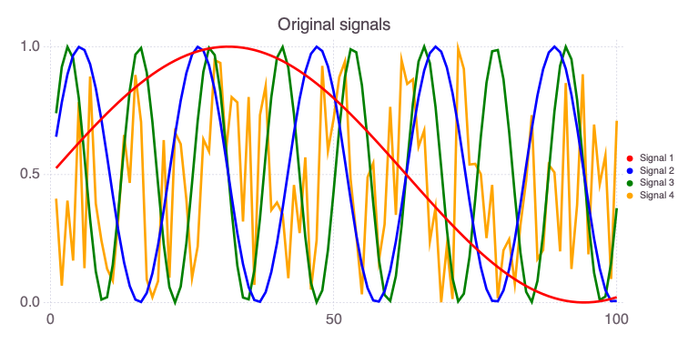
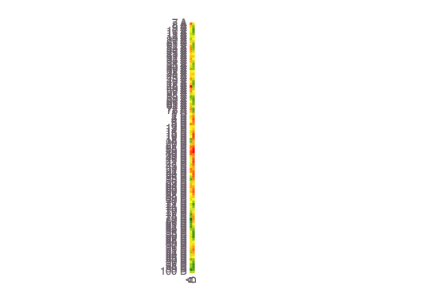
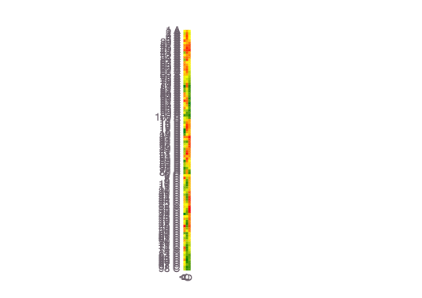
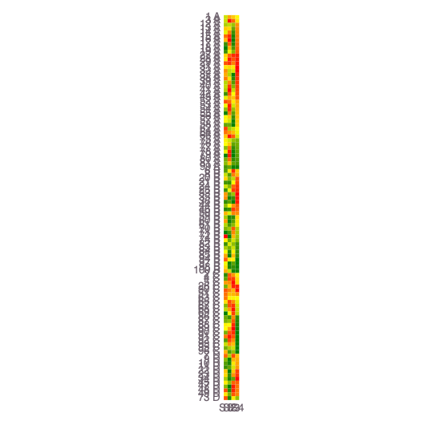
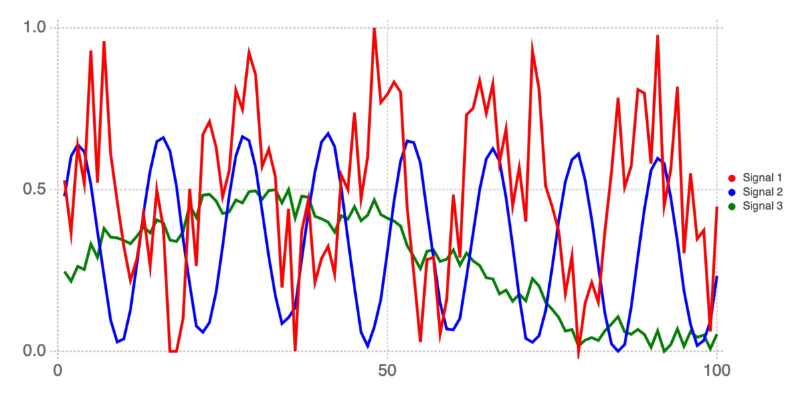
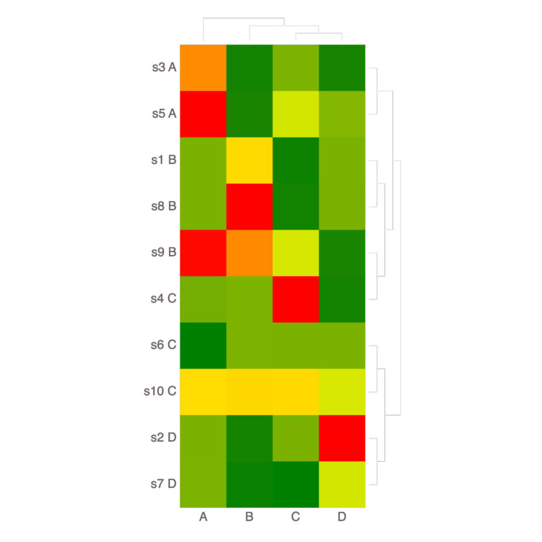

# NMFk: Feature extraction

<div style="text-align: left; padding-top: 30px; padding-bottom: 30px;">
    
</div>

**NMFk** is a code within our award winning [SmartTensors](https://github.com/SmartTensors) framework for unsupervised, supervised and physics-informed (scientific) machine learning (ML) and artificial intelligence (AI) ([web](https:///SmartTensors.com) [source](https://github.com/SmartTensors)).

<div style="text-align: left; padding-top: 30px; padding-bottom: 30px;">
    
</div>

**NMFk** performs Nonnegative Matrix Factorization with $k$-means clustering

An example problem demonstrating how **NMFk** can be applied to extract and classify features and sensors observing these mixed features.

This type of analysis is related to the **blind source separation** problem.

Applying **NMFk**, we can automatically:

- identify the number of the unknown mixed signatures in a dataset
- estimate the shape of the unknown mixed signatures
- estimate how the signatures are mixed at each sensor
- classify sensors based on how they observe (are impacted) the extracted features.

## Installation

If **NMFk** is not installed, first execute in the Julia REPL:

```julia
import Pkg
Pkg.add("NMFk")
Pkg.add("Mads")
Pkg.add("Cairo")
Pkg.add("Fontconfig")
Pkg.add("Gadfly")
```


```julia
import NMFk
import Mads
import Random
import Cairo
import Fontconfig
import Gadfly
```

## Problem setup

Let us generate 4 random signals with legnth of 100 (this can be considered as 100 ):


```julia
Random.seed!(2021)

s1 = (sin.(0.05:0.05:5) .+1) ./ 2
s2 = (sin.(0.3:0.3:30) .+ 1) ./ 2
s3 = (sin.(0.5:0.5:50) .+ 1) ./ 2
s4 = rand(100)
W = [s1 s2 s3 s4]
```


    100×4 Matrix{Float64}:
     0.52499      0.64776     0.739713    0.405796
     0.549917     0.782321    0.920735    0.0657738
     0.574719     0.891663    0.998747    0.398162
     0.599335     0.96602     0.954649    0.163816
     0.623702     0.998747    0.799236    0.783094
     0.64776      0.986924    0.57056     0.134115
     0.671449     0.931605    0.324608    0.883121
     0.694709     0.837732    0.121599    0.386875
     0.717483     0.71369     0.0112349   0.242105
     0.739713     0.57056     0.0205379   0.131588
     ⋮
     0.0031545    0.812189    0.950894    0.130975
     0.000972781  0.682826    0.792098    0.381099
     3.83712e-5   0.537133    0.561787    0.89211
     0.000353606  0.388122    0.316347    0.18814
     0.0019177    0.249105    0.115873    0.695555
     0.00472673   0.1325      0.00944578  0.462331
     0.00877369   0.0487227   0.0231237   0.574861
     0.0140485    0.00525646  0.153558    0.0919372
     0.0205379    0.00598419  0.368813    0.710313


The singals look like this:


```julia
Mads.plotseries(W)
```


Now we can mix the signals in matrix `W` to produce a data matrix `X` representing data collected at 10 sensors (e.g., measurement devices or wells at different locations).

Each of the 10 sensors is observing some mixture of the 4 signals in `W`.

The way the 4 signals are mixed at the sensors is represented by the mixing matrix `H`.

Let us define the mixing matrix `H` as:


```julia
H = [1 5 0 0 1 1 2 1 0 2; 0 1 1 5 2 1 0 0 2 3; 3 0 0 1 0 1 0 5 4 3; 1 1 4 1 5 0 1 1 5 3]
```


    4×10 Matrix{Int64}:
     1  5  0  0  1  1  2  1  0  2
     0  1  1  5  2  1  0  0  2  3
     3  0  0  1  0  1  0  5  4  3
     1  1  4  1  5  0  1  1  5  3


Each column of the `H` matrix defines how the 3 signals are represented in each sensors.

For example, the first sensor (column 1 above) detects only Signals 1 and 3; Signal 2 is missing because `H[2,1]` is equal to zero.

The second sensor (column 2 above) detects Signals 1, 2 and 4; Signal 3 is missing because `H[3,2]` is equal to zero.

The entries of `H` matrix also define the proportions at which the signals are mixed.

For example, the first sensor (column 1 above) detects Signal 3 times stronger than Signals 1 and 4.

The data matrix `X` is formed by multiplying `W` and `H` matrices. `X` defines the actual data observed.


```julia
X = W * H
```


    100×10 Matrix{Float64}:
     3.14992   3.6785    2.27095   4.38431   …  4.62935   6.28335  6.42979
     3.3779    3.59768   1.04542   4.89812      5.21937   5.57645  6.40633
     3.96912   4.16342   2.48431   5.85523      5.96662   7.76913  8.01516
     3.6271    4.12651   1.62128   5.94856      5.53639   6.56971  7.45212
     3.8045    4.90035   4.13112   6.57607      5.40298   9.10991  8.99064
     2.49356   4.35984   1.52339   5.63929   …  3.63468   4.92666  6.37032
     2.52839   5.17197   4.46409   5.86575      3.17761   7.57725  7.7609
     1.44638   4.69815   2.38523   4.69713      1.68958   4.09623  5.42803
     0.993292  4.54321   1.68211   3.82179      1.01576   2.68284  4.33605
     0.932914  4.40071   1.09691   3.00493      0.97399   1.88121  3.64748
     ⋮                                       ⋱
     2.98681   0.958936  1.33609   5.14281      4.8886    6.08283  5.68848
     2.75837   1.06879   2.20722   4.58733      4.34256   6.43954  5.57002
     2.57751   1.42943   4.10557   4.13956      3.70108   7.78196  5.97316
     1.13754   0.57803   1.14068   2.4451       1.77023   2.98233  2.67853
     1.04509   0.954249  3.03132   2.05695   …  1.27684   4.43948  3.18543
     0.495395  0.618465  1.98183   1.13428      0.514287  2.61444  1.82229
     0.653006  0.667452  2.34817   0.841598     0.699253  3.06425  1.95767
     0.566658  0.167436  0.373005  0.271777     0.873773  1.08443  0.780351
     1.83729   0.818987  2.84724   1.10905      2.57491   5.03879  3.29641


The data matrix `X` looks like this:


```julia
Mads.plotseries(X; name="Sensors")
```


## Execution

Now, we can assume that we only know the data matrix `X` and the `W` and `H` matrices are unknown.

We can execute **NMFk** and analyze the data matrix `X`.

**NMFk** will automatically:

- identify the number of the unknown mixed signals in `X`
- estimate the shape of the unknown mixed signals (i.e., estimate the entries of `W` matrix)
- estimate how the signals are mixed at the 5 sensors (i.e., estimate the entries of `H` matrix)

This can be done based only on the information in `X`:


```julia
nkrange=2:10
We, He, fitquality, robustness, aic, kopt = NMFk.execute(X, nkrange; save=false, method=:simple);
```


    OF: min 563.4561839705091 max 571.0956047569299 mean 566.1096913459744 std 2.5162024019835187
    Worst correlation by columns: 0.204840178904257
    Worst correlation by rows: 0.6730840865506231
    Worst covariance by columns: 0.07619556361296793
    Worst covariance by rows: 0.3177632870362544
    Worst norm by columns: 0.2062783776100441
    Worst norm by rows: 0.5879052371885953
    Signals:  2 Fit:     563.4562 Silhouette:    0.9961238 AIC:    -133.6657 Signal order: [1, 2]

    OF: min 205.10453576810346 max 205.44013709359942 mean 205.2558183299092 std 0.10764194146505947
    Worst correlation by columns: 0.765756624884207
    Worst correlation by rows: 0.8221459244824038
    Worst covariance by columns: 0.09620742799039032
    Worst covariance by rows: 0.3340068356918061
    Worst norm by columns: 0.20481267664903935
    Worst norm by rows: 0.7412498027521249
    Signals:  3 Fit:     205.1045 Silhouette:    0.9877389 AIC:    -924.2355 Signal order: [3, 2, 1]

    OF: min 0.02606110346539826 max 0.3285930894206071 mean 0.08570976712343938 std 0.09054762017310256
    Worst correlation by columns: 0.9998437470148135
    Worst correlation by rows: 0.9999635107298314
    Worst covariance by columns: 0.11034854993765787
    Worst covariance by rows: 0.41019527264737216
    Worst norm by columns: 0.6303363471078243
    Worst norm by rows: 0.5079941550602866
    Signals:  4 Fit:    0.0260611 Silhouette:    0.9951292 AIC:    -9675.067 Signal order: [4, 3, 2, 1]

    OF: min 0.019296683745481904 max 0.1313755817852479 mean 0.05983435689746689 std 0.03358572465839549
    Worst correlation by columns: 0.9999051870218388
    Worst correlation by rows: 0.9999840409655578
    Worst covariance by columns: 0.11049073449732591
    Worst covariance by rows: 0.41076142701552415
    Worst norm by columns: 0.6614805465202735
    Worst norm by rows: 0.5400392690140969
    Signals:  5 Fit:   0.01929668 Silhouette:   -0.6128532 AIC:    -9755.577 Signal order: [5, 3, 4, 1, 2]

    OF: min 0.006752373216074524 max 0.20286975450972983 mean 0.04849374109403328 std 0.05784790835383283
    Worst correlation by columns: 0.9999482835876661
    Worst correlation by rows: 0.9999956205669132
    Worst covariance by columns: 0.11043103874232613
    Worst covariance by rows: 0.41155827502729214
    Worst norm by columns: 0.8228221042701841
    Worst norm by rows: 0.5518600983174698
    Signals:  6 Fit:  0.006752373 Silhouette:    -0.612744 AIC:    -10585.62 Signal order: [4, 3, 1, 5, 6, 2]

    OF: min 0.0062303074161237084 max 0.04561774488510166 mean 0.021946059024547167 std 0.015762068323271657
    Worst correlation by columns: 0.999994988539508
    Worst correlation by rows: 0.9999881902662511
    Worst covariance by columns: 0.11044002227515037
    Worst covariance by rows: 0.4118196452194747
    Worst norm by columns: 0.3372663940462135
    Worst norm by rows: 0.4914608900380674
    Signals:  7 Fit:  0.006230307 Silhouette:   -0.7747081 AIC:    -10446.08 Signal order: [6, 3, 4, 7, 2, 1, 5]

    OF: min 0.0042567264451076345 max 0.04851942247626621 mean 0.02038527154156753 std 0.01431645314970248
    Worst correlation by columns: 0.9999933466928541
    Worst correlation by rows: 0.9999944996671574
    Worst covariance by columns: 0.11043873478859806
    Worst covariance by rows: 0.41165807364380347
    Worst norm by columns: 0.2545539225774592
    Worst norm by rows: 0.6718079734504087
    Signals:  8 Fit:  0.004256726 Silhouette:   -0.6025868 AIC:    -10607.01 Signal order: [6, 8, 2, 4, 1, 7, 5, 3]

    OF: min 0.009267875446144248 max 0.046369482106464036 mean 0.022308192866677068 std 0.012614940493108956
    Worst correlation by columns: 0.9999818984769164
    Worst correlation by rows: 0.9999732994493604
    Worst covariance by columns: 0.11042200672761357
    Worst covariance by rows: 0.4118426897347687
    Worst norm by columns: 0.35746086744005723
    Worst norm by rows: 0.5555803324415174
    Signals:  9 Fit:  0.009267875 Silhouette:   -0.5954714 AIC:    -9608.956 Signal order: [2, 6, 3, 7, 1, 9, 8, 4, 5]

    OF: min 0.00495255180583985 max 0.018638566799673423 mean 0.012368759426061797 std 0.004788607734740136
    Worst correlation by columns: 0.9999939099851183
    Worst correlation by rows: 0.9999949650207964
    Worst covariance by columns: 0.11040647577170468
    Worst covariance by rows: 0.4117908021372535
    Worst norm by columns: 0.2926290979379814
    Worst norm by rows: 0.6303501719023523
    Signals: 10 Fit:  0.004952552 Silhouette:   -0.6026156 AIC:    -10015.61 Signal order: [1, 7, 9, 3, 2, 10, 6, 4, 5, 8]
    Signals:  2 Fit:     563.4562 Silhouette:    0.9961238 AIC:    -133.6657
    Signals:  3 Fit:     205.1045 Silhouette:    0.9877389 AIC:    -924.2355
    Signals:  4 Fit:    0.0260611 Silhouette:    0.9951292 AIC:    -9675.067
    Signals:  5 Fit:   0.01929668 Silhouette:   -0.6128532 AIC:    -9755.577
    Signals:  6 Fit:  0.006752373 Silhouette:    -0.612744 AIC:    -10585.62
    Signals:  7 Fit:  0.006230307 Silhouette:   -0.7747081 AIC:    -10446.08
    Signals:  8 Fit:  0.004256726 Silhouette:   -0.6025868 AIC:    -10607.01
    Signals:  9 Fit:  0.009267875 Silhouette:   -0.5954714 AIC:    -9608.956
    Signals: 10 Fit:  0.004952552 Silhouette:   -0.6026156 AIC:    -10015.61
    ┌ Info: Results
    └ @ NMFk /Users/vvv/.julia/dev/NMFk/src/NMFkExecute.jl:15
    ┌ Info: Optimal solution: 4 signals
    └ @ NMFk /Users/vvv/.julia/dev/NMFk/src/NMFkExecute.jl:23


## Results

**NMFk** returns the estimated optimal number of signals `kopt` which in this case, as expected, is equal to 4.

A plot of the fit and the robustness is shown below:


```julia
NMFk.plot_feature_selecton(nkrange, fitquality, robustness)
```


Acceptable (underfitting) solutions:


```julia
NMFk.getks(nkrange, robustness[nkrange])
```


    3-element Vector{Int64}:
     2
     3
     4


**NMFk** also returns estimates of matrices `W` and `H`.

Here the estimates of matrices W and H are stored as `We` and `He` objects.

`We[kopt]` and `He[kopt]` are scaled versions of the original `W` and `H` matrices:


```julia
We[kopt]
```


    100×4 Matrix{Float64}:
      8.35984   12.8513     9.8499     6.98288
      0.882809  15.9778    11.8127     7.30996
      8.08025   17.3301    13.5455     7.62872
      2.98001   16.5393    14.6198     7.97546
     16.4947    13.8386    15.2631     8.30801
      2.43144    9.82891   14.9337     8.6807
     18.8057     5.57065   14.2667     9.00687
      8.06176    2.03126   12.7232     9.35944
      4.94977    0.115306  10.7992     9.68569
      2.53534    0.315878   8.59067    9.97687
      ⋮
      2.44801   16.4477    12.3748     3.18961e-15
      7.95672   13.7045    10.4437     3.61166e-11
     19.1721     9.71597    8.34621    2.1087e-7
      3.95505    5.44963    5.93872    3.1738e-8
     15.1073     1.98462    3.94022    0.00145974
     10.0749     0.145647   2.11313    0.0470913
     12.5492     0.395428   0.858563   0.0817772
      1.94723    2.68436    0.0975339  0.165447
     15.3501     6.4465     0.260951   0.19591


```julia
He[kopt]
```


    4×10 Matrix{Float64}:
     0.0457141   0.0456666   0.183246    …  0.0455059  0.227846    0.135591
     0.173145    0.00390684  0.003374       0.28775    0.233158    0.175627
     0.00244652  0.0645862   0.066335       0.0039405  0.135276    0.19962
     0.0743214   0.373864    0.00599197     0.0734625  0.00697259  0.153705


The extracted signals are ordered by their expected importance.

The most dominant is the first signal, which is captured by Column 1 of `We[kopt]` and Row 1 of `He[kopt]`.

The least dominant is the third (last) signal, which is captured by Column 3 of `We[kopt]` and Row 3 of `He[kopt]`.

Note that the order of columns ('signals') in `W` and `We[kopt]` are not expected to match.

In the same way, the order of rows ('sensors') in `H` and `He[kopt]` are also not expected to match.

In general, the estimated order of 'signals' may be slightly different every time the code is executed due to randomness of the processes.

Below are plots providing comparisons between the original and estimated `W` an `H` matrices.


A plot of the original signals:


```julia
Mads.plotseries(W; title="Original signals")
```





A plot of the reconstructed signals:


```julia
Mads.plotseries(We[kopt] ./ maximum(We[kopt]; dims=1); title="Reconstructed signals")
```


A plot of the original mixing matrix:


```julia
NMFk.plotmatrix(H ./ maximum(H; dims=2); title="Original mixing matrix")
```


A plot of the reconstructed mixing matrix:


```julia
NMFk.plotmatrix(He[kopt] ./ maximum(He[kopt]; dims=2); title="Reconstructed mixing matrix")
```


Figures above demonstrate the accurate reconstruction of the original `W` and `H` matrices.

**NMFk** results can be further analyzed as demonstrated below:


```julia
NMFk.clusterresults(NMFk.getks(nkrange, robustness[nkrange]), We, He, collect(1:100), "s" .* string.(collect(1:10)); Wcasefilename="times", Hcasefilename="sensors", plottimeseries=:W, biplotcolor=:WH, sortmag=false, biplotlabel=:H, point_size_nolabel=2Gadfly.pt, point_size_label=4Gadfly.pt)
```

    ┌ Info: Number of signals: 2
    └ @ NMFk /Users/vvv/.julia/dev/NMFk/src/NMFkPostprocess.jl:205
    ┌ Info: Sensors (signals=2)
    └ @ NMFk /Users/vvv/.julia/dev/NMFk/src/NMFkPostprocess.jl:209
    ┌ Warning: type Clustering.KmeansResult{Core.Array{Core.Float64,2},Core.Float64,Core.Int64} not present in workspace; reconstructing
    └ @ JLD /Users/vvv/.julia/packages/JLD/JHrZe/src/jld_types.jl:697
    ┌ Info: Robust k-means analysis results are loaded from file ./Hmatrix-2-2_10-1000.jld!
    └ @ NMFk /Users/vvv/.julia/dev/NMFk/src/NMFkCluster.jl:67
    ┌ Warning: Procedure to find unique signals could not identify a solution ...
    └ @ NMFk /Users/vvv/.julia/dev/NMFk/src/NMFkCluster.jl:158
    ┌ Warning: Procedure to find unique signals could not identify a solution ...
    └ @ NMFk /Users/vvv/.julia/dev/NMFk/src/NMFkCluster.jl:158
    ┌ Warning: type Clustering.KmeansResult{Core.Array{Core.Float64,2},Core.Float64,Core.Int64} not present in workspace; reconstructing
    └ @ JLD /Users/vvv/.julia/packages/JLD/JHrZe/src/jld_types.jl:697
    ┌ Info: Robust k-means analysis results are loaded from file ./Wmatrix-2-2_100-1000.jld!
    └ @ NMFk /Users/vvv/.julia/dev/NMFk/src/NMFkCluster.jl:67
    ┌ Warning: Procedure to find unique signals could not identify a solution ...
    └ @ NMFk /Users/vvv/.julia/dev/NMFk/src/NMFkCluster.jl:158
    ┌ Info: Signal B -> A Count: 2
    └ @ NMFk /Users/vvv/.julia/dev/NMFk/src/NMFkPostprocess.jl:316


    2×2 Matrix{Any}:
     "s2"  0.816528
     "s7"  0.34415


    ┌ Info: Signal A -> B Count: 8
    └ @ NMFk /Users/vvv/.julia/dev/NMFk/src/NMFkPostprocess.jl:316
    ┌ Info: Signal A (S1) (k-means clustering)
    └ @ NMFk /Users/vvv/.julia/dev/NMFk/src/NMFkPostprocess.jl:333


    8×2 Matrix{Any}:
     "s8"   1.0
     "s9"   0.765652
     "s10"  0.664984
     "s1"   0.620243
     "s6"   0.235877
     "s4"   0.183688
     "s5"   0.0471445
     "s3"   0.00955952


    ┌ Info: Signal B (S2) (k-means clustering)
    └ @ NMFk /Users/vvv/.julia/dev/NMFk/src/NMFkPostprocess.jl:333


    36×2 Matrix{Float64}:
     48.0  1.0
      7.0  0.90646
     50.0  0.811182
     23.0  0.80957
     49.0  0.80668
     45.0  0.799657
     72.0  0.792193
     22.0  0.781473
     32.0  0.75111
     24.0  0.738339
      ⋮
     34.0  0.437807
     12.0  0.422768
     57.0  0.397088
     61.0  0.3737
     11.0  0.36556
     59.0  0.298814
     19.0  0.298337
     36.0  0.257546
     58.0  0.214994


    ┌ Info: Times (signals=2)
    └ @ NMFk /Users/vvv/.julia/dev/NMFk/src/NMFkPostprocess.jl:391
    ┌ Info: Signal A (S2) Count: 64
    └ @ NMFk /Users/vvv/.julia/dev/NMFk/src/NMFkPostprocess.jl:404
    ┌ Info: Signal B (S1) Count: 36
    └ @ NMFk /Users/vvv/.julia/dev/NMFk/src/NMFkPostprocess.jl:404
    ┌ Info: Signal B -> A Count: 36
    └ @ NMFk /Users/vvv/.julia/dev/NMFk/src/NMFkPostprocess.jl:414
    ┌ Info: Signal A -> B Count: 64
    └ @ NMFk /Users/vvv/.julia/dev/NMFk/src/NMFkPostprocess.jl:414
    ┌ Info: Signal A (remapped k-means clustering)
    └ @ NMFk /Users/vvv/.julia/dev/NMFk/src/NMFkPostprocess.jl:429


    64×2 Matrix{Float64}:
     29.0  1.0
     28.0  0.994387
     41.0  0.966333
     16.0  0.954458
     15.0  0.947798
     40.0  0.932646
     53.0  0.932094
     27.0  0.923499
      3.0  0.920881
     66.0  0.916317
      ⋮
     83.0  0.19494
     96.0  0.168447
     99.0  0.124341
     71.0  0.109416
     84.0  0.0915553
     85.0  0.0873578
     98.0  0.0869121
     86.0  0.0792189
     97.0  0.0621416


    ┌ Info: Signal B (remapped k-means clustering)
    └ @ NMFk /Users/vvv/.julia/dev/NMFk/src/NMFkPostprocess.jl:429





    ┌ Info: Number of signals: 3
    └ @ NMFk /Users/vvv/.julia/dev/NMFk/src/NMFkPostprocess.jl:205
    ┌ Info: Sensors (signals=3)
    └ @ NMFk /Users/vvv/.julia/dev/NMFk/src/NMFkPostprocess.jl:209
    ┌ Warning: type Clustering.KmeansResult{Core.Array{Core.Float64,2},Core.Float64,Core.Int64} not present in workspace; reconstructing
    └ @ JLD /Users/vvv/.julia/packages/JLD/JHrZe/src/jld_types.jl:697
    ┌ Info: Robust k-means analysis results are loaded from file ./Hmatrix-3-3_10-1000.jld!
    └ @ NMFk /Users/vvv/.julia/dev/NMFk/src/NMFkCluster.jl:67
    ┌ Warning: Procedure to find unique signals could not identify a solution ...
    └ @ NMFk /Users/vvv/.julia/dev/NMFk/src/NMFkCluster.jl:158
    ┌ Warning: Procedure to find unique signals could not identify a solution ...
    └ @ NMFk /Users/vvv/.julia/dev/NMFk/src/NMFkCluster.jl:158
    ┌ Warning: Procedure to find unique signals could not identify a solution ...
    └ @ NMFk /Users/vvv/.julia/dev/NMFk/src/NMFkCluster.jl:158
    ┌ Warning: type Clustering.KmeansResult{Core.Array{Core.Float64,2},Core.Float64,Core.Int64} not present in workspace; reconstructing
    └ @ JLD /Users/vvv/.julia/packages/JLD/JHrZe/src/jld_types.jl:697


    3×2 Matrix{Any}:
     "s4"  0.961764
     "s5"  0.9239
     "s3"  0.675083


    5×2 Matrix{Any}:
     "s8"   1.0
     "s9"   0.804147
     "s10"  0.642766
     "s1"   0.60861
     "s6"   0.221175


    2×2 Matrix{Any}:
     "s2"  1.0
     "s7"  0.419145


    ┌ Info: Robust k-means analysis results are loaded from file ./Wmatrix-3-3_100-1000.jld!
    └ @ NMFk /Users/vvv/.julia/dev/NMFk/src/NMFkCluster.jl:67
    ┌ Warning: Procedure to find unique signals could not identify a solution ...
    └ @ NMFk /Users/vvv/.julia/dev/NMFk/src/NMFkCluster.jl:158
    ┌ Info: Signal B -> A Count: 3
    └ @ NMFk /Users/vvv/.julia/dev/NMFk/src/NMFkPostprocess.jl:316
    ┌ Info: Signal A -> B Count: 5
    └ @ NMFk /Users/vvv/.julia/dev/NMFk/src/NMFkPostprocess.jl:316
    ┌ Info: Signal C -> C Count: 2
    └ @ NMFk /Users/vvv/.julia/dev/NMFk/src/NMFkPostprocess.jl:316
    ┌ Info: Signal A (S1) (k-means clustering)
    └ @ NMFk /Users/vvv/.julia/dev/NMFk/src/NMFkPostprocess.jl:333
    ┌ Info: Signal B (S2) (k-means clustering)
    └ @ NMFk /Users/vvv/.julia/dev/NMFk/src/NMFkPostprocess.jl:333
    ┌ Info: Signal C (S3) (k-means clustering)
    └ @ NMFk /Users/vvv/.julia/dev/NMFk/src/NMFkPostprocess.jl:333


    37×2 Matrix{Float64}:
     91.0  0.977447
      5.0  0.929754
     29.0  0.923258
     64.0  0.836318
     66.0  0.827266
     94.0  0.817911
     88.0  0.809029
     27.0  0.807474
     52.0  0.801024
     89.0  0.797584
      ⋮
      2.0  0.366794
     95.0  0.303642
     78.0  0.294368
     54.0  0.240205
     42.0  0.237622
     81.0  0.212876
     82.0  0.151576
     99.0  0.061458
     79.0  0.0


    23×2 Matrix{Float64}:
     41.0  1.0
     16.0  0.98127
     53.0  0.966055
     15.0  0.963061
     40.0  0.961342
     17.0  0.919987
     55.0  0.865718
     30.0  0.844847
     14.0  0.829076
     39.0  0.823647
      ⋮
     56.0  0.642863
     31.0  0.642328
     13.0  0.638229
     38.0  0.638226
     19.0  0.516139
     57.0  0.42853
     37.0  0.424425
     58.0  0.221269
     34.0  0.127527


    40×2 Matrix{Float64}:
     35.0  1.0
     33.0  0.999454
     32.0  0.993931
     23.0  0.970644
     22.0  0.965673
     48.0  0.936445
     24.0  0.930074
     20.0  0.903684
     45.0  0.893843
     25.0  0.852064
      ⋮
     71.0  0.312965
     74.0  0.303642
     85.0  0.214224
     84.0  0.168959
     83.0  0.126965
     86.0  0.120085
     87.0  0.10552
     98.0  0.100582
     97.0  0.0865212


    ┌ Info: Times (signals=3)
    └ @ NMFk /Users/vvv/.julia/dev/NMFk/src/NMFkPostprocess.jl:391
    ┌ Info: Signal A (S3) Count: 40
    └ @ NMFk /Users/vvv/.julia/dev/NMFk/src/NMFkPostprocess.jl:404
    ┌ Info: Signal B (S1) Count: 37
    └ @ NMFk /Users/vvv/.julia/dev/NMFk/src/NMFkPostprocess.jl:404
    ┌ Info: Signal C (S2) Count: 23
    └ @ NMFk /Users/vvv/.julia/dev/NMFk/src/NMFkPostprocess.jl:404
    ┌ Info: Signal B -> A Count: 37
    └ @ NMFk /Users/vvv/.julia/dev/NMFk/src/NMFkPostprocess.jl:414
    ┌ Info: Signal C -> B Count: 23
    └ @ NMFk /Users/vvv/.julia/dev/NMFk/src/NMFkPostprocess.jl:414
    ┌ Info: Signal A -> C Count: 40
    └ @ NMFk /Users/vvv/.julia/dev/NMFk/src/NMFkPostprocess.jl:414
    ┌ Info: Signal A (remapped k-means clustering)
    └ @ NMFk /Users/vvv/.julia/dev/NMFk/src/NMFkPostprocess.jl:429
    ┌ Info: Signal B (remapped k-means clustering)
    └ @ NMFk /Users/vvv/.julia/dev/NMFk/src/NMFkPostprocess.jl:429
    ┌ Info: Signal C (remapped k-means clustering)
    └ @ NMFk /Users/vvv/.julia/dev/NMFk/src/NMFkPostprocess.jl:429





    ┌ Info: Number of signals: 4
    └ @ NMFk /Users/vvv/.julia/dev/NMFk/src/NMFkPostprocess.jl:205
    ┌ Info: Sensors (signals=4)
    └ @ NMFk /Users/vvv/.julia/dev/NMFk/src/NMFkPostprocess.jl:209
    ┌ Warning: type Clustering.KmeansResult{Core.Array{Core.Float64,2},Core.Float64,Core.Int64} not present in workspace; reconstructing
    └ @ JLD /Users/vvv/.julia/packages/JLD/JHrZe/src/jld_types.jl:697
    ┌ Info: Robust k-means analysis results are loaded from file ./Hmatrix-4-4_10-1000.jld!
    └ @ NMFk /Users/vvv/.julia/dev/NMFk/src/NMFkCluster.jl:67


    2×2 Matrix{Any}:
     "s5"  1.0
     "s3"  0.802067


    3×2 Matrix{Any}:
     "s8"  1.0
     "s9"  0.810281
     "s1"  0.60172


    3×2 Matrix{Any}:
     "s4"   1.0
     "s10"  0.605222
     "s6"   0.199823


    2×2 Matrix{Any}:
     "s2"  1.0
     "s7"  0.401176


    ┌ Warning: Procedure to find unique signals could not identify a solution ...
    └ @ NMFk /Users/vvv/.julia/dev/NMFk/src/NMFkCluster.jl:158
    ┌ Warning: Procedure to find unique signals could not identify a solution ...
    └ @ NMFk /Users/vvv/.julia/dev/NMFk/src/NMFkCluster.jl:158
    ┌ Warning: Procedure to find unique signals could not identify a solution ...
    └ @ NMFk /Users/vvv/.julia/dev/NMFk/src/NMFkCluster.jl:158
    ┌ Warning: Procedure to find unique signals could not identify a solution ...
    └ @ NMFk /Users/vvv/.julia/dev/NMFk/src/NMFkCluster.jl:158
    ┌ Warning: type Clustering.KmeansResult{Core.Array{Core.Float64,2},Core.Float64,Core.Int64} not present in workspace; reconstructing
    └ @ JLD /Users/vvv/.julia/packages/JLD/JHrZe/src/jld_types.jl:697
    ┌ Info: Robust k-means analysis results are loaded from file ./Wmatrix-4-4_100-1000.jld!
    └ @ NMFk /Users/vvv/.julia/dev/NMFk/src/NMFkCluster.jl:67
    ┌ Info: Signal D -> A Count: 2
    └ @ NMFk /Users/vvv/.julia/dev/NMFk/src/NMFkPostprocess.jl:316
    ┌ Info: Signal A -> B Count: 3
    └ @ NMFk /Users/vvv/.julia/dev/NMFk/src/NMFkPostprocess.jl:316
    ┌ Info: Signal B -> C Count: 3
    └ @ NMFk /Users/vvv/.julia/dev/NMFk/src/NMFkPostprocess.jl:316
    ┌ Info: Signal C -> D Count: 2
    └ @ NMFk /Users/vvv/.julia/dev/NMFk/src/NMFkPostprocess.jl:316
    ┌ Info: Signal A (S1) (k-means clustering)
    └ @ NMFk /Users/vvv/.julia/dev/NMFk/src/NMFkPostprocess.jl:333
    ┌ Info: Signal B (S2) (k-means clustering)
    └ @ NMFk /Users/vvv/.julia/dev/NMFk/src/NMFkPostprocess.jl:333
    ┌ Info: Signal C (S3) (k-means clustering)
    └ @ NMFk /Users/vvv/.julia/dev/NMFk/src/NMFkPostprocess.jl:333
    ┌ Info: Signal D (S4) (k-means clustering)
    └ @ NMFk /Users/vvv/.julia/dev/NMFk/src/NMFkPostprocess.jl:333


    12×2 Matrix{Float64}:
     73.0  0.921292
     48.0  0.920805
      7.0  0.877473
     22.0  0.655249
     23.0  0.608288
     49.0  0.581644
     45.0  0.553796
     34.0  0.302301
      9.0  0.230956
     47.0  0.22555
     10.0  0.118299
     11.0  0.0695206


    40×2 Matrix{Float64}:
     41.0  1.0
     16.0  0.999658
     66.0  0.992652
      3.0  0.992084
     28.0  0.99095
     53.0  0.989901
     79.0  0.989034
     78.0  0.982986
     54.0  0.979585
     15.0  0.974543
      ⋮
     19.0  0.464894
     75.0  0.400071
     57.0  0.3924
     12.0  0.362026
     32.0  0.358336
     37.0  0.33514
     62.0  0.298027
     58.0  0.171558
     99.0  0.15367


    21×2 Matrix{Float64}:
     89.0  1.0
      5.0  0.996169
     68.0  0.993815
     26.0  0.984241
     88.0  0.978007
     90.0  0.974038
     67.0  0.966074
      4.0  0.954186
     69.0  0.953466
     91.0  0.918523
      ⋮
     86.0  0.806738
     65.0  0.800517
      2.0  0.770976
     30.0  0.703892
     51.0  0.697919
     93.0  0.681621
     63.0  0.528743
     95.0  0.3876
     96.0  0.257164


    27×2 Matrix{Float64}:
      33.0  1.0
      35.0  0.993739
      36.0  0.99033
      25.0  0.977145
      24.0  0.970044
      21.0  0.938953
      20.0  0.921989
      44.0  0.905292
      46.0  0.879213
      50.0  0.799437
       ⋮
      74.0  0.234344
      82.0  0.0877105
      83.0  0.0760717
      84.0  0.0648747
      85.0  0.0522789
     100.0  0.0146202
      98.0  0.00610281
      97.0  0.0035143
      94.0  1.57367e-8





    ┌ Info: Times (signals=4)
    └ @ NMFk /Users/vvv/.julia/dev/NMFk/src/NMFkPostprocess.jl:391
    ┌ Info: Signal A (S2) Count: 40
    └ @ NMFk /Users/vvv/.julia/dev/NMFk/src/NMFkPostprocess.jl:404
    ┌ Info: Signal B (S4) Count: 27
    └ @ NMFk /Users/vvv/.julia/dev/NMFk/src/NMFkPostprocess.jl:404
    ┌ Info: Signal C (S3) Count: 21
    └ @ NMFk /Users/vvv/.julia/dev/NMFk/src/NMFkPostprocess.jl:404
    ┌ Info: Signal D (S1) Count: 12
    └ @ NMFk /Users/vvv/.julia/dev/NMFk/src/NMFkPostprocess.jl:404
    ┌ Info: Signal D -> A Count: 12
    └ @ NMFk /Users/vvv/.julia/dev/NMFk/src/NMFkPostprocess.jl:414
    ┌ Info: Signal A -> B Count: 40
    └ @ NMFk /Users/vvv/.julia/dev/NMFk/src/NMFkPostprocess.jl:414
    ┌ Info: Signal C -> C Count: 21
    └ @ NMFk /Users/vvv/.julia/dev/NMFk/src/NMFkPostprocess.jl:414
    ┌ Info: Signal B -> D Count: 27
    └ @ NMFk /Users/vvv/.julia/dev/NMFk/src/NMFkPostprocess.jl:414
    ┌ Info: Signal A (remapped k-means clustering)
    └ @ NMFk /Users/vvv/.julia/dev/NMFk/src/NMFkPostprocess.jl:429
    ┌ Info: Signal B (remapped k-means clustering)
    └ @ NMFk /Users/vvv/.julia/dev/NMFk/src/NMFkPostprocess.jl:429
    ┌ Info: Signal C (remapped k-means clustering)
    └ @ NMFk /Users/vvv/.julia/dev/NMFk/src/NMFkPostprocess.jl:429
    ┌ Info: Signal D (remapped k-means clustering)
    └ @ NMFk /Users/vvv/.julia/dev/NMFk/src/NMFkPostprocess.jl:429


    ([[1, 2], [1, 2, 3], [1, 2, 3, 4]], [['B', 'B', 'B', 'B', 'B', 'B', 'A', 'A', 'A', 'A'  …  'B', 'B', 'B', 'B', 'B', 'B', 'B', 'B', 'B', 'B'], ['A', 'A', 'A', 'A', 'A', 'C', 'C', 'C', 'C', 'C'  …  'A', 'A', 'A', 'A', 'A', 'A', 'C', 'C', 'A', 'A'], ['B', 'C', 'B', 'C', 'C', 'D', 'A', 'D', 'A', 'A'  …  'C', 'C', 'C', 'D', 'C', 'C', 'D', 'D', 'B', 'D']], [['B', 'A', 'B', 'B', 'B', 'B', 'A', 'B', 'B', 'B'], ['B', 'C', 'A', 'A', 'A', 'B', 'C', 'B', 'B', 'B'], ['B', 'D', 'A', 'C', 'A', 'C', 'D', 'B', 'B', 'C']])


The code above perform analyses of all the acceptable solutions.

These are solutions with number of extracted features equal to 2, 3, and 4.

The solution with 4 features is the optimal one.

The solutions for 2 and 3 features are underfitting but informative as well.

Extracted features based on the solutions for 2, 3, and 4 signals look like this:


```julia
for i = 2:4
	Mads.display("times-$i-timeseries.png")
end
```





The 10 sensors are grouped into 4 groups.

The sensor grouping is based on which of the 4 signals are mostly detected by the 4 sensors.

The sensor grouping is listed below:


```julia
Mads.display("sensors-4-groups.txt")
```

    Signal A (S1)
    s5 	1.0
    s3 	0.802

    Signal B (S2)
    s8 	1.0
    s9 	0.81
    s1 	0.602

    Signal C (S3)
    s4 	1.0
    s10	0.605
    s6 	0.2

    Signal D (S4)
    s2 	1.0
    s7 	0.401


This grouping is based on analyses of the attribute matrix `H` presented below.

The grouping process tries to pick up the most important signal observed by each sensor.

However, there are challenges when more than one signal is present.


```julia
Mads.display("sensors-4-labeled-sorted.png")
```


The clustering of the sensors into groups at the different levels of clsutering is visualized below:


```julia
Mads.display("sensors-4-labeled-sorted-dendrogram.png")

```





The biplots below show how the 4 extracted features are projecting the sensors and the timeseries data.

Here, the features are viewed as basis vectors spanning the sensor/time space.

Sensors located along the basis vectors (i.e., plot axes) are the most informative to characterize the data.

Temporal measurements along the plot axes are also the most important to represent the observed processes.


```julia
Mads.display("all-4-biplots-original.pdf")
```


